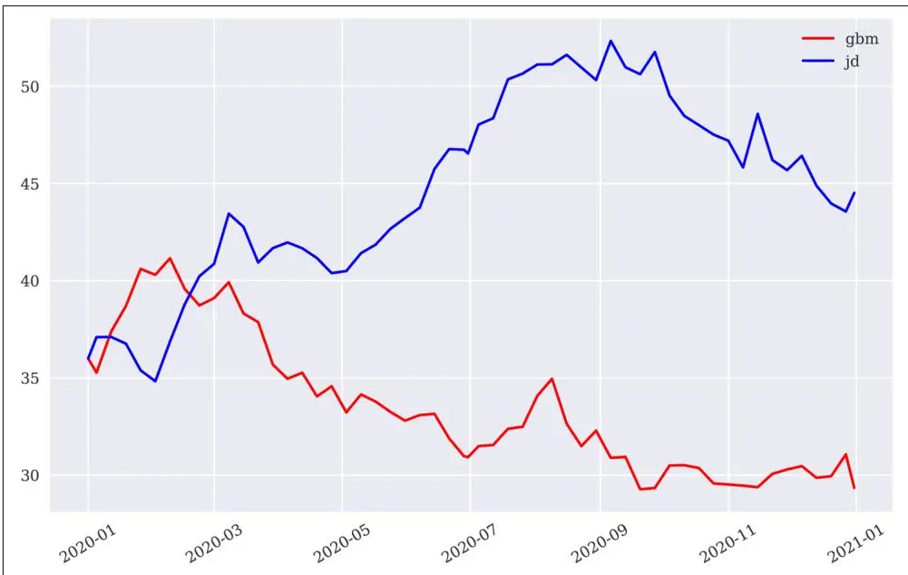
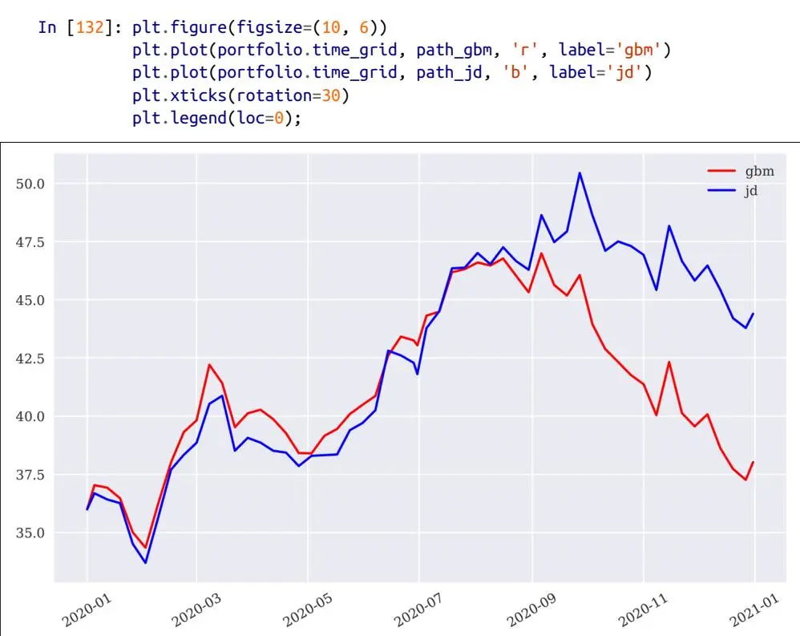
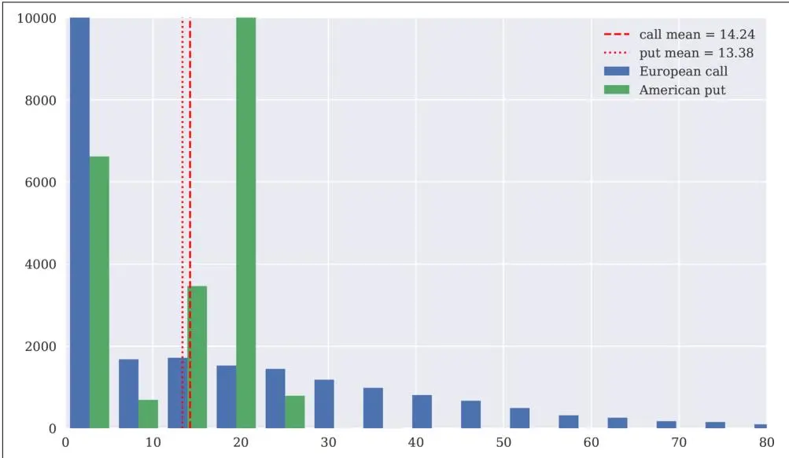
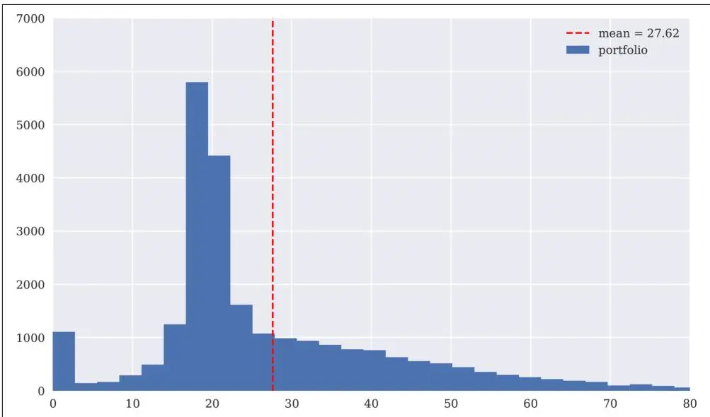

# 投资组合估值（Portfolio Valuation）


价格是你付出的，价值是你得到的。

—Warren Buffett


到目前为止，构建 DX 衍生品分析包的整体方法——及其相关优势——应该已经清晰了。通过严格依赖蒙特卡洛模拟作为唯一的数值方法，该方法实现了分析包的几乎完全模块化：

## 贴现（Discounting）

相关风险中性贴现由 dx.constant\_short\_rate 类的实例处理。

## 相关数据（Relevant data）

相关数据、参数和其他输入存储在（多个）dx.market\_environment 类的实例中。

## 模拟对象（Simulation objects）

相关风险因子（标的资产）被建模为三个模拟类之一的实例：

• dx.geometric\_brownian\_motion

• dx.jump\_diffusion

• dx.square\_root\_diffusion

## 估值对象（Valuation objects）

待估值的期权和衍生品被建模为两个估值类之一的实例：

• dx.valuation\_mcs\_european

• dx.valuation\_mcs\_american

还缺少最后一步：对可能复杂的期权和衍生品投资组合进行估值。为此，需要满足以下要求：

## 非冗余性（Nonredundancy）

每个风险因子（标的资产）仅被建模一次，并可能被多个估值对象使用。

## 相关性（Correlations）

必须考虑风险因子之间的相关性。

## 头寸（Positions）

例如，一个期权头寸由一定数量的期权合约组成。

然而，尽管原则上允许（甚至要求）为模拟和估值对象都提供货币，但以下代码假设投资组合仅以单一货币计价。这显著简化了投资组合内的价值聚合，因为可以抽象掉汇率和货币风险。

本章介绍了两个新类：一个用于建模单个衍生品头寸的简单类，和一个用于建模和估值衍生品投资组合的更复杂类。其结构如下：

"衍生品头寸" 第618页

本节介绍用于建模单个衍生品头寸的类。

"衍生品投资组合" 第622页

本节介绍用于估值可能包含多个衍生品头寸的投资组合的核心类。

## 衍生品头寸（Derivatives Positions）

原则上，衍生品头寸不过是一个估值对象和所建模工具的数量（quantity）的组合。

```python
#
### DX 包
#
### 投资组合 -- 衍生品头寸类
#
**derivatives_position.py**
#


#
class derivatives_position(object):
    ''' 对衍生品头寸进行建模的类。

    属性（Attributes）
    ========
    name: str
        对象名称
    quantity: float
        构成该头寸的资产/衍生品数量
    underlying: str
        衍生品标的资产/风险因子的名称
    mar_env: instance of market_environment
        与估值类相关的常数、列表和曲线
    otype: str
        要使用的估值类
    payoff_func: str
        衍生品的收益字符串

    方法（Methods）
    ========
    get_info:
        打印关于衍生品头寸的信息
    '''

    def __init__(self, name, quantity, underlying, mar_env,
                 otype, payoff_func):
        self.name = name
        self.quantity = quantity
        self.underlying = underlying
        self.mar_env = mar_env
        self.otype = otype
        self.payoff_func = payoff_func
```

### 类（The Class）

以下代码展示了用于建模衍生品头寸的类。它主要是一个数据和对象的容器。此外，它提供了一个 get\_info() 方法，打印存储在类实例中的数据和对象信息：

```python
    def get_info(self):
        print('名称（NAME）')
        print(self.name, '\n')
        print('数量（QUANTITY）')
        print(self.quantity, '\n')
        print('标的资产（UNDERLYING）')
        print(self.underlying, '\n')
        print('市场环境（MARKET ENVIRONMENT）')
        print('\n**常数（Constants）**')
        for key, value in self.mar_env.constants.items():
            print(key, value)
        print('\n**列表（Lists）**')
        for key, value in self.mar_env.lists.items():
            print(key, value)
        print('\n**曲线（Curves）**')
        for key in self.mar_env.curves.items():
            print(key, value)
        print('\n期权类型（OPTION TYPE）')
        print(self.otype, '\n')
        print('收益函数（PAYOFF FUNCTION）')
        print(self.payoff_func)
```

定义衍生品头寸需要以下信息，这与实例化估值类所需的信息几乎相同：

**name** 作为 str 对象的头寸名称

**quantity** 期权/衍生品的数量

**underlying** 作为风险因子的模拟对象实例

**mar\_env** dx.market\_environment 的实例

**otype** str，可以是 "European" 或 "American"

**payoff\_func** 作为 Python str 对象的收益函数

### 一个使用案例（A Use Case）

以下交互式会话说明了该类的使用。然而，首先需要定义一个模拟对象（但不需要完整定义；只需要最重要的、对象特定的信息）：

```python
In [99]: from dx_valuation import *

In [100]: me_gbm = market_environment('me_gbm', dt.datetime(2020, 1, 1))  # ①

In [101]: me_gbm.add_constant('initial_value', 36.)  # ①
    me_gbm.add_constant('volatility', 0.2)  # ①
    me_gbm.add_constant('currency', 'EUR')  # ①

In [102]: me_gbm.add_constant('model', 'gbm')  # ② 此处需要指定模型类型
```

类似地，定义衍生品头寸时，不需要一个"完整的" dx.market\_environment 对象。缺失的信息会在稍后（投资组合估值期间）实例化模拟对象时提供：

```python
In [103]: from derivatives_position import derivatives_position

In [104]: me_am_put = market_environment('me_am_put', dt.datetime(2020, 1, 1))  # ①

In [105]: me_am_put.add_constant('maturity', dt.datetime(2020, 12, 31))  # ①
    me_am_put.add_constant('strike', 40.)  # ①
    me_am_put.add_constant('currency', 'EUR')  # ①

In [106]: payoff_func = 'np.maximum(strike - instrument_values, 0)'  # ②

In [107]: am_put_pos = derivatives_position(
    name='am_put_pos',
    quantity=3,
    underlying='gbm',
    mar_env=me_am_put,
    otype='American',
    payoff_func=payoff_func)  # ③ 实例化 derivatives_position 对象

In [108]: am_put_pos.get_info()
    NAME
    am_put_pos

    QUANTITY
    3

    UNDERLYING
    gbm

    MARKET ENVIRONMENT

    **Constants**
    maturity 2020-12-31 00:00:00
    strike 40.0
    currency EUR

    **Lists**

    **Curves**

    OPTION TYPE
    American

    PAYOFF FUNCTION
    np.maximum(strike - instrument_values, 0)
```

## 衍生品投资组合（Derivatives Portfolios）

从投资组合的角度来看，相关市场主要由相关风险因子（标的资产）及其相关性，以及待估值的衍生品和衍生品头寸组成。从理论上讲，下面的分析现在涉及[第17章](ch17.md)中定义的一般市场模型 ℳ，并将资产定价基本定理（及其推论）应用于该模型。<sup>1</sup>

### 类（The Class）

接下来是一个相对复杂的 Python 类，它基于资产定价基本定理实现了投资组合估值——考虑了多个相关风险因子和多个衍生品头寸。该类有内联文档，特别是在实现特定功能的段落中：

```python
#
# DX 包
#
# 投资组合 -- 衍生品投资组合类
#
# derivatives_portfolio.py
#
# Python for Finance, 2nd ed.
# (c) Dr. Yves J. Hilpisch
#

import numpy as np
import pandas as pd

from dx_valuation import *

# 可用于风险因子建模的模型
models = {'gbm': geometric_brownian_motion,
          'jd': jump_diffusion,
          'srd': square_root_diffusion}

# 允许的行权类型
otypes = {'European': valuation_mcs_european,
          'American': valuation_mcs_american}

class derivatives_portfolio(object):
    ''' 对衍生品头寸投资组合进行建模和估值的类

    属性（Attributes）
    ========
    name: str
        对象名称
    positions: dict
        头寸字典（derivatives_position 类的实例）
    val_env: market_environment
        用于估值的市场环境
    assets: dict
        资产的市场环境字典
    correlations: list
        资产之间的相关性
    fixed_seed: bool
        是否固定随机数生成器种子

    方法（Methods）
    ========
    get_positions:
        打印单个投资组合头寸的信息
    get_statistics:
        返回包含投资组合统计数据的 pandas DataFrame 对象
    '''

    def __init__(self, name, positions, val_env, assets,
                 correlations=None, fixed_seed=False):
        self.name = name
        self.positions = positions
        self.val_env = val_env
        self.assets = assets
        self.underlyings = set()
        self.correlations = correlations
        self.time_grid = None
        self.underlying_objects = {}
        self.valuation_objects = {}
        self.fixed_seed = fixed_seed
        self.special_dates = []
        for pos in self.positions:
            # 确定最早的起始日期
            self.val_env.constants['starting_date'] = \
                min(self.val_env.constants['starting_date'],
                    positions[pos].mar_env.pricing_date)
            # 确定最晚的相关日期
            self.val_env.constants['final_date'] = \
                max(self.val_env.constants['final_date'],
                    positions[pos].mar_env.constants['maturity'])
            # 收集所有标的资产并添加到集合中（避免冗余）
            self.underlyings.add(positions[pos].underlying)

        # 生成通用时间网格
        start = self.val_env.constants['starting_date']
        end = self.val_env.constants['final_date']
        time_grid = pd.date_range(start=start, end=end,
                                  freq=self.val_env.constants['frequency']
                                  ).to_pydatetime()
        time_grid = list(time_grid)
        for pos in self.positions:
            maturity_date = positions[pos].mar_env.constants['maturity']
            if maturity_date not in time_grid:
                time_grid.insert(0, maturity_date)
                self.special_dates.append(maturity_date)

        if start not in time_grid:
            time_grid.insert(0, start)

        if end not in time_grid:
            time_grid.append(end)

        # 删除重复条目
        time_grid = list(set(time_grid))
        # 对 time_grid 中的日期排序
        time_grid.sort()
        self.time_grid = np.array(time_grid)
        self.val_env.add_list('time_grid', self.time_grid)

        if correlations is not None:
            # 处理相关性
            ul_list = sorted(self.underlyings)
            correlation_matrix = np.zeros((len(ul_list), len(ul_list)))
            np.fill_diagonal(correlation_matrix, 1.0)
            correlation_matrix = pd.DataFrame(correlation_matrix,
                                              index=ul_list, columns=ul_list)
            for i, j, corr in correlations:
                corr = min(corr, 0.9999999999999)
                # 填充相关矩阵
                correlation_matrix.loc[i, j] = corr
                correlation_matrix.loc[j, i] = corr
            # 确定 Cholesky 矩阵
            cholesky_matrix = np.linalg.cholesky(np.array(correlation_matrix))

            # 字典，包含各个标的资产将要使用的
            # 随机数数组切片的索引位置
            rn_set = {asset: ul_list.index(asset)
                      for asset in self.underlyings}

            # 随机数数组，供所有标的资产使用（如果存在相关性）
            random_numbers = sn_random_numbers((len(rn_set),
                                                len(self.time_grid),
                                                self.val_env.constants['paths']),
                                               fixed_seed=self.fixed_seed)

            # 将所有内容添加到将
            # 与每个标的资产共享的估值环境中
            self.val_env.add_list('cholesky_matrix', cholesky_matrix)
            self.val_env.add_list('random_numbers', random_numbers)
            self.val_env.add_list('rn_set', rn_set)

        for asset in self.underlyings:
            # 选择资产的市场环境
            mar_env = self.assets[asset]
            # 将估值环境添加到市场环境
            mar_env.add_environment(self.val_env)
            # 选择正确的模拟类
            model = models[mar_env.constants['model']]
            # 实例化模拟对象
            if correlations is not None:
                self.underlying_objects[asset] = model(
                    asset, mar_env, corr=True)
            else:
                self.underlying_objects[asset] = model(
                    asset, mar_env, corr=False)

        for pos in positions:
            # 选择正确的估值类（European、American）
            val_class = otypes[positions[pos].otype]
            # 选择市场环境并添加估值环境
            mar_env = positions[pos].mar_env
            mar_env.add_environment(self.val_env)
            # 实例化估值类
            self.valuation_objects[pos] = \
                val_class(name=positions[pos].name,
                          mar_env=mar_env,
                          underlying=self.underlying_objects[
                              positions[pos].underlying],
                          payoff_func=positions[pos].payoff_func)

    def get_positions(self):
        ''' 获取投资组合中所有衍生品头寸信息的便捷方法。 '''
        for pos in self.positions:
            bar = '\n' + 50 * '-'
            print(bar)
            self.positions[pos].get_info()
            print(bar)

    def get_statistics(self, fixed_seed=False):
        ''' 提供投资组合统计数据。 '''
        res_list = []
        # 遍历投资组合中的所有头寸
        for pos, value in self.valuation_objects.items():
            p = self.positions[pos]
            pv = value.present_value(fixed_seed=fixed_seed)
            res_list.append([
                p.name,
                p.quantity,
                # 计算单个工具的所有现值
                pv,
                value.currency,
                # 单个工具价值乘以数量
                pv * p.quantity,
                # 计算头寸的 delta
                value.delta() * p.quantity,
                # 计算头寸的 vega
                value.vega() * p.quantity,
            ])
        # 生成包含所有结果的 pandas DataFrame 对象
        res_df = pd.DataFrame(res_list,
                              columns=['name', 'quant.', 'value', 'curr.',
                                       'pos_value', 'pos_delta', 'pos_vega'])
        return res_df
```


### 面向对象（Object Orientation）

dx.derivatives\_portfolio 类展示了[第6章](ch06.md)中提到的面向对象编程的许多优势。初看之下，它可能像是一段复杂的 Python 代码。然而，它解决的金融问题相当复杂，而且它提供了处理大量不同使用案例的灵活性。很难想象如果没有面向对象编程和 Python 类，这一切如何能够实现。

### 一个使用案例（A Use Case）

就 DX 分析包而言，建模能力在高层面上限于模拟类和估值类的组合。总共有六种可能的组合：

```python
models = {'gbm': geometric_brownian_motion,
          'jd': jump_diffusion,
          'srd': square_root_diffusion}
```

```python
otypes = {'European': valuation_mcs_european,
          'American': valuation_mcs_american}
```

接下来的交互式使用案例结合选定的元素，定义了两个不同的衍生品头寸，然后将其组合成一个投资组合。

回顾前一节中的 derivatives\_position 类以及 gbm 和 am\_put\_pos 对象。为了说明 derivatives\_portfolio 类的使用，我们将定义额外的标的资产和额外的期权头寸。首先是一个 dx.jump\_diffusion 对象：

```python
In [109]: me_jd = market_environment('me_jd', me_gbm.pricing_date)

In [110]: me_jd.add_constant('lambda', 0.3)
    me_jd.add_constant('mu', -0.75)
    me_jd.add_constant('delta', 0.1)
    me_jd.add_environment(me_gbm)  # ② 从 gbm 添加其他参数

In [111]: me_jd.add_constant('model', 'jd')  # ③ 投资组合估值所需
```

第二，一个基于这个新模拟对象的欧式看涨期权：

```python
In [112]: me_eur_call = market_environment('me_eur_call', me_jd.pricing_date)

In [113]: me_eur_call.add_constant('maturity', dt.datetime(2020, 6, 30))
    me_eur_call.add_constant('strike', 38.)
    me_eur_call.add_constant('currency', 'EUR')

In [114]: payoff_func = 'np.maximum(maturity_value - strike, 0)'

In [115]: eur_call_pos = derivatives_position(
    name='eur_call_pos',
    quantity=5,
    underlying='jd',
    mar_env=me_eur_call,
    otype='European',
    payoff_func=payoff_func)
```

从投资组合的角度来看，相关市场现在如下所示的标的资产和头寸所示。目前，定义中不包含标的资产之间的相关性。编译用于投资组合估值的 dx.market\_environment 是实例化 derivatives\_portfolio 对象之前的最后一步：

```python
In [116]: underlyings = {'gbm': me_gbm, 'jd': me_jd}
    positions = {'am_put_pos': am_put_pos, 'eur_call_pos': eur_call_pos}

In [117]: csr = constant_short_rate('csr', 0.06)

In [118]: val_env = market_environment('general', me_gbm.pricing_date)
    val_env.add_constant('frequency', 'W')
    val_env.add_constant('paths', 25000)
    val_env.add_constant('starting_date', val_env.pricing_date)
    val_env.add_constant('final_date', val_env.pricing_date)
    val_env.add_curve('discount_curve', csr)

In [119]: from derivatives_portfolio import derivatives_portfolio

In [120]: portfolio = derivatives_portfolio(
    name='portfolio',
    positions=positions,
    val_env=val_env,
    assets=underlyings,
    fixed_seed=False)
```

现在可以利用估值类的强大功能，轻松获取刚刚定义的 derivatives\_portfolio 对象的重要统计数据。头寸价值、delta 和 vega 的总和也很容易计算。该投资组合略微做多 delta（几乎中性）且做多 vega：

```txt
In [121]: %time portfolio.get_statistics(fixed_seed=False)
CPU times: user 4.68 s, sys: 409 ms, total: 5.09 s
Wall time: 14.5 s

Out[121]:
       name  quant.    value curr.  pos_value  pos_delta   pos_vega
0 am_put_pos       3  4.458891   EUR  13.376673  -2.043031  71.78501
1 eur_call_pos     5  2.828634   EUR  14.143170   3.252542   2.26550

In [122]: portfolio.get_statistics(fixed_seed=False)[
    ['pos_value', 'pos_delta', 'pos_vega']].sum()  # ① 聚合单个头寸价值
Out[122]:
pos_value     27.502731
pos_delta      1.233500
pos_vega      74.050500
dtype: float64

In [123]: portfolio.get_positions()  # ② 此方法调用将生成相当长的所有头寸输出

In [124]: portfolio.valuation_objects['am_put_pos'].present_value()  # ③ 单个头寸的现值估计
Out[124]: 4.453187

In [125]: portfolio.valuation_objects['eur_call_pos'].delta()  # ④ 单个头寸的 delta 估计
Out[125]: 0.6514
```

衍生品投资组合的估值基于风险因子不相关的假设。通过检查每个模拟对象的两条模拟路径（见图20-1），可以轻松验证这一点：

```python
In [126]: path_no = 888
    path_gbm = portfolio.underlying_objects['gbm'].get_instrument_values()[:, path_no]
    path_jd = portfolio.underlying_objects['jd'].get_instrument_values()[:, path_no]

In [127]: plt.figure(figsize=(10,6))
    plt.plot(portfolio.time_grid, path_gbm, 'r', label='gbm')
    plt.plot(portfolio.time_grid, path_jd, 'b', label='jd')
    plt.xticks(rotation=30)
    plt.legend(loc=0)
```

图20-1 不相关的风险因子（两条样本路径）



现在考虑两个风险因子高度正相关的情况。在这种情况下，对投资组合中单个头寸的价值没有直接影响：

```python
In [128]: correlations = [['gbm', 'jd', 0.9]]

In [129]: port_corr = derivatives_portfolio(
    name='portfolio',
    positions=positions,
    val_env=val_env,
    assets=underlyings,
    correlations=correlations,
    fixed_seed=True)

In [130]: port_corr.get_statistics()
Out[130]:
       name  quant.    value curr.  pos_value  pos_delta   pos_vega
0 am_put_pos       3  4.458556   EUR  13.375668  -2.03763  80.86761
1 eur_call_pos     5  2.817813   EUR  14.089065   3.33754  22.23400
```

然而，相关性在幕后发挥作用。图20-2中的图形展示采用了与之前相同的路径组合。两条路径现在几乎平行移动：

```txt
In [131]: path_gbm = port_corr.underlying_objects['gbm'].\
    get_instrument_values()[:, path_no]
    path_jd = port_corr.underlying_objects['jd'].\
    get_instrument_values()[:, path_no]
```

图20-2 相关的风险因子（两条样本路径）



作为最后一个数值和概念示例，考虑投资组合现值的频率分布。这是使用其他方法（如应用解析公式或二叉树期权定价模型）通常无法生成的内容。将参数 full=True 设置为 True 会在现值估计后返回每个期权头寸的完整现值集合：

```python
In [133]: pv1 = 5 * port_corr.valuation_objects['eur_call_pos'].\
    present_value(full=True)[1]
    pv1
Out[133]: array([0., 39.71423714, 24.90720272, ..., 0., 6.42619093, 8.15838265])

In [134]: pv2 = 3 * port_corr.valuation_objects['am_put_pos'].\
    present_value(full=True)[1]
    pv2
Out[134]: array([21.31806027, 10.71952869, 19.89804376, ..., 21.39292703, 17.59920608, 0.])
```

首先，比较两个头寸的频率分布。如图20-3所示，两个头寸的收益曲线截然不同。注意，为提高可读性，x 轴和 y 轴的值都做了范围限制：

```matlab
In [135]: plt.figure(figsize=(10, 6))
    plt.hist([pv1, pv2], bins=25,
             label=['欧式看涨', '美式看跌']);
    plt.axvline(pv1.mean(), color='r', ls='dashed',
                lw=1.5, label='看涨均值 = %4.2f' % pv1.mean())
    plt.axvline(pv2.mean(), color='r', ls='dotted',
                lw=1.5, label='看跌均值 = %4.2f' % pv2.mean())
    plt.xlim(0, 80); plt.ylim(0, 10000)
    plt.legend();
```

图20-3 两个头寸现值的频率分布



图20-4最终显示了投资组合现值的完整频率分布。可以清楚地看到看涨期权和看跌期权组合所带来的抵消性多样化效应：

```txt
In [136]: pvs = pv1 + pv2
    plt.figure(figsize=(10, 6))
    plt.hist(pvs, bins=50, label='投资组合');
    plt.axvline(pvs.mean(), color='r', ls='dashed',
                lw=1.5, label='均值 = %4.2f' % pvs.mean())
    plt.xlim(0, 80); plt.ylim(0, 7000)
    plt.legend();
```

图20-4 投资组合现值的频率分布



两个风险因子之间的相关性对投资组合风险（以现值标准差衡量）有何影响？以下两个估计可以回答这个问题：

```python
In [137]: pvs.std()  # ① 有相关性时投资组合值的标准差
Out[137]: 16.723724772741118

In [138]: pv1 = (5 * portfolio.valuation_objects['eur_call_pos'].present_value(full=True)[1])
    pv2 = (3 * portfolio.valuation_objects['am_put_pos'].present_value(full=True)[1])
    (pv1 + pv2).std()  # ② 无相关性时投资组合值的标准差
Out[138]: 21.80498672323975
```

尽管均值保持不变（忽略数值偏差），但当以这种方式衡量时，相关性显然显著降低了投资组合风险。这再次是在使用替代数值方法或估值方法时难以获得的洞察。

## 本章小结（Conclusion）

本章讨论了依赖于多个（可能相关的）风险因子的多衍生品头寸投资组合的估值和风险管理。为此，引入了一个名为 derivatives\_position 的新类来建模期权或衍生品头寸。然而，主要焦点在于 derivatives\_portfolio 类，它实现了一些更复杂的任务。例如，该类负责：

• 风险因子之间的相关性（该类为所有风险因子的模拟生成一致的随机数集合）

• 在给定单个市场环境、通用估值环境以及衍生品头寸的情况下，实例化模拟对象

• 基于所有假设、所涉及的风险因子和衍生品头寸的条款，生成投资组合统计数据

本章展示的示例只能展示可以通过迄今为止开发的 DX 包和 derivatives\_portfolio 类进行管理和估值的衍生品投资组合的一些简单版本。DX 包的自然扩展将包括添加更复杂的金融模型，如随机波动率模型，以及多风险估值类，用于建模和估值依赖于多个风险因子的衍生品（例如欧式篮子期权或美式最大看涨期权，仅举两例）。在这个阶段，使用面向对象编程的模块化建模和像资产定价基本定理（或"全局估值"）一样通用的估值框架发挥了它们的优势：风险因子的非冗余建模和它们之间相关性的考虑将直接影响多风险衍生品的价值和 Greeks。

以下是一个最终的包装模块，将所有 DX 分析包组件整合在一起，供一条导入语句使用：

```python
#
### DX 包
#
### 所有组件
#
**dx_package.py**
#


#
from dx_valuation import *
from derivatives_position import derivatives_position
from derivatives_portfolio import derivatives_portfolio
```

以下是 dx 文件夹中现在完整的 \_\_init\_\_.py 文件：

```python
#
### DX 包
### 打包文件
**__init__.py**
#
import numpy as np
import pandas as pd
import datetime as dt

# 框架
from get_year_deltas import get_year_deltas
from constant_short_rate import constant_short_rate
from market_environment import market_environment
from plot_option_stats import plot_option_stats

# 模拟
from sn_random_numbers import sn_random_numbers
from simulation_class import simulation_class
from geometric_brownian_motion import geometric_brownian_motion
from jump_diffusion import jump_diffusion
from square_root_diffusion import square_root_diffusion

# 估值
from valuation_class import valuation_class
from valuation_mcs_european import valuation_mcs_european
from valuation_mcs_american import valuation_mcs_american

# 投资组合
from derivatives_position import derivatives_position
from derivatives_portfolio import derivatives_portfolio
```

## 延伸阅读（Further Resources）

关于 DX 衍生品分析包的前几章一样，Glasserman (2004) 是金融工程和蒙特卡洛模拟应用方面的综合资源。Hilpisch (2015) 也提供了最重要蒙特卡洛算法的 Python 实现：

• Glasserman, Paul (2004). Monte Carlo Methods in Financial Engineering. New York: Springer.

• Hilpisch, Yves (2015). Derivatives Analytics with Python. Chichester, England: Wiley Finance.

然而，关于通过蒙特卡洛模拟以一致、非冗余的方式对（复杂）衍生品投资组合进行估值的研究几乎不存在。一个值得注意的例外，至少从概念角度来看，是 Albanese、Gimonet 和 White (2010a) 的简短文章。同一作者团队的工作论文提供了更多细节：

• Albanese, Claudio, Guillaume Gimonet and Steve White (2010a). "Towards a Global Valuation Model". Risk Magazine, Vol. 23, No. 5, pp. 68–71.

• Albanese, Claudio, Guillaume Gimonet and Steve White (2010b). "Global Valuation and Dynamic Risk Management". Working paper.
