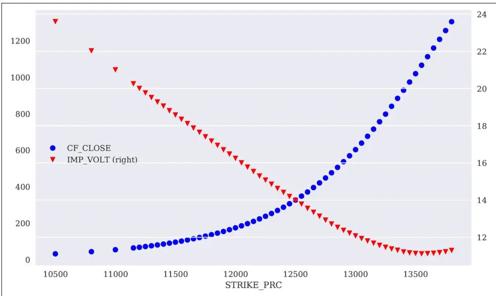
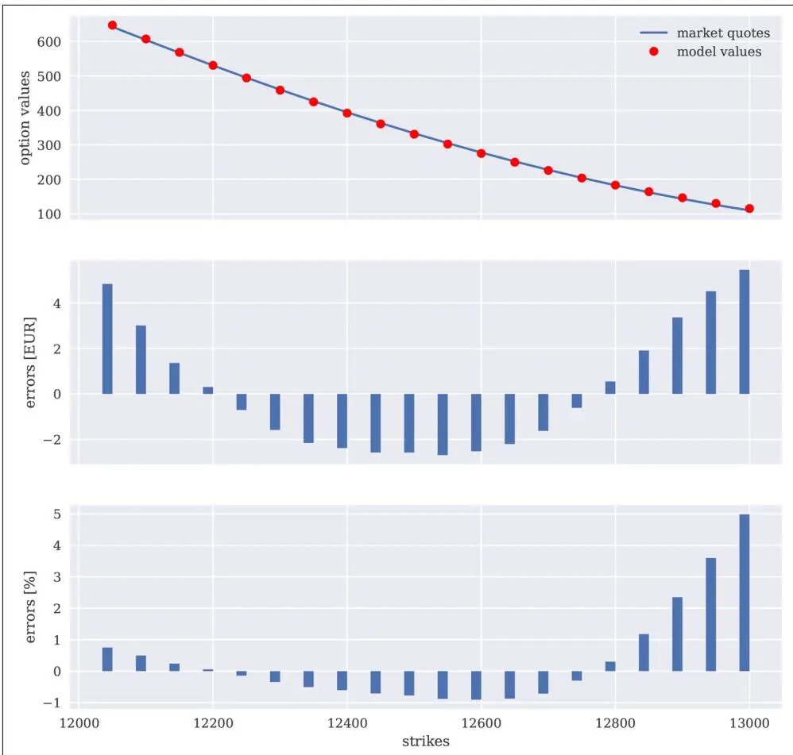

# 基于市场的估值


我们正面临极端的波动性。
—Carlos Ghosn


衍生品分析（derivatives analytics）中的一项主要任务是针对流动性不足的期权和衍生品进行基于市场的估值（market-based valuation）。为此，通常需要将定价模型校准（calibration）到流动性期权的市场报价，然后使用校准后的模型对非交易期权进行定价。^1^

本章基于DX包（DX package）展示了一个案例研究，说明前四章逐步开发的该包能够实现基于市场的估值。案例研究基于DAX 30股票指数，这是一个由30家德国主要公司股票组成的蓝筹股市场指数。该指数上有流动性充足的欧式看涨期权（European call option）和看跌期权（European put option）可供交易。

本章分为几个部分，实现以下主要任务：

"期权数据" on page 638

需要两类数据：DAX 30股票指数本身的数据以及该指数上流动性充足的欧式期权数据。

"模型校准" on page 641

为了以市场一致的方式对非交易期权进行估值，通常首先将所选模型校准到报价期权价格，使得基于最优参数的模型尽可能好地复现市场价格。

"投资组合估值" on page 651

拥有数据以及DAX 30股票指数的市场校准模型后，最后任务是建模和估值非交易期权；同时还在头寸和投资组合（portfolio）层面上估计重要的风险度量。

本章使用的指数和期权数据来自Thomson Reuters Eikon Data API（参见"Python代码" on page 654）。

## 期权数据

首先，进行所需的导入和自定义设置：

```python
In [1]: import numpy as np
    import pandas as pd
    import datetime as dt

In [2]: from pylab import mpl, plt
    plt.style.use('seaborn')
    mpl.rcParams['font.family'] = 'serif'
    %matplotlib inline

In [3]: import sys
    sys.path.append('../')
    sys.path.append('../dx')
```

给定"Python代码" on page 654中创建的数据文件，使用pandas读取期权数据，并将日期信息处理为`pd.Timestamp`对象：

```python
In [4]: dax = pd.read_csv('../source/tr_eikon_option_data.csv', index_col=0)
In [5]: for col in ['CF_DATE', 'EXPIR_DATE']:
    dax[col] = dax[col].apply(lambda date: pd.Timestamp(date))
In [6]: dax.info()
    <class 'pandas.core.frame.DataFrame'>
    Int64Index: 115 entries, 0 to 114
    Data columns (total 7 columns):
    Instrument 115 non-null object
    CF_DATE 115 non-null datetime64[ns]
    EXPIR_DATE 114 non-null datetime64[ns]
    PUTCALLIND 114 non-null object
    STRIKE_PRC 114 non-null float64
    CF_CLOSE 115 non-null float64
    IMP_VOLT 114 non-null float64
    dtypes: datetime64[ns](2), float64(3), object(2)
    memory usage: 7.2+ KB

In [7]: dax.set_index('Instrument').head(7)
Out[7]:
```

```txt
CF_DATE EXPIR_DATE PUTCALLIND STRIKE_PRC CF_CLOSE \
```


<table><tr><td colspan="6">Instrument</td></tr><tr><td>.GDAXI</td><td>2018-04-27</td><td>NaT</td><td>NaN</td><td>NaN</td><td>12500.47</td></tr><tr><td>GDAX105000G8.EX</td><td>2018-04-27</td><td>2018-07-20</td><td>CALL</td><td>10500.0</td><td>2040.80</td></tr><tr><td>GDAX105000S8.EX</td><td>2018-04-27</td><td>2018-07-20</td><td>PUT</td><td>10500.0</td><td>32.00</td></tr><tr><td>GDAX108000G8.EX</td><td>2018-04-27</td><td>2018-07-20</td><td>CALL</td><td>10800.0</td><td>1752.40</td></tr><tr><td>GDAX108000S8.EX</td><td>2018-04-26</td><td>2018-07-20</td><td>PUT</td><td>10800.0</td><td>43.80</td></tr><tr><td>GDAX110000G8.EX</td><td>2018-04-27</td><td>2018-07-20</td><td>CALL</td><td>11000.0</td><td>1562.80</td></tr><tr><td>GDAX110000S8.EX</td><td>2018-04-27</td><td>2018-07-20</td><td>PUT</td><td>11000.0</td><td>54.50</td></tr></table>

```txt
IMP_VOLT
Instrument
.GDAXI    NaN
GDAX105000G8.EX 23.59
GDAX105000S8.EX 23.59
GDAX108000G8.EX 22.02
GDAX108000S8.EX 22.02
GDAX110000G8.EX 21.00
GDAX110000S8.EX 21.00
```

使用`pd.read_csv()`读取数据。

处理两个包含日期信息的列。

最终的DataFrame对象。

以下代码将DAX 30的相关指数水平存入变量，并创建两个新的DataFrame对象，一个用于看涨期权，一个用于看跌期权。图21-1展示了看涨期权的市场报价及其隐含波动率（implied volatility）：^2^

```txt
In [8]: initial_value = dax.iloc[0]['CF_CLOSE'] ①
```

In [9]: calls = dax[dax['PUTCALLIND'] == 'CALL'].copy() ② puts = dax[dax['PUTCALLIND'] == 'PUT '].copy()

In [10]: calls.set\_index('STRIKE\_PRC')[['CF\_CLOSE', 'IMP\_VOLT']].plot( secondary\_y='IMP\_VOLT', style=['bo', 'rv'], figsize=(10, 6));

将相关指数水平赋值给`initial_value`变量。

将看涨期权和看跌期权的数据分别存入两个新的DataFrame对象。

图21.1 DAX 30欧式看涨期权的市场报价与隐含波动率

图21-2展示了看跌期权的市场报价及其隐含波动率：

$$ $$
\begin{array}{l} \text{In [11]: ax = puts.set\_index('STRIKE\_PRC')[['CF\_CLOSE', 'IMP\_VOLT']].plot(} \\ \text{secondary\_y='IMP\_VOLT', style=['bo', 'rv'], \text{figsize=(10, 6))}} \\ \text{ax.get\_legend().set\_bbox\_to\_anchor((0.25, 0.5));} \end{array}

图21.2 DAX 30欧式看跌期权的市场报价与隐含波动率

## 模型校准

本节选择相关市场数据，对DAX 30指数上的欧式期权进行建模，并实现校准过程本身。

### 相关市场数据

模型校准通常基于可用期权市场报价中较小的子集进行。^3^ 为此，以下代码仅选择行权价（strike price）相对接近当前指数水平的那些欧式看涨期权（参见图21-3）。换言之，仅选择那些既不太实值（in-the-money）也不太虚值（out-of-the-money）的欧式看涨期权：

```txt
In [12]: limit = 500 ①
```

$$ $$
\begin{array}{l} \text{In [13]: option\_selection = calls[abs(calls['STRIKE\_PRC'] - initial\_value)} \\ \quad <   \text{limit].copy()} \end{array}


```txt
In [14]: option_selection.info() ③
    <class 'pandas.core.frame.DataFrame'>
    Int64Index: 20 entries, 43 to 81
    Data columns (total 7 columns):
```

```txt
Instrument 20 non-null object
CF_DATE 20 non-null datetime64[ns]
EXPIR_DATE 20 non-null datetime64[ns]
PUTCALLIND 20 non-null object
STRIKE_PRC 20 non-null float64
CF_CLOSE 20 non-null float64
IMP_VOLT 20 non-null float64
dtypes: datetime64[ns](2), float64(3), object(2)
memory usage: 1.2+ KB
```

```txt
In [15]: option_selection.set_index('Instrument').tail() ③
Out[15]:
```

```txt
Instrument
GDAX128000G8.EX 2018-04-272018-07-20 CALL 12800.0182.4
GDAX128500G8.EX 2018-04-272018-07-20 CALL 12850.0162.0
GDAX129000G8.EX 2018-04-252018-07-20 CALL 12900.0142.9
GDAX129500G8.EX 2018-04-272018-07-20 CALL 12950.0125.4
GDAX130000G8.EX 2018-04-272018-07-20 CALL 13000.0109.4
```

```txt
IMP_VOLT
Instrument
GDAX128000G8.EX 12.70
GDAX128500G8.EX 12.52
GDAX129000G8.EX 12.36
GDAX129500G8.EX 12.21
GDAX130000G8.EX 12.06
```

In [16]: option\_selection.set\_index('STRIKE\_PRC')[['CF\_CLOSE', 'IMP\_VOLT']].plot( secondary\_y='IMP\_VOLT', style=['bo', 'rv'], figsize=(10, 6));

设置用于从当前指数水平推导行权价的限值（价态条件）。

基于限值选择用于校准的欧式看涨期权。

用于校准的欧式看涨期权最终DataFrame。

图21.3 用于模型校准的DAX 30欧式看涨期权

### 期权建模

定义了相关市场数据后，现在可以使用DX包对欧式看涨期权进行建模。`dx.market_environment`对象的定义如下，按照前几章示例的方式对DAX 30指数进行建模：

In [17]: import dx

```txt
In [18]: pricing_date = option_selection['CF_DATE'].max() ①
In [19]: me_dax = dx.market_environment('DAX30', pricing_date) ②
In [20]: maturity = pd.Timestamp(calls.iloc[0]['EXPIR_DATE']) ③
In [21]: me_dax.add_constant('initial_value', initial_value) ④
me_dax.add_constant('final_date', maturity) ④
me_dax.add_constant('currency', 'EUR') ④
In [22]: me_dax.add_constant('frequency', 'B') ⑤
me_dax.add_constant('paths', 10000) ⑤
In [23]: csr = dx.constant_short_rate('csr', 0.01) ⑥
me_dax.add_curve('discount_curve', csr) ⑥
```

根据期权数据定义初始日期或定价日期。

实例化`dx.market_environment`对象。

根据期权数据定义到期日。

添加基本模型参数。

添加模拟相关参数。

定义并添加`dx.constant_short_rate`对象。

以下代码添加`dx.jump_diffusion`类的模型特定参数，并实例化相应的模拟对象：

```txt
In [24]: me_dax.add_constant('volatility', 0.2)
me_dax.add_constant('lambda', 0.8)
me_dax.add_constant('mu', -0.2)
me_dax.add_constant('delta', 0.1)
```

In [25]: dax\_model = dx.jump\_diffusion('dax\_model', me\_dax)

作为欧式看涨期权的一个示例，考虑以下参数化，其中行权价设置为DAX 30的当前指数水平。这允许基于蒙特卡洛模拟（Monte Carlo simulation）进行首次价值估计：

```python
In [26]: me_dax.add_constant('strike', initial_value)
    me_dax.add_constant('maturity', maturity)
```

In [27]: payoff\_func = 'np.maximum(maturity\_value - strike, 0)'

```python
In [28]: dax_eur_call = dx.valuation_mcs_european('dax_eur_call', dax_model, me_dax, payoff_func)
```

```python
In [29]: dax_eur_call.present_value()
Out[29]: 654.298085
```

将行权价设置为等于`initial_value`。

定义欧式看涨期权的 payoff 函数（payoff function）。

实例化估值对象。

启动模拟和价值估计。

类似地，可以为DAX 30指数上所有相关的欧式看涨期权定义估值对象。唯一变化的参数是行权价：

```python
In [30]: option_models = {} ①
    for option in option_selection.index:
    strike = option_selection['STRIKE_PRC'].loc[option] ②
    me_dax.add_constant('strike', strike) ②
```

```python
option_models[strike] = dx.valuation_mcs_european(
    'eur_call_%d' % strike,
    dax_model,
    me_dax,
    payoff_func)
```

估值对象收集在字典对象中。

选择相关行权价，并在`dx.market_environment`对象中（重新）定义。

现在，基于所有相关期权的估值对象，函数`calculate_model_values()`在给定一组模型特定参数值`p0`时返回所有期权的模型值：

```python
In [32]: def calculate_model_values(p0):
    ''' 返回所有相关期权的价值。

    Parameters
    ====================
    p0: tuple/list
        kappa, theta, volatility 的元组

    Returns
    ====================
    model_values: dict
        包含模型价值（model values）的字典
        '''
    volatility, lamb, mu, delta = p0
    dax_model.update(volatility=volatility, lamb=lamb,
    mu=mu, delta=delta)
    return {strike: model.present_value(fixed_seed=True)
    for strike, model in option_models.items()}

In [33]: calculate_model_values((0.1, 0.1, -0.4, 0.0))
Out[33]: {12050.0: 611.222524,
    12100.0: 571.83659,
    12150.0: 533.595853,
    12200.0: 496.607225,
    12250.0: 460.863233,
    12300.0: 426.543355,
    12350.0: 393.626483,
    12400.0: 362.066869,
    12450.0: 331.877733,
    12500.0: 303.133596,
    12550.0: 275.987049,
    12600.0: 250.504646,
    12650.0: 226.687523,
    12700.0: 204.550609,
```

```txt
12750.0: 184.020514,
12800.0: 164.945082,
12850.0: 147.249829,
12900.0: 130.831722,
12950.0: 115.681449,
13000.0: 101.917351}
```

函数`calculate_model_values()`在校准过程中使用，如下所述。

### 校准过程

期权定价模型的校准通常是一个凸优化（convex optimization）问题。最广泛使用的校准函数——即最小化某个误差函数值——是模型期权价值相对于期权市场报价的均方误差（Mean-Squared Error, MSE）。^4^ 假设有N个相关期权，以及相应的模型和市场报价。基于MSE将期权定价模型校准到市场报价的问题由公式21-1给出。其中，$C_{n} ^{*}$ 和 $C_{n} ^{m o d}$ 分别表示第n个期权的市场价格和模型价格。p是提供给期权定价模型的参数集合。

**公式 21-1. 模型校准的均方误差**

$$ $$
\min_{p} \frac{1}{N} \sum_{n = 1} ^{N} \left(C_{n} ^{*} - C_{n} ^{\text{mod}} (p)\right) ^{2}


Python函数`mean_squared_error()`在技术上实现了这种模型校准方法。使用全局变量`i`来控制中间参数元组对象及结果MSE的输出：

```python
In [34]: i = 0
    def mean_squared_error(p0):
    ''' 返回给定模型和市场价值的均方误差。
    Parameters
    ========
    p0: tuple/list
        kappa, theta, volatility 的元组

    Returns
    =======
    MSE: float
        均方误差（mean-squared error）
    ...
    global i
    model_values = np.array(list(
        calculate_model_values(p0).values())) ①
    market_values = option_selection['CF_CLOSE'].values ②
    option_diffs = model_values - market_values ③
    MSE = np.sum(option_diffs ** 2) / len(option_diffs) ④
    if i % 75 == 0:
        if i == 0:
        print('%4s %6s %6s %6s %6s --> %6s' % ('i', 'vola', 'lambda', 'mu', 'delta', 'MSE'))
        print('%4d %6.3f %6.3f %6.3f %6.3f --> %6.3f' % (i, p0[0], p0[1], p0[2], p0[3], MSE))
    i += 1
    return MSE

In [35]: mean_squared_error((0.1, 0.1, -0.4, 0.0)) ⑤
i vola lambda mu delta --> MSE
00.1000.100 -0.4000.000 --> 728.375
```

Out[35]: 728.3752973715275

估计模型价值的集合。

选出市场报价。

逐元素计算两者之间的差异。

计算均方误差值。

演示基于样本参数的计算。

第11章介绍了两个函数（`spo.brute()`和`spo.fmin()`），用于实现校准过程。首先，基于四个模型特定参数值的范围进行全局最小化。结果是在暴力最小化过程中检查的所有参数组合中的最优参数组合：

```python
In [36]: import scipy.optimize as spo

In [37]: %%time
    i = 0
    opt_global = spo.brute(mean_squared_error,
    ((0.10, 0.201, 0.025),  # 波动率范围
    (0.10, 0.80, 0.10),    # 跳跃强度范围
    (-0.40, 0.01, 0.10),   # 平均跳跃大小范围
    (0.00, 0.121, 0.02)),  # 跳跃变异性范围
    finish=None)

i vola lambda mu delta --> MSE
00.1000.100 -0.4000.000 --> 728.375
```

```txt
750.1000.300 -0.4000.080 --> 5157.5131500.1000.500 -0.3000.040 --> 12199.3862250.1000.700 -0.2000.000 --> 6904.9323000.1250.200 -0.2000.100 --> 855.4123750.1250.400 -0.1000.060 --> 621.8004500.1250.6000.0000.020 --> 544.1375250.1500.1000.0000.120 --> 3410.7766000.1500.400 -0.4000.080 --> 46775.7696750.1500.600 -0.3000.040 --> 56331.3217500.1750.100 -0.2000.000 --> 14562.2138250.1750.300 -0.2000.100 --> 24599.7389000.1750.500 -0.1000.060 --> 19183.1679750.1750.7000.0000.020 --> 11871.68310500.2000.2000.0000.120 --> 31736.40311250.2000.500 -0.4000.080 --> 130372.71812000.2000.700 -0.3000.040 --> 126365.140
CPU times: user 1min 45s, sys: 7.07 s, total: 1min 52s
Wall time: 1min 56s
```

```txt
In [38]: mean_squared_error(opt_global)
Out[38]: 17.946670038040985
```

`opt_global`值仅为中间结果，用作局部最小化的起始值。在所使用的参数化下，`opt_local`值是最终的最优值，假定在一定的容差水平内：

```python
In [39]: %%time
    i = 0
    opt_local = spo.fmin(mean_squared_error, opt_global,
    xtol=0.00001, ftol=0.00001,
    maxiter=200, maxfun=550)
    i vola lambda mu delta --> MSE
    00.1000.200 -0.3000.000 --> 17.947750.0980.216 -0.302 -0.001 --> 7.8851500.0980.216 -0.300 -0.001 --> 7.371
    Optimization terminated successfully.
    Current function value: 7.371163
    Iterations: 100
    Function evaluations: 188
    CPU times: user 15.6 s, sys: 1.03 s, total: 16.6 s
    Wall time: 16.7 s

In [40]: i = 0
    mean_squared_error(opt_local) ①
    i vola lambda mu delta --> MSE
    00.0980.216 -0.300 -0.001 --> 7.371

Out[40]: 7.371162645265256

In [41]: calculate_model_values(opt_local) ②
Out[41]: {12050.0: 647.428189,
    12100.0: 607.402796,
```

```txt
12150.0: 568.46137,
12200.0: 530.703659,
12250.0: 494.093839,
12300.0: 458.718401,
12350.0: 424.650128,
12400.0: 392.023241,
12450.0: 360.728543,
12500.0: 330.727256,
12550.0: 302.117223,
12600.0: 274.98474,
12650.0: 249.501807,
12700.0: 225.678695,
12750.0: 203.490065,
12800.0: 182.947468,
12850.0: 163.907583,
12900.0: 146.259349,
12950.0: 129.909743,
13000.0: 114.852425}
```

最优参数值下的均方误差。

最优参数值下的模型价值。

接下来，比较最优参数下的模型价值与市场报价。定价误差计算为模型价值与市场报价之间的绝对差值，以及与市场报价相比的偏差百分比：

```python
In [42]: option_selection['MODEL'] = np.array(list(calculate_model_values(opt_local).values()))
option_selection['ERRORS_EUR'] = (option_selection['MODEL'] - option_selection['CF_CLOSE'])
option_selection['ERRORS_%'] = (option_selection['ERRORS_EUR'] / option_selection['CF_CLOSE']) * 100
```

```csv
In [43]: option_selection[['MODEL', 'CF_CLOSE', 'ERRORS_EUR', 'ERRORS_%']]
Out[43]: MODEL CF_CLOSE ERRORS_EUR ERRORS_%
43647.428189642.64.8281890.75135245607.402796604.43.0027960.49682347568.461370567.11.3613700.24005849530.703659530.40.3036590.05725151494.093839494.8 -0.706161 -0.14271653458.718401460.3 -1.581599 -0.34360255424.650128426.8 -2.149872 -0.50371957392.023241394.4 -2.376759 -0.60262759360.728543363.3 -2.571457 -0.70780561330.727256333.3 -2.572744 -0.77190063302.117223304.8 -2.682777 -0.88017665274.984740277.5 -2.515260 -0.90640067249.501807251.7 -2.198193 -0.87333869225.678695227.3 -1.621305 -0.71328971203.490065204.1 -0.609935 -0.298841
```

```python
73182.947468182.40.5474680.30014775163.907583162.01.9075831.17752077146.259349142.93.3593492.35083979129.909743125.44.5097433.59628681114.852425109.45.4524254.983935

In [44]: round(option_selection['ERRORS_EUR'].mean(), 3)
Out[44]: 0.184

In [45]: round(option_selection['ERRORS_%'].mean(), 3)
Out[45]: 0.36
```

以欧元计的平均定价误差。

以百分比计的平均定价误差。

图21-4直观展示了估值结果和误差：

```matlab
In [46]: fix, (ax1, ax2, ax3) = plt.subplots(3, sharex=True, figsize=(10, 10))
    strikes = option_selection['STRIKE_PRC'].values
    ax1.plot(strikes, option_selection['CF_CLOSE'], label='market quotes')
    ax1.plot(strikes, option_selection['MODEL'], 'ro', label='model values')
    ax1.set_ylabel('option values')
    ax1.legend(loc=0)
    wi = 15
    ax2.bar(strikes - wi / 2., option_selection['ERRORS_EUR'], width=wi)
    ax2.set_ylabel('errors [EUR]')
    ax3.bar(strikes - wi / 2., option_selection['ERRORS_%'], width=wi)
    ax3.set_ylabel('errors [%]')
    ax3.set_xlabel('strikes');
```


### 校准速度

将期权定价模型校准到市场数据通常需要重新计算数百甚至数千个期权价值。因此，这通常基于解析定价公式（analytical pricing formula）完成。而此处的校准过程依赖蒙特卡洛模拟作为定价方法，与解析方法相比计算量更大。尽管如此，即使在普通笔记本上，校准过程也不会花费"太长时间"。使用并行化（parallelization）技术可以显著加速校准过程。


图21.4 校准后的模型价值与市场报价

## 投资组合估值

拥有反映金融市场现实（由流动性期权的市场报价表示）的校准模型后，就可以对非交易期权和衍生品进行建模和估值。其思想是校准通过最优参数将正确的风险中性鞅测度（risk-neutral martingale measure）"注入"模型。基于该测度，资产定价基本定理（Fundamental Theorem of Asset Pricing）的机制就可以应用于超出校准范围的那些未定权益（contingent claim）。

本节考虑DAX 30指数上的一个美式看跌期权（American put option）投资组合。这些期权在交易所没有流动性交易。为简单起见，假设美式看跌期权与用于校准的欧式看涨期权具有相同的到期日。同样，假设行权价也相同。

### 建模期权头寸

首先，为标的风险因子DAX 30股票指数建模市场环境，并使用校准得到的最优参数：

```python
In [47]: me_dax = dx.market_environment('me_dax', pricing_date)
    me_dax.add_constant('initial_value', initial_value)
    me_dax.add_constant('final_date', pricing_date)
    me_dax.add_constant('currency', 'EUR')

In [48]: me_dax.add_constant('volatility', opt_local[0])
    me_dax.add_constant('lambda', opt_local[1])
    me_dax.add_constant('mu', opt_local[2])
    me_dax.add_constant('delta', opt_local[3])

In [49]: me_dax.add_constant('model', 'jd')
```

添加校准得到的最优参数。

其次，定义期权头寸及其关联环境，并存入两个独立的字典对象：

```python
In [50]: payoff_func = 'np.maximum(strike - instrument_values, 0)'
In [51]: shared = dx.market_environment('share', pricing_date) ①
shared.add_constant('maturity', maturity) ①
shared.add_constant('currency', 'EUR') ①
In [52]: option_positions = {}
option_environments = {}
for option in option_selection.index:
    option_environments[option] = dx.market_environment(
    'am_put_%d' % option, pricing_date) ②
    strike = option_selection['STRIKE_PRC'].loc[option] ③
    option_environments[option].add_constant('strike', strike) ④
    option_environments[option].add_environment(shared) ⑤
    option_positions['am_put_%d' % strike] = \
    dx.derivatives_position(
    'am_put_%d' % strike,
    quantity=np.random.randint(10, 50),
    underlying='dax_model',
    mar_env=option_environments[option],
    otype='American',
    payoff_func=payoff_func) ⑥
```

定义一个共享的`dx.market_environment`对象，作为所有期权特定环境的基础。

为相关美式看跌期权定义并存储一个新的`dx.market_environment`对象。

定义并存储期权的行权价参数。

将共享`dx.market_environment`对象中的元素添加到期权特定环境中。

使用随机数量定义`dx.derivatives_position`对象。

### 期权投资组合

要对包含所有美式看跌期权的投资组合进行估值，需要一个估值环境。它包含头寸价值和风险统计估计的主要参数：

```python
In [53]: val_env = dx.market_environment('val_env', pricing_date)
val_env.add_constant('starting_date', pricing_date)
val_env.add_constant('final_date', pricing_date) ①
val_env.add_curve('discount_curve', csr)
val_env.add_constant('frequency', 'B')
val_env.add_constant('paths', 25000)
```

```txt
In [54]: underlyings = {'dax_model': me_dax}
```

In [55]: portfolio = dx.derivatives\_portfolio('portfolio', option\_positions, val\_env, underlyings)

```txt
In [56]: %time results = portfolio.get_statistics(fixed_seed=True)
CPU times: user 1min 5s, sys: 2.91 s, total: 1min 8s
Wall time: 38.2 s
```

```txt
In [57]: results.round(1)
Out[57]: name quant. value curr. pos_value pos_delta pos_vega
0 am_put_1205033151.6 EUR 5002.8 -4.738206.91 am_put_1210038161.5 EUR 6138.4 -5.751365.22 am_put_1215020171.3 EUR 3426.8 -3.327894.53 am_put_1220012183.9 EUR 2206.6 -2.218479.74 am_put_1225037197.4 EUR 7302.8 -7.359423.55 am_put_1230037212.3 EUR 7853.9 -8.265911.96 am_put_1235036228.4 EUR 8224.1 -9.070969.47 am_put_1240016244.3 EUR 3908.4 -4.332871.48 am_put_1245017262.7 EUR 4465.6 -5.137451.29 am_put_1250016283.4 EUR 4534.8 -5.236158.210 am_put_1255038305.3 EUR 11602.3 -13.386869.911 am_put_1260010330.4 EUR 3303.9 -3.922144.512 am_put_1265038355.5 EUR 13508.3 -16.089124.813 am_put_1270040384.2 EUR 15367.5 -18.690871.214 am_put_1275013413.5 EUR 5375.7 -6.528626.015 am_put_1280049445.0 EUR 21806.6 -26.3105287.3
```

```txt
16 am_put_1285030477.4 EUR 14321.8 -17.060757.217 am_put_1290033510.3 EUR 16840.1 -19.769163.618 am_put_1295040544.4 EUR 21777.0 -24.980472.319 am_put_1300035582.3 EUR 20378.9 -22.966522.6
```

```python
In [58]: results[['pos_value', 'pos_delta', 'pos_vega']].sum().round(1)
Out[58]: pos_value 197346.2
    pos_delta -224.0
    pos_vega 1138571.1
dtype: float64
```

`final_date`参数稍后将重置为投资组合中所有期权的最终到期日。

投资组合中的所有美式看跌期权均基于相同的标的风险因子——DAX 30股票指数。

实例化`dx.derivatives_portfolio`对象。

所有统计信息的估计需要一些时间，因为它们都基于蒙特卡洛模拟，而且这种估计对于美式期权尤其计算密集，因为需要应用最小二乘蒙特卡洛（Least-Squares Monte Carlo, LSM）算法。由于我们仅持有美式看跌期权的多头头寸，因此投资组合具有负的delta和正的vega。

## Python代码

以下展示从Eikon Data API获取德国DAX 30股票指数期权数据的代码：

```python
In [1]: import eikon as ek ①
    import pandas as pd
    import datetime as dt
    import configparser as cp

In [2]: cfg = cp.ConfigParser() ②
    cfg.read('eikon.cfg') ②
Out[2]: ['eikon.cfg']

In [3]: ek.set_app_id(cfg['eikon']['app_id']) ②
In [4]: fields = ['CF_DATE', 'EXPIR_DATE', 'PUTCALLIND', 'STRIKE_PRC', 'CF_CLOSE', 'IMP_VOLT'] ③
In [5]: dax = ek.get_data('0#GDAXN8*.EX', fields=fields)[0] ④
In [6]: dax.info() ④

<class 'pandas.core.frame.DataFrame'>
```

```txt
RangeIndex: 115 entries, 0 to 114
Data columns (total 7 columns):
Instrument 115 non-null object
CF_DATE 115 non-null object
EXPIR_DATE 114 non-null object
PUTCALLIND 114 non-null object
STRIKE_PRC 114 non-null float64
CF_CLOSE 115 non-null float64
IMP_VOLT 114 non-null float64
dtypes: float64(3), object(4)
memory usage: 6.4+ KB
```

```txt
In [7]: dax['Instrument'] = dax['Instrument'].apply( lambda x: x.replace('/', '')) ⑤
```

```csv
In [5]: .GAXSet_Index( Instrument )head(10)
Out[8]:
Instrument
.GDAXI 2018-04-27 None None NaN 12500.47
GDAX105000G8.EX 2018-04-272018-07-20 CALL 10500.02040.80
GDAX105000S8.EX 2018-04-272018-07-20 PUT 10500.032.00
GDAX108000G8.EX 2018-04-272018-07-20 CALL 10800.01752.40
GDAX108000S8.EX 2018-04-262018-07-20 PUT 10800.043.80
GDAX110000G8.EX 2018-04-272018-07-20 CALL 11000.01562.80
GDAX110000S8.EX 2018-04-272018-07-20 PUT 11000.054.50
GDAX111500G8.EX 2018-04-272018-07-20 CALL 11150.01422.50
GDAX111500S8.EX 2018-04-272018-07-20 PUT 11150.064.30
GDAX112000G8.EX 2018-04-272018-07-20 CALL 11200.01376.10
```

```txt
IMP_VOLT
Instrument
.GDAXI    NaN
GDAX105000G8.EX 23.59
GDAX105000S8.EX 23.59
GDAX108000G8.EX 22.02
GDAX108000S8.EX 22.02
GDAX110000G8.EX 21.00
GDAX110000S8.EX 21.00
GDAX111500G8.EX 20.24
GDAX111500S8.EX 20.25
GDAX112000G8.EX 19.99
```

```txt
In [9]: dax.to_csv('../source/tr_eikon_option_data.csv')
```

导入eikon Python包装包。

读取Eikon Data API的登录凭据。

定义要检索的数据字段。

检索2018年7月到期的期权数据。

替换工具名称中的斜杠字符。

将数据集写入CSV文件。

## 结论

本章展示了将DX分析包应用于DAX 30股票指数非交易美式期权投资组合估值的一个更大、更真实的用例。本章涵盖了任何真实衍生品分析应用中通常涉及的三个主要任务：

**获取数据**

当前、正确的市场数据是衍生品分析中任何建模和估值努力的基础；需要DAX 30的指数数据以及期权数据。

**模型校准**

为了以市场一致的方式估值、管理和对冲非交易期权和衍生品，必须将适当模型（模拟对象）的参数校准到相关期权市场报价（在到期日和行权价方面相关）。所选择的模型是跳跃扩散模型（jump diffusion model），在某些情况下适合对股票指数进行建模；校准结果相当不错，尽管该模型仅提供了三个自由度（`lambda`作为跳跃强度，`mu`作为预期跳跃大小，`delta`作为跳跃大小的变异性）。

**投资组合估值**

基于市场数据和校准模型，对DAX 30指数上的美式看跌期权投资组合进行建模，并估计了主要统计量（头寸价值、delta和vega）。

本章的现实用例展示了DX包的灵活性和强大功能；它基本上可以应对衍生品方面的主要分析任务。这种方法和架构使得该应用在很大程度上可与欧式期权的Black-Scholes-Merton解析公式基准案例相媲美。一旦定义了估值对象，就可以像使用解析公式一样使用它们——尽管在底层应用了计算密集和内存密集的算法。

## 延伸阅读

与前面几章一样，以下书籍是本章所涵盖主题的良好通用参考，特别是在期权定价模型校准方面：

- Hilpisch, Yves (2015). *Derivatives Analytics with Python*. Chichester, England: Wiley Finance.

关于衍生品投资组合的一致估值和管理，另请参见第20章末尾的资源。
