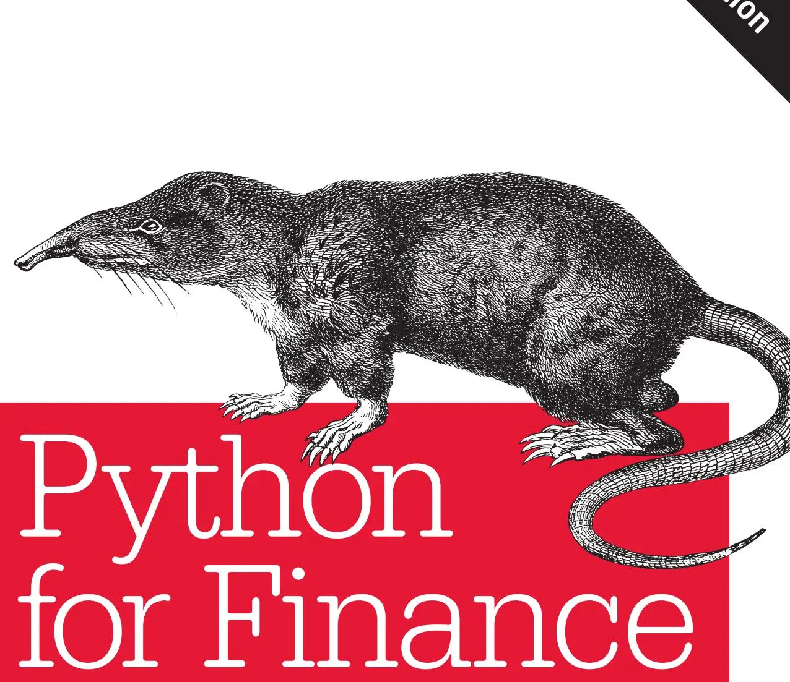

掌握数据驱动金融（Mastering Data-Driven Finance）

## Python金融应用（Python for Finance）

Python已成为数据驱动和AI优先金融（AI-first Finance）领域的首选编程语言。一些大型投资银行和对冲基金现在使用Python及其生态系统来构建核心交易和风险管理系统。在本指南的第二版中，Yves Hilpisch向开发者与量化分析师展示了如何使用Python包和工具进行金融数据科学（Financial Data Science）、算法交易（Algorithmic Trading）和计算金融（Computational Finance）。

本书已针对Python 3进行更新，大部分代码以Jupyter Notebook形式提供，让你可以执行和交互式地运行书中几乎所有示例。全书共五部分，你将了解Python及其生态系统如何为金融领域的公司和个体提供技术框架：

**第一部分：Python与金融** —— 入门Python交互式金融分析与应用开发

**第二部分：掌握基础** —— 学习Python数据类型与结构、NumPy、pandas及其DataFrame类、面向对象编程

**第三部分：金融数据科学** —— 探索Python在金融时间序列数据、I/O操作、随机过程和机器学习方面的技术与包

**第四部分：算法交易** —— 使用Python回测和部署自动化算法交易策略

**第五部分：衍生品分析** —— 开发灵活而强大的Python期权与衍生品定价及风险管理包

Yves J. Hilpisch博士是The Python Quants的创始人兼管理合伙人，该公司专注于利用开源技术进行金融数据科学、人工智能、算法交易和计算金融。他还是The AI Machine的创始人兼CEO，该公司致力于通过专有策略执行平台利用AI为算法交易赋能。Yves是首个在线培训项目的负责人，该项目可颁发Python算法交易大学证书。

## 前言

如今，Python无疑是金融行业的主要战略性技术平台之一。2013年开始撰写本书第一版时，我仍然需要在许多谈话和演示中不懈地论证Python在金融领域相比其他语言和平台的竞争优势。到2018年底，这已不再是问题：世界各地的金融机构都在尽力利用Python及其强大的数据分析、可视化和机器学习包生态。

在金融领域之外，Python也常常是编程入门课程的首选语言，例如计算机科学项目。除了其可读性强的语法和多范式方法之外，一个主要原因是Python已成为人工智能（Artificial Intelligence, AI）、机器学习（Machine Learning, ML）和深度学习（Deep Learning, DL）领域的一流语言。许多流行包和库要么直接用Python编写（如用于ML的scikit-learn），要么提供Python封装（如用于DL的TensorFlow）。

金融本身正在进入一个新时代，两大力量正在推动这一演变。第一是几乎所有金融数据都可以通过编程方式获取——通常实时进行，这导致了数据驱动金融（Data-Driven Finance）。几十年前，大多数交易或投资决策依赖于交易员和投资组合经理在报纸上读到或通过私人谈话了解的信息。后来，终端通过计算机和电子通信将金融数据实时带到交易员和投资组合经理的办公桌上。如今，个体（或团队）再也无法跟上哪怕一分钟内产生的海量金融数据。只有机器，凭借其不断提升的处理速度和计算能力，才能跟上金融数据的体量和速度。这意味着，当今全球大部分股票交易量是由算法和计算机驱动的，而非人类交易员。

第二个主要力量是AI在金融领域日益增长的重要性。越来越多的金融机构试图利用ML和DL算法来改善运营和交易投资绩效。2018年初，第一本关于"金融机器学习"的专著出版，突显了这一趋势。毫无疑问，更多的书还在后面。这导致了所谓的AI优先金融（AI-first Finance），灵活、可参数化的ML和DL算法取代了传统的金融理论——那些理论可能优雅，但在数据驱动、AI优先金融的新时代已不再那么有用。

Python是应对这个金融时代挑战的正确编程语言和生态系统。虽然本书涵盖了用于无监督和监督学习的基本ML算法（以及深度神经网络等），但重点是Python的数据处理和分析能力。要全面说明AI在金融中——现在和未来——的重要性，需要另外一本书的篇幅。然而，大多数AI、ML和DL技术需要大量数据，因此掌握数据驱动金融应该是第一步。

《Python for Finance》第二版与其说是更新，不如说是升级。例如，它增加了关于算法交易的完整部分（第四部分）。这个话题最近在金融行业变得相当重要，在零售交易者中也很受欢迎。它还增加了更偏入门的第二部分，介绍基础Python编程和数据分析主题，之后在后续部分中加以应用。另一方面，第一版中的一些章节已被完全删除。例如，关于Web技术和包（如Flask）的章节被删除了，因为如今已有更专门、更聚焦的书籍介绍这类主题。

在第二版中，我试图覆盖更多与金融相关的主题，并聚焦于对金融数据科学、算法交易和计算金融特别有用的Python技术。和第一版一样，方法仍然是实践导向的：实现和示例先于理论细节，我通常关注大局而不是某个类、方法或函数最晦涩的参数化选项。

在描述了第二版的基本方法之后，值得强调的是，本书既不是Python编程入门，也不是金融学导论。这两方面都有大量优秀资源可用。本书位于这两个激动人心领域的交汇点，假定读者具有一定的编程背景（不一定是Python）和金融背景。这样的读者将学到如何将Python及其生态系统应用于金融领域。

本书附带的Jupyter Notebook和代码可以通过我们的Quant Platform访问和执行。你可以在 http://py4fi.pqp.io 免费注册。

我和我的公司（The Python Quants）提供了更多资源，帮助你掌握Python在金融数据科学、人工智能、算法交易和计算金融方面的应用。你可以从以下网站开始：

• 我们公司网站
• 我的个人网站
• 我们的Python书籍网站
• 我们的在线培训网站
• 证书项目网站

在我们过去几年创建的所有项目中，我最引以为豪的是Python算法交易证书项目。它提供超过150小时的直播和录播教学，超过1,200页的文档，超过5,000行的Python代码，以及超过50个Jupyter Notebook。该项目每年多次举办，我们每期都会更新和改进。该在线项目是同类中的首个，成功完成的学员将与萨尔应用科技大学（htw saar University of Applied Sciences）合作获得官方大学证书。

此外，我最近创办了The AI Machine，一个新项目和新公司，旨在标准化自动化算法交易策略的部署。通过这个项目，我们希望在系统化和可扩展的层面上实现多年来在教学中所传授的内容，以抓住算法交易领域的众多机会。感谢Python——以及数据驱动和AI优先金融——使得即使是我们这样的小团队也能实现这个项目。

我在第一版前言结尾写道：


我非常兴奋地看到Python已成为金融行业的一项重要技术。我也确信，在未来，它将在衍生品与风险分析、高性能计算等领域发挥更加重要的作用。我希望这本书能帮助专业人士、研究人员和学生，在应对这个迷人领域的挑战时，充分利用Python。
—Yves Hilpisch，第一版前言


2014年写这些话时，我无法预料Python在金融领域会变得如此重要。2018年，我的期望和希望被如此大大超越，我更加感到欣慰。也许本书的第一版为此做出了微小的贡献。无论如何，衷心感谢所有不懈努力的开源开发者们，没有他们，Python的成功故事就无法书写。

## 本书排版约定

本书使用以下排版约定：

*斜体*
用于表示新术语、URL和电子邮件地址。

## 等宽字体
用于程序清单，以及段落中引用软件包、编程语言、文件扩展名、文件名、程序元素（如变量或函数名）、数据库、数据类型、环境变量、语句和关键字。

## 等宽斜体
用于表示应替换为用户提供的值或由上下文决定的值的文本。


此元素表示提示或建议。



此元素表示一般性说明。



此元素表示警告或注意。


## 使用代码示例

补充材料（特别是Jupyter Notebook和Python脚本/模块）可在 http://py4fi.pqp.io 获取和使用下载。

本书旨在帮助你完成工作。一般来说，如果本书提供了示例代码，你可以在程序或文档中使用。除非你复制了代码的大部分内容，否则无需联系申请许可。例如，编写一个使用本书若干段代码的程序无需许可。销售或分发O'Reilly书籍的示例CD-ROM需要许可。引用本书并引用示例代码来回答问题无需许可。将本书的大量示例代码纳入你的产品文档需要许可。

我们感谢但不要求注明出处。署名通常包括书名、作者、出版商和ISBN。例如："《Python for Finance》第二版，Yves Hilpisch著（O'Reilly）。Copyright 2019 Yves Hilpisch, 978-1-492-02433-0。"

如果你认为你对代码示例的使用超出了合理使用或上述许可范围，请随时联系 permissions@oreilly.com。

## O'Reilly在线学习

40多年来，O'Reilly Media一直提供技术和商业培训、知识和洞见，帮助企业成功。

我们独特的专家和创新者网络通过书籍、文章和在线学习平台分享他们的知识和专长。O'Reilly的在线学习平台让你可以按需访问直播培训课程、深度学习路径、交互式编码环境，以及来自O'Reilly和200多家其他出版商的丰富文本和视频资源。更多信息，请访问 http://oreilly.com。

## 如何联系我们

关于本书的意见和问题，请发送至出版商：

O'Reilly Media, Inc.
1005 Gravenstein Highway North
Sebastopol, CA 95472
800-998-9938（美国或加拿大）
707-829-0515（国际或本地）
707-829-0104（传真）

我们有一个本书的网页，上面列出了勘误、示例和任何补充信息。你可以通过 http://bit.ly/python-finance-2e 访问此页面。

要对本书发表评论或提出技术问题，请发送电子邮件至 bookquestions@oreilly.com。

有关我们书籍和课程的更多新闻和信息，请访问我们的网站 http://www.oreilly.com。

在Facebook上找到我们：http://facebook.com/oreilly
在Twitter上关注我们：http://twitter.com/oreillymedia
在YouTube上观看我们的视频：http://www.youtube.com/oreillymedia

## 致谢

我要感谢所有帮助本书成为现实的人——特别是O'Reilly的团队，他们在许多方面改进我的稿件。我要感谢技术审阅者Hugh Brown和Jake VanderPlas。他们的宝贵反馈和许多建议使本书受益匪浅。当然，任何遗留错误都由我负责。

特别感谢与我密切合作超过十年的Michael Schwed。多年来，我从他的工作、支持和Python专业知识中受益无数。

我还要感谢Refinitiv（原Thomson Reuters）的Jason Ramchandani和Jorge Santos，他们不仅持续支持我的工作，也支持整个开源社区。

与第一版一样，本书第二版极大地受益于多年来我举办的数十场"Python for Finance"演讲，以及数百小时的"Python for Finance"培训。在许多情况下，参与者的反馈帮助我改进了培训材料，这些材料往往最终成为本书的章节或部分内容。

撰写第一版花费了我大约一年时间。总体而言，撰写和升级第二版也花了大约一年时间，这比我预期的要长得多。这主要是因为这个话题本身让我在出差和业务方面非常忙碌——对此我深怀感激。

写书需要许多独处时间，而这些时间无法与家人共度。因此，感谢Sandra、Lilli、Henry、Adolf、Petra和Heinz的理解和支持——不仅是在写书方面。

我将本书的第二版，如同第一版一样，献给我可爱、坚强且富有同情心的妻子Sandra。多年来，她为家庭赋予了新的意义。谢谢你。

— Yves

萨尔州，2018年11月

## Python与金融

本部分介绍Python在金融领域的应用，包含两章：

• [第1章](ch01.md) 简要讨论Python本身，并详细论证为何Python非常适合应对金融行业以及金融数据分析中的技术挑战。

• [第2章](ch02.md) 介绍Python基础设施；它简要概述了管理Python环境的重要方面，帮助你开始使用Python进行交互式金融分析和金融应用开发。
