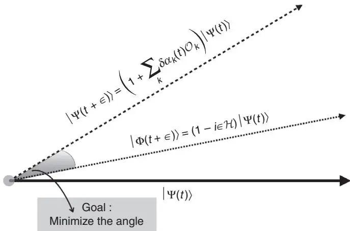
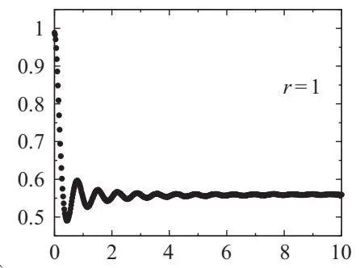
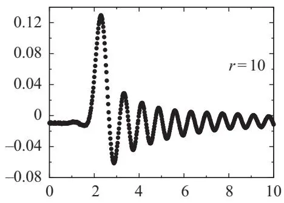
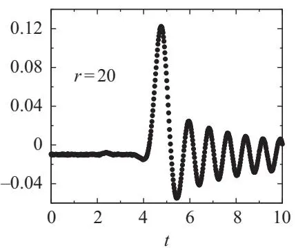
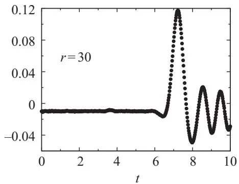
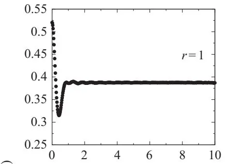
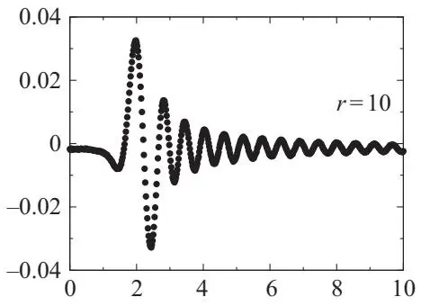
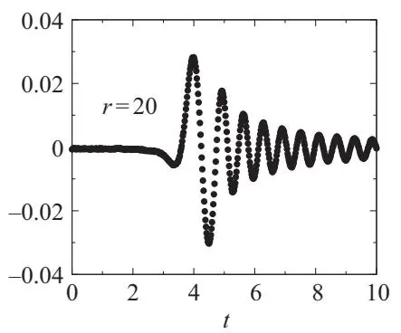
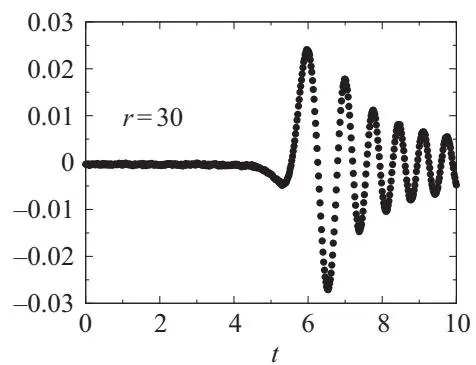

# 第7章 · 含时变分蒙特卡洛

## 7.1 引言

如[第1章](ch01.md)所述，变分计算通常局限于研究基态和低能态。在此，我们提出变分原理的一个直接推广，用以考虑强关联体系的非平衡性质。对此，最简单的例子是含时哈特里-福克方法，该方法由Dirac（1930）在量子力学诞生初期引入（Ring and Schuck, 2004）。下面，我们将介绍一种能够包含Jastrow因子的实时变分方法的形式体系（Carleo等人，2012, 2014）；该方法已被进一步推广以包含含时费米子部分（Ido等人，2015）。

原则上，含时方法需要求解完整的含时多体薛定谔方程：

$$
i \frac{d} {d t} | \Phi ( t ) \rangle = \mathcal{H} | \Phi ( t ) \rangle ,\tag{7.1}
$$

其中 $| \Phi ( t ) \rangle$ 是时刻 $t$ 的波函数。形式解（这里我们假设哈密顿量不依赖于时间）为：

$$
| \Phi ( t ) \rangle = e^{- i \mathcal{H} t} | \Phi ( 0 ) \rangle .\tag{7.2}
$$

然而，由于希尔伯特空间随着系统尺寸的增加呈指数增长，精确处理时间演化仅可能针对小系统，因此需要近似技术。在这方面，含时哈特里-福克近似对相互作用的多数体体系并不准确，因为它严重低估了关联效应。近年来，已有少数数值方法被开发出来以精确处理大系统，例如含时密度矩阵重正化群（White and Feiguin, 2004；Daley等人，2004）和非平衡动力学平均场理论（Aoki等人，2014）。然而，这两种方法在二维或三维大系统处理中都存在严重困难。因此，需要替代技术，而变分蒙特卡洛方法的含时推广代表了追踪关联波函数精确动力学的一条可行途径。

## 7.2 变分参数的实时演化

我们变分方法的核心是含时波函数的定义。在此，我们仅考虑玻色子系统，其量子态具有含时Jastrow因子的形式，但推广到费米子系统是直接的，只需考虑含时Slater行列式即可（Ido等人，2015）。因此，我们取：

$$
\Psi ( x , t ) = \langle x | \Psi ( t ) \rangle = \exp \left[ \sum_{k} \alpha_{k} ( t ) \mathcal{O}_{k} ( x ) \right] \zeta ( x ) ,\tag{7.3}
$$

其中 $\zeta ( x )$ 是与时间无关的玻色子态，$\alpha_{k} ( t ) = \alpha_{k}^{R} ( t ) + i \alpha_{k}^{I} ( t )$ 是复变分参数，与实局域激发算符 $\mathcal{O}_{k}$ 耦合，这些算符在所选基矢下是对角的，即 $\langle x | \mathcal{O}_{k} | x^{\prime} \rangle = \delta_{x , x^{\prime}} \mathcal{O}_{k} ( x )$。在算符集合 $\{\mathcal{O}_{k} \}$ 中，我们包含了单位算符 $O_{k = 0} = \mathbb{I}$，因此 $\alpha_{0}^{R} ( t )$ 使我们能够满足 $\Psi ( x , t )$ 的归一化条件，而 $\alpha_{0}^{I} ( t )$ 用于在实时动力学过程中引入任意相位因子。

该量子态的时间演化由 $\alpha_{k} ( t )$ 决定，其时间轨迹由一组微分方程确定，以最小化希尔伯特空间中近似态与精确态之间的"距离"；等价地，这组方程也可以从定常作用量原理推导得到，如下所述。

### 7.2.1 最小希尔伯特空间距离

一方面，从给定时间 $t$ 开始，$\Psi ( x , t )$ 的精确无穷小实时演化由下式给出：

$$
\Phi ( x , t + \epsilon ) = \Psi ( x , t ) \left[ 1 - i \epsilon e_{L} ( x , t ) \right] + O ( \epsilon^{2} ) ,\tag{7.4}
$$

其中

$$
e_{L} ( x , t ) = e_{L}^{R} ( x , t ) + i e_{L}^{I} ( x , t ) = \frac{\langle x | \mathcal{H} | \Psi ( t ) \rangle} {\langle x | \Psi ( t ) \rangle}\tag{7.5}
$$

是给定一组变分参数和给定多体组态 $| x \rangle$ 下的复值局域能量。另一方面，由于参数变化导致的变分波函数的无穷小变化由下式给出：

$$
\Psi ( x , t + \epsilon ) = \Psi ( x , t ) \left[ 1 + \sum_{k} \delta \alpha_{k} ( t ) \mathcal{O}_{k} ( x ) \right] + O ( \epsilon^{2} ) ,\tag{7.6}
$$

图7.1 $\vert \Psi ( t ) \rangle$ 无穷小实时演化的示意图（由希尔伯特空间中的向量表示，实线箭头表示）。精确时间演化态由 $| \Phi ( t + \epsilon ) \rangle$ 给出（虚线点状箭头），近似态由 $| \Psi ( t + \epsilon ) \rangle$ 给出（虚线箭头）。通过最小化这两个态之间的距离，得到最优的"变分"态。

其中 $\delta \alpha_{k} ( t )$ 是小的复变量，即 $O ( \epsilon )$。因此，为了获得所考虑的小时间间隔内变分参数的最优变化 $\delta \alpha_{k} ( t )$，我们可以最小化精确时间演化态 $\Phi ( x , t + \epsilon )$ 与我们近似假设态 $\Psi ( x , t + \epsilon )$ 之间的欧几里得距离 $\Delta_{\epsilon} ( t )$，如图7.1所示：

$$
\Delta_{\epsilon}^{2} ( t ) = \sum_{x} | \Psi ( x , t + \epsilon ) - \Phi ( x , t + \epsilon ) | ^{2} .\tag{7.7}
$$

该量可以方便地表示为波函数模平方的期望值形式：

$$
\Delta_{\epsilon}^{2} ( t ) = \sum_{x} \left| \Psi ( x , t ) \right| ^{2} \left| i \epsilon e_{L} ( x , t ) + \sum_{k} \delta \alpha_{k} ( t ) \mathcal{O}_{k} ( x ) \right| ^{2} .\tag{7.8}
$$

利用欧拉最小值条件：

$$
\frac{d} {d \alpha_{k}^{*} ( t )} \Delta_{\epsilon}^{2} ( t ) = 0 ,\tag{7.9}
$$

我们得到：

$$
\sum_{k^{\prime}} \langle \mathcal{O}_{k^{\prime}} \mathcal{O}_{k} \rangle_{t} \delta \alpha_{k^{\prime}} ( t ) = - i \epsilon \langle \mathcal{O}_{k} e_{L} ( t ) \rangle_{t} ,\tag{7.10}
$$

该式正确至 $O ( \epsilon^{2} )$ 阶；此处，符号 $\langle \dots \rangle_{t}$ 表示对模平方 $\vert \Psi ( x , t ) \vert^{2}$ 的平均。

$$
\langle \mathcal{O}_{k} \mathcal{O}_{k^{\prime}} \rangle_{t} = \sum_{x} | \Psi ( x , t ) | ^{2} \mathcal{O}_{k} ( x ) \mathcal{O}_{k^{\prime}} ( x ) = \langle \Psi ( t ) | \mathcal{O}_{k} \mathcal{O}_{k^{\prime}} | \Psi ( t ) \rangle ,\tag{7.11}
$$

$$
\langle \mathcal{O}_{k} e_{L} ( t ) \rangle_{t} = \sum_{x} | \Psi ( x , t ) | ^{2} \mathcal{O}_{k} ( x ) e_{L} ( x , t ) = \langle \Psi ( t ) | \mathcal{O}_{k} \mathcal{H} | \Psi ( t ) \rangle ,\tag{7.12}
$$

这些表达式可以通过标准的变分蒙特卡罗技术轻松数值实现。

此时，我们可以通过引入变分参数的时间导数来取极限 $\epsilon \to 0$：

$$
\dot{\alpha}_{k} ( t ) = \operatorname*{lim}_{\epsilon \to 0} \frac{\delta \alpha_{k} ( t )} {\epsilon} .\tag{7.13}
$$

此外，通过显式考虑式 (7.10) 中 $\delta \alpha_{k} ( t )$ 的实部和虚部依赖关系，我们得到了关于 ${\dot{\alpha}_{k}}^{R} ( t )$ 和 $\dot{\alpha}_{k}^{I} ( t )$ 的封闭微分方程：

$$
\sum_{k^{\prime}} \langle \mathcal{O}_{k} \mathcal{O}_{k^{\prime}} \rangle_{t} \dot{\alpha}_{k^{\prime}}^{R} ( t ) = \langle \mathcal{O}_{k} e_{L}^{I} ( t ) \rangle_{t} ,\tag{7.14}
$$

$$
\sum_{k^{\prime}} \langle \mathcal{O}_{k} \mathcal{O}_{k^{\prime}} \rangle_{t} \dot{\alpha}_{k^{\prime}}^{I} ( t ) = - \langle \mathcal{O}_{k} e_{L}^{R} ( t ) \rangle_{t} ;\tag{7.15}
$$

这些微分方程在极限 $\epsilon \to 0$ 下极小化了 $\Delta_{\epsilon}^{2} ( t )$。

数值上，尽可能接近连续极限非常重要，因为只有在这种情况下，式 (7.4) 中的线性化演化才成为正确的传播，且非酉项在 $\epsilon \to 0$ 时一致消失。应当注意，式 (7.10) 的解还保证了在短时传播中，算子 $\mathcal{O}_{k}$ 的期望值保持接近（即误差不超过 $O ( \epsilon^{2} )$）精确动力学：

$$
\langle \Psi ( t + \epsilon ) | \mathcal{O}_{k} | \Psi ( t + \epsilon ) \rangle \approx \langle \Phi ( t + \epsilon ) | \mathcal{O}_{k} | \Phi ( t + \epsilon ) \rangle .\tag{7.16}
$$

我们希望通过给出微分方程 (7.14) 和 (7.15) 的一种更显式的形式来结束本部分的讨论，该形式突出了与时间相关波函数的范数和全局相位相关的部分。鉴于 $\mathcal{O}_{k = 0} = \mathbb{I}$，我们可以简化式 (7.14) 和 (7.15)，并将关于 $\alpha_{0} ( t )$ 的方程与其他方程解耦：

$$
\sum_{k^{\prime} > 0} S_{k , k^{\prime}} \dot{\alpha}_{k^{\prime}}^{R} = \langle \mathcal{O}_{k} e_{L}^{I} ( t ) \rangle_{t} ,\tag{7.17}
$$

$$
\sum_{k^{\prime} > 0} S_{k , k^{\prime}} \dot{\alpha}_{k^{\prime}}^{I} = - \langle \mathcal{O}_{k} e_{L}^{R} ( t ) \rangle_{t} + \langle e_{L}^{R} ( t ) \rangle_{t} \langle \mathcal{O}_{k} \rangle_{t} ,\tag{7.18}
$$

其中 $S_{k , k^{\prime}} = \langle \mathcal{O}_{k} \mathcal{O}_{k^{\prime}} \rangle_{t} - \langle \mathcal{O}_{k} \rangle_{t} \langle \mathcal{O}_{k^{\prime}} \rangle_{t}$ 且 $\langle e_{L}^{I} ( t ) \rangle_{t} = 0$ 。此外，关于 $\alpha_{0} ( t )$ 的方程为：

$$
\dot{\alpha}_{0}^{R} ( t ) = - \sum_{k^{\prime} > 0} \langle \mathcal{O}_{k^{\prime}} \rangle_{t} \dot{\alpha}_{k^{\prime}}^{R} ( t ) ,\tag{7.19}
$$

$$
\dot{\alpha}_{0}^{I} ( t ) = - \langle e_{L}^{R} ( t ) \rangle_{t} - \sum_{k^{\prime} > 0} \langle \mathcal{O}_{k^{\prime}} \rangle_{t} \dot{\alpha}_{k^{\prime}}^{I} ( t ) .\tag{7.20}
$$

### 7.2.2 平稳作用量原理

变分参数的运动方程也可以从另一种方法导出，该方法基于平稳作用量原理。为此，我们引入作用量：

$$
{\mathcal{S}} = \int d t \langle \Psi ( t ) | \left( i {\frac{\partial} {\partial t}} - {\mathcal{H}} \right) | \Psi ( t ) \rangle ,\tag{7.21}
$$

它是变分参数 $\alpha_{k} ( t )$ 的泛函。注意，归一化波函数 $\Psi ( x , t )$ 的假设暗示作用量 $\boldsymbol{\mathcal{S}}$ 是实数。众所周知，精确的实动力学可以通过取 ${\mathcal{S}}$ 的平稳解得到，即：

$$
\frac{\delta{\cal S}} {\delta \Psi^{*} ( x , t )} = 0 ,\tag{7.22}
$$

在所有可能的 $\Psi ( x , t )$ 变分中。接下来，我们将证明，定作用量原理可以推广到变分解法中，并允许对上一节中推导的变分参数的时间演化进行最优选择。当变分波函数被限制为式 (7.3) 的形式时，作用量可以很容易地用 ${\dot{\alpha}}_{k} ( t )$ 表示，并写作：

$$
\mathcal{S} = \int d t \langle \Psi ( t ) | \left( i \sum_{k^{\prime}} \dot{\alpha}_{k^{\prime}} ( t ) \mathcal{O}_{k^{\prime}} - \mathcal{H} \right) | \Psi ( t ) \rangle .\tag{7.23}
$$

对于一组复参数 $\alpha_{k} ( t )$ 参数化的归一化波函数，其定态条件由下式给出：

$$
\frac{\delta S} {\delta \alpha_{k}^{*} ( t )} = 0 .\tag{7.24}
$$

利用式 (7.3) 中给出的 $| \Psi ( t ) \rangle$ 的定义，我们注意到 $\boldsymbol{\mathcal{S}}$ 中对 $\alpha_{k}^{*} ( t )$ 的依赖仅出现在 $\langle \Psi ( t ) |$ 中，因此，我们立即得到定态条件：

$$
\langle \Psi ( t ) | \left( i \sum_{k^{\prime}} \mathcal{O}_{k} \mathcal{O}_{k^{\prime}} \dot{\alpha}_{k^{\prime}} - \mathcal{O}_{k} \mathcal{H} \right) | \Psi ( t ) \rangle = 0 ,\tag{7.25}
$$

显然，在连续极限 $\epsilon \rightarrow 0$ 下，这等价于式 (7.10)。

### 7.2.3 范数与能量守恒

微分方程 (7.14) 和 (7.15) 定义了变分态的真实时间动力学，该动力学同时保持了范数和能量守恒。就波函数的范数而言，我们有：

$$
N ( t ) = \sum_{x} | \Psi ( x , t ) | ^{2} ,\tag{7.26}
$$

其时间导数为：

$$
\dot{N} ( t ) = 2 \left[ \dot{\alpha}_{0}^{R} ( t ) + \sum_{k > 0} \langle \mathcal{O}_{k} \rangle_{t} \dot{\alpha}_{k}^{R} ( t ) \right] ,\tag{7.27}
$$

作为式 (7.19) 的直接结果，该导数消失。

此外，能量由下式给出：

$$
E ( t ) = \sum_{x} | \Psi ( x , t ) | ^{2} e_{L} ( x , t ) .\tag{7.28}
$$

其时间导数很容易求得：

$$
\dot{E} ( t ) = 2 \sum_{k} \left( \dot{\alpha}_{k}^{R} ( t ) \langle \mathcal{O}_{k} e_{L}^{R} \rangle_{t} + \dot{\alpha}_{k}^{I} ( t ) \langle \mathcal{O}_{k} e_{L}^{I} \rangle_{t} \right) ,\tag{7.29}
$$

给定式 (7.14) 和 (7.15)，该导数也消失。

### 7.2.4 实时变分蒙特卡罗

鉴于变分波函数的关联性质，一个关键点是，为微分方程 (7.14) 和 (7.15) 提供一个可靠的解。变分蒙特卡罗方法使我们能够获得变分轨迹的数值精确解。事实上，在每一个时刻 $t$，对于一组变分参数 $\{\alpha_{k} ( t ) \}$，波函数的模平方 $\vert \Psi ( x , t ) \vert^{2}$ 可以直接解释为配置 $| x \rangle$ 张成的希尔伯特空间上的一个概率分布，并且可以设计一个马尔可夫过程，其平稳平衡分布与所需测度一致。进入式 (7.17) 和 (7.18) 的所有期望值均计算为随机游走之上的统计平均值。然后，经过适当数量的蒙特卡罗步后，可以求解微分方程的线性系统，以获得变分参数的一阶导数，进而可以通过一阶微分方程的标准算法对它们进行积分，从而得到新的参数集 $\{\alpha_{k} ( t + \epsilon ) \}$。这一过程从初始时间开始迭代，直到达到最终时间。

## 7.3 一维量子淬火的一个例子

这里，我们想给出上一节中描述的含时变分方法的一个简单应用。具体来说，我们展示了，在相互作用强度 $U$ 从 $U = U_{\mathrm{init}}$ 突然淬火到 $U = U_{\mathrm{fin}}$ 之后，玻色-哈伯德模型中密度-密度关联的传播。特别是，我们考虑由以下哈密顿量定义的一维模型：

$$
{\mathcal{H}} = - J \sum_{i} b_{i}^{\dagger} b_{i + 1} + {\mathrm{h . c .}} + {\frac{U} {2}} \sum_{i} n_{i} ( n_{i} - 1 ) ,\tag{7.30}
$$

其中 $b_{i}^{\dagger} ~ ( b_{i}^{\phantom{\dagger}} )$ 在位点 i 上产生（湮灭）一个玻色子，${n}_{i} = {b}_{i}^{\dagger} {b}_{i}$ 是位点 i 上的玻色子密度；在具有 L 个位点的链上假设周期性边界条件，使得 $b_{L + 1}^{\dag} \equiv b_{1}^{\dag}$。注意，这里跳跃振幅用 J 表示，以避免与时间 t 混淆。

在 $t ~ = ~ 0$ 时的初始状态，是 $U = U_{\mathrm{init}}$ 的最佳变分 Jastrow 波函数，然后根据哈密顿量 (7.30)（其中 $U = U_{\mathrm{fin}}$）和式 (7.10)，对该状态进行实时演化。在数值计算中，我们使用足够小的时间步长 $\epsilon \ : = \ : 0.01$ 和四阶龙格-库塔积分格式，该格式在时间长达 $t = 100$ 时，能够以千分之一的非常小的系统误差守恒能量（Carleo et al., 2014）。我们考虑平均每个位点有一个玻色子的情况，即 $\textstyle \sum_{i} n_{i} = L$，并考察密度-密度关联函数的演化：

$$
N ( r , t ) = \frac{1} {L} \sum_{i} \left( \langle \Psi ( t ) | n_{i + r} n_{i} | \Psi ( t ) \rangle - \langle \Psi ( 0 ) | n_{i + r} n_{i} | \Psi ( 0 ) \rangle \right) .\tag{7.31}
$$

图 7.2 由式 (7.31) 给出的密度-密度关联 $N ( r , t )$ 的时间演化，分别对应 $r = 1 , 10 , 20$ 和 30。计算针对具有 L = 100 个位点、采用周期性边界条件且平均每个位点一个玻色子的玻色-哈伯德模型进行。初始状态为 $U_{\mathrm{init}} = 0$ 时的基态，时间演化在 $U_{\mathrm{fin}} / J = 3$ 下进行。

图 7.3 与图 7.2 相同，但 $U_{\mathrm{init}} / J = 2$ 且 $U_{\mathrm{fin}} / J = 4$。此时，初始状态为初始相互作用强度下的最佳 Jastrow 波函数。

对于长度为 L = 100 的链，密度-密度关联 $N ( r , t )$ 的结果分别在图 7.2 和图 7.3 中给出，对应的 r 值为 1、10、20 和 30。在前一种情况中，我们设定 $U_{\mathrm{init}} = 0$ 且 $U_{\mathrm{fin}} / J = 3$（这里，初始状态是非相互作用玻色-哈伯德哈密顿量的精确基态）；而在后一种情况中，我们固定 $U_{\mathrm{init}} / J = 2$ 且 $U_{\mathrm{fin}} / J = 4$（这里，初始状态只是精确基态的一个变分 Ansatz）。所谓光锥的存在清晰可见：$N ( r , t )$ 在短时间内不受影响，然后在有限时间 $t^{\star} ( r )$ 达到最大值，最后经历阻尼振荡。对于足够大的间隔 r，激活时间 $t^{\star} ( r )$ 与间隔呈线性关系，$t^{\star} ( r ) \ \approx \ \nu_{\mathrm{lc}} \times{\boldsymbol r}$，这定义了光锥速度 $\nu_{\mathrm{lc}}$。值得注意的是，这种含时变分方法使我们能够在不出现任何不稳定性的情况下模拟弹道区域中的非常长时间。实际上，我们可以轻松达到 $t \approx 100$ 这样长的时间，这远大于使用其他数值方法（如含时密度矩阵重整化群（White and Feiguin, 2004; Daley et al., 2004）和非平衡动力学平均场理论（Aoki et al., 2014））所能达到的时间。

第四部分 投影技术
