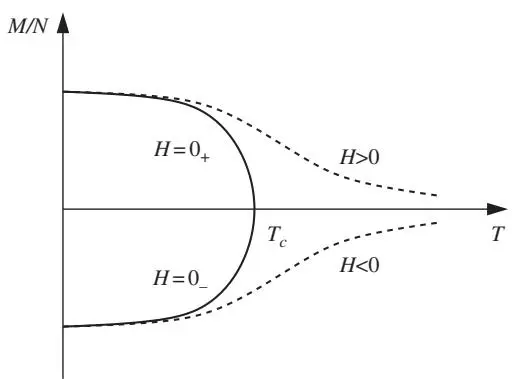
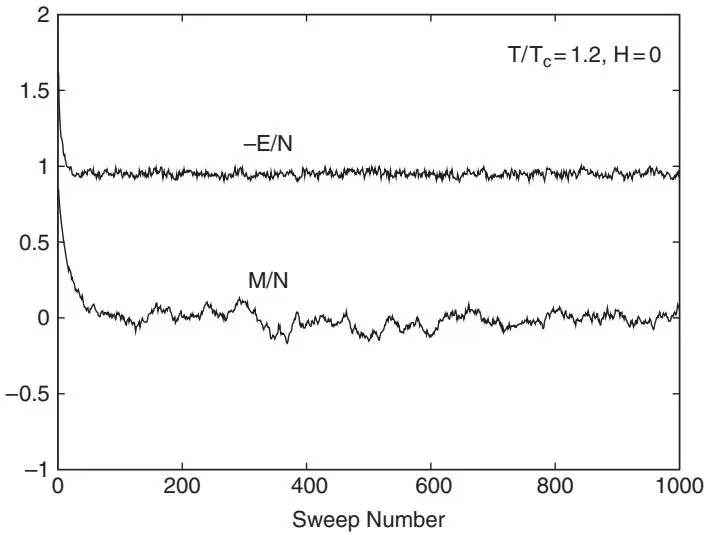
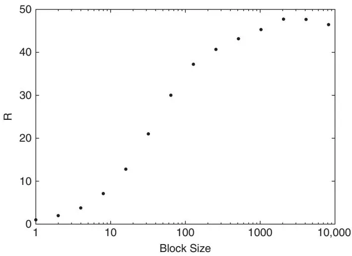
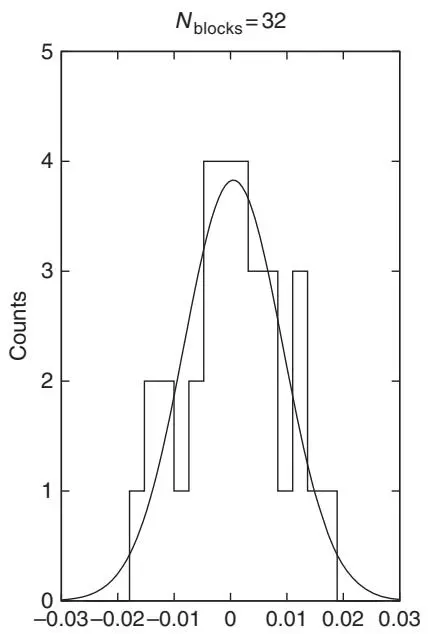
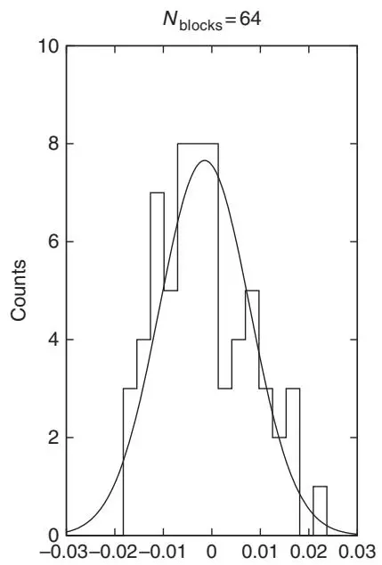
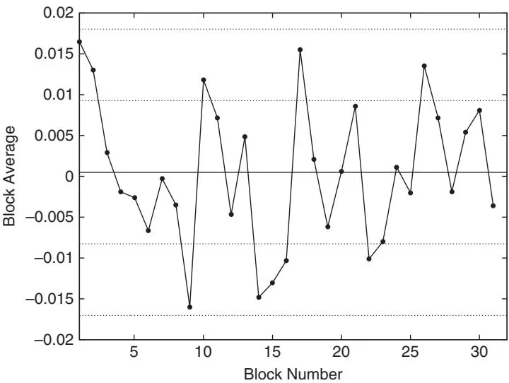
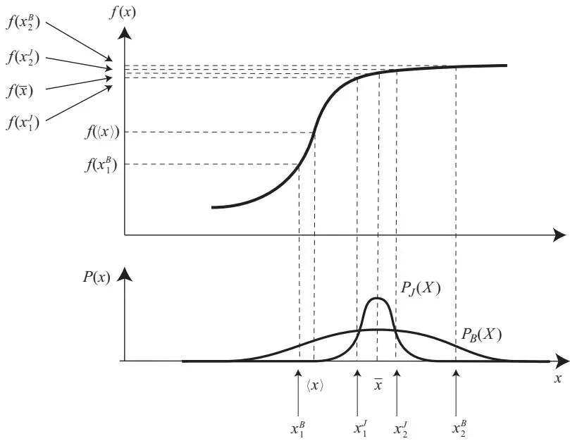

## 数据分析

任何蒙特卡洛模拟的重要组成部分都是对其生成的数据进行统计分析。这一分析的核心是计算相关物理可观测量的平均值，并估计这些平均值的统计误差。计算平均值很容易。它主要需要确保在统计可观测量的值之前，模拟是从平衡分布中进行构型采样的。估计误差则更困难。其难度增加并非在于评估其数学定义，即所谓的标准差，而是在于确保用于该公式的测量值在统计上是独立的。数据点之间的相关性取决于模型参数、可观测量以及所用采样算法的值。我们现在讨论用于分析蒙特卡洛模拟结果的常用程序的统计基础。

## 3.1 使采样达到平衡

我们从[第2.4节](ch02.md)了解到，马尔可夫链需要一定数量的步骤才能开始从其极限分布中进行采样。这种分布也被称为平衡分布，即使在我们模拟的问题并非平衡统计力学问题时也是如此。验证是否已到达平衡是所有马尔可夫链蒙特卡洛模拟的一项通用任务。一旦达到平衡，我们就希望利用链样本来估计各种物理量及其相关统计误差的值。

存在一些与物理相关的问题会使平衡过程变得特别困难，其中许多问题会影响相变附近的模拟。尽管我们可能知道预期的相是什么，但我们通常不知道相边界的精确位置。识别相并确定它们在参数空间中的位置是使用蒙特卡洛模拟的常见任务。

图3.1 二维伊辛模型在零场（实线）和非零场（虚线）下磁化强度随温度T变化的示意图。$T_{c}$ 是零场情况下的临界温度。每个格点的磁化强度（M/N）是序参量。

二维伊辛模型 $\begin{array} {r} {E = - J \sum_{\langle i j \rangle} s_{i} s_{j} + H \sum_{i} s_{i} .} \end{array}$，其中 $\langle ij \rangle$ 表示最近邻格点，是一个方便的示例，用于说明本节以及在相变附近达到平衡的困难以及本章的其他要点。

图3.1 描绘了二维伊辛模型磁化强度随温度T变化的示意图。在零场下，随着温度降低，在临界温度$T_{c} =$ $2 J / \log ( 1 + \sqrt{2} ) \approx 2.269 J$ 处发生二级（连续）相变，系统从无序相转变为有序相。在非零场下，在固定的 $T < T_{c}$ 处，当我们切换场的符号时，会发生一级相变。

在任一种相变附近，蒙特卡洛模拟，特别是那些基于局部更新的Metropolis或热浴算法的模拟，都会在达到平衡方面遇到困难。这些算法在相空间中移动时，构型的变化很小，伴随着能量的微小变化。一级相变的特点是两相之间界面张力产生的能垒，单步或连续几步移动很难跨越。这里的问题是长时间卡在相空间的某一部分。二级相变的特点是临界慢化。如果更新过程只局部改变构型，那么这种与发散关联长度相关的现象会影响蒙特卡洛模拟。这里的问题是知道系统何时已经弛豫。

在我们开始对数据进行适当分析之前，必须首先确定达到平衡所需的蒙特卡洛步骤数。这个数字通常被称为平衡时间。通常，我们通过扫描次数来衡量这个时间。一次扫描是指尝试对所有随机变量进行至少一次局部蒙特卡洛更新的过程的结果。例如，对于伊辛模型，这将涉及对每个格点位置上的伊辛自旋进行一次蒙特卡洛更新。

---

图3.2 每个格点的磁化强度$M / N$和每个格点能量的负值$- E / \bar{N}$作为蒙特卡洛扫描次数的函数向平衡态的弛豫过程。结果来自使用热浴算法模拟的二维零场伊辛模型。$T = 1.2 T_{c}$且$H = 0$。晶格大小为$100 \times 100$

估计平衡步骤数量的一种简单方法是将测量值作为蒙特卡洛扫描次数的函数绘制出来，然后保守地估计它们开始围绕平均值波动的次数。我们在图3.2中展示了这一技术，其中给出了二维零场伊辛模型中每个格点的磁化强度$( M / N )$和每个格点能量的负值$( - E / N )$的图。我们使用了热浴算法，并在$T = 1.2 T_{c}$（即高于临界温度的无序相）下进行模拟。晶格大小为$100 \times 100$，我们的初始构型是每个格点上的伊辛变量都“向上”的状态。从图中可以清楚地看出，不同的物理量以不同的速率弛豫。每个格点的能量似乎在50次扫描内达到平衡。磁化强度的平衡时间更长且更不明确。500到1000之间的值似乎是合理的。取较大的值是明智的。

虽然这里没有展示，但测试该估计值对随机数种子变化的敏感性是很有用的。在许多情况下，尝试具有不同对称性的初始构型也很重要。同样重要的是，用比最初估计的平衡时间长得多的扫描次数进行模拟，并在方便和适当的情况下仅绘制一部分数值，以检查平衡平台是否稳定，即是否不会向上或向下漂移，或者是否不会最终急剧下降或上升。

显然，图3.2中显示的连续测量值是相关的。平衡时间的正确定义需要为每个测量的物理量计算自相关时间，这告诉我们相关性在多少次蒙特卡洛扫描中持续存在。我们在[第3.3节](ch03.md)中给出了这个量的精确定义。然后，平衡时间可以定义为所有感兴趣的可观测量中自相关时间的最大值。在实践中，我们应该选择的平衡步骤数比这个平衡时间大几倍。

## 3.2 计算平均值与估计误差

系统达到平衡后，我们需要进行测量并估计其统计误差。这里我们介绍常用方法的统计基础。

蒙特卡洛采样产生一个构型序列$C_{i}$，从中我们计算出某个物理可观测量X的值序列$x_{i} = X ( C_{i} )$。随机变量的函数也是一个随机变量。因此，对于每个可观测量，我们产生一个不同的随机变量值序列。随机变量X的性质由其分布函数$f_{X} ( x )$决定。在蒙特卡洛模拟中，我们主要关注两个性质，即均值

$$
\langle x \rangle = \int d x x f_{X} ( x ) ,\tag{3.1}
$$

也称为平均值或期望值，以及方差

$$
\sigma_{X}^{2} = \int d x ( x - \langle x \rangle )^{2} f_{X} ( x ) = \langle x^{2} \rangle - \langle x \rangle^{2} ,\tag{3.2}
$$

也称为离差。

在已知均值和方差的情况下，切比雪夫不等式允许我们计算随机变量值落在某个区间内的可能性。该不等式指出，无论$f_{X} ( x )$的形式如何

$$
P \left( \langle x \rangle - k \sigma_{X} < x < \langle x \rangle + k \sigma_{X} \right) \geq 1 - \frac{1} {k^{2}} .\tag{3.3}
$$

---

这个定理的证明相对简单：由方差定义(3.2)可得

$$
\begin{array} {l} {\displaystyle \sigma_{X}^{2} \geq \int_{- \infty}^{\langle x \rangle - k \sigma} ( x - \langle x \rangle )^{2} f_{X} ( x ) d x + \int_{\langle x \rangle + k \sigma}^{\infty} ( x - \langle x \rangle )^{2} f_{X} ( x ) d x} \\ {\displaystyle \qquad \geq ( k \sigma )^{2} \int_{- \infty}^{\langle x \rangle - k \sigma} f_{X} ( x ) d x + ( k \sigma )^{2} \int_{\langle x \rangle + k \sigma}^{\infty} f_{X} ( x ) d x .} \end{array}
$$

因此，令 $\sigma^{2} = \sigma_{X}^{2}$，则得到 $P \left( | x - \langle x \rangle | \geq k \sigma_{X} \right) \quad \leq \quad k^{- 2}$，等价于(3.3)。

即使在细致平衡模拟中，我们虽然事先知道构型的分布函数，但并不知道我们针对该分布所测量的任何物理可观测量的事前均值和方差，因此我们还不能使用切比雪夫不等式。

为了获得这些信息，我们从随机变量X的一系列值 $x_{1} , x_{2} , \ldots , x_{M}$ 开始，并假设这些值是不相关的。它们的算术平均

$$
\bar{x} = \frac{1} {M} \sum_{i = 1}^{M} x_{i}\tag{3.4}
$$

称为样本均值（sample mean）。样本均值的期望值为

$$
\langle{\bar{x}} \rangle = {\frac{1} {M}} \sum_{i = 1}^{M} \langle x_{i} \rangle = {\frac{1} {M}} \sum_{i = 1}^{M} \langle x \rangle = \langle x \rangle
$$

其方差为

$$
\begin{array} {l} {{\displaystyle \sigma_{\bar{X}}^{2} = \left. \bar{x}^{2} \right. - \left. \bar{x} \right. ^{2} = \displaystyle \frac{1} {M^{2}} \Biggl \langle \sum_{i , j} x_{i} x_{j} \Biggl \rangle - \left. x \right. ^{2}}} \\ {{\displaystyle \quad = \frac{1} {M^{2}} \Biggl \langle \sum_{i} x_{i}^{2} + \sum_{i \neq j} x_{i} x_{j} \Biggl \rangle - \left. x \right. ^{2}} .} \end{array}\tag{3.5}
$$

由于 $x_{i}$ 之间不存在相关性，意味着 $\langle x_{i} x_{j} \rangle = \langle x_{i} \rangle \langle x_{j} \rangle = \langle x \rangle^{2}$，因此上式变为

$$
\sigma_{\bar{X}}^{2} = \frac{1} {M} \left. \frac{1} {M} \sum_{i = 1}^{M} x_{i}^{2} \right. - \frac{1} {M} \langle x \rangle^{2} = \frac{\sigma_{X}^{2}} {M} .\tag{3.6}
$$

因此，我们证明了样本均值与随机变量的均值相同，但其方差被序列中的项数所减小。切比雪夫不等式给出了置信区间

$$
P \left( \langle x \rangle - k \frac{\sigma_{X}} {\sqrt{M}} < \bar{x} < \langle x \rangle + k \frac{\sigma_{X}} {\sqrt{M}} \right) \geq 1 - \frac{1} {k^{2}} ,\tag{3.7}
$$

或者等价地

$$
P \left( \bar{x} - k \frac{\sigma_{X}} {\sqrt{M}} < \langle x \rangle < \bar{x} + k \frac{\sigma_{X}} {\sqrt{M}} \right) \geq 1 - \frac{1} {k^{2}} .
$$

我们看到，当M变得很大时，$\bar{x} \langle x \rangle$

我们的讨论假设我们知道方差 $\sigma_{X}^{2}$。但我们并不知道。我们如何估计它呢？对应于样本均值，有样本方差（sample variance）

$$
s_{\bar{X}}^{2} = {\frac{1} {M - 1}} \sum_{i = 1}^{M} ( x_{i} - \bar{x} )^{2} .\tag{3.8}
$$

$s_{\bar{X}}$ 称为标准差（standard deviation）。我们之前证明了 $\langle \bar{x} \rangle = \langle x \rangle$ 和 $\sigma_{\bar{X}}^{2} =$ $\sigma_{X}^{2} / M$ 。现在我们将证明

$$
\left. s_{\bar{X}}^{2} \right. = \sigma_{X}^{2} .\tag{3.9}
$$

首先我们写出 $( x_{i} - \langle x \rangle )^{2} = ( x_{i} - {\bar{x}} )^{2} + 2 ( x_{i} - {\bar{x}} ) ( {\bar{x}} - \langle x \rangle ) + ( {\bar{x}} - \langle x \rangle )^{2}$ 。对方程两边从1到M求和，注意到 $\begin{array} {r} {\sum_{i = 1}^{M} ( x_{i} - \bar{x} ) = 0} \end{array}$ ，并取期望值，我们得到

$$
M \sigma_{X}^{2} = \left. \sum_{i = 1}^{M} {( x_{i} - \bar{x} )^{2}} \right. + M \sigma_{\bar{X}}^{2} = \left. \sum_{i = 1}^{M} {( x_{i} - \bar{x} )^{2}} \right. + \sigma_{X}^{2} ,
$$

由此可推导出(3.9)式。

中心极限定理是比切比雪夫不等式更强的定理。它使我们能够定义更紧的置信区间，并估算获得该置信度所需的最少测量次数。在非常一般的条件下，主要是分布方差有限，该定理指出，当 $M \to \infty$ 时，随机变量 $\bar{x} = \sum_{i} x_{i} / M$ 的分布趋近于正态分布

$$
f_{\bar{X}} ( \bar{x} ) = \frac{1} {\sqrt{2 \pi \sigma_{\bar{X}}^{2}}} e^{- ( \langle x \rangle - \bar{x} )^{2} / 2 \sigma_{\bar{X}}^{2}} .
$$

由于定理告诉我们极限分布的形式是高斯分布，我们能够利用该函数的已知性质来表述更紧的置信区间：

$$
P \left( \bar{x} - \sigma_{\bar{X}} < \langle x \rangle < \bar{x} + \sigma_{\bar{X}} \right) = 0.65 ,\tag{3.10}
$$

$$
P \left( \bar{x} - 2 \sigma_{\bar{X}} < \langle x \rangle < \bar{x} + 2 \sigma_{\bar{X}} \right) = 0.95 ,\tag{3.11}
$$

$$
P \left( \bar{x} - 3 \sigma_{\bar{X}} < \langle x \rangle < \bar{x} + 3 \sigma_{\bar{X}} \right) = 0.99 ,\tag{3.12}
$$

这些分别被称为“一西格玛”、“二西格玛”和“三西格玛”置信区间。

本节的分析基于蒙特卡洛构型互不相关的假设。在实际模拟中，情况并非如此，因此我们必须转而关注如何促进统计独立性，以便能够利用样本方差和置信区间(3.10)–(3.12)的表达式来估算误差棒。

## 3.3 相关测量与自相关时间

如果我们回顾上一节的分析，很容易确信测量值序列中的相关性只会影响我们对方差的估计，但不会影响我们对均值的估计。让我们回到 $\bar{x}$ 方差(3.5)的计算，并且不再假设统计独立性：

$$
\begin{array} {l} {{\displaystyle \sigma_{\bar{X}}^{2} = \left. \bar{x}^{2} \right. - \left. \bar{x} \right. ^{2} = \displaystyle \frac{1} {M^{2}} \left. \sum_{i j} ( x_{i} x_{j} - \langle x_{i} \rangle \langle x_{j} \rangle ) \right.}} \\ {{\displaystyle \qquad = \frac{1} {M^{2}} \left. \sum_{i} \left( x_{i}^{2} - \langle x_{i} \rangle^{2} \right) + 2 \sum_{j > i} \left( x_{i} x_{j} - \langle x_{i} \rangle \langle x_{j} \rangle \right) \right. .}} \end{array}\tag{3.13}
$$

定义关联函数

$$
\chi_{| i - j |} \equiv \chi_{i j} \equiv \left. x_{i} x_{j} \right. - \left. x_{i} \right. \left. x_{j} \right.
$$

我们首先注意到它只是 $| i - j |$ 的函数，并且 $\chi_{0} = \langle x^{2} \rangle - \langle x \rangle^{2} = \sigma_{X}^{2}$ 。因此，我们可以将(3.13)重写为

$$
\sigma_{\bar{X}}^{2} = \frac{1} {M} \left[ \sigma_{X}^{2} + 2 \sum_{k = 1}^{M - 1} \left( 1 - \frac{k} {M} \right) \chi_{k} \right] ,
$$

然后进一步将其改写为

$$
\sigma_{\bar{X}}^{2} = \frac{\sigma_{X}^{~ 2}} {M} \left( 1 + 2 \tau_{X} \right) ,\tag{3.14}
$$

其中

$$
\tau_{X} = \sum_{k = 1}^{M - 1} \left( 1 - \frac{k} {M} \right) \frac{\chi_{k}} {\chi_{0}} .\tag{3.15}
$$

考察可知 $\tau_{X} \geq 0$，仅当数据不相关，即 $\chi_{k} = 0$ 对 $k \neq 0$ 时，该值才等于零。若如此，(3.14) 就退化为之前的结果 (3.6)。若存在相关性，(3.14) 表明，对于固定的测量次数 M，$\bar{x}$ 的方差会增加。相关性减少了有效的统计信息量，因为我们只生成了 $M / ( 1 + 2 \tau_{X} )$ 个不相关的样本。如果忽略相关性，(3.14) 意味着我们的误差估计会偏小。这种差异凸显了谨慎估计方差的重要性。

(3.15) 定义的量 $\tau_{X}$ 称为可观测量 X 的自相关时间（autocorrelation time）。计算 $\sigma_{X}^{2}$ 和 $\tau_{X}$ 是估计 $\sigma_{\bar{X}}^{2}$ 的一种方法。问题在于如何找到 $\tau_{X}$ 的无偏估计量。下一节的讨论提出了另一种方法，该方法基于提升测量的统计独立性，通常被称为分仓法（binning）、分批法（batching）、分组法（bunching）、分块法（blocking）等。我们采用“分块法”这一术语。

## 3.4 分块分析

分块法的基础如下。首先定义函数 var $( X ) = \sigma_{X}^{2}$，该函数返回随机变量 X 的方差。我们注意到

$$
\operatorname{var} ( a X ) = a^{2} \operatorname{var} ( X ) ,\tag{3.16}
$$

其中 $a$ 是某个常数，并且当 X 和 Y 相互独立时，有

$$
\operatorname{var} ( X + Y ) = \operatorname{var} ( X ) + \operatorname{var} ( Y ) .\tag{3.17}
$$

样本均值是一个随机变量，因此我们将其方差写为

$$
\operatorname{var} ( {\bar{X}} ) = \operatorname{var} \left( {\frac{1} {M}} \sum_{i = 1}^{M} x_{i} \right) = \operatorname{var} \left( {\frac{1} {N_{\mathrm{blocks}}}} \sum_{j = 1}^{N_{\mathrm{blocks}}} \left( {\frac{1} {m}} \sum_{i = ( j - 1 ) m + 1}^{j m} x_{i} \right) \right) ,
$$

其中，最后一步我们将 M 次测量分成了 $N_{\mathrm{blocks}}$ 个长度为 $m = M / N_{\mathrm{blocks}}$ 的数据块。这里我们假定块长度足够长，使得块平均值

$$
\bar{x}_{j} = \frac{1} {m} \sum_{i = ( j - 1 ) m + 1}^{j m} x_{i}
$$

是统计独立的。在这种情况下，(3.16) 和 (3.17) 意味着

$$
\mathrm{var} ( \bar{X} ) = \frac{1} {N_{\mathrm{blocks}}^{2}} \sum_{j = 1}^{N_{\mathrm{blocks}}} \mathrm{var} ( \bar{x}_{j} ) .
$$

接下来我们假设，对于足够长的数据块，这些块平均值具有共同的方差。因此，

$$
\operatorname{var} ( \bar{X} ) = \frac{1} {N_{\mathrm{blocks}}} \operatorname{var} ( \bar{X}_{\mathrm{block}} ) ,\tag{3.18}
$$

其中 $\bar{X}_{\mathrm{block}}$ 是表示块平均值的随机变量。具体地，我们使用估计式

$$
\mathrm{var} ( \bar{X}_{\mathrm{block}} ) \approx s_{\bar{X}_{\mathrm{block}}}^{2} = \frac{1} {N_{\mathrm{blocks}} - 1} \sum_{j = 1}^{N_{\mathrm{blocks}}} ( \bar{x}_{j} - \bar{x} )^{2} .\tag{3.19}
$$

图3.3 通过分块估计统计独立性。仿真方法、模型及其参数与图3.2 相同，可观测量为每格点磁化强度。数据流大小为 $1{,}000{,}000$，并去除了前500个数据。我们从块大小 $m := 1$ 开始，然后逐次翻倍。

“单西格玛”误差条由 $\sqrt{\mathrm{var} ( \bar{X} )}$ 给出。为了确定 $\mathrm{var} ( {\bar{X}} )$，我们计算

$$
R_{X} \equiv \frac{m \operatorname{var} ( \bar{X}_{\mathrm{block}} )} {\operatorname{var} ( X )} ,
$$

在数据块独立的极限下，该量将 $\mathrm{var} ( {\bar{X}} )$ 与“不相关”估计值 var $( X ) / M $ 联系起来：1

$$
\operatorname{var} ( {\bar{X}} ) = R_{X} {\frac{\operatorname{var} ( X )} {M}} .\tag{3.20}
$$

我们绘制了不同块大小m下的$R_{X}$，如图3.3所示（数据为每格点磁化强度，完整数据流长度为$M = 10^{6}$）。随着块大小增加，快平均值变得统计独立，$\mathrm{var} ( \bar{X}_{\mathrm{block}} )$与m成反比。此时$R_{X}$达到饱和，我们就可以利用(3.18)得到$\mathrm{var} ( {\bar{X}} )$。在图3.3的例子中，饱和发生在$m^{\mathrm{plateau}} = 1024$左右，饱和值为$\bar{R}_{X}^{\mathrm{plateau}} \approx 50$。这意味着，如果忽略连续测量之间的关联，我们将低估一倍标准差的误差棒约$\sqrt{50} \approx 7$倍。如果在块大小m接近最大可用值约$\mathcal{O} ( M / 100 )$之前仍未出现平台，那我们就需要更多的数据来计算有意义的误差棒。

由定义(3.14)和(3.20)可知，自相关时间τ与值$R_{X}^{\mathrm{plateau}}$的关系为：

$$
\tau_{X} = \frac{1} {2} \left( R_{X}^{\mathrm{plateau}} - 1 \right) .\tag{3.21}
$$

不同可观测量的自相关时间可能不同。其中最大值决定了平衡时间。

## 3.5 数据充分性

中心极限定理并未告诉我们需要多少个独立块才能使数据分布变为高斯分布。实际上$N_{\mathrm{blocks}}$并不需要很大。当本书一位作者编写他的第一个蒙特卡洛代码时，他请教了一位从事蒙特卡洛模拟几十年的资深同事：“我需要多少个不相关值？”对方回答说：“32”，然后就走开了。这个简短的回答通常大致正确。

虽然统计学领域有许多方法用于定义一组数据服从高斯分布的概率，但一种方便、简单且实用的替代方法是将数据直方图与以$\bar{x}$为中心、半宽为$\sigma_{\bar{X}}$的高斯曲线叠加，观察它们是否相似。我们在图3.4中展示了$N_{\mathrm{blocks}} = 32$和64的情况。虽然$\mathbf{\ddot{\Pi}}^{6} \mathbf{f}^{\prime}$ 看起来可能不太好，但在两种情况下，符合程度实际上都是令人满意的。每种情况直方图都有20个箱。将32或64个值分配到这些箱中，得到的箱计数相对于每个箱中的数据量来说波动较大。2

偏离高斯行为通常表现为直方图向左或向右偏斜，这称为偏度。或者直方图显得过窄或过矮，这称为峰度。也可能出现多个峰。高斯分布的偏度和峰度均为$0$. 3作为补充检验，可以计算这两个量的定量度量：

$$
{\mathrm{skewness}} = {\frac{\sum_{i = 1}^{N_{\mathrm{blocks}}} ( {\bar{x}}_{i} - {\bar{x}} )^{3}} {( N_{\mathrm{blocks}} - 1 ) s_{\bar{X}}^{3}}} , \quad{\mathrm{kurtosis}} = {\frac{\sum_{i = 1}^{N_{\mathrm{blocks}}} ( {\bar{x}}_{i} - {\bar{x}} )^{4}} {( N_{\mathrm{blocks}} - 1 ) s_{\bar{X}}^{4}}} - 3
$$

图3.4 直方图与期望的高斯计数。模拟方法、模型及其参数同图3.2。

可以很容易地计算出来，与高斯值进行比较。另一种检验是高斯分布与直方图之间的拟合优度检验（goodness-to-fit test）。

控制图（control chart）是一种简单、快速、直观的检查，用于验证所提议的平衡步数、块大小和扫描步数的一致性。图3.5绘制了能量的块平均值随块编号的变化。实水平线是每个格点的平均磁化强度；虚水平线位于其上方和下方一个和二倍标准差处。我们使用了众所周知的32个块。如果严重低估了平衡步数，就会看到数据中存在漂移。这里似乎并非如此。如果扫描步数和块大小大致合适，我们期望在 $\bar{x} - \sigma_{\bar{X}}$ 和 $\bar{x} + \sigma_{\bar{X}}$ 之间看到约21个（0.65乘32）标记，在 $\bar{x} - 2 \sigma_{\bar{X}}$ 和 $\bar{x} + 2 \sigma_{\bar{X}}$ 之间看到约30或31个（0.95乘32）标记，因此可能还有1或2个标记在该范围之外。我们的控制图与这些期望一致。由于这些置信区间是基于统计的，波动可能导致与期望值的偏差。这种类型的图可以很好地检验数据是否需要更仔细地分析。

在该图中，统计“向上游程”和“向下游程”的数量也很有用，即连续递增或递减的数值个数。如果数据服从高斯分布，结果看起来会像“白噪声”，向上和向下的游程很短。如果游程一致地很长，那么块平均值之间可能存在相关性，需要进行进一步分析。

图3.5 针对图3.4中 $N_{\mathrm{blocks}} = 32$ 情况的控制图。

虽然上述数据分析提供了误差的估计，但特定的应用可能需要很小的误差棒。为了减小误差棒，我们生成更多的块。误差随 $1 / \sqrt{N_{\mathrm{blocks}}}$ 减小，而计算时间与 $N_{\mathrm{blocks}}$ 成正比增长。

统计学领域拥有大量额外的检验和定理，有时对于棘手的模拟很有帮助。但这些超出了本书的范围。本章讨论的方法通常足以分析蒙特卡洛数据，并可靠地给出估计均值及其统计误差。还有一点需要牢记：除非模拟恰当地平衡并且采样是遍历的，否则这些估计可能毫无意义。如第2.4.2节所述，模拟可能会卡在相空间的有限区域。那么，采集到的数据的均值和误差仅反映这部分相空间，并且可能与以正确频率访问整个相空间得到的值完全无关。

本章开始时，我们讨论了采样的平衡，指出了某些“卡住”机制，这些机制可能会影响一级相变和连续相变的模拟。我们还说明了（图3.2）两个不同的观测量通常以不同的速率达到平衡。顺便提一下，我们注意到了对模拟进行实验的必要性，以检验结果对初始构型、其对称性等变化的敏感性。这些研究和其他研究与刚才讨论的相对常规的统计分析一样，对模拟的不确定性量化至关重要。不同的问题通常需要不同类型的实验。没有万无一失的方法来确保平衡和遍历采样。研究者的经验和有效算法的使用是重要因素。

## 3.6 误差传播

有时我们需要估计两个或多个随机变量的函数的方差。一个此类关注量的例子是Binder比（Binder ratio），定义为

$$
B_{X} = \frac{\langle X^{4} \rangle} {\langle X^{2} \rangle^{2}} .\tag{3.22}
$$

当随机变量X为磁化强度时，该比值在伊辛模型及其他自旋模型相边界的有限尺寸标度分析中非常有用。由于分子和分母的值是利用相同的$\{x_{i} = X ( C_{i} ) \}$计算得出的，因此它们具有统计相关性。在计算与$B_{X}$相关的误差时，我们应如何解释这些相关性？

在进行多变量方差估计时，方差概念的几种推广形式非常有用。两个随机变量X和Y的协方差为

$$
\operatorname{cov} ( X , Y ) = \langle ( x - \langle x \rangle ) ( y - \langle y \rangle ) \rangle ,\tag{3.23}
$$

而这两个变量的相关系数为

$$
\rho ( X , Y ) = \frac{\mathrm{cov} ( X , Y )} {\sigma_{X} \sigma_{Y}} .
$$

协方差cov(X, Y)的数值估计为

$$
\operatorname{cov} ( X , Y ) \approx{\frac{1} {M - 1}} \sum_{i = 1}^{M} {( x_{i} - {\bar{x}} )} \left( y_{i} - {\bar{y}} \right) ,\tag{3.24}
$$

而$\rho ( {\boldsymbol{X}} , Y )$的数值估计为

$$
\rho ( X , Y ) \approx{\frac{\displaystyle \sum_{i = 1}^{M} ( x_{i} - {\bar{x}} ) ( y_{i} - {\bar{y}} )} {\displaystyle \sqrt{\sum_{i = 1}^{M} \left( x_{i} - {\bar{x}} \right)^{2} \sum_{j = 1}^{M} \left( y_{j} - {\bar{y}} \right)^{2}}}} .\tag{3.25}
$$

相关系数满足$| \rho ( X , Y ) | \leq 1$。

首先讨论如何估计任意函数g的$g ( \langle x \rangle )$及其相关误差。估计$g ( \langle x \rangle )$的一种可能方法是计算

$$
\overline{{\boldsymbol{g} ( \boldsymbol{x} )}} \equiv \frac{1} {M} \sum_{i = 1}^{M} \boldsymbol{g} ( \boldsymbol{x}_{i} ) ,\tag{3.26}
$$

另一种方法是计算

$$
g ( \bar{x} ) \equiv g \left( \frac{1} {M} \sum_{i = 1}^{M} x_{i} \right) .\tag{3.27}
$$

当M很大且$g$为非线性时，后一个估计量更好。将(3.26)关于$\Delta x \equiv x - \langle x \rangle$展开，然后取期望值，得到

$$
\begin{array} {l} {\displaystyle \left. \overline{{g ( x )}} \right. = \left. g ( \langle x \rangle ) + g^{\prime} | _{\langle x \rangle} \Delta x + \frac 12 g^{\prime \prime} | _{\langle x \rangle} ( \Delta x )^{2} + \cdots \right.} \\ {\displaystyle = g ( \langle x \rangle ) + \frac 12 g^{\prime \prime} | _{\langle x \rangle} \mathrm{var} ( X ) + \cdots .} \end{array}
$$

类似地，将(3.27)关于$\Delta \bar{x} \equiv \bar{x} - \langle x \rangle$展开，得到

$$
\begin{array} {c l c r} {{\displaystyle \langle g ( \bar{x} ) \rangle = \left. g ( \langle x \rangle ) + g^{\prime} | _{\langle x \rangle} \Delta \bar{x} + \frac{1} {2} g^{\prime \prime} | _{\langle x \rangle} ( \Delta \bar{x} )^{2} + \cdot \cdot \cdot \right.}} \\ {{\displaystyle = g ( \langle x \rangle ) + \frac{1} {2} g^{\prime \prime} | _{\langle x \rangle} \mathrm{var} ( \bar{X} ) + \cdot \cdot \cdot ,}} \end{array}\tag{3.28}
$$

其中第二项有$\operatorname{var} ( {\bar{X}} ) ~ = ~ \operatorname{var} ( X ) / M$。我们注意到，(3.26)和(3.27)都不是$g ( \langle x \rangle )$的无偏估计量。如果一个估计量的期望值等于其真实值，则该估计量是无偏的。上述估计量存在一个系统误差，该误差与函数$g ( x )$在$x = \langle x \rangle$处的曲率成正比。然而，对于第二个估计量(3.27)，系统误差与$1 / M$成正比。这个偏差可以忽略，因为它远小于统计误差，而统计误差与$1 / \sqrt{M}$成正比。

实际上，我们来计算估计量(3.27)的统计误差。均方误差的期望值为

$$
\left. ( \Delta g ( \bar{x} ) )^{2} \right. = \left. ( g ( \bar{x} ) - g ( \langle x \rangle ) )^{2} \right. \approx \left. \left( g^{\prime} | _{\bar{x}} \Delta \bar{x} \right)^{2} \right. = \left( g^{\prime} | _{\bar{x}} \right)^{2} \mathrm{var} ( \bar{X} ) .\tag{3.29}
$$

数值方差估计由(3.18)和(3.19)给出，我们在 \( \bar{x} \) 处评估 \( g^{\prime} \)，而不是在 \( \langle x \rangle \) 处。这种近似对误差估计的影响应该很小。

类似地，对于双变量函数，我们使用估计 \( g ( \langle x \rangle , \langle y \rangle ) \approx g ( {\bar{x}} , {\bar{y}} ) \) 并计算方差为

$$
\begin{array} {r l} & {\left. ( \Delta g ( \bar{x} , \bar{y} ) )^{2} \right. = \left. ( g ( \bar{x} , \bar{y} ) - g ( \langle \bar{x} \rangle , \langle \bar{y} \rangle ) )^{2} \right.} \\ & {\qquad \approx \left. \left( \partial_{x} g | _{\langle x \rangle , \langle y \rangle} \Delta \bar{x} + \partial_{y} g | _{\langle x \rangle , \langle y \rangle} \Delta \bar{y} \right)^{2} \right.} \\ & {\qquad \approx \left( \partial_{x} g | _{\bar{x} , \bar{y}} \right)^{2} \operatorname{var} ( \bar{X} ) + \left( \partial_{y} g | _{\bar{x} , \bar{y}} \right)^{2} \operatorname{var} ( \bar{Y} ) + 2 \partial_{x} g | _{\bar{x} , \bar{y}} \partial_{y} g | _{\bar{x} , \bar{y}} \operatorname{cov} ( \bar{X} , \bar{Y} ) ,} \end{array}
$$

其中我们再次在 \( x = \bar{x} \) 和 \( y = \bar{y} \) 处评估导数。例如，如果 \( g ( \langle x \rangle , \langle y \rangle ) = \langle x \rangle / \langle y \rangle \)，我们发现

$$
\frac{\left. ( \Delta ( \bar{x} / \bar{y} ) )^{2} \right.} {( \bar{x} / \bar{y} )^{2}} \approx \frac{\mathrm{var} ( \bar{X} )} {\bar{x}^{2}} + \frac{\mathrm{var} ( \bar{Y} )} {\bar{y}^{2}} - 2 \frac{\mathrm{cov} ( \bar{X} , \bar{Y} )} {\bar{x} \bar{y}} .\tag{3.30}
$$

这个特定表达式对于误差估计很有用，例如当模拟存在小到中等程度的符号问题（[第5.4节](ch05.md)）时。在这种情况下，分子是符号加权平均值，分母是平均符号。

## 3.7 Jackknife 分析

计算完整的相关矩阵和函数的导数来估计平均值的函数及其方差可能很繁琐。jackknife 方法是一种数据重采样方法，通常提供了一个很好的替代方案。它的使用很简单，因为这些估计是样本均值（3.4）和样本方差（3.8）标准定义的推广。

让我们定义“删除平均” \( x_{[i]} \) 为忽略值 \( x_{i} \) 后的样本平均

$$
x_{[ i ]} = \frac{1} {M - 1} \sum_{j \neq i} x_{j} = \frac{M \bar{x} - x_{i}} {M - 1} .
$$

可以简单证明，删除平均 \( x_{[ i ]} \) 的样本平均等于样本平均 \( {\bar{x}} \),

$$
{\overline{{x_{\mathrm{[ ]}}}}} = {\bar{x}} .
$$

同样可以简单证明

$$
s_{[ ]}^{2} = \frac{M - 1} {M} \sum_{i = 1}^{M} \left( x_{[ i ]} - \overline{{x_{[ ]}}} \right)^{2}
$$

等于样本方差（3.8）。

在实践中，jackknife 方法应用于我们在讨论分块分析时引入的块平均。过程如下：我们将 \( M \) 个测量值（应足够大）分成 \( N_{\mathrm{blocks}} \) 个长度为 \( m \) 的块，其中 \( m \) 大于自相关时间 \( \tau \)。然后我们计算平均值

$$
x_{[ i ]} = \frac{1} {N_{\mathrm{blocks}} - 1} \sum_{j \neq i} \bar{x}_{j} , \quad i = 1 , \ldots , N_{\mathrm{blocks}} ,\tag{3.31}
$$

这里我们使用除第 \( i \) 块之外的所有块，而 \( \bar{x}_{j} \) 表示块 \( j \) 上的平均值。接下来我们定义 \( g_{[ i ]} = g ( x_{[ i ]} ) \)。\( g ( \langle x \rangle ) \) 的简单 jackknife 估计是这些 \( g_{[ i ]} \) 的平均值 \( \overline{{g_{[ ]}}} \)：

$$
g ( \langle x \rangle ) \approx \overline{{g_{[ ]}}} \equiv \frac{1} {N_{\mathrm{blocks}}} \sum_{i = 1}^{N_{\mathrm{blocks}}} g_{[ i ]} .\tag{3.32}
$$

使用（3.19）和（3.18），我们发现

$$
g_{[ i ]} = g \biggl ( \frac{1} {N_{\mathrm{blocks}} - 1} \sum_{j \ne i} \bar{x}_{j} \biggr ) = g \biggl ( \bar{x} + \frac{1} {N_{\mathrm{blocks}} - 1} ( \bar{x} - \bar{x}_{i} ) \biggr )
$$

的泰勒级数展开的期望值等于

$$
\begin{array} {r l r} & {} & {\langle g_{[ i ]} \rangle = \langle g ( \bar{x} ) \rangle + \cfrac{1} {2 ( N_{\mathrm{blocks}} - 1 )} g^{\prime \prime} | _{\bar{x}} \frac{\mathrm{Var} ( \bar{X}_{\mathrm{block}} )} {N_{\mathrm{blocks}}} + \cdot \cdot \cdot} \\ & {} & \\ & {} & {\qquad = \langle g ( \bar{x} ) \rangle + \cfrac{1} {2 ( N_{\mathrm{blocks}} - 1 )} g^{\prime \prime} | _{\bar{x}} \mathrm{var} ( \bar{X} ) + \cdot \cdot \cdot .} \end{array}\tag{3.33}
$$

这个式子表明，与（3.28）相比，刀切估计中的偏差减少了因子 $1 / ( N_{\mathrm{blocks}} - 1 )$ 。将（3.28）和（3.33）结合，我们得到一个不含 $g^{\prime \prime}$ 偏差的估计量： $^{4}$

$$
g ( \langle x \rangle ) \approx N_{\mathrm{blocks}} g ( \bar{x} ) - ( N_{\mathrm{blocks}} - 1 ) \overline{{g_{[ ]}}} .\tag{3.34}
$$

现在我们来展示 $g ( \langle x \rangle )$ 的误差估计为

$$
\left. ( \Delta g ( \bar{x} ) )^{2} \right. \approx \frac{N_{\mathrm{blocks}} - 1} {N_{\mathrm{blocks}}} \sum_{i = 1}^{N_{\mathrm{blocks}}} ( g_{[ i ]} - g ( \bar{x} ) )^{2} .\tag{3.35}
$$

由于 $g_{[ i ]} - g ( \bar{x} ) \approx g^{\prime} | _{\bar{x}} ( \bar{x} - \bar{x}_{i} ) / ( N_{\mathrm{blocks}} - 1 )$ ，由（3.18）和（3.19）可得

$$
\frac{N_{\mathrm{blocks}} - 1} {N_{\mathrm{blocks}}} \sum_{i = 1}^{N_{\mathrm{blocks}}} ( g_{[ i ]} - g ( \bar{x} ) )^{2} \approx \frac{( g^{\prime} | \bar{x} )^{2}} {N_{\mathrm{blocks}} ( N_{\mathrm{blocks}} - 1 )} \sum_{i = 1}^{N_{\mathrm{blocks}}} ( \bar{x} - \bar{x}_{i} )^{2}
$$

$$
= ( g^{\prime} | _{\bar{x}} )^{2} \frac{\mathrm{var} ( \bar{X}_{\mathrm{blocks}} )} {N_{\mathrm{blocks}}} = ( g^{\prime} | _{\bar{x}} )^{2} \mathrm{var} ( \bar{X} ) ,
$$

这与（3.29）一致。

刀切过程很容易推广到关于一个或多个观测量的任意函数 $f$ ，例如（3.22）。如果 $f ( \{\bar{x}_{j} \} )$ 是基于块系综 $\{\bar{x}_{j} \}$ 中观测量期望值的估计，我们定义 $f_{[ i ]} = f ( \{\bar{x}_{j \neq i} \} )$ 。那么均值和方差的刀切估计为

$$
\overline{{f_{\mathrm{[ ]}}}} = \frac{1} {N_{\mathrm{blocks}}} \sum_{i = 1}^{N_{\mathrm{blocks}}} f_{[ i ]} ,\tag{3.36}
$$

$$
\langle ( \Delta f )^{2} \rangle = \frac{N_{\mathrm{blocks}} - 1} {N_{\mathrm{blocks}}} \sum_{i = 1}^{N_{\mathrm{blocks}}} ( f_{[ i ]} - \overline{{f_{[ ]}}} )^{2} .\tag{3.37}
$$

让我们以关于刀切方法局限性的几点评论来结束本节。通过将删除平均的定义 (3.31) 重写为 $x_{[ i ]} = \bar{x} + \frac{1} {N_{\mathrm{blocks}} - 1} ( \bar{x} - \bar{x}_{i} )$，可以明显看出，刀切集合（jackknife ensemble）的成员分布在一个小的样本空间中，该空间以原始集合的平均值为中心，其线性尺度比原始集合小 $N_{\mathrm{blocks}} \mathrm{~ - ~} 1$ 倍。因此，该空间的线性尺度约为统计误差的 $\sqrt{N_{\mathrm{blocks}}}$ 倍，而统计误差是 $\mathcal{O} ( 1 / \sqrt{N_{\mathrm{blocks}}} )$。结果，我们需要将 (3.35) 中刀切集合的方差乘以一个 $N_{\mathrm{blocks}}$ 量级的因子，才能得到 $g ( \bar{x} )$ 中平方统计误差的估计量。虽然刀切集合能正确捕捉 $g$ 的局部曲率，并且在以正确期望值为中心、大小为 $1 / \sqrt{N_{\mathrm{blocks}}}$ 的区域内函数梯度变化不大时效果良好，但当函数 $g$ 的非线性很强时（图3.6），它可能会失效。在后一种情况下，刀切集合所覆盖的小样本空间可能不包含正确的期望值 $\langle x \rangle$。

## 3.8 自助法分析

我们可以通过使用一种模仿样本平均值 $\bar{x}$ 更广泛分布的重采样方法来克服刀切分析的局限性。自助法（bootstrap method）是为此目的常用的一种方法。该集合的一个成员，记为 $x_{i}^{\prime} ( i = 1 , 2 , \ldots , N_{\mathrm{bootstrap}} )$，是通过从原始块平均集合中随机抽取 $N_{\mathrm{blocks}}$ 个样本 $\bar{x}_{j}$ 生成的，不刻意避免多次抽取同一个样本。结果，原始集合中的某些成员一次也没被选中，而有些被选中一次，有些两次，依此类推。然后 $x_{i}^{\prime}$ 被定义为这些 $N_{\mathrm{blocks}}$ 个值的平均值。因此，形式上，$\begin{array} {r} {x_{i}^{\prime} = \frac{1} {N_{\mathrm{blocks}}} \sum_{k = 1}^{N_{\mathrm{blocks}}} \bar{x}_{\rho ( i , k )}} \end{array}$ ，其中 $\rho ( i , k ) = 1 , 2 , \ldots , N_{\mathrm{blocks}}$ 是一个均匀随机整数，且如果 $( i , k ) \neq ( j , k^{\prime} )$，则 $\rho ( i , k )$ 和 $\rho ( j , k^{\prime} )$ 在统计上是独立的。

由于这种取平均值的过程，自助法集合的标准差与原始集合的标准差乘以 $1 / \sqrt{N_{\mathrm{blocks}}}$ 具有相同的量级，即 $\mathrm{var} ( \{x_{i}^{\prime} \} ) \sim \mathrm{var} ( \{\bar{x}_{i} \} ) / N_{\mathrm{blocks}}$。因此，自助法集合的方差与样本平均值的方差相当：$\mathrm{var} ( \{x_{i}^{\prime} \} ) \sim \operatorname{var} ( {\bar{x}} )$。结果，正确的值 $\langle x \rangle$ 应大概率包含在自助法集合所覆盖的样本空间中，并且 $g ( \langle x \rangle )$ 的正确值应落在这个区域的像中。我们在图3.6中对此进行了说明。

图3.6 通过刀切法和自助法分析估计强非线性函数。自助法样本大致分布在区域 $x_{1}^{B} < x < x_{2}^{B}$ 上。因此，$f^{*} \equiv f ( \langle x \rangle )$ 的置信区间为 $f ( x_{1}^{B} ) < f^{*} < f ( x_{2}^{B} )$。刀切法样本分布在窄得多的区间 $x_{1}^{J} < x < x_{2}^{J}$ 上。于是刀切分析的 $f^{*}$ 置信区间为 $f ( x_{1}^{J} ) < f^{*} < f ( x_{2}^{J} )$，并通过因子 $\sqrt{N_{\mathrm{blocks}}}$（在此示例中约为4）进行了扩展。显然，因子4不足以覆盖 $f^{*}$ 的正确值。

如果非线性不那么强，稍微精确一点的算术计算表明，$g ( \bar{x} )$ 中统计误差的估计可以通过自助法样本的方差获得，即

<!-- bootstrap method = 自助法 (或：自助法分析) -->

$$
\sigma^{2} \equiv \left. \left( g ( \bar{x} ) - g ( \langle x \rangle ) \right)^{2} \right. \approx \frac{N_{\mathrm{blocks}}} {N_{\mathrm{blocks}} - 1} \left. \left( g ( x_{i}^{\prime} ) - g ( \bar{x} ) \right)^{2} \right.
$$

当 $N_{\mathrm{bootstrap}} \gg 1$ 时成立。与刀切分析（jackknife analysis）相比，即使函数 $g$ 的非线性很强，该估计量也应产生合理的结果。

## 3.9 蒙特卡洛计算机程序

算法 5 展示了蒙特卡洛程序的核心结构，该结构非常简单。这一结构假定数据分析是模拟后处理过程。除了处理器速度持续大幅提升外，过去几年中外存成本和访问速度也显著改善，这使得任务分离既可行又有利。不久以前，这还并非总能实现。前文介绍的一些数据分析方法，如使用控制图（control chart）和刀切法，实际上都需要模拟后分析。

算法 5 需要输入物理模型的参数。它首先定义或读取模拟参数，初始化程序所需的数组和变量，定义初始蒙特卡洛构型（Monte Carlo configuration），甚至可能设置随机数生成器的种子。程序最重要的构建块是一个执行整个构型更新的例程。例如，在基于局域更新的经典伊辛模型模拟中，该函数将遍历所有格点并对每个自旋提出更新。我们称之为“蒙特卡洛扫描（Monte Carlo sweep）”。第二个最重要的过程是计算可观测量（例如能量或磁化强度）的例程。计算哪些量取决于具体问题。进行测量时，结果会累积到适当的数据容器中。这个数据收集过程是模拟的结果，并在模拟结束时保存。根据数据量以及保存数据所需时间相对于一次扫描执行成本的比较，数据可能会在测量后立即写入，从而省去最终输出步骤。为避免初始构型选择带来的偏差，前 $N_{\mathrm{equil}}$ 次扫描（$N_{\mathrm{equil}}$ 大于热化时间）不进行测量。$N_{\mathrm{sweep}}$ 是热化后执行的扫描次数。测量计算成本与一次扫描成本的关系通常建议仅每隔 $N_{\mathrm{skip}}$ 个构型测量并保存一次，其中 $N_{\mathrm{skip}}$ 的量级与最短自相关时间相当。

算法 5 蒙特卡洛程序的结构。
输入：模型和控制参数（Nequil = 热化扫描次数，
Nsweep = 扫描次数，Nskip = 测量间的更新次数），
以及用于存储测量结果的累加器。
初始化模拟；
for i = 1 to $N_{\mathrm{equil}}$ do
执行蒙特卡洛扫描；
end for
for i = 1 to $N_{\mathrm{sweep}}$ do
执行一次蒙特卡洛扫描；
如果 i 是 $N_{\mathrm{skip}}$ 的倍数，则
执行测量并累加结果；
end if
end for
返回累加器。

对于模拟后数据处理，另一个计算机程序从磁盘加载数据并计算均值和方差。对于分块分析（blocking analysis），循环遍历块大小 $m_{l} = 2^{l}$，并计算每个块中测量得到的可观测量的平均值。这些块平均测量的方差除以块数，即得到迭代次数 $l$ 的误差估计平方。监测误差随 $l$ 的增加情况，如果出现饱和，则饱和值可给出一个标准误差线（one-sigma error bar）平方的可靠估计。如果在最大可能块大小（约为数据流长度的两个数量级以下）之前未出现饱和，则无法获得可靠的误差估计。此时需要更多的模拟数据。

有些模拟需要计算大量可观测量。虽然定位伊辛模型的相边界只需要计算能量、序参量等少量简单量，但在一类更奇特的模型中探索新物相的发现，则可能需要计算多个关联函数在很大范围内随模型参数和控制参数的空间依赖性。在这种情况下，存储成本可能成为问题，数据文件管理需要在模拟前做好规划。

关于是在模拟过程中即时完成全部或部分数据分析，还是在模拟结束后再统一分析，不同的人有不同的偏好。从实践角度看，输出若干选定测量的即时分块平均流，是监控模拟状态的一种便捷实时指示器。这类指示器在代码开发阶段尤其有帮助，即在开发更新构型的程序时。在代码开发阶段，使用同一随机数序列重跑模拟的能力也至关重要。即使所有测量都在模拟过程中完成，也建议将选定的若干测量数据流输出到外部存储用于检查，以防出现异常情况。作为一种随机过程，蒙特卡洛模拟容易受到稀有事件的影响。手头拥有这些信息流，有助于区分稀有事件、编码错误和算法不稳定性，从而避免重新运行模拟（使用相同的随机数种子）来复现问题，并可能帮助更快地解决问题。

## 推荐阅读

M. H. Kalos 和 P. A. Whitlock, *Monte Carlo Methods*, vol. 1: *The Basics* (New York: Wiley-Interscience, 1986), [第2章](ch02.md)。

A. Papoulis, *Probability and Statistics* (Englewood Cliffs, NJ: Prentice Hall, 1990), 第4、7、9章。

W. H. Press, S. A. Teukolsky, W. T. Vettering 和 B. P. Flannery, *Numerical Recipes* (Cambridge University Press, 1992), 第14章。

## 习题

3.1 编写一个简短的计算程序，使用热浴算法或Metropolis算法模拟有外磁场中的二维伊辛模型。复杂程度不同的FORTRAN和C程序示例可以通过搜索网络或查阅 Parision (1988)、Landau 和 Binder (2000)、或 Newman 和 Barkema (1999) 找到。在测量集合中加入比热容的计算。

3.2 对于一个 $32 \times 32$ 的格点，重复图3.2至图3.5中的分析。

3.3 对于一系列趋近 $T_{c}$ 的温度，重复习题3.2。

3.4 对于几个较大的格点尺寸，在等于 $T_{c}$ 的温度下重复习题3.2。

3.5 对于一系列从零开始增加的外磁场，重复习题3.2。

3.6 如果 var(X) 是返回随机变量 X 方差 (3.2) 的函数，而 cov(X, Y) 是返回随机变量 X 和 Y 协方差 (3.23) 的函数，证明 cov $( X , Y )^{2} \leq \operatorname{var} ( X ) \operatorname{var} ( Y )$，从而有 $- 1 \le \rho ( X , Y ) \le 1$。

3.7 函数 $g ( x , y )$ 关于分布 $p ( x , y )$ 中变量 x 的条件均值为

$$
E \left[ g ( x , y ) | x \right] = \int g ( x , y ) p ( x , y ) d y .
$$

证明：

1. $\begin{array} {r} {E \left[ g ( x , y ) | x \right] = \int g ( x , y ) p ( x , y ) d y .} \end{array}$

2. $E [ E [ g ( x , y ) | x ] ] = E [ g ( x , y ) ] .$

3. $E \left[ g_{1} ( x ) g_{2} ( y ) | x \right] = g_{1} ( x ) E \left[ g_{2} ( y ) | x \right] .$

4. $E \left[ g_{1} ( x ) g_{2} ( y ) \right] = E \left[ g_{1} ( x ) E \left[ g_{2} ( y ) \ : | x \right] \right] .$

3.8 条件方差定义为：

$$
\begin{array} {c} {{\mathrm{var} \left[ g ( x , y ) \left| x \right. \right] = E \left[ \left( g ( x , y ) - E \left[ g ( x , y ) \left| x \right. \right] \right)^{2} \right]}} \\ {{= E \left[ g^{2} ( x , y ) \left| x \right. \right] - E^{2} \left[ g ( x , y ) \left| x \right. \right] .}} \end{array}
$$

证明：

$$
\begin{array} {r l} & {E \left[ \mathrm{var} \left[ g ( x , y | x ) \right] \right] + \mathrm{var} \left[ E \left[ g ( x , y ) \left| x \right. \right] \right]} \\ & {\qquad = E \left[ g^{2} ( x , y ) \right] - E^{2} \left[ g ( x , y ) \right] = \mathrm{var} \left[ g ( x , y ) \right] .} \end{array}
$$

3.9 对于目标分布 $p ( z )$，蒙特卡洛方法通过下式估计 $E [ g ( z ) ]$

$$
I_{1} = \frac{1} {M} \sum_{i = 1}^{M} g \left( z_{i} \right) ,
$$

其中 $z_{i}$ 是从 $p ( z )$ 中抽取的样本。如果将 z 拆分为 $( x , y )$，并假设我们知道或能够轻松计算 $E [ g ( x , y ) | x ]$，则 $E [ g ( z ) ]$ 的另一种估计为

$$
I_{2} = \frac{1} {M} \sum_{i = 1}^{M} E [ g ( z ) | x_{i} ] .
$$

利用前两个练习的结果论证：

1. 估计量 $I_{1}$ 和 $I_{2}$ 都是无偏的，且具有相同的期望值。

2. 如果计算成本相当，则更倾向于使用第二个估计量 $I_{2}$，因为其方差可能更小。

这些结果说明了一条蒙特卡洛经验法则：如果将部分采样替换为精确结果，方差通常会减小。许多方差缩减方法都基于这一规则。

3.10 若 $\{f_{i} ( X_{j} ) \}$ 是一组随机变量 $X_{j}$ 的集合 $\{X_{j} \}$ 的函数，证明

$$
\begin{array} {r l} & {\mathrm{var} ( f_{i} ) = \displaystyle \sum_{j} \left( \frac{\partial f_{i}} {\partial x_{j}} \right) \mathrm{var} ( X_{j} )} \\ & {\quad \quad \quad + \displaystyle \sum_{j} \sum_{j \neq k} \left( \frac{\partial f_{i}} {\partial x_{j}} \right) \left( \frac{\partial f_{i}} {\partial x_{k}} \right) \mathrm{cov} ( X_{j} , X_{k} ) ,} \end{array}
$$

$$
\begin{array} {l} {\displaystyle \mathsf{cov} ( f_{i} , f_{j} ) = \sum_{k l} \left( \frac{\partial f_{i}} {\partial x_{k}} \right) \left( \frac{\partial f_{j}} {\partial x_{k}} \right) \mathrm{var} ( X_{k} )} \\ {\displaystyle + \sum_{k} \sum_{k \neq l} \left( \frac{\partial f_{i}} {\partial x_{k}} \right) \left( \frac{\partial f_{j}} {\partial x_{l}} \right) \mathrm{cov} ( X_{k} , X_{l} ) .} \end{array}
$$

函数 $\operatorname{var} ( X )$ 和 cov(X, Y) 定义见练习3.6。

3.11 在一维直线上的随机游走中，第 i 步的行走者从其当前位置以相等概率移动 $X_{i} = \pm d$ 的距离。经过 n 步后，其位移为 $X ( n ) = X_{1} + X_{2} + X_{n} = \cdot \cdot \cdot + X_{n}$

1. 证明 $\langle X ( n ) \rangle = 0$ 且 $\langle X ( n )^{2} \rangle = n d^{d}$

2. 求 cov $( X ( n ) , X ( m ) )$ 和 $\rho ( X ( n ) , Y ( n ) )$

3. 证明当 $m / n 1$ 时 $X ( m )$ 和 $X ( n )$ 完全相关，当 $m / n 0$ 时完全无关
