# 第8章 · 连续时间杂质求解器

与前一章类似，本章描述用于模拟非零温度下相互作用电子系统的量子蒙特卡罗方法。这里，我们针对一类特定问题，其特点是关联位点或轨道数较少，我们称之为杂质问题。虽然我们可以将前一章的方法应用于此类杂质模型，但这里讨论的算法更具优势，不仅因为它们工作在连续虚时中，从而避免了先前方法固有的Trotter近似误差，还因为它们处理的是更小规模的矩阵行列式，这可以更高效地处理。同时，连续时间方法适用于更广泛的杂质问题。

推动这些连续时间杂质求解器发展的，是在动力学平均场理论框架内对关联晶格模型进行更高效模拟的愿望。该形式将晶格问题映射到一个杂质问题上，其参数由自洽条件决定。在某些情况下，自洽解能给出原始晶格问题性质的良好近似。当我们将此动力学平均场近似与电子结构计算中的局域密度近似相结合时，就获得了用于强关联材料电子结构计算的强大方案。本章讨论最重要的杂质模型类别，概述动力学平均场近似的基本原理，并详细介绍连续时间杂质求解器的不同变体。

## 8.1 量子杂质模型

量子杂质模型描述嵌入在某宿主中的原子或分子，该宿主与杂质交换电子、自旋和能量。这种交换允许杂质在不同量子态之间转变，并且在杂质轨道内部或之间存在相互作用时，这些转变会产生非平凡的动力学性质。例如，量子杂质模型在稀磁合金的磁性和电学性质的理论描述中，以及在量子点和分子导体的理论研究中，都扮演着重要角色。这些模型也作为一个辅助问题出现，其解为关联晶格模型提供了动力学平均场描述。

标志性的杂质模型是单轨道安德森杂质模型

$$
H = \sum_{k \sigma} \epsilon_{k} n_{k \sigma} + \sum_{k \sigma} \left( V_{k \sigma} c_{k \sigma}^{\dagger} d_{\sigma} + V_{k \sigma}^{*} d_{\sigma}^{\dagger} c_{k \sigma} \right) + \epsilon_{d} \sum_{\sigma} n_{d \sigma} + U n_{d \uparrow} n_{d \downarrow}\tag{8.1}
$$

以及近藤杂质模型

$$
H = \sum_{k \sigma} \epsilon_{k} n_{k \sigma} + \sum_{k k^{\prime}} J_{k k^{\prime}} \vec{S}_{k k^{\prime}} \cdot \vec{s} .\tag{8.2}
$$

在原始上下文中，$\epsilon_{k}$ 是布洛赫动量k和自旋σ的传导电子的能量色散（产生算符$c_{k \sigma}^{\dagger} , n_{k \sigma} = c_{k \sigma}^{\dagger} c_{k \sigma} $）。在安德森杂质模型中，$V_{k \sigma}$ 描述了杂质态电子（产生算符$d_{\sigma}^{\dagger} , n_{d \sigma} = d_{\sigma}^{\dagger} d_{\sigma} $）与导带中电子的杂化。杂质能级能量为$\epsilon_{d} .$，如果两个电子同时占据该能级，则存在排斥性库仑能量U。在近藤杂质模型中，杂质是一个局域化的量子自旋$\vec{s}$，与导带的自旋耦合：

$$
S_{k k^{\prime}}^{\alpha} = \frac{1} {2} \left( \begin{array} {c c} {{c_{k \uparrow}^{\dag}}} & {{c_{k \downarrow}^{\dag}}} \end{array} \right) \sigma^{\alpha} \left( \begin{array} {c} {{c_{k^{\prime} \uparrow}}} \\ {{c_{k^{\prime} \downarrow}}} \end{array} \right) .
$$

## 8.2 动力学平均场理论

动力学平均场理论（dynamical mean-field theory，DMFT）是处理强关联晶格模型的一种非微扰方法。其核心思想是将晶格问题映射到一个单杂质模型上，该杂质嵌入在一个自洽确定的有效介质中。这种映射在晶格配分函数中通过对除杂质位点外的所有晶格位点进行积分来实现，从而得到一个有效作用量：

$$
S_{\text{eff}} = -\int_0^\beta d\tau \int_0^\beta d\tau' \sum_{\sigma} d_\sigma^\dagger(\tau) \mathcal{G}_0^{-1}(\tau-\tau') d_\sigma(\tau') + U \int_0^\beta d\tau n_{d\uparrow}(\tau) n_{d\downarrow}(\tau).
$$

这里 $\mathcal{G}_0^{-1}$ 是杂质维格纳-塞茨函数（Weiss function），它编码了有效介质的信息。自洽条件要求杂质格林函数 $G_{\text{imp}}$ 等于局域晶格格林函数的杂质位点分量：

$$
G_{\text{imp}}[ \mathcal{G}_0, U ] = G_{\text{lat}}[\mathcal{G}_0, U].
$$

这个自洽条件以及杂质求解器的解共同构成了DMFT迭代循环的核心。

## 8.3 连续时间蒙特卡罗方法

连续时间蒙特卡罗（continuous-time Monte Carlo，CTMC）方法避开了离散虚时中的Trotter误差，直接对配分函数的微扰展开进行采样。根据展开方式，主要分为两类：弱耦合展开（CT-INT）和强耦合展开（CT-HYB）。

## 8.4 弱耦合展开：CT-INT

CT-INT方法将相互作用项视为微扰，对相互作用顶点在虚时线上进行积分和求和。配分函数展开为：

$$
Z = \sum_{n=0}^\infty \frac{(-U)^n}{n!} \int_0^\beta d\tau_1 \cdots \int_0^\beta d\tau_n \langle T_\tau n_{d\uparrow}(\tau_1) n_{d\downarrow}(\tau_1) \cdots n_{d\uparrow}(\tau_n) n_{d\downarrow}(\tau_n) \rangle_0.
$$

每个项对应一个给定阶数n的贡献，其中所有顶点在虚时上排序，且期待值是在非相互作用系统中计算的。通过行列式公式可以高效计算这些期待值。

## 8.5 强耦合展开：CT-HYB

CT-HYB方法将杂质视为强耦合系统，而将杂化项作为微扰处理。展开是对杂化事件（电子从杂质跃迁到导带或反之）的数目进行求和。配分函数表示为：

$$
Z = \sum_{k=0}^\infty \int_0^\beta d\tau_1 \cdots \int_0^\beta d\tau_{2k} \sum_{i_1,\ldots,i_{2k}} \text{Tr}_{\text{imp}} \left[ T_\tau e^{-S_{\text{loc}}} \cdots \right].
$$

其中，$S_{\text{loc}}$ 是局域作用量，包含杂质内部相互作用。每次杂化事件对应一个矩阵元素，这些元素组合成Hirsch-Fye类型或其他类型的行列式。

## 8.6 无限U极限：近藤模型

在无限U极限下，安德森杂质模型变为近藤模型，其中杂质能级只能被零或一个电子占据（双占据被禁止）。此时，CT-HYB方法变得特别简单，因为杂质态只包含两个量子数：空态和单占据态。展开项中的行列式计算简化为对杂化线的追踪，系统可通过随机游走采样杂化历史。这种方法被称为连续时间近藤求解器（CT-Kondo），特别适合处理近藤问题。

## 8.7 算法实现与性能

所有CTMC方法的核心都是一个Metropolis型算法，用于提议和接受/拒绝展开阶数以及虚时顶点位置的改变。典型提议包括：添加或移除一对杂化顶点（在CT-HYB中），或添加/移除一个相互作用顶点（在CT-INT中）。接受率由详细平衡条件决定。

性能方面，CT-INT在弱耦合区域效率高，而CT-HYB在强耦合区域更优。CT-HYB的一个关键优点是它天然处理了局域相互作用，不需要对U进行离散化。然而，它的计算复杂度随杂质轨道数增加而急剧增长，通常限制在几个轨道的系统中。

## 8.8 应用与展望

连续时间杂质求解器已成为DMFT计算的标准工具，广泛应用于：
- 哈伯德模型及其扩展
- 多轨道氧化物（如钒氧化物、铁基超导体）
- 量子点输运
- 分子电子学

未来发展方向包括：发展更高效的算法处理多轨道问题、改进符号问题的控制技术、以及将求解器与更高级的晶格求解技术（如团簇DMFT）结合。

这里，$\sigma^{\alpha}$ 且 $\alpha = x , y$ 和 z 是泡利自旋矩阵，耦合是通过波数依赖的交换相互作用 $J_{k k^{\prime}}$ 实现的。这两个模型经历了数十年的数值和解析研究，最终使人们对近藤效应有了深入理解。这些模型及其推广的性质仍然具有相当大的研究价值。

一种称为 Schrieffer-Wolff 变换的正则变换（第9.2.2节）表明，当杂化较弱、杂质能级低于导带且库仑能量是主导能量尺度时，安德森杂质模型和近藤杂质模型的物理是等价的。这些条件共同将杂质的电子占据限制为一个电子。近藤交换相互作用是反铁磁性的，大约等于能带能量平方除以库仑能量的动量平均值。

虽然这些标志性模型让我们能够处理一般的理论问题，但它们有些不符合实际。杂质（例如过渡金属原子）通常具有多个轨道。虽然很容易推广到这种情形，并且也出现了使用[第7章](ch07.md)行列式方法对此类模型的模拟（例如，Bonca 和 Gubernatis, 1993a, 1994），但处理更复杂模型的需求催生了对更高效、更灵活的杂质求解器的需求。

一般杂质模型的哈密顿量形式为

$$
H = H_{\mathrm{loc}} + H_{\mathrm{bath}} + H_{\mathrm{mix}} ,\tag{8.3}
$$

其中 $H_{\mathrm{loc}}$ 描述杂质，其特征是自由度数量较少（通常由 $a , b , \ldots$ 表示的自旋和轨道自由度），$H_{\mathrm{bath}}$ 描述一个无穷大的自由电子库，由连续量子数 $p$ 和一组离散量子数 ν（通常是自旋）标记。最后，$H_{\mathrm{mix}}$ 通过杂化振幅 $V_{p \nu}^{a}$ 描述杂质与库之间的电子交换。显式地，这三项为

$$
H_{\mathrm{loc}} = \sum_{a b} \epsilon^{a b} d_{a}^{\dagger} d_{b} + \frac{1} {2} \sum_{a b c d} U^{a b c d} d_{a}^{\dagger} d_{b}^{\dagger} d_{c} d_{d} ,\tag{8.4}
$$

$$
H_{\mathrm{bath}} = \sum_{p \nu} \varepsilon_{p} c_{p \nu}^{\dagger} c_{p \nu} ,\tag{8.5}
$$

$$
H_{\mathrm{mix}} = \sum_{p a \nu} \left[ V_{p \nu}^{a} d_{a}^{\dagger} c_{p \nu} + ( V_{p \nu}^{a} )^{*} c_{p \nu}^{\dagger} d_{a} \right] .\tag{8.6}
$$

注意，在此一般性上下文中，库能量 $\varepsilon_{p}$ 可以是任意的；也就是说，它们不一定与任何晶格色散关系相关。

### 8.1.1 链表示（chain representation）

为简略起见，我们专注于单轨道安德森模型的一般版本。在这种情况下，局域问题的希尔伯特空间维数为四：

$$
H_{\mathrm{loc}} = H_{\mu} + H_{U} ,\tag{8.7}
$$

$$
H_{\mu} = - \mu ( n_{\uparrow} + n_{\downarrow} ) ,\tag{8.8}
$$

$$
H_{U} = U n_{\uparrow} n_{\downarrow} ,\tag{8.9}
$$

标记杂质态的离散量子数是自旋 $\sigma$，$n_{\sigma} = d_{\sigma}^{\dagger} d_{\sigma}$ 是杂质电子的密度算符，化学势为 $\mu = - \epsilon_{d}$。库和混合项为

$$
H_{\mathrm{bath}} = \sum_{p \sigma} \varepsilon_{p} c_{p \sigma}^{\dagger} c_{p \sigma}^{\vphantom{\dagger}} ,\tag{8.10}
$$

$$
H_{\mathrm{mix}} = \sum_{p \sigma} \left[ V_{p \sigma} d_{\sigma}^{\dagger} c_{p \sigma} + V_{p \sigma}^{*} c_{p \sigma}^{\dagger} d_{\sigma} \right] .\tag{8.11}
$$

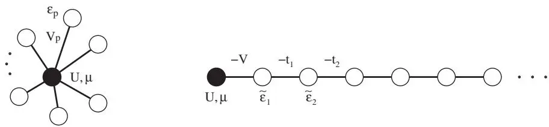
图8.1 左图：安德森杂质模型示意图。杂质上自旋向上和向下的电子（黑点）与在位能U相互作用，并可跃迁至能量为$\varepsilon_{p}$的无相互作用能级连续统。这些跃迁的振幅由杂化参数$V_{p}$给出。右图：安德森杂质模型的链表示。通过合适的规范变换（见练习8.1），可使跃迁参数V和$t_{i}$为正。

图8.1左面板展示了安德森杂质模型的一个例图。

该模型可以映射到一个半无限链上，其中第一个格点是杂质（图8.1右面板）。1这种映射对应于将算子$\{d , c_{p_{1}} , c_{p_{2}} , \ldots \}$变换为新的算子$\{d , c_{1} , c_{2} , \ldots \}$，使得$H_{\mu} + H_{\mathrm{bath}} + H_{\mathrm{mix}}$变为三对角形式（附录J）：

$$
\left( \begin{array} {l l l l l} {- \mu} & {V_{p_{1}}} & {V_{p_{2}}} & {V_{p_{3}}} & {\cdots} \\ {V_{p_{1}}^{*}} & {\varepsilon_{p_{1}}} & & & \\ {V_{p_{2}}^{*}} & & {\varepsilon_{p_{2}}} & & \\ {V_{p_{3}}^{*}} & & & {\varepsilon_{p_{3}}} & \\ {\vdots} & & & & {\ddots} \end{array} \right) \to \left( \begin{array} {l l l l l} {- \mu} & {- V} & & \\ {- V} & {\tilde{\varepsilon}_{1}} & {- t_{1}} & & \\ & {- t_{1}} & {\tilde{\varepsilon}_{2}} & {- t_{2}} & \\ & & {- t_{2}} & {\tilde{\varepsilon}_{3}} & {\ddots} \\ & & & {\ddots} & {\ddots} \end{array} \right) .
$$

在链表示中，杂质轨道保持不变，从杂质到链上第一个格点的跃迁振幅为$\begin{array} {r} {V = ( \sum_{p} | V_{p} | ^{2} )^{1 / 2}} \end{array}$。我们在此变换中选择相位因子，使得所有跃迁参数为正$( V \ge 0 , t_{i} \ge 0 , i = 1 , 2 , . . . )$。在[第8.7节](ch08.md)中，我们将利用这一事实来证明安德森杂质模型的连续时间量子蒙特卡洛模拟不存在符号问题。

### 8.1.2 作用量表述

与行列式方法类似，我们基于虚时格林函数（或杂化函数）来构建杂质求解器。由于时间平移不变性，我们可以通过松原变换在虚时空间中解卷积戴森方程：

$$
G \left( i \omega_{n} \right) = \int_{0}^{\beta} d \tau e^{i \omega_{n} \tau} G \left( \tau \right) , ~ G ( \tau ) = \frac{1} {\beta} \sum_{n} e^{- i \omega_{n} \tau} G ( i \omega_{n} ) ,
$$

其中松原频率为$\omega_{n} = ( 2 n + 1 ) \pi / \beta$，$\beta = 1 / T$为逆温度。

同样可以用虚时作用量来表示配分函数和虚时格林函数。在附录K中，我们在路径积分框架中积掉能级自由度，将安德森杂质模型的配分函数表示为

$$
Z = \operatorname{Tr}_{d} {\left[ {\mathcal{T}} e^{- S} \right]} ,
$$

其中作用量$S = S_{\mathrm{mix}} + S_{\mathrm{loc}}$由下式给出：

$$
\begin{array} {l} {{S_{\mathrm{mix}} = \displaystyle \sum_{\sigma} \int_{0}^{\beta} d \tau d \tau^{\prime} d_{\sigma}^{\dagger} ( \tau^{\prime} ) \Delta^{\sigma} ( \tau^{\prime} - \tau ) d_{\sigma} ( \tau ) ,}} \\ {{S_{\mathrm{loc}} = \displaystyle \int_{0}^{\beta} d \tau \Big [ - \mu ( n_{\uparrow} ( \tau ) + n_{\downarrow} ( \tau ) ) + U n_{\uparrow} ( \tau ) n_{\downarrow} ( \tau ) \Big ] .}} \end{array}\tag{8.12}
$$

(8.13)

$\tau$是编时算符。格林函数变为2

$$
G ( \tau ) = - \langle{\mathcal T} d ( \tau ) d^{\dagger} ( 0 ) \rangle_{S} = - \frac{1} {Z} \mathrm{Tr}_{d} \bigl [ {\mathcal T} e^{- S} d ( \tau ) d^{\dagger} ( 0 ) \bigr ] .
$$

(8.12)中的杂化函数$\Delta^{\sigma} ( \tau^{\prime} - \tau )$表示电子在时间τ从杂质跃迁到能级、然后在时间$\tau^{\prime}$跳回杂质的振幅。它是能级能量和杂化振幅的函数，最便于在松原频率空间中表达：

$$
\Delta^{\sigma} ( i \omega_{n} ) = \sum_{p} \frac{| V_{p \sigma} | ^{2}} {i \omega_{n} - \varepsilon_{p}} .\tag{8.14}
$$

引入无相互作用杂质的格林函数 $\mathcal{G}_{0}$ 也很有用[^3]，它与杂化函数的关系为

$$
\begin{array} {r} {[ \mathcal{G}_{0}^{\sigma} ]^{- 1} ( i \omega_{n} ) = i \omega_{n} + \mu - \Delta^{\sigma} ( i \omega_{n} ) .} \end{array}\tag{8.15}
$$

该函数出现在用格拉斯曼变量表示的配分函数表达式中。在后续章节中，我们将同时使用 $\mathcal{G}_{0}$ 和 $\Delta$。

## 8.2 动力学平均场理论

量子杂质模型是动力学平均场理论（dynamical mean-field theory, DMFT）的关键组成部分，该理论提供了关联晶格模型的近似描述（Georges et al., 1996）。DMFT的成功催生了对更强大、更灵活的杂质求解器的需求，并推动了连续时间杂质求解器的发展。现在我们简要介绍DMFT近似，它将相互作用的晶格模型（如哈伯德模型）映射到一个有效的杂质问题，并伴随对热库的自洽条件。

### 8.2.1 单格点有效模型

为了理解基本策略，我们首先回顾经典伊辛模型的静态平均场近似，如图8.2左侧面板所示。在那里，我们聚焦于晶格上的某个特定自旋 $s_{0}$，并遵循古老的Weiss自洽分子场方法，将剩余自由度替换为一个有效外磁场 $h_{\mathrm{eff}} = z m J $，其中 $z$ 是配位数，$m$ 是每格点磁化强度。具有最近邻自旋相互作用 $J$ 的晶格系统，

$$
H^{\mathrm{Ising}} = - J \sum_{\langle i j \rangle} s_{i} s_{j} ,
$$

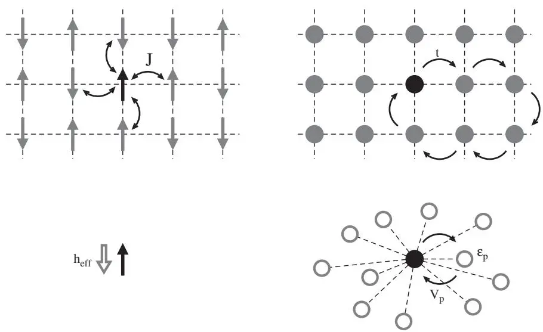
图8.2 左面板：经典伊辛模型到有效单格点模型（外磁场中的自旋）的映射。右面板：哈伯德模型到有效单格点模型（无关联热库中的一个关联格点）的映射。

因此映射到单格点有效模型

$$
H_{\mathrm{eff}}^{\mathrm{Ising}} = - h_{\mathrm{eff}} s_{0} .
$$

对于该模型，磁化强度为

$$
m_{\mathrm{eff}} = \operatorname{tanh} ( \beta h_{\mathrm{eff}} ) .
$$

如果我们将晶格问题的磁化强度 $m$ 与单格点有效模型的磁化强度 $m_{\mathrm{eff}}$ 等同起来，就得到自洽条件

$$
m \equiv m_{\mathrm{eff}} = \operatorname{tanh} ( \beta z J m ) ,\tag{8.16}
$$

该式隐式地确定了平均场 $h_{\mathrm{eff}}$。可以通过迭代找到自洽解。

现在我们转向哈伯德模型并应用相同的策略。该模型为

$$
H_{\mathrm{Hubbard}} = - t \sum_{\langle i j \rangle \sigma} ( d_{i \sigma}^{\dagger} d_{j \sigma} + d_{j \sigma}^{\dagger} d_{i \sigma} ) + U \sum_{i} n_{i \uparrow} n_{i \downarrow} - \mu \sum_{i \sigma} n_{i \sigma}
$$

描述了以振幅 $t$ 在晶格最近邻格点间跳跃的电子。同一格点上的两个电子以能量 $U$ 相互作用。我们添加了一个化学势项，因为将要在巨正则系综中计算。无相互作用的色散关系由跳跃矩阵的傅里叶变换得到。例如，在一维晶格（晶格常数为 $a$）的情况下，$\epsilon_{k} = - 2 t \cos ( k a )$。

受Weiss分子场策略的启发，我们聚焦于晶格上的某个特定格点（图8.2右侧面板中的黑点），并将模型的剩余自由度替换为一个由无相互作用能级组成的热库，以及一个将相互作用格点与热库连接的杂化项。因此，有效的单格点问题就变成了一个安德森杂质模型（Anderson impurity model）[^4]，

$$
H_{\mathrm{imp}} = \sum_{p \sigma} \varepsilon_{p} c_{p \sigma}^{\dagger} c_{p \sigma} + \sum_{p \sigma} ( V_{p \sigma} d_{\sigma}^{\dagger} c_{p \sigma} + V_{p \sigma}^{*} c_{p \sigma}^{\dagger} d_{\sigma} ) + U n_{\uparrow} n_{\downarrow} - \mu ( n_{\uparrow} + n_{\downarrow} ) .
$$

---

这里，$d^{\dagger}$ 在杂质（黑点）上产生电子，$n_{\sigma} ~ = ~ d_{\sigma}^{\dagger} d_{\sigma}^{}$，而 $c_{p}^{\dagger}$ 在由量子数 $p$ 标记的浴态（空点）中产生电子。在这个有效的单点模型中，从杂质到浴态再返回的跳跃（图8.2右下角面板）代表了原始模型中的过程，即一个电子从黑点跳跃到晶格，经过晶格中的一段游弋后返回该黑点（图8.2右上角面板）。杂化参数 $V_{p}$ 给出了这些跃迁的振幅。

我们的任务现在是优化参数 $\varepsilon_{p}$ 和 $V_{p}$，使得安德森杂质模型的浴态尽可能准确地模拟晶格环境。我们还不知道 $\varepsilon_{p}$ 和 $V_{p}$。它们类似于 $h_{\mathrm{eff}}$，因此是我们需要自洽调整的参数。如果我们使用杂质作用量，浴态的性质被编码在 $\Delta ( \tau )$ 或 $\mathcal{G}_{0} ( \tau )$ 中，因此这些函数扮演平均场的角色。这是一个动力学平均场，因为杂化函数或 Weiss 格林函数依赖于（虚）时间或频率。

自洽解的构造方式是这样的：杂质格林函数 $G_{\mathrm{imp}} ( i \omega_{n} )$ 能够再现局域晶格格林函数 $G_{\mathrm{loc}} ( i \omega_{n} ) \equiv $ $G_{i , i} ( i \omega_{n} )$。换句话说，如果 $G ( k , i \omega_{n} )$ 是哈伯德模型的动量依赖晶格格林函数，那么我们寻找浴态参数和杂化参数，使得5

$$
\int ( d k ) G ( k , i \omega_{n} ) \equiv G_{\mathrm{imp}} ( i \omega_{n} ) .\tag{8.17}
$$

### 8.2.2 DMFT 近似

我们迭代地求解 (8.17)。然而，与伊辛模型情形 (8.16) 不同，如何利用自洽条件 (8.17) 来更新动力学平均场并不立即清楚。为了定义一个实用的程序，我们必须将 (8.17) 的左边与杂质模型量关联起来。这一步包含了 DMFT 方法的基本近似，即对晶格自能的动量依赖性进行显著简化。

自能描述相互作用对电子传播的影响。在无相互作用模型中，晶格格林函数为 $G_{0} ( k , i \omega_{n} ) ~ =$ $[ i \omega_{n} + \mu - \epsilon_{k} ]^{- 1}$，其中 $\epsilon_{k}$ 是跳跃矩阵的傅里叶变换。相互作用模型的格林函数为 $G ( k , i \omega_{n} ) = [ i \omega_{n} + \mu - \epsilon_{k} - \Sigma ( k , i \omega_{n} ) ]^{- 1}$，其中 $\Sigma ( k , i \omega_{n} )$ 是晶格自能。因此

$$
\Sigma ( k , i \omega_{n} ) = G_{0}^{- 1} ( k , i \omega_{n} ) - G^{- 1} ( k , i \omega_{n} ) .
$$

类似地，我们得到杂质自能

$$
\begin{array} {r} {\Sigma_{\mathrm{imp}} ( i \omega_{n} ) = \mathcal{G}_{0}^{- 1} ( i \omega_{n} ) - G_{\mathrm{imp}}^{- 1} ( i \omega_{n} ) ,} \end{array}
$$

其中 $\mathcal{G}_{0}^{- 1}$ 在 (8.15) 中定义。DMFT 近似是将晶格自能等同于动量无关的杂质自能：

$$
\Sigma ( k , i \omega_{n} ) \approx \Sigma_{\mathrm{imp}} ( i \omega_{n} ) .
$$

这个近似允许我们将自洽方程 (8.17) 重写为

$$
\int ( d k ) [ i \omega_{n} + \mu - \epsilon_{k} - \Sigma_{\mathrm{imp}} ( i \omega_{n} ) ]^{- 1} \equiv G_{\mathrm{imp}} ( i \omega_{n} ) .\tag{8.18}
$$

由于 $G_{\mathrm{imp}} ( i \omega_{n} )$ 和 $\Sigma_{\mathrm{imp}} ( i \omega_{n} )$ 都由杂质模型参数 $\varepsilon_{p}$ 和 $V_{p}$（或函数 $\Delta ( \tau )$ 或 $\mathcal{G}_{0} ( \tau )$）决定，式 (8.18) 为这些参数（或函数）定义了自洽条件。

### 8.2.3 DMFT 自洽循环

现在我们针对 Weiss 格林函数 $\mathcal{G}_{0} ( i \omega_{n} )$ 来阐述自洽循环。从任意初始的 $\mathcal{G}_{0} ( i \omega_{n} )$（例如，非相互作用晶格模型的局域格林函数）出发，我们迭代以下步骤直至收敛（算法 26）：

1.  求解杂质问题，即，对于给定的 $\mathcal{G}_{0} ( i \omega_{n} )$，计算杂质格林函数 $G_{\mathrm{imp}} ( i \omega_{n} )$。
2.  提取杂质模型的自能：

$$
\Sigma_{\mathrm{imp}} ( i \omega_{n} ) = \mathcal{G}_{0}^{- 1} ( i \omega_{n} ) - G_{\mathrm{imp}}^{- 1} ( i \omega_{n} ) .
$$

3.  将晶格自能等同于杂质自能，$\Sigma ( k , i \omega_{n} ) = \Sigma_{\mathrm{imp}} ( i \omega_{n} )$（DMFT 近似），并计算局域晶格格林函数 $G_{\mathrm{loc}} ( i \omega_{n} ) = \int ( d k ) [ i \omega_{n} + \mu - \epsilon_{k} - \Sigma_{\mathrm{imp}} ( i \omega_{n} ) ]^{- 1}$。
4.  应用 DMFT 自洽条件 $G_{\mathrm{loc}} ( i \omega_{n} ) = G_{\mathrm{imp}} ( i \omega_{n} )$，并利用它定义新的 Weiss 格林函数 $\mathcal{G}_{0}^{- 1} ( i \omega_{n} ) = G_{\mathrm{loc}}^{- 1} ( i \omega_{n} ) + \Sigma_{\mathrm{imp}} ( i \omega_{n} )$。

计算上最耗时的步骤是杂质问题的求解（步骤 1）。当循环收敛时，热库包含了关于晶格拓扑（通过态密度）和物相（金属、莫特绝缘体、反铁磁绝缘体等）的信息。因此，与热库交换电子的杂质的性质，至少在某种程度上，就如同它是晶格上的一个点阵位。

算法 26 DMFT 自洽循环。（使用式 (8.15)，该循环也可以用杂化函数 $\Delta$ 而不是 Weiss 格林函数 $\mathcal{G}_{0}$ 来表述。）
输入：Weiss 格林函数 $\mathcal{G}_{0} ( i \omega_{n} )$、非相互作用色散 $\epsilon_{k}$、化学势 $\mu$、逆温度 $\beta$ 的某个初始猜测
重复
   对于给定的 $\mathcal{G}_{0} ( i \omega_{n} )$ 计算 $G_{\mathrm{imp}} ( i \omega_{n} )$； 求解杂质问题
   $\Sigma_{\mathrm{imp}} ( i \omega_{n} ) = \mathcal{G}_{0}^{- 1} ( i \omega_{n} ) - G_{\mathrm{imp}}^{- 1} ( i \omega_{n} )$
   $G_{\mathrm{loc}} ( i \omega_{n} ) = \int ( d k ) [ i \omega_{n} + \mu - \epsilon_{k} - \Sigma_{\mathrm{imp}} ( i \omega_{n} ) ]^{- 1}$
   $\mathcal{G}_{0}^{- 1} ( i \omega_{n} ) = G_{\mathrm{loc}}^{- 1} ( i \omega_{n} ) + \Sigma_{\mathrm{imp}} ( i \omega_{n} )$
直至 $G_{\mathrm{loc}}$ 收敛。
返回 $G_{\mathrm{loc}}$

显然，单格点杂质模型并不能捕捉所有物理。特别是，DMFT 近似忽略了所有空间涨落。这些涨落很重要，例如在低维系统中。人们相信，DMFT 形式理论能为三维无阻挫晶格模型提供定性正确的描述。它在无穷维（Metzner 和 Vollhardt, 1989）或无穷配位数的极限下（此时空间涨落可忽略）、在无相互作用极限下（$U = 0$ 意味着 $\Sigma = 0$），以及在原子极限下（$t = 0$ 意味着 $\Delta = 0$）是精确的。

### 8.2.4 强关联材料的模拟

DMFT 形式理论描述了类能带行为（重整化的准粒子能带）和类原子行为（哈伯德能带）。它捕捉了电子局域化与退局域化之间的竞争，这在强关联材料的物理中起着至关重要的作用。模拟真实化合物的一种可能方法是将 DMFT 形式理论与局域密度近似（LDA）下的电子结构计算相结合。最终的形式理论被称为“LDA+DMFT”（Kotliar 等人，2006）。

---

其基本思想是：利用 LDA 计算得到的 Kohn-Sham 本征值 $\epsilon_{n , k}^{\mathrm{KS}}$ ，代入自洽方程 (8.18)。为了描述 d 电子（例如在过渡金属氧化物中）或 f 电子（例如在锕系元素中）所经历的强关联效应，我们在相应的轨道上添加一个依赖于频率的、局域的自能。此自能通过一个自洽定义的杂质问题得到。

在 LDA+DMFT 方案的实际实现中，一个关键问题是轨道的选择。LDA 计算给出扩展的 Kohn-Sham 波函数 $\psi_{n , k}$ 。而杂质模型描述的是占据局域类原子轨道的电子之间的相互作用。一种常见的轨道选择是 Wannier 基，例如，使算子 $r^{2}$ 的期望值最小化的最大局域 Wannier 轨道（Marzari and Vanderbilt, 1997）。在此基组 $\{\phi_{l} \}$ 中，我们识别出具有 $d$ 或 $f$ 特征的"强关联"轨道子集 $\{\phi_{\alpha} \}$，然后定义一个相互作用项

$$
H_{U} = \frac{1} {2} \sum_{i \alpha \beta \gamma \delta} U^{\alpha \beta \gamma \delta} d_{i \alpha}^{\dagger} d_{i \beta}^{\dagger} d_{i \gamma} d_{i \delta}^{\phantom{\dagger}} .
$$

相互作用参数 $U^{\alpha \beta \gamma \delta}$ 既可以作为可调参数处理，也可以利用称为"约束 LDA"或"约束 RPA"6 的技术从 LDA 能带结构中提取。需要强调的是，相互作用参数依赖于轨道的选择。更局域的轨道会导致更大的相互作用项。在 Wannier 轨道基组中，这也意味着模拟中保留的（强关联和弱关联）能带数量会影响相互作用参数，因为能带数量越多意味着轨道越局域、越像原子轨道。

Kohn-Sham 哈密顿量

$$
H^{\mathrm{KS}} = \sum_{k l m} ( h_{k}^{\mathrm{KS}} )_{l m} d_{k l}^{\dagger} d_{k m} ,
$$

在能带基下是对角的，但在局域轨道基 $\{\phi_{l} \}$ 下则变成一个非平凡矩阵。具体而言，$h_{k}^{\mathrm{KS}} = O_{k} \epsilon_{k}^{\mathrm{KS}} O_{k}^{- 1}$ ，其中 $O_{k}$ 是从 $\{\psi_{n , k} \}$ 到 $\{\phi_{l} \}$ 的基变换矩阵。通过组合 $H^{\mathrm{KS}}$ 、局域相互作用项 $H_{U}$ 和一个"双计数修正项"

$$
H_{D C} = - \sum_{i \alpha} e_{D C}^{\alpha} d_{i \alpha}^{\dagger} d_{i \alpha} ,
$$

我们得到需要在 DMFT 近似下求解的模型：

$$
H = H^{\mathrm{KS}} + H_{U} + H_{D C} .\tag{8.19}
$$

我们需要双计数修正的原因如下：虽然密度泛函理论（LDA 近似的基础）没有考虑所有电子关联效应，但它确实捕捉了其中一部分。如果我们随后通过 $H_{U}$ 项显式描述强关联轨道中的局部相互作用，那么某些相互作用贡献会被重复计算。双计数修正项旨在通过将关联轨道平移 $e_{D C}$ 来补偿这一点。

目前，对于双计数问题还没有一个清晰且一致的解决方案。描述密度泛函理论中关联效应的交换关联势（在 LDA 内）是总密度的非线性泛函，因此我们无法确定 d 或 f 电子对交换关联能量的贡献。在实践中，我们采用诸如 $e_{D C}^{\alpha} = \langle U \rangle ( \langle n_{\mathrm{corr}} \rangle - {\textstyle \frac{1} {2}} )$ 7 这样的双计数修正项，其中 $\langle U \rangle$ 是相互作用参数的平均值，$\langle n_{\mathrm{corr}} \rangle$ 是关联轨道的平均占据数。这种与轨道无关的平移保持了 LDA 能带结构中的晶体场劈裂。

最后，我们添加一个化学势项，并调整化学势 $\mu$ 以获得关联和非关联轨道中正确的总电子数。

为了在 DMFT 近似下计算（局域）自能，我们求解一个与 $H_{U}$ 中相互作用项相同的杂质模型。该解给出矩阵 $[ G_{\mathrm{imp}} ]_{\alpha \beta}$ 和 $[ \sum_{\mathrm{imp}} ]_{\alpha \beta}$，它们定义在关联轨道的子空间中。为了写出自洽条件，我们在局域轨道 $\{\phi_{l} \}$ 的全空间中定义矩阵 $\Sigma$：

$$
\Sigma ( i \omega_{n} ) = \left( \frac{\ \Sigma_{\mathrm{imp}} ( i \omega_{n} ) \ \left| \ 0 \right.} {\ 0} \right) ,\tag{8.20}
$$

其中第一个对角块对应强关联轨道（对于完整的 d 壳层，为五个），第二个对角块对应弱关联轨道。类似地，双计数修正项也是一个作用在全空间上的（对角）矩阵：

$$
E_{D C} = \left( \frac{- e_{D C} \left| 0 \right.} {0} \right) .\tag{8.21}
$$

固定动力学平均场 $\mathcal{G}_{0}$ 或 $\Delta$ 的自洽条件变为：

$$
\left[ \int ( d k ) \left[ ( i \omega_{n} + \mu ) I - h_{k}^{\mathrm{KS}} - \Sigma ( i \omega_{n} ) - E_{D C} \right]^{- 1} \right]_{\alpha \beta} \equiv [ G_{\mathrm{imp}} ( i \omega_{n} ) ]_{\alpha \beta} .\tag{8.22}
$$

需要注意的是，尽管自洽条件只涉及局域格点格林函数的关联块，弱关联轨道通过矩阵求逆进入计算。我们在算法27中总结了LDA+DMFT计算的计算方案。

**算法27 LDA+DMFT自洽循环。**
**输入：** 某个 $( N_{\mathrm{corr}} \times N_{\mathrm{corr}} )$ 的Weiss格林函数矩阵 $\mathcal{G}_{0} ( i \omega_{n} )$ 、局域基 $( N_{\mathrm{tot}} \times N_{\mathrm{tot}} )$ 下的Kohn-Sham哈密顿量 $h_{k}^{\mathrm{KS}}$ 、总电子数 $n_{\mathrm{tot}}^{\mathrm{target}}$ 、化学势 $\mu$ 的初始猜测、逆温度 $\beta$
**重复**
   **重复**
      对给定的 $\mathcal{G}_{0} ( i \omega_{n} )$ 计算 $G_{\mathrm{imp}} ( i \omega_{n} )$ ; $\vartriangle{\models} \vDash$  解杂质问题
      $\Sigma_{\mathrm{imp}} ( i \omega_{n} ) = \mathcal{G}_{0}^{- 1} ( i \omega_{n} ) - G_{\mathrm{imp}}^{- 1} ( i \omega_{n} )$
      定义 $N_{\mathrm{tot}} \times N_{\mathrm{tot}}$ 矩阵 $\Sigma$ (8.20) 和 $E_{D C}$ (8.21)
      $\begin{array} {r} {G_{\mathrm{loc}} ( i \omega_{n} ) = \int ( d k ) [ ( i \omega_{n} + \mu ) I - h_{k}^{\mathrm{KS}} - \Sigma ( i \omega_{n} ) - E_{D C} ]^{- 1}} \end{array}$
      从 $G_{\mathrm{loc}} ( i \omega_{n} )$ 中提取 $N_{\mathrm{corr}} \times N_{\mathrm{corr}}$ 关联块 $G_{\mathrm{loc}}^{\mathrm{corr}} ( i \omega_{n} )$
      $\mathcal{G}_{0}^{- 1} ( i \omega_{n} ) = ( G_{\mathrm{loc}}^{\mathrm{corr}} ( i \omega_{n} ) )^{- 1} + \Sigma_{\mathrm{imp}} ( i \omega_{n} )$
   **直到** $G_{\mathrm{loc}}$ 收敛。
   计算 $\begin{array} {r} {n_{\mathrm{tot}} = - \sum_{i = 1}^{N_{\mathrm{tot}}} [ G_{\mathrm{loc}} ( \beta_{-} ) ]_{i i}} \end{array}$
   **如果** $n_{\mathrm{tot}} < n_{\mathrm{tot}}^{\mathrm{target}}$ **则**
      增大 $\mu$
   **否则**
      减小 $\mu$
   **结束如果**
**直到** $n_{\mathrm{tot}}$ 收敛。
**返回** $G_{\mathrm{loc}} .$

### 8.2.5 团簇扩展

为了捕捉短程空间涨落的影响，人们发展了动力学平均场理论的团簇扩展方法（Maier等人，2005）。在这些扩展中，一个由多个格点组成的团簇（而非单个格点）被嵌入到一个自洽确定的浴场中。这种嵌入使我们能够显式地描述团簇内部的短程空间关联，同时以平均场水平处理更长程的关联。该方法类似于Bethe-Peierls团簇分子场近似（Bethe, 1935），它将经典自旋模型的Weiss分子场理论从单格点扩展到格点团簇，以捕捉短程自旋关联。

在团簇DMFT中，我们将晶格划分为包含 $n_{c}$ 个格点的团簇超晶格，并对该超晶格应用DMFT程序（Lichtenstein和Katsnelson, 2000）。此时，团簇格林函数和自能成为大小为 $n_{c} \times n_{c}$ 的矩阵，而 $\epsilon_{k}$ 则变为矩阵 ${\hat{t}} ( k )$ ，定义为超晶格上跳跃矩阵的傅里叶变换。动量 $k$ 是超晶格约化布里渊区中的动量。

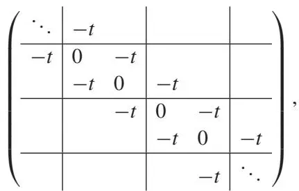
图8.3 将一维哈伯德链分解为双格点团簇（虚线框所示）。在间距为2a的超晶格上进行傅里叶变换后，得到

更具体地说，让我们考虑一个晶格常数为 $a$ 的一维哈伯德链，将其分解为双格点团簇（图8.3）。跳跃矩阵则具有如下形式

$$
\begin{array} {r l} & {- \hat{t} ( k ) = e^{i k 0} \left( \begin{array} {l l} {0} & {t} \\ {t} & {0} \end{array} \right) + e^{i k ( 2 a )} \left( \begin{array} {l l} {0} & {0} \\ {t} & {0} \end{array} \right) + e^{i k ( - 2 a )} \left( \begin{array} {l l} {0} & {t} \\ {0} & {0} \end{array} \right)} \\ & {\quad \quad = \left( \begin{array} {l l} {0} & {t ( 1 + e^{- i 2 k a} )} \\ {t ( 1 + e^{i 2 k a} )} & {0} \end{array} \right) .} \end{array}\tag{8.23}
$$

决定了 $2 \times 2$ 动力学平均场 $\mathcal{G}_{0}$ 或 $\Delta$ 矩阵的自洽条件现在变为

$$
\int_{\text{约化BZ}} ( d k ) [ ( i \omega_{n} + \mu ) \hat{I} - \hat{t} ( k ) - \hat{\Sigma}_{\mathrm{imp}} ( i \omega_{n} ) ]^{- 1} = \hat{G}_{\mathrm{imp}} ,
$$

随约化布里渊区 $- \pi / 2 a \leq k < \pi / 2 a$ 变化

从跃迁矩阵（8.23）可以明显看出，团簇DMFT形式破坏了团簇内部的平移不变性。还有一种替代的团簇DMFT，称为动力学团簇近似（Dynamical Cluster Approximation, DCA），它强制保持了这种对称性（Hettler等人，1998）。双站点DCA对应的跃迁矩阵为

$$
- \hat{\cal t}_{\mathrm{DCA}} ( k ) = \left( \begin{array} {c c} {{0}} & {{2 t \cos ( k a )}} \\ {{2 t \cos ( k a )}} & {{0}} \end{array} \right) .\tag{8.24}
$$

在“动量基”$\{d_{K = 0} ~ = ~ \textstyle{\frac{1} {\sqrt{2}}} ( d_{1} + d_{2} ) , d_{K = \textstyle{\frac{\pi} {a}}} ~ = ~ \textstyle{\frac{1} {\sqrt{2}}} ( d_{1} - d_{2} ) \}$中，格林函数和自能是对角矩阵，每个“动量扇区”$K$的自洽条件为

$$
\int_{\mathrm{sector} K} ( d k ) [ i \omega_{n} + \mu - \epsilon_{k} - \Sigma_{\mathrm{imp}}^{K} ( i \omega_{n} ) ]^{- 1} = G_{\mathrm{imp}}^{K} ,\tag{8.25}
$$

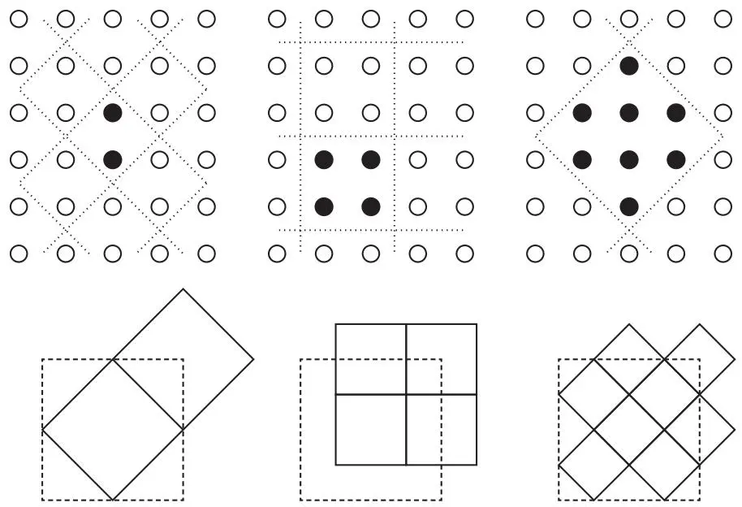
图8.4 二维哈伯德模型的两站点、四站点和八站点DCA近似。上排显示了（周期化后的）实空间团簇，下排说明了第一布里渊区（虚线方框）相应分解为等大小的扇区。

其中 $\epsilon_{k} = - 2 t \cos ( k a )$ 。在我们的两站点例子中，扇区 $K \ : = \ : 0$ 对应于 $- \pi / 2 a \le k < \pi / 2 a$ ，而扇区 $K = \pi / a$ 对应于 $\pi / 2 a \leq k < 3 \pi / 2 a$ 。因此，第一布里渊区被分解为两个大小相等的扇区，分别以周期化两站点团簇的倒格矢为中心。图8.4说明了DCA概念如何扩展到二维正方晶格。上排显示了具有两、四和八个站点的（周期化后的）实空间团簇，下排展示了第一布里渊区的相应拼块划分。8

DCA杂质模型的周期化实空间团簇涉及重整化后的跃迁，这可以通过对按扇区平均的色散进行傅里叶变换获得（见练习8.8）。

## 8.3 一般策略

量子杂质模型是(0+1)维量子场论，因此在计算上比相互作用的晶格模型更容易处理。我们的目标是计算杂质格林函数9

$$
G ( \tau ) = - \langle{\mathcal T} d ( \tau ) d^{\dag} ( 0 ) \rangle = - \frac{1} {Z} \mathrm{Tr} \Big [ e^{- ( \beta - \tau ) H} d e^{- \tau H} d^{\dag} \Big ] ,\tag{8.26}
$$

其中 $Z ~ = ~ \mathrm{Tr} [ e^{- \beta{\cal H}} ]$ 是杂质模型配分函数，$\beta$ 是逆温度，$\mathcal{T}$ 是（虚时）编时算符，$\mathrm{Tr} = \mathrm{Tr}_{d} \mathrm{Tr}_{c}$ 是对杂质和浴态求迹。在最后一个表达式中，我们假设 $0 \le \tau < \beta$。

连续时间蒙特卡洛算法将配分函数展开成一系列“图”，并对这些图进行随机抽样（Gull等人，2011）。按照[第2章](ch02.md)概述的一般步骤，我们将配分函数表示为对构型 $C$ 的求和（或更准确地说，是积分），权重为 $w_{C}$

$$
Z = \sum_{C} w_{C} ,\tag{8.27}
$$

并在构型空间中实现随机游走 $C_{1} C_{2} C_{3} \cdot \cdot \cdot$，以满足遍历性和细致平衡条件。通过使用符号加权平均（[第5.4节](ch05.md)），我们从有限数量 $M$ 次测量中估计杂质格林函数为

$$
G = \sum_{c} \frac{w_{C} G_{C}} {Z} = \frac{\sum_{C} | w_{C} | \mathrm{sign}_{C} G_{C}} {\sum_{C} | w_{C} | \mathrm{sign}_{C}} \approx \frac{\sum_{i = 1}^{M} \mathrm{sign}_{C_{i}} G_{C_{i}}} {\sum_{i = 1}^{M} \mathrm{sign}_{C_{i}}} \equiv \frac{\langle \mathrm{sign} \cdot G \rangle_{\mathrm{MC}}} {\langle \mathrm{sign} \rangle_{\mathrm{MC}}} .\tag{8.28}
$$

我们详细阐述连续时间求解器的第一步，是将配分函数表示为相互作用绘景中虚时编时指数。为此，将哈密顿量分成两部分 $H = H_{1} + H_{2}$ ，并在相互作用绘景中将虚时依赖算符定义为 ${\cal O} ( \tau ) = e^{\tau H_{1}} {\cal O} e^{- \tau H_{1}}$ 。在此绘景下，配分函数变为 $Z = \mathrm{Tr} \big [ e^{- \beta H_{1}} \mathcal{T} e^{- \int_{0}^{\beta} d \tau H_{2} ( \tau )} \big ]$ 10

接下来，我们将编时指数展开为幂级数，

$$
Z = \sum_{n = 0}^{\infty} \int_{0}^{\beta} d \tau_{1} \cdots \int_{\tau_{n - 1}}^{\beta} d \tau_{n} \mathrm{Tr} \Bigl [ e^{- ( \beta - \tau_{n} ) H_{1}} ( - H_{2} ) \cdot \cdot \cdot e^{- ( \tau_{2} - \tau_{1} ) H_{1}} ( - H_{2} ) e^{- \tau_{1} H_{1}} \Bigr ] .\tag{8.29}
$$

现在，我们得到了形如(8.27)的配分函数表示，即对某些构型权重的无穷求和。这些构型是虚时区间上的时间点集合：$C = \{\tau_{1} , . . . , \tau_{n} \} , n = 0 , 1 , . . .$ ，其中我们假设虚时顺序 $\tau_{i} < \tau_{i + 1}$ 并限制 $\tau_{i} \in [ 0 , \beta )$ 。与我们在[第7章](ch07.md)讨论的采样（每个构型具有固定数量的局域变量）不同，此处构型中的时间点数目可变，反映了对幂级数中不同阶数项的采样。蒙特卡洛权重的表达式为

$$
w_{C} = \mathrm{Tr} \biggl [ e^{- ( \beta - \tau_{n} ) H_{1}} ( - H_{2} ) \cdot \cdot \cdot e^{- ( \tau_{2} - \tau_{1} ) H_{1}} ( - H_{2} ) e^{- \tau_{1} H_{1}} \biggr ] ( d \tau )^{n} .\tag{8.30}
$$

有两种互补的连续时间蒙特卡洛技术：(i) 弱耦合方法，其计算复杂度随系统规模（即杂质模型中关联格点或轨道的数目）增长较为缓慢，能够高效模拟具有简单相互作用的较大杂质团簇；(ii) 强耦合方法，可处理含多轨道强相互作用的杂质模型。为简便起见，我们继续关注(8.8)–(8.11)中定义的单轨道安德森杂质模型。在此情况下，弱耦合连续时间蒙特卡洛方法在相互作用绘景中按相互作用 $U$ 的幂次展开 $Z$ ，其中虚时演化由哈密顿量的二次部分 $H_{\mu} + H_{\mathrm{bath}} + H_{\mathrm{mix}}$ 决定。互补的强耦合方法则在相互作用绘景中按杂质-库混合项 $H_{\mathrm{mix}}$ 的幂次展开 $Z$ ，其中虚时演化由哈密顿量的局域部分 $H_{\mu} + H_{U} + H_{\mathrm{bath}}$ 决定。我们如何采样权重(8.30)以及如何测量可观测量，具体细节取决于使用哪种连续时间方法。

## 8.4 弱耦合方法

弱耦合连续时间杂质求解器（Rubtsov et al., 2005）将配分函数按 $H_{2} = H_{U}$ 的幂次展开。方程(8.30)随后给出了 $n$ 个相互作用顶点构型的权重。由于 $H_{1} = H - H_{2} = H_{\mu} + H_{\mathrm{bath}} + H_{\mathrm{mix}}$ 是二次型的，我们使用Wick定理计算迹。结果是两个 $n \times n$ 矩阵行列式的乘积（每个电子自旋对应一个）。这些矩阵的元素是由顶点位置定义的虚时间间隔上的Weiss格林函数 $\mathcal{G}_{0}^{\sigma}$ ：

$$
\begin{array} {l} {{\displaystyle \frac{w_{C}} {Z_{0}} = ( - U d \tau )^{n} \frac{1} {Z_{0}} \mathrm{Tr} \Big [ e^{- ( \beta - \tau_{n} ) H_{1}} n_{\uparrow} n_{\downarrow} \cdot \cdot \cdot e^{- ( \tau_{2} - \tau_{1} ) H_{1}} n_{\uparrow} n_{\downarrow} e^{- \tau_{1} H_{1}} \Big ] \nonumber}} \\ {{\displaystyle \qquad = ( - U d \tau )^{n} \prod_{\sigma} \mathrm{det} M_{\sigma}^{- 1} ,}} \end{array}
$$

其中

$$
[ M_{\sigma}^{- 1} ]_{i j} = \mathcal{G}_{0}^{\sigma} ( \tau_{i} - \tau_{j} ) ,
$$

$\mathcal{G}_{0}^{\sigma} ( \tau ) = - \mathrm{Tr} [ e^{- \beta H_{1}} \mathcal{T} d ( \tau ) d^{\dagger} ( 0 ) ] / Z_{0}$，其中 $Z_{0} = \mathrm{Tr} [ e^{- \beta H_{1}} ]$ 是无相互作用模型的配分函数。12 对于对角元素，我们采用惯例 $[ M_{\sigma}^{- 1} ]_{i i} = \mathcal{G}_{0}^{\sigma} ( 0^{-} )$。

此时，我们注意到一个潜在的符号问题。在顺磁相中，由于 $\mathcal{G}_{0}^{\uparrow} ~ = ~ \mathcal{G}_{0}^{\downarrow}$，行列式乘积为正，这意味着对于排斥相互作用 $( U \ > \ 0 )$，奇数阶微扰权重为负。除非在粒子-空穴对称情况下（此时奇数阶微扰消失），否则这些奇数阶构型表面上看会导致符号问题。幸运的是，我们可以通过适当移动自旋向上和自旋向下的化学势来解决这个符号问题。为此，我们将相互作用项改写为 (Assaad and Lang, 2007)

$$
H_{U} = \frac{U} {2} \sum_{s} \prod_{\sigma} ( n_{\sigma} - \alpha_{\sigma} ( s ) ) + \frac{U} {2} ( n_{\uparrow} + n_{\downarrow} ) + U \left[ \left( \frac{1} {2} + \delta \right)^{2} - \frac{1} {4} \right] ,\tag{8.31}
$$

其中

$$
\alpha_{\sigma} ( s ) = \frac{1} {2} + \sigma s \left( \frac{1} {2} + \delta \right) .\tag{8.32}
$$

这里，δ 是某个常数，$s = \pm 1$ 是辅助伊辛变量。这种构造并非 Hubbard-Stratonovich 变换，而仅仅是能量零点的移动。式 (8.31) 中的常数项 $U [ ( \textstyle{\frac{1} {2}} + \delta )^{2} - \frac{1} {4} ]$ 无关紧要，将在后续被忽略。我们通过将化学势移动为 $\mu \to \mu - {\textstyle{\frac{1} {2}}} U$，把贡献 ${\scriptstyle{\frac{1} {2}}} U ( n_{\uparrow} + n_{\downarrow} )$ 吸收到无相互作用的格林函数中。具体地，我们重新定义 Weiss 格林函数为13

$$
[ \mathcal{G}_{0}^{\sigma} ]^{- 1} = i \omega_{n} + \mu - \Delta^{\sigma} [ \tilde{\mathcal{G}}_{0}^{\sigma} ]^{- 1} = i \omega_{n} + \mu - \textstyle{\frac{1} {2}} U - \Delta^{\sigma} .
$$

在每个顶点位置 $\tau_{i}$ 引入一个伊辛变量 $s_{i}$ 会使构型空间指数级扩大。现在，一个构型 C 对应于定义在虚时间区间上的一组辅助伊辛变量：$C =$ $\{( \tau_{1} , s_{1} ) , ( \tau_{2} , s_{2} ) , \ldots , ( \tau_{n} , s_{n} ) \}$ 。这些构型的概率为

$$
w_{C} = \tilde{Z}_{0} ( - U d \tau / 2 )^{n} \prod_{\sigma} \operatorname * {d e t} \tilde{M}_{\sigma}^{- 1} ,\tag{8.33}
$$

其中

$$
[ \tilde{M}_{\sigma}^{- 1} ]_{i j} = \tilde{\mathcal{G}}_{0}^{\sigma} ( \tau_{i} - \tau_{j} ) - \alpha_{\sigma} ( s_{i} ) \delta_{i j} .\tag{8.34}
$$

在第 8.7 节中我们将证明，对于 $\delta \ \geq \ 0$，安德森杂质模型的所有蒙特卡洛构型都具有正权重。

### 8.4.1 采样

为了满足遍历性，采样过程需要以随机取向在随机时间插入辅助自旋，并随机移除所选的自旋。通过采用 Metropolis-Hastings 算法（第 2.5.2 节）在构型空间中生成随机游走，我们得到接受矩阵

$$
\begin{array} {r} {A ( C^{\prime} C ) = \operatorname*{min} [ 1 , \mathcal{R} ( C^{\prime} C ) ] ,} \end{array}
$$

其中

$$
\mathcal{R} ( C^{\prime} \gets C ) = \frac{w ( C^{\prime} ) T ( C \gets C^{\prime} )} {w ( C ) T ( C^{\prime} \gets C )}
$$

并且 $T ( C^{\prime} \gets C )$ 表示从 C 到 $C^{\prime}$ 的移动的提议概率。我们使用式 (8.33) 来计算权重的比值。为完整描述采样过程，我们需要指定插入和移除辅助自旋的提议概率。选择它们时有一定的灵活性。我们在图 8.5 中展示了合理的选择。对于插入，我们在区间 $[ 0 , \beta )$ 内随机选取一个时间，并为新自旋随机选取一个取向；而对于移除，我们简单地随机选取一个自旋。对应的提议概率为

$$
\begin{array} {r} {T ( n + 1 n ) = \frac{1} {2} ( d \tau / \beta ) , \quad T ( n n + 1 ) = 1 / ( n + 1 ) .} \end{array}\tag{8.35}
$$

---

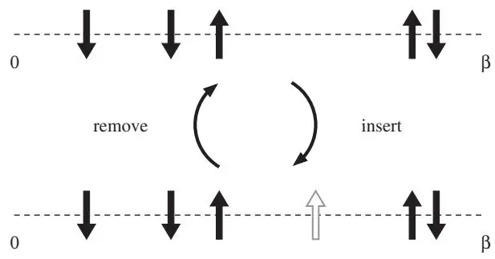
图8.5 弱耦合方法中的局部更新。虚线表示虚时区间 $[0, \beta)$。我们通过在一个随机时刻添加一个随机取向的辅助自旋来提高微扰阶数，并通过移除一个随机选择的辅助自旋来降低阶数。

第一步是以等概率选择插入或移除操作。如果选择插入，则我们从含 n 个自旋的构型变为含 n+1 个自旋的构型，根据 (8.33) 以及上述对 $T_{\ast}$ 的选择，接受矩阵变为 $A(n+1, n) = \operatorname*{min}[1, \mathcal{R}_{\mathrm{insert}}(n+1, n)]$，其中

$$
\mathcal{R}_{\mathrm{insert}}(n+1, n) = \frac{-\beta U}{n+1} \prod_{\sigma} \frac{\operatorname*{det}[\tilde{M}_{\sigma}^{(n+1)}]^{-1}}{\operatorname*{det}[\tilde{M}_{\sigma}^{(n)}]^{-1}}.\tag{8.36}
$$

移除操作的接受概率由下式给出：

$$
\mathcal{R}_{\mathrm{remove}}(n, n+1) = 1 / \mathcal{R}_{\mathrm{insert}}(n+1, n).\tag{8.37}
$$

### 8.4.2 行列式比值与快速矩阵更新

从 (8.36) 可以看出，每次更新都需要计算两个行列式的比值。我们在行列式方法中遇到过类似的问题：计算一个 $n \times n$ 矩阵的行列式是 $\mathcal{O}(n^3)$ 量级的操作。然而，每次插入或移除一个顶点（或自旋）仅改变矩阵 $M_{\sigma}^{-1}$（或 $\tilde{M}_{\sigma}^{-1}$）的一行和一列。与行列式方法的情况一样，我们利用线性代数的结果，可以在插入操作中以 $\mathcal{O}(n^2)$ 的时间代价、移除操作中以 $\mathcal{O}(1)$ 的时间代价来评估这个比值。这里的技巧与行列式方法中使用的技巧略有不同。

为解释此技巧，我们首先注意，除了时间 $\{\tau_i\}$（或时间与自旋 $\{(\tau_i, s_i)\}$）的列表之外，我们存储和操作的对象是矩阵 $M_{\sigma} = [\mathcal{G}_0^{\sigma}]^{-1}$，而非 $M_{\sigma}^{-1} = [\mathcal{G}_0^{\sigma}]$。插入一个顶点（或辅助自旋）会给 $M_{\sigma}^{-1}$ 添加一个新行和新列。我们想象将这个新行和新列插入到给定矩阵的边界上，并将结果矩阵写成块矩阵形式（为简洁起见，省略 $\sigma$ 索引）：

$$
[\mathcal{M}^{(n+1)}]^{-1} = \left( \begin{array}{cc} [\mathcal{M}^{(n)}]^{-1} & Q \\ R & S \end{array} \right).
$$

我们还定义 M 矩阵的对应块：

$$
M^{(n+1)} = \left( \begin{array}{ll} \tilde{P} & \tilde{Q} \\ \tilde{R} & \tilde{S} \end{array} \right).\tag{8.38}
$$

这里 $Q, R$ 和 $S$ 分别是 $n \times 1$, $1 \times n$ 和 $1 \times 1$ 的矩阵，包含由新顶点（自旋）位置决定的时间间隔上计算的函数 $\mathcal{G}_0$。它们可以很容易地计算出来。我们希望找到 $\tilde{P}, \tilde{Q}, \tilde{R}, \tilde{S}$，以及行列式的比值。

为此，我们使用矩阵分块求逆的表达式 (7.49) 和块矩阵行列式的表达式 (7.50)。借助这些公式，我们可以证明接受概率所需的行列式比值为：

$$
\frac{\operatorname*{det}[\mathcal{M}^{(n+1)}]^{-1}}{\operatorname*{det}[\mathcal{M}^{(n)}]^{-1}} = \operatorname*{det}(S - R\mathcal{M}^{(n)}Q) = S - R\mathcal{M}^{(n)}Q.\tag{8.39}
$$

由于我们存储的是 $M^{(n)}$，计算插入操作的接受概率只需 $\mathcal{O}(n^2)$ 的操作。如果移动被接受，我们可以从 $M^{(n)}$, Q, R 和 S 计算新矩阵 $M^{(n+1)}$，同样只需 $\mathcal{O}(n^2)$ 的时间：

$$
\tilde{S} = (S - [R][M^{(n)}Q])^{-1},\tag{8.40}
$$

$$
\tilde{Q} = -[M^{(n)}Q]\tilde{S},\tag{8.41}
$$

$$
\tilde{R} = -\tilde{S}[R M^{(n)}],\tag{8.42}
$$

$$
\tilde{P} = M^{(n)} + [M^{(n)}Q]\tilde{S}[R M^{(n)}].\tag{8.43}
$$

在移除一个自旋的情况下，我们想象移除边界的一行和一列。由 (8.39) 和 (8.40) 可得：

$$
\frac{\operatorname*{det}[M^{(n)}]^{-1}}{\operatorname*{det}[M^{(n+1)}]^{-1}} = \operatorname*{det}\tilde{S} = \tilde{S}.\tag{8.44}
$$

$\tilde{S}$ 只是一个$1 \times 1$矩阵，因此其行列式计算很简单。上述公式还表明，约化矩阵的元素为

$$
M^{( n )} = \tilde{P} - [ \tilde{Q} ] [ \tilde{R} ] / \tilde{S} .\tag{8.45}
$$

因此，移除概率的计算如(1)所示，而新$M^{( n )}$矩阵的计算复杂度为$\mathcal{O} ( n^{2} )$。

算法28描述了弱耦合方法中的基本更新操作，即自旋的插入和移除，并展示了这些过程中如何使用快速矩阵更新公式。

### 8.4.3 格林函数的测量

为了计算一个构型C对格林函数$G_{C}^{\sigma} ( \tau )$的贡献，我们(8.30)的右侧在时间0处插入一个产生算符$d^{\dagger}$，在时间τ处插入一个湮灭算符d，并除以$w_{C}$。根据Wick定理和(8.39)，我们得到表达式 (Rubtsov et al., 2005)

$$
G_{C}^{\sigma} ( \tau ) = \mathcal{G}_{0}^{\sigma} ( \tau ) - {\sum_{k}} \mathcal{G}_{0}^{\sigma} ( \tau - \tau_{k} ) \sum_{l} [ M_{\sigma} ]_{k l} \mathcal{G}_{0}^{\sigma} ( \tau_{l} ) .\tag{8.46}
$$

然后，对于给定的虚时，我们对杂质格林函数的估计由(8.28)得出。为了避免在蒙特卡洛模拟过程中进行不必要的且耗时的求和（即对于许多τ值计算(8.46)），我们累积以下量 (Gull et al., 2008)

$$
S_{\sigma} ( \tilde{\tau} ) \equiv \sum_{k} \delta ( \tilde{\tau} - \tau_{k} ) \sum_{l} \left[ M_{\sigma} \right]_{k l} \mathcal{G}_{0}^{\sigma} ( \tau_{l} ) ,
$$

方法是将时间点$\tilde{\tau}$分箱到精细网格上。模拟结束后，我们按以下方式计算格林函数$^{15}$

$$
G^{\sigma} ( \tau ) = \mathcal{G}_{0}^{\sigma} ( \tau ) - \int_{0}^{\beta} d \tilde{\tau} \mathcal{G}_{0}^{\sigma} ( \tau - \tilde{\tau} ) \big \langle S_{\sigma} ( \tilde{\tau} ) \big \rangle_{\mathrm{MC}} .\tag{8.47}
$$

也可以直接测量格林函数的Matsubara分量。利用格林函数在虚时上的平移不变性，我们得到

$$
G_{C}^{\sigma} ( i \omega_{n} ) = \qquad \mathcal{G}_{0}^{\sigma} ( i \omega_{n} ) - \mathcal{G}_{0}^{\sigma} ( i \omega_{n} ) \sum_{k l} \frac{1} {\beta} e^{i \omega_{n} ( \tau_{k} - \tau_{l} )} [ M_{\sigma} ]_{k l} \mathcal{G}_{0}^{\sigma} ( i \omega_{n} ) ,
$$

因此

$$
G^{\sigma} ( i \omega_{n} ) = \mathcal{G}_{0}^{\sigma} ( i \omega_{n} ) - \frac{1} {\beta} ( \mathcal{G}_{0}^{\sigma} ( i \omega_{n} ) )^{2} \Bigg \langle \sum_{k l} e^{i \omega_{n} ( \tau_{k} - \tau_{l} )} [ M_{\sigma} ]_{k l} \Bigg \rangle_{\mathrm{MC}} .\tag{8.48}
$$

---

算法28 弱耦合连续时间杂质求解器中的顶点（自旋）插入/移除。
输入：时间排序的自旋构型 $C = \{( \tau_{1} , s_{1} ) , \dots , ( \tau_{n} , s_{n} ) \}$，Weiss反格林函数矩阵 M，Weiss格林函数 $\mathcal{G}_{0}$，相互作用 $U$，逆温度 $\beta$
生成一个均匀随机数 $\zeta \in [ 0 , 1 ]$
if $( \zeta < 0.5 )$ then
尝试插入一个自旋
随机选择自旋取向 s；
随机选择自旋位置 $\tau \in [ 0 , \beta )$
使用(8.36)和(8.39)计算接受概率 $A ( n + 1 | n )$；
生成一个均匀随机数 $\zeta^{\prime} \in [ 0 , 1 ]$
if $( \zeta^{\prime} < A ( n + 1 | n ) )$ then
将 $( \tau , s )$ 插入到 $C$ 中；
使用 $\mathcal{G}_{0}$ 和 (8.40)–(8.43) 更新 M；
end if
else if $( n > 0 )$ then
尝试移除一个自旋
随机选择 $C$ 中的一个自旋；
使用(8.37)和(8.44)计算接受概率 $A ( n - 1 | n )$；
生成一个均匀随机数 $\zeta^{\prime} \in [ 0 , 1 ]$
if $( \zeta^{\prime} < A ( n - 1 | n ) )$ then
从 $C$ 中移除所选的自旋；
使用 (8.45) 更新 M。
end if
end if
返回更新后的 C 和 M。

我们注意到，由于Weiss格林函数具有高频行为$\mathcal{G}_{0} ( i \omega_{n} ) \sim 1 / i \omega_{n}$，测得的杂质格林函数会自动继承正确的高频尾部。

### 8.4.4 多轨道与团簇杂质问题

将弱耦合方法推广到杂质团簇是直接的。我们需要做的只是为相互作用顶点（或辅助伊辛自旋变量）添加一个格点索引，并在$n_{\mathrm{sites}}$个虚时间区间族上对顶点（辅助自旋）进行采样。原则上，我们甚至可以使用弱耦合求解器通过将团簇尺寸设为晶格尺寸来模拟晶格模型。16然而，如[第7.3节](ch07.md)所讨论的，计算量的$\mathcal{O} ( n_{\mathrm{sites}}^{3} \beta^{3} )$标度无法与BSS行列式方法的$\mathcal{O} ( n_{\mathrm{sites}}^{3} \beta )$标度竞争。17

对于(8.4)中的一般四费米子项，至少在原则上也很容易处理。我们只需将配分函数按相互作用$U^{a b c d}$的幂次展开。对杂质和浴自由度的求迹再次产生一个矩阵的行列式，该矩阵的阶数等于总微扰阶数。通常存在符号问题。为了减少符号问题，引入辅助场α并替换是有利的：

$$
\frac{1} {2} \sum_{a b c d} U^{a b c d} d_{a}^{\dagger} d_{b}^{\dagger} d_{c} d_{d} \to - \frac{1} {2} \sum_{a b c d} U^{a b c d} ( d_{a}^{\dagger} d_{c} - \alpha_{a c} ) ( d_{b}^{\dagger} d_{d} - \alpha_{b d} ) ,
$$

并对哈密顿量的二次部分进行适当的平移。然而，通常我们无法通过选择合适的α参数来完全消除符号问题。此外，由于相互作用项的数量像$\mathcal{O} ( n_{\mathrm{orbitals}}^{4} )$增长，计算成本会迅速攀升。在实践中，我们接下来讨论的强耦合方法对于具有一般相互作用的单格点多轨道问题是一种更合适的方法。

## 8.5 强耦合方法

在弱耦合方法中，蒙特卡罗权重用Weiss格林函数$\mathcal{G}_{0}$表示，而强耦合方法（在许多方面与弱耦合方法互补）自然涉及杂化函数$\Delta$。由(8.15)可知，Weiss格林函数和杂化函数包含相同的信息，算法26中概述的DMFT过程也可以写成一个固定杂化函数$\Delta$的自洽循环。

强耦合方法（Werner et al., 2006）基于将配分函数按杂质-浴杂化项的幂次展开。18这里，我们将哈密顿量分解为$H_{2} ~ = ~ H_{\operatorname*{mix}}$和$H_{1} = H - H_{2} = H_{\mu} +$ $H_{U} + H_{\mathrm{bath}}$。由于$\begin{array} {r} {H_{2} \equiv H_{2}^{d^{\dag}} + H_{2}^{d} = \sum_{p \sigma} V_{p \sigma} d_{\sigma}^{\dag} c_{p \sigma} + \sum_{p \sigma} V_{p \sigma}^{*} c_{p \sigma}^{\dag} d_{\sigma}} \end{array}$有两项，分别对应电子从浴跃迁到杂质以及从杂质跃迁回浴，因此只有偶数微扰阶对(8.29)有贡献。此外，在$2n$阶微扰中，只有对应于$n$个产生算符$d^{\dagger}$和$n$个湮灭算符$d$的$( 2 n ) ! / ( n ! )^{2}$项有贡献。因此，我们将配分函数写成对构型$\{\tau_{1} , . . . , \tau_{n} ; \tau_{1}^{\prime} , . . . , \tau_{n}^{\prime} \}$的求和，这些构型是对应于这$n$个湮灭和$n$个产生算符的虚时点集合：

$$
\begin{array} {c l} {{\displaystyle Z = \sum_{n = 0}^{\infty} \int_{0}^{\beta} d \tau_{1} \cdot \cdot \cdot \int_{\tau_{n - 1}}^{\beta} d \tau_{n} \int_{0}^{\beta} d \tau_{1}^{\prime} \cdot \cdot \cdot \int_{\tau_{n - 1}^{\prime}}^{\beta} d \tau_{n}^{\prime}}} \\ {{\times \ \mathrm{Tr} \Big [ e^{- \beta H_{1}} \ o {7} H_{2}^{d} ( \tau_{n} ) H_{2}^{d} ( \tau_{n}^{\prime} ) \cdot \cdot \cdot H_{2}^{d} ( \tau_{1} ) H_{2}^{d} ( \tau_{1}^{\prime} ) \Big ] .}} \end{array}\tag{8.49}
$$

由于在安德森杂质模型中，虚时演化算符 $e^{- \tau H_{1}}$ 不旋转自旋，因此构型必须为每个自旋包含相等数量的产生和湮灭算符。考虑到这一额外约束，并使用 $H_{2}^{d}$ 和 $H_{2}^{d^{\dagger}}$ 的显式表达式，我们得到

$$
\begin{array} {l} {{\displaystyle Z = Z_{\mathrm{bath}} \sum_{\{n_{\sigma} \}} \prod_{\sigma} \int_{0}^{\beta} d \tau_{1}^{\sigma} \cdot \cdot \cdot \int_{\tau_{n_{\sigma - 1}}^{\sigma}}^{\beta} d \tau_{n_{\sigma}}^{\sigma} \int_{0}^{\beta} d \tau_{1}^{\prime \sigma} \cdot \cdot \cdot \cdot \int_{\tau_{n \sigma - 1}^{\sigma}}^{\beta} d \tau_{n_{\sigma}}^{\prime \sigma}}} \\ {{\displaystyle \quad \times \left. \mathrm{Tr}_{d} \Biggl [ e^{- \beta H_{\mathrm{loc}}} \mathcal{T} \prod_{\sigma} d_{\sigma} ( \tau_{n_{\sigma}}^{\sigma} ) d_{\sigma}^{\dagger} ( \tau_{n_{\sigma}}^{\prime \sigma} ) \cdot \dots d_{\sigma} ( \tau_{1}^{\sigma} ) d_{\sigma}^{\dagger} ( \tau_{1}^{\prime \sigma} ) \right]}} \\ {{\displaystyle \quad \times \frac{1} {Z_{\mathrm{bath}}} \mathrm{Tr}_{c} \Biggl [ e^{- \beta H_{\mathrm{bath}}} \mathcal{T} \prod_{\sigma} \sum_{p_{1} \dots p_{n_{\sigma}}} \sum_{p_{1}^{\prime} \dots p_{n_{\sigma}}^{\prime}} V_{p_{1} \sigma}^{*} V_{p_{1} \sigma}^{\prime} \cdot \cdot \cdot \cdot V_{p_{n \sigma} \sigma}^{*} V_{p_{n_{\sigma}} \sigma}^{\prime}}} \\ \displaystyle c_{p_{n_{\sigma}} \sigma}^{\dagger} ( \tau_{n_{\sigma}}^{\sigma} ) c_{p_{n_{\sigma}} \sigma}^{\prime} ( \tau_{n_{\sigma}}^{\prime \sigma} ) \cdot \dots c_{p_{1} \sigma}^{\dagger} ( \end{array}
$$

其中，为了分离 $d$ 和 $c$ 算符，我们利用了 $H_{1}$ 不混合杂质和浴的事实。局域哈密顿量 $H_{\mathrm{loc}}$ 定义在 (8.7) 中，且 $Z_{\mathrm{bath}} ~ =$ $\operatorname{Tr}_{c} [ e^{- \beta H_{\mathrm{bath}}} ]$。

引入 $\beta$ 反周期杂化函数 (8.14)，其在时域中为

$$
\Delta^{\sigma} ( \tau ) = \sum_{p} \frac{| V_{p \sigma} | ^{2}} {e^{\varepsilon_{p} \beta} + 1} \left\{\begin{array} {l l} {- e^{- \varepsilon_{p} ( \tau - \beta )}} & {0 < \tau < \beta} \\ {e^{- \varepsilon_{p} \tau}} & {- \beta < \tau < 0} \end{array} \right. ,
$$

我们将对浴态的迹重新表达为

$$
\frac{1} {Z_{\mathrm{bath}}} \mathrm{Tr}_{c} \Big [ e^{- \beta H_{\mathrm{bath}}} \mathcal{T} \prod_{\sigma} \sum_{p_{1} \ldots p_{n_{\sigma}} p_{1}^{\prime} \ldots p_{n_{\sigma}}^{\prime}} V_{p_{1} \sigma}^{*} V_{p_{1}^{\prime} \sigma} \cdot \cdot \cdot V_{p_{n_{\sigma}} \sigma}^{*} V_{p_{n_{\sigma}}^{\prime} \sigma} \\ c_{p_{n_{\sigma}} \sigma}^{\dagger} ( \tau_{n_{\sigma}}^{\sigma} ) c_{p_{n_{\sigma}}^{\prime} \sigma}^{\prime} ( \tau_{n_{\sigma}}^{\prime \sigma} ) \cdot \cdot \cdot c_{p_{1} \sigma}^{\dagger} ( \tau_{1}^{\sigma} ) c_{p_{1}^{\prime} \sigma}^{\prime} ( \tau_{1}^{\prime \sigma} ) \Big ] = \prod_{\sigma} \mathrm{det} M_{\sigma}^{- 1} ,
$$

其中 $M_{\sigma}^{- 1}$ 是一个 $( n_{\sigma} \times n_{\sigma} )$ 矩阵，其矩阵元为

$$
[ M_{\sigma}^{- 1} ]_{i j} = \Delta^{\sigma} ( \tau_{i}^{\prime \sigma} - \tau_{j}^{\sigma} ) .
$$

在杂化展开方法中，构型空间由所有形如 $C = \{\tau_{1}^{\uparrow} , \dots , \tau_{n_{\uparrow}}^{\uparrow} ; \tau_{1}^{\prime \uparrow} , \dots , \tau_{n_{\uparrow}}^{\prime \uparrow} | \tau_{1}^{\downarrow} , \dots , \tau_{n_{\downarrow}}^{\downarrow} ; \tau_{1}^{\prime \downarrow} , \dots , \tau_{n_{\downarrow}}^{\prime \downarrow} \}$ 的序列组成，这些序列包含 $n_{\uparrow}$ 个自旋向上的产生和湮灭算符 $( n_{\uparrow} = 0 , 1 , \ldots )$ 以及 $n_{\downarrow}$ 个自旋向下的产生和湮灭算符 $( n_{\downarrow} = 0 , 1 , \ldots )$。该构型的权重为

$$
\begin{array} {l} {{\displaystyle{w_{C} = Z_{\mathrm{bath}} \mathrm{Tr}_{d} \biggl [ e^{- \beta H_{\mathrm{loc}}} \mathcal{T} \prod_{\sigma} d_{\sigma} ( \tau_{n_{\sigma}}^{\sigma} ) d_{\sigma}^{\dagger} ( \tau_{n_{\sigma}}^{\prime \sigma} ) \cdot \cdot \cdot d_{\sigma} ( \tau_{1}^{\sigma} ) d_{\sigma}^{\dagger} ( \tau_{1}^{\prime \sigma} ) \biggr ]}}} \\ {{\displaystyle{~ \times \prod_{\sigma} \mathrm{det} M_{\sigma}^{- 1} ( d \tau )^{2 n_{\sigma}} .}}} \end{array}\tag{8.50}
$$

---

迹因子代表了杂质的贡献，当电子跳入跳出时，杂质在不同量子态之间涨落。行列式汇总了与给定转变序列兼容的所有浴演化。我们将在[第8.7节](ch08.md)讨论这一求和的重要性。

为了计算迹因子，我们可以使用$H_{\mathrm{loc}}$的本征基。在该基下，虚时演化算符$e^{- \tau H_{\mathrm{loc}}}$是对角的，而算符$d_{\sigma}$和$d_{\sigma}^{\dagger}$以幅度$\pm 1$产生本征态之间的跃迁。由于时间演化不会翻转电子自旋，给定自旋的产生和湮灭算符交替出现。这一观察使我们能够将自旋向上的算符与自旋向下的算符分开，并通过一组线段来描绘时间演化，每条线段代表一个虚时间间隔，在此期间自旋向上或向下的电子驻留在杂质上（图8.6）。我们将两条线段之间的未占用时间间隔称为“反线段”（antisegment）。

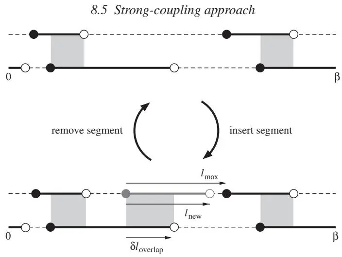
图8.6 线段图像中的局部更新。两种线段构型分别对应自旋向上和向下的电子。每条线段描绘了相应自旋的电子驻留在杂质上的一个时间间隔。线段的端点是算符$d^{\dagger}$（实心圆）和$d$（空心圆）的位置。我们通过为随机自旋添加一个随机长度的线段或反线段来增加微扰阶数，并通过移除随机选择的线段或反线段来降低阶数。

在每个时刻，杂质的本征态可以直接从线段表示得到，而迹因子变为

$$
\begin{array} {r l r} {{\mathrm{Tr}_{d} \Big [ e^{- \beta H_{\mathrm{loc}}} \mathcal{T} \prod_{\sigma} d_{\sigma} ( \tau_{n_{\sigma}}^{\sigma} ) d_{\sigma}^{\dagger} ( \tau_{n_{\sigma}}^{\prime \sigma} ) \cdot \cdot \cdot d_{\sigma} ( \tau_{1}^{\sigma} ) d_{\sigma}^{\dagger} ( \tau_{1}^{\prime \sigma} ) \Big ] =}} \\ {} & {} & {\qquad \mathcal{S} \exp \Big [ \mu ( l_{\uparrow} + l_{\downarrow} ) - U l_{\mathrm{overlap}} \Big ] ,} \end{array}
$$

其中$\mathcal{S}$是置换符号，$l_{\sigma}$是自旋$\sigma$的线段总“长度”，$l_{\mathrm{overlap}}$是自旋向上和向下线段重叠的总长度。图8.6的下方面板展示了一个具有三个自旋向上线段和两个自旋向下线段的构型。线段重叠的时间间隔（以灰色矩形标示）对应于杂质被双重占据的状态，需要付出排斥能$U$的代价。

在线段形式中，自然将零线段（对于给定的自旋$\sigma$）的构型分解为对应于占据和空$\sigma$态的“整线”（full line）和“空线”（empty line）贡献。

### 8.5.1 采样

为了确保遍历性，插入和移除自旋向上和向下的产生和湮灭算符对（线段或反线段）就足够了。插入线段的一种可能策略如下：我们在$[0, \beta)$中选择一个随机时间用于产生算符。如果该时间落在现有线段上，则杂质已被占据，该移动被拒绝。如果落在空白区域上，我们计算从该选定时间到下一个线段（沿$\tau$增加的方向）的长度$l_{\mathrm{max}}$。19然后我们在长度为$l_{\mathrm{max}}$的区间内随机选择新湮灭算符的位置（图8.6）。如果在逆过程中，我们提议移除该自旋的一个随机选择的线段，则插入和移除的提议概率为

$$
T ( n_{\sigma} + 1 n_{\sigma} ) = \frac{d \tau} {\beta} \frac{d \tau} {l_{\mathrm{max}}} , T ( n_{\sigma} n_{\sigma} + 1 ) = \frac{1} {n_{\sigma} + 1} .
$$

插入一段的接受概率为 $A ( n_{\sigma} + 1 n_{\sigma} ) = \operatorname*{min} [ 1 , \mathcal{R}_{\mathrm{insert}} ( n_{\sigma} + 1 n_{\sigma} ) ]$，其中

$$
\mathcal{R}_{\mathrm{insert}} ( n_{\sigma} + 1 \gets n_{\sigma} ) = \frac{\beta l_{\mathrm{max}}} {n_{\sigma} + 1} e^{\mu l_{\mathrm{new}} - U \delta l_{\mathrm{overlap}}} \frac{\operatorname*{det} \left[ M_{\sigma}^{( n_{\sigma} + 1 )} \right]^{- 1}} {\operatorname*{det} \left[ M_{\sigma}^{( n_{\sigma} )} \right]^{- 1}} ,\tag{8.51}
$$

而移除一段的接受概率由下式得到

$$
\mathcal{R}_{\mathrm{remove}} ( n_{\sigma} \gets n_{\sigma} + 1 ) = 1 / \mathcal{R}_{\mathrm{insert}} ( n_{\sigma} + 1 \gets n_{\sigma} ) .\tag{8.52}
$$

这里，$l_{\mathrm{new}}$ 是新段的长度，$\delta l_{\mathrm{overlap}}$ 是交叠量的变化。同样，我们使用第8.4.2节讨论的快速更新公式计算行列式之比。算法29描述了插入或移除一段所需的步骤。插入或移除反线段时采用类似的过程。20

### 8.5.2 格林函数的测量

策略是通过在构型 C 中将库区从给定的产生和湮没算符对中解耦，从而生成对格林函数测量有贡献的构型。我们首先将格林函数的期望值表示为

$$
G ( \tau ) = - \frac{1} {Z} \sum_{C} w_{C}^{d ( \tau ) d^{\dag} ( 0 )} = - \frac{1} {Z} \sum_{C} w_{C}^{( \tau , 0 )} \frac{w_{C}^{d ( \tau ) d^{\dag} ( 0 )}} {w_{C}^{( \tau , 0 )}} ,
$$

算法29 强耦合连续时间杂化求解器中线段的插入/删除。

输入：构型 $\begin{array} {r l r} {C} & {=} & {\{( \tau_{1}^{\prime \uparrow} , \tau_{1}^{\uparrow} ) , \dots , ( \tau_{n_{\uparrow}}^{\prime \uparrow} , \tau_{n_{\uparrow}}^{\uparrow} ) ; ( \tau_{1}^{\prime \downarrow} , \tau_{1}^{\downarrow} ) , \dots , ( \tau_{n_{\downarrow}}^{\prime \downarrow} , \tau_{n_{\downarrow}}^{\downarrow} ) \} .} \end{array}$

当阶数 $n_{\sigma} = 0$ 时，该构型编码为满线或空线，逆杂化函数矩阵 $M_{\sigma}$，杂化函数 $\Delta_{\sigma}$，相互作用 $U$，化学势 $\mu$，逆温度 $\beta$。

随机选择自旋 $\sigma$；
抽取一个均匀随机数 $\zeta \in [ 0 , 1 ]$；
如果 $( \zeta < 0.5 )$ 则
尝试插入一个自旋σ的线段
随机选择新线段的起始时间 $\tau_{\sigma}^{\prime} \in [ 0 , \beta )$；
如果 $\tau_{\sigma}^{\prime}$ 不在C的自旋σ线段或满线上则
计算到下一个自旋σ产生算符的最大长度 $l_{\mathrm{max}}$； $\triangleright$ 必须考虑周期性边界条件
在从 $\tau_{\sigma}^{\prime}$ 开始、长度为 $l_{\mathrm{max}}$ 的区间内，随机选择新线段的终点 $\tau_{\sigma}$；
计算新线段 $( \tau_{\sigma}^{\prime} , \tau_{\sigma} )$ 的长度 $l_{\mathrm{new}}$
计算新线段 $( \tau_{\sigma}^{\prime} , \tau_{\sigma} )$ 与反自旋线段的重叠长度 $\delta l_{\mathrm{overlap}}$；
使用(8.51)和(8.39)计算 $A ( n_{\sigma} + 1 n_{\sigma} )$；
抽取一个均匀随机数 $\zeta^{\prime} \in [ 0 , 1 ]$
如果 $( \zeta^{\prime} < A ( n_{\sigma} + 1 n_{\sigma} ) )$ 则
将线段 $( \tau_{\sigma}^{\prime} , \tau_{\sigma} )$ 插入到 $C$ 中；
使用 $\Delta^{\sigma}$ 和(8.40)–(8.43)更新 $M_{\sigma}$；
结束如果
结束如果
否则如果 $( n_{\sigma} > 0 )$ 则
尝试移除一个自旋σ的线段
随机选择一个C中自旋σ的线段；
计算该线段的长度；
计算该线段与反自旋线段的重叠长度；
使用(8.52)和(8.44)计算 $A ( n_{\sigma} - 1 n_{\sigma} )$；
抽取一个均匀随机数 $\zeta^{\prime} \in [ 0 , 1 ]$
如果 $( \zeta^{\prime} < A ( n_{\sigma} - 1 n_{\sigma} ) )$ 则
将所选线段从 $C$ 中移除；
使用(8.45)更新 $M_{\sigma}$。
结束如果
结束如果
返回更新后的C和M。

其中 $w_{C}^{d ( \tau ) d^{\dagger} ( 0 )}$ 表示在迹因子中带有额外算符 $d^{\dagger} ( 0 )$ 和 $d ( \tau )$ 的构型C的权重，而 $w_{C}^{( \tau , 0 )}$ 表示对应扩大算符序列（包括扩大的杂化行列式）的完整权重。由于两个权重的迹因子完全相同，最多相差一个置换符号 $( - 1 )^{i + j}$

$$
\frac{w_{C}^{d ( \tau ) d^{\dag} ( 0 )}} {w_{C}^{( \tau , 0 )}} = \frac{( - 1 )^{i + j} \operatorname * {d e t} \left[ M_{C} \right]^{- 1}} {\operatorname * {d e t} \left[ M_{C}^{( \tau , 0 )} \right]^{- 1}} = \left[ M_{C}^{( \tau , 0 )} \right]_{j i} ,
$$

其中i和j表示扩大后的 $[ M_{C}^{( \tau , 0 )} ]^{- 1}$ 中对应于额外算符 $d^{\dagger}$ 和 d 的行和列。因此，格林函数的测量公式变为21

$$
\begin{array} {l} {{G ( \tau ) = \displaystyle - \frac{1} {Z} \sum_{c} w_{C}^{( \tau , 0 )} [ {\cal M}_{C}^{( \tau , 0 )} ]_{j i} = \displaystyle - \frac{1} {Z} \sum_{{\cal \tilde{C}}} w_{{\cal \tilde{C}}} {\tilde{n}}^{2} \delta ( \tau_{{\tilde{n}}} - \tau ) \delta ( \tau_{{\tilde{n}}}^{\prime} - 0 ) [ {\cal M}_{{\tilde{C}}} ]_{{\tilde{n}} {\tilde{n}}}}} \\ {{\displaystyle ~ = - \frac{1} {Z} \sum_{{\cal \tilde{C}}} w_{{\tilde{C}}} {\tilde{n}}^{2} \frac{1} {\beta} \delta ( \tau , \tau_{{\tilde{n}}} - \tau_{{\tilde{n}}}^{\prime} ) [ {\cal M}_{{\tilde{C}}} ]_{{\tilde{n}} {\tilde{n}}} ,}} \end{array}
$$

在第一步中，我们以 $\delta ( \tau , \tau^{\prime} ) = \delta ( \tau - \tau^{\prime} )$ (对于 $\tau^{\prime} > 0$) 和 $\delta ( \tau , \tau^{\prime} ) = - \delta ( \tau - \tau^{\prime} - \beta )$ (对于 $\tau^{\prime} < 0$) 从对构型 $C$ 的求和（除了 $d ( \tau )$ 和 $d^{\dagger} ( 0 )$ 外，还有 $n$ 个产生湮灭算符）出发，过渡到对构型 $\tilde{C}$ 的求和（其中包含 $\tilde{n} = n + 1$ 个算符对）；而在最后一步，我们利用了平移不变性和格林函数的 $\beta$ 反周期性。最后，我们将因子 $\tilde{n}^{2}$（源自没有时间排序的蒙特卡洛权重中的 $1 / ( n ! )^{2}$ 因子）替换为对所有产生湮灭算符对 $i , j$ 的求和，得到测量公式 $\begin{array} {r} {G ( \tau ) = - \frac 1 Z \sum_{\tilde{C}} w_{\tilde{C}} \sum_{i j} \frac 1 \beta \delta ( \tau , \tau_{j} - \tau_{i}^{\prime} ) [ M_{\tilde{C}} ]_{j i}} \end{array}$，即

$$
\begin{array} {r l} {G ( \tau ) = - \cfrac{Z_{\mathrm{habs}}} {Z} \cfrac{1} {n^{2}} \int_{0}^{\beta} d \tau_{1} \cdots d \tau_{n} \int_{0}^{\beta} d \tau_{1}^{\prime} \cdots d \tau_{n}^{\prime}} \\ & {\quad \times \operatorname{Tr}_{d} \Big [ e^{- \beta H_{\mathrm{isc}}} T d ( \tau ) d^{\hat{\tau}} ( 0 ) d ( \tau_{n} ) d^{\hat{\tau}} ( \tau_{n}^{\prime} ) \cdots d ( \tau_{1} ) d^{\hat{\tau}} ( \tau_{1}^{\prime} ) \Big ] \mathrm{det} \Big [ M^{( \tau , 0 )} \Big ]^{- 1} \Big [ M^{( \tau , 0 )} \Big ]_{n + 1 , n + 1}} \\ & {= - \cfrac{Z_{\mathrm{habs}}} {Z} \cfrac{1} {n} ( \frac{n + 1} {( n + 1 ) ! ^{2}} \int_{0}^{\beta} d \tau_{1} \cdots d \tau_{n + 1} \int_{0}^{\beta} d \tau_{1}^{\prime} \cdots d \tau_{n + 1}^{\prime} \delta ( \tau_{n + 1} - \tau ) \delta ( \tau_{n + 1}^{\prime} - 0 )} \\ & {\quad \times \operatorname{Tr}_{d} [ e^{- \beta H_{\mathrm{isc}}} T d ( \tau_{n + 1} ) d^{\hat{\tau}} ( \tau_{n + 1}^{\prime} ) d ( \tau_{n} ) d^{\hat{\tau}} ( \tau_{n}^{\prime} ) \cdots d ( \tau_{1} ) d^{\hat{\tau}} ( \tau_{1}^{\prime} ) ] \mathrm{det} \Big [ M^{( \tau , 0 )} \Big ]^{- 1} \Big [ M^{( \tau , 0 )} \Big ]_{n + 1 , n + 1}} \\ & = - \cfrac Z_ \mathrm h \end{array}
$$

$$
G ( \tau ) = \Biggl \langle - \sum_{i j} \frac{1} {\beta} \delta ( \tau , \tau_{i} - \tau_{j}^{\prime} ) {\cal M}_{i j} \Biggl \rangle_{\mathrm{\scriptsize{M C}}} .\tag{8.53}
$$

对 (8.53) 进行傅里叶变换可得格林函数傅里叶系数的测量公式

$$
G ( i \omega_{n} ) = \left. - \sum_{i j} \frac{1} {\beta} e^{i \omega_{n} ( \tau_{i} - \tau_{j}^{\prime} )} M_{i j} \right. _{\mathrm{MC}}\tag{8.54}
$$

注意，与弱耦合方法（其中我们将格林函数作为Weiss格林函数的 ${\mathcal O} ( 1 / ( i \omega_{n} )^{2} )$ 级修正进行测量）不同，(8.54) 并不能自动给出正确的高频尾部。

抑制 $G ( i \omega_{n} )$ 在大 $\omega_{n}$ 时噪点并获得格林函数紧凑表示的一种优雅方法是，在一组正交多项式基上测量展开系数 (Boehnke et al., 2011)。一个合适的选择是勒让德多项式（Legendre polynomials）$P_{l} ( x )$，其定义在 $x \ \in \ [ - 1 , 1 ]$ 上，满足递推关系

$$
\begin{array} {c} {{P_{0} ( x ) = 1 ,}} \\ {{P_{1} ( x ) = x ,}} \\ {{( l + 1 ) P_{l + 1} ( x ) = ( 2 l + 1 ) x P_{l} ( x ) - l P_{l - 1} ( x ) .}} \end{array}
$$

此外，$P_{l}$ 满足 $\begin{array} {r} {\int_{- 1}^{1} d x P_{k} ( x ) P_{l} ( x ) = \frac{2} {2 l + 1} \delta_{k l}} \end{array}$。定义 $x ( \tau ) = 2 \tau / \beta - 1$，我们可以将区间 $\tau \in [ 0 , \beta ]$ 上的格林函数表示为

$$
G ( \tau ) = \sum_{l \geq 0} \frac{\sqrt{2 l + 1}} {\beta} P_{l} ( x ( \tau ) ) G_{l} ,\tag{8.55}
$$

$$
G_{l} = \sqrt{2 l + 1} \int_{0}^{\beta} d \tau P_{l} ( x ( \tau ) ) G ( \tau ) .\tag{8.56}
$$

勒让德展开相比松原展开的优势在于，其展开系数随阶数的增加衰减得更快。松原傅里叶变换需要对格林函数进行反周期化处理，且在 $\tau = m \beta$ 处存在不连续性，这导致松原系数衰减缓慢（对于大 $\omega_{n}$ ，有 $G( i \omega_{n} ) \sim 1 / i \omega_{n}$）。相比之下，勒让德基函数表示的是区间 $[0, \beta]$ 上的光滑函数 $G(\tau)$。在实践中，30-50 个勒让德系数就足以高精度地还原格林函数，而忽略高阶项则起到了一种便捷的噪声滤波器作用。

由 (8.53) 和 (8.56) 可得

$$
G_{l} = \left. - \sum_{i j} \frac{\sqrt{2 l + 1}} {\beta} \tilde{P}_{l} ( \tau_{i} - \tau_{j}^{\prime} ) M_{i j} \right. _{\mathrm{{M C}}} ,\tag{8.57}
$$

其中对于 $\tau > 0$，$\tilde{P}_{l} ( \tau ) = P_{l} ( x ( \tau ) )$；对于 $\tau < 0$，${\tilde{P}}_{l} ( \tau ) = - P_{l} ( x ( \tau + \beta ) )$。

松原系数可由勒让德系数得到：$\begin{array} {r} {G ( i \omega_{n} ) = \sum_{l > 0} T_{n l} G_{l} ,} \end{array}$，其中酉变换 $T_{n l}$ 由 $T_{n l} = ( - 1 )^{n} i^{l + 1}$ $\sqrt{2 l + 1} j_{l} ( {\textstyle{\frac{1} {7}}} \beta \omega_{n} )$ 给出，涉及球贝塞尔函数 ${j_{l}} ( z )$。在 $n \to \infty$ 的极限下，对于偶数 n，$T_{n l}$ 的衰减行为为 $\sim 1 / ( i \omega_{n} )$；对于奇数 n，则为 $\sim 1 / ( i \omega_{n} )^{2}$。

### 8.5.3 推广——矩阵形式

从第 8.5 节的推导可以明显看出，杂化展开形式适用于一般类别的杂质模型（Werner and Millis, 2006）。因为我们在权重 (8.50) 中精确计算了迹因子，所以 $H_{\mathrm{loc}}$ 可以包含任意的局域相互作用（例如，多轨道模型中的自旋交换项）、自由度（例如，近藤晶格模型中的自旋）或约束（例如，t-J 模型中的“无双占据”）。

对于 $H_{\mathrm{loc}}$ 在占据数基下为对角形式的多轨道杂质模型，例如具有密度-密度相互作用的模型，图 8.6 所示的段形式仍然适用。现在，对于每个标记 $\alpha$（轨道、自旋等），我们都有对应的段集合，并且仍然通过段的长度（化学势贡献）以及不同标记段之间的重叠（相互作用贡献）来计算迹因子。这使得我们可以非常高效地模拟具有五个、七个，甚至原则上更多轨道的模型，尽管相应的希尔伯特空间（五个轨道对应 $4^{5} = 1024$，七个轨道对应 $4^{7} = 16, 384$）相当大。

如果 $H_{\mathrm{loc}}$ 相对于由 $d_{\alpha}^{\dagger}$ 定义的占据数基不是对角的，那么计算

$$
\mathrm{Tr}_{d} \left[ e^{- \beta H_{\mathrm{loc}}} {\cal T} \prod_{\alpha} d_{\alpha} ( \tau_{n_{\alpha}}^{\alpha} ) d_{\alpha}^{\dagger} ( \tau_{n_{\alpha}}^{\prime \alpha} ) \cdot \cdot \cdot d_{\alpha} ( \tau_{1}^{\alpha} ) d_{\alpha}^{\dagger} ( \tau_{1}^{\prime \alpha} ) \right]\tag{8.58}
$$

就变得相当复杂，对于希尔伯特空间规模大的模型，计算量也很大。一个显而易见的想法是在本征基下计算迹，因为虚时演化算符 $e^{- H_{\mathrm{loc}} \tau}$ 在此基下是对角的。另一方面，算符 $d_{\alpha}$ 和 $d_{\alpha}^{\dagger}$ 在占据数基下简单且稀疏，但在本征基下却变成复杂的矩阵。因此，在本征基下计算迹因子涉及矩阵乘法，矩阵的大小随局域问题希尔伯特空间的维度缩放。由于该希尔伯特空间的维度随标记（flavor）数量指数增长，迹因子的计算便成为模拟过程中的计算瓶颈，因此矩阵形式（matrix formalism）仅适用于标记数量较少的系统。

识别并利用守恒量至关重要（Haule, 2007）。通常，这些守恒量包括自旋向上和自旋向下的粒子数以及动量。如果我们将 $H_{\mathrm{loc}}$ 的本征态按这些量子数分组，算符矩阵将呈现稀疏的块状结构。例如，算符 $d_{\uparrow , q}^{\dag}$ 将对应量子数 $m = \{n_{\uparrow} , n_{\downarrow} , k , . . . \}$ 的态连接到对应 $m^{\prime} = \{n_{\uparrow} + 1 , n_{\downarrow} , k + q , . . . \}$ 的态（如果存在的话）。通过检查算符序列与不同起始块的兼容性，我们可以在不执行任何昂贵的矩阵-矩阵乘法的情况下，识别出对迹有贡献的块。

让我们以一个双轨道模型为例，该模型具有守恒的量子数 $n_{\uparrow}$ 和 $n_{\downarrow}$。算符序列 $d_{\uparrow}^{\dagger} ( \tau_{4} ) d_{\uparrow}^{\dagger} ( \tau_{3} ) d_{\uparrow} ( \tau_{2} ) d_{\uparrow} ( \tau_{1} )$（其中 $\tau_{1} ~ <$ $\tau_{2} < \tau_{3} < \tau_{4} ）$ 与起始块 $\{n_{\uparrow} = 2 ; n_{\downarrow} = 0 , 1 , 2 \}$ 兼容，因为量子数演化如下：

$$
\{n_{\uparrow} = 2 ; n_{\downarrow} \} \xrightarrow{} \{n_{\uparrow} = 1 ; n_{\downarrow} \} \xrightarrow{} \{n_{\uparrow} = 0 ; n_{\downarrow} \} \xrightarrow{} \{n_{\uparrow} = 1 ; n_{\downarrow} \} \xrightarrow{} \{n_{\uparrow} = 2 ; n_{\downarrow} \} ,
$$

而块 $\{n_{\uparrow} = 0 , 1 ; n_{\downarrow} = 0 , 1 , 2 \}$ 对权重无贡献，例如：

$$
\{n_{\uparrow} = 1 ; n_{\downarrow} \} \xrightarrow [ d_{\uparrow} ] {} \{n_{\uparrow} = 0 ; n_{\downarrow} \} \xrightarrow [ d_{\uparrow} ] {} \emptyset .
$$

识别出有贡献的块之后，迹的计算简化为如下形式的块矩阵乘法：

$$
\sum_{\mathrm{\ 有贡献的块}} \mathrm{Tr}_{m} \bigg [ \cdot \cdot \cdot [ O ]_{m^{\prime \prime} m^{\prime}} [ e^{- ( \tau^{\prime} - \tau ) H_{\mathrm{loc}}} ]_{m^{\prime}} [ O ]_{m^{\prime} m} [ e^{- \tau H_{\mathrm{loc}}} ]_{m} \bigg ] ,\tag{8.59}
$$

其中 O 是产生算符或湮灭算符，m 表示矩阵块的索引，求和遍历那些与算符序列兼容的起始扇区。

利用守恒量子数所施加的块状结构，我们可以高效地模拟三轨道模型或四格点团簇。然而，由于矩阵块是稠密的，且最大的块随系统尺寸呈指数增长，对五轨道模型的模拟已经变得相当昂贵，而对具有五、六或七个电子的七轨道模型的模拟，只有在截断块的大小后才可行。

事实上，我们应该区分两种截断方式：

1.  将迹 $\sum_{\mathrm{contributing} m} \mathrm{Tr}_{m} [ . ~ . ~ . ]$ 限制在那些提供主要贡献的量子数扇区或状态上。

2.  通过消除高能态来减小算符块 $[ O ]_{m^{\prime} m^{\prime \prime}}$ 的大小。

第一类截断在温度足够低时影响很小，因为它只限制了虚时区间上单个点的可能状态。第二类截断问题更大，当系统尺寸较大时，可能导致难以估计和控制的系统性误差。

累积在采样过程中访问过的状态或量子数扇区的直方图非常具有启发性。例如，在研究具有多个部分填充轨道的关联材料时，有趣的问题包括典型的价态或主导的自旋态，以及向其他电荷和自旋态涨落的重要性。动力学平均场理论允许我们通过将固体视为原子的集合，采用实空间表示，并通过有效杂质模型构造处理给定格点上的局域涨落，来解决这些问题。强耦合求解器精确处理了杂质问题的局域部分，非常适合此类分析。

作为说明，图8.7展示了一个在半填充双轨道模型（Werner and Millis, 2007）的DMFT模拟中累积的直方图。两个轨道的能量因“晶体场劈裂”δ 而相对移动。对于大的 δ，将两个电子置于较低能量的轨道，从而形成低自旋（S = 0）构型在能量上更有利。对于小的 δ，洪德耦合倾向于两个轨道等占有的高自旋（S = 1）态。因此，在大相互作用下，我们可以预期，随着晶体场劈裂 δ 的增大，系统会从高自旋绝缘相转变到低自旋绝缘相，并且两者之间可能出现一个金属相。图中显示的是 $4^{2} = 16$ 个原子态（$H_{\mathrm{loc}}$ 的本征态）的权重，或者更精确地说，是这些状态中的每一个对迹因子 (8.58) 的平均贡献。我们看到，对于最小的晶体场劈裂，三个状态（|6⟩, |7⟩, |8⟩）占主导地位；它们是三个简并的、半填充的 S = 1 态。本征态 |10⟩ 和 |11⟩ 是两个状态（一个轨道有两个电子而另一个轨道没有电子）的线性组合，其中状态 |10⟩ 的能量较低。这个半填充的、低能量的 $S = 0$ 态在大 δ 时成为主导状态。因此，通过查看原子态的直方图，我们可以立即识别出在小 δ 和大 δ 时这两个相的高自旋和低自旋特征。由于它们是绝缘体，向其他电荷态的涨落被抑制了。

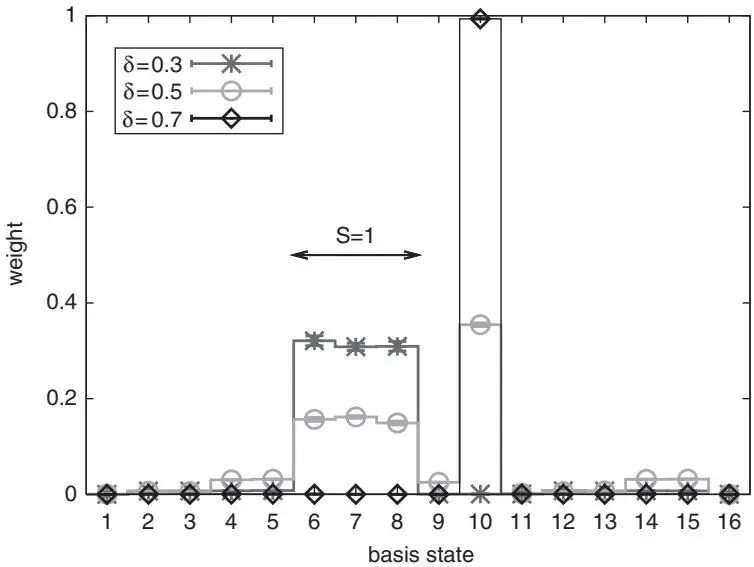
图8.7 对一个具有强相互作用和洪德耦合、且轨道间存在晶体场劈裂δ的半填充双轨道模型进行DMFT模拟得到的局域量子态直方图。带宽为4，温度为 $\frac{\dot{1}} {50}$ 。该直方图显示了$H_{\mathrm{loc}}$的16个本征态中每个状态对蒙特卡洛构型权重的平均相对贡献。（改编自 Werner and Millis (2007)。）

对于δ的中间值，直方图呈现出不同的特征。此时，半填充的自旋单态和自旋三重态都对迹有显著贡献，且向拥有一个（如|4⟩、|5⟩）或三个（如|14⟩、|15⟩）电子的态的电荷涨落不可忽略。该直方图对应于一个在接近半填充高自旋和低自旋原子态的能级交叉时出现的金属性解。

正如这个简单例子所示，通过观察态直方图并识别其中的主导态和简并度，我们能够深入了解复杂（多轨道）晶格模型在DMFT求解中相与相变的本质。

### 8.5.4 推广——Krylov形式

评估迹因子 (8.58) 的另一种策略 (Lauchli and Werner, 2009) 是：

1.  采用占据数基，在该基下我们可以轻松地将$d_{\alpha}$和$d_{\alpha}^{\dagger}$算符矩阵应用于任何态，并且可以在虚时演化过程中利用$H_{\mathrm{loc}}$的稀疏性。
2.  通过求和最低能量态来近似迹，即使用上一小节中描述的(1)型截断。

我们不计算算符乘积对应的矩阵，而是将迹中的每个保留态传播通过时间演化、产生和湮灭算符序列。此计算仅涉及类型为$d_{\alpha} | \nu \rangle$、$d_{\alpha}^{\dagger} | \nu \rangle$和$H_{\mathrm{loc}} | \nu \rangle$的矩阵-向量乘法，其中算符$d_{\alpha}$、$d_{\alpha}^{\dagger}$和$H_{\mathrm{loc}}$是稀疏的，因此对于稠密矩阵块乘法代价高昂的系统，这种方法是可行的。此外，该方法不需要任何(2)型截断，因此在中间τ处所有激发态仍然可及。虽然$H_{\mathrm{loc}}$的稀疏性取决于相互作用项的数量，但该数量最多与轨道数的平方成正比增长。相比之下，矩阵的维度随轨道数呈指数增长。

计算中代价高昂的步骤是计算从一个算符到下一个算符的时间演化。我们通过迭代构建Krylov空间

$$
\mathcal{K}_{p} ( \vert \nu \rangle ) = \operatorname{span} \{\vert \nu \rangle , H_{\mathrm{loc}} \vert \nu \rangle , H_{\mathrm{loc}}^{2} \vert \nu \rangle , \dots , H_{\mathrm{loc}}^{p} \vert \nu \rangle \}
$$

并利用哈密顿量在$\mathinner{\mathcal{K}_{p} \mathopen{\left( | \nu \rangle \right)}}$上的投影的矩阵指数来近似完整的矩阵指数，从而评估应用于向量的矩阵指数$\exp ( - \tau H_{\mathrm{loc}} ) | \nu \rangle$。迭代次数$p$通过跟踪$\exp ( - \tau H_{\mathrm{loc}} ) | \nu \rangle$的收敛性来确定，当迭代$p$和$p+1$之间的差值低于某个截断值时就停止计算。迭代次数取决于时间区间τ，但通常收敛发生在非常小的迭代次数$p \ll N_{\mathrm{dim}}$处，其中$N_{\mathrm{dim}}$是希尔伯特空间的维度。

在局域希尔伯特空间维度$N_{\mathrm{dim}}$很大的极限下，Krylov方法比基于算符$d_{\alpha}$、$d_{\alpha}^{\dagger}$的矩阵表示并评估矩阵乘积迹的实现更高效。如果蒙特卡洛构型具有n个产生算符和n个湮灭算符，并且我们对$N_{\mathrm{tr}} \le N_{\mathrm{dim}}$个态进行迹的计算，那么迹的Krylov计算的计算量级为

$$
\mathcal{O} ( N_{\mathrm{tr}} N_{\mathrm{dim}} 2 n ( 1 + \langle p \rangle ) ) ,
$$

<!-- glossary: Krylov formalism = Krylov形式
Krylov space = Krylov空间
diagonalization = 对角化
matrix exponential = 矩阵指数
sparsity = 稀疏性
dense matrix = 稠密矩阵 -->

其中第一项来自产生湮灭算符的作用，第二项正比于Krylov空间平均维数$\langle p \rangle$，来自时间演化算符的作用。如果我们在迹计算中保留所有态，即$N_{\mathrm{tr}} = N_{\mathrm{dim}}$，则迹计算规模为$N_{\mathrm{dim}}^{2}$。如果我们将迹限制在少数低能态上，那么$N_{\mathrm{tr}}$为$\mathcal{O} ( 1 )$，迹计算复杂度与$N_{\mathrm{dim}}$成线性关系。这一缩放关系应与基于矩阵乘法（不截断矩阵块）计算迹的$\mathcal{O} ( 2 n N_{\mathrm{dim}}^{3} )$计算量进行比较。22

尽管理论上Krylov空间方法因其优越的$N_{\mathrm{dim}}$缩放关系是首选方法，但在实践中，$N_{\mathrm{tr}} , \ \langle p \rangle$和$N_{\mathrm{dim}}$的具体数值决定了两种方法在给定问题中哪种更优。经验表明，对于五轨道问题，Krylov方法优于矩阵方法。

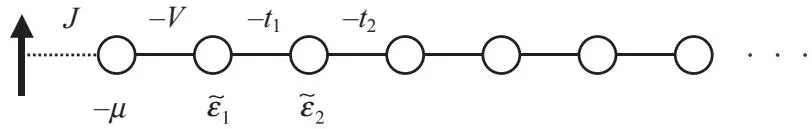
图8.8 量子杂质模型在近藤极限下的链表示。杂质态被限制在单占据态| ↑和| ↓。这个自旋$\frac{1}{2}$自由度通过交换积分J与格点0上的自旋$\vec{S} = \textstyle{\frac{1} {2}} \psi_{c}^{\dagger} \bar{\vec{\sigma}} \psi_{c}$耦合，图中由链条的第一个格点表示。

## 8.6 无限U极限：近藤模型

在相互作用极强的情况下，我们无法使用弱耦合或强耦合连续时间蒙特卡洛求解器有效模拟半满的Anderson杂质模型。弱耦合方法不适用，因为微扰阶次变得非常大；而强耦合方法可能遇到采样效率问题，因为杂化事件对应于跃迁到能量极高的双占据或空态。尽管跃迁到占据数不等于1的态是可以接受的，只要这种偏离持续时间极短，且强耦合算法原则上可以处理任意短的段或反段，但更恰当且更高效的做法是投影掉电荷涨落，考虑一个低能有效模型，其中单占据杂质（由自旋$\frac{1}{2}$表示）与库交换自旋（图8.8）。从Anderson杂质模型出发的这个投影引导我们得到第二个标志性杂质模型，即(8.2)定义的近藤杂质模型。为了求解该模型，我们需要计算格点0（杂质位置）处库的格林函数。杂质的格林函数随后可由库的T矩阵得到（Costi, 2000）。在以下小节中，我们讨论近藤杂质模型的两种互补连续时间求解器：(i) 基于交换相互作用J展开的弱耦合方法，以及(ii) 基于格点0与库其余部分之间杂化V展开的强耦合方法。

### 8.6.1 弱耦合方法

在弱耦合模拟中（Otsuki et al., 2007），我们通过引入产生算符$d_{\sigma}^{\dagger}$将局域自旋s费米子化，并写作

$$
\vec{s} = \frac{1} {2} \psi_{d}^{\dagger} \vec{\sigma} \psi_{d} ,
$$

其中$\vec{\sigma} = ( \sigma^{x} , \sigma^{y} , \sigma^{z} )$，$\psi_{d}^{\dagger} = ( d_{\uparrow}^{\dagger} , d_{\downarrow}^{\dagger} )$。然后我们用波数无关的耦合J将哈密顿量(8.2)表示为

$$
H = \sum_{k \sigma} \epsilon_{k} c_{k \sigma}^{\dagger} c_{k \sigma} + \frac{1} {2} J \Bigl [ s^{z} ( c_{\uparrow}^{\dagger} c_{\uparrow} - c_{\downarrow}^{\dagger} c_{\downarrow} ) + s^{+} c_{\downarrow}^{\dagger} c_{\uparrow} + s^{-} c_{\uparrow}^{\dagger} c_{\downarrow} \Bigr ] ,\tag{8.60}
$$

其中 $s^{+} = d_{\uparrow}^{\dagger} d_{\downarrow} , s^{-} = d_{\downarrow}^{\dagger} d_{\uparrow} , s^{z} = {\textstyle{\frac{1} {2}}} ( d_{\uparrow}^{\dagger} d_{\uparrow} - d_{\downarrow}^{\dagger} d_{\downarrow} )$，且 $\begin{array} {r} {c_{\sigma}^{\dagger} = \frac{1} {\sqrt{N}} \sum_{k} c_{k \sigma}^{\dagger}} \end{array}$ 是格点0处（链表示中的第一个格点）导带电子的产生算符。利用约束 $d_{\uparrow}^{\dagger} d_{\uparrow}^{} + d_{\downarrow}^{\dagger} d_{\downarrow}^{} = 1$，我们重新写出哈密顿量，得到

$$
H = \sum_{k \sigma} \epsilon_{k} c_{k \sigma}^{\dagger} c_{k \sigma} - \frac{1} {4} J \sum_{\sigma} c_{\sigma}^{\dagger} c_{\sigma} + \frac{1} {2} J \sum_{\sigma \sigma^{\prime}} d_{\sigma}^{\dagger} d_{\sigma^{\prime}} c_{\sigma^{\prime}}^{\dagger} c_{\sigma} .\tag{8.61}
$$

对于弱耦合模拟，我们将此哈密顿量拆分为精确可解部分 $\begin{array} {r c l} {{H_{1}}} & {{=}} & {{\sum_{k \sigma} \epsilon_{k} c_{k \sigma}^{\dagger} c_{k \sigma} - \frac{1} {4} {\cal J} \sum_{\sigma} c_{\sigma}^{\dagger} c_{\sigma}}} \end{array}$ 和剩余部分 $\begin{array} {r l} {H_{2}} & {{} =} \end{array}$ $\begin{array} {r} {\frac{J} {2} \sum_{\sigma \sigma^{\prime}} d_{\sigma}^{\dagger} d_{\sigma^{\prime}} c_{\sigma^{\prime}}^{\dagger} c_{\sigma}} \end{array}$，然后将配分函数按 $H_{2}$ 的幂次展开。对费米子自由度求迹，得到具有微扰阶数 n 以及给定“对角” $( c_{\sigma}^{\dagger} c_{\sigma} )$ 和“非对角” $( c_{\sigma}^{\dagger} c_{\bar{\sigma}} )$ 算符序列的蒙特卡洛构型的权重：

$$
\begin{array} {l} {{w_{C} = ( - J d \tau / 2 )^{n} \mathrm{Tr}_{d} \Big [ \mathcal{T} d_{\sigma_{1}}^{\dagger} ( \tau_{1} ) d_{\sigma_{1}^{\prime}} ( \tau_{1} ) \cdot \cdot \cdot d_{\sigma_{n}}^{\dagger} ( \tau_{n} ) d_{\sigma_{n}^{\prime}} ( \tau_{n} ) \Big ]}} \\ {{\times \prod_{\sigma} Z_{c} \frac{1} {Z_{c}} \mathrm{Tr}_{c} \Big [ e^{- \beta H_{1}} \mathcal{T} c_{\sigma}^{\dagger} ( \tau_{1}^{\prime} ) c_{\sigma} ( \tau_{1}^{\prime \prime} ) \cdot \cdot \cdot c_{\sigma}^{\dagger} ( \tau_{n_{\sigma}}^{\prime} ) c_{\sigma} ( \tau_{n_{\sigma}}^{\prime \prime} ) \Big ] \mathcal{S} .}} \end{array}
$$

这里，时间 $ 0 < \tau_{1} < \cdot \cdot \cdot < \tau_{n} < \beta$ 标记 $H_{2} \mathrm{- o p e r a t o r}$ 的位置，$0 ~ < ~ \tau_{1}^{\prime} ~ < ~ \cdot \cdot ~ < ~ \tau_{n_{\sigma}}^{\prime} ~ < ~ \beta$ 标记导带产生算符的位置，$ 0 < \tau_{1}^{\prime \prime} < \cdots < \tau_{n_{\sigma}}^{\prime \prime} < \beta$ 标记导带湮灭算符的位置 $( \sum_{\sigma} n_{\sigma} = n )$。$\mathcal{S}$ 是一个与自旋向上和自旋向下算符分离以及将产生与湮灭算符配对分组相关的置换符号。$Z_{c}$ 是 $H_{1}$ 的配分函数，一个无关的常数因子，我们引入它以便计算导带态的期望值。

对 d 态求迹，对我们可插入的算符类型施加了约束。我们可以插入“对角算符” $c_{\sigma}^{\dagger} c_{\sigma}$（其中 $\sigma$ 与 d-费米子的自旋相同），或插入自旋翻转算符对 $c_{\uparrow}^{\dagger} c_{\downarrow}$ 和 $c_{\downarrow}^{\dagger} c_{\uparrow}$。期望值 $\begin{array} {r} {\prod_{\sigma} \frac{1} {Z_{c}} \mathrm{Tr}_{c} [ \dots ]} \end{array}$ 给出两个矩阵行列式的乘积，det $\tilde{M}_{\uparrow}^{- 1}$ det $\tilde{M}_{\downarrow}^{- 1}$。由于 (8.61) 中的散射项，这些矩阵的元素是无相互作用的格林函数 $\tilde{\mathcal{G}}_{0}^{\sigma}$，它们与魏斯格林函数 $\mathcal{G}_{0}^{\sigma}$ 的关系为

$$
\tilde{\mathcal{G}}_{0}^{\sigma} ( i \omega_{n} ) = \frac{\mathcal{G}_{0}^{\sigma} ( i \omega_{n} )} {1 + \frac{1} {4} J \mathcal{G}_{0}^{\sigma} ( i \omega_{n} )} .
$$

具体来说，$[ \tilde{M}_{\sigma}^{- 1} ]_{i j} = \tilde{\mathcal{G}}_{0}^{\sigma} ( \tau_{i}^{\prime \prime} - \tau_{j}^{\prime} )$

图8.9展示了一个可能的算符序列。上方的两条时间线表示自旋的虚时演化，下方的两条时间线展示了一组库珀产生和湮灭算符序列。产生算符和湮灭算符分别用实心和空心的圆圈或方块表示。半满的方块对应于对角算符 $c_{\sigma}^{\dagger} ( \tau ) c_{\sigma} ( \tau )$，其 σ 必须与 $\tau$ 时刻 d 线表示的自旋相同。

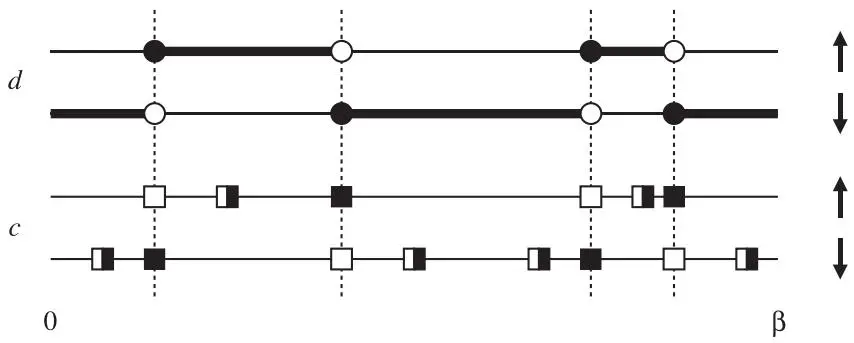
图8.9 对应于四个非对角算符和六个对角算符的蒙特卡洛构型。上方两线表示 d 态的时域演化，其中 $\sigma = \uparrow , \downarrow$（黑色线段表示自旋 s 的方向）。实心圆圈表示产生算符，空心圆圈表示湮灭算符。下方两线显示的是位点 0 处自旋向上和向下的产生与湮灭算符序列（实心和空心方块）。仅当自旋 s 处于 $\sigma$ 态时，才能插入对角算符 $c_{\sigma}^{\dagger} ( \tau ) c_{\sigma} ( \tau )$

蒙特卡洛采样通过插入和移除成对的自旋翻转（图8.9中的垂直虚线）以及插入和移除对角算符（半填充方块）来进行。自旋翻转更新类似于第8.5.1节讨论的段构型更新。我们为第一次自旋翻转随机选择一个时间，并定义到下一个算符（要么是对角算符，要么是自旋翻转事件）的区间 $l_{\mathrm{max}}$。然后在该区间上随机选取第二个自旋翻转点。仅当两个相邻自旋翻转之间没有对角算符时，才能移除这一对。我们单独插入和移除对角算符，但仅当自旋与 d 段的状态兼容时，插入才可能进行。

位点0处库珀格林函数的测量与我们在第8.4.3节弱耦合部分描述的方式相同。该测量相当于累积 T-矩阵（参见公式(8.48)）

$$
\tilde{t}_{\sigma} ( i \omega_{n} ) = \left. - \frac{1} {\beta} \sum_{k l} e^{i \omega_{n} ( \tau_{k} - \tau_{l} )} [ \tilde{M}_{\sigma} ]_{k l} \right. _{\mathrm{MC}} ,\tag{8.62}
$$

其中波浪线提醒我们，该 T-矩阵相对于 $\tilde{\mathcal{G}}_{0}^{\sigma}$。它与库珀格林函数 $G^{\sigma}$ 和真正的 T-矩阵 $t^{\sigma}$ 的关系为

$$
\begin{array} {r} {G^{\sigma} ( i \omega_{n} ) = \tilde{\mathcal{G}}_{0}^{\sigma} ( i \omega_{n} ) + \tilde{\mathcal{G}}_{0}^{\sigma} ( i \omega_{n} ) \tilde{t}^{\sigma} ( i \omega_{n} ) \tilde{\mathcal{G}}_{0}^{\sigma} ( i \omega_{n} )} \\ {= \mathcal{G}_{0}^{\sigma} ( i \omega_{n} ) + \mathcal{G}_{0}^{\sigma} ( i \omega_{n} ) t^{\sigma} ( i \omega_{n} ) \mathcal{G}_{0}^{\sigma} ( i \omega_{n} ) .} \end{array}
$$

因此，库珀的 T-矩阵变为

$$
t^{\sigma} ( i \omega_{n} ) = \frac{- \frac{1} {4} J} {1 + \frac{1} {4} J \mathcal{G}_{0}^{\sigma} ( i \omega_{n} )} + \frac{\tilde{t}^{\sigma} ( i \omega_{n} )} {\left[ 1 + \frac{1} {4} J \mathcal{G}_{0}^{\sigma} ( i \omega_{n} ) \right]^{2}} ,\tag{8.63}
$$

并且该 T-矩阵直接给出杂质格林函数。

### 8.6.2 强耦合方法

我们还可以使用[第8.5节](ch08.md)讨论的强耦合方法来高效地模拟近藤杂质模型（8.2）。在该方法中，我们处理哈密顿量的局域部分，

$$
H_{\mathrm{loc}} = - \mu \sum_{\sigma} c_{\sigma}^{\dagger} c_{\sigma} + J_{S}^{\vec{\varsigma}} \cdot \Big ( \frac{1} {2} \psi_{c}^{\dagger} \vec{\sigma} \psi_{c} \Big ) ,\tag{8.64}
$$

精确保留配分函数并按浴场轨道0（自旋s与之耦合）与其余浴场之间跳跃的幂次展开（Werner and Millis, 2006）。在链表示（图8.8）中，该跳跃幅度即为参数V。我们积掉非相互作用的浴场格点，得到一个有效作用量，其中八维局域问题（8.64）与杂化函数 $\Delta^{\sigma} ( \tau )$ 耦合（见图8.10）。

接下来在由总电子数、总自旋和总自旋z分量标记的基矢中对 $H_{\mathrm{loc}}$ 进行对角化。若粒子数为0或2，则自旋态为局域矩s的自旋态。若粒子数为1，则自旋态为单态S或三重态 $T_{m_{z}}$，其中 $m_{z} = 1 , 0 , \mathrm{or} - 1$ 。相应地，我们按表8.1标记本征态，其中第一项是电子数，第二项是自旋态。单态S为 $( | \uparrow , \downarrow \rangle - | \downarrow , \uparrow \rangle ) / \sqrt{2}$，第一项表示传导电子，第二项表示局域矩自旋方向。在此基矢中，虚时演化算符是对角的，即 $e^{- H_{\mathrm{loc}} \tau} | n \rangle = e^{- E_{n} \tau} | n \rangle$，本征能量 $E_{n}$ 列于表8.1中。

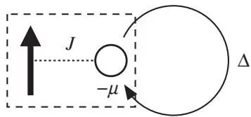
图8.10 近藤杂质模型的有效作用量。八维局域问题（虚线框）描述了局域自旋s与0号格点上传导电子自旋S的耦合。传导电子从0号格点跳跃到晶格其余部分并返回的过程由杂化函数 $\Delta$ 表示。

表8.1 近藤杂质模型（8.64）局域部分的本征态与本征能量。第一项标记电子数，第二项标记自旋态：若电子数为0或2，则为杂质自旋↑, ↓；若n=1，则为总自旋S（单态）或 $T_{m_{z}}$（三重态，$m_{z} = 1 , 0 , - 1$）。

| 本征态 | 能量 |
|---|---|
| $| 1 \rangle = | 0 , \uparrow \rangle$ | 0 |
| $| 2 \rangle = | 0 , \downarrow \rangle$ | 0 |
| $| 3 \rangle = | 1 , S \rangle$ | $- {\frac{3} {4}} J - \mu$ |
| $| 4 \rangle = | 1 , T_{1} \rangle$ | $\frac{1} {4} J - \mu$ |
| $| 5 \rangle = | 1 , T_{0} \rangle$ | $\frac{1} {4} J - \mu$ |
| $| 6 \rangle = | 1 , T_{- 1} \rangle$ | $\frac{1} {4} J - \mu$ |
| $| 7 \rangle = | 2 , \uparrow \rangle$ | $- 2 \mu$ |
| $| 8 \rangle = | 2 , \downarrow \rangle$ | $- 2 \mu$ |

自旋向上和向下电子的产生算符变为稀疏块矩阵

$$
\begin{array} {r l} & {\left( \begin{array} {l l l l l l l} {0} & {0} & {0} & {0} & {0} & {0} & {0} \\ {0} & {0} & {0} & {0} & {0} & {0} & {0} \\ {0} & {0} & {0} & {0} & {0} & {0} & {0} \\ {0} & {0} & {0} & {0} & {0} & {0} & {0} \\ {0} & {0} & {0} & {0} & {0} & {0} & {0} \\ {0} & {0} & {0} & {0} & {0} & {0} & {0} \\ {0} & {0} & {0} & {0} & {0} & {0} & {0} \\ {0} & {0} & {0} & {0} & {0} & {0} & {0} \end{array} \right) \left( \begin{array} {l} {0} {0} \\ {0} \\ {0} \\ {0} \\ {0} \end{array} \right)} \\ & {\quad \quad \quad \quad \quad \quad \quad \quad \quad \quad \quad \quad \quad \quad \quad \quad \quad \quad \quad \quad \quad \quad \quad \quad \quad} \\ & {\quad \quad \quad \quad \quad \quad \quad \quad \quad \quad \quad \quad \quad \quad \quad \quad \quad \quad \quad \quad \quad \quad \quad \quad \quad \quad \quad \quad \quad \quad \quad \quad \quad \quad \quad} \\ & {\quad \quad \quad \quad \quad \quad \quad \quad \quad \quad \quad \quad \quad \quad \quad \quad \quad \quad \quad \quad \quad \quad \quad \quad \quad \quad \quad \quad \quad \quad \quad \quad \quad \quad \quad \quad} \\ & {\quad \quad \quad \quad \quad \quad \quad \quad \quad \quad \quad \quad \quad \quad \quad \quad \quad \quad \quad \quad \quad \quad \quad \quad \quad \quad \quad \quad \quad \quad \quad \quad \quad \quad \quad \quad \quad} \\ & {\quad \quad \quad \quad \quad \quad \quad \quad \quad \quad \quad \quad \quad \quad \quad \quad \quad \quad \quad \quad \quad \quad \quad \quad \quad \quad \quad \quad \quad \quad \quad \quad \quad \quad \quad \quad \quad \quad \quad \quad} \\ & \quad \quad \quad \quad \quad \quad \quad \end{array}\tag{8.65}
$$

<!-- glossary: 无新增术语 -->

(8.66)

水平线和垂直线定义了与总电子数守恒相对应的块结构。利用这些稀疏算子矩阵，按照第8.5.3节所述进行采样，而站点0处浴格林函数的测量过程与第8.5.2节所述相同。最后，我们从 $G^{\sigma} ( i \omega_{n} ) =$ $\mathcal{G}_{0}^{\sigma} ( i \omega_{n} ) + \mathcal{G}_{0}^{\sigma} ( i \omega_{n} ) t^{\sigma} ( i \omega_{n} ) \mathcal{G}_{0}^{\sigma} ( i \omega_{n} )$ 提取T矩阵，其中 $\mathcal{G}_{0}^{\sigma} ( i \omega_{n} )$ 由(8.15)定义，并得到杂质格林函数。

虽然弱耦合方法在J较小的区域高效，但强耦合方法则容易捕捉到J较大时形成的单态。

## 8.7 行列式结构与符号问题

### 8.7.1 将图组合成行列式

在弱耦合和强耦合杂质求解器中出现的行列式，是维克尔定理（Wick's theorem）对哈密顿量的非相互作用部分（弱耦合方法）或非相互作用浴（强耦合方法）应用的结果。与第7.1.2节中我们看到的方式类似，一个 $n \times n$ 矩阵的行列式对应配分函数的n!个图的集合。在这个集合中，既有连通图也有非连通图。这n!个图的共同点是n个相互作用顶点在虚时间区间上的位置（弱耦合方法）或n个产生算符和n个湮灭算符的位置（强耦合方法）。图8.11展示了与某些固定算符位置相对应的所有二阶（弱耦合）和三阶（强耦合）贡献。我们注意到，算符的费米子性质导致单个图带有反对易符号。行列式使我们能够以正确的符号求和n!个图，并且至少在像安德森杂质模型（Anderson impurity model）这样的简单模型中，完全吸收正权重和负权重贡献之间的抵消效应。

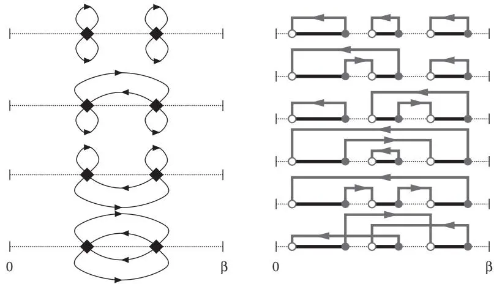
图8.11 左图：可求和为行列式的弱耦合图。菱形代表相互作用顶点，线条代表自旋向上和向下电子的外斯格林函数（Weiss Green's function）。右图：可求和为行列式的强耦合图。空心圆代表产生算符，实心圆代表湮灭算符。产生和湮灭算符由杂化线连接。

为了强调行列式的关键作用，我们考虑一个简单的模型：一个非相互作用的（无自旋）杂质耦合到一个能量为 $\varepsilon = 0$、杂化为V的浴场点。作用量写作

$$
S = \int_{0}^{\beta} d \tau \int_{0}^{\beta} d \tau^{\prime} d^{\dag} ( \tau^{\prime} ) \Delta ( \tau^{\prime} - \tau ) d ( \tau ) ,
$$

其中杂化函数(8.14)由 $\Delta ( i \omega_{n} ) = | V | ^{2} / i \omega_{n}$ 给出，在虚时下变为

$$
\Delta ( \tau ) = \left\{\begin{array} {l l} {- \frac 12 | V | ^{2}} & {0 < \tau < \beta ,} \\ {\phantom{-} \frac 12 | V | ^{2}} & {- \beta < \tau < 0 .} \end{array} \right.
$$

在这个简单模型中，图权重的绝对值只依赖于微扰阶数n，而不依赖于算符位置，因此对算符位置的积分仅仅产生一个因子 $2 \beta^{2 n} / ( 2 n ) !$ 。对应于一组n个产生算符和n个湮灭算符的n!个拓扑不等价图的组合权重是行列式

$$
\operatorname*{det} \left( \begin{array} {c c c c} {\frac{1} {2} | V | ^{2}} & {\frac{1} {2} | V | ^{2}} & {\frac{1} {2} | V | ^{2}} & {\ldots} \\ {- \frac{1} {2} | V | ^{2}} & {\frac{1} {2} | V | ^{2}} & {\frac{1} {2} | V | ^{2}} & {\ldots} \\ {- \frac{1} {2} | V | ^{2}} & {- \frac{1} {2} | V | ^{2}} & {\frac{1} {2} | V | ^{2}} & {\ldots} \\ & & {\vdots} & {\vdots} & {\ddots} \\ {\vdots} & {\vdots} & {\vdots} & {\ddots} \end{array} \right) = \frac{1} {2} | V | ^{2 n} ,\tag{8.67}
$$

<!-- glossary: Anderson impurity model = 安德森杂质模型
Weiss Green's function = 外斯格林函数 -->

当我们考虑到时间排序带来的符号时，这说明在基于行列式的蒙特卡洛采样中不存在符号问题，且阶数为 \(n\) 的构型按照以下概率生成：

$$
p_{\mathrm{determinants}} ( n ) \sim ( \beta | V | )^{2 n} / ( 2 n ) ! .
$$

另一方面，在对单个费曼图进行采样（基于其权重的绝对值）时获得的概率分布为：

$$
p_{\mathrm{diagrams}} ( n ) \sim ( n ! / 2^{n} ) ( \beta | V | )^{2 n} / ( 2 n ) ! .
$$

图8.12 比较了逆温度 \(\beta | V | = 2\) 和 \(\beta | V | = 20\) 下的这两个分布函数。在较低温度下，基于单个费曼图采样的模拟将花费大部分时间来生成阶数约为 50 的构型。然而，正如行列式分布所示，由于符号抵消，这些构型对配分函数（进而对物理可观测量）的贡献微乎其微。实际相关的微扰阶次要低得多，因为行列式的分布函数在阶数 \(\sim 10\) 处达到峰值。因此，将费曼图求和为行列式之所以如此重要（尤其是在低温下），有两个相互关联的原因：

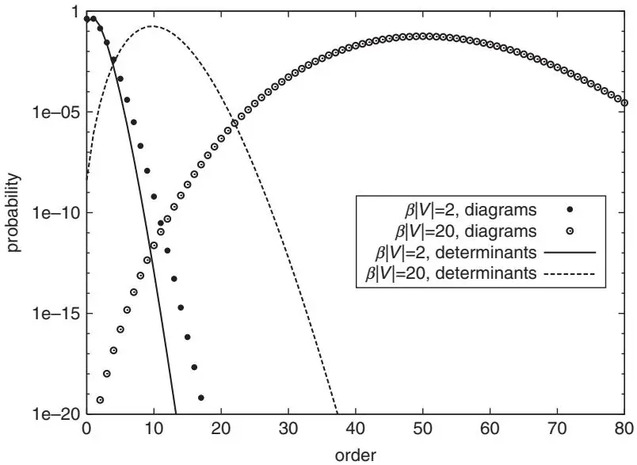
图8.12 具有一个浴场（bath）位点（能量 \(\varepsilon ~ = ~ 0\) ，杂化能 \(\bar{V ,}\) ，逆温度 \(\beta\) ）的无相互作用安德森杂质模型的微扰阶数分布（每个自旋）。圆圈表示在单个强耦合费曼图采样中得到的分布，而线表示在行列式采样中得到的分布。

1.  行列式对数量庞大的单个费曼图进行了求和。一个 \(100 \times 100\) 矩阵的行列式很容易通过数值计算得出，它对应于 \(100 ! = 10^{158}\) 个费曼图的组合权重！实际上，我们可以处理平均微扰阶数高达 \(\sim 1000\) 的情况。
2.  基于行列式的采样生成的构型，其微扰阶数低于单个费曼图的采样。这种效率上的提升是高阶费曼图之间符号抵消的结果。

### 8.7.2 无符号问题

为了证明安德森杂质模型的弱耦合与强耦合连续时间蒙特卡洛模拟中不存在符号问题，我们使用第 8.1.1 节引入的杂质模型链表示。我们首先讨论弱耦合方法（Yoo et al., 2005），假设相互作用项已根据 (8.31) 和 (8.32) 式重写。在链表示中，哈密顿量的二次部分为：

$$
\tilde{H}_{0} = \sum_{\sigma} \sum_{j = 0}^{\infty} \Big [ \tilde{\varepsilon}_{j} c_{j \sigma}^{\dag} c_{j \sigma}^{\vphantom{\dag}} - t_{j} ( c_{j + 1 , \sigma}^{\dag} c_{j \sigma}^{\vphantom{\dag}} + c_{j \sigma}^{\dag} c_{j + 1 , \sigma}^{\vphantom{\dag}} ) \Big ] .
$$

这里，\(c_{j}\) 是链上第 \(j\) 个位点的湮灭算符，\(c_{0} \equiv d\)，\(t_{0} \equiv V\)，且 \(\tilde{\varepsilon}_{0} =\) \(- \mu + {\frac{1} {2}} U\)（见图 8.1）。我们选择链基矢，使得所有跃迁参数 \(t_{j}\) 均为非负。通过添加一个适当的项 \(\Lambda ( N_{\uparrow} + N_{\downarrow} )\)，其中 \(\Lambda \geq 0\) 且 \(\begin{array} {r} {N_{\sigma} = \sum_{j} c_{j \sigma}^{\dagger} c_{j \sigma}} \end{array}\)，我们进一步确保 \(\tilde{H}_{0} - \Lambda ( N_{\uparrow} + N_{\downarrow} )\) 的所有对角元为负或零。因此，矩阵 \(\exp[ - ( \tilde{H}_{0} - \Lambda ( N_{\uparrow} + N_{\downarrow} ) ) ]\) 在链基矢下的所有元素为正或零。由于 \({\tilde{H}}_{0}\) 守恒 \(N_{\sigma}\)，

$$
e^{- \tau \tilde{H}_{0}} = e^{- \tau ( \tilde{H}_{0} - \Lambda ( N_{\uparrow} + N_{\downarrow} ) )} e^{- \tau \Lambda ( N_{\uparrow} + N_{\downarrow} )}
$$

是两个元素 \(\geq 0\) 的矩阵的乘积，因此时间演化算符在链基矢下没有负元素。

弱耦合蒙特卡洛构型的权重为：

$$
w_{C} = \mathrm{Tr} \biggl [ e^{- ( \beta - \tau_{n} ) \tilde{H}_{0}} A ( s_{n} ) e^{- ( \tau_{n} - \tau_{n - 1} ) \tilde{H}_{0}} A ( s_{n - 1} ) \cdot \cdot \cdot \biggr ] ( d \tau )^{n} ,
$$

<!-- glossary: Anderson impurity model = 安德森杂质模型
Weiss Green's function = 外斯格林函数 -->

其中

$$
A ( s ) = ( - U / 2 ) \left[ n_{\uparrow} - {\textstyle \frac{1} {2}} - s ( {\textstyle \frac{1} {2}} + \delta ) \right] \left[ n_{\downarrow} - {\textstyle \frac{1} {2}} + s ( {\textstyle \frac{1} {2}} + \delta ) \right] .
$$

我们仍需证明的是，当 $\delta \geq 0$ 和 $U \geq 0$ 时，矩阵 $A ( s )$ 只有非负元素。为此，我们考虑辅助自旋变量 s 的两个取值，并将相互作用项因式分解为两个对角算子的乘积：

$$
\begin{array} {r} {s = 1 : \underbrace{( - U / 2 )}_{\le 0} \underbrace{( n_{\uparrow} - 1 - \delta )}_{\le 0} \underbrace{( n_{\downarrow} + \delta )}_{\ge 0} ,} \\ {s = - 1 : \underbrace{( - U / 2 )}_{\le 0} \underbrace{( n_{\uparrow} + \delta )}_{\ge 0} \underbrace{( n_{\downarrow} - 1 - \delta )}_{\le 0} .} \end{array}
$$

因此，在链基（chain basis）中，无论是虚时演化算符 $e^{- \tau \tilde{H}_{0}}$ 还是“相互作用顶点” $A ( s )$ 都不含负数元素。权重是若干非负元素矩阵乘积的迹，因此必然非负。我们回忆一下，在吸引性 $U$ 的情况下，不需要引入辅助场，弱耦合权重显然为正。

强耦合形式体系无符号问题的证明同样基于链基（Kaul, 2007）。在此，一个蒙特卡洛构型的权重具有如下形式

$$
\begin{array} {r l} & {w_{C} = \mathrm{Tr} \bigg [ e^{- ( \beta - \tau_{n} ) ( H_{\mathrm{loc}} + H_{\mathrm{bath}} )} ( - H_{\mathrm{mix}}^{d^{\dag}} )} \\ & {\qquad \quad \cdot \cdot e^{- ( \tau_{2} - \tau_{1} ) ( H_{\mathrm{loc}} + H_{\mathrm{bath}} )} ( - H_{\mathrm{mix}}^{d} ) e^{- \tau_{1} ( H_{\mathrm{loc}} + H_{\mathrm{bath}} )} \bigg ] ( d \tau )^{2 n} ,} \end{array}\tag{8.68}
$$

其中 $- H_{\mathrm{mix}}^{d^{\dagger}} = V c_{0}^{\dagger} c_{1}^{\phantom{\dagger}} , - H_{\mathrm{mix}}^{d} = V c_{1}^{\dagger} c_{0}^{\phantom{\dagger}} \left( c_{0}^{\phantom{\dagger}} \equiv d \right)$ 。在链基中，杂化算符不产生任何负号 $\mathit{\Omega} ( V \geq 0 ) . ^{23}$ 在虚时演化算符中，$H_{\mathrm{loc}}$ 是对角的，而 $H_{\mathrm{bath}}$ 具有非对角元素 $- t_{i} \le 0$ $( i = 1 , 2 , \dots )$ 。将其写作

$$
e^{- \tau ( H_{\mathrm{loc}} + H_{\mathrm{bath}} )} = \operatorname*{lim}_{N \infty} \Big ( I - \frac{\tau} {N} [ H_{\mathrm{loc}} + H_{\mathrm{bath}} ] \Big )^{N} ,
$$

我们看到，在等式右侧括号内部，对角项（由 1 主导）为正，而非对角项（源自 $- \frac{\tau} {N} H_{\mathrm{bath}} )$ ）非负。因此，虚时演化算符不含负数元素。从而，蒙特卡洛权重同样是若干非负元素矩阵乘积的迹。

## 8.8 算法的标度性质

在弱耦合和强耦合算法中，平均展开阶数具有简单的物理意义。在DMFT计算中，它们能为势能和动能提供高精度的测量值。

我们首先考虑弱耦合算法，在引入辅助场（公式(8.31)和(8.32)）并移动化学势后，$H = H_{1} + H_{2}$ ，其中 $\begin{array} {r} {H_{1} = H_{\mu} + \frac{1} {2} U ( n_{\uparrow} + n_{\downarrow} ) + H_{\mathrm{bath}}} \end{array}$ ，$H_{2} = U n_{\uparrow} n_{\downarrow} -$ ${\textstyle \frac{1} {2}} U ( n_{\uparrow} + n_{\downarrow} ) . ^{24}$ 由(8.29)可得

$$
\begin{array} {l} {{\displaystyle \langle - H_{2} \rangle = \frac{1} {\beta} \int_{0}^{\beta} d \tau \langle - H_{2} ( \tau ) \rangle}} \\ {{\displaystyle \qquad = \frac{1} {\beta} \frac{1} {Z} \sum_{n = 0}^{\infty} \frac{n + 1} {( n + 1 ) !} \int_{0}^{\beta} d \tau \int_{0}^{\beta} d \tau_{1} \cdots \int_{0}^{\beta} d \tau_{n}}} \\ {{\displaystyle \qquad \times \mathrm{Tr} \left[ e^{- \beta H_{1}} T ( - H_{2} ( \tau ) ) ( - H_{2} ( \tau_{n} ) ) \cdots ( - H_{2} ( \tau_{1} ) ) \right]}} \\ {{\displaystyle \qquad = \frac{1} {\beta} \frac{1} {Z} \sum_{c} n_{c} w_{c} = \frac{1} {\beta} \langle n \rangle ,}} \end{array}\tag{8.69}
$$

因此，平均微扰阶数 $\langle n \rangle$ 可通过势能表示为

$$
\begin{array} {r} {\langle n \rangle_{\mathrm{w e a k - c o u p l i n g}} = - \beta U \langle n_{\uparrow} n_{\downarrow} \rangle + \frac{1} {2} \beta U \langle n_{\uparrow} + n_{\downarrow} \rangle = - \beta E_{\mathrm{pot}} + \frac{1} {2} \beta U \langle n_{\uparrow} + n_{\downarrow} \rangle .} \end{array}\tag{8.70}
$$

从这个公式我们还可以知道，平均微扰阶数大致与逆温度 $\beta$ 和相互作用强度 $U_{☉}$ 成正比。

在强耦合情况下，平均微扰阶数与动能成正比。在单位点 DMFT 中，我们可以用局域格林函数和杂化函数25表示动能

$$
E_{\mathrm{kin}} = \sum_{k \sigma} \epsilon_{k} G_{k \sigma} ( 0^{-} )
$$

如下：

$$
E_{\mathrm{kin}} = \sum_{\sigma} \int_{0}^{\beta} d \tau G_{\sigma} ( \tau ) \Delta^{\sigma} ( - \tau ) .
$$

将 G 的强耦合测量公式 (8.53) 代入此表达式，我们得到

$$
\begin{array} {l} {{\displaystyle E_{\mathrm{kin}} = \sum_{\sigma} \int_{0}^{\beta} d \tau \left. - \sum_{i j} \frac 1 \beta \delta ( \tau , \tau_{i} - \tau_{j}^{\prime} ) [ M_{\sigma} ]_{i j} \right. _{\mathrm{MC}} \Delta^{\sigma} ( - \tau )}} \\ {{\displaystyle ~ = - \sum_{\sigma} \left. \frac 1 \beta \sum_{i j} [ M_{\sigma} ]_{i j} \Delta^{\sigma} ( \tau_{j}^{\prime} - \tau_{i} ) \right. _{\mathrm{MC}} .}} \end{array}
$$

25 推导此公式的第一步是转换到傅里叶表示：

$$
\begin{array} {c} {{E_{\mathrm{kin}} = \displaystyle \sum_{k \sigma} \epsilon_{k} G_{k \sigma} \left( 0^{-} \right) = \sum_{k \sigma} \epsilon_{k} \frac{1} {\beta} \sum_{n} e^{- i \omega_{n} 0^{-}} G_{k \sigma} \left( i \omega_{n} \right)}} \\ {{= \displaystyle \sum_{k \sigma} \epsilon_{k} \frac{1} {\beta} \sum_{n} e^{i \omega_{n} 0^{+}} \frac{1} {i \omega_{n} + \mu - \epsilon_{k} - \Sigma_{\sigma} \left( i \omega_{n} \right)} .}} \end{array}
$$

引入态密度 $\mathcal{D} ( \varepsilon )$，我们可以写成

$$
\begin{array} {l} {E_{\mathrm{kin}} = \displaystyle \sum_{\sigma} \frac{1} {\beta} \sum_{n} e^{i \omega_{n} 0^{+}} \int d \epsilon \frac{\epsilon} {i \omega_{n} + \mu - \epsilon - \Sigma_{\sigma} ( i \omega_{n} )} \mathcal{D} ( \epsilon )} \\ {= \displaystyle \sum_{\sigma} \frac{1} {\beta} \sum_{n} e^{i \omega_{n} 0^{+}} \int d \epsilon \frac{- [ i \omega_{n} + \mu - \epsilon - \Sigma_{\sigma} ( i \omega_{n} ) ] + [ i \omega_{n} + \mu - \Sigma_{\sigma} ( i \omega_{n} ) ]} {i \omega_{n} + \mu - \epsilon - \Sigma_{\sigma} ( i \omega_{n} )} \mathcal{D} ( \epsilon )} \\ {= \displaystyle \sum_{\sigma} \frac{1} {\beta} \sum_{n} e^{i \omega_{n} 0^{+}} ( - 1 + [ i \omega_{n} + \mu - \Sigma_{\sigma} ( i \omega_{n} ) ] G_{\mathrm{loc}}^{\sigma} ( i \omega_{n} ) ) ,} \end{array}
$$

其中 $G_{\mathrm{loc}}$ 是局域晶格格林函数，在 DMFT 计算收敛后它与杂质格林函数 G 相同。后者通过 $G = [ i \omega_{n} + \mu -  \Sigma - \Delta ]^{- 1}$ 与杂化函数相关联。因此，我们得到

$$
E_{\mathrm{kin}} = \sum_{\sigma} \frac{1} {\beta} \sum_{n} e^{i \omega_{n} 0^{+}} G_{\sigma} ( i \omega_{n} ) \Delta^{\sigma} ( i \omega_{n} ) = \sum_{\sigma} \int d \tau G_{\sigma} ( \tau ) \Delta^{\sigma} ( - \tau ) .
$$

现在我们使用 $[ M_{\sigma} ]_{i j} ~ = ~ ( - 1 )^{i + j}$ det $M_{\sigma}^{- 1} [ j , i ] /$ det $M_{\sigma}^{- 1}$，其中 det $M_{\sigma}^{- 1} [ j , i ]$ 表示移除第 j 行和第 i 列后的杂化矩阵。因此，分子中出现的和式

$$
\sum_{j} ( - 1 )^{i + j} \operatorname * {d e t} M_{\sigma}^{- 1} [ j , i ] \Delta^{\sigma} ( \tau_{j}^{\prime} - \tau_{i} ) = \operatorname * {d e t} M_{\sigma}^{- 1}
$$

正是沿着第 i 列展开杂化矩阵的行列式。故动能的表达式简化为

$$
E_{\mathrm{kin}} = - \sum_{\sigma} \left. {\frac{1} {\beta}} \sum_{i} {\frac{\mathrm{det} M_{\sigma}^{- 1}} {\mathrm{det} M_{\sigma}^{- 1}}} \right. _{\mathrm{MC}} = - {\frac{1} {\beta}} \sum_{\sigma} \left. n_{\sigma} \right. ,
$$

而蒙特卡洛构型的平均总微扰阶数 $\langle n \rangle$ 与动能的关系为

$$
\langle n \rangle_{\mathrm{强耦合}} = - \beta E_{\mathrm{kin}} .
$$

虽然在弱耦合和强耦合方法中，平均展开阶数的标度行为都与 $\beta$ 成正比，但展开阶数随相互作用强度的标度行为却截然不同。在弱耦合方法中，它大致与 $U$ 成正比增长，而在强耦合方法中，它随着 $U$ 的增大而减小（图 8.13）。对于安德森杂质模型而言，这种行为使得强耦合方法在中等和大 $U$ 区域在计算速度上获得显著提升。由于局部更新是 $\mathcal{O} ( n^{2} )$ 阶的，因此对整个构型中所有顶点的一次完整扫描（sweep）的复杂度是 $\mathcal{O} ( n^{3} )$ 阶的。

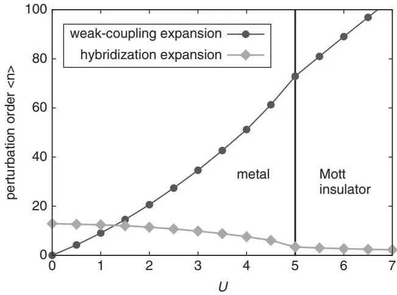
图 8.13 弱耦合算法和强耦合（杂化展开）算法的平均微扰阶数。这些结果对应于带宽为 4 的半圆形态密度单带哈伯德模型的 DMFT 解，温度 $T = 1 / 30$。因此，每个数据点对应的热浴（bath）是不同的。（图改编自 Gull 等人 (2007)。）

表 8.2 不同杂质求解器（impurity solver）随逆温度 $\beta$ 和系统大小 $L$ 的标度行为。对于片段算法，我们假设行列式比的计算主导了重叠计算。对于矩阵或 Krylov 算法，我们假设迹的计算主导了行列式比的计算。

| 求解器 | 标度 | 用途 |  |
|---|---|---|---|
| 弱耦合 | $\beta^{3}$ | $L^{3}$ | 具有密度-密度相互作用的杂质团簇 |
| 杂化展开（片段形式） | $\beta^{3}$ | L | 具有密度-密度相互作用的单位点多轨道模型 |
| 杂化展开（矩阵/Krylov 形式） | $\beta$ | exp(L) | 具有一般 $U_{i j k l}$ 相互作用的单位点多轨道模型 |

对于杂质团簇，或具有复杂相互作用项（需要用到第 8.5.3 和 8.5.4 节讨论的矩阵或 Krylov 形式）的模型，强耦合方法的计算复杂度随系统大小呈指数增长，因此我们只能将其应用于相对较小的系统。这种情况下，如果适用，弱耦合方法可能是一个更好的选择。表 8.2 总结了不同的标度行为（假设杂化矩阵是对角的），并指出了哪种求解器适用于哪类问题。弱耦合求解器主要用于哈伯德模型的团簇 DMFT 或 DCA 计算，其多项式标度特性使我们能够处理多达 100 个格点的团簇（Fuchs 等人, 2011），至少在参数区域不存在严重符号问题时如此。另一方面，强耦合方法特别适用于研究具有复杂局域相互作用的（单位点）多轨道问题。这类问题通常需要在强关联材料的单位点 DMFT 研究或过渡金属杂质的实际模拟中求解（Surer 等人, 2012）。

## 延伸阅读

A. Georges, G. Kotliar, W. Krauth, and M. J. Rozenberg, “Dynamical mean-field theory of strongly correlated Fermion systems and the limit of infinite dimensions,” Rev. Mod. Phys. 68, 13 (1996).

A. Georges, “Strongly Correlated Electron Materials: Dynamical Mean-Field Theory and Electronic Structure,” in *Lectures on the Physics of Highly Correlated Electron Systems VIII*, ed. A. Avella and F. Mancini, AIP Conference Proceedings, 715, (2004).

T. Maier, M. Jarrell, T. Pruschke, and M. H. Hettler, “Quantum cluster theories,” Rev. Mod. Phys. 77, 1027 (2005).

G. Kotliar, S. Y. Savrasov, K. Haule, V. S. Oudovenko, O. Parcollet, and C. A. Marianetti, “Electronic structure calculations with dynamical mean-field theory,” Rev. Mod. Phys. 78, 865 (2006).

E. Gull, A. J. Millis, A. L. Lichtenstein, A. N. Rubtsov, M. Troyer, and P. Werner, “Continuous-time Monte Carlo methods for quantum impurity models,” Rev. Mod. Phys. 83, 349 (2011).

## 习题

8.1 考虑半无限无自旋费米子链，其哈密顿量在位点表象中为

$$
H = \sum_{j = 0}^{\infty} \left[ \varepsilon_{j} c_{j}^{\dag} c_{j}^{\vphantom{\dag}} - t_{j}^{*} c_{j}^{\dag} c_{j + 1}^{\vphantom{\dag}} - t_{j} c_{j + 1}^{\dag} c_{j}^{\vphantom{\dag}} \right]\tag{8.71}
$$

对于 $j \geq 1$，我们定义规范变换后的算符 $\tilde{c}_{j}$ 为 $\begin{array} {r} {c_{j} = \exp [ i \sum_{k < j} \varphi_{j} ] \tilde{c}_{j}} \end{array}$ ，其中 $\varphi_{j}$ 是 $t_{j}$ 的相位（ $t_{j} = | t_{j} | e^{i \varphi_{j}} $ ）。证明：用变换后的算符表示时，哈密顿量变为（ $c_{0} \equiv \tilde{c}_{0} $ ）

$$
H = \sum_{j = 0}^{\infty} \Big [ \varepsilon_{j} \tilde{c}_{j}^{\dagger} \tilde{c}_{j} - | t_{j} | \tilde{c}_{j}^{\dagger} \tilde{c}_{j + 1} - | t_{j} | \tilde{c}_{j + 1}^{\dagger} \tilde{c}_{j} \Big ] ,\tag{8.72}
$$

这意味着所有跳跃项都是非负的。

8.2 利用行列式比值的快速更新公式（8.39），推导弱耦合算法中格林函数的测量公式（8.46）。

8.3 证明 $\beta$ 反周期常数函数

$$
\Delta ( \tau ) = \left\{\begin{array} {l l} {- \frac{1} {2} | V | ^{2}} & {0 < \tau < \beta} \\ {\phantom{-} \frac{1} {2} | V | ^{2}} & {- \beta < \tau < 0} \end{array} \right.\tag{8.73}
$$

的Matsubara变换为 $\Delta ( i \omega_{n} ) = | V | ^{2} / i \omega_{n}$ 。用归纳法证明（8.67）。

8.4 证明函数

$$
\Delta ( \tau ) = \sum_{p} \frac{| V_{p} | ^{2}} {e^{\varepsilon_{p} \beta} + 1} \left\{\begin{array} {l l} {- e^{- \varepsilon_{p} ( \tau - \beta )}} & {0 < \tau < \beta} \\ {e^{- \varepsilon_{p} \tau}} & {- \beta < \tau < 0} \end{array} \right.\tag{8.74}
$$

是 $\beta$ 反周期的，并计算其Matsubara变换；即推导公式 $\begin{array} {r} {\Delta ( i \omega_{n} ) = \sum_{p} | V_{p} | ^{2} / ( i \omega_{n} - \varepsilon_{p} )} \end{array}$ 。

8.5 考虑费米子反对易符号，验证在微扰阶数 1、2、3 时，所有对应于固定相互作用顶点位置的弱耦合图的权重可以相加成一个行列式。

8.6 验证图 8.11 右面板中所示的六个强耦合图的权重之和等于一个行列式。对于形如（8.73）的时间无关杂化函数，证明前五个图的权重是正的，而最后一个图的权重是负的。将此观察结果与交叉杂化线的数量联系起来。

8.7 对于 Anderson 杂质模型和 Kondo 杂质模型的局域哈密顿量 $H_{\mathrm{loc}}$，写出其本征态并根据守恒量子数将其分组。

8.8 在 DCA 中，团簇杂化函数 $\Delta_{K}$ 与浴格林函数 $\mathcal{G}_{0 , K}$ 的关系为

$$
i \omega_{n} + \mu - \bar{\epsilon}_{K} - \Delta_{K} ( i \omega_{n} ) = \mathcal{G}_{0 , K}^{- 1} ( i \omega_{n} ) ,\tag{8.75}
$$

其中 $\bar{\epsilon}_{K}$ 是色散 $\epsilon_{k}$ 在动量区域 K 上的平均值。通过计算 $\mathcal{G}_{0 , K}^{- 1} ( i \omega_{n} ) ~ =$ $( G_{\mathrm{imp}}^{K} )^{- 1} ( i \omega_{n} ) + \Sigma^{K} ( i \omega_{n} )$ 的高频展开，利用（8.25），并施加条件 $\begin{array} {r} {\Delta_{K} ( i \omega_{n} ) \propto \frac{1} {i \omega_{n}} +} \end{array}$ $\begin{array} {r} {O ( \frac{1} {( i \omega_{n} )^{2}} )} \end{array}$ 来证明该关系。后一个条件确保杂化函数没有瞬时的跳跃型贡献。

零温
