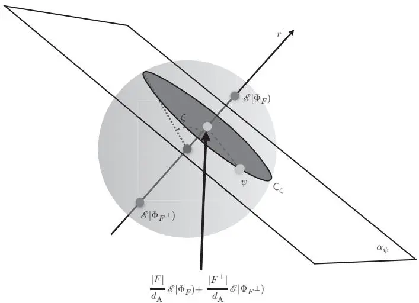

# 结论性隐形传态

在量子理论中，态由复希尔伯特空间上的厄米算子表示。这一事实导致了优美的数学结构，但也引发了一些令人困惑的问题：为什么是厄米算子？为什么是复希尔伯特空间？在本章中，我们将探讨这些问题，建立起态在希尔伯特空间中的表示与结论性隐形传态任务之间令人惊讶的联系。在结论性隐形传态中，发送方试图在不传递任何经典信息的情况下，将未知态传递给接收方。我们将看到，除非满足因果性和局域可区分性，否则结论性隐形传态无法确定性地实现。从定量角度看，我们将为给定系统 A 的结论性隐形传态的最大成功概率建立两个可达界限。第一个界限用 $d_{\mathrm{A}}$ 表示，即完美可区分态的最大数量。第二个界限用 $D_{\mathrm{{A}}}$ 表示，即系统态所张成的向量空间的维数。结合这两个界限，我们将证明基本等式

$$
D_{\mathrm{{A}}} = d_{\mathrm{{A}}}^{2} ,
$$

该等式对每个系统 A 普遍成立。由于这一等式，系统 A 的每个态都可以表示为 $d_{\mathrm{A}} \times d_{\mathrm{A}}$ 实矩阵，或者等价地表示为复 $d_{\mathrm{A}}$ 维希尔伯特空间上的厄米算子。能够将态表示为厄米算子是通向完整推导量子理论的重要里程碑，这将在本书的最后一章中实现。

## 13.1 任务

在[第7章](ch07.md)中，我们看到了我们的原则蕴含了某种隐形传态方案的存在性，该方案能够仅利用预先存在的关联和有限量的经典通信，将任意态从发送方传递给接收方。这里我们关注隐形传态的一个变体，其中发送方和接收方完全不进行通信：发送方端的输入态仅以概率方式传递给接收方，前提是发送方执行的适当测量给出了正确的结果。

与通常的隐形传态场景一样，目标是将系统 A 的通用态从发送方传递给接收方。作为资源，发送方拥有一个与接收方实验室中另一个系统 A 副本相关联的系统 B。她传递态的策略是在输入系统 A 与系统 B 上执行一个二元测量，得到"成功"或"失败"两个结果之一。该方案的设计使得在"成功"结果出现时，态被传递给接收方。"失败"结果则表示传输失败。

用图示表示，成功态传递的条件是

$$
\overbrace \underbrace{\vphantom{\biggl (} \Psi | \sum_{\mathrm{~ \tiny ~ B ~}}^{\mathrm{~ B ~}} | _{\mathrm{~ \tiny ~ B ~}}}_{\mathrm{~ \tiny ~ ( ~ \rho ~ ) ~ \in ~ \mathcal{~ O} ~} \mathrm{~ \tiny ~ ( ~ \frac ~ {~ \rho ~} {~ \varepsilon ~} ~ ) ~}} = p_{\mathrm{yes}} \overbrace{\langle \mathrm{~ \rho ~ ] ~ \cdot ~ \mathrm{~ A ~} ~}}^{\mathrm{~ A ~}} \qquad \forall \rho \in \mathrm{{\bf S t} ( A )} ,
$$

其中
 是用于隐形传态的资源态，$\rho$ 是要传输的态，$B_{\mathrm{yes}}$ 是对应于成功结果的效应，$p_{\mathrm{yes}}$ 是成功结果出现的概率。

原则上，概率 $p_{\mathrm{yes}}$ 可能依赖于输入态。然而，容易看出它并不依赖：实际上，对于每一对输入态 $\rho_{1}$ 和 $\rho_{2}$，条件 (13.1) 意味着要求

$$
\begin{array}{r l} & {\Biggl ( \frac{\Psi} {\Psi} \Biggr | _{\mathrm{\tiny ~ \frac{B} {~ B}}}^{\mathrm{\tiny ~ A}}} \\ & {\Biggl ( \overbrace{\rho_{i}}^{\mathrm{\tiny ~ A}} \Biggr )^{\mathrm{\tiny ~ A}} \Biggl \lbrack B_{\mathrm{yes}} \Biggr ) = p_{\mathrm{yes}}^{( i )} \overbrace{\rho_{i}}^{\mathrm{\tiny ~ A}} \Biggl . \qquad \forall i \in \{1 , 2 , 3 \} , \end{array}
$$

其中 $\rho_{3} := ( \rho_{1} + \rho_{2} ) / 2$ 。结合这三个关系式，可以得到

$$
p_{\mathrm{yes}}^{( 3 )} \underbrace{\overbrace{\rho_{3}} \mathrm{~ \textmu ~}}_{\textcircled{\rho_{1}} \mathrm{~ \textcircled{~ \textbf{A}}}} = \frac{1} {2} \underbrace{\overbrace{\Psi \left[ \frac{{\textbf{B}}} {\mathrm{\rho \rho \rho}} \right]}^{\mathrm{A}}}_{\textcircled{\rho_{1}} \mathrm{~ \textcircled{~ \textbf{A}}}} + \frac{1} {2} \underbrace{\overbrace{\Psi \left[ \frac{{\textbf{B}}} {\mathrm{\rho \rho \rho}} \right]}^{\mathrm{A}} \left[ \underbrace{{B_{\mathrm{yes}}}}_{\mathrm{\rho \rho \rho \rho \rho \rho \rho \rho \rho \rho \rho \rho \rho \rho \rho \rho \rho \rho \rho \rho \rho \rho \rho \rho \rho \rho \rho \rho \rho \rho}}}_{\\right]textcircled {\rho 2} \mathrm{~ \textcircled{\rho 2} \rho \rho \rho \rho \rho \rho \rho \rho \rho \rho \rho \rho \rho \rho \rho \rho \rho \rho \rho \rho \rho \rho}}
$$

$$
= \frac{p_{\mathrm{yes}}^{( 1 )}} {2} \ ( \overbrace{\rho_{1}}^{\mathrm{A}} )^{\mathrm{~ A ~}} + \frac{p_{\mathrm{yes}}^{( 2 )}} {2} \ ( \overbrace{\rho_{2}}^{\rho_{2}} )^{\mathrm{~ A ~}} ,
$$

进而这又意味着

$$
\left( \frac{p_{\mathrm{yes}}^{( 3 )} - p_{\mathrm{yes}}^{( 2 )}} {2} \right) \underbrace{\left( \rho_{2} \right)^{\mathrm{~ A ~}}}_{\left( \rho_{2} \right)^{\mathrm{~ A ~}}} = \left( \frac{p_{\mathrm{yes}}^{( 1 )} - p_{\mathrm{yes}}^{( 3 )}} {2} \right) \underbrace{\left( \rho_{1} \right)^{\mathrm{~ A ~}}}_{\left( \rho_{1} \right)^{\mathrm{~ A ~}}} .
$$

只要 $\rho_{1}$ 和 $\rho_{2}$ 不同，上述方程就强制等式 $p_{\mathrm{yes}}^{( 1 )} = p_{\mathrm{yes}}^{( 2 )} = p_{\mathrm{yes}}^{( 3 )}$ 成立。这证明了式 (13.1) 中的概率 $p_{\mathrm{yes}}$ 与输入态 $\rho$ 无关。我们将 $p_{\mathrm{yes}}$ 称为确定性隐形传态的概率。

由于 $p_{\mathrm{yes}}$ 与 $\rho_{;}$ 无关，局部可区分性允许我们将式 (13.1) 简化为

$$
\left( \Psi \underset{\mathrm{\tiny ~ A}} {\overset{\mathrm{\tiny ~ A}} {\overbrace ~}} \right) = p_{\mathrm{yes}} \underset{-} {\overset{\mathrm{\tiny ~ A}} {\overbrace ~}} \underset{-} {\overset{\mathrm{\tiny ~ A}} {\overbrace ~}} .
$$

除了更优雅之外，这种形式在后续章节中也将变得有用。

## 13.2 因果性界限

在考虑确定性隐形传态时，一个自然的问题是：成功的概率有多大？直觉上，因果性意味着该概率不能为 1，否则发送方无需发送任何物理系统就能向接收方传递信号。让我们将这个直觉精确化：用 $B_{\mathrm{no}}$ 表示对应于不成功结果的效应，因果性所隐含的归一化条件 $B_{\mathrm{yes}} + B_{\mathrm{no}} = e_{\mathrm{B}} \otimes e_{\mathrm{A}}$ 意味着以下关系

$$
\begin{array}{r l r} {\underbrace{\overbrace{{{\bf \Psi}} {\Psi} \left| {\bf \Pi} {{\bf \Sigma}}_{{\bf B}}^{{\bf A}} \right|}}_{\mathrm{\bf \Pi}_{{\bf A}}} + \underbrace{\overbrace{{{\bf \Psi}} {\Psi} \left| {\bf \Pi} {{\bf \Sigma}}_{{\bf B}}^{{\bf A}} \right|}}_{\mathrm{\bf \Pi}_{{\bf A}}}} & {=} & {\overbrace{{\bf \Pi} \left| {\bf \Pi} {\bf \Pi}_{{\bf A}} \right|}^{\mathrm{\bf \Pi} \mathrm{\bf \Sigma} \mathrm{\bf A}} ,} \end{array}
$$

其中 $\rho_{0}$ 是 $\Psi$ 在系统 A 上的边缘态。现在，如果“是”的结果以概率 $p_{\mathrm{yes}} = 1$ 发生，那么对应于“否”结果的项应消失，并且我们有

$$
\begin{array}{r l r} {\left( \Psi \right)_{\mathrm{\tiny ~ B}}^{\mathrm{\tiny ~ A}}} & {=} & {\frac{\left( \rho_{0} \right)_{\mathrm{\tiny ~ A}}} {\mathrm{\tiny ~ A}} \frac{\mathrm{\tiny ~ A}} {\left[ e \right)} \cdot} \\ {\mathrm{\tiny ~ A}} \end{array}
$$

结合隐形传态条件 (13.2)，上述方程将意味着如下关系

$$
\begin{array}{r l r} {\frac{\mathrm{~ ~ {~ \cal ~ A ~} ~}} {\mathrm{~ ~ {~ \cal ~ Z ~} ~}} \frac{\mathrm{~ ~ {~ \cal ~ A ~} ~}} {\mathrm{~ ~ {~ \cal ~ A ~} ~}}} & {{} =} & {\frac{\mathrm{~ ~ {~ \cal ~ A ~} ~}} {\mathrm{~ ~ {~ \cal ~ C ~} ~}} \overbrace{\rho_{0}}^{\mathrm{~ ~ {~ \cal ~ A ~} ~}} ,} \end{array}
$$

这意味着系统 A 上的恒等映射是一个擦除信道，也就是说，它产生一个与输入无关的固定态。因此，系统 A 必须是平凡的：其所有状态都必须是单个状态的倍数。总之：对于每个可能用于发送信号的系统，确定性隐形传态的概率必须小于 1。

现在我们进行定量论证，利用因果性，根据可完美区分态的数量推导出确定性隐形传态概率的上界。该上界如下：

**定理 13.1 (因果性界限)** 在对系统 A 的任意确定性隐形传态协议中，成功概率满足以下界限：

$$
p_{\mathrm{yes}} \leq{\frac{1} {d_{\mathrm{A}}^{2}}} ,
$$

其中 $d_{\mathrm{A}}$ 是系统 A 中可完美区分态的最大数量。

**证明** 设 $\tau$ 为系统 A 的搅动信道，可分解为 $\begin{array}{r} {\mathcal{T} = \sum_{x \in \mathsf{X}} p_{x} \mathcal{U}_{x}} \end$，其中 $\{p_{x} \}_{x \in \mathsf{X}}$ 为合适的概率，$\{\mathcal{U}_{x} \}_{x \in \mathsf{X}}$ 为合适的可逆变换——参见式 (7.6) 对此分解的证明。显然，确定性隐形传态的条件 (13.2) 意味着对于每个 $x \in \mathsf{X}$，有：

$$
\begin{array}{r l r} {\underbrace{\Bigg ( \Psi \left[ \frac{\mathrm{\bf ~ A}} {\mathrm{\bf ~ B}} \right] \frac{\mathrm{\bf ~ A}} {x} \Bigg ) - \mathrm{\bf ~ A}}_{\mathrm{\bf ~ B}}} & {=} & {\overbrace{\frac{\mathrm{\bf ~ B}} {\mathrm{\bf ~ B}} \Bigg [ \frac{B_{\mathrm{yes}}} {y \mathrm{es}} \Bigg )}^{\mathrm{\bf ~ A}}} \\ {\underbrace{\mathrm{\bf ~ A} \sqrt{\mathcal{U}_{x}^{- 1}} \Bigg ] \cdot \mathrm{\bf ~ A}}_{\mathrm{\bf ~ A}}} & {=} & {\overbrace{\frac{\mathrm{\bf ~ A}} {\mathrm{\bf ~ B}} \Bigg [ \frac{B_{\mathrm{yes}}} {y \mathrm{es}} \Bigg )}^{\mathrm{\bf ~ A}}} \end{array}
$$

在式 (13.3) 两边应用变换 $\mathcal{U}_{x}$ 和 $\boldsymbol{{\mathcal U}}_{\boldsymbol{x}}^{- 1}$，乘以 $p_{x}$，并对 x 求和，我们得到：

$$
\underbrace{\overbrace{{\Psi \left[ \begin{array}{l} {{\bf{B}}} \\ {{\bf{A}}} \end{array} \right]}_{\mathrm{\tiny ~ {\left( ~ {\frac{A} {~}} \right)}}}}^{\mathrm{\texttt{A}}}}_{\mathrm{\texttt{A}}} + \ \sum_{{\boldsymbol{x}} \in{\mathsf{X}}} p_{x} \left( \underbrace{{\overbrace{{{\Psi} \left[ \begin{array}{l} {{\bf{B}}} \\ {{\bf{B}}} \end{array} \right]}_{\mathrm{\tiny ~ {\left( ~ {\frac{A} {~}} \right)} ~ \mathbf{A}}}}^{\mathrm{\texttt{A}}}}}_{\mathrm{\texttt{A}} \left[ \begin{array}{l} {{\boldsymbol{B}}_{\mathrm{{n o}}}} \\ {{\boldsymbol{\Delta}}} \end{array} \right]} \right)
$$

$$
\begin{array}{l} = \sum_{x \in \mathsf{X}} p_{x} \begin{array}{c c} {\frac{( \rho_{0} ) \mathsf{A}} {\rho_{0}} \frac{\mathsf{A}} {\mathsf{A}} \boxed{\mathscr{U}_{x}} \frac{\mathsf{A}} {\mathsf{A}}} \\ {\frac{\mathsf{A}} {\rho_{x}} \boxed{\mathscr{U}_{x}^{- 1}} \frac{\mathsf{A}} {\mathsf{A}} \boxed{e}} \end{array} \end{array}
$$

$$
= \frac{( \rho_{0} {\bf \sigma} )^{\mathrm{~ \tiny ~ A ~}} [ T ]^{\mathrm{~ \tiny ~ A ~}}} {\mathrm{\sigma}}
$$

$$
= {\frac{( \lambda \operatorname{\partial} \lambda )^{\mathrm{~ A ~}}} {\operatorname{\partial} \lambda}} .
$$

这里第三个等式来自于关系式 $( e_{\mathrm{A}} | \mathcal{U}_{x}^{- 1} = ( e_{\mathrm{A}} | \quad \forall x \in \mathsf{X}$ 以及分解 $\begin{array}{r} {\mathcal{T} = \sum_{x \in \mathsf{X}} p_{x} \mathcal{U}_{x}} \end$。第四个等式则基于搅动信道将每个态变换为不变态 $\chi_{\mathrm{A}}$ 这一事实。上述等式链与确定性隐形传态条件 (13.2) 相结合，得到以下关系：

$$
\begin{array}{r l r} {p_{\mathrm{yes}} \xrightarrow [ ] {\mathrm{~ A ~}} \boxed{\mathcal{T}}^{\mathrm{~ \tiny ~ A ~}} + \frac{\mathrm{~ \tiny ~ A ~}} {~ \left[ \mathcal{A}_{\mathrm{no}} \right]^{\mathrm{~ \tiny ~ A ~}}}} & {=} & \frac{\mathrm{~ \tiny ~ A ~}} {~ \left[ \begin{array}{l l} {e} \end{array} \right]} \begin{array}{r l} {\langle \chi \rangle^{\mathrm{~ \tiny ~ A ~}} ,} \end{array} \end{array}
$$

其中 $\mathcal{A}_{\mathrm{no}}$ 是由 $\begin{array}{r} {\mathcal{A}_{\mathrm{no}} : = \sum_{x \in \mathsf{X}} p_{x} ( \mathcal{U}_{x} \otimes B_{\mathrm{no}} ) ( \Psi \otimes \mathcal{U}_{x}^{- 1} )} \end$ 定义的变换。现在，令 $\Phi \in \mathsf{PurSt} ( \mathrm{A} \overline{{\mathsf{A}}} )$ 为不变态 $\chi_{\mathrm{A}}$ 的最小纯化。对方程(13.5)的两边在系统A上作用，我们得到

$$
\begin{array}{r l r} {p_{\mathrm{yes}}} & {{} \underbrace{\overbrace{\Phi}^{\mathrm{A}}}_{\mathrm{A}} +} & {{\Phi}^{\mathrm{A}} \overbrace{\frac{\mathrm{A}} {\mathrm{A}}}^{\mathrm{A}} = \begin{array}{l} {\underbrace{( \mathcal{X} )^{\perp}}_{\mathrm{( \mathcal{X} )^{\perp}}}} \\ {\underbrace{\vphantom{( \mathcal{X} )^{\perp}} \overline{{\mathrm{A}}}}} \end{array} , \overbrace{\mathcal{X}}^{\mathrm{A}} = \begin{array}{l} {\underbrace{( \mathcal{X} )^{\perp}}_{\mathrm{( \mathcal{X} )^{\perp}}} ,} \end{array} \end{array}
$$

右边推导基于$\Phi$在系统$\overline{{\mathrm A}}$上的边际态是不变态$\mathbb{\chi}_{\overline{{\mathrm{A}}}}$这一事实（参见引理11.17）。最后，在两边应用效应$\Phi^{\dagger}$得到不等式

$$
\begin{array}{r l r} {p_{\mathrm{yes}}} & {{} \le} & {\stackrel{\displaystyle ( \mathcal{X} \| ^{\mathrm{~ A ~}}} {\displaystyle ( \mathcal{X} \| ^{\mathrm{~ A ~}}} \boxed{\Phi^{\dagger}} .} \end{array}
$$

为了得到所需界限，只需将不变态 $\chi_{\mathrm{A}} \otimes \chi_{\overline{{\mathrm{A}}}}$ 分解为 $\begin{array}{r} {\chi_{\mathrm{A}} \otimes \chi_{\mathrm{\overline{{A}}}} = \sum_{i = 1}^{d_{\mathrm{A}}^{2}} \Phi_{i} / d_{\mathrm{A}}^{2}} \end$，其中 $\{\Phi_{i} \}_{i = 1}^{d_{\mathrm{A}}^{2}}$ 是一个包含状态11的最大可完美区分纯态集。

“因果界限”这一名称强调了该界限的起源是方程(13.3)，它直接来自因果性。然而，该界限并不仅仅由因果性得出。事实上，方程(13.4)的右边依赖于我们理论中许多特定的操作特征。这在我们的证明中清晰可见，因为我们使用了：

1. 旋绕通道的存在性以及不变态 $\chi$ 的存在性；
2. 不变态具有最小纯化 $\Phi$ 的事实；
3. 11在纯化系统上的边际态是不变的事实；
4. 态 $\chi_{\mathrm{A}} \otimes \chi_{\overline{{{\mathrm{A}}}}}$ 可以分解为 $d_{\mathrm{A}}^{2}$ 个可完美区分态的混合，其中之一是11；
5. 态 $\chi_{\mathrm{AB}}$ 具有 $\chi_{\mathrm{A}} \otimes \chi_{\mathrm{B}}$ 的形式

若某一理论不满足这些性质之一，其因果界限的右边可能具有不同的值。例如，经典理论就是这种情况，其中因果界限为 $p_{\mathrm{yes}} \leq 1 / d_{\mathrm{A}}$。

**练习13.1** 证明维度为 $d_{\mathrm{A}}$ 的经典系统的确凿量子传态概率上界为 $1 / d_{\mathrm{A}}$，并给出一个达到该界限的协议。

## 13.3 达到因果界限

现在，我们利用导引来展示因果界限是可达到的：

**定理13.2** 对于每个系统A，存在一个成功概率为

$$
p_{\mathrm{yes}} = \frac{1} {d_{\mathrm{A}}^{2}} .
$$

的确凿量子传态协议。

**证明** 令 $\Phi \in \mathsf{PurSt} ( \mathrm{A} \overline{{\mathrm{A}}} )$ 为不变态 $\chi_{\mathrm{A}}$ 的最小纯化。那么，由于11在系统 $\overline{{\mathrm A}}$ 上的边际态是不变态（命题12.2），我们有以下恒等式

$$
\begin{array}{r l} {\underbrace{\left( \Phi \right) \frac{\mathbf{A}} {\mathbf{A}}_{\left[ \begin{array}{l} {e} \end{array} \right]}}_{\left( \Phi \right) \frac{\mathbf{A}} {\mathbf{A}}_{\left[ \begin{array}{l} {e} \end{array} \right]}} =} & {\frac{( \mathcal{X} )^{\frac{\mathbf{A}} {\mathbf{A}}}} {( \mathcal{X} )^{\frac{\mathbf{A}} {\mathbf{A}}}} = \quad \overbrace{( \mathcal{X} )^{\mathbf{A} \overline{{\mathbf{A}}}}}^{\left( \mathcal{X} \right)^{\mathbf{A}}} ,} \end{array}
$$

其中最后一个等式在练习7.2中得到证明。于是，状态$| \Phi )_{\mathrm{A \overline{{{A}}}}} | \Phi )_{\mathrm{A \overline{{{A}}}}}$是不变状态$\chi_{\mathrm{A \overline{{A}}}}$的一个最小纯化。另一方面，根据定理12.8，$\chi_{\mathrm{A \overline{{A}}}}$在凸分解中纯状态的最大概率为$p_{\operatorname*{max}}^{\mathrm{A \overline{{A}}}} = 1 / d_{\mathrm{A \overline{{A}}}}$，并且根据推论12.10和12.11，有$p_{\operatorname*{max}}^{\mathrm{A \overline{{A}}}} = 1 / ( d_{\mathrm{A}} d_{\overline{{\mathrm{A}}}} ) = 1 / d_{\mathrm{A}}^{2}$。通过操控，必然存在一个效应$\Phi^{\sharp}$，它以概率$p_{\mathrm{max}}^{\mathrm{A \overline{{A}}}} = 1 / d_{\mathrm{A}}^{2}$诱导出纯状态$\Phi$：确切地说，有

$$
\begin{array}{l} \begin{array}{r l} {{( \Phi ) \frac{\mathbf{A}} {\mathbf{A}}}} \\ & {( \Phi ) \frac{\mathbf{A}} {\mathbf{A}} \frac{\Phi^{\sharp}} {} ) = \frac{1} {d_{\mathrm{A}}^{2}}} \end{array} \sqrt{\Phi [ \frac{\mathbf{A}} {\mathbf{A}} ]} \end{array}
$$

参见方程(11.10)对$\Phi^{\sharp}$的定义。现在，由于$\Phi$是忠实的，上述方程意味着

$$
\Biggl ( \frac{\Phi \left| \frac{\bf A} {\tt A} \right|} {\tt A}_{\Phi^{\sharp}} \Biggr ) = \frac{1} {d_{\mathrm{A}}^{2}} \frac{\mathrm{~ \cal ~ A ~} \left[ \cal Z \right]^{\mathrm{~ \scriptstyle ~ A ~}}} {\mathrm{~ \scriptstyle ~ \Gamma ~}} .
$$

因此，确定性隐形传态以概率$p_{\mathrm{yes}} = 1 / d_{\mathrm{A}}^{2}$实现。

总结来说，对于系统$\mathbf{A}$，确定性隐形传态的最大概率（记作$p_{\mathrm{tele}}^{( \mathrm{A} )}$）由下式给出：

$$
p_{\mathrm{tele}}^{( \mathrm{A} )} = \frac{1} {d_{\mathrm{A}}^{2}} .
$$

这是一个深刻而卓越的等式。它以非平凡的方式将两个不同的操作任务——隐形传态信息和区分状态——联系起来。此外，它在我们推导量子理论的过程中起着关键作用。在接下来的几节中，我们将证明确定性隐形传态最大概率的另一个表达式：该替代表达式用$D_{\mathrm{{A}}}$表示，即系统A的状态所张成的向量空间的维数。

## 13.4 局域可区分性界限

现在，我们给出确定性隐形传态概率的一个新的上界。值得注意的是，该界限仅依赖于局域可区分性：

定理13.3 (局域可区分性界限) 在系统A的每一个确定性隐形传态协议中，成功的概率满足界限

$$
p_{\mathrm{yes}} \leq \frac{1} {D_{\mathrm{A}}} .
$$

证明 由于局域可区分性，每个二分状态$\Psi \in{\sf S t} ( \mathrm{AB} )$都可以写成

$$
\begin{array}{r c l} {\displaystyle \langle \Psi \displaystyle \frac{\mathrm{~ {\cal ~ A} ~}} {\mathrm{~ {\cal ~ B} ~}}} & {=} & {\displaystyle \sum_{i = 1}^{D_{\mathrm{A}}} \sum_{j = 1}^{D_{\mathrm{B}}} \Psi_{i j} \displaystyle \frac{( \alpha_{i} \mathrm{~ \scriptstyle ~ \Upsilon ~}_{\mathrm{{A}}}^{\mathrm{A}} )} {( \beta_{j} \mathrm{~ \scriptstyle ~ \Gamma ~}_{\mathrm{{B}}}^{\mathrm{B}}} ,} \end{array}
$$

其中$\{\alpha_{i} \}$和$\{\beta_{j} \}$分别是向量空间$\mathsf{St}_{\mathbb{R}} ( \mathbf{A} )$和$\mathsf{St}_{\mathbb{R}} ( \mathsf{B} )$的基。类似地，每个二分效应$F \in \mathsf{Eff} ( \mathrm{BA} )$可以写成

$$
\begin{array}{r c l} {\frac{{\textbf{B}}} {{\textbf{A}}} \displaystyle \boxed{F}} & {=} & {\displaystyle \sum_{k = 1}^{D_{\mathrm{A}}} \sum_{l = 1}^{D_{\mathrm{B}}} F_{k l} \frac{{\textbf{B}} \displaystyle \big [ \beta_{k}^{*} \big )} {{\textbf{A}} \displaystyle \big [ \alpha_{l}^{*} \big )} ,} \end{array}
$$

其中$\{\beta_{k}^{*} \}$和$\{\alpha_{l}^{*} \}$分别是$\{\beta_{j} \}$和$\{\alpha_{i} \}$的对偶基——也就是说，它们满足关系$( \alpha_{k}^{*} | \alpha_{i} ) = \delta_{i k}$和$( \beta_{l}^{\ast} | \beta_{j} ) = \delta_{j l}$，对于任意$i , j , k , l$都成立。因此，我们有关系式

$$
\frac{\sqrt{\Psi \left[ \frac{\mathrm{\bf ~ A}} {\mathrm{\bf ~ B}} \right]}} {\mathrm{\bf ~ A}} \sqrt{\mathrm{~ \Lambda ~}} = \sum_{i , l} \mathrm{~ \lbrack \Psi \Psi \cal{F} \rbrack}_{i l} \frac{( \alpha_{i} ) \mathrm{~ \Lambda ~}_{\mathrm{\bf ~ A}}} {\mathrm{~ \Lambda ~}_{\mathrm{\bf ~ A}}} \sqrt{\frac{\alpha_{l}^{*}} {a_{l}^{*}}} \mathrm{~ \Lambda ~} ,
$$

与

$$
\begin{array}{r l r} {\left. {\Psi} \right. _{\mathrm{~ \tiny ~ B ~}}^{\mathrm{~ \tiny ~ A ~}} \left[ S_{\mathrm{{A , B} ~}} \right]_{\mathrm{~ \tiny ~ A ~}}^{\mathrm{~ \tiny ~ B ~}} \left[ F \right.} & {=} & {\mathrm{Tr} \left[ \Psi F \right] ,} \end{array}
$$

其中 $\mathcal{S}_{\mathrm{A , B}}$ 是交换 A 和 B 的可逆变换。

现在，考虑一个由资源态
 和成功效应 $B_{\mathrm{yes}}$ 组成的协议。利用式 (13.14)，我们可以将成功隐形传态的条件 (13.2) 重写为

$$
\left[ \Psi B_{\mathrm{yes}} \right]_{i l} = p_{\mathrm{yes}} \delta_{i l} \qquad \forall i , l \in \left\{1 , \ldots , D_{\mathrm{A}} \right\} .
$$

对两边取迹，并利用式 (13.15)，我们得到界限

$$
\begin{array}{r l} & {p_{\mathrm{yes}} D_{A} = \mathrm{Tr} \left[ \Psi B_{\mathrm{yes}} \right]} \\ & {~ = ~ \left( \Psi \underbrace{\vphantom{\int_{\Psi}^{\mathrm{a}}} \Phi}_{\mathrm{B}} \overbrace{\left[ \begin{array}{l} {S_{\mathrm{A , B}}} \\ {S_{\mathrm{A , B}}} \end{array} \right] \underbrace{\vphantom{\int_{\mathrm{A , B}}^{\mathrm{B}}} \mathrm{d} \mathrm{d} \mathrm{B}}_{\mathrm{A}}}^{\mathrm{B}} \right)} \\ & {~ \leq 1 ,} \end{array}
$$

因此 $p_{\mathrm{yes}} \leq 1 / D_{\mathrm{A}}$

注意，对于每一个非平凡系统，成功概率都严格小于 1：只有 $D_{\mathrm{{A}}} = 1$ 的系统才能有成功概率 $p_{\mathrm{yes}} = 1$。值得强调的是，界限 $p_{\mathrm{yes}} \leq 1 / D_{\mathrm{A}}$ 除了局部可区分性之外，不需要任何其他假设。例如，因果性在这里不起任何作用：即使在非因果世界中，发送者也无法在不向接收者发送任何消息的情况下，通过决定性隐形传态来传输系统的状态！

## 13.5 达到局部可区分性界限

我们现在证明界限 $p_{\mathrm{yes}} \leq 1 / D_{\mathrm{A}}$ 可以达到。这一结果所需的条件远不止局部可区分性——最突出的是，它要求纯态可以通过原子效应来识别。

可达到性证明的关键是考虑识别纠缠态 $\Phi$ 的原子效应 $\Phi^{\dagger}$，即 $( \Phi | \Phi^{\dagger} ) = 1$。证明中使用的第一个要素是观察到效应 $\Phi^{\dagger}$ 可以用效应 $\Phi^{\sharp}$ 表示，后者之前用于构建决定性隐形传态协议。本质上，两个效应 $\Phi^{\dagger}$ 和 $\Phi^{\sharp}$ 是一致的，仅相差系统 A 和 A 的一个交换以及 A 上的一个局部变换：

引理 13.4 对于每一系统 A，有

$$
\begin{array}{r l r} {\frac{\mathrm{A}} {\mathrm{A}} \sqrt{\Phi^{\dagger}}} & {=} & {\frac{\mathrm{~ ~ \frac ~ {\cal ~ A} ~} \left[ \mathcal{U} \right] - \mathrm{A}} {\mathrm{~ ~ \frac ~ {\pi ~} {\cal ~ A} ~}} \sqrt{S_{\mathrm{A , \overline{{A}}}}} \left[ \frac{\mathrm{~ ~ \overline{{A}} ~}} {\mathrm{~ ~ \frac ~ {\pi ~} {\cal ~ A} ~}} \right] \Phi^{\dagger} \ ,} \end{array}
$$

其中  是一个可逆变换，且 $\mathcal{S}_{\mathrm{A , \overline{{A}}}}$ 是交换 A 与 $\mathrm{A}^{\prime}$ 的可逆变换。

证明相当复杂，我们将其推迟到本章最后一节。证明局部可区分性界限可达到的第二步是一个简单的群论结果：

引理 13.5 对于每一系统 A，存在一个 $\mathsf{St}_{\mathbb{R}} ( \mathbf{A} )$ 的基，记为 $\{\alpha_{i} \}$，使得对于每个可逆变换 ，矩阵 $( O_{\mathcal{U}} )_{i j} : = ( \alpha_{i}^{*} | \mathcal{U} | \alpha_{j} )$ 是正交的。

证明是标准的，可以在本章附录中找到。利用引理 13.4 和 13.5，我们现在可以证明所需的结果：

定理 13.6（状态识别界限）对于每一系统 A，存在一个概率为

$$
p_{\mathrm{yes}} = \frac{1} {D_{\mathrm{A}}} .
$$

的决定性隐形传态协议。

定理13.6的证明 令  为引理 13.4 中的可逆变换，$\{\alpha_{i} \}$ 为引理 13.5 中的基。根据定义，我们有

$$
\begin{array}{l} \begin{array}{c c l} {( \alpha_{i} {\bf \tau} )^{\mathrm{~ \tiny ~ A ~}} \boxed{\mathcal{U}}^{\mathrm{~ \tiny ~ A ~}}} & {=} & {\displaystyle \sum_{k} \mathcal{U}_{k i} \quad \langle{\bf \Psi}_{\alpha_{k}}^{\alpha_{k}} \end{array} \biggr \}^{\mathrm{~ \tiny ~ A ~}} .} \end{array}
$$

将态 $\Phi$ 展开为

$$
\begin{array}{r c l} {\displaystyle \overleftrightarrow{\boldsymbol{\Phi}} \frac{\mathbf{A}} {\mathbf{\bar{A}}}} & {=} & {\displaystyle \sum_{i , j = 1}^{D_{\mathrm{A}}} \Phi_{i j} \frac{( \boldsymbol{\alpha}_{i} ) \mathbf{\bar{A}}} {( \boldsymbol{\tilde{\alpha}}_{j} ) \mathbf{\bar{A}}} ,} \end{array}
$$

随后我们得到

$$
\begin{array}{r l r} {\underbrace{\vphantom{\sum_{i}^{i} \sum_{i}^{j} \sum_{k} \mathrm{d}_{i}}}_{\mathrm{A}}} & {=} & \sum_{k , j = 1}^{D_{\mathrm{A}}} [ \mathcal{U} \Phi ]_{k j} \underbrace{\vphantom{\sum_{i}^{j} \sum_{k} \mathrm{d}_{i}} \mathrm{d}_{k}}_{\mathrm{(} \tilde{\alpha}_{j} \mathrm{~ \tiny ~ ~ {\partial ~ A ~} {\partial ~ \mathrm{A}_{\mathrm{A}}} ~} \mathrm{d}_{\mathrm{}} \mathrm{~ \tiny ~ ( ~ \frac ~ {\partial ~ A ~} {\partial ~ \mathrm{A}_{\mathrm{A}}} ~ ) ~} \mathrm{d}_{\mathrm{}}} \end{array} .
$$

现在，我们有一系列关系

$$
\begin{array}{r l} {1 =} & {{} \left( \Phi \right) \frac{A} {\bar{A}} \left[ \Phi^{\dagger} \right]} \\ {=} & {{} \left( \Phi \right) \frac{A} {\bar{A}} \left[ \overline{{\mathcal{A}}} \right]^{- \frac{A} {\bar{A}}} \left[ \overline{{S_{\Lambda , \bar{A}}}} \right] \frac{\overline{{A}}} {\Lambda} \left[ \Phi^{\dagger} \right]} \\ {=} & {{} \mathrm{( f o r ~} \left[ \bar{A} \Phi \Phi^{\dagger} \right]} \\ {=} & {{} \mathrm{)} \rho_{\mathrm{ys}} \mathrm{( I )} \underline{{\mathcal{A}}} \left[ \bar{A} \right]} \\ {\leq} & {{} \mathrm{ps}_{\mathrm{s}} \mathrm{( D )} \underline{{A}} .} \end{array}
$$

这里第二个等式来自公式 (13.15)，其中 $\Psi \equiv ( \mathcal{U} \otimes \mathcal{T}_{\overline{{\mathrm{A}}}} ) \ : \Phi$ 且 $F \equiv \Phi^{\dagger}$。第三个等式源于以下事实：$\Phi$ 和 $\Phi^{\sharp}$ 允许确定性隐形传态，因此满足关系 $[ \Phi^{\sharp} ]_{i j} = p_{\mathrm{yes}} \delta_{i j}$，如公式 (13.16) 所示。最后一个不等式来自 $\mathcal{U}_{i j}$ 是一个 $D_{\mathrm{A}} \times D_{\mathrm{A}}$ 的正交矩阵（引理13.5），因此其迹不能大于 $D_{\mathrm{{A}}}$。总之，我们证明了界限 $p_{\mathrm{yes}} \geq 1 / D_{\mathrm{A}}$。由于 $1 / D_{\mathrm{A}}$ 也是一个上界（由可区分性界限得出），我们得到等式 $p_{\mathrm{yes}} = 1 / D_{\mathrm{A}}$。

上述证明的一个有趣的副产物是，引理13.4中出现的可逆变换必须是恒等变换：

练习13.2 证明效应 $\Phi^{\dagger}$ 和 $\Phi^{\sharp}$ 在交换系统 A 与系统 $\overline{{\mathrm A}}$ 后完全一致。

综上所述，我们得到对于系统 A 的所有确定性隐形传态协议，最大成功概率由下式给出

$$
p_{\mathrm{tele}}^{\mathrm{( A )}} = \frac{1} {D_{\mathrm{A}}}
$$

并且通过使用资源态 $\Phi$ 和成功效应 $\Phi^{\dagger}$（在交换系统 A 和 $\overline{{\mathrm{A}}}$ 后）的协议可以实现该概率。

## 13.6 希尔伯特空间的起源

我们看到了确定性隐形传态最大概率的两种替代表达式：一种基于信息维度 $d_{\mathrm{A}}$ [公式 (13.10)]，另一种基于态空间维度 $D_{\mathrm{{A}}}$ [公式 (13.22)]。将两者结合，我们得到基本等式

$$
D_{\mathrm{{A}}} = d_{\mathrm{{A}}}^{2} .
$$

该等式意味着系统 A 的态可以表示为实 $d_{\mathrm{A}} \times d_{\mathrm{A}}$ 矩阵。实际上，我们可以选取实向量空间 $\mathsf{St}_{\mathbb{R}} ( \mathbf{A} )$ 的任意一个基，并将每个态 $\rho ~ \in ~ \mathsf{St} ( \mathbf{A} )$ 用 $D_{\mathrm{{A}}}$ 个实系数展开。由于 $D_{\mathrm{{A}}} = d_{\mathrm{{A}}}^{2}$，这些展开系数可以排列成一个 $d_{\mathrm{A}} \ \times \ d_{\mathrm{A}}$ 的方阵——我们将其记为 $M_{\rho}$。等价地，矩阵 $M_{\rho}$ 可以替换为一个复数厄米矩阵 $S_{\rho}$，定义如下

$$
S_{\rho} : = f \left( M_{\rho} \right) \qquad f ( M ) : = \frac{M + M^{\mathrm{T}}} {2} + i \frac{M - M^{\mathrm{T}}} {2} ,
$$

$M^{\mathrm{T}}$ 表示转置。注意，两个表示 $M_{\rho}$ 和 $S_{\rho}$ 是完全等价的：事实上，函数 $f$ 是一个可逆线性映射，其逆映射 $f^{-1}$ 由 $f^{-1}(S) = (S + S^{*}) / 2 - i (S - S^{*}) / 2$ 给出，其中 $S^{*}$ 表示复共轭。

方程 (13.24) 是复数首次在我们的重构中显现的地方：它告诉我们，态可以被表示为复数厄米矩阵——或者等价地，表示为作用在复希尔伯特空间上的厄米算子。此外，我们知道，根据方程 (13.23) 的要求，对应于态的算子必须张成所有厄米算子的空间。例如，一种仅用实厄米矩阵表示态的理论将与方程 (13.23) 不相容。这一观察结果不仅排除了实希尔伯特空间上的量子理论（实际上，该理论已被局域可区分性排除），也排除了所有仅使用实厄米矩阵描述态的其他理论。

上述观察结果使我们非常接近量子形式体系，尽管在达成该目标之前仍有工作要做；例如，我们仍需要证明表示态的厄米算子是半正定的。此外，我们还需要证明希尔伯特空间中的每个单位向量都与一个纯态相关联：虽然希尔伯特空间已经存在，但我们还需要赋予其向量以操作意义。所有这些将是本书最后一章的主题。

## 13.7 各向同性态与效应

在本节中，我们给出引理13.4的证明。该证明本身颇具趣味性，因为它基于各向同性态和各向同性效应的概念，而这些概念又依赖于可逆变换的转置和共轭。

让我们从定义转置开始。注意，对于系统A上的任意可逆变换 $\mathcal{U}$，有

$$
\begin{array}{r l} {\underbrace{\left( \Phi \right)_{\overline{{\mathbf{A}}}}^{\mathbf{A}} \left[ \overline{{\mathcal{U}}} \right]^{\mathbf{A}}}_{\mathbf{A}} =} & {{} ~ ( \overline{{\mathcal{X}}} )^{\mathbf{A}} \cdot \left[ \overline{{\mathcal{U}}} \right]^{\mathbf{A}}} \\ {=} & {{} ~ ( \overline{{\mathcal{X}}} )^{\mathbf{A}}} \\ {=} & {{} ~ \left( \Phi \right)_{\overline{{\mathbf{A}}}}^{\mathbf{A}} \cdot \overline{{\mathbf{\Lambda}}} \phantom{x x x x x x x x x x x x x x x x x}} \end{array}
$$

因此，纯化的唯一性[方程 (7.2)]意味着在 $\overline{{\mathrm A}}$ 上存在一个可逆变换 $\boldsymbol{\mathcal{U}}^{\mathrm{T}}$，使得

$$
\begin{array}{r l} {\overbrace{\Phi \underbrace{\vphantom{\int_{\overline{{\mathrm{A}}}} \overline{{\mathrm{A}}}}}^{\mathrm{~ \scriptstyle{\cal{A}} ~} \sqrt{\mathcal{U} \biggr ]^{\mathrm{~ \tiny ~ {~ A ~} ~}}}} =} & {{} \overbrace{\Phi \underbrace{\vphantom{\int_{\overline{{\mathrm{A}}}} \overline{{\mathrm{A}}} \sqrt{\mathcal{U}^{\tau}} \biggr ]^{\mathrm{~ \tiny ~ {~ A ~} ~}}} \overline{{\mathrm{A}}}}}^{\mathrm{~ \scriptstyle{\cal{A}} ~}} .} \end{array}
$$

由于 $\Phi$ 在 ${\overline{{\mathrm{A}}}}$ 上是忠实的，变换 $\boldsymbol{\mathcal{U}}^{\mathrm{T}}$ 由上述方程唯一确定。我们称满足方程 (13.25) 的唯一变换 $\boldsymbol{\mathcal{U}}^{\mathrm{T}}$ 为 $\mathcal{U}$ 相对于态 $\Phi$ 的转置。

注意，映射 $\boldsymbol{\mathcal{U}} \mapsto \boldsymbol{\mathcal{U}}^{\mathrm{T}}$ 是单射。这可以从 $\Phi$ 在 $\overline{{\mathrm{A}}}$ 上是忠实态这一事实轻松推出。此外，由于 $\Phi$ 在系统A上的约化态是不变态，A和 $\overline{{\mathrm A}}$ 的角色可以互换：我们可以将可逆变换 $\boldsymbol{\nu} \in \mathbf{G}_{\mathrm{A}}$ 的转置定义为满足以下关系的唯一变换 $\nu^{\widetilde{\mathrm{T}}}$

$$
\begin{array}{r l r} {\overbrace{\Phi \underbrace{\mathrm{~ \bar{\ A} ~} \sqrt{\mathcal{V}}}_{\mathrm{~ \scriptstyle \left\{~ \frac{\Lambda} {~ A} ~ \right\} \sqrt{\mathcal{V}}}^{\frac{\mathrm{~ \scriptstyle ~ \bar{\ A} ~}} {\mathrm{~ \scriptstyle ~ \Lambda ~}}}}}^{\mathrm{~ \scriptstyle ~ \ A ~}}} & {=} & \overbrace{\Phi \underbrace{\mathrm{~ \bar{\ A} ~} \overbrace{\mathcal{V}^{\tilde{\tau}}} \biggr \}^{\mathrm{~ \scriptstyle ~ \ A ~}}}^{\mathrm{~ \scriptstyle ~ \ A ~}} .} \end{array}
$$

同样，映射 $\mathcal{V} \mapsto \mathcal{V}^{\widetilde{\mathrm{T}}}$ 是单射的。此外，结合式 (13.25) 和 (13.26) 表明该映射给出了互为逆的变换 T 和 ${\widetilde{\mathrm{T}}}$：

$$
\begin{array}{r l r l r l r l r} {\left( \mathcal{U}^{\tau} \right)^{\widetilde{\tau}} = \mathcal{U}} & {} & {\forall \mathcal{U} \in \mathbf{G}_{\mathrm{A}}} & {} & {\mathrm{and}} & {} & {\left( \mathcal{V}^{\widetilde{\tau}} \right)^{\tau} = \mathcal{V}} & {} & {\forall \mathcal{V} \in \mathbf{G}_{\overline{{\mathrm{A}}}} .} \end{array}
$$

特别地，这意味着 T 和 $\widetilde{\mathrm{T}}$ 也是满射的。

一旦定义了转置，就可以定义共轭：

定义13.7 可逆门 $\mathcal{U} \in \mathbf{G}_{\mathrm{A}}$ 的共轭是由 $\mathcal{U}^{*} : = \left( \mathcal{U}^{\mathrm{T}} \right)^{- 1} \equiv \left( \mathcal{U}^{- 1} \right)^{\mathrm{T}}$ 定义的可逆门 $\mathcal{U}^{\ast} \in \mathbf{G}_{\mathrm{\overline{{A}}}}$。

容易看出，共轭是从 $\mathbf{G}_{\mathrm{A}}$ 到 $\mathbf{G}_{\overline{{\mathrm{A}}}}^{}$ 的群同构，即满足

$$
( \mathcal{UV} )^{*} = \mathcal{U}^{*} \mathcal{V}^{*} \qquad \forall \mathcal{U} , \mathcal{V} \in \mathbf{G}_{\mathrm{A}} .
$$

共轭映射使我们能够定义各向同性态和效应：

定义13.8 态 $\Psi ~ \in ~ \mathsf{St} ( \mathsf{A} \overline{{\mathsf{A}}} )$ 称为各向同性的，如果它在所有可逆变换 $\boldsymbol{\mathcal{U}} \otimes \boldsymbol{\mathcal{U}}^{*}$ 下不变，即

$$
\begin{array}{r l r} {\boxed{\Psi} \frac{\textsc{\detokenize{A}} \boxed{\mathcal{U}} - \textsc{\detokenize{A}}} {\overline{{\textsc{A}}} \cdot \boxed{\mathcal{U}^{*}} - \overline{{\textsc{A}}}}} & {=} & {\boxed{\Psi} \frac{\textsc{\detokenize{A}}} {\overline{{\textsc{A}}}} \qquad \forall \mathcal{U} \in \mathbf{G}_{\mathrm{A}} .} \end{array}
$$

类似地，效应 $F ~ \in ~ \mathsf{Eff} ( \mathrm{A} \overline{{\mathsf{A}}} )$ 称为各向同性的，如果它在所有可逆变换 $\boldsymbol{\mathcal{U}} \otimes \boldsymbol{\mathcal{U}}^{*}$ 下不变，即

$$
\begin{array}{r l} {\frac{\mathrm{~ \cal ~ A ~}} {\mathrm{~ \cal ~ A ~}} \boxed{\mathcal{U}} \frac{\mathrm{~ \cal ~ A ~}} {\mathrm{~ \cal ~ A ~}} \boxed{F}} & {= \frac{\mathrm{~ \cal ~ A ~}} {\bar{\mathrm{~ \cal ~ A ~}}} \boxed{F} \qquad \forall \mathcal{U} \in{\bf G}_{\mathrm{A}} .} \end{array}
$$

根据定义，态 $\Phi$ 是各向同性的；事实上，我们有

$$
\begin{array}{r l} {\underbrace{\left( \Phi \right) \frac{\mathbf{A}} {\mathbf{A}} - \left[ \mathcal{U} \right] \frac{\mathbf{A}} {\mathbf{A}}}_{\mathbf{A}} =} & {\underbrace{\left( \Phi \right) \frac{\mathbf{A}} {\mathbf{A}}}_{\mathbf{A}} \underbrace{\left[ \mathcal{U}^{\tau} \right] - \left[ ( \mathcal{U}^{\tau} )^{- 1} \right] \frac{\mathbf{\bar{A}}} {\mathbf{A}}}_{\mathbf{\bar{A}}}} \\ {=} & {\overbrace{\left( \Phi \right) \frac{\mathbf{\bar{A}}} {\mathbf{\bar{A}}}}^{=} \quad \forall \mathcal{U} \in \mathbf{G}_{\mathbf{A}} .} \end{array}
$$

类似地，效应 $\Phi^{\dagger}$ 是各向同性的；事实上，对于每个 $\mathcal{U} \in \mathbf{G}_{\mathrm{A}}$ 我们有

$$
\begin{array}{r l r} {\left( \Phi \overbrace{\frac{\mathrm{~ \cal ~ A ~}} {\mathrm{~ \cal ~ A ~}} \overbrace{\mathcal{U}^{*}} \frac{\mathrm{~ \bar{~ A} ~}} {\mathrm{~ \bar{~ A} ~}}}^{\mathrm{~ \scriptstyle ~ A ~}} \right)}^{\mathrm{~ \scriptstyle ~ A ~}} = & {{} \overbrace{\mathrm{~ \left( \Phi \overbrace{\frac{\mathrm{~ \bar{~ A} ~}} {\mathrm{~ \bar{~ A} ~}}}^{\mathrm{~ \scriptstyle ~ A ~}} \right) ~} \mathrm{~ \left. \frac{\mathrm{~ \Gamma ~}} {\mathrm{~ \Gamma ~}} \right|} \mathrm{~ \Phi ~}}^{\mathrm{~ \scriptstyle ~ A ~}} =} & {{} 1 .} \end{array}
$$

由于 $\Phi^{\dagger}$ 是唯一满足 $( \Phi^{\dagger} | \Phi ) = 1$ 的原子效应，上述等式意味着 $\left( \Phi^{\dagger} \right| ( {\mathcal{U}} \otimes{\mathcal{U}}^{*} ) = \left( \Phi^{\dagger} \right|$，即 $\Phi^{\dagger}$ 是各向同性的。

同样的论证思路可以证明更一般的陈述：

**引理 13.9** 一个纯态 $\Psi$ 是各向同性的，当且仅当相应的效应 $\Psi^{\dagger}$ 是各向同性的。

现在，纯各向同性态有一个重要性质：它们在局域可逆变换下都等价于态 $\Phi$。

**引理 13.10** 每个各向同性纯态 $\Psi \in \mathsf{PurSt}_{1} ( \mathrm{A} \overline{{\mathsf{A}}} )$ 都可表示为

$$
\begin{array}{r l r} {\overbrace{{\bf \Psi} {\bf{\Psi}} \Psi \underbrace{{\bf{\bar{A}}}}}^{\mathrm{\bf{A}}}} & {=} & {\overbrace{{\bf \Phi} \underbrace{{\bf{\bar{A}}}}}^{\mathrm{\bf{A}}} \overbrace{{\bf \frac{\mathcal U} {\Psi}}}^{\mathrm{\bf{\Psi A}}}} \end{array}
$$

对于某个可逆变换 $\mathcal{U} \in \mathbf{G}_{\mathrm{A}}$。

**证明** 因为 $\Psi$ 满足各向同性条件 (13.27)，它在系统 $\overline{{\mathrm A}}$ 上的边缘态是不变态 $\chi_{\overline{{\mathrm A}}}$。因此，态 $\Psi$ 和 $\Phi$ 是同一态的纯化。由纯化的唯一性即得所需结果。∎

根据态与效应之间的对偶性，可以直接得到以下结论：

**引理 13.11** 对于每个归一化的各向同性纯态 $\Psi \in \mathsf{PurSt}_{1} ( \mathrm{A} \overline{{\mathsf{A}}} )$，效应 $\Psi^{\dagger}$ 可表示为

$$
\begin{array}{r l} {\frac{\mathrm{~ {\cal ~ A} ~}} {\mathrm{~ {\cal ~ A} ~}} \widehat{\Psi^{\dagger}} \biggr )} & {= \frac{- \mathrm{~ {\cal ~ A} ~} \widehat{\left[ \mathcal{U}^{- 1} \right]} \frac{\mathrm{~ {\cal ~ A} ~}} {\mathrm{~ {\cal ~ A} ~}} \widehat{\Psi^{\dagger}} \biggr )} {\mathrm{~ {\cal ~ A} ~}}} \end{array}
$$

对于某个可逆变换 $\mathcal{U} \in \mathbf{G}_{\mathrm{A}}$。

上述结果使我们能够证明引理 13.4。为此，只需认识到隐形传态效应 $\Phi^{\sharp}$ 是 $\mathrm{\overline{{A A}}}$ 的各向同性效应：

**引理 13.12** 对于每个系统 A，隐形传态效应 $\Phi^{\sharp} \in \mathsf{Eff} ( \overline{{\mathsf{A}}} \mathsf{A} )$ 是各向同性的。

**证明** 对于每个可逆变换 $\mathcal{U} \in \mathbf{G}_{\mathrm{A}}$，有

$$
\begin{array}{r l} {\underbrace{( \Phi ) \underbrace{\vphantom{( \Phi^{( \Psi^{\Psi} )} \frac{\mathrm{A}} {\mathrm{A}}} [ \overline{{U^{*}}} ] - [ \Phi ]}_{\overline{{\mathrm{A}}}} )}_{\overline{{\mathrm{A}}}} =} & {\overbrace{( \Phi ) \underbrace{\frac{\mathrm{A}} {\mathrm{A}}}_{\overline{{\mathrm{A}}}}}^{( \Phi ) \bullet [ \overline{{U^{- 1}}} ] \cdot \overline{{\mathrm{A}}}}} \\ {\underbrace{( \Phi ) \displaystyle{\vphantom{( \Phi^{( \Psi )} \frac{\mathrm{A}} {\mathrm{A}}} [ \overline{{U}} ] - [ \Phi^{\Psi} ]} )}_{\overline{{\mathrm{A}}}} =} & {\overbrace{( \Phi ) \underbrace{\frac{\mathrm{A}} {\mathrm{A}}} [ \overline{{\mathrm{A}}}^{\tau} ] - \overline{{\mathrm{A}}}}^{( \Phi )}} \end{array}
$$

$$
= \frac{1} {d_{\mathrm{A}}^{2}} \quad \overbrace{\Phi \ \underbrace{\left[ \begin{array}{l l} {\overline{{{\bf A}}}} & {\overline{{{\bf U}}}^{\tau}} \end{array} \right]}_{\overline{{{\bf A}}}} \frac{\overline{{{\bf A}}}} {\overline{{{\bf A}}}}}^{\mathrm{~ A ~}}
$$

$$
= \frac{1} {d_{\mathrm{A}}^{2}} \quad \Longleftrightarrow \frac{\mathrm{A}} {\mathrm{A}}
$$

$$
\begin{array}{r l} {=} & {{} \underbrace{\overbrace{\mathbf{\phi} \underbrace{\overline{{\mathbf{A}}}}_{\mathbf{A}}}^{\mathbf{A}}}_{\left( \Phi \mathbf{\Gamma} \right) \mathbf{\overline{{A}}}}} \end{array} .
$$

这里，第二个和第四个等式由隐形传态条件（13.9）得出，第三个等式则源于$\Phi$是各向同性的这一事实。由于$\Phi \otimes \Phi$对$\mathrm{\overline{{A A}}}$是忠实的，上述关系意味着对于每个$\mathcal{U} \in \mathbf{G}_{\mathrm{A}}$，有$( \Phi^{\sharp} | ( \mathcal{U}^{*} \otimes \mathcal{U} ) = ( \Phi^{\sharp} |$。因此，$\Phi^{\sharp}$是$\mathrm{\overline{{A A}}}$的一个各向同性效应。

引理13.4的证明 我们知道$\Phi^{\sharp}$是$\mathrm{\overline{{A A}}}$的一个各向同性效应（引理13.12），并且它是归一化的（定理11.6）。因此，交换后的效应$( \Phi^{\sharp} | \mathcal{S}_{\mathrm{A} , \overline{{A}}}$是$\mathrm{A} \overline{{\mathrm{A}}}$的一个归一化各向同性效应。由于$( \Phi^{\sharp} | \mathcal{S}_{\mathrm{A} , \overline{{A}}}$是归一化的，它必然具有$( \Phi^{\sharp} | \mathcal{S}_{\mathrm{A} , \overline{{A}}} = ( \Psi^{\dagger} |$的形式，其中$\Psi$是某个合适的纯态。于是我们满足应用引理13.11的条件，得到关系式

$$
\begin{array}{r l} {\frac{\mathbf{A}} {\mathbf{\overline{{A}}}} \sqrt{S_{\mathrm{A , \overline{{A}}}}} \left[ \frac{\overline{{\mathbf{A}}}} {\mathbf{A}} \right] \bullet \widehat{\mathbf{\Phi}}} & {= \frac{- \mathbf{\widehat{A}} \sqrt{\mathcal{U}^{- 1}} \mathbf{\overline{{A}}}} {\overline{{\mathbf{A}}}} \widehat{\mathbf{\Phi}} \sqrt{\Phi^{\dagger}} \biggr ) ,} \end{array}
$$

其中是某个合适的可逆变换。在两边同时乘以即可得到所需结果。—

## 13.8 总结

在本章中，我们研究了有结论的隐形传态这一任务。我们量化了最大成功概率，并给出了两种替代表达式：一种用信息维度表示，另一种用态空间维度表示。通过比较这两个表达式，我们得到了基本关系$D_{\mathrm{A}} = d_{\mathrm{A}}^{2}$，这使我们能够将理论中的态表示为复希尔伯特空间上的厄米算子。这使我们非常接近量子理论，但要实现完整的重构，仍有更多工作要做：还需要证明表示态的矩阵是正定的，并且希尔伯特空间中单位向量上的所有投影算子都对应于纯态。这些结果将在本书的最后一章中确立。

## 附录13.1 酉表示与正交表示

在本附录中，我们证明一个重要的群论结果，该结果可用于证明引理13.5。这个结果在我们后续的推导中起着关键作用。

引理13.13 设$M_{g}$是紧群G在希尔伯特空间上的一个实表示。那么表示$M_{g}$相似于一个正交表示$O_{g}$。

证明 考虑由积分定义的正定矩阵P

$$
{\cal P} : = \int_{\bf G} \mathrm{d} g M_{g}^{\intercal} M_{g} ,
$$

其中$\mathrm{d} g$是群G上的哈尔测度，由于G是紧致的，该测度存在。由定义可知$P^{\tau} = P$，并且利用哈尔测度的不变性，可以容易地验证对于每个$g \in \mathbf{G}$，有$M_{g}^{\top} P M_{g} = P$。现在让我们定义新的表示

$$
O_{g} : = P^{\frac{1} {2}} M_{g} P^{- {\frac{1} {2}}} ,
$$

它通过$\mathcal{H}$上的基变换$P^{- {\frac{1} {2}}}$与$M_{g}$相似。表示$O_{g}$满足以下恒等式：

$$
\begin{array}{r l} & {O_{g}^{\intercal} O_{g} = \left( P^{\frac{1} {2}} M_{g} P^{- \frac{1} {2}} \right)^{\intercal} \left( P^{\frac{1} {2}} M_{g} P^{- \frac{1} {2}} \right)} \\ & {\qquad = P^{- \frac{1} {2}} \left( M_{g}^{\intercal} P M_{g} \right) P^{- \frac{1} {2}}} \\ & {\qquad = I .} \end{array}
$$

最后，这意味着表示 $O_{g}$ 是正交的。

通过一个直接的类比论证，我们可以证明以下引理，其证明在此省略。

**引理 13.14** 设 $M_{g}$ 是紧致群 G 在希尔伯特空间上的复表示。那么 $M_{g}$ 相似于一个酉表示 $U_{g}$。

现在我们能够证明引理 13.5：

**引理 13.5 的证明** 作用于给定系统上的可逆变换群 $\mathbf{G}_{\mathrm{A}}$ 是紧致的。事实上，根据局域可区分性，每一组物理变换都由一个矩阵元有界的矩阵集合表示。此外，可逆变换群是封闭的：每个收敛的可逆变换序列必定收敛于一个变换（由变换集合的封闭性保证），且易于验证该变换是可逆的。作为有限维中的有界闭集，该群是紧致的。设 $\{\beta_{i} \}$ 是 $\mathsf{St}_{\mathbb{R}} ( \mathrm{A} )$ 中的一组基，$M_{U}$ 表示矩阵元为 $( M_{\mathcal{U}} )_{i j} = ( \beta_{i}^{*} | \mathcal{U} | \beta_{j} )$ 的方阵。$\mathbf{G}_{\mathrm{A}}$ 的表示 $M_{U}$ 满足引理 13.14 的假设，因此可以找到一个正交的相似表示 $o_{\mathcal{U}}$，其中 $( O_{\mathcal{U}} )_{i j} = ( \alpha_{i}^{*} | \mathcal{U} | \alpha_{j} )$，且基 $\{\alpha_{i} \}$ 定义为 $\begin{array}{r} {| \alpha_{i} ) : = \sum_{j} P_{i j}^{- \frac{1} {2}} | \beta_{j} )} \end$。$\blacksquare$

---

## 量子比特

到目前为止，我们从原理出发对量子理论的重构，主要在于证明该理论的一些一般性且概念深刻的性质。在本章中，我们终于开始在更具体的基础上把握该理论的数学结构。事实上，我们将证明，我们的理论中最基本的系统必须是量子比特——量子信息论中的基本系统。该证明是构造性的，它将明确展示希尔伯特空间数学是如何具体化的，其结构如何从一般框架和我们所阐述的原理的种子中展开。

## 14.1 二维系统

我们构造的第一步是证明，对于 $d_{\mathrm{A}} = 2$ 的系统 A，其归一化态集合 $\mathsf{St}_{1} ( \mathrm{A} )$ 是一个球面。为此，我们证明以下适用于一般系统的引理。

**引理 14.1** 通过适当选择向量空间 $\mathsf{St}_{\mathbb{R}} ( \mathrm{A} )$ 的基，每一个可逆变换 $\mathcal{U} \in \mathbf{G}_{\mathrm{A}}$ 都可以用一个矩阵 ${\sf M}_{T} ( \mathcal{U} )$ 表示，其形式为

$$
\mathsf{M}_{T} ( \mathcal{U} ) = \left( \frac{1 \bigm | 0} {0 \bigm | O \mathcal{U}} \right) ,
$$

其中 $o_{\mathcal{U}}$ 是一个正交的 $( D_{\mathrm{A}} - 1 ) \times ( D_{\mathrm{A}} - 1 )$ 矩阵。

**证明**: 令 $\{\xi_i\}$ 为 $\mathsf{St}_{\mathbb{R}}(\mathrm{A})$ 的一组基，选择方式使第一个基向量为 $\chi_i$，而其余向量满足 $( e | \xi_i ) = 0 , \forall i = 2 , \ldots , D_{\mathrm{A}}$。这样的选择总是可能的，因为每个向量 $\nu \in \mathsf{St}_{\mathbb{R}} ( \mathsf{A} )$ 都可以写成 $\nu = ( e | \nu ) \chi + \xi$，其中 $\xi$ 满足 $( e | \xi ) = 0$。现在，由于 $\mathcal{U} \chi = \chi$，在所选基上的矩阵表示 $\mathsf{M}_T ( \mathcal{U} )$ 的第一列必须是 $( 1 , 0 , \ldots , 0 )^{\intercal}$。此外，由于 $( e | \mathcal{U} = ( e |$，对于每个满足 $( e | \xi ) = 0$ 的 $\xi$，必有 $( e | \mathcal{U} | \xi ) = 0$。因此，$\mathsf{M}_T ( \mathcal{U} )$ 的第一行必须是 $( 1 , 0 , \ldots , 0 )$，即 $\mathsf{M}_T ( \mathcal{U} )$ 具有式 (14.1) 的块形式。将引理 13.13 的证明步骤应用于表示 $\mathsf{M}_T ( \mathcal{U} )$，可得一个类似的正交表示，同时保持式 (14.1) 的块结构。

回顾群 $\mathbf{G}_{\mathrm{A}}$ 是紧致的，于是我们有以下推论。

**推论 14.2** 对于每个系统 A，可逆变换群 $\mathbf{G}_{\mathrm{A}}$（同构于）$\mathrm{O} ( D_{\mathrm{A}} - 1 )$ 的一个紧致子群。

**练习 14.1** 将任意状态 $\rho \in \mathsf{St}_1 ( \mathbf{A} )$ 写为 $\rho = \chi_{\mathrm{A}} + \xi$，其中 $( e | \xi ) = 0$，如引理 14.1 的证明所示。证明由 $\mathcal{N} ( \rho ) = \chi_{\mathrm{A}} - \xi$ 定义的线性映射不是一个物理变换。

从本节到本章结束，我们假设系统 A 的维度为 $d_{\mathrm{A}} = 2$，因此 $D_{\mathrm{A}} = 4$。归一化状态集 $\mathsf{St}_1 ( \mathrm{A} )$ 是一个球体这一结论的证明思路源于一个简单的几何观察：在普通三维空间中，球体是唯一具有无限多个纯态且这些纯态由正交变换连接的紧致凸集。完整的证明由以下定理给出。

**定理 14.3 (布洛赫球面)** 对于 $d_{\mathrm{A}} = 2$ 的系统 A，归一化纯态构成一个三维球面，且群 $\mathbf{G}_{\mathrm{A}}$ 为 SO(3)。

**证明**: 根据式 (13.23) 和推论 14.2，可逆变换群 $\mathbf{G}_{\mathrm{A}}$ 是正交群 O(3) 的一个紧致子群。它不可能是整个 O(3)，因为如我们在练习 14.1 中所见，反演 −I 不能代表一个物理变换。现在我们通过排除所有其他可能性来证明 $\mathbf{G}_{\mathrm{A}}$ 必须是 SO(3)。由推论 12.21 可知，系统 A 纯态集的基数是连续的。因此，可逆变换在纯态上的传递性意味着群 $\mathbf{G}_{\mathrm{A}}$ 必须是连续的。根据 ${\mathrm{O}} ( 3 )$ 子群的分类，我们知道只有两种可能：(i) $\mathbf{G}_{\mathrm{A}}$ 是 ${\mathrm{SO}} ( 3 )$； (ii) $\mathbf{G}_{\mathrm{A}}$ 是由 SO(2)（绕固定轴（例如 z 轴）的旋转群）以及可能包含关于含 z 轴平面和 xy 平面的反射的二元子群生成的子群。至于可能性 (ii)，它被排除是因为在这种情况下，群 $\mathbf{G}_{\mathrm{A}}$ 的作用在 $\mathsf{PurSt}_1(\mathrm{A})$ 上不能是传递的。事实上，由于 SO(2) 对称性，纯态集必须至少包含 xy 平面上的一个圆。这个圆必然在群的所有运算下不变。然而，由于状态凸集是三维的，圆外至少有一个纯态。因此，在这种情况下，群 $\mathbf{G}_{\mathrm{A}}$ 不能在纯态上传递，这与纯化公理中纯化的唯一性矛盾。剩下的唯一替代方案是情况 (i)，即 $\mathbf{G}_{\mathrm{A}} = \mathrm{SO} ( 3 )$。于是纯态集对应于一个球面。

根据定理 14.3，对于 $d_{\mathrm{A}} = 2$ 的系统 A，其归一化态凸集是一个球。由于二维希尔伯特空间上的密度矩阵凸集也是一个球——布洛赫球——我们可以将 $\mathsf{St}_{1} ( \mathrm{A} )$ 中的态表示为密度矩阵。具体来说，我们可以如下构建表示。首先，选择三条通过球心且相互正交的轴，称为 $x , y , z$ 轴。然后，取 $\varphi_{+ , k} , \varphi_{- , k} , k = x , y , z$ 为位于 $k$ 轴上的两个完全可区分的纯态，[^1] 并定义 $\sigma_{k} : = \varphi_{k , +} - \varphi_{k , -}$。从球的几何性质可知，任意态 $\rho \in \mathsf{St}_{1} ( \mathbf{A} )$ 可以写为

$$
\rho = \chi + \frac{1}{2} \sum_{k = x , y , z} n_{k} \sigma_{k} \qquad \sum_{k = x , y , z} n_{k}^{2} \le 1 ,
$$

其中纯态满足 $\sum_{k = x , y , z} n_{k}^{2} = 1$。然后通过将基向量 $\chi , \sigma_{x} , \sigma_{y} , \sigma_{z}$ 关联到矩阵

$$
S_{\chi} = \frac{1}{2} \begin{pmatrix} 1 & 0 \\ 0 & 1 \end{pmatrix} \quad S_{\sigma_{x}} = \begin{pmatrix} 0 & 1 \\ 1 & 0 \end{pmatrix}
$$

$$
S_{\sigma_{y}} = \begin{pmatrix} 0 & -i \\ i & 0 \end{pmatrix} \quad S_{\sigma_{z}} = \begin{pmatrix} 1 & 0 \\ 0 & -1 \end{pmatrix}
$$

并根据方程 (14.2) 线性定义 $S_{\rho}$，得到态 $\rho$ 的布洛赫表示。显然，这样我们得到

$$
S_{\rho} : = \frac{1}{2} \begin{pmatrix} 1 + n_{z} & n_{x} - i n_{y} \\ n_{x} + i n_{y} & 1 - n_{z} \end{pmatrix} ,
$$

这就是一般密度矩阵的表达式。用 $M_{2} ( \mathbb{C} )$ 表示复二乘二矩阵的集合，我们有如下结论。

**推论 14.4 (量子比特密度矩阵)** 对于 $d_{\mathrm{A}} = 2$ 的系统 A，态集 $\mathsf{St}_{1} ( \mathrm{A} )$ 与 $M_{2} ( \mathbb{C} )$ 中的密度矩阵集通过方程 (14.3) 定义的同构映射 $\rho \mapsto S_{\rho}$ 同构。

一旦我们决定将 $\mathsf{St}_{1} ( \mathrm{A} )$ 中的态表示为矩阵，$\mathsf{Eff} ( \mathrm{A} )$ 中的效应也必然表示为矩阵。效应的矩阵表示由映射 $a \in \mathsf{Eff} ( \mathrm{A} ) \mapsto E_{a} \in M_{2} ( \mathbb{C} )$ 给出，并通过关系式

$$
\mathrm{Tr} [ E_{a} S_{\rho} ] : = ( a | \rho ) \qquad \forall \rho \in \mathsf{St} ( \mathrm{A} ) .
$$

唯一确定。此外，我们还有如下结论。

**推论14.5** 对于 $d_{\mathrm{A}} = 2$，效应集 $\mathsf{Eff} ( \mathrm{A} )$ 与满足 $P \leq I$ 的正厄米矩阵 $P \in M_{2} ( \mathbb{C} )$ 集同构。

**证明** 由于决定性纯态与秩一投影一一对应，矩阵 $E_{a}$ 对每个效应 $a$ 必须是半正定的，因为对于每个密度矩阵 $S_{\rho}$ 有 $\mathrm{Tr} [ E_{a} S_{\rho} ] = ( a | \rho ) \geq 0$。此外，由于对每个密度矩阵 $S_{\rho}$ 有 $1 = ( e_{\mathrm{A}} | \rho ) = \mathrm{Tr} [ S_{\rho} E_{e_{\mathrm{A}}} ]$，决定性效应 $e_{\mathrm{A}}$ 必须对应单位矩阵 $E_{e_{\mathrm{A}}} = I_{2}$。最后，由于对每个密度矩阵 $S_{\rho}$ 有 $\mathrm{Tr} [ E_{a} S_{\rho} ] = ( a | \rho ) \leq 1$，因此对每个效应 $a \in \mathsf{Eff} ( \mathrm{A} )$ 有 $0 \leq E_{a} \leq I$。另一方面，我们知道对于每对完全可区分的纯态 $\varphi , \varphi_{\perp}$，存在一个原子效应 $\varphi^{\dagger}$，使得 $( \varphi^{\dagger} | \varphi ) = 1$ 且 $( \varphi^{\dagger} | \varphi_{\bot} ) = 0$。由于这两个纯态 $\varphi , \varphi_{\perp}$ 由正交的秩一投影 $S_{\varphi}$ 和 $S_{\varphi_{\perp}}$ 表示，我们必须有

$$
E_{\varphi^{\dagger}} = S_{\varphi} .
$$

[^1]: 参见[第11章](ch11.md)对完美可区分性的讨论。

这说明原子效应就是全部的正秩一投影。由于效应集 $\mathsf{Eff} ( \mathrm{A} )$ 对凸组合封闭，每个满足 $0 \leq P \leq$ I 的矩阵 P 都代表某个效应$^{a}$。

最后，可逆变换表示为 SU(2) 中酉矩阵的共轭作用：

**推论 14.6** 对于 $d_{\mathrm{A}} = 2$ 的系统 A 上的每个可逆变换 $\mathcal{U} \in \mathbf{G}_{\mathrm{A}}$，存在酉矩阵 $U \in{\mathrm{SU}} ( 2 )$，使得

$$
S_{{\mathcal{U}} \rho} = U S_{\rho} U^{\dagger} \qquad \rho \in{\bf S t} ( {\bf A} ) .
$$

反之，对每个 $U \in \mathrm{SU} ( 2 )$，存在可逆变换 $\mathcal{U} \in{\bf G}_{\mathrm{A}}$，使得式 (14.7) 成立。

**证明** 布洛赫球的每个旋转都由某个 SU(2) 矩阵的共轭作用表示。反之，由 SU(2) 矩阵的每个共轭作用都表示布洛赫球的某个旋转。另一方面，我们知道 $\mathbf{G}_{\mathrm{A}}$ 是布洛赫球所有旋转构成的群（定理 14.3）。 -

**注记** 布洛赫球表示的选择并非唯一。实际上，可以通过对球对称群中的任意变换（即 SO(3) 中的旋转或反射 −I）来重新定义表示。注意，该反射也可视为先关于 xz 平面反射，再绕 y 轴旋转 π 角。这种表示（记为 $S^{\prime} {}_{i}$）与原始表示 S 相差一个 $S_{\sigma_{y}}$ 前的符号，即

$$
S_{\chi}^{\prime} = S_{\chi} , \qquad S_{\sigma_{x}}^{\prime} = S_{\sigma_{x}} \qquad S_{\sigma_{z}}^{\prime} = S_{\sigma_{z}} \qquad S_{\sigma_{y}}^{\prime} = - S_{\sigma_{y}} ,
$$

模去 $x , y ,$ 和 z 方向的旋转。由于 $S_{\sigma_{y}}$ 完全是虚矩阵，而式 (14.3) 中的其他矩阵是实矩阵，因此有 $S_{\rho}^{\prime} = S_{\rho}^{*}$，从而

$$
\begin{array}{r} {S_{\mathcal{U} \rho}^{\prime} = ( U S_{\rho} U^{\dagger} )^{*}} \\ {= U^{*} S_{\rho}^{\prime} U^{T} .} \end{array}
$$

这种表示变换可以通过简单的交换实现：

$$
S_{\varphi_{y , \pm}}^{\prime} = S_{\varphi_{y , \mp}} .
$$

最后，可以直接证明在表示 $S^{\prime}$ 中，效应的表示同样满足性质 $E_{\varphi^{\dagger}}^{\prime} = S_{\varphi}^{\prime}$。

**注记** 我们证明了理论中所有二维系统 A 和 B 具有相同的状态集 $( \mathsf{St}_{1} ( \mathsf{A} ) \simeq \mathsf{St}_{1} ( \mathsf{B} ) )$、效应集 $( \mathsf E \mathsf{f} \mathsf{f} ( \mathrm{A} ) \simeq \mathsf E \mathsf{f} \mathsf{f} ( \mathrm{B} ) )$ 和可逆变换集 $( \mathbf{G}_{\mathrm{A}} \simeq \mathbf{G}_{\mathrm{B}} )$，但并未表明 A 和 B 在操作上等价。例如，A 和 B 在与第三个系统 C 复合时可能表现不同，即 AC ≆ BC。我们将在后续章节中证明，实际上所有二维系统在操作上都是等价的。

本节以一个简单的事实作为结束，该事实以后会非常有用：

**推论 14.7（量子比特的叠加原理）** 设 $\{\varphi_{1} , \varphi_{2} \} \subset \mathsf{St}_{1} ( \mathrm{A} )$ 是 $d_{\mathrm{A}} = 2$ 的系统 A 的两个完全可区分的纯态。设 $\{\varphi_{1}^{\dagger} , \varphi_{2}^{\dagger} \}$ 是满足 $( \varphi_{i}^{\dagger} | \varphi_{j} ) = \delta_{i j}$ 的观测检验。那么，对每个概率 $0 \le p \le 1$，存在纯态 $\psi_{p} \in \mathsf{PurSt}_{1} ( \mathrm{A} )$，使得

$$
( \varphi_{1}^{\dagger} | \psi_{p} ) = p \qquad ( \varphi_{2}^{\dagger} | \psi_{p} ) = 1 - p .
$$

精确地说，满足式 (14.9) 的纯态 $\psi_{p} \in \mathsf{St}_{1} ( \mathrm{A} )$ 的集合是布洛赫球上的一个圆。

**证明** $\mathbb{C}^{2}$ 上密度矩阵的基本性质。

**练习 14.2** 证明对于量子比特系统 $\mathrm{Q}$，有

$$
( \varphi_{k , s}^{\dagger} | \varphi_{k^{\prime} , s^{\prime}} ) = \frac{1} {2} ( 1 + s s^{\prime} \delta_{k k^{\prime}} ) ,
$$

对于每一个 $s = \pm$ 和每一个 $k = x , y , z$

## 14.2 小结

在本章中，我们证明了我们理论中的每一个二维系统都是一个量子比特。这一表述意味着系统的归一化态可以表示为具有二维希尔伯特空间的量子系统的密度矩阵。这种表示方式的选择还使我们能够证明，二维系统的效应对应于受恒等矩阵界定的正厄米矩阵，并且可逆变换通过 SU(2) 中酉矩阵的共轭作用于这些态上。

## 部分习题解答

## 习题 14.1

将态 $\Phi$ 写作 $\Phi = \chi_{\mathrm{A}} \otimes \chi_{\mathrm{\overline{{A}}}} + \Xi$。由于 $( e | _{\mathrm{A}} | \Phi )_{\mathrm{A \overline{{{A}}}}} = | \chi \rangle_{\overline{{{\mathrm{A}}}}}$，必须有 $( e | _{\mathrm{A}} | \Xi )_{\mathrm{A \overline{{{A}}}}} = 0$。因此，$\Xi$ 必须具有形式 $\Xi = {\textstyle \sum_{i}} \alpha_{i} \otimes \beta_{i}$，且对于所有 $i$ 有 $( e | \alpha_{i} ) = 0$。应用变换 $\mathcal{N}$，则得到 $( {\mathcal{N}} \otimes{\mathcal{T}}_{\overline{{{\mathrm{A}}}}} ) \Phi = \chi_{\mathrm{A}} \otimes \chi_{\overline{{{\mathrm{A}}}}} - \Xi$。现在我们证明这不是一个态，因此 $\mathcal{N}$ 不能是一个物理变换。令 $\Phi^{\dagger}$ 为原子效应，使得 $( \Phi^{\dagger} | \Phi ) = 1$。那么，我们有 $1 = ( \Phi^{\dagger} | \chi_{\mathrm{{A}}} \otimes \chi_{\overline{{{\mathrm{{A}}}}}} ) + ( \Phi^{\dagger} | \Xi ) =$ $1 / d_{\mathrm{A}}^{2} + ( \Phi^{\dagger} | \Xi )$。现在，我们有

$$
( \Phi^{\dagger} | ( {\mathcal{N}} \otimes{\mathcal{T}}_{\overline{{\mathrm{A}}}} ) | \Phi ) = {\frac{1} {d_{\mathrm{A}}^{2}}} - ( \Phi^{\dagger} | \Xi ) = {\frac{2} {d_{\mathrm{A}}^{2}}} - 1 .
$$

由于该量对于每一个 $d_{\mathrm{A}} \ > \ 1$ 均为负，映射 $\mathcal{N}$ 不能是一个物理变换。因此，定义为

$$
[ N ] = \left( \frac{1} {0 \ : \left| \ : - I_{D_{\mathrm{A}} - 1} \ : \right.} \right) ,
$$

的矩阵 [N] 不能表示系统 A 的一个变换。

## 习题 14.2

我们回忆对于每个 $k = x , y , z$，有 $\chi = \frac{1} {2} ( \varphi_{k , +} + \varphi_{k , -} )$ 且 $\sigma_{k} = \varphi_{k , +} - \varphi_{k , -}$。因此，有

$$
\varphi_{k , s} = \chi + \frac{s} {2} \sigma_{k} , \qquad s = \pm 1 .
$$

现在，根据推论 14.5 有 $E_{\varphi^{\dagger}} = S_{\varphi}$，于是

$$
\begin{aligned} {( \varphi_{k , s}^{\dag} | \varphi_{k^{\prime} , s^{\prime}} ) } &= \operatorname{Tr} [ E_{\varphi_{k , s}^{\dag}} S_{\varphi_{k^{\prime} , s^{\prime}}} ] \\ &= \operatorname{Tr} \left[ \left( S_{\chi} + \frac{s}{2} S_{\sigma_{k}} \right) \left( S_{\chi} + \frac{s^{\prime}}{2} S_{\sigma_{k^{\prime}}} \right) \right] \\ &= \operatorname{Tr} [ S_{\chi}^{2} ] + \frac{s^{\prime}}{2} \operatorname{Tr} [ S_{\chi} S_{\sigma_{k^{\prime}}} ] + \frac{s}{2} \operatorname{Tr} [ S_{\sigma_{k}} S_{\chi} ] + \frac{s s^{\prime}}{4} \operatorname{Tr} [ S_{\sigma_{k}} S_{\sigma_{k^{\prime}}} ] , \end{aligned}
$$

其中我们使用了式 (14.3) 中 $S_{\chi}$ 和 $S_{\sigma_{k}}$ 的显式形式，由此得到

$$
\mathrm{Tr} [ S_{\chi}^{2} ] = \frac{1} {2} , \quad \mathrm{Tr} [ S_{\chi} S_{\sigma_{k}} ] = 0 , \quad \mathrm{Tr} [ S_{\sigma_{k}} S_{\sigma_{k^{\prime}}} ] = 2 \delta_{k k^{\prime}} .
$$

## 投影

到目前为止，我们知道满足我们原理的理论系统，当维度 $d_{\mathrm{A}} = 2$ 时，具有相同的态集合，该集合是一个以球为基的四维锥体。现在，我们希望将结果推广到更高维系统，证明所有具有相同维度的系统在操作上等价，并且最重要的是，它们的态锥体与某个量子系统的量子态锥体重合。

我们已经对态锥体的几何结构有了一些了解，尽管非常有限：实际上，理想压缩公理告诉我们，某个系统的态锥体的任何面本身就是一个更小系统的态锥体。然而，为了重构量子态集合，我们需要关于态锥体结构的更多信息。

本章的目的是提供一个工具，以丰富我们对态集合（尤其是其面）的了解。事实上，我们将为态集合的每个面关联一个投影，而投影的性质将使我们能够推导出重要的几何信息。

## 15.1 正交补

本节的主要目的是证明，我们可以典范地将一个态与一个凸集的面相关联，从而可以用态和面等价地定义与可区分性相关的概念。具体来说，给定典范关联于面的态，我们可以定义其正交补。在下一节中，我们将展示正交补识别出完全可区分的面。

我们首先展示一种典范方式来将态 ωF 与面 F 关联。

引理 15.1（与面关联的态）设 F 是凸集 $\mathsf{St}_{1} ( \mathrm{A} )$ 的一个面，并设 $\{\varphi_{i} \}_{i = 1}^{| F |}$ 是 F 中一个最大完全可区分纯态集合。则态 $\omega_{\boldsymbol{F}} : =$ $\frac{1} {| F |} \sum_{i = 1}^{| F |}$ ϕi 仅依赖于面 F，而不依赖于特定的集合 $\{\varphi_{i} \}_{i = 1}^{| F |}$。此外，F 是由 ωF 识别的面。

证明 设 $( \mathrm{C} , \mathcal{E} , \mathcal{D} )$ 是面 F 的理想编码方案。根据推论 12.13，$\{\mathcal{E} \varphi_{i} \}_{i = 1}^{| F |}$ 是 C 的一个最大完全可区分纯态集合，并且根据定理 12.8，有 $\begin{array}{r} {\chi_{\mathbb{C}} = \frac{1} {| F |} \sum_{i = 1}^{| F |} \mathcal{E} \varphi_{i}} \end$。因此，$\begin{array}{r} {\omega_{F} = \frac{1} {| F |} \sum_{i = 1}^{| F |} \varphi_{i} = \frac{1} {| F |} \sum_{i = 1}^{| F |} \mathcal{D} \mathcal{E} \varphi_{i} = \mathcal{D} \chi_{\mathrm{C}}} \end$。由于等式右边与特定的集合 $\{\varphi_{i} \}_{i = 1}^{| F |}$ 无关，左边的态 ωF 也同样无关。要证明 F 是由 $\omega_{F}$ 识别的面，只需证明 $\mathsf{RefSet}_{1} ( \omega_{F} ) = F$。这由关系 $\omega_{F} = \mathcal{D} \chi_{\mathrm{C}}$ 和练习 8.6 可得。

我们现在定义态 $\omega_{F}$ 的正交补。

定义 15.2 与面 $F$ 关联的态 $\omega_{F}$ 的正交补是态 $\omega_{F}^{\perp} \in \mathsf{St}_{1} ( \mathsf{A} ) \cup \{0 \}$，定义如下：

1. 如果 $| F | = d_{\mathrm{A}}$，则 $\omega_{F}^{\perp} = 0$；
2. 如果 $F < d_{\mathrm{A}}$，则 $\omega_{F}^{\perp}$ 由关系式

$$
\chi_{\mathrm{A}} = \frac{\lvert F \rvert} {d_{\mathrm{A}}} \omega_{F} + \frac{d_{\mathrm{A}} - \lvert F \rvert} {d_{\mathrm{A}}} \omega_{F}^{\perp} .
$$

定义。

以下引理提供了一种简单的方式来写出态 $\omega_{F}$ 的正交补。

引理 15.3 取 F 中一个最大完全可区分纯态集合 $\{\varphi_{i} \}_{i = 1}^{| F |}$，并将其扩展为 $\mathsf{St}_{1} ( \mathrm{A} )$ 中一个最大完全可区分纯态集合 $\{\varphi_{i} \}_{i = 1}^{d_{\mathrm{A}}}$，则对于 $| F | < d_{\mathrm{A}}$ 有

$$
\omega_{F}^{\perp} = \frac{1} {d_{\mathrm{A}} - | F |} \sum_{i = | F | + 1}^{d_{\mathrm{A}}} \varphi_{i} .
$$

**证明** 根据定义，对于 $| F | < d_{\mathrm{A}}$ 有 $\begin{array}{r} {\omega_{F}^{\perp} = \frac{1} {d_{\mathrm{A}} - | F |} ( d_{\mathrm{A}} \chi_{\mathrm{A}} - | F | \omega_{F} )} \end$ 。代入表达式 $\begin{array}{r} {\chi_{\mathrm{A}} = \frac{1} {d_{\mathrm{A}}} \sum_{i = 1}^{d_{\mathrm{A}}} \varphi_{i}} \end$ 和 $\begin{array}{r} {\omega_{F} = \frac{1} {| F |} \sum_{i = 1}^{| F |}} \end$ ϕi，即可得到结论。

注意，根据定义，正交补 $\omega_{F}^{\perp}$ 仅依赖于面 $F -$，而不依赖于最大集合 $\{\varphi \}_{i = 1}^{d_{\mathrm{A}}}$ 的选择。引理15.3的一个明显推论如下。

**推论15.4** 状态 ωF 和 $\omega_{F}^{\perp}$ 是完全可区分的。

**证明** 在 $F$ 中取一个最大完全可区分纯态集合 $\{\varphi_{i} \}_{i = 1}^{| F |}$，将其扩展为一个最大集合 $\{\varphi_{i} \}_{i = 1}^{d_{\mathrm{A}}}$，并取观测检验 $\{\varphi_{i}^{\dagger} \}_{i = 1}^{d_{\mathrm{A}}}$ 。由于 $( \varphi_{i}^{\dagger} | \varphi_{j} ) = \delta_{i j}$，由 $\begin{array}{r} {a_{F} : = \sum_{i = 1}^{| F |} \varphi_{i}^{\dagger}} \end$ 定义的二元检验 $\{a_{F} , e {-} a_{F} \}$ 能够完美区分 ωF 和 $\omega_{F}^{\perp}$。

**推论15.5** 令 $AB$ 为一个复合系统。定义与状态 $\omega_{F} \otimes \chi_{\mathrm{B}}$ 相关联的面 $\tilde{F}$。则有

$$
\omega_{\tilde{\cal F}} = \omega_{{\cal F}} \otimes \chi_{\mathrm{B}} ,
$$

$$
\omega_{\tilde{F}}^{\perp} = \omega_{F}^{\perp} \otimes \chi_{\mathrm{B}} .
$$

证明留给读者作为练习。

## 练习15.1 证明推论15.5。

我们称态 $\tau \in \mathsf{St}_{1} ( \mathbf{A} )$ 与面F完全可区分，如果τ与面F中的每一个态σ都完全可区分。根据这一定义，我们有以下结论。

## 引理15.6 以下陈述等价：

1. τ与面F完全可区分；
2. τ与ω_F完全可区分；
3. τ属于由ω_F^⊥所标识的面，即τ ∈ F_{ω_F^⊥}。

**证明** (1 ⇔ 2) τ与ω_F完全可区分当且仅当存在一个二元检验{a, e − a}使得(a|τ)=1且(a|ω_F)=0。根据练习8.1，后一个等式等价于a =_{ω_F} 0，由于RefSet₁(ω_F)=F，陈述2等价于对每个σ∈F都有(a|σ)=0。因此，陈述2等价于要求τ与面F中的任意态σ都可区分。(2 ⇒ 3) 设{φ_i}_{i=1}^{|F|}是F中一组最大完全可区分的态，使得ω_F = (1/|F|) ∑_{i=1}^{|F|} φ_i。设{ψ_i}_{i=1}^k是谱分解τ = ∑_{i=1}^r p_i ψ_i（其中r ≤ k）中完全可区分的纯态集合。由于τ与ω_F完全可区分，所有态{ψ_i}_{i=1}^r必须与ω_F完全可区分。由命题10.5，这意味着{φ_i}_{i=1}^{|F|} ∪ {ψ_i}_{i=1}^r这些态完全可区分。设φ_{|F|+i} := ψ_i, i=1,…,r，则态{φ_i}_{i=1}^{|F|+r}完全可区分。将此集合扩展为一组最大集{φ_i}_{i=1}^{d_A}。由引理15.3有ω_F^⊥ = (1/(d_A−|F|)) ∑_{i=|F|+1}^{d_A} φ_i。因此，所有态{φ_i}_{i=|F|+1}^{d_A}都属于面F_{ω_F^⊥}。由于τ是这些态的混合，它也属于面F_{ω_F^⊥}。(3 ⇒ 2) 由于ω_F与ω_F^⊥完全可区分，若τ属于由ω_F^⊥所标识的面，则由命题10.1，τ与ω_F完全可区分。

**推论15.7** 若ρ与σ完全可区分且与τ完全可区分，则ρ与σ和τ的任意凸混合完全可区分。

**证明** 设F是由ρ所标识的面。则由引理15.6有σ, τ ∈ F_{ω_F^⊥}。由于F_{ω_F^⊥}是凸集，σ和τ的任意混合都属于它。由引理15.6，这意味着σ和τ的任意混合与ρ完全可区分。

## 15.2 正交面

我们现在引入正交面的概念。

**定义15.8 (正交面)** 给定面F ⊆ St₁(A)，正交面F^⊥是与面F完全可区分的所有态构成的集合。

由引理15.6易知F^⊥是由ω_F^⊥所标识的面，即F^⊥ = F_{ω_F^⊥}。以下引理列出关于正交面的一些基本性质。

**引理15.9** 以下性质成立：

1. |F^⊥| = d_A − |F|；
2. χ_A = (|F|/d_A) ω_F + (|F^⊥|/d_A) ω_{F^⊥}；
3. ω_{F^⊥} = ω_F^⊥；
4. ω_{F^⊥}^⊥ = ω_F；
5. (F^⊥)^⊥ = F。

**证明** (1) 若|F| = d_A，结论显然成立。若|F| < d_A，在F中取一组最大完全可区分的纯态{φ_i}_{i=1}^{|F|}，类似地在F^⊥中取最大集{φ_j}_{j=|F|+1}^{|F|+|F^⊥|}。于是有

$$
\omega_{F} = \frac{1}{|F|} \sum_{i=1}^{|F|} \varphi_i \qquad \omega_{F^{\perp}} = \frac{1}{|F^{\perp}|} \sum_{j=|F|+1}^{|F|+|F^{\perp}|} \varphi_j .
$$

根据推论15.4，状态$\omega_{F}$和$\omega_{F^{\perp}}$是完美可区分的。因此，根据命题10.5的精细可区分性性质，纯态集合$\{\varphi_{i} \}_{i = 1}^{| F | + | F^{\perp} |}$是联合完美可区分的。现在，我们必须有$| F | + | F^{\perp} | = d_{\mathrm{A}}$，否则会存在一个纯态$\psi$，它与状态$\{\varphi_{i} \}_{i = 1}^{| F | + | F^{\perp} |}$完美可区分。这意味着$\psi$属于$F^{\perp}$，并且状态$\{\psi \} \cup \{\varphi_{j} \}_{j = | F | + 1}^{| F | + | F^{\perp} |}$在$F^{\perp}$内是完美可区分的，这与集合$\{\varphi_{j} \}_{j = | F | + 1}^{| F | + | F^{\perp} |}$在$F^{\bot}$中为最大集的假设矛盾。(2) 由(1)和定义15.2直接可得。(3和4) 两者均通过将(2)与式(15.1)比较得出。(5) 根据引理15.6的条件3，$\left( F^{\bot} \right)^{\bot}$是由状态$\omega_{F^{\perp}}^{\perp}$确定的面，根据(4)，该状态为$\omega_{F}$。由于由$\omega_{F}$确定的面是$F$，因此有$\left( F^{\bot} \right)^{\bot} = F$。

现在我们证明存在一种规范方式，可以将一个效应$a_{F}$与一个面$F$关联起来：

定义15.10（与面关联的效应）若$a_{F} \in \mathsf{E}\mathsf{ff}(\mathrm{A})$满足$a_{F} = _{F} e$且$a_{F} = _{F^{\bot}} 0$，则称$a_{F}$是与面$F \subseteq \mathsf{St}_{1}(\mathbf{A})$关联的效应。

换句话说，该定义要求对于每个$\rho \in F$有$(a_{F} | \rho) = 1$，对于每个$\sigma \in F^{\bot}$有$(a_{F} | \sigma) = 0$。我们现在证明与面关联的效应的概念是良定义的，即这样的效应存在且唯一。

引理15.11 设$\{\varphi_{i} \}_{i = 1}^{| F |}$是面$F$中完美可区分纯态的一个最大集，$\{\varphi_{i} \}_{i = 1}^{d_{\mathrm{A}}}$是其到$\mathsf{St}_{1}(\mathrm{A})$中一个最大集的扩展。则效应$\begin{array}{r} {a = \sum_{i = 1}^{| F |} \varphi_{i}^{\dagger}} \end$与面F关联。

证明 我们可以将$\omega_{F}$和$\omega_{F^{\perp}}$写为

$$
\omega_{F} = \frac{1}{|F|} \sum_{j=1}^{|F|} \varphi_{j}, \quad \omega_{F^{\perp}} = \frac{1}{|F^{\perp}|} \sum_{j=|F|+1}^{d_{\mathrm{A}}} \varphi_{j}.
$$

因此，容易验证$(a | \omega_{F}) = 1$且$(a | \omega_{F^{\perp}}) = 0$，根据练习8.1，这意味着$a = _{\omega_{F}} \epsilon$且$a = _{\omega_{F}\perp} 0$，即$a = _{F} e$且$a = _{F^{\perp}} 0$。

接着我们证明与面关联的效应的唯一性。

引理15.12 与面F关联的效应$a_{F}$是唯一的。

证明 设$a_{F}$是与面$F$关联的一个效应。考虑其谱分解$\begin{array}{r} {a_{F} = \sum_{i=1}^{d_{\mathrm{A}}} a_{i} \psi_{i}^{\dagger}} \end$（推论12.17）。由于原子效应$\{\psi_{i}^{\dagger} \}_{i=1}^{d_{\mathrm{A}}}$对某个完美可区分纯态的最大集$\{\psi_{i} \}_{i=1}^{d_{\mathrm{A}}}$构成了一个完美区分测量，因此对于每个$i$有$0 \leq (a_{F} | \psi_{i}) = a_{i} \leq 1$。此外，我们有

$$
\sum_{i=1}^{d_{\mathrm{A}}} a_{i} (\psi_{i}^{\dagger} | \omega_{F}) = (a_{F} | \omega_{F}) = 1 = (e | \omega_{F}) = \sum_{i=1}^{d_{\mathrm{A}}} (\psi_{i}^{\dagger} | \omega_{F}),
$$

这意味着

$$
\sum_{i=1}^{d_{\mathrm{A}}} (1 - a_{i}) (\psi_{i}^{\dagger} | \omega_{F}) = 0.
$$

由于对于每个$i$有$(1 - a_{i}) \geq 0$且$(\psi_{i}^{\dagger} | \omega_{F}) \geq 0$，因此对于每个$i$必须有$(1 - a_{i})(\psi_{i}^{\dagger} | \omega_{F}) = 0$。于是，要么$(\psi_{i}^{\dagger} | \omega_{F}) = 0$，要么$a_{i} = 1$。这意味着，对于那些$a_{i} < 1$的$i$，状态$\psi_{i}$属于面$F^{\bot}$，因为效应$\psi_{i}^{\dagger}$完美区分了$\omega$和$\psi_{i}$。因此，对于$a_{i} < 1$，有

$$
a_{i} = \sum_{j=1}^{d_{\mathrm{A}}} a_{j} (\psi_{j}^{\dagger} | \psi_{i}) = (a_{F} | \psi_{i}) = 0.
$$

因此，要么$a_{i} = 1$且$( \psi_{i}^{\dagger} | \omega_{F^{\bot}} ) = 0$，要么$a_{i} = 0$且$( \psi_{i}^{\dagger} | \omega_{F} ) = 0$。经过适当重新排序后，状态集$\{\psi_{i} \}_{i = 1}^{d_{\mathrm{A}}}$分为两个子集$\mathsf{A} : = \{\psi_{i} \}_{i = 1}^{k}$和$\mathsf{B} : = \{\psi_{i} \}_{i = k + 1}^{d_{\mathrm{A}}}$，使得$\mathsf{A} \subseteq F$和$\mathsf{B} \subseteq F^{\bot}$。这两个集合A和B分别在$F$和$F^{\perp}$中是最大化的。事实上，假设存在$\varphi \in F$使得$\mathsf{A} \cup \{\varphi \} \subseteq F$完美可区分。根据假设，$\varphi$也与集合B完美可区分。那么，集合$\{\psi_{i} \}_{i = 1}^{d_{\mathrm{A}}} \cup \{\varphi \}$将完美可区分，这与$\{\psi_{i} \}_{i = 1}^{d_{\mathrm{A}}}$是最大化的这一事实矛盾。同样的论证适用于集合B。于是我们有$k = | \boldsymbol{F} |$，且

$$
a_{F} = \sum_{i = 1}^{| F |} \psi_{i}^{\dagger} .
$$

现在假设存在另一个与面$F$相关的效应$a_{F}^{\prime}$。那么，一定存在一个最大集合$\{\varphi_{i} \}_{i = 1}^{d_{\mathrm{A}}}$及其判别测量$\{\varphi_{i}^{\dagger} \}_{i = 1}^{d_{\mathrm{A}}}$，使得$a_{F}^{\prime} = \textstyle \sum_{i = 1}^{| F |} \varphi_{i}^{\dagger}$。根据命题10.5，集合$\{\varphi_{i} \}_{i = 1}^{| F |} \cup \{\psi_{i} \}_{i = | F | + 1}^{d_{\mathrm{A}}}$完美可区分，并且由引理11.3和定理11.5，其判别测量为$\{\varphi_{i}^{\dagger} \}_{i = 1}^{| F |} \cup \{\psi_{i}^{\dagger} \}_{i = | F | + 1}^{d_{\mathrm{A}}}$。这意味着

$$
a_{F} = e - \sum_{i = | F | + 1}^{d_{\mathrm{A}}} \psi_{i}^{\dagger} = a_{F}^{\prime} .
$$

因此与面$F$相关的效应$a_{F}$是唯一的。

最后结果的直接推论总结在以下两个推论中。

推论15.13 令F为$\mathsf{St}_{1} ( \mathrm{A} )$中的一个面。则

$$
\begin{array}{r} {a_{F^{\perp}} = e - a_{F} .} \end{array}
$$

推论15.14 令F为面$\{\varphi \} \subseteq \mathsf{St}_{1} ( \mathsf{A} )$。则$a_{F} = \varphi^{\dagger}$是标识$\varphi$的唯一原子效应。

与一个面相关的效应的主要性质是它能“标识该面”，具体含义如下：

引理15.15 一个态$\rho \in \mathsf{St}_{1} ( \mathbf{A} )$属于面F当且仅当$( a_{F} | \rho ) = 1$。

证明 根据定义，如果$\rho$属于$F$，则$( a_{F} | \rho ) = 1$。反之，如果$( a_{F} | \rho ) = 1$，那么$\rho$可以与$\omega_{F^{\perp}}$完美区分，因为$( a_{F} | \omega_{F^{\perp}} ) = 0$。由引理15.6，$\rho$与$\omega_{F^{\perp}}$完美区分的事实意味着$\rho$属于$\left( F^{\bot} \right)^{\bot}$，而这正是F（引理15.9的第5项）。∎

练习15.2 证明对于量子比特态$\rho$，条件$( \varphi_{0}^{\dagger} | \rho ) = 0$意味着$\rho \propto \varphi_{1}$，其中$\{\varphi_{0} , \varphi_{1} \}$是一个最大完美可区分纯态集。

## 15.3 投影

现在我们可以定义本章的核心对象，即面上的投影。

定义15.16 (投影) 令$F$为$\mathsf{St}_{1} ( \mathrm{A} )$的一个面。面上的一个投影是一个变换$\Pi_{F}$，满足：

1. $\Pi_{F} = _{F} \mathcal{I}_{\mathrm{A}}$

2. $\Pi_{F} = _{F^{\perp}} 0 .$

当F是由纯态$\varphi \in \mathsf{St}_{1} ( \mathrm{A} )$标识的面时，我们有$F = \{\varphi \}$，相应的投影$\Pi_{\{\varphi \}}$称为纯态$\varphi$上的投影。

定义15.16中的第一个条件意味着投影$\Pi_{F}$不扰动面F中的态。第二个条件意味着$\Pi_{F}$湮灭正交面$F^{\bot}$中的所有态。与定义15.16一致，我们将用$\Pi_{F}^{\perp}$表示面$F^{\perp}$上的投影，即我们采用定义$\Pi_{F}^{\perp} : = \Pi_{F^{\perp}}$。

$\Pi_{F}$是面F上的投影的一个等价条件如下：

引理15.17 Transf(A)中的变换$\Pi_{F}$是F上的投影当且仅当对于系统A的每一个最大完美可区分纯态集$\{\varphi_{i} \}_{i = 1}^{d_{\mathrm{A}}}$，使得$\{\varphi_{i} \}_{i = 1}^{| F |}$是面F中的最大集，有：

1. $\Pi_{F} | \varphi_{j} ) = | \varphi_{j} )$ 对所有$j \le | F |$,
2. $\Pi_{F} | \varphi_{l} ) = 0$ 对所有$l > | F |$。

证明 由定义15.16，该条件是显然必要的。然而，如果$\Pi_{F} | \varphi_{j} ) = | \varphi_{j} )$ 对于$j \leq | F |$且$\Pi_{F} \vert \varphi_{l} ) = 0$ 对于$l > | \boldsymbol{F} |$，那么根据$\omega_{F^{\perp}}$的定义，我们有$\Pi_{F} \vert \omega_{F^{\perp}} ) = 0 $，因此$\Pi_{F} = _{F^{\bot}} 0$。此外，由谱分解定理12.14，对于每一个态$\tau \in F$，存在面F中的一个完美可区分纯态集$\{\varphi_{i} \}_{i = 1}^{| F |}$，使得$\begin{array}{r} {\tau = \sum_{i = 1}^{| F |} p_{i} \varphi_{i}} \end$。因此，由假设，

$$
\begin{array}{l} {\Pi_{F} | \tau \rangle = \displaystyle \sum_{i = 1}^{| F |} p_{i} \Pi_{F} | \varphi_{i} \rangle} \\ {= \displaystyle \sum_{i = 1}^{| F |} p_{i} | \varphi_{i} \rangle} \\ {= | \tau \rangle .} \end{array}
$$

这表明 $\Pi_{F} = _{F} \mathcal{I}_{\mathrm{A}}$。

一个后续有用的结果是：

**引理 15.18** 变换 $\Pi_{F} \otimes{\mathcal{T}}_{\mathrm{B}}$ 是由状态 $\omega_{F} \otimes \chi_{\mathrm{B}}$ 确定的 faces $\tilde{F}$ 上的投影。

**证明** 首先展示 $\Pi_{F} \otimes{\mathcal{T}}_{\mathrm{B}} = _{\omega_{F} \otimes \chi_{\mathrm{B}}} {\mathcal{T}}_{\mathrm{A}} \otimes{\mathcal{T}}_{\mathrm{B}}$：事实上，根据局域可区分性，不难看出每个状态 $\sigma \in F_{\omega_{F} \otimes \chi_{\mathrm{B}}}$ 可以写为 $\begin{array}{r} {| \sigma ) = \sum_{i = 1}^{r} \sum_{j = 1}^{d_{\mathrm{B}}} \sigma_{i j} | \alpha_{i} ) | \beta_{j} )} \end$，其中 $\{\alpha_{i} \}_{i = 1}^{r}$ 是 Span(F) 的一组基，而 $\{\beta_{j} \}_{j = 1}^{d_{\mathrm{B}}}$ 是 $\mathsf{St}_{1} ( \mathrm{B} )$ 的一组基。由于 $\Pi_{F} = _{F} \mathcal{I}_{\mathrm{A}}$，我们有

$$
\begin{array}{l} {\displaystyle{| \sigma ) = ( \Pi_{F} \otimes \widehat{\mathbb{Z}}_{\mathrm{B}} ) | \sigma )}} \\ {\displaystyle{\quad = \sum_{i = 1}^{r} \sum_{j = 1}^{d_{\mathrm{B}}} \sigma_{i j} \Pi_{F} | \alpha_{i} ) | \beta_{j} )}} \\ {\displaystyle{\quad = \sum_{i = 1}^{r} \sum_{j = 1}^{d_{\mathrm{B}}} \sigma_{i j} | \alpha_{i} ) | \beta_{j} )}} \\ {\displaystyle{\quad = | \sigma ) ,}} \end{array}
$$

这意味着 $\Pi_{F} \otimes{\mathcal{T}}_{\mathrm{B}} = _{\omega_{F} \otimes \chi_{\mathrm{B}}} {\mathcal{T}}_{\mathrm{A}} \otimes{\mathcal{T}}_{\mathrm{B}}$。最后，注意到根据 faces ${\tilde{F}}$ 的定义，有 $\omega_{\tilde{F}} = \omega_{F} \otimes \chi_{\mathrm{B}}$，且根据推论 15.5 有 $\omega_{\tilde{F}^{\perp}} = \omega_{F^{\perp}} \otimes \chi_{\mathrm{B}}$。由于 $( \Pi_{F} \otimes \mathcal{T}_{\mathrm{B}} ) | \omega_{\tilde{F}^{\perp}} ) = \Pi_{F} | \omega_{F^{\perp}} ) \otimes | \chi_{\mathrm{B}} ) = 0$，我们可以得出结论 $\Pi_{F} \otimes \mathcal{T}_{\mathrm{B}} = _{\tilde{F}^{\perp}} 0$。因此 $\Pi_{F} \otimes \mathcal{T}_{\mathrm{B}}$ 是 $\tilde{F}$ 上的投影。

下面我们将证明，对于每个 face F，存在唯一的投影 $\Pi_{F}$，并证明投影的几个性质。让我们从一个基本观察开始。

**定理 15.19** 如果 $\Pi_{F}$ 是 face F 上的投影，那么有 $( e_{\mathrm{{A}}} | \Pi_{F} = ( a_{F} |$

**证明** 由于 $\Pi_{F} [ \omega_{F} ) = \left| \omega_{F} \right.$ 且 $\Pi_{F} [ \omega_{F^{\bot}} ) = 0$，我们有

$$
\begin{array}{r} {( e | \Pi_{F} | \omega_{F} ) = 1 , \quad ( e | \Pi_{F} | \omega_{F^{\perp}} ) = 0 ,} \end{array}
$$

根据练习 8.1，这意味着

$$
( e \vert \Pi_{F} = _{F} ( e \vert , \quad ) ( e \vert \Pi_{F} = _{F^{\perp}} 0 ,
$$

即 $( e | \Pi_{F}$ 满足与面 F 关联的效应的定义性质。最后，根据唯一性引理 15.12，我们有 $( e | \Pi_{F} = ( a_{F} |$。

**推论 15.20** 变换 $\Pi_{F} + \Pi_{F}^{\perp}$ 是一个信道。

**证明** 这是定理 15.19 和推论 15.13 的结果，因为它们提供了 $( e | ( \Pi_{F} + \Pi_{F^{\bot}} ) = ( e |$。

现在我们可以证明投影的存在性。

**引理 15.21（投影的存在性）** 对 $\mathsf{St}_{1} ( \mathrm{A} )$ 的每个面 F，存在一个原子投影 $\Pi_{F}$。

**证明** 根据引理 10.3，存在一个系统 B 和一个原子变换 $\mathcal{A} \in$ Transf $( \mathrm{A} \mathrm{B} )$，满足 $( e | _{\mathrm{B}} \mathcal{A} = ( a_{F} |$。接着，若 $\Psi_{\omega_{F}} \in \mathsf{St} ( \mathrm{A} \tilde{\mathrm{A}} )$ 是 $\omega_{F}$ 的一个最小纯化，我们可以定义态 $\vert \Sigma )_{\mathrm{B} \tilde{\mathrm{A}}} : = ( \mathcal{A} \otimes \mathcal{T}_{\tilde{\mathrm{A}}} ) \vert \Psi_{\omega_{F}} \rangle_{\mathrm{A} \tilde{\mathrm{A}}}$。根据原子性公设，$\Sigma$ 是一个纯态。此外，纯态 $\Sigma$ 和 $\Psi_{\omega_{F}}$ 在系统 $\tilde{\mathrm{A}}$ 上具有相同的边缘：事实上，我们有

$$
\begin{array}{r} {\overbrace{\sum \left| \underbrace{\tilde{\mathrm{~ {\cal ~ A} ~}}}_{\tilde{\mathrm{~ A}}} \right|}^{\mathrm{~ \scriptstyle{\cal ~ B} ~}} = \overbrace{\left| \Psi_{\omega_{F}} \right|}^{\mathrm{~ \scriptstyle{\cal ~ A} ~}} \overbrace{\mathrm{~ \tilde{\mathrm{~ {\cal ~ A} ~}} ~}}^{\mathrm{~ \scriptstyle{\cal ~ A} ~}} = \overbrace{\Psi_{\omega_{F}} \left| \underbrace{\tilde{\mathrm{~ {\cal ~ A} ~}}}_{\tilde{\mathrm{~ A}}} \right|}^{\mathrm{~ \scriptstyle{\mathrm{\cal ~ A} ~}}} = \overbrace{\mathrm{~ \tilde{\Psi} ~}_{\omega_{F}} \left| \underbrace{\tilde{\mathrm{~ {\cal ~ A} ~}}}_{\tilde{\mathrm{~ A}}} \right|}^{\mathrm{~ \scriptstyle{\mathrm{\cal ~ A} ~}}}} \end{array}
$$

根据定义，$a_{F} = _{F} e_{\mathrm{A}}$，由定理 8.3 可得

$$
\begin{array}{r} {\overbrace{\vphantom{\int_{\tilde{\Theta}_{G F}}} \Psi_{\omega_{F}} \underbrace{\vphantom{\int_{\tilde{\Theta}_{G}}} \tilde{\mathrm{~ \cal ~ A ~}}}_{\tilde{\mathrm{~ \cal ~ A ~}}}}^{\mathrm{~ \cal ~ A ~}} = \overbrace{\vphantom{\int_{\tilde{\Theta}_{G F}}} \Psi_{\omega_{F}} \underbrace{\vphantom{\int_{\tilde{\Theta}_{F}}} \tilde{\mathrm{~ \cal ~ A ~}}}_{\tilde{\mathrm{~ \cal ~ A ~}}}}^{\mathrm{~ \cal ~ A ~}} [ \mathrm{~ \Gamma ~} e )} \end{array} .
$$

接着，纯化唯一性表明，对每一对纯态 $\psi_{0}$ 和 $\varphi_{0}$，存在一个可逆信道 $\mathcal{U}$，使得

$$
\begin{array}{l} \begin{array}{r l} {\underbrace{\left( \psi_{0} \right) - \mathrm{\bf ~ B}}_{\mathrm{\tiny ~ A}}} & {= \underbrace{\left( \varphi_{0} \right) - \mathrm{\bf ~ A}}_{\mathrm{\tiny ~ A}} \underbrace{\left[ \mathcal{U} \right]_{\mathrm{\tiny ~ A}}^{\mathrm{\tiny ~ B}}}_{\mathrm{\tiny ~ A}}} \\ {=} & {\underbrace{\left( \Psi_{o r} \right) \frac{\mathrm{\bf ~ A}} {\mathrm{\tiny ~ A}}}_{\mathrm{\tiny ~ A}} = \underbrace{\left( \Sigma \right) \frac{\mathrm{\bf ~ B}} {\mathrm{\tiny ~ A}} \left[ \mathcal{U} \right]_{\mathrm{\tiny ~ A}}^{\mathrm{\tiny ~ B}}}_{\begin{array}{c} {\left( \overline{{\varphi_{0}}} \right) - \mathrm{\tiny ~ A}} \\ {\left( \overline{{\varphi_{0}}} \right) - \mathrm{\tiny ~ B}} \end{array}} \end{array} \end{array}
$$

现在，取原子效应 $b \in \mathsf{Eff} ( \mathbf{B} )$，使得 $( b | \psi_{0} ) = 1$，并将变换 $\Pi_{F}$ 定义为

$$
\begin{array}{r} {\frac{\textbf{A} \displaystyle \prod_{F} \textbf{A}} {\textbf{A} \displaystyle \prod_{F} \textbf{A}} : = \frac{( \varphi_{0} )^{\textbf{A}}} {\textbf{A} \displaystyle \prod_{A} \textbf{A}} \overline{{\mathcal{U} \left[ \frac{\textbf{B}} {\textbf{A}} \frac{[ \textbf{b} )} {\textbf{A}} \right]}} .} \end{array}
$$

对式 (15.5) 两边应用 b，我们得到

$$
\begin{array}{r} {\overbrace{\Psi_{\omega_{F}} \underbrace{\left| \vphantom{\left| \Psi_{\omega_{F}} \right|}_{\tilde{\mathbf{A}}} \right.} \overline{{\left| \Psi_{F} \right|}}}^{\mathbf{A}} = \overbrace{\Psi_{\omega_{F}} \left| \underbrace{\tilde{\mathbf{A}}}_{\tilde{\mathbf{A}}} \right.}^{\mathbf{A}}} \end{array}
$$

且由定理8.3，$\Pi_{F} = _{F} \ Z_{\mathrm{A}}$。此外，我们有 $\Pi_{\cal F} = _{\cal F^{\bot}} 0$：事实上，根据$\Pi_{F}$的构造可得

$$
\underbrace{\left( \rho \right) \mathbf{A}}_{\left( \rho \right) \mathbf{A}} \underbrace{\left[ \Pi_{F} \right] \mathbf{A} \mathbf{\Pi} [ \ e )}_{\left( \rho \right) \mathbf{A} \mathbf{\Pi} \left( \mathbf{A} \right) \mathbf{B}} = \underbrace{\left( \frac{\rho_{0}} {\rho} \right) \mathbf{A}}_{\left( \rho \right) \mathbf{A} \mathbf{\Pi} \left( \mathbf{A} \right) \mathbf{\Pi} \mathbf{B}} \underbrace{\left[ \mathcal{U} \right] \mathbf{\Pi} \mathbf{\Sigma} \mathbf{\Sigma} \mathbf{\Sigma} \mathbf{\Sigma} \mathbf{\Sigma} \left( \mathbf{B} \right)}_{\left( \mathbf{A} \right) \mathbf{\Pi} \left( \mathbf{\Sigma} \right) \mathbf{A} \mathbf{\Lambda} \left( \mathbf{\Lambda} \rho \right)}
$$

$$
\begin{array}{r l r} & {} & {\stackrel{\left( \varphi_{0} \right)^{} \mathrm{\tiny ~ A}} {\left( \theta \right)} \stackrel{\mathrm{\tiny ~ A}} {\left( \theta \right)}} \\ & {\leq} & {\stackrel{\mathrm{\tiny ~ A}} {\left( \rho \right)} \stackrel{\mathrm{\tiny ~ A}} {\left( \theta \right)} \stackrel{\mathrm{\tiny ~ B}} {\left( \theta \right)}} \end{array}
$$

$$
= \textcircled{\rho} \textcircled{\textbf{A}} \textcircled{A} \textcircled{\textbf{B}} \textcircled{e}
$$

$$
= {\mathcal{O}} \quad{\xrightarrow{\mathbf{A}}} \quad{\boxed{a_{F}}} .
$$

这意味着 $( e_{\mathrm{A}} | \Pi_{F} | \omega_{F^{\perp}} ) \leq ( a_{F} | \omega_{F^{\perp}} ) = 0$，从而由练习8.1得 ${\bf \Phi}_{\cdot F} = _{F^{\perp}} 0$。此外，变换$\Pi_{F}$是原子的，因为它是原子变换的复合。综上所述，$\Pi_{F}$即为所求的原子投影。

要证明投影$\Pi_{F}$的唯一性，需要以下两个辅助引理。

引理15.22 设$\Phi \in \mathsf{St}_{1} ( \mathbf{A} \tilde{\mathbf{A}} )$是不变状态$\chi_{\mathrm{A}}$的一个最小纯化，并设$\Pi_{F} \in$ Transf(A)是面$F \subseteq \mathsf{St}_{1} ( \mathbf{A} )$上的一个原子投影。那么，由

$$
\begin{array}{r} {\boxed{\Phi_{F}} \boxed{\tilde{\textbf{A}}} : = \frac{d_{\mathrm{A}}} {| F |} \boxed{\Phi} \boxed{\begin{array}{r l} {\textbf{A} \boxed{\Pi_{F}} \textbf{A}}} & {} \\ {\textbf{\tilde{A}}} & {\tilde{\textbf{A}}} \end{array} \end{array}
$$

定义的状态$\Phi_{F} \in \mathsf{St}_{1} ( \mathbf{A} \tilde{\mathbf{A}} )$是$\omega_{F}$的一个纯化。

证明 由原子性原理，状态$\Phi_{F}$是纯的。现在，我们有

$$
\overbrace{\underbrace{\vphantom{\biggl |} \Phi_{F} \underbrace{\vphantom{\biggl |} \tilde{\mathbf{A}}_{\mathrm{~ \tiny ~ A ~}}}}_{\mathrm{\normalfont ~ A ~} \mathrm{\tiny ~ [ ~ \ e ~ ) ~}}}^{\mathrm{\normalfont ~ A}} = \frac{d_{\mathrm{A}}} {| F |} \Phi | \begin{array}{c c} {\frac{\textbf{A} [ \boldsymbol{\Pi}_{F} ]_{\mathrm{~ \tiny ~ A ~}}} {\mathrm{\normalfont ~ [ ~ \Omega_{\mathrm{~ \tiny ~ A ~}} ] ~}}} & {\mathrm{\normalfont ~ \Omega_{\mathrm{~ \tiny ~ A ~}} ~}} \\ {\frac{\mathrm{\normalfont ~ \tilde{\mathbf{A}} ~}} {\mathrm{\normalfont ~ [ ~ \ e ~ ] ~}}} & {\mathrm{\normalfont ~ [ ~ \ e ~ ] ~}} \end{array}
$$

$$
= {\frac{d_{\mathrm{A}}} {| F |}} {\frac{( {\boldsymbol{\chi}} {\mathrm{~ ~ \scriptstyle ~ {~ A ~} ~}} \boxed{\Pi_{F}} )^{\mathrm{~ \tiny ~ A ~}}} {\mathrm{~ ~ \left. ~ {~ \Omega ~} ~ \right.}}} .
$$

$$
\frac{d_{\mathrm{A}}} {| F |} \big ( \mathcal{X} \big )^{\mathrm{~ A ~}} \Big [ \Pi_{F} \Big ]^{\mathrm{~ A ~}} = \big ( \varpi_{F} \big )^{\mathrm{~ A ~}} ,
$$

利用$\begin{array}{r} {\chi_{\mathrm{A}} = \frac{| F |} {d_{\mathrm{A}}} \omega_{F} + \frac{| F^{\perp} |} {d_{\mathrm{A}}} \omega_{F^{\perp}}} \end$这一事实以及$\Pi_{F ;}$的定义，我们得到

最终

$$
\begin{array}{r} {\overbrace{\Phi_{F} \underbrace{\tilde{\mathbf{A}}}_{\mathrm{\normalfont ~ ( \Gamma ( e )}}}^{\mathrm{\normalfont ~ A}} = \overbrace{\omega_{F}}^{\mathrm{\normalfont ~ A}} \mathrm{\normalfont ~ A}} \end{array} ,
$$

即为所证结论。

**引理15.23** 设$\Pi_{F} \in$ Transf(A)是面F上的一个原子投影。变换$\mathcal{C} \in \mathsf{T r a n s f ( A )}$满足${\mathcal{C}} = _{F} {\mathcal{Z}}_{\mathrm{A}}$当且仅当

$$
\begin{array}{r} {{\mathcal{C}} \Pi_{F} = \Pi_{F} .} \end{array}
$$

**证明** 设$\Phi_{F}$是引理15.22中定义的$\omega_{F}$的纯化。由于${\mathcal{C}} = _{F} {\mathcal{Z}}_{\mathrm{A}}$，我们有$( {\mathcal{C}} \otimes{\mathcal{T}} ) | \Phi_{F} ) = | \Phi_{F} )$。换句话说，我们有$( \mathcal{C} \Pi_{F} \otimes \mathcal{T} ) | \Phi ) = ( \Pi_{F} \otimes \mathcal{T} ) | \Phi )$。由于是忠实的，这意味着$\mathcal{C} \Pi_{F} = \Pi_{F}$。反过来，式(15.7)意味着对$\sigma \in F ,$有$\mathcal{C} | \sigma ) = \mathcal{C} \Pi_{F} | \sigma ) = \Pi_{F} | \sigma ) = | \sigma )$，即${\mathcal{C}} = _{F} {\mathcal{Z}}_{\mathrm{A}}$。

**定理15.24（投影的唯一性）** 满足定义15.16的投影$\Pi_{F}$是唯一的。

**证明** 设$\Pi_{F}$是由引理15.21导出的面F上的原子投影。设$\Pi_{F}^{\prime}$是同一个面F上的另一个（可能非原子的）投影。按引理15.22定义纯态$\Phi_{F}$，并定义（可能混合的）态$\Phi_{F}^{\prime} : = ( \Pi_{F}^{\prime} \otimes \mathcal{T}_{\tilde{\mathrm{A}}} ) | \Phi )$。现在，$\Phi_{F}$和$\Phi_{F}^{\prime}$都是同一态$\tilde{\omega}_{F} \in \tilde{\mathrm{A}}$的延拓：实际上，有

$$
\begin{array}{r} {\boxed{\Phi_{F}} \frac{\mathbf{A} \mathbf{\Theta} [ e ]} {\tilde{\mathbf{A}}} = \frac{d_{\mathrm{A}}} {| F |} \Phi | \begin{array}{l l} {\mathbf{\tilde{A}} \mathbf{\Theta} [ \Pi_{F} ] \frac{\mathbf{A} \mathbf{\Theta} [ e ]} {\tilde{\mathbf{A}}}} & {\overline{{\mathbf{\Theta}}}} \end{array} \end{array}
$$

$$
= \frac{d_{\mathrm{A}}} {| F |} \overbrace{\Phi \int \frac{\mathrm{~ \bf ~ A ~}} {\mathrm{~ \bf ~ A ~}} \mathrm{~ \bf ~ \tilde{A} ~}}^{\mathrm{~ \bf ~ A ~}} \overbrace{\mathrm{~ \bf ~ A ~}}^{\mathrm{~ \bf ~ A ~}} \overbrace{\mathrm{~ \bf ~ A ~}}^{\mathrm{~ \bf ~ A ~}}
$$

$$
\mathbf{\Phi} = \overbrace{\boldsymbol{\Phi_{F}^{\prime}} \underbrace{\tilde{\mathbf{A}}}_{\mathrm{~ \normalfont ~ ~}}}^{\mathrm{~ \normalfont ~ A ~}} ,
$$

这里用到了定理15.19中证明的关系$( e_{\mathrm{A}} | \Pi_{F} ~ = ~ ( a_{F} | ~ = ~ ( e_{\mathrm{A}} | \Pi_{F}^{\prime}$，以及引理15.12中效应$a_{F}$的唯一性。现在设$\Sigma \in \mathsf{St} ( \mathrm{A} \tilde{\mathrm{A}} \mathrm{B} )$是$\Phi_{F}^{\prime}$的一个纯化。由命题7.1，对某个通道$\mathcal{C} \in \mathsf{T r a n s f ( A )}$，有

$$
\begin{array}{r l} & {\underbrace{\left( \Phi \right)^{\mathbf{A}} \left[ \frac{\prod_{F}^{\prime} \Big | \mathbf{A}} {\tilde{\mathbf{A}}} \right]}_{\mathrm{\normalfont ~ \left( \Phi \right)}} = \left( \Phi_{F}^{\prime} \right) \underbrace{\mathrm{\normalfont ~ \left( \frac{A} {\tilde{\mathbf{A}}} \right) ~}}_{\mathrm{\normalfont ~ \left( \frac{A} {\tilde{\mathbf{A}}} \right) ~}}} \\ & {\qquad = \left( \Phi_{F} \right)^{\mathbf{A}} \underbrace{\left[ \frac{\bigtriangledown \cdot \left[ \vec{C} \right]^{\mathbf{A}}} {\tilde{\mathbf{A}}} \right.}_{\mathrm{\normalfont ~ \left( \tilde{A} \right)}}} \\ & {\qquad = \left( \Phi \right)^{\mathbf{A}} \left[ \frac{\mathbf{A} \left[ \Pi_{F} \right]^{\mathbf{A}} \left[ \vec{C} \right]^{\mathbf{A}}} {\mathrm{\normalfont ~ \left( \frac{A} {\tilde{\mathbf{A}}} \right)^{\mathbf{A}} ~}} , \right.} \end{array}
$$

现在，由于是忠实的，有$\Pi_{F}^{\prime} = \mathcal{C} \Pi_{F}$。根据定义15.16，我们有$\Pi_{F}^{\prime} = _{F} \ {\mathcal{T}}_{\mathrm{A}}$和$\Pi_{F} = _{F} \ {\mathcal{I}}_{\mathrm{A}}$，因此可以得出结论$\mathcal{C} = _{F} \mathcal{Z}_{\mathrm{A}}$。最后，利用引理15.23，我们得到$\Pi_{F}^{\prime} = \mathcal{C} \Pi_{F} = \Pi_{F}$。

因此，我们得到了投影的以下重要性质。

**推论15.25（投影的原子性）** 面F上的投影$\Pi_{F}$是原子的。

现在，我们展示投影的一些简单性质。在下文中，我们将考虑一个任意最大可完美判别纯态集$\{\varphi_{i} \}_{i = 1}^{d_{\mathrm{A}}}$。给定任意子集$V \subseteq \{1 , \ldots , d_{\mathrm{A}} \}$，我们定义（稍作滥用记号）ωV $\textstyle : = \sum_{i \in V} \varphi_{i} / | V | ,$ 和$\Pi_{V}$为面$F_{V} : = F_{\omega_{V}}$上的投影。我们将$F_{V}$称为由V生成的面。

**引理15.26** 对任意两个子集V, $W \subseteq \{1 , \ldots , d_{\mathrm{A}} \}$，有

$$
\Pi_{V} \Pi_{W} = \Pi_{V \cap W} .
$$

特别地，若$V \cap W = \emptyset$，则$\Pi_{V} \Pi_{W} = 0$。

**证明**  由于面$F_{V \cap W}$包含于面$F_{V}$和$F_{W}$中，对每个$\rho \in F_{V \cap W}$，有$\Pi_{V} \Pi_{W} | \rho ) = \Pi_{V} | \rho ) = | \rho )$。换言之，$\Pi_{V} \Pi_{W} = _{F_{V \cap W}} \ {\mathcal{T}}_{\mathrm{A}}$。此外，若$l \notin V \cap W$，则$\Pi_{V} \Pi_{W} | \varphi_{l} ) = 0$。由引理15.17及投影的唯一性（定理15.24），可得$\Pi_{V} \Pi_{W}$是由$V \cap W$生成的面上的投影。

**推论15.27（幂等性）** 每个投影$\Pi_{F}$满足恒等式$\Pi_{F}^{2} = \Pi_{F}$。

**证明**  考虑一组最大完美可区分纯态$\{\varphi_{i} \}_{i = 1}^{d_{\mathrm{A}}}$，其中$\{\varphi_{i} \}_{i \in V}$在$F$中取最大。这样，$F$是由$V$生成的面，因此$\Pi_{F} = \Pi_{V}$。在引理15.26中令$V = W$即得结论。

**推论15.28** 对每个满足$\rho \notin F^{\bot}$的状态$\rho \in \mathsf{St}_{1} ( \mathrm{A} )$，由下式定义的正则化状态$\rho^{\prime}$

$$
| \rho^{\prime} ) = \frac{\Pi_{F} | \rho )} {( e | \Pi_{F} | \rho )}
$$

属于面$F$。

**证明**  由定理15.19，有$( e | \Pi_{F} ~ = ~ ( a_{F} |$。由于$\rho \notin F^{\perp}$，必有$( e | \Pi_{F} | \rho ) ~ = ~ ( a_{F} | \rho ) ~ > ~ 0 $，因此式(15.8)中的状态$\rho^{\prime}$有良好定义。考虑到$( a_{F} | \Pi_{F} | \rho ) = ( e | \Pi_{F}^{2} | \rho )$，由定理15.19并利用推论15.27的幂等性，有$( a_{F} | \Pi_{F} | \rho ) \ : = \ : ( e | \Pi_{F} | \rho )$。现在利用$\rho^{\prime}$的定义得到

$$
( a_{F} | \rho^{\prime} ) = \frac{( a_{F} | \Pi_{F} | \rho )} {( e | \Pi_{F} | \rho )} = 1 ,
$$

最后，引理15.15蕴含$\rho^{\prime}$属于面$F$。

**推论15.29**  设$\Pi_{\{\varphi \}}$为纯态$\varphi \in \mathsf{St}_{1} ( \mathbf{A} )$上的投影。则对每个状态$\rho \in \mathsf{St}_{1} ( \mathbf{A} )$，有$\Pi_{\{\varphi \}} [ \rho ) = p | \varphi )$，其中$p = ( \varphi^{\dagger} | \rho )$。

**证明**  回顾推论15.14和定理15.19，有$( \varphi^{\dagger} | = ( e | \Pi_{\{\varphi \}}$。若$( \varphi^{\dagger} | \rho ) = 0$，则显然$\Pi_{\{\varphi \}} | \rho ) = 0$。否则，证明是推论15.28的直接应用。

**推论15.30**  设$\Pi_{\{\varphi \}}$为纯态$\varphi \in \mathsf{PurSt}_{1} ( \mathrm{A} )$上的投影。则$\Pi_{\{\varphi \}} = | \varphi ) ( \varphi^{\dagger} |$。

**推论15.31**  设$\varphi \in \mathsf{PurSt}_{1} ( \mathrm{A} )$，且$\tilde{F}$为$\mathsf{Pt}_{1} ( \mathsf{AB} )$中与$\varphi \otimes \chi_{\mathrm{B}}$相关联的面。则$\tilde{F} = \{\varphi \otimes \rho | \rho \in \mathsf{St}_{1} ( \mathbf{B} ) \} = \{\varphi \} \otimes \mathsf{St}_{1} ( \mathbf{B} )$。

**证明**  由引理15.18，有$\Pi_{\tilde{F}} = \Pi_{\varphi} \otimes \mathcal{T}_{\mathrm{B}}$，再由推论15.30，

$$
\Pi_{\tilde{F}} = | \varphi ) ( \varphi^{\dagger} | \otimes{\mathcal{T}}_{\mathrm{B}} .
$$

设 $\sigma \in \tilde{F}$，则 $| \sigma ) = \Pi_{\tilde{F}} | \sigma ) = | \varphi ) \otimes ( \varphi^{\dagger} | _{\mathrm{A}} | \sigma ) = | \varphi ) \otimes | \rho )$，其中 $| \rho ) = ( \varphi^{\dagger} | _{\mathrm{A}} | \sigma )$。

我们以一个后续有用的结论来结束本小节。该结论需要两个引理，第一个引理涉及效应 $a_{F}$ 的一个有用性质：

**引理 15.32** 设 $\phi$ 是面 $F \subseteq \mathsf{St}_{1} ( \mathrm{A} )$ 中的一个纯态。如果 $\mathcal{A} \in$ Transf(A) 是一个满足 $\mathcal{A} = _{F} \mathcal{T}_{\mathrm{A}}$ 的原子变换，那么 $( \varphi^{\dagger} | \mathcal{A} = ( \varphi^{\dagger} |$。此外，如果 $a_{F}$ 是与面 F 相关的效应，那么有 $( a_{F} | \mathcal{A} = ( a_{F} |$。

**证明**  由原子性公理，效应 $( \varphi^{\dagger} | \mathcal{A}$ 是原子的。由于 ${\mathcal{A}} | \varphi ) = | \varphi )$，我们有 $( \varphi^{\dagger} | A | \varphi ) = ( \varphi^{\dagger} | \varphi ) = 1$。另一方面，$\varphi^{\dagger}$ 是满足 $( \varphi^{\dagger} | \varphi ) = 1$ 的唯一原子效应（定理 11.5）。因此 $( \varphi^{\dagger} | \mathcal{A} = ( \varphi^{\dagger} |$。现在，由于 $a_{F} = \sum_{i = 1}^{| F |} \varphi_{i}^{\dagger}$，对于完全可区分的态 $\varphi_{i} \in F$，我们有 $( a_{F} | \mathcal{A} = \sum_{i = 1}^{| F |} ( \varphi_{i}^{\dagger} | \mathcal{A} = \sum_{i = 1}^{| F |} ( \varphi_{i}^{\dagger} | = ( a_{F} |$（引理 15.11）。

**引理 15.33** 原子变换 $\mathcal{A} \in \mathsf{T r a n s f ( A )}$ 满足 $\mathcal{A} = _{F} \mathcal{T}_{\mathrm{A}}$ 当且仅当

$$
\Pi_{F} \pmb{\mathcal{A}} = \Pi_{F} .
$$

**证明**  假设 $\mathcal{A} = _{F} \mathcal{T}_{\mathrm{A}}$。设 $\Phi \in \mathsf{St}_{1} ( \mathbf{A} \tilde{\mathbf{A}} )$ 是不变态 $\chi_{\mathrm{A}}$ 的一个最小纯化，并定义两个纯态

$$
| \Phi_{F} ) : = \frac{d_{\mathrm{A}}} {| F |} ( \Pi_{F} \otimes{\cal T}_{\tilde{\mathrm{A}}} ) | \Phi )
$$

$$
| \Phi_{F}^{\prime} ) : = \frac{d_{\mathrm{A}}} {| F |} ( \Pi_{F} \mathcal{A} \otimes \mathcal{T}_{\tilde{\mathrm{A}}} ) | \Phi ) .
$$

那么有

$$
\begin{array}{r} {\overbrace{\vphantom{\int} \Phi_{F}^{\prime} \underbrace{\tilde{\mathrm{~ A ~}} \tilde{\mathrm{~ A ~}}}_{\mathrm{~ \tiny ~ A ~}}}^{\mathrm{~ A ~}} = \overbrace{\Phi}^{\mathrm{~ A ~}} \underbrace{\overbrace{\vphantom{\int} \mathrm{~ ~ \tilde{~} \Omega ~} \mathcal{A} \mathrm{~ ~ \tilde{~} \Sigma ~} \mathrm{~ ~ \tilde{~} \Sigma ~}}^{\mathrm{~ A ~}} \overbrace{\mathrm{~ ~ \tilde{~} \Sigma ~} \mathrm{~ ~ \tilde{~} \Sigma ~}}^{\mathrm{~ A ~}}}_{\mathrm{~ \tiny ~ \tilde{~ A} ~}}} \end{array}
$$

$$
= \overbrace{\Phi \left[ \begin{array}{l l} {\begin{array}{r l} {\mathrm{~ \scriptstyle{\cal ~ A} ~} \left[ \Pi_{F} \right]^{\mathrm{~ \scriptstyle{\cal ~ A} ~}} \left[ \begin{array}{l} {e} \end{array} \right]}} \\ {\mathrm{~ \scriptstyle{\cal ~ A} ~}} \end{array} \right]}^{\mathrm{~ \scriptstyle{\cal ~ A} ~}} \end{array}
$$

$$
\begin{array}{r} {\mathbf{\Phi} = \left( \Phi_{F} \boxed{\tilde{\mathbf{A}}} \boxed{e} , \right.} \end{array}
$$

这里使用了引理 15.32 中 $( a_{F} | \mathcal{A} = ( a_{F} |$ 的条件。现在，我们证明了 $\Phi_{F}$ 和 $\Phi_{F}^{\prime}$ 在系统 $\tilde{\mathrm{A}}$ 上有相同的边缘。由纯化的唯一性，存在一个可逆变换 $\boldsymbol{\nu} \in \mathbf{G}_{\mathrm{A}}$ 使得 $| \Phi_{F}^{\prime} ) = ( \mathcal{V} \otimes \mathcal{T}_{\tilde{\mathrm{A}}} ) | \Phi_{F} )$。由于 $\Phi$ 是忠实的，这意味着 $\Pi_{F} \pmb{\mathcal{A}} = \mathcal{V} \Pi_{F}$。现在，对于 $F$ 中的每个 $\rho$，有 $\mathcal{V} | \rho ) = \mathcal{V} \Pi_{F} | \rho ) = \Pi_{F} \mathcal{A} | \rho ) = | \rho )$，即 $\mathcal{V} = _{F} \mathcal{T}_{\mathrm{A}}$。于是

$$
\begin{array}{c} {\Pi_{F} \mathcal{A} = \mathcal{V} \Pi_{F}} \\ {= \Pi_{F} .} \end{array}
$$

反之，假设满足式(15.9)。设 $\varphi \in F$ 是 $F$ 中的一个纯态。那么有

$$
( \varphi^{\dagger} | \mathcal{A} | \varphi ) = ( \varphi^{\dagger} | \Pi_{F} \mathcal{A} | \varphi ) = ( \varphi^{\dagger} | \Pi_{F} | \varphi ) = ( \varphi^{\dagger} | \varphi ) = 1 ,
$$

其中使用了引理15.32的结论 $( \varphi^{\dagger} | \Pi_{F} = ( \varphi^{\dagger} |$。由于 $\varphi^{\dagger}$ 识别了状态 $\varphi$，因此必有 ${\mathcal{A}} \varphi = \varphi$。最后，由于 $\varphi \in F$ 是任意的，最后一个等式意味着 $\mathcal{A} = _{F} \mathcal{Z}_{\mathrm{A}}$。

## 15.4 纯态在两个正交面上的投影

二维系统的一些性质将利用正交面上的投影推广到一般系统的情况。在本节中，我们将证明其中部分性质，从以下引理开始。

**引理 15.34** 考虑一个纯态 $\varphi \in \mathsf{St}_{1} ( \mathbf{A} )$ 和两个互补投影 $\Pi_{1} : = \Pi_{F}$ 与 $\Pi_{2} : = \Pi_{F}^{\perp}$，满足 $\Pi_{i} | \varphi ) \neq 0$。那么有

$$
a_{F_{\theta}} = \varphi_{1}^{\dagger} + \varphi_{2}^{\dagger} ,
$$

$$
其中 | \theta ) : = ( \Pi_{F} + \Pi_{F}^{\perp} ) | \varphi ) , \quad | \varphi_{i} ) : = \Pi_{i} | \varphi ) / ( e | \Pi_{i} | \varphi ) .
$$

**证明** 由原子性公理，状态 $| \varphi_{i} )$ 是纯态。我们可以定义两个概率 $p_{i} ~ : = ~ ( e | \Pi_{i} | \varphi ) , ~ i ~ = ~ 1 , 2$。这样就有 $\Pi_{i} | \varphi ) ~ = ~ p_{i} | \varphi_{i} )$，其中 $i = 1 , 2$，且 $\theta = p_{1} \varphi_{1} + p_{2} \varphi_{2}$。利用效应 $a_{F}$ 和 $a_{F^{\perp}}$，容易验证纯态 $\varphi_{1}$ 和 $\varphi_{2}$ 是完全可区分的。考虑原子效应 $\boldsymbol{\varphi}_{i}^{\dagger}$，并定义 $\tilde{a} : = \varphi_{1}^{\dagger} + \varphi_{2}^{\dagger}$。现在，$( \tilde{a} | \theta ) = p_{1} ( \varphi_{1}^{\dagger} | \varphi_{1} ) + p_{2} ( \varphi_{2}^{\dagger} | \varphi_{2} ) = 1$，因此 $\tilde{a} = _{F_{\theta}} \ e$；而如果将 $\{\varphi_{1} , \varphi_{2} \}$ 扩展为一个极大集合，则对于 $j > 2$ 有 $( \varphi_{1}^{\dagger} | \varphi_{j} ) = ( \varphi_{2}^{\dagger} | \varphi_{j} ) = 0$，因此由引理15.17有 $\tilde{a} = _{F_{\theta}^{\perp}} 0$。所以，$\tilde{\boldsymbol{a}} = \boldsymbol{a}_{F_{\theta}}$ 就是与面 $F_{\theta} = \mathsf{RefSet}_{1} ( \theta )$ 相关联的效应。

**引理 15.35** 考虑一个纯态 $\varphi \in \mathsf{St}_{1} ( \mathbf{A} )$ 和两个互补投影 $\Pi_{F}$ 与 $\Pi_{F}^{\perp}$。那么，$\varphi$ 属于由状态

$$
| \theta ) : = ( \Pi_{F} + \Pi_{F}^{\perp} ) | \varphi ) .
$$

所标识的面。

**证明** 如果 $\Pi_{F} | \varphi ) = 0$ 或 $\Pi_{F}^{\perp} | \varphi ) = 0$，则无需证明：这意味着分别有 $\Pi_{F}^{\perp} | \varphi ) = | \varphi )$ 或 $\Pi_{F} | \varphi ) = | \varphi )$，结论显然成立。由推论15.20，不能同时有 $\Pi_{F} | \varphi ) = 0$ 和 $\Pi_{F}^{\perp} | \varphi ) = 0$。假设 $\Pi_{F} | \varphi ) \neq 0$ 且 $\Pi_{F}^{\perp} | \varphi ) \neq 0$。由引理15.34，我们有 $a_{F_{\theta}} = \varphi_{1}^{\dagger} + \varphi_{2}^{\dagger}$。回忆根据引理15.32有 $( \varphi_{i}^{\dagger} | \Pi_{i} = ( \varphi_{i}^{\dagger} |$，其中 $i = 1 , 2$，于是我们得到以下结论：

$$
\begin{array}{l} {( a_{F_{\theta}} | \varphi ) = [ ( \varphi_{1}^{\dagger} | + ( \varphi_{2}^{\dagger} | ] | \varphi )} \\ {= ( \varphi_{1}^{\dagger} | \Pi_{1} | \varphi ) + ( \varphi_{2}^{\dagger} | \Pi_{2} | \varphi )} \\ {= \displaystyle \sum_{i = 1 , 2} p_{i} ( \varphi_{i}^{\dagger} | \varphi_{i} ) = 1 .} \end{array}
$$

最后，引理15.35推出 $\varphi \in F_{\theta}$。

引理15.35的一个推论如下。

**引理15.36** 设 $\varphi \in \mathsf{St}_{1} ( \mathbf{A} )$ 为纯态，F为 $\mathsf{St}_{1} ( \mathrm{A} )$ 中的面。若 $\rho$ 与 $\Pi_{F} | \varphi )$ 和 $\Pi_{F}^{\perp} | \varphi )$ 均可完美区分，则 $\rho$ 与 $| \varphi )$ 可完美区分。特别地，有 $( \varphi^{\dagger} | \rho ) = 0$。

**证明** 由于 $\rho$ 与 $\Pi_{F} | \varphi )$ 和 $\Pi_{F}^{\perp} | \varphi )$ 可完美区分，由推论15.7可知，它也与其任意凸组合可完美区分。等价地，$\rho$ 与由 $\vert \theta ) : = \Pi_{F} \vert \varphi ) + \Pi_{F}^{\perp} \vert \varphi )$ 确定的 $F_{\theta}$ 可完美区分。特别地，$\rho$ 必与 $\varphi$ 可完美区分，而 $\varphi$ 由引理15.35属于 $F_{\theta}$。再由练习11.3得 $( \varphi^{\dagger} | \rho ) = 0$。

下面给出一个后续有用的技术性结论。

**引理15.37** 设 $\varphi \in \mathsf{St}_{1} ( \mathbf{A} )$ 为纯态，满足 $\Pi_{F} \vert \varphi ) \neq 0$ 且 $\Pi_{F}^{\perp} | \varphi ) \neq 0$。定义纯态 $\vert \varphi_{1} ) : = \Pi_{F} \vert \varphi ) / ( e \vert \Pi_{F} \vert \varphi )$ 和 $\vert \varphi_{2} ) : = \Pi_{F}^{\perp} \vert \varphi ) / ( e \vert \Pi_{F}^{\perp} \vert \varphi )$，以及混合态 $\lvert \theta ) : = ( \Pi_{F} + \Pi_{F}^{\perp} ) \rvert \varphi )$。则有
$$
\begin{array}{r l} & {\Pi_{F} \Pi_{F_{\theta}} = \Pi_{\{\varphi_{1} \}}} \\ & {} \\ & {\Pi_{F}^{\perp} \Pi_{F_{\theta}} = \Pi_{\{\varphi_{2} \}} .} \end{array}
$$

**证明** 令 $\{\psi_{i} \}_{i = 1}^{| F |}$ 为 $F$ 中一组最大可完美区分的纯态，并选取 $\psi_{1} = \varphi_{1}$；令 $\{\psi_{i} \}_{i = | \boldsymbol{F} | + 1}^{d_{\mathrm{A}}}$ 为 $F^{\perp}$ 中一组最大可完美区分的纯态，并选取 $\psi_{| F | + 1} = \varphi_{2}$。定义集合 $V_{1} : = \{1 , \dots , | F | \}$，$V_{2} : = \{| F | + 1 , \dots , d_{\mathrm{A}} \}$ 以及 $U : = \{1 , | F | + 1 \}$。则有 $\Pi_{V_{1}} = \Pi_{F}$，$\Pi_{V_{2}} = \Pi_{F}^{\perp}$，且 $\Pi_{U} = \Pi_{F_{\theta}}$，最后一式由引理15.34得到。应用引理15.26得
$$
\begin{array}{r} {\Pi_{V_{i}} \Pi_{U} = \Pi_{V_{i} \cap U}} \\ {= \Pi_{\{\varphi_{i} \}} ,} \end{array}
$$
即得证。

我们以关于可逆变换群的一个重要观察结束本小节，该群在两个正交面 $F$ 和 $F^{\bot}$ 上作用为恒等变换，记作
$$
\mathbf{G}_{F , F^{\perp}} : = \{\mathcal{U} \in \mathbf{G}_{\mathrm{A}} | \mathcal{U} = _{F} \mathcal{Z}_{\mathrm{A}} , \mathcal{U} = _{F^{\perp}} \mathcal{T}_{\mathrm{A}} \} .
$$
则有如下结论：

**定理15.38** 对每个面 $F \subset \mathsf{St}_{1} ( \mathbf{A} )$，满足 $F \neq \emptyset$ 且 $F \neq \mathsf{St}_{1} ( \mathbf{A} )$，群 ${\bf G}_{F , F^{\perp}}$ 拓扑等价于一个圆。

**证明** 设 $\mathcal{U} \in \mathbf{G}_{F , F^{\perp}}$ 为一变换，$\Phi \in \mathsf{St} ( \mathrm{A} \tilde{\mathrm{A}} )$ 为不变态 $\chi_{\mathrm{A}}$ 的最小纯化，且 $\vert \Phi_{\mathcal{U}} ) : = ( \mathcal{U} \otimes \mathcal{T}_{\tilde{\mathsf{A}}} ) \vert \Phi )$ 为 $\mathcal{U}$ 的Choi–Jamiołkowski态。定义面 $\tilde{\boldsymbol{F}} : = F_{\omega_{F} \otimes \chi_{\tilde{\mathsf{A}}}}$。由推论15.5有 $\tilde{F}^{\perp} = F_{\omega_{F} \perp} \otimes \chi_{\tilde{\mathrm{A}}}$，以及投影 $\Pi_{\tilde{F}} : = \Pi_{F} \otimes \mathcal{T}_{\tilde{\mathrm{A}}}$ 和 $\ddot{\Pi}_{\tilde{F}}^{\perp} : = \Pi_{F}^{\perp} \otimes \mathcal{T}_{\tilde{\mathrm{A}}}$（见引理15.18）。应用引理15.33得
$$
\begin{array}{r l} & {\Pi_{\tilde{F}} | \Phi \mathcal{U} ) = ( \Pi_{F} \otimes \mathcal{T}_{\tilde{\mathsf{A}}} ) | \Phi \mathcal{U} )} \\ & {\qquad = ( \Pi_{F} \mathcal{U} \otimes \mathcal{T}_{\tilde{\mathsf{A}}} ) | \Phi )} \\ & {\qquad = ( \Pi_{F} \otimes \mathcal{T}_{\tilde{\mathsf{A}}} ) | \Phi )} \\ & {\qquad = \frac{| F |} {d_{\mathsf{A}}} | \Phi_{F} ) ,} \end{array}
$$

同样地，

$$
\begin{array}{r l} & {\Pi_{\tilde{F}}^{\perp} | \Phi \mathcal{U} ) = ( \Pi_{F}^{\perp} \otimes \mathcal{T}_{\tilde{\mathrm{A}}} ) | \Phi \mathcal{U} )} \\ & {\quad \quad \quad = ( \Pi_{F}^{\perp} \mathcal{U} \otimes \mathcal{T}_{\tilde{\mathrm{A}}} ) | \Phi )} \\ & {\quad \quad \quad = ( \Pi_{F}^{\perp} \otimes \mathcal{T}_{\tilde{\mathrm{A}}} ) | \Phi )} \\ & {\quad \quad \quad = \frac{| F^{\perp} |} {d_{\mathrm{A}}} | \Phi_{F^{\perp}} ) .} \end{array}
$$

这意味着 $\Phi_{\mathcal{U}}$ 在面 $\tilde{F}$ 和 $\tilde{F}^{\perp}$ 上的投影与  无关。此外，它还意味着 $\Phi_{\mathcal{U}}$ 属于由状态 $\begin{array}{r} {\mathsf{\Pi} [ \theta ) : = \frac{| F |} {d_{\mathrm{A}}} | \Phi_{F} ) + \frac{| F^{\perp} |} {d_{\mathrm{A}}} | \Phi_{F^{\perp}} )} \end$ (引理15.35) 所标识的面 $F_{\theta}$。现在，根据压缩公理，通过某个理想编码方案（  、  、B），$F_{\theta}$ 等价于一个量子比特的状态空间。那么，两个完美可区分的状态 $\mathcal{E} | \Phi_{F} )$ 和 $\mathcal{E} | \Phi_{F^{\perp}} )$ 可以分别表示为 Bloch 球面的北极和南极。此外，根据理想压缩的性质，变换 $\mathcal{E} \Pi_{F} \mathcal{D}$ 和 $\varepsilon \Pi_{F}^{\perp} \mathcal{D}$ 是作用于两个完美可区分的纯态 $\mathcal{E} | \Phi_{F} )$ 和 $\mathcal{E} | \Phi_{F^{\perp}} )$ 上的投影。因此，所有压缩后的 Choi–Jamiołkowski 状态 $\{\mathcal{E} | \Phi_{\mathcal{U}} ) \}_{\mathcal{U} \in{\bf G}_{F , F^{\perp}}}$ 在对应于 Bloch 球两极的完美可区分纯态上，具有固定的投影分量 $\begin{array}{r} {{\frac{| F |} {d_{\mathrm{A}}}} \mathcal{E} | \Phi_{F} )} \end$ 和 $\begin{array}{r} {\frac{\vert F^{\perp} \vert} {d_{\mathrm{A}}} \mathcal{E} \vert \Phi_{F^{\perp}} )} \end$ 。由 Bloch 球的几何结构可知，所有这些压缩后的 Choi–Jamiołkowski 状态 $\{\mathcal{E} | \Phi_{\mathcal{U}} ) \}_{\mathcal{U} \in{\bf G}_{F , F^{\perp}}}$ 都位于同一个水平面上，该平面与两极的垂直轴相交于纬度 ζ，其中 cos $\zeta = ( | F | - | F^{\perp} | ) / d_{\mathrm{A}}$ （见图15.1）。由于这些状态是纯态，这意味着集合 $\{\mathcal{E} | \Phi_{\mathcal{U}} ) \}_{\mathcal{U} \in \mathbf{G}_{F , F^{\perp}}}$ 是 Bloch 球面上一个圆 ${\sf C}_{\zeta}$ 的子集。确切地说，该圆 ${\sf C}_{\zeta}$ 由以下公式给出：

Bloch 球中圆 $\complement_{\zeta}$ 的表示。轴 r 连接相对的两点 $\mathcal{E} | \Phi_{F} )$ 和 $\mathcal{E} | \Phi_{F^{\perp}} )$。点 $\begin{array}{r} {\frac{| F |} {d_{\mathrm{A}}} \mathcal{E} | \Phi_{F} ) + \frac{| F^{\perp} |} {d_{\mathrm{A}}} \mathcal{E} | \Phi_{F^{\perp}} )} \end$ ，与 $\mathcal{E} \Pi_{F} \mathcal{D} | \psi ) + \mathcal{E} \Pi_{F^{\perp}} \mathcal{D} | \psi )$ 重合，位于轴 r 与平面 $\alpha_{\psi}$ 的交点上。该平面 $\alpha_{\psi}$ 垂直于 r 并包含 $\psi \in \mathsf{PurSt}_{1} ( \mathrm{A} )$。圆 $\complement_{\zeta}$ 的纬度 $\zeta$ 的余弦值等于球心到点 $\begin{array}{r} {\frac{| F |} {d_{\mathrm{A}}} \mathcal{E} | \Phi_{F} ) + \frac{| F^{\perp} |} {d_{\mathrm{A}}} \mathcal{E} | \Phi_{F^{\perp}} )} \end$ 的距离，即 $\begin{array}{r} {\zeta = \frac{| F |} {d_{\mathrm{A}}} - \frac{| F^{\perp} |} {d_{\mathrm{A}}}} \end$

$$
\begin{array}{r} {\mathsf{C}_{\zeta} : = \{\psi \in \mathsf{St}_{1} ( \mathbf{B} ) | \mathcal{E} \Pi_{\{\Phi_{F} \}} \mathcal{D} | \psi \rangle = | F | / d_{\mathrm{A}} \mathcal{E} | \Phi_{F} \rangle , \mathcal{E} \Pi_{\{\Phi_{F \perp} \}} \mathcal{D} | \psi \rangle = | F^{\perp} | / d_{\mathrm{A}} \mathcal{E} | \Phi_{F^{\perp}} \rangle \} .} \end{array}
$$

现在我们证明，实际上，态 $\{\mathcal{E} \phi_{l} \} \mathcal{U} \in \mathbf{G}_{F , F^{\perp}}$ 构成了整个圆。令 $\psi$ 为 $\complement_{\zeta}$ 中的一个态。由于 ${\mathcal{D}} | \psi )$ 属于面 $F_{\theta}$，我们得到

$$
\begin{array}{r l} & {( \Pi_{F} \otimes \mathcal{T}_{\tilde{\mathrm{A}}} ) \mathcal{D} | \psi ) = \Pi_{\tilde{F}} \mathcal{D} | \psi )} \\ & {=Pi_{\tilde{F}} \Pi_{F_{\theta}} \mathcal{D} | \psi )} \\ & {=Pi_{\{\Phi_{F} \}} \mathcal{D} | \psi \rangle} \\ & {=mathcal{D} \mathcal{E} \Pi_{\{\Phi_{F} \}} \mathcal{D} | \psi \rangle} \\ & {=frac{| F |} {d_{\mathrm{A}}} | \Phi_{F} \rangle ,} \end{array}
$$

其中第三个等式来自引理15.37，代入 $F \to{\tilde{F}} , \varphi \to \psi$ $\varphi_{1} \Phi_{F}$ ，以及 $\varphi_{2} \Phi_{F^{\bot}}$ ⊥。类似地，

$$
\begin{array}{r l} & {( \Pi_{F}^{\perp} \otimes \mathcal{T}_{\tilde{\mathbf{A}}} ) \mathcal{D} | \psi \rangle = \Pi_{\tilde{F}}^{\perp} \mathcal{D} | \psi \rangle} \\ & {\quad \quad \quad \quad \quad \quad \quad = \Pi_{\tilde{F}}^{\perp} \Pi_{F_{\theta}} \mathcal{D} | \psi \rangle} \\ & {\quad \quad \quad \quad \quad = \Pi_{\{\Phi_{F^{\perp}} \}} \mathcal{D} | \psi \rangle} \\ & {\quad \quad \quad \quad \quad = \frac{| F^{\perp} |} {d_{\mathbf{A}}} | \Phi_{F^{\perp}} \rangle .} \end{array}
$$

因此，我们有

$$
\begin{array}{r l} {( e | _{\mathsf{A}} \mathcal{D} | \psi ) = ( a_{\widetilde{F}} + a_{\widetilde{F}^{\bot}} | _{\mathsf{A}} \mathcal{D} | \psi )} \\ {= ( e | _{\mathsf{A}} ( \Pi_{F} \otimes \mathcal{T}_{\widetilde{\mathsf{A}}} ) \mathcal{D} | \psi ) + ( e | _{\mathsf{A}} ( \Pi_{F}^{\bot} \otimes \mathcal{T}_{\widetilde{\mathsf{A}}} ) \mathcal{D} | \psi )} \\ {} & {= \frac{| F |} {d_{\mathsf{A}}} ( e | _{\mathsf{A}} | \Phi_{F} ) + \frac{| F^{\bot} |} {d_{\mathsf{A}}} ( e | _{\mathsf{A}} | \Phi_{F^{\bot}} )} \\ {} & {= ( e | _{\mathsf{A}} ( \Pi_{F} \otimes \mathcal{T}_{\widetilde{\mathsf{A}}} ) | \Phi ) + ( e | _{\mathsf{A}} ( \Pi_{F}^{\bot} \otimes \mathcal{T}_{\widetilde{\mathsf{A}}} ) | \Phi )} \\ {} & {= ( a_{\widetilde{F}} + a_{\widetilde{F}^{\bot}} | _{\mathsf{A}} | \Phi )} \\ {} & {= ( e | _{\mathsf{A}} | \Phi )} \\ {} & {= | \mathcal{X}_{\widetilde{\mathsf{A}}} ) .} \end{array}
$$

由于 ${\mathcal{D}} | \psi )$ 和 $\Phi$ 都是不变态 $\mathbb{\chi}_{\mathrm{A}}$ 的纯化，根据纯化的唯一性，必存在一个可逆变换 $\mathcal{U} \in \mathrm{{\bf ~ G}}_{\mathrm{{A}}}$ 使得 $\mathcal{D} | \psi ) =$ $( \mathcal{U} \otimes \mathcal{T}_{\tilde{\mathrm{A}}} ) | \Phi )$。最后，容易验证 $\Pi_{F} \mathcal{U} = \Pi_{F}$ 且 $\Pi_{F}^{\perp} \mathcal{U} = \Pi_{F}^{\perp}$，根据引理15.33，这意味着 $\mathcal{U} = _{F} \mathcal{T}_{\mathrm{A}}$ 和 $\mathcal{U} = _{F^{\perp}} \mathcal{T}_{\mathrm{A}}$。这证明了 Choi–Jamiołkowski 态 $\{\Phi_{} u \}_{{\mathcal{U}} \in{\bf G}_{F , F^{\perp}}}$ 是在可逆线性映射 $\mathcal{D}_{\iota}$ 下整个圆 ${\sf C}_{\zeta}$ 的像。由于 Choi–Jamiołkowski 同构在操作范数下是连续的，群 ${\bf G}_{F , F^{\perp}}$ 在拓扑上等价于一个圆。

## 15.5 总结

在本章中，我们定义了投影并证明了其若干性质。面 $F$ 上的投影被定义为变换 $\Pi_{F} ~ \in ~ \mathsf{Transf} ( \mathrm{A} )$，它在面 $F$ 中的态上起恒等作用，并湮灭正交面 $F^{\perp}$ 上的态。我们证明了面 $F$ 上投影的存在性和唯一性，以及其原子性。最后，我们给出了一些关于纯态在两个正交面上投影的有用结论。

## 部分习题解答

## 练习 15.2

定义归一化态 $\bar{\rho} : = \rho / ( e | \rho )$。由于 $e = \varphi_{0}^{\dagger} + \varphi_{1}^{\dagger}$，有 $\bar{\rho} = \rho / ( \varphi_{1}^{\dagger} | \rho )$。这意味着 $( \varphi_{1}^{\dagger} | \bar{\rho} ) = 1$，并且利用引理15.15可得 $\rho = \varphi_{1} ( e | \rho )$。
