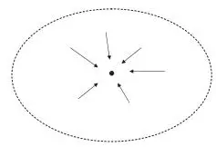
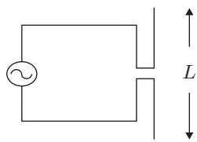
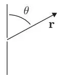
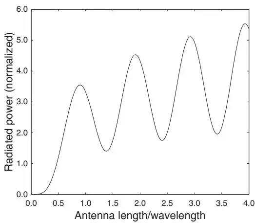
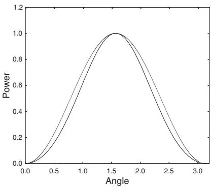
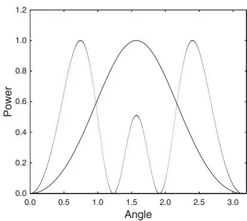
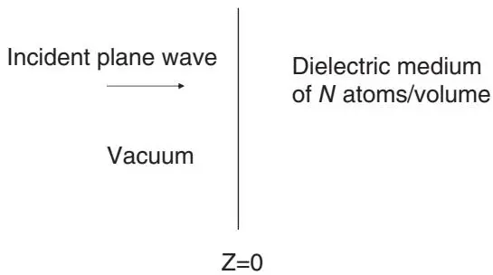
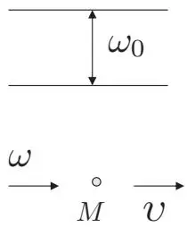
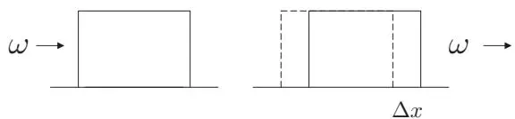
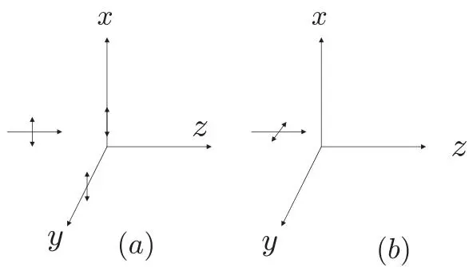

# 经典电动力学基础（Elements of Classical Electrodynamics）

本章简要回顾了（主要是）经典电磁理论的若干方面，主要为全书其余部分提供背景和辅助，同时包含一些标准教材中不常见的小概念点。

## 1.1 电场与磁场（Electric and Magnetic Fields）

电场 E 和磁感应场（magnetic induction field）B 的 Maxwell 方程组is：

$$
\nabla \cdot \mathbf{E} = \rho / \epsilon_{0}, \quad \text{or} \quad \oint_{S} \mathbf{E} \cdot \mathbf{n}   d S = \frac{1}{\epsilon_{0}} \int_{V} \rho   d V = \frac{1}{\epsilon_{0}} Q,\tag{1.1.1}
$$

$$
\nabla \cdot \mathbf{B} = 0, \quad \mathrm{or} \quad \oint_{S} \mathbf{B} \cdot \mathbf{n} d S = 0,\tag{1.1.2}
$$

$$
\nabla \times \mathbf{E} = - \frac{\partial \mathbf{B}}{\partial t}, \quad \mathrm{or} \quad \oint_{C} \mathbf{E} \cdot d \mathbf{r} = - \frac{\partial}{\partial t} \int_{S} \mathbf{B} \cdot \mathbf{n} d S,\tag{1.1.3}
$$

$$
\nabla \times \mathbf{B} = \mu_{0} \mathbf{J} + \frac{1}{c^{2}} \frac{\partial \mathbf{E}}{\partial t}, \quad \mathrm{or} \quad \oint_{C} \mathbf{B} \cdot d \mathbf{r} = \mu_{0} I + \frac{1}{c^{2}} \frac{\partial}{\partial t} \oint_{S} \mathbf{E} \cdot \mathbf{n} d S,\tag{1.1.4}
$$

其中 $\rho$ 是电荷密度（electric charge density），J 是电流密度（electric current density），$c = 1 / \sqrt{\epsilon_{0} \mu_{0}}$ 是真空中的光速。场 E 和 B 的定义使得以速度 v 运动的点电荷 q 所受到的力为

$$
\mathbf{F} = q (\mathbf{E} + \mathbf{v} \times \mathbf{B}).\tag{1.1.5}
$$

牛顿第二定律 $( \mathbf{F} = m \mathbf{a} )$ 描述了质量为 m 的电荷 q 在电场和磁场中的（非相对论性）运动。

方程 (1.1.1) 是高斯定律（Gauss's law）：通过任意封闭曲面 S 的电通量与 S 所包围体积 V 内的净电荷 Q 成正比。方程 (1.1.2) 意味着不存在类似于 Q 的磁荷。方程 (1.1.3) 是法拉第感应定律（Faraday's law of induction）：电场沿任意闭合曲线 C 的线积分——例如导线回路中的电动势（electromotive force, emf），或只是自由空间中的回路——等于通过该回路的磁通量随时间变化率的负值；负号体现了楞次定律（Lenz's law），即当磁极推入线圈时，线圈中感生的电动势会产生一个反抗磁极的电流。

方程 (1.1.4) 将 B 绕回路 $C$ 的积分与 $C$ 中的电流 I 以及通过 C 的电通量联系起来；第一项表达了奥斯特定律（Oersted's law）（电流可以使指南针偏转），而第二项对应于 Maxwell 依靠机械类比添加到电流密度 J 中的位移电流（displacement current）。有了这一附加项，(1.1.1) 和 (1.1.4) 结合恒等式 $\nabla \cdot ( \nabla \times \mathbf{B} ) = 0$ 就推出了连续性方程（continuity equation）

$$
\nabla \cdot \mathbf{J} + \frac{\partial \rho}{\partial t} = 0,\tag{1.1.6}
$$

它特别表明电荷是守恒的。（这一附加项还导出了电场和磁场的波动方程，从而意味着地球上任意两点之间近乎瞬时通信的可能性！）Maxwell 方程组以前所未有的紧凑形式表达了先驱们（Amp`ere、Cavendish、Coulomb、Faraday、Lenz、Oersted 等）通过实验发现的所有电磁学定律。

如果电荷密度 ρ 不随时间变化，则 $\nabla \cdot \mathbf{J} = 0$ ，并且根据 Maxwell 方程组，电场和磁场也不随时间变化且相互解耦：

$$
\nabla \cdot \mathbf{E} = \rho / \epsilon_{0} \quad \mathrm{and} \quad \nabla \times \mathbf{E} = 0,\tag{1.1.7}
$$

$$
\nabla \cdot \mathbf{B} = 0 \quad \mathrm{and} \quad \nabla \times \mathbf{B} = \mu_{0} \mathbf{J}.\tag{1.1.8}
$$

根据安培定律 $( \nabla \times \mathbf{B} = \mu_{0} \mathbf{J} )$ ，直导线中稳恒电流 I 产生的磁场在距离导线 r 处的量值为

$$
B = \frac{\mu_{0}}{2 \pi} \frac{I}{r} = \frac{1}{4 \pi \epsilon_{0}} \frac{2 I}{c^{2} r}\tag{1.1.9}
$$

并由右手定则确定方向。1 由此，根据 (1.1.5)，两条相距为 r、载有电流 I 和 I′ 的长平行导线之间每单位长度的（吸引力）为

$$
f = \frac{\mu_{0}}{2 \pi} \frac{I I^{\prime}}{r} = \frac{1}{4 \pi \epsilon_{0}} \frac{2 I I^{\prime}}{c^{2} r}.\tag{1.1.10}
$$

直到最近，这还被用于定义安培（A）：当两条长平行导线相距 1 m 时，若电流 $I = I^{\prime}$ 使得作用力为 $2 \times 10^{- 7} \ \mathrm{N / m}$ ，则该电流为 1 A。这一定义隐含了 $\mu_{0} = 4 \pi \times 10^{- 7} \mathrm{W b / A {\cdot} m}$ 的定义，2 其中韦伯（Wb）是磁通量的单位。根据这一定义，库仑（C）被定义为 1 A 稳恒电流在 1 s 内传输的电荷量。于是，在库仑定律中，

$$
\mathbf{F} _{2} = \frac{1}{4 \pi \epsilon_{0}} \frac{q_{1} q_{2}}{r_{12} ^{3}} \mathbf{r} _{12}\tag{1.1.11}
$$

给出了点电荷 $q_{1}$ 作用于点电荷 $q_{2}$ 的力，其中 $\mathbf{r} _{12}$ 是从 $q_{1}$ 指向 $q_{2}$ 的矢量。$\epsilon_{0}$ 由 $\mu_{0}$ 和 c 的定义值推导得出：$\epsilon_{0} = 8 . 854 \times 10^{- 12}$ $\mathrm{C^{2} / N {\cdot} m^{2}}$ ，即 $1 / 4 \pi \epsilon_{0} = 8 . 9874 \times 10^{9} ~ \mathrm{N {\cdot} m^{2} / C^{2}}$

在修订后的国际单位制（SI）中，安培基于电子电荷的固定值被定义为对应于每秒 $1 / ( 1 . 602176634 \times 10^{- 19} )$ 个电子的电流。修订后的系统中，自由空间介电常数 $\epsilon_{\mathrm{0}}$ 和磁导率 $\mu_{0}$ 是通过实验确定的量而非精确定义的量；关系式 $\epsilon_{0} \mu_{0} = 1 / c^{2}$ （其中 c 被定义为 299792458 ${\mathrm{m / s}}$ ）仍然是精确的。

方程 (1.1.11) 意味着两个相距 $r$ 的等量电荷 q 之间的库仑相互作用能为

$$
U (r) = \frac{1}{4 \pi \epsilon_{0}} \frac{q^{2}}{r}.\tag{1.1.12}
$$

我们可以用这个公式对结合能进行粗略估计。例如，考虑 $\mathrm{H_{2} ^{+}}$ 离子。总能量为 $E_{\mathrm{t o t}} = E_{\mathrm{n n}} + E_{\mathrm{e n}} + E_{\mathrm{k i n}}$ ，其中 $E_{\mathrm{n n}}$ 是质子-质子库仑能，$E_{\mathrm{e n}}$ 是电子与两个质子的库仑相互作用能，$E_{\mathrm{k i n}}$ 是动能。根据经典力学的位力定理（virial theorem），$E_{\mathrm{t o t}} = - E_{\mathrm{k i n}}$ ，这意味着

$$
E_{\mathrm{tot}} = \frac{1}{2} (E_{\mathrm{nn}} + E_{\mathrm{en}}).\tag{1.1.13}
$$

${\cal E} _{\mathrm{n n}} = e^{2} / ( 4 \pi \epsilon_{0} r )$ ，其中 $e = 1 . 602 \times 10^{- 19}$ C，$r \cong 0 . 106$ nm 是核间距。粗略估计 $E_{\mathrm{e n}}$ 的方法是假设电子位于两个质子之间的中点：

$$
E_{\mathrm{en}} \approx - \frac{1}{4 \pi \epsilon_{0}} \times 2 \times \frac{e^{2}}{\frac{1}{2} r} = - 4 E_{\mathrm{nn}}.\tag{1.1.14}
$$

于是，

$$
E_{\mathrm{tot}} = - \frac{3}{2} \times \frac{1}{4 \pi \epsilon_{0}} \frac{e^{2}}{r} \approx - 20. 4 \mathrm{eV}.\tag{1.1.15}
$$

氢原子的结合（电离）能为 13.6 eV，$\mathrm{H_{2} ^{+}}$ 的结合能——定义为氢原子与质子之间的结合能——估计为 $( 20 . 4 - 13 . 6 ) \ : \mathrm{e V = 6 . 8 \ : e V}$ 。量子力学计算给出的这一结合能为 2.7 $\mathrm{e V}$ 。 化学结合能通常在几个电子伏特的量级。

再考虑另一个例子：$\mathrm{U} ^{235}$ 核裂变释放的能量。由于有 92 个质子，质子的库仑相互作用能为

$$
U_{1} \approx \frac{1}{4 \pi \epsilon_{0}} \frac{(92 e) ^{2}}{R},\tag{1.1.16}
$$

其中 R 是核半径。如果原子核分裂成两半，体积减小为原来的 1/2，由于体积与半径的立方成正比，因此半径减小为 $( 1 / 2 ) ^{1 / 3} R$ 。所以子核的库仑相互作用能之和为

$$
U_{2} \approx 2 \times \frac{1}{4 \pi \epsilon_{0}} \times (46 e) ^{2} / [ (1 / 2) ^{1 / 3} R ] = 0. 63 U_{1}.\tag{1.1.17}
$$

裂变释放的能量为 $U_{f} = U_{1} - U_{2} = 0 . 37 U_{1}$ 。取核半径 $R = 10^{- 14}$ m，我们得到 $U_{f} = 4 . 8 \times 10^{8} ~ \mathrm{e V} = 480 ~ \mathrm{M e V}$ ，而实际值约为每个核 170 MeV。因此，仅用静电相互作用，不考虑核子之间的强相互作用，也无需知道 $E = m c^{2}$ ，我们就得到了正确的数量级。2 这个简单模型中能量释放的物理起源是带电粒子的库仑相互作用，与化学燃烧反应一样。但化学反应释放的能量通常仅为每个原子几个电子伏特；$\mathrm{U} ^{235}$ 裂变中每个核释放的巨量能量是由于原子核与原子相比尺寸极小，以及涉及大量电荷（质子）所致。

## 1.2 恩肖定理（Earnshaw’s Theorem）

静电学的基础是 (1.1.7)。我们引入标量势 $\Phi ( \mathbf{r} )$，使 $\mathbf{E ( r )} = - \nabla \Phi \mathbf{( r )}$，从而 $\nabla \times \mathbf{E} = 0$ 自动满足。于是，$\nabla \cdot \mathbf{E} = \rho / \epsilon_{0}$ 导出泊松方程（Poisson equation）

$$
\nabla^{2} \phi = - \rho / \epsilon_{0},\tag{1.2.1}
$$

or在无电荷区域中的拉普拉斯方程（Laplace equation）

$$
\nabla^{2} \phi = 0\tag{1.2.2}
$$

读者可能曾在家庭作业中愉快地解过这些方程，处理各种对称的电荷分布和导体边界条件。这里，我们只回顾静电 Maxwell 方程组的一个推论——恩肖定理（Earnshaw’s theorem）：任何静电场都无法将带电粒子约束在稳定平衡点上。这可以直接从高斯定律得出（见图 1.1）。该定理很容易推广到任意数量的电荷：自由空间中任何正负电荷的排列都无法仅依靠静电力达到稳定平衡。

图1.1 自由空间中某个假想封闭曲面内的一点。要使该点成为正点电荷的稳定平衡点，电场必须处处指向该点，这将导致通过该曲面的电通量为负。这违反了高斯定律，因为在自由空间中 $\nabla \cdot \mathbf{E} = 0$ 。

恩肖定理的更正式证明从点电荷 q 所受的力 $\mathbf{F} = q \mathbf{E} = - q \nabla \Phi$ 出发，or者等价地，从势能 $U ( \mathbf{r} ) = q \Phi ( \mathbf{r} )$ 出发；自由空间中 $\nabla \cdot \mathbf{E} = 0$ 意味着拉普拉斯方程

$$
\nabla^{2} U = \frac{\partial^{2} U}{\partial x^{2}} + \frac{\partial^{2} U}{\partial y^{2}} + \frac{\partial^{2} U}{\partial z^{2}} = 0,\tag{1.2.3}
$$

这意味着势能在图1.1的曲面内部不存在局部极大值或极小值；若存在局部极大值或极小值，则需要拉普拉斯方程中所有三个二阶导数同号，这与该方程矛盾。在任何点处，只能沿一个方向有极大值而沿另一个方向有极小值（鞍点）。特别地，任何涉及 $1 / r$ 型势能的力的组合——例如静电相互作用加引力相互作用——都无法产生稳定平衡点，因为所有势能的拉普拉斯算符之和为零。

Samuel Earnshaw 牧师于1842年在“发光以太”和弹性理论的背景下提出了他的定理。他指出，随粒子间距离平方反比变化的力无法产生稳定平衡，并由此得出结论：以太必须由非平方反比的力来维系。Maxwell 将该定理表述为“置于电场力中的带电体不可能处于稳定平衡”，并在静电学中给出了证明。

静电学中的恩肖定理仅表明仅靠静电力无法实现稳定平衡。如果其他力将负电荷约束在适当位置，那么正电荷当然可以通过负电荷的适当分布保持在稳定平衡中。类似地，电荷可以在时变电场中处于稳定平衡，或者在介电介质中（由非静电力维系！）处于稳定平衡——在介电介质中，电荷的任何位移都会产生一个将其拉回的恢复力，例如位于介电常数为 $\epsilon < \epsilon_{0}$ 的介电球中心的电荷就属于这种情况。

静磁学中的情况稍显复杂。不存在磁单极子，对于磁场 B 中的磁偶极子 m，相关的势能为 $U ( \mathbf{r} ) = - \mathbf{m} \cdot \mathbf{B}$ 。对于感应磁偶极子，$\mathbf{m} = \alpha_{m} \mathbf{B}$ ，其中 $\alpha_{m} > 0$ 对应顺磁材料（偶极子倾向于与 B 场对齐），$\alpha_{m} < 0$ 对应抗磁材料（偶极子倾向于与场“反对齐”），势能为

$$
U (\mathbf{r}) = - \int_{0} ^{\mathbf{B} (\mathbf{r})} \alpha_{m} \mathbf{B} \cdot d \mathbf{B} = - \frac{1}{2} \alpha_{m} B^{2} (\mathbf{r}),\tag{1.2.4}
$$

且 $\nabla^{2} U = - ( 1 / 2 ) \alpha_{m} \nabla^{2} B^{2}$ 。若要存在稳定平衡点，在自由空间中包围该点的任何曲面上的力 F 的通量必须为负，根据散度定理，这意味着 $\nabla \cdot \mathbf{F} = - \nabla^{2} U < 0$ ，即在该点处 $\alpha_{m} \nabla^{2} B^{2} < 0$ 。在自由空间中 $\nabla \times \mathbf{B} = 0$ ，因此 $\nabla \times ( \nabla \times \mathbf{B} ) = \nabla ( \nabla \cdot \mathbf{B} ) - \nabla^{2} \mathbf{B} = 0$ ，故 $\nabla^{2} \mathbf{B} = 0$ 且

$$
\nabla^{2} (\mathbf{B} \cdot \mathbf{B}) = 2 \mathbf{B} \cdot \nabla^{2} \mathbf{B} + 2 | \nabla \mathbf{B} | ^{2} = 2 | \nabla \mathbf{B} | ^{2} \geq 0.\tag{1.2.5}
$$

因此，在顺磁情况下我们不可能有 $\alpha_{m} \nabla^{2} B^{2} < 0$ ，即顺磁粒子不能在静磁场中保持稳定平衡。但抗磁粒子有可能在静磁场中处于稳定平衡：这仅仅是因为 $B^{2}$ 与 B 本身的三个分量不同，不满足拉普拉斯方程，可以具有局部极小值。普通抗磁材料（木材、水、蛋白质等）抗磁性非常弱，但在足够强的磁场中可以实现悬浮。目前磁悬浮最引人注目的实际应用——“磁悬浮”列车——正是基于超导体 $( \alpha_{m} \to \infty )$ 在磁场中的悬浮。

## 1.3 规范与场的相对性（Gauges and the Relativity of Fields）

光学物理中感兴趣的电、磁场远非静态，当然必须由耦合的、含时Maxwell方程组来描述。在本节中，我们简要回顾这些方程蕴含的一些规范变换（gauge transformation）和Lorentz变换性质。

我们引入矢量势A（vector potential），使得 $\mathbf{B} = \nabla \times \mathbf{A}$ ，这与 $\nabla \cdot \mathbf{B} = 0$ 一致。由(1.1.3)，我们可以写出 $\mathbf{E} = - \nabla \Phi - \partial \mathbf{A} / \partial t$ ，再由(1.1.4)和恒等式 $\nabla \times ( \nabla \times \mathbf{A} ) = \nabla ( \nabla \cdot \mathbf{A} ) - \nabla^{2} \mathbf{A}$，可得

$$
\nabla (\nabla \cdot \mathbf{A} + \frac{1}{c^{2}} \frac{\partial \phi}{\partial t}) - \nabla^{2} \mathbf{A} + \frac{1}{c^{2}} \frac{\partial^{2} \mathbf{A}}{\partial t^{2}} = \mu_{0} \mathbf{J}.\tag{1.3.1}
$$

用 $\Phi$ 和 A 表示，(1.1.1) 变is

$$
\nabla^{2} \phi + \frac{\partial}{\partial t} (\nabla \cdot \mathbf{A}) = - \rho / \epsilon_{0}.\tag{1.3.2}
$$

这两个关于势 $\Phi$ 和 A 的方程等价于 Maxwell 方程组 (1.1.3) 和 (1.1.1)，而 $\Phi$ 和 A 的定义确保了其余两个 Maxwell 方程自动满足。但 $\Phi$ 和 A 并非由 $\mathbf{B} = \nabla \times \mathbf{A}$ 和 $\mathbf{E} = - \nabla \Phi - \partial \mathbf{A} / \partial t$ 唯一确定：我们可以用不同的势 $\mathbf{A} ^{\prime}$ 和 $\Phi^{\prime}$ 来满足 Maxwell 方程组，它们通过规范变换（gauge transformation）$\mathbf{A} = \mathbf{A} ^{\prime} + \nabla \chi$ 和 $\Phi = \Phi^{\prime} - \partial \chi / \partial t$ 相联系，并保持 $\mathbf{B} = \nabla \times \mathbf{A} = \nabla \times \mathbf{A} ^{\prime}$ 和 $\mathbf{E} = - \nabla \Phi - \partial \mathbf{A} / \partial t = - \nabla \Phi^{\prime} - \partial \mathbf{A} ^{\prime} / \partial t . ^{5}$

### 1.3.1 洛伦兹规范（Lorentz Gauge）

例如，我们可以选择洛伦兹规范（Lorentz gauge），其中标量势和矢量势被选为满足以下方程：6

$$
\nabla \cdot \mathbf{A} + \frac{1}{c^{2}} \frac{\partial \phi}{\partial t} = 0.\tag{1.3.3}
$$

于是，由 (1.3.1) 和 (1.3.2)，

$$
\nabla^{2} \mathbf{A} - \frac{1}{c^{2}} \frac{\partial^{2} \mathbf{A}}{\partial t^{2}} = - \mu_{0} \mathbf{J},\tag{1.3.4}
$$

$$
\nabla^{2} \phi - \frac{1}{c^{2}} \frac{\partial^{2} \phi}{\partial t^{2}} = - \rho / \epsilon_{0}.\tag{1.3.5}
$$

洛伦兹规范的优势，顾名思义，出现在电动力学方程被表述为在相对论 Lorentz 变换下"显然是"不变的时候，如下所述。

回顾标量波动方程的解

$$
\nabla^{2} \psi - \frac{1}{c^{2}} \frac{\partial^{2} \psi}{\partial t^{2}} = f (\mathbf{r}, t)\tag{1.3.6}
$$

使用满足下式的格林函数 G

$$
(\nabla^{2} - \frac{1}{c^{2}} \frac{\partial^{2}}{\partial t^{2}}) G (\mathbf{r}, t; \mathbf{r} ^{\prime}, t^{\prime}) = \delta^{3} (\mathbf{r} - \mathbf{r} ^{\prime}) \delta (t - t^{\prime}).\tag{1.3.7}
$$

利用 delta 函数的标准表示：

$$
\delta^{3} (\mathbf{r} - \mathbf{r} ^{\prime}) \delta (t - t^{\prime}) = \left(\frac{1}{2 \pi}\right) ^{4} \int d^{3} k \int_{- \infty} ^{\infty} d \omega e^{i (\mathbf{k} \cdot \mathbf{R} - \omega T)},\tag{1.3.8}
$$

其中 $\mathbf{R} = \mathbf{r} - \mathbf{r} ^{\prime}$ ，$T = t - t^{\prime}$ 。格林函数的相应傅里叶分解is：

$$
G (\mathbf{r}, t; \mathbf{r} ^{\prime}, t^{\prime}) = \int d^{3} k \int_{- \infty} ^{\infty} d \omega g (\mathbf{k}, \omega) e^{i (\mathbf{k} \cdot \mathbf{R} - \omega T)},\tag{1.3.9}
$$

及定义方程 (1.3.7) 蕴含

$$
\begin{array}{l} G (\mathbf{r}, t; \mathbf{r} ^{\prime}, t^{\prime}) = - \left(\frac{1}{2 \pi}\right) ^{4} \int d^{3} k \int_{- \infty} ^{\infty} d \omega \frac{e^{i (\mathbf{k} \cdot \mathbf{R} - \omega T)}}{k^{2} - \omega^{2} / c^{2}} \\ \qquad = - \left(\frac{1}{2 \pi}\right) ^{4} \int_{0} ^{\infty} d k   k^{2} \int_{0} ^{\pi} d \theta \sin \theta \int_{0} ^{2 \pi} d \phi \int_{- \infty} ^{\infty} d \omega \frac{e^{i k R \cos \theta} e^{- i \omega T}}{k^{2} - \omega^{2} / c^{2}} \\ \qquad = \left(\frac{1}{2 \pi}\right) ^{3} \frac{c}{2 i R} \int_{- \infty} ^{\infty} d k   e^{i k R} \int_{- \infty} ^{\infty} d \omega \left(\frac{1}{\omega - k c} - \frac{1}{\omega + k c}\right) e^{- i \omega T}. \end{array}\tag{1.3.10}
$$

我们如何处理 $\omega$ 积分中在 $\omega = \pm k c$ 处的奇点？一个物理上合理的假设是，对于 $T = t - t^{\prime} < 0$（即在 delta 函数”源”开启之前的时间），$G ( \mathbf{r} , t ; \mathbf{r} ^{\prime} , t^{\prime} )$ 为零。我们可以通过引入正无穷小量 $\epsilon$ 并定义推迟格林函数（retarded Green function）来满足这一条件：

$$
\begin{array}{c} G (\mathbf{r}, t; \mathbf{r} ^{\prime}, t^{\prime}) = \Big (\frac{1}{2 \pi} \Big) ^{3} \frac{c}{2 i R} \int_{- \infty} ^{\infty} d k e^{i k R} \int_{- \infty} ^{\infty} d \omega \Big (\frac{1}{\omega - k c + i \epsilon} \\ - \frac{1}{\omega + k c + i \epsilon} \Big) e^{- i \omega T}. \end{array}\tag{1.3.11}
$$

现在极点不在实轴上，而是在复平面的下半部分。由于对于 $T < 0$ 且 $\omega$ 具有大正虚部的情况 $e^{- i \omega T} \to 0$，我们可以将 (1.3.11) 中的积分路径替换为沿实轴并在上半平面以一个大（半径 $\to \infty$）半圆闭合的路径。由于此闭合路径内没有极点，我们得到所需的性质：

$$
G (\mathbf{r}, t; \mathbf{r} ^{\prime}, t^{\prime}) = 0 \quad (t <   t^{\prime}).\tag{1.3.12}
$$

对于 $T = t - t^{\prime} > 0$，类似地，我们可以在复平面下半平面用一个无穷大半圆闭合积分路径。此时积分路径包围了极点 $\omega = \pm k c - i \epsilon$，留数定理给出

$$
\begin{array}{r l} & G (\mathbf{r}, t; \mathbf{r} ^{\prime}, t^{\prime}) = \left(\frac{1}{2 \pi}\right) ^{3} \frac{c}{2 i R} \int_{- \infty} ^{\infty} d k e^{i k R} (- 2 \pi i) [ e^{- i k c T} - e^{i k c T} ] \\ & \quad = - \frac{c}{4 \pi R} [ \delta (R - c T) - \delta (R + c T) ] = \frac{c}{4 \pi R} \delta (R - c T) \\ & \quad = - \frac{c}{4 \pi | \mathbf{r} - \mathbf{r} ^{\prime} |} \delta [ | \mathbf{r} - \mathbf{r} ^{\prime} | - c (t - t^{\prime}) ] (t > t^{\prime}). \end{array}\tag{1.3.13}
$$

于是，(1.3.5) 的解是

$$
\begin{array}{r l} & {\phi (\mathbf{r}, t) = \frac{- 1}{\epsilon_{0}} \int d^{3} r^{\prime} \int_{- \infty} ^{\infty} d t^{\prime} G (\mathbf{r}, t; \mathbf{r} ^{\prime}, t^{\prime}) \rho (\mathbf{r} ^{\prime}, t^{\prime})} \\ & {\qquad = \frac{c}{4 \pi \epsilon_{0}} \int d^{3} r^{\prime} \int_{- \infty} ^{\infty} d t^{\prime} \frac{\rho (\mathbf{r} ^{\prime} , t^{\prime}) \delta [ | \mathbf{r} - \mathbf{r} ^{\prime} | - c (t - t^{\prime}) ]}{| \mathbf{r} - \mathbf{r} ^{\prime} |}} \\ & {\qquad = \frac{1}{4 \pi \epsilon_{0}} \int d^{3} r^{\prime} \frac{\rho (\mathbf{r} ^{\prime} , t - | \mathbf{r} - \mathbf{r} ^{\prime} | / c)}{| \mathbf{r} - \mathbf{r} ^{\prime} |}} \end{array}\tag{1.3.14}
$$

在假设具有物理意义的格林函数是推迟格林函数（而非”超前”格林函数或超前与推迟格林函数的某种线性组合）的前提下。7 $\mathbf{r} ^{\prime}$ 处的电荷密度对标量势在 $\mathbf{r}$ 处 t 时刻的贡献，取决于推迟时刻 $t - | \mathbf{r} - \mathbf{r} ^{\prime} | / c$ 的电荷密度值；矢量势亦然。这些势的表达式比其静态形式的简单推迟版本更为复杂，我们现在通过一个重要但简单的例子来回顾。

对于 t 时刻位置为 ${\bf u} ( t )$ 的点电荷 q，有 $\boldsymbol \rho ( {\bf r} ^{\prime} , t^{\prime} ) = q \delta^{3} [ \mathbf{r} ^{\prime} - \mathbf{u} ( t^{\prime} ) ]$，标量势is

$$
\phi (\mathbf{r}, t) = \frac{q}{4 \pi \epsilon_{0}} \int d^{3} r^{\prime} \int_{- \infty} ^{\infty} d t^{\prime} \frac{\delta^{3} [ \mathbf{r} ^{\prime} - \mathbf{u} (t^{\prime}) ] \delta (t^{\prime} - t + | \mathbf{r} - \mathbf{r} ^{\prime} | / c)}{| \mathbf{r} - \mathbf{r} ^{\prime} |}.\tag{1.3.15}
$$

为了执行积分，我们进行变量变换，从 $x^{\prime} , y^{\prime} , z^{\prime} , t^{\prime}$ 变is $y_{1} = x^{\prime} - u_{x} ( t^{\prime} )$，$y_{2} = y^{\prime} - u_{y} ( t^{\prime} )$，$y_{3} = z^{\prime} - u_{z} ( t^{\prime} )$ 和 $y_{4} = t^{\prime} - t + | \mathbf{r} - \mathbf{r} ^{\prime} | / c$：

$$
\phi (\mathbf{r}, t) = \frac{q}{4 \pi \epsilon_{0}} \frac{1}{| \mathbf{r} - \mathbf{r} ^{\prime} |} \int \int \int \int d y_{1}   d y_{2}   d y_{3}   d y_{4}   J^{- 1} \delta (y_{1})   \delta (y_{2})   \delta (y_{3})   \delta (y_{4}),\tag{1.3.16}
$$

其中现在 $\mathbf{r} ^{\prime} = \mathbf{u} ( t^{\prime} )$，$t^{\prime} = t - | \mathbf{r} - \mathbf{r} ^{\prime} | / c$，J 是 $4 \times 4$ Jacobi 行列式：

$$
J = \frac{\partial (y_{1} , y_{2} , y_{3} , y_{4})}{\partial (x^{\prime} , y^{\prime} , z^{\prime} , t^{\prime})},\tag{1.3.17}
$$

通过简单代数计算得到

$$
J = 1 - [ \dot{\mathbf{u}} (t^{\prime}) / c ] \cdot \frac{\mathbf{r} - \mathbf{r} ^{\prime}}{| \mathbf{r} - \mathbf{r} ^{\prime} |}.\tag{1.3.18}
$$

因此，

$$
\phi (\mathbf{r}, t) = \frac{q}{4 \pi \epsilon_{0}} \frac{1}{| \mathbf{r} - \mathbf{r} ^{\prime} | - [ \dot{\mathbf{u}} (t^{\prime}) / c ] \cdot (\mathbf{r} - \mathbf{r} ^{\prime}) / | \mathbf{r} - \mathbf{r} ^{\prime} |},\tag{1.3.19}
$$

or者用更紧凑的记号：

$$
\phi (\mathbf{r}, t) = \frac{1}{4 \pi \epsilon_{0}} \left[ \frac{q}{R (1 - \mathbf{v} \cdot \hat{\mathbf{n}} / c)} \right] _{\mathrm{ret}},\tag{1.3.20}
$$

其中 R 是电荷到观测点 r 的距离，$\hat{\mathbf{n}}$ 是从点电荷指向观测点的单位矢量，$\mathbf{v} = \dot{\mathbf{u}}$ 是电荷的速度，下标”ret”表示括号内所有量均在推迟时刻 $t^{\prime} = t - | \mathbf{r} - \mathbf{r} ^{\prime} | / c$ 取值。类似地，(1.3.4) 的推迟矢量势解为

$$
\mathbf{A} (\mathbf{r}, t) = \frac{1}{4 \pi \epsilon_{0} c^{2}} \left[ \frac{q \mathbf{v}}{R (1 - \mathbf{v} \cdot \hat{\mathbf{n}} / c)} \right] _{\mathrm{ret}},\tag{1.3.21}
$$

因is点电荷的电流密度is $\mathbf{J} = q \mathbf{v} \delta^{3} [ \mathbf{r} - \mathbf{u} ( t ) ]$

这些 Liénard-Wiechert 势是复杂的。例如，$\Phi ( \mathbf{r} , t )$ 并非简单地等于 $q / 4 \pi \epsilon_{0} [ R ] _{\mathrm{r e t}}$——“几乎每个人最初都会这样认为”8。相反，$\Phi ( \mathbf{r} , t )$ 不仅取决于电荷在推迟时刻 $t^{\prime}$ 的位置，还取决于其在 $t^{\prime}$ 的速度。例如，对于以恒定速度 $v$ 沿 x 轴运动的电荷，

$$
t^{\prime} = t - \frac{1}{c} | \mathbf{r} - \mathbf{u} (t^{\prime}) | = t - \frac{1}{c} \sqrt{(x - v t^{\prime}) ^{2} + y^{2} + z^{2}}\tag{1.3.22}
$$

如果我们定义坐标系使得在 $t = 0$ 时电荷位于 $( x = 0 , y = 0 , z = 0 )$，则该方程对于 $t^{\prime} ( < t )$ 的解is

$$
t^{\prime} = \left(1 - \frac{v^{2}}{c^{2}}\right) ^{- 1} \left[ t - \frac{x v}{c^{2}} - \frac{1}{c} \sqrt{(x - v t) ^{2} + \left(1 - \frac{v^{2}}{c^{2}}\right) (y^{2} + z^{2})} \right].\tag{1.3.23}
$$

由于 $R = c ( t - t^{\prime} )$ 且推迟时刻 $t^{\prime}$ 时沿 $\mathbf{r} ^{\prime}$ 的速度分量is $v \cdot ( x - v t^{\prime} ) / | \mathbf{r} ^{\prime} |$，由 (1.3.22) 和 (1.3.23) 可得

$$
[ R - R \mathbf{v} \cdot \hat{\mathbf{n}} / c ] _{\mathrm{ret}} = c (t - t^{\prime}) - \frac{v}{c} (x - v t^{\prime}) = \sqrt{(x - v t) ^{2} + (1 - \frac{v^{2}}{c^{2}}) (y^{2} + z^{2})},\tag{1.3.24}
$$

因此

$$
\begin{array}{c} \phi (x, y, z, t) = \frac{q}{4 \pi \epsilon_{0}} \frac{1}{\sqrt{(x - v t) ^{2} + (1 - v^{2} / c^{2}) (y^{2} + z^{2})}} \\ = \frac{q}{4 \pi \epsilon_{0}} \frac{1}{\sqrt{1 - v^{2} / c^{2}}} \frac{1}{\sqrt{(x - v t) ^{2} / (1 - v^{2} / c^{2}) + y^{2} + z^{2}}} \end{array}\tag{1.3.25}
$$

及

$$
A_{x} (x, y, z, t) = \frac{q v}{4 \pi \epsilon_{0} c^{2}} \frac{1}{\sqrt{1 - v^{2} / c^{2}}} \frac{1}{\sqrt{(x - v t) ^{2} / (1 - v^{2} / c^{2}) + y^{2} + z^{2}}}\tag{1.3.26}
$$

适用于以恒定速度 v 沿 x 方向运动的带电粒子。

我们可以利用狭义相对论中 $\Phi$ 和 A 作为四维矢量 $( \Phi / c , \mathbf{A} )$ 的分量进行变换这一事实，更简单地推导这些结果。在电荷 $q$ 静止的时空坐标系 $( x^{\prime} , y^{\prime} , z^{\prime} , t^{\prime} )$ 中，

$$
\phi^{\prime} (x^{\prime}, y^{\prime}, z^{\prime}, t^{\prime}) = \frac{q}{4 \pi \epsilon_{0}} \frac{1}{\sqrt{x^{\prime 2} + y^{\prime 2} + z^{\prime 2}}}, \quad \mathbf{A} ^{\prime} (x^{\prime}, y^{\prime}, z^{\prime}, t^{\prime}) = 0.\tag{1.3.27}
$$

“实验室”坐标系 $( x , y , z , t )$——其中电荷以恒定速度 v 沿 x 正方向运动——与静止坐标系通过 Lorentz 变换相联系：

$$
x^{\prime} = \frac{x - v t}{\sqrt{1 - v^{2} / c^{2}}}, \quad t^{\prime} = \frac{t - v x / c^{2}}{\sqrt{1 - v^{2} / c^{2}}}, \quad y^{\prime} = y, \quad z^{\prime} = z.\tag{1.3.28}
$$

例如，势 $\Phi ( x , y , z , t )$ 可以通过将 $\Phi^{\prime} ( x^{\prime} , y^{\prime} , z^{\prime} , t^{\prime} )$ 从电荷静止系变换到以速度 v 沿 x 轴运动的坐标系得到：

$$
\begin{array}{l} \phi (x, y, z, t) = \frac{\phi^{\prime} (x^{\prime} , y^{\prime} , z^{\prime} , t^{\prime}) + v A_{x} ^{\prime} (x^{\prime} , y^{\prime} , z^{\prime} , t^{\prime}) / c^{2}}{\sqrt{1 - v^{2} / c^{2}}} = \frac{1}{\sqrt{1 - v^{2} / c^{2}}} \frac{q / 4 \pi \epsilon_{0}}{\sqrt{x^{\prime 2} + y^{\prime 2} + z^{\prime 2}}} \\ = \frac{q}{4 \pi \epsilon_{0}} \frac{1}{\sqrt{1 - v^{2} / c^{2}}} \frac{1}{\sqrt{(x - v t) ^{2} / (1 - (v^{2} / c^{2}) + y^{2} + z^{2}}}, \end{array} \tag{1.3.29}
$$

这正是 (1.3.25)。我们从波动方程的解直接得到 (1.3.25) 而未进行任何 Lorentz 变换当然并不奇怪，因为 Maxwell 方程组是狭义相对论中正确的电磁理论方程；它们在任何惯性系中都成立。事实上，Liénard-Wiechert 势在狭义相对论发展之前就已经得到了。狭义相对论表明，v 可以视为电荷静止坐标系与电荷以速度 v 运动的坐标系之间的相对速度。

一旦我们有了 $\Phi$ 和 A，就可以利用 $\mathbf{E} = - \nabla \Phi - \partial \mathbf{A} / \partial t$ 和 $\mathbf{B} = \nabla \times \mathbf{A}$ 得到电场和磁场。由 (1.3.25) 和 A 的相应公式，

$$
\begin{array}{r l} & E_{x} = \frac{q}{4 \pi \epsilon_{0}} \frac{1}{\sqrt{1 - v^{2} / c^{2}}} \frac{(x - v t)}{[ (x - v t) ^{2} / (1 - v^{2} / c^{2}) + y^{2} + z^{2}) ] ^{3 / 2}}, \\ & E_{y} = \frac{q}{4 \pi \epsilon_{0}} \frac{1}{\sqrt{1 - v^{2} / c^{2}}} \frac{y}{[ (x - v t) ^{2} / (1 - v^{2} / c^{2}) + y^{2} + z^{2}) ] ^{3 / 2}}, \\ & E_{z} = \frac{q}{4 \pi \epsilon_{0}} \frac{1}{\sqrt{1 - v^{2} / c^{2}}} \frac{z}{[ (x - v t) ^{2} / (1 - v^{2} / c^{2}) + y^{2} + z^{2}) ] ^{3 / 2}}, \end{array}\tag{1.3.30}
$$

且

$$
\mathbf{B} = \frac{1}{c^{2}} \mathbf{v} \times \mathbf{E}.\tag{1.3.31}
$$

更一般地，电场和磁场的变换规律为

$$
E_{x} ^{\prime} = E_{x},
$$

$$
E_{y} ^{\prime} = \frac{E_{y} - v B_{z}}{\sqrt{1 - v^{2} / c^{2}}},
$$

$$
E_{z} ^{\prime} = \frac{E_{z} + v B_{y}}{\sqrt{1 - v^{2} / c^{2}}},
$$

$$
B_{x} ^{\prime} = B_{x},
$$

$$
B_{y} ^{\prime} = \frac{B_{y} + v E_{z} / c^{2}}{\sqrt{1 - v^{2} / c^{2}}},
$$

$$
B_{z} ^{\prime} = \frac{B_{z} - v E_{y} / c^{2}}{\sqrt{1 - v^{2} / c^{2}}},\tag{1.3.32}
$$

当带撇的参考系相对于未带撇的参考系以恒定速度 v 沿 x 方向运动时。9

例如，结果 (1.3.31) 可以通过这些变换律从一个电荷静止参考系中的 Coulomb 场得到，从而关联两个惯性系中的场。特别地，一个参考系中的纯电场在另一个参考系中会产生磁场，反之亦然。10

对于速度随时间变化的带电粒子，电场和磁场可以从 Liénard-Wiechert 势计算得到，如标准教材所述。这里我们只回忆非相对论情形 $( v \ll c )$ 下辐射区的（推迟）场公式：

$$
\mathbf{E} (\mathbf{r}, t) = \frac{q}{4 \pi \epsilon_{0}} \frac{1}{c^{2} r^{3}} \mathbf{r} \times (\mathbf{r} \times \dot{\mathbf{v}}),\tag{1.3.33}
$$

$$
\mathbf{B} (\mathbf{r}, t) = \frac{q}{4 \pi \epsilon_{0}} \frac{1}{c^{3} r^{2}} \dot{\mathbf{v}} \times \mathbf{r}.\tag{1.3.34}
$$

每单位立体角的辐射功率利用这些场和 Poynting 矢量计算：

$$
\frac{d P}{d \Omega} = \frac{1}{4 \pi \epsilon_{0}} \frac{q^{2}}{4 \pi c^{3}} | \dot{\bf v} | ^{2} \sin^{2} \theta ,\tag{1.3.35}
$$

其中 θ 是 r 与加速度 $\dot{\mathbf{v}}$ 之间的夹角。对所有立体角积分得到辐射功率的（非相对论）Larmor 公式：

$$
P = \int_{0} ^{2 \pi} d \phi \int_{0} ^{\pi} d \theta \sin \theta \frac{d P}{d \Omega} = \frac{1}{4 \pi \epsilon_{0}} \frac{2 q^{2} \dot{v} ^{2}}{3 c^{3}}.\tag{1.3.36}
$$

### 1.3.2 库仑规范（Coulomb Gauge）

在库仑规范（Coulomb gauge）中，我们选择 $\chi$ 使得 $\nabla \cdot \mathbf{A} = 0 . ^{11}$ 在此规范下，

$$
\nabla^{2} \phi = - \rho / \epsilon_{0}\tag{1.3.37}
$$

且

$$
\nabla^{2} \mathbf{A} - \frac{1}{c^{2}} \frac{\partial^{2} \mathbf{A}}{\partial t^{2}} = - \mu_{0} \mathbf{J} + \frac{1}{c^{2}} \nabla \frac{\partial \phi}{\partial t}.\tag{1.3.38}
$$

标量势满足 Poisson 方程 (1.3.37)，由电荷密度 $\boldsymbol \rho ( {\bf r} , t )$ 通过瞬时 Coulomb 势给出：

$$
\phi (\mathbf{r}, t) = \frac{1}{4 \pi \epsilon_{0}} \int \frac{\rho (\mathbf{r} ^{\prime} , t)}{| \mathbf{r} - \mathbf{r} ^{\prime} |} d^{3} r^{\prime},\tag{1.3.39}
$$

前提是电荷分布在整个空间中给定。（当然，情况并非总是如此；例如，在静电学的许多例子中，势在导体上给定，表面电荷分布在求解带边界条件的 Laplace 方程之后推导得到。）方程 (1.3.38) 可以利用 Helmholtz 定理重写：任意矢量场 $\mathbf{F} ( \mathbf{r} , t )$ 可以唯一地分解为横场部分和纵场部分，分别定义为12

$$
\mathbf{F} ^{\perp} (\mathbf{r}, t) = \frac{1}{4 \pi} \nabla \times \nabla \times \int \frac{\mathbf{F} (\mathbf{r} ^{\prime} , t)}{| \mathbf{r} - \mathbf{r} ^{\prime} |} d^{3} r^{\prime},\tag{1.3.40}
$$

$$
\mathbf{F} ^{\parallel} (\mathbf{r}, t) = - \frac{1}{4 \pi} \nabla \int \frac{\nabla^{\prime} \cdot \mathbf{F} (\mathbf{r} ^{\prime} , t)}{| \mathbf{r} - \mathbf{r} ^{\prime} |} d^{3} r^{\prime}.\tag{1.3.41}
$$

换句话说，$\mathbf{F} = \mathbf{F} ^{\perp} + \mathbf{F} ^{\parallel}$，其中 $\nabla \cdot \mathbf{F} ^{\perp} = 0$ 且 $\nabla \times \mathbf{F} ^{\parallel} = 0$。在库仑规范中，矢量势 A 是横矢量场 $( \nabla \cdot \mathbf{A} = 0 )$；将 $\mathbf{J} = \mathbf{J} ^{\perp} + \mathbf{J} ^{\parallel}$ 代入 (1.3.38)，我们得到

$$
\begin{array}{l} \nabla^{2} \mathbf{A} - \frac{1}{c^{2}} \frac{\partial^{2} \mathbf{A}}{\partial t^{2}} = - \mu_{0} \mathbf{J} ^{\perp} - \mu_{0} \mathbf{J} ^{\parallel} + \frac{1}{c^{2}} \nabla \frac{\partial \phi}{\partial t} \\ = - \mu_{0} \mathbf{J} ^{\perp} + \frac{\mu_{0}}{4 \pi} \nabla \int \frac{\nabla^{\prime} \cdot \mathbf{J} (\mathbf{r} ^{\prime} , t)}{| \mathbf{r} - \mathbf{r} ^{\prime} |} d^{3} r^{\prime} + \frac{1}{4 \pi \epsilon_{0} c^{2}} \nabla \frac{\partial}{\partial t} \int \frac{\rho (\mathbf{r} ^{\prime} , t)}{| \mathbf{r} - \mathbf{r} ^{\prime} |} d^{3} r^{\prime} \\ = - \mu_{0} \mathbf{J} ^{\perp}, \end{array} \tag{1.3.42}
$$

其中我们使用了电荷守恒条件 (1.1.6)。

虽然洛伦兹规范非常适合相对论理论，但库仑规范也具有一些优势，并且在量子光学中几乎总是被使用。在库仑规范中，纵场 ${\bf E} ^{\parallel} = - \nabla \Phi$ 被有效消除并替换为电荷的 Coulomb 相互作用，场的量子化只涉及横场 A、${\bf E} ^{\perp}$ 和 B。（在任何规范中都有 $\mathbf{B} ^{\parallel} = 0$。）但库仑规范中的 Coulomb 相互作用是瞬时的，而非推迟的（见 (1.3.39)）。相比之下，在洛伦兹规范中，只要我们选择波动方程的推迟格林函数，势（从而电场和磁场）就不是瞬时传播的，而是推迟的：

$$
\phi (\mathbf{r}, t) = \frac{1}{4 \pi \epsilon_{0}} \int d^{3} r^{\prime} \frac{\rho (\mathbf{r} ^{\prime} , t - | \mathbf{r} - \mathbf{r} ^{\prime} | / c)}{| \mathbf{r} - \mathbf{r} ^{\prime} |},\tag{1.3.43}
$$

$$
\mathbf{A} (\mathbf{r}, t) = \frac{\mu_{0}}{4 \pi} \int d^{3} r^{\prime} \frac{\mathbf{J} (\mathbf{r} ^{\prime} , t - | \mathbf{r} - \mathbf{r} ^{\prime} | / c)}{| \mathbf{r} - \mathbf{r} ^{\prime} |},\tag{1.3.44}
$$

且

$$
\begin{array}{c} \mathbf{E} (\mathbf{r}, t) = - \nabla \phi (\mathbf{r}, t) - \frac{\partial \mathbf{A}}{\partial t} = - \nabla \left[ \frac{1}{4 \pi \epsilon_{0}} \int d^{3} r^{\prime} \frac{\rho (\mathbf{r} ^{\prime} , t - | \mathbf{r} - \mathbf{r} ^{\prime} | / c)}{| \mathbf{r} - \mathbf{r} ^{\prime} |} \right] \\ - \frac{\partial}{\partial t} \left[ \frac{\mu_{0}}{4 \pi} \int d^{3} r^{\prime} \frac{\mathbf{J} (\mathbf{r} ^{\prime} , t - | \mathbf{r} - \mathbf{r} ^{\prime} | / c)}{| \mathbf{r} - \mathbf{r} ^{\prime} |} \right]. \end{array}\tag{1.3.45}
$$

当使用库仑规范时，同一电场的表达式为

$$
\begin{array}{r} \mathbf{E} (\mathbf{r}, t) = - \nabla \left[ \frac{1}{4 \pi \epsilon_{0}} \int d^{3} r^{\prime} \frac{\rho (\mathbf{r} ^{\prime} , t)}{| \mathbf{r} - \mathbf{r} ^{\prime} |} \right] \\ - \frac{\partial}{\partial t} \left[ \frac{\mu_{0}}{4 \pi} \int d^{3} r^{\prime} \frac{\mathbf{J} ^{\perp} (\mathbf{r} ^{\prime} , t - | \mathbf{r} - \mathbf{r} ^{\prime} | / c)}{| \mathbf{r} - \mathbf{r} ^{\prime} |} \right] \end{array}\tag{1.3.46}
$$

当我们使用推迟格林函数求解波动方程 (1.3.42) 时。当然，E 不能依赖于规范的选择，因此表达式 (1.3.45) 和 (1.3.46) 必须等价，并且特别地，(1.3.46) 必须是一个推迟场，尽管第一项中出现了瞬时 Coulomb 场。我们在附录 A 中证明这一点。

我们可以用其他形式表达电场。首先将 (1.3.45) 更紧凑地写为

$$
\mathbf{E} (\mathbf{r}, t) = - \frac{1}{4 \pi \epsilon_{0}} \int d^{3} r^{\prime} \Bigl (\nabla \frac{[ \boldsymbol{\rho} ]}{R} + \frac{[ \dot{\mathbf{J}} ]}{c^{2} R} \Bigr)\tag{1.3.47}
$$

通过定义 $[ f ] = f ( \mathbf{r} ^{\prime} , t - | \mathbf{r} - \mathbf{r} ^{\prime} | / c )$，$\dot{f} = ( \partial / \partial t ) f ( \mathbf{r} ^{\prime} , t - | \mathbf{r} - \mathbf{r} ^{\prime} | / c )$，以及 ${\bf R} = {\bf r} - {\bf r} ^{\prime}$。利用

$$
\begin{array}{r l} & {\nabla \frac{[ \rho ]}{R} = \frac{1}{R} \nabla [ \rho ] + [ \rho ] \nabla \big (\frac{1}{R} \big) = \frac{1}{R} \nabla \rho (\mathbf{r} ^{\prime}, t - | \mathbf{r} - \mathbf{r} ^{\prime} | / c) - [ \rho ] \hat{\mathbf{R}} / R^{2}} \\ & {\qquad = - \frac{\hat{\mathbf{R}}}{c R} [ \dot{\rho} ] - [ \rho ] \hat{\mathbf{R}} / R^{2},} \end{array}\tag{1.3.48}
$$

其中单位矢量 $\hat{\bf R} = {\bf R} / R$，我们将电场写is

$$
\mathbf{E} (\mathbf{r}, t) = \frac{1}{4 \pi \epsilon_{0}} \int d^{3} r^{\prime} \left(\frac{[ \rho ]}{R^{2}} \hat{\mathbf{R}} + \frac{[ \dot{\rho} ]}{c R} \hat{\mathbf{R}} - \frac{[ \dot{\mathbf{J}} ]}{c^{2} R}\right).\tag{1.3.49}
$$

类似地，

$$
\mathbf{B} (\mathbf{r}, t) = \frac{\mu_{0}}{4 \pi} \int d^{3} r^{\prime} \left[ \left(\frac{[ \mathbf{J} ]}{R^{2}} + \frac{[ \dot{\mathbf{J}} ]}{c R}\right) \times \hat{\mathbf{R}} \right].\tag{1.3.50}
$$

表达式 (1.3.49) 和 (1.3.50) 可视为 Coulomb 定律和 Biot-Savart 定律的含时推广，它们是由电荷密度 $\boldsymbol \rho ( {\bf r} , t )$ 和电流密度 $\mathbf{J} ( \mathbf{r} , t )$ 产生的电场和磁场的 Jefimenko 方程。13

## 1.4 偶极辐射体（Dipole Radiators）

加速电荷的辐射以这样或那样的方式产生了所有的光。在光学物理中，我们特别关注束缚电子振荡形式的电荷加速。在最粗略的描述中，例如，激发态原子的辐射可以视为由带负电的电子和带正电的原子核形成的振荡电偶极子的辐射。（这将在后续章节中阐明。）事实上，原子中电偶极跃迁所产生的辐射在某些方面与偶极天线的辐射非常相似。我们通过考虑图 1.2 所示的简单天线来开始对偶极辐射的讨论。

图1.2 一根长度为 L 的天线导线，由交流电流中心馈电。

导线中的电流 I 以频率 ω 随时间振荡，在端点 $z = \pm L / 2$ 处为零。它呈现驻波形式：

$$
I (z^{\prime}, t) = I_{m} \frac{\sin (\frac{1}{2} k L - k | z^{\prime} |)}{\sin \frac{1}{2} k L} e^{- i \omega t} \quad (I (\pm L / 2, t) = 0),\tag{1.4.1}
$$

其中 $k = \omega / c$，$I_{m}$ 是峰值电流。此例中的矢量势 (1.3.44) 为

$$
\mathbf{A} (\mathbf{r}, t) = \hat{\mathbf{z}} \frac{\mu_{0} I_{m}}{4 \pi} e^{- i \omega t} \int_{- L / 2} ^{L / 2} d z^{\prime} \frac{\sin [ k (L / 2 - | z^{\prime} |) ]}{\sin \frac{1}{2} k L} \frac{e^{i k | \mathbf{r} - \hat{\mathbf{z}} z^{\prime} |}}{| \mathbf{r} - \hat{\mathbf{z}} z^{\prime} |},\tag{1.4.2}
$$

其中，照例意味着我们必须取右端表达式的实部。

图 1.3 从天线导线中点到观测点的矢量 r。

对于远离天线的大距离，我们可以将被积函数分母中的 $| \mathbf{r} - \mathbf{r} ^{\prime} |$ 近似is $r$，并在分子指数中使用（见图 1.3）

$$
| \mathbf{r} - \hat{\mathbf{z}} z^{\prime} | = (r^{2} + z^{\prime 2} - 2 \mathbf{r} \cdot \hat{\mathbf{z}} z^{\prime}) ^{1 / 2} \cong r - z^{\prime} \cos \theta\tag{1.4.3}
$$

在分子指数中：

$$
\begin{array}{r l} & {\mathbf{A} (\mathbf{r}, t) \cong \hat{\mathbf{z}} \frac{\mu_{0} I_{m}}{4 \pi r} e^{- i (\omega t - k r)} \frac{1}{\sin \frac{1}{2} k L} \int_{- L / 2} ^{L / 2} d z^{\prime} \sin \frac{1}{2} k (L - | z^{\prime} |) e^{- i k z^{\prime} \cos \theta}} \\ & {\qquad = \hat{\mathbf{z}} \frac{\mu_{0} I_{m}}{2 \pi r} e^{- i (\omega t - k r)} \frac{1}{\sin \frac{1}{2} k L} \int_{0} ^{L / 2} d z^{\prime} \sin \frac{1}{2} k (L - z^{\prime}) \cos (k z^{\prime} \cos \theta)} \\ & {\qquad = \hat{\mathbf{z}} \frac{\mu_{0} I_{m}}{2 \pi k r} e^{- i (\omega t - k r)} \frac{\cos (\frac{1}{2} k L \cos \theta) - \cos \frac{1}{2} k L}{\sin \theta \sin \frac{1}{2} k L}} \end{array}\tag{1.4.4}
$$

以及（取实部后）

$$
\begin{array}{l} \mathbf{B} (\mathbf{r}, t) = \nabla \times \mathbf{A} \cong \left[ \frac{y \hat{\mathbf{x}} - x \hat{\mathbf{y}}}{r} \right] \frac{\mu_{0} I_{m}}{2 \pi r} \sin (\omega t - k r) \frac{\cos (\frac{1}{2} k L \cos \theta) - \cos \frac{1}{2} k L}{\sin \theta \sin \frac{1}{2} k L} \\ = - \mathbf{e} _{\phi} \frac{\mu_{0} I_{m}}{2 \pi r} \sin (\omega t - k r) \frac{\cos (\frac{1}{2} k L \cos \theta) - \cos \frac{1}{2} k L}{\sin \theta \sin \frac{1}{2} k L}, \end{array}\tag{1.4.5}
$$

其中 ${\bf e} _{\Phi} = - \hat{\bf x} \sin \Phi + \hat{\bf y} \cos \Phi$ 是球坐标中在 $x, y$ 处的方位角单位矢量。类似地，

$$
\mathbf{E} (\mathbf{r}, t) = - \mathbf{e} _{\theta} \frac{I_{m}}{2 \pi r} \sqrt{\frac{\mu_{0}}{\epsilon_{0}}} \sin (\omega t - k r) \frac{\cos (\frac{1}{2} k L \cos \theta) - \cos \frac{1}{2} k L}{\sin \theta \sin \frac{1}{2} k L},\tag{1.4.6}
$$

其中 $\mathbf{e} _{\boldsymbol{\Theta}} = \hat{\mathbf{x}}$ cos θ cos $\boldsymbol \Phi + \hat{\mathbf y}$ cos θ sin $\boldsymbol \Phi - \hat{\mathbf z}$ sin θ 是球坐标中 x, y, z 处的极角单位矢量。 周期平均的 Poynting 矢量

$$
\mathbf{S} (\mathbf{r}) = \mathbf{E} \times \mathbf{H} = \frac{1}{\mu_{0}} \mathbf{E} \times \mathbf{B} = \hat{\mathbf{r}} \frac{I_{m} ^{2}}{8 \pi^{2} r^{2}} \sqrt{\frac{\mu_{0}}{\epsilon_{0}}} \left(\frac{\cos [ \frac{1}{2} k L \cos \theta) - \cos \frac{1}{2} k L}{\sin \theta \sin \frac{1}{2} k L} \right] ^{2},\tag{1.4.7}
$$

由简单代数和恒等式 $\mathbf{e} _{\theta} \times \mathbf{e} _{\phi} = \hat{\mathbf{r}}$ 得到。因此辐射功率is

$$
\begin{array}{r l} & P = r^{2} \int_{0} ^{2 \pi} d \phi \int_{0} ^{\pi} d \theta \sin \theta | \mathbf{S} | \\ & \qquad = \frac{I_{m} ^{2}}{4 \pi} \sqrt{\frac{\mu_{0}}{\epsilon_{0}}} \int_{0} ^{\pi} d \theta \sin \theta \left[ \frac{\cos (\frac{1}{2} k L \cos \theta) - \cos \frac{1}{2} k L}{\sin \theta \sin \frac{1}{2} k L} \right] ^{2}. \end{array}\tag{1.4.8}
$$

该积分可以用正弦积分 (Si) 和余弦积分 (Ci) 来求值：

$$
\begin{array}{r l} & P = \frac{I_{m} ^{2}}{4 \pi} \sqrt{\frac{\mu_{0}}{\epsilon_{0}}} \Bigl \{(\gamma + \log (k L) - \mathrm{Ci} (k L) + \frac{1}{2} \sin (k L) [ \mathrm{Si} (2 k L) - 2 \mathrm{Si} (k L) ] \\ & \qquad + \frac{1}{2} \cos (k L) [ \gamma + \log (\frac{1}{2} k L) + \mathrm{Ci} (2 k L) - 2 \mathrm{Ci} (k L) ] \Bigr \}, \end{array}\tag{1.4.9}
$$

其中 $\gamma = 0.57721$ 是 Euler 常数。该函数在图 1.4 中绘制为 $k L / 2 \pi = L / \lambda$ 的函数。

图 1.4 归一化功率 $P / [ ( I_{m} ^{2} / 4 \pi ) \sqrt{\mu_{0} / \epsilon_{0}} ]$（见 (1.4.9)）随（天线长度 L）/（辐射波长 λ）的变化关系。

基于下面给出的原因，由 $\frac{1}{2} k L = \pi / 2$（即 $L = \lambda / 2$，其中 $\lambda = \omega / 2 \pi c = k / 2 \pi$ 是辐射场的波长）定义的半波天线特别值得关注。14 这种情况下的功率为

$$
P = \frac{I_{m} ^{2}}{4 \pi} \sqrt{\frac{\mu_{0}}{\epsilon_{0}}} \int_{0} ^{\pi} d \theta \sin \theta \frac{\cos^{2} [ (\pi / 2) \cos \theta ]}{\sin^{2} \theta} = \frac{I_{m} ^{2}}{4 \pi} \sqrt{\frac{\mu_{0}}{\epsilon_{0}}} (1. 22) = \frac{1}{2} I_{m} ^{2} R_{\mathrm{rad}}.\tag{1.4.10}
$$

图 1.5 半波天线的归一化辐射方向图（实线）与振荡 Hertz 偶极子（虚线）随角度 θ 的变化关系。

$R_{\mathrm{rad}}$ 是半波天线的辐射电阻：天线以辐射形式损耗功率，$R_{\mathrm{rad}}$ 是当通过电流 $I_{m} \cos \omega t$ 时产生相同平均功率损耗的电阻。如果天线是理想导体（如我们隐含假定的那样），$R_{\mathrm{rad}}$ 就是其等效电路电阻。对于半波天线，由 (1.4.10) 可得

$$
R_{\mathrm{rad}} = \frac{1 . 22}{2 \pi} \sqrt{\frac{\mu_{0}}{\epsilon_{0}}} \cong 73 \Omega .\tag{1.4.11}
$$

如果 $I_{\mathrm{in}}$ 是天线的馈入电流，$R_{\mathrm{in}}$ 是输入电阻，并且偶极子本身的欧姆电阻接近于零，那么理想情况下天线所有的功率损耗都来自辐射，因此（时间平均的）输入功率和辐射功率相等：

$$
\frac{1}{2} I_{\mathrm{in}} ^{2} R_{\mathrm{in}} = \frac{1}{2} I_{m} ^{2} R_{\mathrm{rad}}.\tag{1.4.12}
$$

对于半波天线，由于 $I_{\mathrm{in}} = I_{m} \sin (\frac{1}{2} k L) = I_{m}$（见 (1.4.1)），因此 $R_{\mathrm{in}} = R_{\mathrm{rad}}$。为了使电流发生器产生的所有功率最终都成为天线发射的功率，阻抗必须是纯实数，即不存在导致能量存储在天线近场中并沿传输线反射回发生器而非辐射出去的电容或电感效应。这是半波天线的一个优点：其阻抗的虚部可以很小。另一个优点是它的辐射方向图比起较长天线相对更宽。事实上，其辐射方向图与 Hertz 偶极子的非常相似（见图 1.5）。

根据 (1.4.8)，相对于天线轴 ($\hat{z}$) 的方向依赖性由以下方程给出：15

$$
F (\theta) = \left[ \frac{\cos (\frac{1}{2} k L \cos \theta) - \cos \frac{1}{2} k L}{\sin \theta \sin \frac{1}{2} k L} \right] ^{2}.\tag{1.4.13}
$$

在半波天线的情况下，这简化为

$$
F_{1 / 2} (\theta) = \frac{\cos^{2} \left(\frac{\pi}{2} \cos \theta\right)}{\sin^{2} \theta}.\tag{1.4.14}
$$

图 1.5 将此与振荡 Hertz 电偶极子的辐射方向图 $F_{d} ( \theta ) = \sin^{2} \theta$（见 (1.4.24)）进行比较，图 1.6 则与 $L = 3 \lambda / 2$ 的天线进行比较。天线增益 G 定义为 Poynting 矢量在其最大方向上的大小与相同总功率的各向同性假想辐射体的单位面积功率之比。因此，对于半波天线，

$$
G = | \mathbf{S} (\theta = \pi / 2) | \times \frac{4 \pi r^{2}}{P} = \frac{4 \pi r^{2}}{P} \frac{1}{r^{2}} \frac{I_{m} ^{2}}{4 \pi} \sqrt{\frac{\mu_{0}}{\epsilon_{0}}} F_{1 / 2} (\theta = \pi / 2) = \frac{2}{1 . 22} = 1. 64,\tag{1.4.15}
$$

or $G_{dB} = 10 \log_{10} G = 2.15$。相比之下，第 1.4.1 节中回顾的 Hertz 偶极子的 $G_{dB} = 1.5$，读者可以轻松验证。

半波天线的场与 Hertz 电偶极子的场不仅在其角分布上相似，而且在 $r$ 的依赖关系上也相似；例如，电场的表达式包含 $1/r$, $1/r^{2}$ 和 $1/r^{3}$ 的项。这引出了诸如”储能场”（storage fields）、”无功场”（reactive fields）和”辐射场”（radiation fields）等概念。由于振荡电偶极子是光学物理中主要关注的基本辐射源，我们将针对这一特定例子讨论这些概念。

### 1.4.1 Hertz 电偶极子（The Hertzian Electric Dipole）

半波天线或任何由导电元件制成的发射器在光学波长下并不实用；光学波长下主要关注的辐射体是激发态原子和分子。这些辐射体最接近的经典模型是有效局域于一点 $\mathbf{r} = 0$ 的电偶极子。16 对于这样的 Hertz 偶极子，通过引入 Hertz 矢量 Z 替代矢量势 A 和标量势 $\Phi$ 来计算场会更简便。我们写出

图 1.6 中心馈电线性天线的归一化辐射方向图随角度 θ 的变化：$k L = \pi$（半波天线，实线）和 $k L = 3 \pi$（虚线）。

$$
\mathbf{A} = \frac{1}{c^{2}} \frac{\partial \mathbf{Z}}{\partial t}, \quad \boldsymbol{\phi} = - \nabla \cdot \mathbf{Z},\tag{1.4.16}
$$

它们满足洛伦兹规范条件 (1.3.3)。用 Z 表示，波动方程 (1.3.4) 变为

$$
\frac{\partial}{\partial t} \left[ \nabla^{2} \mathbf{Z} - \frac{1}{c^{2}} \frac{\partial^{2} \mathbf{Z}}{\partial t^{2}} \right] = - \mu_{0} c^{2} \mathbf{J}.\tag{1.4.17}
$$

如果我们取该方程两边的散度，然后使用连续性方程 (1.1.6)，则可知 $\Phi$ 满足波动方程 (1.3.5)。对于 $\mathbf{r} = 0$ 处的偶极子 $\mathbf{p} ( t )$，有 $\mathbf{J} ( \mathbf{r} , t ) = \dot{\mathbf{p}} ( t ) \delta^{3} ( \mathbf{r} )$，因此

$$
\nabla^{2} \mathbf{Z} - \frac{1}{c^{2}} \frac{\partial^{2} \mathbf{Z}}{\partial t^{2}} = - \frac{1}{\epsilon_{0}} \mathbf{p} (t) \delta^{3} (\mathbf{r}).\tag{1.4.18}
$$

这表明了使用 Hertz 矢量的优势：它满足源正比于偶极子密度的波动方程。17 基于推迟格林函数 (1.3.13) 的该波动方程的解很简单：

$$
\mathbf{Z} (\mathbf{r}, t) = \frac{1}{4 \pi \epsilon_{0}} \int d^{3} r^{\prime} \frac{\mathbf{p} (t - | \mathbf{r} - \mathbf{r} ^{\prime} | / c)}{| \mathbf{r} - \mathbf{r} ^{\prime} |} \delta^{3} (\mathbf{r} ^{\prime}) = \frac{1}{4 \pi \epsilon_{0}} \frac{\mathbf{p} (t - r / c)}{r}.\tag{1.4.19}
$$

矢量势和标量势随后由 (1.4.16) 给出，并可以轻松地从中计算出电场和磁场：对于线性偶极子 $\mathbf p ( t ) = \hat{\mathbf{z}} p ( t )$

$$
\begin{array}{r l} & {\mathbf{E} (\mathbf{r}, t) = - \frac{\partial \mathbf{A}}{\partial t} - \nabla \phi = \frac{1}{c^{2}} \frac{\partial^{2} \mathbf{Z}}{\partial t^{2}} + \nabla (\nabla \cdot \mathbf{Z})} \\ & {\qquad = \frac{1}{4 \pi \epsilon_{0}} [ 3 (\hat{\mathbf{z}} \cdot \hat{\mathbf{r}}) \hat{\mathbf{r}} - \hat{\mathbf{z}} ] \left[ \frac{1}{r^{3}} p (t - r / c) + \frac{1}{c r^{2}} \dot{p} (t - r / c) \right]} \\ & {\qquad + \frac{1}{4 \pi \epsilon_{0}} [ (\hat{\mathbf{z}} \cdot \hat{\mathbf{r}}) \hat{\mathbf{r}} - \hat{\mathbf{z}} ] \left[ \frac{1}{c^{2} r} \ddot{p} (t - r / c) \right],} \end{array}\tag{1.4.20}
$$

$$
\begin{array}{r l} & {\mathbf{B} (\mathbf{r}, t) = \nabla \times \mathbf{A} = \frac{1}{c^{2}} \nabla \times \frac{\partial \mathbf{Z}}{\partial t}} \\ & {\qquad = \frac{1}{4 \pi \epsilon_{0} c} (\hat{\mathbf{z}} \times \hat{\mathbf{r}}) \left[ \frac{1}{c r^{2}} \dot{p} (t - r / c) + \frac{1}{c^{2} r} \ddot{p} (t - r / c) \right].} \end{array}\tag{1.4.21}
$$

Poynting 矢量 $\mathbf{S} = \epsilon_{0} c^{2} ( \mathbf{E} \times \mathbf{B} )$ 的法向分量在中心位于偶极子的半径为 $r$ 的球面上的积分是

$$
\begin{array}{r l} & P (r, t) = r^{2} \int_{0} ^{2 \pi} d \phi \int_{0} ^{\pi} d \theta \sin \theta \mathbf{S} \cdot \hat{\mathbf{r}} \\ & \qquad = \frac{1}{6 \pi \epsilon_{0}} \left[ \frac{1}{2 r^{3}} \frac{d}{d t} (p^{2}) + \frac{1}{c r^{2}} \frac{d}{d t} (p \dot{p}) + \frac{1}{c^{2} r} \frac{d}{d t} (\dot{p}) ^{2} + \frac{\ddot{p} ^{2}}{c^{3}} \right] \\ & \qquad = P_{s} (r, t) + \frac{\ddot{p} ^{2}}{6 \pi \epsilon_{0} c^{3}}, \end{array}\tag{1.4.22}
$$

通过简单验证可得；当然，$p$ 及其导数要在推迟时刻 $t - r / c$ 处取值。在极限 $r \to \infty$ 下，只有括号中的最后一项存活，它给出辐射功率

$$
P = P (r \rightarrow \infty , t) = \frac{1}{4 \pi \epsilon_{0}} \frac{2 \ddot{p} ^{2}}{3 c^{3}}.\tag{1.4.23}
$$

这与加速电荷辐射功率的 Larmor 公式 (1.3.36) 形式相同，只需将该公式中的电荷乘以加速度 $( q \dot{v} )$ 替换为 $\ddot{p}$。对于以频率 ω 振荡的偶极子，$\ddot{p} = - \omega^{2} p$，因此 $P \propto \omega^{4}$（见 (1.4.31)）。这是 Rayleigh 散射对频率的四次方依赖关系的起源（见第 1.10 节）。由 (1.4.29) 和 (1.4.30) 可见，描述辐射的角分布函数就是

$$
F_{d} (\theta) = \sin^{2} \theta .\tag{1.4.24}
$$

练习 1.1：(a) 验证 (1.4.22)。(b) 考虑正弦振荡的偶极矩 $p ( t )$。证明 (1.4.22) 在取一个振荡周期的平均值后，对所有距离 r 都给出 (1.4.23)。

### 1.4.2 储能场与辐射场（Storage Fields and Radiation Fields）

在 (1.4.22) 中，对 $P ( r , t )$ 的贡献

$$
P_{s} (r, t) = \frac{1}{6 \pi \epsilon_{0}} \frac{d}{d t} \left[ \frac{p^{2}}{2 r^{3}} + \frac{p \dot{p}}{c r^{2}} + \frac{\dot{p} ^{2}}{c^{2} r} \right]\tag{1.4.25}
$$

有什么物理意义？一个明确的事实是，$P_{s} ( r , t )$ 是在偶极子近场中流出半径为 r 的球面的功率，与远场（其中 $P_{s} ( r , t ) \to 0$）相反。还可看出，对于一个在有限时间段内非零的偶极子，

$$
\int_{t_{1}} ^{t_{2}} P_{s} (r, t) d t = 0,\tag{1.4.26}
$$

其中 $t_{1}$ 是偶极矩被激发到非零值之前的时刻，$t_{2}$ 是偶极矩再次归零之后的时刻。当偶极矩逐渐增大时，从紧邻偶极子的球面流出的功率 $P_{s} ( r , t )$ 为正，而当偶极矩逐渐减小时为负：能量先流出球面，然后又流回球面。因此，我们可以将偶极子的近场视为储能场（storage fields）。与远场——作为辐射”永远”传播，或者直到辐射能被吸收——不同，储能场在偶极子的激发源关闭时消失。

这里的储能场类似于连接交流电源的理想电感周围的场。电感附近存在电磁场，但电源并未输出能量，因为电感电流和电压的相位差为 π/2；阻抗是纯虚数——存在电抗但没有电阻。没有能量损失为辐射，电感产生的场完全是储能型的。在理想（近乎）半波天线的情况下，阻抗是纯实数（电阻性的），传输线输送的能量全部进入辐射，没有能量留在天线的近场中。相比之下，Hertz 电偶极子没有能够实现纯实数阻抗的谐振长度。

天线紧邻区域的储能场是”无功的”（reactive），因为涉及近场的测量会影响驱动电路。电偶极子也是如此。例如，如果我们有一个电偶极子辐射体 A，并将第二个偶极子 B 放在其近（无功）场中，A 的辐射速率甚至辐射频谱都可能显著改变。然而，如果 B 在 A 的远（辐射）场中，A 的辐射基本不受影响。类似地，紧密相邻的原子可以比自由空间中辐射得更慢或更快，这取决于它们的间距和其他因素，而相隔较大距离的原子通常独立辐射（见第 7.9 节）。

无功场比辐射场具有更复杂的空间特征——辐射场的强度与到源距离的平方成反比下降，且电场和磁场同相且正交。在低频时，无功场延伸到很大的距离。在 60 Hz 时，当 $r \approx 800$ km 时 $kr \ll 1$，电气干扰效应几乎总是与无功场有关。相比之下，在光频段，我们在日常生活中只能感觉到远场，因为我们距离太阳、灯泡和其他光源总是远远大于一个光波长。

对于我们所考虑的常见源，辐射强度显然以与源距离的平方成反比的方式下降，这与能量守恒一致。我们注意到，尽管偶尔有相反的主张，但任何随空间和时间平滑变化——使得源函数及其一阶导数有界——的源的辐射强度，都不能以慢于与源距离平方成反比的速率下降（Hannay 定理）。

储能（无功）场与辐射场之间的差异可以通过以下例子很好地说明。18 假设你住在高压输电线附近，并找到了从周围 60 Hz 场中提取能量的方法。你是在偷电力公司的电吗？

有人可能会辩称，你只是使用了从输电线辐射损耗的电磁能量，这些能量对其他人没有用处。但你会是在偷电，因为你住所附近的（近）场是储能场，而非辐射场。

### 1.4.3 正弦振荡电偶极子（Sinusoidally Oscillating Electric Dipoles）

一个重要的特例是以频率 $\omega$ 振荡的电偶极矩 $( p ( t ) = p_{0} \cos \omega t )$。这种源的场 (1.4.20) 和 (1.4.21) is

$$
\begin{array}{r} \mathbf{E} (\mathbf{r}, t) = \frac{p_{0}}{4 \pi \epsilon_{0}} [ 3 (\hat{\mathbf{z}} \cdot \hat{\mathbf{r}}) \hat{\mathbf{r}} - \hat{\mathbf{z}} ] (\frac{1}{r^{3}} - \frac{i \omega}{c r^{2}}) e^{- i \omega (t - r / c)} \\ - \frac{p_{0}}{4 \pi \epsilon_{0}} [ (\hat{\mathbf{z}} \cdot \hat{\mathbf{r}}) \hat{\mathbf{r}} - \hat{\mathbf{z}} ] \frac{\omega^{2}}{c^{2} r} e^{- i \omega (t - r / c)} \end{array}\tag{1.4.27}
$$

且

$$
\mathbf{B} (\mathbf{r}, t) = \frac{p_{0}}{4 \pi \epsilon_{0}} \frac{1}{c} [ \hat{\mathbf{z}} \times \hat{\mathbf{r}} ] (- \frac{i \omega}{c r^{2}} - \frac{\omega^{2}}{c^{2} r}) e^{- i \omega (t - r / c)}.\tag{1.4.28}
$$

用球坐标中的单位矢量 ${\hat{\mathbf{r}}}、\mathbf{e} _{\theta}、\mathbf{e} _{\phi}$ 表示，远场中的电场和磁场矢量is

$$
\mathbf{E} (\mathbf{r}, t) \cong - \mathbf{e} _{\theta} \frac{p_{0}}{4 \pi \epsilon_{0}} \frac{k_{0} ^{2}}{r} \sin \theta e^{- i \omega (t - r / c)}, \quad k_{0} = \omega / c, \quad (\mathrm{radiationzone}),\tag{1.4.29}
$$

且

$$
\mathbf{B} (\mathbf{r}, t) \cong - \mathbf{e} _{\phi} \frac{p_{0}}{4 \pi \epsilon_{0}} \frac{1}{c} \frac{k_{0} ^{2}}{r} \sin \theta e^{- i \omega (t - r / c)} \quad (\text{radiation zone}).\tag{1.4.30}
$$

在辐射区，E 和 B 同相且正交，场呈现平面波特征，Poynting 矢量指向 $\hat{\mathbf{r}}$ 方向。周期平均功率由 (1.4.23) 给出：

$$
P = \frac{1}{4 \pi \epsilon_{0}} \frac{\omega^{4} p_{0} ^{2}}{3 c^{3}}.\tag{1.4.31}
$$

非常靠近偶极子时，E 和 B 的相位差为 $\pi / 2$：

$$
\mathbf{E} (\mathbf{r}, t) \cong (2 \hat{\mathbf{r}} \cos \theta + \mathbf{e} _{\theta} \sin \theta) \frac{p_{0}}{4 \pi \epsilon_{0}} \frac{1}{r^{3}} e^{- i \omega (t - r / c)} \quad \mathrm{(nearfield)},\tag{1.4.32}
$$

$$
\mathbf{B} (\mathbf{r}, t) \cong - \mathbf{e} _{\phi} \frac{i p_{0}}{4 \pi \epsilon_{0}} \frac{1}{c} \frac{k_{0}}{r^{2}} \sin \theta e^{- i \omega (t - r / c)} \quad \mathrm{(nearfield)}.\tag{1.4.33}
$$

该场主要是电场，具有熟悉的静电电偶极子的特征。

## 1.5 电介质与折射率（电介质与折射率）

到目前为止，我们只回顾了局域源向真空辐射的一些方面。现在我们将注意力转向电介质（dielectric medium）中的电磁场。当然，”介质”在许多情况下必须用量子力学处理——我们将在后续章节中这样做——但现在我们采用纯经典方法，假设电介质由暴露于电场时获得电偶极矩的”原子”组成。介质中点 r 处的电流密度取为

$$
\mathbf{J} (\mathbf{r}, t) = \mathbf{J} _{f} (\mathbf{r}, t) + \sum_{j} q \dot{\mathbf{x}} _{j} (t) \delta^{3} (\mathbf{r} - \mathbf{r} _{j}) = \mathbf{J} _{f} (\mathbf{r}, t) + \sum_{j} \dot{\mathbf{p}} _{j} (t) \delta^{3} (\mathbf{r} - \mathbf{r} _{j}).\tag{1.5.1}
$$

这里，$\mathbf{J} _{f}$ 是”自由”电荷的电流密度，此外还有原子偶极矩产生的电流密度。第 j 个原子位于 $\mathbf{r} _{j}$，由于电荷 q 与电荷 $-q \ ( q > 0 )$ 被矢量 $\mathbf{x} _{j}$（从 $-q$ 指向 q）分离，其电偶极矩is $\mathbf{p} _{j} ( t ) = q \mathbf{x} _{j}$。我们进一步假设介质可以很好地描述为每单位体积 N 个原子的均匀连续体，并将 (1.5.1) 替换为

$$
\begin{array}{c} \mathbf{J} (\mathbf{r}, t) = \mathbf{J} _{f} (\mathbf{r}, t) + N \int d^{3} r^{\prime} \dot{\mathbf{p}} (\mathbf{r} ^{\prime}, t) \delta^{3} (\mathbf{r} - \mathbf{r} ^{\prime}) \\ = \mathbf{J} _{f} (\mathbf{r}, t) + N \dot{\mathbf{p}} (\mathbf{r}, t) = \mathbf{J} _{f} (\mathbf{r}, t) + \frac{\partial \mathbf{P} (\mathbf{r} , t)}{\partial t}. \end{array}\tag{1.5.2}
$$

P 是极化强度（polarization density），通常称为极化。连续性方程 (1.1.6) 进而表明，除了自由电荷密度 $\rho_{f}$ 之外，在点 r 处还存在电荷密度 $\rho_{p} = - \nabla \cdot \mathbf{P}$：偶极子的空间变化密度会导致原本均匀分布的电荷产生不平衡。因此，在 Maxwell 方程 (1.1.1) 中，电介质情况下的电荷密度 $\rho$ 必须是 $\rho_{f} + \rho_{p}$：

$$
\nabla \cdot \mathbf{E} = \frac{1}{\epsilon_{0}} (\rho_{f} + \rho_{p}) = \frac{1}{\epsilon_{0}} (\rho_{f} - \nabla \cdot \mathbf{P}),\tag{1.5.3}
$$

or

$$
\nabla \cdot \mathbf{D} = \rho_{f},\tag{1.5.4}
$$

where the electric displacement field is

$$
\mathbf{D} = \epsilon_{0} \mathbf{E} + \mathbf{P}.\tag{1.5.5}
$$

将 (1.5.2) 和 (1.5.5) 代入 (1.1.4)，我们得到描述电介质中场的微分 Maxwell 方程组：

$$
\nabla \cdot \mathbf{D} = \rho_{f},\tag{1.5.6}
$$

$$
\nabla \cdot \mathbf{B} = 0,\tag{1.5.7}
$$

$$
\nabla \times \mathbf{E} = - \frac{\partial \mathbf{B}}{\partial t},\tag{1.5.8}
$$

$$
\nabla \times \mathbf{H} = \mathbf{J} _{f} + \frac{\partial \mathbf{D}}{\partial t}.\tag{1.5.9}
$$

我们引入了磁场强度 H，将磁感应场 B（也称为磁通密度）写为 $\mathbf{B} = \mu_{0} \mathbf{H}$

场 E 和 B——作用在电荷上的场 $( \mathbf{F} = q [ \mathbf{E} + \mathbf{v} \times \mathbf{B} ] )$——是电磁学的基本场；材料介质中的 D 和 H 是根据这些场定义的。要将 D 与 E 联系起来，我们需要将极化 P 与 E 联系起来。在经典理论中，我们依赖于单个原子偶极矩的模型。我们想象类似于原子的”葡萄干布丁”模型，但为了尽可能简单，我们假设原子的偶极矩来自电子（电荷 $e < 0$）相对于原子核（电荷 $-e$）的位移。假设原子核远重于电子，因此作为一级近似，我们只需关注电子的运动。在没有场或其他扰动的情况下，假设电子处于原子内的稳定平衡位置，即偏离平衡位置 $( {\bf x} = 0 )$ 会产生恢复力 $- k_{s} \mathbf{x}$，其中”弹簧常数” $k_{s} > 0$。当原子处于电磁场中时，电子（质量 m）的运动方程为

$$
\mathbf{F} = m \ddot{\mathbf{x}} = - k_{s} \mathbf{x} + e \mathbf{E} + e \mathbf{v} \times \mathbf{B}.\tag{1.5.10}
$$

对于光与物质的相互作用，我们主要关注的是光学场的电分量而非磁分量。例如，当光入射到原子上时，其效应主要作用于原子中的电子，因为原子核比电子重得多。对于线偏振电场的单色平面波，

$$
\mathbf{E} = \hat{\mathbf{z}} E_{0} \cos (\omega t - k z),\tag{1.5.11}
$$

我们有 $\nabla \times \mathbf{E} = \hat{\mathbf{y}} k E_{0} \sin ( \omega t - k z )$，并且由 $\partial \mathbf{B} / \partial t = - \nabla \times \mathbf{E}$ 可得

$$
\mathbf{B} = \hat{\mathbf{y}} \frac{k}{\omega} \cos (\omega t - k z) = \hat{\mathbf{y}} \frac{1}{c} E_{0} \cos (\omega t - k z).\tag{1.5.12}
$$

因此，电力 $q \mathbf{E}$ 与磁力 $q \mathbf{v} \times \mathbf{B}$ 之比的数量级为 $v / c$，根据 Bohr 模型，对于主量子数为 n 的氢原子中的电子，该比值为 $e^{2} / ( 4 \pi \epsilon_{0} n \hbar c ) \cong 1 / ( 137 n )$。因此我们将 (1.5.10) 近似为

$$
\ddot{\mathbf{x}} + \omega_{0} ^{2} \mathbf{x} = \frac{e}{m} \mathbf{E} (t) (\omega_{0} = \sqrt{k_{s} / m}).\tag{1.5.13}
$$

对于光学场，电场 E 在原子的尺度上变化不大；场波长远大于原子尺寸。因此，(1.5.10) 中的 E 可以取为原子中心 (r) 处的场，或者近似等价地取为电子的位置处的场。因此，对于施加在原子上（线偏振）的单色场，电子的运动方程为

$$
\ddot{\mathbf{x}} + \omega_{0} ^{2} \mathbf{x} = \frac{e}{m} \mathbf{E} _{0} \cos [ \omega t + \phi (\mathbf{r}) ],\tag{1.5.14}
$$

其中 $\Phi ( \mathbf{r} )$ 是原子位置处的相位。电子以场的频率围绕其平衡位置振荡：

$$
\mathbf{x} = \frac{(e / m) \mathbf{E} _{0}}{\omega_{0} ^{2} - \omega^{2}} \cos [ \omega t + \phi (\mathbf{r}) ].\tag{1.5.15}
$$

我们忽略齐次方程 $( \ddot{x} + \omega_{0} ^{2} \mathbf{x} = 0 )$ 的解，理由是其对 x 的贡献会由于电子振荡上的耗散效应（如辐射）而衰减——我们在写 (1.5.13) 时没有包含这些效应。于是

$$
\mathbf{P} = N \mathbf{p} = N e \mathbf{x} = \frac{N e^{2} / m}{\omega_{0} ^{2} - \omega^{2}} \mathbf{E} _{0} \cos [ \omega t + \phi (\mathbf{r}) ] = N \alpha (\omega) \mathbf{E} _{0} \cos [ \omega t + \phi (\mathbf{r}) ]\tag{1.5.16}
$$

且

$$
\mathbf{D} = \epsilon_{0} \mathbf{E} + \mathbf{P} = \epsilon_{0} \left[ 1 + \frac{N \alpha (\omega)}{\epsilon_{0}} \right] \mathbf{E} = \epsilon (\omega) \mathbf{E},\tag{1.5.17}
$$

$$
\epsilon (\omega) = \epsilon_{0} + N \alpha (\omega),\tag{1.5.18}
$$

其中我们引入了介电常数 $\epsilon ( \omega )$ 以及将每个原子中感应偶极矩与作用在原子的场联系起来的极化率 $\alpha ( \omega )$。对 (1.5.8) 两边取旋度，并利用 (1.5.9) 表示 $\nabla \times \mathbf{H}$ 以及恒等式 $\nabla \times ( \nabla \times \mathbf{E} ) = \nabla ( \nabla \cdot \mathbf{E} ) - \nabla^{2} \mathbf{E}$，我们发现电场满足方程

$$
\nabla (\nabla \cdot \mathbf{E}) - \nabla^{2} \mathbf{E} = - \frac{1}{c^{2}} \frac{\partial^{2} \mathbf{D}}{\partial t^{2}} = - \frac{1}{c^{2}} \frac{\epsilon}{\epsilon_{0}} \frac{\partial^{2} \mathbf{E}}{\partial t^{2}}\tag{1.5.19}
$$

如果 $\mathbf{J} _{f} = 0$ 。对于我们所假设的均匀原子分布，ǫ 在电介质中与位置无关，且

$$
\nabla \cdot \mathbf{E} = \nabla \cdot \left[ \frac{\epsilon_{0}}{\epsilon} \mathbf{D} \right] = \frac{\epsilon_{0}}{\epsilon} \nabla \cdot \mathbf{D} = 0\tag{1.5.20}
$$

若 $\rho_{f} = 0$ 。因此，我们的单色电场满足齐次波动方程，

$$
\nabla^{2} \mathbf{E} - \frac{n^{2}}{c^{2}} \frac{\partial^{2} \mathbf{E}}{\partial t^{2}} = 0,\tag{1.5.21}
$$

由此将 $c / n ( \omega )$ 识别为频率 $\omega$ 的相速度，$n ( \omega )$ 为折射率：

$$
n^{2} (\omega) = \epsilon (\omega) / \epsilon_{0} = 1 + N \alpha (\omega) / \epsilon_{0} = 1 + \frac{N e^{2} / m \epsilon_{0}}{\omega_{0} ^{2} - \omega^{2}}.\tag{1.5.22}
$$

前两个等式是通用关系，但第三个是针对我们原子的经典模型（或者更准确地说，是我们关于原子如何响应电磁场的经典模型）。我们还没有说明 $\omega_{0}$ 如何与实际原子相联系，也没有说明在我们的模型中什么区分了不同类型的原子。正如读者可能猜测或已经知道的，$\omega_{0}$ 应被识别为原子的跃迁频率 $( \nu_{0} = \omega_{0} / 2 \pi )$。对于基态原子，取 $\omega_{0}$ 为基态与第一激发态之间的 Bohr 跃迁频率，通常是一个相当好的近似。更一般地，我们必须对所有从基态（或假设原子所处的任何态）到可与基态发生跃迁的原子所有其他态（包括连续态）的跃迁进行求和，以求得 $n^{2} ( \omega ) - 1$ 的贡献。这将在第 2.5 节中进一步讨论。

练习 1.2：(a) 考虑在”宿主”电介质内部的正弦振荡”客串”电偶极子，宿主介质的（实）折射率为 $n ( \omega )$（在偶极子振荡频率 $\omega$ 处）。证明该偶极子的 E 和 B 场可以通过简单地将 (1.4.27) 和 (1.4.28) 中的 $\epsilon_{0}$ 替换为 $\epsilon ( \omega ) = \epsilon_{0} n^{2} ( \omega )$，c 替换为 $c / n ( \omega )$ 来得到。(b) 假设局域场修正可以忽略，证明客串偶极子辐射的功率是辐射到自由空间中的功率的 $n ( \omega )$ 倍，即

$$
P = n (\omega) \frac{1}{4 \pi \epsilon_{0}} \frac{p_{0} ^{2} \omega^{4}}{3 c^{3}}.
$$

（更一般地，当磁导率 $\mu$ 显著偏离 $\mu_{0}$ 时，辐射功率的正确表达式为 $[ \mu ( \omega ) / \mu_{0} ] P$。）

许多常见电介质的跃迁频率通常超过光学频率，此时 (1.5.22) 可以用 Cauchy 色散公式近似：

$$
n (\omega) \cong 1 + \frac{N e^{2}}{2 m \epsilon_{0} \omega_{0} ^{2}} \left(1 + \frac{\omega^{2}}{\omega_{0} ^{2}}\right)\tag{1.5.23}
$$

对于 $\omega_{0} \gg \omega$，且 $n^{2} \cong 2 n - 1$，或者用场波长 $\lambda = 2 \pi c / \omega$ 表示：

$$
n (\lambda) \cong 1 + \frac{N e^{2} \lambda_{0} ^{2}}{8 \pi^{2} m c^{2} \epsilon_{0}} \left(1 + \frac{\lambda_{0} ^{2}}{\lambda^{2}}\right) = A \left(1 + \frac{B}{\lambda^{2}}\right).\tag{1.5.24}
$$

实测折射率通常拟合到这一公式或其简单扩展形式——后者源自 (1.5.22) 或其允许介质具有多个共振频率的推广。例如，对于空气，在光学波段 $A \cong 28.79 \times 10^{-5}$ 且 $B \cong 5.67 \times 10^{-7} ~ \mathrm{m}^{2}$。这表明，导致束缚电子运动方程 (1.5.13) 的经典 Lorentz 模型通常在定性上与实验吻合良好。为了在某些现象上使其与实验定量一致，我们只需修改其预测以包含振子强度（oscillator strength）（第 2.5 节）。不用说，经典理论既不能解释这些振子强度，也不能解释原子的共振频率。

### 1.5.1 叠加原理与消光定理（The Superposition Principle and the Extinction Theorem）

根据叠加原理，介质中任意点的总电场是入射到介质上的场与构成介质的所有原子的场的总和。频率为 $\omega$ 的光的电场在电介质的每个原子中感应出一个以频率 $\omega$ 振荡并辐射的电偶极矩。来自 $\mathbf{r} _{j}$ 处的单个原子在 r 处 t 时刻的偶极场取决于该原子在推迟时刻 $t - | \mathbf{r} - \mathbf{r} _{j} | / c$ 的偶极矩。因此，如果光波从真空入射到电介质上，介质内部或外部任意点的总场是所有以相速度 c 传播的场的叠加。但我们知道，介质内部的总场以相速度 $c / n ( \omega )$ 而非 c 传播：所有原子的偶极场必须与入射场相加，才能给出具有相速度 $c / n ( \omega )$ 的净场。我们将尝试用一个简单模型阐明这一引人注目的结果。

图 1.7 入射到电介质上的平面波。任意点的总场是入射平面波与介质中所有原子的场的和。

假设频率为 $\omega$ 的单色线偏振场从真空正入射到占据半空间 $z \geq 0$ 的电介质上（见图 1.7）。介质由每单位体积 N 个电可极化粒子组成，每个粒子的极化率为 $\alpha ( \omega )$；为简单起见，我们假设所有粒子具有相同的极化率。在介质内部或外部的任意点 $\mathbf{r}$，总电场 $\mathbf{E} _{T} ( \mathbf{r} , t )$ 是入射场 $\mathbf{E} _{i} ( \mathbf{r} , t )$ 与介质中所有偶极子辐射的场 $\mathbf{E} _{d} ( \mathbf{r} , t )$ 之和：

$$
\mathbf{E} _{T} (\mathbf{r}, t) = \mathbf{E} _{i} (\mathbf{r}, t) + \mathbf{E} _{d} (\mathbf{r}, t).\tag{1.5.25}
$$

我们将入射场写is

$$
\mathbf{E} _{i} (z, t) = \hat{\mathbf{x}} E_{i} (z) e^{- i \omega t} = \hat{\mathbf{x}} E_{i 0} e^{i k_{0} z} e^{- i \omega t} \quad (k_{0} = \omega / c),\tag{1.5.26}
$$

类似地，

电介质与折射率

$$
\mathbf{E} _{T} (z, t) = \hat{\mathbf{x}} E_{T} (z) e^{- i \omega t} \quad \mathrm{and} \quad \mathbf{E} _{d} (z, t) = \hat{\mathbf{x}} E_{d} (z) e^{- i \omega t};\tag{1.5.27}
$$

$E_{T} ( z )$ 和 $E_{d} ( z )$ 需要确定。

介质内点 $\mathbf{r} ^{\prime} = ( x^{\prime} , y^{\prime} , z^{\prime} )$ 处原子的偶极矩 $p ( \mathbf{r} ^{\prime} , t )$ 由该点的总场 ${\bf E} _{T} ( {\bf r} ^{\prime} , t )$ 感应产生。在我们的模型中，

$$
p (z^{\prime}, t) = \alpha (\omega) E_{T} (z^{\prime}) e^{- i \omega t}. ^{19}\tag{1.5.28}
$$

偶极矩的方向将沿着总场的方向 $\hat{\bf x}$。由 (1.4.27)，我们得到 $\mathbf{r} {'} _{1}$ 处的感应偶极子产生的 r 处电场：

$$
\begin{array}{r} \mathbf{E} (\mathbf{r}, t) = \frac{1}{4 \pi \epsilon_{0}} \Big \{[ 3 (\hat{\mathbf{x}} \cdot \hat{\mathbf{n}}) \hat{\mathbf{n}} - \hat{\mathbf{x}} ] [ \frac{1}{R^{3}} - \frac{i k_{0}}{R^{2}} ] \\ - [ (\hat{\mathbf{x}} \cdot \hat{\mathbf{n}}) \hat{\mathbf{n}} - \hat{\mathbf{x}} ] \frac{k_{0} ^{2}}{R} \Big \} \alpha (\omega) E_{T} (z^{\prime}) e^{i k_{0} R} e^{- i \omega t}. \end{array}\tag{1.5.29}
$$

此处 $R = | \mathbf{r} - \mathbf{r} ^{\prime} |$，$\hat{\mathbf{n}}$ 是从 $\mathbf{r} {'}$ 指向 r 的单位矢量。于是，

$$
\begin{array}{l} E_{d} (z) = \frac{1}{4 \pi \epsilon_{0}} N \alpha (\omega) \int_{- \infty} ^{\infty} d x^{\prime} \int_{- \infty} ^{\infty} d y^{\prime} \int_{0} ^{\infty} d z^{\prime} E_{T} (z^{\prime}) e^{i k_{0} R} \\ \qquad \times \left\{[ 3 (\hat{\mathbf{x}} \cdot \hat{\mathbf{n}}) ^{2} - 1 ] (\frac{1}{R^{3}} - \frac{i k_{0}}{R^{2}}) - [ (\hat{\mathbf{x}} \cdot \hat{\mathbf{n}}) ^{2} - 1 ] \frac{k_{0} ^{2}}{R} \right\}. \end{array}\tag{1.5.30}
$$

对 $x^{\prime}$ 和 $y^{\prime}$ 的积分简单但有些繁琐；这里我们仅给出结果：20

$$
\begin{array}{r} E_{d} (z) = \frac{i k_{0}}{2 \epsilon_{0}} N \alpha (\omega) \int_{0} ^{\infty} d z^{\prime} E_{T} (z^{\prime}) e^{i k_{0} | z - z^{\prime} |} \\ = \frac{i k_{0}}{2} [ n^{2} (\omega) - 1 ] \int_{0} ^{\infty} d z^{\prime} E_{T} (z^{\prime}) e^{i k_{0} | z - z^{\prime} |}. \end{array}\tag{1.5.31}
$$

因此，之前以 (1.5.25) 形式给出的叠加原理，就变成了恒定 z 平面中总场振幅 $E_{T} ( z )$ 的积分方程形式：

$$
E_{T} (z) = E_{i 0} e^{i k_{0} z} + \frac{i k_{0}}{2} [ n^{2} (\omega) - 1 ] \int_{0} ^{\infty} d z^{\prime} E_{T} (z^{\prime}) e^{i k_{0} | z - z^{\prime} |}.\tag{1.5.32}
$$

该积分方程显然包含了构成介质的可电极化粒子的所有多重散射。

在电介质内部：对于 $z > 0$ ，我们尝试 (1.5.32) 的如下形式解

$$
E_{T} (z) = \mathrm{constant} \times e^{i k z} = E_{T 0} e^{i k z}.\tag{1.5.33}
$$

将其代入 (1.5.32)，我们得到该解有效的条件：

$$
E_{T 0} e^{i k z} = \left[ E_{i 0} + \frac{k_{0}}{2 (k_{0} - k)} (n^{2} - 1) ] E_{T 0} \right] e^{i k_{0} z} - \frac{k_{0} ^{2}}{k_{0} ^{2} - k^{2}} (n^{2} - 1) E_{T 0} e^{i k z},\tag{1.5.34}
$$

或

$$
E_{i 0} + \frac{k_{0}}{2 (k_{0} - k)} E_{T 0} = 0\tag{1.5.35}
$$

且

$$
- \frac{k_{0} ^{2}}{k_{0} ^{2} - k^{2}} (n^{2} - 1) = 1.\tag{1.5.36}
$$

第二个条件给出 $k = n ( \omega ) k_{0}$ ；由此，第一个条件变为

$$
E_{T 0} = \frac{2}{n (\omega) + 1} E_{i 0},\tag{1.5.37}
$$

即

$$
E_{T} (z, t) = \frac{2}{n (\omega) + 1} E_{i 0} e^{- i \omega [ t - n (\omega) z / c ]}\tag{1.5.38}
$$

在介质中。 这些正入射下的结果与通过适当的场边界条件求解 Maxwell 方程所得到的熟悉结论一致：介质内部的场以相速度 $\omega / k = c / n ( \omega )$ 传播，且振幅透射（Fresnel）系数为 $2 / ( n ( \omega ) + 1 )$

在电介质外部：对于 $z < 0$，我们利用 (1.5.32) 中介质内部场的结果，得到

$$
E_{T} (z) = E_{i 0} e^{i k_{0} z} - \frac{n (\omega) - 1}{n (\omega) + 1} E_{i 0} e^{- i k_{0} z},\tag{1.5.39}
$$

这是与通过适当的边界条件求解 Maxwell 方程所得到的熟悉结果一致：振幅反射（Fresnel）系数为 $- [ n ( \omega ) - 1 ] / [ n ( \omega ) + 1 ]$

因此，我们已经证明正入射的 Fresnel 公式与叠加原理是一致的。特别地，尽管所有我们相加得到总场的单个场均以真空光速传播，但介质内部的总场以相速度 $c / n ( \omega )$ 传播。以相速度 c 传播的入射场在介质内部被来自介质感应偶极子的场”消光”（extinguished）（见 (1.5.35)），并被以相速度 $c / n ( \omega )$ 的场所取代。这就是 Ewald–Oseen 消光定理的核心结论。21 注意，在我们的模型中，不存在一个定义入射场必须在介质中穿透多深才会被场 (1.5.38) 取代的”消光距离”。

我们假设介质由每单位体积 N 个原子的均匀连续体构成。如果在 $\lambda^{3}$（波长立方）的体积内有很多原子，这是一个有效的近似。对于标准温度和压强下的理想气体，在 $( 600 \mathrm{n m} ) ^{3}$ 的体积内约有 $6 \times 10^{6}$ 个分子，因此我们的假设在光学波长下十分合理。如果介质非常稀薄，或者散射体在空间中周期性排列且相距较远——如 X 射线衍射中那样——则会在入射场和折射场的 k 矢量所定义的方向之外的其他方向产生散射。当任意给定小体积内的粒子数围绕其平均值涨落时，这种情况也会发生（第 1.10 节）。

Ewald–Oseen 消光定理为反射和折射提供了一个令人满意的物理描述，但通常直接使用微分 Maxwell 方程及其蕴含的边界条件要容易得多。微分 Maxwell 方程在某种意义上”自动地”完成了对偶极子场的求和。例如，在我们所考虑的平面波模型中，(1.5.21) 可化为

$$
\left(\frac{d^{2}}{d z^{2}} + k_{0} ^{2}\right) E_{T} (z) = - k_{0} ^{2} (n^{2} - 1) E_{T} (z),\tag{1.5.40}
$$

其形式解为

$$
E_{T} (z) = E_{i 0} e^{i k_{0} z} - k_{0} ^{2} [ n^{2} - 1 ] \int_{0} ^{\infty} d z^{\prime} G (z - z^{\prime}) E_{T} (z^{\prime}).\tag{1.5.41}
$$

由下式定义的适当格林函数 $G ( z - z^{\prime} )$

$$
\left(\frac{\partial^{2}}{\partial z^{2}} + k_{0} ^{2}\right) G (z - z^{\prime}) = \delta (z - z^{\prime}),\tag{1.5.42}
$$

为

$$
G (z - z^{\prime}) = \frac{1}{2 i k_{0}} e^{i k_{0} | z - z^{\prime} |}.\tag{1.5.43}
$$

因此，(1.5.41) 等价于 (1.5.32)，但无需对介质中所有感应偶极子的场进行复杂的求和即可得到。

在非正入射情况下，感应偶极子在等 z 平面内不再具有相同的振荡相位；此时它们的相对相位给出了反射波的传播方向，与相控天线阵列的定向发射非常相似。特别值得注意一个显而易见却有趣的事实：尽管每个感应偶极子都以特征偶极辐射图样（见 (1.4.27)）辐射，但当偶极子具有均匀且固定的分布时，总场由沿明确方向传播的折射波和反射波组成，没有任何辐射“散射”到其他方向。

总电场表达式 (1.5.32) 是通过将介质中所有偶极子产生的场叠加到入射场上得到的。我们可以用不同的方式来处理——不过这种方式预设了消光定理所蕴含的结论——如下所述：折射率为 n 的介质中的单色平面波，在传播相同距离 z 时，比在真空中多积累了 $( n - 1 ) k_{0} z$ 的相移。因此，在通过占据 $z = 0$ 到 $\Delta z$ 空间的无限薄板传播后，$z$ 处的场振幅为

$$
E_{i 0} e^{i k_{0} [ z + (n - 1) \Delta z ]} \cong E_{i 0} e^{i k_{0} z} + i k_{0} (n - 1) E_{0 i} e^{i k_{0} z} \Delta z,\tag{1.5.44}
$$

这正是当 $n \cong 1$（因此 $\textstyle n - 1 \cong{\frac{1} {2}} ( n^{2} - 1 )$）且介质被视为无限薄时，(1.5.32) 给出的场 $E_{T} ( z )$。

### 1.5.2 电介质的 Hertz 矢量（Hertz Vector for Dielectrics）

在第 1.4 节中，我们引入了 Hertz 矢量场 $\mathbf{Z} ( \mathbf{r} , t )$ 并用它得到了自由空间中电偶极子的场。频率为 $\omega$ 的电场和磁场（设 $\mathbf{Z} ( \mathbf{r} , t ) = \mathbf{Z} ( \mathbf{r} , \omega ) e^{- i \omega t}$）由下式给出

$$
\mathbf{E} (\mathbf{r}, \omega) = - k_{0} ^{2} \mathbf{Z} (\mathbf{r}, \omega) + \nabla [ \nabla \cdot \mathbf{Z} (\mathbf{r}, \omega) ] (k_{0} = \omega / c),\tag{1.5.45}
$$

$$
\mathbf{H} (\mathbf{r}, \omega) = - i \omega \epsilon_{0} \nabla \times \mathbf{Z} (\mathbf{r}, \omega).\tag{1.5.46}
$$

对于电介质中的电偶极子，我们将 (1.5.45) 中的 $k_{0} ^{2}$ 替换为 $k_{0} ^{2} \epsilon_{b} ( \omega ) / \epsilon_{0}$，并将 (1.5.46) 中的 $\epsilon_{0}$ 替换为 $\epsilon_{b} ( \omega )$

$$
\mathbf{E} (\mathbf{r}, \omega) = k_{0} ^{2} [ \epsilon_{b} (\omega) / \epsilon_{0} ] \mathbf{Z} (\mathbf{r}, \omega) + \nabla [ \nabla \cdot \mathbf{Z} (\mathbf{r}, \omega) ] (k_{0} = \omega / c),\tag{1.5.47}
$$

$$
\mathbf{H} (\mathbf{r}, \omega) = - i \omega \epsilon_{b} (\omega) \nabla \times \mathbf{Z} (\mathbf{r}, \omega).\tag{1.5.48}
$$

我们用 $\epsilon_{b} ( \omega )$ 表示电介质在频率 $\omega$ 处的介电常数。这里（以及第 1.10 节）我们关心的是“背景”电介质内部的源，因此 $\epsilon_{b} ( \omega )$ 带有下标 b。为简化问题，我们假设介质在频率 $\omega$ 处是透明的（无吸收），因此 $\epsilon_{b} ( \omega )$ 可以视为纯实数。(1.5.47) 和 (1.5.48) 的等同性与频率为 $\omega$ 的波在介质中以相速度 $c / n_{b} ( \omega )$ 传播这一事实一致，$n_{b} ( \omega ) = \sqrt{\epsilon_{b} ( \omega ) / \epsilon_{0}}$，这一点将在下文中清晰呈现。

电介质与折射率

(1.5.47) 中 $\mathbf{E} ( \mathbf{r} , \omega )$ 的旋度很简单：

$$
\nabla \times \mathbf{E} (\mathbf{r}, \omega) = k_{0} ^{2} [ \epsilon_{b} (\omega) / \epsilon_{0} ] \nabla \times \mathbf{Z} (\mathbf{r}, \omega),\tag{1.5.49}
$$

因为梯度的旋度为零。现在，对该方程取旋度，假设无自由电流，因此 $\nabla \times \mathbf{H} ( \mathbf{r} , \omega ) = - i \omega \mathbf{D} ( \mathbf{r} , \omega )$：

$$
\begin{array}{r} \nabla \times (\nabla \times \mathbf{E}) = i \omega \mu_{0} \nabla \times \mathbf{H} = \omega^{2} \mu_{0} \mathbf{D} = k_{0} ^{2} [ \epsilon_{b} (\omega) / \epsilon_{0} ] \nabla \times (\nabla \times \mathbf{Z}) \\ = k_{0} ^{2} [ \epsilon_{b} (\omega) / \epsilon_{0} ] [ \nabla (\nabla \cdot \mathbf{Z}) - \nabla^{2} \mathbf{Z} ], \end{array}\tag{1.5.50}
$$

这意味着

$$
\nabla^{2} \mathbf{Z} = \frac{\epsilon_{0}}{\epsilon_{b}} \frac{\omega^{2}}{k_{0} ^{2}} \mu_{0} \mathbf{D} + \nabla (\nabla \cdot \mathbf{Z}) = - \frac{1}{\epsilon_{b}} \mathbf{D} + (\mathbf{E} - \frac{\epsilon_{b}}{\epsilon_{0}} k_{0} ^{2} \mathbf{Z}),\tag{1.5.51}
$$

$$
\nabla^{2} \mathbf{Z} + k^{2} \mathbf{Z} = \mathbf{E} - \frac{1}{\epsilon_{b}} \mathbf{D}, \qquad k^{2} = k_{0} ^{2} \epsilon_{b} (\omega) / \epsilon_{0} = n_{b} ^{2} (\omega) \omega^{2} / c^{2}.\tag{1.5.52}
$$

如果 $\mathbf{D} ( \mathbf{r} , \omega ) = \epsilon_{b} ( \omega ) \mathbf{E} ( \mathbf{r} , \omega )$ ，则右侧为零，我们只是重新推导了已知的结论：场以相速度 $\omega / k ( \omega ) = c / n_{b} ( \omega )$ 传播。然而，假设介质内部存在一个局域化的“源”，由偶极矩密度 $\mathbf{P} _{s} ( \mathbf{r} , \omega ) = \mathbf{p} _{0} ( \omega ) \delta^{3} ( \mathbf{r} )$ 表征。那么 $\mathbf{D} = \epsilon_{b} \mathbf{E} + \mathbf{P} _{s}$ ，且

$$
\nabla^{2} \mathbf{Z} + k^{2} \mathbf{Z} = - \frac{1}{\epsilon_{b}} \mathbf{p} _{0} (\omega) \delta^{3} (\mathbf{r}).\tag{1.5.53}
$$

$\mathbf{Z} ( \mathbf{r} , \omega )$ 的解很简单（见 (1.4.18) 和 (1.4.19)）：

$$
\mathbf{Z} (\mathbf{r}, \omega) = \frac{1}{4 \pi \epsilon_{b} (\omega)} \mathbf{p} _{0} (\omega) \frac{e^{i k r}}{r},\tag{1.5.54}
$$

由此，可以得到介质中由该源产生的电场和磁场。

更一般地，假设介质内的源占据体积 V，并由介电常数 $\epsilon_{s} ( \omega )$ 表征。那么 $\mathbf{D} ( \mathbf{r} , \omega ) = \epsilon ( \omega ) \mathbf{E} ( \mathbf{r} , \omega )$，其中源内部 $\epsilon = \epsilon_{s}$，外部 $\epsilon = \epsilon_{b}$，且

$$
\nabla^{2} \mathbf{Z} + k^{2} \mathbf{Z} = (1 - \epsilon / \epsilon_{b}) \mathbf{E}.\tag{1.5.55}
$$

该方程的解为

$$
\begin{array}{r} \mathbf{Z} (\mathbf{r}, \omega) = - \frac{1}{4 \pi} \int d^{3} r^{\prime} \left[ 1 - \frac{\epsilon (\mathbf{r} ^{\prime} , \omega)}{\epsilon_{b} (\omega)} \right] \mathbf{E} (\mathbf{r} ^{\prime}, \omega) \frac{e^{i k | \mathbf{r} - \mathbf{r} ^{\prime} |}}{| \mathbf{r} - \mathbf{r} ^{\prime} |} \\ = - \frac{1}{4 \pi} \left[ 1 - \frac{\epsilon_{s} (\omega)}{\epsilon_{b} (\omega)} \right] \int_{V} d^{3} r^{\prime} \mathbf{E} (\mathbf{r} ^{\prime}, \omega) \frac{e^{i k | \mathbf{r} - \mathbf{r} ^{\prime} |}}{| \mathbf{r} - \mathbf{r} ^{\prime} |}. \end{array}\tag{1.5.56}
$$

在最后一步中，我们假设 $\epsilon_{s} ( \mathbf{r} , \omega )$ 仅在体积 V 内非零，且在该体积内具有常数值 $\epsilon_{s} ( \omega )$。进一步假设体积 V 的尺度与波长相比足够小，我们可以将 (1.5.56) 近似为

$$
\mathbf{Z} (\mathbf{r}, \omega) = - \frac{1}{4 \pi} \left[ 1 - \frac{\epsilon_{s} (\omega)}{\epsilon_{b} (\omega)} \right] V \mathbf{E} _{\mathrm{ins}} (\omega) \frac{e^{i k r}}{r},\tag{1.5.57}
$$

其中 r 是从源中心（位于 $\mathbf{r} = 0$ ）到观测点的距离，$\mathbf{E} _{\mathrm{i n s}} ( \omega )$ 是源区域内（近似恒定的）场。

$$
\mathbf{p} _{0} (\omega) = [ \epsilon_{s} (\omega) - \epsilon_{b} (\omega) ] V \mathbf{E} _{\mathrm{ins}} (\omega).\tag{1.5.58}
$$

例如，考虑一个半径为 a 的小电介质球：$V = 4 \pi a^{3} / 3$ 。这样的球体内部的场为 $\mathbf{E} _{\mathrm{i n s}} ( \omega ) \cong [ 3 \epsilon_{b} / ( \epsilon_{s} + 2 \epsilon_{b} ) ] \mathbf{E} _{\mathrm{o u t}} ( \omega )$ ，其中 $\mathbf{E} _{\mathrm{o u t}} ( \omega )$ 是球体外部的场。

$$
\alpha (\omega) = 4 \pi \epsilon_{b} \left(\frac{\epsilon_{s} - \epsilon_{b}}{\epsilon_{s} + 2 \epsilon_{b}}\right) a^{3} \quad (\text{small dielectric   sphere}).\tag{1.5.59}
$$

### 1.5.3 为什么正弦波是特殊的（Why Sine Waves Are Special）

我们仅考虑了单色场这一特例下电子位移运动方程 (1.5.13) 的解。假设我们不指定 $\mathbf{E} ( t )$，而是要求电子位移的时间依赖性严格遵循 $\mathbf{E} ( t )$ 的时间依赖性，即 $\mathbf{x} ( t ) = A \mathbf{E} ( t )$，其中 A 不随时间变化。那么，

$$
A [ \ddot{\mathbf{E}} (t) + \omega_{0} ^{2} \mathbf{E} (t) ] = \mathbf{E} (t).\tag{1.5.60}
$$

该方程对于电子受迫振荡的唯一非平凡解具有形式

$$
\mathbf{E} (t) = \frac{\mathbf{E} _{0}}{\omega_{0} ^{2} - \omega^{2}} e^{- i \omega t},\tag{1.5.61}
$$

其中 ${\bf E} _{0}$ 和 $\omega$ 是任意的。换句话说，单色场具有唯一的时间依赖性，使得束缚电子的受迫振荡在时间上以与强迫场完全相同的方式变化。同样的论证适用于任何以受驱谐振子方式（线性地）响应场的介质，并解释了为什么”正弦波是唯一在空间固定点处时间变化中保持不变形传播的波”。22

练习 1.3：假设 x 响应于 $\mathbf{E} ( t )$ 的导数，或者在其响应中存在某个时间延迟 $\tau$，并且我们要求

$$
\mathbf{x} (t) = A \frac{d^{n}}{d t^{n}} \mathbf{E} (t - \tau).
$$

单色场是否仍然是满足这一更一般条件的唯一驱动场？

在我们对电介质的初步介绍中，我们大多假设原子形成连续体。更一般地（也更现实地），原子之间的空间使我们有必要区分任何点的局域电场和我们迄今讨论中隐含的平均电场。电介质介质的其他一些方面将在后续章节中讨论。此时，我们将注意力转向光学场在电介质中的能量和线性动量。

## 1.6 电介质中的电磁能与强度（Electromagnetic Energy and Intensity in Dielectrics）

考虑频率is ω 的波（电场和磁场分别等于 $\mathbf{E} = \mathbf{E} _{\omega} ( \mathbf{r} ) \exp ( - i \omega t )$ 和 $\mathbf{H} = \mathbf{H} _{\omega} ( \mathbf{r} ) \exp ( - i \omega t )$ 的实部）在介电常数为 $\epsilon ( \omega )$ 的介质中传播。假设磁导率 $\mu ( \omega ) \cong \mu_{0}$，这在光学频率下是极好的近似。对于远离介质任何吸收共振的场频率，周期平均的能量密度 u 为

$$
u = \frac{1}{4} \left[ \frac{d}{d \omega} (\epsilon \omega) | \mathbf{E} _{\omega} | ^{2} + \mu_{0} | \mathbf{H} _{\omega} | ^{2} \right].\tag{1.6.1}
$$

我们将证明，尽管在这种能量密度的标准推导中做了近似（如 L且au、Lifshitz 和 Pitaevskii 或 Jackson 中所做的——另见第 3.4 节），但 (1.6.1) 是精确的，只要 (1) 原子对场的响应能用谐振子（Lorentz）模型很好地描述，且 (2) 在频率 ω 处没有吸收。

我们再次将电介质建模为每单位体积 N 个电偶极子振荡器的集合，每个振荡器具有固有振荡频率 $\omega_{0}$ 并满足运动方程 (1.5.13)。为明确起见，假设场是线偏振的，记 x 和 E 沿偏振方向的分量为 x 和 E：

$$
\ddot{x} + \omega_{0} ^{2} x = \frac{e}{m} E.\tag{1.6.2}
$$

极化强度和介电常数分别为

$$
P = N e x = \frac{N e^{2} / m}{\omega_{0} ^{2} - \omega^{2}}\tag{1.6.3}
$$

且

$$
\epsilon (\omega) = \epsilon_{0} \left(1 + \frac{N e^{2} / m \epsilon_{0}}{\omega_{0} ^{2} - \omega^{2}}\right) = \epsilon_{0} \left(1 + \frac{\omega_{p} ^{2}}{\omega_{0} ^{2} - \omega^{2}}\right).\tag{1.6.4}
$$

其中 $\omega_{p} = ( N e^{2} / m \epsilon_{0} ) ^{1 / 2}$ 是等离子体频率（plasma frequency），因为自由（非束缚）电子的折射率（近似）由 (1.5.22) 给出，其中 $\omega_{0} = 0$，即 $n^{2} ( \omega ) \cong 1 - \omega_{p} ^{2} / \omega^{2}$

Recall Poynting’s theorem:

$$
\begin{array}{r l} & {\oint \mathbf{S} \cdot \hat{n} d a = - \int_{V} \left[ \mathbf{E} \cdot \frac{\partial \mathbf{D}}{\partial t} + \mu_{0} \mathbf{H} \cdot \frac{\partial \mathbf{H}}{\partial t} \right] d V} \\ & {\qquad = - \int_{V} \left[ \frac{1}{2} \frac{\partial}{\partial t} (\epsilon_{0} \mathbf{E} ^{2} + \mu_{0} \mathbf{H} ^{2}) + \mathbf{E} \cdot \frac{\partial \mathbf{P}}{\partial t} \right] d V.} \end{array}\tag{1.6.5}
$$

左侧 $\mathbf{S} = \mathbf{E} 	imes \mathbf{H}$ 的法向分量的积分与通常一样，是对包围介质体积 V 的曲面进行的。右侧来自矢量恒等式

$$
\mathbf{E} \cdot \frac{\partial \mathbf{P}}{\partial t} = \frac{m}{e} (\ddot{x} + \omega_{0} ^{2} x) \cdot N e \dot{x} = N \frac{\partial}{\partial t} \left(\frac{1}{2} m \dot{x} + \frac{1}{2} m \omega_{0} ^{2} x^{2}\right),\tag{1.6.6}
$$

因此

$$
\oint \mathbf{S} \cdot \hat{n} d a = - \int \dot{u} d V,\tag{1.6.7}
$$

$$
u = \frac{1}{2} \epsilon_{0} E^{2} + \frac{1}{2} \mu_{0} H^{2} + N \left(\frac{1}{2} m \dot{x} ^{2} + \frac{1}{2} m \omega_{0} ^{2} x^{2}\right).\tag{1.6.8}
$$

这里 u 显然是总能量密度，即场的能量密度加上介质的能量密度。利用

$$
x = \frac{e / m}{\omega_{0} ^{2} - \omega^{2}} E_{\omega} \cos \omega t, \quad \dot{x} = - \frac{\omega e / m}{\omega_{0} ^{2} - \omega^{2}} E_{\omega} \sin \omega t,\tag{1.6.9}
$$

以及针对单色场 $E_{\omega} \cos \omega t$ 的 (1.6.4)，我们经过周期平均后得到

$$
\begin{array}{r l} & u = \frac{1}{4} \epsilon_{0} E_{\omega} ^{2} + \frac{1}{4} \mu_{0} H_{\omega} ^{2} + \frac{N e^{2}}{4 m} \frac{\omega_{0} ^{2} + \omega^{2}}{(\omega_{0} ^{2} - \omega^{2}) ^{2}} E_{\omega} ^{2} \\ & \quad = \frac{1}{4} \epsilon_{0} \left[ 1 + \frac{\omega_{p} ^{2}}{\omega_{0} ^{2} - \omega^{2}} + \frac{2 \omega^{2} \omega_{p} ^{2}}{(\omega_{0} ^{2} - \omega^{2}) ^{2}} \right] E_{\omega} ^{2} + \frac{1}{4} \mu_{0} H_{\omega} ^{2} \\ & \quad = \frac{1}{4} \left[ \epsilon (\omega) + \omega \frac{d \epsilon}{d \omega} \right] E_{\omega} ^{2} + \frac{1}{4} \mu_{0} H_{\omega} ^{2}, \end{array}\tag{1.6.10}
$$

这证实了 (1.6.1) 定义了总能量密度，即场和介质的能量密度之和。23

Electromagnetic Energy and Intensity in Dielectrics

From $H_{\omega} ^{2} = ( \epsilon / \mu_{0} ) E_{\omega} ^{2}$ , we obtain

$$
u = \frac{1}{2} \left(\epsilon + \frac{1}{2} \omega \frac{d \epsilon}{d \omega}\right) E_{\omega} ^{2} = \frac{1}{2} n (n + \omega \frac{d n}{d \omega}) \epsilon_{0} E_{\omega} ^{2} = \frac{1}{2} n n_{g} \epsilon_{0} E_{\omega} ^{2}\tag{1.6.11}
$$

对于能量密度，且

$$
S = \frac{1}{2} \sqrt{\frac{\epsilon}{\mu_{0}}} E_{\omega} ^{2}\tag{1.6.12}
$$

对于（周期平均的）Poynting 矢量的大小。根据后一个方程，场强 I 与电场强度的平方的关系为

$$
I = S = \frac{\epsilon_{0}}{2} \sqrt{\frac{\epsilon}{\epsilon_{0}}} \sqrt{\frac{1}{\epsilon_{0} \mu_{0}}} E_{\omega} ^{2} = \frac{1}{2} n c \epsilon_{0} E_{\omega} ^{2}.\tag{1.6.13}
$$

结合 (1.6.11)，这意味着

$$
I = \frac{c u}{n + \omega d n / d \omega} = v_{g} u,\tag{1.6.14}
$$

其中

$$
v_{g} = \frac{c}{n + \omega d n / d \omega} = c / n_{g}\tag{1.6.15}
$$

是群速度，$n_{g}$ 是群折射率。

在条件 (1) 和 (2) 下，这些结果是精确的。我们可以采用更一般的方法，该方法对非单色场也有效，但仍限于线性、均匀、各向同性且无吸收的介质。在这种方法中，我们不依赖于任何特定的介质模型，而仅使用（实）介电常数 $\epsilon ( \omega )$ 的定义来写出

$$
\mathbf{D} (\mathbf{r}, t) = \int_{- \infty} ^{\infty} d \omega^{\prime} \mathbf{D} (\mathbf{r}, \omega^{\prime}) e^{- i \omega^{\prime} t} = \int_{- \infty} ^{\infty} d \omega^{\prime} \epsilon (\omega^{\prime}) \mathbf{E} (\mathbf{r}, \omega^{\prime}) e^{- i \omega^{\prime} t}\tag{1.6.16}
$$

且

$$
\mathbf{E} \cdot \frac{\partial \mathbf{D}}{\partial t} = - i \int_{- \infty} ^{\infty} d \omega^{\prime} \int_{- \infty} ^{\infty} d \omega^{\prime \prime} \omega^{\prime} \epsilon (\omega^{\prime}) \mathbf{E} (\mathbf{r}, \omega^{\prime}) \cdot \mathbf{E} ^{*} (\mathbf{r}, \omega^{\prime \prime}) e^{- i (\omega^{\prime} - \omega^{\prime \prime}) t}.\tag{1.6.17}
$$

我们使用了实电场所需的关系 $\mathbf{E} ( \mathbf{r} , - \omega^{\prime \prime} ) = \mathbf{E} ^{*} ( \mathbf{r} , \omega^{\prime \prime} )$ ，以及实介电函数所需的关系 $\epsilon ( - \omega^{\prime \prime} ) = \epsilon ( \omega^{\prime \prime} )$ 。

$$
\begin{array}{l} \frac{\partial u}{\partial t} = \mathbf{E} \cdot \frac{\partial \mathbf{D}}{\partial t} + \mu_{0} \mathbf{H} \cdot \frac{\partial \mathbf{H}}{\partial t} \\ \qquad = - i \int_{- \infty} ^{\infty} d \omega^{\prime} \int_{- \infty} ^{\infty} d \omega^{\prime \prime} \omega^{\prime} \epsilon (\omega^{\prime}) \mathbf{E} (\mathbf{r}, \omega^{\prime}) \cdot \mathbf{E} ^{*} (\mathbf{r}, \omega^{\prime \prime}) e^{- i (\omega^{\prime} - \omega^{\prime \prime}) t} \\ \qquad + \frac{1}{2} \mu_{0} \frac{\partial}{\partial t} (\mathbf{H} ^{2}). \end{array}\tag{1.6.18}
$$

积分后，我们识别出

$$
u (\mathbf{r}) = \int_{- \infty} ^{\infty} d \omega^{\prime} \int_{- \infty} ^{\infty} d \omega^{\prime \prime} \frac{\omega^{\prime} \epsilon (\omega^{\prime})}{\omega^{\prime} - \omega^{\prime \prime}} \mathbf{E} (\mathbf{r}, \omega^{\prime}) \cdot \mathbf{E} ^{*} (\mathbf{r}, \omega^{\prime \prime}) e^{- i (\omega^{\prime} - \omega^{\prime \prime}) t} + \frac{1}{2} \mu_{0} \mathbf{H} ^{2}.\tag{1.6.19}
$$

We are only interested in the general form of $u ,$ , so we ignore the constant of integration; if the field vanishes at $t = - \infty$ , we can take this constant to be 0. Next, interchange the integration variables $\omega^{\prime}$ 且 $\omega^{\prime \prime}$ 且 make the change of variables $\omega^{\prime}  - \omega^{\prime}$ • $\omega^{\prime \prime}  - \omega^{\prime \prime}$ . In the process, we can take $\epsilon ( - \omega^{\prime \prime} ) = \epsilon ( \omega^{\prime \prime} )$ ; this follows because (a) $\mathbf{D} ( \mathbf{r} , t )$ is real 因此 $\epsilon^{*} ( \omega ) = \epsilon ( - \omega )$ (see $\left( 1 . 6 . 16 \right) $ , 且 (b) we are assuming that there is no absorption 因此 $\epsilon ( \omega^{\prime \prime} )$ is purely real. Since u is real 因此 equal to its complex conjugate,

$$
u (\mathbf{r}) = - \int_{- \infty} ^{\infty} d \omega^{\prime} \int_{- \infty} ^{\infty} d \omega^{\prime \prime} \frac{\omega^{\prime \prime} \epsilon (\omega^{\prime \prime})}{\omega^{\prime} - \omega^{\prime \prime}} \mathbf{E} (\mathbf{r}, \omega^{\prime}) \cdot \mathbf{E} ^{*} (\mathbf{r}, \omega^{\prime \prime}) e^{- i (\omega^{\prime} - \omega^{\prime \prime}) t} + \frac{1}{2} \mu_{0} \mathbf{H} ^{2}.\tag{1.6.20}
$$

现在我们将 u 写成 (1.6.19) 与 (1.6.20) 之和的一半，从而得到当吸收可忽略时总能量密度的普遍表达式：

$$
\begin{array}{l} u (\mathbf{r}) = \frac{1}{2} \int_{- \infty} ^{\infty} d \omega^{\prime} \int_{- \infty} ^{\infty} d \omega^{\prime \prime} \frac{\omega^{\prime} \epsilon (\omega^{\prime}) - \omega^{\prime \prime} \epsilon (\omega^{\prime \prime})}{\omega^{\prime} - \omega^{\prime \prime}} \\ \times \mathbf{E} (\mathbf{r}, \omega^{\prime}) \cdot \mathbf{E} ^{*} (\mathbf{r}, \omega^{\prime \prime}) e^{- i (\omega^{\prime} - \omega^{\prime \prime}) t} + \frac{1}{2} \mu_{0} \mathbf{H} ^{2}. \end{array}\tag{1.6.21}
$$

顺便指出，这表明 u 的表达式 (1.6.19) 并不发散——虽然初看起来由于 $1 / ( \omega_{0} - \omega )$ 项的存在它似乎是发散的。

对于单色场，

$$
\mathbf{E} (\mathbf{r}, \omega^{\prime}) = \frac{1}{2} \mathbf{E} _{\omega} (\mathbf{r}) [ \delta (\omega^{\prime} - \omega) + \delta (\omega^{\prime} + \omega) ].\tag{1.6.22}
$$

（$\mathbf{E} _{\omega} ( \mathbf{r} )$ 被假设为实的，仅为简单起见。）将其代入 (1.6.21)，进行周期平均，并利用

$$
\lim_{\omega^{\prime} \to \omega} \frac{\omega \epsilon (\omega) - \omega^{\prime} \epsilon (\omega^{\prime})}{\omega - \omega^{\prime}} = \frac{d}{d \omega} (\epsilon \omega),\tag{1.6.23}
$$

我们再次精确地得到 (1.6.11)。

吸收可忽略时的能量密度表达式 (1.6.11) 通常仅当场接近单色时有效。但如果场的不同频率分量不相关，我们可以有效地取

$$
\mathbf{E} (\mathbf{r}, \omega^{\prime}) \cdot \mathbf{E} ^{*} (\mathbf{r}, \omega^{\prime \prime}) \rightarrow \frac{1}{2} | \tilde{\mathbf{E}} (\mathbf{r}, \omega^{\prime}) | ^{2} [ \delta (\omega^{\prime} - \omega^{\prime \prime}) + \delta (\omega^{\prime} + \omega^{\prime \prime}) ]\tag{1.6.24}
$$

在 (1.6.21) 中。然后，如果我们将 $\mathbf{H} ( \mathbf{r} , t )$ 写成类似于 (1.6.16) 的 Fourier 积分，并再次使用 (1.6.23)，我们可以将 (1.

$$
u (\mathbf{r}) = \frac{1}{4} \int_{- \infty} ^{\infty} d \omega \left[ \frac{d}{d \omega} (\epsilon \omega) | \tilde{\mathbf{E}} (\mathbf{r}, \omega) | ^{2} + \mu_{0} | \tilde{\mathbf{H}} (\mathbf{r}, \omega) | ^{2} \right],\tag{1.6.25}
$$

这应被视为对场涨落的平均，使得不同频率分量是不相关的，且

$$
[ \mathbf{E} ^{2} (\mathbf{r}, t) ] _{\mathrm{avg}} = \int_{- \infty} ^{\infty} d \omega | \tilde{\mathbf{E}} (\mathbf{r}, \omega) | ^{2}.\tag{1.6.26}
$$

对于这样的涨落，在吸收可忽略的范围内，(1.6.25) 是精确的。

由于对于电介质介质有 $\mu_{0} | \mathbf{H} ( \mathbf{r} , \omega ) | ^{2} = \epsilon ( \omega ) | \mathbf{E} ( \mathbf{r} , \omega ) | ^{2}$，(1.6.25) 等价于

$$
\begin{array}{r} u (\mathbf{r}) = \frac{1}{4} \int_{- \infty} ^{\infty} d \omega \big [ 2 \epsilon (\omega) + \omega \frac{d \epsilon}{d \omega} \big ] | \tilde{\mathbf{E}} (\mathbf{r}, \omega) | ^{2} \\ = \frac{1}{2} \int_{0} ^{\infty} d \omega \big [ 2 \epsilon (\omega) + \omega \frac{d \epsilon}{d \omega} \big ] | \tilde{\mathbf{E}} (\mathbf{r}, \omega) | ^{2}, \end{array}\tag{1.6.27}
$$

其中我们利用了无吸收时 $\epsilon ( - \omega ) = \epsilon ( \omega )$ 的事实。

为了允许磁化率 $\mu ( \omega )$ 不同于 $\mu_{0}$ ，我们只需将 µ0 替换为 $( d / d \omega ) ( \mu \omega )$ ：

群折射率 $n_{g}$ 可以是负的。但根据我们在感兴趣的频率 $\omega$ 处吸收可忽略的假设，$n_{g}$ 实际上对任何无源介质都是正的。这可由恒等式

$$
n_{g} = \frac{1}{2} \sqrt{\frac{\epsilon}{\epsilon_{0}}} + \frac{1}{2} \sqrt{\frac{\epsilon_{0}}{\epsilon}} \frac{d}{d \omega} \left(\frac{\omega \epsilon}{\epsilon_{0}}\right).\tag{1.6.28}
$$

根据介电函数实部 $( \epsilon_{R} )$ 和虚部 $\displaystyle ( \epsilon_{I} )$ 之间的 Kramers–Kronig 色散关系，

$$
\epsilon_{R} (\omega) - \epsilon_{0} = \frac{2}{\pi} \int_{0} ^{\infty} \frac{\omega^{\prime} \epsilon_{I} (\omega^{\prime})}{\omega^{\prime 2} - \omega^{2}} d \omega^{\prime}.\tag{1.6.29}
$$

在该关系的通常形式中，右边的积分是 Cauchy 主值积分，但由于我们假设在频率 $\omega$ 处无吸收，因此 $\epsilon_{I} ( \omega ) = 0$，(1.6.29) 中出现的只是一个普通积分。因此，

$$
\frac{d \epsilon_{R}}{d \omega} = \frac{4 \omega}{\pi} \int_{0} ^{\infty} \frac{\omega^{\prime} \epsilon_{I} (\omega^{\prime})}{(\omega^{\prime 2} - \omega^{2}) ^{2}} d \omega^{\prime},\tag{1.6.30}
$$

对于任何无源（非放大）介质都是正的，即对于在所有频率上 $\epsilon_{I} ( \omega ) > 0$ 的任何介质。然后由 $\epsilon = \epsilon_{R}$ 时的 (1.6.28) 可得 $n_{g} > 0$。对于负折射率介质也可给出类似的证明。

## 1.7 电磁动量（Electromagnetic Momentum）

自由空间中电磁场的动量密度is $( 1 / c^{2} ) \mathbf{E} \times \mathbf{H}$，即 Poynting 矢量的 $1 / c^{2}$ 倍。当场在电介质介质中传播时，动量密度是什么？这个问题在相当长的时间内一直是大量论文的主题，许多工作聚焦于能量-动量张量的形式对称性。迄今为止，电介质中动量密度的两种最常见的表达式是 Minkowski 和 Abraham 的表达式。24 Abraham 动量密度 $\mathbf{g} _{A}$ 在形式上与自由空间中场的动量密度相同（用 E 和 H 表示），而 Minkowski 动量密度 $\mathbf{g} _{M}$ 涉及 D 和 B：

$$
\mathbf{g} _{A} = \frac{1}{c^{2}} \mathbf{E} \times \mathbf{H} \quad \mathrm{and} \quad \mathbf{g} _{M} = \mathbf{D} \times \mathbf{B}.\tag{1.7.1}
$$

（我们将继续取磁导率 $\mu$ 等于其真空值 $\mu_{0}$，因此 $\mathbf{B} = \mu_{0} \mathbf{H}$。）

考察这些动量密度在单光子场中的取值是很有趣的。为此，我们首先回到能量密度表达式 (1.6.11)：

$$
u = \frac{1}{2} n n_{g} \epsilon_{0} E_{\omega} ^{2}.\tag{1.7.2}
$$

在均匀能量密度的体积 V 中，单个光子对应于能量密度 $\hbar \omega / V$；将该式与 (1.7.2) 相等意味着，实际上，

$$
E_{\omega} ^{2} = \frac{2 \hbar \omega}{n n_{g} \epsilon_{0} V}\tag{1.7.3}
$$

对于单光子场。该表达式及 $H_{\omega} ^{2} = ( \epsilon / \mu_{0} ) E_{\omega} ^{2} = n^{2} ( \epsilon_{0} / \mu_{0} ) E_{\omega} ^{2}$ 表明，例如，单光子场的（周期平均）Abraham 动量密度为

$$
p_{A} = \frac{1}{2} \frac{n}{c} \sqrt{\frac{\epsilon_{0}}{\mu_{0}}} E_{\omega} ^{2} = \frac{1}{n_{g}} \frac{\hbar \omega}{c} \frac{1}{V}.\tag{1.7.4}
$$

光子动量密度经常在不考虑色散的情况下讨论，即取 $d n / d \omega = 0$，从而 $n_{g} = n$。那么，上述 $E_{\omega} ^{2}$ 和 $H_{\omega} ^{2}$ 的表达式给出

$$
p_{A} = \frac{1}{n} \frac{\hbar \omega}{c} \frac{1}{V} \quad (\text{无色散}),\tag{1.7.5}
$$

$$
p_{M} = n \frac{\hbar \omega}{c} \frac{1}{V} \quad (\text{无色散}).\tag{1.7.6}
$$

光与物质之间动量交换的两个例子具有启发性。第一个基于 Fermi 的论证，即 Doppler 效应是这种动量交换的结果。考虑一个在折射率为 $n ( \omega )$ 的电介质内部的原子，质量为 M。该原子具有尖锐定义的跃迁频率 $\omega_{0}$，并初始以速度 v 远离频率为 ω 的光源运动（见图 1.8）。由于在原子参考系中，光具有由介质中光的相速度 $( c / n )$ 决定的 Doppler 频移 $\omega ( 1 - n v / c )$，因此如果 $\omega ( 1 - n v / c ) = \omega_{0}$，原子可以吸收一个光子，即

图 1.8 质量为 M、跃迁频率为 $\omega_{0}$ 的原子以速度 v 远离频率为 $\omega$ 的光源运动。原子处于折射率为 $n ( \omega )$ 的电介质内部。由于 Doppler 效应，原子的吸收要求 $\omega \cong \omega_{0} ( 1 + n v / c )$。这对光子动量有何启示？

$$
\omega \cong \omega_{0} (1 + n v / c).\tag{1.7.7}
$$

我们用 $\wp$ 表示介质中光子的动量，并考虑（非相对论性）能量和动量守恒的含义。初始能量为 $\begin{array} {r} {E_{i} = \hbar \omega + \frac{1} {2} M v^{2}} \end{array}$，原子吸收光子后的末态能量为 $\begin{array} {r} {\frac{1} {2} M v^{\prime 2} + \hbar \omega_{0}} \end{array}$，其中 $v^{\prime}$ 是吸收后原子的速度。初始动量为 $\wp + M \upsilon$，末动量仅为 $M v^{\prime}$。因此，

$$
\frac{1}{2} M (v^{\prime 2} - v^{2}) \cong M v (v^{\prime} - v) = M v (\wp / M) = \hbar (\omega - \omega_{0}),\tag{1.7.8}
$$

or

$$
\omega \cong \omega_{0} + \frac{\wp v}{\hbar}.\tag{1.7.9}
$$

由 (1.7.7) 和 $\omega \cong \omega_{0}$，我们得出结论

$$
\wp = n \frac{\hbar \omega}{c}.\tag{1.7.10}
$$

在第二个例子中，我们考虑一个质量为 $M$、折射率为 n、厚度为 a 的块体，初始静止在无摩擦表面上（见图 1.9）。频率为 ω 的单光子脉冲穿过该块体，假设块体在频率 $\omega$ 处无吸收，并且其前后表面都有增透膜。如果光子块内动量为 $\wp_{\mathrm{i n}}$、块外动量为 $\wp_{\mathrm{o u t}}$，则脉冲进入时块体获得动量 $M V = \wp_{\mathrm{o u t}} - \wp_{\mathrm{i n}}$。如果块外空间为真空，则 $\wp_{\mathrm{o u t}} = m c$，其中我们定义质量 $m = E / c^{2} = \hbar \omega / c^{2}$。类似地，$\wp_{\mathrm{i n}} = m v$，其中 v 是块体中的光速。无色散时，$v = c / n$，块体中光子的动量显然为 $\wp_{\mathrm{i n}} = m c / n = \hbar \omega / n c$。色散的作用是将 $\boldsymbol{v} = \boldsymbol{c} / n$ 替换为 $v_{g} = c / n_{g}$，并将 $\wp_{\mathrm{i n}} = \hbar \omega / n c$ 替换为 $\wp_{\mathrm{i n}} = \hbar \omega / n_{g} c$。无论有无色散，该例子中的光子动量都具有 Abraham 形式。这个简化论证的一个基本特征是，介质中的光速是相速度 $v = c / n$（或更一般地，群速度 $v_{g}$）。这一点与动量守恒一起，导致了场动量具有 Abraham 形式的结论。25

图 1.9 无摩擦表面上初始静止的折射率为 n 的块体，在透射光子时发生位移。

区分场动量与传递给介质的动量 $p_{\mathrm{m e d}}$ 很重要。在图 1.9 所示的例子中，总初始动量为 $\hbar \omega / c$，在单光子场传播进入块体后，忽略色散的总动量为 $( \hbar \omega / c ) ( 1 / n + p_{\mathrm{m e d}} )$，因此块体以动量 $p_{\mathrm{m e d}} = ( \hbar \omega / c ) ( 1 - 1 / n )$ 沿场的传播方向反冲。26 在场传播出块体后，由动量守恒，总动量必须再次为 $\hbar \omega / c$，因此块体必须再次静止。

这原则上可以通过实验检验。动量守恒要求 $M V = m ( c - v )$。当脉冲离开块体时，块体反冲并停止，最终产生净位移

$$
\Delta x = V \Delta t = \frac{m}{M} (c - v) \frac{a}{v} = \frac{\hbar \omega}{M c^{2}} (n_{g} - 1) a\tag{1.7.11}
$$

这是光穿过块体的结果。然而，如果假设块体内的光子动量为 $n \hbar \omega / c$，例如，类似地可预测块体的位移为

$$
\Delta x = \frac{\hbar \omega}{M c^{2}} n_{g} (1 - n) a.\tag{1.7.12}
$$

这些关于光子动量的不同假设，不仅会导致块体位移大小的不同预测，还会导致方向的不同预测。

位移 (1.7.11)（其中 $n = n_{g}$）出现在 Frisch 一篇题为“Take a Photon ...”的妙文中。27 Balazs 更早使用了这个例子来论证电介质中光子的动量为 $\hbar \omega / n c$。28 他的分析基于动量守恒和质心定理，让人联想到 Einstein 在他的论文“The Principle of Conservation of Motion of the Center of Gravity and the Inertia of Energy”中的论证。29 假设我们将图 1.9 中的块体替换为一个质量为 M、长度为 a 的空盒子 $( n = 1 )$，盒子左侧的某个源在 $t = 0$ 时刻发射一个能量为 E、动量为 $p = E / c$ 的光脉冲。动量守恒意味着初始静止的盒子以速度 $v = -E / M c$ 反冲。光脉冲在 $t = a / c$ 时刻到达盒子右侧时被完全吸收。盒子随后再次静止，但从初始位置位移了 $\Delta x = v t = -E a / M c^{2}$。由于系统是孤立的，质心定理要求其质心没有移动。这表明光具有惯性质量 m，使得系统质心的变化 $m a + M \Delta x$ 为零，换句话说，$E = m c^{2}$。

第一个例子初看起来表明光子动量为 $n \hbar \omega / c$，而第二个例子似乎显示其为 $\hbar \omega / n_{g} c$。更仔细地考察第一个例子。毫无疑问，Doppler 频移为 $n v \omega / c$，与色散无关，如我们所假设，但这是否意味着电介质中光子的动量为 $n \hbar \omega / c$？下面我们将证明，平面单色波施加于电介质可极化粒子的力，产生的动量密度大小为

$$
p_{\mathrm{med}} = \frac{\epsilon_{0}}{2 c} n (n n_{g} - 1) E_{\omega} ^{2} = (n - \frac{1}{n_{g}}) \frac{\hbar \omega}{c} \frac{1}{V};\tag{1.7.13}
$$

第二个等式适用于单光子，由 (1.7.3) 得出。现在，由于 Doppler 频移意味着电介质内的吸收体（或发射体）以动量 $n \hbar \omega / c$ 反冲，我们从动量守恒中能可靠得出的结论是，动量 $n \hbar \omega / c$ 从场和电介质的组合系统中取出（或给予该组合系统）。鉴于介质由于传播场施加的力而具有动量密度 (1.7.13)，我们可以（通过动量守恒）将场的动量密度归为

$$
n \frac{\hbar \omega}{c} \frac{1}{V} - p_{\mathrm{med}} = \frac{1}{n_{g}} \frac{\hbar \omega}{c} \frac{1}{V} = p_{A}.\tag{1.7.14}
$$

也就是说，在这种解释下，场的动量由 Abraham 公式给出，与图 1.9 所示的思想实验的结论一致。动量 $n \hbar \omega / c$ 显然给出的不是场本身的动量，而是场加电介质的组合系统的动量。它等于单色场的总能量密度 $u = \hbar \omega / V$ 除以传播波的相速度 $c / n$ 所得的动量密度。浸没在电介质介质中的物体的反冲实验实际上已经表明，每单位场能量 $\hbar \omega$ 的反冲动量为 $n \hbar \omega / c$，且与群折射率 $n_{g}$ 无关，正如 Doppler 效应那样。但这并不一定意味着 $n \hbar \omega / c$ 就是介质中光子的动量。无论这个动量在场和介质之间如何分配，对于理论而言重要的是它能正确预测电磁场施加的可观测力。接下来我们将特别关注外加电磁场中可极化粒子上的力。

辐射压力最早由 Lebedev 在实验中证实，他将带有黑化和抛光表面的小叶片悬挂在真空罐中的扭秤纤维上，当叶片反射光时发生偏转。30 这一效应此前已被 Maxwell 以及 A. Bartoli 各自独立预言。与 Lebedev 同时，Nichols 和 Hull 进行了一系列实验，他们仔细扣除了环境气体效应对镜子的力，并定量确认了 Maxwell–Bartoli 理论 “在观测的可能误差范围内” 成立。31

## 1.8 力与动量（Forces and Momenta）

对于光学物理中的许多目的，将原子视为电可极化粒子是一个极好的近似，使得在频率为 ω 的场中感应的电偶极矩为 $\mathbf{d} = \alpha ( \omega ) \mathbf{E} _{\omega} \exp ( - i \omega t )$。如果外加场不太强，并且原子的吸收和散射过程可以忽略（通常当场频率 $\omega$ 远离原子的任何共振频率时就是这样），则可以认为极化率 $\alpha ( \omega )$ 与外加场无关且为实数。在这些假设下，我们现在考虑准单色场中作用于原子的力。

我们从力开始

$$
\mathbf{F} = (\mathbf{d} \cdot \nabla) \mathbf{E} + \dot{\mathbf{d}} \times \mathbf{B} = (\mathbf{d} \cdot \nabla) \mathbf{E} + \mathbf{d} \times (\nabla \times \mathbf{E}) + \frac{\partial}{\partial t} (\mathbf{d} \times \mathbf{B}) = \mathbf{F} _{1} + \mathbf{F} _{2}\tag{1.8.1}
$$

作用在平面波电场中的电偶极子上的

$$
\mathbf{E} = \mathbf{E} _{0} (t) e^{- i (\omega t - \mathbf{k} \cdot \mathbf{r})},\tag{1.8.2}
$$

其中我们定义了 $\mathbf{F} _{1} = ( \mathbf{d} \cdot \nabla ) \mathbf{E} + \mathbf{d} \times ( \nabla \times \mathbf{E} )$ 和 $\mathbf{F} _{2} = \partial ( \mathbf{d} \times \mathbf{B} ) / \partial t$。稍微改变符号，写出

$$
\mathbf{E} = \mathbf{E} _{0} (\mathbf{r}, t) e^{- i \omega t} = e^{- i \omega t} \int_{- \infty} ^{\infty} d \Omega \tilde{\mathbf{E}} _{0} (\mathbf{r}, \Omega) e^{- i \Omega t},\tag{1.8.3}
$$

其中对于准单色场有 $| \partial{\bf E} _{0} / \partial t | \ll \omega | {\bf E} _{0} |$，我们可以将 d 近似如下：

力与动量

$$
\begin{array}{l} \mathbf{d} (\mathbf{r}, t) = \int_{- \infty} ^{\infty} d \Omega   \alpha (\omega + \Omega) \tilde{\mathbf{E}} _{0} (\mathbf{r}, \Omega) e^{- i (\omega + \Omega) t} \\ \cong \int_{- \infty} ^{\infty} d \Omega   [ \alpha (\omega) + \Omega \alpha^{\prime} (\omega) ] \tilde{\mathbf{E}} _{0} (\mathbf{r}, \Omega) e^{- i (\omega + \Omega) t} \\ = \alpha (\omega) \mathbf{E} (\mathbf{r}, t) + i \alpha^{\prime} (\omega)   \frac{\partial \mathbf{E} _{0}}{\partial t} e^{- i \omega t}. \end{array}\tag{1.8.4}
$$

这里 $\alpha^{\prime} = d \alpha / d \omega$，并假设色散足够弱，以至于 $m \geq 2$ 的项 $d^{m} \alpha / d \omega^{m}$ 可以忽略。将 (1.8.4) 代入 (1.8.1)，经过一些直接的操作和周期平均后，我们得到

$$
\mathbf{F} _{1} = (\mathbf{d} \cdot \nabla) \mathbf{E} + \mathbf{d} \times (\nabla \times \mathbf{E}) = \nabla \left[ \frac{1}{4} \alpha (\omega) | \mathbf{E} _{0} | ^{2} \right] + \frac{1}{4} \alpha^{\prime} (\omega) \mathbf{k} \frac{\partial}{\partial t} | \mathbf{E} _{0} | ^{2}.\tag{1.8.5}
$$

由于对于足够稀薄的介质，折射率 n 由 ${n^{2}} - 1 = N \alpha / {\epsilon_{0}}$ 给出，N 为电介质中的偶极子密度，$\alpha^{\prime} = ( 2 n \epsilon_{0} / N ) ( d n / d \omega )$，且

$$
\mathbf{F} _{1} = \nabla \left[ \frac{1}{4} \boldsymbol{\alpha} (\omega) | \mathbf{E} _{0} | ^{2} \right] + \frac{\epsilon_{0}}{2 N} \mathbf{k} n \frac{d n}{d \omega} \frac{\partial}{\partial t} | \mathbf{E} _{0} | ^{2}.\tag{1.8.6}
$$

第一项是与在电场中感应电偶极矩所涉及的能量 $\begin{array} {r} {W = - \frac{1} {2} {\boldsymbol{\alpha}} ( \omega ) \mathbf{E} ^{2}} \end{array}$ 相关的偶极力：

$$
W = - \int_{0} ^{\mathbf{E}} \mathbf{d} \cdot d \mathbf{E} ^{\prime} = - \alpha (\omega) \int_{0} ^{\mathbf{E}} \mathbf{E} ^{\prime} \cdot d \mathbf{E} ^{\prime} = - \frac{1}{2} \alpha (\omega) \mathbf{E} ^{2}.\tag{1.8.7}
$$

(1.8.6) 中的第二项仅在色散 $( d n / d \omega \ne 0 )$ 时才非零，方向为场的传播方向，并对（均匀）密度 N 意味着动量密度大小为

$$
g_{D} = \frac{1}{2} \epsilon_{0} n^{2} \frac{d n}{d \omega} \frac{\omega}{c} | \mathbf{E} _{0} | ^{2} = \frac{1}{2} \frac{\epsilon_{0}}{c} n^{2} (n_{g} - n) | \mathbf{E} _{0} | ^{2},\tag{1.8.8}
$$

因为 $k = n ( \omega ) \omega / c$。(1.8.1) 中的力 $\mathbf{F} _{2} = ( \partial / \partial t ) ( \mathbf{d} \times \mathbf{B} )$ 可类似地求值：

$$
\mathbf{F} _{2} = \frac{1}{2} \alpha (\omega) \frac{\mathbf{k}}{\omega} \frac{\partial}{\partial t} | \mathbf{E} _{0} | ^{2},\tag{1.8.9}
$$

当我们使用 ${\bf k} \cdot {\bf E} _{0} = 0$ 和假设 $| \dot{\bf E} _{0} | \ll \omega | {\bf E} _{0} |$ 时，$\mathbf{F} _{2}$ 意味着以下动量密度被传递给介质：

$$
\mathbf{g} ^{A} = N \mathbf{d} \times \mathbf{B} = \frac{1}{2} \epsilon_{0} (n^{2} - 1) \frac{\mathbf{k}}{\omega} | \mathbf{E} _{0} | ^{2}.\tag{1.8.10}
$$

因此，由作用于单个偶极子的力所产生的介质中总动量密度的大小为

$$
g_{D} + g^{A} = \frac{\epsilon_{0}}{2 c} \left[ n^{2} (n_{g} - n) + n (n^{2} - 1) \right] | \mathbf{E} _{0} | ^{2} = \frac{\epsilon_{0}}{2 c} n (n n_{g} - 1) | \mathbf{E} _{0} | ^{2}\tag{1.8.11}
$$

在近似下场足够均匀以至于我们可以忽略偶极力 $\begin{array} {r} {\nabla \big ( \frac{1} {4} \alpha \vert \mathbf{E} _{0} \vert^{2} \big )} \end{array}$ 时

场和介质的完整动量密度是通过将场 Abraham 动量密度 $g_{A}$ 加到 (1.8.11) 上得到的。根据 (1.7.1)，$g_{A} = ( \epsilon_{0} / 2 c ) n | \mathbf{E} _{0} | ^{2}$，因此总动量密度为

$$
g_{A} + g_{D} + g^{A} = \frac{\epsilon_{0}}{2 c} [ n + n (n n_{g} - 1) ] | \mathbf{E} _{0} | ^{2} = \frac{\epsilon_{0}}{c} n^{2} n_{g} | \mathbf{E} _{0} | ^{2}.\tag{1.8.12}
$$

为了用单光子表示这些结果，我们再次将 $| {\bf E} _{0} | ^{2}$ 替换为其光子对应量 $2 \hbar \omega / ( \epsilon_{0} n n_{g} V )$；那么 (1.8.12) 的形式为

$$
p_{A} + p_{D} + p^{A} = n \frac{\hbar \omega}{c} \frac{1}{V},\tag{1.8.13}
$$

与第 1.7 节的讨论一致。这是每光子的总动量密度，假设偶极力可以忽略。介质每光子的动量密度由 (1.8.11) 得出：

$$
p_{\mathrm{med}} = p_{D} + p^{A} = \frac{\epsilon_{0}}{2 c} n (n n_{g} - 1) \frac{2 \hbar \omega}{n n_{g} \epsilon_{0} V} = (n - \frac{1}{n_{g}}) \frac{\hbar \omega}{c} \frac{1}{V},\tag{1.8.14}
$$

as stated earlier (see (1.7.13)).

例如，考虑主体电介质介质中客体原子的自发辐射：原子损失能量 $\hbar \omega$，并以大小为 $n \hbar \omega / c$ 的线性动量反冲，与群折射率 $n_{g}$ 无关，且与 (1.8.13) 和动量守恒一致。32

动量密度 $\mathbf{g} ^{A}$ 的变化率是力密度

$$
\mathbf{f} ^{A} = N \frac{\partial}{\partial t} (\mathbf{d} \times \mathbf{B}) = N \alpha (\omega) \mu_{0} \frac{\partial}{\partial t} (\mathbf{E} \times \mathbf{H}) = \frac{1}{c^{2}}, [ n^{2} (\omega) - 1 ] \frac{\partial}{\partial t} (\mathbf{E} \times \mathbf{H}),\tag{1.8.15}
$$

忽略色散时，这就是所谓的 Abraham 力密度。Minkowski 和 Abraham 动量密度之差为 $\mathbf{g} ^{A}$：$\mathbf{g} _{M} = \mathbf{g} _{A} + \mathbf{g} ^{A}$

动量密度 (1.8.8) 直接归因于 (1.8.4) 右边的第二项，即由色散产生的感应偶极矩部分。这种色散贡献显然是外加场中感应偶极矩的一个普遍性质。

作用于单个可极化粒子上的力的表达式 (1.8.1) 可以推广到允许粒子吸收的情况，此时 $lpha ( \omega )$ 是复数。我们得到

$$
F_{i} = \frac{1}{2} \mathrm{Re} \sum_{j = 1} ^{3} \left[ \alpha (\omega) \mathbf{E} _{0 j} \frac{\partial \mathbf{E} _{0 j} ^{*}}{\partial x_{i}} \right]\tag{1.8.16}
$$

对于频率为 $\omega$ 的场中第 i 个分量的周期平均力的第 i 个分量。33 与介电函数虚部相关的吸收和粒子反冲

练习 1.4：(a) 推导 (1.8.16)。你的推导中做了哪些假设？(b) 考虑频率为 ω 的平面单色波中的电子。在什么近似下我们可以将电子的极化率与 $lpha ( \omega ) = - \omega_{p} ^{2} / \omega^{2}$ 关联起来，其中 $\omega_{p}$ 是等离子体频率（见 (1.6.4)）？(c) 如果我们在每个电子的牛顿运动方程中包含耗散力 $b \dot{x}$，极化率和力 (1.8.16) 的表达式将如何变化？

我们基本上忽略了（周期平均的）偶极力，

$$
\mathbf{F} _{\mathrm{dipole}} = \nabla \left[ \frac{1}{4} \alpha (\omega) | \mathbf{E} _{0} | ^{2} \right],\tag{1.8.17}
$$

因为在我们理想化的模型——电场由 (1.8.2) 定义——中它为零。当场不能用 (1.8.2) 很好地近似时，

当我们考虑辐射脉冲时，偶极力也起作用。例如，考虑以群速度 $v_{g}$ 传播的平面波脉冲：

$$
\mathbf{E} (z, t) = \mathbf{E} _{0} (t - z / v_{g}) e^{- i (\omega t - k z)}.\tag{1.8.18}
$$

Then,

$$
\mathbf{F} _{\mathrm{dipole}} = \frac{\partial}{\partial z} \left[ \frac{1}{4} \alpha (\omega) | \mathbf{E} _{0} | ^{2} \right] \hat{\mathbf{z}} = \frac{- 1}{v_{g}} \frac{\partial}{\partial t} \left[ \frac{1}{4} \alpha (\omega) | \mathbf{E} _{0} | ^{2} \right] \hat{\mathbf{z}}.\tag{1.8.19}
$$

将其乘以数密度 N，并再次使用关系 $n^{2} - 1 = N \alpha / \epsilon_{0}$，我们推断出动量密度

$$
g_{d} = - \frac{1}{4 v_{g}} \epsilon_{0} [ n^{2} (\omega) - 1 ] | \mathbf{E} _{0} | ^{2}\tag{1.8.20}
$$

被介质吸收。按每光子计算，对于体积为 V 的脉冲，这等于

$$
p_{d} = - \frac{\epsilon_{0}}{4 c} n_{g} (n^{2} - 1) \frac{2 \hbar \omega}{\epsilon_{0} n n_{g}} \frac{1}{V} = - \frac{1}{2} \bigl (n - \frac{1}{n} \bigr) \frac{\hbar \omega}{c} \frac{1}{V}.\tag{1.8.21}
$$

将其加到 (1.8.14)（不包括偶极力的任何效应）上，得到介质每光子的总动量：

$$
p_{\mathrm{med}} = (p_{D} + p^{A} + p_{d}) V = \bigl [ \frac{1}{2} \bigl (n + \frac{1}{n} \bigr) - \frac{1}{n_{g}} \bigr ] \frac{\hbar \omega}{c}.\tag{1.8.22}
$$

If dispersion is negligible $( n_{g} \cong n )$ ，

$$
p_{\mathrm{med}} = \frac{1}{2} \big (n - \frac{1}{n} \big) \frac{\hbar \omega}{c},\tag{1.8.23}
$$

如通过其他方法得到的结果。35 如果我们对 (1.8.22) 加上传播场的 Abraham 动量密度 $\hbar \omega / c n_{g} V$，则得到每光子的总动量

$$
p_{\mathrm{total}} = \frac{1}{2} \big (n + \frac{1}{n} \big) \frac{\hbar \omega}{c}.\tag{1.8.24}
$$

在允许吸收和两个电介质之间界面的详细量子力学计算中，Loudon 指出，对于无色散、透明的电介质块体，从真空正入射的单光子脉冲传递的动量为

$$
p = \frac{\hbar \omega}{c} (1 + R) = n T \bigl [ \frac{1}{2} \bigl (n + \frac{1}{n} \bigr) \frac{\hbar \omega}{c} \bigr ],\tag{1.8.25}
$$

其中 $R := ( n - 1 ) ^{2} / ( n + 1 ) ^{2}$ 是真空与折射率为 $n$ 的块体之间界面处的功率反射系数。36 由于 $n T = 4 n / ( n + 1 ) ^{2}$ 是进入介质的入射场强度比例，(1.8.25) 可从 (1.8.24) 预期得到。然而，Loudon 的计算不需要关于电介质中光子动量形式的任何假设，并且直接基于 Lorentz 力。

## 1.9 应力张量（Stress Tensors）

有 500 篇论文争论电介质内部应该使用哪个能量-动量张量；其中 490 篇是愚蠢的。这就像有人递给你一盘饼干，然后你开始争论哪个饼干是第一、哪个是第二。它们都能吃！37

作用于物质介质上的电磁力可以使用 Maxwell 应力张量计算。体积 V 上的力定义为该体积内 Lorentz 力密度 $\boldsymbol{\rho} _{f} \mathbf{E} + \mathbf{J} _{f} \mathbf{\Omega} \times \mathbf{B}$ 的积分，并且，从宏观 Maxwell 方程组 (1.5.6)–(1.5.9) 可知，该积分等于体积 V 中物质“力学”动量 $\mathbf{g} _{m}$ 的变化率：

$$
\begin{array}{l} \frac{d \mathbf{g} _{m}}{d t} = \int_{V} \frac{d \mathbf{p} _{m}}{d t} d V = \int_{V} [ \rho_{f} \mathbf{E} + \mathbf{J} _{f} \times \mathbf{B} ] d V \\ \qquad = \int_{V} \left[ (\nabla \cdot \mathbf{D}) \mathbf{E} + (\nabla \times \mathbf{H}) \times \mathbf{B} - \frac{\partial \mathbf{D}}{\partial t} \times \mathbf{B} \right] d V \\ \qquad = \int_{V} \left[ (\nabla \cdot \mathbf{D}) \mathbf{E} + (\nabla \times \mathbf{H}) \times \mathbf{B} + \mathbf{D} \times \frac{\partial \mathbf{B}}{\partial t} - \frac{\partial}{\partial t} (\mathbf{D} \times \mathbf{B}) \right] d V \\ \qquad = \int_{V} \left[ (\nabla \cdot \mathbf{D}) \mathbf{E} + (\nabla \cdot \mathbf{H}) \mathbf{B} - \mathbf{D} \times (\nabla \times \mathbf{E}) - \mathbf{B} \times (\nabla \times \mathbf{H}) \right] d V \\ \qquad - \frac{d}{d t} \int_{V} (\mathbf{D} \times \mathbf{B}) d V, \end{array}\tag{1.9.1}
$$

因此

$$
\begin{array}{c} \int_{V} \left[ \frac{d}{d t} (\mathbf{p} _{m} + \mathbf{D} \times \mathbf{B}) \right] d V = \int_{V} \Big [ (\nabla \cdot \mathbf{D}) \mathbf{E} + (\nabla \cdot \mathbf{H}) \mathbf{B} - \mathbf{D} \times (\nabla \times \mathbf{E}) \\ - \left. \mathbf{B} \times (\nabla \times \mathbf{H}) \right] d V. \end{array}\tag{1.9.2}
$$

我们在右边添加了以 $( \nabla \cdot \mathbf{H} ) \mathbf{B}$ 形式出现的 0，以使这些方程具有对电场和磁场对称的形式。如果 D 和 E 之间存在线性关系，Maxwell 方程组意味着我们可以将力密度的第 i 个 Cartesian 分量写为

$$
\tilde{f} _{i} = \frac{d}{d t} (\mathbf{p} _{m} + \mathbf{D} \times \mathbf{B}) _{i} = \sum_{j = 1} ^{3} \frac{\partial T_{i j} ^{M}}{\partial x_{j}},\tag{1.9.3}
$$

其中应力张量 $T^{M}$ 的分量为

$$
T_{i j} ^{M} = E_{i} D_{j} + H_{i} B_{j} - \frac{1}{2} (\mathbf{E} \cdot \mathbf{D} + \mathbf{H} \cdot \mathbf{B}) \delta_{i j} (i, j = 1, 2, 3).\tag{1.9.4}
$$

方程 (1.9.4) 定义了 Minkowski 形式的应力张量，如右上标 M 所示。对于在真空中传播的场，通过在 (1.9.4) 中取 $D_{j} = \epsilon_{0} E_{j}$ 和 $B_{j} = \mu_{0} H_{j}$ 得到应力张量：

$$
T_{i j} = \epsilon_{0} E_{i} E_{j} + \mu_{0} H_{i} H_{j} - \frac{1}{2} (\epsilon_{0} \mathbf{E} \cdot \mathbf{E} + \mu_{0} \mathbf{H} \cdot \mathbf{H}) \delta_{i j}.\tag{1.9.5}
$$

通过面元 dS 传递的力为

$$
d F_{i} = \sum_{j = 1} ^{3} T_{i j} d S_{j},\tag{1.9.6}
$$

其中 dS 的方向定义为垂直于该面元并指向外部的法向矢量方向。$d F_{i}$ 的这种形式定义不要求存在任何物质。

考虑最简单的非平凡例子，电场和磁场为

$$
\mathbf{E} (\mathbf{r}, t) = \hat{\mathbf{x}} E_{0} \cos \omega (t - z / c), \quad \mathbf{H} (\mathbf{r}, t) = \hat{\mathbf{y}} \sqrt{\frac{\epsilon_{0}}{\mu_{0}}} E_{0} \cos \omega (t - z / c),\tag{1.9.7}
$$

从 $z < 0$ 正入射到 $z = 0$ 处的理想导体板上。方程 (1.9.6) 给出单位面积作用在板上的力为

$$
F / A = - T_{z z} = - \left(\epsilon_{0} E_{z} ^{2} - \frac{1}{2} (\epsilon_{0} E_{x} ^{2} + \mu_{0} H_{y} ^{2})\right) _{z = 0}\tag{1.9.8}
$$

负号的出现是因为 (1.9.6) 中的 dS 指向 z 方向。我们利用了 E 的切向分量和 B 的法向分量在 $z = 0$ 处均为零的事实。根据正入射假设，板上的压强 (1.9.8) 简化为

$$
F / A = \frac{1}{2} \mu_{0} (H_{y}) _{z = 0} ^{2} = \frac{1}{2} \mu_{0} \left(2 \sqrt{\frac{\epsilon_{0}}{\mu_{0}}} E_{0} \cos \omega t\right) ^{2},\tag{1.9.9}
$$

因为 $z = 0$ 处的电场 $E_{x}$ 为零，$z = 0$ 处的磁场振幅 $H_{y}$（入射和反射场振幅之和）恰好是入射场振幅的两倍。将 $\cos^{2} \omega t$ 替换为其平均值，我们得到

$$
F / A = \epsilon_{0} E_{0} ^{2},\tag{1.9.10}
$$

这当然就是预期结果：镜子上的压强为 $2 I / c$，其中（时间平均的）入射强度 $I = ( c / 2 ) \epsilon_{0} E_{0} ^{2}$

练习 1.5：(a) 使用应力张量证明，强度为 I 的平面波从真空入射到理想导体板上，入射角为 θ，所产生的压强为 $F / A = ( 2 I / c ) \cos^{2} \theta$，与场的偏振无关。(b) 如果场从折射率为 n 的透明电介质介质入射，(1.9.10) 如何变化？

回顾从宏观 Maxwell 方程组导出的 Poynting 定理的微分形式：

$$
\nabla \cdot \mathbf{S} = - \mathbf{J} \cdot \mathbf{E} - \mathbf{E} \cdot \frac{\partial \mathbf{D}}{\partial t} - \mathbf{H} \cdot \frac{\partial \mathbf{B}}{\partial t}.\tag{1.9.11}
$$

Poynting 矢量 $\mathbf{S} = \mathbf{E} \times \mathbf{H}$ 给出电磁能量的通量，该方程右边是总能量（场的能量加上物质介质的能量）的变化率。在没有任何弹性力可以导致机械能在物质介质内传输的情况下，只有

## Stress Tensors

场从介质的任何给定体积元中传播出来。这表明 $\mathbf{S} = \mathbf{E} \times \mathbf{H}$ 给出了场在介质中以及在自由空间中的能流。从这个假设以及狭义相对论中关于任何以能流 S 传输能量的过程（电磁或其他）的动量密度关系 $\mathbf{g} = \mathbf{S} / c^{2}$ 出发，我们归结出场具有动量密度

$$
\mathbf{g} _{A} = \mathbf{E} \times \mathbf{H} / c^{2}.\tag{1.9.12}
$$

这定义了 Abraham 动量密度（见 (1.7.1)）。对于有效无色散和各向同性的折射率为 n 的线性介质，使用 $\mathbf{D} \times \mathbf{B} = ( 1 / c^{2} ) ( 1 + n^{2} - 1 ) \mathbf{E} \times \mathbf{H}$，我们可以将 (1.9.3) 写为

$$
\left(\rho \mathbf{E} + \mathbf{J} \times \mathbf{B} + \mathbf{f} ^{A} + \frac{\partial \mathbf{g} _{A}}{\partial t}\right) _{i} = \sum_{j = 1} ^{3} \frac{\partial T_{i j} ^{M}}{\partial x_{j}},\tag{1.9.13}
$$

其中

$$
\mathbf{f} ^{A} = \frac{1}{c^{2}} (n^{2} - 1) \frac{\partial}{\partial t} (\mathbf{E} \times \mathbf{H})\tag{1.9.14}
$$

这再次是 Abraham 力密度。

方程 (1.9.3) 表明作用于物质介质的力密度为

$$
(\mathbf{f} _{M}) _{i} = \sum_{j = 1} ^{3} \frac{\partial T_{i j} ^{M}}{\partial x_{j}} - \left(\frac{\partial \mathbf{g} _{M}}{\partial t}\right) _{i},\tag{1.9.15}
$$

而根据 (1.9.13)，作用于介质的力密度为

$$
(\mathbf{f} _{A}) _{i} = \sum_{j = 1} ^{3} \frac{\partial T_{i j} ^{M}}{\partial x_{j}} - \left(\frac{\partial \mathbf{g} _{A}}{\partial t}\right) _{i},\tag{1.9.16}
$$

即

$$
\mathbf{f} _{A} = \mathbf{f} _{M} + \frac{\partial \mathbf{g} _{M}}{\partial t} - \frac{\partial \mathbf{g} _{A}}{\partial t} = \mathbf{f} _{M} + \mathbf{f} ^{A}.\tag{1.9.17}
$$

因此，在 Minkowski 表述中，作用于电介质介质粒子的力是通过从 $\sum_{j} \partial T_{i j} ^{M} / \partial x_{j}$ 中减去 $\partial{\bf g} _{M} / \partial t$ 得到的，表明场的动量密度为 $\mathbf{g} _{M}$。然而，在刚才描述的 Abraham 解释中，假设场的动量密度为 $\mathbf{g} _{A}$，介质上的力是通过从 $\sum_{j} \partial T_{i j} ^{M} / \partial x_{j}$ 中减去 $\partial \mathbf{g} _{A} / \partial t$ 得到的。在这种解释中，出现了力密度 $\mathbf{f} ^{A}$，它与 Lorentz 力密度 $\mathbf{\rho E} + \mathbf{J} \times \mathbf{H}$ 一起给出了物质介质上的总力，从 (1.9.13) 可以清楚看出。

当然，Minkowski 和 Abraham 动量密度 $\mathbf{g} _{M}$ 和 $\mathbf{g} _{A}$ 都是用可测量量定义的，因此它们本身原则上是可测量的。任一动量密度都符合线性动量守恒，唯一的区别在于总动量在场和物质介质之间的分配方式。从以下方程可以明显看出这一点：

$$
\rho \mathbf{E} + \mathbf{J} \times \mathbf{B} + \frac{\partial \mathbf{g} _{M}}{\partial t} = \rho \mathbf{E} + \mathbf{J} \times \mathbf{B} + \mathbf{f} ^{A} + \frac{\partial \mathbf{g} _{A}}{\partial t}.\tag{1.9.18}
$$

在左边，我们可以将 $\mathbf{g} _{M}$ 解释为场动量密度；在右边，我们可以将 $\mathbf{g} _{A}$ 解释为场动量密度，但与左边相比，多了一个与介质相关的“额外”（Abraham）力和动量（密度）。我们在此倡导的普遍接受的观点是，$\mathbf{g} _{A}$ 是场的动量密度。

Abraham 力 $\mathbf{f} ^{A} = ( 1 / c^{2} ) ( n^{2} - 1 ) ( \partial / \partial t ) ( \mathbf{E} \times \mathbf{H} )$ 在 Abraham 和 Minkowski 应力张量表述的比较中显然起着重要作用。在远大于光学周期的时间尺度上平均为零，但如果电场和磁场连续施加并且变化足够慢，则可以测量。James 以及 Walker 等人报告了此类测量。38 在其中一项实验中，一个高介电常数 $( \epsilon \approx 3620 )$ 的环形圆盘作为扭摆，受到静态垂直磁场以及其内外表面之间缓慢变化（0.4 Hz）的径向电场的作用。此时，Abraham 力是方位角方向的，电场的振荡应导致圆盘绕磁场方向振荡。观测到了这样的振荡，据称测量结果以约 5% 的精度确认了 Abraham 力的存在。

应力张量 $T_{i j} ^{M}$ 是 Minkowski 在运动物体电动力学背景下采用的四维能量-动量张量的空间部分。对于在感兴趣的频率下有效无色散且无自由电荷或电流 $\left( \boldsymbol{\rho} = \mathbf{J} = 0 \right)$ 的各向同性介质，Minkowski 力密度 (1.9.15) 简化为

$$
\mathbf{f} _{M} = - \frac{1}{2} \mathbf{E} ^{2} \nabla \epsilon .\tag{1.9.19}
$$

Minkowski 的能量-动量张量 (1.9.4) 不是对称的。即使这里定义的 $3 \times 3$ 矩阵 $T_{i j} ^{M}$在各向异性介质的一般情况下也不是对称的。这种对称性的缺失导致 Abraham 引入了一个不同的对称能量-动量张量，其 $3 \times 3$（空间）部分为

$$
T_{i j} ^{A} = \frac{1}{2} (E_{i} D_{j} + E_{j} D_{i}) + \frac{1}{2} (H_{i} B_{j} + H_{j} B_{i}) - \frac{1}{2} (\mathbf{E} \cdot \mathbf{D} + \mathbf{H} \cdot \mathbf{H}) \delta_{i j}.\tag{1.9.20}
$$

用该张量表示，

$$
(\mathbf{f} _{A}) _{i} = \sum_{j = 1} ^{3} \frac{\partial}{\partial x_{j}} T_{i j} ^{A} - \left(\frac{\partial \mathbf{g} _{A}}{\partial t}\right) _{i} = (\mathbf{f} _{M}) _{i} + (\mathbf{f} ^{A}) _{i},\tag{1.9.21}
$$

38 R. P. James, Proc. Natl. Acad. Sci. USA 61, 1149 (1968); G. B. Walker, D. G. Lahoz, and G. Walker, Can J. Phys. 53, 2577 (1975).

or

$$
\mathbf{f} _{A} = - \frac{1}{2} \mathbf{E} ^{2} \nabla \epsilon + \mathbf{f} ^{A}\tag{1.9.22}
$$

对于各向同性且无色散的介质。这里，$\mathbf{f} _{A}$ 和 $\mathbf{f} ^{A}$ 不能混淆：$\mathbf{f} _{A}$ 是 Abraham 应力张量表述中作用于介质的力密度，而 $\mathbf{f} ^{A}$ 是在该表述中除 Lorentz 力密度之外出现的“Abraham 力密度”。

描述无色散电介质流体中电磁力的更一般的应力张量表述导出力密度

$$
\begin{array}{r l} & {\mathbf{f} = - \nabla P + \nabla \left(\rho \frac{\partial \epsilon}{\partial \rho} \frac{1}{2} \mathbf{E} ^{2}\right) + \mathbf{f} _{A}} \\ & {\quad = - \nabla P + \nabla \left(\rho \frac{\partial \epsilon}{\partial \rho} \frac{1}{2} \mathbf{E} ^{2}\right) - \frac{1}{2} \mathbf{E} ^{2} \nabla \epsilon + \frac{1}{c^{2}} (n^{2} - 1) \frac{\partial}{\partial t} (\mathbf{E} \times \mathbf{H}),} \end{array}\tag{1.9.23}
$$

其中 $\rho$ 是质量密度，$P$ 是流体中的压强，它仅在场影响密度和温度的程度上依赖于场。39 右边第二项与电致伸缩相关。在经常感兴趣的条件下，例如当存在力学平衡时，它与第一项抵消，净力密度简化为 Abraham 力密度 (1.9.22)：

$$
\mathbf{f} = - \frac{1}{2} \mathbf{E} ^{2} \nabla \epsilon + \frac{1}{c^{2}} (n^{2} - 1) \frac{\partial}{\partial t} (\mathbf{E} \times \mathbf{H}) = \mathbf{f} _{A}.\tag{1.9.24}
$$

为了将电致伸缩与压强联系起来，考虑质量密度 $\rho$ 经历无穷小变化 dρ 时电磁能量密度的变化 du：

$$
d u = d (\frac{1}{2} \epsilon | {\bf E} | ^{2}) = \frac{1}{2} \frac{d \epsilon}{d \rho} | {\bf E} | ^{2} d \rho .\tag{1.9.25}
$$

在等温过程中将其与单位体积的 $P dV$ 功相等，$P dV / V = - P d \rho / \rho$（因为 $\rho V$ 是常数），意味着压强为

$$
P_{\mathrm{el}} = - \frac{1}{2} \rho \frac{d \epsilon}{d \rho} | \mathbf{E} | ^{2},\tag{1.9.26}
$$

因此 (1.9.23) 右边的头两项可以表示为 $- \nabla ( P + P_{\mathrm{e l}} )$，并且如果存在力学平衡，可以假设为零。

将力密度 (1.9.24) 与从微观视角（电磁场中电偶极矩 d 上的力由 (1.8.1) 定义）得到的结果进行比较是很有趣的：

$$
\mathbf{F} = (\mathbf{d} \cdot \nabla) \mathbf{E} + \dot{\mathbf{d}} \times \mathbf{B}.\tag{1.9.27}
$$

引入极化率 $\alpha$，我们可以将这个力表示为

$$
\begin{array}{r l} & {\mathbf{F} = \alpha \Big [ (\mathbf{E} \cdot \nabla) \mathbf{E} + \frac{\partial \mathbf{E}}{\partial t} \times \mathbf{B} \Big ] = \alpha \Big [ \nabla (\frac{1}{2} \mathbf{E} ^{2}) - \mathbf{E} \times (\nabla \times \mathbf{E})} \\ & {\qquad + \mu_{0} \frac{\partial}{\partial t} (\mathbf{E} \times \mathbf{H}) - \mu_{0} \mathbf{E} \times \frac{\partial \mathbf{H}}{\partial t} \Big ]} \\ & {\quad = \alpha \Big [ \nabla (\frac{1}{2} \mathbf{E} ^{2}) + \mu_{0} \frac{\partial}{\partial t} (\mathbf{E} \times \mathbf{H}) \Big ].} \end{array}\tag{1.9.28}
$$

利用 $N \alpha = \epsilon - \epsilon_{0}$，我们得到每单位体积 N 个偶极子的介质的力密度：

$$
\begin{array}{r l} & {\mathbf{f} _{\mathrm{dipoles}} = (\epsilon - \epsilon_{0}) \Big [ \nabla (\frac{1}{2} \mathbf{E} ^{2}) + \mu_{0} \frac{\partial}{\partial t} (\mathbf{E} \times \mathbf{H}) \Big ]} \\ & {\qquad = \epsilon_{0} (n^{2} - 1) \nabla (\frac{1}{2} \mathbf{E} ^{2}) + \frac{1}{c^{2}} (n^{2} - 1) \frac{\partial}{\partial t} (\mathbf{E} \times \mathbf{H})} \\ & {\qquad = \epsilon_{0} (n^{2} - 1) \nabla (\frac{1}{2} \mathbf{E} ^{2}) + \mathbf{f} ^{A},} \end{array}\tag{1.9.29}
$$

它不同于分别由 (1.9.19) 和 (1.9.22) 定义的 ${\bf f} _{M}$ 和 $\mathbf{f} _{A}$。

这个差异与作用于电偶极子的局域场和宏观场之间的差异有关：将力密度 (1.9.23) 等价地写为40

$$
\mathbf{f} = - \nabla P + \mathbf{f} _{\mathrm{dipoles}} + \nabla \{[ \rho \frac{d \epsilon}{d \rho} - (\epsilon - \epsilon_{0}) ] \frac{1}{2} \mathbf{E} ^{2} \}.\tag{1.9.30}
$$

如果 $\epsilon - \epsilon_{0}$ 与密度 $\rho$ 成正比，即如果局域场和宏观场取为相同，则右边最后一项为零；这个假设在 (1.9.29) 的推导中用了。因此，除了与压强梯度相关的力密度外，f 和 $\mathbf{f} _{\mathrm{d i p o l e s}}$ 之间的差异归因于宏观场和局域场之间的差异。例如，如果我们假设导致 Clausius–Mossotti 关系的 Lorentz–Lorenz 局域场，

$$
\frac{\epsilon - \epsilon_{0}}{\epsilon + 2 \epsilon_{0}} = A \rho ,\tag{1.9.31}
$$

f 和 $\mathbf{f} _{\mathrm{d i p o l e s}}$ 之间的差异是 $\epsilon - \epsilon_{0}$ 的二阶小量，即

$$
\rho \frac{d \epsilon}{d \rho} - (\epsilon - \epsilon_{0}) = \frac{1}{3 \epsilon_{0}} (\epsilon - \epsilon_{0}) ^{2},\tag{1.9.32}
$$

对于足够稀薄的介质可以忽略。

## 1.10 瑞利散射（Rayleigh Scattering）

到目前为止，我们还没有详细考虑任何可以从光束中提取能量并将其转化为其他方向辐射、热量或其他形式能量的散射或吸收过程。我们将在第 2 章中讨论原子吸收的量子理论，在本章剩余部分仅讨论散射。最简单的散射过程之一是光被电可极化粒子（如原子）的 Rayleigh 散射，这些粒子的尺寸远小于波长。场没有净能量损失；能量只是从入射场转移到其他方向的辐射中。

### 1.10.1 瑞利散射的衰减系数（Attenuation Coefficient Due to Rayleigh Scattering）

Rayleigh 散射的截面可以如下推导。电场 ${\bf E} _{0} \cos \omega t$ 在每单位体积 N 个相同的可极化粒子中感应出电偶极矩 $\mathbf{p} ( t ) = \boldsymbol{\alpha} ( \omega ) \mathbf{E} _{0} \cos \omega t$，每个粒子的空间尺度与波长 $\lambda = 2 \pi c / \omega$ 相比很小。这个振荡的偶极子产生电场和磁场，偶极子辐射的功率由下式给出（见练习 1.2）：

$$
\frac{d W_{\mathrm{rad}}}{d t} = n (\omega) \frac{\omega^{4}}{12 \pi \epsilon_{0} c^{3}} \alpha^{2} (\omega) \mathbf{E} _{0} ^{2} = \sigma_{\mathrm{R}} (\omega) I,\tag{1.10.1}
$$

其中 $W_{\mathrm{r a d}}$ 表示辐射场的能量，$I = {\textstyle \frac{1} {2}} n ( \omega ) c \epsilon_{0} {\bf E} _{0} ^{2}$ 是入射到偶极子上的场强，且

$$
\sigma_{\mathrm{R}} (\omega) = \frac{1}{6 \pi N^{2}} \left(\frac{\omega}{c}\right) ^{4} [ n^{2} (\omega) - 1 ] ^{2}\tag{1.10.2}
$$

是（Rayleigh）散射截面。我们利用公式 $n^{2} ( \omega ) - 1 = N \alpha ( \omega ) / \epsilon_{0}$ 将 $\sigma_{\mathrm{R}} ( \omega )$ 用折射率 $n ( \omega )$ 表示。频率为 $\omega$ 的平面波在每单位体积 N 个散射体的介质中沿 z 方向传播时，强度按 $d I / d z = - N \sigma_{\mathrm{R}} ( \omega ) I$ 衰减，即

$$
I (z) = I (0) e^{- a_{\mathrm{R}} (\omega) z},\tag{1.10.3}
$$

其中

$$
a_{\mathrm{R}} (\omega) = N \sigma_{\mathrm{R}} (\omega) = \frac{1}{6 \pi N} \left(\frac{\omega}{c}\right) ^{4} [ n^{2} (\omega) - 1 ] ^{2}\tag{1.10.4}
$$

是 Rayleigh 散射的衰减系数。其 $\omega^{4}$ 依赖性意味着散射量随频率增加而急剧增加（n 随 $\omega$ 的变化通常比 $\omega^{4}$ 慢得多）。这就是天空是蓝色的原因之一。

更一般地，我们可以将 (1.10.1) 中的极化率替换为进行散射的任何粒子的极化率，只要粒子尺寸与波长相比足够小。例如，我们可以使用介电球散射的极化率 (1.5.59)。Rayleigh 散射可能由于小尘埃颗粒的存在而发生，例如。John W. Strutt（Lord Rayleigh）推断，仅空气分子的散射就足以引起“天蓝色”。

### 1.10.2 密度涨落（Density Fluctuations）

这个对 $a_{\mathrm{R}}$ 的简单推导，与第 1.5 节中表明在由（实）折射率表征的连续介质中传播的光束不受衰减的讨论如何相容？答案可以追溯到我们在那里的假设：散射体的密度 N 在整个介质中为常数。如果密度真正恒定，来自不同偶极子的散射场由于具有均匀分布的相位，会在除前向（z）方向外的所有方向上抵消，结果是总场在传播过程中没有任何“侧向散射”。实际上，Rayleigh 散射是密度涨落的结果，而我们在推导 $a_{\mathrm{R}}$ 的简化过程中忽略了这一点。

密度涨落在 Rayleigh 散射中的作用可以大致理解如下。在电场 ${\bf E} _{0} \cos ( \omega t - {\bf k} _{0} \cdot {\bf r} )$ 中，位于 $\mathbf{r} _{i}$ 的粒子中感应的电偶极矩为

$$
\mathbf{p} _{i} (t) = \alpha (\omega) \mathbf{E} _{0} e^{- i \omega t} e^{i \mathbf{k} _{0} \cdot \mathbf{r} _{i}} \quad (k_{0} = \omega / c).\tag{1.10.5}
$$

因此，在辐射区内点 r 处来自该偶极子的电场正比于

$$
\ddot{p} (t - | \mathbf{r} - \mathbf{r} _{i} | / c) = - \omega^{2} \alpha (\omega) E_{0} e^{- i \omega (t - | \mathbf{r} - \mathbf{r} _{i} | / c)} e^{i \mathbf{k} _{0} \cdot \mathbf{r} _{i}}.\tag{1.10.6}
$$

对于距偶极子很远 $( r \gg r_{i} )$ 处，

$$
k_{0} | \mathbf{r} - \mathbf{r} _{i} | = k_{0} \sqrt{r^{2} - 2 \mathbf{r} \cdot \mathbf{r} _{i} + r_{i} ^{2}} \cong k_{0} r - k_{0} \hat{\mathbf{r}} \cdot \mathbf{r} _{i},\tag{1.10.7}
$$

因此

$$
\begin{array}{r} \ddot{p} (t - | \mathbf{r} - \mathbf{r} _{i} | / c) \cong - \omega^{2} \alpha (\omega) E_{0} e^{- i \omega (t - r / c)} e^{i \mathbf{k} _{0} \cdot \mathbf{r} _{i}} e^{- i k_{0} \hat{\mathbf{r}} \cdot \mathbf{r} _{i}} \\ = - \omega^{2} \alpha (\omega) E_{0} e^{- i \omega (t - r / c)} e^{i \mathbf{K} \cdot \mathbf{r} _{i}}. \end{array}\tag{1.10.8}
$$

$\mathbf{K} = \mathbf{k} _{0} - k_{0} \hat{\mathbf{r}}$ 是入射 $\left( \mathbf{k} _{0} \right)$ 和散射 $\left( k_{0} \hat{\mathbf{r}} \right)$ 平面波的 k 矢量之差。假设介质足够稀薄以至于多次散射可以忽略，远离开位置 $\mathbf{r} _{1} , \mathbf{r} _{2} , ... , \mathbf{r} _{\mathcal{N}}$ 处 $\mathcal{N}$ 个偶极子的总散射场正比于对粒子位置的平均值

$$
\begin{array}{r} - \omega^{2} \alpha (\omega) E_{0} e^{- i \omega (t - r / c)} \sum_{i = 1} ^{\mathcal{N}} e^{i \mathbf{K} \cdot \mathbf{r} _{i}} = - \omega^{2} \alpha (\omega) E_{0} e^{- i \omega (t - r / c)} \sum_{i = 1} ^{\mathcal{N}} e^{i \Phi_{i}} \\ = - \omega^{2} \alpha (\omega) E_{0} e^{- i \omega (t - r / c)} F (\mathbf{K}), \end{array}\tag{1.10.9}
$$

其中相位 $\Phi_{i} = {\bf K} \cdot {\bf r} _{i}$，结构因子为

$$
F (\mathbf{K}) = \sum_{i = 1} ^{\mathcal{N}} e^{i \Phi_{i}}.\tag{1.10.10}
$$

现在，例如，如果散射体连续且均匀分布，则 $F ( \mathbf{K} ) = 0$，除了前向散射方向即

### Rayleigh Scattering

入射场的传播方向，其中 $\mathbf{K} = 0$；所有散射都在前向方向，如第 1.5 节所示，这种前向散射负责折射率。在前向方向，偶极子场有效地同相相加，因此在这个意义上，前向散射是相干的。如果 $\mathbf{K} \neq 0$，那么对于每个 $\Phi_{i}$，存在一个 $\Phi_{j}$ 使得 $\exp ( i \Phi_{j} ) = - \exp ( i \Phi_{i} )$。所以如果散射体连续且均匀分布，就没有侧向散射。但如果散射体随机分布（如同理想气体中的情况，以及近似于弱相互作用粒子气体中的情况），消失的是散射场对粒子位置的平均值。散射强度的平均值正比于

$$
| F (\mathbf{K}) | ^{2} = \left| \sum_{i = 1} ^{\mathcal{N}} e^{i \Phi_{i}} \right| ^{2} = \mathcal{N} + \sum_{i \neq j} ^{\mathcal{N}} \sum_{j = 1} ^{\mathcal{N}} e^{i (\Phi_{i} - \Phi_{j})},\tag{1.10.11}
$$

并不为零。右边最后一项的平均值为零，因此平均强度正比于散射体数量。这个平均过程证明了我们在推导 $a_{\mathrm{R}}$ 时所做的隐含假设是合理的：粒子独立散射，不同粒子散射的场之间没有干涉。在这种情况下，$a_{\mathrm{R}}$ 简单地正比于散射体积中的粒子数，即数密度 N。

这些简单的论证可以做得更严格一些。例如，气体中的密度涨落可以通过使用以下式子而不是 (1.10.11) 来考虑：

$$
\left| F (\mathbf{K}) \right| ^{2} = \left| \sum_{i = 1} ^{\mathcal{M}} \mathcal{M} _{i} e^{i \Phi_{i}} \right| ^{2},\tag{1.10.12}
$$

其中求和现在是对小的（与波长相比）体积元进行的，第 i 个元胞中有 $\mathcal{M} _{i} \left( \gg 1 \right)$ 个粒子，对散射场贡献相位 $\Phi_{i}$。如果 $\overline{{\mathcal{M}}}$ 是 $\mathcal{M} _{i}$ 的平均值，与 $i$ 无关，我们写 $\mathcal{M} _{i} = \overline{{\mathcal{M}}} + \Delta \mathcal{M} _{i}$，则平均值

$$
\begin{array}{r} \overline{{| F (\mathbf{K}) | ^{2}}} = \overline{{\left| \sum_{i = 1} ^{\mathcal{M}} \Delta \mathcal{M} _{i} e^{i \Phi_{i}} \right| ^{2}}} = \sum_{i = 1} ^{\mathcal{M}} \sum_{j = 1} ^{\mathcal{M}} \overline{{\Delta \mathcal{M} _{i} \Delta \mathcal{M} _{j}}} e^{i (\Phi_{i} - \Phi_{j})} \\ = \sum_{i = 1} ^{\mathcal{M}} \overline{{(\Delta \mathcal{M} _{i}) ^{2}}} = \sum_{i = 1} ^{\mathcal{M}} \overline{{\mathcal{M} _{i}}} = \mathcal{M} \overline{{\mathcal{M}}} = \mathcal{N} \end{array}\tag{1.10.13}
$$

如果不同元胞中的数量涨落不相关，并且如果（如同理想气体）这些涨落服从 Poisson 统计（其中 $\overline{{( \Delta \mathcal{M} _{i} ) ^{2}}} = \overline{{\mathcal{M} _{i}}}$）。在这些假设下，我们再次得到 $a_{\mathrm{R}}$ 与 N 成正比的结论。当然，如果存在密度涨落的相关性（如同液体中），我们不能假设 Poisson 统计。例如，临界乳光中的强光散射就是相关密度涨落的结果。

### 1.10.3 瑞利散射的偏振（Polarization by Rayleigh Scattering）

例如，在天空光中观测到的 Rayleigh 散射偏振，简单地从振荡偶极子 $\hat{\mathbf{x}} p ( t )$ 辐射区的电场即可得出，其中 $\hat{\bf x}$ 是感应偶极矩的电场方向上的单位矢量（见 (1.4.20)）：

$$
\mathbf{E} (\mathbf{r}, t) = \frac{1}{4 \pi \epsilon_{0}} [ (\hat{\mathbf{x}} \cdot \hat{\mathbf{r}}) \hat{\mathbf{r}} - \hat{\mathbf{x}} ] \frac{1}{c^{2} r} \frac{d^{2}}{d t^{2}} p (t - r / c).\tag{1.10.14}
$$

这里 $\hat{\mathbf{r}}$ 是从偶极子指向观测点的单位矢量。因此，在与偏振和传播方向所定义平面成直角处观测到的散射光在 x 方向偏振，因为

$$
(\hat{\mathbf{x}} \cdot \hat{\mathbf{r}}) \hat{\mathbf{r}} - \hat{\mathbf{x}} = (\hat{\mathbf{x}} \cdot \hat{\mathbf{y}}) \hat{\mathbf{y}} - \hat{\mathbf{x}} = - \hat{\mathbf{x}}\tag{1.10.15}
$$

当 $\hat{\textbf{r}} = \hat{\textbf{y}}$ 时（见图 1.10）。然而，如果入射场在 y 方向偏振，则沿 y 方向没有散射场，因为

$$
(\hat{\mathbf{y}} \cdot \hat{\mathbf{r}}) \hat{\mathbf{r}} - \hat{\mathbf{y}} = (\hat{\mathbf{y}} \cdot \hat{\mathbf{y}}) \hat{\mathbf{y}} - \hat{\mathbf{y}} = 0.\tag{1.10.16}
$$

图 1.10 沿 z 方向传播的入射场，偏振方向 (a) 沿 x 和 (b) 沿 y。在情况 (a) 中，在 y 方向散射的场也沿 x 方向偏振。在情况 (b) 中，y 方向没有散射。

对于沿 z 方向传播的非偏振入射光，感应偶极子仅当其振荡在 x 方向有非零分量时才在 y 方向辐射（见图 1.10），此时散射辐射沿 x 方向偏振。因此，Rayleigh 散射光是偏振的。

我们假设散射体是球对称的，这意味着它们的感应电偶极矩与入射到其上的电场成正比。换句话说，我们假设极化率 $\alpha ( \omega )$ 是标量。

对于（未受扰动的）原子是这样的，但对于分子，极化率通常是张量（[第 2.3 节](ch02.md)）；这种各向异性可以用一个经典模型来理解，其中分子在散射辐射的同时旋转。分子气体 Rayleigh 散射中由此产生的退偏振通常很小，大约百分之几，但在液体情况下可能大得多。已有关于 Ar 和各种分子散射体的 Rayleigh 散射截面的直接测量报告。在包含分子散射体的小退偏振校正后，测量的截面与公式 (1.10.2) 预测的值相差在百分之几以内。41

练习 1.6：证明非偏振光的 Rayleigh 散射微分截面为

$$
\frac{d \sigma}{d \Omega} = \frac{3}{16 \pi} \sigma_{\mathrm{R}} (\omega) (1 + \cos^{2} \theta) = \frac{\pi^{2} [ n^{2} (\lambda) - 1 ] ^{2}}{\lambda^{4} N^{2}} \frac{1}{2} (1 + \cos^{2} \theta),
$$

其中 $\sigma_{\mathrm{R}} ( \omega )$ 是由 (1.10.2) 定义的总 Rayleigh 截面，θ 是相对于入射光传播方向的观测角。

### 1.10.4 杂项说明（Sundry Remarks）

在其经典著作中，Rosenfeld 得到的不是 (1.10.4)，而是

$$
a_{R} = N \sigma_{\mathrm{R}} = \frac{1}{6 \pi n N} \left(\frac{\omega}{c}\right) ^{4} [ n^{2} (\omega) - 1 ] ^{2}.\tag{1.10.17}
$$

Rosenfeld 的结果与 (1.10.4) 之间的区别在于他忽略了电介质中振荡偶极子的辐射率与 n 成正比（例如，见练习 1.2）。因此，他在 $a_{R}$ 的分母中得到了一个“多余的”因子 n。42

类似地，Rayleigh 在他的推导中也没有在感应偶极子的辐射率中包含因子 n，此外，在他 1899 年对 (1.10.4) 的推导中也没有包含场强度（或能量）对 n 的依赖性；这些在当时尚未完全确立。有趣的是，他在近 20 年后重新回到这个问题，原因是在更早的时候收到了 Maxwell 的一封信。Maxwell 询问 Rayleigh 关于衰减系数的公式，希望用它来估算分子直径。Rayleigh 引用了 Maxwell 的信：“我把你关于天空光的论文留在了剑桥……即使我能拿到它们，也需要一些时间来充分消化，才能回答以下问题——而我认为如果你直接把数据代入你的公式并把结果寄给我，对人类的能量消耗会更小……假设单位体积介质中有 N 个密度为 ρ、直径为 S 的球体。求出该复合介质的折射率和光通过它的消光系数。当然，这项研究的目的是获取关于空气分子尺寸的数据。”43

Rayleigh 的分析用现代记号可以总结如下。（我们加入了 n 和群折射率 $n_{g}$，这两者均未出现在 Rayleigh 的推导中，以表明他为何得出了（大概是）正确的结果。）入射场能量密度 u 的损失率（Rayleigh：“整体上没有能量浪费，这代表了[入射]波中的能量损失”44）为

$$
\frac{d u}{d t} = - N \left[ \frac{d W_{\mathrm{rad}}}{d t} \right] = N n \frac{\omega^{4}}{12 \pi \epsilon_{0} c^{3}} \alpha^{2} (\omega) \mathbf{E} _{0} ^{2}.\tag{1.10.18}
$$

由于 $\begin{array} {r} {u = {\frac{1} {2}} \epsilon_{0} n n_{g} {\bf E} _{0} ^{2}} \end{array}$ （见 (1.6.11)），

$$
\frac{d u}{d z} = \frac{n_{g}}{c} \frac{d u}{d t} = - n n_{g} \frac{N \omega^{4} \alpha^{2}}{6 \pi \epsilon_{0} ^{2} c^{3}} \frac{u}{n n_{g}} = - a_{R} u,\tag{1.10.19}
$$

与 (1.10.4) 一致。

最初，Rayleigh 认为天空光可能“与稀铜溶液的成分相似，后者通过部分抑制极端红色而获得蓝色色调。”45 John Tyndall 的实验使他相信蓝天是由于散射。他从基于空气在 $\lambda = 600 \ \mathrm{nm}$ 处 $n \cong 1.0003$ 以及 Maxwell 对标准温度和压力下空气的 $1.9 \times 10^{19}$ 分子/cm$^3$ 的估计的计算中得出结论，不需要“外来”粒子就能使天空变蓝。他根据 (1.10.4) 计算出光强在传播 83 km 后衰减 $1/e$。然后他将此估计与天文学家报告的数据进行了比较：“也许用于比较的最佳数据是由恒星在不同高度的变亮程度提供的。Bouguer 等人估计天顶恒星透过整个大气层的透射率约为 0.8。这对应于标准压力下 8.3 公里的空气。按此比率，通过 83 公里的透射率将是 $(0.8)^{10}$ 或 0.11，而不是 $1/e$ 或 0.37。由此可见，通过 83 公里的实际透射率仅比从分子[散射]计算的（使用上述 n 值）且未考虑任何外来物质的情况大约小 3 倍。我们可以得出结论，分子散射的光足以给我们一个蓝天，其亮度并不比我们实际享有的暗很多。”46

我们之前提到前向散射是相干的，因为来自不同偶极子的场同相相加，或者说是“相干地”相加。Rayleigh 知道这一点：“沿[前向]方向传播的[散射]波的组合有一个特点，即相位不再是随机分布的。[散射]光的强度不能再通过各个强度的相加得到，而必须考虑所涉及的特定相位来计算。如果我们考虑一些均位于某条[前向]射线上的粒子，我们会发现沿此线发出的[散射]振动的相位都是相同的。”47

Rayleigh 散射指的是光被尺寸远小于入射波长的粒子所散射。如果一个介电球由原子组成，散射波的电场大约是一个原子散射电场的 $\mathcal{N}$ 倍，散射强度将是 $\mathcal{N}^{2}$ 倍，因此与直径的六次方成正比。因此，随着直径增大，Rayleigh 散射截面增加。然而，当直径与波长相当或超过波长时，散射强度随直径的增长速率减慢，因为不同原子不再以入射场的相同相位被驱动；不同原子偶极子散射的场不再全部同相。此时我们进入 Mie 散射区域，在这种情况下，散射截面对波长的敏感度远低于 Rayleigh 散射截面的 $\lambda^{-4}$ 依赖性；当粒子尺寸与波长相当时，甚至可能出现红光比蓝光更强散射的情况。散射在前向方向最强，在 $90^{\circ}$ 处散射的光不是完全偏振的。这种散射截面随粒子尺寸增大而减小的现象，对于较短波长最为明显，并导致在入射光为白光时，散射光比 Rayleigh 散射时“更白”（更少蓝色，更多红色）。因此，在没有吸收的情况下，当入射光为白光时，被大于光波长的粒子散射的光看起来是白色的。这就是为什么云——如果不是厚雨云——是白色的；云中水滴和冰晶的直径通常在 0.01 mm 量级。

我们忽略了多次散射，它不仅能降低 Rayleigh 散射光的偏振度，还会削弱散射对波长的依赖性，即使对于尺寸远小于波长的粒子也是如此。当白光入射到由这种粒子组成的介质上时，由于 Rayleigh 散射，单次散射光的蓝色分量强于红色分量。当散射光在介质中传播时，蓝光比红光损失更多，因此当它入射到次级散射体时，红色分量相对增大。但次级散射再次增强蓝色多于红色；在光学厚介质中多次散射的净结果，是使散射光与入射光具有大致相同的白色，前提是没有选择性吸收改变光谱。（在当前上下文中，频率 ω 处的“光学厚”指的是厚度远大于 Rayleigh 散射衰减系数 $a_{R} ( \omega )$ 的倒数。）换句话说，由尺寸小于光学波长的粒子组成的光学厚但弱吸收的介质散射或反射的白光是白色的。这就是为什么主要由比光学波长小的散射体（脂肪球）组成的牛奶是白色的，而少量牛奶在水中则呈现淡蓝色。多次散射也解释了为什么地平线处的天空光看起来比天顶更白：较短波长的光更多地散射到我们的眼睛，但较长波长的光在视线方向的散射损失较少，对于从地平线到我们眼睛的长路径而言，净结果是光呈现白色。

练习 1.7：(a) 验证 Rayleigh 关于衰减系数的上述计算，假设 Maxwell 对标准温度和压力下空气分子数密度的估计。(b) 考虑光在大气中的传播，假设空气折射率 $n \cong 1.0003$，标准温度和压力条件，空气分子密度 N 为 $2.69 \times 10^{19} ~ \mathrm{cm}^{-3}$。估算光强度衰减 50% 所需的传播距离。

## 1.11 散射力与光学定理（Scattering Force and the Optical Theorem）

当一个非吸收的可极化粒子散射入射光束中的辐射时，总场能量没有损失；入射束损失的能量转化为散射辐射的能量。沿着入射束传播”向前”方向上的能量和动量损失，产生一个将散射粒子向前推动的力。我们将作为相当通用的公式 (1.8.16) 的一个特例来计算这个力。我们假设（Rayleigh）散射体是一个小型的非吸收电介质球体，其对频率为 $\omega$ 的辐射的极化率由 (1.5.59) 给出，并且它被折射率为 $n_{b} ( \omega )$ 的非吸收介质包围。

我们将关注公式 (1.8.16) 中与 $\alpha_{I} ( \omega )$ 成正比的项。虽然我们将力的这一贡献与吸收联系起来，但即使球体不吸收任何频率 ω 的辐射，它也会发生。换句话说，粒子的极化率即使在没有吸收的情况下也必须有一个虚部。这仅仅是能量守恒的结果：沿 z 方向传播的单色平面波随 z 的变化为 $\exp ( i k z ) = \exp ( i k_{R} z ) \exp ( - k_{I} z )$，因此（强度）衰减系数为

$$
a (\omega) = 2 k_{I} = 2 \frac{\omega}{c} n_{I} (\omega).\tag{1.11.1}
$$

复折射率 $n ( \omega )$ 由下式给出

$$
\begin{array}{r} n^{2} (\omega) = n_{R} ^{2} - n_{I} ^{2} + 2 i n_{R} n_{I} = 1 + N_{b} \alpha_{b} (\omega) / \epsilon_{0} + N \alpha (\omega) / \epsilon_{0} \\ = n_{b} ^{2} (\omega) + N \alpha (\omega) / \epsilon_{0}, \end{array}\tag{1.11.2}
$$

其中 $N_{b}$ 和 $\alpha_{b} ( \omega )$ 分别是决定 Rayleigh 散射体嵌入的“背景”介质的（实）折射率的数密度和极化率，这些散射体具有极化率 $\alpha ( \omega ) = \alpha_{R} ( \omega ) + i \alpha_{I} ( \omega )$。由此可得

$$
n_{I} (\omega) = N \alpha_{I} (\omega) / 2 \epsilon_{0} n_{R} (\omega) \cong N \alpha_{I} (\omega) / 2 \epsilon_{0} n_{b} (\omega).\tag{1.11.3}
$$

我们假设 Rayleigh 散射体的密度足够小，以至于 $n_{R} ^{2} ( \omega ) \cong n_{b} ^{2} ( \omega )$，因为我们想得到一个涉及单个散射体极化率的关系。那么

$$
a (\omega) \cong 2 \frac{\omega}{c} [ N \alpha_{I} (\omega) / 2 \epsilon_{0} n_{b} (\omega) ].\tag{1.11.4}
$$

在同一近似下，Rayleigh 散射的衰减系数 (1.10.4) 为

$$
a_{R} (\omega) \cong \frac{2}{3 \pi N} \left(\frac{\omega}{c}\right) ^{4} | n (\omega) - 1 | ^{2} = \frac{N}{6 \pi \epsilon_{0} ^{2}} \left(\frac{\omega}{c}\right) ^{4} | \alpha (\omega) | ^{2},\tag{1.11.5}
$$

其中我们取平方模量以允许 $lpha ( \omega )$ 为复数。由能量守恒，假设入射场除散射外没有其他损失过程，$a ( \omega )$ 必须等于 Rayleigh 散射的衰减系数；因此，令 (1.11.4) 和 (1.11.5) 相等，我们得到极化率虚部与复极化率平方模量之间的关系：

$$
\alpha_{I} (\omega) = \frac{1}{4 \pi \epsilon_{0}} n_{b} (\omega) \frac{2 \omega^{3}}{3 c^{3}} | \alpha (\omega) | ^{2}.\tag{1.11.6}
$$

然后，从 (1.5.59) 和总力 (1.8.16) 中与 $\alpha_{I} ( \omega )$ 成正比的项，我们得到以入射光束强度 I、球体半径 a 以及分别构成背景介质和球体的材料的折射率 $n_{b}$ 和 n 表示的介电球上的散射力：

$$
F_{\mathrm{scat}} = \frac{8 \pi}{3} \left(\frac{\omega}{c}\right) ^{4} \frac{n_{b} ^{5} (\omega) I}{c} \left[ \frac{n^{2} (\omega) - n_{b} ^{2} (\omega)}{n^{2} (\omega) + 2 n_{b} ^{2} (\omega)} \right] ^{2} a^{3}.\tag{1.11.7}
$$

散射力的这个表达式出现在激光镊子理论中。在该应用中，散射力必须保持远小于将粒子约束在激光束内的力。

关系 (1.11.6) 是光学定理的一个特例，光学定理是总截面 $\sigma_{\mathrm{t o t}} ( \omega )$ 与前向散射振幅 $f ( \omega )$ 虚部之间的精确普遍关系。在当前上下文中，前向 $( \Theta = \pi / 2 )$ 散射振幅可以从辐射区的电场 (1.4.29) 读出，并与感应偶极矩 $p_{0} \hat{\mathbf{z}}$ 的入射场 $\mathbf{E} _{\mathrm{i n c}}$ 相关：

$$
\mathbf{E} _{\mathrm{scat}} = \frac{p_{0} \hat{\mathbf{z}}}{4 \pi \epsilon_{0}} \frac{\omega^{2}}{c^{2}} \frac{e^{- i \omega (t - r / c)}}{r} = \frac{\alpha (\omega)}{4 \pi \epsilon_{0}} \mathbf{E} _{\mathrm{inc}} \frac{\omega^{2}}{c^{2}} \frac{e^{i \omega r / c}}{r} = f (\omega) \mathbf{E} _{\mathrm{inc}} \frac{e^{i \omega r / c}}{r},\tag{1.11.8}
$$

其中我们定义前向散射振幅

$$
f (\omega) = \frac{\alpha (\omega)}{4 \pi \epsilon_{0}} \frac{\omega^{2}}{c^{2}}.\tag{1.11.9}
$$

现在，总截面 $\sigma_{\mathrm{t o t}} ( \omega )$（考虑由于吸收和散射导致的入射场衰减）通过将衰减系数写为

$$
a (\omega) = N \sigma_{\mathrm{tot}} (\omega) = 2 k_{I} = 2 \frac{\omega}{c} n_{I} (\omega) = 2 \frac{\omega}{c} \left[ \frac{N \alpha_{I} (\omega)}{2 \epsilon_{0}} \right]\tag{1.11.10}
$$

在需要推导适用于真空中单个粒子吸收和散射的关系的稀薄介质极限下。因此，从 (1.11.9) 和 (1.11.10) 可得，

$$
\sigma_{\mathrm{tot}} (\omega) = 4 \pi \frac{c}{\omega} f_{I} (\omega),\tag{1.11.11}
$$

这就是光学定理的一般表述。我们在经典电磁学背景下推导了它，并在 Rayleigh 散射的特殊情况下将其与能量守恒联系起来。在散射的量子理论中，光学定理是概率守恒或幺正性的表述。

练习 1.8：推导稀薄介质的折射率与前向散射振幅之间的关系。

在我们推导 Rayleigh 散射截面和衰减系数时，我们取极化率 $\alpha ( \omega )$ 为实数，而光学定理要求它为复数。为了解决这个差异，我们回到经典电子振荡器模型，首先回顾作用在电子上的力 $\mathbf{F} ( t )$ 使其能量变化率为

$$
\frac{d W}{d t} = \mathbf{F} \cdot \dot{\mathbf{x}}.\tag{1.11.12}
$$

如果这个力要产生辐射功率 (1.4.23)，它必须满足

$$
\begin{array}{r l} & {\int_{t_{1}} ^{t_{2}} d t \mathbf{F} (t) \cdot \dot{\mathbf{x}} (t) = - \frac{1}{4 \pi \epsilon_{0}} \frac{2}{3 c^{3}} \int_{t_{1}} ^{t_{2}} d t \ddot{p} ^{2} (t)} \\ & {\qquad = - \frac{e^{2}}{6 \pi \epsilon_{0} c^{3}} \left[ \ddot{\mathbf{x}} (t) \cdot \dot{\mathbf{x}} (t) | _{t_{1}} ^{t_{2}} - \int_{t_{1}} ^{t_{2}} d t \dddot{\mathbf{x}} (t) \cdot \dot{\mathbf{x}} (t) \right],} \end{array}\tag{1.11.13}
$$

其中第二个等式来自分部积分和电偶极矩的定义 $\mathbf{p} = e \mathbf{x}$。我们假设电子经历周期（或近周期）运动，并且时间差 $t_{2} - t_{1}$ 等于某个整数个周期。然后我们得出结论 $\mathbf{F} ( t ) = ( e^{2} / 6 \pi \epsilon_{0} c^{3} ) \dot{\mathbf{x}} ( t )$，即

$$
\mathbf{E} _{\mathrm{RR}} (t) = \frac{e}{6 \pi \epsilon_{0} c^{3}} \stackrel{\dots} {\mathbf{x}} (t),\tag{1.11.14}
$$

其中 $\mathbf{E} _{\mathrm{R R}} ( t ) = \mathbf{F} ( t ) / e$ 是辐射反作用场。我们可以通过直接计算电子在其自身位置处的电场来得到 ${\bf{E}} _{\mathrm{RR}}$，但我们这里的简单推导对于当前目的已经足够。48

包含辐射反作用场 ${\bf{E}} _{\mathrm{RR}}$ 以及外加场 E 的电子振荡器运动方程为（参见 (1.6.2)）

$$
\ddot{\bf{x}} + \omega_{0} ^{2} {\bf{x}} = \frac{e}{m} [ {\bf{E}} + {\bf{E}} _{\mathrm{RR}} ] = \frac{e}{m} {\bf{E}} + \frac{e^{2}}{6 \pi \epsilon_{0} m c^{3}} \dddot{\bf{x}}. ^{49}\tag{1.11.15}
$$

这修改了在场 $\mathbf{E} ( t ) = \mathbf{E} _{0} \exp ( - i \omega t )$ 中电子的解 (1.5.15)，并导致极化率

$$
\alpha (\omega) = \frac{e^{2} / m}{\omega_{0} ^{2} - \omega^{2} - i \tau_{e} \omega^{3}}, \quad \tau_{e} = e^{2} / 6 \pi \epsilon_{0} m c^{3} = 6. 3 \times 10^{- 24} \mathrm{s}.\tag{1.11.16}
$$

容易验证，这个极化率满足真空中单个散射体的光学定理 (1.11.6)，即 Rayleigh 散射的光学定理。对于 $n_{b} \neq 1$ 的介质，我们必须考虑到偶极子辐射率与 $n_{b}$ 成正比这一事实（见练习 1.2），以满足光学定理。

现在，由 $\mathbf{p} = \alpha ( \omega ) \mathbf{E} _{0} \exp ( - i \omega t )$ 可得

$$
\ddot{\mathbf{p}} ^{2} = \frac{1}{2} \omega^{4} [ \alpha_{R} ^{2} (\omega) + \alpha_{I} ^{2} (\omega) ] \mathbf{E} _{0} ^{2} = \frac{1}{2} \omega^{4} | \alpha (\omega) | ^{2} \mathbf{E} _{0} ^{2}\tag{1.11.17}
$$

当我们对外加场的振荡周期取平均时。因此，在我们推导 Rayleigh 散射截面时，$\alpha ( \omega )$ 为纯实数的近似是合理的，如果 $| \alpha ( \omega ) | ^{2} \cong \alpha_{R} ^{2} ( \omega )$，或 $\tau_{e} \omega^{3} \ll | \omega_{0} ^{2} - \omega^{2} |$

## 1.12 汤姆孙散射（Thomson Scattering）

对于每单位体积 $N_{e}$ 个自由、近似无碰撞且独立散射的电子（参见 (1.6.4)），

$$
n^{2} (\omega) - 1 = - \omega_{p} ^{2} / \omega^{2} = - N_{e} e^{2} / m \epsilon_{0} \omega^{2},\tag{1.12.1}
$$

并且练习 1.6 中得到的非偏振入射光的微分截面简化为

$$
\frac{d \sigma}{d \Omega} = \left(\frac{e^{2}}{4 \pi \epsilon_{0} m c^{2}}\right) ^{2} \frac{1}{2} (1 + \cos^{2} \theta) = \frac{1}{2} r_{0} ^{2} (1 + \cos^{2} \theta),\tag{1.12.2}
$$

其中 $r_{0}$ 是“经典电子半径”。50 总截面对所有立体角积分得到：

$$
\sigma_{T} = \frac{8 \pi}{3} r_{0} ^{2} = 6. 65 \times 10^{- 29} \mathrm{m} ^{2},\tag{1.12.3}
$$

这就是 Thomson 散射的总截面。由每单位体积 $N_{e}$ 个电子的 Thomson 散射引起的衰减系数 $N_{e} \sigma_{T}$ 与场频率无关。

Thomson 散射的微分截面也可以作为 Compton 散射微分截面的 Klein–Nishina 公式的经典极限导出：

$$
\frac{d \sigma_{C}}{d \Omega} = \frac{1}{2} \Big (\frac{e^{2}}{4 \pi \epsilon_{0} m c^{2}} \Big) ^{2} \Big (\frac{\omega_{f}}{\omega_{i}} \Big) ^{2} \Big (\frac{\omega_{f}}{\omega_{i}} + \frac{\omega_{i}}{\omega_{f}} - \sin^{2} \theta \Big),\tag{1.12.4}
$$

其中 $\omega_{i}$ 和 $\omega_{f}$ 分别是入射和散射光子的频率，它们由 Compton 公式联系：

$$
\omega_{f} = \frac{\omega_{i}}{1 + (\hbar \omega_{i} / m c^{2}) (1 - \cos \theta)},\tag{1.12.5}
$$

或者用波长表示，$\lambda_{f} - \lambda_{i} = ( h / m c ) ( 1 - \cos \theta )$。在经典极限下，$\hbar \omega_{i} / m c^{2} \to 0$，$\omega_{f} \to \omega_{i}$，(1.12.4) 简化为 (1.12.2)。

练习 1.9：假设你周围空气中的分子以某种方式完全电离。证明由于 Thomson 散射，辐射几乎完全衰减的传播距离仅为几米。

电子数密度 $N_{e} \sim \rho / m_{p} \sim 10^{30} ~ \mathrm{m}^{-3}（m_{p}$ 表示质子质量）。因此，Thomson 散射的衰减系数为 $N_{e} \sigma_{T} \sim 66.5 ~ \mathrm{m}^{-1}$，这意味着对于“平均光子”，Thomson 散射之间的平均自由程 $d \sim 1 / ( N_{e} \sigma_{T} ) \sim 0.01$ m。如果平均光子在太阳中心的核反应中产生，并在经历 Thomson 散射后到达太阳“表面”，那么 $R^{2} \sim \mathcal{N} d^{2}$，其中 $R \sim 7 \times 10^{8}$ m 是太阳半径；这假设了一个光子扩散过程，其中光子与电子碰撞的平均位移为零，均方位移为 $d^{2}$。51 那么，平均光子到达表面所经过的总距离为 $\sim \mathcal{N} d = ( R^{2} / d^{2} ) d$，它从中心扩散到表面所需的时间为 $t_{d} \sim ( R^{2} / d ) / c \sim 10^{11} ~ \mathrm{s} \sim 10^{4}$ 年：“我们今天接收到的阳光，是当我们的祖先还在与猛犸象和剑齿虎搏斗时，在太阳中心通过核反应产生的。”52

## 参考文献与推荐阅读（References and Suggested Additional Reading）

关于电偶极子的存储和辐射场的进一步分析，见例如 L. Mandel, J. Opt. Soc. Am. 62, 1011 (1972)。另见 P. R. Berman, Am. J. Phys. 76, 48 (2008)。我们讨论中提到的 Hannay 定理在 J. H. Hannay, Proc. R. Soc. Lond., A452, 2351 (1996) 中得到证明。

Ewald–Oseen 消光定理的严格处理可在 Born 和 Wolf 的著作第 2.4.2 节中找到，标题为 “The Ewald–Oseen extinction theorem and a rigorous derivation of the Lorentz–Lorenz formula,” 第 105–110 页。

对于吸收可忽略的场频率下能量密度的讨论，参考了 R. Loudon, J. Phys. A: Math. Gen. 3, 233 (1970)；Yu. S. Barash and V. L. Ginzburg, Sov. Phys. Usp. 19, 263 (1976)；以及 Ginzburg 的部分内容。

Lebedev 和 Nichols 及 Hull 的实验分别由 A. V. Masalov 和 E. Garmire 在 Quantum Photonics: Pioneering Advances and Emerging Applications（R. W. Boyd, S. G. Lukishova, and V. N. Zadkov 编，Springer, Berlin, 2019）中评述。

关于物质介质中电磁动量的不同表达式有大量文献，特别是 Abraham 和 Minkowski 形式。理论与实验的综述包括 F. N. H. Robinson, Phys. Rep. 16, 313 (1975); I. Brevik, Phys. Rep. 52, 133 (1979); R. N. Pfeifer, T. A. Nieminen, N. R. Heckenberg, and H. Rubinsztein-Dunlop, Rev. Mod. Phys. 79, 1197 (2007); S. M. Barnett and R. Loudon, Phil. Trans. R. Soc. A 368, 927 (2010); C. Baxter and R. Loudon, J. Mod. Opt. 57, 830 (2010); P. W. Milonni and R. W. Boyd, Adv. Optics and Photonics 2,

519 (2010) and B. A. Kemp, Progress in Optics 60, ed. E. Wolf, Elsevier, Amsterdam, 2015, pp. 437–488. Abraham 和 Minkowski 动量分别是动力学动量和正则动量，如 S. M. Barnett, Phys. Rev. Lett. 104, 070401 (2010) 所示。对力 (1.8.6) 的色散贡献可以从 D. F. Nelson, Phys. Rev. A 44, 3985 (1991) 以及 H. Washimi and V. I. Karpman, Sov. Phys. JETP 44, 528 (1977) 的工作中理解。关于电介质中和电介质上的力的其他许多论文包括 R. Loudon, L. Allen and D. F. Nelson, Phys. Rev. E 55, 1071 (1997); S. M. Barnett and R. Loudon, J. Phys. B: At. Mol. Opt. Phys. 39, S671 (2006); 以及这些作者的其他几篇论文。关于电磁动量各个方面的简明综述（含大量参考文献），见 D. J. Griffiths, Am. J. Phys. 80, 7 (2012)。

确认折射率为 n 的电介质介质中物体的反冲动量与每单位场能量 $\hbar \omega$ 的动量 $n \hbar \omega / c$ 一致的经典实验由 R. V. Jones and J. C. S. Richards, Proc. R. Soc. Lond. A 221, 480 (1954) 以及 R. V. Jones and B. Leslie, Proc. R. Soc. Lond. A 360, 347 (1978) 完成。这些实验测量了悬浮在不同流体中的辐照镜子的反冲。最近，在 Bose–Einstein 凝聚体中辐照原子的反冲中观察到了这种动量：G. K. Campbell, A. E. Leanhardt, J. Mun, M. Boyd, E. W. Streed, W. Ketterle, and D. E. Pritchard, Phys. Rev. Lett. 94, 170403 (2005)。在所有这些实验中，发现反冲动量依赖于 n 而不是 $n_{g}$，正如第 1.7 节和 1.8 节的分析所预期的那样。

原子和气体光散射的各个方面在 P. R. Berman, Contemp. Phys. 49, 313 (2008) 中从量子理论角度进行了处理。关于粒子间关联在抑制 Rayleigh 散射中的作用的处理（基于简化模型），见 A. G. Rojo and P. R. Berman, Am. J. Phys. 78, 94 (2010)。

对于有兴趣进一步研究大气中光散射物理的读者，推荐 Bohren and Huffman 的著作。另见 C. F. Bohren, “Atmospheric Optics,” in The Optics Encyclopedia, T. G. Brown et al., eds., Wiley-VCH, Weinheim, 2004, pp. 53–91; C. F. Bohren, Clouds in a Glass of Beer. Simple Experiments in Atmospheric Physics, Dover Publications, Mineola, New York, 1987; 以及 C. F. Bohren, What Light through Yonder Window Breaks? More Experiments in Atmospheric Physics, Dover Publications, Mineola, New York, 1991。

