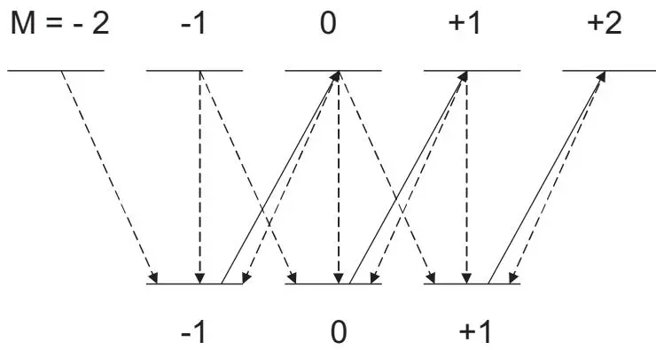
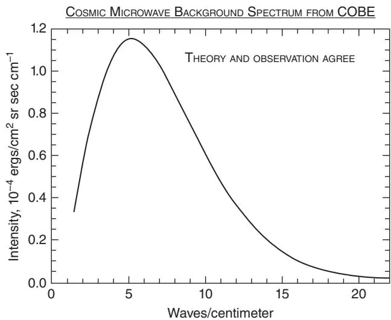
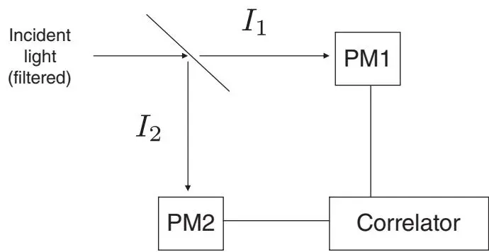
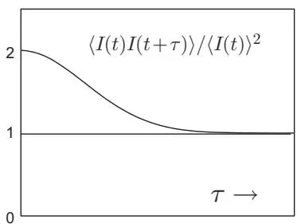
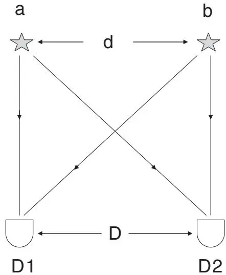

# 原子与光：半经典理论（Atoms in Light: Semiclassical Theory）

在本章中，我们将在电偶极近似（electric dipole approximation）和半经典辐射理论（semiclassical radiation theory）框架下阐述原子与光学场的相互作用。在半经典理论中，物质用量子力学处理，而场用经典 Maxwell 方程组描述。我们将展示，最熟悉的光电效应实验事实无需借助光的量子（光子）性质就能得到很好的描述。我们推导 Kramers–Heisenberg 色散公式，并回顾原子的二能级模型和光学 Bloch 方程——所有这些都在半经典理论范围内。作为第 3 章中场量子化的前奏，我们回顾黑体辐射的一些显著特征及其由 Einstein 做出的精彩分析，这为光的量子性质提供了一些最有力的证据。Einstein 的涨落公式被用于解释 Hanbury Brown–Twiss 实验中测量到的”光子聚束”（photon bunching），这标志着现代量子光学的开端。

## 2.1 原子-场相互作用（Atom–Field Interaction）

为简单起见，考虑单电子原子。带负电 e 的电子和带正电 e 的原子核定义了一个电偶极矩 $\mathbf{d} = e \mathbf{x}$，其中 x 是从原子核指向电子的矢量。暂且假设原子核固定在点 $\mathbf{R} = 0$，并且电子位移 x 相比于所关注的场波长很小——这在光学波长下是极好的近似。那么，在外加电场 E 中原子的相互作用 Hamilton 量可以取为电偶极子形式：

$$
H_{\mathrm{I}} (t) = - \mathbf{d} \cdot \mathbf{E} (t)\tag{2.1.1}
$$

这是经典电磁学中熟知的形式。d 是一个量子力学算符，而半经典理论中的电场 $\mathbf{E} ( t )$ 是一个指定的普通时间函数，而非算符。

在量子光学中，通常仅用原子的能级和跃迁电偶极矩来表征原子就足够了。令 $H_{0}$ 为电子在原子核 Coulomb 场中的 Hamilton 量，$H_{0}$ 的本征态和本征值分别记为 $| i \rangle$ 和 $E_{i}$：$H_{0} | i \rangle = E_{i} | i \rangle$。态 $| i \rangle$ 构成完备集，$\sum_{i} | i \rangle \langle i | = 1$，因此我们可以写出

$$
H_{0} = \left(\sum_{i} | i \rangle \langle i |\right) H_{0} \left(\sum_{j} | j \rangle \langle j |\right) = \sum_{i} \sum_{j} | i \rangle E_{j} \langle i | j \rangle \langle j | = \sum_{i} E_{i} | i \rangle \langle i |,\tag{2.1.2}
$$

其中我们利用了 Hermitian 算符 $H_{0}$ 的不同本征值对应的本征态正交的定理（并假设归一化到单位一）：$\langle i \vert j \rangle = \delta_{i j}$，即 Kronecker delta。类似地，

$$
\mathbf{d} = \left(\sum_{i} | i \rangle \langle i |\right) \mathbf{d} \left(\sum_{j} | j \rangle \langle j |\right) = \sum_{i} \sum_{j} \mathbf{d} _{i j} | i \rangle \langle j |.\tag{2.1.3}
$$

$\mathbf{d} _{i j} = \langle i | \mathbf{d} | j \rangle$ 是状态 i 和 $| j \rangle$ 之间的电偶极矩阵元（electric dipole matrix element）：

$$
\mathbf{d} _{i j} = e \int d^{3} x \phi_{i} ^{*} (\mathbf{x}) \mathbf{x} \phi_{j} (\mathbf{x}),\tag{2.1.4}
$$

其中 $\Phi_{i} ( \mathbf{x} ) = \langle \mathbf{x} | i \rangle$ 是能量本征值为 $E_{i}$ 的电子态的 Schrödinger 波函数（Schrödinger wave function）。 因此，描述指定电场 $\mathbf{E} ( t )$ 中原子的 Hamilton 量为

$$
H = H_{0} + H_{\mathrm{I}} = \sum_{i} E_{i} | i \rangle \langle i | - \sum_{i, j} \mathbf{d} _{i j} \cdot \mathbf{E} (t) | i \rangle \langle j |.\tag{2.1.5}
$$

量子系统的时间变化可以用不同的方式或”绘景”（picture）来描述，所有这些绘景都涉及满足下式的时间演化算符 $U ( t )$：

$$
i \hbar \frac{\partial U}{\partial t} = H U.\tag{2.1.6}
$$

$U ( t )$ 是幺正算符：$U^{\dagger} ( t ) U ( t ) = U ( t ) U^{\dagger} ( t ) = 1$，这由 H 是 Hermitian 算符 $( H^{\dagger} = H )$ 可得。

Hamilton 量的所有本征向量构成完备集这一假设对我们是合理的：完备性是任何从下方有界但从上方无界的 Hermitian 算符的本征向量的性质。1 如果对于任意态矢量 $\Psi$，比值 $\langle \Psi | H | \Psi \rangle / \langle \Psi | \Psi \rangle$ 大于某个固定数，则称算符 H 从下方有界。如果对于任意实数 R，存在 $\Psi$ 使得 $\langle \Psi | H | \Psi \rangle / \langle \Psi | \Psi \rangle > R$，则称它从上方无界。对于在有限维 d 空间中作用的 Hermitian 算符 H，完备性来自 H 有 d 个正交（因此线性独立）的本征向量。我们无需区分 Hermitian 算符和自伴算符。

现在简要概述 Schrödinger 绘景、相互作用绘景和 Heisenberg 绘景。

## 2.1.1 Schrödinger 绘景（Schrödinger Picture）

在 Schrödinger 绘景中，系统的态矢量 $| \psi ( t ) \rangle$ 从 $t = 0$ 开始随时间演化为

$$
| \psi (t) \rangle = U (t) | \psi (0) \rangle ,\tag{2.1.7}
$$

且 (2.1.6) 蕴含含时 Schrödinger 方程

$$
i \hbar \frac{\partial}{\partial t} | \psi \rangle = H | \psi \rangle = [ H_{0} + H_{\mathrm{I}} (t) ] | \psi \rangle .\tag{2.1.8}
$$

幺正时间演化意味着 $\langle \Psi ( t ) | \Psi ( t ) \rangle = \langle \Psi ( 0 ) | \Psi ( 0 ) \rangle$，当 $| \psi ( 0 ) \rangle$ 适当归一化时等于 1。因此，幺正时间演化确保了”概率守恒”。

将 $| \psi ( t ) \rangle$ 按未扰 Hamilton 量 $H_{0}$ 的（完备）本征态展开通常很方便：

$$
| \psi (t) \rangle = \sum_{i} c_{i} (t) | i \rangle .\tag{2.1.9}
$$

于是，(2.1.8) 和态 $| i \rangle$ 的正交归一性给出展开系数 $c_{i} ( t )$ 满足的常微分方程：

$$
i \hbar \dot{c} _{i} (t) = E_{i} c_{i} (t) + \sum_{j} \langle i | H_{\mathrm{I}} (t) | j \rangle c_{j} (t).\tag{2.1.10}
$$

$| c_{i} ( t ) | ^{2}$ 被解释为 t 时刻单次测量发现系统处于态 $| i \rangle$ 的概率，而 $\sum_{i} | c_{i} ( t ) | ^{2} = \sum_{i} | c_{i} ( 0 ) | ^{2} = 1$ 由 $U ( t )$ 的幺正性保证。Schrödinger 方程的 (2.1.10) 形式在只有少数几个态 $| i \rangle$ 具有显著占据概率时特别有用，因为此时我们可以用少量耦合的常微分方程来近似。

## 2.1.2 相互作用绘景（Interaction Picture）

如果将时间演化算符写为

$$
U (t) = U_{0} (t) u (t),\tag{2.1.11}
$$

其中 $U_{0} ( t )$ 满足 $i \hbar \partial U_{0} / \partial t = H_{0} U_{0}$，是未扰系统的（幺正）时间演化算符，那么由 (2.1.6) 我们得到 $u ( t )$ 的方程：

$$
i \hbar \frac{\partial u}{\partial t} = U_{0} ^{\dagger} (t) H_{\mathrm{I}} (t) U_{0} (t) u (t) = h_{\mathrm{I}} (t) u (t).\tag{2.1.12}
$$

$h_{\mathrm{I}} ( t )$ 是相互作用绘景中的相互作用 Hamilton 量。如果假设相互作用在 $t = 0$ 时刻开始，那么 (2.1.11) 意味着 $u ( 0 ) = 1$，并且 (2.1.12) 具有形式解

$$
u (t) = 1 + \frac{1}{i \hbar} \int_{0} ^{t} d t^{\prime} h_{\mathrm{I}} (t^{\prime}) + \left(\frac{1}{i \hbar}\right) ^{2} \int_{0} ^{t} d t^{\prime} \int_{0} ^{t^{\prime}} d t^{\prime \prime} h_{\mathrm{I}} (t^{\prime}) h_{\mathrm{I}} (t^{\prime \prime}) + \dots\tag{2.1.13}
$$

相互作用绘景中的态矢量 $| \psi_{I} ( t ) \rangle$ 与 Schrödinger 绘景中的态矢量 $| \psi ( t ) \rangle$ 通过 $| \Psi_{I} ( t ) \rangle = U_{0} ^{\dagger} ( t ) | \Psi ( t ) \rangle = u ( t ) | \Psi ( 0 ) \rangle = u ( t ) | \Psi_{I} ( 0 ) \rangle$ 相联系，并满足

$$
i \hbar \frac{\partial}{\partial t} | \psi_{I} (t) \rangle = h_{I} (t) | \psi_{I} (t) \rangle .\tag{2.1.14}
$$

相互作用绘景便于微扰计算跃迁概率。如果系统初始处于态 i（未扰 Hamilton 量的一个本征态），则 t 时刻它处于未扰 Hamilton 量的本征态 $| f \rangle$ 的概率振幅为

$$
\langle f | \psi (t) \rangle = \langle f | U (t) | i \rangle = \langle f | U_{0} (t) u (t) | i \rangle = e^{- i E_{f} t / \hbar} \langle f | u (t) | i \rangle ,\tag{2.1.15}
$$

从初态到末态的跃迁概率为

$$
p_{i \rightarrow f} (t) = | \langle f | \psi (t) \rangle | ^{2} = | \langle f | u (t) | i \rangle | ^{2} = | \langle f | \psi_{I} (t) \rangle | ^{2}.\tag{2.1.16}
$$

因此，对微扰级数 (2.1.13) 取最低阶，

$$
\begin{array}{r l} & p_{i \to f} (t) \cong \frac{1}{\hbar^{2}} \left| \int_{0} ^{t} d t^{\prime} \langle f | h_{\mathrm{I}} (t^{\prime}) | i \rangle \right| ^{2} \\ & \quad = \frac{1}{\hbar^{2}} \left| \int_{0} ^{t} d t^{\prime} \langle f | U_{0} ^{\dagger} (t^{\prime}) H_{\mathrm{I}} (t^{\prime}) U_{0} (t^{\prime}) | i \rangle \right| ^{2} \\ & \quad = \frac{1}{\hbar^{2}} \left| \int_{0} ^{t} d t^{\prime} e^{i (E_{f} - E_{i}) t^{\prime} / \hbar} \langle f | H_{\mathrm{I}} (t^{\prime}) | i \rangle \right| ^{2}. \end{array}\tag{2.1.17}
$$

## 2.1.3 海森堡绘景（Heisenberg Picture）

t 时刻对应于 Hermitian 算符 A 的动力学变量的期望值为

$$
\langle \psi (t) | A | \psi (t) \rangle = \langle \psi (0) | U^{\dagger} (t) A U (t) | \psi (0) \rangle = \langle \psi (0) | A_{H} (t) | \psi (0) \rangle .\tag{2.1.18}
$$

$A_{H} ( t ) = U^{\dagger} ( t ) A U ( t ) = U^{\dagger} ( t ) A_{H} ( 0 ) U ( t )$ 是海森堡绘景中的算符。在该绘景中，随时间演化的是算符而非态矢量。由 (2.1.6) 可知，$A_{H} ( t )$ 的时间演化服从海森堡运动方程

$$
i \hbar \frac{d A_{H}}{d t} = A_{H} H - H A_{H} = [ A_{H}, H ],\tag{2.1.19}
$$

这里假设 A 没有显式给定的时间依赖关系。如果 A 确实具有显式时间依赖关系，则 (2.1.19) 替换为更一般的时间演化方程

$$
i \hbar \frac{d A_{H}}{d t} = [ A_{H}, H ] + i \hbar \frac{\partial A_{H}}{\partial t}.\tag{2.1.20}
$$

海森堡绘景的一个优点在于，当存在对应的经典系统时，海森堡方程在形式上与相应的经典方程相似。这一特点在描述光传播时尤其具有吸引力，因为此时场算符的海森堡方程在形式上与基于经典 Maxwell 方程组的方程相似，因此有助于进行物理解释，并且在许多情况下可以像经典一样诠释。

## 2.2 为什么采用电偶极相互作用？（Why the Electric Dipole Interaction?）

由矢量势 A 完全表征的电磁场中带电粒子的相互作用 Hamilton 量通常取为

$$
H_{\mathrm{I}} = - \frac{e}{m} \mathbf{A} \cdot \mathbf{p} + \frac{e^{2}}{2 m} \mathbf{A} ^{2},\tag{2.2.1}
$$

其中 e 和 m 分别是粒子的电荷和质量，A 是其位置 x 处的矢量势。由于[第4章](ch04.md)将要讨论的原因，这通常被称为最小耦合相互作用。但原子-场相互作用经常被假设为电偶极形式 (2.1.1)。使用该形式的计算往往比最小耦合形式更容易，至少在偶极近似合理时是这样；我们将对此的讨论推迟到[第4章](ch04.md)。在此，我们展示在半经典理论中如何从最小耦合形式推导出电偶极形式的相互作用。

首先回忆 (2.2.1) 来自电场 E 中带电粒子的 Lagrangian

$$
L = \frac{1}{2} m \mathbf{v} ^{2} + e \mathbf{A} \cdot \mathbf{v}\tag{2.2.2}
$$

$( {\bf E} = - \partial{\bf A} / \partial t , {\bf B} = \nabla{\times} {\bf A} )$ 。此 Lagrangian 给出了粒子正确的运动方程。也就是说，最小作用量原理

$$
\frac{d}{d t} \left(\frac{\partial L}{\partial \dot{x} _{k}}\right) - \frac{\partial L}{\partial x_{k}} = 0,\tag{2.2.3}
$$

与 Lagrangian (2.2.2) 一起蕴含

$$
m \ddot{\mathbf{x}} = e \mathbf{E} + e \mathbf{v} \times \mathbf{B}.\tag{2.2.4}
$$

相互作用 Hamilton 量 (2.2.1) 由以下识别得到

$$
H = \sum_{k} \dot{x} _{k} \frac{\partial L}{\partial \dot{x} _{k}} - L = \sum_{k} p_{k} \dot{x} _{k} - L,\tag{2.2.5}
$$

其中 $p_{k} = \partial L / \partial \dot{x} _{k}$ 是 $x_{k}$ 的共轭动量。具体地，$\mathbf{p} = m \mathbf{\mathbf{v}} + e \mathbf{A}$，且

$$
H = (m \mathbf{v} + e \mathbf{A}) \cdot \mathbf{v} - (\frac{1}{2} m \mathbf{v} ^{2} + e \mathbf{A} \cdot \mathbf{v}) = \frac{1}{2} m \mathbf{v} ^{2} = \frac{1}{2 m} (\mathbf{p} - e \mathbf{A}) ^{2} = \frac{\mathbf{p} ^{2}}{2 m} + H_{\mathrm{I}}.\tag{2.2.6}
$$

对于粒子位移远小于场存在显著变化的距离的情况，将 A 取在粒子运动区域中心处通常是一个很好的近似。于是，我们将 $\mathbf{A} ( \mathbf{x} , t )$ 替换为仅为时间函数的 ${\bf A} ( t )$：

$$
L = \frac{1}{2} m \mathbf{v} ^{2} + e \mathbf{A} (t) \cdot \mathbf{v},\tag{2.2.7}
$$

$$
\mathbf{p} = m \mathbf{v} + e \mathbf{A} (t),\tag{2.2.8}
$$

$$
H = \frac{\mathbf{p} ^{2}}{2 m} - \frac{e}{m} \mathbf{A} (t) \cdot \mathbf{p} + \frac{e^{2}}{2 m} \mathbf{A} ^{2} (t),\tag{2.2.9}
$$

$$
m \ddot{\mathbf{x}} = - e \dot{\mathbf{A}} (t) = e \mathbf{E} (t).\tag{2.2.10}
$$

接下来回顾，根据最小作用量原理，我们可以添加一个时间导数 $( d / d t ) S ( \mathbf{x} , t )$ 到 $L$ 而不影响任何物理。（更准确地说，$\begin{array} {r} {\int_{t_{1}} ^{t_{2}} d t L ( {\bf x} , \dot{{\bf x}} , t )} \end{array}$ 取驻值的条件——Hamilton 原理——在 $L \to L + d S / d t$ 时不变。）令 $S ( \mathbf{x} , t ) = - e \mathbf{A} ( t ) \cdot \mathbf{x}$，并考虑 (2.2.7) 的替代 Lagrangian，它同样有效

$$
\begin{array}{r l} & L^{\prime} = \frac{1}{2} m \mathbf{v} ^{2} + e \mathbf{A} (t) \cdot \mathbf{v} + \frac{d}{d t} [ - e \mathbf{A} (t) \cdot \mathbf{x} ] = \frac{1}{2} m \mathbf{v} ^{2} - e \dot{\mathbf{A}} (t) \cdot \mathbf{x} \\ & \quad = \frac{1}{2} m \mathbf{v} ^{2} + e \mathbf{x} \cdot \mathbf{E} (t). \end{array}\tag{2.2.11}
$$

由此 Lagrangian 得到 $p_{k} = \partial L^{\prime} / \partial \dot{x} _{k} = m v_{k}$，即

$$
\mathbf{p} = m \mathbf{v},\tag{2.2.12}
$$

和

$$
H^{\prime} = m \mathbf{v} \cdot \mathbf{v} - L^{\prime} = m \mathbf{v} ^{2} - [ \frac{1}{2} m \mathbf{v} ^{2} + e \mathbf{x} \cdot \mathbf{E} (t) ] = \frac{\mathbf{p} ^{2}}{2 m} - e \mathbf{x} \cdot \mathbf{E} (t),\tag{2.2.13}
$$

这蕴含形式为 (2.1.1) 的电偶极相互作用。注意该 Hamilton 量中的 p 与由 (2.2.12) 定义的力学或”动能”动量 mv 相同。而在原始 Hamilton 量 H 中，$\mathbf{p} = m \mathbf{\mathbf{v}} + e \mathbf{A} ( t )$（见 (2.2.8)）不是动能动量，而是动能动量加上动量 $e \mathbf{A} ( t )$

上述论证证明了经典描述的带电粒子在电磁场中相互作用电偶极形式的合理性。为了将其扩展到半经典理论，我们从指定矢量势 A(t) 中带电粒子的 Schrödinger 方程出发，现在我们还包含标量势 $V ( \mathbf{x} )$

$$
i \hbar \frac{\partial}{\partial t} | \psi \rangle = \left[ \frac{\mathbf{p} ^{2}}{2 m} + V (\mathbf{x}) - \frac{e}{m} \mathbf{A} (t) \cdot \mathbf{p} + \frac{e^{2}}{2 m} \mathbf{A} ^{2} (t) \right] | \psi \rangle = H | \psi \rangle .\tag{2.2.14}
$$

我们通过以下方式定义一个新的态矢量 $\left| \psi^{\prime} \right.$

$$
| \psi \rangle = e^{- i S (\mathbf{x}, t) / \hbar} | \psi^{\prime} \rangle = e^{i e \mathbf{A} (t) \cdot \mathbf{x} / \hbar} | \psi^{\prime} \rangle = \mathcal{U} (\mathbf{x}, t) | \psi^{\prime} \rangle .\tag{2.2.15}
$$

于是，(2.2.14) 变为

$$
\begin{array}{r} i \hbar \mathcal{U} (\mathbf{x}, t) \left[ \frac{i e}{\hbar} \dot{\mathbf{A}} (t) \cdot \mathbf{x} + \frac{\partial}{\partial t} \right] | \psi^{\prime} \rangle = \big [ \frac{\mathbf{p} ^{2}}{2 m} + V (\mathbf{x}) - \frac{e}{m} \mathbf{A} (t) \cdot \mathbf{p} \\ + \frac{e^{2}}{2 m} \mathbf{A} ^{2} (t) ] \mathcal{U} (\mathbf{x}, t) | \psi^{\prime} \rangle , \end{array}\tag{2.2.16}
$$

或

$$
\begin{array}{r} e \mathbf{x} \cdot \mathbf{E} (t) | \psi^{\prime} \rangle + i \hbar \frac{\partial}{\partial t} | \psi^{\prime} \rangle = \mathcal{U} ^{\dagger} (\mathbf{x}, t) \big [ \frac{\mathbf{p} ^{2}}{2 m} + V (\mathbf{x}) - \frac{e}{m} \mathbf{A} (t) \cdot \mathbf{p} \\ + \frac{e^{2}}{2 m} \mathbf{A} ^{2} (t) \big ] \mathcal{U} (\mathbf{x}, t) | \psi^{\prime} \rangle , \end{array}\tag{2.2.17}
$$

这来自 $\mathcal{U}$ 的幺正性：$\mathcal{U} ^{\dagger} ( \mathbf{x} , t ) \mathcal{U} ( \mathbf{x} , t ) = \mathcal{U} ( \mathbf{x} , t ) \mathcal{U} ^{\dagger} ( \mathbf{x} , t ) = 1$ 。由一般算符恒等式

$$
e^{B} C e^{- B} = C + [ B, C ] + \frac{1}{2 !} [ B, [ B, C ] ] + \dots\tag{2.2.18}
$$

我们得到

$$
\mathcal{U} ^{\dagger} (\mathbf{x}, t) \mathbf{p} \mathcal{U} (\mathbf{x}, t) = \mathbf{p} + e \mathbf{A} (t)\tag{2.2.19}
$$

以及

$$
i \hbar \frac{\partial}{\partial t} | \psi^{\prime} \rangle = \left[ \frac{\mathbf{p} ^{2}}{2 m} + V (\mathbf{x}) - e \mathbf{x} \cdot \mathbf{E} (t) \right] | \psi^{\prime} \rangle = H^{\prime} | \psi^{\prime} \rangle ,\tag{2.2.20}
$$

这正是含电偶极相互作用 Hamilton 量 (2.1.1) 的 Schrödinger 方程。2 当场量子化时也可以进行类似的变换，只不过在变换后的 Hamilton 量中出现了一个附加项（[第4章](ch04.md)）。

出现在 Hamilton 量 (2.2.20) 中的算符 p 不仅是满足 $[ x_{i} , p_{j} ] = i \hbar \delta_{i j}$ 且在态矢量的坐标表示中取形式 $( \hbar / i ) \nabla$ 的正则动量；它同时也是”动能”（或”力学”）动量 mv = mẋ，即 $m \dot{\mathbf{x}} = m \partial H^{\prime} / \partial \mathbf{p} = \mathbf{p} ,$

而 Hamilton 量 (2.2.14) 中的算符 p 虽然同样是正则动量，但不是动能动量，因为在该 Hamilton 量中，$\mathbf{p} = m \mathbf{\mathbf{v}} + e \mathbf{A} ( t )$（见 (2.2.8)）。

自然会产生一个问题：原子的初始 $( t = 0 )$ 态，例如氢原子基态波函数 $\Phi_{0} ( \mathbf{r} ) = \langle \mathbf{r} | \Phi_{0} \rangle =$ $( \pi a_{0} ^{3} ) ^{- 1 / 2} e^{- r / a_{0}}$ （其中 $a_{0}$ 是 Bohr 半径），应该与 (2.2.14) 中的初始 ψ 相关联，还是与 (2.2.20) 中的初始 $\left| \psi^{\prime} \right.$ 相关联？再次回忆，正是正则动量 p（满足 $[ x_{i} , p_{j} ] = i \hbar \delta_{i j} )$ 在坐标表示中取形式 $( \hbar / i ) \nabla$。当我们根据 (2.2.20) 表述原子-场相互作用时，正则动量为 $\mathbf{p} = m \mathbf{v}$（见 (2.2.12)），且

$$
\langle \psi^{\prime} (0) | m \mathbf{v} | \psi^{\prime} (0) \rangle = \int d^{3} r \phi_{0} ^{*} (\mathbf{r}) m \frac{\hbar}{i} \nabla \phi_{0} (\mathbf{r}) = 0,\tag{2.2.21}
$$

如果我们取初始态 $\left| \Psi^{\prime} ( 0 ) \right.$ 为 $\left| \Phi_{0} \right.$。这符合预期：原子基态的平均电子速度为零。但在 Hamilton 量 (2.2.14) 中，正则动量 p 等于 $m \mathbf{v} + e \mathbf{A} ( t )$（见 (2.2.8)），如果我们取 $| \Psi ( 0 ) \rangle = | \Phi_{0} \rangle$，则这通常意味着非零（且可能依赖于规范）的平均电子速度 $\langle \Psi ( 0 ) | m \mathbf{v} | \Psi ( 0 ) \rangle$。为了在使用 (2.2.14) 时得到所需的结果 $\langle m \mathbf{v} \rangle = 0$，我们必须转而取初始态矢量为变换后的态 $| \Psi ( 0 ) \rangle = e^{i e \mathbf{A} ( t ) \cdot \mathbf{x} / \hbar} | \Psi^{\prime} ( 0 ) \rangle = e^{i e \mathbf{A} ( t ) \cdot \mathbf{x} / \hbar} | \Phi_{0} \rangle$，正如 (2.2.15) 所要求的。3 于是，

$$
\begin{array}{r l} & {\langle \psi (0) | m \mathbf{v} | \psi (0) \rangle = \langle | \psi^{\prime} (0) | e^{- i e \mathbf{A} (t) \cdot \mathbf{x} / \hbar} [ \mathbf{p} - e \mathbf{A} (t) ] e^{i e \mathbf{A} (t) \cdot \mathbf{x} / \hbar} | \psi^{\prime} (0) \rangle} \\ & {\qquad = \langle \psi^{\prime} (0) | \mathbf{p} | \psi^{\prime} (0) \rangle = \langle \phi_{0} | \mathbf{p} | \phi_{0} \rangle} \\ & {\qquad = \int d^{3} r \phi_{0} ^{*} (\mathbf{r}) m \frac{\hbar}{i} \nabla \phi_{0} (\mathbf{r}) = 0,} \end{array}\tag{2.2.22}
$$

其中我们使用了 (2.2.19)。这个例子表明，当偶极近似有效时，Hamilton 量的电偶极形式比最小耦合形式更方便。而且由于它涉及电场而非矢量势，原子-场相互作用的电偶极形式现在几乎总是用于量子光学。这将在[第4章](ch04.md)进一步讨论。

更一般地，含时变换 $\vert \Psi \rangle = \mathcal{U} \vert \Psi^{\prime} \rangle$ 将 Schrödinger 方程 $i \hbar ( \partial / \partial t ) | \Psi \rangle = H | \Psi \rangle$ 变换为

$$
i \hbar \frac{\partial}{\partial t} | \psi^{\prime} \rangle = \big (\mathcal{U} ^{\dagger} H \mathcal{U} - i \mathcal{U} ^{\dagger} \frac{\partial \mathcal{U}}{\partial t} \big) | \psi^{\prime} \rangle = H^{\prime} | \psi^{\prime} \rangle .\tag{2.2.23}
$$

Hamilton 量 $H^{\prime}$ 显然不仅仅是 $H$ 的幺正变换。4 例如，

$$
\langle \psi | H | \psi \rangle = \langle \psi^{\prime} | \mathcal{U} ^{\dagger} H \mathcal{U} | \psi^{\prime} \rangle \neq \langle \psi^{\prime} | H^{\prime} | \psi^{\prime} \rangle .\tag{2.2.24}
$$

对于我们所考虑的变换——最小耦合 Hamilton 量替换为电偶极 Hamilton 量——有

$$
\langle \psi | H | \psi \rangle = \langle \psi | \big [ \frac{1}{2 m} (\mathbf{p} - e \mathbf{A}) ^{2} + V (\mathbf{x}) \big ] | \psi \rangle = \langle \psi^{\prime} | \big [ \frac{\mathbf{p} ^{2}}{2 m} + V (\mathbf{x}) \big ] | \psi^{\prime} \rangle ,\tag{2.2.25}
$$

而

$$
\langle \psi^{\prime} | H^{\prime} | \psi^{\prime} \rangle = \langle \psi^{\prime} | \big [ \frac{\mathbf{p} ^{2}}{2 m} + V (\mathbf{x}) - e \mathbf{x} \cdot \mathbf{E} \big ] | \psi^{\prime} \rangle .\tag{2.2.26}
$$

尽管最小耦合和电偶极 Hamilton 量是等价的，但在近似计算中它们可能显得不同。变换到电偶极形式涉及对易关系 $[ x_{i} , p_{j} ] = i \hbar \delta_{i j}$，这需要无限维 Hilbert 空间。因此，在涉及有限态集的近似计算中，这两种相互作用形式可能给出不同结果并不令人惊讶。回顾 (2.1.10) 之后的评论。

如果 $[ x , p ] = i \hbar$ 在 n 维 Hilbert 空间中成立，则我们有 $\operatorname{Tr} [ x , p ] = n i \hbar$，其中 Tr 表示迹运算，即矩阵对角元之和。但容易证明，对任意两个有限维矩阵 A 和 B，有 $\operatorname{Tr} ( A B - B A ) = 0$。由于 $n i \hbar \neq 0$，我们得出结论：对易关系 $[ x , p ] = i \hbar$ 不能在有限维 Hilbert 空间中成立。

对易关系 $[ x , p ] = i \hbar$ 在历史上是通过所谓的”系统猜测”得到的。让我们简要回顾一下导致矩阵力学以及在抽象向量空间中用算符表示可观测量的那种猜测。Heisenberg 考虑了一个以频率 $\omega_{n}$ 做周期性运动的粒子，其坐标 $x ( t )$ 在经典上可以表示为 Fourier 级数

$$
x (t) = \sum_{m = - \infty} ^{\infty} x (n, m) e^{i m \omega_{n} t}.\tag{2.2.27}
$$

实验观测表明原子中的电子实际上由 Bohr 跃迁频率表征，这提示 Heisenberg，(2.2.27) 在原子领域应替换为

$$
x_{Q} (t) = \sum_{m = - \infty} ^{\infty} x_{Q} (n, n - m) e^{i \omega_{n, n - m} t}.\tag{2.2.28}
$$

当考虑 $x^{2} ( t )$ 时，情况变得更有趣。经典地，

$$
\begin{array}{l} x^{2} (t) = \sum_{m} \sum_{j} x (n, m) x (n, j) e^{i (m + j) \omega_{n} t} = \sum_{k} \sum_{m} x (n, m) x (n, k - m) e^{i k \omega_{n} t} \\ \equiv \sum_{k} (x^{2}) (n, k) e^{i k \omega_{n} t}. \end{array}\tag{2.2.29}
$$

如果再次假设在原子领域中 $k \omega_{n}$ 应替换为 $\omega_{n , n - k}$，且 $( x^{2} ) ( n , k )$ 替换为 $( x_{Q} ^{2} ) ( n , n - k )$，那么 (2.2.29) 应替换为

$$
(x_{Q} ^{2}) (t) = \sum_{k} (x_{Q} ^{2}) (n, n - k) e^{i \omega_{n, n - k} t},\tag{2.2.30}
$$

而问题产生了：$( x_{Q} ^{2} ) ( n , n - k )$ 如何与 (2.2.28) 中出现的系数 $x_{Q} ( n , n - k )$ 相联系？

由于 $\omega_{n , n - k} = \omega_{n , m} + \omega_{m , n - k} , ^{5}$ 与 (2.2.30) 一致，且 $x_{Q} ( n , m )$ 与 $e^{i \omega_{n , m} t}$ 相关联，因此可以假设

$$
(x_{Q} ^{2}) (n, n - k) e^{i \omega_{n, n - k} t} = \sum_{m} x_{Q} (n, m) e^{i \omega_{n, m} t} x_{Q} (m, n - k) e^{i \omega_{m, n - k} t}\tag{2.2.31}
$$

或

$$
(x_{Q} ^{2}) (n, n - k) = \sum_{m} x_{Q} (n, m) x_{Q} (m, n - k),\tag{2.2.32}
$$

这（正如 Max Born 首先认识到的）可识别为矩阵乘法。6 Heisenberg 评论道，”这种组合类型几乎是频率组合规则的必然结果。”7 这反映了他的哲学：将量子力学”完全建立在原则上可观测量之间的关系之上。”8 正是通过这类系统猜测，矩阵力学得以诞生。对易规则 $[ x_{i} , p_{j} ] = i \hbar \delta_{i j}$ 由 Born 和 Jordan 于 1925 年首次推导出来。

## 2.2.1 超越电偶极近似（Beyond the Electric Dipole Approximation）

虽然电偶极近似对于量子光学中的大多数用途都是一个极好的近似，但它绝非普遍有效。我们将简要偏离主题，首先使用最小耦合 Hamilton 量来介绍电偶极近似的主要修正。为明确起见，取矢量势指向 x 方向并仅随 z 空间变化：

$$
H = \mathbf{p} ^{2} / 2 m + V (\mathbf{x}) - \frac{e}{m} A_{x} (z, t) p_{x} + \frac{e^{2}}{2 m} A_{x} ^{2} (z, t).\tag{2.2.33}
$$

在偶极近似的一级修正中，

$$
A_{x} (z, t) \cong A_{x} (0, t) + A_{x} ^{\prime} (0, t) z \quad (A_{x} ^{\prime} \equiv \partial A_{x} / \partial z),\tag{2.2.34}
$$

以及

$$
\begin{array}{r l} & H \cong \mathbf{p} ^{2} / 2 m + V (\mathbf{x}) - \frac{e}{m} \big [ A_{x} (0, t) + A_{x} ^{\prime} (0, t) z \big ] p_{x} + \frac{e^{2}}{2 m} \big [ A_{x} ^{2} (0, t) \\ & \qquad + 2 A_{x} ^{\prime} (0, t) A_{x} (0, t) z \big ], \end{array}\tag{2.2.35}
$$

假设正比于 $[ A_{x} ^{\prime} ( 0 , t ) z ] ^{2}$ 的项可以忽略。此时 x 和 $p_{x}$ 的海森堡运动方程例如为

$$
\dot{x} = p_{x} / m - \frac{e}{m} A_{x} (0, t) - \frac{e}{m} A_{x} ^{\prime} (0, t) z,\tag{2.2.36}
$$

$$
\dot{p} _{x} = - \frac{\partial V}{\partial x},\tag{2.2.37}
$$

因此

$$
m \ddot{x} = - \frac{\partial V}{\partial x} - e \dot{A} _{x} (0, t) - e \frac{\partial A_{x} ^{\prime} (0 , t)}{\partial t} z - e A_{x} ^{\prime} (0, t) \dot{z},\tag{2.2.38}
$$

或，由于 $E_{x} = - \dot{A} _{x}$，且 $B_{y} = \partial A_{x} / \partial z = A_{x} ^{\prime}$，

$$
m \ddot{x} = - \frac{\partial V}{\partial x} + e E_{x} (0, t) + e E_{x} ^{\prime} (0, t) z + e (\mathbf{v} \times \mathbf{B}) _{x}.\tag{2.2.39}
$$

我们仍可以进行变换 (2.2.15)，将最小耦合形式的 Hamilton 量转换为”多极”形式，但现在我们必须考虑矢量势的空间变化。我们跳过琐碎的细节，只给出变换后 Hamilton 量的结果：

$$
H^{\prime} = \mathbf{p} ^{2} / 2 m + V (\mathbf{x}) - e x E_{x} (0, t) - Q_{x z} E_{x} ^{\prime} (0, t) - \mu_{y} B_{y} (0, t),\tag{2.2.40}
$$

这比 (2.2.35) 稍微复杂一些。这里，

$$
Q_{x z} = \frac{e}{2} x z\tag{2.2.41}
$$

和

$$
\mu_{y} = \frac{e}{2 m} (z p_{x} - x p_{z})\tag{2.2.42}
$$

分别与电四极矩和磁偶极矩贡献相关联。从 $H^{\prime}$ 得到的 x 和 $p_{x}$ 的海森堡运动方程为

$$
\dot{x} = p_{x} / m - \frac{e}{2 m} z B_{y},\tag{2.2.43}
$$

以及

$$
\dot{p} _{x} = - \frac{\partial V}{\partial x} + e E_{x} (0, t) + \frac{e}{2} z E_{x} ^{\prime} (0, t) - \frac{e}{2 m} p_{z} B_{y},\tag{2.2.44}
$$

或

$$
m \ddot{x} = - \frac{\partial V}{\partial x} + e E_{x} (0, t) + \frac{e}{2} z E_{x} ^{\prime} (0, t) - \frac{e}{2 m} p_{z} B_{y} - \frac{e}{2} \dot{z} B_{y} - \frac{e}{2} z \dot{B} _{y}.\tag{2.2.45}
$$

由 $\nabla \times \mathbf{E} = - \dot{\mathbf{B}}$

$$
\frac{e}{2} z \dot{B} _{y} = - \frac{e}{2} z E_{x} ^{\prime} (0, t)\tag{2.2.46}
$$

和

$$
m \ddot{x} = - \frac{\partial V}{\partial x} + e E_{x} (0, t) + e E_{x} ^{\prime} (0, t) z + e (\mathbf{v} \times \mathbf{B}) _{x},\tag{2.2.47}
$$

与从最小耦合 Hamilton 量得到的结果一致。

## 2.3 半经典辐射理论（Semiclassical Radiation Theory）

Hamilton 量 (2.1.5) 为半经典辐射理论提供了基础，在该理论中，原子按量子理论处理，而场按经典 Maxwell 方程组处理。虽然从根本上讲是不自洽的，但半经典辐射理论是处理光与物质相互作用的一种非常有用的方法——而且通常完全足够。例如，正如我们现在将要讨论的，它正确描述了光电效应的主要特征，而这些特征通常被认为没有光子就无法解释。

假设施加在原子的电场为

$$
\mathbf{E} (t) = \frac{1}{2} \big (\mathbf{E} _{0} e^{- i \omega t} + \mathbf{E} _{0} ^{*} e^{i \omega t} \big),\tag{2.3.1}
$$

因此

$$
H_{\mathrm{I}} (t) = - \frac{1}{2} \mathbf{d} \cdot \big (\mathbf{E} _{0} e^{- i \omega t} + \mathbf{E} _{0} ^{*} e^{i \omega t} \big). ^{9}\tag{2.3.2}
$$

于是，跃迁概率 (2.1.17) 为

$$
p_{i \rightarrow f} (t) \cong \frac{1}{4 \hbar^{2}} \Big | \mathbf{d} _{f i} \cdot \mathbf{E} _{0} \int_{0} ^{t} d t^{\prime} e^{i (\omega_{f i} - \omega) t^{\prime}} + \mathbf{d} _{f i} \cdot \mathbf{E} _{0} ^{*} \int_{0} ^{t} d t^{\prime} e^{i (\omega_{f i} + \omega) t^{\prime}} \Big | ^{2},\tag{2.3.3}
$$

其中 $\omega_{f i} = ( E_{f} - E_{i} ) / \hbar$ 是原子初态与末态之间的（角）Bohr 跃迁频率。现在，

$$
\int_{0} ^{t} d t^{\prime} e^{i (\omega_{f i} \pm \omega) t^{\prime}} = e^{i (\omega_{f i} \pm \omega) t / 2} \frac{\sin [ \frac{1}{2} (\omega_{f i} \pm \omega) t ]}{\frac{1}{2} (\omega_{f i} \pm \omega)},\tag{2.3.4}
$$

并且，对于向高能态 $\left( \omega_{f i} > 0 \right)$ 的跃迁，当 $\omega \approx \omega_{f i}$ 时，带 + 号的项与带 - 号的项相比可以忽略：

$$
p_{i \rightarrow f} (t) \cong \frac{1}{4 \hbar^{2}} | \mathbf{d} _{f i} \cdot \mathbf{E} _{0} | ^{2} \frac{\sin^{2} [ \frac{1}{2} (\omega_{f i} - \omega) t ]}{[ \frac{1}{2} (\omega_{f i} - \omega) ] ^{2}}.\tag{2.3.5}
$$

这里假设初态 i 近似未耗尽。

通常存在一个可能的末态连续分布；例如，在光电离中就是如此。那么，从态 i 出发的总跃迁概率，即从 i 到所有可能末态 $f_{i}$ 的跃迁概率之和，为

$$
p_{i f} (t) \cong \frac{1}{4 \hbar^{2}} \int d E_{f} \rho_{E} (E_{f}) | {\bf d} _{f i} \cdot{\bf E} _{0} | ^{2} \frac{\sin^{2} [ \frac{1}{2} (\omega_{f i} - \omega) t ]}{[ \frac{1}{2} (\omega_{f i} - \omega) ] ^{2}},\tag{2.3.6}
$$

其中 $\rho_{E} ( E_{f} ) d E_{f}$ 是能量区间 $[ E_{f} , E_{f} + d E_{f} ]$ 内的末态数目。对于足够大的时间 t，使得 (2.3.6) 中的 sinc 函数相比于 $\rho_{E} ( E_{f} ) | \mathbf{d} _{f i} \cdot \mathbf{E} _{0} | ^{2}$ 在 $E_{f} = E_{i} + \hbar \omega$ 附近的变化是尖锐峰化的，

$$
p_{i f} (t) \cong \frac{1}{4 \hbar^{2}} | \mathbf{d} _{f i} \cdot \mathbf{E} _{0} | ^{2} \rho_{E} (E_{i} + \hbar \omega) \hbar \int d \omega_{f i} \frac{\sin^{2} [ \frac{1}{2} (\omega_{f i} - \omega) t ]}{[ \frac{1}{2} (\omega_{f i} - \omega) ] ^{2}}.\tag{2.3.7}
$$

利用

$$
\int_{0} ^{\infty} d \omega_{f i} \frac{\sin^{2} [ \frac{1}{2} (\omega_{f i} - \omega) t ]}{[ \frac{1}{2} (\omega_{f i} - \omega) ] ^{2}} \cong \int_{- \infty} ^{\infty} d \omega_{f i} \frac{\sin^{2} [ \frac{1}{2} (\omega_{f i} - \omega) t ]}{[ \frac{1}{2} (\omega_{f i} - \omega) ] ^{2}} = 2 \pi t,\tag{2.3.8}
$$

我们得到跃迁速率

$$
R_{i f} = \frac{d}{d t} p_{i f} (t) = \frac{\pi}{2 \hbar} | \mathbf{d} _{f i} \cdot \mathbf{E} _{0} | ^{2} \rho_{E} (E_{i} + \hbar \omega),\tag{2.3.9}
$$

这当然正是所考虑例子的 Fermi 黄金规则。

练习 2.1：使用 Schrödinger 绘景推导 (2.3.9)。

这个结果可以应用于光电效应。回忆光电效应中最重要的观测结果是：(1) 光电子的最大动能 $E_{f}$ 是光频率 ω 的线性函数：$E_{f} = \hbar \omega - W$，其中 W 是”功函数”（work function）；(2) 光电流或电子发射速率正比于光强；(3) 光照到表面后电子立即被发射。这些观测结果传统上用能量为 $\hbar \omega$ 的光子来解释，但它们都可以用 (2.3.9) 来解释，而该式是在假设场为经典波的条件下推导出来的。因此，光电子动能对光频率的线性依赖关系来自 (2.3.9) 中对 $E_{f} = \hbar \omega + E_{i}$ 处的末态密度求值：我们对 (2.3.9) 的半经典推导自动得出了能量守恒条件，使得电子能量的改变为 $\hbar \omega$。观测结果 (2) 来自速率 (2.3.9) 正比于 $E_{0} ^{2}$ 从而正比于光强：随着光强度增加，电子发射速率成比例增加。最后，观测结果 (3) 仅仅是 (2.3.9) 是一个速率的推论。我们在推导 (2.3.9) 时确实要求时间 t “足够长”，但只是为了强制执行能量守恒；这一计算方面并非我们的半经典计算所特有，当场量子化时也会出现。

这种对光电效应的半经典解释并没有什么微妙之处，那么为什么光电效应长期以来一直被作为光子存在的证据呢？答案在于光电效应的历史。注意到黑体辐射和其他现象暗示了一个”启发式观点”，即”光的能量在空间中不连续分布”，Einstein 在 1905 年预言了光电效应中辐射频率与遏止电势之间的线性关系。10 这个预言在 1916 年由 Millikan 证实，然而 Millikan 曾一度认为 Einstein 的启发式图像是”鲁莽的”且”几乎已被普遍放弃”。11 Einstein 启发式图像的成功（和简洁性），以及任何纯经典理论都无法解释光电效应的事实，暗示了光量子（物理化学家 G. N. Lewis 于 1926 年命名为光子）对于解释上述观测结果 (1)-(3) 是必要的。前面的讨论表明，正如 P. A. Franken 和 W. E. Lamb, Jr. 特别强调的，这些观测结果都可以由半经典辐射理论解释——物质用量子理论，辐射用经典理论。

当然，半经典辐射理论不能解释光与物质相互作用的所有方面。例如，在光电效应的情况下，它与能量守恒不一致，仅仅是因为场能量的经典表达式不等于某个整数 q 乘以能量 $\hbar \omega$：

$$
\frac{1}{2} \epsilon_{0} \int d^{3} r (\mathbf{E} ^{2} + \mathbf{H} ^{2}) \neq q \hbar \omega .\tag{2.3.10}
$$

半经典理论的失败在自发辐射情况下尤为明显。自发辐射是原子在没有任何外部原因的情况下跃迁到较低能态，电磁场获得能量 $\hbar \omega$ 的过程。自发辐射是我们周围大多数光的来源。它不能用半经典辐射理论描述的原因很简单：在半经典辐射理论中，场的源以及场本身都是普通的”c-数”，而非 Hilbert 空间中的算符。因此，在半经典辐射理论中，例如，激发态原子的电偶极矩的振荡期望值被当作自发辐射的源。但对于处于能量本征态的任何自由原子，这个期望值为零，因为电子和原子核形成的电偶极矩没有择优方向。因此，根据半经典辐射理论，激发态原子不应该自发辐射！半经典辐射理论的这一失败将在[第4章](ch04.md)进一步讨论。

类似地，半经典辐射理论无法解释自发辐射中的反冲，这一效应在超冷气体物理中起着重要作用。因为根据半经典辐射理论，辐射场是从源原子发出的连续电磁波；对于电偶极跃迁，该波具有熟悉的偶极辐射图样，关于原子具有反演对称性。不存在能够”告诉”原子应向哪个方向反冲以保持总动量守恒的优先发射方向。但正如[第2.8节](ch02.md#28-)所讨论的，Planck 谱意味着原子在辐射时必须反冲。

图 2.1 说明了半经典辐射理论的另一个失败。一个原子自发辐射一个对应于能量 $\hbar \omega$ 的单光子的场。该过程有非零概率在 $\mathrm{D_{1}}$ 处探测到一个光子，也有非零概率在 $\mathrm{D_{2}}$ 处探测到一个光子，但在 $\mathrm{D_{1}}$ 和 $\mathrm{D_{2}}$ 同时探测到光子的概率为零。这正是场的量子理论所预言的。然而，在半经典辐射理论中，原子发射的场被经典地描述为连续波。该波的一部分可以在 $\mathrm{D_{1}}$ 处被测量，另一部分可以在 $\mathrm{D_{2}}$ 处被测量，导致在 $\mathrm{D_{1}}$ 和 $\mathrm{D_{2}}$ 同时光电探测的非零概率。这类实验已经完成，结果表明半经典辐射理论的这一预言是不正确的（见[第5.7节](ch05.md#57-)）。

图 2.1 原子在探测器 $\mathrm{D}_{1}$ 和 $\mathrm{D}_{2}$ 存在的情况下发生单次自发辐射事件。在 $\mathrm{D}_{1}$ 处发生光子计数有有限概率，在 $\mathrm{D}_{2}$ 处也有有限概率，但在 $\mathrm{D}_{1}$ 和 $\mathrm{D}_{2}$ 同时计数的概率为零。

## 2.3.1 海森堡绘景中的半经典辐射理论（Semiclassical Radiation Theory in the Heisenberg Picture）

x 和 p 的海森堡运动方程对于计算场对原子的效应不太方便，主要是因为它们通常太难求解。考虑算符 $\sigma_{i j}$，其定义方式是将作用在原子的 Hilbert 空间中的 Schrödinger 绘景算符 A 写为

$$
A = 1 \times A \times 1 = \left(\sum_{i} | i \rangle \langle i |\right) A \left(\sum_{j} | j \rangle \langle j |\right) = \sum_{i, j} \langle i | A | j \rangle | i \rangle \langle j | = \sum_{i, j} A_{i j} \sigma_{i j}.\tag{2.3.11}
$$

我们再次使用了未扰原子 Hamilton 量 $H_{0} = {\mathbf{{p}} ^{2}} / {2 m} + V ( \mathbf{x} )$ 的本征态 $| i \rangle$ 的完备性，并定义了矩阵元 $A_{i j} =$ $\langle i | A | j \rangle$ 和算符 $\sigma_{i j} = | i \rangle \langle j |$。在海森堡绘景中

$$
A_{H} (t) = \sum_{i, j} A_{i j} \sigma_{i j} (t),\tag{2.3.12}
$$

$\sigma_{i j} ( t ) = U^{\dagger} ( t ) \sigma_{i j} U ( t )$。Schrödinger 绘景算符满足对易关系

$$
[ \sigma_{i j}, \sigma_{k \ell} ] = | i \rangle \langle j | k \rangle \langle \ell | - | k \rangle \langle \ell | i \rangle \langle j | = \delta_{j k} \sigma_{i \ell} - \delta_{i \ell} \sigma_{k j}\tag{2.3.13}
$$

这来自于 $H_{0}$ 的不同本征态的正交归一性，并且当然，海森堡绘景算符 $\sigma_{i j} ( t )$ 满足相同的对易关系，这是时间演化算符 $U ( t )$ 的幺正性的结果。

将电偶极 Hamilton 量用 $\sigma$ 算符写出：

$$
\begin{array}{l} H = H_{0} - \mathbf{d} \cdot \mathbf{E} (t) = \sum_{i, j} \langle i | H_{0} | j \rangle \sigma_{i j} - \sum_{i, j} \langle i | \mathbf{d} | j \rangle \cdot \mathbf{E} (t) \sigma_{i j} \\ = \sum_{i} E_{i} \sigma_{i i} - \sum_{i, j} \mathbf{d} _{i j} \cdot \mathbf{E} (t) \sigma_{i j}. \end{array}\tag{2.3.14}
$$

σ 算符的海森堡运动方程 $i \hbar \dot{\sigma} _{i j} = [ \sigma_{i j} , H ]$ 取如下形式

$$
\begin{array}{l} i \hbar \dot{\sigma} _{i j} (t) = \sum_{k} E_{k} [ \sigma_{i j}, \sigma_{k k} ] - \sum_{k, \ell} \mathbf{d} _{k \ell} \cdot \mathbf{E} (t) [ \sigma_{i j}, \sigma_{k \ell} ] \\ = \sum_{k} E_{k} (\delta_{j k} \sigma_{i k} - \delta_{i k} \sigma_{k j}) - \sum_{k, \ell} \mathbf{d} _{k \ell} \cdot \mathbf{E} (t) (\delta_{j k} \sigma_{i \ell} - \delta_{i \ell} \sigma_{k j}) \\ = (E_{j} - E_{i}) \sigma_{i j} - \sum_{k} [ \mathbf{d} _{j k} \cdot \mathbf{E} (t) \sigma_{i k} - \mathbf{d} _{k i} \cdot \mathbf{E} (t) \sigma_{k j} ], \end{array}\tag{2.3.15}
$$

或

$$
\dot{\sigma} _{i j} (t) = - i \omega_{j i} \sigma_{i j} (t) + \frac{i}{\hbar} \sum_{k} [ \mathbf{d} _{j k} \cdot \mathbf{E} (t) \sigma_{i k} (t) - \mathbf{d} _{k i} \cdot \mathbf{E} (t) \sigma_{k j} (t) ],\tag{2.3.16}
$$

其中再次 $\omega_{j i} = ( E_{j} - E_{i} ) / \hbar$。在半经典辐射理论和电偶极近似框架内，这些方程是原子在外加电场 $\mathbf{E} ( t )$ 中时间演化的精确表述。这些方程的解通过 (2.3.12) 给出作用在原子的 Hilbert 空间中的任何海森堡绘景算符。

为了理解 $\sigma_{i j} ( t )$ 本身的物理意义，假设原子在施加场的时刻 $t = 0$ 处于态 $| g \rangle$，考虑期望值

$$
\langle \sigma_{i j} (t) \rangle = \langle g | \sigma_{i j} (t) | g \rangle = \langle g | U^{\dagger} (t) \sigma_{i j} (0) U (t) | g \rangle = \langle g | U^{\dagger} (t) | i \rangle \langle j | U (t) | g \rangle .\tag{2.3.17}
$$

$| \Psi ( t ) \rangle = U ( t ) | g \rangle$ 正是 t 时刻的 Schrödinger 绘景态矢量，因此

$$
\langle \sigma_{i j} (t) \rangle = \langle \psi (t) | i \rangle \langle j | \psi (t) \rangle = a_{i} ^{*} (t) a_{j} (t),\tag{2.3.18}
$$

其中 $a_{i} ( t ) = \langle i | \Psi ( t ) \rangle$ 是 t 时刻发现原子处于其未扰 Hamilton 量能量本征态 i 的概率振幅。特别地，$\langle \sigma_{i i} ( t ) \rangle =$ $\langle g | \sigma_{i i} ( t ) | g \rangle = | a_{i} ( t ) | ^{2}$ 是 t 时刻发现原子处于能量 $E_{i}$ 的本征态 $| i \rangle$ 的概率，前提是原子在施加场时初始处于能量 $E_{g}$ 的本征态 $| g \rangle$。

## 2.3.2 密度矩阵方程（Density-Matrix Equations）

在大量文献中，原子-场相互作用使用密度矩阵处理

$$
\rho = \sum_{\psi} p_{\psi} | \psi \rangle \langle \psi |,\tag{2.3.19}
$$

其中，如[第3章第3.7节](ch03.md#37-)所述，$p_{\Psi}$ 是赋予态 ψ 的概率。由 Schrödinger 方程 $i \hbar | \dot{\Psi} \rangle = H | \Psi \rangle$

$$
i \hbar \dot{\rho} = \sum_{\psi} p_{\psi} (H | \psi \rangle \langle \psi | - | \psi \rangle \langle \psi | H) = [ H, \rho ].\tag{2.3.20}
$$

由此方程，我们发现密度矩阵元 $\rho_{i j} = \langle i | \rho | j \rangle$（其中 i 和 j 同样是未扰原子 Hamilton 量 $H_{0}$ 的本征态）满足

$$
\begin{array}{l} i \hbar \dot{\rho} _{i j} = \sum_{\Psi} p_{\Psi} \left[ \langle i | H | \Psi \rangle \langle \Psi | j \rangle - \langle i | \Psi \rangle \langle \Psi | H | j \rangle \right] \\ = \sum_{\Psi} p_{\Psi} \sum_{k} \left[ \langle i | H | k \rangle \langle k | \Psi \rangle \langle \Psi | j \rangle - \langle i | \Psi \rangle \langle \Psi | k \rangle \langle k | H | j \rangle \right] \\ = \sum_{k} \left[ \langle i | H | k \rangle \rho_{k j} - \rho_{i k} \langle k | H | j \rangle \right], \end{array}\tag{2.3.21}
$$

其中我们使用了完备性关系 $\begin{array} {r} {\sum_{k} | k \rangle \langle k | = 1} \end{array}$。由于

$$
\langle i | H | k \rangle = \langle i | H_{0} | k \rangle - \langle i | {\bf d} \cdot{\bf E} (t) | k \rangle = E_{k} \delta_{i k} - {\bf d} _{i k} \cdot{\bf E} (t),\tag{2.3.22}
$$

同样地，$\langle k | H | j \rangle = E_{j} \delta_{j k} - \mathbf{d} _{k j} \cdot \mathbf{E} ( t )$

$$
\dot{\rho} _{i j} = i \omega_{j i} \rho_{i j} + \frac{i}{\hbar} \sum_{k} \left[ \mathbf{d} _{i k} \cdot \mathbf{E} (t) \rho_{k j} - \rho_{i k} \mathbf{d} _{k j} \cdot \mathbf{E} (t) \right].\tag{2.3.23}
$$

这与 (2.3.16) 不同，但显然具有相同的一般形式。阻尼效应（例如由于自发辐射或碰撞）未包含在 (2.3.16) 和 (2.3.23) 中。12 我们在第 2.7 节的原子二能级模型中包含了阻尼效应，并在[第4.8节](ch04.md#48-)中特别考虑了更一般的”多态原子”情况下自发辐射的效应。方程 (2.3.16) 适用于例如外加场与原子初态的任何跃迁远失谐的情况，或者场是脉冲形式且脉宽远小于任何相关阻尼效应的弛豫时间的情况。即使在这些条件下，这些方程通常也只能在各种近似下解析求解。我们接下来考虑一个这种近似解的例子。

## 2.3.3 Kramers–Heisenberg 色散公式（The Kramers–Heisenberg Dispersion Formula）

取 (2.3.16) 两边的期望值：

$$
\langle \dot{\sigma} _{i j} (t) \rangle = - i \omega_{j i} \langle \sigma_{i j} (t) \rangle + \frac{i}{\hbar} \sum_{k} [ \mathbf{d} _{j k} \cdot \mathbf{E} (t) \langle \sigma_{i k} (t) \rangle - \mathbf{d} _{k i} \cdot \mathbf{E} (t) \langle \sigma_{k j} (t) \rangle ],\tag{2.3.24}
$$

或等价地

$$
\begin{array}{l} \langle \dot{\sigma} _{i j} (t) \rangle = - i \omega_{j i} \langle \sigma_{i j} (t) \rangle + \frac{i}{\hbar} \mathbf{d} _{j i} \cdot \mathbf{E} (t) [ \langle \sigma_{i i} (t) \rangle - \langle \sigma_{j j} (t) \rangle ] \\ \qquad + \frac{i}{\hbar} \sum_{k \neq i} \mathbf{d} _{j k} \cdot \mathbf{E} (t) \langle \sigma_{i k} (t) \rangle - \frac{i}{\hbar} \sum_{k \neq j} \mathbf{d} _{k i} \cdot \mathbf{E} (t) \langle \sigma_{k j} (t) \rangle . \end{array}\tag{2.3.25}
$$

假设这些期望值所参照的初态是原子的状态 i，并且外加场频率远离任何吸收共振，使得原子以高概率保持在这个状态中，因此 $\langle \sigma_{k k} ( t ) \rangle = | a_{k} ( t ) | ^{2} \cong \delta_{i k}$ 。那么，为了计算外加场最低阶的 $\langle \sigma_{i j} ( t ) \rangle$ ，我们只保留 (2.3.25) 右边的前两项，并对于 $i \neq j$ 写出：

$$
\langle \dot{\sigma} _{i j} (t) \rangle \cong - i \omega_{j i} \langle \sigma_{i j} (t) \rangle + \frac{i}{\hbar} \mathbf{d} _{j i} \cdot \mathbf{E} (t).\tag{2.3.26}
$$

我们假设一个单色场，为简化起见，取其为线偏振形式 $\mathbf{E} ( t ) = \mathbf{E} _{0}$ cos $\omega t$ 。于是，

$$
\langle \dot{\sigma} _{i j} (t) \rangle \cong - i \omega_{j i} \langle \sigma_{i j} (t) \rangle + \frac{i}{\hbar} \mathbf{d} _{j i} \cdot \mathbf{E} _{0} \cos \omega t,\tag{2.3.27}
$$

其解为

$$
\langle \sigma_{i j} (t) \rangle = \frac{1}{2 \hbar} \mathbf{d} _{j i} \cdot \mathbf{E} _{0} \left(\frac{e^{- i \omega t}}{\omega_{j i} - \omega} + \frac{e^{i \omega t}}{\omega_{j i} + \omega}\right).\tag{2.3.28}
$$

考虑原子处于状态 i 时的电偶极矩期望值 d(t)。根据 (2.3.12)，

$$
\langle \mathbf{d} (t) \rangle = \sum_{k, \ell} \mathbf{d} _{k \ell} \left\langle \sigma_{k \ell} (t) \right\rangle = \sum_{k, \ell} \mathbf{d} _{k \ell} \left\langle i \mid U^{\dagger} (t) \mid k \right\rangle \left\langle \ell \mid U (t) \mid i \right\rangle .\tag{2.3.29}
$$

注意 d 的对角矩阵元 $\mathbf{d} _{k k}$ 为零：由于库仑势和哈密顿量具有反演对称性，未受扰原子在定态中的电偶极矩期望值必须为零。如果正如我们所假设的，原子以高概率保持在初态 i 中，则我们可以将 (2.3.29) 近似为

$$
\begin{array}{l} \langle \mathbf{d} (t) \rangle = \sum_{k} \mathbf{d} _{k i} \langle i | U^{\dagger} (t) | k \rangle \langle i | U (t) | i \rangle + \sum_{\ell} \mathbf{d} _{i \ell} \langle i | U^{\dagger} (t) | i \rangle \langle \ell | U (t) | i \rangle \\ = \sum_{k} \mathbf{d} _{k i} \langle \sigma_{k i} (t) \rangle + \sum_{k} \mathbf{d} _{i k} \langle \sigma_{i k} (t) \rangle = 2 \mathrm{Re} \left(\sum_{j} \mathbf{d} _{i j} \langle \sigma_{i j} (t) \rangle\right), \end{array}\tag{2.3.30}
$$

以及，由(2.3.28)得，

$$
\begin{array}{c} \langle d_{x} (t) \rangle = \frac{1}{\hbar} \sum_{j} | (\mathbf{d} _{i j}) _{x} | ^{2} \left(\frac{1}{\omega_{j i} - \omega} + \frac{1}{\omega_{j i} + \omega}\right) E_{0} \cos \omega t \\ = \frac{1}{3 \hbar} \sum_{j} | \mathbf{d} _{i j} | ^{2} \left(\frac{1}{\omega_{j i} - \omega} + \frac{1}{\omega_{j i} + \omega}\right) E_{0} \cos \omega t \end{array}\tag{2.3.31}
$$

这是在沿 x 方向偏振的场中，诱导偶极矩期望值的 x 分量；我们再次利用球对称性将 $| ( \mathbf{d} _{i j} ) _{x} | ^{2}$ 替换为 $| \mathbf{d} _{i j} | ^{2} / 3$ 。最后，我们将与状态 i 相关联的极化率 $\alpha_{i} ( \omega )$ 确定为诱导偶极矩期望值与外加场 $\begin{array} {r} {( \langle \mathbf{d} ( t ) \rangle = \langle i \lvert \mathbf{d} ( t ) \rvert i \rangle = \alpha_{i} ( \omega ) \mathbf{E} _{0}} \end{array}$ cos ωt 之间的比例系数：

$$
\alpha_{i} (\omega) = \frac{1}{3 \hbar} \sum_{j} | \mathbf{d} _{i j} | ^{2} \left(\frac{1}{\omega_{j i} - \omega} + \frac{1}{\omega_{j i} + \omega}\right) = \frac{2}{3 \hbar} \sum_{j} | \mathbf{d} _{i j} | ^{2} \frac{\omega_{j i}}{\omega_{j i} ^{2} - \omega^{2}}.\tag{2.3.32}
$$

这就是处于状态 i 的原子的（线性）极化率的 Kramers–Heisenberg 色散公式。它通过公式 $n^{2} ( \omega ) - 1 = N \alpha_{i} ( \omega ) / \epsilon_{0}$ 与色散相联系，其中 $n ( \omega )$ 是每单位体积有 N 个原子（全部处于状态 i）的稀薄介质的折射率。在大多数实际感兴趣的情况下，i 是基态。我们忽略了自发辐射、碰撞或其他线宽展宽效应的任何影响——这些效应的作用是给频率分母 $\omega_{i j} \pm \omega$ 添加虚部；如果场频率与原子任何共振频率 $\omega_{j i}$ 相距足够远，这些虚部对折射率的色散（实）部分的影响可以忽略。当然，一般来说，极化率和折射率都是复数，它们的虚部与场的衰减或放大相关联。

如果我们不假设球对称性，则得到极化率张量 $\tilde{\alpha} ( \omega )$ ，使得当入射场的笛卡尔分量为 $E_{0 v}$ 时，$\langle \mathbf{d} ( t ) \rangle$ 的第 µ 个笛卡尔分量为

$$
\langle d_{\mu} (t) \rangle = \mathrm{Re} \big [ \tilde{\alpha} _{\mu \nu} (\omega) E_{0 \nu} e^{- i \omega t} \big ]\tag{2.3.33}
$$

对于处于状态 $| i \rangle$ 的分子；这里我们遵循重复指标求和约定 $( \nu = 1 , 2 , 3 )$ 。如果我们再次忽略线宽展宽效应，按照上述步骤可得极化率张量为

$$
\tilde{\alpha} _{i, \mu \nu} (\omega) = \tilde{\alpha} _{i, \nu \mu} (- \omega) = \frac{1}{\hbar} \sum_{j} \left[ \frac{(d_{\mu}) _{i j} (d_{\nu}) _{j i}}{\omega_{j i} - \omega} + \frac{(d_{\nu}) _{i j} (d_{\mu}) _{j i}}{\omega_{j i} + \omega} \right].\tag{2.3.34}
$$

当散射体具有球对称性时（如孤立原子的情况），$\tilde{\alpha} ( \omega )$ 是对角的，且 $\tilde{\alpha} _{i , x x} ( \omega ) = \tilde{\alpha} _{i , y y} ( \omega ) = \tilde{\alpha} _{i , z z} ( \omega ) = \alpha_{i} ( \omega )$ ，如 (2.3.32) 所定义。

束缚电子在单色场中的经典模型基于方程

$$
\ddot{\mathbf{x}} + \omega_{0} ^{2} \mathbf{x} = \frac{e}{m} \mathbf{E} _{0} \cos \omega t\tag{2.3.35}
$$

和诱导偶极矩 $e \mathbf{x} = \alpha_{c} ( \omega ) \mathbf{E} _{0}$ cos ωt，直接得到极化率公式

$$
\alpha_{c} (\omega) = \frac{e^{2} / m}{\omega_{0} ^{2} - \omega^{2}} \cong - \frac{e^{2}}{m \omega^{2}}\tag{2.3.36}
$$

在 $\omega \gg \omega_{\mathrm{0}}$ 的极限下（对应第 1.12 节的 Thomson 散射）。假设极化率 (2.3.32) 在高频极限下（此时原子能级的离散性不重要）约化为这一经典结果，可导出

$$
- \frac{2}{3 \hbar \omega^{2}} \sum_{j} | {\bf d} _{i j} | ^{2} \omega_{j i} = - \frac{e^{2}}{m \omega^{2}}, \quad \mathrm{or} \quad \frac{2 m}{3 \hbar} \sum_{j} \omega_{j i} | {\bf x} _{i j} | ^{2} = 1,\tag{2.3.37}
$$

这就是 Thomas–Reiche–Kuhn 求和规则（对于单电子原子），出自早期关于色散量子理论的工作。13

这一求和规则在导出假设 $[ x , p ] = i \hbar$ 的归纳推理中发挥了重要作用。为了理解这一点，考虑对角矩阵元

$$
\begin{array}{l} \langle i | [ x, p ] | i \rangle = \langle i | x 1 p | i \rangle - \langle i | p 1 x | i \rangle = \sum_{j} \langle i | x | j \rangle \langle j | p | i \rangle - \sum_{j} \langle i | p | j \rangle \langle j | x | i \rangle \\ = \sum_{j} x_{i j} p_{j i} - \sum_{j} p_{i j} x_{j i} \end{array}\tag{2.3.38}
$$

对于某个束缚态 $| i \rangle$ 。$p$ 的矩阵元可以与 x 的矩阵元相关联如下：由 $p = m {\dot{x}} = ( m / i \hbar ) [ x , H_{0} ]$ ，

$$
p_{i j} = - \frac{i m}{\hbar} \langle i | x H_{0} - H_{0} x | j \rangle = - \frac{i m}{\hbar} (E_{j} - E_{i}) \langle i | x | j \rangle = - i m \omega_{j i} x_{i j}.\tag{2.3.39}
$$

因此，

$$
\begin{array}{r l} & {\langle i | [ x, p ] | i \rangle = - i m \left(\sum_{j} x_{i j} \omega_{i j} x_{j i} - \sum_{j} \omega_{j i} x_{i j} x_{j i}\right) = 2 i m \sum_{j} \omega_{j i} | x_{i j} | ^{2}} \\ & {\qquad = \frac{2 i m}{3} \sum_{j} \omega_{j i} | \mathbf{x} _{i j} | ^{2} = i \hbar ,} \end{array}\tag{2.3.40}
$$

其中我们用到了 $\omega_{i j} = - \omega_{j i}$ 和 Thomas–Reiche–Kuhn 求和规则。这展示了正则对易规则与 Thomas–Reiche–Kuhn 求和规则之间的联系，这一联系连同第 2.3.2 节讨论的 Heisenberg 矩阵元的引入，让我们得以一窥导致对所有量子系统以及所有正则坐标和动量提出假设 $[ x , p ] = i \hbar$ 的那类思考过程。

## 2.3.4 交流 Stark 移位与有质动力势（The AC Stark Shift and the Ponderomotive Potential）

考虑初始处于能量本征态 $E_{i}$ 的原子的诱导电偶极矩 $d_{i}$ 的能量：

$$
\begin{array}{l}\delta E_{i} = - \int_{0} ^{\mathbf{E}} \mathbf{d} _{i} \cdot \mathbf{d E} ^{\prime} = - \alpha_{i} \int_{0} ^{\mathbf{E}} \mathbf{E} ^{\prime} \cdot \mathbf{d E} ^{\prime} = - \frac{1}{2} \alpha_{i} \mathbf{E} ^{2}\\= - \frac{1}{2} \mathbf{d} _{i} \cdot \mathbf{E} \rightarrow - \frac{1}{4} \alpha_{i} (\omega) E_{0} ^{2},\end{array}\tag{2.3.41}
$$

其中在最后一步中，我们对所加电场 $\mathbf{E} ( t ) = \mathbf{E} _{0}$ cos ωt 的平方取了周期平均。$\delta E_{i}$ 是能级 $E_{i}$ 的交流 Stark 移位。能量 $- ( 1 / 2 ) {\bf d} _{i}$ E 中出现因子 $1 / 2$ 是因为偶极矩是由场诱导产生的；相比之下，永久电偶极矩 d 在外加场 E 中的能量是熟悉的 d E。使用 (2.3.32) 的极化率，我们可以将交流 Stark 移位写为

$$
\delta E_{i} = - \Big [ \frac{1}{6 \hbar} \sum_{j} | {\bf d} _{i j} | ^{2} \frac{\omega_{j i}}{\omega_{j i} ^{2} - \omega^{2}} \Big ] E_{0} ^{2}.\tag{2.3.42}
$$

如果原子电子能级的离散性可以忽略，即对于起始或终止于能级 i 的所有电偶极跃迁的频率 $| \omega_{j i} |$ 有 $\omega \gg | \omega_{j i} |$，则

$$
\delta E_{i} \cong E_{P} = \frac{1}{\omega^{2}} \Big (\frac{1}{6 \hbar} \sum_{j} | {\bf d} _{i j} | ^{2} \omega_{j i} \Big) E_{0} ^{2} = \frac{e^{2} E_{0} ^{2}}{4 m \omega^{2}},\tag{2.3.43}
$$

其中用到了 Thomas–Reiche–Kuhn 求和规则 (2.3.37)。$E_{P}$ 是自由电子在电场 ${\bf E} _{0}$ cos ωt 中的有质动力势（ponderomotive potential），或称”颤动能量”（quiver energy）。它是通过解运动方程 $m \ddot{\mathbf{x}} = e \mathbf{E} _{0}$ cos ωt 得到 $\dot{\mathbf{x}}$，然后将 $\sin^{2}$ ωt 替换为其平均值而获得的动能 $( 1 / 2 ) m \dot{\mathbf{x}} ^{2}$。我们也可以将其视为最小耦合哈密顿量中 ${\bf A} ^{2}$ 项的周期平均：

$$
\frac{e}{2 m} \mathbf{A} ^{2} = \frac{e}{2 m} [ (\mathbf{E} _{0} / \omega) \sin \omega t ] ^{2} \rightarrow \frac{e^{2} E_{0} ^{2}}{4 m \omega^{2}} = E_{P},\tag{2.3.44}
$$

其中取 $\mathbf{A} = \mathbf{A} _{0}$ sin $\omega t = - ( \mathbf{E} _{0} / \omega )$ sin ωt $\left( \mathbf{E} = - \dot{\mathbf{A}} = \mathbf{E} _{0} \cos \omega t \right)$

我们也可以使用最小耦合哈密顿量推导交流 Stark 移位（以及极化率的 Kramers–Heisenberg 公式）。14 最小耦合哈密顿量中 $( e^{2} / 2 m ) \mathbf{A} ^{2}$ 项贡献的能量为

$$
\delta E_{i} ^{(1)} = \frac{e^{2} E_{0} ^{2}}{4 m \omega^{2}} \frac{2 m}{3 \hbar} \sum_{j} \omega_{j i} | \mathbf{x} _{i j} | ^{2},\tag{2.3.45}
$$

其中我们再次使用了 Thomas–Reiche–Kuhn 求和规则。由最小耦合哈密顿量中 $- ( e / m ) \mathbf{A} \cdot \mathbf{p}$ 引起的状态 i 的能级移位，可以通过简单地将 (2.3.42) 中的 $| \mathbf{d} _{i j} | ^{2} E_{0} ^{2}$ 替换为 $[ ( e / m ) | {\bf p} _{i j} | {\bf A} _{0} ] ^{2} = ( e^{2} / m^{2} \omega^{2} ) | {\bf p} _{i j} | ^{2} E_{0} ^{2}$ 得到：

$$
\delta E_{i} ^{(2)} = - \Big (\frac{1}{6 \hbar} \sum_{j} | {\bf p} _{i j} | ^{2} \frac{\omega_{j i}}{\omega_{j i} ^{2} - \omega^{2}} \Big) \frac{e^{2}}{m^{2} \omega^{2}} E_{0} ^{2},\tag{2.3.46}
$$

或者，由于 $\vert \mathbf{p} _{i j} \vert^{2} = m^{2} \omega_{j i} ^{2} \vert \mathbf{x} _{i j} \vert^{2} = m^{2} \omega_{j i} ^{2} \vert \mathbf{d} _{i j} \vert^{2} / e^{2}$（见(2.3.39)），

$$
\delta E_{i} ^{(2)} = - \frac{E_{0} ^{2}}{6 \hbar \omega^{2}} \sum_{j} | \mathbf{d} _{i j} | ^{2} \frac{\omega_{j i} ^{3}}{\omega_{j i} ^{2} - \omega^{2}}.\tag{2.3.47}
$$

因此，使用最小耦合哈密顿量、在 $E_{0}$ 的二阶下计算的总能级移位为

$$
\begin{array}{r l} & {\delta E_{i} ^{(1)} + \delta E_{i} ^{(2)} = \frac{E_{0} ^{2}}{6 \hbar \omega^{2}} \sum_{j} | \mathbf{d} _{i j} | ^{2} \omega_{j i} - \frac{E_{0} ^{2}}{6 \hbar \omega^{2}} \sum_{j} | \mathbf{d} _{i j} | ^{2} \frac{\omega_{j i} ^{3}}{\omega_{j i} ^{2} - \omega^{2}}} \\ & {\qquad = - \frac{E_{0} ^{2}}{6 \hbar \omega^{2}} \sum_{j} | \mathbf{d} _{i j} | ^{2} \frac{\omega^{2} \omega_{j i}}{\omega_{j i} ^{2} - \omega^{2}}} \\ & {\qquad = \delta E_{i}.} \end{array}\tag{2.3.48}
$$

当然，$\delta E_{i}$ 也可以更常规地使用标准的能级移位二阶微扰论，通过任意一种哈密顿量推导。

对于远离原子共振的光学场频率，交流 Stark 效应通常很小，但已在许多实验中被观测到。例如，它已在双光子吸收共振的场频率移位中被测量到。15 公式 (2.3.48) 在 ω 等于某个跃迁频率 $\omega_{j i}$ 时显然不再适用。在这种情况下，需要考虑阻尼效应，这通常会在极化率公式中的 $( \omega_{j i} ^{2} - \omega^{2} )$ 中增加一个虚部（通常还与频率相关）。16 对于足够强的近共振场，交流 Stark 移位对电场的二次依赖性不再成立，而是可以观察到与外加场强度呈线性关系的效应（第 5.6 节）。

Stark 效应存在于任何电场中，包括静态（DC）场。要推导直流（$\omega = 0$）Stark 移位，我们可以使用 (2.3.48)，但去掉由对 $\cos^{2}$ ωt 的快速振荡取平均所带来的因子 $1 / 2$：

$$
\delta E_{i} = - \frac{E_{0} ^{2}}{\hbar} \sum_{j} \frac{| \langle j | e z | i \rangle | ^{2}}{\omega_{j i}} = - E_{0} ^{2} \sum_{j} \frac{| \langle j | e z | i \rangle | ^{2}}{E_{j} - E_{i}}\tag{2.3.49}
$$

其中电场沿 z 方向。这以主量子数 n 的 $n^{7}$ 次方缩放；因此高激发（Rydberg）态具有很大的极化率，并能在微波场中产生相当大的 Stark 移位。同样地，Stark 移位的公式 (2.3.49) 在能量分母趋近于零时不能适用，此时直流 Stark 移位变得与电场成线性而非二次关系。

15 P. F. Liao and J. E. Bjorkholm, Phys. Rev. Lett. 34, 1 (1975).

这种线性依赖关系可以通过静态场（$\omega = 0$）情况下的二能级方程 (2.5.12) 和 (2.5.13) 来理解：

$$
\ddot{\sigma} _{x} + \omega_{0} ^{2} \sigma_{x} = - 2 \omega_{0} \Omega \sigma_{z},\tag{2.3.50}
$$

$$
\dot{\sigma} _{z} = \frac{2 \Omega}{\omega_{0}} \dot{\sigma} _{x},\tag{2.3.51}
$$

因此

$$
\ddot{\sigma} _{x} (t) + (\omega_{0} ^{2} + 4 \Omega^{2}) \sigma_{x} (t) = - 2 \omega_{0} \Omega \sigma_{z} (0) - 4 \Omega^{2} \sigma_{x} (0),\tag{2.3.52}
$$

意味着移位后的共振频率

$$
\omega_{0} + \delta \omega_{0} = (\omega_{0} ^{2} + 4 \Omega^{2}) ^{1 / 2}.\tag{2.3.53}
$$

对于 $\omega_{0} ^{2} \gg 4 \Omega^{2} , \delta \omega_{0} \cong 2 \Omega^{2} / \omega_{0}$ 。我们将 $\delta \omega_{0}$ 等同于 $( \delta E_{2} - \delta E_{1} ) / \hbar$，其中 $\delta E_{2}$ 和 $\delta E_{1}$ 分别是二能级原子未受扰的上、下态能级移位；这与 (2.3.49) 一致，表明

$$
\delta E_{2} = - \delta E_{1} = \frac{E_{0} ^{2}}{\hbar \omega_{0}} | \langle j | e z | i \rangle | ^{2} = \hbar \Omega^{2} / \omega_{0}.\tag{2.3.54}
$$

然而，如果 $\omega_{0} ^{2} \ll 4 \Omega^{2}$，则 $\delta \omega_{0} \cong 2 \Omega = 2 | \langle j | e z | i \rangle | E_{0} / \hbar$ 且

$$
\delta E_{2} = - \delta E_{1} = | \langle j | e z | i \rangle | E_{0} / \hbar .\tag{2.3.55}
$$

在这种情况下，实际上存在一个可以平行或反平行于外加电场的永久偶极矩。这种线性 Stark 效应发生在氢原子中足够强的电场中，此时 $2 s$ 和 $2 p$ 能级被 1050 MHz 的 Lamb 移位所分离。由微小能量差引起的线性 Stark 移位和”永久”电偶极矩也出现在极性分子的转动（微波）光谱中。这些偶极矩并非真正永久的，因为它们在无外加场时消失。

练习 2.2：估计在氢原子的 2s 和 $2 p$ 能级中观察到线性 Stark 效应所需的电场强度（$| j \rangle = | n = 2 , \ell = 1$ , m = 0i, $| i \rangle = | n = 2 , \ell = 0 , m = 0 \rangle$）。

交流 Stark 移位的公式 (2.3.48) 已被用于计算高激发原子因黑体辐射引起的能级移位。其论证本质如下。将周期平均的场能量密度 $( 1 / 4 ) \epsilon_{0} E_{0} ^{2}$ 写为 $\rho ( \omega ) d \omega$，即黑体辐射在频率区间 $[ \omega , \omega + d \omega ]$ 内的能量密度，并将 (2.3.42) 替换为

$$
\begin{array}{r l} & {\delta E_{i} = - \frac{1}{6 \hbar} \sum_{j} | \mathbf{d} _{i j} | ^{2} \int_{0} ^{\infty} d \omega \frac{\omega_{j i}}{\omega_{j i} ^{2} - \omega^{2}} \frac{1}{2} \frac{4}{\epsilon_{0}} \rho (\omega)} \\ & {\qquad = - \frac{1}{4 \pi \epsilon_{0}} \frac{4}{3 \pi c^{3}} \sum_{j} | \mathbf{d} _{i j} | ^{2} \int_{0} ^{\infty} \frac{d \omega \omega^{3}}{e^{\hbar \omega / k_{B} T} - 1} \frac{\omega_{j i}}{\omega_{j i} ^{2} - \omega^{2}}} \end{array}\tag{2.3.56}
$$

其中使用了 Planck 公式表示 $\rho ( \omega )$。17 我们插入了一个因子 $1 / 2$，因为 (2.3.42) 是在假设线偏振场的情况下推导的，而这里考虑的黑体辐射是非偏振的。黑体辐射中的能级移位已使用 Rydberg 原子（主量子数 n 15）进行研究，对于这些原子，跃迁频率 $| \omega_{j i} |$ 满足 $\hbar | \omega_{j i} | / k_{B} T \ll 1$，因此 (2.3.56) 可近似为

$$
\delta E_{i} \cong \frac{1}{4 \pi \epsilon_{0}} \frac{4}{3 \pi c^{3}} \sum_{j} \omega_{j i} | {\bf d} _{i j} | ^{2} \int_{0} ^{\infty} \frac{d \omega \omega}{e^{\hbar \omega / k_{B} T} - 1} = \frac{1}{4 \pi \epsilon_{0}} \frac{\pi e^{2}}{3 m \hbar c^{3}} (k_{B} T) ^{2},\tag{2.3.57}
$$

其中使用了 Thomas–Reiche–Kuhn 求和规则 (2.3.37)。已测量到与此表达式一致的移位。18 但参见第 6.8.1 节。

另一种类型的 Stark 移位是由带电粒子的电场引起的。这是等离子体中谱线展宽的一个重要来源。19

## 2.4 电偶极矩阵元（Electric Dipole Matrix Elements）

电偶极矩阵元

$$
\mathbf{d} _{i j} = \langle \psi_{i} | e \mathbf{x} | \psi_{j} \rangle = e \int d^{3} r \psi_{i} ^{*} (\mathbf{r}) \mathbf{r} \psi_{j} (\mathbf{r})\tag{2.4.1}
$$

对于氢原子，可以从其定态波函数 $\psi_{i} ( \mathbf{r} )$ 精确解析地求出。其他原子这些矩阵元的计算通常依赖于光谱测量结果以及角动量相加理论中的公式。相关的角动量理论在专门论著中有详细讨论。20 这里我们仅总结几个相关要点。

对于以一组正交轴 $x , y , z$ 为参考的极角和方位角 θ 和 $\Phi$，矢量 V 的笛卡尔分量为 $V_{x} = V$ sin θ cos $\Phi , V_{y} =$ V sin θ sin φ, $V_{z} = V$ cos θ。定义一组不同的分量 $V_{q} , q = 0 , \pm 1$：

$$
\begin{array}{r l} & V_{0} = V_{z} = V \cos \theta , \\ & V_{1} = - \frac{d}{\sqrt{2}} \sin \theta e^{i \phi} = - \frac{1}{\sqrt{2}} (V_{x} + i V_{y}), \\ & V_{- 1} = \frac{d}{\sqrt{2}} \sin \theta e^{- i \phi} = \frac{1}{\sqrt{2}} (V_{x} - i V_{y}), \end{array}\tag{2.4.2}
$$

它们分别正比于球谐函数 $Y_{10} ( \theta , \Phi ) , Y_{11} ( \theta , \Phi )$ 和 $Y_{1 - 1} ( \theta , \phi )$ 。这种与球谐函数的关系、它们在旋转下的变换性质以及它们在角动量量子理论中的作用，是 (2.4.2) 中定义的动机。（$V_{q}$ 被称为秩为 1 的不可约张量算符的分量，它实质上就是普通意义上的矢量。）从这些定义可得，两个矢量 V 和 W 的标量积为

$$
\mathbf{V} \cdot \mathbf{W} = V_{x} W_{x} + V_{y} W_{y} + V_{z} W_{z} = \sum_{q = - 1} ^{1} (- 1) ^{q} V_{q} W_{- q},\tag{2.4.3}
$$

以及

$$
| \mathbf{V} | ^{2} = | V_{x} | ^{2} + | V_{y} | ^{2} + | V_{z} | ^{2} = \sum_{q = - 1} ^{1} | V_{q} | ^{2}.\tag{2.4.4}
$$

令原子的定态 i 由角动量量子数 $J , M$ 表征，其中"磁"量子数 M 可取 $2 J + 1$ 个值 $- J , - J + 1 , \ldots , J - 1 , J$ 中的任意一个；类似地，令态 $| j \rangle$ 由角动量量子数 $J^{\prime} , M^{\prime}$ 表征。我们将 $\mathbf{d} _{i j}$ 的分量 $( d_{i j} ) _{q}$ 的矩阵元（按(2.4.2)定义）用量子数表示为

$$
(d_{i j}) _{q} = \langle \alpha J M | d_{q} | \alpha^{\prime} J^{\prime} M^{\prime} \rangle ,\tag{2.4.5}
$$

其中 α 和 $\alpha^{\prime}$ 是除 J, M 和 $J^{\prime} , M^{\prime}$ 之外的附加量子数，分别表征定态 $| i \rangle$ 和 $| j \rangle$ 。根据 Wigner–Eckart 定理，

$$
\langle \alpha J M | d_{q} | \alpha^{\prime} J^{\prime} M^{\prime} \rangle = (- 1) ^{J - M} \left( \begin{array}{c c c} J & 1 & J^{\prime} \\ - M & q & M^{\prime} \end{array} \right) \langle \alpha J | | d | | \alpha^{\prime} J^{\prime} \rangle ,\tag{2.4.6}
$$

其中 $\langle \alpha J | | d | | \alpha^{\prime} J^{\prime} \rangle$ 是约化矩阵元（reduced matrix element），大括号中的量是 3j 符号，其数值可在网上或 Cowan 等书籍中查到。约化矩阵元与 M 和 $M^{\prime}$ 无关。偶极跃迁中角动量量子数的选择定则来自 $3 j$ 符号的性质：角动量量子数为 $J , M$ 和 $J^{\prime} , M^{\prime}$ 的状态之间的跃迁只有在 $\Delta J = J - J^{\prime} = 0 , \pm 1$ 且 J 和 $J^{\prime}$ 不同时为 0 时才能发生（即 $3 j$ 符号不为零）。此外，除非 $q = M - M^{\prime} = 0 , \pm 1$，否则 $3 j$ 符号为零。其他类型的跃迁（磁偶极、电四极等）通常远弱于”允许的”（电偶极）跃迁。

在某些应用中，我们不仅要考虑自旋-轨道耦合引起的原子光谱精细结构，还要考虑（更精细的！）电子角动量（J）和核自旋角动量（I）的磁耦合引起的”超精细结构”（hyperfine structure）；这通常发生在质子数或中子数为奇数的原子中，例如氢和碱金属。21 在这种情况下，约化矩阵元 $\langle \alpha F | | d | | \alpha^{\prime} F^{\prime} \rangle \ ( \mathbf{F} = \mathbf{J} + \mathbf{I} )$ 依赖于电子角动量量子数 $J , J^{\prime}$ 以及核自旋角动量量子数 I：

$$
\langle \alpha F | | d | | \alpha^{\prime} F^{\prime} \rangle = (- 1) ^{F^{\prime}} \sqrt{(2 F + 1) (2 F^{\prime} + 1)} \left\{\begin{array}{c c c} J & I & F \\ F^{\prime} & 1 & J^{\prime} \end{array} \right\} \langle \alpha J | | d | | \alpha^{\prime} J^{\prime} \rangle .\tag{2.4.7}
$$

花括号定义了 $6 j$ 符号，其数值同样可以在网上或 Cowan 等书中找到。

作为这些公式应用的一个例子，考虑自由空间中原子从能量为 $E ( \alpha J )$ 的状态 $| j \rangle = | \alpha J M \rangle$ 到能量为 $E ( \alpha^{\prime} J^{\prime} )$ 的状态 $| i \rangle = | \alpha^{\prime} J^{\prime} M^{\prime} \rangle$ 的辐射衰变过程（$E ( \alpha J ) > E ( \alpha^{\prime} J^{\prime} )$）。该过程的速率为

$$
A_{j i} = A (\alpha J M \to \alpha^{\prime} J^{\prime} M^{\prime}) = \frac{\omega_{0} ^{3}}{3 \pi \epsilon_{0} \hbar c^{3}} | \langle \alpha J M | \mathbf{d} | \alpha^{\prime} J^{\prime} M^{\prime} \rangle | ^{2},\tag{2.4.8}
$$

$\omega_{0} = ( E_{\alpha J} - E_{\alpha^{\prime} J^{\prime}} ) / \hbar . ^{22}$ 例如，状态 $| \alpha J M \rangle$ 和 $\vert \alpha^{\prime} J^{\prime} M^{\prime} \rangle$ 可能是钠原子 $\mathrm{3 P_{3 / 2}}$ 和 $\mathrm{3 S_{1 / 2}}$ 能级的磁子能级，此时 $J = 3 / 2$ 且 $J^{\prime} = 1 / 2$ 。状态 $| \alpha J M \rangle$ 的总辐射衰变速率通过对所有可以从 $| \alpha J M \rangle$ 跃迁到的低能态求和 (2.4.8) 得到：

$$
\begin{array}{r l} & A (\alpha J M) = \frac{\omega_{0} ^{3}}{3 \pi \epsilon_{0} \hbar c^{3}} \sum_{M^{\prime} q} | \langle \alpha J M | d_{q} | \alpha^{\prime} J^{\prime} M^{\prime} \rangle | ^{2} \\ & \quad = \frac{\omega_{0} ^{3}}{3 \pi \epsilon_{0} \hbar c^{3}} | \langle \alpha J | | d | | \alpha^{\prime} J^{\prime} \rangle | ^{2} \sum_{M^{\prime} q} \left( \begin{array}{c c c} J & 1 & J^{\prime} \\ - M & q & M^{\prime} \end{array} \right) ^{2} \\ & \quad = \frac{\omega_{0} ^{3}}{3 \pi \epsilon_{0} \hbar c^{3}} | \langle \alpha J | | d | | \alpha^{\prime} J^{\prime} \rangle | ^{2} \frac{1}{2 J + 1}, \end{array}\tag{2.4.9}
$$

其中使用了 3j 符号满足的一个求和规则。23 $A ( \alpha J M )$ 与 M 无关，因此上能级的不同磁子能级具有相同的辐射衰变速率。例如，对于钠 $\mathrm{3 P_{3 / 2}}$ 能级，辐射寿命为 $1 / A ( \alpha J M ) = 16$ ns。知道了这一点，我们可以从 (2.4.9) 计算约化矩阵元 $\langle \alpha J M | | d | | \alpha^{\prime} J^{\prime} \rangle$，进而得到 (2.4.6) 中的电偶极矩阵元。

我们可以用同样的方式考虑超精细结构。从状态 $| \alpha F M_{F} \rangle$ 到状态 $| \alpha^{\prime} F^{\prime} M_{F^{\prime}} \rangle$ 的辐射衰变速率为（$E ( \alpha F ) > E ( \alpha^{\prime} , F^{\prime} )$；$M_{F} = - F , - F + 1 , \ldots , F - 1 , F$；$M_{F^{\prime}} = - F^{\prime} , - F^{\prime} + 1 , \ldots , F^{\prime} - 1 , F^{\prime}$）：

$$
A (\alpha F M_{F} \to \alpha^{\prime} F^{\prime} M_{F^{\prime}}) = \frac{\omega_{0} ^{3}}{3 \pi \epsilon_{0} \hbar c^{3}} | \alpha F M_{F} | {\bf d} | \alpha^{\prime} F^{\prime} M_{F^{\prime}} \rangle | ^{2},\tag{2.4.10}
$$

$\omega_{0} = ( E_{\alpha F} - E_{\alpha^{\prime} F^{\prime}} ) / \hbar$。考虑电子角动量量子数为 J 和 $J^{\prime}$ 的能级之间的跃迁，这些能级具有超精细分裂为量子数为 $F , M_{F}$ 和 $F^{\prime} , M_{F^{\prime}}$ 的状态。由于超精细分裂远小于精细结构分裂，我们假设所有超精细跃迁 $| \alpha F M_{F} \rangle \to | \alpha^{\prime} F^{\prime} M_{F^{\prime}} \rangle$ 具有大致相同的跃迁频率 $\omega_{0}$。那么，状态 $| \alpha F M_{F} \rangle$ 的总辐射衰变速率为

$$
\begin{array}{l} A (\alpha F M_{F}) \cong \frac{\omega_{0} ^{3}}{3 \pi \epsilon_{0} \hbar c^{3}} \sum_{F^{\prime}} \sum_{M_{F^{\prime}} q} | \langle \alpha F M_{F} | d_{q} | \alpha^{\prime} F^{\prime} M_{F^{\prime}} \rangle | ^{2} \\ = \frac{\omega_{0} ^{3}}{3 \pi \epsilon_{0} \hbar c^{3}} \sum_{F^{\prime}} \sum_{M_{F^{\prime}}} \left( \begin{array}{c c c} F & 1 & F^{\prime} \\ - M_{F} & q & M_{F^{\prime}} \end{array} \right) ^{2} | \langle \alpha F | | d | | \alpha^{\prime} F^{\prime} \rangle | ^{2} \\ = \frac{\omega_{0} ^{3}}{3 \pi \epsilon_{0} \hbar c^{3}} | \langle \alpha J | | d | | \alpha^{\prime} J^{\prime} \rangle | ^{2} (2 F + 1) \sum_{F^{\prime}} (2 F^{\prime} + 1) \left\{\begin{array}{c c c} J & I & F \\ F^{\prime} & 1 & J^{\prime} \end{array} \right\} ^{2} \\ \times \sum_{M_{F^{\prime}} q} \left( \begin{array}{c c c} F & 1 & F^{\prime} \\ - M_{F} & q & M_{F^{\prime}} \end{array} \right) ^{2} \\ = \frac{\omega_{0} ^{3}}{3 \pi \epsilon_{0} \hbar c^{3}} | \langle \alpha J | | d | | \alpha^{\prime} J^{\prime} \rangle | ^{2} \frac{1}{2 J + 1}, \end{array}\tag{2.4.11}
$$

其中使用了 $6 j$ 符号的一个求和规则以及上面用于 $3 j$ 符号的求和规则。24 这与 (2.4.9) 完全相同，意味着属于给定 J 多重态的每个超精细态具有（近似）相同的辐射衰变速率。例如，对于钠的 $\mathrm{3 P_{3 / 2}}$ 能级，$J = 3 / 2$，核自旋 $I = 3 / 2$，$F = | J - I | , | J - I | + 1 , \ldots , | J + I | = 0 , 1 , 2 , 3$，每个 F 有 $2 F + 1$ 个 $M_{F}$ 值，总共 16 个状态 $F , M_{F}$，每个都有辐射寿命 $\cong 16$ ns（见图 2.2）。对于 $\mathrm{3 S_{1 / 2}}$ 能级，$J^{\prime} = 1 / 2$ 且 $F^{\prime} = 1 , 2$，总共 8 个状态 $F^{\prime} , M_{F^{\prime}}$。

所有 ${\mathrm{3 P_{3 / 2}}} F M_{F} \rangle$ 和 $| 3 \mathrm{S}_{1 / 2} F^{\prime} M_{F^{\prime}} \rangle$ 之间的电偶极矩阵元都用 $3 j$ 和 $6 j$ 符号表示为

$$
\begin{array}{l} \langle 3 \mathrm{P} _{3 / 2} F M_{F} | d_{q} | 3 \mathrm{S} _{1 / 2} F^{\prime} M_{F^{\prime}} \rangle = (- 1) ^{F + F^{\prime} - M_{F}} \sqrt{(2 F + 1) (2 F^{\prime} + 1)} \left( \begin{array}{c c c} F & 1 & F^{\prime} \\ - M_{F} & q & M_{F^{\prime}} \end{array} \right) \\ \times \left\{\begin{array}{c c c} \frac{3}{2} & \frac{3}{2} & F \\ F^{\prime} & 1 & \frac{1}{2} \end{array} \right\} \langle \alpha J | | d | | \alpha^{\prime} J^{\prime} \rangle , \end{array} \tag{2.4.12}
$$

$$
\alpha = 3 \mathrm{P} _{3 / 2}, \alpha^{\prime} = 3 \mathrm{S} _{1 / 2}, J = 3 / 2, J^{\prime} = 1 / 2.
$$

$$
3 P_{3 / 2} \left\{\begin{array}{l l} F = 3 & \overline{{- 3}} \quad \overline{{- 2}} \quad \overline{{- 1}} \quad \overline{{0}} \quad \overline{{1}} \quad \overline{{2}} \quad \overline{{3}} \\ F = 2 & \overline{{- 2}} \quad \overline{{- 1}} \quad \overline{{0}} \quad \overline{{1}} \quad \overline{{2}} \\ F = 1 & \overline{{- 1}} \quad \overline{{0}} \quad \overline{{1}} \\ F = 0 & \end{array} \right. \begin{array}{l} 59. 8 M H z \\ 35. 5 M H z \\ 16. 5 M H z \end{array}
$$

$$
3 S_{1 / 2} \left\{\begin{array}{l} F = 2 \\ F = 1 \end{array} \right. \qquad \begin{array}{c c c c c} \overline{{- 2}} & \overline{{- 1}} & \overline{{0}} & \overline{{1}} & \overline{{2}} \\ \hline \overline{{- 1}} & \overline{{0}} & \overline{{1}} \end{array}\tag{1772 MHz}
$$

图 2.2 589 nm 钠 $\mathrm{D_{2}}$ 线的超精细分裂。（所示的能量分裂显然不按比例。）

现在考虑在外加电场中的原子

$$
\mathbf{E} (t) = \frac{1}{2} \big (\mathbf{E} _{0} e^{- i \omega t} + \mathbf{E} _{0} ^{*} e^{i \omega t} \big).\tag{2.4.13}
$$

对于吸收跃迁，原子从状态 $| i \rangle$ 到状态 $| j \rangle$，且 $E_{j} - E_{i} = \hbar \omega$，相关的矩阵元为

$$
\mathbf{d} _{j i} \cdot \mathbf{E} _{0} = \sum_{q = - 1} ^{1} (- 1) ^{q} (d_{j i}) _{q} (E_{0}) _{- q},\tag{2.4.14}
$$

这可以从 (2.3.3) 推导出来。如前述，我们将 j 等同于 $| \alpha J M \rangle$，将 i 等同于 $| \alpha^{\prime} J^{\prime} M^{\prime} \rangle$。选择定则 $\Delta J = 0 , \pm 1$（$J = 0 \to J^{\prime} = 0$ 被禁止）适用于场的任何偏振。例如，对于振幅为 ${\mathcal{E}} _{0}$、沿 $\hat{z}$ 方向线偏振的场，

$$
\mathbf{E} (t) = \mathcal{E} _{0} \hat{z} \cos \omega t,\tag{2.4.15}
$$

有 $( E_{0} ) _{1} = ( E_{0} ) _{- 1} = 0$，且

$$
\mathbf{d} _{j i} \cdot \mathbf{E} _{0} = (d_{j i}) _{0} (E_{0}) _{0} = \langle \alpha J M | d_{0} | \alpha^{\prime} J^{\prime} M^{\prime} \rangle \mathcal{E} _{0}.\tag{2.4.16}
$$

在这种情况下，只有 ${\bf{d}} _{j i}$ 的 $q = 0$ 分量有贡献，条件 $q = M - M^{\prime}$ 因此意味着在线偏振场中的吸收选择定则为 $\Delta M = 0$。对于圆偏振场

$$
\mathbf{E} (t) = \frac{1}{\sqrt{2}} \mathcal{E} _{0} \big [ (\hat{x} \pm i \hat{y}) e^{- i \omega t} + (\hat{x} \mp i \hat{y}) e^{i \omega t} \big ],\tag{2.4.17}
$$

$( E_{0} ) _{0} = 0 , ( E_{0} ) _{1} = - \mathcal{E} _{0} , ( E_{0} ) _{- 1} = \mathcal{E} _{0}$，只有 ${\bf{d}} _{j i}$ 的 $q = + 1$ 或 $q = - 1$ 分量有贡献，取决于场是右旋圆偏振（$q = - 1$）还是左旋圆偏振（$q = 1$）。25 条件 $q = M - M^{\prime}$ 因此意味着对于右旋圆偏振场选择定则为 $\Delta M = - 1$，对于左旋圆偏振场选择定则为 $\Delta M = 1$。在偏振场中受激（感应）发射的情况下，$\Delta M$ 的符号相反。类似的选择定则适用于超精细跃迁，此时 J 和 M 被 $F^{\prime}$ 和 $M_{F}^{\prime}$ 替换。

## 2.5 二能级原子（Two-State Atoms）

量子光学中特别感兴趣的原子-场相互作用是那些场频率接近原子跃迁频率的情况。在最简单的例子中，单个场频率与单个原子跃迁近共振，只有该跃迁的两个状态具有显著占据概率。此时，原子-场相互作用可以很好地用二能级系统近似来描述，该二能级系统完全由跃迁频率和偶极矩阵元表征（见图 2.3）。

$$
\begin{array}{c c} 2 & \overline{{\omega_{0}}} \\ 1 & \overline{{\omega_{0}}} \end{array} \quad \mathbf{d} = e \int d^{3} x \phi_{1} ^{*} (\mathbf{x}) \mathbf{x} \phi_{2} (\mathbf{x})
$$

图 2.3 具有跃迁频率 $\omega_{0}$ 和跃迁电偶极矩 d 的二能级原子。

对于这样一个”二能级原子”，哈密顿量 (2.3.14) 简化为

$$
H = E_{1} \sigma_{11} + E_{2} \sigma_{22} - \mathbf{d} _{12} \cdot \mathbf{E} (t) \sigma_{12} - \mathbf{d} _{21} \cdot \mathbf{E} (t) \sigma_{21}.\tag{2.5.1}
$$

现在，

$$
E_{1} \sigma_{11} + E_{2} \sigma_{22} = \frac{1}{2} (E_{2} - E_{1}) (\sigma_{22} - \sigma_{11}) + \frac{1}{2} (E_{2} + E_{1}) (\sigma_{22} + \sigma_{11}).\tag{2.5.2}
$$

$\sigma_{22} + \sigma_{11}$ 是二能级原子希尔伯特空间中的恒定单位算符，因此最后一项可以忽略，因为它与哈密顿量中的每个算符都对易（因此不影响 Heisenberg 运动方程）。我们进一步简化，再次假设纯单色、线偏振的外加场 $\mathbf{E} ( t ) = \mathbf{E} _{0}$ cos ωt。通过适当选择波函数 $\Phi_{1} ( \mathbf{x} )$ 和 $\Phi_{2} ( \mathbf{x} )$ 的（任意）恒定相位（见 (2.1.4)），我们可以使 ${\bf d} _{12} {\bf \cdot E} _{0} = {\bf d} _{21} {\bf \cdot E} _{0} = {\bf d} {\bf \cdot E} _{0}$ 为实数，并定义（实数的）Rabi 频率

$$
\Omega = \frac{1}{\hbar} \mathbf{d} \cdot \mathbf{E} _{0} = \frac{d}{\hbar} E_{0}.\tag{2.5.3}
$$

于是，二能级原子与外加单色场相互作用的哈密顿量变为

$$
H = \frac{1}{2} \hbar \omega_{0} \sigma_{z} - \hbar \Omega (\sigma + \sigma^{\dagger}) \cos \omega t,\tag{2.5.4}
$$

其中 $\omega_{0} = ( E_{2} - E_{1} ) / \hbar$ 是二能级原子跃迁频率，$\sigma_{z} = \sigma_{22} - \sigma_{11}$，$\sigma = \sigma_{12} , \sigma^{\dagger} = \sigma_{21}$。以下对易关系容易验证：

$$
[ \sigma_{z}, \sigma ] = - 2 \sigma , \quad \mathrm{and} \quad [ \sigma , \sigma^{\dagger} ] = - \sigma_{z},\tag{2.5.5}
$$

结合 (2.5.4)，它们给出 Heisenberg 运动方程

$$
\dot{\sigma} = - i \omega_{0} \sigma - i \Omega \sigma_{z} \cos \omega t,\tag{2.5.6}
$$

$$
\dot{\sigma} _{z} = - 2 i \Omega (\sigma - \sigma^{\dagger}) \cos \omega t.\tag{2.5.7}
$$

我们还引入算符

$$
\sigma_{x} = \sigma + \sigma^{\dagger} \quad \text{and} \quad \sigma_{y} = i (\sigma - \sigma^{\dagger}).\tag{2.5.8}
$$

用这些算符表示，Heisenberg 方程 (2.5.6) 和 (2.5.7) 变为

$$
\dot{\sigma} _{x} = - \omega_{0} \sigma_{y},\tag{2.5.9}
$$

$$
\dot{\sigma} _{y} = \omega_{0} \sigma_{x} + 2 \Omega \sigma_{z} \cos \omega t,\tag{2.5.10}
$$

$$
\dot{\sigma} _{z} = - 2 \Omega \sigma_{y} \cos \omega t,\tag{2.5.11}
$$

或等价地，

$$
\ddot{\sigma} _{x} + \omega_{0} ^{2} \sigma_{x} = - 2 \omega_{0} \Omega \sigma_{z} \cos \omega t,\tag{2.5.12}
$$

$$
\dot{\sigma} _{z} = \frac{2 \Omega}{\omega_{0}} \dot{\sigma} _{x} \cos \omega t.\tag{2.5.13}
$$

在没有外加场的情况下，算符 $\sigma$ 和 $\sigma^{\dagger}$ 分别是二能级原子的”降低”和”升高”算符：$\sigma | 1 \rangle = 0 , \sigma | 2 \rangle = | 1 \rangle$，类似地，$\sigma^{\dagger} | 1 \rangle = | 2 \rangle , \sigma^{\dagger} | 2 \rangle = 0$。算符 $\sigma_{x} , \sigma_{y}$ 和 $\sigma_{z}$ 是二能级系统通常的 Pauli 算符，最熟悉的是在自旋-1/2 系统的历史背景中（那里的两个状态是”自旋向下”和”自旋向上”）。因此，$[ \sigma_{x} , \sigma_{y} ] = 2 i \sigma_{z}$ 等等。方程 (2.5.13) 给出了外加场诱导的二能级原子占据概率的变化率，即它描述了吸收和受激发射过程。将其写为

$$
\frac{1}{2} \hbar \omega_{0} \dot{\sigma} _{z} = - E (t) [ d \dot{\sigma} _{x} (t) ],\tag{2.5.14}
$$

我们看到它具有与经典方程 $\dot{W} ( t ) = - E ( t ) \dot{p} ( t )$ 相同的形式，后者描述电偶极子 $p ( t )$ 在沿偶极子方向的电场 $E ( t )$ 中能量的变化率。

## 2.5.1 如何制造二能级原子（How to Make a Two-State Atom）

虽然外加场的频率与原子跃迁频率近共振这一事实使得将原子视为二能级系统是合理的，但在没有磁场的情况下，这些能级中的每一个都会有简并的磁状态。然而，可以通过用偏振光进行光泵浦来实现二能级原子。26 图 2.4 展示了这一点，其中我们标示了总角动量量子数 $F = 2$ 的高能级和 $F = 1$ 的低能级的简并磁子能级之间的跃迁。这两个能级例如可以是钠原子的 $3 \mathrm{S} _{1 / 2} ( F = 1 )$ 和 $\mathrm{3 P_{3 / 2}} ( F = 2 )$ 能级，其中 F 是总（电子加核）角动量量子数，不同的 $F^{\prime}$ 标示不同的能级（超精细结构）。如果用只能诱导 $\Delta M = + 1$ 吸收跃迁的 $\sigma_{+}$ 圆偏振光照射原子，其效果是将原子置于更大 M 的状态。结合自发辐射的选择定则 $\Delta M = 0 , \pm 1$，这导致原子”漂移”到更高的 M 值，最终它只能处于两个状态 $( F = 1 , M = + 1 )$ 或 $( F = 2 , M = + 2 )$ 之一。为了简化，但不影响对本例中制造二能级原子的基本解释，我们忽略了受激发射。

## 2.5.2 原子的谐振子模型（The Oscillator Model of an Atom）

你可能会认为，如果你听说过电子在轨道上旋转，那么这是一种奇怪的原子模型。但这只是一种过于简化的图像。由[量子力学]给出的正确原子图像表明，就涉及光的问题而言，电子的行为就像是受到弹簧束缚一样。—— Richard Feynman27

从第 2.5.1 节对 $\langle \sigma_{i j} ( t ) \rangle$ 物理意义的讨论可以清楚地看到，$\sigma_{z} ( t ) = \sigma_{22} ( t ) - \sigma_{11} ( t )$ 是二能级原子的”布居数差”（population difference），即高能态占据概率减去低能态占据概率。如果二能级原子以概率 $\cong 1$ 保持在低能态，则 $\langle \sigma_{z} ( t ) \rangle \cong - 1$，并且 (2.5.12) 给出近似方程

图 2.4 使用诱导 $\Delta M = + 1$ 跃迁的圆偏振光进行光泵浦（实线箭头）。自发辐射（虚线箭头）可以发生在 $\Delta M = 0$ 或 1 的状态之间。经过几次吸收和自发辐射事件后，原子只能处于状态 $( F = 1 , M = + 1 )$ 或 $( F = 2 , M = + 2 )$ 之一。它已成为一个二能级原子。

$$
\langle \ddot{\sigma} _{x} \rangle + \omega_{0} ^{2} \langle \sigma_{x} \rangle = 2 \omega_{0} \Omega \cos \omega t.\tag{2.5.15}
$$

假设 ${\bf E} _{0}$ 指向 x 方向，考虑电子坐标沿同一方向的期望值

$$
\langle x (t) \rangle = x_{12} \langle \sigma_{12} (t) \rangle + x_{21} \langle \sigma_{21} (t) \rangle = x_{12} \langle \sigma_{x} (t) \rangle\tag{2.5.16}
$$

并再次假设波函数的相位已选定使得 $d_{12} = d_{21} = e x_{12}$ 为实数。由 (2.5.15)，

$$
\langle \ddot{x} \rangle + \omega_{0} ^{2} \langle x \rangle = \frac{2 \omega_{0} e}{\hbar} x_{12} ^{2} E_{0} \cos \omega t = f_{12} \frac{e}{m} E_{0} \cos \omega t,\tag{2.5.17}
$$

其中我们定义了振子强度（oscillator strength）

$$
f_{12} = \frac{2 m \omega_{0}}{\hbar} x_{12} ^{2} = \frac{2 m \omega_{0}}{3 \hbar} | \mathbf{x} _{12} | ^{2}.\tag{2.5.18}
$$

因此我们看到，如果原子以高概率保持在低能态，二能级原子模型中电子坐标的期望值满足与经典运动方程 (2.3.35) 相同形式的方程；唯一的区别是我们必须在与场的耦合中引入无量纲因子 $f_{12}$。换句话说，一旦引入了来自量子理论的振子强度，以高概率保持在低能态的二能级原子对电场的响应方式，与束缚电子的经典谐振子模型所描述的方式完全一致。经典模型中的自然共振频率就是二能级原子的跃迁频率 $\omega_{0}$。

我们假设了二能级原子以高概率保持在低能态。相反，如果是高能态以高概率保持填充，则我们发现 $\langle x ( t ) \rangle$ 满足经典谐振子方程，但右边带负号。换句话说，在这种情况下，振子强度为 $f_{21} = - f_{12}$：处于高能态的二能级原子的行为类似于一个”负谐振子”（negative oscillator）。更一般地，我们将原子 $i \to j$ 跃迁的振子强度定义为

$$
f_{i j} = \frac{2 m \omega_{j i}}{3 \hbar} | \mathbf{x} _{i j} | ^{2},\tag{2.5.19}
$$

对于向上跃迁为正（$\omega_{j i} = ( E_{j} - E_{i} ) / \hbar > 0$），对于向下跃迁为负。用跃迁振子强度表示，Thomas–Reiche–Kuhn 求和规则 (2.3.37) 为

$$
\sum_{j} f_{i j} = 1\tag{2.5.20}
$$

适用于单电子原子的任何状态 i。（对于 N 电子原子，右边的 1 替换为 N。）

练习 2.3：证明稀薄单原子气体的折射率 $n ( \omega )$ 由公式

$$
n^{2} (\omega) - 1 = \frac{e^{2}}{m \epsilon_{0}} \sum_{i} \sum_{j} \frac{N_{i} f_{i j}}{\omega_{j i} ^{2} - \omega^{2}},
$$

给出，其中 $N_{i}$ 是处于状态 i 的原子数密度。注意，如果激发态被占据，则”负谐振子”会对折射率产生贡献。这意味着，如果通过施加电流等方式产生激发态布居，那么折射率应随着电流（从而”负谐振子”的密度）的变化而变化。这一现象由 H. Kopfermann 和 R. W. Ladenburg 观测到，Nature 122, 438 (1928)。

## 2.5.3 旋转波近似（The Rotating-Wave Approximation）

现在采用略微更一般的途径处理外加场中的二能级原子，从哈密顿量出发（见 (2.5.1)）

$$
H = \frac{1}{2} \hbar \omega_{0} \sigma_{z} - (\mathbf{d} _{12} \sigma_{12} + \mathbf{d} _{21} \sigma_{21} ^{\dagger}) \cdot \mathbf{E} (t),\tag{2.5.21}
$$

其中 $\begin{array} {r} {{\bf E} ( t ) = \frac{1} {2} ( {\bf E} _{0} e^{- i \omega t} + {\bf E} _{0} ^{*} e^{i \omega t} )} \end{array}$，$\mathbf{E} _{0}$ 现在不一定为实数。再次使用对易关系 (2.5.5)，我们得到 Heisenberg 运动方程

$$
\dot{\boldsymbol{\sigma}} = - i \omega_{0} \boldsymbol{\sigma} - \frac{i}{\hbar} \mathbf{d} _{21} \cdot \mathbf{E} (t) \boldsymbol{\sigma} _{z},\tag{2.5.22}
$$

$$
\dot{\sigma} _{z} = - \frac{2 i}{\hbar} [ \mathbf{d} _{12} \cdot \mathbf{E} (t) \sigma - \mathbf{d} _{21} \cdot \mathbf{E} (t) \sigma^{\dagger} ].\tag{2.5.23}
$$

对于 $\omega \cong \omega_{0}$，从 (2.5.22) 可以看出 $\sigma ( t )$ 近似按 ${e^{- i \omega t}}$ 变化，这促使我们写出

$$
\sigma (t) = S (t) e^{- i \omega t},\tag{2.5.24}
$$

其中假设 $S ( t )$ 与频率为 $\omega$ 的场振荡相比是慢变的。在这个旋转波近似（rotating-wave approximation）下，由 (2.5.22)–(2.5.24) 可得期望值 $\langle S ( t ) \rangle$ 和 $w ( t ) = \langle \sigma_{z} ( t ) \rangle$ 满足

$$
\langle \dot{S} (t) \rangle = - i \Delta \langle S (t) \rangle - \frac{i}{2 \hbar} \mathbf{d} _{21} \cdot \mathbf{E} _{0} w (t),\tag{2.5.25}
$$

$$
\dot{w} (t) = - \frac{i}{\hbar} \big [ \mathbf{d} _{12} \cdot \mathbf{E} _{0} ^{*} \langle S (t) \rangle - \mathbf{d} _{21} \cdot \mathbf{E} _{0} \langle S^{\dagger} (t) \rangle \big ],\tag{2.5.26}
$$

其中我们定义了原子-场失谐（detuning）$\Delta = \omega_{0} - \omega$。为略微简化，我们再次假设波函数 $\Phi_{1} ( \mathbf{x} )$ 和 $\Phi_{2} ( \mathbf{x} )$ 的（任意）相位已被适当选择，使得 Rabi 频率

$$
\Omega = \frac{1}{\hbar} \mathbf{d} _{21} \cdot \mathbf{E} _{0}\tag{2.5.27}
$$

为实数。于是，用实变量 $u ( t )$ 和 $v ( t )$ 表示，其中 $\langle S ( t ) \rangle = \frac{1}{2} [ u ( t ) - i v ( t ) ]$，由 (2.5.25) 和 (2.5.26) 得到

$$
\dot{u} = - \Delta v,\tag{2.5.28}
$$

$$
\dot{v} = \Delta u + \Omega w,\tag{2.5.29}
$$

$$
\dot{w} = - \Omega v,\tag{2.5.30}
$$

其中 $w ( t ) = \langle \sigma_{z} ( t ) \rangle$。如果失谐 $\Delta$ 和 Rabi 频率 Ω 与 $\omega$ 相比较小，则旋转波近似所依据的慢变量假设是合理的，旋转波近似将精确描述处于与二能级原子跃迁频率共振（或近共振）的场中二能级原子的动力学。在二能级模型适用的情况下，这几乎总是成立的。

方程 (2.5.28)–(2.5.30) 意味着 $u^{2} ( t ) + v^{2} ( t ) + w^{2} ( t )$ 是一个常数。使用 (2.3.18) 和一些简单的代数运算，我们发现这个常数为 1：

$$
u^{2} (t) + v^{2} (t) + w^{2} (t) = | a_{1} (t) | ^{2} + | a_{2} (t) | ^{2} = 1,\tag{2.5.31}
$$

这只是”概率守恒”的表述，即在任何时刻 t，二能级原子处于上能态或下能态的概率为 1。

练习 2.4：估计 Rabi 频率与光学频率 ω 相当时所需的场强。为此，你需要为跃迁偶极矩 $| \mathbf{d} _{12} |$ 假设一个数值。你可以使用上能态自发光子发射速率公式 $A_{21} = | | \mathbf{d} _{21} | ^{2} \omega_{0} ^{3} / 3 \pi \epsilon_{0} \hbar c^{3}$，典型值约为 $10^{8} \mathrm{s^{- 1}}$。该公式在第 4.4 节中推导。

为了更好地理解旋转波近似，考虑与我们推导 Kramers–Heisenberg 公式时类似的情况：线偏振场 ${\bf E} _{0}$ cos ωt（$\mathbf{E} _{0}$ 沿 x 方向）在原子上诱导的电偶极矩的期望值。对于二能级原子，沿 x 方向的诱导偶极矩大小为

$$
\langle d (t) \rangle = (d_{12}) _{x} [ \langle \sigma (t) \rangle + \langle \sigma^{\dagger} (t) \rangle ] = (d_{12}) _{x} (u \cos \omega t - v \sin \omega t),\tag{2.5.32}
$$

其中 $( d_{12} ) _{x}$ 为实数。使用二能级原子处于低能态时 $w = - 1$ 的条件下 (2.5.28) 和 (2.5.29) 的特解 $v = 0$ 和 $u = \Omega / \Delta$，我们得到 $\langle d ( t ) \rangle = ( [ ( d_{12} ) _{x} ] ^{2} / \hbar \Delta ) E_{0}$ cos ωt，这意味着在旋转波近似下（用上标标示）极化率为

$$
\alpha^{\mathrm{RWA}} (\omega) = \frac{[ (d_{12}) _{x} ] ^{2}}{\hbar} \frac{1}{\omega_{0} - \omega} = \frac{| \mathbf{d} _{12} | ^{2}}{3 \hbar} \frac{1}{\omega_{0} - \omega}\tag{2.5.33}
$$

对于二能级原子。与 Kramers–Heisenberg 公式 (2.3.32) 的二能级近似

$$
\alpha (\omega) = \frac{2 | \mathbf{d} _{12} | ^{2}}{3 \hbar} \frac{\omega_{0}}{\omega_{0} ^{2} - \omega^{2}} = \frac{| \mathbf{d} _{12} | ^{2}}{3 \hbar} \left(\frac{1}{\omega_{0} - \omega} + \frac{1}{\omega_{0} + \omega}\right),\tag{2.5.34}
$$

比较可知，旋转波近似忽略了”反共振”项 $1 / ( \omega_{0} + \omega )$，也就是说，在旋转波近似中我们假设 $| \omega_{0} - \omega | \ll \omega_{0} + \omega$，这与 (2.5.30) 之后的论述一致。对于处于上能态的二能级原子，类似地可发现极化率只是与低能态极化率符号相反：

$$
\alpha^{\mathrm{RWA}} (\omega) = - \frac{[ (d_{12}) _{x} ] ^{2}}{\hbar} \frac{1}{\omega_{0} - \omega} = - \frac{| \mathbf{d} _{12} | ^{2}}{3 \hbar} \frac{1}{\omega_{0} - \omega},\tag{2.5.35}
$$

$$
\alpha (\omega) = - \frac{2 | \mathbf{d} _{12} | ^{2}}{3 \hbar} \frac{\omega_{0}}{\omega_{0} ^{2} - \omega^{2}} = - \frac{| \mathbf{d} _{12} | ^{2}}{3 \hbar} \left(\frac{1}{\omega_{0} - \omega} + \frac{1}{\omega_{0} + \omega}\right).\tag{2.5.36}
$$

旋转波近似方程 (2.5.28)–(2.5.30) 蕴含

$$
\ddot{v} + \Delta^{2} v = \Omega \dot{w} = - \Omega^{2} v\tag{2.5.37}
$$

因此，移位后的共振频率 $\omega_{0} ^{\prime}$ 为

$$
\Delta^{\prime} = \omega_{0} ^{\prime} - \omega = \left(\Delta^{2} + \Omega^{2}\right) ^{1 / 2} \cong \Delta \big (1 + \frac{\Omega^{2}}{2 \Delta^{2}} \big) = \Delta + \frac{\Omega^{2}}{2 \Delta},\tag{2.5.38}
$$

或

$$
\omega_{0} ^{\prime} = \omega_{0} + \frac{\Omega^{2}}{2 \Delta} = \omega_{0} + \delta \omega_{0}\tag{2.5.39}
$$

对于 $\Delta^{2} \gg \Omega^{2}$。现在，由(2.3.42)我们得到上、下能态的交流 Stark 移位 $\delta E_{2}$ 和 $\delta E_{1}$：

$$
\delta E_{2} = - \frac{| {\bf d} _{12} | ^{2} E_{0} ^{2}}{6 \hbar} \Big (\frac{- \omega_{0}}{\omega_{0} ^{2} - \omega^{2}} \Big) \cong \frac{| {\bf d} _{12} | ^{2} E_{0} ^{2}}{12 \hbar \Delta} = \frac{[ (d_{12}) _{x} ] ^{2} E_{0} ^{2}}{4 \hbar \Delta},\tag{2.5.40}
$$

$$
\delta E_{1} = - \frac{\mathbf{d} ^{2} E_{0} ^{2}}{6 \hbar} \Big (\frac{\omega_{0}}{\omega_{0} ^{2} - \omega^{2}} \Big) \cong - \frac{\mathbf{d} ^{2} E_{0} ^{2}}{12 \hbar \Delta} \cong - \frac{[ (d_{12}) _{x} ] ^{2} E_{0} ^{2}}{4 \hbar \Delta},\tag{2.5.41}
$$

对于 $\omega_{0} + \omega \cong 2 \omega_{0}$。因此，

$$
\delta \omega_{0} = \frac{\Omega^{2}}{2 \Delta} = \frac{1}{\hbar} (\delta E_{2} - \delta E_{1}),\tag{2.5.42}
$$

这正是旋转波近似下二能级原子的 Stark 移位频率。

如前所述，在外加电场中二能级原子的大部分理论遵循了在外加磁场中二能级（自旋-1/2）系统的理论。在磁共振理论中，当外加磁场是圆偏振时，推导 (2.5.30) 形式的方程不需要做旋转波近似。然而，对于圆偏振光中的二能级原子，我们无法在不做旋转波近似的情况下推导这些方程。这是因为真实的原子，即使可以被非常精确地视为二能级系统，也永远不完全是二能级系统：即使使用圆偏振光，也存在通向其他状态的虚的、”非能量守恒”的跃迁，包括自发和受激的。这些导致微小的能级移位，类似于自旋-1/2 系统在磁场中的 Bloch–Siegert 移位。28

我们忽略了导致极化率虚部的阻尼效应，该虚部与场能量的衰减相关（见第 1.11 节和第 2.7 节）。通常可以通过将近共振极化率 (2.5.33) 替换为

$$
\alpha (\omega) = \frac{| \mathbf{d} _{12} | ^{2}}{3 \hbar} \frac{1}{\omega_{0} - \omega - i \beta} = \frac{| \mathbf{d} _{12} | ^{2}}{3 \hbar} \frac{\omega_{0} - \omega + i \beta}{(\omega_{0} - \omega) ^{2} + \beta^{2}},\tag{2.5.43}
$$

来考虑这些效应，此时近共振极化率的实部 $\left( \alpha_{R} \right)$ 和虚部 $\left( \alpha_{I} \right)$ 的关系为

$$
\alpha_{R} (\omega) = \frac{\omega_{0} - \omega}{\beta} \alpha_{I} (\omega).\tag{2.5.44}
$$

对于每单位体积有 N 个原子的稀薄介质，共振频率 $\omega_{0}$ 附近折射率的实部为（见 (1.5.22)）

$$
n_{R} (\omega) = \left[ 1 + N \alpha_{R} (\omega) / \epsilon_{0} \right] ^{1 / 2} \cong 1 + \frac{1}{2 \epsilon_{0}} N \alpha_{R} (\omega),\tag{2.5.45}
$$

衰减（吸收）系数为（见 (1.11.1)）

$$
a (\omega) = 2 \frac{\omega}{c} \frac{1}{2 \epsilon_{0}} N \alpha_{I} (\omega).\tag{2.5.46}
$$

因此，

$$
n_{R} (\omega) \cong 1 + \frac{1}{2 \epsilon_{0}} N \frac{\omega_{0} - \omega}{\beta} \alpha_{I} (\omega) = 1 + \frac{c}{2 \omega} a (\omega) = 1 + \frac{\lambda}{2 \pi} \frac{\omega_{0} - \omega}{\gamma} a (\omega),\tag{2.5.47}
$$

其中 λ 是波长，$\gamma = 2 \beta$ 是（Lorentzian）吸收线型函数的半高全宽。这意味着靠近共振频率的（实）折射率随频率增加而减小，即所谓的反常色散（anomalous dispersion），因为折射率通常随频率增加而增加（回忆例如 (1.5.24)）。在放大介质的情况下，$a ( \omega ) = - g ( \omega ) < 0$ 且

$$
n_{R} (\omega) \cong 1 + \frac{\lambda}{2 \pi} \frac{\omega - \omega_{0}}{\gamma} g (\omega),\tag{2.5.48}
$$

其中 $g ( \omega )$ 是放大（增益）系数。

## 2.6 脉冲激发与 Rabi 振荡（Pulsed Excitation and Rabi Oscillations）

假设场频率恰好等于跃迁频率 $\omega_{0}$，且原子初始处于低能态。于是 $w ( 0 ) = \langle \sigma_{22} ( 0 ) \rangle - \langle \sigma_{11} ( 0 ) \rangle = | a_{2} ( 0 ) | ^{2} - | a_{1} ( 0 ) | ^{2} = - 1$，由 (2.5.31) 可得 $u ( 0 ) = v ( 0 ) = 0$。方程 (2.5.28)–(2.5.30) 的解为

$$
u (t) = 0, \qquad v (t) = - \sin \Omega t, \qquad w (t) = - \cos \Omega t.\tag{2.6.1}
$$

由于 $w ( t ) = | a_{2} ( t ) | ^{2} - | a_{1} ( t ) | ^{2} = 2 | a_{2} ( t ) | ^{2} - 1$，原子在时间 t 处于上能态的概率为

$$
\left| a_{2} (t) \right| ^{2} = \frac{1}{2} (1 - \cos \Omega t),\tag{2.6.2}
$$

类似地，下能态概率为 $| a_{1} ( t ) | ^{2} = ( 1 / 2 ) ( 1 + \cos{\Omega t} )$。如果原子初始处于低能态但 $\Delta \neq 0$，

$$
| a_{1} (t) | ^{2} = \frac{1}{2} \left(1 + \frac{\Delta^{2}}{\Omega^{2} + \Delta^{2}} + \frac{\Omega^{2}}{\Omega^{2} + \Delta^{2}} \cos \sqrt{\Omega^{2} + \Delta^{2}} t\right),\tag{2.6.3}
$$

$$
| a_{2} (t) | ^{2} = \frac{1}{2} \frac{\Omega^{2}}{\Omega^{2} + \Delta^{2}} \left(1 - \cos \sqrt{\Omega^{2} + \Delta^{2}} t\right).\tag{2.6.4}
$$

根据这些解，如果 $\Delta = 0$，二能级原子将以 Rabi 频率 Ω 在两个状态之间振荡；如果 $\Delta \neq 0$，则以”广义 Rabi 频率” $( \Omega^{2} + \Delta^{2} ) ^{1 / 2}$ 振荡。这称为原子在共振跃迁的两个状态之间进行 Rabi 振荡（Rabi oscillations）。

这些针对单色外加场的解没有考虑碰撞或自发辐射等过程。假设场是以脉冲形式存在，脉冲持续时间 $\tau_{p}$ 比这些过程能显著影响原子的时间 $\tau_{c}$ 短。在这种情况下，我们写出

$$
E (t) = \mathcal{E} (t) \cos \omega t,\tag{2.6.5}
$$

其中 $\mathcal{E} ( t )$ 是脉冲”包络”（envelope），假设其与”载波”cos ωt 相比是慢变的。于是我们得到，替代 (2.5.28)–(2.5.30)，

$$
\dot{u} = - \Delta v,\tag{2.6.6}
$$

$$
\dot{v} = \Delta u + \frac{d}{\hbar} \mathcal{E} (t) w,\tag{2.6.7}
$$

$$
\dot{w} = - \frac{d}{\hbar} \mathcal{E} (t) v.\tag{2.6.8}
$$

这些是无阻尼的光学 Bloch 方程（optical Bloch equations）。对于 $\Delta = 0$ 的情况，以及原子在脉冲有任何显著幅度之前的时间 $t \to - \infty$ 处于低能态，其解为 $u ( t ) = 0$ 且

$$
v (t) = - \sin \left[ \frac{d}{\hbar} \int_{- \infty} ^{t} d t^{\prime} \mathcal{E} (t^{\prime}) \right], \qquad w (t) = - \cos \left[ \frac{d}{\hbar} \int_{- \infty} ^{t} d t^{\prime} \mathcal{E} (t^{\prime}) \right].\tag{2.6.9}
$$

在脉冲结束后，但在碰撞和自发辐射产生任何显著影响之前，原子处于一个状态，其中

$$
v = - \sin \theta , \quad w = - \cos \theta ,\tag{2.6.10}
$$

这里

$$
\theta = \frac{d}{\hbar} \int_{- \infty} ^{\infty} d t^{\prime} \mathcal{E} (t^{\prime})\tag{2.6.11}
$$

称为脉冲面积（pulse area）。

因此，载波频率与二能级原子跃迁频率共振的短脉冲将使原子处于仅依赖于脉冲面积和原子初态的状态。对于 $\theta = \pi$，即 π 脉冲，原子处于 $v = 0$ 和 $w = 1$ 的状态，也就是说，原本处于低能态的原子在 π 脉冲作用下以概率 1 处于激发态。二能级动力学通常用分量 $( u , v , w )$ 的三维矢量运动来描述。由于 $u^{2} ( t ) + v^{2} ( t ) + w^{2} ( t ) = 1$，该矢量从原点指向单位球面（Bloch 球）上的一点 $( u , v , w )$。该球的南极 $w = - 1$ 对应二能级原子的低能态，而北极 $w = + 1$ 对应高能态。因此，对于初始处于低能态（南极）的二能级原子，π 脉冲将 Bloch 矢量 $( u , v , w )$ 从南极旋转到北极。$\pi / 2$ 脉冲将 Bloch 矢量从南极旋转到 uv 平面，使原子在上、下能态的概率相等，即 $w = 0$，因此在 $\pi / 2$ 脉冲作用后 $| a_{1} | ^{2} = | a_{2} | ^{2}$。2π 脉冲将 Bloch 球旋转 $360^{\circ}$，使原子从低能态到高能态再回到低能态。

我们可以进一步考虑 $\Delta \neq 0$ 和不同初始条件下 (2.6.6)–(2.6.8) 的解。通常，我们还必须在光学 Bloch 方程中包含阻尼项，见第 2.7 节；这些阻尼项描述了均匀展宽。更一般地，还需要考虑具有不同跃迁频率（因此与外加场有不同的失谐）的二能级原子系综，即所谓的非均匀展宽（inhomogeneous broadening）情况。由于所有这些都相当直接，读者可以在书籍和网络上找到关于光学 Bloch 方程理论和实验的讨论，我们在此不再深入探讨短脉冲对二能级原子的影响。

我们将场视为预先确定的，不受原子的影响。对于在有效二能级原子介质中传播的场，当然必须包括原子对场的影响。在半经典辐射理论中，原子密度 N 乘以场在原子上诱导的偶极矩期望值就是 Maxwell 方程中的极化强度 P。在平面波近似下，慢变场振幅的传播方程可直接得到为29

$$
\frac{\partial \mathcal{E}}{\partial z} + \frac{1}{c} \frac{\partial \mathcal{E}}{\partial t} = \frac{i \omega}{2 \epsilon_{0} c} N d (u - i v).\tag{2.6.12}
$$

耦合方程 (2.6.6)–(2.6.8) 和 (2.6.12) 随后描述了场在介质中传播时场对原子的影响以及原子对场的影响。更一般地，我们必须在耦合的 Maxwell–Bloch 方程中包括原子和场的阻尼效应。与光学 Bloch 方程一样，Maxwell–Bloch 方程的解在文献中有详细讨论。30

## 2.7 跃迁速率与黄金定则（Transition Rates and the Golden Rule）

如果原子暴露在电场中的时间 $\tau_{p}$ 与碰撞、自发辐射和其他原子”弛豫”过程的时间相比并不短，我们必须将弛豫效应包含在 (2.6.6)–(2.6.8) 中。非弹性碰撞和上能态的自发辐射会导致布居数差 w 发生变化。在大多数感兴趣的情况下，这些过程对 (2.6.8) 的影响是在右侧添加一项 $- ( 1 / T_{1} ) ( w + 1 )$，其中 $T_{1}$ 是与导致原子从上能态下降到下能态的过程相关的弛豫时间，即导致 $| a_{2} | ^{2}$ 减小和 $| a_{1} | ^{2}$ 增加的过程。换句话说，由于这些过程的存在，在没有外加场或任何其他能激发原子的扰动时，$w \to - 1$。由于 Bloch 矢量的”非对角”分量 u 和 v 涉及 $a_{1} ^{*} a_{2}$ 和 $a_{1} a_{2} ^{*}$，$T_{1}$ 型过程也会导致 u 和 v 在没有外加场时弛豫（到 0）。

但我们还必须考虑弹性碰撞和其他”退相位”（dephasing）过程，这些过程不影响状态占据概率 $| a_{2} | ^{2}$ 和 $| a_{1} | ^{2}$，但单独作用会导致 $a_{1} ^{*} a_{2}$ 和 $a_{1} a_{2} ^{*}$ 以及因此的 u 和 v 弛豫到 0。换句话说，非弹性和退相位过程都起到阻尼 u 和 v 的作用。令 $\beta$ 表示总的非对角弛豫率，我们通过如下修改 (2.6.6)–(2.6.8) 来考虑所有弛豫过程：

$$
\dot{u} = - \beta u - \Delta v,\tag{2.7.1}
$$

$$
\dot{v} = - \beta v + \Delta u + \frac{d}{\hbar} \mathcal{E} (t) w,\tag{2.7.2}
$$

$$
\dot{w} = - \frac{1}{T_{1}} (w + 1) - \frac{d}{\hbar} \mathcal{E} (t) v.\tag{2.7.3}
$$

从 $u , v$ 和 w 的定义可以证明 $\beta \geq 1 / 2 T_{1}$。符号 $T_{1}$ 沿用磁共振理论中二能级（自旋-1/2）动力学所使用的记号，其中传统上写作 $1 / T_{2}$ 而不是 $\beta$。二能级原子理论中的 Bloch 矢量和 Bloch 球等概念是磁共振理论的沿用。在当前光学场中二能级原子的背景下，(2.7.1)–(2.7.3) 是带有阻尼的光学 Bloch 方程。

带有阻尼的光学 Bloch 方程适用于长脉冲和短脉冲。通常有退相位率 $\beta \gg 1 / T_{1}$。例如，在气体介质中，当弹性碰撞速率远大于任何非弹性过程的速率时，就会出现这种情况，此时 $\beta$ 近似等于碰撞速率。那么，如果脉冲持续时间 $\tau_{p}$ 远大于 $1 / \beta$，我们可以用 (2.7.1) 和 (2.7.2) 的准稳态解来近似 u 和 v，并将这些解用于 (2.7.3)：

$$
\dot{w} = - \frac{1}{T_{1}} (w + 1) - \frac{\beta}{\Delta^{2} + \beta^{2}} \frac{d^{2}}{\hbar^{2}} \mathcal{E} ^{2} (t) w,\tag{2.7.4}
$$

或者，用下态和上态概率 $p_{1} ( t ) = | a_{1} ( t ) | ^{2}$ 和 $p_{2} ( t ) = | a_{2} ( t ) | ^{2}$ 表示：

$$
\dot{p} _{1} = \frac{1}{T_{1}} p_{2} + \frac{\sigma (\Delta)}{\hbar \omega} I (p_{2} - p_{1}),\tag{2.7.5}
$$

$$
\dot{p} _{2} = - \frac{1}{T_{1}} p_{2} - \frac{\sigma (\Delta)}{\hbar \omega} I (p_{2} - p_{1}).\tag{2.7.6}
$$

$I ( t ) = ( c \epsilon_{0} / 2 ) \mathcal{E} ^{2} ( t )$ 是（周期平均的）场强（真空中），而截面

$$
\sigma (\Delta) = \frac{1}{4 \pi \epsilon_{0}} \frac{4 \pi \omega d^{2}}{\hbar c} \frac{\beta}{\Delta^{2} + \beta^{2}} = \frac{1}{4 \pi \epsilon_{0}} \frac{4 \pi^{2} \omega d^{2}}{\hbar c} S (\Delta),\tag{2.7.7}
$$

其中线型函数

$$
S (\Delta) = \frac{\beta / \pi}{\Delta^{2} + \beta^{2}}, \quad \int_{0} ^{\infty} d \omega S (\Delta) = 1.\tag{2.7.8}
$$

从这些占据概率的速率方程形式可以看出，

$$
R (\Delta) = \frac{\sigma (\Delta)}{\hbar \omega} I\tag{2.7.9}
$$

是低能态的吸收速率和上能态的受激发射速率，而 $\sigma ( \Delta )$ 是吸收和受激发射的截面。以阻尼率 $\beta$ 进行的非对角”相干性”的阻尼（退相位）导致跃迁展宽。这种均匀展宽（homogeneous broadening）情况下的谱线展宽由宽度 $\propto \beta$ 的 Lorentzian 函数描述。

方程 (2.7.5) 和 (2.7.6) 表明，在建模为二能级原子集合的介质中，场会根据 $p_{2} > p_{1}$（增益）还是 $p_{1} > p_{2}$（损耗）而获得或损失能量。如果每单位体积有 N 个原子，行波强度随传播距离 z 的变化在速率方程近似下由下式描述

$$
\frac{d I}{d z} = R (\Delta) \hbar \omega (N_{2} - N_{1}) = g (\Delta) I,\tag{2.7.10}
$$

其中 $N_{2} = N p_{2} , N_{1} = N p_{1}$，且（单位长度的）增益系数为

$$
g (\Delta) = \sigma (\Delta) (N_{2} - N_{1}).\tag{2.7.11}
$$

利用 (2.7.9) 和自发辐射速率 $A_{21}$ 的公式 (4.4.21)，频率为 $v = \omega / 2 \pi$ 的场的增益系数可以表示为常被引用的形式：

$$
g (\nu) = \frac{\lambda^{2} A_{21}}{8 \pi} (N_{2} - N_{1}) \tilde{S} (\nu).\tag{2.7.12}
$$

这里 $\lambda = c / v , v_{0} = \omega_{0} / 2 \pi$，用 $v = \omega / 2 \pi$ 表示的线型函数为

$$
\tilde{S} (\nu) = \frac{\delta \nu / \pi}{(\nu - \nu_{0}) ^{2} + \delta \nu^{2}}, \quad \delta \nu = \beta / 2 \pi ,\tag{2.7.13}
$$

对于均匀展宽的跃迁；对于实际物理感兴趣的跃迁频率和衰减率（$v_{0} \gg \delta v$），可以假设 $\tilde{S} ( v )$ 是归一化的，因为

$$
\int_{0} ^{\infty} d \nu \tilde{S} (\nu) = \frac{1}{2} + \frac{2}{\pi} \tan^{- 1} \frac{\nu_{0}}{\delta \nu} \cong 1.\tag{2.7.14}
$$

$\delta \nu$ 是 Lorentzian 线型函数 $\tilde{S} ( \nu )$ 的半高半宽。在写 (2.7.12) 时，我们如前所述使用了球对称性，并将 $d^{2}$ 替换为 $| \mathbf{d} | ^{2} / 3$，因为 (2.7.7) 中的 d 是沿特定方向的跃迁矩。

对于恒定强度 I，(2.7.5) 和 (2.7.6) 的稳态解分别为

$$
p_{1} = \frac{1 + \frac{1}{2} I / I_{\mathrm{sat}}}{1 + I / I_{\mathrm{sat}}},\tag{2.7.15}
$$

$$
p_{2} = \frac{\frac{1}{2} I / I_{\mathrm{sat}}}{1 + I / I_{\mathrm{sat}}},\tag{2.7.16}
$$

其中饱和强度（saturation intensity）

$$
I_{\mathrm{sat}} = \hbar \omega / 2 T_{1} \sigma (\Delta).\tag{2.7.17}
$$

对于强度 $I \gg I_{\mathrm{sat}}$，跃迁变得”饱和”，即上、下能态的占据概率近似相等。这意味着共振介质中足够强的长脉冲可以无吸收或无放大传播；来自低能态的吸收和来自上能态的受激发射概率相等。在这种情况下，饱和介质有时被称为被漂白（bleached）。

练习 2.5：对于唯一弛豫过程是自发辐射的跃迁，$\beta = 1 / 2 T_{1} = A / 2$，即自发辐射速率 A 的一半。（该结果在第 5.1 节中推导。）证明在这种情况下，(2.7.7) 可以表示为 $\sigma ( \Delta = 0 ) = 3 \lambda^{2} / 2 \pi$，其中 λ 是跃迁波长。假设光学跃迁的典型数量级 $A = 10^{8} \mathrm{s}^{-1}$，估计当场精确调谐到原子跃迁频率时的饱和强度 $I_{\mathrm{sat}}$。

这些跃迁速率和占据概率速率方程的推导表明，速率方程通常是光学 Bloch 方程的近似，特别适用于作用于原子的场开启时间远大于非对角退相位时间 $1 / \beta$ 的情况。

考虑外加场完全由强度分布 $\mathcal{I} ( \omega )$ 描述的情况（${\mathcal{I}} ( \omega ) d \omega$ 是频率区间 $[ \omega , \omega + d \omega ]$ 内的强度），也很有启发性。在这种情况下，我们通过定义吸收（和受激发射）速率来推广 (2.7.9)

$$
\begin{array}{r l} & {R = \int_{0} ^{\infty} d \omega \frac{\sigma (\omega_{0} - \omega)}{\hbar \omega} \mathcal{I} (\omega) = \int_{0} ^{\infty} d \omega \frac{1}{\hbar \omega} \frac{\omega d^{2}}{\hbar c \epsilon_{0}} \frac{\beta}{(\omega_{0} - \omega) ^{2} + \beta^{2}} \mathcal{I} (\omega)} \\ & {\quad \cong \frac{d^{2}}{\hbar^{2} c \epsilon_{0}} \mathcal{I} (\omega_{0}) \int_{0} ^{\infty} d \omega \frac{\beta}{(\omega_{0} - \omega) ^{2} + \beta^{2}}} \end{array}\tag{2.7.18}
$$

如果假设 $\mathcal{I} ( \omega )$ 足够”宽带”，使得其与 ω 的变化相比 Lorentzian 函数 $\beta / [ ( \omega_{0} - \omega ) ^{2} + \beta^{2} ]$ 可以忽略。计算 (2.7.18) 中后一个函数的积分，我们得到

$$
R = \frac{\pi d^{2}}{\hbar^{2} c \epsilon_{0}} \mathcal{I} (\omega_{0}) = \frac{\pi | \mathbf{d} | ^{2}}{3 \hbar^{2} c \epsilon_{0}} \mathcal{I} (\omega_{0}).\tag{2.7.19}
$$

如果我们写 ${\mathcal{I}} ( \omega ) = c \rho ( \omega )$，其中 $\rho ( \omega ) d \omega$ 是频率区间 $[ \omega , \omega + d \omega ]$ 内的场能量密度，则

$$
R = \frac{\pi | \mathbf{d} | ^{2}}{3 \hbar^{2} \epsilon_{0}} \rho (\omega_{0}) = B \rho (\omega_{0}).\tag{2.7.20}
$$

在这种宽带情况下，吸收速率独立于原子的”线型”函数 $\beta / ( \Delta^{2} + \beta^{2} )$，原子由其 B 系数表征。使用自发辐射跃迁速率的公式 $A = | \mathbf{d} | ^{2} \omega_{0} ^{3} / 3 \pi \epsilon_{0} \hbar c^{3}$（第 4.4 节），我们得到

$$
A / B = \hbar \omega_{0} ^{3} / \pi^{2} c^{3},\tag{2.7.21}
$$

这是一个著名的关系式，将在第 2.8 节中发挥作用。

速率 (2.7.9) 和 (2.7.20) 是”黄金定则”速率 (2.3.9) 的特例。因此，如果我们取 $\rho_{E} ( E_{i} + \hbar \omega ) = S ( \Delta ) / \hbar$，其中 $S ( \Delta ) = \beta / \pi ( \Delta^{2} + \beta^{2} )$ 是归一化的 $[ \int_{- \infty} ^{\infty} d \Delta S ( \Delta ) = 1 ]$ 吸收线型函数，则 (2.3.9) 等价于 (2.7.9)。相反，如果我们回到 (2.3.9) 的推导，并让场具有比 $S ( \Delta )$ 宽的频率分布，则得到 (2.7.20)。换句话说，(2.7.9) 和 (2.7.20) 都是黄金定则速率，后者适用于场具有比原子线型宽的频率分布，前者适用于场具有窄频率分布。但在”窄带”情况下，对于持续时间短于原子偶极退相位时间 $1 / \beta$ 的脉冲，存在黄金定则或速率方程无法描述的 Rabi 振荡。

这些速率也可以从经典谐振子模型推导，只需加入振子强度并将 (2.3.35) 修改为包含阻尼率 $\beta$：

$$
\ddot{\mathbf{x}} + 2 \beta \dot{\mathbf{x}} + \omega_{0} ^{2} \mathbf{x} = \frac{e}{m} \mathbf{E} _{0} \cos \omega t,\tag{2.7.22}
$$

因此

$$
\mathbf{x} = \mathbf{x} _{\omega} e^{- i \omega t} + \mathbf{x} _{\omega} ^{*} e^{i \omega t}\tag{2.7.23}
$$

对于 $t \gg 1 / \beta$，其中

$$
\mathbf{x} _{\omega} = \frac{(e / 2 m) \mathbf{E} _{0}}{\omega_{0} ^{2} - \omega^{2} - 2 i \beta \omega}.\tag{2.7.24}
$$

场对原子做功的速率为

$$
\begin{array}{l} \frac{d W}{d t} = \mathbf{F} \cdot \dot{\mathbf{x}} = (- i \omega e \mathbf{E} _{0} \cos \omega t) \cdot (\mathbf{x} _{\omega} e^{- i \omega t} - \mathbf{x} _{\omega} ^{*} e^{i \omega t}) = \frac{\omega^{2} e^{2}}{m} \mathbf{E} _{0} ^{2} \frac{\beta}{(\omega_{0} ^{2} - \omega^{2}) ^{2} + 4 \beta^{2} \omega^{2}} \\ \cong \frac{e^{2}}{2 m c \epsilon_{0}} I \frac{\beta}{(\omega_{0} - \omega) ^{2} + \beta^{2}} \end{array} \tag{2.7.25}
$$

如果假设 $\omega \cong \omega_{0}$。通过将 $e^{2} / 2 m c \epsilon_{0}$ 替换为 $e^{2} f_{12} / 2 m c \epsilon_{0}$ 引入振子强度，其中 $f_{12}$ 由 (2.5.18) 定义，我们得到

$$
\frac{d W}{d t} = \sigma (\Delta) I,\tag{2.7.26}
$$

其中 $\sigma ( \Delta )$ 由 (2.7.7) 给出。最后，通过除以 $\hbar \omega$ 与量子力学跃迁速率建立联系：

$$
R (\Delta) = \frac{1}{\hbar \omega} \frac{d W}{d t},\tag{2.7.27}
$$

这与 (2.7.9) 相同。

在具有谱能量密度 $\rho ( \omega )$ 的宽带场的情况下，类似地，我们得到能量吸收速率

$$
\frac{d W}{d t} = \frac{\pi e^{2}}{2 \epsilon_{0} m} \rho (\omega_{0})\tag{2.7.28}
$$

当包含振子强度并除以 $\hbar \omega_{0}$ 时，我们得到 (2.7.20)。

经典电子谐振子模型无法做到的一件事是推导观测到的黑体辐射（Planck）谱。从 Larmor 公式 (1.3.36) 出发，根据经典谐振子模型，原子的辐射速率为

$$
\begin{array}{r l}&{\frac{d W_{\mathrm{rad}}}{d t} = \frac{1}{4 \pi \epsilon_{0}} \frac{2 e^{2} \ddot{\mathbf{x}} ^{2}}{3 c^{3}} = \frac{1}{4 \pi \epsilon_{0}} \frac{2 e^{2}}{3 c^{3}} (- \omega_{0} ^{2} \mathbf{x}) ^{2} = \frac{1}{4 \pi \epsilon_{0}} \frac{4 e^{2} \omega_{0} ^{2}}{3 m c^{3}} (\frac{1}{2} m \omega_{0} ^{2} \mathbf{x} ^{2})}\\&{\qquad \rightarrow \frac{1}{4 \pi \epsilon_{0}} \frac{4 e^{2} \omega_{0} ^{2}}{3 m c^{3}} (\frac{3}{2} k_{B} T),}\end{array}\tag{2.7.29}
$$

其中我们将 $\frac{1}{2} m \omega_{0} ^{2} \mathbf{x} ^{2}$ 替换为经典统计力学要求的热平衡值 $\frac{3}{2} k_{B} T$。在热平衡中，该辐射速率应等于吸收速率 (2.7.28) 的条件意味着 Rayleigh–Jeans 谱：

$$
\rho (\omega_{0}) = \rho_{\mathrm{RJ}} (\omega_{0}) = \frac{\omega_{0} ^{2}}{\pi^{2} c^{3}} k_{B} T,\tag{2.7.30}
$$

除了与观测不符外，该谱还遭受臭名昭著的”紫外灾变”。当然，Planck 谱（2.8.3）给出了有限的电磁能量密度：$\begin{array} {r} {\int_{0} ^{\infty} d \omega \rho ( \omega ) = ( \pi^{2} k_{B} ^{4} / 15 \hbar^{3} c^{3} ) T^{4}} \end{array}$。

## 2.8 黑体辐射与涨落（Blackbody Radiation and Fluctuations）

半经典辐射理论与光和物质相互作用的许多（但不是全部）观测和实验符合得很好。从历史角度看，基于经典电磁理论的任何理论最显著的失败出现在黑体辐射谱中。我们现在讨论 Einstein 对黑体辐射特征性的能量和动量涨落的分析。这先于原子和电磁辐射的完整量子理论的发展，但永远与辐射量子理论的基础相关，因为它揭示了：（1）光同时具有波动和粒子性质；（2）原子在吸收或发射光时必须反冲，特别是当它们自发辐射时；（3）热（更一般地，”混沌”）源的辐射具有现在称为光子聚束（photon bunching）的特征。

我们首先快速回顾 Einstein 在 1916 年对 Planck 谱的最后但最简单的推导。考虑二能级原子与具有谱能量密度 $\rho ( \omega )$ 的辐射处于温度 $T$ 的热平衡中。我们用 $N_{1}$ 和 $N_{2}$ 分别表示处于低能态和上能态的原子数密度，使得 $N_{2} / N_{1} = e^{- \hbar \omega_{0} / k_{B} T}$，其中 $k_{B}$ 是 Boltzmann 常数。上能态的原子可以通过自发辐射（速率为 A）和受激发射（速率为 $B_{21} \rho ( \omega_{0} )$）下降到低能态。它们也可以通过吸收（速率为 $B_{12} \rho ( \omega_{0} )$）从低能态上升到上能态。在平衡中，吸收和发射过程平均达到平衡，给出

$$
A N_{2} + B_{21} N_{2} \rho (\omega_{0}) = B_{12} N_{1} \rho (\omega_{0}).\tag{2.8.1}
$$

在极限 $T \to \infty$ 下，$N_{1} = N_{2}$，假设 $\rho ( \omega_{0} ) \to \infty$ 在此极限下，我们从 (2.8.1) 推断出 $B_{12} = B_{21} = B$，因此

$$
\rho (\omega_{0}) = \frac{A / B}{N_{1} / N_{2} - 1} = \frac{A / B}{e^{\hbar \omega_{0} / k_{B} T} - 1}.\tag{2.8.2}
$$

如果要在所有温度下有效，(2.8.2) 必须在”经典极限” $\hbar \omega_{0} / k_{B} T \ll 1$ 下给出正确的谱能量密度，即必须在此极限下约化为经典的 Rayleigh–Jeans 谱。对于各向同性和非偏振辐射，在频率区间 $[ \omega , \omega + d \omega ]$ 内有 $( \omega^{2} / \pi^{2} c^{3} ) d \omega$ 个场模式（见第 4.5 节），根据经典物理的均分定理，每个频率关联能量 $k_{B} T$。要使 (2.8.2) 在经典极限下约化为 Rayleigh–Jeans 谱（$\rho ( \omega_{0} ) = ( \omega_{0} ^{2} / \pi^{2} c^{3} ) k_{B} T$），因此必须有 $( A / B ) ( k_{B} T / \hbar \omega_{0} ) = \omega_{0} ^{2} k_{B} T / \pi^{2} c^{3}$，即 $A / B = \hbar \omega_{0} ^{3} / \pi^{2} c^{3}$，这正好是 (2.7.21)。于是，

$$
\rho (\omega_{0}) = \frac{\hbar \omega_{0} ^{3} / \pi^{2} c^{3}}{e^{\hbar \omega_{0} / k_{B} T} - 1}.\tag{2.8.3}
$$

等价地，波长区间 $[ \lambda , \lambda + d \lambda ]$ 内单位体积的能量为 $\rho_{\lambda} ( \lambda ) d \lambda$，其中

$$
\rho_{\lambda} (\lambda) = \frac{8 \pi h c / \lambda^{5}}{e^{h c / k_{B} T \lambda} - 1}.\tag{2.8.4}
$$

宇宙微波背景辐射的谱与 Planck 公式吻合得非常好（见图 2.5）。事实上，这似乎是 Planck 公式有史以来最精确的验证！

图 2.5 测得的宇宙微波背景谱与 $T = 2.726$ K 的 Planck 谱的比较。理论与数据吻合得非常好，它们在图中的差异肉眼无法察觉。来自 G. F. Smoot, Rev. Mod. Phys. 79, 1349 (2007)，已获许可。

练习 2.6：(a) 我们假设原子的上、下能级是非简并的。证明 Planck 谱 (2.8.3) 与任何原子能级简并度无关。(b) 考虑膨胀宇宙中的黑体辐射，当宇宙膨胀因子为 f 时，波长 λ 变为 $\lambda^{\prime} = f \lambda$。假设膨胀过程中没有光子产生或损失，证明膨胀后 Planck 公式仍然适用，但温度更小 $T^{\prime} = T / f$，其中 T 是膨胀前的温度。（见 S. Weinberg, The First Three Minutes, Bantam Books, New York, 1977, p. 162.）

Einstein 从物理考虑推导出了 Planck 谱；他不需要他的 A 和 B 系数的显式表达式，但仍然能够以”惊人简单和一般的方式”推导出 Planck 谱 (2.8.3)。31 在一封给 M. Besso 的信中，他写道：”关于光的吸收和发射，一道灿烂的光芒照耀了我。”32

## 2.8.1 原子在吸收和发射中的反冲（Recoil of Atoms in Absorption and Emission）

只有当[黑体辐射]理论能够证明辐射场传递给物质的冲量导致符合热理论的运动时，该理论才能被视为合理的。—— Einstein33

不太为人所知的是 Einstein 从动量涨落角度对 Planck 谱的推导。假设一个原子在时间 $\delta t$ 内经历了 n 次发射和吸收事件，每个事件沿例如 x 方向传递反冲动量 $P_{i}$。那么，在时间 δt 内原子沿 x 方向的动量变化为 $P = \sum_{i = 1}^{n} P_{i}$，假设 $P_{i}$ 统计独立，我们得到均方动量

$$
\overline{{P^{2}}} = \sum_{i} ^{n} \overline{{P_{i} ^{2}}} = \frac{1}{3} n \left(\frac{\hbar \omega_{0}}{c}\right) ^{2}\tag{2.8.5}
$$

如果我们将跃迁频率 $\omega_{0}$ 处发生的每次吸收和发射事件与反冲动量 $| P_{i} | = \hbar \omega_{0} / c$ 相关联；因子 $1 / 3$ 的出现是因为我们在各向同性场中考虑原子沿 x 轴的运动。在时间 $\delta t$ 内发生此类事件的平均数为

$$
n = A p_{2} \delta t + (p_{1} + p_{2}) B \rho (\omega_{0}) \delta t,\tag{2.8.6}
$$

其中 $p_{1}$ 和 $p_{2}$ 分别是低能态和上能态的占据概率。因此，使用用热平衡占据概率表示的 (2.8.1)，

$$
\overline{{P^{2}}} / \delta t = \frac{1}{3} \left(\frac{\hbar \omega_{0}}{c}\right) ^{2} [ A p_{2} + (p_{1} + p_{2}) B \rho (\omega_{0}) ] = \frac{2}{3} \left(\frac{\hbar \omega_{0}}{c}\right) ^{2} B p_{1} \rho (\omega_{0}).\tag{2.8.7}
$$

如下所述，与原子处于热平衡的场对原子还有另一种效应：速度为 v 的原子受到一个阻滞力（retarding force）

$$
F = - \left(\frac{\hbar \omega_{0}}{c^{2}}\right) (p_{1} - p_{2}) B \left[ \rho (\omega_{0}) - \frac{\omega_{0}}{3} \frac{d \rho}{d \omega_{0}} \right] v = - R_{\mathrm{ret}} v.\tag{2.8.8}
$$

根据 Einstein，这个阻滞力在热平衡中起到平衡 (2.8.7) 给出的均方动量增加的作用。因此，质量为 m 的原子在时间区间 $[ t , t + \delta t ]$ 内经历的总动量变化为

$$
m v (t + \delta t) - m v (t) = P - R_{\mathrm{ret}} v (t) \delta t\tag{2.8.9}
$$

现在对两边平方并取平均，使用热平衡中每自由度的平均动能 $\frac{1}{2} m \overline{{v^{2}}} ( t ) = \frac{1}{2} k_{B} T$。

设 δt 足够小，只需保留线性项，并假设 $\overline{{v ( t ) P}} = 0$，因为动量变化 $P$ 取正或负的可能性相等，我们得到

$$
\overline{{P^{2}}} / \delta t = 2 R_{\mathrm{ret}} k_{B} T,\tag{2.8.10}
$$

或者，从 (2.8.7) 和 (2.8.8)，

$$
\rho (\omega_{0}) - \frac{\omega_{0}}{3} \frac{d \rho}{d \omega_{0}} = \frac{\hbar \omega_{0}}{3 k_{B} T} \frac{p_{1}}{p_{1} - p_{2}} \rho (\omega_{0}) = \frac{\pi^{2} c^{3}}{3 \omega_{0} ^{2} k_{B} T} \left[ \rho^{2} (\omega_{0}) + \frac{\hbar \omega_{0} ^{3}}{\pi^{2} c^{3}} \rho (\omega_{0}) \right],\tag{2.8.11}
$$

其中使用了关系 $A / B = \hbar \omega_{0} ^{3} / \pi^{2} c^{3}$ 以及 $p_{1} / ( p_{1} - p_{2} ) = B \rho ( \omega_{0} ) / A + 1$，后者来自 (2.8.1) 和 $p_{1} + p_{2} = 1$。微分方程 (2.8.11) 在 $\rho ( 0 ) = 0$ 条件下的解即为 Planck 谱 (2.8.3)。

我们可以如下理解阻滞力 (2.8.8) 的形式。频率区间 $[ \omega , \omega + d \omega ]$ 内、来自立体角 dΩ 内的辐射的场能量密度为 $\bar{\rho} ( \omega ) d \omega d \Omega / 4 \pi$。相对于运动原子速度 v 方向夹角为 θ 的辐射，在原子看来具有多普勒移位的频率

$$
\omega^{\prime} \cong \omega (1 - \frac{v}{c} \cos \theta) \quad (v / c \ll 1),\tag{2.8.12}
$$

并且由于”光行差效应”（aberration effect），该辐射在原子看来是以角度 $\theta^{\prime}$ 方向传播，满足

$$
\cos \theta^{\prime} \cong \cos \theta - \frac{v}{c} \sin^{2} \theta .\tag{2.8.13}
$$

运动原子发现自己处于一个变换后的场中，由下式描述

$$
\rho^{\prime} (\omega^{\prime}, \theta^{\prime}) d \omega^{\prime} d \Omega^{\prime} \cong \left(1 - \frac{2 v}{c} \cos \theta\right) \rho (\omega) d \omega d \Omega ,\tag{2.8.14}
$$

如下所示。从 (2.8.12) 和 (2.8.13)，

$$
\begin{array}{r l} & {\rho^{\prime} (\omega^{\prime}, \theta^{\prime}) \cong (1 - \frac{2 v}{c} \cos \theta) \rho (\omega) \frac{d \omega}{d \omega^{\prime}} \frac{d (\cos \theta)}{d (\cos \theta^{\prime})} \cong (1 - \frac{3 v}{c} \cos \theta^{\prime}) \rho (\omega)} \\ & {\qquad \cong (1 - \frac{3 v}{c} \cos \theta^{\prime}) \rho (\omega^{\prime} + \frac{v \omega^{\prime}}{c} \cos \theta^{\prime})} \\ & {\qquad \cong (1 - \frac{3 v}{c} \cos \theta^{\prime}) [ \rho (\omega^{\prime}) + \frac{d \rho (\omega^{\prime})}{d \omega^{\prime}} (\frac{v}{c}) \omega^{\prime} \cos \theta^{\prime} ].} \end{array}\tag{2.8.15}
$$

来自立体角 $d \Omega^{\prime}$ 内辐射的吸收和受激发射向运动原子传递动量的净速率为

$$
F = (p_{1} - p_{2}) B \rho^{\prime} (\omega^{\prime}, \theta^{\prime}) \frac{d \Omega^{\prime}}{4 \pi} \frac{\hbar \omega^{\prime}}{c} \cos \theta^{\prime},\tag{2.8.16}
$$

因为吸收（$\propto p_{1}$）使原子沿场方向反冲，而受激发射（$\propto p_{2}$）使其沿相反方向反冲。最后，我们加上与频率 ω 辐射的所有传播方向相关的力：

$$
\begin{array}{r l} & F = \frac{\hbar \omega^{\prime}}{c} \frac{B}{4 \pi} (p_{1} - p_{2}) \int_{0} ^{2 \pi} d \phi^{\prime} \int_{0} ^{\pi} d \theta^{\prime} \sin \theta^{\prime} \rho^{\prime} (\omega^{\prime}, \theta^{\prime}) \cos \theta^{\prime} \\ & \quad \cong - \bigl (\frac{\hbar \omega}{c^{2}} \bigr) (p_{1} - p_{2}) B \bigl [ \rho (\omega) - \frac{\omega}{3} \frac{d \rho}{d \omega} \bigr ] v, \end{array}\tag{2.8.17}
$$

其中在 $v / c$ 的最低阶下，我们去掉所有撇号。

为推导 (2.8.14)，首先考虑一个平面波沿与原子速度方向（x）夹角为 θ 的方向传播，并记该波的场分量为

$$
\begin{array}{r l} & {E_{x} = 0, \quad E_{y} = E_{0} \cos (\omega t - {\bf k} \cdot{\bf r}), \quad E_{z} = 0,} \\ & {B_{x} = - \frac{k_{z}}{\omega} E_{0} \cos (\omega t - {\bf k} \cdot{\bf r}), \quad B_{y} = 0, \quad B_{z} = \frac{k_{x}}{\omega} E_{0} \cos (\omega t - {\bf k} \cdot{\bf r}),} \end{array}\tag{2.8.18}
$$

其中 ${\bf k} = k_{x} {\hat{\mathbf{x}}} + k_{z} {\hat{\mathbf{z}}} = k ( {\hat{\mathbf{x}}} \cos \theta + {\hat{\mathbf{z}}} \sin \theta ) , k = \omega / c$。运动原子参照系中的电场分量由 (1.3.32) 给出：

$$
E_{x} ^{\prime} = 0, \quad E_{y} ^{\prime} = \gamma \big (1 - \frac{v}{c} \cos \theta \big) E_{y}, \quad E_{z} ^{\prime} = 0, \quad (\gamma = 1 / \sqrt{1 - v^{2} / c^{2}}),\tag{2.8.19}
$$

或对于 $v \ll c$，

$$
\mathbf{E} ^{\prime 2} = \gamma^{2} \big (1 - \frac{v}{c} \cos \theta \big) ^{2} \mathbf{E} ^{2} \cong \big (1 - 2 \frac{v}{c} \cos \theta \big) \mathbf{E} ^{2}\tag{2.8.20}
$$

现在，$\rho ( \omega ) d \omega d \Omega \propto \rho ( \omega ) d \omega d ( \cos \theta )$ 是原子静止参照系中场的无穷小频率区间 $[ \omega , \omega + d \omega ]$ 和无穷小立体角区间 $[ \Omega , \Omega + d \Omega ]$ 内的能量密度，因此其变换方式与 $k_{x} = k \cos \Theta$ 的平面波的 $\mathbf{E} ^{2}$（或 $\mathbf{B} ^{2}$）相同。换句话说，(2.8.14) 直接从 (2.8.20) 得出。

同样的论证，不做小速度近似，可以用来推导 Lorentz 变换后的黑体谱的一般形式：

$$
\rho^{\prime} (\omega^{\prime}, \theta^{\prime}) = \frac{1}{4 \pi} \frac{\hbar \omega^{\prime 3} / \pi^{2} c^{3}}{e^{\hbar \omega / k_{B} T} - 1},\tag{2.8.21}
$$

其中 $\omega = \gamma ( 1 + \frac{v}{c} \cos \theta^{\prime} ) \omega^{\prime}$，而 $\rho^{\prime} ( \omega^{\prime} , \theta^{\prime} )$ 现在定义为使得 $\rho^{\prime} ( \omega^{\prime} , \theta^{\prime} ) d \omega^{\prime} d \Omega^{\prime}$ 是频率区间 $[ \omega^{\prime} , \omega^{\prime} + d \omega^{\prime} ]$ 和立体角区间 $[ \Omega^{\prime} , \Omega^{\prime} + d \Omega^{\prime} ]$ 内的能量密度。34

在 Einstein 的分析中，假设原子在发生频率为 $\omega_{0}$ 的跃迁时以线动量 $\hbar \omega_{0} / c$ 反冲。特别是，当原子自发辐射时也以该动量反冲。受激发射和吸收中的反冲可以用半经典辐射理论来理解，但半经典理论由于第 2.3 节中已经提到的原因，不能正确解释自发辐射中的反冲。自发辐射中的反冲平均为零，原因与半经典辐射理论中相同：没有优先的发射方向。正是由于这个原因，自发辐射对（平均）阻滞力 (2.8.8) 没有贡献，该阻滞力仅来自吸收和受激发射事件。但是原子在自发辐射中存在均方反冲动量，而 Einstein 的分析揭示，如果黑体辐射要用 Planck 谱来描述，则必须存在伴随自发辐射的反冲。基于此，Einstein 得出结论：”以球面波形式的出射辐射是不存在的。”35 事实上，任何从原子发出的不携带线性动量的出射辐射都不可能存在，而且这个线性动量当然必须大小相等、方向相反于原子的反冲动量。

出射球面波的不可能性可以更一般地推导出来，完全独立于 Einstein 关于原子辐射的考虑，基于 Brouwer 在 1909 年发展的一个定理，就我们的目的而言，该定理说：不可能存在一个在球面上恒定且处处与球面相切的连续矢量场。（这通常被称为”毛球定理”：不可能梳理一个毛球而没有旋涡或秃斑。）因此，例如，天线远场区的线偏振横向电场的振幅不可能仅依赖于到天线的距离，因此辐射功率不可能是各向同性的。36 Bouwkamp 和 Casimir 从辐射场的多极展开推导出：”在自由空间所有方向上各向同性辐射的电流系统在物理上是不可能的。”37

然而，使用电流的非相干叠加可以实现各向同性辐射体。例如，由三个相同的电偶极子组成的点源——一个沿 z 轴振荡，两个沿正交的 x 和 y 轴以 $\pi / 2$ 相位差振荡——如果这些偶极子的场相互非相干，其辐射功率将是各向同性的。

原子自发辐射的角分布在形式上与具有相同多极特性的经典辐射体相同，当然，除了它描述的是探测到单个光子的概率。例如，对于电偶极跃迁，由 $\Delta M = 0$ 跃迁产生的光子被探测到的概率正比于 $\sin^{2} \theta$，其中 θ 是量子化轴（z）与观测点之间的夹角。归一化概率为

$$
f_{0} (\theta) = \frac{\sin^{2} \theta}{\int_{0} ^{2 \pi} d \phi \int_{0} ^{\pi} d \theta \sin \theta \sin^{2} \theta} = \frac{3}{8 \pi} \sin^{2} \theta .\tag{2.8.22}
$$

对于 $\Delta M = \pm 1$ 跃迁，类似地，

$$
f_{\pm 1} (\theta) = \frac{3}{16 \pi} (1 + \cos^{2} \theta).\tag{2.8.23}
$$

这些表达式可以从经典辐射理论推导出来，基于以下事实：电偶极矩 $\mathbf{p} ( t ) = \mathbf{p} e^{- i \omega t}$ 产生的远场辐射图样正比于 $1 - | \hat{\mathbf{p}} \cdot \hat{\mathbf{r}} | ^{2}$，其中 $\hat{\mathbf{p}}$ 沿 p 方向，$\hat{\mathbf{r}}$ 是从偶极子指向观测点的单位矢量。对于 $\hat{\mathbf{p}} = \hat{z}$，$1 - | \hat{\mathbf{p}} \cdot \hat{\mathbf{r}} | ^{2} = 1 - \cos^{2} \theta = \sin^{2} \theta$，辐射功率的角分布由 (2.8.22) 给出。对于 $\hat{\mathbf{p}} = ( 1 / \sqrt{2} ) ( \hat{x} \pm i \hat{y} )$，$1 - | \hat{\mathbf{p}} \cdot \hat{\mathbf{r}} | ^{2} = 1 - | ( 1 / \sqrt{2} ) e^{\pm i \Phi} \sin \theta | ^{2} = ( 1 / 2 ) ( 1 + \cos^{2} \theta )$，辐射功率的角分布由 (2.8.23) 给出。

## 2.8.2 Einstein 涨落公式：波粒二象性（Einstein’s Fluctuation Formula: Wave-Particle Duality）

回忆系统在温度 $T$ 下热平衡中能量方差公式 $\overline{{\delta E^{2}}} = \overline{{E^{2}}} - \overline{{E}}^{2} = k_{B} T^{2} \partial \overline{{E}} / \partial T$。38 使用 $\overline{{E}} = \rho ( \omega ) V d \omega$ 表示体积 V 和频率区间 $[ \omega , \omega + d \omega ]$ 内黑体辐射的（统计系综）平均能量，我们从该公式和 (2.8.3) 得到 Einstein 涨落公式

$$
\overline{{\delta E^{2}}} = [ \hbar \omega \rho (\omega) + \frac{\pi^{2} c^{3}}{\omega^{2}} \rho^{2} (\omega) ] V d \omega .\tag{2.8.24}
$$

这个由 Einstein 在 1909 年获得的公式特别重要，它是波粒二象性和 Bose–Einstein 统计的早期指示，我们现在就来讨论它。39

如果我们在上述能量方差公式中使用 Rayleigh–Jeans 公式而不是 Planck 谱来表示 $\rho ( \omega )$，我们得到

$$
\overline{{\delta E^{2}}} = \frac{\omega^{2}}{\pi^{2} c^{3}} (k_{B} T) ^{2} V d \omega = \frac{\pi^{2} c^{3}}{\omega^{2}} \rho^{2} (\omega) V d \omega\tag{2.8.25}
$$

而不是 (2.8.24)。换句话说，(2.8.24) 括号中的第二项可以与经典的波动方法描述黑体辐射相关联。

现在，采取不同的观点，将黑体辐射视为能量为 $\hbar \omega$ 的粒子集合。由于在体积 V 和频率区间 $[ \omega , \omega + d \omega ]$ 内有 $( \omega^{2} / \pi^{2} c^{3} ) V d \omega$ 个场模式（或粒子状态），我们假设

$$
\overline{{E}} = \overline{{n}} (\omega) \hbar \omega \times \frac{\omega^{2}}{\pi^{2} c^{3}} V d \omega = \rho (\omega) V d \omega .\tag{2.8.26}
$$

如果还假设属于不同模式的粒子数根据 Poisson 分布独立涨落，因此

$$
\overline{{\Delta n^{2}}} = \overline{{n^{2}}} - \overline{{n}} ^{2} = \overline{{n}},\tag{2.8.27}
$$

我们推导出

$$
\overline{{\delta E^{2}}} = \overline{{\Delta n^{2}}} (\hbar \omega) ^{2} \frac{\omega^{2}}{\pi^{2} c^{3}} V d \omega = \overline{{n}} (\omega) (\hbar \omega) ^{2} \frac{\omega^{2}}{\pi^{2} c^{3}} V d \omega = \hbar \omega \rho (\omega) V d \omega ,\tag{2.8.28}
$$

这对应于 (2.8.24) 中的第一项。值得注意的是，该结果也可以使用 $\overline{{\delta E^{2}}} = k_{B} T^{2} \partial \overline{{E}} / \partial T$、$\overline{{E}} = \rho ( \omega ) V d \omega$ 和 Wien 公式导出

$$
\rho (\omega) = \frac{\hbar \omega^{3}}{\pi^{2} c^{3}} e^{- \hbar \omega / k_{B} T},\tag{2.8.29}
$$

顺便提一句，这来自于 Einstein 基于 (2.8.1) 但不包含受激发射的推理。（Einstein 更早曾证明，服从 Wien 分布的辐射的熵与能量为 $\hbar \omega$ 的粒子理想气体的熵具有相同形式：满足 (2.8.29) 的辐射在热力学上表现为由独立能量量子 $\hbar \omega$ 组成。这在他 1905 年的光电效应论文中完成，是他基于能量量子的”启发式观点”的基础。）

从涨落公式 (2.8.24)，Einstein 推断光的波动和粒子特性，如他所说，”不应被视为相互不相容。”40 他的涨落公式同时包含一个可以从经典电磁波理论推导出的”波动项”和一个可以从能量量子 $\hbar \omega$ 概念推导出的”粒子项”。（他关于这些量子也携带线动量 $\hbar \omega / c$ 的结论是在七年后得出的，见第 2.8.2 节讨论的工作；以事后之明来看，令人惊讶的是这花了这么长时间。）如第 3 章所讨论，这种波粒二象性——以及更多内容！——包含在光的量子场论中，在其中我们不能过于字面地理解 Einstein 所说的”光的能量在空间中不连续分布。”41

练习 2.7：但如果我们确实非常字面地理解光子作为粒子的概念。你会说黑体辐射中这些粒子之间的平均距离是多少？用黑体辐射的”典型波长”来表达你的答案，例如，对于给定温度 T 的 Planck 谱取最大值处的波长。

最后，我们再次将 Planck 谱写为 $\rho ( \omega ) = ( \hbar \omega^{3} / \pi^{2} c^{3} ) \overline{{n}} ( \omega )$ 并使用 (2.8.24)：

$$
\overline{{\delta E^{2}}} = \frac{\hbar^{2} \omega^{4}}{\pi^{2} c^{3}} [ \overline{{n}} (\omega) + \overline{{n}} ^{2} (\omega) ] V d \omega .\tag{2.8.30}
$$

如果我们将其写成将能量涨落与 $n ( \omega )$ 的涨落联系起来的形式，

$$
\overline{{\delta E^{2}}} = (\hbar \omega) ^{2} \overline{{\Delta n^{2}}} \times \frac{\omega^{2}}{\pi^{2} c^{3}} V d \omega ,\tag{2.8.31}
$$

我们看到

$$
\overline{{\Delta n^{2}}} = \overline{{n}} + \overline{{n}} ^{2},\tag{2.8.32}
$$

或等价地，

$$
\overline{{n^{2}}} = \overline{{n}} + 2 \overline{{n}} ^{2},\tag{2.8.33}
$$

右边的第二项与 Einstein 涨落公式中的波动项相关。粒子（光子）数的方差 (2.8.32) 完全由 Bose–Einstein 概率分布（也称为离散指数分布）给出：

$$
p_{n} = \frac{\overline{{n}} ^{n}}{(\overline{{n}} + 1) ^{n + 1}}.\tag{2.8.34}
$$

## 2.8.3 涨落与耗散（Fluctuations and Dissipation）

作为他关于黑体辐射能量涨落工作的一部分，Einstein 考虑了由于黑体辐射的辐射压引起的、可自由垂直于其平面运动的镜子的动量涨落。他假设辐射压也导致镜子受到一个阻力，使得在短时间间隔 $\delta t$ 内，其动量从 Mv 变为 $M v - \gamma v \delta t + \Delta$，其中 $\gamma$ 是常数，$M$ 是镜子质量。然后，如果忽略 $( \delta t )^{2}$ 阶项，并假设 v 和 $\Delta$ 不相关，

$$
\frac{1}{2} M \overline{{v^{2}}} = \frac{1}{2} M \overline{{v^{2}}} - 2 \gamma M \overline{{v^{2}}} \delta t + \overline{{\Delta^{2}}}.\tag{2.8.35}
$$

平衡条件为

$$
\overline{{\Delta^{2}}} / \delta t = 2 \gamma M \overline{{v^{2}}} = 2 \gamma k_{B} T\tag{2.8.36}
$$

当对镜子的动能使用均分定理时（$\frac{1}{2} M \overline{{v^{2}}} = \frac{1}{2} k_{B} T$）。1910 年，Einstein 计算了面积为 S 的镜子的 $\gamma$，假设该镜子透射除窄范围 $[ \omega , \omega + d \omega ]$ 外的所有频率（这些频率被完全反射），并使用 (2.8.36) 得到

$$
\overline{{\Delta^{2}}} / \delta t = \frac{\pi^{2} c^{2}}{\omega^{2}} \Big [ \rho^{2} (\omega) + \frac{\hbar \omega^{3}}{\pi^{2} c^{3}} \rho (\omega) \Big ] S d \omega\tag{2.8.37}
$$

当假设 $\rho ( \omega )$ 为 Planck 谱时。括号中的因子与 Einstein 后来在 1916 年推导的 (2.8.11) 中的形式完全相同。我们再次可以识别与黑体辐射相关的涨落中的波动和粒子贡献，在这种情况下，是沐浴在黑体辐射中的镜子动量的均方涨落。

但这里还有非常重要的另一件事：无疑受到他早期关于 Brown 运动工作的启发（第 6.1 节）——他在那里获得了”有史以来注意到的第一个涨落-耗散定理”42——Einstein 在他的分析中将镜子的动量涨落 $( \overline{{\Delta}}^{2} )$ 与耗散力 $( - \gamma v )$ 联系起来。如果没有涨落，耗散力会使镜子静止，这与均分定理矛盾。黑体辐射同时涉及涨落和耗散，以及它们之间的特定关系 (2.8.36)。在他后来对与辐射处于热平衡中原子的动量涨落分析中（见第 2.8.1 节），Einstein 再次建立了（动量）涨落与耗散之间的关系（见 (2.8.10)），并用它来推导 Planck 谱。

## 2.9 光子聚束（Photon Bunching）

在图 2.6 所示的实验中，来自热平衡（或近似热平衡）源的准单色、准直并经光谱滤波的光入射到分束器上，在光电倍增管 PM1 和 PM2 处产生强度 $I_{1} ( t )$ 和 $I_{2} ( t )$。光电倍增管通过光电效应产生正比于强度的电流，相关器电子学记录 $I_{1} ( t )$ 和 $I_{2} ( t + \tau )$ 乘积对 t 的平均值；由于实验中光的”平稳”特性，平均值 $\langle I_{1} ( t ) \rangle , \langle I_{2} ( t ) \rangle$ 和 $\langle I_{1} ( t ) I_{2} ( t + \tau ) \rangle$ 与 t 无关。43 发现对于小的 τ 存在正相关（见图 2.7）：光子（或更精确地说，光电子）存在在小 τ 下被”聚束”的统计倾向。

图 2.6 测量 $I_{1} ( t ) I_{2} ( t + \tau )$ 平均值的实验

图 2.7 $\tau = 0$ 附近的光子聚束

43 此后，我们将量 Q 的平均值记为 $\langle Q \rangle$。我们将其视为系综平均，但就我们这里的目的而言，也可以将其视为时间平均。

这种光子聚束现象由 Hanbury Brown 和 Twiss 在 1950 年代的强度相关实验中观测到。这些实验实际上测量了两个探测器输出（光电子计数）涨落的相关性。我们将忽略使实验变得困难的现实因素，只关注所观测到的光子聚束效应。

由于图 2.6 中 PM1 和 PM2 处的场只是入射到分束器上的场的样本，我们只需考虑 $\langle I ( t ) I ( t + \tau ) \rangle$，其中 $I ( t )$ 是入射到（50/50）分束器上的场强。所观测的效应意味着对于 $\tau = 0$，该量对 t 的平均值大于 I 本身平方的平均值：$\langle I ( t ) I ( t + \tau ) \rangle > \langle I ( t ) \rangle^{2}$。

我们如何从光子的角度理解这一点？每个光子理想地产生一个光电子。由于强度 I 正比于场中光子的平均数 $\langle n \rangle$，最简单的想法是将（与时间无关的）$\langle I^{2} ( t ) \rangle$ 等同于量子力学期望值 $\langle n^{2} \rangle$，并试图用 $\langle n^{2} \rangle$ 解释聚束效应。但这并不完全正确，因为如果我们想象一个单光子场，我们不能”分裂光子”并在 PM1 和 PM2 同时记录到光电子计数。（回忆图 2.1。）如果我们从 n 光子场中探测到一个光子（光电子），还有 $n - 1$ 个光子剩余待探测，因此，如果计数单个光子的概率正比于 n，我们预期计数两个光子的概率正比于 $n ( n - 1 )$。因此我们可能怀疑，与我们理想化的光子聚束实验相关的量不是 $\langle n^{2} \rangle$ 而是 $\langle n ( n - 1 ) \rangle = \langle n^{2} \rangle - \langle n \rangle$。正如第 3 章所讨论的，这一推测是正确的：在我们理想化的 Hanbury Brown–Twiss 实验模型中，光子符合计数率为

$$
\langle n (n - 1) \rangle = 2 \langle n \rangle^{2},\tag{2.9.1}
$$

其中我们对混沌辐射使用了 (2.8.33)。因子 2 解释了图 2.7 中 $\tau = 0$ 所示的光子聚束，我们的推导表明热辐射的光子聚束可归因于 Einstein 涨落公式中的波动项，$\propto \langle n \rangle^{2}$。44 实际上，聚束效应可以从热辐射或某种其他类型”混沌”辐射强度涨落的纯经典方法理解（第 3.6.5 节，(3.6.110)）；这实际上支持了我们关于图 2.6 和 2.7 以强度表示的讨论。

Hanbury Brown–Twiss 实验的新概念方面在于测量强度相关（或强度”干涉”），这与几乎所有先前研究过的涉及场干涉的光学干涉效应不同；该实验表明，即使没有相干源，干涉效应也是可能的。45 一些人最初以怀疑的态度看待这些实验，认为如果报告的结果正确，将需要对量子理论进行修正。E. T. Jaynes 回忆说，甚至有人怀疑这是一个骗局！46

混淆在很大程度上源于 Dirac 的著名论断：”每个光子...只与自身干涉。两个不同光子之间从不发生干涉。”而实验中的不同光子似乎在某种意义上确实在干涉，因为它们倾向于成对到达。47 从现在的角度来看，Dirac 的论断需要修正：我们不应以光子干涉的角度思考，而应以概率幅的角度思考。但除此之外，我们可以根据 Einstein 涨落公式中的经典波贡献来理解 Hanbury Brown 和 Twiss 的结果。

聚束不仅仅是光子玻色子特性的结果，因为光可以呈现反聚束（anti-bunching），或者既不聚束也不反聚束。对光统计性质的完整描述显然需要光的量子场论，我们将在第 3 章中讨论。

一些物理学家第一次听说 Hanbury Brown–Twiss 效应时表达的怀疑态度已由 V. Radhakrishnan 描述，他回忆说，在 Hanbury Brown 关于强度相关性和基于这些相关性的恒星干涉仪的学术讨论会上，”Richard Feynman 跳起来说’这不可能工作！’以他独特的风格，Hanbury 回应道：’是的，我知道。别人也这么告诉我们。但我们还是把它造出来了，而且它确实工作了。’那天深夜，Feynman 打电话叫醒 Hanbury 说’你是对的’。他还写了一封信，宽宏大量地承认了自己的错误，并肯定了这种现象的重要性——即便对量子理论学家来说，它乍看之下也显得违反直觉。”48

如前所述，Hanbury Brown–Twiss 聚束效应可以用纯经典论证来理解。为此，我们假设源具有不相关的随机相位。为说明这一点，我们将简要描述 Hanbury Brown 和 Twiss 发明的恒星干涉仪的基本思想。参考图 2.8，为尽可能简化，我们假设来自两个点源 $\mathrm{^{‘}a^{‘}}$ 和 $\mathrm{^{‘}b^{‘}}$ 的电场具有相同的频率 ω 和相同的（实）振幅 $A_{0}$，但它们的相位 $\Phi_{a}$ 和 $\Phi_{b}$ 随机且独立地变化。除去因子 exp(iωt)，点 r 处的总电场为

$$
\mathcal{E} (\mathbf{r}) = A_{0} e^{i \Phi_{a}} \frac{e^{i k | \mathbf{r} - \mathbf{r} _{a} |}}{| \mathbf{r} - \mathbf{r} _{a} |} + A_{0} e^{i \Phi_{b}} \frac{e^{i k | \mathbf{r} - \mathbf{r} _{b} |}}{| \mathbf{r} - \mathbf{r} _{b} |},\tag{2.9.2}
$$

45 早期尝试测量 Hanbury Brown 和 Twiss 发现的这种符合事件未成功。见 A. Adam, L. Janossy, and P. Varga, Acta Phys. Hung. 4, 301 (1955), and E. Brannen and H. I. S. Ferguson, Nature 178, 481 (1956).

46 E. T. Jaynes, “Quantum Beats,” in A. O. Barut, ed., Foundations of Radiation Theory and Quantum Electrodynamics, Plenum Press, New York, 1980, p. 37.

47 P. A. M. Dirac, The Principles of Quantum Mechanics, fourth edition, Oxford University Press, Oxford, 1958, p. 9.

48 V. Radhakrishnan, Physics Today, 55, 75 (2002), p. 75.

其中 $\mathbf{r} _{a}$ 和 $\mathbf{r} _{b}$ 指定两个源的位置。例如，探测器 D1 处的电场为

$$
\mathcal{E} _{1} \cong \frac{1}{r} A_{0} \Big [ e^{i \phi_{a}} e^{i k r_{1 a}} + e^{i \phi_{b}} e^{i k r_{1 b}} \Big ],\tag{2.9.3}
$$

其中 $r_{1 a}$ 和 $r_{1 b}$ 分别是 $\mathrm{^{‘}a^{‘}}$ 到 D1 和 $\mathrm{^{‘}b^{‘}}$ 到 D1 的距离，假设图 2.8 所示简化模型中的源-探测器距离 r 远大于 d 和 D。类似地，探测器 D2 处的场为

$$
\mathcal{E} _{2} \cong \frac{1}{r} A_{0} \Big [ e^{i \phi_{a}} e^{i k r_{2 a}} + e^{i \phi_{b}} e^{i k r_{2 b}} \Big ],\tag{2.9.4}
$$

其中 $r_{2 a}$ 和 $r_{2 b}$ 分别是 $\mathrm{^{‘}a^{‘}}$ 到 D2 和 $\mathrm{^{‘}b^{‘}}$ 到 D2 的距离。

图 2.8 Hanbury Brown–Twiss 强度干涉测量。来自两个源（a 和 b）的光强度在两个探测器（D1 和 D2）处测量，D1 和 D2 处强度乘积的平均值作为探测器间距 D 的函数提供了源间距的信息。当然，所示布局仅为示意图，实际上源和探测器的距离和位置比例将非常不同。

D1 处的强度正比于

$$
| \mathcal{E} _{1} | ^{2} = \frac{A_{0} ^{2}}{r^{2}} \Big [ 2 + e^{i k (r_{1 b} - r_{1 a})} e^{i (\phi_{b} - \phi_{a})} + e^{- i k (r_{1 b} - r_{1 a})} e^{- i (\phi_{b} - \phi_{a})} \Big ],\tag{2.9.5}
$$

由于假设 $\Phi_{a}$ 和 $\Phi_{b}$ 随机且独立地变化，$| \mathcal{E} _{1} | ^{2}$ 的平均值就是

$$
\langle | \mathcal{E} _{1} | ^{2} \rangle = \frac{2 A_{0} ^{2}}{r^{2}}.\tag{2.9.6}
$$

类似地，对于探测器 D2，

$$
| \mathcal{E} _{2} | ^{2} = \frac{A_{0} ^{2}}{r^{2}} \Big [ 2 + e^{i k (r_{2 b} - r_{2 a})} e^{i (\phi_{b} - \phi_{a})} + e^{- i k (r_{2 b} - r_{2 a})} e^{- i (\phi_{b} - \phi_{a})} \Big ],\tag{2.9.7}
$$

且

$$
\langle | \mathcal{E} _{2} | ^{2} \rangle = \frac{2 A_{0} ^{2}}{r^{2}},\tag{2.9.8}
$$

D1 和 D2 处平均强度的乘积正比于

$$
\langle | \mathcal{E} _{1} | ^{2} \rangle \langle | \mathcal{E} _{2} | ^{2} \rangle = \frac{4 A_{0} ^{4}}{r^{4}}.\tag{2.9.9}
$$

两个探测器处强度乘积的平均值通过将 $| \mathcal{E} _{1} | ^{2}$ 乘以 $| \mathcal{E} _{2} | ^{2}$ 然后对涨落的独立随机变量 $\Phi_{a}$ 和 $\Phi_{b}$ 取平均得到。但该乘积中有两项与 $\Phi_{a}$ 和 $\Phi_{b}$ 无关；它们来自 (2.9.5) 中第二项与 (2.9.7) 中第三项的相乘，以及 (2.9.5) 中第三项与 (2.9.7) 中第二项的相乘。乘积中依赖于 $\Phi_{a}$ 和 $\Phi_{b}$ 的项在平均时为零。因此，

$$
\langle | \mathcal{E} _{1} | ^{2} | \mathcal{E} _{2} | ^{2} \rangle = \frac{A_{0} ^{4}}{r^{4}} \Bigl \{4 + 2 \cos [ k (r_{1 b} - r_{2 b} - r_{1 a} + r_{2 a}) ] \Bigr \},\tag{2.9.10}
$$

或者，用两个探测器处的平均强度表示（在我们的模型中假设它们相等），

$$
\frac{\langle I_{1} I_{2} \rangle}{\langle I_{1} \rangle \langle I_{2} \rangle} = 1 + \frac{1}{2} \cos [ k (r_{1 b} - r_{2 b} - r_{1 a} + r_{2 a}) ].\tag{2.9.11}
$$

写 $I_{1} = \langle I_{1} \rangle + \Delta I_{1}$ 和 $I_{2} = \langle I_{2} \rangle + \Delta I_{2}$，我们可以等价地将其写为

$$
\frac{\langle I_{1} I_{2} \rangle}{\langle I_{1} \rangle \langle I_{2} \rangle} = 1 + \frac{\langle \Delta I_{1} \Delta I_{2} \rangle}{\langle I_{1} \rangle \langle I_{2} \rangle} = 1 + \frac{1}{2} \cos [ k (r_{1 b} - r_{2 b} - r_{1 a} + r_{2 a}) ].\tag{2.9.12}
$$

练习 2.8：证明 $\langle \Delta I_{1} \Delta I_{2} \rangle$ 对探测器间距 D 的依赖性可用于推断源 a 和 b 的角间距 $\Delta \Theta = d / r$。（注意：对于 $r \gg d , k ( r_{1 b} - r_{2 b} - r_{1 a} + r_{2 a} ) \cong {\bf d} \cdot ( {\bf k} _{2} - {\bf k} _{1} )$，其中 $\mathbf{k} _{i}$ 是入射到探测器 i 的场的波矢量。）换句话说，通过测量 D1 和 D2 处光电探测器电流涨落的相关性可以确定角直径。（1950 年，Hanbury Brown 和 Twiss 使用两台波长为 λ $( = 2 \pi / k ) = 2.4$ m 的射电望远镜测量了太阳的直径，展示了他们的强度干涉测量技术，此后又测量了 32 颗其他恒星的角直径；在单源情况下，相关函数 $\langle I_{1} I_{2} \rangle / \langle I_{1} \rangle \langle I_{2} \rangle$ 涉及源分布的 Fourier 变换。强度干涉测量的一个显著缺点是信噪比将其在实践中限制于相对明亮的恒星。自 1970 年代中期以来，恒星干涉测量完全采用振幅（Michelson 型）干涉测量。）

我们之前注意到，关于 Dirac 所说的”每个光子...只与自身干涉。两个不同光子之间从不发生干涉”，实际发生干涉的不是光子本身，而是概率幅。49 因此，在图 2.8 中，有两种不可区分的方式使光子同时在 D1 和 D2 被探测到，因此有两个概率幅必须相加得到总概率幅，其模平方正比于 D1 和 D2 处光子符合计数的预测速率：（1）来自 “a” 的光子在 D1 被探测到，同时来自 “b” 的光子在 D2 被探测到；或（2）来自 “a” 的光子在 D2 被探测到，同时来自 “b” 的光子在 D1 被探测到。正是这两个不可区分过程的概率幅的干涉解释了 Hanbury Brown–Twiss 相关性。

## 参考文献与推荐阅读（References and Suggested Additional Reading）

第 2.2 节中关于 Heisenberg 通往矩阵力学之路的简要讨论部分参考了 I. J. R. Aitchison, D. A. MacManus, and T. M. Snyder, Am. J. Phys. 72, 1370 (2004)。

M. Goppert-Mayer (Ann. Physik 401, 273 (1931)) 在她处理双光子吸收的工作中使用了电偶极形式的哈密顿量，该形式是她使用第 2.2 节中回顾的经典 Lagrangian 方法推导的。自那项开创性工作以来，对于半经典辐射理论中最小耦合和电偶极形式哈密顿量之间的变换已有许多讨论。例如，见 Scully and Zubairy 或 Mandel and Wolf (1995)。J. R. Ackerhalt 和 P. W. Milonni, J. Opt. Soc. Am. B 1, 116 (1984) 讨论了该变换的不同方法。

光子概念和半经典辐射理论的综述包括 M. O. Scully and M. Sargent, Physics Today 25, 38 (March, 1972)；P. W. Milonni, Phys. Rep. 25, 1 (1976)；以及 L. Mandel, Progress in Optics 13, ed. E. Wolf, North-Holland, Amsterdam, 1976, pp. 27–68。

有质动力势和最小耦合哈密顿量中 A2 项在强场电离中的作用由 P. W. Milonni and J. R. Ackerhalt, Phys. Rev. A 39, 1139 (1989) 讨论。

共振场中二能级原子的标准参考文献是 Allen and Eberly。激光场中原子的广泛处理可在 Shore 或 Berman and Malinovsky 等著作中找到。另一个优秀资源是 Budker, Kimball, and DeMille 的”问题与解答探索”（exploration through problems and solutions）。均匀和非均匀线宽展宽在 Milonni and Eberly 中有入门级别的讨论。

当然，Einstein 关于黑体问题的工作吸引了大量评论。例如，见 Milonni (1994), 第 1 章及其参考文献。

关于 Hanbury Brown–Twiss 效应的更详细处理可在 Loudon 以及 Mandel and Wolf (1995) 中找到。关于 Hanbury Brown–Twiss 强度相关性”从恒星到核碰撞”应用的综述，见 G. Baym, <http://arxiv.org/abs/nucl-th/9804026>，2018 年 10 月 19 日访问。

