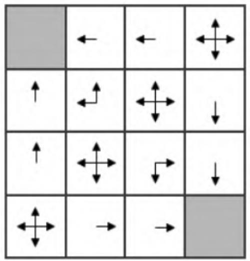
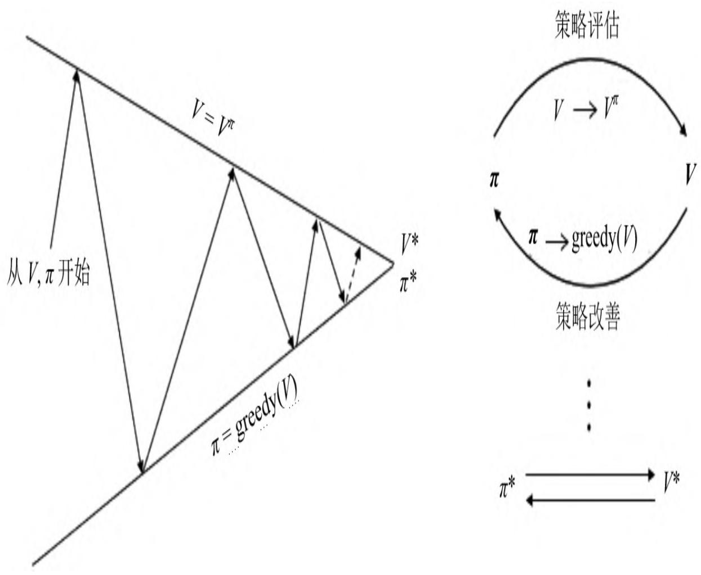
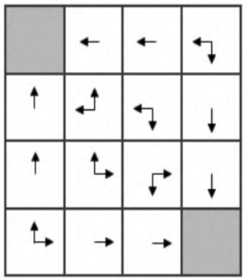
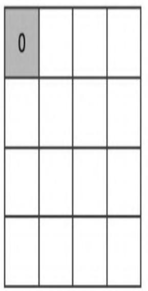
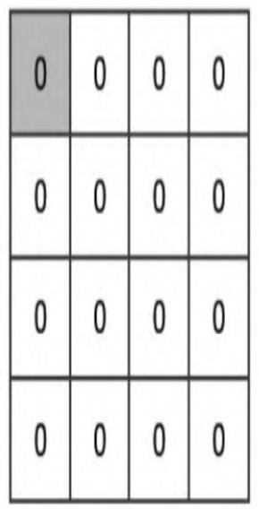

# 第3章 动态规划寻找最优策略

本章将详细讲解如何利用动态规划算法来解决强化学习中的规划问题。“规划”是在已知环境动力学的基础上进行评估和控制，就是在了解包括状态和行为空间、转移概率矩阵、奖励等信息的基础上判断一个给定策略的价值函数，或判断一个策略的优劣并最终找到最优策略和最优价值函数。虽然多数强化学习问题并不会给出具体的环境动力学，并且多数复杂的强化学习问题无法通过动态规划算法来快速求解，但是本章的内容仍然十分重要，包含许多非常重要的概念，例如预测和控制、策略迭代、价值迭代等。正确理解这些概念对于了解本书后续章节的内容非常重要，因而可以说本章内容是整个强化学习核心内容的引子。

动态规划算法把求解复杂问题分解为求解子问题，通过求解子问题进而得到整个问题的解。在求解子问题时，其结果通常需要存储起来，以便用来求解后续的复杂问题。当问题具有下列两个性质时，通常可以考虑使用动态规划来求解：第一个性质是一个复杂问题的最优解由数个小问题的最优解构成，这样就可以通过寻找子问题的最优解来得到这个复杂问题的最优解；第二个性质是子问题在复杂问题内重复出现，使得子问题的解可以被存储起来重复利用。马尔可夫决策过程具有上述两个性质：贝尔曼方程把问题递归为求解子问题；价值函数相当于存储了一些子问题的解，可以复用。因此可以使用动态规划来求解马尔可夫决策过程。

预测和控制是规划的两个重要内容：预测是对给定策略的评估过程，控制是寻找一个最优策略的过程。对预测和控制的数学描述如下：

$$
预测（Prediction）：已知一个马尔可夫决策过程 $\operatorname{MDP} \langle S , A , P , R , \gamma \rangle$ 和一个策略π，或者给定一个马尔可夫奖励过程 $\operatorname{MRP} \langle S, P_{\pi}, R_{\pi}, \gamma \rangle$ ，求解基于该策略的价值函数 $v_{\pi}$ 。

控制（Control）：已知一个马尔可夫决策过程 $\operatorname{MDP} \langle S , A , P , R , \gamma \rangle$ ，求解最优价值函数 $v_{*}$ 和最优策略 $\pi^{*}$ 。

$$

下文将详细讲解如何使用动态规划算法对一个MDP问题进行预测和控制。

## 3.1 策略评估

策略评估（Policy Evaluation）是指在给定策略下求解状态价值函数的过程。对策略评估，我们可以使用同步迭代联合动态规划的算法：从任意一个状态价值函数开始，依据给定的策略，结合贝尔曼期望方程、状态转移概率和奖励来同步迭代更新状态价值函数，直至其收敛，得到该策略下最终的状态价值函数。理解该算法的关键在于在一个迭代周期内如何更新每一个状态的价值。该迭代法可以确保收敛形成一个稳定的价值函数，关于这一点的证明涉及压缩映射原理，它超出了本书的范围，有兴趣的读者可以查阅相关文献。

贝尔曼期望方程给出了如何根据状态转换关系中的后续状态S'来计算当前状态S的价值，在同步迭代法中，我们使用上一个迭代周期k内的后续状态价值来计算并更新当前迭代周期k+1内某状态s的价值：

$$
v_{k + 1} (s) = \sum_{a \in A} \pi (a | s) \left(R_{s} ^{a} + \gamma \sum_{s^{\prime} \in S} P_{s s^{\prime}} ^{a} v_{k} \left(s^{\prime}\right)\right) \tag{3.1}
$$

我们可以对计算得到的新状态价值函数再次进行迭代，直至状态函数收敛，也就是迭代计算得到每一个状态的新价值与原价值之间的差别在一个很小的、可接受的范围内。


<table class="grid-world"><tr><td>0</td><td>1</td><td>2</td><td>3</td></tr><tr><td>4</td><td>5</td><td>6</td><td>7</td></tr><tr><td>8</td><td>9</td><td>10</td><td>11</td></tr><tr><td>12</td><td>13</td><td>14</td><td>15</td></tr></table>

图3.1 4×4小型格子世界

我们将用一个小型格子世界（见图3.1）来解释同步迭代法进行策略评估的细节。在此之前，先详细描述一下这个小型格子世界对应的强化学习问题，借此加强读者把实际问题转化为强化学习问题的能力。

考虑图3.1所示的4×4的方格阵列，我们把它看成一个小世界。这个世界环境有16个状态，图中每一个小方格对应一个状态，依次用0至15标记。其中，状态0和15分别位于左上角和右下角，是终止状态，用灰色表示。假设在这个小型格子世界中有一个可以进行上、下、左、右移动的个体，它的任务是通过不断移动到达两个灰色格子中的任意一个。这个小型格子世界的环境有着自己的动力学特征（即环境规则）：当个体采取的移动行为不会导致个体离开格子世界时，个体将以100%的概率到达它移动方向上相邻的格子，之所以是相邻的格子而不能跳格，是由于环境规则约束个体每次只能移动一格，同时规定个体不能斜向移动；如果个体采取的移动行为会跳出格子世界，那么环境规则将让个体以100%的概率停留在原来的状态— 保持在原地；如果个体到达终止状态（灰色格子中的一个），任务就结束了，否则个体可以继续移动。当个体采取了一个行为后，只要这个行为是个体在非终止状态时执行的，那么不管个体随后到达哪一个状态，个体都获得环境给予的值为-1的奖励；当个体处于终止位置时，它的任何行为都将获得值为0的奖励并仍旧停留在终止位置。环境设置的这种奖励机制是赋予了个体希望获得累积最大奖励的“天性”，让个体在格子世界中用尽可能少的步数来到达终止状态，即完成任务。个体在格子世界中每多走一步，得到的奖励都是一个负值。为了简化问题，我们设置衰减因子。至此，相信读者已经了解了这个格子世界的强化学习问题。

在这个小型格子世界的强化学习问题中，个体为了在完成任务时获得尽可能多的奖励（在此例中是尽可能减少负值奖励带来的惩罚），至少需要思考一个问题：“当处在格子世界中的某一个状态时，我应该采取怎样的行为才能尽快到达表示终止状态的格子。”这个问题对于拥有人类智慧的我们来说不是什么难题，因为我们知道整个世界环境的运行规则（动力学特征）；对于格子世界中的个体来说就不那么简单了，因为个体身处格子世界中，一开始并不清楚各个状态之间的位置关系，也不知道当自己处在状态4时只需要选择“向上”

移动的行为就可以直接到达终止状态。此时个体能做的就是在任何一个状态时以相等的概率选择朝4个方向移动。个体想到的办法就是采用一个均匀随机策略（Uniform Random Policy）。个体遵循这个均匀随机策略，不断产生行为，执行移动动作，从格子世界环境获得奖励（大多数是-1代表的惩罚），并到达一个新的或者曾经到达的状态。长久下去，个体会发现：遵循这个均匀随机策略时，每一个状态跟自己最后能够获得的最终奖励有一定的关系，在有些状态下自己最终获得的奖励并不那么少，而在某些状态下自己获得的最终奖励少得多。个体最终发现，在这个均匀随机策略指导下，每一个状态的价值是不一样的。这是一条非常重要的信息。对于个体来说，它需要通过不停地与环境交互，多次到达终止状态后才能对各个状态的价值有一定的认识。个体形成这个认识的过程就是策略评估的过程。我们知道描述整个格子世界的信息特征，不必要像格子世界中的个体那样通过与环境不停地交互来形成这种认识，所以我们可以直接通过迭代更新状态价值的办法来评估该策略下每一个状态的价值。

首先，我们假设所有除终止状态以外的14个状态的价值为0。同时，由于终止状态获得的奖励为0，根据贝尔曼方程，我们可以认为两个终止状态的价值始终保持为0。这样产生了第k=0次迭代的状态价值函数（见图3.2（a））。

在随后的每一次迭代内，个体在任意状态都以均等的概率（1/4）选择朝上、下、左、右这4个方向中的1个进行移动；只要个体不处于终止状态，随后产生任意1个方向的移动后都将得到-1的奖励，并依据环境动力学100%进入行为指向的相邻格子或碰壁后留在原位，在更新某一状态的价值时需要分别计算4个行为带来的价值分量。图3.2的（b）至（f）依次给出了第1、2、3、10以及无穷多次迭代后各个状态的价值。本章的实践部分将详细演示价值迭代的计算过程。

<table class="grid-world"><tr><td>0.0</td><td>0.0</td><td>0.0</td><td>0.0</td></tr><tr><td>0.0</td><td>0.0</td><td>0.0</td><td>0.0</td></tr><tr><td>0.0</td><td>0.0</td><td>0.0</td><td>0.0</td></tr><tr><td>0.0</td><td>0.0</td><td>0.0</td><td>0.0</td></tr></table>

（a）k-0

<table class="grid-world"><tr><td>0.0</td><td>-1.0</td><td>-1.0</td><td>-1.0</td></tr><tr><td>-1.0</td><td>-1.0</td><td>-1.0</td><td>-1.0</td></tr><tr><td>-1.0</td><td>-1.0</td><td>-1.0</td><td>-1.0</td></tr><tr><td>-1.0</td><td>-1.0</td><td>-1.0</td><td>0.0</td></tr></table>

（b)k-1

<table class="grid-world"><tr><td>0.0</td><td>-1.7</td><td>-2.0</td><td>-2.0</td></tr><tr><td>-1.7</td><td>-2.0</td><td>-2.0</td><td>-2.0</td></tr><tr><td>-2.0</td><td>-2.0</td><td>-2.0</td><td>-1.7</td></tr><tr><td>-2.0</td><td>-2.0</td><td>-1.7</td><td>0.0</td></tr></table>

(c) -2

<table class="grid-world"><tr><td>0.0</td><td>-2.4</td><td>-2.9</td><td>-3.0</td></tr><tr><td>-2.4</td><td>-2.9</td><td>-3.0</td><td>-2.9</td></tr><tr><td>-2.9</td><td>-3.0</td><td>-2.9</td><td>-2.4</td></tr><tr><td>-3.0</td><td>-2.9</td><td>-2.4</td><td>0.0</td></tr></table>

(d） k=3

<table class="grid-world"><tr><td>0.0</td><td>-6.1</td><td>-8.4</td><td>-9.0</td></tr><tr><td>-6.1</td><td>-7.7</td><td>-8.4</td><td>-8.4</td></tr><tr><td>-8.4</td><td>-8.4</td><td>-7.7</td><td>-6.1</td></tr><tr><td>-9.0</td><td>-8.4</td><td>-6.1</td><td>0.0</td></tr></table>

（e）k-10

<table class="grid-world"><tr><td>0.0</td><td>-14</td><td>-20</td><td>-22</td></tr><tr><td>-14</td><td>-18</td><td>-20</td><td>-20</td></tr><tr><td>-20</td><td>-20</td><td>-18</td><td>-14</td></tr><tr><td>-22</td><td>-20</td><td>-14</td><td>0.0</td></tr></table>

（f）k=8
图3.2 小型格子世界迭代中的价值函数

## 3.2 策略迭代

完成对一个策略的评估，将得到基于该策略下每一个状态的价值。很明显，不同状态对应的价值一般也不同，那么个体是否可以根据得到的价值状态来调整自己的行动策略呢？例如，考虑一种贪婪策略：个体在某个状态下只选择能达到最大后续价值的状态的行为。我们以均匀随机策略下第2次迭代后产生的价值函数为例来说明这个贪婪策略（见图3.3）。

<table class="grid-world"><tr><td>0.0</td><td>-1.7</td><td>-2.0</td><td>-2.0</td></tr><tr><td>-1.7</td><td>-2.0</td><td>-2.0</td><td>-2.0</td></tr><tr><td>-2.0</td><td>-2.0</td><td>-2.0</td><td>-1.7</td></tr><tr><td>-2.0</td><td>-2.0</td><td>-1.7</td><td>0.0</td></tr></table>




图3.3 小型格子世界策略的改善（k=2）

如图3.3所示，右侧是根据左侧各状态的价值绘制的贪婪策略方案。个体处在任何一个状态时，将比较所有后续可能的状态价值，从中选择一个最大价值的状态，再选择能到达这一状态的行为；如果有多个状态价值相同且均比其他可能的后续状态价值大，那么个体则从多个最大价值的状态中随机选择一个对应的行为。

在这个小型格子世界中，新的贪婪策略比之前的均匀随机策略要优秀不少，至少在靠近终止状态的几个状态中个体将有一个明确的行为，而不再是随机行为。我们从均匀随机策略下的价值函数中产生了更优秀的新策略，这是一个策略改善的过程。

$$
一般情况下，当给定一个策略π时，可以得到基于该策略的价值函数 $v_{\pi}$ ，基于产生的价值函数可以得到一个贪婪策略 $\scriptstyle{\pi^{\prime} = \mathrm{greedy} \left( v_{\pi} \right)}$ 。

依据新的策略π'会得到一个新的价值函数，并产生新的贪婪策略，如此重复循环迭代将最终得到最优价值函数 $v_{*}$ 和最优策略 $\pi^{*}$。策略在循环迭代中得到更新改善的过程称为策略迭代（Policy Iteration）。图3.4直观地显示了策略迭代的过程。




$$

图3.4 策略迭代过程示意图

从一个初始策略π和初始价值函数V开始，基于该策略进行完整的价值评估过程，得到一个新的价值函数，随后依据新的价值函数得到新的贪婪策略，随后计算新的贪婪策略下的价值函数，这个过程反复交替进行，在这个循环过程中策略和价值函数均得到迭代更新，并最终收敛至最优价值函数和最优策略。除了初始策略外，迭代中的策略均是依据价值函数的贪婪策略。

下文将证明基于贪婪策略的迭代将收敛于最优策略和最优状态价值函数。

$$
考虑一个依据确定性策略π对任意状态s产生的行为 $a = \pi(s)$ ，贪婪策略在同样的状态s下会得到新行为 $a^{\prime} = \pi^{\prime}(s)$ ，其中：

$$
$$
\pi^{\prime} (s) = \underset{a \in A} {\arg \max} q_{\pi} (s, a) \tag{3.2}
$$

假如个体在与环境交互时仅在下一步采取该贪婪策略产生的行为，而在后续步骤仍采取基于原策略产生的行为，那么下面的式子成立：

$$
q_{\pi} (s, \pi^{\prime} (s)) = \max_{a \in A} q_{\pi} (s, a) \geqslant q_{\pi} (s, \pi (s)) = v_{\pi} (s)
$$

由于上式中的s对状态集S中的所有状态都成立，因此针对状态s的所有后续状态均使用贪婪策略产生的行为，不等式 将成立。这表明新策略下状态价值函数总不次于原策略下的状态价值函数。该步的推导如下：

$$
\begin{array}{l} v_{\pi} (s) \leqslant q_{\pi} (s, \pi^{\prime} (s)) = \mathbb{E} _{\pi^{\prime}} \left[ R_{i + 1} + \gamma v_{\pi} \left(S_{t + 1}\right) \mid S_{t} = s \right] \\ \leqslant \mathbb{E} _{\pi^{\prime}} \left[ R_{t + 1} + \gamma q_{\pi} \left(S_{t + 1}, \pi^{\prime} \left(S_{t + 1}\right)\right) \mid S_{t} = s \right] \\ \leqslant \mathbb{E} _{\pi^{\prime}} \left[ R_{t + 1} + \gamma R_{t + 2} + \gamma^{2} q_{\pi} \left(S_{t + 2}, \pi^{\prime} \left(S_{t + 2}\right)\right) | S_{t} = s \right] \\ \leqslant \mathbb{E} _{\pi^{\prime}} \left[ R_{t + 1} + \gamma R_{t + 2} + \dots \mid S_{t} = s \right] = v_{\pi^{\prime}} (s) \\ \end{array}
$$

如果在某一个迭代周期内状态价值函数不再改善，即

$$
q_{\pi} (s, \pi^{\prime} (s)) = \max_{a \in A} q_{\pi} (s, a) = q_{\pi} (s, \pi (s)) = v_{\pi} (s)
$$

就满足了贝尔曼最优方程的描述：

$$
v_{\pi} = \max_{a \in A} q_{\pi} (s, a)
$$

$$
此时，对于所有状态集内的状态 $s \in S$ ，满足 $v_{\pi}(s) = v_{*}(s)$ ，表明此时的策略π即为最优策略。至此，证明已完成。

$$

## 3.3 价值迭代

如果按照图3.2中第三次迭代得到的价值函数采用贪婪选择策略，该策略和最终的最优价值函数对应的贪婪选择策略是一样的，它们都对应于最优策略，如图3.5所示，而通过基于均匀随机策略的迭代法价值评估要经过数十次迭代才算收敛。这会引出一个问题：是否可以提前设置一个迭代终点来减少迭代次数而不影响得到最优策略呢？是否可以每迭代一次就进行一次策略评估呢？在回答这些问题之前，我们先从另一个角度剖析一下最优策略的意义。

任何一个最优策略都可以分为两个阶段：首先，该策略要能产生当前状态下的最优行为；其次，对于最优行为到达后续状态时该策略仍然是一个最优策略。可以反过来理解这句话：如果一个策略不能在当前状态下产生一个最优行为，或者这个策略在针对当前状态的后续状态时不能产生一个最优行为，那么这个策略就不是最优策略。与价值函数对应起来，可以这样描述最优化原则：一个策略能够获得某状态s的最优价值，当且仅当该策略同时获得状态s所有可能的后续状态s'的最优价值。

<table class="grid-world"><tr><td>0.0</td><td>-14</td><td>-20</td><td>-22</td></tr><tr><td>-14</td><td>-18</td><td>-20</td><td>-20</td></tr><tr><td>-20</td><td>-20</td><td>-18</td><td>-14</td></tr><tr><td>-22</td><td>-20</td><td>-14</td><td>0.0</td></tr></table>




图3.5 小型格子世界k=∞时的贪婪策略

状态价值的最优化原则告诉我们，一个状态的最优价值可以由其后续状态的最优价值通过前一章所述的贝尔曼最优方程来计算：

$$
v_{*} (s) = \max_{a \in A} \left(R_{s} ^{a} + \gamma \sum_{s^{\prime} \in S} P_{s s^{\prime}} ^{a} v_{*} (s^{\prime})\right)
$$

这个公式带给我们的直觉是，如果我们能知道最终状态的价值和相关奖励，可以直接计算得到最终状态的前一个所有可能状态的最优价值。更乐观的是，即使不知道最终状态是哪一个，也可以利用上述公式进行纯粹的价值迭代，不停地更新状态价值，最终得到最优价值，而且这种单纯价值迭代的方法甚至适用于存在循环的状态转换、一些随机发生的状态转换。下面我们以一个更简单的格子世界来解释什么是单纯的价值迭代。

图3.6 $( \mathsf{V} _{0} )$ ）所示是一个在4×4格子世界中寻找最短路径的问题。与本章前述的格子世界问题唯一的不同之处在于，该世界只在左上角有一个最终状态，个体在世界中需尽可能用最少步数到达左上角的最终状态。

首先考虑个体知道环境的动力学特征的情况。在这种情况下，个体可以直接计算得到与终止状态直接相邻（斜向不算）的左上角两个状态的最优价值均为-1。随后个体又可以往右下角延伸计算，得到与之前最优价值为-1的两个状态相邻的3个状态的最优价值为-2。以此类推，每一次迭代，个体将从左上角朝着右下角方向依次直接计算，得到一排斜向格子的最优价值，直至完成最右下角的一个格子的最优价值的计算。

接着考虑个体不知道环境动力学特征的更广泛适用的情况。在这种情况下，个体并不知道终止状态的位置，但是它依然能够直接进行价值迭代。与之前情况不同的是，此时的个体要针对所有状态进行价值更新。为此，个体先随机地初始化所有状态价值 $( \mathsf{V} _{1} )$ ，示例中为了演示简便，全部初始化为0。在随后的一次迭代过程中，对于任何非终止状态，因为执行任何一个行为都将得到一个-1的奖励，而所有状态的价值都为0，所以所有的非终止状态的价值经过计算后都

为-1 $( \mathsf{V} _{2} )$ ）。在下一次迭代中，除了与终止状态相邻的两个状态外，其余状态的价值都将因采取一个行为获得-1的奖励，以及在前次迭代中得到的后续状态价值均为-1而将自身的价值更新为-2；与终止状态相邻的两个状态，在更新价值时需将终止状态的价值0作为最高价值代入计算，因而这两个状态更新的价值仍然为- $ {- 1} \ (  {V_{3}} )$ ）。以此类推，直到最右下角的状态更新为- $- 6 ~ ( V_{7} )$ ）后，再次迭代各状态的价值时它们将不会发生变化，完成整个价值迭代的过程。




V0




<table class="grid-world"><tr><td>0</td><td>-1</td><td>-1</td><td>-1</td></tr><tr><td>-1</td><td>-1</td><td>-1</td><td>-1</td></tr><tr><td>-1</td><td>-1</td><td>-1</td><td>-1</td></tr><tr><td>-1</td><td>-1</td><td>-1</td><td>-1</td></tr></table>

<table class="grid-world"><tr><td>0</td><td>-1</td><td>-2</td><td>-2</td></tr><tr><td>-1</td><td>-2</td><td>-2</td><td>-2</td></tr><tr><td>-2</td><td>-2</td><td>-2</td><td>-2</td></tr><tr><td>-2</td><td>-2</td><td>-2</td><td>-2</td></tr></table>

<table class="grid-world"><tr><td>0</td><td>-1</td><td>-2</td><td>-3</td></tr><tr><td>-1</td><td>-2</td><td>-3</td><td>-3</td></tr><tr><td>-2</td><td>-3</td><td>-3</td><td>-3</td></tr><tr><td>-3</td><td>-3</td><td>-3</td><td>-3</td></tr></table>

<table class="grid-world"><tr><td>0</td><td>-1</td><td>-2</td><td>-3</td></tr><tr><td>-1</td><td>-2</td><td>-3</td><td>-4</td></tr><tr><td>-2</td><td>-3</td><td>-4</td><td>-4</td></tr><tr><td>-3</td><td>-4</td><td>-4</td><td>-4</td></tr></table>

<table class="grid-world"><tr><td>0</td><td>-1</td><td>-2</td><td>-3</td></tr><tr><td>-1</td><td>-2</td><td>-3</td><td>-4</td></tr><tr><td>-2</td><td>-3</td><td>-4</td><td>-5</td></tr><tr><td>-3</td><td>-4</td><td>-5</td><td>-5</td></tr></table>

V6

<table class="grid-world"><tr><td>0</td><td>-1</td><td>-2</td><td>-3</td></tr><tr><td>-1</td><td>-2</td><td>-3</td><td>-4</td></tr><tr><td>-2</td><td>-3</td><td>-4</td><td>-5</td></tr><tr><td>-3</td><td>-4</td><td>-5</td><td>-6</td></tr></table>

图3.6 小型格子世界的最短路径问题

上述两种情况的相同点都是根据后续状态的价值，利用贝尔曼最优方程来更新得到前面状态的价值。两者的差别体现在：前者每次迭代仅计算相关状态的价值，而且一次计算即得到最优状态价值；后者在每次迭代时要更新所有状态的价值。

可以看出，价值迭代的目标仍然是寻找到一个最优策略，它通过贝尔曼最优方程从前次迭代的价值函数中计算得到当次迭代的价值函数。在这个反复迭代的过程中，并没有一个明确的策略参与，由于使用贝尔曼最优方程进行价值迭代时贪婪地选择了最优行为对应的后续状态的价值，因而价值迭代其实等效于策略迭代中每迭代一次，价值函数就更新一次策略的过程。需要注意的是，在纯粹的价值迭代寻找最优策略的过程中，迭代过程中产生的状态价值函数不一定对应一个策略。迭代过程中价值函数更新的公式为：

$$
v_{k + 1} (s) = \max_{a \in A} \left(R_{s} ^{a} + \gamma \sum_{s^{\prime} \in S} P_{s s^{\prime}} ^{a} v_{k} (s^{\prime})\right) \tag{3.3}
$$

在上述公式和图示中，k表示迭代次数。

至此，关于使用同步动态规划进行规划的内容基本讲解完毕。其中，迭代法策略评估属于预测问题，使用贝尔曼期望方程来进行求解。策略迭代和价值迭代属于控制问题：策略迭代使用贝尔曼期望方程进行一定次数的价值迭代更新，随后在产生的价值函数基础上采取贪婪选择的策略改善方法形成新的策略，如此交替迭代，不断地优化策略；价值迭代不依赖任何策略，使用贝尔曼最优方程直接对价值函数进行迭代更新。前文所述的这3类算法均是基于状态价值函数的，每一次迭代的时间复杂度为 $O ( m n^{2} )$ ，其中m和n分别为行为和状态空间的大小。读者也可以设计基于行为价值函数的上述算法，这种情况下每一次迭代的时间复杂度将变成 $O ( m^{2} n^{2} )$ ，本文不再详述。

## 3.4 异步动态规划算法

前文所述的系列算法均为同步动态规划算法，表示所有的状态更新是同步的。与之对应的还有异步动态规划算法。在这些算法中，每一次迭代并不对所有状态的价值进行更新，而是依据一定的原则有选择性地更新部分状态的价值。这种算法能显著节约计算资源，并且只要所有状态能够持续地被访问而更新，就能确保算法收敛至最优解。比较常用的异步动态规划思想有原位动态规划、优先级动态规划和实时动态规划等。下文将简要叙述各类异步动态规划算法的特点。

·原位动态规划（In-place Dynamic Programming）：与同步动态规划算法通常对状态价值保留一个额外备份不同，原位动态规划直接利用当前状态的后续状态价值来更新当前状态的价值。
·优先级动态规划（Prioritised Sweeping）：该算法对每一个状态进行优先级分级，优先级越高，状态价值越会优先得到更新。通常使用贝尔曼误差（新状态价值与前次计算得到的状态价值差的绝对值）来评估状态的优先级。直观地说，如果一个状态价值在更新时变化特别大，那么该状态下次将得到较高的优先级再次更新。这种算法可以通过维护一个优先级队列来较轻松地实现。

·实时动态规划（Real-time Dynamic Programming）：实时动态规划直接使用个体与环境交互产生的实际经历来更新状态价值，对于那些个体实际经历过的状态进行价值更新。这样个体经常访问过的状态将得到较高频次的价值更新，而与个体关系不密切、个体较少访问到的状态价值得到更新的机会较少。

动态规划算法使用全宽度（Full-Width）的回溯机制来进行状态价值的更新，也就是说，无论是同步还是异步动态规划，在每一次回溯更新某个状态的价值时都要追溯到该状态所有可能的后续状态，并结合已知的马尔可夫决策过程所定义的状态转换矩阵和奖励来更新该状态的价值。这种全宽度的价值更新方式对于状态数在百万级别及以下的中等规模的马尔可夫决策问题还是比较有效的，但是当问题规模继续变大时，动态规划算法将会因贝尔曼维度灾难而无法使用，每一次的状态回溯更新都要消耗非常昂贵的计算资源。为此，需要寻找其他有效的算法，这就是后文将要介绍的采样回溯。这类算法的一大特点是不需要知道马尔可夫决策过程的定义，也就是不需要了解状态转移概率矩阵以及奖励函数，而是使用采样产生的奖励和状态转移概率。这类算法通过采样避免了维度灾难，其回溯的计算时间消耗是常数级的。由于这类算法具有非常可观的优势，因此在解决大规模实际问题时得到了广泛的应用。

## 3.5 编程实践：动态规划求解小型格子世界最优策略

在本章的编程实践中，我们将结合4×4小型格子世界环境使用动态规划算法进行策略评估、策略迭代和价值迭代。本节将引导读者进一步熟悉马尔可夫决策过程的建模，熟悉动态规划算法的思想，巩固对贝尔曼期望方程、贝尔曼最优方程的认识，加深对均匀随机策略、贪婪策略的理解。本节使用的代码与上一节有许多相似的地方，但是也有不少细微的差别。这些差别代表着我们逐渐从单纯的马尔可夫过程的建模转向强化学习的建模和实践中。

### 3.5.1 小型格子世界MDP建模

我们先对4×4小型格子世界的MDP进行建模。4×4格子世界环境简单、环境动力学明确，我们将不使用字典来保存状态价值、状态转移概率、奖励、策略等。我们使用列表来描述状态空间和行为空间，编写一个反映环境动力学特征的方法（接受当前状态和行为作为参数）来确定后续状态和奖励值。状态转移概率和奖励将使用函数（方法）的形式来表达。代码如下：

```python
S = [i for i in range(16)]    ## 状态空间
A = ["n", "e", "s", "w"]    ## 行为空间
P,R将由dynamics动态生成
ds actions = {"n": -4, "e": 1, "s": 4, "w": -1} ## 行为对状态的改变
def dynamics(s, a):    ## 环境动力学
    '''模拟小型格子世界的环境动力学特征
    Args:
    s当前状态int 0 - 15
    a行为str in ['n', 'e', 's', 'w'] 分别表示北、东、南、西
    Returns: tuple (s_prime, reward, is_end)
    s_prime 后续状态
    '''
    s_prime = s
    if (s%4==0 and a=="w") or (s<4 and a=="n") \
    or ((s+1)%4==0 and a=="e") or (s>11 and a=="s")) \
    or s in [0, 15]:
    pass
    else:
    ds = ds_actions[a]
    s_prime = s + ds

reward = 0 if s in [0, 15] else -1
is_end = True if s in [0, 15] else False
return s_prime, reward, is_end
```

```python
def P(s, a, s1):    ## 状态转移概率函数
    s_prime, _, _ = dynamics(s, a)
    return s1 == s_prime

def R(s, a):    ## 奖励函数
    _, r, _ = dynamics(s, a)
    return r

gamma = 1.00
MDP = S, A, R, P, gamma
```

最后建立的MDP同[第2章](ch02.md)一样是一个拥有5个元素的元组，只不过R和P都变成了函数而不是字典了。同样变成函数的还有策略。下面的代码建立均匀随机策略和贪婪策略，并给出调用这两个策略的统一接口。生成一个策略所需要的参数并不统一，比如均匀随机策略多数只需要知道行为空间即可、贪婪策略则需要知道状态的价值。为了方便程序使用相同的代码调用不同的策略，我们对参数进行统一。

```python
def uniform_random_pi(MDP = None, V = None, s = None, a = None):
    _, A, _, _, _ = MDP
    n = len(A)
    return 0 if n == 0 else 1.0/n

def greedy_pi(MDP, V, s, a): ## 贪婪策略
    S, A, P, R, gamma = MDP
    max_v, a_max_v = -float('inf'), []
    for a_opt in A: ## 统计后续状态的最大价值以及到达该状态的行为（可能不止一个）
    s_prime, reward, _ = dynamics(s, a_opt)
    v_s_prime = get_value(V, s_prime)
    if v_s_prime > max_v:
    max_v = v_s_prime
    a_max_v = [a_opt]
    elif(v_s_prime == max_v):
```

```python
a_max_v.append(a_opt)
n = len(a_max_v)
if n == 0: return 0.0
return 1.0/n if a in a_max_v else 0.0
def get_pi(Pi, s, a, MDP = None, V = None):
    return Pi(MDP, V, s, a)
```

在编写贪婪策略时，我们考虑到多个状态具有相同最大值的情况，此时贪婪策略将从多个具有相同最大值的行为中随机选择一个。为了能使用[第2章](ch02.md)编写的一些方法，我们重写一下需要用到的获取状态转移概率、奖励以及显示状态价值等辅助方法：

## 辅助函数
```python
def get_prob(P, s, a, s1):    ## 获取状态转移概率
    return P(s, a, s1)

def get_reward(R, s, a):    ## 获取奖励值
    return R(s, a)

def set_value(V, s, v):    ## 设置价值字典
    V[s] = v

def get_value(V, s):    ## 获取状态价值
    return V[s]

def display_V(V):    ## 显示状态价值
    for i in range(16):
    print('[0:>6.2f}'.format(V[i]),end=" ")
    if (i+1) % 4 == 0:
    print("")
    print()
```

有了这些基础，接下来就可以很轻松地完成迭代法策略评估、策略迭代和价值迭代。在[第2章](ch02.md)的实践环节，我们实现了完成这3个功能的方法，这里只要做少量针对性的修改即可。由于策略Pi现在不是查表式获取而是使用函数来定义的，因此我们需要做相应的修改，修改后的完整代码如下：

```python
def compute_q(MDP, V, s, a):
    '''根据给定的MDP、价值函数V来计算状态行为对“s,a”的价值qsa    '''
    S, A, R, P, gamma = MDP
    q_sa = 0
    for s_prime in S:
    q_sa += get_prob(P, s, a, s_prime) * get_value(V, s_prime)
    q_sa = get_reward(R, s,a) + gamma * q_sa
    return q_sa

def compute_v(MDP, V, Pi, s):
    '''给定MDP下依据某一策略Pi和当前状态价值函数V来计算某状态s的价值    '''
    S, A, R, P, gamma = MDP
    v_s = 0
    for a in A:
    v_s += get_pi(Pi, s, a, MDP, V)*compute_q(MDP, V, s, a)
    return v_s
def update_V(MDP, V, Pi):
    '''给定一个MDP和一个策略，更新该策略下的价值函数V    '''
    S, _, _, _, _ = MDP
    V_prime = V.copy()
    for s in S:
    set_value(V_prime, s, compute_v(MDP, V_prime, Pi, s))
    return V_prime

def policy_evaluate(MDP, V, Pi, n):

'''使用n次迭代计算来评估一个MDP在给定策略Pi下的状态价值，初始时价值为V
for i in range(n):
    V = update_V(MDP, V, Pi)
return V

def policy_iterate(MDP, V, Pi, n, m):
    for i in range(m):
    V = policy_evaluate(MDP, V, Pi, n)
    Pi = greedy_pi  ## 第一次迭代产生新的价值函数后随机使用贪婪策略
    return V

\# 价值迭代得到最优状态价值过程

def compute_v_from_max_q(MDP, V, s):

'''根据一个状态下所有可能的行为价值中最大的一个来确定当前状态价值

S, A, R, P, gamma = MDP
v_s = -float('inf')
for a in A:
    qsa = compute_q(MDP, V, s, a)
    if qsa >= v_s:
    v_s = qsa
    return v_s

def update_V_without_pi(MDP, V):
    '''在不依赖策略的情况下直接通过后续状态的价值来更新状态价值    '''
    S, _, _, _, _ = MDP
    V_prime = V.copy()
    for s in S:
    set_value(V_prime, s, compute_v_from_max_q(MDP, V_prime, s))
    return V_prime

def value_iterate(MDP, V, n):
    '''价值迭代    '''
    for i in range(n):
    V = update_V_without_pi(MDP, V)
    return V
```

### 3.5.2 策略评估

接下来可以调用3.5.1小节中的方法进行策略评估、策略迭代和价值迭代。本小节先来评估一下均匀随机策略和贪婪策略下16个状态的最终价值：

```python
V = [0 for_ in range(16)]    ## 状态价值
V_pi = policy_evaluate(MDP, V, uniform_random(pi, 100)
display_V(V_pi)

V = [0 for_ in range(16)]    ## 状态价值
V_pi = policy_evaluate(MDP, V, greedy(pi, 100)
display_V(V(pi))

将输出结果:
0.00 -14.00 -20.00 -22.00
-14.00 -18.00 -20.00 -20.00
-20.00 -20.00 -18.00 -14.00
-22.00 -20.00 -14.000.00
0.00 -1.00 -2.00 -3.00
-1.00 -2.00 -3.00 -2.00
-2.00 -3.00 -2.00 -1.00
-3.00 -2.00 -1.000.00
```

可以看出，均匀随机策略下得到的结果与图3.5显示的结果相同；在使用贪婪策略时，各状态的最终价值与均匀随机策略下的最终价值不同。这体现了状态的价值是基于特定策略的。

### 3.5.3 策略迭代

编写如下代码进行贪婪策略迭代，每迭代一次改善一次策略，共进行100次策略改善：

```python
V = [0 for_ in range(16)] ## 重置状态价值
V_pi = policy_iterate(MDP, V, greedy_pi, 1, 100)
display_V(V_pi)
将输出结果:
0.00 -1.00 -2.00 -3.00
-1.00 -2.00 -3.00 -2.00
-2.00 -3.00 -2.00 -1.00
-3.00 -2.00 -1.000.00
```

### 3.5.4 价值迭代

下面的代码展示单纯使用价值迭代的状态价值。我们把迭代次数设为4次，可以发现仅4次迭代后状态价值就和最优状态价值一致了：

```python
V_star = value_iterate(MDP, V, 4) display_V(V_star)
将输出结果:
0.00 -1.00 -2.00 -3.00
-1.00 -2.00 -3.00 -2.00
-2.00 -3.00 -2.00 -1.00
-3.00 -2.00 -1.000.00
```

我们还可以编写如下代码来观察最优状态下对应的最优策略：

```python
def greedy_policy(MDP, V, s):
    S, A, P, R, gamma = MDP
    max_v, a_max_v = -float('inf'), []
    for a_opt in A: ## 统计后续状态的最大价值以及到达该状态的行为（可能不止一个）
    s_prime, reward, _ = dynamics(s, a_opt)
    v_s_prime = get_value(V, s_prime)
    if v_s_prime > max_v:
    max_v = v_s_prime
    a_max_v = a_opt
    elif(v_s_prime == max_v):
    a_max_v += a_opt
    return str(a_max_v)

def display_policy(policy, MDP, V):
    S, A, P, R, gamma = MDP
    for i in range(16):
    print('[0:^6}'.format(policy(MDP, V, S[i])), end=" ")
    if (i+1) % 4 == 0:
    print("")
```

```python
print()
display_policy(greedy_policy, MDP, V_star)
将输出结果:
nesw w w sw
n nw nesw s
n nesw es s
ne e e nesw
```

上面分别用n、e、s、w表示北、东、南、西4个行为。这与图3.5显示的结果是一致的。也可以通过修改不同的参数或在迭代过程中输出价值和策略来观察价值函数和策略函数的迭代过程。

