# 第5章 无模型的控制

前一章内容讲解了个体在不依赖模型的情况下如何进行预测，也就是求解在给定策略下的状态价值或行为价值函数。本章主要讲解在无模型的条件下如何通过个体的学习优化价值函数，同时改善自身行为的策略，以最大化获得累积奖励的过程（这一过程称作“无模型的控制”）。

生活中有很多关于优化控制的问题，比如控制一个大厦内的多部电梯使得效率更高，控制直升机的特技飞行、机器人足球世界杯上控制机器人球员、围棋游戏等。这些问题要么环境复杂，我们对其环境动力学的特点无法掌握，例如无法精确地描述直升机特技飞行时的空气流动特征、球场上每一个机器人球员位置和姿态；要么虽然问题的规则容易精确描述，也就是环境动力学特征是已知的，但是问题的规模太大，以至于计算机根据一般算法无法高效地求解。例如，围棋游戏的规则很简单，但是这一规则会形成规模极其庞大的棋局。如果使用传统的方法来构建一个智能的围棋手是极其困难的。从强化学习的角度来说，描述围棋问题的状态空间极其宏大。不过无论问题属于以上何种情况，使用最先进的强化学习技术目前都能较好地解决。

在学习用动态规划进行策略评估、优化时，我们能体会到个体在与环境进行交互时，其实际交互的行为需要基于一个策略来产生。在评估一个状态或行为的价值时，也需要基于一个策略，因为不同的策略下同一个“状态”或“状态-行为对”（State-Action Pair）的价值是不同的。我们把用来指导个体产生与环境进行实际交互行为的策略称为行为策略，把用来评价状态或行为价值的策略或者待优化的策略称为目标策略。如果个体在学习过程中优化的策略与自己的行为策略是同一个策略，那么这种学习方式就称为同策略学习（On-policyLearning）。如果个体在学习过程中优化的策略与自己的行为策略是不同的策略，那么这种学习方式就称为异策略学习（Off-policyLearning，或称为离策略学习）。

从已知模型、基于全宽度采样的动态规划学习转至模型未知的、基于采样的蒙特卡罗或时序差分学习，所进行的控制是高效解决中等规模实际问题的一个突破。基于这些思想产生了一些经典的理论和算法，如不完全贪婪搜索策略、同策略蒙特卡罗控制、同策略时序差分学习、属于异策略学习算法的Q学习等。下文将详细论述。

## 5.1 行为价值函数的重要性

在无模型的控制时，因为无法精确知晓状态间的转移概率，所以无法使用基于状态转移概率来改善贪婪策略，公式如下：

$$
\pi^{\prime} (s) = \underset{a \in A} {\arg \max} \left(R_{s} ^{a} + P_{s s^{\prime}} ^{a} V (s^{\prime})\right)
$$

这不难理解，就拿[第2章](ch02.md)提到的学生学习一门课的马尔可夫决策过程的例子来说，假设我们需要在贪婪策略下确定学生处在“第三节课”时的价值，就需要比较学生在“第三节课”后所能采取的“学习”和“泡吧”这两个行为之后状态的价值。对于继续“学习”比较简单，在获得一个价值为10的即时奖励之后，进入价值恒为0的“退出休息”状态，此时得到在“第三节课”后选择继续“学习”的价值为+10；而选择“泡吧”时，计算就没那么简单了，因为在“泡吧”过后学生自己并不确定将回到哪个状态，因此无法直接用某一个状态的价值来计算“泡吧”行为的价值。环境按照一定的概率（分别为0.2、0.4、0.4）把学生重新分配至“第一节课”“第二节课”或“第三节课”。也只有在知道这3个概率值后，我们才能根据后续这3个状态的价值计算出“泡吧”行为的价值为+9.4，根据贪婪策略，学生在“第三节课”的价值为+10。在基于采样的强化学习时，我们无法事先精确知道这些状态之间在不同行为下的转移概率，因而无法单独基于状态的价值来改善我们的贪婪策略。

生活中也是如此，有时一个人给自己制定了一个价值很高的目标，却发现不知采取什么行为来达到这个目标。与其花时间比较目标与现实的差距，倒不如立足于当下，在所有可用的行为中选择一个最高价值的行为。因此，如果能够确定某个状态下所有可能的行为的价值，那么自然比较容易从中选出一个最优价值的行为。实践证明，在无模型的强化学习问题中，确定“状态行为对”的价值要容易很多。

生活中有些人喜欢做事但不善于总结，这类人一般要比那些勤于总结的人进步慢，从策略迭代的角度看，这类人的策略更新迭代周期较长；有些人在总结经验上过于勤快，甚至在一件事情还没有完全定论时就急于总结并推理过程之间的关系，这种总结得到的经验有可能是错误的。强化学习中的个体也是如此，为了让个体尽早找到最优策略，可以适当加快策略迭代的速度，但是在一个不完整的状态序列学习中则要注意不能过多地依赖状态序列中相邻“状态-行为对”的关系。基于蒙特卡罗方法的学习所利用的是完整的状态序列，为了加快学习速度，可以在只经历一个完整状态序列后就进行策略迭代；在进行基于时序差分的学习时，虽然学习速度可以更快，但是要注意减少对事件估计的偏差。

## 5.2 贪婪策略

在前文讲解动态规划进行策略迭代时，初始阶段我们选择的是均匀随机策略（Uniform Random Policy），而进行过一次迭代后，我们选择了贪婪策略（Greedy Policy），即每一次只选择能到达具有最大价值的状态所对应的行为，在随后的每一次迭代中都使用这个贪婪策略。实验发现，这样能够明显加快找到最优策略的速度。贪婪搜索策略在基于模型的动态规划算法中能收敛至最优策略（价值），但这在无模型、基于采样的蒙特卡罗或时序差分学习中却通常不能收敛至最优策略。这3种算法都采用通过后续状态价值回溯的办法来确定当前状态价值，不过动态规划算法还是考虑了一个状态后续所有状态的价值，而后其他两种算法仅能考虑到在学习过程中有限次数的、通过采样经历过的状态，那些事实存在但还没经历过的状态，对于蒙特卡罗和时序差分算法来说，都是未探索的、不被考虑的状态，有些状态虽然在学习过程中经历过，但是经历次数不多，对其价值的估计也不一定准确。试想一下，有一些事实上价值较高的状态，个体由于一些原因从未经历过，此时使用贪婪算法将始终无法探索到这些状态，因而也“无缘”经历这些状态了。同样的道理，使用贪婪算法，那些曾经经历过但被算法认为价值较低的状态也很难再次被个体选择并继续“光顾”。这两种情况都将导致无法得到一个最优的策略。

举个例子：假设你刚搬到一个街区，街上有两家餐馆，你决定去两家都尝试一下并给自己的就餐体验打个分，分值在0～10分之间，分值越高表明你对就餐体验的满意度越高。你先体验了第一家，觉得一般，给了5分；过了几天你去了第二家，觉得不错，给了8分。此时，如果选择贪婪策略来指导你选择下次就餐要去的餐馆，则你将只会去评分高的那家餐馆就餐，也就是下一次你将继续选择去第二家餐馆。假设第二次去这家餐馆，你的满意度没有上一次好，给了6分。经过了这3次体验后，你对第一家餐馆的评分为5分，对第二家的评分平均下来是7分。之后你仍然选择贪婪策略，下一次体验仍然是去第二家，假设体验为7分，那么经过这4次体验之后，你能确认对你来说第二家餐馆就一定比第一家好吗？答案是否定的，原因在于你只去了一次第一家餐馆，仅靠这一次的体验是不可靠的。贪婪策略并不意味着你今后就一定无法选择去第一家就餐，但是只有在你去过一定次数的第二家餐馆，并且平均的满意度低于第一家的评分5分时，那么下一次你才会选择去第一家餐馆。如果你对第二家餐馆的平均体验评分一直在第一家的5分之上，依据贪婪策略，你将不会再去第一家餐馆体验。也许你第一次去第一家餐馆就餐时恰好碰到他们刚开业，各方面服务还不完善，但是现在已经做得很好了。贪婪策略有可能使你错失在第一家餐馆就餐的美好体验。

采取贪婪策略还有一个问题，就是如果这条街上新开了一家餐馆，且你对没有去过的餐馆评分为最低的0，那就将永远不会去尝试这

家新开的餐馆。

贪婪策略产生问题的根源是无法保证持续地探索。为了解决这个问题，一种不完全的贪婪（ϵ-Greedy）搜索策略被提出来，它的基本思想就是保证能做到持续的探索，具体通过设置一个较小的ϵ值，使用1-ϵ的概率贪婪地选择目前认为是最大价值的行为，而用ϵ的概率随机地从所有m个可选行为中选择行为，即

$$
\pi (a | s) = \left\{\begin{array}{l l} \epsilon / m + 1 - \epsilon & \text{如果} a^{*} = \underset{a \in A} {\operatorname{argmax}} Q (s, a) \\ \epsilon / m & \text{其他} \end{array} \right. \tag{5.1}
$$

## 5.3 同策略蒙特卡罗控制

同策略蒙特卡罗控制在通过ϵ贪婪策略采样一个或多个完整的状态序列后，平均得出某一“状态-行为对”（State-Action Pair）的价值，并持续进行策略的评估和改善。通常可以在仅得到一个完整状态序列后就进行一次策略迭代以加速迭代过程。

使用ϵ贪婪策略进行同策略蒙特卡罗控制仍然只能得到基于该策略的近似行为价值函数，这是因为该策略一直在进行探索，没有一个终止条件。因此我们必须关注以下两个方面：一方面，我们不想丢掉任何更好的信息和状态；另一方面，随着策略的改善，我们最终希望能终止于某一个最优策略。为此引入了一个理论概念：GLIE（Greedy inthe Limit with Infinite Exploration，也就是在有限时间内进行无限可能的探索）。它包含两层意思：

一是所有的“状态-行为对”（State-Action Pair）会被无限次探索：

$$
\lim_{k \rightarrow \infty} N_{k} (s, a) = \infty
$$

二是随着采样趋向无穷多，策略收敛至一个贪婪策略：

$$
\lim_{k \rightarrow \infty} \pi_{k} (a \mid s) = 1 \left(a = \underset{a^{\prime} \in A} {\arg \max} Q_{k} (s, a^{\prime})\right)
$$

存在如下的定理：

基于GLIE的蒙特卡罗控制能收敛至最优的“状态-行为”价值函数：

$$
Q (s, a) \rightarrow q^{*} (s, a)
$$

如果在使用ϵ贪婪策略时能令ϵ随采样次数的无限增加而趋向于0，就符合GLIE。这样基于GLIE的蒙特卡罗控制流程如下：

1. 基于给定策略π，采样第k个完整的状态序列 。
2. 对于该状态序列中出现的每一”状态-行为对” ，更新其计数N和行为价值函数Q：

   $$
   N \left(S_{t}, A_{t}\right) \leftarrow N \left(S_{t}, A_{t}\right) + 1
   $$

   $$
   Q (S_{t}, A_{t}) \leftarrow Q (S_{t}, A_{t}) + \frac{1}{N (S_{t} , A_{t})} (G_{t} - Q (S_{t}, A_{t})) \tag{5.2}
   $$

3. 基于新的行为价值函数Q以如下方式改善策略：

   $$
   \epsilon \leftarrow 1 / k
   $$

$$
\pi \leftarrow \epsilon - \text{greedy} (Q) \tag{5.3}
$$

在实际应用中，ϵ的取值可不局限于取1/k，只要符合GLIE特性的设计均可以收敛至最优策略（价值）。

## 5.4 同策略时序差分控制

通过上一章关于预测的学习，我们体会到时序差分（TD）学习相比蒙特卡罗（MC）学习有很多优点：低变异性（即方差小），可以在线实时学习，可以学习不完整状态序列等。在控制问题上使用TD学习同样具备上述优点。在本节的同策略TD学习中，我们将介绍Sarsa算法和Sarsa（λ）算法，在下一节的异策略TD学习中将详细介绍Q学习算法。

### 5.4.1 Sarsa算法

Sarsa的名称来源于图5.1所示的序列描述：针对一个状态S，个体通过行为策略产生一个行为A，执行该行为产生一个“状态-行为对”（S,A），环境收到个体的行为后会告诉个体即时奖励R以及后续进入的状态S'；个体在状态S'时遵循当前的行为策略产生一个新行为A'，个体此时并不执行该行为，而是通过行为价值函数得到后一个“状态-行为对”（S',A'）的价值，利用这个新的价值和即时奖励R来更新前一个“状态-行为对”（S,A）的价值。

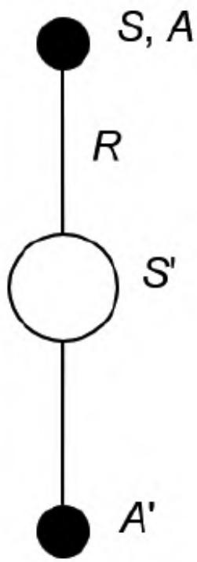


图5.1　Sarsa 算法示意图

与MC算法不同的是，Sarsa算法在单个状态序列内的每一个时间步内，在状态S下采取一个行为A到达状态S'后都要更新“状态-行为对”（S,A）的价值Q（S,A）。这一过程同样使用ϵ贪婪策略进行策略迭代：

$$
Q (S, A) \leftarrow Q (S, A) + \alpha \left(R + \gamma Q (S^{\prime}, A^{\prime}) - Q (S, A)\right) \tag{5.4}
$$

Sarsa的算法流程如算法1所述。

<pre class="pseudocode">
$$
\begin{algorithm}
$$

\caption{算法 1: Sarsa算法}

\begin{algorithmic}
state 输入: episodes, $\alpha$, $\gamma$
state 输出: $Q$
state 初始化: set $Q(s, a)$ arbitrarily, for each $s \in S$ and $a \in A(s)$; set $Q(terminal\ state, \cdot) = 0$
for{each episode}
    state $S \leftarrow$ first state of episode
    state $A = policy(Q, S)$ (e.g. $\varepsilon$-greedy policy)
    repeat
        state $R, S' = perform_action(S, A)$
        state $A' = policy(Q, S')$ (e.g. $\varepsilon$-greedy policy)
        state $Q(S, A) \leftarrow Q(S, A) + \alpha(R + \gamma Q(S', A') - Q(S, A))$
        state $S \leftarrow S'$; $A \leftarrow A'$
    until{$S$ is terminal state}
endfor
\end{algorithmic}
\end{algorithm}
</pre>


在Sarsa算法中，Q（S,A）的值使用一张大表来存储，这不是很适合解决规模很大的问题；对于每一个状态序列，在S状态时采取的行为A是基于当前行为策略的，也就是该行为是与环境进行交互实际使用的行为。在更新“状态-行为对”（S,A）的价值的循环里，个体状态$S'$ 下也依据该行为策略产生了一个行为 $A'$ ，该行为在当前循环周期内用来得到”状态-行为对”（S',A'）的价值，并借此来更新”状态-行为对”（S,A）的价值，在下一个循环周期（时间步）内，状态 $S'$ 和行为A'将转换身份为当前状态和当前行为，该行为将被执行。

在更新行为价值时，参数α是学习速率参数，γ是衰减因子。当行为策略满足前文所述的GLIE特性，同时学习速率参数α满足 $\sum_{t = 1} ^{\infty} \alpha_{t} = \infty$ ，且 $\sum_{t = 1} ^{\infty} \alpha_{t} ^{2} < \infty$ 时，Sarsa算法将收敛至最优策略和最优价值函数。


我们使用一个经典环境的、有风的格子世界来解释Sarsa算法的学习过程。如图5.2所示，在一个10×7的长方形格子世界，标记一个起始位置S和一个目标位置G，格子下方的数字表示对应的列中有一定强度的风。当个体进入该列的某个格子时，会按图中箭头所示的方向自动移动数字表示的格数，借此来模拟格子世界中设定的风的作用。同样格子世界是有边界的，个体任意时刻只能处在格子世界内部的一个格子中。个体并不清楚这个格子世界的构造以及存在风的效应，也就是说它不知道格子是长方形的，也不知道边界在哪里，还不知道自己在里面移动一步后下一个格子与之前格子的相对位置关系，当然它也不清楚起始位置、终止目标的具体位置。但是，个体会记住曾经经过的格子，下次在进入这个格子时，它能准确地辨认出这个格子曾经什么时候来过。个体可以执行的行为是朝上、下、左、右移动一步。现在要求解的问题是个体应该遵循怎样的策略才能尽快从起始位置到达目标位置。

为了用计算机程序解决这个问题，我们首先要将这个问题用强化学习的语言再描述一遍。这是一个无模型的控制问题，也就是要在不掌握马尔可夫决策过程的情况下寻找最优策略。环境世界中每一个格子可以用水平和垂直坐标来描述，如此构成拥有70个状态的状态空间S。行为空间A具有4个基本行为。环境的动力学特征（即环境规则）不被个体掌握，但个体每执行一个行为就会进入一个新的状态，该状态由环境告知个体，但环境不会直接告诉个体该状态的坐标位置。即时奖励是根据任务目标来设定的，现要求尽快从起始位置移动到目标位置，我们可以设定每移动一步只要不是进入目标位置就给予一个-1的惩罚，直至进入目标位置后获得奖励0同时永久停留在该位置。

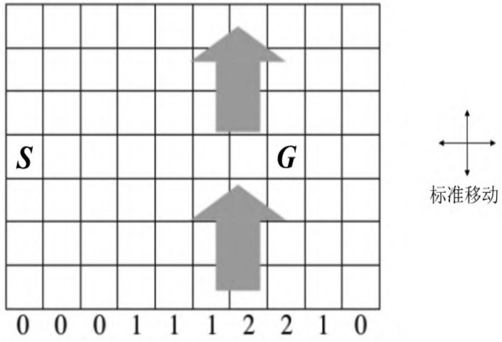


图5.2　有风的格子世界环境

我们将在编程实践环节给出用Sarsa算法解决有风的格子世界问题的完整代码，这里先给出最优策略为依次采取右、右、右、右、右、右、右、右、右、下、下、下、下、左、左的行为序列。个体找到该最优策略的进度以及最优策略下个体从起始状态到目标状态的行为轨迹如图5.3所示。

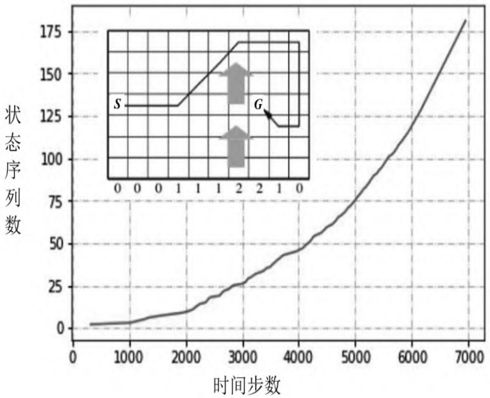


图5.3　有风的格子世界最优路径和Sarsa算法学习曲线

从图5.3中可以看出，个体在一开始的几百步甚至上千步都在尝试各种操作而没有完成一次从起始位置到目标位置的学习经历。不过一旦个体找到一次目标位置后，它的学习过程将明显加速，最终找到一条只需要15步的最短路径。由于格子世界的构造以及其内部存在风效应的影响，个体两次利用风的影响，先向右并向北漂移，到达最右上角后折返南下再左移才找到这条最短路径。其他路径均比该路径所花费的步数要多。

### 5.4.2 Sarsa（λ）算法

在前一章，我们学习了n步收获，这里类似地引出一个n步Sarsa的概念。观察表5.1中所列的式子。

表5.1　n步Q收获

<table><tr><td>n值</td><td>算法</td><td>n步收获的计算</td></tr><tr><td>1</td><td>Sarsa</td><td> $q_{t}^{(1)} = R_{t+1} + \gamma Q(S_{t+1}, A_{t+1})$ </td></tr><tr><td>2</td><td></td><td> $q_{t}^{(2)} = R_{t+1} + \gamma R_{t+2} + \gamma^{2}V(S_{t+2}, A_{t+2})$ </td></tr><tr><td>...</td><td>...</td><td>...</td></tr><tr><td>∞</td><td>MC</td><td> $q_{t}^{(\infty)} = R_{t+1} + \gamma R_{t+2} + \cdots + \gamma^{T-1}R_{T}$ </td></tr></table>

这里的 $\mathrm{q_{t}}$ 对应的是一个“状态-行为对” $\left( s_{t} , a_{t} \right)$ ，表示在某个状态下采取某个行为的价值大小。如果n=1，就表示“状态-行为对” $\left( s_{t} , a_{t} \right)$ 的价值Q可以用两部分来表示：一部分是离开状态 $\mathrm{s_{t}}$ 得到的即时奖励$\mathrm{R} _{\mathrm{t} + 1}$ （即时奖励仅与状态有关，与该状态下采取的行为无关）；另一部分是考虑了衰减因子的“状态-行为对”（ $( \mathbf{\boldsymbol{s}} _{\mathrm{t + 1}} , \mathbf{\boldsymbol{a}} _{\mathrm{t + 1}} )$ ）的价值，即环境给了个体一个后续状态 $\boldsymbol{s} _{\mathrm{t + 1}}$ ，观察在该状态基于当前策略得到的行为$\mathrm{a} _{\mathrm{t} + 1}$ 时的价值Q $( \mathbf{\boldsymbol{s}} _{\mathrm{t + 1}} , \mathbf{\boldsymbol{a}} _{\mathrm{t + 1}} )$ ）。当n=2时，就向前用2步的即时奖励，然后用后续的Q $( \mathbf{\boldsymbol{s}} _{\mathrm{t + 2}} , \mathbf{\boldsymbol{a}} _{\mathrm{t + 2}} )$ 代替。如果n趋向于无穷大，就表示一直用带衰减因子的即时奖励计算Q值，直至状态序列结束。定义n步Q收获（Q-return）为：

$$
q_{t} ^{(n)} = R_{t + 1} + \gamma R_{t + 2} + \dots + \gamma^{n - 1} R_{t + n} + \gamma^{n} Q (S_{t + n}, A_{t + n}) \tag{5.5}
$$

有了如上定义，可以把n步Sarsa用n步Q收获来表示：

$$
Q \left(S_{t}, A_{t}\right) \leftarrow Q \left(S_{t}, A_{t}\right) + \alpha \left(q_{t} ^{(n)} - Q \left(S_{t}, A_{t}\right)\right) \tag{5.6}
$$

类似于TD（λ），可以给n步Q收获中的每一步收获分配一个权重，并按权重对每一步Q收获求和，那么将得到 $q_t^{\lambda}$ 收获，它结合了所有n步Q收获：

$$
q_{t} ^{\lambda} = (1 - \lambda) \sum_{n = 1} ^{\infty} \lambda^{n - 1} q_{t} ^{(n)} \tag{5.7}
$$

如果使用某一状态的 $q_{t} ^{\lambda}$ 收获来更新“状态-行为对”的Q值，那么可以表示成如下形式：

$$
Q \left(S_{t}, A_{t}\right) \leftarrow Q \left(S_{t}, A_{t}\right) + \alpha \left(q_{t} ^{(\lambda)} - Q \left(S_{t}, A_{t}\right)\right) \tag{5.8}
$$

式（5.8）即为Sarsa（λ）的前视法，使用它更新Q价值需要经历完整的状态序列。与TD（λ）类似，我们也可以反向理解Sarsa（λ）。同样引入效用迹（Eligibility Trace，ET），不同的是这次的E值针对的不是一个状态，而是一个“状态-行为对”：

$$
\begin{array}{l} E_{0} (s, a) = 0 \\ E_{t} (s, a) = \gamma \lambda E_{t - 1} (s, a) + 1 \left(S_{t} = s, A_{t} = a\right) \quad \gamma , \lambda \in [ 0, 1 ] \end{array} \tag{5.9}
$$

它体现的是一个结果与某一个或某一些“状态-行为对”的因果关系，表明那些离该结果近的“状态-行为对”和在得到该结果之前那些频繁发生的“状态-行为对”对于得到这个结果的影响最大。

引入ET概念之后的Sarsa（λ）算法中对Q值更新的描述如下：

$$
\delta_{t} = R_{t + 1} + \gamma Q (S_{t + 1}, A_{t + 1}) - Q (S_{t}, A_{t}) \tag{5.10}
$$

$$
Q (s, a) \leftarrow Q (s, a) + \alpha \delta_{t} E_{t} (s, a)
$$

式（5.10）便是后视法的Sarsa（λ），基于后视法的Sarsa（λ）算法将可以有效地在线学习，数据学习完即可丢弃。

Sarsa（λ）的算法流程如算法2所述。

<pre class="pseudocode">

\begin{algorithm}
\caption{算法 2: Sarsa($\lambda$)算法}
\begin{algorithmic}
state 输入: episodes, $\alpha$, $\gamma$
state 输出: $Q$
state 初始化: set $Q(s, a)$ arbitrarily, for each $s \in S$ and $a \in A(s)$; set $Q(terminal\ state, \cdot) = 0$
for{each episode}
    state $E(s, a) = 0$ for each $s \in S$, $a \in A(s)$
    state $S \leftarrow$ first state of episode
    state $A = policy(Q, S)$ (e.g. $\varepsilon$-greedy policy)
    repeat
        state $R, S' = perform_action(S, A)$
        state $A' = policy(Q, S')$ (e.g. $\varepsilon$-greedy policy)
        state $\delta \leftarrow R + \gamma Q(S', A') - Q(S, A)$
        state $E(S, A) \leftarrow E(S, A) + 1$
        for{all $s \in S$, $a \in A(s)$}
            state $Q(s, a) \leftarrow Q(s, a) + \alpha \delta E(s, a)$
            state $E(s, a) \leftarrow \gamma \lambda E(s, a)$
        endfor
        state $S \leftarrow S'$; $A \leftarrow A'$
    until{$S$ is terminal state}
endfor
\end{algorithmic}
\end{algorithm}
</pre>


需要提及的是E（s,a），在每浏览完一个状态序列后需要重新置0，这体现了效用迹仅在一个状态序列中发挥作用；另外，算法更新Q和E的时候针对的不是某个状态序列中的Q或E，而是针对个体掌握的整个状态空间和行为空间产生的Q和E。算法为什么这么做，留给读者思考。我们将会在编程实践部分实现Sarsa（λ）算法。

### 5.4.3 比较Sarsa和Sarsa（λ）

图5.4用格子世界的例子具体解释了Sarsa和Sarsa（λ）算法的区别。假设图5.4最左侧描述的路线是个体采取两种算法中的一个所得到的一个完整状态序列的路径，为了下文更方便地描述、解释两个算法之间的区别，先做几个合理的约定：

1. 认定每一步的即时奖励为0，直到终点处即时奖励为1。
2. 根据算法，除了终点以外的任何”状态-行为对”的Q值都可以在初始时设为任意值，但我们设定所有的Q值均为0。
3. 该路线是个体第一次找到终点的路线。

Sarsa算法：由于是同策略学习，刚开始个体对环境一无所知，即所有的Q值均为0，因此它将随机选取移步行为。在到达终点前的每一个位置S，个体依据当前策略产生一个移步行为，执行该行为，环境会将其放置到一个新位置S'，同时给予即时奖励0。在这个新位置上，根据当前的策略它会产生新位置下的一个行为，个体不执行该行为，仅仅在表中查找新状态下新行为的Q值。由于Q=0，依据更新公式，它将把刚才离开的位置以及对应行为的“状态-行为对”的价值Q更新为0。如此直至个体最后到达终点位置 $\mathrm{. S_{G}}$ ，获得一个即时奖励1，此时个体会依据公式，更新其到达终点位置前所在位置（暂用 $S_H$ 表示，也就是终点位置下方，向上的箭头所在的位置）采取向上移步的“状态-行为对”的价值Q $( \mathrm{S_{H} , A_{u p} )}$ ），它将不再是0，这是个体在这个状态序列中唯一一次用非0数值来更新Q值。这样完成一个状态序列，此时个体已经并且只进行了一次有意义（非零）的行为价值函数的更新；同时依据新的价值函数产生了新的策略。这个策略绝大多数与之前的策略相同，只是当个体处在特殊位置 $S_{\mathrm{H}}$ 时将会有一个近乎确定的向上的移步行为。这里不要误认为Sarsa算法只在经历一个完整的状态序列之后才更新，在这个例子中，由于我们的设定，它每走一步都会更新，只是多数时候更新的数据和原来一样罢了。

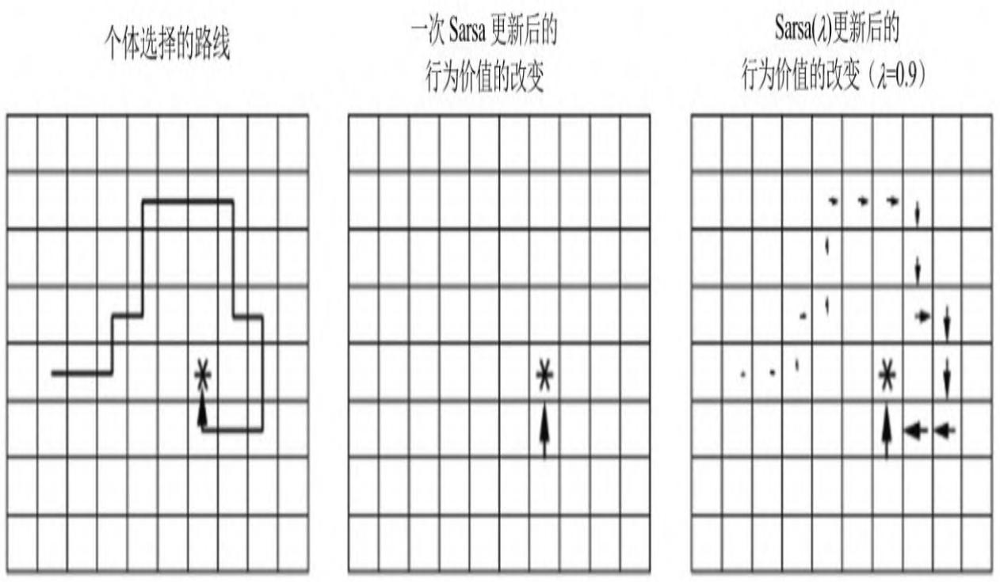


图5.4　图解Sarsa和Sarsa（λ）算法的区别

此时，如果要求个体继续学习，环境将个体再次放入起点。个体的第二次寻路过程一开始与首次一样都是盲目且随机的，直到其进入终点位置下方的位置 $S_H$ 。在这个位置，个体更新的策略将使其有非常大的概率选择向上的移步行为，于是直接进入终点位置 $S_G$ 。

同样，经过第二次寻路，个体了解到到达终点下方的位置 $S_{\mathrm{H}}$ 的价值比较大，因为在这个位置直接采取向上的移步行为就可以拿到到达终点的即时奖励。因此，它会将那些通过移动一步就可以到达 $S_{\mathrm{H}}$ 位置的其他位置以及相应的到达该位置所要采取的行为集合所对应的价值进行提升。如此反复，如果采用贪婪策略进行更新，那么个体最终将得到一条到达终点的路径，不过这条路径的倒数第二步永远是在终点位置的下方。如果采用ϵ贪婪策略进行更新，那么个体还会尝试到终点位置的左、上、右等其他方向的相邻位置，如果价值也比较大，那么个体每次完成的路径就可能都不一样。通过重复多次搜索，这种实质上有意义的Q值更新将覆盖越来越多的“状态-行为对”，个体在早期采取的随机行为的步数将越来越少，直至最终实质性的更新覆盖到起始位置。此时个体将能直接给出一条确定的从起点到终点的路径。

Sarsa（λ）算法：该算法同时还针对每一次状态序列维护一个关于“状态-行为对”（S,A）的E表，初始时E表值均为0。当个体首次在起点 $S_0$ 决定移动一步 $A_0$ （假设向右）时，它被环境告知新位置为 $S_1$ ，此时发生如下事情：首先，个体会做一个标记，使E $(S_0, A_0)$ ）的值增加

1，表明个体刚刚经历过这个事件 $(S_0, A_0)$ ）；其次，它要估计这个事件对于解决整个问题的价值，也就是估计TD误差，依据公式可得到结果为0，说明个体认为在起点处向右走没有什么价值。“没有什么价值”有两层含义：一是说明在 $S_0$ 处往右对解决问题没有积极的帮助，二是表明个体认为所有能够到达 $S_0$ 状态的“状态-行为对”的价值没有任何积极或消极的变化。随后，个体将要更新该状态序列中所有已经经历的Q（S,A）值，由于存在E值，那些在 $(S_0, A_0)$ ）之前近期发生或频繁发生的（S,A）的Q值将改变得比其他Q值明显些，此外个体还要更新其E值，以备下次使用。对于刚从起点出发的个体，这次更新没有使得任何Q值发生变化，仅仅在E $(S_0, A_0)$ ）处有了一个实质的变化。随后的过程类似，个体的发现就是对路径有一个记忆，体现在E里，具体的Q值没有发生变化。这个情况直到个体到达终点位置时发生改变。此时个体得到了一个即时奖励1，它会发现这一次变化 $(S_H)$ 采取向上移步行为 $A_{up}$ 到达 $S_G$ ）价值明显，它会计算这个TD误差为1，同时告诉整个经历过程中所有的（S,A），根据它与 $(S_H, A_{up})$ ）的密切关系更新这些“状态-行为对”的价值Q，个体在这个状态序列中经历的所有“状态-行为对”的Q值都将得到一个非0的更新，但是那些在个体到达 $S_H$ 之前就近发生以及频繁发生的“状态-行为对”的价值提升得更加明显。


在图示的例子中没有显示某一“状态-行为对”频发的情况，如果个体在寻路的过程中绕过一些弯，多次到达同一个位置，并在该位置采取相同的行为，最终到达终止状态，就产生了多次发生的（S,A），这时的（S,A）价值将会得到较多的提升。也就是说，个体每得到一个即时奖励，就会对所有历史事件的价值进行更新，当然那些与该事件关系紧密的事件价值改变得较为明显。这里的事件指的就是“状态-行为对”。在同一状态采取不同行为就是不同的事件。

当个体重新从起点第二次出发时，它会发现起点处向右走移步的价值不再是0。如果采用贪婪策略进行更新，个体将根据上次经验得到的新策略直接选择向右移步，并且一直按照原路找到终点。如果采用ϵ贪婪策略进行更新，那么个体还会尝试新的路线。为了解释方便，这里做了一些约定，并不要求个体找到最短的一条路径，如果需要寻找最短路径，那么在每一次状态转移时给个体一个负的奖励。

Sarsa（λ）算法在状态每发生一次变化后，都对整个状态空间和行为空间的Q和E值进行更新，而事实上在每一个状态序列中只有个体经历过的“状态-行为对”的E才可能不为0。那么为什么不仅仅对该状态序列涉及的“状态-行为对”进行更新呢？留给读者思考。

## 5.5 异策略Q学习算法

同策略学习的特点是产生实际行为的策略与更新价值（评价）所使用的策略是同一个策略，而异策略学习（Off-Policy Learning）中产生指导自身行为的策略 $\mu ( a | s )$ 与目标策略 $\pi ( a | s ) .$ 是不同的策略。具体地说，个体通过策略 $. \mu ( a | s )$ 生成行为与环境发生实际交互，但是在更新这个“状态-行为对”的价值时使用的是目标策略 $\pi ( a | s )$ 。目标策略$\pi ( a | s )$ 多数是已经具备一定能力的策略，例如人类已有的经验或其他个体学习到的经验。异策略学习相当于站在目标策略 $\pi ( {\boldsymbol{a}} | {\boldsymbol{s}} )$ 的“肩膀”上学习。异策略学习根据是否经历完整的状态序列，可以分为基于蒙特卡罗的异策略和基于TD的异策略。基于蒙特卡罗的异策略学习目前认为仅有理论上的研究价值，在实际中应用中用处不大。这里主要讲解常用的异策略TD学习。

异策略TD学习任务就是使用TD方法在目标策略 $\pi ( {\boldsymbol{a}} | {\boldsymbol{s}} )$ 的基础上更新行为价值，进而优化行为策略：

$$
V \left(S_{t}\right) \leftarrow V \left(S_{t}\right) + \alpha \left(\frac{\pi \left(A_{t} \mid S_{t}\right)}{\mu \left(A_{t} \mid S_{t}\right)} \left(R_{t + 1} + \gamma V \left(S_{t + 1}\right)\right) - V \left(S_{t}\right)\right)
$$

对于上式，我们可以这样理解：个体处在状态 $S_t$ 中，基于行为策略μ产生了一个行为 $A_t$ ，执行该行为后进入新的状态 $S_{t+1}$ ，异策略学习要做的事情就是，比较异策略和行为策略在状态 $S_t$ 下产生同样的行为 $A_t$ 的概率的比值，如果这个比值接近1，说明两个策略在状态 $S_t$ 下采取的行为 $A_t$ 的概率差不多，此次对于状态 $S_t$ 价值的更新同时得到两个策略的支持。如果这一概率比值很小，则表明异策略π在状态 $S_t$ 下选择 $A_t$ 的机会要小一些，此时为了从异策略学习，我们认为这一步状态价值的更新不是很符合异策略，因而在更新时打些折扣。类似地，如果这个概率比值大于1，说明按照异策略，选择行为 $A_t$ 的概率要大于当前行为策略产生 $A_t$ 的概率，此时对该状态的价值更新就可以大胆些。


异策略TD学习中一个典型的行为策略μ是基于行为价值函数$\mathsf{Q}(s, a)$ ）的ϵ贪婪策略，异策略π则是基于 $\mathbf{Q}(S, a)$ ）的完全贪婪策略，这种学习方法称为Q学习（Q Learning）。

Q学习的目标是得到最优价值 $\mathsf{Q}(s, a)$ ），在Q学习的过程中，t时刻与环境进行实际交互的行为 $A_t$ 由策略μ产生：

$$
A_{t} \sim \mu (\cdot | S_{t})
$$

其中，策略μ是一个ϵ贪婪策略。t+1时刻用来更新Q值的行为 $A_{t + 1} ^{\prime}$ 由下式产生：

$$
A_{t + 1} ^{\prime} \sim \pi (\cdot | S_{t + 1})
$$

其中，策略π是一个完全贪婪策略。 $Q(S_t, A_t)$ ）按下式更新：

$$
Q \left(S_{t}, A_{t}\right) \leftarrow Q \left(S_{t}, A_{t}\right) + \alpha \left(R_{t + 1} + \gamma Q \left(S_{t + 1}, A^{\prime}\right) - Q \left(S_{t}, A_{t}\right)\right)
$$

其中，TD目标 $R_{t + 1} + \gamma Q ( S_{t + 1} , A^{\prime} )$ 是基于异策略π产生的行为 $A'$ 得到的Q值。根据这种价值更新的方式，状态 $S_t$ 依据ϵ贪婪策略得到的行为 $A_t$ 的价值，将朝着 $S_{t+1}$ 状态下贪婪策略确定的最大行为价值的方向做一定比例的更新。这种算法能够使个体的行为策略μ更加接近贪婪策略，同时保证个体能持续探索并经历足够丰富的新状态，并最终收敛至最优策略和最优行为价值函数。

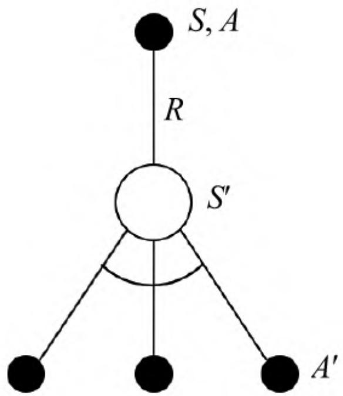


图5.5　Q学习算法示意图

Q学习算法示意图如图5.5所示，具体的行为价值更新公式如下：

$$
Q \left(S_{t}, A_{t}\right) \leftarrow Q \left(S_{t}, A_{t}\right) + \alpha \left(R + \gamma \max_{a^{\prime}} Q \left(S_{t + 1}, a^{\prime}\right) - Q \left(S_{t}, A_{t}\right)\right) \tag{5.11}
$$

Q学习的算法流程如算法3所述。

<pre class="pseudocode">
$$
\begin{algorithm}
$$

\caption{算法 3: Q学习算法}

\begin{algorithmic}
state 输入: episodes, $\alpha$, $\gamma$
state 输出: $Q$
state 初始化: set $Q(s, a)$ arbitrarily, for each $s \in S$ and $a \in A(s)$; set $Q(terminal\ state, \cdot) = 0$
for{each episode}
    state $S \leftarrow$ first state of episode
    repeat
        state $A = policy(Q, S)$ (e.g. $\varepsilon$-greedy policy)
        state $R, S' = perform_action(S, A)$
        state $Q(S, A) \leftarrow Q(S, A) + \alpha\left(R + \gamma \max_{a} Q(S', a) - Q(S, A)\right)$
        state $S \leftarrow S'$
    until{$S$ is terminal state}
endfor
\end{algorithmic}
\end{algorithm}
</pre>


这里通过悬崖行走的例子（见图5.6）简要讲解Sarsa算法与Q学习算法在学习过程中的差别。任务要求个体从悬崖的一端以尽可能快的速度行走到悬崖的另一端，每多走一步给予-1的奖励。

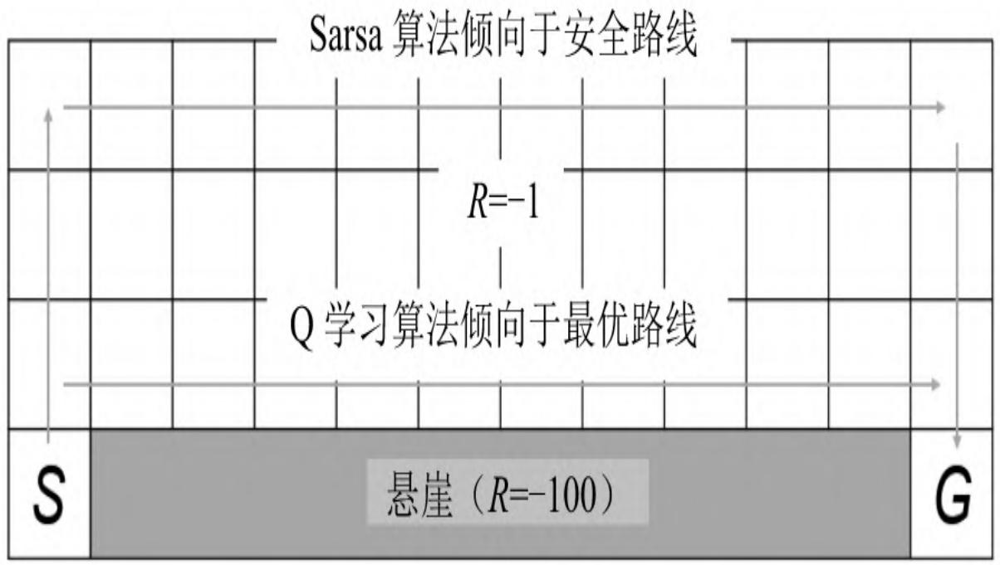


图5.6　悬崖行走示例

在图5.6中，悬崖用灰色的长方形表示，一端是起点S，另一端是目标终点G。个体如果坠入悬崖将得到一个非常大的负向奖励（-100）并回到起点S。从中可以看出最优路线是贴着悬崖上方行走。Q学习算法可以较快地学习到这个最优策略，但是Sarsa算法学到的是与悬崖保持一定距离的安全路线。在两种学习算法中，由于生成行为的策略依然是ϵ贪婪策略，因此会偶尔发生坠入悬崖的情况，若ϵ贪婪策略中的ϵ随经历的增加而逐渐趋于0，则两种算法都将最后收敛至最优策略。

## 5.6 编程实践：蒙特卡罗学习求解21点游戏的最优策略

在本节的编程实践中，我们将继续使用[第4章](ch04.md)21点游戏的例子，只是这次我们要使用基于同策略蒙特卡罗控制的方法来求解21点游戏玩家的最优策略。我们把[第4章](ch04.md)编写的Dealer、Player和Arena类保存至文件blackjack.py中，并加载这些类以及其他一些需要的库和方法：

```python
from blackjack import Player, Dealer, Arena
from utils import str_key, set_dict, get_dict
from utils import draw_value, draw_policy
from utils import epsilon_greedy_policy
import math
```

目前的Player类不具备策略评估和更新策略的能力，我们基于Player类编写一个MC_Player类，使其具备使用蒙特卡罗控制算法进行策略更新的能力，代码如下：

```python
class MC_Player(Player):
    '''具备蒙特卡罗控制能力的玩家'''
自己的学习方法
def learn_Q(self, episode, r):
    ## 从状态序列来学习Q值
    '''从一个状态序列（Episode）学习'''    for s, a in episode:
    nsa = get_dict(self.Nsa, s, a)
    set_dict(self.Nsa, nsa+1, s, a)
    q = get_dict(self.Q, s,a)
    set_dict(self.Q, q+(r-q)/(nsa+1), s, a)
    self.total_learning_times += 1

def reset_memory(self):
    '''忘记既往学习经历'''    self.Q.clear()
    self.Nsa.clear()
    self.total_learning_times = 0

def epsilon_greedy_policy(self, dealer, epsilon=None):
    '''这里的贪婪策略是带有状态序列参数的'''
    player_points, _ = self.get_points()
    if player_points >= 21:
    return self.A[1]
    if player_points < 12:
    return self.A[0]
    else:
    A, Q = self.A, self.Q
    s = self.get_state_name(dealer)
    if epsilon is None:
    #epsilon = 1.0/(self.total_learning_times+1)
    #epsilon =
    1.0/(1+math.sqrt(1+player.total_learning_times))
    epsilon =
    1.0/(1+4*math.log10(1+player.total_learning_times))
    return epsilon_greedy_policy(A, s, Q, epsilon)
```

这样，MC_Player类就具备了学习Q值的方法和一个ϵ贪婪策略。接下来我们使用MC_Player类来生成对局，庄家的策略仍然不变。

A = ["继续叫牌", "停止叫牌"]
```hcl
display = False
```

```python
player = MC_Player(A = A, display = display)
dealer = Dealer(A = A, display = display)
arena = Arena(A = A, display=display)
arena.play_games(dealer=dealer, player=player, num=200000, show_statistic=True)
输出结果类似如下形式:
100%| 200000/200000 [00:25<00:00, 7991.15it/s]
共玩了200000局，玩家赢85019/和15790/输99191，胜率：0.43，不输率：0.50
```

MC_Player学习到的行为价值函数和最优策略可以使用下面的代码绘制：

```python
draw_value(player.Q, useable_ace = True, is_q_dict=True, A = player.A)
draw_policy(epsilon_greedy_policy, player.A, player.Q, \
epsilon = 1e-10, useable_ace = True)
draw_value(player.Q, useable_ace = False, is_q_dict=True, A = player.A)
draw_policy(epsilon_greedy_policy, player.A, player.Q, \
epsilon = 1e-10, useable_ace = False)
```

绘制结果如图5.7所示。在策略图中，深色部分（上半部）为“停止叫牌”，浅色部分（下半部）为“继续叫牌”。基于[第4章](ch04.md)介绍的21点游戏规则，迭代20万次后得到的贪婪策略为：当玩家手中有“可用的牌A”时，牌点数达到17点，仍可选择叫牌；当玩家手中没有“可用的牌A”时，若庄家的明牌在2\~7点则最好停止叫牌，若庄家的明牌为A或者超过7点则可以选择继续叫牌直至手中的牌点数到达16为止。训练次数并不多，因此策略图中还有一些零星的散点。

可以编写代码生成一些对局的详细数据，观察具备MC控制能力的玩家的行为策略。

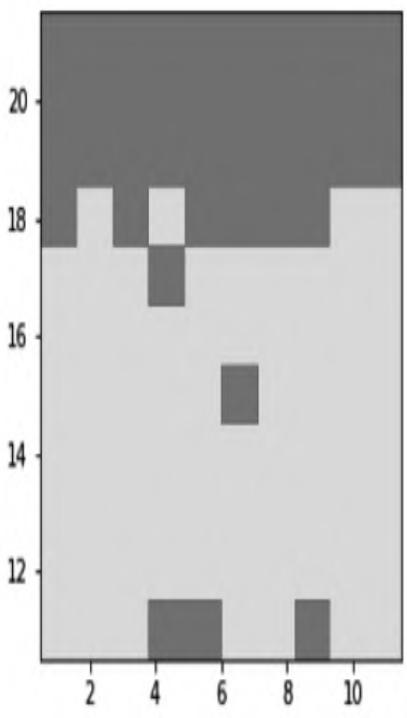


（a）最优策略（有可用的牌A）

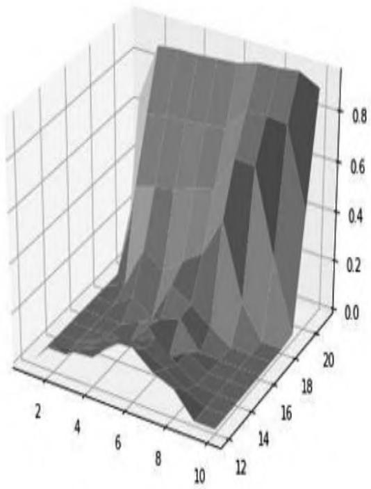


（b）行为价值（有可用的牌A）

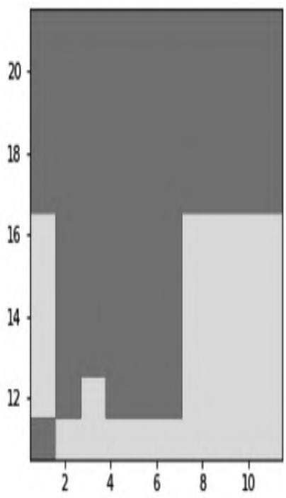


（c）最优策略（没有可用的牌A）

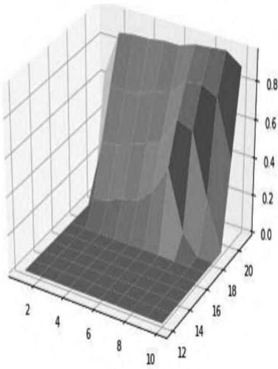


（d）行为价值（没有可用的牌A）

图5.7　21点游戏蒙特卡罗控制学习结果（20万次迭代）

## 5.7 编程实践：构建基于gym的有风的格子世界及个体

强化学习讲究个体与环境的交互，聚焦于如何提高个体在与环境交互中的智能水平。我们在进行编程实践时需要实现这些算法。为了验证这些算法的有效性，需要有相应的环境。我们既可以自己编写环境，像前面介绍的21点游戏那样，也可以借助一些别人编写的环境，把重点放在个体学习算法的实现上。本节将向大家介绍一个出色的基于Python的强化学习库（gym库），随后编写一个具备记忆功能的个体基类，为5.8节编写个体的各种学习算法做准备。

### 5.7.1 gym库简介

gym库提供了一整套编程接口和丰富的强化学习环境，同时还提供了可视化功能，方便观察个体的训练结果。该库的核心在core.py文件中，定义了两个最基本的Env类和Space类。前者是所有环境类的基类，后者是所有空间类的基类。从Space基类派生出几个常用的空间类，其中最主要的是Discrete类和Box类。前者对应于一维离散空间，后者对应于多维连续空间。它们既可以应用在行为空间中，也可以用来描述状态空间。例如，描述[第3章](ch03.md)提到的4×4的格子世界，一共有16个状态，每个状态只需要用一个数字来描述即可，也就是说把这个问题的状态空间用Discrete（16）对象来描述就可以了，对应的行为空间可用Discrete（4）来描述。

gym库的Env类包含如下几个关键的变量和方法：

```python
class Env(object):
    # Set these in ALL subclasses
    action_space = None
    observation_space = None
    # Override in ALL subclasses
    def step(self, action): raise NotImplementedError
    def reset(self): raise NotImplementedError
    def render(self, mode='human', close=False):
    return def seed(self, seed=None): return []
```

Env类是所有环境类的基类，只是定义了环境应该具备的属性和功能，具体的环境类需要重写（Override）这些方法以完成特定的功能。其中：

·step()方法是最核心的方法，定义环境的动力学，确定个体的下一个状态、奖励信息、个体是否到达终止状态，以及一些额外的信息。其中，个体的下一个状态、奖励信息、个体是否到达终止状态是可以被个体用来进行强化学习训练的。

·reset()方法用于重置环境，需要将个体的状态重置为初始状态并进行其他可能的一些初始化设置。环境应在个体与其交互前调用此方法。

·seed()设置一些随机数的种子。

·render()负责一些可视化工作。如果需要将个体与环境的交互以动画的形式展示出来，就要重写该方法。简单的UI设计可以用gym包装好的pyglet方法来实现，这些方法在rendering.py文件中定义。具体如何使用这些方法进行UI绘制，则需要了解基本的OpenGL编程思想和接口，这里就不展开了。

在知道Env类的主要接口后，可以按照其接口规范编写自己的环境类用于个体训练。要使用gym库提供的功能，需要导入gym库：

生成一个gym库内置的环境对象可以使用下面的代码：

```python
env = gym.make("registered_env_name") # 参数为注册了的环境名称
```

如果是使用自己编写的环境类，则可以像正常生成对象一样：

```txt
env = MyEnvClassName()
```

个体在与gym环境进行交互时，最重要的一句代码是：

```txt
state, reward, is_done, info = env.step(a)
```

在这句代码中，作为环境类的对象env执行了step（a）方法，方法的参数a是个体在当前状态时依据行为策略得到的行为。环境对象的step（a）方法返回由4个元素组成的元组，依次代表个体的下一个状态state、获得的即时奖励reward、是否到达终止状态is_done以及一个信息对象info。个体可以利用前3个元素的信息来进行训练，info对象则仅提供给编程者调试使用。

我们已经编写了一个符合gym环境基类接口的格子世界环境类，并在此基础上实现了有风的格子世界环境、悬崖行走、随机行走等各种环境。为了节约篇幅，这里不再讲解格子世界的详细实现过程，有兴趣的读者可以参考本书附带的源代码。

### 5.7.2 状态序列的管理

个体与环境进行交互时会生成一个或多个甚至大量的状态序列，如何管理好这些状态序列是编程实践环节一个比较重要的任务。状态序列是时间序列，在每一个时间步上个体与环境交互的信息包括个体的状态 $( \mathrm{S} _{\mathrm{t}} )$ 、采取的行为 $\left( \mathrm{A} _{\mathrm{t}} \right)$ 、上一个行为得到的奖励 $\mathrm{R} _{\mathrm{t} + 1}$ 这3个方面。描述一个完整的状态转换还应包括两个信息：下一时刻个体的状态 $( \mathrm{S} _{\mathrm{t} + 1}$ ）和下一时刻的状态是否是终止状态（is_end）。多个相邻的状态转换构成了一个状态序列。多个完整的状态序列形成了个体的整体记忆，用Memory或Experience表示。通常一个个体的记忆容量不是无限的，在记忆的容量用满的情况下，如果个体需要记录新发生的状态序列，可以选择忘记最早期的一些状态序列。


在强化学习的个体训练中，如果使用MC学习算法，则需要学习完整的序列；如果使用TD学习，则最小的学习单位是一个状态转换。许多常用的TD学习算法刻意选择不连续的状态转换学习方式，以此来降低TD学习在一个序列中的偏差。在这种情况下是否把状态转换按时间次序以状态序列的形式进行管理就显得不那么重要了，这里为了解释一些MC学习类算法，仍然采取使用状态序列这一中间形式来管理个体的记忆。

基于上述考虑，我们依次设计Transition类、Episode类和Experience类来综合管理个体与环境交互时产生的多个状态序列。限于篇幅，这里不介绍具体的实现代码，仅列出这些类中一些重要的属性和方法：

```python
此段代码是不完整的代码，完整代码请参阅本书附带的源代码
class Transition(object):
    def __init__(self, s0, a0, reward: float, is_done: bool, s1):
    self.data = [s0, a0, reward, is_done, s1]
    # ...

class Episode(object):
    def __init__(self, e_id: int = 0) -> None:
    self.total_reward = 0    # 获得总奖励值
    self.trans_list = []    # 状态转移列表
    self.name = str(e_id)
    # 可以给状态序列（Episode）起个名字："成功闯关，黯然失败？"

    def push(self, trans:Transition) -> float:
    '''将一个状态转换送入状态序列中，返回该序列当前的总奖励值'''    # ...

    @property
    def len(self):
    return len(self.trans_list)

    def is_complete(self) -> bool:
    '''判断当前状态序列是否是一个完整的状态序列'''    # ...

    def sample(self, batch_size = 1):
    '''从当前状态序列中随机产生一定数量不连续的状态转换'''    # ...

class Experience(object):
    def __init__(self, capacity:int = 20000):

self.capacity = capacity    # 容量：指的是
状态转换(trans)的总数量
    selfEpisodes = []
    # 状态
序列(episode)列表
    self.total_trans = 0    # 总的
状态转换数量

def _remove_first(self):
    '''删除第一个（最早的）状态序列'''    # ...
def push(self, trans):
    '''记住一个状态转换，根据当前状态序列是否已经完整来将trans加入现有状态序列
    还是开启一个新的状态序列'''    # ...
def sample(self, batch_size=1):
    '''随机从经历中产生一定数量不连续的状态转换'''    # ...
def sample_episode(self, episode_num = 1):
    '''从经历中随机获取一定数量的完整状态序列'''    # ...
@property
def last_episode(self):
    '''得到当前最新的一个状态序列'''    #...

5.7.3 个体基类的编写

我们把重点放在编写一个描述个体的基类（Agent）上，为后续实现各种强化学习算法提供一个基础。这个基类符合gym库的接口规范，具备个体最基本的功能，同时希望个体具有一定容量的记忆功能，能够记住曾经经历过的一些状态序列。我们还希望个体在学习时能够记住一些学习过程，便于分析个体的学习效果等。有了个体基类之后，在讲解一个具体强化学习算法时仅需实现特定的方法即可。

在[第1章](ch01.md)讲解强化学习初步概念时，已对个体类进行了一个初步的建模，这次要构建的是符合gym接口规范的Agent基类，其中一个最基本的要求是个体类的对象在构造时接受环境对象作为参数，内部也创建一个成员变量引用这个环境对象。在我们设计的个体基类中，它的成员变量包括对环境对象的应用、状态和行为空间、与环境交互产生的经历、当前状态等。

此外对于个体来说，还应具备的能力有遵循策略产生一个行为、执行一个行为与环境交互、采用什么学习方法、具体如何学习，其中最关键的是个体执行行为与环境进行交互的方法。下面的代码实现了我们的需求。

```python
def __init__(self,env:Env=None, capacity = 10000):
    # 保存一些个体（Agent）可以观测到的环境信息以及已经学到的经验
    self.env = env    # 建立对环境对象的引用
    self.obs_space = env.observation_space if env is not None else None
    self.action_space=env.action_space if env is not None else None
    if type(self.obs_space) in [gym.spaces.Discrete]:
    self.S = [str(i) for i in range(self.obs_space.n)]
    self.A = [str(i) for i in range(self.action_space.n)]
    else:
    self.S, self.A = None, None
    self.experience = Experience(capacity = capacity)
    # 有一个变量记录个体agent当前的状态state相对来说还是比较方便的，
    # 要注意对该变量的维护和更新
    self.state = None    # 个体的当前状态

    def policy(self, A, s = None, Q = None, epsilon = None):
    '''均匀随机策略'''    return random.sample(self.A,k=1)[0]

    def perform_policy(self, s, Q = None, epsilon = 0.05):
    action = self.policy(self.A, s, Q, epsilon)
    return int(action)

    def act(self, a0):
    s0 = self.state
    s1, r1, is_done, info = self.env.step(a0)
    trans = Transition(s0, a0, r1, is_done, s1)
    total_reward = self.experience.push(trans)
    self.state = s1
    return s1, r1, is_done, info, total_reward

    def learning_method(self, lambda_ = 0.9, gamma = 0.9, alpha = 0.5,
    epsilon = 0.2, display = False):

'''这是一个没有学习能力的学习方法

具体针对某算法的学习方法，返回值需要是一个二维元组：(一个状态序列的时间步、该状态序列的总奖励值)'''
        self.state = self.env.reset()
s0 = self.state
if display:
    self.env.render()
a0 = self.perform_policy(s0, epsilon)
time_in_episode, total_reward = 0, 0
is_done = False
while not is_done:
    s1, r1, is_done, info, total_reward =
self.act(a0)
    if display:
    self.env.render()
    a1 = self.perform_policy(s1, epsilon)
    s0, a0 = s1, a1
    time_in_episode += 1
    if display:
    print(self.experience.last_episode)
    return time_in_episode, total_reward

def learning(self, lambda_ = 0.9, epsilon = None,
    decaying_epsilon = True, gamma = 0.9,
    alpha = 0.1, max_episode_num = 800,
display = False):
    total_time, episode_reward, num_episode = 0, 0, 0
    total_times, episode_rewards, num_episodes = [],
[], []
for i in tqdm(range(max_episode_num)):
    if epsilon is None:
    epsilon = 1e-10
    elif decaying_epsilon:
    epsilon = 1.0 / (1 + num_episode)
    time_in_episode, episode_reward =
self.learning_method(
    lambda_ = lambda_,
    gamma=gamma, alpha=alpha,
    epsilon=epsilon,
    display=display)
    total_time += time_in_episode
    num_episode += 1
    total_times.append(total_time)
    episode_rewards.append(episode_reward)
    num_episodes.append(num_episode)
self.experience.last_episode.print_detail()

return total_times, episode_rewards, num_episodes

def sample(self, batch_size = 64):
    '''随机取样'''    return self.experience.sample(batch_size)

@property
def total_trans(self):
    '''得到Experience里记录的状态转换总数'''return self.experience.total_trans

def last_episode_detail(self):
    self.experience.last_episode.print_detail()
```

不难看出Agent类的策略是最原始的均匀随机策略，不具备学习能力，不过已经具备了与gym环境进行交互的能力。该个体不具备学习能力，可以编写如下代码来观察均匀随机策略下个体在有风的格子世界里的交互情况：

测试个体基类和有风的格子世界环境
```python
import gym
from gym import Env
from gridworld import WindyGridWorld    # 导入有风的格子世界环境
from core import Agent    #
导入个体基类

env = WindyGridWorld()    # 生成有风的格子世界环境对象
env.reset()    #
重置环境对象
env.render()    #
显示环境对象可视化界面
agent=Agent(env,capacity=10000)    # 创建个体Agent对象
data=agent.learning(max_episode_num=180,display=False)
env.close()    # 关闭可视化界面
```

运行上述代码将显示如图5.8所示的一个有风的格子世界交互界面。图中多数格子用粉红色绘制（因为本书黑白印刷，读者看到的应该为灰色），表示个体在离开该格子时将获得-1的即时奖励，白色的格子对应的即时奖励为0；有黑色边框的格子是个体的起始状态，黑色边框的白色格子是终止状态，个体用小圆形来表示。风的效果并未反映在可视化界面上，但它将实实在在地影响个体采取一个行为后的后续状态（位置）。

由于可视化交互在进行多次尝试时浪费计算资源，因此我们在随后进行180次的尝试期间选择不显示个体的动态活动。其180次的交互信息存储在对象data内。图5.9是依据data绘制的该个体与环境交互产生的状态序列时间步数与状态序列次数的关系图，从中可以看出个体最多用三万多步才完成一个完整的状态序列。

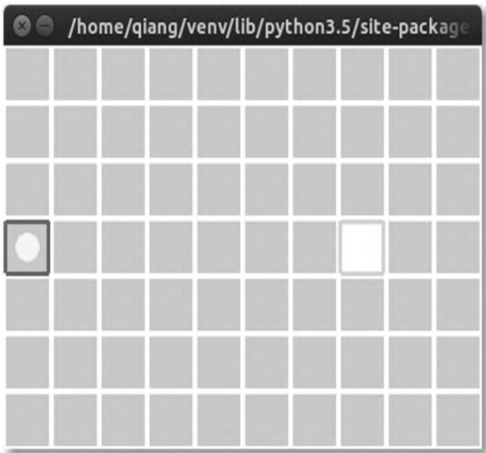


图5.8　有风的格子世界环境的可视化界面

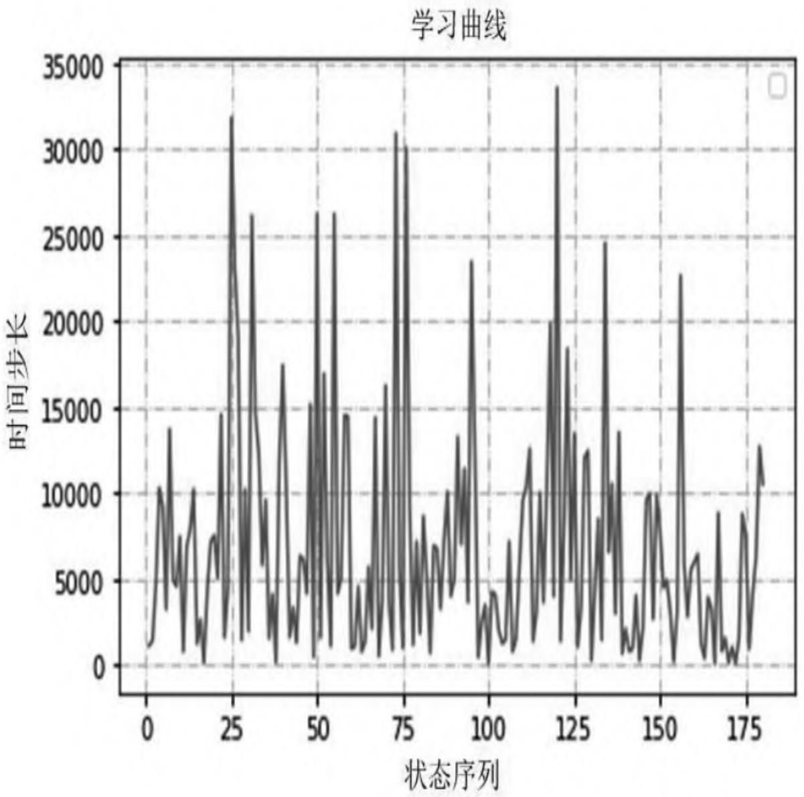


图5.9　均匀随机策略的个体在有风的格子世界环境中的表现

要让个体具备学习能力需要改写策略方法policy以及学习方法learning_method。5.8节将详细介绍不同学习算法的实现并观察它们在有风的格子世界中的交互效果。

5.8 编程实践：各类学习算法的实现及与有风的格子世界的交互

在本节的编程实践中，我们将使用自己编写的有风的格子世界环境类，在Agent基类的基础上分别建立具有Sarsa学习、Sarsa(λ)学习和Q学习能力的3个个体子类，分别实现其策略方法以及学习方法。

对于这3类学习算法要用到贪婪策略或ϵ贪婪策略，由于我们计划使用字典来存储行为价值函数的数据，还会用到之前编写的根据状态生成键以及读取字典的方法，因此在本节中将这些方法放在一个名为utls.py的文件中，有风的格子世界环境类的实现代码在gridworld.py文件中，个体基类的实现代码在core.py中。将这3个文件存放在当前工作目录下。下面的代码将从这些文件中导入要使用的类和方法：

```python
from random import random, choice
from core import Agent
from gym import Env
import gym
from gridworld import WindyGridWorld, SimpleGridWorld
from utils import str_key, set_dict, get_dict
from utils import epsilon_greedy_pi, epsilon_greedy_policy
from utils import greedy_policy, learning_curve
```

### 5.8.1 Sarsa算法

本章前文中的算法1给出了Sarsa算法的流程，依据流程不难得到如下实现代码：

```python
class SarsaAgent(Agent):
    def __init__(self, env:Env, capacity:int = 20000):
    super(SarsaAgent, self).__init__(env, capacity)
    self.Q = {}    # 增加Q字典存储行为价值

    def policy(self, A, s, Q, epsilon):
    '''使用epsilon贪婪策略'''
    return epsilon_greedy_policy(A,s,Q,epsilon)

    def learning_method(self, gamma=0.9, alpha=0.1,
    epsilon=1e-5,
    display=False, lambda_=None):
    self.state=self.env.reset()
    s0 = self.state
    if display:
    self.env.render()
    a0 = self.perform_policy(s0, self.Q, epsilon)
    # print(self.action_t.name)
    time_in_episode, total_reward = 0, 0
    is_done = False
    while not is_done:
    s1, r1, is_done, info, total_reward =
    self.act(a0)
    if display:
    self.env.render()
    a1 = self.perform_policy(s1, self.Q, epsilon)
    old_q = get_dict(self.Q, s0, a0)
    q_prime = get_dict(self.Q, s1, a1)
    td_target = r1 + gamma * q_prime
    new_q = old_q + alpha * (td_target - old_q)
    set_dict(self.Q, new_q, s0, a0)
    s0, a0 = s1, a1
    time_in_episode += 1
```

```python
if display: print(self.experience.last_episode)
return time_in_episode, total_reward
```

### 5.8.2 Sarsa（λ）算法

本章前文中的算法2给出了Sarsa（λ）算法的流程，依据流程不难得到如下实现代码：

```python
class SarsaLambdaAgent(Agent):
    def __init__(self, env:Env, capacity:int = 20000):
    super(SarsaLambdaAgent, self).__init__(env, capacity)
    self.Q = {}

    def policy(self, A, s, Q, epsilon):
    return epsilon_greedy_policy(A, s, Q, epsilon)

    def learning_method(self, lambda_=0.9, gamma=0.9, alpha=0.1, epsilon=1e-5, display = False):
    self.state=self.env.reset()
    s0=self.state
    if display:
    self.env.render()
    a0 = self.perform_policy(s0, self.Q, epsilon)
    # print(self.action_t.name)
    time_in_episode, total_reward = 0,0
    is_done = False
    E = {} # 效用值
    while not is_done:
    s1, r1, is_done, info, total_reward = self.act(a0)
    if display:
    self.env.render()
    a1 = self.perform_policy(s1, self.Q, epsilon)
    q = get_dict(self.Q, s0, a0)
    q_prime = get_dict(self.Q, s1, a1)
    delta=r1 + gamma * q_prime - q

    e = get_dict(E,s0,a0)
```

```python
e += 1
set_dict(E, e, s0, a0)
for s in self.S:
    ## 对所有可能的 Q(s,a)进行更新
    for a in self.A:
        e_value = get_dict(E, s, a)
        old_q = get_dict(self.Q, s, a)
        new_q = old_q + alpha*delta*e_value
        new_e = gamma*lambda*e_value
        set_dict(self.Q, new_q, s, a)
        set_dict(E, new_e, s, a)
```

```python
s0, a0 = s1, a1
time_in_episode += 1
if display:
    print(self.experience.last_episode)
return time_in_episode, total_reward
```

### 5.8.3 Q学习算法

本章前文中的算法3给出了Q学习算法的流程，依据流程不难得到如下实现代码：

```python
class QAgent(Agent):
    def __init__(self, env:Env, capacity:int = 20000):
    super(QAgent, self).__init__(env, capacity)
    self.Q = {}

    def policy(self, A, s, Q, epsilon):
    return epsilon_greedy_policy(A, s, Q, epsilon)

    def learning_method(self, gamma=0.9, alpha=0.1,
    epsilon=1e-5,
    display=False, lambda_=None):
    self.state=self.env.reset()
    s0 = self.state
    if display:
    self.env.render()
    time_in_episode, total_reward=0, 0
    is_done = False
    while not is_done:
    self.policy = epsilon_greedy_policy

行为策略
    a0 = self.perform_policy(s0, self.Q, epsilon)
    s1, r1, is_done, info,
    total_reward=self.act(a0)
    if display:
    self.env.render()
    self.policy = greedy_policy
    a1 = greedy_policy(self.A, s1, self.Q) # 异策略
    old_q = get_dict(self.Q, s0, a0)
    q_prime = get_dict(self.Q, s1, a1)
    td_target = r1 + gamma * q_prime
    new_q=old_q+alpha * (td_target - old_q)
    set_dict(self.Q, new_q, s0, a0)
```

```python
s0 = s1
time_in_episode += 1
if display:
    print(self.experience.last_episode)
return time_in_episode, total_reward
```

可借鉴Agent基类与环境交互的代码来实现拥有各种不同学习能力的子类与有风的格子世界进行交互的代码，体会3种学习算法的区别。以Sarsa（λ）算法为例，下面的代码将实现与有风的格子世界环境的交互：

```python
env=WindyGridWorld()
agent=SarsaLambdaAgent(env, capacity = 100000)
statistics = agent.learning(lambda_ = 0.8, gamma = 1.0,
epsilon = 0.2, \
decaying_epsilon=True, alpha=0.5,
max_episode_num=800, display=False)
```

如果对个体行为的可视化表现感兴趣，可以将learning方法内的参数display设置为True。下面的代码将可视化展示出个体两次完整的交互经历：

```txt
agent.learning(max_episode_num = 2, display = True)
```

需要指出的是这3种学习算法在完成第一个完整状态序列时可能会花费较长的时间步数，特别是对于Sarsa（λ）算法来说，由于在每一个时间步都要做大量的计算工作，因此花费的计算资源更多，该算法的优势是在线实时学习。

gridworld.py中提供了悬崖行走环境CliffWalk类，可以直接使用这3个Agent类来观察比较它们在悬崖行走环境中的表现。

