# 第6章 价值函数的近似表示

本章之前的内容介绍的多是状态数不多、规模比较小的强化学习问题，生活中有许多实际问题要复杂得多，有些问题的状态数量巨大或者具有连续的状态，有些问题可选择的行为数量很多或者具有连续的行为。这些问题如果使用前几章介绍的基本算法求解，效率则会很低，甚至无法进行较好的求解。本章内容侧重于求解那些状态数量众多或者具有连续状态的强化学习问题。

解决这类问题的常用方法是，不再使用字典之类的查表式方法来存储状态或行为的价值，而是引入有限个适当的参数来恰当描述状态的特征，构建一定的基于特征的函数来近似计算状态或行为价值。这种设计的好处是不需要存储每一个状态或行为价值的数据，而只需要存储有限个特征参数和函数设计就够了，其优点是显而易见的。

在引入近似价值函数后，在强化学习中不管是预测问题还是控制问题，就转变成了两个问题：设计近似函数和求解近似函数的参数。函数近似主要分为线性函数近似和非线性近似两类，其中非线性近似的主流设计是使用深度神经网络技术。神经网络参数值可按照一般训练神经网络的流程（建立合适的目标函数、选择合适的优化算法和中止训练算法、准备训练数据集、训练网络等）来求解。由此诞生了著名的强化学习算法：深度Q学习网络（DNQ）。本章将详细讲解这些问题。

## 6.1 价值近似的意义

第5章介绍的几个强化学习算法都属于查表式（Table Lookup）算法，其特点在于每一个状态或行为价值都用一个独立的数据进行存储，整体像一张大表格一样。在编程实现中多使用字典这种数据结构，我们通过查字典的方式来获取状态和行为的价值。这种算法的设计对于状态或行为数量比较少的问题是快速有效的。例如，在上一章所描述的有风的格子世界环境中，每一个小格子代表一个状态，一共有70个状态，而个体的行为只有标准的4个移步行为，总体上也只有280个价值数据，可以说规模相当小。

参考图6.1，我们来说明一个比较经典的冰球世界（PuckWorld）强化学习问题。环境由一个正方形区域构成，代表冰球场地，场地内的大圆代表运动员个体、小圆代表目标冰球。在这个正方形环境中，小圆会每隔一定的时间随机改变它在场地的位置，而代表个体的大圆的任务是尽可能快地接近冰球目标。大圆可以操作的行为是在水平和垂直共4个方向上，在一个时间步长内施加一定大小和方向的力，借此来改变大圆的速度。环境会在每一个时间步内告诉个体（大圆）当前的水平与垂直坐标、当前的速度在水平和垂直方向上的分量以及目标冰球（小圆）的水平和垂直坐标共6项数据，同时确定奖励值为个体与目标两者中心距离的负数，也就是距离越大奖励值越低且最高奖励值为0。


图6.1　PuckWorld环境界面

如果打算用强化学习的算法来求解，那么其中一个重要的问题就是如何描述作为大圆的个体在环境中的状态。根据描述，环境给予的状态空间有6个特征，每一个特征都是连续的变量。如果把正方形场地的边长认为是单位值1，那么描述个体水平坐标的特征值可以是0和1之间的所有连续变量，其他5个特征也类似。如果一定要采取查表式的方法确定每一个“状态-行为对”的价值，那么只能将每一个特征进行分割，例如将0\~1平均分为100等份，当个体的水平坐标位于这100个区间的某一区间内时，其水平坐标的特征值相同。这种近似的求解方式看似有效，但存在一个问题：多少等份才合理呢？分割得越细，结果势必越准确，但带来状态的数量势必要增大很多。即使每一个特征都分割成100等份的区间，对于一共有6个特征的状态空间和4个离散行为的行为空间来说，也需要 $100^{6} \times 4 {=} 4 \times 10^{12}$ 个数据来描述行为价值，如果每个数据用1个字节表示，则一共需要3726GB的内存容量，这无疑是不现实的。如果分割的区间数较少，那么问题有可能得不到较好的求解结果。假设你拥有一台容量足够的计算机能使用查表法求解上述问题，如果仔细查看表中的数据，我们就会发现表中特征比较接近的那些众多“状态-行为对”其对应的价值也比较接近，这无疑不是经济、高效的求解办法。


如果能建立一个函数 ，这个函数由参数w描述，它可以直接接受表示状态特征的连续变量s作为输入，计算得到一个状态的价值，通过调整参数w的取值使其符合基于某一策略π的最终状态价值，那么这个函数就是状态价值 的近似表示。

$$
\hat{v} (\boldsymbol{s}, \boldsymbol{w}) \approx v_{\pi} (\boldsymbol{s})
$$

类似地，如果由参数w构成的函数q同时接受状态变量s和行为变量a，计算输出一个行为价值，通过调整参数w的取值，使其符合基于某一策略π的最终行为价值，那么这个函数就是行为价值 的近似表示。

$$
\hat{q} (s, a, w) \approx q_{\pi} (s, a)
$$

此外，由参数构成的函数仅接受状态变量作为输入，计算输出针对行为空间的每一个离散行为的价值，这是另一种行为价值的近似表示。

在上面的公式中，描述状态的s不再是一个字符串或者一个索引，而是由一系列的数据组成的向量，构成向量的每一项称为状态的一个特征，该项的数据值称为特征值；参数w需要通过求解来确定，通常也是一个向量（或矩阵、张量等）。图6.2直观地显示了上述3种价值近似表示的特点。

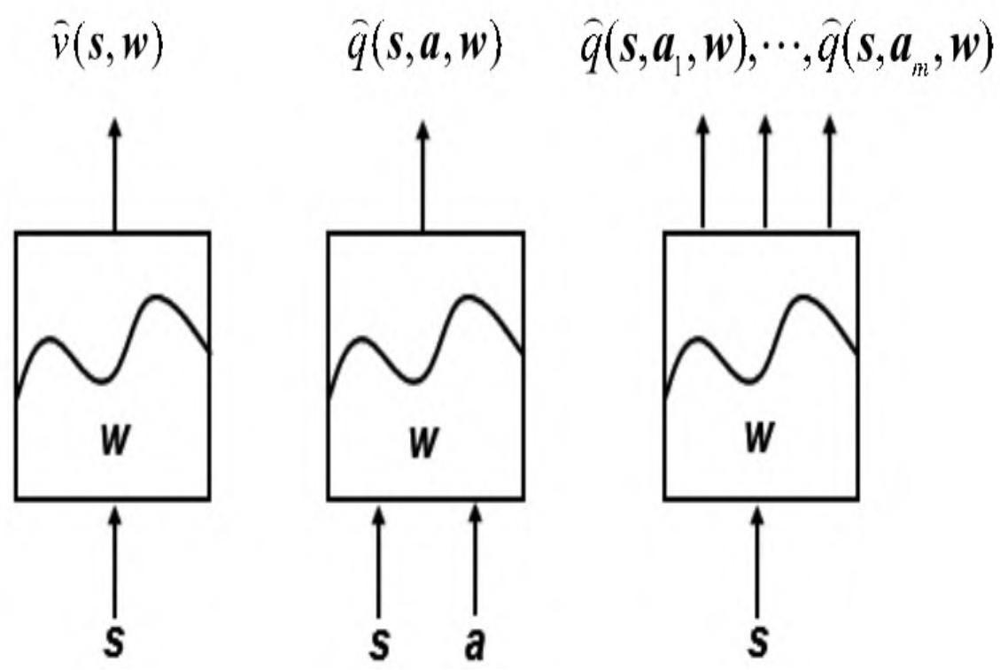
图6.2　3种不同类型的价值函数架构

构建了价值函数的近似表示后，强化学习中的预测和控制问题就转变为求解近似价值函数的参数w了。通过建立目标函数，使用梯度下降联合多次迭代的方式可以求解参数w。

## 6.2 目标函数与梯度下降

### 6.2.1 目标函数

先来回顾一下第5章中介绍的几个经典学习算法得到最终价值的思想，首先是随机初始化各价值，通过分析每一个时间步长内产生的状态转换数据，得到一个当前状态的目标价值，这个目标价值由即时奖励和后续价值共同来体现。由于学习过程中的各价值都是不准确的，因此在更新价值的时候只是沿着目标价值的方向做一个很小幅度（α）的更新：

$$
Q (S, A) \leftarrow Q (S, A) + \alpha (R + \gamma Q (S^{\prime}, A^{\prime}) - Q (S, A))
$$

不同算法的差别体现在目标值 $R + \gamma Q ( S^{\prime} , A^{\prime} )$ 的选取上。试想一下，如果价值函数最终收敛而不再更新，就意味着对任何状态或“状态-行为对”，其目标值与价值相同。对于预测问题，收敛得到的Q就是基于某策略的最终价值函数；对于控制问题，收敛得到的价值函数同时也对应着最优策略。

现在把上式中的所有 $\mathcal{Q} ( S , A )$ 用 ${\hat{Q}} ( S , A , w ) ,$ 代替，就变成了基于近似价值函数的价值更新方法：

$$
\hat{Q} (S, A, \boldsymbol{w}) \leftarrow \hat{Q} (S, A, \boldsymbol{w}) + \alpha (R + \gamma \hat{Q} (S^{\prime}, A^{\prime}, \boldsymbol{w}) - \hat{Q} (S, A, \boldsymbol{w}))
$$

假设现在我们已经找到了参数使得价值函数收敛而不再更新，那么意味着下式成立：

$$
\hat{Q} (S, A, \boldsymbol{w}) = R + \gamma \hat{Q} (S^{\prime}, A^{\prime}, \boldsymbol{w})
$$

同时意味着找到了基于某策略的最终价值函数或者控制问题中的最优价值函数。事实上，很难找到完美的参数w使得上式完全成立。另外，由于算法是基于采样数据的，即使上式对于采样得到的状态转换成立，也很难对所有可能的状态转换成立。为了衡量在采样产生的M个状态转换上近似价值函数的收敛情况，可以定义目标函数J（w）为：

$$
J (\boldsymbol{w}) = \frac{1}{2 M} \sum_{k = 1} ^{M} \left[ \left(R_{k} + \gamma \hat{Q} \left(S_{k} ^{\prime}, A_{k} ^{\prime}, \boldsymbol{w}\right)\right) - \hat{Q} \left(S_{k}, A_{k}, \boldsymbol{w}\right) \right] ^{2} \tag{6.1}
$$

在式（6.1）中，M为采样得到的状态转换的总数。近似价值函数收敛意味着J（w）逐渐减小。J（w）的定义使得它不可能是负数，同时存在一个极小值0。目标函数J也称为代价函数（CostFunction）。如果只有一个t时刻的状态转换，则通常称为损失（Loss）。定义损失函数loss（w）为：

$$
\operatorname{loss} (\boldsymbol{w}) = \frac{1}{2} \left[ \left(R_{t} + \gamma \hat{Q} \left(S_{t} ^{\prime}, A_{t} ^{\prime}, \boldsymbol{w}\right)\right) - \hat{Q} \left(S_{t}, A_{t}, \boldsymbol{w}\right) \right] ^{2} \tag{6.2}
$$

以上是我们从得到的最终结果出发，以TD学习、行为价值为例设计的目标函数。对于MC学习，使用收获值代替目标价值：

$$
J (\boldsymbol{w}) = \frac{1}{2 M} \sum_{t = 1} ^{M} \left[ G_{t} - \hat{V} \left(S_{t}, \boldsymbol{w}\right) \right] ^{2} \tag{6.3}
$$

$$
J (\boldsymbol{w}) = \frac{1}{2 M} \sum_{t = 1} ^{M} \left[ G_{t} - \hat{Q} \left(S_{t}, A_{t}, \boldsymbol{w}\right) \right] ^{2}
$$

对于TD（0）和后视法的TD（λ）学习来说，使用TD目标值代替目标价值：

$$
J (\boldsymbol{w}) = \frac{1}{2 M} \sum_{t = 1} ^{M} \left[ R_{t} + \gamma \hat{V} \left(S_{t} ^{\prime}, \boldsymbol{w}\right) - \hat{V} \left(S_{t}, \boldsymbol{w}\right) \right] ^{2} \tag{6.4}
$$

$$
J (\boldsymbol{w}) = \frac{1}{2 M} \sum_{t = 1} ^{M} \left[ R_{t} + \gamma \hat{Q} \left(S_{t} ^{\prime}, A_{t} ^{\prime}, \boldsymbol{w}\right) - \hat{Q} \left(S_{t}, A_{t}, \boldsymbol{w}\right) \right] ^{2}
$$

对于前视法的TD（λ）学习来说，使用 $\mathrm{~ G ~} ^{\lambda}$ 或 $\mathbf{\dot{q}} ^{\lambda}$ 代替目标价值：

$$
J (\boldsymbol{w}) = \frac{1}{2 M} \sum_{t = 1} ^{M} \left[ G_{t} ^{\lambda} - \hat{V} (S_{t}, \boldsymbol{w}) \right] ^{2} \tag{6.5}
$$

$$
J (\boldsymbol{w}) = \frac{1}{2 M} \sum_{t = 1} ^{M} \left[ q_{t} ^{\lambda} - \hat{Q} (S_{t}, A_{t}, \boldsymbol{w}) \right] ^{2}
$$

如果对预测问题事先存在基于某一策略的最终价值函数 $\cdot V_{\pi} \left( S \right)$ 或$Q_{\pi} ( S , A )$ ，或者对于控制问题存在最优价值函数 $\mathrm{V} _{\ast}$ （S）或 $\mathrm{{Q} _{*} \ ( \mathrm{{S} , \mathrm{{A} )}}}$ ，那么可以使用这些价值来代替上式中的目标价值，这里集中使用 $\mathrm{V_{t a r g e t}}$ 或 $\mathsf{Q} _{\mathrm{t a r g e t}}$ 来代表目标价值，如果使用期望值代替平均值的方式，那么目标价值的表述公式为：

$$
J (\boldsymbol{w}) = \frac{1}{2} \mathbb{E} \left[ V_{\text{target}} (S) - \hat{V} (S, \boldsymbol{w}) \right] ^{2} \tag{6.6}
$$

$$
J (\boldsymbol{w}) = \frac{1}{2} \mathbb{E} \left[ Q_{\text{target}} (S, A) - \hat{Q} (S, A, \boldsymbol{w}) \right] ^{2}
$$

事实上，这些目标价值函数正是我们要求解的。在实际求解近似价值函数参数w的过程中，我们使用基于近似价值函数的目标价值来代替。下文还将继续就这一点做出解释。我们可以利用梯度下降的方法逐渐逼近J（w）的极小值，以求得参数w。

### 6.2.2 梯度和梯度下降

梯度是一个很重要的概念，正确理解梯度对于理解梯度下降、梯度上升等算法具有非常重要的意义，而后两者在基于函数近似的强化学习领域有着广泛的应用。这里借助一元和二元函数对梯度做较为详细的介绍。

先考虑一元函数的情况。令J $\mathrm{( w ) = ( 2 w {-} 3 ) \ ^{2}}$ 是关于参数w的一个函数，这里的w是一个一维实变量，那么J（w）的函数图像如图6.3所示。这是一个抛物线，在点（1.5,0）处取得极小值。点（3,9）位于抛物线上，抛物线在该点的切线方程为S（w）=12w-27。该切线的斜率为12。12就是抛物线在点（3,9）处的导数，也就是梯度。类似地，在抛物线上的点（1.5,0）处，切线的斜率为0，在该点的梯度或导数为0。对于该抛物线来说，在梯度为0的位置取得极小值。

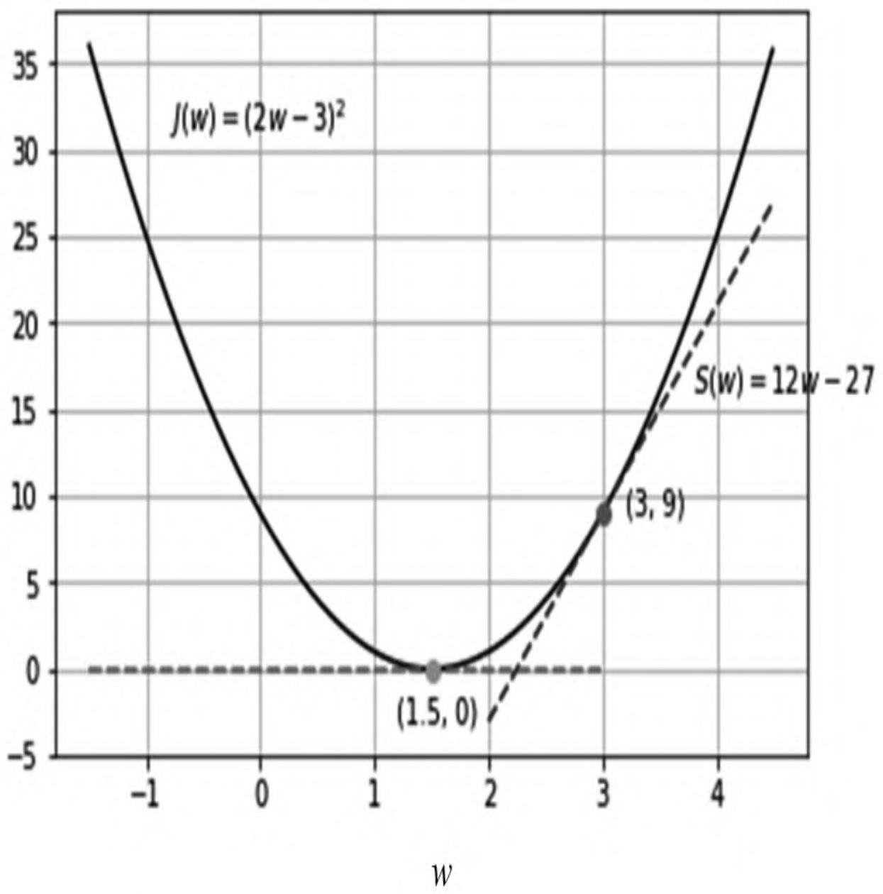


图6.3　一元函数的梯度（导数）和极值

对于一元可微函数 $\mathrm{y} {=} \mathrm{f} \ \mathrm{\Omega} \left( \mathrm{x} \right)$ ，y在x处的梯度（或导数）描述为：

$$
\nabla y = f^{\prime} (x) = \frac{\mathrm{d} y}{\mathrm{d} x}
$$

f（x）在梯度（导数）为0处取得一个极大值或极小值。

多元函数的情况要复杂些。以二元函数为例，令J（w）是一个关于参数 $\mathrm{\mathrm{w}} = \mathrm{\mathrm{~ (}} \mathrm{w} _{1} , \mathrm{w} _{2} \mathrm{)}$ ）T的二元函数：

$$
J (\boldsymbol{w}) = J \left(w_{1}, w_{2}\right) = 5 \left(w_{1} - 3\right) ^{2} + 4 \left(w_{2} - 1\right) ^{2}
$$

此时二元函数的J $( \nu_{1} , \nu_{2} )$ ）在三维坐标系中表示一个曲面，图像如图6.4所示。该曲面呈现为开口向上的抛物面，并且在 $\mathrm{w_{1} = 3 , ~ \ w_{2} = 1}$ 时取得最小值0。

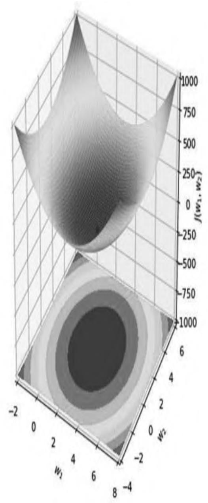


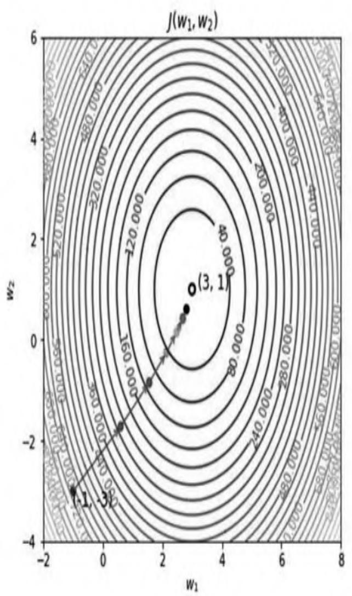


图6.4　二元函数对应的曲面及梯度下降演示

对于二元可微函数y=f $( \mathrm{x} _{1} , \mathrm{x} _{2} )$ ，y在 $( \mathrm{x} _{1} , \mathrm{x} _{2} )$ 处的梯度是一个向量，因而是有方向的，其元素由y分别对 $\mathrm{x_{1}}$ 和 $\mathrm{x_{2}}$ 的偏导数构成：

$$
\nabla y = \left(\frac{\partial y}{\partial x_{1}}, \frac{\partial y}{\partial x_{2}}\right)
$$

梯度的意义在于，在某一位置沿着该位置梯度向量所指的方向，其函数值增加的速度最快，而梯度向量的反方向就是函数值减少的速度最快的方向。当某位置的梯度为0时，函数在该处取得一个极大值或极小值。图6.4右侧部分是左侧曲面在 $\mathrm{. w_{1} O w_{2}}$ 平面投影的等高线，每一个闭合圆上的点的函数值相同。某一点梯度的方向就是过该点、垂直于该点所在等高线且指向函数值增大的方向。

根据偏导数的计算公式，可以得出前面的二元函数J $( \nu_{1} , \nu_{2} )$ ）对于$\mathrm{w} _{1}$ 和 $\mathtt{W_{2}}$ 的偏导数分别为：

$$
\frac{\partial J}{\partial w_{1}} = 10 \left(w_{1} - 3\right), \quad \frac{\partial J}{\partial w_{2}} = 8 \left(w_{2} - 1\right)
$$

可以计算得出J $( \nu_{1} , \nu_{2} )$ ）在点（-1,-3）和（3,1）处的梯度分别为：

$$
\left. \frac{\partial J}{\partial w_{1}} \right| _{(- 1, - 3)} = - 40, \quad \left. \frac{\partial J}{\partial w_{2}} \right| _{(- 1, - 3)} = - 32
$$

即

$$
\nabla J_{(- 1, - 3)} = (- 40, - 32)
$$

类似地，该函数在点（3,1）处的梯度为：

$$
\nabla J_{(3, 1)} = (0, 0)
$$

这两个点的位置对应于图6.4中右侧左下角的一点和正中的空心圆点。

二元函数的梯度概念和计算方法可以直接推广到n元函数$\mathrm{y} {=} \mathrm{f} ( \mathrm{x} _{1} , \mathrm{x} _{2} , \cdots , \mathrm{x} _{\mathrm{n}} )$ ）中，只要该函数在其定义空间内可微。这里就不再展开了。


利用沿梯度方向函数值增加速度最快、沿梯度反方向函数值减少速度最快这个特点，通过设计合理的目标函数J，可以找到目标函数取得极小值或极大值时所对应的自变量w的取值。

对于一个类似上例的可微二元函数来说，可以直接令其对应各参数的偏导数为0，求出函数值取极小值时的参数值。不过对于大规模强化学习问题来说，J是根据采样得到的状态转换来计算的，这种情况下需要通过迭代、使用梯度下降来求解。具体过程如下：

（1）初始条件下随机设置参数值 $\mathrm{~ w = \mathrm{~ ( \ w_{1} , w_{2} , \cdots , w_{n} ) ~}}$ 。

（2）获取一个状态转换，代入目标函数J，并计算J对参数w各分量的梯度：

$$
\nabla_{w} J (\boldsymbol{w}) = \left( \begin{array}{c} \frac{\partial J (\boldsymbol{w})}{\partial w_{1}} \\ \vdots \\ \frac{\partial J (\boldsymbol{w})}{\partial w_{n}} \end{array} \right) \tag{6.7}
$$

（3）设置一个正的、较小的学习率α，将原参数w朝着梯度的反方向做一定的更新：

$$
\Delta \boldsymbol{w} = - \alpha \nabla_{\boldsymbol{w}} J (\boldsymbol{w}) \tag{6.8}
$$

$$
\boldsymbol{w} \leftarrow \boldsymbol{w} + \Delta \boldsymbol{w}
$$

（4）重复过程（2）和（3），直到参数w的更新小于一个设定范围或者达到一定的更新次数。

以上述的二元函数J $( \mathrm{w_{1} , w_{2} ) \ = 5 ( \mathrm{w_{1} - 3 ) \ ^{2} + 4 ( \mathrm{w_{2} - 1 ) \ ^{2}}}}$ 为例，我们希望找到使J $( \nu_{1} , \nu_{2} )$ ）最小的 $( \nu_{1} , \nu_{2} )$ ）值。很明显，当 $\mathrm{w_{1}} \mathrm{=} 3$ 、 $\mathrm{w} _{2} {=} 1$ 时，J取得最小值0，这是直接令梯度为0计算得到的。现在我们使用梯度下降法来求解：

第一步，随机初始化 $( \nu_{1} , \nu_{2} )$ ），假设令 $\mathrm{\Delta W_{1} = - 1}$ 、 $\mathtt{w_{2}} \mathtt{= - 3}$ ，该值对应图6.4中右侧最左下角的一个点。


第二步，计算目标函数J对应当前参数的梯度为（-40,-32）。

第三步，设置学习率α=0.04，更新参数值：

$$
w_{1} = - 1 - 0. 04 \times (- 40) = 0. 6, w_{2} = - 3 - 0. 04 \times (- 32) = - 1. 72
$$

新的参数值 $( \nu_{1} , \nu_{2} )$ ）在图中对应的点比之前朝着图中央的空心圆圈迈了一大步。

重复第二、三步，我们发现更新的参数值代表对应的点离中心最终参数的点在逐渐接近，直到第6次更新后到达离中心最近的黑点的位置，该位置对应的参数值为（2.81,0.60）。随着更新次数的增加，得到的参数值将逐渐趋于真实的参数值。

如果我们在更新参数时设置较大或较小的学习率，就会改变学习的进程：较小的学习率使得更新速度变慢，需要更多的更新次数才能得到最终结果；设置较大的学习率在更新早期虽然能够加快速度，但在后期有可能得不到最终想要的结果。图6.5显示的是上述问题使用α=0.2时的参数更新过程，可以看出参数的第一次更新就已经过头了，此后的每一次更新都围绕着真实参数值的两侧振荡，无法到达真实的参数值。因此要小心设置学习率的大小。为了解决这个问题，也出现了许多其他的更新办法，诸如带动量的更新和Adam更新等，有兴趣的读者可以参考深度学习相关的知识。

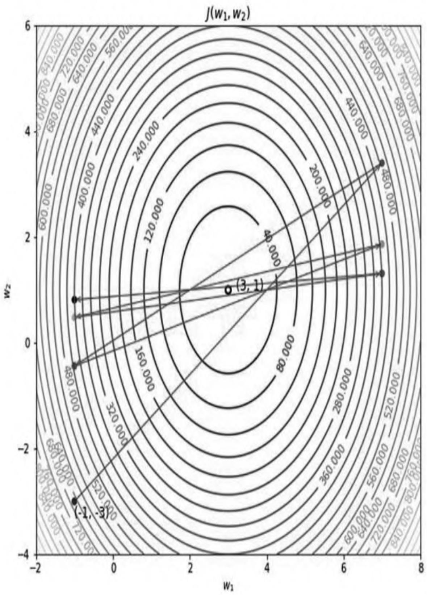


图6.5　过大的学习率导致梯度下降过头而使求解失败

## 6.3 常用的近似价值函数

理论上任何函数都可用作近似价值函数，实际选择何种近似函数需根据问题的特点而定。比较常用的近似函数有线性函数组合、神经网络、决策树、傅里叶变换等。这些近似函数在强化学习中主要用于对一个状态进行恰当的特征表示。近年来，深度学习技术展示了其强大的特征表示能力，被广泛应用于诸多技术领域，当然也包括强化学习领域。本节将简要介绍线性近似，随后重点介绍基于深度学习的神经网络技术，包括全连接神经网络以及卷积神经网络。这两类神经网络技术主要用于进行非线性近似。

### 6.3.1 线性近似

线性价值函数使用一系列特征的线性组合来近似价值函数：

$$
\hat{V} (S, \boldsymbol{w}) = \boldsymbol{w} ^{\top} \boldsymbol{x} (S) = \sum_{j = 1} ^{n} x_{j} (S) w_{j} \tag{6.9}
$$

式（6.9）中的x（S）和w均为列向量， $\mathrm{x_{j}}$ （S）表示状态S的第j个特征分量值， $\mathrm{w_{j}}$ 表示该特征分量值的权重，也就是要求解的参数。基于式（6.6），对于使用线性函数 $\hat{V} \big ( S , w \big )$ 近似的价值函数这一情形，其对应的目标函数J（w）为：

$$
J (\boldsymbol{w}) = \frac{1}{2} \mathbb{E} \left[ V_{\text{target}} (S) - \boldsymbol{w} ^{\top} \boldsymbol{x} (S) \right] ^{2}
$$

相应的梯度 $\nabla_{\boldsymbol{w}} J \big ( \boldsymbol{w} \big )$ 为：

$$
\nabla_{w} J (\boldsymbol{w}) = - \left(V_{\text{target}} (S) - \boldsymbol{w} ^{\top} \boldsymbol{x} (S)\right) \boldsymbol{x} (S)
$$

参数的更新量 为：

$$
\Delta \boldsymbol{w} = \alpha \left(V_{\text{target}} (S) - \boldsymbol{w} ^{\top} \boldsymbol{x} (S)\right) \boldsymbol{x} (S) \tag{6.10}
$$

在式（6.10）中，使用不同的学习方法时， 由不同的目标价值代替，这一点前文已经说过，需要指出的是，这些目标价值虽然仍然由近似价值函数计算得到，但在计算梯度时它们是一个数值，对参数w的求导为0。

事实上，查表式的价值函数是线性近似价值函数的一个特例，这个线性近似价值函数的特征数目就是所有的状态数目n，每一个特定的状态对应的线性价值函数的特征分量中只有一个为1，其余n-1个特征分量值均为0；类似地参数也是由n个元素组成的向量，每一个元素实际上就存储着对应的价值，如式（6.11）所示：

$$
\hat{V} (S, \boldsymbol{w}) = \left[ \begin{array}{c} w_{1} \\ w_{2} \\ \vdots \\ w_{n} \end{array} \right] ^{\top} \left[ \begin{array}{c} 1 (S = s_{1}) \\ 1 (S = s_{2}) \\ \vdots \\ 1 (S = s_{n}) \end{array} \right] \tag{6.11}
$$

### 6.3.2 神经网络

神经网络近似作为价值近似，既可以表达线性近似，也可以表达非线性近似，多数时候使用神经网络技术是为了利用其强大的非线性近似能力。通常非线性神经网络的基本单位是一个可以进行非线性变换的神经元。通过多个这样的神经元多层排列、层间互连，最终实现复杂的非线性近似。线性近似可以用图6.6（a）表示，一个基本的非线性神经元可以用图6.6（b）表示。

单个非线性的神经元在线性近似的基础上增加了一个偏置项（b）和一个非线性整合函数（σ），偏置项b可以被认为是一个额外的数据为1的输入项的权重。单个神经元最终的输出 为：

$$
\hat{y} = \sigma (z) = \sigma (\boldsymbol{w} ^{\top} \boldsymbol{x} + b) \tag{6.12}
$$

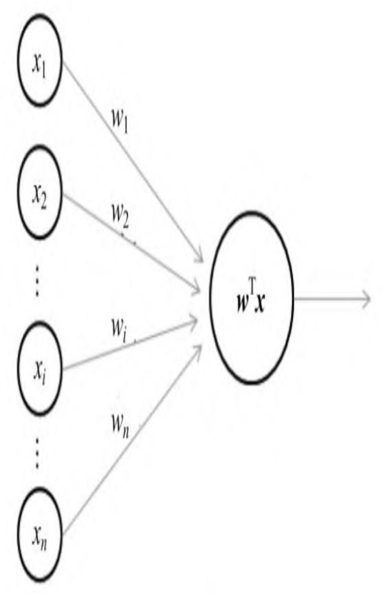


（a）线性近似

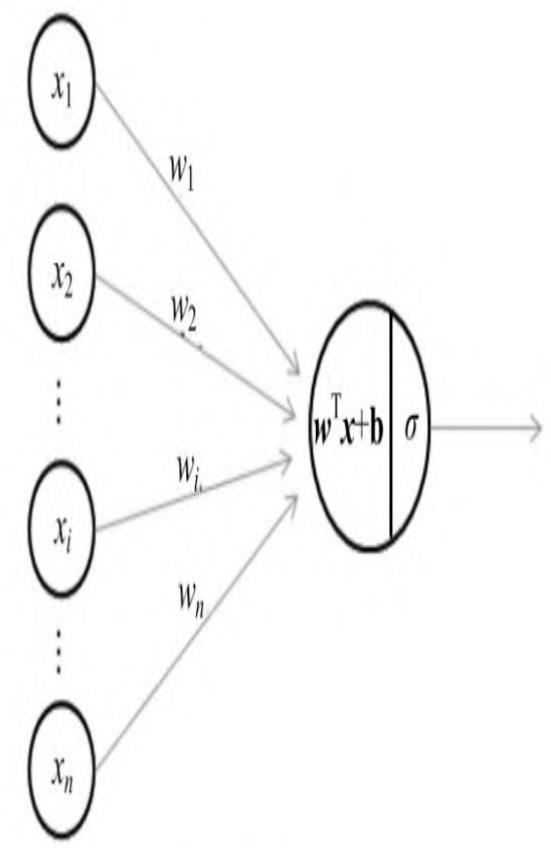


（b）非线性近似
图6.6　线性近似与单个神经元的非线性近似

非线性函数σ被称为神经元的激活函数（Activate Function），目前常用的两个激活函数是relu和tanh，它们的函数图像如图6.7所示。

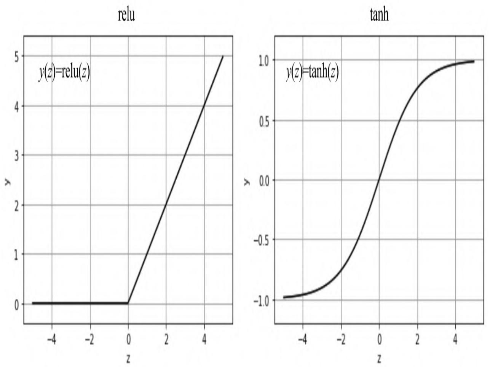
图6.7　两个常用的激活函数

神经网络是由众多能够进行简单非线性近似的神经元按照一定的层次连接而组成的。图6.8显示的是一个两层的神经网络，接受n个特征的输入数据，最终得到两个输出（特征）。随后一层有16个神经元，用以整合原始数据得到16个隐藏特征。输入数据的每一个维度也可以被认为是一个神经元，不过该神经元的输出为给定的输入数据。图6.8中除输入数据外的每一个神经元都和前一层的所有神经元以一定的权重连接。这种连接方式称为全连接，对应的神经网络为分层全连接神经网络（Full Connect Neural Network）。在无特别说明时神经网络一般均指全连接神经网络。

分层全连接神经网络中除输入数据和输出层以外的层都叫隐藏层（Hidden Layer）。图6.8所示的是有一个隐藏层的神经网络，该隐藏层有16个神经元。如果设置不同数量的隐藏层，同时每一个隐藏层设置一定数目的神经元，就会形成不同设置的神经网络。一般来说，对隐藏层越多，网络就越深，相应地对训练数据的非线性近似能力就越强，网络的深度也越深。隐藏层达到多少可以称为深度神经网络（Deep Neural Network，DNN）并没有明确的说法。

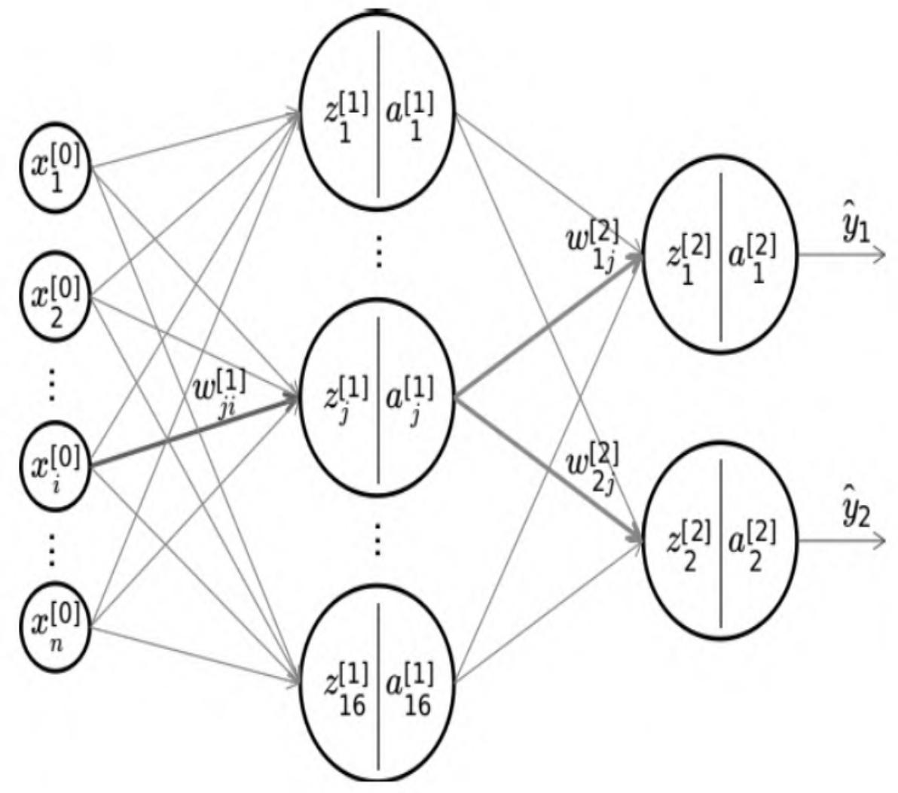


图6.8　一个简单的两层神经网络架构

对于一个多层神经网络来说，每一层的每一个神经元都有多个代表权重的参数w和一个偏置项b。如果用 $n^{[ l ]}$ 表示第l层的神经元数量， $a_{i} ^{[ i ]}$ 表示第l层的第i个神经元的输出， 表示第l层第j个神经元与第l-1层第i个神经元之间的连接权重， $b_{j} ^{[ l ]}$ 表示第l层第j个神经元的偏置项，那么一个L层的全连接神经网络参数由 $\pmb{W} ^{[ 1 ]} , b^{[ 1 ]} , \pmb{W} ^{[ 2 ]} , \pmb{b} ^{[ 2 ]} , . . . , \pmb{W} ^{[ L ]} , \pmb{b} ^{[ L ]}$ 构成。其中是一个 $n^{[ l ]} \times n^{[ l - 1 ]}$ 的二维矩阵， $\pmb{b} ^{[ l ]}$ 是由 $n^{[ l ]}$ 个元素构成的一维列向量。网络中第l层第j个神经元的输出 $a_{j} ^{[ l ]}$ 为：

$$
a_{j} ^{[ l ]} = \sigma \left(z_{j} ^{[ l ]}\right) = \sigma \left(\sum_{i = 1} ^{n^{[ l - 1 ]}} w_{j i} ^{[ l ]} a_{i} ^{[ l - 1 ]} + b_{j} ^{[ l ]}\right) \tag{6.13}
$$

如果使用矩阵的形式，那么第l层神经元的输出 $\pmb{a} ^{( l )}$ 为：

$$
\boldsymbol{a} ^{[ l ]} = \sigma (\boldsymbol{z} ^{[ l ]}) = \sigma (\boldsymbol{W} ^{[ l ]} \boldsymbol{a} ^{[ l - 1 ]} + \boldsymbol{b} ^{[ l ]}) \tag{6.14}
$$

神经网络第L层的输出 $\pmb{a} ^{[ L ]}$ 也就是该网络的最终输出 $\hat{y}$ 。当神经网络的参数确定时，给予神经网络的输入层一定的数据，依据式（6.14）可以得到第一个隐藏层的输出，第一个隐藏层的输出作为输入数据可以计算第二个隐藏层的输出，直至计算得到输出层的一个确定的输出。这种由输入数据依次经过网络的各层得到输出数据的过程称为前向传播（Forward Propagation，FP）。通过设计合理的目标（代价）函数，也可以利用前文介绍的梯度及梯度下降方法来求解出符合任务需求的参数。只不过在计算梯度时需要从神经网络的输出层开始逐层计算至第一个隐藏层甚至是输入层。这种梯度从输出端向输入端计算传播的过程称为反向传播（Backward Propagation，BP）。目标函数计算得到神经网络根据输入数据得到的输出 $\hat{\bf y} .$ 与实际期望的输出y之间的误差，计算误差对各参数的梯度，朝着梯度下降（误差减少）的方向更新参数值。如此迭代多次来训练一个神经网络。均方差（MeanSquare Error，MSE）和交叉熵（Cross Entropy）是神经网络常用的两大目标函数：

$$
J (\boldsymbol{W}, \boldsymbol{b}) _{M S E} = \frac{1}{2 M} \sum_{k = 1} ^{M} \left[ y^{(k)} - \hat{y} ^{(k)} \right] ^{2} \tag{6.15}
$$

$$
J (\boldsymbol{W}, \boldsymbol{b}) _{\text{cross_entropy}} = - \frac{1}{M} \sum_{k = 1} ^{M} \left[ y^{(k)} \ln \hat{y} ^{(k)} + (1 - y^{(k)}) \ln (1 - \hat{y} ^{(k)}) \right] \tag{6.16}
$$

式（6.15）和式（6.16）中的M是指更新一次参数对应的训练样本的数量，y（k）和 分别表示第k个训练样本的真实输出和神经网络计算得到的输出。均方差目标函数常用于输出值的绝对值大于1的情况（即数值范围较大的情况）；交叉熵目标函数由于其设计特点一般多用于输出为概率值的情况，此时输出值在0和1之间。

在使用由M个训练样本组成的训练集训练一个神经网络时，分以下几种情况：如果每训练一个样本就计算一次目标函数并使用梯度下降算法更新网络参数，那么这种训练方法称为随机梯度下降

（Stochastic Gradient Descent）；如果一次目标函数计算了训练集中的所有M个样本，在此基础上更新参数，则称为批量梯度下降

（Batch Gradient Descent）；如果每训练m（m<<M）个样本更新一次参数值，那么这种方法称为小批量梯度下降（Mini-Batch GradientDescent）。随机梯度下降参数更新快，但有时会朝着错误的方向更新；批量梯度下降一般总能找到对应训练集的最优参数，但收敛速度慢；小批量梯度下降结合了两者的优点，是目前主流的算法。由于M一般在数千、数万乃至更高的数量级，通常m可以选择64、128、256等较小的2的整数次方。

用全连接神经网络作为强化学习中的价值近似，能够很好地解决一些规模较大的实际问题，这得益于全连接神经网络有强大的特征学习能力和非线性整合能力。当图像数据作为表示状态的主要数据时，可以使用另一类强大的神经网络（卷积神经网络）来进行价值近似。

### 6.3.3 卷积神经网络近似

卷积神经网络（Convolutional Neural Network，CNN）是神经网络的一种，神经网络的许多概念和方法（例如单个神经元的工作机制、激活函数、连接权重、目标函数、反向传播、训练机制等）都适用于卷积神经网络。卷积神经网络与全连接神经网络最大的差别在于网络的架构和参数的设置上，本节将对此进行基本的讲解。

卷积神经网络是分层的，也可以有很多隐藏层，但是其主体部分的每个隐藏层由许多通道（Channel）所组成，每一个通道内有许多神经元，其中每一个神经元仅与前一层所有通道内局部一定位置的神经元连接，接受它们的输出信号，这种设计思想受到高等哺乳动物的视觉神经系统中“感受野”概念的启发。此外，同一个通道内神经元共享参数这种设计能够比较有效地提取静态二维空间的特征。下面先从一个简单的例子开始讲解什么是卷积。

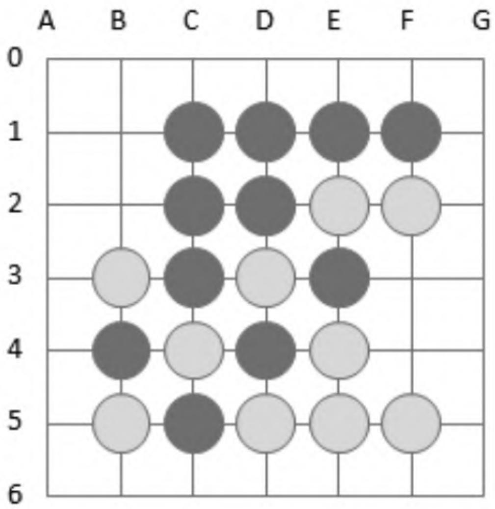


图6.9　一个7X7的五子棋局

大多数人都玩过五子棋游戏（见图6.9），游戏双方分别使用黑白两色的棋子，轮流下在棋盘水平横线与垂直竖线的交叉点上，率先在横线、竖线或斜对角线上形成五子连线者获胜。

下五子棋时经常要观察对手是否出现了3个棋子连在一起的情况，如果出现这种情况，就要考虑及时围堵对手了。我们可以使用一个过滤器来检测水平、垂直方向是否存在某玩家三子相连的情况。以图6.9中标号为5的那一行棋（见图6.10（a））为例，为了方便计算，我们使用数字来标记棋盘上的每一个位置信息，0表示该位置没有棋，1表示该位置被黑棋占据；-1表示该位置被白棋占据。随后设计如图6.10（b）所示的3个水平连续的1作为过滤器来从左至右逐一滑动检测水平方向一方三子连线的情况，得到如图6.10（c）所示的过滤结果。

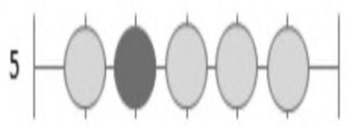


（a）第5行棋局位置信息

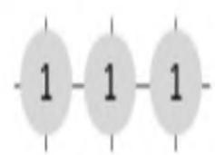


（b）过滤器

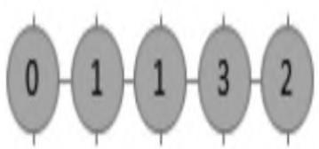


（c）过滤结果
图6.10　使用过滤器检测五子棋一方三子连线

过滤器的目标是发现感兴趣的特征信息而过滤掉无关信息，过滤结果会提示棋局中是否存在过滤器感兴趣的信息。其具体的工作机制如图6.11所示。

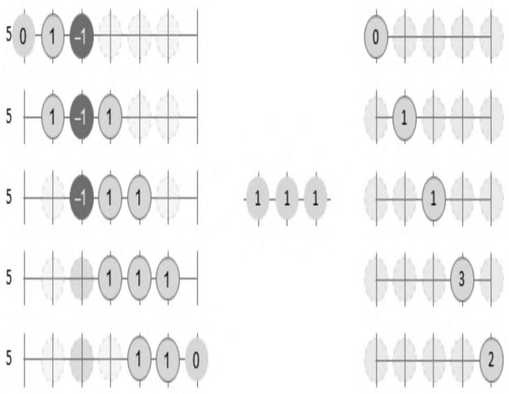


图6.11　检测五子棋水平方向三子连线的过滤器工作机制

过滤器将从该行棋局最左侧的3个棋盘位置信息开始，分别用自身的3个1乘以棋盘上相应位置数字形式表示的状态，并把结果加在一起，得到最后的过滤结果。每得到一个结果后过滤器往右移动一步，再次计算新位置的过滤结果，如此反复直到过滤器来到该行棋的最右方。通过分析过滤器的计算方式，我们可以发现，当棋盘中存在3个黑棋或3个白棋连在一起时，过滤器得到的结果将分别是3和-3，而其他情况下过滤器的结果都将在-3和3之间。所以通过观察过滤结果中有没有-3或3以及出现的位置，就可以得到棋盘中有没有一方三子连在一起的情况以及该情况出现的位置。垂直方向也可以采用类似地方法来判断。

过滤器在卷积神经网络中大量存在，只不过我们使用一个新的名字：卷积核。过滤器通过移步进行过滤操作的过程称为卷积操作。过滤器需要有一定数量的参数来定义，例如上例中过滤器是由一个长度为3的一维单位向量所组成的。这个长度称为卷积核的大小或尺寸。这些参数形成了卷积核的参数。卷积操作保留了卷积核感兴趣的信息，同时对原始信息进行了一定程度的概括和压缩。例如，上例中本来一行棋的状态需要用7个数字来描述，但是卷积操作的结果仅由5个数字组成。通过这5个数字可以大致分析出对应位置黑棋和白棋的力量对比。有时我们希望卷积结果的规模与原始的数据规模一样，那么可以在原始信息的左右两侧添加一定数量的无用数据，例如我们在第5行棋左右再各添加一个0，这样得到的卷积结果也将是7个数字组成的。卷积结果与原始信息结果保持相同的规模在五子棋问题中意义不大，但在解决其他一些问题中还是有意义的。同样，在这个例子中卷积核每一步仅往右移动一格。在一些任务中，卷积核每一次可以移动超过一格的位置。

一般来说，如果一个原始信息的大小为n、卷积核（Kernel）大小为f、原始信息左右各填充（Padding）p个数据、卷积核每次移动的步长（Stride）为s，那么卷积结果的数据大小n'可由以下公式计算得到：

$$
n^{\prime} = \left\lfloor \frac{n + 2 p - f}{s} \right\rfloor + 1 \tag{6.17}
$$

以上介绍的卷积操作都是针对一维空间的，判断水平或垂直方向一方三子连线没有问题，但是判断对角线方向三子连线就做不到了。由于对角线涉及水平和垂直两个维度，我们需要把之前一维卷积操作扩展到二维空间中来，如图6.12所示。卷积核由二维单位矩阵构成，相应的卷积结果显示有2处白棋三子连线和1处黑棋三子连线的情况。二维卷积操作的基本原理与一维卷积操作类似，不同的是在计算单个卷积操作结果时将所有元素与卷积核对应位置的值相乘，再求和；在移步时注意不要遗漏位置就可以了。而且卷积结果的大小在水平和垂直方向上依然可以使用式（6.17）来计算。卷积操作还可以推广至三维甚至更高维的情况，这里就不展开了。

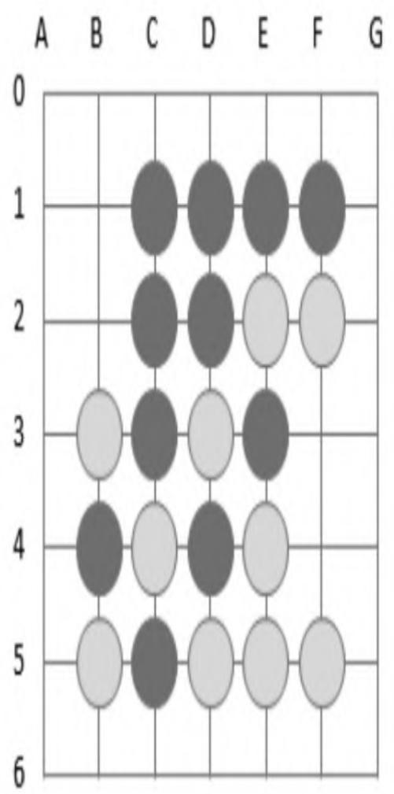


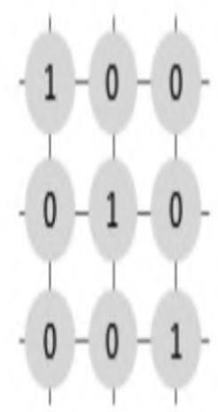


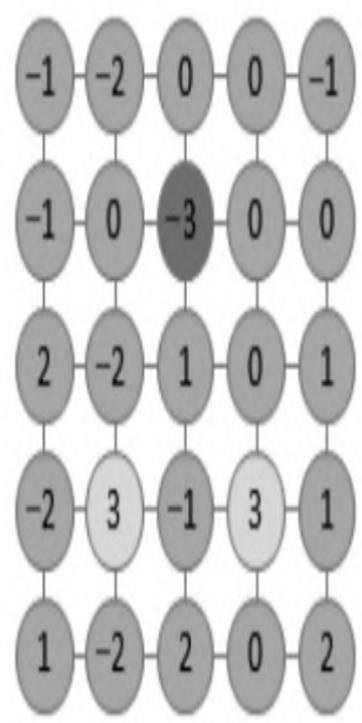


图6.12　使用卷积操作检测五子棋'\'向对角线方向三子连线

卷积核以及对应的操作是理解卷积神经网络的关键。在实际应用中，一个卷积核通常不能解决实际问题，即使在五子棋中，检测一方三子连线也至少需要4个卷积核，分别负责水平、垂直和两个对角线方向的检测，可以认为，每个卷积核负责检测对应的一个特征。而每一个卷积操作的结果一般称为一个通道（Channel），也称为一个映射（Map）。在卷积神经网络中，多个通道构成一个类似于全连接神经网络的隐藏层，同时卷积核的参数并不像我们应用在五子棋例子中那样是事先设计好的，而是神经网络通过学习得到的。卷积神经网络中还有一个概念是池化（Pooling）。池化操作主要分为两种：最大池化（Max Pooling）和平均池化（Average Pooling）。池化操作过程与卷积操作类似，也存在着大小、步长、填充等概念，池化结果的大小也可以使用公式（6.17）计算得到。池化操作不需要卷积核，最大池化操作就是把当前操作区域中的最大数据作为池化结果；而平均池化则是把操作区域所有值的平均值作为池化结果。图6.13展示了对五子棋的一个卷积结果分别进行大小为f=3×3、步长s=1、填充p=0的最大池化和相同参数的平均池化结果。

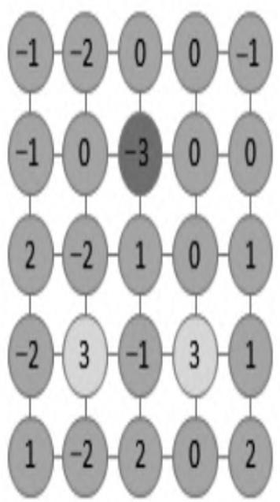


（a）原始信息

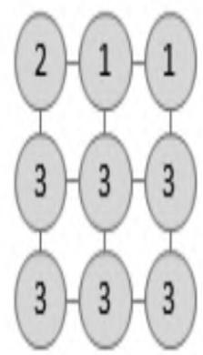


（b）最大池化结果

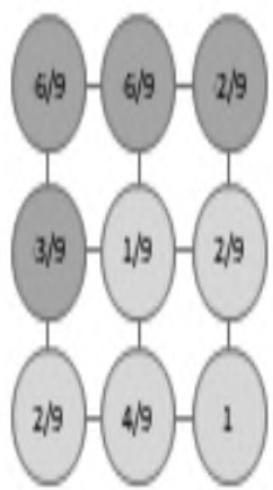


（c）平均池化结果

图6.13　最大池化和平均池化

在了解了卷积神经网络的一些基本操作后，再来从宏观上理解卷积神经网络的架构就容易些了。图6.14展示的是卷积神经网络的鼻祖—1998年 $\operatorname{L e C u n}$ 提出的可以用来进行手写数字识别的 $\mathrm{L e N e t} {-} 5$ 模型的架构。该网络接受黑白手写字符图片作为输入，随后的第一个隐藏层设计了6个通道的 $\mathrm{f} {=} 5 \times 5$ 、s=1、 $\mathrm{p} {=} 0$ 的卷积核，得到的卷积结果规模为$6 \times 28 \times 28$ ，随后使用f=2×2、s=2、 $\mathrm{p} {=} 0$ 的池化操作得到第二个隐藏层，同时数据规模缩小为 $\phantom{-} 16 \times 14 \times 14$ ；第三个隐藏层的数据又是通过卷积操作得到的，这次设计16个与之前设置相同的卷积核，得到的结果规模为 $16 \times 10 \times 10$ ；随后的一个池化操作将数据规模进一步缩小为$16 \times 5 \times 5$ 。此后使用3个全连接最终到达长度为10的输出层。输出层的每一个数据分别代表输入图像是手写数字 $\operatorname{\mathrm{: 0}} ^{\sim} 9$ 的概率。

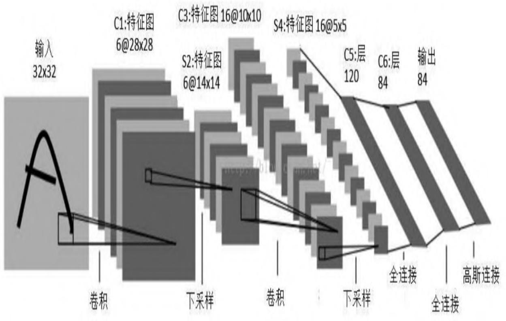


图6.14　LeNet-5卷积神经网络

相比较全连接神经网络，卷积神经网络具备出色的空间特征检测能力，而且参数规模小。如果一个隐藏层设计了n个通道，每一个通道的卷积核大小为f×f，同时前一个隐藏层有m个通道，那么不考虑偏置项，该隐藏层参数的个数一共有：

$$
c = n \times f \times f \times m \tag{6.18}
$$

池化操作不需要任何参数，大大减少了参数的个数。卷积隐藏层通道的个数反映了网络在这一层的特征检测能力。通常卷积神经网络越靠近输出层，它的通道数越多，但是每一个通道的数据规模越来越小。此外，卷积核的大小也影响网络的架构，早期人们习惯使用诸如7×7、9×9的大卷积核，近来研究发现，大的卷积核可以被多个3×3的卷积核所替代，同时总体参数也减少了。因而目前主流卷积神经网络都更倾向于使用3×3大小的卷积核。池化和全连接在卷积神经网络中的作用越来越淡化，有些卷积神经网络甚至抛弃了全连接层。

强化学习领域有许多图像信息作为状态表示的情况，例如训练一个个体像人类玩游戏的场景一样，通过直接观察游戏屏幕的图像进行策略优化，这种情况下结合卷积神经网络作为价值函数的近似则会提高效率。在棋类游戏领域也是如此，卷积神经网络可以出色地对当前棋盘状态进行评估，指导价值及策略的优化。对初学者来说，卷积神经网络比较难理解，由于本书旨在应用卷积神经网络来进行强化学习，故而不可能花大量篇幅来讲解卷积神经网络本身。读者可以通过本章的编程实践和本书后续的一些讲解来加深对卷积神经网络的理解。对卷积神经网络感兴趣的读者也可以查阅专门的书籍和文献。

## 6.4 DQN算法

本节将结合价值函数近似与神经网络技术来介绍基于神经网络（深度学习）的Q学习算法：深度Q学习（Deep Q-Learning，DQN）算法。DQN算法主要使用经验回放（Experience Replay）来实现价值函数的收敛。具体做法为：个体能记住既往的状态转换经历，对于每一个完整状态序列里的每一次状态转换，依据当前状态的 $\mathrm{s_{t}}$ 价值以ϵ贪婪策略选择一个行为 $\mathrm{a_{t}}$ ，执行该行为得到奖励 $\mathrm{r_{t + 1}}$ 和下一个状态 $\boldsymbol{s} _{\mathrm{t + 1}}$ ，将得到的状态转换存储至记忆中，当记忆中存储的容量足够大时，随机从记忆里提取一定数量的状态转换，用状态转换中的下一状态来计算当前状态的目标价值，使用式（6.4）计算目标价值与网络输出价值之间的均方差代价，使用小批量梯度下降算法更新网络的参数。具体的算法流程如算法4所示。

<pre class="pseudocode">
\begin{algorithm}

\caption{算法 4: 基于经验回放的 DQN 算法}
$$
\begin{algorithmic}
state 输入: episodes, α, γ
state 输出: optimized action-value function Q(θ)
$$

state 初始化: experience D, action-value function Q(θ) with random weights
for{each episode in episodes}
    state 获取当前 episode 起始状态 S 的特征 φ
    for{each step of episode}
        state A = policy(Q, φ(S); θ) (e.g. ε-greedy policy)
        state R, φ(S'), is_end = perform_action(φ(S), A)
        state 将 transition (φ(S), A, R, φ(S'), is_end) 存储到 D 中
        state φ(S) ← φ(S')
        state 从 D 中随机采样 minibatch(m) 的 transitions (φ(S_j), A_j, R_j, φ(S'_j), is_end_j)
        if{is_end_j 为真}
            state y_j = r_j
        \Else
            state y_j = r_j + γ max_{a'} Q(φ(S'_j), a'; θ)
        endif
        state 对 (y_j - Q(φ(S_j), A_j; θ))²/m 执行小批量梯度下降
    endfor
endfor
$$
\end{algorithmic}
\end{algorithm}
</pre>

$$

该算法流程图中使用θ代表近似价值函数的参数。相比前一章的各种学习算法，该算法中的状态S用特征φ（S）来表示。为了表述简便，在除算法之外的公式中，本书仍直接使用S来代替φ（S）。在每产生一个行为A并与环境实际交互后，个体都会进行一次学习并更新一次参数。更新参数时使用的目标价值由式（6.19）产生：

$$
Q_{\text{target}} \left(S_{t}, A_{t}\right) = R_{t} + \gamma \max Q \left(S_{t} ^{\prime}, A_{t} ^{\prime}; \theta^{-}\right) \tag{6.19}
$$

式（6.19）中的θ-是上一个更新周期价值网络的参数。DQN算法在深度强化学习领域取得了不俗的成绩，不过其并不能保证一直收敛，研究表明这种估计目标价值的算法过于乐观地高估了一些情况下的行为价值，导致算法会将次优行为价值一致认为最优行为价值，最终不能收敛至最佳价值函数。一种使用双价值网络的DDQN（DoubleDeep Q Network）被认为较好地解决了这个问题。该算法使用两个架构相同的近似价值函数：其中一个用来根据策略生成交互行为并随时更新参数（θ）；另一个用来生成目标价值，其参数（θ-）每隔一定的周期进行更新。该算法绝大多数流程与DQN算法一样，只是在更新目标价值时使用式（6.20）：

$$
Q_{\text{target}} \left(S_{t}, A_{t}\right) = R_{t} + \gamma Q \left(S_{t} ^{\prime}, \max_{a^{\prime}} Q \left(S_{t} ^{\prime}, a^{\prime}; \theta\right); \theta^{-}\right) \tag{6.20}
$$

该式表明，DDQN在生成目标价值时使用了生成交互行为，并频繁更新参数的价值网络Q（θ），在这个价值网络中挑选状态S下最大价值对应的行为 ，随后再用“状态-行为对” 代入目标价值网络

Q（θ-）得出目标价值。实验表明这样的更改比DQN算法更加稳定，也更容易收敛至最优价值函数和最优策略。在编程实践环节，我们将实现DQN和DDQN。

在使用神经网络等深度学习技术来进行价值函数近似时，有可能会碰到无法得到预期结果的情况。造成这种现象的原因有很多，其中包括基于TD学习算法使用的引导性（Bootstrapping）数据，非线性近似随机梯度下降落入局部最优值等原因，也可能和ϵ贪婪策略中的ϵ设置有关。此外，深度神经网络本身也有许多训练技巧，包括学习率的设置、网络架构的设置等。这些设置参数有别于近似价值函数本身的参数，被称为超参数（Hyperparameter）。如何设置、调优超参数目前仍没有一套成熟的理论来指导，得到一套完美的网络参数有时需要多次实践，并对训练结果进行有效的观察和分析。

## 6.5 编程实践：基于PyTorch实现DQN求解PuckWorld问题

在构建近似价值函数的实践中，PyTorch框架提供了非常方便的一整套解决方案。PyTorch既可以像NumPy那样进行张量计算，也可以很轻易地搭建复杂的神经网络。从本节开始将会较多地使用PyTorch提供的功能进行深度强化学习的编程实践。PyTorch的官方网站将其描述为：优先基于Python的深度学习框架，可以进行张量和动态神经网络的运算。在深度学习领域，张量（Tensor）这个概念其实并不难理解，我们都知道标量（Scalar）这个概念，标量指的是一个没有方向、只有大小的数据，数学上通常就用一个数值来表示，它没有维度或者说是零维的；我们熟悉的矢量又称向量（Vector），既有大小又有方向，在数学计算时通常用一组排列在一行或者一列的数值表示，是一维的；此外，矩阵（Matrix）也是大家较为熟悉的一种数据表现形式，是由多行多列的数据组合在一起的，是二维的；而三维或者三维以上的数据表现形式通常被称为张量（Tensor）。在深度学习和强化学习领域，我们要处理的数据通常很少是零维的标量，经常是一维的向量和二维的矩阵，例如描述一个状态的特征值组合在一起就是一个向量；一个五子棋盘当前状态则需要一个二维的矩阵来描述；描述一张彩色图片每一个像素点的红绿蓝三种颜色的具体数值，就需要用一个三维张量；如果要记录用来处理二维图像的卷积神经网络的一个隐藏层包含的所有权重参数，则需要一个四维的张量，因为一个隐藏层包括多个通道，每一个通道需要记录一个三维的卷积核矩阵，这是因为每一个神经元需要与前一个隐藏层所有通道所对应的神经元相连接。张量的运算规则与矢量以及矩阵运算规则类似，在PyTorch看来，矩阵、向量甚至标量都能以张量来对待，所不同的就是事先规定好它们的维度和尺寸信息，这里的维度和尺寸信息可以称为形态（Shape）或尺寸（Size）。在编程实践中，养成经常查看张量形态的习惯对于编写正确有效的代码是非常有益处的。

PyTorch提供的张量运算方法和索引方法与NumPy非常接近，然而PyTorch的强大之处并不仅体现在张量运算上，还提供了自动计算梯度的功能。梯度是一个比较难懂的概念，梯度的计算也是一个较复杂的运算过程。自版本PyTorch 0.4开始，张量对象本身就可以具备自动计算梯度的功能。有了这个功能，在构建基于梯度运算的神经网络或其他模型时，误差的反向传播和参数更新都可以自动完成，读者可以把精力集中在模型的构建和训练方法的设计上。在构建神经网络模型时PyTorch支持动态图，意味着可以在实际数据运算时根据前一个节点的结果来动态调整网络中张量流转的路线。PyTorch官网提供了非常好的教程以帮助使用者理解这些设计理念并快速上手，建议对PyTorch不熟悉的读者在阅读本书后续内容之前先登录PyTorch官网，以便对PyTorch有一个基本的认识。

本节的编程实践将使用PyTorch库构建一个简单的两层神经网络，将其作为近似价值函数应用于DQN和DDQN算法中解决本章一开始提到的PuckWorld问题。在DQN中的状态由数个特征组成的一维向量来表示，价值则由一个接受状态特征为输入的函数来表示，在实现基于DQN的个体代码之前，先使用PyTorch提供的功能快速实现两层神经网络表示的近似价值函数，再实现DQN和DDQN算法，并用它来解决本章开始提到的PuckWorld问题。

### 6.5.1 基于神经网络的近似价值函数

我们要设计的这个近似价值函数基类针对的是gym中具有连续状态、离散行为的环境，在近似价值函数的构架类型中选择接受状态特征作为输入，输出多个行为对应的行为价值的第三种架构（见图6.2）。近似价值函数的核心功能就是根据状态来得到该状态下所有行为对应的价值，进而为策略提供价值依据并计算目标价值。要构建这样一个基于神经网络的近似价值函数，需要知道对应强化问题状态的特征数、行为的个数。如此，这个网络的输入层和输出层的结构就确定了，此外还需要指定隐藏层的个数以及每一个隐藏层包含的神经元的数量。本例设计的神经网络仅包含一个隐藏层，默认有32个神经元。首先导入一些必要的库：

```python
import numpy as np
import torch
import torch.nn as nn
from torch.autograd import Variable
import torch.nn.functional as F
import copy
```

可以设计具有如下构造函数的NetApproximator类：

```python
class NetApproximator(nn.Module):
    def __init__(self, input_dim = 1, output_dim = 1, hidden_dim = 32):
        '''近似价值函数        Args:
            input_dim: 输入层的特征数 int
            output_dim: 输出层的特征数 int
        '''
        super(NetApproximator, self).__init__()
        self.linear1 = torch.nn.Linear(input_dim, hidden_dim)
        self.linear2 = torch.nn.Linear(hidden_dim, output_dim)
```

NetApproximator类继承自nn.Module类，后者是PyTorch中一个非常关键的类，几乎所有的模型都继承自这个类，而重写这个类只需要重写其构造函数和相应的前向运算forward方法。

NetApproximator类的构造函数中声明了两个线性变换，并没有定义实现神经元整合功能的非线性单元，这是因为这两个线性单元都包含了需要训练的参数。由于非线性整合功能由PyTorch本身提供，且不需要参数，故而不需要成为类的成员变量。

NetApproximator类重写的forward方法代码如下：

```python
def forward(self, x):
    """前向运算，根据网络输入得到网络输出"""
    x = self._prepare_data(x)  # 需要对描述状态的输入参数x做一定的处理
    h_relu = F.relu(self.linear1(x))  # 非线性整合函数
    # h_relu = self.linear1(x).clamp(min=0)  # 实现relu功能的另一种写法
    y_pred = self.linear2(h_relu)  # 网络预测的输出
    return y_pred
```

forward方法接受网络的输入数据，首先对其进行一定的预处理，随后送入第一个线性变换单元，得到线性整合结果后再进行一次非线性的relu处理，处理的结果送入另一个线性处理单元，其结果作为神经网络的输出，也就是网络预测的当前状态下各个行为的价值。神经网络的输出是针对每一个行为的价值（范围在整个实数域），因此第二个线性整合恰好可以通过参数调整映射至整个实数域。在输入数据送入线性整合单元之前的预处理主要是为了数据类型的兼容性和对单个采样样本的支持。因为通常从gym环境得到的数据类型是基于NumPy的数组或者是一个零维的标量（当状态的特征只有一个时）。而PyTorch神经网络模块处理的数据类型多数是基于torch.Tensor或torch.Variable（自PyTorch 0.4版本起Variable已整合至Tensor中）的，后者一般不接受零维的标量。

```python
def _prepare_data(self, x, requires_grad = False):
    '''将NumPy格式的数据转化为Torch的Variable'''    if isinstance(x, np.ndarray):
        x = torch.from_numpy(x)  # 从numpy数组构建张量
    if isinstance(x, int):  # 同时接受单个数据
        x = torch.Tensor([[x]])
        x.requires_grad_ = requires_grad
    x = x.float()  # 从from_numpy()转换过来的数据是DoubleTensor形式
    if x.data.dim() == 1:  # 如果x是一维的，下一行代码将其转换为二维的
        x = x.unsqueeze(0)  # torch的nn接受的输入至少是二维的
    return x

该方法除接受输入数据x外，还接受一个名为requires_grad的参数。如果该参数的值为True，则将通过配置使得数据同时具备自动梯度计算功能，通常原始输入数据不需要梯度来更新数据本身，因而该参数默认值为False。如此最简单的神经网络模块就定义好了。由于这个例子规模较小，因此我们将训练网络、误差计算、梯度反向传播和参数更新工作也作为这个类的一个方法。代码如下：

```python
def fit(self, x, y, criterion=None, optimizer=None, epochs=1, learning_rate=1e-4):
    '''通过训练更新网络参数来拟合给定的输入x和输出y
    '''    if criterion is None:    # 损失的计算依据
        criterion = torch.nn.MSELoss(size_average=False)
    if optimizer is None:    # 参数优化器
        optimizer = torch.optim.Adam(self.parameters(), lr=learning_rate)
    if epochs < 1:    # 对参数给定的数据训练的次数
        epochs = 1
    # 输出数据一般也不需要梯度
    y = self._prepare_data(y, requires_grad = False)
    for t in range(epochs):
        y_pred = self.forward(x)    # 前向传播
        loss = criterion(y_pred, y)    # 计算损失
        optimizer.zero_grad()    # 梯度重置，准备接受新梯度值
        loss.backward()    # 反向传播时自动计算相应节点的梯度
        optimizer.step()    # 更新权重
    return loss    # 返回本次训练最后一个epoch的损失(代价)
```

此外，还编写了两个辅助函数（或称为方法）：__call__和clone。前者使得该类的对象可以向函数名一样接受参数直接返回结果，后者实现了对自身的复制。代码如下：

```python
def __call__(self, x):
    y_pred = self.forward(x)
    return y_pred.data.numpy()

def clone(self):
    '''返回当前模型的深度复制对象'''
    return copy.deepcopy(self)
```

这样一个基于神经网络的近似价值函数就完全设计好了。

6.5.2 实现DQN求解PuckWorld问题

实现了基于神经网络的近似价值函数后，设计基于DQN的个体类就比较简单了。DQN类仍然继承自先前介绍的Agent基类，我们只需重写策略policy方法和学习learning_method方法即可。该类的构造函数代码如下：

class DQNAgent(Agent):
    '''使用近似的价值函数实现的Q学习个体
    '''    def __init__(self, env: Env = None,
                 capacity = 20000,
                 hidden_dim: int = 32,
                 batch_size = 128,
                 epochs = 2):
        if env is None:
            raise "agent should have an environment"
        super(DQNAgent, self).__init__(env, capacity)
        self.input_dim = env.observation_space.shape[0] # 状态连续

        # 离散行为用int型数据0,1,2,...,n来表示
        self.output_dim = env.action_space.n
        # print("{},{}".format(self.input_dim, self.output_dim))
        self.hidden_dim = hidden_dim
        # 行为网络，用来计算产生行为以及对应的Q值，参数频繁更新
        self.behavior_Q = NetApproximator(input_dim=self.input_dim,
                                          output_dim=self.output_dim,
                                          hidden_dim=self.hidden_dim)
        # 计算目标价值的网络，初始时从行为网络复制而来，两者参数一致，该网络参数不定期更新
        self.target_Q = self.behavior_Q.clone()
        self.batch_size = batch_size    # mini-batch学习一次状态转换数量

该类定义了两个基于神经网络的近似价值函数，其中一个行为网络是策略产生实际交互行为的依据，另一个目标价值网络用来根据状态和行为得到目标价值，是计算代价的依据。在一定次数的训练后，要将目标价值网络的参数更新为行为价值网络的参数，下面的代码实现这个功能：

def _update_target_Q(self):
    """将更新策略的Q网络(连带其参数)复制给输出目标Q值的网络"""
    self.target_Q = self.behavior_Q.clone()  # 更新计算价值目标的Q网络

DQN生成行为的策略依然是ϵ贪婪策略，相应的策略方法代码如下：

def policy(self, A, s, Q = None, epsilon = None):
    '''依据更新策略的价值函数(网络)产生一个行为'''
    Q_s = self.behavior_Q(s)  # 基于NetApproximator实现__call__方法
    rand_value = random()    # 生成0与1之间的随机数
    if epsilon is not None and rand_value < epsilon:
        return self.env.action_space.sample()
    else:
        return int(np.argmax(Q_s))
```

DQN的学习方法learning_method比较简单，其核心就是根据当前状态特征 $\mathrm{S} _{0}$ 依据行为策略生成一个与环境交互的行为 $\mathrm{\ddot{A} _{0}}$ ，交互后观察环境，得到奖励 $\mathrm{R_{1}}$ ，同时观察下一状态的特征 $\mathrm{S} _{1}$ 以及状态序列是否结束。随后将得到的状态转换纳入记忆中。在每一个时间步长内，只要记忆中的状态转换够多，就随机从中提取一定量的状态转换进行基于记忆的学习，实现网络参数的更新：

```python
def learning_method(self, gamma = 0.9, alpha = 0.1,
                    epsilon = 1e-5,
                    display = False, lambda_ = None):
    self.state = self.env.reset()

    s0 = self.state    # 当前状态特征
    if display:
        self.env.render()
    time_in_episode, total_reward = 0, 0
    is_done = False
    loss = 0
    while not is_done:
        s0 = self.state    # 获取当前状态
        a0 = self.perform_policy(s0, epsilon)    # 基于行为策略产生行为
        s1, r1, is_done, info, total_reward = self.act(a0)  # 与环境交互
        if display:
            self.env.render()
        if self.total_trans > self.batch_size:    # 记忆中的状态转换足够多
            loss += self._learn_from_memory(gamma, alpha)  # 从记忆学习
        time_in_episode += 1
    loss /= time_in_episode
    if display:
        print("epsilon:{3.2f},loss:{3.2f},{}".format(epsilon, loss, self.experience.last_episode))
    return time_in_episode, total_reward
```

从上面的代码可以看出，对于DQN来说，整个学习方法最关键的地方就是从记忆学习_learn_from_memory这个方法。该方法的实现如下：

```python
def _learn_from_memory(self, gamma, learning_rate):
    trans_pieces = self.sample(self.batch_size)  # 随机获取记忆里的状态转换
    states_0 = np.vstack([x.s0 for x in trans_pieces])
    actions_0 = np.array([x.a0 for x in trans_pieces])
    reward_1 = np.array([x.reward for x in trans_pieces])
    is_done = np.array([x.is_done for x in trans_pieces])
    states_1 = np.vstack([x.s1 for x in trans_pieces])
    # 准备训练数据
    X_batch = states_0
    y_batch = self.target_Q(states_0)  # 得到NumPy格式的结果
    Q_target = reward_1 + gamma * np.max(self.target_Q(states_1), axis=1) * (~ is_done)  # is_done则Q_target==reward_1
    # 取消下列代码行的注释则变为DDQN算法
    # 行为a'从行为价值网络中得到
    # a_prime = np.argmax(self.behavior_Q(states_1), axis=1).reshape(-1)
    # (s',a') 的价值从目标价值网络中得到
    # Q_states_1 = self.target_Q(states_1)
    # temp_Q = Q_states_1[np.arange(len(Q_states_1)), a_prime]
    # (s,a) 的目标价值根据贝尔曼方程得到
    # Q_target = reward_1 + gamma * temp_Q * (~ is_done)
    # is_done则Q_target==reward_1
    # DDQN算法部分的尾部
    y_batch[np.arange(len(X_batch)), actions_0] = Q_target
    # 训练行为价值网络，更新其参数
    loss = self.behavior_Q.fit(x = X_batch,
                               y = y_batch,
                               learning_rate = learning_rate,
                               epochs = self.epochs)
    mean_loss = loss.sum().data[0] / self.batch_size
    # 可根据需要设置目标价值网络参数的更新频率
    self._update_target_Q()
    return mean_loss
```

该方法顺带实现了DDQN，根据注释应该不难理解。这样一个DQN和DDQN算法就完成了，可以将DQNAgent类与前一章实现的其他Agent类一起放在文件agents.py中。现在使用下面的代码来观察其在PuckWorld环境中的表现。

```python
import gym
from puckworld import PuckWorldEnv
from agents import DQNAgent
from utils import learning_curve
env=PuckWorldEnv()
agent=DQNAgent(env)
data=agent.learning(gamma=0.99,
    epsilon = 1,
    decaying_epsilon = True,
    alpha = 1e-3,
    max_episode_num = 100,
    display = False)
learning_curve(data, 2, 1, title="DQNAgent performance on PuckWorld",
    x_name="episodes", y_name="rewards of episode")
```

在运行上述代码后将得到类似图6.15所示的结果。可以看出使用DQN算法较为成功地解决了PuckWorld问题，个体仅通过少数完整状态序列就可以较为迅速地跟踪靠近目标小球，并稳定在一个较高的水平上。可以在训练一定次数后通过下面的代码来观察交互界面下拥有DQN算法的个体表现：

```python
data = agent.learning(gamma=0.99, epsilon=1e-5,  # 衰减因子，近似完全贪婪
                      decaying_epsilon=False,
                      alpha=1e-5,  # 不学习
                      max_episode_num=20,  # 观察次数
                      display=True)
显示交互界面
```

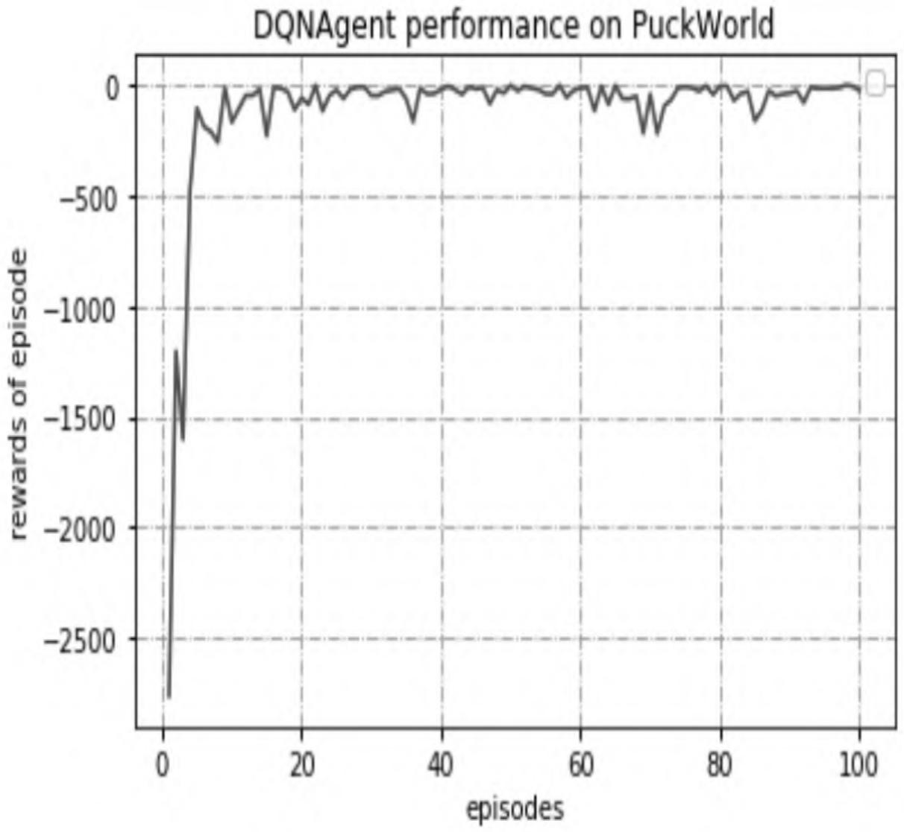


图6.15　DQN算法在PuckWorld环境中的表现

读者也可以通过设置不同的超参数（例如神经网络隐藏层的神经元个数、学习率、衰减因子以及目标价值网络参数更新的频率等）来观察个体的表现差异，从中体会基于深度学习的强化学习如何进行模型调优。

