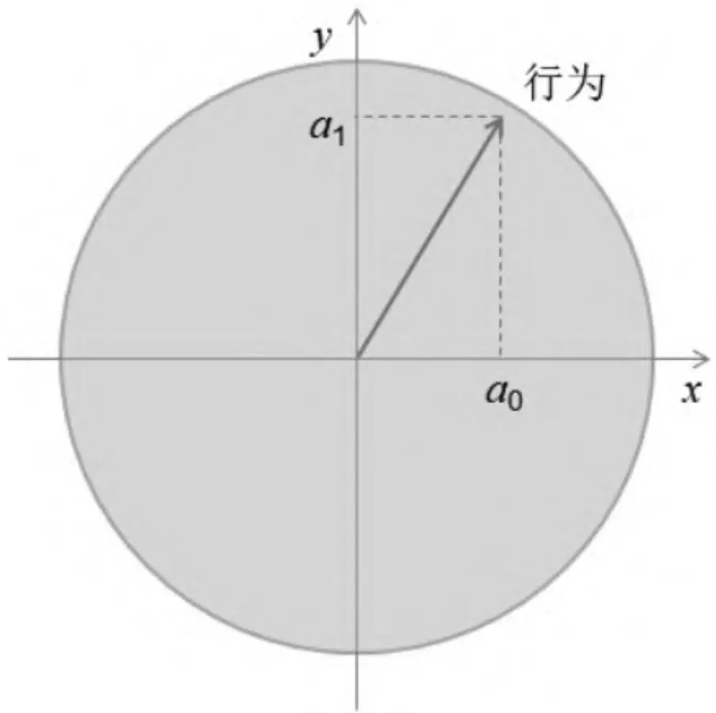
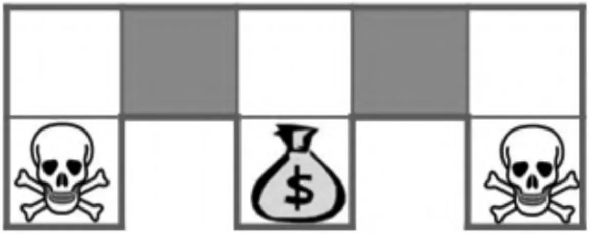
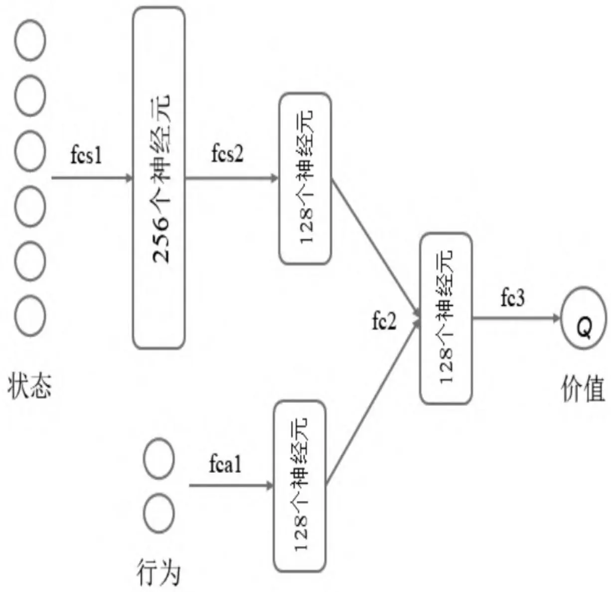
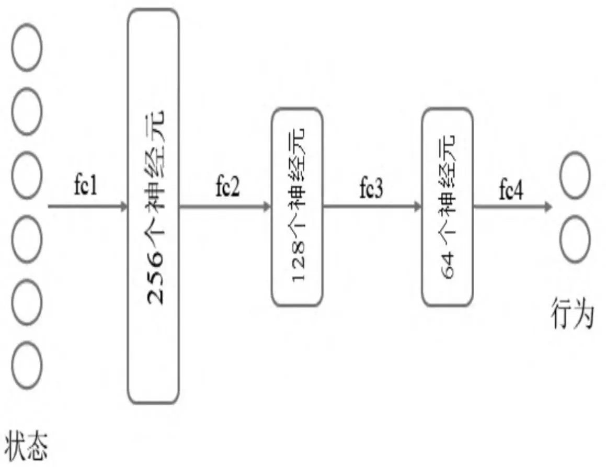
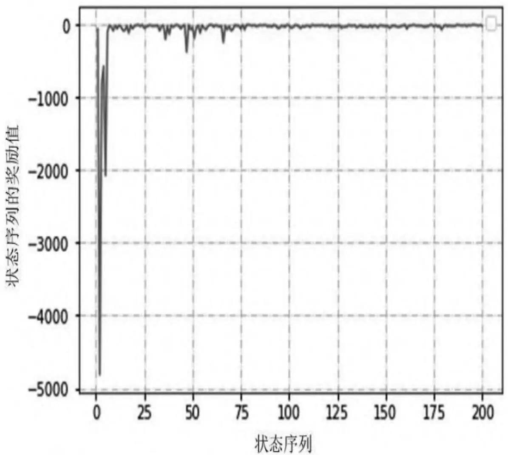

# 第7章 基于策略梯度的深度强化学习

在行为空间规模庞大或者是具有连续行为空间的情况下，基于价值的强化学习将很难学习到一个好的结果。这种情况下可以直接进行策略的学习，也就是将策略看成是具有状态和行为参数的策略函数，通过建立恰当的目标函数、利用个体与环境进行交互产生的奖励来学习得到策略函数的参数。策略函数针对连续行为空间将可以直接产生具体的行为值，进而绕过对状态价值的学习。

在实际应用中，一个解决强化学习问题的算法可以同时建立用于状态价值的近似函数和直接用于策略的近似函数。通过联合使用这两种函数，一方面可以基于价值函数进行策略评估和优化，另一方面优化的策略函数又会使得价值函数更加准确地反映状态的价值，两者相互促进最终得到最优策略。在这一思想背景下产生的深度确定性策略梯度算法成功地解决了连续行为空间中的诸多实际问题。

## 基于策略学习的意义

基于近似价值函数的学习可以较高效率地解决连续状态空间的强化学习问题，但其行为空间仍然是离散的。以PuckWorld世界环境来说，个体在环境中可以选择5个行为，分别是朝着左、右、上、下4个方向产生一个推动力，或者什么都不做。这个推动力是一个标准的值，假设为1。每一次朝着某个方向施加这个力时，其大小总是1或者0。对个体行为做这样的设定只是为了描述问题的方便。事实上，个体在同样的这个PuckWorld环境中，它完全可以同时在平面上的任何方向施加大小不超过一定值的力。此时该如何描述这个行为空间呢？这种情况下可以使用平面直角坐标系把力在水平和垂直方向上进行分解，分量大小不超过1，那么这个力就可以用水平和垂直两个方向上的分量来描述，每一个方向上的分量可以是[-1，1]之间的任何可能的实数值，例如0.55可以被用来表示在水平方向上对个体施加一个向右的0.55大小的力。在这个例子中，行为就是施加给个体的力。为了计算，这个力可以用其在水平和垂直方向上分量的大小这两个特征来描述，每一个分量的值不再是0或者1这两个离散值，可以是区间[0,1]上的任何一个小数，如图7.1所示。针对这种情形，如果继续使用基于价值函数近似的方法来求解，将无法得到最大行为价值对应的具体行为，可以认为单纯基于价值函数近似的强化学习算法无法解决有连续行为空间的强化学习问题。

此外，在使用特征来描述状态空间中的某一个状态时，有可能因为个体观测的限制或者建模的局限，导致本来不同的两个状态却拥有相同的特征描述，进而导致无法得到最优解。这种情形可以用如图7.2所示的例子来解释。该环境的状态空间是离散的，其中骷髅占据的格子代表着会受到严厉惩罚的终止状态，钱袋子占据的格子代表着有丰厚奖励的终止状态，其余5个格子个体可以自由进出。环境的状态虽然是离散的，但是由于个体观测水平的限制，假设现在个体只能观测到两个描述自身状态的特征，分别是个体当前位置北侧和南侧是否是墙壁（图中粗灰线条表示的轮廓）。如果一个格子的状态用这两个特征来表示，那么可以认为最左上方格子的状态特征为（1,0），因为其北部是墙壁，而南侧是进入一个惩罚终止状态的通道。类似地，图中灰色的两个格子状态特征均为（1,1），表示这两个格子的北侧和南侧均为墙壁。如果使用基于状态或行为价值的贪婪策略学习方法，在个体处于这两个灰色格子中时，依据贪婪原则，它将永远都只选择向左或者向右其中的一个行为。假设它仅选择向左的行为，那么对于右侧的灰色格子，将进入上方中间的格子，并且很容易随后选择向下的行为进而进入钱袋子表示的终止位置，得到丰厚奖励。但是，对于左侧灰色格子，它选择向左的行为将进入特征值为（1,0）的左上角格子，此状态下的最优策略是向右，因为向下就进入了惩罚的终止状态，而向左、向上都是无效行为。如此就发生了个体将一直在左侧灰色格子与左上角格子之间反复徘徊的局面，无法到达拥有丰厚奖励的终止状

态。因为个体的观测能力受限，当个体在两个不同的灰色格子中时，它无法区分这两个格子的区别且会认为它们是同一个格子，并会根据学习到的策略生成一个确定的行为，而这个行为对于个体处在其中的一个格子时可能是较优的行为，而对于个体处在另一个格子时就不是最优行为了。也就是说：在灰色格子状态下，依据价值函数可能会得到一个最优策略，其产生的行为总是向左移动，那么个体一旦进入左侧灰色格子就会发生一直左右徘徊的情况。这个例子说明：个体对于状态观测的特征不够多时，会导致多个状态发生重名情况，进而导致单纯基于状态或状态行为价值的学习得不到最优解。




图7.1　PuckWorld中的个体连续行为空间  



图7.2　特征表示的状态发生重名情况

基于价值的学习对应的最优策略通常是确定性策略，因为其是从众多行为价值中选择一个最大价值的行为，而有些问题的最优策略却是随机策略，这种情况下同样是无法通过基于价值的学习来求解的。这其中很简单的一个例子就是“石头剪刀布”游戏。对于这个游戏，玩家的最优策略是随机出石头、剪刀、布中的一个，因为一旦遵循某个确定的策略，就容易被对手发现并利用，进而输给对方。

从上面的几个例子可以看出，基于价值的强化学习虽然能出色地解决很多问题，但是面对行为空间连续、观测受限、随机策略的学习等问题时仍然显得力不从心。此时基于策略的学习是解决这类问题的一个新途径。在基于策略的强化学习中，策略π可以被描述为一个包含参数θ的函数：

$$
\pi_{\theta} (s, a) = P [ a | s, \theta ]
$$

策略函数πθ确定了在给定的状态和一定的参数设置下，采取任何可能行为的概率是一个概率密度函数。在实际应用这个策略时，选择最大概率对应的行为或者以此为基础进行一定程度的采样探索。可以认为，参数θ决定了策略的具体形式。因而求解基于策略的学习问题就转变为如何确定策略函数的参数θ的问题。同样可以设计一个基于参数θ的目标函数J（θ），通过相应的算法来寻找最优参数。

## 7.2 策略目标函数

强化学习的目标就是让个体在与环境交互的过程中获得尽可能多的累积奖励，一个好的策略应该能准确反映强化学习的目标。对于一个能够形成完整状态序列的交互环境来说，由于一个策略决定了个体与环境的交互，因而可以设计目标函数 ${\mathrm{J}} _{1} ~ ( ~ \theta ~ )$ 为使用策略πθ时的初始状态价值（Start Value），也就是初始状态收获的期望值：

$$
J_{1} (\theta) = V_{\pi_{\theta}} (s_{1}) = E_{\pi_{\theta}} [ G_{1} ] \tag{7.1}
$$

有些环境没有明确的起始状态和终止状态，个体持续地与环境进行交互。在这种情况下，可以使用平均价值（Average Value）或者每一时间步长的平均奖励（Average Reward Per Time-Step）来设计策略目标函数：

$$
J_{a v V} (\theta) = \sum_{s} d^{\pi_{\theta}} (s) V_{\pi_{\theta}} (s) \tag{7.2}
$$

$$
J_{a v R} (\theta) = \sum_{s} d^{\pi_{\theta}} (s) \sum_{a} \pi_{\theta} (s, a) R_{s} ^{a}
$$

其中， $d^{\pi_{\theta}} \left( s \right)$ 是基于策略 $\pi_{\mathrm{~ \theta ~}}$ 生成的马尔可夫链关于状态的静态分布。这3种策略目标函数都与奖励相关，而且都试图通过奖励与状态或行为的价值联系起来。与价值函数近似的目标函数不同，策略目标函数的值越大，代表策略越优秀。可以使用与梯度下降相反的梯度上升（Gradient Ascent）来求解最优参数：

$$
\nabla_{\theta} J (\theta) = \left[ \begin{array}{c} \frac{\partial J (\theta)}{\partial \theta_{1}} \\ \frac{\partial J (\theta)}{\partial \theta_{2}} \\ \vdots \\ \frac{\partial J (\theta)}{\partial \theta_{n}} \end{array} \right]
$$

参数θ使用下式更新：

$$
\Delta \theta = \alpha \nabla_{\theta} J (\theta)
$$

假设现在有一个单步马尔可夫决策过程，对应的强化学习问题是个体与环境每产生一个行为、交互一次即得到一个即时奖励 $r = R_{s , a}$ ，并形成一个完整的状态序列。根据式（7.1），策略目标函数为：

$$
\begin{array}{l} J (\theta) = E_{\pi_{\theta}} [ r ] \\ = \sum_{s \in S} d (s) \sum_{a \in A} \pi_{\theta} (s, a) R_{s, a} \\ \end{array}
$$

对应的策略目标函数的梯度为：

$$
\begin{array}{l} \nabla_{\theta} J (\theta) = \sum_{s \in S} d (s) \sum_{a \in A} \nabla_{\theta} \pi_{\theta} (s, a) R_{s, a} \\ = \sum_{s \in S} d (s) \sum_{a \in A} \pi_{\theta} (s, a) \nabla_{\theta} \log \pi_{\theta} (s, a) R_{s, a} \\ = E_{\pi_{\theta}} \left[ \nabla_{\theta} \log \pi_{\theta} (s, a) r \right] \\ \end{array}
$$

在上式中， $\nabla_{\theta} \log \pi_{\theta} \left( s , a \right)$ 称为分值函数（Score Function）。存在如下的策略梯度定理：对于任何可微的策略函数 $\pi_{\theta} \left( s , a \right)$ 以及3种策略目标函数 $J = J_{1} , J_{a v V}$ ， $J_{{\alpha} {\nu} R}$ 中的任意一种来说，策略目标函数的梯度（策略梯度）都可以写成用分值函数表示的形式：

$$
\nabla_{\theta} J (\theta) = E_{\pi_{\theta}} \left[ \nabla_{\theta} \log \pi_{\theta} (s, a) Q_{\pi_{\theta}} (s, a) \right] \tag{7.3}
$$

式（7.3）建立了策略梯度与分值函数以及行为价值函数之间的关系。分值函数在基于策略梯度的强化学习中有着很重要的意义。现在通过两个常用的基于线性特征组合的策略来解释说明。

## 1.Softmax策略

Softmax策略是应用于离散行为空间的一种常用策略。该策略使用描述状态和行为的特征 与参数θ的线性组合来权衡一个行为发生的概率：

$$
\nabla_{\theta} J (\theta) = E_{\pi_{\theta}} \left[ \nabla_{\theta} \log \pi_{\theta} (s, a) Q_{\pi_{\theta}} (s, a) \right]
$$

相应的分值函数为：

$$
\nabla_{\theta} \log \pi_{\theta} (s, a) = \phi (s, a) - E_{\pi_{\theta}} [ \phi (s, \cdot) ] \tag{7.4}
$$

假设一个个体的行为空间为 $[ \mathrm{a} _{0} , \mathrm{a} _{1} , \mathrm{a} _{2} ]$ ，给定一个策略π（θ），在某一状态s下分别采取3个行为得到的奖励为-1、10、-1，同时计算得到的3个动作对应的特征与参数的线性组合φ（s,a）的结果分别为4、5、9，则该状态下特征与参数线性组合的平均值为6，那么3个行为在当前状态s下对应的分值分别为-2、-1、3。分值越高，意味着在当前策略下对应行为被选中的概率越大，即此状态下依据当前策略将有非常大的概率采取行为 $a_2$，并得到奖励-1。对比当前状态下各行为的即时奖励，此状态下的最优行为应该是 $a_1$。策略的调整应该使得奖励值为10的行为 $a_1$ 出现的概率增大。因此将结合某一行为的分值对应的奖励来得到对应的梯度，并在此基础上调整参数，最终使得奖励越大的行为对应的分值越高。


## 2.高斯策略

高斯策略是应用于连续行为空间的一种常用策略。该策略对应的行为从高斯分布 $N \big ( \mu ( s ) , \sigma^{2} \big )$ 中产生。其均值 $\boldsymbol{\mu} ( \boldsymbol{s} ) = \boldsymbol{\phi} ( \boldsymbol{s} ) ^{\intercal} \boldsymbol{\theta}$ 高斯策略对应的分值函数为：

$$
\nabla_{\theta} \log \pi_{\theta} (s, a) = \frac{(a - \mu (s)) \phi (s)}{\sigma^{2}} \tag{7.5}
$$

对于连续行为空间中的每一个行为特征，由策略π（θ）产生的行为对应的特征分量都服从高斯分布，该分布中采样得到一个具体的行为分量，多个行为分量整体形成一个行为。采样得到的不同行为对应于不同的奖励，其中有正向奖励，也有负向奖励。优化策略就体现在对高斯分布均值的调整上，具体表现为对参数θ的更新，期待的效果为：那些获得正值奖励对应的行为在新的高斯分布策略中有更大的概率被个体选择。在具体更新高斯分布均值时，可以将原先获得正值奖励所对应的行为值的各个分量保持不变，作为计算新分布的采样点，而将原先获得负值奖励所对应的行为值的各个分量取相反数，作为计算新的分布的采样点。最终使得基于新分布的采样会较大概率产生在那些奖励值较高的行为值附近。

最终使得基于新分布的采样结果集中在那些奖励值较高的行为值上。

应用策略梯度可以比较容易地得到基于蒙特卡罗学习的策略梯度算法。该算法使用随机梯度上升来更新参数，同时使用某个状态的收获 $\mathrm{G_{t}}$ 来作为基于策略πθ下行为价值 $Q_{\pi_{\theta}} \left( s_{t} , a_{t} \right)$ 的无偏采样。参数更新方法为：

$$
\Delta \theta_{t} = \alpha \nabla_{\theta} \log \pi_{\theta} (s_{t}, a_{t}) G_{t}
$$

该算法实际应用不多，主要是由于它需要完整的状态序列来计算收获值，同时用收获值来代替行为价值也存在较高的变异性，导致许多次的参数更新方向有可能不是真正策略梯度的方向。为了解决这一问题，提出了一种联合基于价值函数和策略函数的算法，这就是下文要介绍的Actor-Critic算法。

## 7.3 Actor-Critic算法

Actor-Critic算法的名字很形象，包含一个策略函数和行为价值函数，其中策略函数充当演员（Actor），生成行为与环境交互；行为价值函数充当评估者（Critic），负责评价演员的表现，并指导演员的后续行为。Critic的行为价值函数是基于策略πθ的一个近似：

$$
Q_{w} (s, a) \approx Q_{\pi_{\theta}} (s, a)
$$

基于此，Actor-Critic算法遵循一个近似的策略梯度进行学习：

$$
\nabla_{\theta} J (\theta) \approx E_{\pi_{\theta}} \left[ \nabla_{\theta} \log \pi_{\theta} (s, a) Q_{w} (s, a) \right]
$$

$$
\Delta \theta = \alpha \nabla_{\theta} \log \pi_{\theta} (s, a) Q_{w} (s, a)
$$

Critic在算法中充当着策略评估的角色，由于Critic的行为价值函数也带参数w，这意味着它也需要学习，以便更准确地评估一个策略。可以使用[第6章](ch06.md)介绍的办法来学习训练一个近似价值函数。最基本的基于行为价值Q的Actor-Critic算法流程如算法5所示。

<pre class="pseudocode">
$$
\begin{algorithm}
$$

\caption{算法 5: QAC 算法}

\begin{algorithmic}
state 输入: $\gamma, \alpha, \beta, \theta, w$，输出: optimized $\theta, w$
state 初始化: $\theta$, $w$，从环境得到 $s$
state 采样: $a \sim \pi_{\theta}(s)$
repeat


state 执行行为 $a$，从环境得到 $s'$, 奖励
state 采样行为 $a' \sim \pi_{\theta}(s', a')$
state $\delta = \text{reward} + \gamma Q_w(s', a') - Q_w(s, a)$
state $\theta = \theta + \alpha \nabla_{\theta} \log \pi_{\theta}(s, a) Q_w(s, a)$
state $w = w + \beta \delta \phi(s, a)$
state $a \leftarrow a', s \leftarrow s'$

until{达到最大步数}
$$
\end{algorithmic}
\end{algorithm}
</pre>

$$

简单的QAC算法虽然不需要完整的状态序列，但是引入的Critic仍然是一个近似价值函数，存在着引入偏差的可能性。当价值函数接受的输入特征和函数近似方式足够幸运时，可以避免这种偏差而完全遵循策略梯度的方向。

## 【定理】如果满足下面两个条件：

1. 近似价值函数的梯度与分值函数的梯度相同，即

   $$
   \nabla_{w} Q_{w} (s, a) = \nabla_{\theta} \log \pi_{\theta} (s, a) _{\circ}
   $$

2. 近似价值函数的参数w能够最小化，即

   $$
   \epsilon = \mathbb{E} _{\pi_{\theta}} \left[ \left(Q_{\pi_{\theta}} (s, a) - Q_{w} (s, a)\right) ^{2} \right] _{\circ}
   $$

那么策略梯度 是准确的，即

$$
\nabla_{\theta} J (\theta) = \mathbb{E} _{\pi_{\theta}} \left[ \nabla_{\theta} \log \pi_{\theta} (s, a) Q_{w} (s, a) \right]
$$

在实践过程中，使用 来计算策略目标函数的梯度并不能保证每次都很幸运，有时还会发生数据过大等异常情况。出现这类问题是由于行为价值本身有较大的变异性。为了解决这个问题，提出一个与行为无关仅基于状态的基准（Baseline）函数B（s）的概念，要求B（s）满足：

$$
\mathbb{E} _{\pi_{\theta}} \left[ \nabla_{\theta} \log \pi_{\theta} (s, a) B (s) \right] = 0
$$

当基准函数B（s）满足上述条件时，可以将其从策略梯度中提取出，以减少变异性，同时不改变期望值，而基于状态的价值函数就是一个不错的基准函数。令优势函数（Advantage Function）为：

$$
A_{\pi_{\theta}} (s, a) = Q_{\pi_{\theta}} (s, a) - V_{\pi_{\theta}} (s) \tag{7.6}
$$

那么策略目标函数梯度可以表示为：

$$
\nabla_{\theta} J (\theta) = \mathbb{E} _{\pi_{\theta}} \left[ \nabla_{\theta} \log \pi_{\theta} (s, a) A_{\pi_{\theta}} (s, a) \right] \tag{7.7}
$$

优势函数相当于记录了在状态s时采取行为a会比停留在状态s多出的价值，这正好与策略改善的目标是一致的，由于优势函数考虑的是价值的增量，因此大大减少了策略梯度的变异性，提高了算法的稳定性。在引入优势函数后，Critic函数可以仅是优势函数的价值近似。优势函数的计算需要通过行为价值函数和状态价值函数相减得到，是否意味着需要设置两套函数近似来计算优势函数呢？其实不必如此，因为基于真实价值函数 的TD误差 $\delta_{\pi_{\theta}}$ 就是优势函数的一个无偏估计：

$$
\mathbb{E} _{\pi_{\theta}} \left[ \sigma_{\pi_{\theta}} | s, a \right] = \mathbb{E} _{\pi_{\theta}} \left[ r + \gamma V_{\pi_{\theta}} \left(s^{\prime}\right) | s, a \right] - V_{\pi_{\theta}} (s)
$$

$$
= Q_{\pi_{\theta}} (s, a) - V_{\pi_{\theta}} (s)
$$

$$
= A_{\pi_{\theta}} (s, a)
$$

因此又可以使用TD误差来计算策略梯度：

$$
\nabla_{\theta} J (\theta) = \mathbb{E} _{\pi_{\theta}} \left[ \nabla_{\theta} \log \pi_{\theta} (s, a) \delta_{\pi_{\theta}} \right] \tag{7.8}
$$

在实际应用中，使用带参数w的近似价值函数 $\mathrm{\Delta V_{w}}$ （s）来近似TD误差：

$$
\delta_{w} = r + \gamma V_{w} (s^{\prime}) - V_{w} (s) \tag{7.9}
$$

此时只需要一套参数w来描述Critic。

在使用不同强化学习方法来进行 $\cdot \mathrm{A c t o r - C r i t i c}$ 学习时，描述Critic的函数 $\mathrm{\Delta V_{w} ~} \left( s \right)$ 的参数w可以通过下列形式更新：

1. 对于蒙特卡罗（MC）学习：

   $$
   \Delta w = \alpha \left(G_{t} - V_{w} (s)\right) \phi (s)
   $$

2. 对于时序差分（TD（0））学习：

   $$
   \Delta w = \alpha (r + \gamma V (s^{\prime}) - V_{w} (s)) \phi (s)
   $$

3. 对于前向TD（λ）学习：

   $$
   \Delta w = \alpha \left(G_{t} ^{\lambda} - V_{w} (s)\right) \phi (s)
   $$

4. 对于后向TD（λ）学习：

   $$
   \begin{array}{l} \delta_{t} = r_{t + 1} + \gamma V_{w} (s_{t + 1}) - V_{w} (s_{t}) \\ e_{t} = \gamma \lambda e_{t - 1} + \phi (s_{t}) \\ \Delta w = \alpha \delta_{t} e_{t} \\ \end{array}
   $$

类似地，策略梯度

$$
\nabla_{\theta} J (\theta) = \mathbb{E} _{\pi_{\theta}} \left[ \nabla_{\theta} \log \pi_{\theta} (s, a) A_{\pi_{\theta}} (s, a) \right]
$$

也可以使用不同的学习方式来更新策略函数 $\pi_{\boldsymbol{\theta}} \big ( s , a \big )$ 的参数θ。

1. 对于蒙特卡罗（MC）学习：

   $$
   \Delta \theta = \alpha \left(G_{t} - V_{w} \left(s_{t}\right)\right) \nabla_{\theta} \log \pi_{\theta} \left(s_{t}, a_{t}\right)
   $$

2. 对于时序差分（TD（0））学习：

   $$
   \Delta \theta = \alpha (r + \gamma V_{w} (s_{t + 1}) - V_{w} (s_{t})) \nabla_{\theta} \log \pi_{\theta} (s_{t}, a_{t})
   $$

3. 对于前向TD（λ）学习：

   $$
   \Delta \theta = \alpha \left(G_{t} ^{\lambda} - V_{w} (s_{t})\right) \nabla_{\theta} \log \pi_{\theta} (s_{t}, a_{t})
   $$

4. 对于后向TD（λ）学习：

   $$
   \delta_{t} = r_{t + 1} + \gamma V_{w} (s_{t + 1}) - V_{w} (s_{t})
   $$

   $$
   e_{t} = \gamma \lambda e_{t - 1} + \nabla_{\theta} \log \pi_{\theta} (s_{t}, a_{t})
   $$

   $$
   \Delta w = \alpha \delta_{t} e_{t}
   $$

## 7.4 深度确定性策略梯度算法

深度确定性策略梯度（DDPG）算法是使用深度学习技术、同时基于Actor-Critic算法的确定性策略算法。该算法中的Actor和Critic都使用深度神经网络来建立近似函数。由于该算法可以直接从Actor的策略生成确定的行为而不需要依据行为的概率分布进行采样，因而被称为确定性策略。该算法在学习阶段通过在确定性的行为基础上增加一个噪声函数，以实现在确定性行为周围的小范围内进行探索。此外，该算法还为Actor和Critic网络分别备份了一套参数来计算行为价值的期待值，以更稳定地提升Critic的策略指导水平。使用备份参数的网络称为目标网络，其对应的参数每次更新的幅度很小。另一套参数对应的Actor和Critic用来生成实际交互的行为以及计算相应的策略梯度，这一套参数每学习一次就更新一次。这种双参数设置的目的是减少因近似数据的引导性（Bootstrapping）而发生不收敛的情况。这4个网络具体使用的情景为：

1. Actor网络：根据当前状态 $s_{0}$ 生成的探索或不探索的具体行为 $\mathrm{a} _{0}$ 。
2. Target Actor网络：根据环境给出的后续状态 $s_{1}$ 生成预估价值用到的 $\mathrm{a} _{1}$ 。

3. Critic网络：计算状态 $s_{0}$ 和生成的行为 $\mathrm{a} _{0}$ 对应的行为价值。
4. Target Critic网络：根据后续状态 $s_{1}$ ， $\mathrm{a} _{1}$ 生成用来计算目标价值 $y = \boldsymbol{\mathcal{Q}} \big ( s_{0} , a_{0} \big ) \sharp_{1} ^{\prime} \ j^{\prime} ( s_{1} , a_{1} )$ 。


DDPG算法表现出色，能够较为稳定地解决连续行为空间下的强化学习问题，其具体流程如算法6所示。

<pre class="pseudocode">
$$
\begin{algorithm}
$$

\caption{算法 6: DDPG 算法}

\begin{algorithmic}
state 输入: $\gamma, \tau, \theta^{Q}, \theta^{\mu}$，输出: optimized $\theta^{Q}, \theta^{\mu}$
state 随机初始化 critic 网络 $Q(s, a|\theta^{Q})$ 和 actor 网络 $\mu(s|\theta^{\mu})$ 的权重 $\theta^{Q}$, $\theta^{\mu}$
state 初始化目标网络 $Q'$ 和 $\mu'$ 的权重: $\theta^{Q'} \leftarrow \theta^{Q}$, $\theta^{\mu'} \leftarrow \theta^{\mu}$


state 初始化经验回放缓存 R
for{episode from 1 to Limit}
state 初始化随机过程(噪声) $N$ 用于动作探索
state 接收初始观测状态 $s_{1}$
for{$t = 1$ to $T$}

state 根据当前策略和探索噪声选择动作 $a_{t} = \mu(s_{t}|\theta^{\mu}) + N_{t}$
state 执行动作 $a_{t}$，观测奖励 $r_{t+1}$ 和新状态 $s_{t+1}$
state 存储转换 $(s_{t}, a_{t}, r_{t+1}, s_{t+1})$ 到 R
state 从 R 中采样随机小批量 $M$ 个转换 $(s_{i}, a_{i}, r_{i+1}, s_{i+1})$
state 设置 $y_{i} = r_{i+1} + \gamma Q'(s_{i+1}, \mu'(s_{i+1}|\theta^{\mu'})|\theta^{Q'})$
state 通过最小化损失更新 Critic: $L = \frac{1}{M} \sum_{i} (y_{i} - Q(s_{i}, a_{i}|\theta^{Q}))^{2}$
state 通过采样策略梯度更新 Actor: $\nabla_{\theta^{\mu}} J \approx \frac{1}{M} \sum_{i} \nabla_{a} Q(s, a|\theta^{Q})|_{s=s_{i},a=\mu(s_{i})} \nabla_{\theta^{\mu}} \mu(s|\theta^{\mu})|_{s_{i}}$
state 更新目标网络: $\theta^{Q'} \leftarrow \tau\theta^{Q} + (1-\tau)\theta^{Q'}$, $\theta^{\mu'} \leftarrow \tau\theta^{\mu} + (1-\tau)\theta^{\mu'}$
endfor
endfor
\end{algorithmic}
\end{algorithm}
</pre>


本章的编程实践将实现DDPG算法，并观察该算法在具有连续行为空间的PuckWorld环境中的表现。

## 7.5 编程实践：DDPG算法实现

本节的编程实践将先简要介绍具有连续行为空间的PuckWorld的特点，随后实现DDPG算法，具体包括Critic网络和Actor网络的实现、具有DDPG算法功能的DDPGAgent子类的实现。最后编写代码观察该子类的实例如何与具有连续行为空间的PuckWorld环境交互的表现。读者可以从中体会DDPG算法的核心部分和使用PyTorch机器学习库优化网络参数带来的便利性。

### 7.5.1 连续行为空间的PuckWorld环境

本章的前文部分介绍了PuckWorld环境中连续行为空间的设计思路，即连续行为空间由两个特征组成，分别表示个体在水平和竖直方向上一个时间步长内接受的力的大小，其数值范围被限定在区间[-1,1]内。编写具有连续行为空间的PuckWorld类并不难，这里附上它与个体交互的核心方法step，以帮助读者明确个体与它交互的具体机制。读者可以在puckworld_continuous.py文件中查看完整的代码。

```python
该段代码不是完整的PuckWorldEnv代码
def step(self, action):
    self.action = action
    ## 获取个体状态信息，分别为位置坐标、速度和目标Puck的位置
    ppx, ppy, pvx, pvy, tx, ty = self.state
    ppx, ppy = ppx + pvx, ppy + pvy    ## 依据当前速度更新个体位置
    pvx, pvy = pvx*0.95, pvy*0.95    ## 摩擦作用会少量降低速度
    ## 水平、竖直方向的行为对速度分量的影响
    pvx += self.accel * action[0]
    pvy += self.accel * action[1]
    ## 速度被限制在特定范围内
    pvx = self._clip(pvx, -self.max_speed, self.max_speed)
    pvy = self._clip(pvy, -self.max_speed, self.max_speed)
    ## 个体碰到四周的墙壁，速度方向发生改变，大小损失一半
    if ppx < self.rad:    ## 左侧边界
    pvx *= -0.5 ppx = self.rad
    if ppx > 1 - self.rad:    ## 右侧边界
    pvx *= -0.5

    ppx = 1 - self.rad
    if ppy < self.rad:    ## 底部边界
```

```python
pvy *= -0.5
ppy = self.rad
if ppy > 1 - self.rad:    ## 上方边界
pvy *= -0.5
ppy = 1 - self.rad
self.t += 1    ## 时间
步长增加1，每隔一定时间随机改变Puck的位置
if self.t \% self.update_time == 0:
    tx = self._random_pos()
    ty = self._random_pos()
根据个体与Puck的距离来确定奖励
dx, dy = ppx - tx, ppy - ty
dis = self._compute_dis(dx, dy)
self.reward = self.goal_dis - dis
done = bool(dis <= self.goal_dis)
反馈给个体观测状态以及奖励信息等
self.state = (ppx, ppy, pvx, pvy, tx, ty)
return np.array(self.state), self.reward, done, {}
```

### 7.5.2 Actor-Critic网络的实现

在DDPG算法中，Critic网络充当评判家的角色，评估个体在当前状态下的价值以指导策略产生行为；Actor网络负责根据当前状态生成具体的行为。使用PyTorch库中的神经网络来构建这两个近似函数，导入相关的包，为了增加模型的收敛性，使用一种更有效的网络参数的初始化方法。相关代码如下：

```python
import torch
import torch.nn as nn
import torch.nn.functional as F
import numpy as np
def fanin_init(size, fanin=None):
    '''一种较合理的初始化网络参数，参考https://arxiv.org/abs/1502.01852'''
    fanin = fanin or size[0]
    v = 1. / np.sqrt(fanin)
    x = torch.Tensor(size).uniform_(-v, v) ## 从-v到v的均匀分布
    return x.type(torch.FloatTensor)
```

Critic网络接受的输入是个体观测的特征数以及行为的特征数，输出“状态-行为对”的价值。考虑到个体对于观测状态进行特征提取的需要，本例设计的Critic共有3个隐藏层，处理状态的隐藏层和行为的隐藏层先分开运算，通过最后一个隐藏层全连接在一起输出“状态-行为对”价值。该网络属于价值函数近似的第二种类型，架构如图7.3所示。

具体的代码如下：
```python
class Critic(nn.Module):
    def _init__(self, state_dim, action_dim):
    '''构建一个评判家模型    Args:
    state_dim: 状态特征的数量 (int)
    action_dim: 行为作为输入特征的数量 (int)
    '''
    super(Critic, self).__init__()

    self.state_dim = state_dim
    self.action_dim = action_dim

    self.fcs1 = nn.Linear(state_dim, 256) ## 状态第一次线性变换
    self.fcs1.weight.data =
    fanin_init(self.fcs1.weight.data.size())
    self.fcs2 = nn.Linear(256,128)
状态第二次线性变换
    self.fcs2.weight.data =
    fanin_init(self.fcs2.weight.data.size())

    self.fca1 = nn.Linear(action_dim, 128) ## 行为第一次线性变换
    self.fca1.weight.data =
    fanin_init(self.fca1.weight.data.size())

    self.fc2 = nn.Linear(256,128) ## (状态+行为)联合的线性变换，注意参数值
    self.fc2.weight.data =
    fanin_init(self.fc2.weight.data.size())

    self.fc3 = nn.Linear(128,1) ## (状态+行为)联合的线性变换
    self.fc3.weight.data.uniform_(-EPS,EPS)

    def forward(self, state, action):
    '''前向运算，根据状态和行为的特征得到评判家给出的价值    Args:
    state 状态的特征表示 torch Tensor [n, state_dim]
    action 行为的特征表示 torch Tensor [n, action_dim]

Returns:
    Q(s,a) Torch Tensor [n, 1]
    '''
    ## 该网络属于价值函数近似的第二种类型，根据状态和行为输出一个价值
    ## print("first action type: {}".format(action.shape))
    state = torch.from_numpy(state)
    state = state.type(torch.FloatTensor)

    action = action.type(torch.FloatTensor)
    s1 = F.relu(self.fcs1(state))
    s2 = F.relu(self.fcs2(s1))

    a1 = F.relu(self.fca1(action))
    ## 将状态和行为连接起来，使用第二种近似函数架构(s,a)->Q(s,a)
    x = torch.cat((s2,a1), dim=1)

    x = F.relu(self.fc2(x))
    x = self.fc3(x)

    return x
```




图7.3　Critic网络架构

Actor网络接受的输入是个体观测的特征数，输出每一个行为特征具体的值，属于第三类近似函数架构。本例设计的Actor网络共有3个隐藏层，层与层之间全连接。该网络的架构如图7.4所示。




图7.4　Actor网络架构

具体代码如下：

```python
EPS = 0.003
class Actor(nn.Module):
    def _init__(self, state_dim, action_dim, action_lim):
    '''构建一个演员模型    Args:
    state_dim: 状态特征的数量 (int)
    action_dim: 行为作为输入特征的数量 (int)
    action_lim: 行为值的限定范围 [-action_lim, action_lim]
    '''
    super(Actor, self).__init__()
    self.state_dim = state_dim
```

```python
self.action_dim = action_dim
self.action_lim = action_lim
self.fc1 = nn.Linear(self.state_dim, 256)
self.fc1.weight.data =
fanin_init(self.fc1.weight.data.size())

self.fc2 = nn.Linear(256,128)
self.fc2.weight.data =
fanin_init(self.fc2.weight.data.size())
self.fc3 = nn.Linear(128,64)
self.fc3.weight.data =
fanin_init(self.fc3.weight.data.size())
self.fc4 = nn.Linear(64, self.action_dim)
self.fc4.weight.data.uniform_(-EPS,EPS)

def forward(self, state):
    '''前向运算，根据状态的特征表示得到具体的行为值    Args:
    state 状态的特征表示 torch Tensor [n, state_dim]
    Returns:
    action 行为的特征表示 torch Tensor [n, action_dim]
    '''
    state = torch.from_numpy(state)
    state = state.type(torch.FloatTensor)
    x = F.relu(self.fc1(state))
    x = F.relu(self.fc2(x))
    x = F.relu(self.fc3(x))
    action = F.tanh(self.fc4(x))    ## 输出范围-1,1
    action = action * self.action_lim    ## 更改输出范围
    return action
```

### 7.5.3 确定性策略下探索的实现

通常在连续行为空间下的确定性策略每次都是根据当前状态生成一个代表行为的确切向量。为了能实现探索，可以在生成的行为基础上添加一个随机噪声，使其在确切的行为周围实现一定范围的探索。比较合适的噪声模型是Ornstein-Uhlenbeck过程，可以生成符合高斯分布、马尔可夫过程的随机过程，通过实现类

OrnsteinUhlenbeckActionNoise来生成一定维度的噪声数据，并将其放入utils文件中。

```python
class OrnsteinUhlenbeckActionNoise:
    def _init__(self, action_dim, mu = 0, theta = 0.15, sigma = 0.2):
    self.action_dim = action_dim
    self.mu = mu
    self.theta = theta
    self.sigma = sigma
    self.X = np.ones(self.action_dim) * self.mu
    def reset(self):
    self.X = np.ones(self.action_dim) * self.mu
    def sample(self):
    dx = self.theta * (self.mu - self.X)
    dx = dx + self.sigma *
np.random.randn(len(self.X))
    self.X = self.X + dx
    return self.X
```

### 7.5.4 DDPG算法的实现

本例中，DDPG算法被整合至DDPGAgent类（继承自Agent基类）中。在DDPGAgent类中，将实现包括更新参数在内的所有主要功能。由于DDPG算法涉及两套网络参数，并且这两套网络参数分别使用两种参数更新方法（一种是称为hard_update的完全更新，另一种是称为soft_update的小幅度更新）。因此先编写一个辅助函数实现这两个方法，并将其加入utils.py文件中：

```python
def soft_update(target, source, tau):
    """
    使用下式将source网络(x)参数软更新至target网络(y)参数:
    y = tau * x + (1 - tau) * y
    Args:
    target: 目标网络(PyTorch)
    source: 源网络 network (PyTorch)
    Return: None
    """
    for target_param, param in zip(target.parameters(),
    source.parameters()):
    target_param.data.copy_(
    target_param.data * (1.0 - tau) + param.data *
    tau
    )

    def hard_update(target, source):
    """
    将source网络(x)参数完全更新至target网络(y)参数:
    Args:
    target: 目标网络 (PyTorch)
    source: 源网络 network (PyTorch)
    Return: None
    """
```

```python
for target_param, param in zip(target.parameters(), \
source.parameters()):
    target_param.data.copy_(param.data)
```

下面着手实现DDPGAgent。首先导入一些需要使用的库和方法：

```python
from random import random, choice
from gym import Env, spaces
import gym
import numpy as np
import torch
from torch import nn
import torch.nn.functional as F
from tqdm import tqdm
from core import Transition, Experience, Agent
from utils import soft_update, hard_update
from utils import OrnsteinUhlenbeckActionNoise
from approximator import Actor, Critic
```

DDPGAgent类接受一个环境对象，同时接受相关的学习参数等。从环境对象可以得到状态和行为的特征数量，以此来构建Actor和Critic网络。构造函数声明了两套网络，在初始时两套网络对应的参数通过硬复制，其数值相同，代码如下：

```python
class DDPGAgent(Agent):
    '''使用Actor-Critic算法结合深度学习的个体    '''
    def _init__(self, env: Env = None,
    capacity = 2e6,
    batch_size = 128,
    action_lim = 1,
    learning_rate = 0.001,
    gamma = 0.999,
    epochs = 2):
```

```python
if env is None:
    raise "agent should have an environment"
    super(DDPGAgent, self).__init__(env, capacity)
    self.state_dim = env.observation_space.shape[0]

状态连续
    self.action_dim = env.action_space.shape[0]

行为连续
    self.action_lim = action_lim    ## 行为值限制
    self.batch_size = batch_size    ## 批量学习一次的状态转换数量
    self.learning_rate = learning_rate  ## 学习率
    self.gamma = 0.999    ## 衰减因子
    self.epochs = epochs    ## 状态转换学习的次数 (epoch)
    self.tau = 0.001    ## 软复制的系数
    self.noise =
    OrnsteinUhlenbeckActionNoise(self.action_dim)
    self.actor = Actor(self.state_dim,
    self.action_dim, self.action_lim)
    self.target_actor = Actor(self.state_dim,
    self.action_dim,
    self.action_lim)
    self.actor_optimizer =
    torch.optim.Adam(self.actor.parameters(),
    self.learning_rate)
    self.critic = Critic(self.state_dim,
    self.action_dim)
    self.target_critic = Critic(self.state_dim,
    self.action_dim)
    self.critic_optimizer = torch.optim.Adam(self.critic.parameters(),
    self.learning_rate)
    hard_update(self.target_actor, self.actor)
硬复制
    hard_update(self.target_critic, self.critic)
硬复制
    return
```

由于是连续行为，因此本例将放弃Agent基类的policy方法，转而声明下面两个新方法来实现确定性策略中的探索和利用：

```python
def get_exploitation_action(self, state):
    '''得到给定状态下依据目标Actor网络计算出的行为，不探索    Args:
    state numpy数组 Returns:
    action numpy 数组
    '''
    action =
    self.target_actor.forward(state).detach()
    return action.data.numpy()

    def get_exploration_action(self, state):
    '''得到给定状态下根据Actor网络计算出的带噪声的行为，模拟一定的探索    Args:
    state numpy数组
    Returns:
    action numpy 数组
    '''
    action = self.actor.forward(state).detach()
    new_action = action.data.numpy() + \
(self_noise.sample() * self.action_lim)
    new_action = new_action.clip(min = -1 * self.action_lim,
    max = self.action_lim)
    return new_action
```

同DQN算法一样，DDPG算法也是基于经验回放的，并且参数的更新都是通过训练从经验中随机得到的多个状态转换而来的。本例把这些参数更新的过程放在从记忆学习方法_learn_from_memory中。该方法是DDPG的核心，从中可以体会两套网络具体应用的时机，具体代码如下：

```python
def learn_from_memory(self):
    """从记忆学习，更新两个网络的参数
    """
    ## 随机获取记忆里的Transmission
    trans_pieces = self.sample(self.batch_size)
    s0 = np.vstack([x.s0 for x in trans_pieces])
    a0 = np.array([x.a0 for x in trans_pieces])
    r1 = np.array([x.reward for x in trans_pieces])
    ## is_done = np.array([x.is_done for x in trans_pieces])
    s1 = np.vstack([x.s1 for x in trans_pieces])
    ## 优化Critic网络参数
    a1 = self.target_actor.forward(s1).detach()
    next_val =
    torch.squeeze(self.target_critic.forward(s1, a1).detach())
    ## y_exp = r + gamma*Q'(s2, pi'(s2))
    y_expected = r1 + self.gamma * next_val

    y_expected = y_expected.type(torch.FloatTensor)
    ## y_pred = Q(s1, a1)
    a0 = torch.from_numpy(a0)    ## 转换成张量（Tensor）
    y_predicted =
    torch.squeeze(self.critic.forward(s0, a0))
    ## compute critic loss, and update the critic
    loss_critic = F.smooth_l1_loss(y_predicted, y_expected)
    self.critic_optimizer.zero_grad()
    loss_critic.backward()
    self.critic_optimizer.step()
    ## 优化Actor网络参数，优化的目标是使得Q增大
    pred_a0 = self.actor.forward(s0)    ## 为什么不直接使用a0
    ## 反向梯度下降(梯度上升)，以某状态的价值评估为策略目标函数
    loss_actor = -1 *
    torch.sum(self.critic.forward(s0, pred_a0))
    self.actor_optimizer.zero_grad()
    loss_actor.backward()
    self.actor_optimizer.step()
    ## 软更新参数
    soft_update(self.target_actor, self.actor, self.tau)
    soft_update(self.target_critic, self.critic,
```

```python
self.tau)
    return (loss_critic.item(), loss_actor.item())
```

学习方法learning_method的改动不大，依旧负责个体与环境实际交互并实现一个完整的状态序列：

```python
def learning_method(self, display = False, explore = True):
    self.state = np.float64(self.env.reset())
    time_in_episode, total_reward = 0, 0
    is_done = False
    loss_critic, loss_actor = 0.0, 0.0
    while not is_done:
    ## add code here
    s0 = self.state
    if explore:
    a0 = self.get_exploration_action(s0)
    else:
    a0 =
    self.actor.forward(s0).detach().data.numpy()
    s1, r1, is_done, info, total_reward = self.act(a0)
    if display:
    self.env.render()
    if self.total_trans > self.batch_size:
    loss_c, loss_a =
    self._learn_from_memory()
    loss_critic += loss_c loss_actor += loss_a
    time_in_episode += 1
    loss_critic /= time_in_episode
    loss_actor /= time_in_episode
    if display:
    print("{}".format(self.experience.last_episode))
    return time_in_episode, total_reward, loss_critic, loss_actor
```

最后，重写learning方法，并编写能够保存和加载网络参数功能的方法，使得可以在训练过程中保存训练成果：

```python
def learning(self,max_episode_num = 800, display = False,
    explore = True):
    total_time, episode_reward, num_episode = 0,0,0
    total_times, episode_rewards, num_episodes = [],
[], []
    for i in tqdm(range(max_episode_num)):
    time_in_episode, episode_reward, loss_critic, loss_actor = \
    self.learning_method(display = display, explore = explore)
    total_time += time_in_episode
    num_episode += 1
    total_times.append(total_time)
    episode_rewards.append(episode_reward)
    num_episodes.append(num_episode)
    print("episode::{3}: loss critic::{4.3f}, loss_actor::{4.3f}".\
    format(num_episode-1, loss_critic, loss_actor))
    if explore and num_episode % 100 == 0:
    self.save_models(num_episode)
    return total_times, episode_rewards, num_episodes)

    def save_models(self, episode_count):
    torch.save(self.target_actor.state_dict(),
    './Models/' + str(
    episode_count) + '_actor.pt')
    torch.save(self.target_critic.state_dict(),
    './Models/' + str(
    episode_count) + '_critic.pt')
    print("Models saved successfully")

    def load_models(self, episode):
    self.actor.load_state_dict(torch.load('./Models/' + str(episode) + \
    '_actor.pt'))
self.critic.load_state_dict(torch.load('./Models/' +
```

```python
str(episode)+\
' _critic.pt' )
    hard_update(self.target_actor, self.actor)
    hard_update(self.target_critic, self.critic)
    print("Models loaded successfully")
```

这样一个具备DDPG算法的个体就完成了，下面将观察该算法在具有连续行为空间PuckWorld中的表现。

### 7.5.5 DDPG算法在PuckWorld环境中的表现

导入需要的库和方法：

```python
import gym
from puckworld_continuous import PuckWorldEnv
from ddpg_agent import DDPGAgent
from utils import learning_curve
import numpy as np
```

建立环境和DDPG个体对象：

```julia
env = PuckWorldEnv()
agent = DDPGAgent(env)
```

启动学习过程：

```python
data = agent.learning(max_episode_num = 200, display = False)
```

在执行上述代码的过程中，个体完成初期的状态序列花费时间较长，但得益于基于经验的学习，仅经过数十个完整的序列后个体就可以比较成功地完成任务了。其学习曲线如图7.5所示。




图7.5　DDPG算法在连续行为空间PuckWorld中的表现

读者可以使用下面的代码加载已经进行过300次完整序列的模型，将display设置为True、explore设置为False来观察个体的表现。

```python
agent.load_models(300)
data = agent.learning(max_episode_num = 100,
    display = True,
    explore = False)
```

关闭可视化界面：

env.close()

