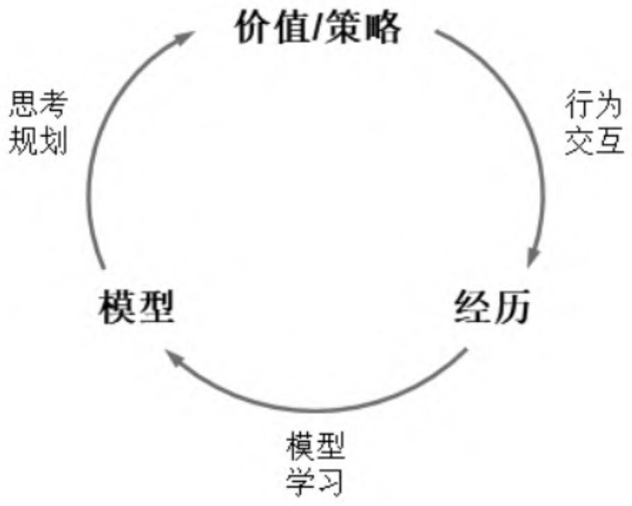
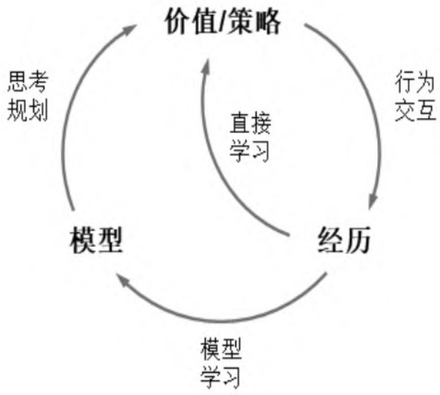
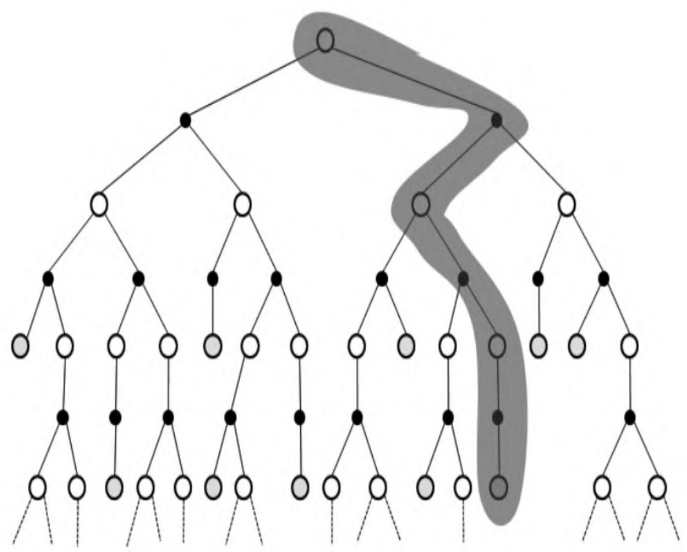

# 第8章 基于模型的学习和规划

多数强化学习问题可以通过查表式或基于近似函数的方法来直接学习状态价值或策略函数，在这些学习方法中，个体并不会试图去理解环境动力学特征（即环境规则）。如果能建立一个较为准确地模拟环境动力学特征的模型，或者当问题的本身就类似于一些棋类游戏等规则非常明确且开放给个体时，个体就可以通过构建一个模型来模拟或复制环境的动力学特征，随后通过这个模型来模拟其与环境的交互。这种交互并不是个体实际发生的与环境的交互，而是个体根据现有的各种策略与模型发生的模拟交互，它非常类似于人类使用大脑进行“思考”的过程，也类似于用军事上的沙盘或计算机推演。通过“思考”“推演”，个体可以对问题进行不同方向的规划、在与模拟环境的模型进行虚拟交互时分析和判断各种交互可能产生的后果，并形成个体当前认为最优的策略，再将该策略应用于个体与环境实际的交互过程中，进而验证和优化当前的策略。这种构建模型进行思考推演在付诸实践的思想，可以广泛应用于规则简单但状态或结果复杂的强化学习问题。

## 8.1 环境的模型

模型是个体构建的对于环境动力学特征的一种表示。在解决强化学习问题时，个体可以选择不建立模型，通过与环境直接进行交互而学习得到状态的价值函数或策略函数。在某些情况下，例如环境的动力学特征比较简单或者个体不想与环境进行过多的实际交互，个体可以先与环境进行直接交互来构建一个模型，再根据这个模型去学习得到状态的价值函数或学习得到一个策略函数。当个体拥有一个较为准确的描述环境动力学特征的模型时，它在与环境交互的过程中，既可以通过实际交互来提高其所构建的模型的准确程度，也可以在与环境实际交互的间隙利用构建的模型进行思考、规划，决策出对个体有利的行为。基于模型的强化学习流程可以用图8.1来表示。

图8.1　基于模型的强化学习流程

从理论上来说，模型M为一个马尔可夫决策过程MDP<S,A,P,R>的参数化表现形式。假设状态和行为空间是已知的，那么模型 $\mathrm{M} {=} \langle \mathrm{P} _{\mathfrak{n}} , \mathrm{R} _{\mathfrak{n}} \rangle$ 描述了环境动力学中的状态转换 $P_{\eta} \approx P$ 和奖励函数 $R_{\eta} \approx R$ ：

$$
S_{t + 1} \sim P_{\eta} \left(S_{t + 1} \mid S_{t}, A_{t}\right)
$$

$$
R_{t + 1} = R_{\eta} \left(R_{t + 1} \mid S_{t}, A_{t}\right)
$$

并且假设状态转换和奖励之间是条件独立的：

$$
P \big [ S_{t + 1}, R_{t + 1} \mid S_{t}, A_{t} \big ] = P \big [ S_{t + 1} \mid S_{t}, A_{t} \big ] P \big [ R_{t + 1} \mid S_{t}, A_{t} \big ]
$$

学习一个模型相当于从经历 $S_{1} , A_{1} , R_{2} , \cdots , S_{T}$ 中通过监督式学习得到一个$M_{\eta}$ 。其中：

（1）训练数据为：

$$
S_{1}, A_{1} \rightarrow R_{2}, S_{2}
$$

$$
S_{2}, A_{2} \rightarrow R_{3}, S_{3}
$$

$$
\begin{array}{c} \bullet \\ \vdots \\ \bullet \end{array}
$$

$$
S_{T - 1}, A_{T - 1} \rightarrow R_{T}, S_{T}
$$

（2）从 $s, a \to r$ 是一个回归问题，从 $s, a \to s'$ 是一个概率密度估计问题。所有监督式学习的相关算法都可以用来解决这两个问题。

根据具体使用算法的不同和状态的特征表示模型，可以有传统的查表式模型以及基于深度神经网络的模型等。各种模型的构建和学习本质都是通过训练得到最符合经历数据的参数η。下文仅通过查表式模型来解释模型的构建和学习。

查表式模型将经历得到的状态转移和概率存入一个表中，需要时通过检索表格得到相关数据。其中状态转移概率和奖励的计算方法

为：

$$
\hat{P} _{s s^{\prime}} ^{a} = \frac{1}{N (s , a)} \sum_{t = 1} ^{T} 1 \left(S_{t}, A_{t}, S_{t + 1} = s, a, s^{\prime}\right)
$$

$$
\hat{R} _{s} ^{a} = \frac{1}{N (s , a)} \sum_{t = 1} ^{T} \left(S_{t}, A_{t} = s, a\right) R_{t}
$$

在实际使用模型虚拟一个经历时，并不直接使用上述公式，而是从符合当前状态和行为（s,a）的状态转换集合中，依据状态s后续状态的概率分布采样得到一个 $\langle s, a, \hat{r}, \hat{s}' \rangle$ 作为虚拟经历。

建立模型是为了解决问题，这一过程是通过规划来进行的。而规划的过程相当于解决一个MDP的过程，即给定一个模型 $M_{\eta} = < P_{\eta} , R_{\eta} >$ ，求解基于该模型的 $\langle \mathrm{S}, \mathrm{A}, \mathrm{P}_{\eta}, \mathrm{R}_{\eta} \rangle$ ，最终找到基于该模型的最优价值函数或最优策略。求解已知MDP的强化学习问题可以从本书一开始介绍的价值迭代、策略迭代等方法来进行，对于状态和行为空间规模较大的MDP问题，可以使用基于模型的采样，在采样得到的虚拟经历基础上使用无模型的强化学习方法，例如MC学习、TD学习等方法。不过，由于实际经历的不足或者一些无法避免的缺陷，通过已发生的实际经历学习得到的模型不可能是完美的模型，即

<   P_{\eta}, R_{\eta} > \neq <   P, R >

从基于不完美模型的MDP中学习得到的最优策略通常也不是实际问题的最优策略，这就要求个体在环境实际交互的同时要不断地更新模型参数，基于更新的模型来优化最优策略。这种使用近似的模型解决强化学习问题，与使用价值函数或策略函数的近似表达来解决强化学习问题并不冲突，它们是从不同角度来近似求解一个强化学习问题，当构建一个模型比构建近似价值函数或近似策略函数更加方便时，使用近似模型来求解会更加高效。使用模型来解决强化问题时要特别注意模型参数要随着个体与环境交互而不断地动态更新，即通过实际经历要与使用模型产生的虚拟经历相结合来解决问题，这就催生了一类整合了学习与规划的强化学习算法——Dyna算法。

## 8.2 整合学习与规划— Dyna算法

Dyna算法从实际经历中学习得到模型，同时联合使用实际经历和基于模型采样得到的虚拟经历来学习和规划，更新价值或策略函数（见图8.2）。基于行为价值的Dyna-Q算法的流程如算法7所示。

图8.2　Dyna算法的学习与规划框架

<pre class="pseudocode">
$$
\begin{algorithm}
$$

\caption{算法 7: Dyna-Q 算法}
$$
\begin{algorithmic}
state Input: $Q, \gamma, \alpha$
state Output: optimized $Q$
state Initialize $Q(s,a)$ and $Model(s,a)$ for all $s \in \mathbb{S}, a \in \mathbb{A}(s)$
repeat
state $S \leftarrow$ current (nonterminal) state
state $A \leftarrow \epsilon$-greedy$(S,Q)$
state Execute action $A$, observe resultant reward $R$ and next state $S'$
state $Q(S,A) \leftarrow Q(S,A) + \alpha[R + \gamma \max_a Q(S',a) - Q(S,A)]$
state $Model(S,A) \leftarrow R, S'$  ## assuming deterministic environment
for{$n$ times}
state $S \leftarrow$ random previously observed state
state $A \leftarrow$ random action previously taken in $S$
state $R, S' \leftarrow Model(S,A)$
state $Q(S,A) \leftarrow Q(S,A) + \alpha[R + \gamma \max_a Q(S',a) - Q(S,A)]$
endfor
until{forever}
\end{algorithmic}
\end{algorithm}
</pre>

$$

## 8.3 基于模拟的搜索

在强化学习中，基于模拟的搜索（Simulation-based Search）是一种前向搜索形式，它从当前时刻的状态开始，利用模型来模拟采样，构建一个关注短期未来的前向搜索树，将构建得到的搜索树作为一个学习资源，再使用无模型的强化学习方法来寻找当前状态下的最优策略（见图8.3）。如果使用蒙特卡罗学习方法，则称为蒙特卡罗搜索；如果使用Sarsa学习方法，则称为TD搜索。其中，蒙特卡罗搜索又分为简单蒙特卡罗搜索和蒙特卡罗树搜索。

图8.3　始于状态St的基于模拟的搜索

### 8.3.1 简单蒙特卡罗搜索

给定一个模型 $\mathtt{M_{v}}$ 和一个在模拟采样过程中使用的策略π，对于当前个体实际所处的状态 $\mathbf{s}_{t}$ ，简单蒙特卡罗搜索对行为空间中的每一个行为 $a \in A$ 都进行K次的模拟采样至终止状态，并生成自状态 $\mathrm{s_{t}}$ 开始的K个完整序列：

$$
\{s_{t}, a, R_{t + 1} ^{k}, S_{t + 1} ^{k}, A_{t + 1} ^{k}, \dots , S_{T} ^{k} \} _{k - 1} ^{K} \sim M_{v}, \pi
$$

根据每一个完整的状态序列，我们可以计算出“状态-行为对”$(s_t, a)$ 在当前完整状态序列下对应的收获值，那么对于K个自状态 $s_t$ 开始的完整序列，一共可以得到状态 $s_t$ 的K个收获值。取得的K个收获值的平均值作为在”状态-行为对” $(s_t, a)$ 的价值：

$$
Q (s_{t}, a) = \frac{1}{K} \sum_{k = 1} ^{K} G_{t}
$$

比较行为空间中所有行为a的价值，选择在当前状态 $\mathbf{s}_{t}$ 下要与环境发生实际交互的行为 $a_{t}$ ，目的是选择最优的行为：

a_{t} = \underset{a \in A} {\arg \max} Q (s_{t}, a)

简单蒙特卡罗搜索使用基于模拟的采样对当前模拟采样的策略进行评估，得到基于模拟采样的某“状态-行为对”的价值，这个价值的评估与每次采样的规模（也就是K值的大小）有关。在估算行为价值时，关注点是当前状态和行为对应的收获值，而不是模拟采样得到的一些中间状态和对应行为的价值。如果要同时考虑模拟得到的中间状态和行为的价值，则要考虑蒙特卡罗树搜索。

### 8.3.2 蒙特卡罗树搜索

蒙特卡罗树搜索（Monte-Carlo Tree Search，MCTS）在为当前状态 $\mathrm{s_{t}}$ 构建基于模拟的前向搜索时，通过关注模拟采样中所经历的所有状态及对应的行为来构建一棵搜索树。利用这棵搜索树不仅可以对当前模拟策略进行评估，还可以改善模拟策略。

给定一个模型 $M_{v}$ 和一个在模拟采样过程中使用的策略π，对于当前个体实际所处的状态 $\mathrm{s_{t}}$ ，蒙特卡罗树搜索根据当前模拟策略采样至终止状态得到一个完整的状态序列，如此重复K次生成K个以 $\mathrm{s_{t}}$ 为起始状态的完整序列：

$$
\left\{s_{t}, A_{t} ^{k}, R_{t + 1} ^{k}, S_{t + 1} ^{k}, \dots , S_{T} ^{k} \right\} _{k = 1} ^{K} \sim M_{v}, \pi
$$

根据模拟采样得到的K个完整序列，构建一棵以状态 $\mathbf{s}_{t}$ 为根节点包括所有已访问的状态和行为的搜索树。对树内出现的每一个“状态-行为对”（s,a），用其平均收获值作为对该“状态-行为对”价值的预估：

$$
Q (s, a) = \frac{1}{N (s , a)} \sum_{k = 1} ^{K} \sum_{u = t} ^{T} \mathbf{1} (S_{u}, A_{u} = s, a) G_{u}
$$

当搜索结束时，比较当前状态 $\mathbf{s}_{t}$ 下在搜索树中存在的每一个模拟行为对应的预估的行为价值，从中选择最大价值对应的行为 $a_{t}$ ，作为当前状态 $s_{t}$ 时个体与环境实际交互的行为。

a_{t} = \underset{a \in A} {\arg \max} Q (s_{t}, a)

比较简单蒙特卡罗搜索和蒙特卡罗树搜索，可以看出两者之间的区别在于：当个体处在某一个实际状态 $\mathrm{s_{t}}$ 时，前者会根据模拟策略，对每一个可能的行为都会采样生成相同预设数量（如前文所述的K次）的完整状态序列，而后者则是根据模拟策略进行采样一共生成预设数量（如前文所述的K次）的完整状态序列，这意味着在蒙特卡罗数搜索中，并不一定能保证模拟策略会模拟产生行为空间中的每一个行为。此外，蒙特卡罗树搜索会对模拟采样产生的每一个“状态-行为对”进行计数，计算其收获值，并将平均收获值作为该“状态-行为对”的预估价值。比较两者之间的差别可以看出，如果问题的行为空间规模很大，那么使用蒙特卡罗树搜索比简单蒙特卡罗搜索要更实际可行。在蒙特卡罗树搜索中，搜索树的广度和深度是伴随着模拟采样的增多而逐渐增多的。此外，在构建搜索树的过程中，搜索树内“状态-行为对”的价值也在不停地更新，利用这些更新的价值信息，可以使得在每轮模拟采样得到一个完整的状态序列之后都可以从一定程度上改进模拟策略。

通常蒙特卡罗树搜索的策略分为两个阶段：

（1）树内策略（Tree Policy）：当模拟采样得到的状态存在于当前的搜索树中时适用的策略。树内策略可以是ϵ贪婪策略，随着模拟的进行得到持续改善。
（2）默认策略（Default Policy）：当前模拟采样得到的状态不在搜索树内时，使用一个预设的默认策略来完成采样直至生成一个完整的状态序列，随后把当前状态纳入搜索树中。默认策略可以是随机策略或基于某个目标价值函数的策略。

随着不断地重复模拟，“状态-行为对”的价值将持续得到评估。同时搜索树的深度和广度得到扩展，策略也不断得到改善。蒙特卡罗树搜索较为抽象，本章暂时介绍到这里，在第10章介绍Alpha Zero算法时将会利用五子棋实例来讲解蒙特卡罗树搜索过程的细节。

