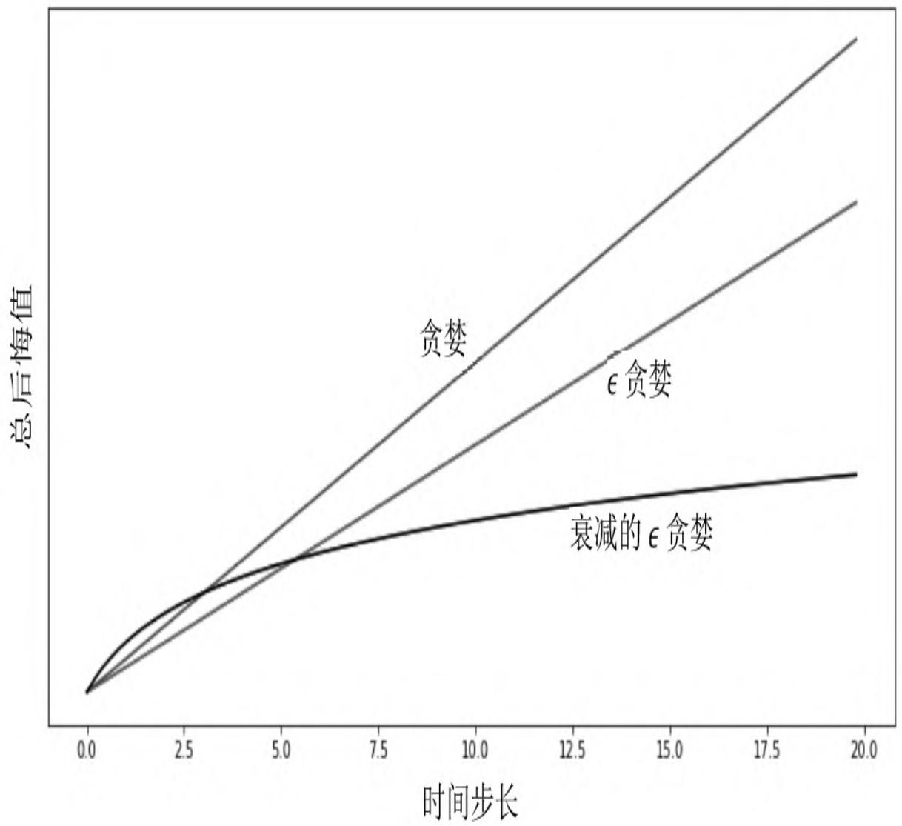
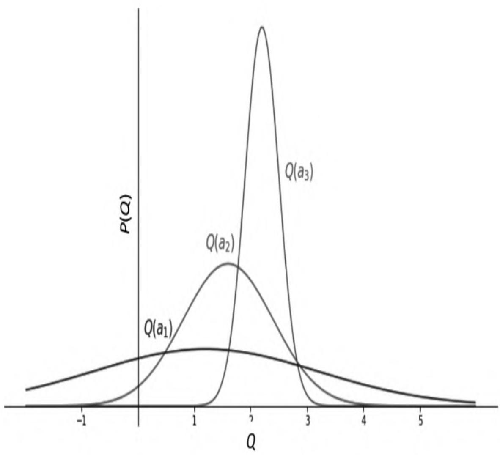

# 第9章 探索与利用

在强化学习问题中，探索和利用是一对矛盾：探索强调尝试不同的行为，继而收集更多的信息，利用则强调做出当前信息下的最佳决定。探索可能会牺牲一些短期利益，但通过搜集更多信息而获得较为长期的、准确的利益；利用侧重于对根据已掌握的信息做到短期利益的最大化。探索不能无止境地进行，否则就牺牲了太多的短期利益进而导致整体利益受损；同时也不能太看重短期利益而忽视一些未探索的、可能会带来巨大利益的行为。因此，如何做好探索和利用之间的平衡是强化学习领域的一个重要课题。

根据探索过程中使用的数据结构，可以将探索分为依据状态行为空间的探索（State-Action Exploration）和参数化探索（Parameter Exploration）。前者针对当前的每一个状态，以一定的算法尝试之前该状态下没有尝试过的行为；后者直接针对参数化的策略函数，表现为尝试不同的参数设置，进而得到具体的行为。

本章结合多臂游戏机实例，一步步从理论角度推导出一个有效的探索应该具备什么特征；随后介绍3类常用的探索方法，包括在前几章常用的几种探索：衰减的ϵ贪婪探索、不确定优先探索以及利用信息价值进行探索。

## 9.1 多臂游戏机

多臂游戏机（见图9.1）是一种博弈类游戏工具，一台机器上有多个拉杆。游戏者拉下一个拉杆后，游戏机会随机给予一定数额的奖励。游戏者一次只能拉下一个拉杆，每个拉杆的奖励分布是相互独立的，并且前后两次拉杆行为之间的奖励也没有关系。在这个场景中，游戏机相当于环境，个体拉下某一单臂游戏机的拉杆表示执行了一个特定的行为，游戏机会给出一个即时奖励R，随即该状态序结束。因此，多臂游戏机中一个完整状态序列中的每一个元素就由一个行为和一个即时奖励构成，并不存在对每个状态的描述和记录。

从上文的描述可知，多臂游戏机可以看成是由行为空间和奖励组成的元组<A,R>，假如一台多臂游戏机有m个拉杆，那么行为空间将由m个具体行为组成，每一个行为对应拉下某一个拉杆。个体采取行为a得到的即时奖励r服从一个个体未知的概率分布：

$$
R^{a} (r) = P [ r \mid a ]
$$

在t时刻，个体从行为空间A中选择一个行为 $a_{\scriptscriptstyle t} \in A$ ，随后环境产生一个即时奖励 $r_{t} \sim R^{a_{t}}$ 。

个体可以持续多次地与多臂游戏机进行交互，那么个体每次选择怎样的行为才能最大化来自多臂游戏机的累积奖励 $( \sum_{\tau = 1} ^{t} r_{\tau} ^{} )$ 呢？

图9.1　多臂游戏机示意图

为了方便描述问题，定义行为价值Q（a）为采取行为a获得的奖励期望：

$$
Q (a) = \mathbb{E} [ r \mid a ]
$$

假设能够事先知道哪一个拉杆能够给出最大即时奖励，则可以每次只选择对应的那个拉杆。如果用V\*表示这个最优价值、a\*表示能够带来最优价值的行为，那么：

$$
V^{*} = Q \left(a^{*}\right) = \max_{a \in A} Q (a)
$$

事实上不可能事先知道拉下哪个拉杆能带来最高奖励，因此每一次拉杆获得的即时奖励都与最优价值V\*存在一定的差距，定义这个差距为后悔值（Regret）：

$$
l_{t} = \mathbb{E} \left[ V^{*} - Q (a_{t}) \right]
$$

每执行一次拉杆行为都会产生一个后悔值 $l_t$ ，随着拉杆行为的持续进行，将所有的后悔值加起来，形成一个总后悔值：

$$
L_{t} = \mathbb{E} \left[ \sum_{\tau = 1} ^{t} \left(V^{*} - Q (a_{\tau})\right) \right]
$$

这样，最大化累积奖励的问题就可以转化为最小化总后悔值了。之所以要进行这样的转换，是由于使用后悔值来分析问题较为简单、直观。上式可以用另一种方式来重写。令 $N_t(a)$ 为到t时刻已执行行为a的次数， $\Delta_a$ 为最优价值V\*与a行为对应的价值之间的差，那么总后悔值可以表示为：

$$
\begin{array}{l} L_{t} = \mathbb{E} \left[ \sum_{\tau = 1} ^{t} V^{*} - Q \left(a_{\tau}\right) \right] \\ = \sum_{a \in A} \mathbb{E} \left[ N_{t} (a) \right] \left(V^{*} - Q (a)\right) \\ = \sum_{a \in A} \mathbb{E} \left[ N_{t} (a) \right] \Delta_{a} \\ \end{array}
$$

把总后悔值按行为分类进行统计可以看出，一个好的算法应该尽量减少执行那些价值差距较大的行为的次数，但个体无法知道这个差距具体是多少，可以使用蒙特卡罗评估来得到某行为的近似价值：

$$
\hat{Q} _{t} (a) = \frac{1}{N_{t} (a)} \sum_{t = 1} ^{T} r_{t} 1 (a_{t} = a) \approx Q (a)
$$

理论上V\*和Q（a）由环境动力学（即环境规则）来确定，因而都是静态的，随着交互次数t的增多，可以认为蒙特卡罗评估得到的行为近似价值 越来越接近真实的行为价值Q（a）。图9.2是不同探索程度的贪婪策略总后悔值与交互次数的关系。

图9.2　不同探索程度贪婪策略的总后悔值

对于完全贪婪的探索方法，其总后悔值是线性的，这是因为该探索方法的行为选择可能会锁死在一个不是最佳的行为上；对于ϵ贪婪的探索方法，总后悔值也是呈线性增长的，这是因为每一个时间步长都有一定的概率选择最优行为，但同样也有一个固定小的概率采取完全随机的行为，由此导致总后悔值也呈现与时间之间的线性关系。类似地Softmax探索方法与此类似。总体来说，如果一个算法永远存在探索或者从不探索，那么其总后悔值与时间的关系都是线性增长的。

能否找到一种探索方法，其对应的总后悔值与时间是次线性增长的，也就是随着时间的推移总后悔值的增加越来越少呢？答案是肯定的，图9.2中衰减的ϵ贪婪方法就是其中的一种。下文将陆续介绍一些实际常用的探索方法。

## 9.2 常用的探索方法

## 9.2.1 衰减的ϵ贪婪探索

衰减的ϵ贪婪探索是在ϵ贪婪探索上改进的，核心思想是随着时间的推移采用随机行为的概率ϵ越来越小。理论上随时间改变的 $\epsilon_{\mathrm{t}}$ 由式（9.1）确定：

$$
\epsilon_{t} = \min \left\{1, \frac{c | A |}{d^{2} t} \right\}, d = \min_{a | \Delta_{a} > 0} \Delta_{i} \in (0, 1 ], c > 0 \tag{9.1}
$$

其中，d是次优行为与最优行为价值之间的相对差距。衰减的ϵ贪婪探索能够使得总的后悔值呈现出与时间步长的对数关系，但该方法需要事先知道每个行为的差距 $\Delta_a$ ，在实际使用中是无法按照该公式来准确确定 $\epsilon_{\mathrm{t}}$ 的，通常采用一些近似的衰减策略，这在之前几章已经有过介绍。

## 9.2.2 不确定行为优先探索

不确定行为优先探索的基本思想是，当个体不清楚一个行为的价值时，个体有较高的概率选择该行为。具体在实现时可以使用乐观初始估计、可信区间上限以及概率匹配3种形式。

## 1.乐观初始估计

乐观初始估计给行为空间中的每一个行为在初始时赋予一个足够高的价值，在选择行为时使用完全贪婪的探索方法，使用递增式的蒙特卡罗评估来更新这个价值：

$$
\hat{Q} _{t} \left(a_{t}\right) = \hat{Q} _{t - 1} + \frac{1}{N_{t} \left(a_{t}\right)} \left(r_{t} - \hat{Q} _{t - 1}\right) \tag{9.2}
$$

在实际应用时，通常初始分配的行为价值为：

$$
Q_{*} (a) = \frac{r_{\max}}{1 - \gamma}
$$

不难理解，乐观初始估计给每一个行为都赋予了一个足够高的价值，在实际交互时根据奖励计算得到的价值多数低于初始估计，一旦某行为由于尝试次数较多其价值降低时，贪婪的探索策略只会从价值最高的那个行为中选择一个，实际上可能会发生多个价值相同且均为最高价值的情况，此时就可以从这些拥有最高价值的多个行为中随机选择一个。乐观初始估计法使得每一个可能的行为都有机会被尝试，由于其本质仍然是完全贪婪的探索方法，因此在理论上仍是一个后悔值线性增长的探索方法，不过在实际应用中乐观初始估计一般效果都不错。

## 2.可信区间上限（Upper Confidence Bound，UCB）

试想一下，如果多臂游戏机中的某一个拉杆一直给出较高的奖励，而其他拉杆一直给出相对较低的奖励，那么行为的选择就容易得多了。如果多个拉杆奖励的方差较大、忽高忽低，但实际给出的奖励在多数情况下比较接近时，那么选择一个价值高的拉杆就不那么容易了，也就是说这些拉杆虽然给出的奖励较接近，但实际上每一个拉杆奖励分布的均值差距较大。可以通过比较两个拉杆价值的差距（Δ）以及描述其奖励分布相似程度的KL散度 $\mathrm{KL}(R^a \parallel R^{a^*})$ 来判断总后悔值的下限。一般来说，差距越大，后悔值越大；奖励分布的相似程度越高，后悔值越低。针对多臂游戏机，存在一个总后悔值下限，任何一个算法都不能做得比这个下限更好：

$$
\lim_{t \rightarrow \infty} L_{t} \geqslant \log t \sum_{a | \Delta_{a} > 0} \frac{\Delta_{a}}{\mathrm{KL} \left(R^{a} \| R^{a^{*}}\right)} \tag{9.3}
$$

假设现在有一台3个拉杆的多臂游戏机，每一个拉杆给出的奖励服从一定的个体未知分布，经过一定次数对3个拉杆的尝试后，根据给出的奖励数据绘制得到如图9.3所示的奖励分布图。

图9.3　根据实际交互得到的奖励数据绘制出来的3个拉杆奖励分布

根据图9.3中提供的信息，在今后的行为选择中，应该优先尝试行为空间 $\{a_1, a_2, a_3\}$ 中的哪一个呢？从3个拉杆奖励之间的相对关系可以得出：行为 $a_3$ 的奖励分布较为集中，均值最高；行为 $a_1$ 的奖励分布较为分散，均值最低；而行为 $a_2$ 介于两者之间。虽然行为 $a_1$ 对应的奖励均值最低，但是其奖励分布较为分散，还有不少奖励超过了均值最高的行为 $a_1$ 的平均均值，说明对行为 $a_1$ 的价值估计较不准确，此时为了弄清楚行为 $a_1$ 的奖励分布，应该优先尝试更多次行为 $a_1$ ，以尽可能缩小其奖励分布的方差。

从上面的分析可以看出，单纯用行为的奖励均值作为行为价值的估计，进而指导后续行为的选择会因为采样数量的原因而不够准确，更加准确的方法是估计行为价值在一定可信度上的价值上限，比如可以设置一个行为价值95%的可信区间上限，将其作为指导后续行为的参考，会有较高的可信度认为一个行为的价值不高于某一个值：

$$
Q (a) \leqslant \hat{Q} _{t} (a) + \hat{U} _{t} (a) \tag{9.4}
$$

因此，当一个行为的计数较少时，由均值估计的该行为的价值将不可靠，对应的一定比例的价值可信区间上限将偏离均值较多；随着针对某一行为的奖励数据越来越多，该行为价值在相同可信区间的上限将接近均值。因此，可以使用可信区间上限（Upper Confidence Bound，UCB）作为行为价值的估计来指导行为的选择。令：

$$
a_{t} = \underset{a \in A} {\arg \max} \left(\hat{Q} _{t} (a) + \hat{U} _{t} (a)\right) \tag{9.5}
$$

如果奖励的真实分布是明确已知的，那么可信区间上限可以较为容易地根据均值进行求解。

例如，对于高斯分布（即正态分布）95%的可信区间上限是均值与约两倍标准差的和。对于分布未知的可信区间上限的计算可以使用式（9.6）进行计算：

$$
a_{t} = \underset{a \in A} {\arg \max} \left(Q (a) + \sqrt{\frac{2 \log t}{N_{t} (a)}}\right) \tag{9.6}
$$

其中，Q（a）是根据交互经历得到的行为价值估计， $N_t(a)$ 是行为a被执行的次数，t是时间步长。这一公式的推导过程如下。

【定理】令 $X_{1} , X_{2} , \cdots , X_{t}$ 是值在区间[0,1]上独立同分布的采样数据，令 $\overline{{X}} _{t} = \frac{1}{t} \sum_{\tau = 1} ^{t} X_{\tau}$ 是采样数据的平均值，那么下面的不等式成立：

$$
P \left[ E [ X ] > \bar{X} _{t} + u \right] \leqslant \mathrm{e} ^{- 2 t u^{2}} \tag{9.7}
$$

该不等式称为霍夫丁不等式（Hoeffding's Inequality）。它给出了总体均值与采样均值之间的关系。根据该不等式可以得到：

$$
P \left[ Q (a) > \hat{Q} (a) + U_{t} (a) \right] \leqslant \mathrm{e} ^{- 2 N_{t} (a) U_{t} (a) ^{2}}
$$

该不等式同样描述了一个可信区间上限，假定某行为的真实价值有p的概率超过设置的可信区间上限，即令：

$$
\mathrm{e} ^{- 2 N_{t} (a) U_{t} (a) ^{2}} = p
$$

那么可以得到：

$$
U_{t} (a) = \sqrt{\frac{- \log p}{N_{t} (a)}}
$$

随着时间步长的增加，p值逐渐减少，假如令 $p = t^{- 4}$ ，则上式变为：

$$
U_{t} (a) = \sqrt{\frac{2 \log t}{N_{t} (a)}}
$$

由此可以得出式（9.6）。

依据可信区间上限（UCB）算法原理设计的探索方法可以使得总后悔值随时间步长满足对数渐进关系：

$$
\lim_{t \rightarrow \infty} L_{t} \leqslant 8 \log t \sum_{a | \Delta_{a} > 0} \Delta_{a} \tag{9.8}
$$

经验表明，ϵ贪婪探索的参数如果调整得当，则可以有很好的表现，而UCB在没有掌握任何信息的前提下也可以表现得很好。

如果多臂游戏机中的每一个拉杆奖励服从相互独立的高斯分布，即

$$
R_{a} (r) = N \left(r; \mu_{a}, \sigma_{a} ^{2}\right)
$$

那么

$$
a_{t} = \underset{a \in A} {\arg \max} \left(\mu_{a} + c \sigma_{a} / \sqrt{N (a)}\right) \tag{9.9}
$$

由于自然界许多现象都可以用高斯分布来近似描述，因此在许多情况下可以使用上式来指导探索。

## 3.概率匹配

另一个基于不确定有限探索的方法是概率匹配（Probability Matching），它通过个体与环境的实际交互的历史信息ht来估计行为空间中每一个行为是最优行为的概率，然后根据这个概率来采样后续行为：

$$
\pi (a \mid h_{t}) = P [ Q (a) > Q (a^{\prime}), \forall a^{\prime} \neq a \mid h_{t} ]
$$

实际应用中常使用汤姆森采样（Thompson Sampling），它是一种基于采样的概率匹配算法，具体行为a被选择的概率由下式决定：

$$
\begin{array}{l} \pi (a \mid h_{t}) = P [ Q (a) > Q \left(a^{\prime}\right), \forall a^{\prime} \neq a \mid h_{t} ] \\ = \mathbb{E} _{R \mid h_{t}} \left[ 1 \left(a = \underset{a \in A} {\arg \max} Q (a)\right) \right] \tag{9.10} \\ \end{array}
$$

以具有n个拉杆的多臂游戏机为例，假设选择第i个拉杆的行为 $a_i$ 一共有 $m_i$ 次获得了历史最高奖励，那么使用汤姆森采样算法的个体将按照

$$
\pi \left(a_{i}\right) = \frac{m_{i}}{\sum_{i = 1} ^{n} m_{i}}
$$

给出的策略来选择后续行为。汤姆森采样算法能够获得随时间对数增长的总后悔值。

## 9.2.3 基于信息价值的探索

探索之所以有价值是因为它会带来更多的信息，那么能否量化被探索信息的价值和探索本身的开销，以此来决定是否有探索该信息的必要呢？这就涉及信息本身的价值。

打个比方，对于一台有两个拉杆的多臂游戏机，个体当前对行为$a_1$ 的价值有一个较为准确的估计，比如100元（执行行为 $a_1$ 可以得到的即时奖励的期望）。此外，个体虽然对于行为 $a_2$ 的价值也有一个估计，比如70元，但是这个数字非常不准确，因为个体仅执行了少次行为 $a_2$ ，那么获取“较为准确的行为 $a_2$ 的价值”这条信息的价值有多少呢？这取决于很多因素，其中之一就是个体有没有足够多的行为次数来获取累积奖励，假如个体只有非常有限的行为次数，那么个体可能会倾向于保守地选择 $a_1$ 而不去通过探索行为 $a_2$ 来得到较为准确的行为$a_2$ 的价值。因为探索本身会带来一定概率的后悔。相反，如果个体有数千次甚至更多的行为次数，那么得到一个更准确的行为 $a_2$ 的价值就显得非常必要了，因为即使通过一定次数的探索 $a_2$ ，后悔值也是可控的。一旦得到的行为 $a_2$ 的价值超过 $a_1$ ，则将影响后续每一次行为的选择。

为了能够确定信息本身的价值，可以设计一个MDP，将信息作为MDP的状态，构建对其价值的估计：

$$
\tilde{M} = <   \tilde{S}, A, \tilde{P}, R, \gamma >
$$

以有两个拉杆的多臂游戏机为例，一个信息状态对应于分别采取了行为 $a_1$ 和 $a_2$ 的次数。例如， $S_0 = \langle 5, 3 \rangle$ 就可以表示一个信息状态，表示个体在这个状态时已经对行为 $a_1$ 执行了5次、对行为 $a_2$ 执行了3次。随后个体又执行了一次行为 $a_1$ ，状态转移至 $S_1 = \langle 6, 3 \rangle$ 。

由于基于信息状态空间的MDP状态规模随着交互的增加而逐渐增加，因此使用表格式或者精确地求解这样的MDP是很困难的，通常使用近似架构和函数、构建一个基于信息状态的模型，并通过采样来近似求解。

虽然前文的这些探索方法都是基于与状态无关的多臂游戏机来讲述的，但其均适用于存在不同状态转换条件下的MDP问题，只需将状态s代入相应的公式即可。

