# 第3章 · 最优状态值与贝尔曼最优方程

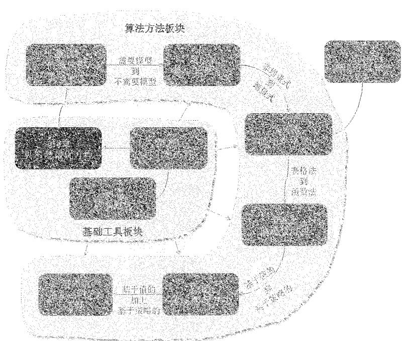
图 3.1 本章在全书中的位置。

强化学习的终极目标究竟是什么？在线下的授课中，我告诉我的学生：如果你听到了这个问题，你一定要能够非常快速地回答出来，强化学习的终极目标是寻找最优策略。因此，最优策略是强化学习中非常基础且重要的概念。

本章将介绍一个核心概念和一个核心工具：这个核心概念是最优状态值，基于此，我们可以定义最优策略；这个核心工具是贝尔曼最优方程，基于此，我们可以求解最优状态值和最优策略。

本章与前后两章关系密切：第2章介绍了贝尔曼方程；本章将介绍的贝尔曼最优方程是一个特殊的贝尔曼方程；第3章将介绍的“值迭代”算法就用于求解本章介绍的贝尔曼最优方程。因此，本章起到了承上启下的关键作用。

本章的数学内容相比之前两章会稍微多一些，因此读者可能需要耐心地学习。即使多花一些时间也是非常值得的，因为这些数学内容能够非常清晰地解答许多基本问题，这对于透彻理解后面章节的内容至关重要。此外，这些数学内容以合理的方式呈现了出来，相信大家只要耐心学习，就不会觉得特别困难。

## 3.1 启发示例：如何改进策略？

考虑图3.2中的例子，其中橙色和蓝色的单元格分别代表禁止区域和目标区域。图中的箭头代表一个给定的策略。这个策略从直观上来说不好，因为它在状态 $s_1$ 选择 $a_2$ （向右）会进入禁止区域。那么我们能否改进这个策略进而得到一个更好的策略呢？答案是可以的。下面通过一个例子来介绍改进策略的思路。

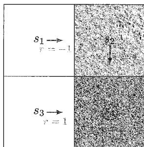
图 3.2 用于说明如何改进策略的一个例子。

◇ 第一，直觉。直觉告诉我们：如果在 $s_{1}$ 选择 $a_{3}$ （向下）而不是 $a_{2}$ （向右），那么策略会更好，这是因为向下移动能够避免进入禁止区域。

◇ 第二，数学。上面的直觉可以基于状态值和动作值的计算来得到验证。

首先，计算给定策略的状态值。根据第2章的内容，不难写出这一策略对应的贝尔

曼方程为

$$
v_{\pi} (s_{1}) = - 1 + \gamma v_{\pi} (s_{2}),
$$

$$
v_{\pi} (s_{2}) = + 1 + \gamma v_{\pi} (s_{4}),
$$

$$
v_{\pi} (s_{3}) = + 1 + \gamma v_{\pi} (s_{4}),
$$

$$
v_{\pi} (s_{4}) = + 1 + \gamma v_{\pi} (s_{4}).
$$

如果设 $\gamma = 0.9$ ，可以求出

$$
v_{\pi} (s_{1}) = 8, \qquad v_{\pi} (s_{2}) = v_{\pi} (s_{3}) = v_{\pi} (s_{4}) = 10.
$$

然后，计算给定策略的动作值。针对状态 $s_1$ ，其对应的动作值是

$$
q_{\pi} (s_{1}, a_{1}) = - 1 + \gamma v_{\pi} (s_{1}) = 6. 2,
$$

$$
q_{\pi} (s_{1}, a_{2}) = - 1 + \gamma v_{\pi} (s_{2}) = 8,
$$

$$
q_{\pi} (s_{1}, a_{3}) = 0 + \gamma v_{\pi} (s_{3}) = 9,
$$

$$
q_{\pi} (s_{1}, a_{4}) = - 1 + \gamma v_{\pi} (s_{1}) = 6. 2,
$$

$$
q_{\pi} (s_{1}, a_{5}) = 0 + \gamma v_{\pi} (s_{1}) = 7. 2.
$$

上式表明动作 $a_3$ 具有最大的动作值，即

$$
q_{\pi} (s_{1}, a_{3}) \geqslant q_{\pi} (s_{1}, a_{i}), \quad \text{对所有} i \neq 3.
$$

因此，为了得到最大的回报，新的策略应该在 $s_1$ 选择 $a_3$ （向下移动），这个数学结论与前面的直觉是一致的。

上面这个例子说明了: 如果我们更新策略从而使之选择具有最大动作值的动作, 就有望得到一个更好的策略。

这个例子非常简单，因为给定的策略只是在 $s_1$ 不好，而在其他状态已经很好了。如果策略在其他状态也不好，此时在 $s_1$ 选择最大动作值还能否得到更好的策略呢？这个问题看似简单，其实想回答清楚并不容易。此外还有很多问题，例如是否总是存在最优策略、最优策略看起来是什么样子等。我们将在本章回答这些问题。

## 3.2 最优状态值和最优策略

首先，我们需要定义什么是最优策略（optimal policy）。

考虑两个给定的策略 $\pi_1$ 和 $\pi_2$ 。如果对于任意状态 $s\in S$ ， $\pi_1$ 的状态值都大于或等

于 $\pi_2$ 的状态值，即

$$
v_{\pi_{1}} (s) \geqslant v_{\pi_{2}} (s), \quad \text{对任意} s \in \mathcal{S},
$$

那么我们说 $\pi_1$ 比 $\pi_2$ 更好。而如果一个策略比所有其他策略都更好，那么这个策略就是最优策略，其正式定义如下所述。

定义3.1 (最优策略与最优状态值)。考虑策略 $\pi^{*}$ ，如果对任意的状态 $s \in S$ 和其他任意策略 $\pi$ ，都有 $v_{\pi^{*}}(s) \geqslant v_{\pi}(s)$ ，那么 $\pi^{*}$ 是一个最优策略，并且 $\pi^{*}$ 对应的状态值是最优状态值。

上述定义表明：一个最优策略在每一个状态都有比所有其他策略更高的状态值。这个定义可能也引出了读者的许多问题。

◇ 存在性：这样的最优策略存在吗？

◇ 唯一性：这样的最优策略唯一吗？

◇ 随机性：最优策略是随机性的还是确定性的？

◇ 算法：有什么算法能够让我们得到最优策略和最优状态值？

这几个问题非常基础和重要。例如，关于最优策略的存在性，如果最优策略根本不存在，那么我们就不需要费尽心机去设计算法来寻找它们了。本章将逐一解答这些问题。

## 3.3 贝尔曼最优方程

为了分析和求解最优策略，下面介绍大名鼎鼎的贝尔曼最优方程（Bellman optimality equation，BOE）。首先直接给出其表达式，然后详细分析它的性质。

对于每个 $s \in S$ ，贝尔曼最优方程的表达式如下所示：

$$
\begin{array}{r l} & v (s) = \max_{\pi (s) \in \varPi (s)} \sum_{a \in \mathcal{A}} \pi (a | s) \left(\sum_{r \in \mathcal{R}} p (r | s, a) r + \gamma \sum_{s^{\prime} \in \mathcal{S}} p (s^{\prime} | s, a) v (s^{\prime})\right) \\ & \quad = \max_{\pi (s) \in \varPi (s)} \sum_{a \in \mathcal{A}} \pi (a | s) q (s, a), \end{array}\tag{3.1}
$$

其中

$$
q (s, a) \doteq \sum_{r \in \mathcal{R}} p (r | s, a) r + \gamma \sum_{s^{\prime} \in \mathcal{S}} p (s^{\prime} | s, a) v (s^{\prime}).
$$

这里 $v(s), v(s')$ 是待求解的未知量； $\pi(s)$ 表示状态 s 的策略； $\Pi(s)$ 是在状态 s 所有可能策略的集合。

贝尔曼最优方程是一个优美且强大的工具，它能清晰地解释许多基础且重要的问题。不过，初学者乍一看到这个式子会有很多疑问。例如，这个方程有两类未知量：一类是值 $v$ ，另一类是策略 $\pi$ 。如何从一个方程中同时求解两类未知量呢？此外，下面这些问题也需要回答。

◇ 存在性：这个贝尔曼最优方程有解吗？

◇ 唯一性：贝尔曼最优方程的解是唯一的吗？

◇ 算法：如何求解贝尔曼最优方程？

◇ 最优性：贝尔曼最优方程的解与最优策略有何关系？

最后，贝尔曼最优方程与贝尔曼方程是什么关系？为什么说它是一个特殊的贝尔曼方程？

这些问题都是非常基础且重要的。如果能回答这些问题，我们就能清楚地理解最优状态值和最优策略；反之，如果这些问题回答得不清楚，我们的理解一定是一知半解或者云里雾里。然而，想回答这些问题不能一蹴而就。下面带领大家一步步地学习，只要能静下心来稳扎稳打，相信大家能一劳永逸地透彻掌握。

### 3.3.1 方程右侧的优化问题

贝尔曼最优方程(3.1)的右侧嵌套了一个优化问题，这可能是让初学者最感到迷惑的一点。我们通过下面的例子来解释其求解思路。

例子3.1 假设两个未知变量 $x, y \in \mathbb{R}$ 满足如下方程：

$$
x = \max_{y \in \mathbb{R}} (2 x - 1 - y^{2}).
$$

这个方程乍一看比较奇怪：它包含两个未知数，并且右侧嵌套了一个优化问题。实际上这个方程的求解并不困难，可以通过两步求解。第一步是求解方程右侧的优化问题 $\max_{y\in \mathbb{R}}(2x - 1 - y^2)$ 。具体来说，不管 $x$ 的值是什么，在 $y = 0$ 时 $(2x - 1 - y^2)$ 达到最大值，此时 $\max_y(2x - 1 - y^2) = 2x - 1$ 。第二步是求解 $x$ ，如果把 $y = 0$ 代入方程，那么方程变为 $x = 2x - 1$ ，此时很容易求解出 $x = 1$ 。因此， $y = 0$ 和 $x = 1$ 是该方程的解。

明白了上面这个例子，再来看贝尔曼最优方程就会简单很多：式(3.1)可以简写为

$$
v (s) = \max_{\pi (s) \in \Pi (s)} \sum_{a \in \mathcal{A}} \pi (a | s) q (s, a), \quad s \in \mathcal{S}.
$$

受到示例3.1的启发，我们首先要解决方程右边的优化问题。怎么做呢？我们再来看一个简单的例子。

例子3.2 给定 $q_{1}, q_{2}, q_{3} \in \mathbb{R}$ ，我们希望找到 $c_{1}, c_{2}, c_{3}$ 的最优值，从而求解下面的优化问题：

$$
\max_{c_{1}, c_{2}, c_{3}} \sum_{i = 1} ^{3} c_{i} q_{i} = \max_{c_{1}, c_{2}, c_{3}} \left(c_{1} q_{1} + c_{2} q_{2} + c_{3} q_{3}\right),
$$

其中要求 $c_{1} + c_{2} + c_{3} = 1$ 且 $c_{1}, c_{2}, c_{3} \geqslant 0$ 。

求解这个问题的思路如下。首先， $q_{1}, q_{2}, q_{3}$ 中一定存在一个最大值。不失一般性，假设 $q_{3} \geqslant q_{1}, q_{2}$ 。那么，最优解是 $c_{3}^{*} = 1, c_{1}^{*} = c_{2}^{*} = 0$ 。为什么呢？这是因为

$$
q_{3} = (c_{1} + c_{2} + c_{3}) q_{3} = c_{1} q_{3} + c_{2} q_{3} + c_{3} q_{3} \geqslant c_{1} q_{1} + c_{2} q_{2} + c_{3} q_{3}
$$

对任何 $c_{1}, c_{2}, c_{3}$ 都成立。

受到上述示例的启发，由于 $\sum_{a}\pi (a|s) = 1$ ，我们有

$$
\sum_{a \in \mathcal{A}} \pi (a | s) q (s, a) \leqslant \sum_{a \in \mathcal{A}} \pi (a | s) \max_{a \in \mathcal{A}} q (s, a) = \max_{a \in \mathcal{A}} q (s, a),
$$

即 $\sum_{a\in \mathcal{A}}\pi (a|s)q(s,a)$ 的最大值是 $\max_{a\in \mathcal{A}}q(s,a)$ ，而且等于最大值的条件是

$$
\pi (a | s) = \left\{\begin{array}{l l} 1, & a = a^{*}, \\ 0, & a \neq a^{*}. \end{array} \right.
$$

其中 $a^* = \arg \max_a q(s, a)$ 。因此，最优策略 $\pi(s)$ 应该选择具有最大 $q(s, a)$ 的动作。在解决了右侧的优化问题之后，式(3.1)就变成了 $v(s) = \max_{a \in \mathcal{A}(s)} q(s, a)$ 。

### 3.3.2 矩阵-向量形式

方程(3.1)是对任意状态都成立的，将所有状态对应的这些方程联立，可以获得一个简洁的矩阵-向量形式。该形式在本章中将被广泛使用，对于分析贝尔曼最优方程将发挥重要作用。

具体来说，假设有 n 个状态 $\{s_{1}, s_{2}, \ldots, s_{n}\}$ 。类似于第2章推导贝尔曼方程的矩阵-向量形式，我们可以得到贝尔曼最优方程的矩阵-向量形式为

$$
v = \max_{\pi \in \Pi} (r_{\pi} + \gamma P_{\pi} v),\tag{3.2}
$$

其中 $v = [v(s_1), v(s_2), \ldots, v(s_n)]^{\mathrm{T}} \in \mathbb{R}^n$ 是待求解的未知量。上式中的 $\max_{\pi}$ 是以逐元素的方式执行的。例如，对于一个向量 $[*, *]$ ，其中的元素用“\*”表示，那么有 $\max_{\pi}[*, *] = [\max_{\pi} *, \max_{\pi} *]$ 。此外，上式中 $r_{\pi}$ 和 $P_{\pi}$ 与贝尔曼方程的矩阵-向量形式中的相同：

$$
\left[ r_{\pi} \right] _{s} \doteq \sum_{a \in \mathcal{A}} \pi (a | s) \sum_{r \in \mathcal{R}} p (r | s, a) r, \quad \left[ P_{\pi} \right] _{s, s^{\prime}} = p \left(s^{\prime} \mid s\right) \doteq \sum_{a \in \mathcal{A}} \pi (a | s) p \left(s^{\prime} \mid s, a\right).
$$

这里我们不再赘述将式(3.1)转换为式(3.2)的详细过程，这个过程与第2章中将贝尔曼

方程转换成矩阵向量形式的过程是类似的。

由于 $\pi$ 的最优值由 $v$ 决定，(3.2)的右侧实际上是 $v$ 的函数，因此可以用一个函数 $f(v)$ 表示为

$$
f (v) \doteq \max_{\pi \in \Pi} (r_{\pi} + \gamma P_{\pi} v).
$$

然后，贝尔曼最优方程(3.2)可以简洁地表达为

$$
v = f (v).\tag{3.3}
$$

在本节的剩余部分，我们将介绍如何求解方程(3.3)。

### 3.3.3 压缩映射定理

为了分析 $v = f(v)$ ，本小节将首先介绍压缩映射定理（contraction mapping theorem）[6]。压缩映射定理是分析非线性方程的强大工具，它也被称为不动点定理。如果读者已经了解这个定理，则可以跳过这一小节；否则，建议读者仔细学习该定理，因为它是分析贝尔曼最优方程的关键工具。

考虑一个函数 $f(x)$ ，其中 $x\in \mathbb{R}^d$ 且 $f:\mathbb{R}^d\to \mathbb{R}^d$ 。如果一个点 $x^{*}$ 满足

$$
f (x^{*}) = x^{*},
$$

那么称之为不动点（fixed point）。之所以称之为“不动点”，是因为 $x^{*}$ 的映射还是其自身。

如果存在 $\gamma \in (0,1)$ 使得

$$
\| f (x_{1}) - f (x_{2}) \| \leqslant \gamma \| x_{1} - x_{2} \|
$$

对于任意的 $x_{1}, x_{2} \in \mathbb{R}^{d}$ 都成立，那么函数 $f$ 被称为压缩映射（contraction mapping）。上面不等式中的 $\| \cdot \|$ 表示向量或矩阵的范数。

下面通过三个简单的例子来解释不动点和压缩映射。

例子3.3 三个简单例子。

◇ 例1: $x = f(x) = 0.5x, x \in \mathbb{R}$ 。

首先，很容易验证 $x = 0$ 是一个不动点，因为 $0 = 0.5 \cdot 0$ 。其次， $f(x) = 0.5x$ 是一个压缩映射，因为 $\|0.5x_1 - 0.5x_2\| = 0.5\|x_1 - x_2\| \leqslant \gamma\|x_1 - x_2\|$ 对任何 $\gamma \in [0.5, 1)$ 都成立。

例2： $x = f(x) = Ax$ ，其中 $x\in \mathbb{R}^n,A\in \mathbb{R}^{n\times n}$ 且 $\| A\| \leqslant \gamma <  1$ 。

首先，很容易验证 $x = 0$ 是一个不动点，因为 $0 = A0$ 。其次， $f(x) = Ax$ 是一个压缩映射，因为 $\|Ax_1 - Ax_2\| = \|A(x_1 - x_2)\| \leqslant \|A\|\|x_1 - x_2\| \leqslant \gamma \|x_1 - x_2\|$ 。

◇ 例3: $x = f(x) = 0.5\sin x, x \in \mathbb{R}$ 。

首先，很容易验证 $x = 0$ 是一个不动点，因为 $0 = 0.5\sin 0$ 。其次，根据中值定理[7,8]可知

$$
\left| \frac{0 . 5 \sin x_{1} - 0 . 5 \sin x_{2}}{x_{1} - x_{2}} \right| = | 0. 5 \cos x_{3} | \leqslant 0. 5, \quad x_{3} \in [ x_{1}, x_{2} ].
$$

上式可以等价为 $|0.5\sin x_1 - 0.5\sin x_2| \leqslant 0.5|x_1 - x_2|$ ，因此 $f(x) = 0.5\sin x$ 是一个压缩映射。

有了上面的准备，下面给出经典的压缩映射定理。

定理3.1（压缩映射定理）。对于方程 $x = f(x)$ ，其中 $x$ 和 $f(x)$ 是实数向量。如果 $f$ 是一个压缩映射，则下面所有性质都成立。

◇ 存在性：一定存在一个不动点 $x^{*}$ 满足 $f(x^{*}) = x^{*}$ 。

◇ 唯一性：不动点 $x^{*}$ 是唯一的。

◇ 算法：考虑迭代算法

$$
x_{k + 1} = f (x_{k}),
$$

其中 $k = 0,1,2,\ldots$ 。给定任意一个初始值 $x_0$ ，当 $k\to \infty$ 时， $x_{k}\rightarrow x^{*}$ ，且收敛过程具有指数收敛速度。

压缩映射定理之所以强大，是因为它不仅能告诉我们该方程的解是否存在、是否唯一，还能给出一个数值求解算法。该定理的证明见方框3.1。本书中凡是放到灰色方框中的内容都是选学内容，感兴趣的读者可以阅读，不感兴趣的读者可以跳过，并不会对整体学习造成影响。

下面的示例展示了如何使用压缩映射定理给出的迭代算法来求解方程。

例子3.4 再次考虑前面提到过的三个简单例子： $x = 0.5x$ ， $x = Ax$ ， $x = 0.5\sin x$ 。前面我们已经提到 $x^{*} = 0$ 是一个不动点，并且方程右边的函数都是压缩映射。现在根据压缩映射定理，我们知道这个不动点 $x^{*} = 0$ 是唯一的解。因为这三个方程很简单，所以可以用很多方式求解得到 $x^{*} = 0$ 。这里假设我们不知道如何求解，那么根据压缩映射定理，其解可以通过以下迭代算法得到：

$$
x_{k + 1} = 0. 5 x_{k},
$$

$$
x_{k + 1} = A x_{k},
$$

$$
x_{k + 1} = 0. 5 \sin x_{k},
$$

其中初始值 $x_0$ 可以是任意值。例如，考虑算法 $x_{k + 1} = 0.5x_{k}$ ，如果初始值是 $x_0 = 10$ 那么可得 $x_{1} = 5,x_{2} = 2.5,x_{3} = 1.25,x_{4} = 0.625,\ldots$ 。可以看到， $x_{k}$ 会逐渐接近真实解 $x^{*} = 0$ □

## 方框3.1：压缩映射定理的证明

第1步：证明序列 $\{x_{k} = f(x_{k - 1})\}_{k = 1}^{\infty}$ 是收敛的。

该证明依赖于柯西序列（Cauchy sequence）。如果一个序列 $x_{1}, x_{2}, \cdots \in \mathbb{R}$ 满足如下条件就被称为柯西序列：对于任何小的 $\varepsilon > 0$ ，存在 $N$ 使得所有的 $m, n > N$ 都有 $\|x_{m} - x_{n}\| < \varepsilon$ 。该条件的直观解释是存在一个有限整数 $N$ ，使得 $N$ 之后的所有元素彼此足够接近。柯西序列很重要，因为它保证了序列会收敛到一个极限，它的收敛性将被用来证明压缩映射定理。值得注意的是， $\|x_{m} - x_{n}\| < \varepsilon$ 必须对所有 $m, n > N$ 都成立。如果仅有 $\|x_{n+1} - x_{n}\| < \varepsilon$ ，那么不足以说明该序列是一个柯西序列。例如，对于 $x_{n} = \sqrt{n}$ ，虽然有 $x_{n+1} - x_{n} \to 0$ ，但显然 $x_{n} = \sqrt{n}$ 并不收敛。

下面证明 $\{x_{k} = f(x_{k - 1})\}_{k = 1}^{\infty}$ 是一个柯西序列。首先，由于 $f$ 是一个压缩映射，有

$$
\| x_{k + 1} - x_{k} \| = \| f (x_{k}) - f (x_{k - 1}) \| \leqslant \gamma \| x_{k} - x_{k - 1} \|.
$$

由上式可得

$$
\begin{array}{r} \| x_{k + 1} - x_{k} \| \leqslant \gamma \| x_{k} - x_{k - 1} \| \\ \leqslant \gamma^{2} \| x_{k - 1} - x_{k - 2} \| \end{array}
$$

$$
\leqslant \gamma^{k} \| x_{1} - x_{0} \|.
$$

由于 $\gamma < 1$ ，对任意的 $x_{1}, x_{0}$ ，我们都有 $\|x_{k+1} - x_{k}\|$ 会随着 $k \to \infty$ 以指数速度收敛到 0。值得注意的是， $\{\|x_{k+1} - x_{k}\|\}$ 的收敛不足以证明 $\{x_{k}\}$ 的收敛。因此，我们需要进一步考虑 $\|x_{m} - x_{n}\|$ （其中 $m > n$ ）：

$$
\begin{array}{r l} & {\| x_{m} - x_{n} \| = \| x_{m} - x_{m - 1} + x_{m - 1} - \dots - x_{n + 1} + x_{n + 1} - x_{n} \|} \\ & {\qquad \leqslant \| x_{m} - x_{m - 1} \| + \dots + \| x_{n + 1} - x_{n} \|} \end{array}
$$

$$
\begin{array}{l} \leqslant \gamma^{m - 1} \| x_{1} - x_{0} \| + \dots + \gamma^{n} \| x_{1} - x_{0} \| \\ = \gamma^{n} (\gamma^{m - 1 - n} + \dots + 1) \| x_{1} - x_{0} \| \\ \leqslant \gamma^{n} (1 + \dots + \gamma^{m - 1 - n} + \dot{\gamma} ^{m - n} + \dots) \| x_{1} - x_{0} \| \\ = \frac{\gamma^{n}}{1 - \gamma} \| x_{1} - x_{0} \|. \end{array}\tag{3.4}
$$

上式表明，对任意的 $\varepsilon$ ，我们总是可以找到 $N$ 使得对所有 $m, n > N$ 都有 $\|x_m - x_n\| < \varepsilon$ 。

因此， $\{x_{k}=f(x_{k-1})\}_{k=1}^{\infty}$ 是一个柯西序列。根据柯西序列的性质，它会收敛到一个极限值，记作 $x^{*}=\lim_{k\to\infty}x_{k}$ 。

第2步：证明极限 $x^{*} = \lim_{k\to \infty}x_{k}$ 是一个不动点。

由于

$$
\| f (x_{k}) - x_{k} \| = \| x_{k + 1} - x_{k} \| \leqslant \gamma^{k} \| x_{1} - x_{0} \|,
$$

我们知道 $\| f(x_k) - x_k\|$ 以指数速度趋近于0。因此，在极限情况下有 $f(x^{*}) = x^{*}$ 第3步：证明该不动点是唯一的。

假设存在另一个不动点 $x'$ 满足 $f(x') = x'$ 。那么，

$$
\left\| x^{\prime} - x^{*} \right\| = \left\| f (x^{\prime}) - f (x^{*}) \right\| \leqslant \gamma \left\| x^{\prime} - x^{*} \right\|.
$$

由于 $\gamma < 1$ ，这个不等式成立当且仅当 $\| x' - x^*\| = 0$ 。因此， $x^{\prime} = x^{*}$ 。

第4步：证明 $x_{k}$ 以指数速度收敛到 $x^{*}$ 。

根据式(3.4)，我们有 $\| x_{m} - x_{n}\| \leqslant \frac{\gamma^{n}}{1 - \gamma}\| x_{1} - x_{0}\|$ 。由于 $m$ 可以是任意大的，我们可以选取 $m = \infty$ ，此时 $x_{\infty} = x^{*}$ 。因此，

$$
\| x^{*} - x_{n} \| = \lim_{m \rightarrow \infty} \| x_{m} - x_{n} \| \leqslant \frac{\gamma^{n}}{1 - \gamma} \| x_{1} - x_{0} \|.
$$

由于 $\gamma < 1$ ，随着 $n \to \infty$ ，误差以指数速度收敛到 0。

### 3.3.4 方程右侧函数的压缩性质

下面证明贝尔曼最优方程(3.3)右侧的函数 $f(v)$ 是一个压缩映射，之后就可以利用前一小节介绍的压缩映射定理来分析该方程。

定理3.2 $(f(v)$ 的压缩性质)。贝尔曼最优方程(3.3)右侧的函数 $f(v)$ 是一个压缩映射，

即对于任意的 $v_{1}, v_{2} \in \mathbb{R}^{|S|}$ ，有

$$
\| f (v_{1}) - f (v_{2}) \| _{\infty} \leqslant \gamma \| v_{1} - v_{2} \| _{\infty},
$$

其中 $\gamma \in (0,1)$ 是折扣率， $\| \cdot \|_{\infty}$ 是最大值范数，即向量中所有元素的最大绝对值。

这个定理很重要，因为它可以帮助我们很透彻地分析贝尔曼最优方程。该定理的证明见方框3.2，感兴趣的读者可以阅读。

方框3.2：定理3.2的证明

考虑任意两个向量 $v_{1}, v_{2} \in \mathbb{R}^{|S|}$ ，假设 $\pi_1^* \doteq \arg \max_{\pi}(r_{\pi} + \gamma P_{\pi}v_1)$ 和 $\pi_2^* \doteq \arg \max_{\pi}(r_{\pi} + \gamma P_{\pi}v_2)$ 。那么，

$$
f (v_{1}) = \max_{\pi} (r_{\pi} + \gamma P_{\pi} v_{1}) = r_{\pi_{1} ^{*}} + \gamma P_{\pi_{1} ^{*}} v_{1} \geqslant r_{\pi_{2} ^{*}} + \gamma P_{\pi_{2} ^{*}} v_{1},
$$

$$
f (v_{2}) = \max_{\pi} (r_{\pi} + \gamma P_{\pi} v_{2}) = r_{\pi_{2} ^{*}} + \gamma P_{\pi_{2} ^{*}} v_{2} \geqslant r_{\pi_{1} ^{*}} + \gamma P_{\pi_{1} ^{*}} v_{2},
$$

其中“≥”是逐元素比较。因此，

$$
\begin{array}{r l} f (v_{1}) - f (v_{2}) & = r_{\pi_{1} ^{*}} + \gamma P_{\pi_{1} ^{*}} v_{1} - (r_{\pi_{2} ^{*}} + \gamma P_{\pi_{2} ^{*}} v_{2}) \\ & \leqslant r_{\pi_{1} ^{*}} + \gamma P_{\pi_{1} ^{*}} v_{1} - (r_{\pi_{1} ^{*}} + \gamma P_{\pi_{1} ^{*}} v_{2}) \\ & = \gamma P_{\pi_{1} ^{*}} (v_{1} - v_{2}). \end{array}
$$

类似地，可以证明 $f(v_{2}) - f(v_{1})\leqslant \gamma P_{\pi_{2}^{*}}(v_{2} - v_{1})$ 。因此，

$$
\gamma P_{\pi_{2} ^{*}} (v_{1} - v_{2}) \leqslant f (v_{1}) - f (v_{2}) \leqslant \gamma P_{\pi_{1} ^{*}} (v_{1} - v_{2}).
$$

定义

$$
= \max \left\{\left| \gamma P_{\pi_{2} ^{*}} (v_{1} - v_{2}) \right|, \left| \gamma P_{\pi_{1} ^{*}} (v_{1} - v_{2}) \right| \right\} \in \mathbb{R} ^{| S |}
$$

其中 $\max (\cdot)$ 和 $|\cdot |$ 也是逐元素操作。根据定义， $z\geqslant 0$ 。一方面，由上面两式可以得到

$$
- z \leqslant \gamma P_{\pi_{2} ^{*}} (v_{1} - v_{2}) \leqslant f (v_{1}) - f (v_{2}) \leqslant \gamma P_{\pi_{1} ^{*}} (v_{1} - v_{2}) \leqslant z,
$$

这意味着

$$
\left| f (v_{1}) - f (v_{2}) \right| \leqslant z.
$$

进而可以推出

$$
\| f (v_{1}) - f (v_{2}) \| _{\infty} \leqslant \| z \| _{\infty},\tag{3.5}
$$

另一方面，假设 $z_{i}$ 是 $z$ 的第 $i$ 个元素， $p_i^{\mathrm{T}}$ 和 $q_i^{\mathrm{T}}$ 分别代表 $P_{\pi_1^*}$ 和 $P_{\pi_2^*}$ 的第 $i$ 行，那么有

$$
z_{i} = \max \{\gamma | p_{i} ^{\mathrm{T}} (v_{1} - v_{2}) |, \gamma | q_{i} ^{\mathrm{T}} (v_{1} - v_{2}) | \}.
$$

由于 $p_i$ 中所有元素都大于或等于0且所有元素之和等于1，因此可以得到

$$
| p_{i} ^{\mathrm{T}} (v_{1} - v_{2}) | \leqslant p_{i} ^{\mathrm{T}} | v_{1} - v_{2} | \leqslant \| v_{1} - v_{2} \| _{\infty}.
$$

同理可得 $|q_i^{\mathrm{T}}(v_1 - v_2)|\leqslant \| v_1 - v_2\|_{\infty}$ 。因此，我们有 $z_{i}\leqslant \gamma \| v_{1} - v_{2}\|_{\infty}$ ，进而可得

$$
\| z \| _{\infty} = \max_{i} | z_{i} | \leqslant \gamma \| v_{1} - v_{2} \| _{\infty}.
$$

将此不等式代入式(3.5)可得

$$
\| f (v_{1}) - f (v_{2}) \| _{\infty} \leqslant \gamma \| v_{1} - v_{2} \| _{\infty}.
$$

至此就完成了对 $f(v)$ 的压缩性质的证明。

## 3.4 从贝尔曼最优方程得到最优策略

有了前面的充分准备，下面求解贝尔曼最优方程，从而得到最优状态值 $v^{*}$ 和最优策略 $\pi^{*}$ 。

◇ 求解最优状态值 $v^{*}$ ：如果 $v^{*}$ 是贝尔曼最优方程的解，那么它满足

$$
v^{*} = f (v^{*}) = \max_{\pi \in \Pi} (r_{\pi} + \gamma P_{\pi} v^{*}).
$$

显然， $v^{*}$ 是一个不动点。根据压缩映射定理，有如下重要结论。

定理3.3 (存在性、唯一性、算法)。贝尔曼最优方程 $v = f(v) = \max_{\pi \in \Pi}(r_{\pi} + \gamma P_{\pi}v)$ 始终存在唯一解 $v^{*}$ ，该解可以通过如下迭代算法求解：

$$
v_{k + 1} = f (v_{k}) = \max_{\pi \in \Pi} (r_{\pi} + \gamma P_{\pi} v_{k}), \quad k = 0, 1, 2, \dots
$$

对任意给定的 $v_{0}$ ，当 $k\to\infty$ 时， $v_{k}$ 以指数速度收敛至 $v^{*}$ 。

因为 $f(v)$ 是一个压缩映射，所以上面的定理可以直接由压缩映射定理得到。上面的定理很重要，因为它能回答一系列重要的基础问题。

\- 存在性：贝尔曼最优方程的解总是存在的。

\- 唯一性：贝尔曼最优方程的解总是唯一的。

\- 算法：贝尔曼最优方程可以通过定理3.3中的迭代算法求解。此迭代算法有一个名字——值迭代。该算法的具体实施步骤将在第4章详细介绍，本章主要关注贝尔曼最优方程的基本性质。

◇ 求解最优策略 $\pi^{*}$ ：一旦得到了 $v^{*}$ 的值，就可以通过下式求解得到一个最优策略：

$$
\pi^{*} = \arg \max_{\pi \in \Pi} (r_{\pi} + \gamma P_{\pi} v^{*}).\tag{3.6}
$$

$\pi^{*}$ 的具体形式将在定理3.5中给出。现在将式(3.6)代入贝尔曼最优方程中可得

$$
v^{*} = r_{\pi^{*}} + \gamma P_{\pi^{*}} v^{*}.
$$

因此， $v^{*} = v_{\pi^{*}}$ 是策略 $\pi^{*}$ 的状态值。从上式可以看出，贝尔曼最优方程是一个特殊的贝尔曼方程，其对应的策略是 $\pi^{*}$ 。

虽然上面提到了 $v^{*}$ 是最优值、 $\pi^{*}$ 是最优策略，但是仍然没有证明它们的最优性，只是说明了 $v^{*}$ 和 $\pi^{*}$ 是贝尔曼最优方程的解而已。下面的定理证明了贝尔曼最优方程的解的最优性。

定理3.4 $(v^{*}$ 和 $\pi^{*}$ 的最优性)。如果 $v^{*}$ 和 $\pi^{*}$ 是贝尔曼最优方程的解，那么 $v^{*}$ 是最优状态值，而 $\pi^{*}$ 是最优策略，即对于任意策略 $\pi$ 都有

$$
v^{*} = v_{\pi^{*}} \geqslant v_{\pi},
$$

其中 $v_{\pi}$ 是策略 $\pi$ 的状态值，“ $\geqslant$ ”是逐元素比较。

上面这个定理很重要。正因为贝尔曼最优方程的解具有最优性，所以才需要学习它。该定理的证明在方框3.3中给出，感兴趣的读者可以阅读。

方框3.3：定理3.4的证明

假设 $\pi$ 是任意一个策略，其贝尔曼方程为

$$
v_{\pi} = r_{\pi} + \gamma P_{\pi} v_{\pi}.
$$

由于

因此有

$$
\begin{array}{r l} & v^{*} - v_{\pi} \geqslant (r_{\pi} + \gamma P_{\pi} v^{*}) - (r_{\pi} + \gamma P_{\pi} v_{\pi}) \\ & \qquad = \gamma P_{\pi} (v^{*} - v_{\pi}). \end{array}
$$

反复应用上述不等式可得

$$
v^{*} - v_{\pi} \geqslant \gamma P_{\pi} (v^{*} - v_{\pi}) \geqslant \gamma^{2} P_{\pi} ^{2} (v^{*} - v_{\pi}) \geqslant \dots \geqslant \gamma^{n} P_{\pi} ^{n} (v^{*} - v_{\pi}).
$$

由此可以推出

$$
v^{*} - v_{\pi} \geqslant \lim_{n \rightarrow \infty} \gamma^{n} P_{\pi} ^{n} (v^{*} - v_{\pi}) = 0.
$$

上式右侧等于0是因为 $\gamma < 1$ 且 $P_{\pi}^{n}$ 所有元素都大于或等于0且小于或等于1。最后，因为 $v^{*} \geqslant v_{\pi}$ 对于任何策略 $\pi$ 都成立，所以 $\pi^{*}$ 是最优策略且 $v^{*}$ 是最优状态值。

虽然上面反复提到了最优策略 $\pi^{*}$ ，但是它长什么样子呢？它是确定性策略还是随机性策略呢？下面的定理将回答这些问题。

定理3.5 (贪婪最优策略)。假设 $v^{*}$ 是贝尔曼最优方程的最优状态值解，那么下面的确定性贪婪策略是一个最优策略：

$$
\pi^{*} (a | s) = \left\{\begin{array}{l l} 1, & a = a^{*} (s), \\ 0, & a \neq a^{*} (s), \end{array} \right. \quad s \in \mathcal{S},\tag{3.7}
$$

其中

$$
a^{*} (s) = \arg \max_{a} q^{*} (a, s),
$$

且

$$
q^{*} (s, a) \doteq \sum_{r \in \mathcal{R}} p (r | s, a) r + \gamma \sum_{s^{\prime} \in \mathcal{S}} p (s^{\prime} | s, a) v^{*} (s^{\prime}).
$$

方框3.4：定理3.5的证明

最优策略的矩阵-向量形式是 $\pi^{*} = \arg \max_{\pi}(r_{\pi} + \gamma P_{\pi}v^{*})$ ，其按元素展开的形式为

$$
\pi^{*} (s) = \arg \max_{\pi \in \Pi} \sum_{a \in \mathcal{A}} \pi (a | s) \underbrace{\left(\sum_{r \in \mathcal{R}} p (r | s , a) r + \gamma \sum_{s^{\prime} \in \mathcal{S}} p (s^{\prime} | s , a) v^{*} (s^{\prime})\right)} _{q^{*} (s, a)}, \quad s \in \mathcal{S}.
$$

为了最大化 $\sum_{a\in \mathcal{A}}\pi (a|s)q^{*}(s,a)$ ，策略 $\pi (s)$ 应该选择对应最大 $q^{*}(s,a)$ 的动作，这

是因为

$$
\sum_{a \in \mathcal{A}} \pi (a | s) q^{*} (s, a) \leqslant \sum_{a \in \mathcal{A}} \pi (a | s) \max_{a \in \mathcal{A}} q^{*} (s, a) = \max_{a \in \mathcal{A}} q^{*} (s, a).
$$

定理3.5指出总是存在一个确定性的贪婪策略是最优的。式(3.7)中的策略之所以被称为贪婪（greedy），是因为它选择了具有最大 $q^{*}(s,a)$ 值的动作。

最后，我们再强调最优策略 $\pi^{*}$ 的两个重要属性。

最优策略的唯一性：尽管 $v^{*}$ 的值是唯一的，但对应于 $v^{*}$ 的最优策略可能并不唯一，这可以通过反例验证。例如，图3.3中的两个策略都是最优的。

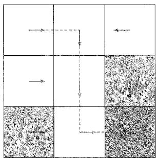

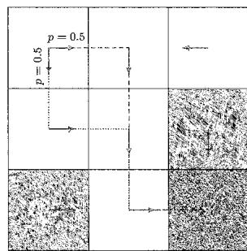
图 3.3 上面两个策略都是最优的，因此最优策略可能不是唯一的，而且可能是确定性的，也可能是随机性的。

最优策略的随机性：最优策略可以是随机的或确定的，如图3.3所示。然而，根据定理3.5，可以肯定地说，总是存在一个确定性的最优策略。

## 3.5 影响最优策略的因素

一个系统中有哪些因素会影响其最优策略呢？这个问题乍一看似乎不着边际，不知从何说起，但是有了贝尔曼最优方程这个工具之后，就可以很轻松地回答这个问题。具体来说，贝尔曼最优方程的元素展开形式是

$$
v (s) = \max_{\pi (s) \in H (s)} \sum_{a \in \mathcal{A}} \pi (a | s) \left(\sum_{r \in \mathcal{R}} p (r | s, a) r + \gamma \sum_{s^{\prime} \in \mathcal{S}} p (s^{\prime} | s, a) v (s^{\prime})\right), \quad s \in \mathcal{S}.
$$

这里的未知量是 $v^{*}$ 和 $\pi^{*}$ ，已知量包括即时奖励 $r$ 、折扣因子 $\gamma$ 、系统模型 $p(s'|s,a),p(r|s,a)$ 。显然，这里的未知量（即最优策略和最优状态值）是由这些已知量决定的。如果系统模型是给定的，那么最优策略会受到 $r$ 和 $\gamma$ 的影响，下面我们讨论当改变 $r$ 和 $\gamma$ 时最优策略会如何变化。本节给出的所有最优策略都是由定理3.3中的算法得到的，具体计算过程不再给出，该算法的细节将在第4章给出，这里主要关注最优策略的基本性质。

## 基准示例

考虑图3.4中的示例。奖励设置为 $r_{\mathrm{boundary}} = r_{\mathrm{forbidden}} = -1, r_{\mathrm{target}} = 1$ 。另外，智能体每移动一步都会获得 $r_{\mathrm{other}} = 0$ 的奖励。折扣因子选取为 $\gamma = 0.9$ 。

图3.4(a)给出了在上述参数下的最优策略和最优状态值。有趣的是，此时的最优策略会选择穿过禁区达到目标区域。例如，从(行=4,列=1)的状态开始，智能体有两种可能的策略到达目标区域。第一种策略是绕开所有禁区，走较长的路程到达目标区域；第二种策略是穿过禁区，走较短的路程到达目标区域。虽然第二种策略在进入禁区时会获得负奖励，但是其总的折扣回报更高，反而是优于第一种策略的。实际上，这个例子中 $\gamma$ 的值较大，因此其最优策略是有远见的，智能体会愿意“冒险”。

## 折扣因子的影响

如果我们将折扣因子从 $\gamma = 0.9$ 变为 $\gamma = 0.5$ 并保持其他参数不变，那么最优策略将变为图3.4(b)中所示的策略。有趣的是，智能体不再敢于冒险：它会避开所有禁区，绕行较长路程到达目标。这是由于 $\gamma$ 较小，最优策略变得目光短浅。

在极端情况下，当 $\gamma = 0$ 时，相应的最优策略如图3.4(c)所示。此时智能体无法到达目标区域，这是因为每个状态的最优策略都是极其目光短浅的，只选择最大的即时奖励对应的动作。

有的读者可能会问：图3.4(c)中的策略明显是不合理的，它连目标区域都无法达到，为什么还说它是“最优”的呢？这里需要注意数学上的“最优”和直观上的“好”不一定一致。在数学上，最优策略是在给定参数下求解贝尔曼最优方程得到的。如果我们认为得到的策略“不好”，则可以调整折扣因子或者奖励值来得到更符合我们需求的策略，但是在给定参数下求解出来的策略从数学上来说都是最优的。

此外，图3.4中所有最优状态值的空间分布也呈现一个有趣的现象：靠近目标的状态具有更高的状态值，而远离目标的状态具有较低的值。这个现象可以通过折扣因子来解释：如果从某个状态出发需要沿更长的轨迹到达目标，由于折扣因子的原因，其得到的回报会较小。

## 奖励值的影响

我们可以通过调整奖励值来改变最优策略。例如，如果想让智能体不要进入任何禁区，则可以增加其进入禁区的惩罚。例如，当 $r_{\mathrm{forbidden}}$ 从-1变为-10时，得到的最

优策略可以避开所有禁区（图3.4(d)）。

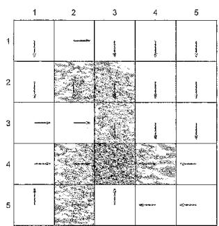

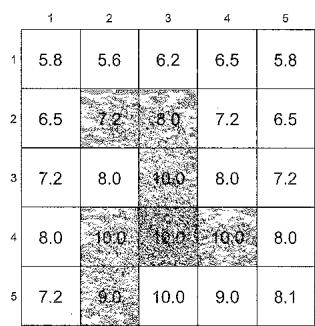
(a) 基准示例： $r_{boundary} = r_{forbidden} = -1, r_{target} = 1, \gamma = 0.9$ 。

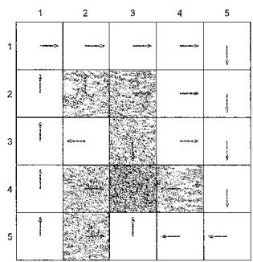

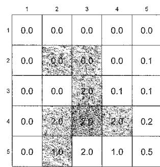
(b) 折扣因子改为 $\gamma = 0.5$ ，其他参数与 (a) 保持一致。

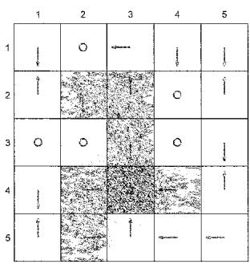

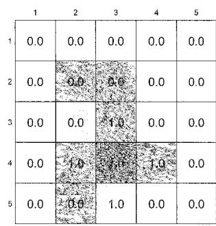
(c) 折扣因子改为 $\gamma = 0$ ，其他参数与 (a) 保持一致。

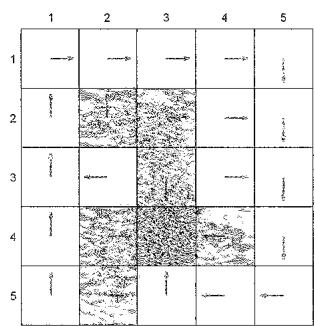

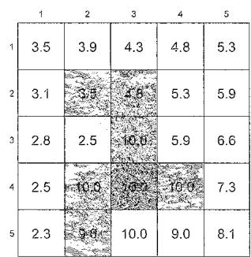
(d) $r_{\mathrm{forbidden}}$ 从-1改为-10，其他参数与(a)保持一致。
图3.4 不同参数值下的最优策略和最优状态值。

然而，改变奖励并不总会导致不同的最优策略。一个重要的性质是：最优策略对奖励的仿射变换是保持不变的。换句话说，如果我们对所有奖励进行同比例缩放或加减相同的值，那么最优策略仍然保持不变。下面的定理严格刻画了这个性质。

定理3.6（最优策略的不变性）。考虑一个马尔可夫决策过程，假设 $v^{*} \in \mathbb{R}^{|S|}$ 为最优状态值，即满足 $v^{*} = \max_{\pi \in \Pi}(r_{\pi} + \gamma P_{\pi}v^{*})$ 。如果每个奖励 $r$ 都通过仿射变换变成 $\alpha r + \beta$ 其中 $\alpha, \beta \in \mathbb{R}$ 且 $\alpha > 0$ ，那么相应的最优状态值 $v'$ 也是 $v^{*}$ 的一个仿射变换：

$$
v^{\prime} = \alpha v^{*} + \frac{\beta}{1 - \gamma} \mathbf{1},\tag{3.8}
$$

这里 $\gamma \in (0,1)$ 是折扣因子； $\mathbf{1} = [1,\dots,1]^{\mathrm{T}}$ 。 $v'$ 对应的最优策略与 $v^{*}$ 对应的最优策略相同。

定理3.6告诉我们：真正决定最优策略的不是奖励的绝对值，而是奖励的相对值。该定理的证明在方框3.5中给出，感兴趣的读者可以阅读。

方框3.5：定理3.6的证明

对于任意策略 $\pi$ ，定义 $r_{\pi} = [\dots ,r_{\pi}(s),\dots ]^{\mathrm{T}}$ ，其中

$$
r_{\pi} (s) = \sum_{a \in \mathcal{A}} \pi (a | s) \sum_{r \in \mathcal{R}} p (r | s, a) r, \quad s \in \mathcal{S}.
$$

如果 $r \to \alpha r + \beta$ ，则 $r_{\pi}(s) \to \alpha r_{\pi}(s) + \beta$ ，因此 $r_{\pi} \to \alpha r_{\pi} + \beta \mathbf{1}$ ，这里 $\mathbf{1} = [1, \ldots, 1]^{\mathrm{T}}$ 。此时贝尔曼最优方程变为

$$
v^{\prime} = \max_{\pi \in \Pi} (\alpha r_{\pi} + \beta \mathbf{1} + \gamma P_{\pi} v^{\prime}).\tag{3.9}
$$

下面证明式(3.9)的解是 $v'=\alpha v^{*}+c1$ ，其中 $c=\beta/(1-\gamma)$ 。

具体来说，把 $v' = \alpha v^{*} + c\mathbf{1}$ 代入式(3.9)可得

$$
\alpha v^{*} + c \mathbf{1} = \max_{\pi \in \Pi} (\alpha r_{\pi} + \beta \mathbf{1} + \gamma P_{\pi} (\alpha v^{*} + c \mathbf{1})) = \max_{\pi \in \Pi} (\alpha r_{\pi} + \beta \mathbf{1} + \alpha \gamma P_{\pi} v^{*} + c \gamma \mathbf{1}).
$$

上式中第二个等号是因为 $P_{\pi}1 = 1$ 。上述方程可以重组为

$$
\alpha v^{*} = \max_{\pi \in \Pi} (\alpha r_{\pi} + \alpha \gamma P_{\pi} v^{*}) + \beta \mathbf{1} + c \gamma \mathbf{1} - c \mathbf{1}.
$$

由于 $v^{*} = \max_{\pi \in \Pi}(r_{\pi} + \gamma P_{\pi}v^{*})$ ，上式等价于

$$
\beta \mathbf{1} + c \gamma \mathbf{1} - c \mathbf{1} = 0.
$$

由于 $c = \beta /(1 - \gamma)$ ，上述方程是成立的。因此， $v^{\prime} = \alpha v^{*} + c\mathbf{1}$ 是式(3.9)的解。由

于式(3.9)是贝尔曼最优方程，因此 $v'$ 也是其唯一解。

最后，由于 $v'$ 是 $v^*$ 的仿射变换，动作价值之间的相对关系保持不变，因此从 $v'$ 导出的贪婪最优策略与从 $v^*$ 导出的相同，即 $\arg\max_{\pi\in\Pi}(r_\pi+\gamma P_\pi v')$ 与 $\arg\max_{\pi}(r_\pi+\gamma P_\pi v^*)$ 相同。

关于最优策略的不变性，感兴趣的读者可以进一步参考文献[9]。

大家可能还记得第1章介绍基本概念时提到过：“奖励”实际上是人机交互的一个工具，因为我们可以通过调整奖励来得到想要的策略。而本章所介绍的贝尔曼最优方程从数学上对这一点进行了呼应：它可以透彻地解释当我们调解奖励时最优策略会发生怎样改变。

## 避免无意义的绕路

下面考虑一个有趣但很容易让人迷惑的问题。在网格世界中，我们希望智能体尽可能避免没有意义的绕路，从而尽可能快地到达目标区域。如图3.5所示，当从右上角的状态出发时，我们希望策略如左图所示，而不要像右图所示。

为了实现这个目标，常见的一个想法是为每一步添加一个负奖励来作为惩罚。这么做是否有用呢？经过前面小节的讨论，我们已经知道如果对每一步都增加一个额外的负奖励，这实际上是对奖励做了一个仿射变换，那么最后所对应的最优策略是不变的。所以加或者不加这个负奖励所得到的策略是没有区别的。

那么，如何才能避免智能体没有意义的绕路呢？答案是：最优策略已经会避免绕路了，而不需要我们做额外的设置。例如，图3.5(a)给出的就是最优策略。此时，虽然在白色区域之间移动的奖励为0，但是最优策略并不会进行无意义的绕路。

为什么没有对每一步的惩罚也能避免绕路而尽快到达目标呢？答案在于折扣因子 $\gamma$ 。例如，从右上角的状态出发，图3.5(b)的策略在到达目标区域之前绕了一个远路。如果我们考虑折扣回报，那么绕远路会降低折扣回报。具体来说，此时的折扣回报是

$$
\mathrm{return} = 0 + \gamma 0 + \gamma^{2} 1 + \gamma^{3} 1 + \dots = \gamma^{2} / (1 - \gamma) = 8. 1.
$$

相比之下，如果采用图3.5(a)的策略，则其折扣回报是

$$
\mathrm{return} = 1 + \gamma 1 + \gamma^{2} 1 + \dots = 1 / (1 - \gamma) = 10.
$$

很明显，达到目标所用的轨迹越长，折扣回报就越小。因此，最优策略会自然地避免选择这样的轨迹。

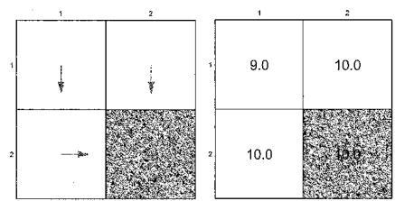
(a) 无绕路的策略。

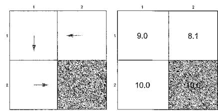
(b) 有绕路的策略。
图3.5 有绕路和无绕路的策略及其对应的状态值。在右上角的状态，这两个策略是不同的。这个例子中，右下角的蓝色单元格代表目标区域。进入目标区域会得到 $+1$ 的奖励，在白色区域之间移动的奖励为0。

## 3.6 总结

本章介绍的核心概念包括最优策略和最优状态值，它们是密切相关的：最优状态值是最优策略的状态值；最优策略是可以基于最优状态值得到的。本章介绍的核心工具是贝尔曼最优方程。我们可以利用压缩映射定理来分析这个方程，从而回答一系列关于最优策略的基础问题。

本章的内容对于彻底理解强化学习的许多基本思想非常重要。例如，定理3.3提出了一个用于求解贝尔曼最优方程的迭代算法，这个算法正是将在第4章详细介绍的值迭代算法。

## 3.7 问答

## ◇ 提问：最优策略的定义是什么？

回答：如果一个策略对应的状态值大于或等于任何其他策略，那么这个策略就是最优的。

值得注意的是，这个最优性的定义只是针对基于表格的情况。当使用函数来表示值或者策略时，需要使用不同的指标来定义最优策略，具体将在第8章和第9章介绍。

◇ 提问：为什么贝尔曼最优方程很重要？

回答：因为它刻画了最优策略和最优状态值，进而能够帮助我们回答一系列基础问题。详情请见正文，这里不再赘述。

◇ 提问：贝尔曼最优方程是贝尔曼方程吗？

回答：是的。贝尔曼最优方程是一个特殊的贝尔曼方程。每一个贝尔曼方程都对应了一个策略。作为一个特殊的贝尔曼方程，贝尔曼最优方程对应的策略是最优

策略。

◇ 提问：分析贝尔曼最优方程主要依赖的关键性质是什么？

答：贝尔曼最优方程的右侧函数是一个压缩映射。基于这个关键性质，我们可以用压缩映射定理来分析。

◇ 提问：贝尔曼最优方程的解是唯一的吗？

回答：贝尔曼最优方程有两个未知变量：一个值和一个策略。这个值的解即最优状态值是唯一的。然而，这个策略的解即最优策略可能不是唯一的。

◇ 提问：最优策略存在吗？

回答：存在。根据贝尔曼最优方程的分析，最优策略总是存在的。

◇ 提问：最优策略是唯一的吗？

回答：不是。可能存在多个甚至无穷个最优策略，它们都具有相同的最优状态值。

◇ 提问：最优策略是随机性的还是确定性的？

回答：最优策略可以是确定性的也可以是随机性的，不过总是存在确定性贪婪的最优策略。

◇ 提问：如何获得最优策略？

回答：使用定理3.3建议的迭代算法可以得到最优策略。该迭代算法的详细实现过程将在第4章给出。值得注意的是，所有强化学习算法都旨在获得最优策略，只是它们有不同的思路或者条件。例如第4章介绍的算法需要事先知道系统模型，而之后的章节不再需要知道系统模型。

◇ 提问：如果降低折扣因子的值，对最优策略有什么影响？

回答：当降低折扣因子时，最优策略会变得更加“短视”。例如，智能体不敢冒险得到负的即时奖励，尽管它之后可能会获得更大的回报。

◇ 提问：如果将折扣因子设置为0，会发生什么？

回答：得到的最优策略将变得“极端短视”：智能体只会选择那些即时奖励最大的动作，即使这些动作从长远来看并不好。

提问：如果将所有的奖励增加相同的数值，最优策略会改变吗？最优状态值会改变吗？

回答：将所有奖励增加相同的数值是对奖励的一个仿射变换，这不会影响最优策略。然而，最优状态值会增加，如式(3.8)所示。

提问：如果希望最优策略可以避免无意义的绕路从而尽可能快地到达目标，那么是否应该在每一步加入负奖励？

回答：首先，对每一步引入额外的负奖励是对奖励的仿射变换，这不会改变最优策略；其次，折扣因子已经可以鼓励智能体避免绕路而尽可能快地到达目标，这是因为无意义的绕路会增加轨迹长度，从而减少折扣回报。
