# 第4章 · 值迭代与策略迭代

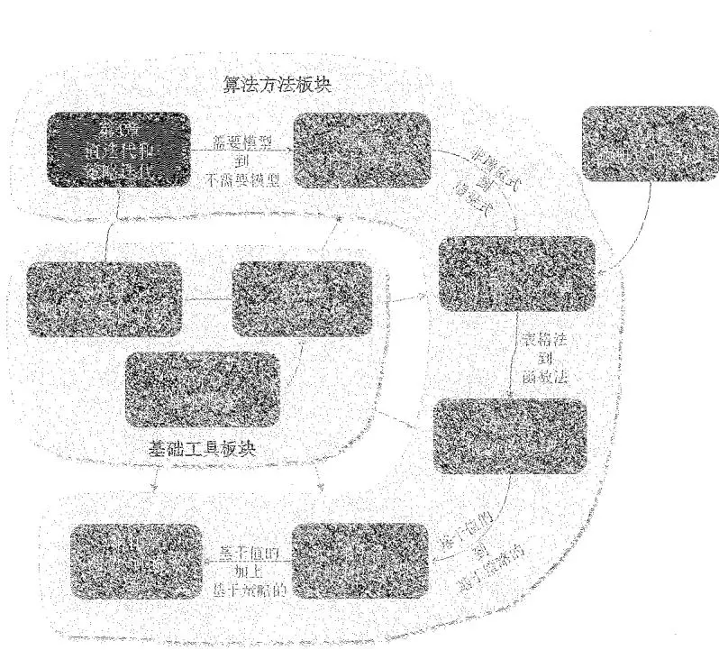
图 4.1 本章在全书中的位置。

本书的前三章都是在介绍基础工具。从本章开始，我们将介绍用于求解最优策略的算法。本章将介绍三个密切相关的方法。第一，值迭代（value iteration）算法。该算法实际上就是[第3章](ch03.md)中压缩映射定理给出的求解贝尔曼最优方程的算法，其具体细节将在本章给出。第二，策略迭代（policy iteration）算法。该算法的基本思想在强化学习中有广泛应用。第三，截断策略迭代（truncated policy iteration）算法。值迭代和策略迭代是该算法的两个特殊情况，因此截断策略迭代更加一般化。

本章介绍的算法需要事先知道系统模型，这些算法也被称为动态规划（dynamic programming）[10, 11]。从[第5章](ch05.md)开始，我们将介绍无模型的算法。不过，读者需要先透彻理解需要模型的算法，才能理解无模型的算法。例如，如果读者理解了本章介绍的策略迭代算法，那么就可以很轻松地理解[第5章](ch05.md)介绍的无需模型的蒙特卡罗方法。

## 4.1 值迭代算法

下面介绍全书第一个能够求解最优策略的算法——值迭代（value iteration）。该算法实际上是定理3.3中给出的用于求解贝尔曼最优方程的算法。不过，第3章并没有过多介绍该算法，下面介绍其具体的实施细节。

为了方便阅读，我们将该算法再次写出来：

$$
v_{k + 1} = \max_{\pi \in \Pi} (r_{\pi} + \gamma P_{\pi} v_{k}), \quad k = 0, 1, 2, \ldots
$$

定理3.3已经告诉我们，随着 $k$ 趋向无穷大， $v_{k}$ 和 $\pi_{k}$ 分别收敛于最优状态值和最优策略。

该迭代算法的每次迭代包含两个步骤。

◇ 第一步是策略更新（policy update）。在数学上，它旨在找到一个能解决以下优化问题的策略：

$$
\pi_{k + 1} = \arg \max_{\pi} (r_{\pi} + \gamma P_{\pi} v_{k}),
$$

其中 $v_{k}$ 是上一次迭代得到的值。

◇ 第二步是值更新（value update）。在数学上，它通过下式来计算新的值 $v_{k+1}$ :

$$
v_{k + 1} = r_{\pi_{k + 1}} + \gamma P_{\pi_{k + 1}} v_{k},\tag{4.1}
$$

其中 $v_{k+1}$ 将用于下一次迭代。

上述算法是以矩阵向量形式呈现的。为了编程实现这个算法，我们需要进一步分析其按元素展开形式（elementwise form）。在此之前，先回答一个问题：式(4.1)中的 $v_{k}$ 是否是状态值？答案是否定的。尽管当k趋于无穷时 $v_{k}$ 会收敛到最优状态值，但是当 $k$ 有限时， $v_{k}$ 可能并不满足任何一个贝尔曼方程，因此也不是某一个策略的状态值。

### 4.1.1 展开形式和实现细节

在第 k 次迭代中，状态 s 对应的策略更新和值更新的步骤的细节如下所示。

◇ 策略更新： $\pi_{k+1}=\arg\max_{\pi}(r_{\pi}+\gamma P_{\pi}v_{k})$ 的按元素展开形式为

$$
\pi_{k + 1} (s) = \arg \max_{\pi} \sum_{a} \pi (a | s) \underbrace{\left(\sum_{r} p (r | s , a) r + \gamma \sum_{s^{\prime}} p (s^{\prime} | s , a) v_{k} (s^{\prime})\right)} _{q_{k} (s, a)}, \quad s \in \mathcal{S}.
$$

上述优化问题的最优解为

$$
\pi_{k + 1} (a | s) = \left\{\begin{array}{l l} 1, & a = a_{k} ^{*} (s), \\ 0, & a \neq a_{k} ^{*} (s), \end{array} \right.\tag{4.2}
$$

其中 $a_{k}^{*}(s) = \arg \max_{a}q_{k}(s,a)$ 。这个最优解已经在第3.3.1节中有详细分析。此外，如果有多个动作的值都相同并且最大，那么可以选择其中任意一个动作。

◇ 值更新： $v_{k+1}=r_{\pi_{k+1}}+\gamma P_{\pi_{k+1}}v_{k}$ 的按元素展开形式是

$$
v_{k + 1} (s) = \sum_{a} \pi_{k + 1} (a | s) \underbrace{\left(\sum_{r} p (r | s , a) r + \gamma \sum_{s^{\prime}} p (s^{\prime} | s , a) v_{k} (s^{\prime})\right)} _{q_{k} (s, a)}, \quad s \in \mathcal{S}.
$$

将式(4.2)代入上式可得

$$
v_{k + 1} (s) = \max_{a} q_{k} (s, a).
$$

即新的值等于状态 s 对应的最大 q 值。

上面两个步骤可以概述为如下形式：

$v_{k}(s)\rightarrow$ 计算 $q_{k}(s,a)\rightarrow$ 计算新策略 $\pi_{k + 1}(s)\rightarrow$ 计算新值 $v_{k + 1}(s) = \max_aq_k(s,a)$ 上述算法的伪代码参见算法4.1。

### 4.1.2 示例

下面通过一个简单的例子来详细介绍值迭代算法的实现过程。如图4.2所示，这个例子是一个 $2 \times 2$ 的网格世界，其中有一个禁止区域和一个目标区域。参数设置为 $r_{boundary} = -1, r_{forbidden} = -1, r_{target} = 1, \gamma = 0.9$ 。

## 算法4.1：值迭代算法

初始化：已知模型，即任意 $(s, a)$ 对应的 $p(r|s, a)$ 和 $p(s'|s, a)$。初始值 $v_0$。目标：求解最优状态值和最优策略。
当 $v_k$ 尚未收敛时（例如 $\|v_k - v_{k-1}\|$ 大于给定阈值时），进行如下迭代对每个状态 $s \in S$ 对每个动作 $a \in \mathcal{A}(s)$ 计算 $q$ 值：$q_k(s, a) = \sum_r p(r|s, a)r + \gamma \sum_{s'} p(s'|s, a)v_k(s')$ 最大价值动作：$a_k^*(s) = \arg \max_a q_k(s, a)$ 策略更新：$\pi_{k+1}(a|s) = 1$ 如果 $a = a_k^*$；否则 $\pi_{k+1}(a|s) = 0$ 值更新：$v_{k+1}(s) = \max_a q_k(s, a)$

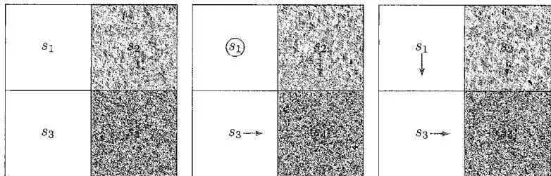
图 4.2 用于展示值迭代算法过程的例子。

首先，我们可以建立一个 $q$ -table，如表4.1所示，其中每一个元素展示了如何从 $v$ 值计算出 $q$ 值。

表 4.1 图4.2所示例子对应的 q-table。

<table><tr><td>q-table</td><td> $a_1$ </td><td> $a_2$ </td><td> $a_3$ </td><td> $a_4$ </td><td> $a_5$ </td></tr><tr><td> $s_1$ </td><td> $-1 + \gamma v(s_1)$ </td><td> $-1 + \gamma v(s_2)$ </td><td> $0 + \gamma v(s_3)$ </td><td> $-1 + \gamma v(s_1)$ </td><td> $0 + \gamma v(s_1)$ </td></tr><tr><td> $s_2$ </td><td> $-1 + \gamma v(s_2)$ </td><td> $-1 + \gamma v(s_2)$ </td><td> $1 + \gamma v(s_4)$ </td><td> $0 + \gamma v(s_1)$ </td><td> $-1 + \gamma v(s_2)$ </td></tr><tr><td> $s_3$ </td><td> $0 + \gamma v(s_1)$ </td><td> $1 + \gamma v(s_4)$ </td><td> $-1 + \gamma v(s_3)$ </td><td> $-1 + \gamma v(s_3)$ </td><td> $0 + \gamma v(s_3)$ </td></tr><tr><td> $s_4$ </td><td> $-1 + \gamma v(s_2)$ </td><td> $-1 + \gamma v(s_4)$ </td><td> $-1 + \gamma v(s_4)$ </td><td> $0 + \gamma v(s_3)$ </td><td> $1 + \gamma v(s_4)$ </td></tr></table>

下面详细给出每一次迭代的过程。

◇ k = 0:

初始值 $v_{0}$ 可以任意选择，这里不失一般性地选择 $v_{0}(s_{1}) = v_{0}(s_{2}) = v_{0}(s_{3}) = v_{0}(s_{4}) = 0$ 。

计算 $q$ 值：将 $v_{0}(s_{i})$ 代入表4.1，得到的 $q$ 值如表4.2所示。

表 4.2 k = 0 时的 q-table。

<table><tr><td>q-table</td><td> $a_{1}$ </td><td> $a_{2}$ </td><td> $a_{3}$ </td><td> $a_{4}$ </td><td> $a_{5}$ </td></tr><tr><td> $s_{1}$ </td><td>-1</td><td>-1</td><td>0</td><td>-1</td><td>0</td></tr><tr><td> $s_{2}$ </td><td>-1</td><td>-1</td><td>1</td><td>0</td><td>-1</td></tr><tr><td> $s_{3}$ </td><td>0</td><td>1</td><td>-1</td><td>-1</td><td>0</td></tr><tr><td> $s_{4}$ </td><td>-1</td><td>-1</td><td>-1</td><td>0</td><td>1</td></tr></table>

策略更新: 每个状态的策略应更新为选择具有最大 q 值的动作。基于此, 通过表4.2可以看出新的策略为

$$
\pi_{1} (a_{5} | s_{1}) = 1, \quad \pi_{1} (a_{3} | s_{2}) = 1, \quad \pi_{1} (a_{2} | s_{3}) = 1, \quad \pi_{1} (a_{5} | s_{4}) = 1.
$$

在状态 $s_{1}$ ，由于动作 $a_{3}$ 和 $a_{5}$ 的 q 值是相等的，因此可以随机选择其中一个值，这里我们选择的是 $a_{5}$ 。图4.2的中间图展示了上面得到的新策略。

值更新：每个状态的 $v$ 值应更新为其最大 $q$ 值，由此可得如下新值：

$$
v_{1} (s_{1}) = 0, \quad v_{1} (s_{2}) = 1, \quad v_{1} (s_{3}) = 1, \quad v_{1} (s_{4}) = 1.
$$

不难看出，这次迭代得到的策略还不是最优的，因为它在 $s_1$ 时选择保持不动。下面继续迭代。

◇ k = 1:

计算 $q$ 值：将 $v_{1}(s_{i})$ 代入表4.1，得到表4.3中的 $q$ 值。

表 4.3 k = 1 时对应的 q-table。

<table><tr><td>q-table</td><td> $a_1$ </td><td> $a_2$ </td><td> $a_3$ </td><td> $a_4$ </td><td> $a_5$ </td></tr><tr><td> $s_1$ </td><td> $-1 + \gamma 0$ </td><td> $-1 + \gamma 1$ </td><td> $0 + \gamma 1$ </td><td> $-1 + \gamma 0$ </td><td> $0 + \gamma 0$ </td></tr><tr><td> $s_2$ </td><td> $-1 + \gamma 1$ </td><td> $-1 + \gamma 1$ </td><td> $1 + \gamma 1$ </td><td> $0 + \gamma 0$ </td><td> $-1 + \gamma 1$ </td></tr><tr><td> $s_3$ </td><td> $0 + \gamma 0$ </td><td> $1 + \gamma 1$ </td><td> $-1 + \gamma 1$ </td><td> $-1 + \gamma 1$ </td><td> $0 + \gamma 1$ </td></tr><tr><td> $s_4$ </td><td> $-1 + \gamma 1$ </td><td> $-1 + \gamma 1$ </td><td> $-1 + \gamma 1$ </td><td> $0 + \gamma 1$ </td><td> $1 + \gamma 1$ </td></tr></table>

策略更新：每个状态的策略应更新为选择具有最大 $q$ 值的动作。因此，通过表4.3可以看出新的策略为

$$
\pi_{2} (a_{3} | s_{1}) = 1, \quad \pi_{2} (a_{3} | s_{2}) = 1, \quad \pi_{2} (a_{2} | s_{3}) = 1, \quad \pi_{2} (a_{5} | s_{4}) = 1.
$$

图4.2中的右图展示了上面得到的新策略。

值更新：每个状态的 $v$ 值应更新为其最大 $q$ 值，由此可得如下新值：

$$
v_{2} (s_{1}) = \gamma 1, \quad v_{2} (s_{2}) = 1 + \gamma 1, \quad v_{2} (s_{3}) = 1 + \gamma 1, \quad v_{2} (s_{4}) = 1 + \gamma 1.
$$

如果需要，则可以继续迭代。

◇  $k = 2, 3, 4, \ldots$

值得注意的是，如图4.2的右图所示，策略 $\pi_2$ 已经是最优的。因此，在这个简单的例子中，我们只需要两次迭代就能得到最优策略。当然，对于更复杂的例子，我们需要运行更多轮的迭代，直到 $v_{k}$ 收敛（例如 $\| v_{k + 1} - v_k\|$ 小于一个很小的数）。

## 4.2 策略迭代算法

本节介绍另一个非常重要的算法——策略迭代（policy iteration）。策略迭代与值迭代有着密切的联系，不过它并非像值迭代那样直接求解贝尔曼最优方程，而是在策略评价和策略改进之间来回切换，这种思想在强化学习算法中广泛存在。

### 4.2.1 算法概述

策略迭代也是一种迭代算法，每次迭代包含两个步骤。具体来说，第 k 次迭代的两个步骤如下所述。

◇ 第一步是策略评价（policy evaluation）。顾名思义，这个步骤是用来评估上一次迭代得到的策略 $\pi_{k}$ 。从数学上来说，该步骤就是求解下面的贝尔曼方程，从而得到 $\pi_{k}$ 的状态值：

$$
v_{\pi_{k}} = r_{\pi_{k}} + \gamma P_{\pi_{k}} v_{\pi_{k}},\tag{4.3}
$$

其中 $\pi_{k}$ 是上一次迭代中得到的策略， $v_{\pi_{k}}$ 是该策略对应的状态值， $r_{\pi_{k}}$ 和 $P_{\pi_{k}}$ 可以根据系统模型得到。

第二步是策略改进（policy improvement）。顾名思义，这个步骤是用来改进策略从而得到更好的新策略。从数学上来说，在第一步得到 $v_{\pi_k}$ 之后，此步骤会利用下式得到新的策略 $\pi_{k+1}$ ：

$$
\pi_{k + 1} = \arg \max_{\pi} (r_{\pi} + \gamma P_{\pi} v_{\pi_{k}}).
$$

为了透彻理解该算法，我们需要回答下面三个问题。

◇ 在策略评价步骤中，如何计算状态值 $v_{\pi_{k}}$ ?

◇ 在策略改进步骤中，新策略 $\pi_{k+1}$ 为什么比 $\pi_{k}$ 更好？

为什么这个算法最终能够收敛到最优策略？

下面逐一回答这些问题。

在策略评价步骤中，如何计算状态值 $v_{\pi_k}$ ?

计算状态值 $v_{\pi_k}$ 的过程就是求解贝尔曼方程。[第2章](ch02.md)已经介绍了两种求解贝尔曼方程(4.3)的方法，下面简要回顾这两种方法。第一种方法能直接给出解析解： $v_{\pi_k} = (I - \gamma P_{\pi_k})^{-1}r_{\pi_k}$ 。这个解析解对于理论分析很有用，但在实际应用中计算效率较低，这是因为需要使用其他数值算法来计算逆矩阵。第二种方法是利用如下数值迭代算法：

$$
v_{\pi_{k}} ^{(j + 1)} = r_{\pi_{k}} + \gamma P_{\pi_{k}} v_{\pi_{k}} ^{(j)}, \quad j = 0, 1, 2, \dots\tag{4.4}
$$

其中 $v_{\pi_k}^{(j)}$ 表示对 $v_{\pi_k}$ 第 $j$ 次的估计值。我们知道，从任意初始值 $v_{\pi_k}^{(0)}$ 开始，随着 $j$ 趋向于无穷大， $v_{\pi_k}^{(j)}$ 会收敛到 $v_{\pi_k}$ （详情参见第2.7节）。

在策略迭代中，我们会采用上面的第二种方法。此时，策略迭代就成了一个嵌套了另一个迭代算法的迭代算法：即策略迭代本身是一个迭代算法，而每次迭代中的策略评价步骤需要调用另一个迭代算法(4.4)。

在理论上，算法(4.4)需要无限步（即 $j \to \infty$ ）才能收敛到真实的状态值 $v_{\pi_k}$ 。在实际中，算法不可能执行无限步，而只能执行有限步，例如当 $\| v_{\pi_k}^{(j+1)} - v_{\pi_k}^{(j)}\|$ 小于一个很小的数值或者 $j$ 超过某个预设值时，迭代就会终止。有的读者会问：如果无法执行无限次迭代，那么只能得到 $v_{\pi_k}$ 的一个近似值，将这个近似值用于后续的策略改进是否会导致无法找到最优策略呢？答案是不会。至于为什么，稍后大家在第4.3节学习截断策略迭代算法的时候就会清楚。

在策略改进步骤中，为什么 $\pi_{k + 1}$ 比 $\pi_{k}$ 更好？

下面的引理解释了为什么 $\pi_{k + 1}$ 比 $\pi_{k}$ 更好。


引理4.1(策略改进)。如果 $\pi_{k + 1} = \arg \max_{\pi}(r_{\pi} + \gamma P_{\pi}v_{\pi_k})$ ，那么 $v_{\pi_{k + 1}}\geqslant v_{\pi_k}$ 。


上述引理中，”≥”是逐元素的比较，即 $v_{\pi_{k+1}} \geqslant v_{\pi_k}$ 意味着对任意状态s有 $v_{\pi_{k+1}}(s) \geqslant v_{\pi_k}(s)$ 。因此， $\pi_{k+1}$ 优于 $\pi_k$ 。


方框4.1：证明引理4.1

由于 $v_{\pi_{k + 1}}$ 和 $v_{\pi_k}$ 都是状态值，它们分别满足下面的贝尔曼方程：

$$
v_{\pi_{k + 1}} = r_{\pi_{k + 1}} + \gamma P_{\pi_{k + 1}} v_{\pi_{k + 1}},
$$

$$
v_{\pi_{k}} = r_{\pi_{k}} + \gamma P_{\pi_{k}} v_{\pi_{k}}.
$$

由于 $\pi_{k + 1} = \arg \max_{\pi}(r_{\pi} + \gamma P_{\pi}v_{\pi_k})$ ，因此

$$
r_{\pi_{k + 1}} + \gamma P_{\pi_{k + 1}} v_{\pi_{k}} \geqslant r_{\pi_{k}} + \gamma P_{\pi_{k}} v_{\pi_{k}}.
$$

因此

$$
\begin{array}{r l} v_{\pi_{k}} - v_{\pi_{k + 1}} & = (r_{\pi_{k}} + \gamma P_{\pi_{k}} v_{\pi_{k}}) - (r_{\pi_{k + 1}} + \gamma P_{\pi_{k + 1}} v_{\pi_{k + 1}}) \\ & \leqslant (r_{\pi_{k + 1}} + \gamma P_{\pi_{k + 1}} v_{\pi_{k}}) - (r_{\pi_{k + 1}} + \gamma P_{\pi_{k + 1}} v_{\pi_{k + 1}}) \\ & \leqslant \gamma P_{\pi_{k + 1}} (v_{\pi_{k}} - v_{\pi_{k + 1}}). \end{array}
$$

反复调用上式可得

$$
\begin{array}{r l} & v_{\pi_{k}} - v_{\pi_{k + 1}} \leqslant \gamma^{2} P_{\pi_{k + 1}} ^{2} (v_{\pi_{k}} - v_{\pi_{k + 1}}) \leqslant \ldots \leqslant \gamma^{n} P_{\pi_{\pi_{k + 1}}} ^{n} (v_{\pi_{k}} - v_{\pi_{k + 1}}) \\ & \qquad \qquad \qquad \qquad \qquad \qquad \qquad \qquad \qquad \leqslant \lim_{n \to \infty} \gamma^{n} P_{\pi_{k + 1}} ^{n} (v_{\pi_{k}} - v_{\pi_{k + 1}}) = 0. \end{array}
$$

上式最右端极限等于0是因为 $\gamma^n\to 0$ 且 $P_{\pi_{k + 1}}^n$ 的每一个元素都在[0,1]区间。因此， $v_{\pi_k} - v_{\pi_{k + 1}}\leqslant 0$ 说明了 $\pi_{k + 1}$ 比 $\pi_k$ 更优。


## 为什么策略迭代算法能收敛到最优策略？

策略迭代算法会生成两个序列。第一个是策略序列 $\{\pi_{0},\pi_{1},\ldots,\pi_{k},\ldots\}$ ，第二个是状态值序列 $\{v_{\pi_{0}},v_{\pi_{1}},\ldots,v_{\pi_{k}},\ldots\}$ 。假设 $v^{*}$ 是最优状态值，那么对于所有 k 都有 $v_{\pi_{k}}\leqslant v^{*}$ 。根据引理4.1，我们知道策略会越来越好，因此有

$$
v_{\pi_{0}} \leqslant v_{\pi_{1}} \leqslant v_{\pi_{2}} \leqslant \dots \leqslant v_{\pi_{k}} \leqslant \dots \leqslant v^{*}.
$$

由于 $v_{\pi_k}$ 单调递增并且有上界 $v^{*}$ ，根据单调收敛定理（参见附录C和文献[12]），当 $k$ 趋于无穷大时， $v_{\pi_k}$ 会收敛到一个常数，记为 $v_{\infty}$ 。那么，收敛值 $v_{\infty}$ 是否等于最优值 $v^{*}$ 呢？下面的定理回答了这个问题。


定理4.1 (策略迭代的收敛性)。由策略迭代算法生成的状态值序列 $\{\upsilon_{\pi_k}\}_{k=0}^{\infty}$ 收敛于最优状态值 $\upsilon^{*}$ 。因此，策略序列 $\{\pi_k\}_{k=0}^{\infty}$ 收敛于一个最优策略。


本定理的证明见方框4.2。该证明不仅展示了策略迭代算法的收敛性，还揭示了策略迭代算法与值迭代算法之间的关系：值迭代的收敛性可以推出策略迭代的收敛性，换句话说，策略迭代比值迭代的收敛性更强。


方框4.2：证明定理4.1

为了证明 $\{v_{\pi_k}\}_{k=0}^{\infty}$ 的收敛性，我们引入另一个序列 $\{v_k\}_{k=0}^{\infty}$ ，该序列由下面的迭代算法产生：

$$
v_{k + 1} = f (v_{k}) = \max_{\pi} (r_{\pi} + \gamma P_{\pi} v_{k}).
$$

这个迭代算法实际上就是值迭代算法。我们已经知道，给定任意的初始值 $v_{0}$ ， $v_{k}$ 会收敛到 $v^{*}$ 。

对任意的 $\pi_0$ ，总是能找到 $v_{0}$ 使得 $v_{0} \leqslant v_{\pi_0}$ 。下面用递归法证明 $v_{k} \leqslant v_{\pi_{k}} \leqslant v^{*}$ 对任意 $k \geqslant 1$ 都成立。

假设 $v_{\pi_k} \geqslant v_k$ 对某一个 $k$ 成立，那么对于 $k + 1$ 可得

$$
\begin{array}{r l} & {{v_{\pi_{k + 1}} - v_{k + 1} = (r_{\pi_{k + 1}} + \gamma P_{\pi_{k + 1}} v_{\pi_{k + 1}}) - \underset{\pi} {\max} (r_{\pi} + \gamma P_{\pi} v_{k})}} \\ & {{\qquad \qquad \geqslant (r_{\pi_{k + 1}} + \gamma P_{\pi_{k + 1}} v_{\pi_{k}}) - \underset{\pi} {\max} (r_{\pi} + \gamma P_{\pi} v_{k})}} \\ & {{\qquad \qquad \qquad \qquad \qquad \qquad \qquad \qquad \qquad \qquad \qquad \qquad \qquad \qquad \qquad \qquad \mathrm{(因为} v_{\pi_{k + 1}} \geqslant v_{\pi_{k}} \mathrm{并且} P_{\pi_{k + 1}} \geqslant 0 \mathrm{)}}} \\ & {{\qquad \qquad = (r_{\pi_{k + 1}} + \gamma P_{\pi_{k + 1}} v_{\pi_{k}}) - (r_{\pi_{k} ^{\prime}} + \gamma P_{\pi_{k} ^{\prime}} v_{k})}} \\ & {{\qquad \qquad \qquad \qquad \qquad \qquad \qquad \qquad \qquad \mathrm{(令} \pi_{k} ^{\prime} = \arg \underset{\pi} {\max} (r_{\pi} + \gamma P_{\pi} v_{k}))}} \\ & {{\qquad \qquad \geqslant (r_{\pi_{k} ^{\prime}} + \gamma P_{\pi_{k} ^{\prime}} v_{\pi_{k}}) - (r_{\pi_{k} ^{\prime}} + \gamma P_{\pi_{k} ^{\prime}} v_{k})}} \\ & {{\qquad \qquad \qquad \qquad \qquad \qquad \qquad \qquad \mathrm{(因为} \pi_{k + 1} = \arg \underset{\pi} {\max} (r_{\pi} + \gamma P_{\pi} v_{\pi_{k}}))}} \\ & {{\qquad \qquad = \gamma P_{\pi_{k} ^{\prime}} (v_{\pi_{k}} - v_{k}).}} \end{array}
$$

由于 $v_{\pi_k} - v_k \geqslant 0$ 并且 $P_{\pi_k'}$ 非负，我们有 $P_{\pi_k'}(v_{\pi_k} - v_k) \geqslant 0$ ，因此 $v_{\pi_{k+1}} - v_{k+1} \geqslant 0$ 。由于 $v_{\pi_k} \geqslant v_k$ 对于 $k = 0$ 成立，那么通过递归可知 $v_{\pi_k} \geqslant v_k$ 对任意 $k \geqslant 0$ 成立。最后，因为 $v_k$ 能收敛到 $v^*$ ，所以 $v_{\pi_k}$ 也必定能收敛到 $v^*$ 。


### 4.2.2 算法的展开形式

为了编程实现策略迭代算法，我们需要学习其按元素展开的形式。

◇ 第一，策略评价步骤利用迭代算法(4.4)来求解贝尔曼公式从而得到 $v_{\pi_k}$ 。算法(4.4)的元素展开形式为

$$
v_{\pi_{k}} ^{(j + 1)} (s) = \sum_{a} \pi_{k} (a | s) \left(\sum_{r} p (r | s, a) r + \gamma \sum_{s^{\prime}} p (s^{\prime} | s, a) v_{\pi_{k}} ^{(j)} (s^{\prime})\right), \quad s \in \mathcal{S},
$$

其中 $j = 0,1,2,\ldots$

◇ 第二，策略改进步骤是求解 $\pi_{k+1} = \arg\max_{\pi}(r_{\pi} + \gamma P_{\pi} v_{\pi_{k}})$ ，该式的元素展开形式为

$$
\pi_{k + 1} (s) = \arg \max_{\pi} \sum_{a} \pi (a | s) \underbrace{\left(\sum_{r} p (r | s , a) r + \gamma \sum_{s^{\prime}} p (s^{\prime} | s , a) v_{\pi_{k}} (s^{\prime})\right)} _{q_{\pi_{k}} (s, a)}, \quad s \in \mathcal{S}.
$$

其中 $q_{\pi_k}(s,a)$ 是策略 $\pi_k$ 对应的动作值。令 $a_k^* (s) = \arg \max_a q_{\pi_k}(s,a)$ 为最大值动作，那么上述优化问题的解是

$$
\pi_{k + 1} (a | s) = \left\{\begin{array}{l l} 1, & a = a_{k} ^{*} (s), \\ 0, & a \neq a_{k} ^{*} (s). \end{array} \right.
$$

上述算法的伪代码参见算法4.2。

## 算法4.2：策略迭代算法

初始化：已知模型，即任意 $(s, a)$ 对应的 $p(r|s, a)$ 和 $p(s'|s, a)$，初始策略 $\pi_0$。目标：寻找最优状态值和最优策略。
当 $v_{\pi_k}$ 未收敛时，进行第 $k$ 次迭代
策略评价：选择初始值 $v_{\pi_k}^{(0)}$
当 $v_{\pi_k}^{(j)}$ 未收敛时，进行第 $j$ 次迭代对每一个状态 $s \in S$ $v_{\pi_k}^{(j+1)}(s) = \sum_a \pi_k(a|s) \left[ \sum_r p(r|s, a)r + \gamma \sum_{s'} p(s'|s, a)v_{\pi_k}^{(j)}(s') \right]$ 策略改进：对每一个状态 $s \in S$ 对每一个动作 $a \in A$ $q_{\pi_k}(s, a) = \sum_r p(r|s, a)r + \gamma \sum_{s'} p(s'|s, a)v_{\pi_k}(s')$ $a_k^*(s) = \arg \max_a q_{\pi_k}(s, a)$ $\pi_{k+1}(a|s) = 1$ 如果 $a = a_k^*$；否则 $\pi_{k+1}(a|s) = 0$

### 4.2.3 示例

## 一个简单例子

考虑图4.3中的例子，其中有两个状态，每个状态有三个可能的动作： $A=\{a_{\ell},a_{0},a_{r}\}$ ，这三个动作分别代表向左移动、保持不动、向右移动。参数设置为 $r_{boundary}=$

-1, $r_{target} = 1, \gamma = 0.9$ 。

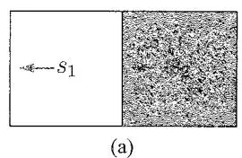

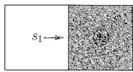
图4.3 用于展示策略迭代算法的例子。(a)为初始策略，(b)为迭代一次后得到的策略。

当 $k = 0$ 时，初始策略如图4.3(a)所示，很显然这个策略并不好。下面演示如何使用策略迭代算法来得到最优策略。

◇ 第一，策略评价步骤是求解贝尔曼方程。该例子对应的贝尔曼方程为

$$
\begin{array}{l} v_{\pi_{0}} (s_{1}) = - 1 + \gamma v_{\pi_{0}} (s_{1}), \\ v_{\pi_{0}} (s_{2}) = 0 + \gamma v_{\pi_{0}} (s_{1}). \end{array}
$$

由于该方程比较简单，因此可以直接手工求解得到

$$
v_{\pi_{0}} (s_{1}) = - 10, \quad v_{\pi_{0}} (s_{2}) = - 9.
$$

我们也可以使用迭代算法(4.4)来求解。例如，选择初始值为 $v_{\pi_0}^{(0)}(s_1) = v_{\pi_0}^{(0)}(s_2) = 0$ ，根据算法(4.4)可得

$$
\left\{\begin{array}{l} v_{\pi_{0}} ^{(1)} (s_{1}) = - 1 + \gamma v_{\pi_{0}} ^{(0)} (s_{1}) = - 1, \\ v_{\pi_{0}} ^{(1)} (s_{2}) = 0 + \gamma v_{\pi_{0}} ^{(0)} (s_{1}) = 0, \\ \left\{\begin{array}{l} v_{\pi_{0}} ^{(2)} (s_{1}) = - 1 + \gamma v_{\pi_{0}} ^{(1)} (s_{1}) = - 1. 9, \\ v_{\pi_{0}} ^{(2)} (s_{2}) = 0 + \gamma v_{\pi_{0}} ^{(1)} (s_{1}) = - 0. 9, \end{array} \right. \\ \left\{\begin{array}{l} v_{\pi_{0}} ^{(3)} (s_{1}) = - 1 + \gamma v_{\pi_{0}} ^{(2)} (s_{1}) = - 2. 71, \\ v_{\pi_{0}} ^{(3)} (s_{2}) = 0 + \gamma v_{\pi_{0}} ^{(2)} (s_{1}) = - 1. 71, \end{array} \right. \\ \vdots \end{array} \right.
$$

最后可以得到 $v_{\pi_0}^{(j)}(s_1)\to v_{\pi_0}(s_1) = -10$ 且 $v_{\pi_0}^{(j)}(s_2)\to v_{\pi_0}(s_2) = -9$

◇ 第二，策略改进步骤的关键在于计算每个状态-动作配对的 q 值。表4.4中的 q-table 可以用来辅助完成这一过程。

表 4.4 图4.3中的例子对应的 q-table。

<table><tr><td> $q_{\pi_k}(s,a)$ </td><td> $a_\ell$ </td><td> $a_0$ </td><td> $a_r$ </td></tr><tr><td> $s_1$ </td><td> $-1 + \gamma v_{\pi_k}(s_1)$ </td><td> $0 + \gamma v_{\pi_k}(s_1)$ </td><td> $1 + \gamma v_{\pi_k}(s_2)$ </td></tr><tr><td> $s_2$ </td><td> $0 + \gamma v_{\pi_k}(s_1)$ </td><td> $1 + \gamma v_{\pi_k}(s_2)$ </td><td> $-1 + \gamma v_{\pi_k}(s_2)$ </td></tr></table>

将上一步得到的值函数 $v_{\pi_0}(s_1) = -10, v_{\pi_0}(s_2) = -9$ 代入表4.4可得表4.5。

表 4.5 k = 0 时的 q-table。

<table><tr><td> $q_{\pi_0}(s,a)$ </td><td> $a_\ell$ </td><td> $a_0$ </td><td> $a_r$ </td></tr><tr><td> $s_1$ </td><td>-10</td><td>-9</td><td>-7.1</td></tr><tr><td> $s_2$ </td><td>-9</td><td>-7.1</td><td>-9.1</td></tr></table>

在每一个状态，新的策略应该选择最大价值动作，由此可得新策略 $\pi_1$

$$
\pi_{1} (a_{r} | s_{1}) = 1, \quad \pi_{1} (a_{0} | s_{2}) = 1.
$$

这个策略在图4.3(b)中展示出来了，直观上可以看出这个策略是最优的。

由于上面的例子很简单，因此一次迭代就足以找到最优策略。更复杂的情况往往需要更多次的迭代。

## 一个更复杂的例子

下面通过一个更复杂的例子（图4.4）来展示策略迭代算法给出的策略的演化过程。参数设置为 $r_{\mathrm{boundary}} = -1, r_{\mathrm{forbidden}} = -10, r_{\mathrm{target}} = 1, \gamma = 0.9$ 。

从初始策略（图4.4(a)）开始，策略迭代算法能够逐渐收敛到最优策略（图4.4(h)）。如果我们观察策略的演变，会发现两个有趣的现象。

◇ 第一，接近目标区域的状态能更早地找到最优策略。实际上，要想从远离目标的状态出发到达目标，必须要求接近目标的状态先找到正确的策略。

◇ 第二，接近目标区域的状态的状态值更高。这是因为如果从较远的状态出发到达目标，所得到的回报会被打很大的折扣，因此状态值较小。

## 4.3 截断策略迭代算法

本节介绍一个更一般化的算法——截断策略迭代（truncated policy iteration）。我们将看到，前面介绍的值迭代和策略迭代是截断策略迭代的两个特例。

### 4.3.1 对比值迭代与策略迭代

下面再次回顾值迭代和策略迭代算法，进而明确这两个算法的区别与联系。

◇ 策略迭代算法：选择任意的初始策略 $\pi_{0}$ 。在第 k 次迭代中，执行以下两个步骤。

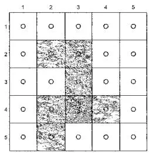

(a) $\pi_0$ 和 $v_{\pi_0}$

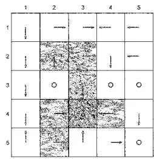
(b) $\pi_1$ 和 $v_{\pi_1}$

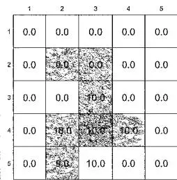

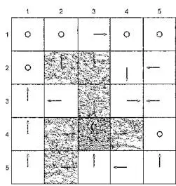

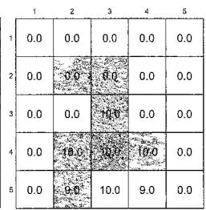

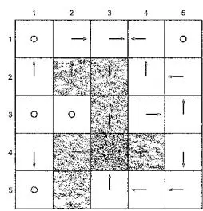

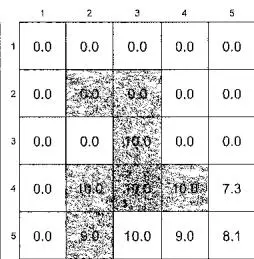

(c) $\pi_2$ 和 $v_{\pi_2}$
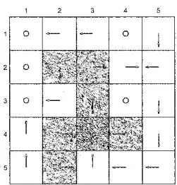

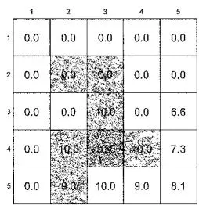

(d) $\pi_3$ 和 $v_{\pi_3}$
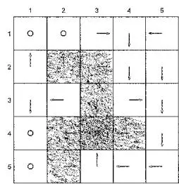
(e) $\pi_4$ 和 $v_{\pi_4}$

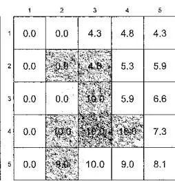
(f) $\pi_5$ 和 $v_{\pi_5}$

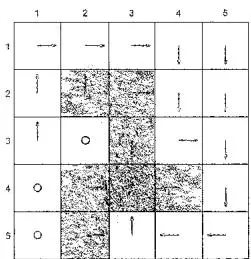

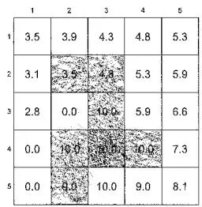
(g) $\pi_9$ 和 $v_{\pi_9}$

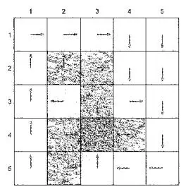

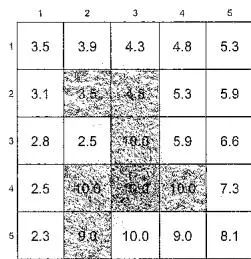
(h) $\pi_{10}$ 和 $v_{\pi_{10}}$
图4.4 策略迭代算法在不同次迭代中得到的策略。

\- 第一步：策略评价（policy evaluation，PE）。根据策略 $\pi_{k}$ ，求解下面的贝尔曼方程从而得到 $v_{\pi_k}$ ：

$$
v_{\pi_{k}} = r_{\pi_{k}} + \gamma P_{\pi_{k}} v_{\pi_{k}}.
$$

\- 第二步：策略改进（policy improvement, PI）。根据上一步得到的 $v_{\pi_k}$ ，求解下

面的优化问题从而得到新策略 $\pi_{k + 1}$

$$
\pi_{k + 1} = \arg \max_{\pi} (r_{\pi} + \gamma P_{\pi} v_{\pi_{k}}).
$$

◇ 值迭代算法：选择任意的初始值 $v_{0}$ 。在第 k 次迭代中，执行以下两个步骤。

\- 第一步：策略更新（policy update，PU）。根据 $v_{k}$ ，求解下面的优化问题从而得到新策略 $\pi_{k+1}$ ：

$$
\pi_{k + 1} = \arg \max_{\pi} (r_{\pi} + \gamma P_{\pi} v_{k}).
$$

\- 第二步：值更新（value update，VU）。根据 $\pi_{k + 1}$ ，利用下式计算出新的值 $v_{k + 1}$

$$
v_{k + 1} = r_{\pi_{k + 1}} + \gamma P_{\pi_{k + 1}} v_{k}.
$$

上面介绍的两个算法的步骤可以直观地展示如下：

$$
\begin{array}{r l} & {\text{策略迭代算法:} \pi_{0} \xrightarrow{P E} v_{\pi_{0}} \xrightarrow{P I} \pi_{1} \xrightarrow{P E} v_{\pi_{1}} \xrightarrow{P I} \pi_{2} \xrightarrow{P E} v_{\pi_{2}} \xrightarrow{P I} \dots} \\ & {\text{值迭代算法:} \quad v_{0} \xrightarrow{P U} \pi_{1} ^{\prime} \xrightarrow{V U} v_{1} \xrightarrow{P U} \pi_{2} ^{\prime} \xrightarrow{V U} v_{2} \xrightarrow{P U} \dots} \end{array}
$$

乍一看这两个算法几乎一样，下面介绍它们的重要区别。为了比较这两个算法，我们让它们从相同的初始条件开始，即选择 $v_{0}=v_{\pi_{0}}$ （如果不从相同的初始条件开始，则无法定量比较）。这两个算法的后续步骤如表4.6所示。在前三个步骤中，这两个算法产生的结果是完全相同的。从第四步开始，它们开始表现出不同。具体来说，在第四步，值迭代算法计算了 $v_{1}=r_{\pi_{1}}+\gamma P_{\pi_{1}}v_{0}$ ，这是仅需一步的计算；相比之下，策略迭代算法则需要求解方程 $v_{\pi_{1}}=r_{\pi_{1}}+\gamma P_{\pi_{1}}v_{\pi_{1}}$ ，而这是需要多次迭代的计算。

表 4.6 策略迭代和值迭代算法的步骤对比。

针对关键的第四步，下面详细写出策略迭代算法在该步求解 $v_{\pi_1} = r_{\pi_1} + \gamma P_{\pi_1}v_{\pi_1}$ 的过程。这里选取初值为 $v_{\pi_1}^{(0)} = v_0$ ，后续的迭代过程如下所示：

$$
\begin{array}{r l} & {{v_{\pi_{1}} ^{(0)} = v_{0}}} \\ {{\mathrm{值迭代算法} \leftarrow v_{1} \longleftarrow}} & {{v_{\pi_{1}} ^{(1)} = r_{\pi_{1}} + \gamma P_{\pi_{1}} v_{\pi_{1}} ^{(0)}}} \end{array}
$$

$$
v_{\pi_{1}} ^{(2)} = r_{\pi_{1}} + \gamma P_{\pi_{1}} v_{\pi_{1}} ^{(1)}
$$

截断策略迭代算法 $\leftarrow \bar{v}_1\gets -\quad v_{\pi_1}^{(j)} = r_{\pi_1} + \gamma P_{\pi_1}v_{\pi_1}^{(j - 1)}$

$$
\text{策略迭代算法} \leftarrow v_{\pi_{1}} \longleftarrow v_{\pi_{1}} ^{(\infty)} = r_{\pi_{1}} + \gamma P_{\pi_{1}} v_{\pi_{1}} ^{(\infty)}
$$

从上面的迭代过程可以得到以下结论。

如果迭代运行一次，那么 $v_{\pi_1}^{(1)}$ 等于 $v_{1}$ ，这与值迭代算法相同。

◇ 如果迭代运行无限次，那么 $v_{\pi_{1}}^{(\infty)}$ 等于 $v_{\pi_{1}}$ ，这与策略迭代算法相同。

如果迭代运行有限次（例如 $j_{\mathrm{truncate}}$ 次），那么这种算法被称为截断策略迭代。之所以称为截断，是因为从 $j_{\mathrm{truncate}}$ 到 $\infty$ 的后续迭代被省略了。

由此可知一个重要结论：值迭代和策略迭代算法可以被视为截断策略迭代算法的两个极端情况。如果在 $j_{\mathrm{truncate}} = 1$ 次迭代后停止，截断策略迭代就变成了值迭代；如果在 $j_{\mathrm{truncate}} = \infty$ 次迭代后停止，截断策略迭代就变成了策略迭代。

需要注意的是，尽管上述比较具有启发性，但需要 $v_{0} = v_{\pi_0}$ 和 $v_{\pi_1}^{(0)} = v_0$ 这两个条件。如果没有这两个条件，这两个算法是不能直接量化比较的。

### 4.3.2 截断策略迭代算法

截断策略迭代算法的伪代码参见算法4.3，它与前面介绍的策略迭代算法的唯一区别在于它在策略评价步骤中只运行了有限次迭代。

值得注意的是，算法中的 $v_{k}$ 或 $v_{k}^{(j)}$ 并非状态值，这是因为在策略评价步骤中后面的迭代被截断了，所以它们只是对状态值的近似。有的读者可能会问：这种截断是否会影响算法的收敛性？从直观上来说，截断策略迭代是介于值迭代和策略迭代之间的算法（图4.5）。一方面，它比值迭代算法收敛得更快，因为它在策略评价中计算了多次迭代（而非一次）；另一方面，它比策略迭代算法收敛得更慢，因为它只计算了有限次迭代（而非无穷次）。这种直观与下面的数学分析是一致的。

命题4.1 在截断策略迭代算法中，嵌套在其策略评价步骤中的迭代算法为

$$
v_{\pi_{k}} ^{(j + 1)} = r_{\pi_{k}} + \gamma P_{\pi_{k}} v_{\pi_{k}} ^{(j)}, \quad j = 0, 1, 2, \dots
$$

如果初始值选为 $v_{\pi_k}^{(0)} = v_{\pi_{k - 1}}$ ，则对于 $j = 0,1,2,\ldots$ 有

$$
v_{\pi_{k}} ^{(j + 1)} \geqslant v_{\pi_{k}} ^{(j)}.
$$

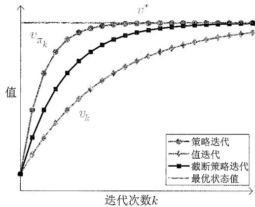
图 4.5 值迭代、策略迭代、截断策略迭代算法收敛速度示意图。

算法4.3：截断策略迭代算法
初始化：已知模型，即任意 $(s,a)$ 对应的 $p(r|s,a)$ 和 $p(s'|s,a)$ 。初始策略 $\pi_{0}$ 。
目标：寻找最优状态值和最优策略。
当 $v_{k}$ 未收敛时，进行第k次迭代
策略评价：
选择初始值为 $v_{k}^{(0)}=v_{k-1}$ 。设置最大迭代次数为 $j_{truncate}$ 。
当 $j&lt;j_{truncate}$ 时
对每一个状态 $s\in S$ $v_{k}^{(j+1)}(s)=\sum_{a}\pi_{k}(a|s)\left[\sum_{r}p(r|s,a)r+\gamma\sum_{s'}p(s'|s,a)v_{k}^{(j)}(s')\right]$
令 $v_{k}=v_{k}^{(j_{truncate})}$
策略改进：
对每一个状态 $s\in S$
对每一个动作 $a\in\mathcal{A}(s)$ $q_{k}(s,a)=\sum_{r}p(r|s,a)r+\gamma\sum_{s'}p(s'|s,a)v_{k}(s')$ $a_{k}^{*}(s)=\arg\max_{a}q_{k}(s,a)$ $\pi_{k+1}(a|s)=1$ 如果 $a=a_{k}^{*}$ ; 否则 $\pi_{k+1}(a|s)=0$

命题4.1表明了在策略评价步骤中，进行的迭代次数越多，值被提升得越多。该命题需要条件 $v_{\pi_k}^{(0)} = v_{\pi_{k-1}}$ 。虽然这一条件在实际中无法满足（因为无法获得 $v_{\pi_{k-1}}$ 而只能得到 $v_{k-1}$ ），但是命题4.1仍然对截断策略迭代算法的收敛性提供了启发，更多信息可参见[2,第6.5节]。


方框4.3：证明命题4.1

第一，因为 $v_{\pi_k}^{(j)} = r_{\pi_k} + \gamma P_{\pi_k}v_{\pi_k}^{(j - 1)}$ 且 $v_{\pi_k}^{(j + 1)} = r_{\pi_k} + \gamma P_{\pi_k}v_{\pi_k}^{(j)}$ ，所以有

$$
v_{\pi_{k}} ^{(j + 1)} - v_{\pi_{k}} ^{(j)} = \gamma P_{\pi_{k}} (v_{\pi_{k}} ^{(j)} - v_{\pi_{k}} ^{(j - 1)}) = \dots = \gamma^{j} P_{\pi_{k}} ^{j} (v_{\pi_{k}} ^{(1)} - v_{\pi_{k}} ^{(0)}).\tag{4.5}
$$

第二，因为 $v_{\pi_k}^{(0)} = v_{\pi_{k - 1}}$ ，所以有

$$
v_{\pi_{k}} ^{(1)} = r_{\pi_{k}} + \gamma P_{\pi_{k}} v_{\pi_{k}} ^{(0)} = r_{\pi_{k}} + \gamma P_{\pi_{k}} v_{\pi_{k - 1}} \geqslant r_{\pi_{k - 1}} + \gamma P_{\pi_{k - 1}} v_{\pi_{k - 1}} = v_{\pi_{k - 1}} = v_{\pi_{k}} ^{(0)},
$$

其中的不等号是因为 $\pi_{k} = \arg \max_{\pi}(r_{\pi} + \gamma P_{\pi}v_{\pi_{k - 1}})$ 。将 $v_{\pi_k}^{(1)}\geqslant v_{\pi_k}^{(0)}$ 代入(4.5)可得 $v_{\pi_k}^{(j + 1)}\geqslant v_{\pi_k}^{(j)}$ 。


到目前为止，截断策略迭代算法的优势已经明确。与策略迭代算法相比，它在策略评价步骤中仅需要有限次迭代（而非无限次），因此计算效率更高。与值迭代算法相比，它在策略评价步骤中运行了多次迭代（而非一次），因此可以得到更好的估计值。

## 4.4 总结

本章在全书中第一次介绍了可以得到最优策略的三个算法。

◇ 第一，值迭代算法。该算法就是求解贝尔曼最优方程的算法，它的每次迭代包含两个步骤：值更新和策略更新。

◇ 第二，策略迭代算法。该算法每次迭代也包含两个步骤：策略评价和策略改进。

◇ 第三，截断策略迭代算法。值迭代和策略迭代算法可以被视为截断策略迭代的两个极端情况。

这三种算法的共同特点是每一轮迭代都包含两个步骤：一个是关于值的更新，另一个是关于策略的更新。在值和策略之间不断切换的思想在强化学习算法中非常普遍，这种理念也被称为广义策略迭代（generalized policy iteration）[3]。

最后，本章介绍的算法需要事先知道系统模型。从下一章开始，我们将学习无需模型的强化学习算法，届时我们将看到无模型的算法可以通过对本章介绍的有模型的算法进行简单修改得到，因此本章的内容十分重要。

## 4.5 问答

◇ 提问：值迭代算法是否能确保得到最优策略？

回答：是的，这是因为值迭代算法正是上一章给出的求解贝尔曼最优方程的算法，该算法的收敛性可以由压缩映射定理保证。

◇ 提问：值迭代算法迭代过程中生成的值是状态值吗？

回答：不是，这些值并不能确保满足任何一个贝尔曼方程。

◇ 提问：策略迭代算法包含哪些步骤？

回答：策略迭代算法的每一次迭代包含两个步骤：策略评价和策略改进。在策略评价步骤中，算法求解贝尔曼方程从而得到策略的状态值。在策略改进步骤中，算法改进策略从而使得新策略选择最大价值动作。

◇ 提问：在策略迭代算法中是否嵌入了另一种迭代算法？

回答：是的。在其策略评价步骤中，需要使用另一个迭代算法来求解当前策略对应的贝尔曼方程。

◇ 提问：策略迭代算法在迭代过程中生成的值是状态值吗？

回答：是的，因为这些值是当前策略对应的贝尔曼方程的解。

◇ 提问：策略迭代算法是否一定能找到最优策略？

回答：是的。本章给出了其收敛性的严格证明。

◇ 提问：截断策略迭代算法与策略迭代算法之间的关系是什么？

回答：顾名思义，截断策略迭代算法在策略评价步骤中仅执行有限次迭代，而策略迭代算法则需要执行无穷步。

◇ 提问：截断策略迭代算法与值迭代算法之间的关系是什么？

回答：值迭代算法可以看作截断策略迭代算法的特殊情况，它在策略评价步骤中只进行一次迭代。

◇ 提问：截断策略迭代算法在迭代过程中生成的值是状态值吗？

回答：不是。在理论上，只有在策略评价步骤中运行无限次迭代，才能得到真正的状态值。如果只运行了有限次迭代，则只能得到真正状态值的近似值。

提问：当使用截断策略迭代算法时，在策略评价步骤中究竟应该运行多少次迭代？回答：一般建议运行几次，因为少量迭代可以得到更准确的状态值估计，从而加快整体收敛速度。然而，过多的迭代不会显著提高状态值估计精度，反而会带来更多的计算量。

◇ 提问：什么是广义策略迭代？

回答：广义策略迭代不是一个特定的算法，而是指算法在值和策略之间不断切换的思路，这个思路来源于策略迭代算法。本书介绍的强化学习算法都属于广义策略迭代的范畴。

◇ 提问：什么是基于模型的和无需模型的强化学习？

回答：虽然本章介绍的算法可以得到最优策略，但是由于它们需要系统模型，因此通常被称为动态规划算法。强化学习算法可以分为两类：基于模型的和无需模型的。这里的“基于模型”与本章介绍的“需要模型”略有不同：基于模型的强化学习往往特指利用数据估计系统模型，并在学习过程中使用这个模型。相比之下，无模型强化学习在学习过程中不估计模型。更多关于基于模型的强化学习的信息可以参考[13-16]。

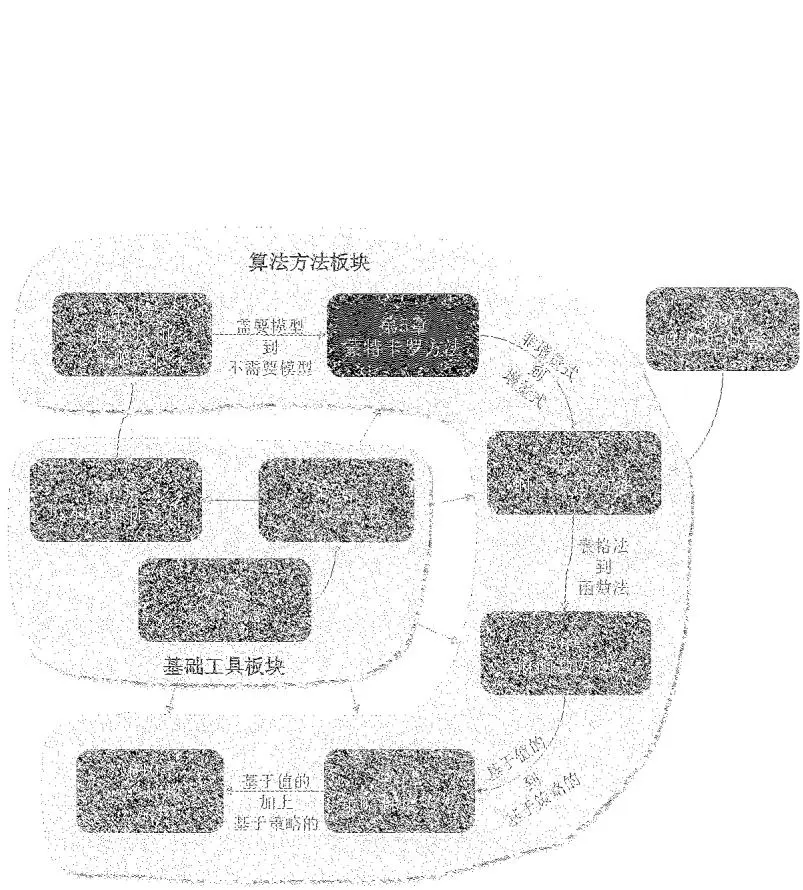
图 5.1 本章在全书中的位置。

上一章介绍了基于系统模型求解最优策略的算法，本章将介绍无需模型（model-free）的强化学习算法。如何在没有模型的情况下找到最优策略？实际上，其思路很简单：如果没有模型，则必须有数据；如果没有数据，则必须要有模型；如果两者都没有，那么就无法找到最优策略。在强化学习中，“数据”通常指的是智能体与环境交互的经验。

在本章中，我们首先介绍一个期望值估计的例子，理解这个例子对于理解“从数据中学习”的基本思想至关重要。接着，我们将介绍基于蒙特卡罗方法的三种强化学习算法。这些算法能够从数据中学习到最优策略。第一个也是最简单的算法被称为MC Basic，该算法可以通过修改上一章介绍的策略迭代算法得到。理解MC Basic算法对于掌握基于蒙特卡罗的强化学习非常重要。通过进一步扩展这个算法，我们可以得到另外两个更复杂但更高效的算法。
