# 第5章 · 蒙特卡罗方法

## 5.1 启发示例：期望值估计

接下来我们将通过例子来展示如何利用蒙特卡罗（Monte Carlo，MC）方法来解决一个期望值估计问题。蒙特卡罗方法是使用随机样本解决估计问题的一种通用方法。读者可能会问我们为什么要关心“期望值估计”这个问题，这是因为状态值和动作值的定义都是期望值，所以估计状态值或动作值实际上是期望值估计问题。通过本节，我们将知道如何使用“数据而非模型”来估计期望值。

考虑一个随机变量 $X$ ，它可以在一个有限的实数集合内取值，令该集合为 $\mathcal{X}$ 。我们的目标是计算 $X$ 的期望值 $\mathbb{E}[X]$ ，有两种计算 $\mathbb{E}[X]$ 的方法。

◇ 第一种方法是基于模型的。这里的模型指的是 X 的概率分布。如果模型已知，那么期望值可以根据其定义直接计算得到：

$$
\mathbb{E} [ X ] = \sum_{x \in \mathcal{X}} p (x) x.
$$

第二种方法是无模型的。当 $X$ 的概率分布（即模型）未知时，如果我们有一些 $X$ 的样本 $\{x_{1}, x_{2}, \ldots, x_{n}\}$ ，那么这些样本可以被用于估计期望值：

$$
\mathbb{E} [ X ] \approx \bar{x} = \frac{1}{n} \sum_{j = 1} ^{n} x_{j}.
$$

当 $n$ 很小时，这种近似可能不够准确。然而，随着 $n$ 的增大，近似会变得越来越准确。当 $n \to \infty$ 时，我们有 $\bar{x} \to \mathbb{E}[X]$ 。这实际上就是大数定律（Law of large numbers），详情参见方框5.1。



对于一个随机变量 $X$ ，假设 $\{x_{i}\}_{i = 1}^{n}$ 是独立同分布的样本。设 $\bar{x} = \sum_{i = 1}^{n}x_{i} / n$ 为样本的平均值。那么有

$$
\mathbb{E} [ \bar{x} ] = \mathbb{E} [ X ],
$$

$$
\operatorname{var} [ \bar{x} ] = \frac{1}{n} \operatorname{var} [ X ].
$$

由上面两式可知： $\bar{x}$ 是 $\mathbb{E}[X]$ 的无偏估计，并且随着 $n$ 增加到无穷大，其方差会减小到零，这就是大数定律（Law of large numbers）。为什么上面两式成立？以下是证明。

第一， $\mathbb{E}[x] = \mathbb{E}\left[\sum_{i=1}^{n} x_i / n\right] = \sum_{i=1}^{n} \mathbb{E}[x_i] / n = \mathbb{E}[X]$ ，其中最后一个等号成立是因为样本是同分布的，即 $\mathbb{E}[x_i] = \mathbb{E}[X]$ 。

第二，我们有 $\operatorname{var}(\bar{x}) = \operatorname{var}\left[\sum_{i=1}^{n} x_i / n\right] = \sum_{i=1}^{n} \operatorname{var}[x_i] / n^2 = (n\operatorname{var}[X]) / n^2 = \operatorname{var}[X] / n$ ，其中第二个等号成立是因为样本是独立的，第三个等号是因为样本是同分布的，即 $\operatorname{var}[x_i] = \operatorname{var}[X]$ 。



下面通过投掷硬币的例子来解释上面两种方法。在投掷硬币的游戏中，令随机变量 X 表示硬币最后朝上的那一面。X 有两个可能的值：当正面朝上时，X = 1；当反面朝上时，X = -1。假设 X 的真实概率分布（即模型）是

$$
p (X = 1) = 0. 5, \quad p (X = - 1) = 0. 5.
$$

如果这个概率分布是已知的，我们可以直接用定义来计算期望值：

$$
\mathbb{E} [ X ] = 0. 5 \cdot 1 + 0. 5 \cdot (- 1) = 0.
$$

如果这个概率分布是未知的，那么我们可以多次投掷硬币并记录采样结果 $\{x_{i}\}_{i = 1}^{n}$ 。通过计算这些样本的平均值，可以得到期望值的估计。随着样本数量的增加，估计的期望值将变得越来越准确（参见图5.2）。

值得指出的是，用于期望值估计的样本必须是独立同分布（independent and identically distributed, i.i.d. 或 iid），否则可能无法正确估计期望值。例如，假设所有样本与第一个样本强相关，一个极端的情况是所有样本与第一个样本完全相同，此时无论我们使用多少样本，样本的平均值总是等于第一个样本值，而无法接近真实的期望值。

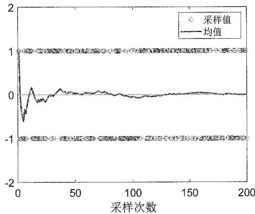
图5.2 用于展示大数定律的例子。这里样本是从 $\{+1, -1\}$ 中按照均匀分布抽取的。随着样本数量的增加，样本的平均值逐渐收敛于0，即真实的期望值。

## 5.2 MC Basic: 最简单的基于蒙特卡罗的算法

本节将介绍第一个基于蒙特卡罗的强化学习算法。第一，这个算法很简单，它可以通过修改上一章介绍的策略迭代算法得到，即将其中的基于模型的策略评价模块替换为一个无需模型的策略评价模块；第二，这个算法很重要，它可以很好地帮助我们理解究竟怎么用数据代替模型来实现强化学习，它也是本章后续算法的直接基础。

### 5.2.1 将策略迭代算法转换为无需模型

蒙特卡罗方法是以策略迭代算法为基础的，后者已经在第4.2节有过详细介绍，这里不再赘述。

策略迭代算法的每次迭代有两个步骤。第一步是策略评估，旨在通过求解贝尔曼方程 $v_{\pi_k} = r_{\pi_k} + \gamma P_{\pi_k}v_{\pi_k}$ 以得到 $v_{\pi_k}$ ；第二步是策略改进，旨在计算贪婪策略 $\pi_{k+1} = \arg \max_{\pi}(r_{\pi} + \gamma P_{\pi}v_{\pi_k})$ 以得到一个更好的策略。具体来说，策略改进步骤的元素展开形式是

$$
\begin{array}{r l} & {\pi_{k + 1} (s) = \arg \max_{\pi} \sum_{a} \pi (a | s) \left[ \sum_{r} p (r | s, a) r + \gamma \sum_{s^{\prime}} p (s^{\prime} | s, a) v_{\pi_{k}} (s^{\prime}) \right]} \\ & {\qquad = \arg \max_{\pi} \sum_{a} \pi (a | s) q_{\pi_{k}} (s, a), \quad s \in \mathcal{S}.} \end{array}
$$

从上式能看出，动作值 $q_{\pi_k}(s,a)$ 是策略迭代算法的核心：第一步策略评估就是在计算状态值进而得到动作值；第二步策略改进就是选取动作值最大的动作作为新策略。

在明白动作值的核心作用之后，让我们重新审视计算动作值的方法，实际上有两种方法。

◇ 第一，基于模型的方法。首先求解贝尔曼方程得到状态值 $v_{\pi_{k}}$ ，然后基于下式得到动作值 $q_{\pi_{k}}(s, a)$ :

$$
q_{\pi_{k}} (s, a) = \sum_{r} p (r | s, a) r + \gamma \sum_{s^{\prime}} p (s^{\prime} | s, a) v_{\pi_{k}} (s^{\prime}).\tag{5.1}
$$

这种方法需要知道模型 $\{p(r|s,a), p(s'|s,a)\}$ 。策略迭代算法采用的就是这种方法。第二，无需模型的方法。让我们回忆一下动作价值的原始定义：

$$
\begin{array}{r l} & q_{\pi_{k}} (s, a) = \mathbb{E} [ G_{t} | S_{t} = s, A_{t} = a ] \\ & \qquad = \mathbb{E} [ R_{t + 1} + \gamma R_{t + 2} + \gamma^{2} R_{t + 3} + \dots | S_{t} = s, A_{t} = a ], \end{array}
$$

值得注意的是，因为 $q_{\pi_k}(s,a)$ 是一个期望值，所以可以通过蒙特卡罗方法用数据来估计。具体怎么做呢？从 $(s,a)$ 开始，智能体可以执行策略 $\pi_k$ ，进而获得 $n$ 个回合，假设第 $i$ 个回合的回报是 $g_{\pi_k}^{(i)}(s,a)$ 。那么，这些回合的回报的平均值可以用来近似 $q_{\pi_k}(s,a)$ ，即

$$
q_{\pi_{k}} (s, a) = \mathbb{E} [ G_{t} | S_{t} = s, A_{t} = a ] \approx \frac{1}{n} \sum_{i = 1} ^{n} g_{\pi_{k}} ^{(i)} (s, a).\tag{5.2}
$$

根据大数定律，如果 $n$ 足够大，上面的近似将会足够精确。

基于蒙特卡罗的强化学习的基本思想就是使用(5.2)来估计动作值，从而代替策略迭代算法中需要模型的模块。

### 5.2.2 MC Basic算法

有了上一节的准备，下面介绍 MC Basic 算法。

从初始策略 $\pi_0$ 开始，该算法在第 $k$ 次迭代（ $k = 0,1,2,\ldots$ ）中有两个步骤。

$\diamond$ 步骤1：策略评估。这一步用于估算所有 $(s,a)$ 的 $q_{\pi_k}(s,a)$ 。具体来说，对于每个 $(s,a)$ ，收集足够多的回合进而求其回报的平均值（记作 $q_{k}(s,a)$ ）来近似 $q_{\pi_k}(s,a)$ 。 $\diamond$ 步骤2：策略改进。这一步通过 $\pi_{k + 1}(s) = \arg \max_{\pi}\sum_{a}\pi (a|s)q_{k}(s,a)$ 得到所有 $s\in$ $\mathcal{S}$ 的新策略，即 $\pi_{k + 1}(a_k^* |s) = 1$ ，其中 $a_{k}^{*} = \arg \max_{a}q_{k}(s,a)$

MC Basic算法的伪代码在算法5.1中给出，它与策略迭代算法非常相似，唯一的区别在于它是利用经验样本估计动作值的，而策略迭代算法需要用模型先计算状态值再计算动作值。值得指出的是，MC Basic算法是直接估计动作值，而不是像策略迭代算法一样先估计状态值再估计动作值。否则，如果它先估计状态值，那么仍然需要利用(5.1)将状态值转换到动作值，而(5.1)还是需要模型的。因此，MC Basic是直接估计动作值。


初始化：初始策略 $\pi_0$
目标：寻找最优策略。
对于第 $k$ 次迭代（$k = 0,1,2,\ldots$）对于每个状态 $s\in S$ 对于每个动作 $a\in \mathcal{A}(s)$ 执行 $\pi_k$ 收集从 $(s,a)$ 开始的足够多的回合策略评估：$q_{\pi_k}(s,a)\approx q_k(s,a) =$ 所有从 $(s,a)$ 开始的回合的回报的平均值策略改进：$a_{k}^{*}(s) = \arg \max_{a}q_{k}(s,a)$ 如果 $a = a_{k}^{*}$，则 $\pi_{k + 1}(a|s) = 1$；否则 $\pi_{k + 1}(a|s) = 0$


由于策略迭代是收敛的，因此在给定足够样本的情况下，MC Basic算法是可以确保收敛的。也就是说，对于每一个 $(s,a)$ ，假设从 $(s,a)$ 开始有足够多的回合，那么这些回合的回报的平均值可以准确地近似 $(s,a)$ 的动作价值。实际中，通常无法对每一个 $(s,a)$ 收集足够多的回合，此时动作价值的近似可能不准确，不过该算法还是可以工作的。这与截断策略迭代或者广义策略迭代（generalized policy iteration）的思想类似：每一个动作值不需要非常准确地估计。

最后，读者在其他资料里应该看不到MC Basic这个算法，这是因为这是本书特意总结出来的一个算法，以帮助读者理解蒙特卡罗方法的核心思想。本书这么做的原因有两点。第一，MC Basic算法建立了和上一章策略迭代算法的关系，能够让读者明白为什么要先学习策略迭代算法，以及为什么要先学习基于模型的算法；第二，MC Basic算法非常“淳朴”，它没有复杂的技巧性的东西，可以直接展示无模型蒙特卡罗方法最核心的思想。不过也正因为如此，它效率是比较低的，不太实用。不过后面我们会看到通过推广MC Basic算法可以轻易地得到更复杂也更高效的算法，届时读者就会明白：很多算法最核心的思想其实是很简单的，只是添加了很多技巧性的东西让其看起来很复杂。

### 5.2.3 示例

#### 一个简单示例：算法细节

下面通过一个例子来演示MC Basic算法的细节。该例子中，奖励为 $r_{\mathrm{boundary}} = r_{\mathrm{forbidden}} = -1, r_{\mathrm{target}} = 1$ 。折扣因子为 $\gamma = 0.9$ 。初始策略 $\pi_0$ 如图5.3所示，这个初始

策略在 $s_1$ 和 $s_3$ 不是最优的。

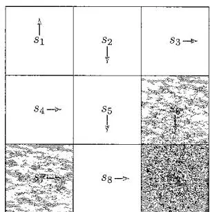
图 5.3 用于演示 MC Basic 算法的例子。

下面只展示如何得到状态 $s_1$ 对应的所有动作值，其他状态是类似的。在 $s_1$ ，有五个可能的动作 $a_1, \ldots, a_5$ 。我们需要分别从 $(s_1, a_1), (s_1, a_2), \ldots, (s_1, a_5)$ 开始执行当前策略 $\pi_0$ ，得到足够多且足够长的回合。不过因为这个示例是确定性的，多次运行将得到相同的回合，因此只需要对每个动作收集一个回合。

从 $(s_1, a_1)$ 开始，得到的回合是 $s_1 \xrightarrow{a_1} s_1 \xrightarrow{a_1} s_1 \xrightarrow{a_1} \ldots$ 。对应的动作值等于该回合的折扣回报：

$$
q_{\pi_{0}} (s_{1}, a_{1}) = - 1 + \gamma (- 1) + \gamma^{2} (- 1) + \dots = \frac{- 1}{1 - \gamma}.
$$

从 $(s_1, a_2)$ 开始，得到的回合是 $s_1 \xrightarrow{a_2} s_2 \xrightarrow{a_3} s_5 \xrightarrow{a_3} \ldots$ 。对应的动作值等于该回合的折扣回报：

$$
q_{\pi_{0}} (s_{1}, a_{2}) = 0 + \gamma 0 + \gamma^{2} 0 + \gamma^{3} (1) + \gamma^{4} (1) + \dots = \frac{\gamma^{3}}{1 - \gamma}.
$$

从 $(s_1, a_3)$ 开始，得到的回合是 $s_1 \xrightarrow{a_3} s_4 \xrightarrow{a_2} s_5 \xrightarrow{a_3} \ldots$ 。对应的动作值等于该回合的折扣回报：

$$
q_{\pi_{0}} (s_{1}, a_{3}) = 0 + \gamma 0 + \gamma^{2} 0 + \gamma^{3} (1) + \gamma^{4} (1) + \dots = \frac{\gamma^{3}}{1 - \gamma}.
$$

从 $(s_1, a_4)$ 开始，得到的回合是 $s_1 \xrightarrow{a_4} s_1 \xrightarrow{a_1} s_1 \xrightarrow{a_1} \ldots$ 。对应的动作值等于该回合的折扣回报：

$$
q_{\pi_{0}} (s_{1}, a_{4}) = - 1 + \gamma (- 1) + \gamma^{2} (- 1) + \dots = \frac{- 1}{1 - \gamma}.
$$

从 $(s_1, a_5)$ 开始，得到的回合是 $s_1 \xrightarrow{a_5} s_1 \xrightarrow{a_1} s_1 \xrightarrow{a_1} \ldots$ 。对应的动作值等于该回合的折扣回报：

$$
q_{\pi_{0}} (s_{1}, a_{5}) = 0 + \gamma (- 1) + \gamma^{2} (- 1) + \dots = \frac{- \gamma}{1 - \gamma}.
$$

通过比较上面五个动作值，我们知道

$$
q_{\pi_{0}} (s_{1}, a_{2}) = q_{\pi_{0}} (s_{1}, a_{3}) = \frac{\gamma^{3}}{1 - \gamma}
$$

相比其他动作值是最大值。因此，新的策略是选择 $a_2$ 或者 $a_3$ ：

$$
\pi_{1} (a_{2} | s_{1}) = 1 \quad{\text{或}} \quad \pi_{1} (a_{3} | s_{1}) = 1.
$$

很明显，在 $s_1$ 选择 $a_2$ 或 $a_3$ 是最优策略。因此，对这个简单例子，我们仅使用一次迭代就可以成功得到最优策略。更复杂的场景则需要更多次的迭代。

#### 一个综合示例：回合长度和稀疏奖励

下面考虑一个更复杂的例子。在这个例子中，我们不再关注算法的实施过程，而是讨论MC Basic算法得到的结果的有趣性质。该例子是一个 $5 \times 5$ 的网格世界（图5.4）。奖励设置为 $r_{\mathrm{boundary}} = -1, r_{\mathrm{forbidden}} = -10, r_{\mathrm{target}} = 1$ 。折扣因子为 $\gamma = 0.9$ 。

首先，回合的长度能极大地影响最优策略。图5.4展示了MC Basic算法在使用不同回合长度时得到的最终结果。其中状态值是通过MC Basic算法给出的动作值计算得来的。当设置的回合的长度过短时，用MC Basic算法得到的策略和价值都不是最优的（图 $5.4(a)\sim(d)$ ）。如果考虑当回合长度为1时的极端情况，此时仅与目标相邻的状态有非零值，所有其他状态的值都为0（图 $5.4(a)$ ）。这是因为每个回合太短而无法到达目标从而获得正奖励。随着回合长度的增加，得到的策略和价值逐渐接近最优（图 $5.4(h)$ ）。

其次，随着回合长度的增加，出现了一个有趣的现象：靠近目标的状态比远离目标的状态更早地拥有非零值。其原因如下：从一状态出发，智能体必须行走一定的步数才能到达目标状态；如果回合的长度小于所需的最少步数，那么回报肯定是0，估计的状态值也是0。在此例中，回合长度应不少于15，即从左下角状态到达目标状态所需的最小步数，否则得到的状态值估计是0。虽然每个回合必须足够长，但也不需要无限长。如图5.4(g)所示，当长度为30时，该算法已经可以找到最优策略，尽管此时价值估计还不是最优的。

上述分析涉及一个重要的奖励设计问题：稀疏奖励。稀疏奖励指的是除非到达目标状态，否则无法获得任何正奖励。稀疏奖励要求回合必须到达目标。当状态空间比较大或者系统随机性比较强时，一个回合到达目标的概率是比较低的。因此，稀疏奖励降低了学习效率。解决这个问题的一个简单方法是设计非稀疏奖励或者稠密奖励。例如，在上述网格世界中，我们可以重新设计奖励，使得智能体在靠近目标时就可以获得少量的正奖励。通过这种方式，可以在目标周围形成一个“吸引场”，从而更容易地找到目标。感兴趣的读者可以查看更多关于稀疏奖励的文献[17-19]。

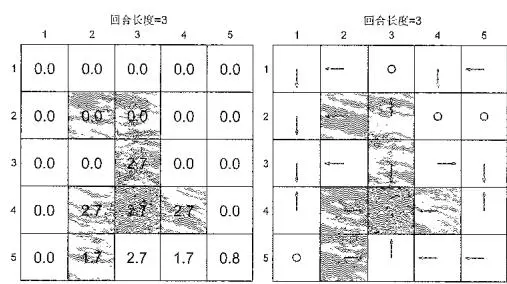

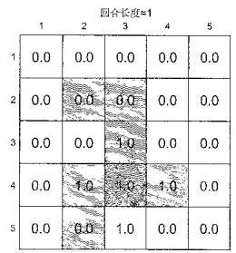

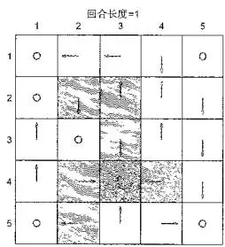
(a) 回合长度为 1 时得到的价值和策略

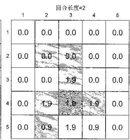

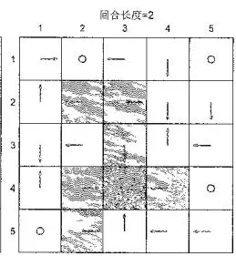
(b) 回合长度为 2 时得到的价值和策略

(c) 回合长度为 3 时得到的价值和策略
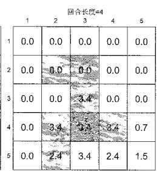

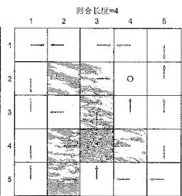
(d) 回合长度为 4 时得到的价值和策略

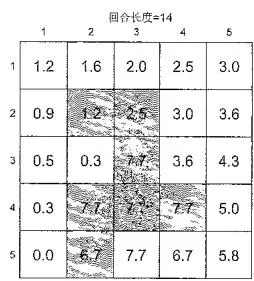

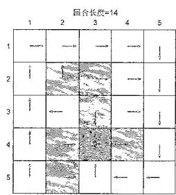
(e) 回合长度为14时得到的价值和策略

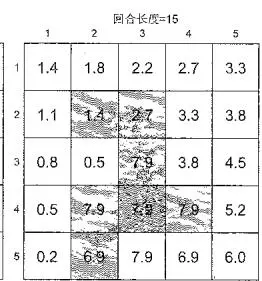

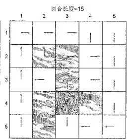
(f) 回合长度为 15 时得到的价值和策略

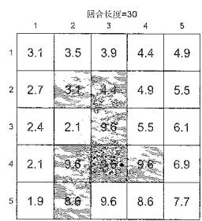

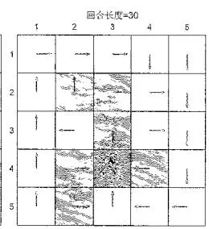
(g) 回合长度为 30 时得到的价值和策略

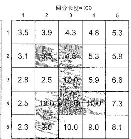

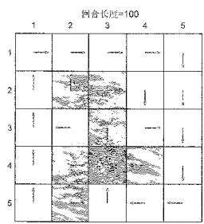
(h) 回合长度为 100 时得到的价值和策略
图5.4 当使用不同回合长度时，MC Basic算法得到的策略和价值。

## 5.3 MC Exploring Starts算法

下面通过推广 MC Basic 算法来介绍另一个基于蒙特卡罗的强化学习算法：MC Exploring Starts。这个算法稍微复杂一些，但它的效率更高。

### 5.3.1 更高效地利用样本

假设我们通过执行策略 $\pi$ 获得了一系列样本：

$$
s_{1} \xrightarrow{a_{2}} s_{2} \xrightarrow{a_{4}} s_{1} \xrightarrow{a_{2}} s_{2} \xrightarrow{a_{3}} s_{5} \xrightarrow{a_{1}} \dots\tag{5.3}
$$

上式中 s 和 a 的下标指的是状态和动作的索引，而不是时间步数。如果一个状态-动作配对在一个回合中出现了一次，那么我们称该状态-动作被访问（visit）一次。有多种方法来利用这些访问。

第一种也是最简单的方法是：一个回合仅用于估计该回合最开始访问的状态-动作的价值。例如在式(5.3)中，这个回合最开始访问的是 $(s_1, a_2)$ ，那么回合只是被用来估计 $(s_1, a_2)$ 的动作价值。前面介绍的MC Basic的算法就是基于这种方法的。

虽然这种方法很简单，但是它没有充分利用样本，因为回合还访问了许多其他的状态-动作，例如 $(s_2, a_4), (s_2, a_3), (s_5, a_1)$ 。实际上，一个回合也可以被用于估计其他状态-动作的价值。例如，我们可以将式(5.3)中的回合分解成多个子回合：

$$
\begin{array}{r l} {s_{1} \xrightarrow{a_{2}} s_{2} \xrightarrow{a_{4}} s_{1} \xrightarrow{a_{2}} s_{2} \xrightarrow{a_{3}} s_{5} \xrightarrow{a_{1}} \ldots} & {[ \text{原始回合} ]} \\ {s_{2} \xrightarrow{a_{4}} s_{1} \xrightarrow{a_{2}} s_{2} \xrightarrow{a_{3}} s_{5} \xrightarrow{a_{1}} \ldots} & {[ \text{从} (s_{2}, a_{4}) \text{开始的子回合} ]} \\ {s_{1} \xrightarrow{a_{2}} s_{2} \xrightarrow{a_{3}} s_{5} \xrightarrow{a_{1}} \ldots} & {[ \text{从} (s_{1}, a_{2}) \text{开始的子回合} ]} \\ {s_{2} \xrightarrow{a_{3}} s_{5} \xrightarrow{a_{1}} \ldots} & {[ \text{从} (s_{2}, a_{3}) \text{开始的子回合} ]} \\ {s_{5} \xrightarrow{a_{1}} \ldots} & {[ \text{从} (s_{5}, a_{1}) \text{开始的子回合} ]} \end{array}
$$

如上式所示，一个长的回合可以被看成很多个从不同状态-动作出发的子回合，因此可以估计多个不同状态-动作的价值。通过这种方式，一个回合中的样本可以被更有效地利用。

在一个回合中，一个状态-动作可能会被多次访问。例如，在式(5.3)中的回合里， $(s_1, a_2)$ 被访问了两次。如果我们只考虑第一次访问，这种方法被称为首次访问（first visit）。例如，以第一次出现的 $(s_1, a_2)$ 为开始的子回合会被用来估计 $(s_1, a_2)$ 的动作值。如果我们考虑每一次访问，则这种方法被称为每次访问（every visit）[20]。例如，每次出现 $(s_1, a_2)$ 时，以其为开始的子回合会被用来估计其动作值。

在样本使用效率方面，每次访问都利用的方法效率是最高的。如果一个回合足够长，以至于它可以多次访问所有状态-动作，那么这一个回合就足以估计所有的状态-动作价值，此时则需要使用每次访问的方法。然而，通过这种方法获得的回报样本是相关的，因为从第二次访问开始的轨迹只是从第一次访问开始的轨迹的一部分。尽管如此，如果两次访问在轨迹中相隔很远，那么相关性也不会很强。

### 5.3.2 更高效地更新策略

除了上节介绍的高效利用样本，我们还可以更高效地更新策略。有两种更新策略的方法。

◇ 第一种方法：在策略评价步骤中，收集从某一个状态-动作开始的所有回合，然后使用所有回合的平均回报来近似动作值，进而再更新策略。

这种方法已经在 MC Basic 算法中被采用。它的一个缺点是智能体必须等到所有回合都被收集完毕后才能估计动作值。

第二种方法：在策略评价步骤中，收集从某一个状态-动作开始的单个回合，然后使用这个单个回合的回报来近似动作值，进而再立即更新策略。这样的好处是不需要等到收集完所有回合，而是可以在得到一个回合后立即更新值和策略。

由于单个回合的回报不能准确地近似相应的动作值，因此读者可能会怀疑第二种方法是否合适。实际上，这种方法的思想属于上一章介绍的广义策略迭代的范畴。也就是说，即使价值估计不够准确，我们仍然可以基于其更新策略。

### 5.3.3 算法描述

将第5.3.1节和第5.3.2节介绍的技巧融合到MC Basic算法中，我们可以得到效率更高的称为MC Exploring Starts的新算法。

算法5.2给出了MC Exploring Starts的详细流程。该算法利用了回合中的每次访问。其中有另一个提高效率的技巧：在计算从每个状态-动作开始获得的回报时，采用“回溯”的方式，即先从回合最后的状态-动作开始，慢慢推回最初的状态-动作，这样可以使算法更高效，具体细节大家可以自己体会。

MC Exploring Starts 算法有一个条件，即 Exploring Starts 条件：对每一个状态-动作，都要有足够多的回合从它出发（这里“每一个”对应了 Exploring，“出发”对应了 Starts）。只有这样，我们才能准确估计每一个状态-动作的价值，进而成功找到最优策略。否则，如果存在一个状态-动作，所有的回合都没有从它出发，那么我们无法估计出该状态-动作的价值。即使这个动作确实是最优的，但是因为它没有被访问过，所以

可能刚好被错过。


初始化：初始策略 $\pi_{0}(a|s)$ ，所有 $(s,a)$ 的初始价值 $q(s,a)$ 。Return $(s,a)=0$ 和 Number $(s,a)=0$ 适用于所有 $(s,a)$ 。

目标：寻找一个最优策略。

对每个回合

回合生成：选择一个起始状态-动作 $(s_{0},a_{0})$ （确保所有状态-动作都可能被选中，这就是 Exploring Starts 条件）。按照当前策略，生成一个长度为 T 的回合： $s_{0},a_{0},r_{1},\ldots,s_{T-1},a_{T-1},r_{T}$ 。

每个回合的初始化： $g\leftarrow0$

对回合中的每一步 $t=T-1,T-2,\ldots,0$ $g\leftarrow\gamma g+r_{t+1}$

Return $(s_{t},a_{t})\leftarrow\text{Return}(s_{t},a_{t})+g$

Number $(s_{t},a_{t})\leftarrow\text{Number}(s_{t},a_{t})+1$

策略评价：

$q(s_{t},a_{t})\leftarrow\text{Return}(s_{t},a_{t})/\text{Number}(s_{t},a_{t})$

策略改进：

对 $a=\arg\max_{a}q(s_{t},a)$ ， $\pi(a|s_{t})=1$ ；对其他 a， $\pi(a|s_{t})=0$


MC Basic 和 MC Exploring Starts 都需要 Exploring Starts 这个条件。然而，这个条件在许多应用中很难满足，因为我们难以确保有足够多的回合从每一个状态-动作出发。实际上，如果只是为了确保每一个状态-动作都被访问到，那么可以用下面介绍的软策略的方法。

## 5.4 MC $\epsilon$ -Greedy算法

下面进一步推广 MC Exploring Starts，使其不再依赖于 Exploring Starts 这个不合理的条件。为此，我们需要引入软策略 (soft policy)。如果一个策略能在任意状态下有非零概率选择任意动作，那么该策略称为软策略。给定一个软策略，即使只有一个回合，只要这个回合足够长，它就会多次访问每个状态-动作。此时，我们不再需要从不同状态-动作出发的很多回合，而 Exploring Starts 这个条件就可以避免了。

### 5.4.1 $\epsilon$ -Greedy策略

一种常见的软策略是 $\epsilon$ -Greedy 策略。具体来说，假设 $\epsilon \in [0,1]$ 。相应的 $\epsilon$ -Greedy 策略具有以下形式：

$$
\pi (a | s) = \left\{\begin{array}{l l} {1 - \frac{\epsilon}{| \mathcal{A} (s) |} (| \mathcal{A} (s) | - 1),} & {\text{对于最大价值动作}} \\ {\frac{\epsilon}{| \mathcal{A} (s) |},} & {\text{对于其他}   | \mathcal{A} (s) | - 1   \text{个动作}} \end{array} \right.
$$

其中 $|\mathcal{A}(s)|$ 表示与 $s$ 相关联的动作数量。从上式可以看出， $\epsilon$ -Greedy是随机性策略，它选择具有最大价值的动作的概率最高，而选择其他所有动作的概率都相同。在上式中，选择最大价值动作的概率始终大于选择其他动作的概率，这是因为

$$
1 - \frac{\epsilon}{| \mathcal{A} (s) |} (| \mathcal{A} (s) | - 1) = 1 - \epsilon + \frac{\epsilon}{| \mathcal{A} (s) |} \geqslant \frac{\epsilon}{| \mathcal{A} (s) |}
$$

对于任意 $\epsilon \in [0,1]$ 都成立。

当 $\epsilon = 0$ 时， $\epsilon$ -Greedy 变为普通的贪婪策略，此时策略的探索性最弱，因为只会选择最大价值动作。当 $\epsilon = 1$ 时，所有动作被选择的概率都等于 $1 / |\mathcal{A}(s)|$ ，此时策略的探索性最强。

由于 $\epsilon$ -Greedy 策略是随机性的，那么如何根据这样的策略选择动作呢？我们可以首先按照均匀分布在 $[0,1]$ 生成一个随机数 $x$ 。如果 $x \geqslant \epsilon$ ，那么选择最大价值动作；如果 $x < \epsilon$ ，那么按照相同的概率 $\frac{1}{|\mathcal{A}(s)|}$ 选择任意一个动作（此时可能再次选择到最大价值动作）。通过这种方式，选择最大价值动作的总概率是 $1 - \epsilon + \frac{\epsilon}{|\mathcal{A}(s)|}$ ，而选择任何其他动作的概率是 $\frac{\epsilon}{|\mathcal{A}(s)|}$ 。

### 5.4.2 算法描述

下面将 $\epsilon$ -Greedy 策略融合到 MC Exploring Starts 算法中，可以得到新的 MC $\epsilon$ -Greedy 算法，该算法已经不再依赖于 Exploring Starts 的条件。

为此，我们需要将MC Exploring Starts算法中的Greedy策略改为 $\epsilon$ -Greedy。具体来说，在MC Exploring Starts算法中，策略改进的步骤是选择如下的Greedy策略：

$$
\pi_{k + 1} (s) = \arg \max_{\pi \in \Pi} \sum_{a} \pi (a | s) q_{\pi_{k}} (s, a),\tag{5.4}
$$

其中 $\Pi$ 表示所有可能策略的集合。我们知道(5.4)的最优解是一个贪婪策略：

$$
\pi_{k + 1} (a | s) = \left\{\begin{array}{l l} 1, & a = a_{k} ^{*}, \\ 0, & a \neq a_{k} ^{*}, \end{array} \right.
$$

其中 $a_{k}^{*} = \arg \max_{a}q_{\pi_{k}}(s,a)$ 。

现在，策略改进步骤需要改成

$$
\pi_{k + 1} (s) = \arg \max_{\pi \in \Pi_{e}} \sum_{a} \pi (a | s) q_{\pi_{k}} (s, a),\tag{5.5}
$$

其中 $\Pi_{\epsilon}$ 表示所有 $\epsilon$ -Greedy 策略的集合，这里 $\epsilon$ 值是给定的。通过这种方式，我们强制把策略限制为 $\epsilon$ -Greedy。方程(5.5)的解不难得到：

$$
\pi_{k + 1} (a | s) = \left\{\begin{array}{l l} 1 - \frac{| \mathcal{A} (s) | - 1}{| \mathcal{A} (s) |} \epsilon , & a = a_{k} ^{*}, \\ \frac{1}{| \mathcal{A} (s) |} \epsilon , & a \neq a_{k} ^{*}, \end{array} \right.
$$

其中 $a_{k}^{*} = \arg \max_{a}q_{\pi_{k}}(s,a)$ 。

基于上述改变，我们得到了另一种称为MC $\epsilon$ -Greedy的算法。由于 $\epsilon$ -Greedy策略具有一定的探索性，这样就不需要有多个回合从每一个状态-动作出发了。算法5.3给出了其伪代码。


初始化：初始策略 $\pi_{0}(a|s)$ ，所有 $(s,a)$ 的初始值 $q(s,a)$ 。 $Return(s,a)=0$ 和Number $(s,a)=0$ 对于所有 $(s,a)$ 。 $\epsilon\in(0,1]$

目标：寻找最优策略。

对每个回合

回合生成：选择一个初始状态-动作 $(s_{0},a_{0})$ （不需要每一个状态-动作都被选到）。执行当前策略，生成长度为T的回合： $s_{0},a_{0},r_{1},\ldots,s_{T-1},a_{T-1},r_{T}$ 。

每个回合的初始化： $g\leftarrow0$

对回合的每一步 $t=T-1,T-2,\ldots,0$ $g\leftarrow\gamma g+r_{t+1}$ $Return(s_{t},a_{t})\leftarrow Return(s_{t},a_{t})+g$ $Number(s_{t},a_{t})\leftarrow Number(s_{t},a_{t})+1$

策略评估：

$q(s_{t},a_{t})\leftarrow Return(s_{t},a_{t})/Number(s_{t},a_{t})$

策略改进：

如果 $a^{*}=\arg\max_{a}q(s_{t},a)$ ，那么

$\pi(a|s_{t})=\left\{\begin{aligned}&1-\frac{|A(s_{t})|-1}{|A(s_{t})|}\epsilon,&a=a^{*}\\&\frac{1}{|A(s_{t})|}\epsilon,&a\neq a^{*}\end{aligned}\right.$


如果在策略改进步骤中将Greedy策略限制为 $\epsilon$ -Greedy策略，我们还能保证获得最优策略吗？当有足够多的样本时，算法总是能收敛到在集合 $\Pi_{\epsilon}$ 中最优的策略。不过，该策略仅在 $\Pi_{\epsilon}$ 中是最优的，而在 $\Pi$ 中可能不是最优的（ $\Pi_{\epsilon}$ 是 $\Pi$ 的一个子集）。所以，$\epsilon$ 的引入实际上是增加了策略的探索性，而牺牲了策略的最优性。不过，如果 $\epsilon$ 足够小，那么 $\Pi_{\epsilon}$ 中的最优策略与 $\Pi$ 中的最优策略是非常接近的。

### 5.4.3 示例

考虑图5.5所示的网格世界例子。这里的目标是为每个状态找到最优策略。在MC $\epsilon$ -Greedy算法的每轮迭代中，生成一个包含一百万步的回合。这里考虑仅有一个回合的极端情况，来展示单个回合也是可以得到最优策略的。设置 $r_{boundary}=r_{forbidden}=-1, r_{target}=1, \gamma=0.9$ 。

如图5.5所示，初始策略是一个均匀策略，即选取任何动作的概率都是0.2。 $\epsilon=0.5$ 的最优 $\epsilon$ -Greedy策略可以在两轮迭代后获得。尽管每轮迭代仅使用一个回合，但因为所有的状态-动作都在这个回合中访问到了，所以它们的价值可以被准确估计。

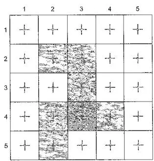
(a) 初始策略

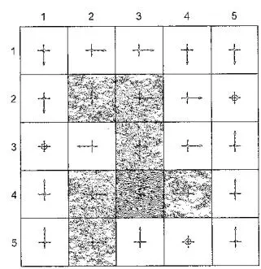
(b) 经过第一轮迭代

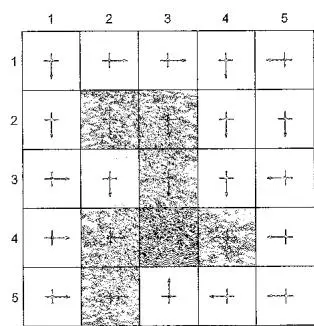
(c) 经过第二轮迭代
图5.5 基于单个回合的MC $\epsilon$ -Greedy算法给出的策略的演变过程。

## 5.5 探索与利用：以 $\epsilon$ -Greedy 策略为例

探索（exploration）与利用（exploitation）是强化学习中的一个重要权衡。“探索”意味着策略会尝试尽可能多的动作，从而使得所有动作都能被良好地评估；“利用”意味着策略会尽可能选取价值高的动作，从而充分利用当前价值评估的结果。从另一个角度来理解，“探索”是为了更好地评估，防止错过高价值的动作；“利用”是为了更好地利用评估的结果，否则难以得到最优的策略；这里“权衡”的核心在于：当前的价值评估可能是不好的，我们要通过探索更好地评估价值。如果策略具有过多的探索性，则没有很好地利用评估结果，因此也离最优策略比较远；如果策略过多地利用当前的评估结果，则具有较少的探索性，难以全面评估所有动作。

上面的解释可能比较抽象，下面结合 $\epsilon$ -Greedy策略来解释会更加直观。一方面， $\epsilon$ -Greedy策略赋予最大价值动作最高的概率，因此可以充分“利用”当前的价值估计。

另一方面， $\epsilon$ -Greedy策略也赋予其他所有动作非零的概率，因此也可以充分“探索”其他动作。 $\epsilon$ -Greedy策略通过设置合适的 $\epsilon$ 的值来平衡探索和利用： $\epsilon$ 越大，策略的探索性越强，利用性越弱； $\epsilon$ 越小，策略的探索性越弱，利用性越强。此外，“利用”与最优性（optimality）相关：如果策略“利用”得越充分，即越“贪婪”，它就越接近最优，这是因为我们已经在MC Basic算法中知道贪婪策略是最优的。 $\epsilon$ -Greedy策略的基本理念是通过牺牲最优性来增强探索。

下面通过一些有趣的例子来进一步讨论这种权衡。这里的例子是在一个 $5 \times 5$ 的网格世界。奖励设置是 $r_{\mathrm{boundary}} = -1, r_{\mathrm{forbidden}} = -10, r_{\mathrm{target}} = 1, \gamma = 0.9$ 。

### $\epsilon$ -Greedy策略的最优性

接下来展示 $\epsilon$ -Greedy 策略的最优性随着 $\epsilon$ 的变化。

☐ 图5.6给出了一系列 $\epsilon$ -Greedy 策略。这些策略有一个共同点：它们在每一个状态赋予最大概率的动作是相同的。这样的策略称为一致的（consistent）。从 (a)\~(d) 图可以看出，随着 $\epsilon$ 的增加，这些 $\epsilon$ -Greedy 策略的状态值不断下降，即最优性不断变差。这是因为当 $\epsilon$ 较大时，在每一个状态选取不合理动作的概率也变大了，因此收到的奖励变小了。

☐ 图5.7给出了一系列最优的 $\epsilon$ -Greedy 策略（这里“最优”指的是在给定 $\epsilon$ 的情况下，该策略是在 $\Pi_{\epsilon}$ 中是最优的，即相比 $\Pi_{\epsilon}$ 中其他策略有最大的状态值）。当 $\epsilon = 0$ 时，该最优策略是在所有策略的集合 $\Pi$ 中是最优的。值得注意的是，当 $\epsilon$ 比较小，例如等于 0.1 时，最优的 $\epsilon$ -Greedy 策略与最优 Greedy 策略是一致的（即最大概率动作相同）。然而，当 $\epsilon$ 增加到 0.2 时，求得的最优的 $\epsilon$ -Greedy 策略与最优 Greedy 策略不再一致。因此，如果我们想要得到与最优 Greedy 策略一致的 $\epsilon$ -Greedy 策略， $\epsilon$ 的值应该足够小。

当 $\epsilon$ 较大时，为什么最优 $\epsilon$ -Greedy 策略与最优 Greedy 策略不一致呢？我们可以以目标状态为例来直观地解释。目标状态的最优策略是保持原地不动从而获得正奖励。然而，当 $\epsilon$ 较大时，进入禁止区域进而获得负奖励的概率很大，此时在目标状态最优的策略是逃离，而不是原地不动。

### $\epsilon$ -Greedy策略的探索能力

下面讨论 $\epsilon$ 的值如何影响 $\epsilon$ -Greedy 策略的探索能力。

考虑一个 $\epsilon = 1$ 的 $\epsilon$ -Greedy 策略（图5.5(a)）。该策略在任意状态下采取任意动作的概率为0.2，具有较强的探索性。图 $5.8(\mathrm{a}) \sim (\mathrm{c})$ 给出了从 $(s_1, a_1)$ 开始由该策略生成的不同长度的轨迹。可以看到，当回合足够长时，这个回合可以多次访问所有的状态-动作，具有很强的探索能力。此外，所有状态-动作被访问的次数也接近均

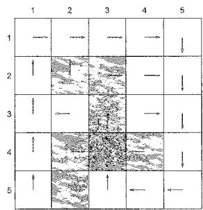

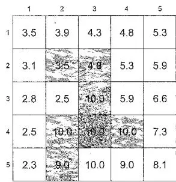
(a) 一个给定的 $\epsilon$ -Greedy 策略及其状态值： $\epsilon = 0$

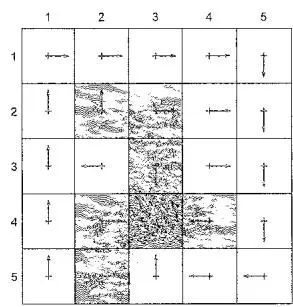

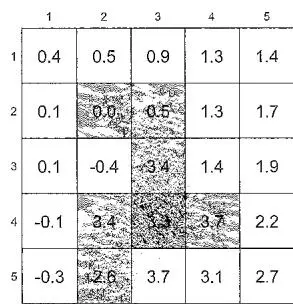
(b) 一个给定的 $\epsilon$ -Greedy 策略及其状态值: $\epsilon = 0.1$

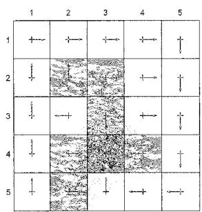

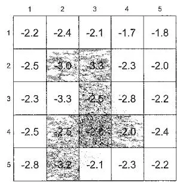
(c) 一个给定的 $\epsilon$ -Greedy 策略及其状态值： $\epsilon = 0.2$

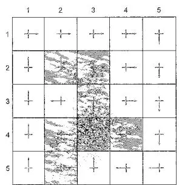

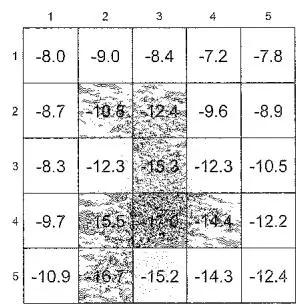
(d) 一个给定的 $\epsilon$ -Greedy 策略及其状态值: $\epsilon = 0.5$
图5.6 一些 $\epsilon$ -Greedy策略及其状态值。这些 $\epsilon$ -Greedy策略有一个共同点：它们在每一个状态赋予最大概率的动作都是一致的。从状态值可以看出，当 $\epsilon$ 的值增加时， $\epsilon$ -Greedy策略的状态值降低、最优性变差。

匀（图5.8(d)）。

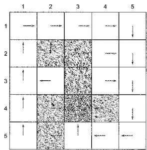

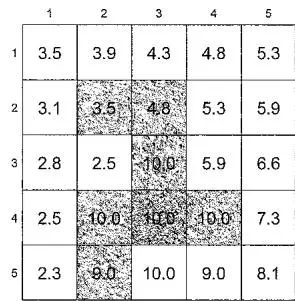
(a) 最优 $\epsilon$ -Greedy 策略及其状态值： $\epsilon = 0$

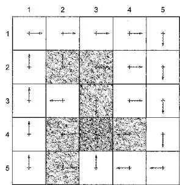

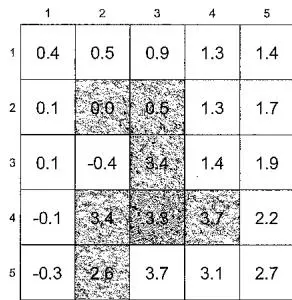
(b) 最优 $\epsilon$ -Greedy 策略及其状态值: $\epsilon = 0.1$

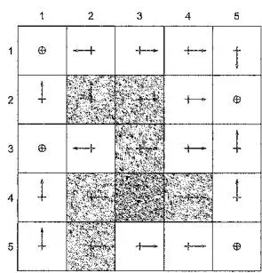

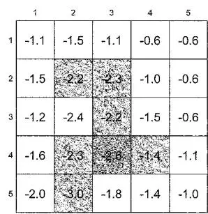
(c) 最优 $\epsilon$ -Greedy 策略及其状态值： $\epsilon = 0.2$

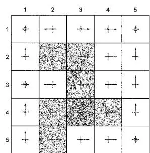

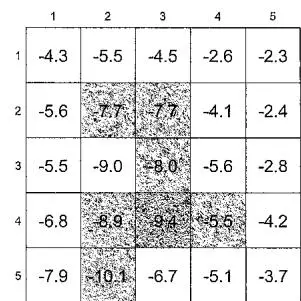
(d) 最优 $\epsilon$ -Greedy 策略及其状态值： $\epsilon = 0.5$
图5.7 给定不同的 $\epsilon$ 值，最优的 $\epsilon$ -Greedy策略及其相应的状态值。可以看到，当 $\epsilon$ 值增加时，最优的 $\epsilon$ -Greedy策略不再与(a)中的最优策略一致。

◇ 考虑一个 $\epsilon = 0.5$ 的 $\epsilon$ -Greedy 策略（图 5.6(d)）。该策略的探索能力比 $\epsilon = 1$ 时更弱。

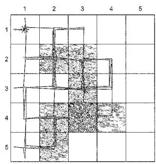
(a) $\epsilon = 1$ ：轨迹长100步

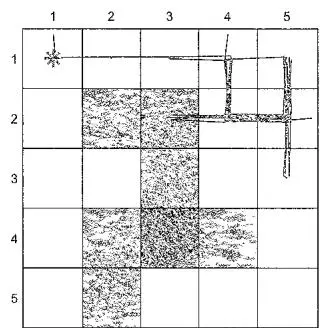
(e) $\epsilon = 0.5$ ：轨迹长100步

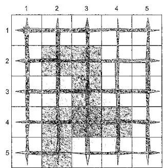

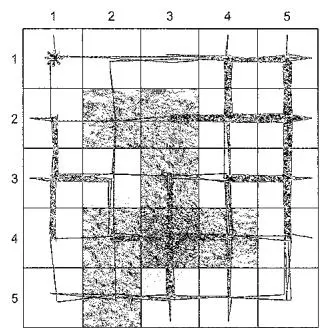
(f) $\epsilon = 0.5$ ：轨迹长1000步

(b) $\epsilon = 1$ ：轨迹长1000步
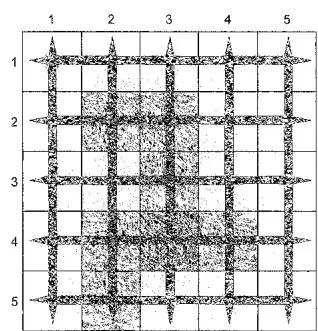
(c) $\epsilon = 1$ ：轨迹长10000步

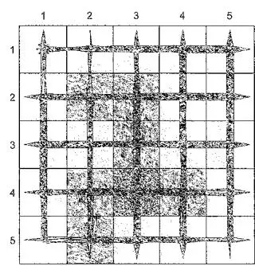
(g) $\epsilon = 0.5$ ：轨迹长10000步

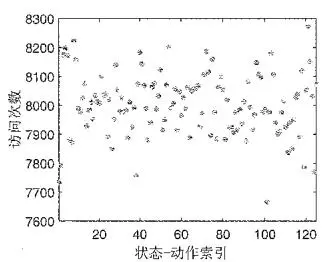
(d) $\epsilon = 1$ ：轨迹长1000000步时，不同动作被访问的次数

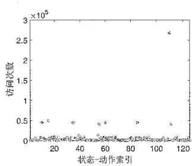
(h) $\epsilon = 0.5$ ：轨迹长1000000步时，不同动作被访问的次数
图5.8 $\epsilon$ -Greedy策略在不同 $\epsilon$ 值下的探索能力。

图5.8(e)\~(g)给出了从 $(s_{1},a_{1})$ 开始由该策略生成的不同步数的轨迹。可以看到，当轨迹比较短时，很多状态-动作并没有被访问到。虽然当轨迹足够长时每一个动作都可以被访问到，但是访问的次数可能极不均匀。例如，当轨迹有一百万步时，有些动作被访问超过250000次，而大多数动作仅被访问几百甚至几十次（图5.8(h)）。

通过对比上述两个例子可以看出，当 $\epsilon$ 减少时， $\epsilon$ -Greedy策略的探索能力减弱。使用 $\epsilon$ -Greedy策略一个常见的技巧是，初期选取较大的 $\epsilon$ 从而获得较强的探索性，末期选取较小的 $\epsilon$ 从而获得较好的最优性[21-23]。

## 5.6 总结

本章是全书中第一次介绍无需模型的强化学习算法。我们首先通过一个期望值估计的问题介绍了蒙特卡罗的思想，之后介绍了三种基于蒙特卡罗的算法。

◇ MC Basic：这是最简单的基于蒙特卡罗的强化学习算法。该算法与上一章介绍的策略迭代算法有密切关系：只要把策略迭代算法中需要模型的策略评估模块替换为无需模型的蒙特卡罗估计模块，就能得到MC Basic算法。

◇ MC Exploring Starts: 此算法是 MC Basic 算法的推广。只要将一些提高样本使用效率和更新策略效率的技巧引入 MC Basic，就能得到 MC Exploring Starts 算法。

◇ MC $\epsilon$ -Greedy：此算法是MC Exploring Starts算法的推广。只要将MC Exploring Starts算法中的策略从Greedy改为 $\epsilon$ -Greedy，就可以得到MC $\epsilon$ -Greedy算法。通过这种方式增强了策略的探索能力，因此可以移除Exploring Starts的条件。

这三个算法紧密相连，前一个是后一个的基础，后一个是前一个的推广。

在本章的最后，我们讨论了探索与利用这个重要的权衡问题，并且通过 $\epsilon$ -Greedy策略进行了直观的解读。

## 5.7 问答

◇ 提问：什么是蒙特卡罗估计？

回答：蒙特卡罗估计指的是使用随机样本来解决近似问题的一类通用方法。

◇ 提问：什么是期望值估计问题？

回答：期望值估计问题指的是使用随机样本来近似随机变量的期望值。

◇ 提问：如何解决期望值估计问题？

回答：有两种方法——基于模型的和无需模型的。如果随机变量的概率分布已知，则可以根据期望值的定义直接计算。如果随机变量的概率分布未知，但是有很多样本，则可以用样本的平均值来近似期望值。根据大数定律，样本数量越大，这种近似越准确。

◇ 提问：为什么期望值估计问题对于强化学习很重要？

回答：状态值和动作值的定义都是期望值。因此，对状态或动作价值的估计本质上是期望值估计问题。

◇ 提问：基于蒙特卡罗的无模型强化学习的核心思想是什么？

回答：其核心思想是将策略迭代算法中需要模型的模块替换成不需要模型的模块。这就是我们为什么要先学习需要模型的策略迭代算法，再学习不需要模型的蒙特卡罗算法。否则，读者可能会有很多问题，例如为什么有策略评估和策略改进步骤等问题。

◇ 提问：什么是初始访问、首次访问和每次访问？

回答：它们是利用一个回合中的样本的不同方法。一个回合可能访问许多状态-动作。初始访问方法仅使用整个回合来估计初始状态-动作的价值。相比之下，每次访问和首次访问方法可以更好地利用样本估计回合中出现的很多其他状态-动作的价值。

◇ 提问：什么是 Exploring Starts?

回答：Exploring Starts 要求从每个状态-动作开始生成足够多的回合。该条件的重要性在于，只有当每个动作都被充分访问之后，我们才能准确地评估所有动作价值，进而正确地选择最优的动作。

◇ 提问：避免 Exploring Starts 条件的基本思路是什么？

回答：基本思路是使用软策略。由于软策略是随机性的，其生成的回合理论上可以访问所有状态-动作，这样就不需要从每个状态-动作出发生成大量回合。正如我们通过例子介绍的，即使一个回合也可能充分访问每一个状态-动作。

◇ 提问：如果我们仅考虑 $\epsilon$ -Greedy 策略，还能找到最优策略吗？

回答：如果给定足够的样本，MC $\epsilon$ -Greedy算法可以收敛到 $\varPi_{\epsilon}$ 中的最优策略（即在 $\varPi_{\epsilon}$ 中具有最大的状态值）。然而，除非 $\epsilon$ 等于0，否则 $\epsilon$ -Greedy策略一般在 $\varPi$ （即所有策略的集合）中不是最优的。

◇ 提问：是否有可能使用一个回合访问所有状态-动作？

回答：这是可能的，例如使用 $\epsilon$ -Greedy 策略生成一个足够长的回合。

提问：MC Basic、MC Exploring Starts、MC $\epsilon$ -Greedy 三个算法之间的关系是什么？回答：这三个算法紧密相连，前一个是后一个的基础，后一个是前一个的推广。MC Basic 是最简单的基于蒙特卡罗的强化学习算法，它的重要性在于揭示了无模型强化学习的基本思想。MC Exploring Starts 是 MC Basic 的一个推广，具有更高的样本使用效率和策略更新效率。MC $\epsilon$ -Greedy 是 Exploring Starts 的一个推广，它通过引入 $\epsilon$ -Greedy 策略避免了 Exploring Starts 条件。

