# 第7章 · 时序差分方法

在[第5章](ch05.md)，我们介绍了全书第一类无需模型的强化学习算法：蒙特卡罗（Monte Carlo，MC）。在本章，我们将介绍全书第二类无需模型的强化学习算法：时序差分（temporal difference, TD）。与MC算法相比，TD算法最大的不同在于它是增量式的。许多读者第一次看到TD算法时会有很多疑惑，例如这些算法为什么设计成这个样子。不过在学习了[第6章](ch06.md)的随机近似算法后，相信读者能更加轻松地掌握TD算法，这是因为TD算法本质上是求解贝尔曼方程或者贝尔曼最优方程的随机近似算法。

由于本章将介绍多种TD算法，为了帮助读者更好地学习，我们首先梳理这些算法之间的关系。

◇ 第7.1节介绍最基本也是最核心的TD算法。该算法可以估计一个给定策略的状态值。掌握这个算法对于学习后面的TD算法是非常有必要的。

◇ 第7.2节介绍Sarsa算法。该算法可以估计给定策略的动作值。实际上，将第7.1节的TD算法中的状态值替换为动作值，就可以得到Sarsa算法。

◇ 第7.3节介绍 n-Step Sarsa 算法，这是Sarsa算法的一种推广。我们将会看到Sarsa算法和MC算法是n-Step Sarsa算法的两个特殊情况。

第7.4节介绍Q-learning算法，这是经典的强化学习算法之一。Q-learning算法和Sarsa算法的区别在于：Sarsa算法是在求解一个给定策略的贝尔曼方程，而Q-learning算法是直接求解贝尔曼最优方程。

◇ 第7.5节总结本章介绍的所有TD算法，并提供一个统一的描述框架。

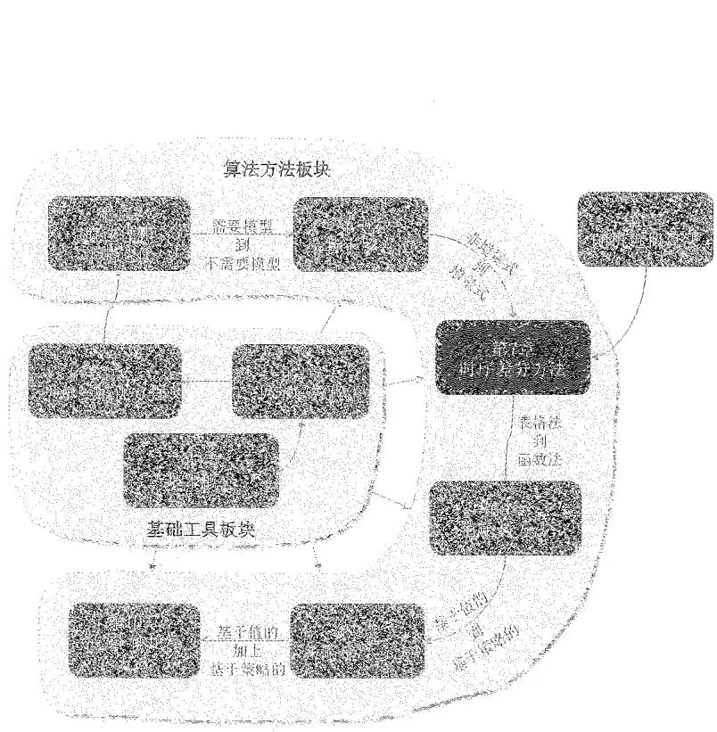
图 7.1 本章在全书中的位置。

## 7.1 状态值估计：最基础的时序差分算法

本节将介绍最基础的TD算法，它可以估计一个给定策略的状态值。后面的章节会进一步推广这个TD算法从而得到更复杂的算法，因此本节的内容非常重要。

### 7.1.1 算法描述

给定一个策略 $\pi$ ，我们的目标是估计所有 $s\in S$ 的状态值 $v_{\pi}(s)$ 。假设我们有一些由 $\pi$ 生成的经验样本 $(s_0,r_1,s_1,\ldots ,s_t,r_{t + 1},s_{t + 1},\ldots)$ ，其中 $t = 0,1,2,\ldots$ 表示采样时刻。下面的TD算法可以使用这些样本来估计状态值：

$$
v_{t + 1} (s_{t}) = v_{t} (s_{t}) - \alpha_{t} (s_{t}) \Big [ v_{t} (s_{t}) - \big (r_{t + 1} + \gamma v_{t} (s_{t + 1}) \big) \Big ],\tag{7.1}
$$

$$
v_{t + 1} (s) = v_{t} (s), \quad \text{当} s \neq s_{t},\tag{7.2}
$$

其中 $v_{t}(s_{t})$ 是在 $t$ 时刻对 $v_{\pi}(s_t)$ 的估计， $\alpha_{t}(s_{t})$ 是在 $t$ 时刻对于状态 $s_t$ 的学习率（learning rate）。

在 t 时刻，只有当时正在被访问的状态 $s_{t}$ 的估计值会被更新（如式(7.1)所示）；而所有其他未被访问的状态的估计值保持不变（如式(7.2)所示）。通常情况下，式(7.2)会被省略，但是我们应该知道该式子的存在。该式可以帮助我们更好地理解 TD 算法，如果没有这个式子，该 TD 算法在数学上也是不完整的。

许多读者在第一次看到(7.1)中的TD算法时会问为什么它要设计成这个样子？实际上，该算法是一个用于求解贝尔曼方程的随机近似算法。要理解这一点，我们首先回顾状态值的定义：

$$
v_{\pi} (s) = \mathbb{E} \left[ R_{t + 1} + \gamma G_{t + 1} | S_{t} = s \right], \quad s \in \mathcal{S}.\tag{7.3}
$$

式(7.3)可以重写为

$$
v_{\pi} (s) = \mathbb{E} \left[ R_{t + 1} + \gamma v_{\pi} \left(S_{t + 1}\right) \mid S_{t} = s \right], \quad s \in \mathcal{S}.\tag{7.4}
$$

这是因为 $\mathbb{E}[G_{t + 1}|S_t = s] = \sum_a\pi (a|s)\sum_{s'}p(s'|s,a)v_\pi (s') = \mathbb{E}[v_\pi (S_{t + 1})|S_t = s]$ 式(7.4)是贝尔曼方程的另一种表达，它有时被称为贝尔曼期望方程（Bellman expectation equation）。如果我们应用[第6章](ch06.md)介绍的罗宾斯-门罗算法来求解式(7.4)，相应的算法就是TD算法。感兴趣的读者可以参见方框7.1。



下面展示如何使用 RM 算法来求解(7.4)从而获得(7.1)中的 TD 算法。对于状态 $s_{t}$ ，定义函数：

$$
g (v_{\pi} (s_{t})) \doteq v_{\pi} (s_{t}) - \mathbb{E} \big [ R_{t + 1} + \gamma v_{\pi} (S_{t + 1}) | S_{t} = s_{t} \big ].
$$

这样式(7.4)中的贝尔曼方程可以写成

$$
g (v_{\pi} (s_{t})) = 0.
$$

我们的目标是求解上述方程来得到 $v_{\pi}(s_t)$ 。因为我们可以获取 $r_{t + 1}$ 和 $s_{t + 1}$ ，而它们是 $R_{t + 1}$ 和 $S_{t + 1}$ 的样本，所以对 $g(v_{\pi}(s_t))$ 含有噪声的观测是

$$
\begin{array}{r l} \tilde{g} (v_{\pi} (s_{t})) & = v_{\pi} (s_{t}) - \left[ r_{t + 1} + \gamma v_{\pi} (s_{t + 1}) \right] \\ & = \underbrace{\left(v_{\pi} (s_{t}) - \mathbb{E} \big [ R_{t + 1} + \gamma v_{\pi} (S_{t + 1}) | S_{t} = s_{t} \big ]\right)} _{g (v_{\pi} (s_{t}))} \end{array}
$$

$$
+ \underbrace{\left(\mathbb{E} \big [ R_{t + 1} + \gamma v_{\pi} (S_{t + 1}) | S_{t} = s_{t} \big ] - \big [ r_{t + 1} + \gamma v_{\pi} (s_{t + 1}) \big ]\right)} _{\eta}.
$$

此时用来求解 $g(v_{\pi}(s_t)) = 0$ 的RM算法是

$$
\begin{array}{l} v_{t + 1} (s_{t}) = v_{t} (s_{t}) - \alpha_{t} (s_{t}) \tilde{g} (v_{t} (s_{t})) \\ = v_{t} (s_{t}) - \alpha_{t} (s_{t}) \Big (v_{t} (s_{t}) - \big [ r_{t + 1} + \gamma v_{\pi} (s_{t + 1}) \big ] \Big), \end{array}\tag{7.5}
$$

其中 $v_{t}(s_{t})$ 是在时刻 $t$ 对 $v_{\pi}(s_t)$ 的估计，而 $\alpha_{t}(s_{t})$ 是学习率。算法(7.5)的由来可参见第6.2节，这里不再赘述。

式(7.5)与式(7.1)中的TD算法非常相似。唯一的区别是式(7.5)的右手边包含 $v_{\pi}(s_{t+1})$ ，而式(7.1)包含 $v_{t}(s_{t+1})$ 。这个区别是因为式(7.5)是在假设其他状态的状态值已知的情况下来估计 $s_{t}$ 的状态值。如果我们也想同时估计其他所有状态的状态值，则右手边的 $v_{\pi}(s_{t+1})$ 应该被替换为 $v_{t}(s_{t+1})$ 。此时，式(7.5)就与式(7.1)完全相同了。当然，读者可能会问这样的直接替换是否仍能保证收敛呢？答案是可以的，严格的证明将在定理7.1中给出。



### 7.1.2 性质分析

下面讨论TD算法(7.1)的一些重要性质。

第一，我们先介绍TD算法中每一项的含义。具体如下所示：

$$
\underbrace{v_{t + 1} (s_{t})} _{\mathrm{新的估计值}} = \underbrace{v_{t} (s_{t})} _{\mathrm{当前估计值}} - \alpha_{t} (s_{t}) \big [ \overbrace{v_{t} (s_{t}) - \big (\underbrace{r_{t + 1} + \gamma v_{t} (s_{t + 1})} _{\mathrm{TD目标}} \big)} ^{\mathrm{TD误差}} \big ],\tag{7.6}
$$

其中

$$
r_{t + 1} + \gamma v_{t} (s_{t + 1}) \doteq \bar{v} _{t}
$$

被称为TD目标（TD target），而

$$
v_{t} (s_{t}) - \left(r_{t + 1} + \gamma v_{t} (s_{t + 1})\right) = v (s_{t}) - \bar{v} _{t} \doteq \delta_{t}
$$

被称为TD误差（TD error）。显然，新的估计值 $v_{t+1}(s_t)$ 是当前估计值 $v_t(s_t)$ 和TD误差 $\delta_t$ 的组合。

◇ 为什么 $\bar{v}_{t}$ 被称为 TD 目标？

这是因为该算法在数学上就是让 $v(s_{t})$ 的值更加接近 $\bar{v}_t$ ，即 $\bar{v}_t$ 是 $v(s_t)$ 的目标值。为了理解这一点，我们在(7.6)两边同时减去 $\bar{v}_t$ 可得

$$
v_{t + 1} (s_{t}) - \bar{v} _{t} = [ v_{t} (s_{t}) - \bar{v} _{t} ] - \alpha_{t} (s_{t}) [ v_{t} (s_{t}) - \bar{v} _{t} ]
$$

$$
= \left[ 1 - \alpha_{t} (s_{t}) \right] \left[ v_{t} (s_{t}) - \bar{v} _{t} \right].
$$

上式两边取绝对值后可得

$$
| v_{t + 1} (s_{t}) - \bar{v} _{t} | = | 1 - \alpha_{t} (s_{t}) | | v_{t} (s_{t}) - \bar{v} _{t} |.
$$

如果 $\alpha_{t}(s_{t})$ 是一个足够小的正数，则有 $0 < 1 - \alpha_{t}(s_{t}) < 1$ 。因此，由上式可以推出

$$
\left| v_{t + 1} (s_{t}) - \bar{v} _{t} \right| <   \left| v_{t} (s_{t}) - \bar{v} _{t} \right|.
$$

这个不等式很清晰地说明了新的值 $v_{t+1}(s_t)$ 比旧的值 $v_{t}(s_{t})$ 更接近 $\bar{v}_{t}$ 。因此，这个算法在数学上使 $v_{t}(s_{t})$ 接近 $\bar{v}_{t}$ ，这就是为什么 $\bar{v}_{t}$ 被称为TD目标。

#### ◇ 如何理解TD误差？

TD误差被称为“TD”（时序差分）的原因是 $\delta_t = v_t(s_t) - (r_{t+1} + \gamma v_t(s_{t+1}))$ 反映了时刻 $t$ 和 $t + 1$ 之间的差异。TD误差被称为“误差”的原因是它不仅反映了两个时刻之间的差异，更重要的是反映了估计值 $v_t$ 与真实状态值 $v_\pi$ 之间的差异。如果估计值是准确的，那么TD误差在期望意义上应该等于0。为了理解这一点，当 $v_t = v_\pi$ 时，TD误差的期望值为

$$
\begin{array}{r l} & {\mathbb{E} [ \delta_{t} | S_{t} = s_{t} ] = \mathbb{E} \big [ v_{\pi} (S_{t}) - (R_{t + 1} + \gamma v_{\pi} (S_{t + 1})) | S_{t} = s_{t} \big ]} \\ & {\qquad = v_{\pi} (s_{t}) - \mathbb{E} \big [ R_{t + 1} + \gamma v_{\pi} (S_{t + 1}) | S_{t} = s_{t} \big ]} \\ & {\qquad = 0. \qquad \quad (\text{由于式(7.3)})} \end{array}
$$

从另一个角度来说，TD误差可以被理解为新息（innovation），即代表从经验样本 $(s_{t}, r_{t+1}, s_{t+1})$ 中得到的新的信息，这个新的信息可以用来纠正当前估计值，从而使其更准确。新息在很多估计方法例如卡尔曼滤波 $[33, 34]$ 中都是非常关键的量。

第二，(7.1)中的TD算法只能估计某一给定策略的状态值，而不能直接用于寻找最优策略。不过该TD算法对于理解本章其他算法非常重要。例如，我们将在第7.2节推广(7.1)从而得到能估计动作值的TD算法，进而结合策略改进步骤来得到最优策略。

第三，TD算法和MC算法都是无模型的，它们有什么不同呢？为了方便读者阅读，我们把答案总结在表7.1中。虽然这个表中有一些算法如Sarsa稍后才会介绍，但是并不影响目前的理解。

### 7.1.3 收敛性证明

式(7.1)中TD算法的收敛性分析如下。

表 7.1 TD 方法和 MC 方法的对比。

<table><tr><td>TD方法</td><td>MC方法</td></tr><tr><td>增量式:它可以在得到一个经验样本后立即更新估计值。</td><td>非增量式:它必须等到一个回合(episode)结束之后,才能用所有经验样本来更新估计值,这是因为它需要计算从某一状态到回合最后的折扣回报。</td></tr><tr><td>持续任务:由于TD算法是增量式的,因此它可以处理回合制(episodic)和持续性(continuing)的任务。</td><td>回合制任务:由于MC算法是非增量式的,因此它只能处理回合制任务,这些任务会在有限步后结束。</td></tr><tr><td>自举:TD算法依赖于自举(bootstrapping),因为状态值/动作值的更新依赖于其先前估计值。因此,TD算法需要初始值。</td><td>非自举:MC算法不是自举的,因为它可以直接估计状态值/动作值,而无需初始值。</td></tr><tr><td>低估计方差:TD算法的估计方差较低,这是因为它涉及的随机变量较少。例如,要估计动作值 $q_{\pi}(s_t,a_t)$ ,Sarsa只需要三个随机变量 $R_{t+1}$ 、 $S_{t+1}$ 、 $A_{t+1}$ 的样本。</td><td>高估计方差:MC算法的估计方差较高,这是因为它涉及许多随机变量。例如,要估计动作值 $q_{\pi}(s_t,a_t)$ ,MC算法需要 $R_{t+1}+\gamma R_{t+2}+\gamma^2 R_{t+3}+\ldots$ 的样本。假设每个回合的步数为L,并且每个状态的动作数等于 $|\mathcal{A}|$ 。那么,一个随机性的软策略可能有 $|\mathcal{A}|^L$ 种可能的轨迹。如果我们只用少数几个回合来估计,那么估计方差较高也就不足为奇了。</td></tr></table>

定理7.1 (TD算法的收敛性)。给定一个策略 $\pi$ ，基于式(7.1)中的TD算法，如果对所有 $s \in S$ 都有 $\sum_{t} \alpha_{t}(s) = \infty$ 和 $\sum_{t} \alpha_{t}^{2}(s) < \infty$ ，则 $v_{t}(s)$ 随着 $t \to \infty$ 几乎必然收敛到 $v_{\pi}(s)$ 。

在给出该定理的证明之前，我们先讨论其中关于 $\alpha_{t}$ 的条件。第一，条件 $\sum_{t} \alpha_{t}(s) = \infty$ 和 $\sum_{t} \alpha_{t}^{2}(s) < \infty$ 应该对所有 $s \in S$ 都成立。值得注意的是，在 $t$ 时刻，如果状态 $s$ 被访问，则 $\alpha_{t}(s) > 0$ ；否则， $\alpha_{t}(s) = 0$ 。因此，条件 $\sum_{t} \alpha_{t}(s) = \infty$ 在理论上要求状态 $s$ 被访问无限次（实际中访问足够多次即可）。所以该条件实际上是要求有足够多的经验数据。第二，学习率 $\alpha_{t}$ 在实际中常常被选择为一个小的正数。此时，条件 $\sum_{t} \alpha_{t}(s) = \infty$ 仍然成立，但是条件 $\sum_{t} \alpha_{t}^{2}(s) < \infty$ 不再成立。这样选择 $\alpha_{t}$ 的原因是它能够很好地利用后面（ $t$ 比较大时）得到的数据。否则，如果 $\alpha_{t}$ 逐渐收敛到 0，那么当 $t$ 较大时得到的数据对估计的影响已经微乎其微了。当 $\alpha_{t}$ 恒等于一个正数时，算法仍然可以在某种意义上收敛，详情参见文献 [24, 第1.5节]。实际中，我们之所以希望 $t$ 比较大时数据仍然有效，其本质原因是这样可以应对时变系统（例如策略或环境缓慢变化）。



本证明基于[第6章](ch06.md)的定理6.3。为此，我们需要先构建一个类似于定理6.3中那样的随机过程。考虑状态 $s \in S$ ，在 $t$ 时刻，式(7.1)为

$$
v_{t + 1} (s) = v_{t} (s) - \alpha_{t} (s) \left(v_{t} (s) - \left(r_{t + 1} + \gamma v_{t} \left(s_{t + 1}\right)\right)\right),
$$

$$
s = s_{t},\tag{7.7}
$$

或者

$$
v_{t + 1} (s) = v_{t} (s), \quad{\text{如果}} s \neq s_{t}.\tag{7.8}
$$

定义估计误差为

$$
\Delta_{t} (s) \doteq v_{t} (s) - v_{\pi} (s),
$$

其中 $v_{\pi}(s)$ 是在策略 $\pi$ 下 $s$ 的状态值。

在(7.7)的两边减去 $v_{\pi}(s)$ 可得

$$
\begin{array}{r l} \Delta_{t + 1} (s) & = (1 - \alpha_{t} (s)) \Delta_{t} (s) + \alpha_{t} (s) (\underbrace{r_{t + 1} + \gamma v_{t} (s_{t + 1}) - v_{\pi} (s)} _{\eta_{t} (s)}) \\ & = (1 - \alpha_{t} (s)) \Delta_{t} (s) + \alpha_{t} (s) \eta_{t} (s), \qquad s = s_{t}. \end{array}\tag{7.9}
$$

在(7.8)的两边减去 $v_{\pi}(s)$ 可得

$$
\Delta_{t + 1} (s) = \Delta_{t} (s) = (1 - \alpha_{t} (s)) \Delta_{t} (s) + \alpha_{t} (s) \eta_{t} (s),
$$

$s \neq s_{t}$ .

其中 $\alpha_{t}(s) = 0, \eta_{t}(s) = 0$ 。上式与(7.9)的表达式完全相同。因此，无论 $s = s_{t}$ 与否，我们都可以得到如下统一表达式：

$$
\Delta_{t + 1} (s) = (1 - \alpha_{t} (s)) \Delta_{t} (s) + \alpha_{t} (s) \eta_{t} (s).
$$

上式与定理6.3中的随机过程一致。

下面，我们的目标是证明定理6.3中的三个条件成立，从而得到收敛性。第一个条件与定理7.1中的条件相同。下面证明第二个条件成立，即对于所有 $s \in S$ 有 $\| \mathbb{E}[\eta_t(s)|\mathcal{H}_t] \|_{\infty} \leqslant \gamma \| \Delta_t(s) \|_{\infty}$ 。这里， $\mathcal{H}_t$ 表示历史信息（参见定理6.3中的定义）。由于马尔可夫性质，一旦 $s$ 给定，不论 $\eta_t(s) = r_{t+1} + \gamma v_t(s_{t+1}) - v_\pi(s)$ 或者 $\eta_t(s) = 0$ 都不依赖历史信息。因此，有 $\mathbb{E}[\eta_t(s)|\mathcal{H}_t] = \mathbb{E}[\eta_t(s)]$ 。更进一步，当 $s \neq s_t$ 时，我们有 $\eta_t(s) = 0$ ，进而

$$
| \mathbb{E} [ \eta_{t} (s) ] | = 0 \leqslant \gamma \| \Delta_{t} (s) \| _{\infty}.\tag{7.10}
$$

当 $s = s_{t}$ 时，我们有

$$
\begin{array}{r l} \mathbb{E} [ \eta_{t} (s) ] & = \mathbb{E} [ \eta_{t} (s_{t}) ] \\ & = \mathbb{E} [ r_{t + 1} + \gamma v_{t} (s_{t + 1}) - v_{\pi} (s_{t}) | s_{t} ] \\ & = \mathbb{E} [ r_{t + 1} + \gamma v_{t} (s_{t + 1}) | s_{t} ] - v_{\pi} (s_{t}). \end{array}
$$

将 $v_{\pi}(s_t) = \mathbb{E}[r_{t + 1} + \gamma v_{\pi}(s_{t + 1})|s_t]$ 代入上式可得

$$
\begin{array}{r l} & {\mathbb{E} [ \eta_{t} (s) ] = \gamma \mathbb{E} [ v_{t} (s_{t + 1}) - v_{\pi} (s_{t + 1}) | s_{t} ]} \\ & {\qquad = \gamma \sum_{s^{\prime} \in \mathcal{S}} p (s^{\prime} | s_{t}) [ v_{t} (s^{\prime}) - v_{\pi} (s^{\prime}) ].} \end{array}
$$

对上式两边求绝对值有

$$
\begin{array}{r l} & {\left| \mathbb{E} [ \eta_{t} (s) ] \right| = \gamma \left| \sum_{s^{\prime} \in \mathcal{S}} p (s^{\prime} | s_{t}) [ v_{t} (s^{\prime}) - v_{\pi} (s^{\prime}) ] \right|} \\ & {\quad \leqslant \gamma \sum_{s^{\prime} \in \mathcal{S}} p (s^{\prime} | s_{t}) \max_{s^{\prime} \in \mathcal{S}} | v_{t} (s^{\prime}) - v_{\pi} (s^{\prime}) |} \\ & {\quad = \gamma \max_{s^{\prime} \in \mathcal{S}} | v_{t} (s^{\prime}) - v_{\pi} (s^{\prime}) |} \\ & {\quad = \gamma \| v_{t} (s^{\prime}) - v_{\pi} (s^{\prime}) \| _{\infty}} \\ & {\quad = \gamma \| \Delta_{t} (s) \| _{\infty}.} \end{array}\tag{7.11}
$$

根据(7.10)和(7.11)，不论 $s$ 是否等于 $s_t$ ，都有 $\left|\mathbb{E}[\eta_t(s)]\right| \leqslant \gamma \| \Delta_t(s)\|_\infty$ ，因此

$$
\left\| \mathbb{E} [ \eta_{t} (s) ] \right\| _{\infty} \leqslant \gamma \| \Delta_{t} (s) \| _{\infty}.
$$

这是定理6.3中的第二个条件。最后，关于定理6.3中的第三个条件，当 $s \neq s_t$ 时， $\operatorname{var}[\eta_t(s)|\mathcal{H}_t] = 0$ 。当 $s = s_t$ 时， $\operatorname{var}[\eta_t(s)|\mathcal{H}_t] = \operatorname{var}[r_{t+1} + \gamma v_t(s_{t+1}) - v_\pi(s_t)|s_t] = \operatorname{var}[r_{t+1} + \gamma v_t(s_{t+1})|s_t]$ 。由于 $r_{t+1}$ 是有界的，因此第三个条件不难证明。上述证明是受到[32]的启发得到的。



## 7.2 动作值估计：Sarsa

本节将介绍另一种 TD 算法，简称 Sarsa。该算法不是估计状态值，而是估计动作值。将上一节介绍的 TD 算法中的状态值替换为动作值就能得到 Sarsa 算法。

### 7.2.1 算法描述

给定一个策略 $\pi$ ，我们的目标是估计其动作值。如果有一些由 $\pi$ 生成的经验样本： $(s_0, a_0, r_1, s_1, a_1, \ldots, s_t, a_t, r_{t+1}, s_{t+1}, a_{t+1}, \ldots)$ ，那么可以使用下面的Sarsa算法来估计动作值：

$$
\begin{array}{r l} & {{q_{t + 1} (s_{t}, a_{t}) = q_{t} (s_{t}, a_{t}) - \alpha_{t} (s_{t}, a_{t}) \Big [ q_{t} (s_{t}, a_{t}) - (r_{t + 1} + \gamma q_{t} (s_{t + 1}, a_{t + 1})) \Big ],}} \\ & {{q_{t + 1} (s, a) = q_{t} (s, a), \quad \mathrm{当} (s, a) \neq (s_{t}, a_{t}),}} \end{array}\tag{7.12}
$$

其中 $q_{t}(s_{t},a_{t})$ 是 $q_{\pi}(s_t,a_t)$ 的估计值， $\alpha_{t}(s_{t},a_{t})$ 是学习率。在 $t$ 时刻，只有 $(s_t,a_t)$ 的动作值被更新，而其他的动作值保持不变。

下面讨论Sarsa算法的一些重要性质。

为什么这个算法被称为“Sarsa”？这是因为算法每次迭代需要的经验样本是 $(s_t, a_t, r_{t+1}, s_{t+1}, a_{t+1})$ ，这些字母的缩写就是 Sarsa（state-action-reward-state-action）。Sarsa 算法最初在 [35] 中提出，其名称来自于 [3]。

为什么Sarsa被设计成这样？读者可能已经注意到Sarsa与(7.1)中的TD算法非常相似。实际上，如果把(7.1)中的状态值简单替换为动作值，就得到了Sarsa算法。

◇ Sarsa 在数学上做了什么？与(7.1)类似，Sarsa 是一个用于求解如下所示的贝尔曼方程的随机近似算法：

$$
q_{\pi} (s, a) = \mathbb{E} \left[ R + \gamma q_{\pi} (S^{\prime}, A^{\prime}) | s, a \right], \quad \text{对任意} (s, a).\tag{7.13}
$$

方程(7.13)是一个贝尔曼方程，只不过它不是基于状态值而是基于动作值的，更多讨论请见方框7.3。



在第2.8.2节中，我们介绍过用动作值表示的贝尔曼方程：

$$
\begin{array}{r l} & q_{\pi} (s, a) = \sum_{r} r p (r | s, a) + \gamma \sum_{s^{\prime}} \sum_{a^{\prime}} q_{\pi} (s^{\prime}, a^{\prime}) p (s^{\prime} | s, a) \pi (a^{\prime} | s^{\prime}) \\ & \qquad = \sum_{r} r p (r | s, a) + \gamma \sum_{s^{\prime}} p (s^{\prime} | s, a) \sum_{a^{\prime}} q_{\pi} (s^{\prime}, a^{\prime}) \pi (a^{\prime} | s^{\prime}). \end{array}\tag{7.14}
$$

这个方程建立了不同动作值之间的关系。因为

$$
p (s^{\prime}, a^{\prime} | s, a) = p (s^{\prime} | s, a) p (a^{\prime} | s^{\prime}, s, a)
$$

$$
\begin{array}{r l} & {{= p (s^{\prime} | s, a) p (a^{\prime} | s^{\prime}) \quad (\mathrm{由于马尔可夫性质})}} \\ & {{\doteq p (s^{\prime} | s, a) \pi (a^{\prime} | s^{\prime}),}} \end{array}
$$

所以(7.14)可以重写为

$$
q_{\pi} (s, a) = \sum_{r} r p (r | s, a) + \gamma \sum_{s^{\prime}} \sum_{a^{\prime}} q_{\pi} (s^{\prime}, a^{\prime}) p (s^{\prime}, a^{\prime} | s, a).
$$

根据期望值的定义，上式可以写成(7.13)。因此，(7.13)是贝尔曼方程。



◇ Sarsa 是否收敛？由于 Sarsa 是由(7.1)推广而来，因此其收敛性与定理7.1类似。


定理7.2 (Sarsa的收敛性)。给定一个策略 $\pi$ ，基于式(7.12)中的Sarsa算法，如果 $\sum_{t}\alpha_{t}(s,a) = \infty$ 且 $\sum_{t}\alpha_{t}^{2}(s,a) < \infty$ 对于所有的 $(s,a)$ 都成立，那么 $q_{t}(s,a)$ 随着 $t\to \infty$ 会几乎必然收敛到 $q_{\pi}(s,a)$ 。


上述定理中关于 $\alpha_{t}$ 的条件与定理7.1是类似的。例如，条件 $\sum_{t} \alpha_{t}(s, a) = \infty$ 和 $\sum_{t} \alpha_{t}^{2}(s, a) < \infty$ 应当对于所有 $(s, a)$ 都成立，并且 $\sum_{t} \alpha_{t}(s, a) = \infty$ 要求了每个状态-动作必须被访问无限次。其中，如果 $(s, a) = (s_{t}, a_{t})$ ，那么 $\alpha_{t}(s, a) > 0$ ；否则， $\alpha_{t}(s, a) = 0$ 。该定理的证明类似于定理7.1，不再赘述。

### 7.2.2 学习最优策略

式(7.12)中的Sarsa算法只能估计一个给定策略的动作值。要想得到最优策略，我们需要将其与“策略改进步骤”相结合，结合之后的算法通常也称为Sarsa。

算法7.1给出了伪代码。可以看到，每次迭代有两个步骤：第一步是值更新，即更新被访问的状态-动作的估计值；第二步是策略更新，即新的策略要选取最大价值的动作。值得注意的是，在值被更新之后， $s_t$ 的策略会被立即更新，而并不是在更新策略之前充分地评估当时的策略，这也是基于广义策略迭代的思想。此外，在策略更新后，该策略立即被用来生成下一个经验样本。这里的策略是 $\epsilon$ -Greedy的，因此具有一定的探索性。

图7.2展示了一个Sarsa的仿真示例。

仿真设置：值得注意的是，这个例子中的任务和本书之前介绍的任务都不同。之前的任务是要学习每一个状态的最优策略，而这里的任务是要学习从特定状态出发到达目标状态的最优策略。前者的任务更难，因为它要找到所有状态的最优策略；后者的任务更简单，因为它只要找到部分状态的最优策略即可。这种任务在实际中也经常遇到，例如起始位置是住所，目标位置是学校，我们只需要学习那些每天上下学可能经过的位置的最优策略即可，而不需要关心十万八千里之外的位置的策略是什么。


<pre class="pseudocode">

初始化：对于所有 $(s,a)$ 和所有t，选取 $\alpha_{t}(s,a)=\alpha&gt;0$ 。 $\epsilon\in(0,1)$ 。所有 $(s,a)$ 的初始值 $q_{0}(s,a)$ 。从 $q_{0}$ 导出的初始 $\epsilon$ -Greedy策略 $\pi_{0}$ 。

目标：学习最优策略从而使智能体能从给定状态 $s_{0}$ 出发到达目标状态。

对于每个回合

在 $s_{0}$，根据 $\pi_{0}(s_{0})$，得到 $a_{0}$

在时刻t，如果 $s_{t}$ 不是目标状态

收集经验样本 $(s_{t},a_{t},r_{t+1},s_{t+1},a_{t+1})$ ：在 $s_{t}$，执行 $a_{t}$，通过与环境交互生成 $r_{t+1},s_{t+1}$，再根据 $\pi_{t}(s_{t+1})$ 生成 $a_{t+1}$

更新 $(s_{t},a_{t})$ 的值：

$q_{t+1}(s_{t},a_{t})=q_{t}(s_{t},a_{t})-\alpha_{t}(s_{t},a_{t})\left[q_{t}(s_{t},a_{t})-(r_{t+1}+\gamma q_{t}(s_{t+1},a_{t+1}))\right]$

更新 $s_{t}$ 的策略：

$\pi_{t+1}(a|s_{t})=1-\frac{\epsilon}{|\mathcal{A}(s_{t})|}(|\mathcal{A}(s_{t})|-1)$，如果 $a=\arg\max_{a}q_{t+1}(s_{t},a)$ $\pi_{t+1}(a|s_{t})=\frac{\epsilon}{|\mathcal{A}(s_{t})|}$，如果 $a\neq\arg\max_{a}q_{t+1}(s_{t},a)$ $s_{t}\leftarrow s_{t+1},a_{t}\leftarrow a_{t+1}$
</pre>


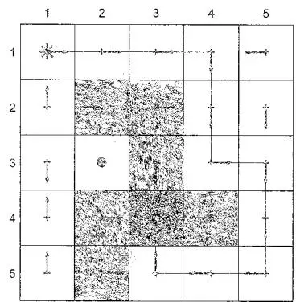

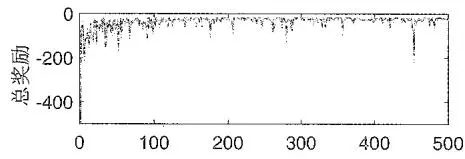

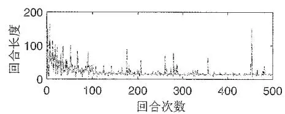
图7.2 用Sarsa学习最优策略的过程。这里的任务是寻找从左上角状态到目标状态的最优路径。左图给出了Sarsa学习到的最终策略。右图显示了每个回合的回报和长度的变化过程。

在仿真中，所有回合都从左上角的状态开始，并在目标状态结束。奖励设置为 $r_{\mathrm{target}} = 0, r_{\mathrm{forbidden}} = r_{\mathrm{boundary}} = -10, r_{\mathrm{other}} = -1$ 。选取 $\epsilon = 0.1$ 。对所有 $t$ ，设 $\alpha_t(s, a) = 0.1$ 。对所有 $(s, a)$ ，选取初始值为 $q_0(s, a) = 0$ 。由初始值导出的初始策略是均匀分布的，即对所有 s, a 有 $\pi_{0}(a|s)=0.2$ 。

◇ 学习到的策略：图7.2中的左图展示了Sarsa学习到的最终策略。如果考虑在每个状态以最大概率选取的动作，那么这个策略可以成功地将智能体从初始状态引导至目标状态。然而，其他一些状态的策略可能不是最优的（例如第三行第一列），这是因为这些状态没有被充分探索。

每个回合的回报：图7.2中的右上方子图展示了每个回合的回报逐渐变化的过程。可以看到，每个回合的回报在逐渐增加，这是因为初始策略不好，因此经常得到负奖励。随着策略变好，回报会逐渐增加。有的读者可能注意到大概在第460个回合时回报突然降低，这是因为这个策略是 $\epsilon$ -Greedy的，因此还是有概率选择不好的动作。

每个回合的长度：图7.2中的右下方子图展示了每个回合的长度逐渐变化的过程。初始回合的长度很长，这是因为初始策略不好，智能体在到达目标之前可能多次绕路。随着策略逐渐变好，轨迹的长度逐渐变短。类似地，大概在第460个回合时回合的长度突然增加，这也是因为策略是 $\epsilon$ -Greedy的，存在选择非最优动作的可能性。解决这个问题的一个简单方法是使用衰减的 $\epsilon$ ，即初始时 $\epsilon$ 比较大，以使得策略有较强的探索性；随后 $\epsilon$ 逐渐趋近于0，从而增加策略的最优性，减少探索性。

最后，Sarsa算法也有一些变体，如Expected Sarsa算法，感兴趣的读者可以参见方框7.4。



给定一个策略 $\pi$ ，如下所示的ExpectedSarsa算法可以估计该策略的动作值：

$$
\begin{array}{r l} & {q_{t + 1} (s_{t}, a_{t}) = q_{t} (s_{t}, a_{t}) - \alpha_{t} (s_{t}, a_{t}) \Big [ q_{t} (s_{t}, a_{t}) - (r_{t + 1} + \gamma \mathbb{E} [ q_{t} (s_{t + 1}, A) ]) \Big ],} \\ & {\quad q_{t + 1} (s, a) = q_{t} (s, a), \quad \text{当} (s, a) \neq (s_{t}, a_{t}).} \end{array}
$$

上式中

$$
\mathbb{E} \left[ q_{t} \left(s_{t + 1}, A\right) \right] = \sum_{a} \pi_{t} (a \mid s_{t + 1}) q_{t} \left(s_{t + 1}, a\right) \doteq v_{t} \left(s_{t + 1}\right)
$$

是在策略 $\pi_t$ 下 $q_{t}(s_{t + 1},a)$ 的期望值。也正因为如此，该算法被称为ExpectedSarsa。

Expected Sarsa 算法与 Sarsa 非常相似，它们只是在 TD 目标上不同。具体来说，Expected Sarsa 中的 TD 目标是 $r_{t+1} + \gamma \mathbb{E}[q_t(s_{t+1}, A)]$ ，而 Sarsa 的 TD 目标是 $r_{t+1} + \gamma q_t(s_{t+1}, a_{t+1})$ 。这里引入期望值会略微增加计算复杂度，不过它对减少估计方差是有益的，这是因为它将Sarsa涉及的随机变量 $\{s_t, a_t, r_{t+1}, s_{t+1}, a_{t+1}\}$ 减少到了 $\{s_t, a_t, r_{t+1}, s_{t+1}\}$ 。

与(7.1)中的TD算法类似，Expected Sarsa算法可以被看作求解下面方程的随机近似算法：

$$
q_{\pi} (s, a) = \mathbb{E} \Big [ R_{t + 1} + \gamma \mathbb{E} [ q_{\pi} (S_{t + 1}, A_{t + 1}) | S_{t + 1} ] \Big | S_{t} = s, A_{t} = a \Big ].\tag{7.15}
$$

该方程乍一看可能很奇怪，但它实际上是贝尔曼方程的另一种表达形式。为了理解这一点，可以将

$$
\mathbb{E} [ q_{\pi} (S_{t + 1}, A_{t + 1}) | S_{t + 1} ] = \sum_{A^{\prime}} q_{\pi} (S_{t + 1}, A^{\prime}) \pi (A^{\prime} | S_{t + 1}) = v_{\pi} (S_{t + 1})
$$

代入(7.15)，进而得到

$$
q_{\pi} (s, a) = \mathbb{E} \Big [ R_{t + 1} + \gamma v_{\pi} (S_{t + 1}) | S_{t} = s, A_{t} = a \Big ]
$$

不难看出上式就是贝尔曼方程。

最后，Expected Sarsa 的具体实现流程与 Sarsa 类似，这里不再赘述，更多信息可参见 [3, 36, 37]。



## 7.3 动作值估计：n-Step Sarsa

本节介绍 n-Step Sarsa，它是 Sarsa 的一种推广。我们将看到 Sarsa 和蒙特卡罗算法是 n-Step Sarsa 的两种极端情况。

首先回顾一下动作值的定义：

$$
q_{\pi} (s, a) = \mathbb{E} [ G_{t} | S_{t} = s, A_{t} = a ],\tag{7.16}
$$

其中 $G_{t}$ 是折扣回报：

$$
G_{t} = R_{t + 1} + \gamma R_{t + 2} + \gamma^{2} R_{t + 3} + \dots .
$$

实际上， $G_{t}$ 可以被写成不同的表达式：

$$
\begin{array}{r l} \mathrm{Sarsa} \longleftarrow & G_{t} ^{(1)} = R_{t + 1} + \gamma q_{\pi} (S_{t + 1}, A_{t + 1}), \\ & G_{t} ^{(2)} = R_{t + 1} + \gamma R_{t + 2} + \gamma^{2} q_{\pi} (S_{t + 2}, A_{t + 2}), \\ & \vdots \end{array}
$$

$$
n \text{-step Sarsa} \longleftarrow G_{t} ^{(n)} = R_{t + 1} + \gamma R_{t + 2} + \dots + \gamma^{n} q_{\pi} (S_{t + n}, A_{t + n}),
$$

$$
\mathrm{蒙特卡罗} \longleftarrow G_{t} ^{(\infty)} = R_{t + 1} + \gamma R_{t + 2} + \gamma^{2} R_{t + 3} + \gamma^{3} R_{t + 4} \dots
$$

上式中 $G_{t}^{(1)}, G_{t}^{(2)}, \ldots, G_{t}^{(n)}$ 的上标仅表示 $G_{t}$ 的不同分解方式，它们本质上是相等的： $G_{t} = G_{t}^{(1)} = G_{t}^{(2)} = G_{t}^{(n)} = G_{t}^{(\infty)}$ 。将 $G_{t}$ 的不同分解方式代入(7.16)中的 $q_{\pi}(s, a)$ 会得到如下不同的算法。

◇ 当 n=1 时，我们有

$$
q_{\pi} (s, a) = \mathbb{E} [ G_{t} ^{(1)} | s, a ] = \mathbb{E} [ R_{t + 1} + \gamma q_{\pi} (S_{t + 1}, A_{t + 1}) | s, a ].
$$

求解这个方程的随机近似算法是

$$
q_{t + 1} (s_{t}, a_{t}) = q_{t} (s_{t}, a_{t}) - \alpha_{t} (s_{t}, a_{t}) \Big [ q_{t} (s_{t}, a_{t}) - (r_{t + 1} + \gamma q_{t} (s_{t + 1}, a_{t + 1})) \Big ].
$$

上式就是(7.12)中的Sarsa算法。

◇ 当 $n = \infty$ 时，我们有

$$
q_{\pi} (s, a) = \mathbb{E} [ G_{t} ^{(\infty)} | s, a ] = \mathbb{E} [ R_{t + 1} + \gamma R_{t + 2} + \gamma^{2} R_{t + 3} + \dots | s, a ].
$$

求解这个方程的随机近似算法是

$$
q_{t + 1} (s_{t}, a_{t}) = g_{t} \doteq r_{t + 1} + \gamma r_{t + 2} + \gamma^{2} r_{t + 3} + \dots ,
$$

其中 $g_{t}$ 是 $G_{t}$ 的一个样本。上式实际上就是蒙特卡罗方法，它使用从 $(s_t, a_t)$ 开始的回报来近似 $(s_t, a_t)$ 的动作值。

◇ 当 n 取一般的自然数时，我们有

$$
q_{\pi} (s, a) = \mathbb{E} [ G_{t} ^{(n)} | s, a ] = \mathbb{E} [ R_{t + 1} + \gamma R_{t + 2} + \ldots + \gamma^{n} q_{\pi} (S_{t + n}, A_{t + n}) | s, a ].
$$

求解这个方程的随机近似算法是

$$
\begin{array}{r l} & q_{t + 1} (s_{t}, a_{t}) = q_{t} (s_{t}, a_{t}) \\ & \qquad - \alpha_{t} (s_{t}, a_{t}) \Big [ q_{t} (s_{t}, a_{t}) - \big (r_{t + 1} + \gamma r_{t + 2} + \ldots + \gamma^{n} q_{t} (s_{t + n}, a_{t + n}) \big) \Big ]. \end{array}\tag{7.17}
$$

这个算法被称为 $n$ -step Sarsa。

总而言之，n-Step Sarsa 是一个更一般化的算法：当 n=1 时，它就变成了 Sarsa 算法；当 $n=\infty$ 时，它就变成了蒙特卡罗算法（需要设置 $\alpha_{t}=1$ ）。由于 n-Step Sarsa 包含 Sarsa 和蒙特卡罗这两个极端情况，因此其性能也介于 Sarsa 和蒙特卡罗之间。如果n 较大，n-Step Sarsa 接近于蒙特卡罗：其估计具有较小的偏差（bias）但较大的方差。如果 n 较小，n-Step Sarsa 接近于 Sarsa：其估计具有较小的方差但较大的偏差。

最后，这里介绍的 $n$ -Step Sarsa仅可用于评价一个给定的策略。为了得到最优策略，它需要与策略改进步骤结合，具体流程类似于Sarsa，这里不再赘述，更多信息可参见[3, 第9章]。值得注意的是，在实现 $n$ -Step Sarsa算法时，我们需要经验样本 $(s_t, a_t, r_{t+1}, s_{t+1}, a_{t+1}, \ldots, r_{t+n}, s_{t+n}, a_{t+n})$ 。由于我们在 $t$ 时刻还无法拿到样本 $(r_{t+n}, s_{t+n}, a_{t+n})$ ，因此必须等到 $t + n$ 时刻才能更新 $(s_t, a_t)$ 的 $q$ 值。为此，式(7.17)可以被重新写为

$$
\begin{array}{l} q_{t + n} (s_{t}, a_{t}) = q_{t + n - 1} (s_{t}, a_{t}) \\ \qquad - \alpha_{t + n - 1} (s_{t}, a_{t}) \Big [ q_{t + n - 1} (s_{t}, a_{t}) \\ \qquad - \big (r_{t + 1} + \gamma r_{t + 2} + \ldots + \gamma^{n} q_{t + n - 1} (s_{t + n}, a_{t + n}) \big) \Big ], \end{array}
$$

其中 $q_{t + n}(s_t,a_t)$ 是在 $t + n$ 时刻对 $q_{\pi}(s_t,a_t)$ 的估计。

## 7.4 最优动作值估计：Q-learning

本节将介绍 Q-learning 算法，这是经典的强化学习算法之一 [38, 39]。前面介绍的 Sarsa 只能估计给定策略的动作值，必须结合策略改进步骤才能得到最优策略。相比之下，Q-learning 可以直接估计最优动作值进而找到最优策略。

### 7.4.1 算法描述

Q-learning算法如下所示：

$$
\begin{array}{r l} & {q_{t + 1} (s_{t}, a_{t}) = q_{t} (s_{t}, a_{t}) - \alpha_{t} (s_{t}, a_{t}) \left[ q_{t} (s_{t}, a_{t}) - \left(r_{t + 1} + \gamma \max_{a \in \mathcal{A}} q_{t} (s_{t + 1}, a)\right) \right],} \\ & {\quad q_{t + 1} (s, a) = q_{t} (s, a), \quad \text{当} (s, a) \neq (s_{t}, a_{t}),} \end{array}\tag{7.18}
$$

其中 $t = 0,1,2,\ldots$ 。这里 $q_{t}(s_{t},a_{t})$ 是对 $(s_t,a_t)$ 的最优动作值的估计，而 $\alpha_{t}(s_{t},a_{t})$ 是学习率。

Q-learning 的表达式与 Sarsa 非常类似，它们的区别在于 TD 目标：Q-learning 的 TD 目标是 $r_{t+1} + \gamma \max_{a} q_{t}(s_{t+1}, a)$ ，而 Sarsa 的 TD 目标则是 $r_{t+1} + \gamma q_{t}(s_{t+1}, a_{t+1})$ 。因此，如果当前的状态-动作是 $(s_{t}, a_{t})$ ，Sarsa 算法的更新需要样本 $(r_{t+1}, s_{t+1}, a_{t+1})$ ，而 Q-learning 只需要 $(r_{t+1}, s_{t+1})$ 。

为什么Q-learning被设计成(7.18)中的表达式？它在数学上做了什么呢？实际上，

Q-learning 是一个求解如下贝尔曼最优方程的随机近似算法:

$$
q (s, a) = \mathbb{E} \left[ R_{t + 1} + \gamma \max_{a} q (S_{t + 1}, a) \mid S_{t} = s, A_{t} = a \right].\tag{7.19}
$$

上面这个方程是基于动作值的贝尔曼最优方程，证明见方框7.5。Q-learning的收敛性分析与定理7.1类似，这里不再赘述，更多信息可参见[32, 39]。



根据期望的定义，(7.19)可以重写为

$$
q (s, a) = \sum_{r} p (r | s, a) r + \gamma \sum_{s^{\prime}} p (s^{\prime} | s, a) \max_{a \in \mathcal{A} (s^{\prime})} q (s^{\prime}, a).
$$

对方程的两边取最大值可得

$$
\max_{a \in \mathcal{A} (s)} q (s, a) = \max_{a \in \mathcal{A} (s)} \left[ \sum_{r} p (r | s, a) r + \gamma \sum_{s^{\prime}} p (s^{\prime} | s, a) \max_{a \in \mathcal{A} (s^{\prime})} q (s^{\prime}, a) \right].
$$

通过定义 $v(s) = \max_{a\in \mathcal{A}(s)}q(s,a)$ ，上面的方程可重写为

$$
\begin{array}{r l} & v (s) = \max_{a \in \mathcal{A} (s)} \left[ \sum_{r} p (r | s, a) r + \gamma \sum_{s^{\prime}} p (s^{\prime} | s, a) v (s^{\prime}) \right] \\ & \quad = \max_{\pi} \sum_{a \in \mathcal{A} (s)} \pi (a | s) \left[ \sum_{r} p (r | s, a) r + \gamma \sum_{s^{\prime}} p (s^{\prime} | s, a) v (s^{\prime}) \right]. \end{array}
$$

上式就是用状态值表示的贝尔曼最优方程，这已经在[第3章](ch03.md)有详细讨论。



### 7.4.2 Off-policy 和 On-policy

接下来介绍两个重要概念：Off-policy（异策略）和 On-policy（同策略）。之所以在介绍 Q-learning 时引入这两个概念，是因为 Q-learning 相比前面的 TD 算法有一点特殊：Q-learning 是 Off-policy 的，而前面介绍的算法如 Sarsa 都是 On-policy 的。

任何一个强化学习算法都会涉及两种策略：一种是行为策略（behavior policy），另一种是目标策略（target policy）。行为策略用于生成经验样本，而目标策略不断更新，从而收敛至最优策略。当行为策略与目标策略相同时，该算法被称为On-policy的，中文为同策略（因为两个策略相同）；当它们不同时，该算法被称为Off-policy的，中文为异策略（因为两个策略不同）。

Off-policy 算法的优势在于它可以使用由其他策略生成的经验样本来学习最优策略。一个常见的情况是使用探索性较强的行为策略生成的经验数据。例如，如果我们想要估计所有动作值，则必须生成多次访问每个状态-动作的轨迹，此时可以使用 $\epsilon$ -Greedy策略来生成轨迹。尽管Sarsa也使用 $\epsilon$ -Greedy策略来保持一定的探索能力，但是为了保证最优性，其 $\epsilon$ 的值通常很小，因此探索能力有限。相比之下，如果我们能使用一个具有较强探索能力的策略（例如 $\epsilon = 1$ ）来生成经验数据，然后使用Off-policy算法来学习最优策略，效率将显著提高。后面将给出一个例子来说明这一点。

如何确定一个算法是 On-policy 还是 Off-policy 呢？如果一个算法可以使用任何其他策略生成的经验数据来得到最优策略，那么这个算法就是 Off-policy 的；反之，则是 On-policy 的。当然，这并不是真正意义上的回答，而是基于 Off-policy 和 On-policy 的定义。为了真正回答这个问题，我们可以考察算法的两方面：第一个方面是算法旨在解决的数学问题，第二个方面是算法所需的经验样本。

#### ◇ Sarsa 是 On-policy 的。

原因如下。Sarsa在每次迭代中有两个步骤。第一步是通过求解贝尔曼方程来评价当前策略 $\pi$ 。为此我们需要由 $\pi$ 生成的样本，因此 $\pi$ 是行为策略。第二步是基于对 $\pi$ 的估计值获得一个改进的策略， $\pi$ 不断更新并最终收敛到最优策略，因此 $\pi$ 也是目标策略，所以Sarsa中的行为策略和目标策略是相同的。

从另一个角度来看，我们可以考察算法所需的样本。Sarsa在每次迭代中所需的样本是 $(s_t, a_t, r_{t+1}, s_{t+1}, a_{t+1})$ 。这些样本的生成过程如下所示：

$$
s_{t} \xrightarrow{\pi_{b}} a_{t} \xrightarrow{\mathrm{model}} r_{t + 1}, s_{t + 1} \xrightarrow{\pi_{b}} a_{t + 1}
$$

此过程中，行为策略 $\pi_{b}$ 用于在 $s_{t}$ 产生 $a_{t}$ 且在 $s_{t+1}$ 产生 $a_{t+1}$ 。Sarsa 用这个经验数据来估计 $q_{\pi_{b}}(s_{t}, a_{t})$ ，并基于此改进得到新的策略。换句话说，Sarsa 评价进而改进的策略（即目标策略）就是用来生成样本的策略，因此 Sarsa 是 On-policy 的。

#### ◇ Q-learning 是 Off-policy 的。

其本质的数学原因在于 Q-learning 是求解贝尔曼最优方程，而 Sarsa 是求解用于生成经验数据的策略对应的贝尔曼方程。求解贝尔曼方程只能评价对应的策略，而求解贝尔曼最优方程则可以直接得到最优策略。

具体来说，Q-learning在每次迭代中所需的样本是 $(s_t, a_t, r_{t+1}, s_{t+1})$ 。这些样本的生成过程如下所示：

$$
s_{t} \xrightarrow{\pi_{b}} a_{t} \xrightarrow{\mathrm{model}} r_{t + 1}, s_{t + 1}
$$

在此过程中，行为策略 $\pi_b$ 用于在 $s_t$ 产生 $a_t$ 。Q-learning算法的目的是估计 $(s_t, a_t)$ 的最优动作值，这一过程依赖于样本 $(r_{t+1}, s_{t+1})$ 。产生 $(r_{t+1}, s_{t+1})$ 的过程完全由系统模型（即通过与环境的交互）决定。因此， $(s_t, a_t)$ 的最优动作值的估计不再涉

及 $\pi_b$ 。

◇ 蒙特卡罗方法是 On-policy 的。其原因与 Sarsa 相似：要评估和改进的策略与生成样本的策略是相同的。

最后，有的读者可能会问 On-policy/Off-policy 与 Online/Offline（在线/离线）的区别是什么？在线学习是指智能体在与环境交互的同时用生成的数据来更新值和策略。离线学习是指智能体不与环境交互，而是使用预先收集的数据来更新值和策略。如果算法是 On-policy 的，那么它可以实现在线学习，但不能实现离线学习，因为它无法使用预先收集的其他策略生成的数据。如果算法是 Off-policy 的，那么它既可以在线学习，也可以离线学习。

### 7.4.3 算法实现

由于Q-learning是Off-policy的，所以它在编程实现时有两种模式。

第一，On-policy模式，即行为策略和目标策略相同。算法7.2给出了伪代码。这种方式与算法7.1中的Sarsa类似，因为此时行为策略与目标策略相同，都是一个 $\epsilon$ -Greedy的策略。此外，该算法是在线学习的，即智能体一边与环境交互以获得数据，一边更新值和策略。


<pre class="pseudocode">
初始化：对所有 $(s,a)$ 和所有t，$\alpha_{t}(s,a)=\alpha&gt;0$ 。$\epsilon\in(0,1)$ 。所有 $(s,a)$ 的初始值 $q_{0}(s,a)$ 。从 $q_{0}$ 导出的初始 $\epsilon$-Greedy策略 $\pi_{0}$ 。

目标：学习最优策略从而使智能体能从给定状态 $s_{0}$ 出发到达目标状态。

对于每个回合

在t时刻，如果 $s_{t}$ 不是目标状态

收集经验样本 $(a_{t},r_{t+1},s_{t+1})$ ：在 $s_{t}$，根据 $\pi_{t}(s_{t})$ 产生 $a_{t}$，通过与环境互动生成 $r_{t+1},s_{t+1}$ 。

更新 $(s_{t},a_{t})$ 的值：

$q_{t+1}(s_{t},a_{t})=q_{t}(s_{t},a_{t})-\alpha_{t}(s_{t},a_{t})\left[q_{t}(s_{t},a_{t})-(r_{t+1}+\gamma\max_{a}q_{t}(s_{t+1},a))\right]$

更新 $s_{t}$ 的策略：

$\pi_{t+1}(a|s_{t})=1-\frac{\epsilon}{|\mathcal{A}(s_{t})|}(|\mathcal{A}(s_{t})|-1)$，如果 $a=\arg\max_{a}q_{t+1}(s_{t},a)$ $\pi_{t+1}(a|s_{t})=\frac{\epsilon}{|\mathcal{A}(s_{t})|}$，如果 $a\neq\arg\max_{a}q_{t+1}(s_{t},a)$
</pre>


第二，Off-policy模式，即行为策略和目标策略不同。算法7.3给出了伪代码。其中行为策略 $\pi_{b}$ 可以是任意策略，只要它能生成足够的经验数据。因此，行为策略最好具有一定的探索性。在此算法中，目标策略 $\pi_{T}$ 是Greedy的而不是 $\epsilon$ -Greedy的，这是因为它不用生成经验数据，因此不需要具有探索性。此外，该算法是离线学习的，即先收集所有经验样本，然后再学习。


<pre class="pseudocode">

初始化: 所有  $(s,a)$  的初始值  $q_{0}(s,a)$ 。所有  $(s,a)$  的行为策略  $\pi_{b}(a|s)$ 。对所有  $(s,a)$  和所有 t， $\alpha_{t}(s,a)=\alpha&gt;0$ 。

目标: 使用  $\pi_{b}$  生成的经验数据，学习所有状态的最优策略  $\pi_{T}$ 。

对  $\pi_{b}$  生成的每个回合  $\{s_{0},a_{0},r_{1},s_{1},a_{1},r_{2},\ldots\}$

对回合中的每一步  $t=0,1,2,\ldots$

更新  $(s_{t},a_{t})$  的值:

 $q_{t+1}(s_{t},a_{t})=q_{t}(s_{t},a_{t})-\alpha_{t}(s_{t},a_{t})\left[q_{t}(s_{t},a_{t})-(r_{t+1}+\gamma\max_{a}q_{t}(s_{t+1},a))\right]$

更新  $s_{t}$  的目标策略:

 $\pi_{T,t+1}(a|s_{t})=1$ ，如果  $a=\arg\max_{a}q_{t+1}(s_{t},a)$ $\pi_{T,t+1}(a|s_{t})=0$ ，如果  $a\neq\arg\max_{a}q_{t+1}(s_{t},a)$
</pre>


### 7.4.4 示例

下面来看一些例子。

第一个例子如图7.3所示，它展示了算法7.2中On-policy模式的Q-learning。这里的目标是从给定的状态出发找到达到目标状态的最优路径。参数设置在图7.3的标题中给出。如该图所示，Q-learning最终能找到一个最优路径。在迭代过程中，每个回合的长度逐渐缩短，而每个回合的回报逐渐增加。

第二组例子在图7.4和图7.5中给出，它们展示了算法7.3中Off-policy模式的Q-learning。这里的任务是找到所有状态的最优策略。参数设置为 $r_{\mathrm{boundary}} = r_{\mathrm{forbidden}} = -1, r_{\mathrm{target}} = 1, \gamma = 0.9, \alpha = 0.1$ 。

最优策略：为了验证 Q-learning 的有效性，我们首先使用之前介绍的需要模型的策略迭代算法求解出真实的最优策略和最优状态值，如图7.4(a)\~(b)所示。

☐ 经验样本：行为策略在任意状态下采取任意动作的概率是相同的，都等于0.2（图7.4(c)）。我们使用该行为策略生成一个包含100000步的回合（图7.4(d)）。由于该行为策略具有良好的探索能力，这一个回合就能多次访问每个状态-动作。

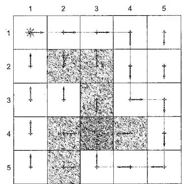

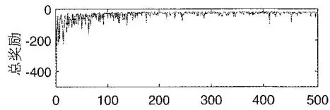

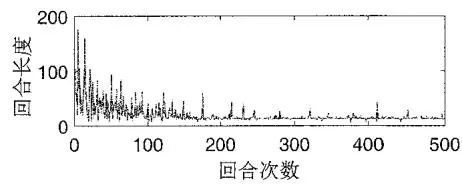
图 7.3 用于展示算法 7.2 的例子。所有回合都从左上角的状态开始，并在到达目标状态后终止。目的是找到从起始状态到目标状态的最优路径。左图显示了算法得到的最终策略。右图显示了每个回合的回报和长度的变化。参数设置为 $r_{target} = 0, r_{forbidden} = r_{boundary} = -10, r_{other} = -1, \alpha = 0.1, \epsilon = 0.1$ 。

学习到的策略：Q-learning最终学到的目标策略如图7.4(e)所示。这个策略是最优的，因为估计误差收敛到了0（图7.4(f)）。此外，有的读者可能注意到Q-learning学到的最优策略与图7.4(a)中的最优策略不完全相同。实际上，这两个都是最优策略，它们对应相同的最优状态值。

不同的初始值：由于Q-learning采用自举方法，算法需要选取合适的初始动作值估计。如果初始估计靠近真实值，则估计过程收敛较快，例如在约10000步内收敛（图7.4(g)）。否则，估计过程收敛较慢（图7.4(h)）。

不同的行为策略: 当行为策略的探索性较差时, 学习的效果显著下降。例如, 图7.5给出了一些探索性较差的行为策略。虽然它们是 $\epsilon$ -Greedy, 但是因为 $\epsilon = 0.5$ 或 0.1 较小, 所以探索性较差。结果表明, 当 $\epsilon$ 从 1 减少到 0.5, 然后再减少到 0.1 时, 学习速度显著降低, 这是因为行为策略的探索能力较弱, 导致经验样本不合理。

## 7.5 时序差分算法的统一框架

到目前为止，我们已经介绍了几个不同的TD算法，如Sarsa、n-Step Sarsa和Q-learning。下面介绍一个统一的框架来描述这些TD算法甚至蒙特卡罗算法。

具体来说，用于动作值估计的 TD 算法可以写成一个统一的表达式：

$$
q_{t + 1} (s_{t}, a_{t}) = q_{t} (s_{t}, a_{t}) - \alpha_{t} (s_{t}, a_{t}) [ q_{t} (s_{t}, a_{t}) - \bar{q} _{t} ],\tag{7.20}
$$

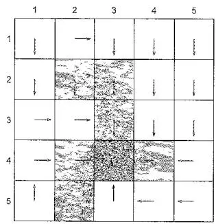
(a) 最优策略

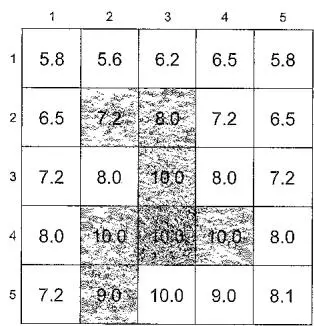
(b) 最优状态值

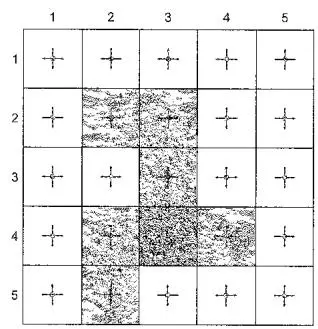
(c) 行为策略

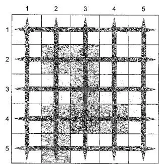
(d) 生成的回合

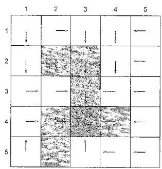
(e) 学习到的策略

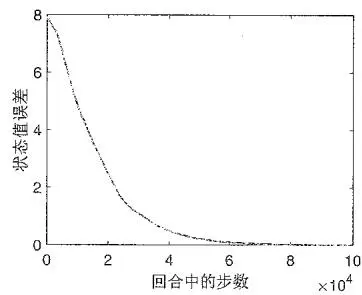
(f) 最优状态值估计误差： $q_{0}(s,a) = 0$

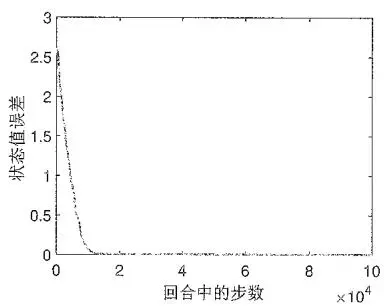
(g) 最优状态值估计误差： $q_{0}(s,a)=10$

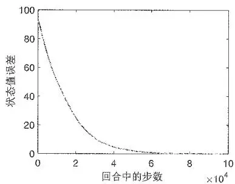
(h) 最优状态值估计误差: $q_{0}(s, a) = 100$
图7.4 用于展示Off-policy模式的Q-learning的例子。图(a)和(b)展示了最优策略和最优状态值。图(c)和(d)展示了行为策略和生成的回合。图(e)和(f)展示了学习到的策略和估计误差的收敛过程。图(g)和(h)展示了具有不同初始值的情况。

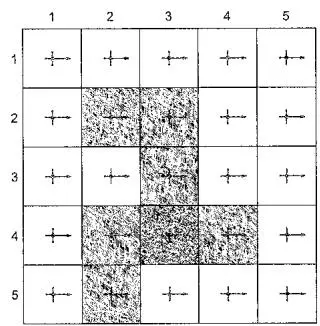

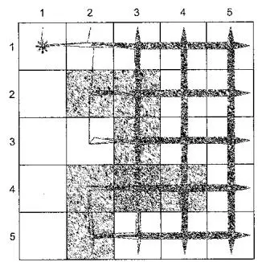
(a) $\epsilon = 0.5$

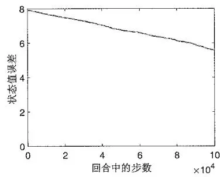

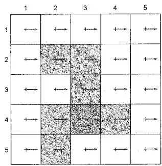

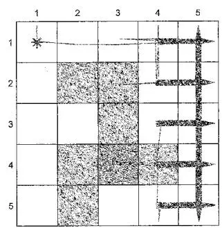
(b) $\epsilon = 0.1$

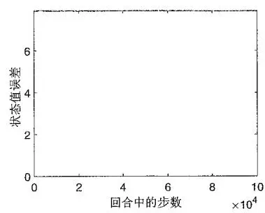

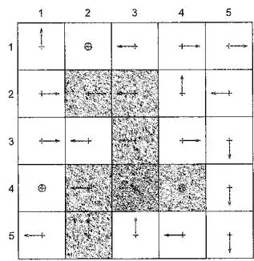

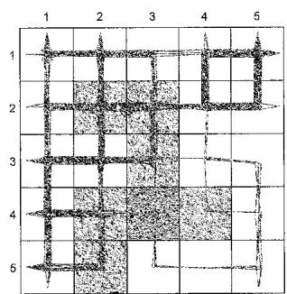

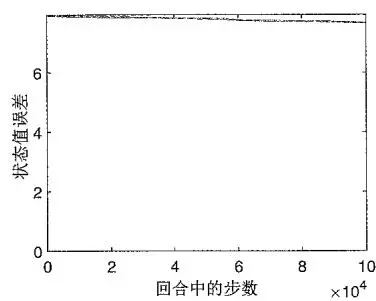
(c) $\epsilon = 0.1$
图 7.5 当行为策略探索性较弱时，学习的效果会下降。左列的图展示了不同的行为策略。中间列的图展示了由相应行为策略生成的回合，每个回合有 100000 步。右列的图展示了最优状态值估计误差的演变过程。

其中 $\bar{q}_t$ 是TD目标。所有的TD算法都可以用(7.20)来描述，只是不同的TD算法有不同的TD目标 $\bar{q}_t$ ，请见表7.2。蒙特卡罗算法也可以被视为(7.20)的一种特殊情况：如果设置 $\alpha_{t}(s_{t},a_{t}) = 1$ ，那么(7.20)就变成了 $q_{t + 1}(s_t,a_t) = \bar{q}_t$ ，这实际上就是蒙特卡罗算法。

算法(7.20)可以被视为用于求解一个统一方程 $q(s,a)=\mathbb{E}[\bar{q}_{t}|s,a]$ 的随机近似算法，这个方程有不同的表达方式，请见表7.2。可以看出，所有算法本质上都是求解贝尔曼方程，只有Q-learning是求解贝尔曼最优方程。

表 7.2 时序差分方法的统一框架。这里 BE 和 BOE 分别代表贝尔曼方程和贝尔曼最优方程。

<table><tr><td>算法</td><td>式(7.20)中TD目标 $\bar{q}_{t}$ 的表达式</td></tr><tr><td>Sarsa</td><td> $\bar{q}_{t}=r_{t+1}+\gamma q_{t}(s_{t+1},a_{t+1})$ </td></tr><tr><td>n-step Sarsa</td><td> $\bar{q}_{t}=r_{t+1}+\gamma r_{t+2}+\cdots+\gamma^{n}q_{t}(s_{t+n},a_{t+n})$ </td></tr><tr><td>Q-learning</td><td> $\bar{q}_{t}=r_{t+1}+\gamma\max_{a}q_{t}(s_{t+1},a)$ </td></tr><tr><td>Monte Carlo</td><td> $\bar{q}_{t}=r_{t+1}+\gamma r_{t+2}+\gamma^{2}r_{t+3}+\ldots$ </td></tr><tr><td>算法</td><td>求解的数学方程</td></tr><tr><td>Sarsa</td><td>BE:  $q_{\pi}(s,a)=\mathbb{E}\left[R_{t+1}+\gamma q_{\pi}(S_{t+1},A_{t+1})|S_{t}=s,A_{t}=a\right]$ </td></tr><tr><td>n-step Sarsa</td><td>BE:  $q_{\pi}(s,a)=\mathbb{E}\left[R_{t+1}+\gamma R_{t+2}+\cdots+\gamma^{n}q_{\pi}(S_{t+n},A_{t+n})|S_{t}=s,A_{t}=a\right]$ </td></tr><tr><td>Q-learning</td><td>BOE:  $q(s,a)=\mathbb{E}\left[R_{t+1}+\gamma\max_{a}q(S_{t+1},a)\big|S_{t}=s,A_{t}=a\right]$ </td></tr><tr><td>Monte Carlo</td><td>BE:  $q_{\pi}(s,a)=\mathbb{E}\left[R_{t+1}+\gamma R_{t+2}+\gamma^{2}R_{t+3}+\ldots|S_{t}=s,A_{t}=a\right]$ </td></tr></table>

## 7.6 总结

本章介绍了多种时序差分算法，所有这些算法都可以被视为求解贝尔曼方程或贝尔曼最优方程的随机近似算法。

本章介绍的TD算法，除了Q-learning外，都是用于评价某个给定策略的，即从一些经验样本中估计给定策略的状态/动作值，它们需要结合策略改进步骤才能得到最优策略。此外，这些算法是On-policy的，因为它们的目标策略和行为策略相同。

Q-learning与其他算法相比有一点特殊，因为它是Off-policy的，其目标策略可以与行为策略不同。Q-learning是Off-policy的根本原因是它旨在求解贝尔曼最优方程，而不是某一个给定策略的贝尔曼方程。

值得一提的是，有一些方法可以将 On-policy 算法转换为 Off-policy 算法。重要性采样就是其中一个广泛使用的方法 $[3, 40]$ ，该方法将在[第10章](ch10.md)介绍。最后，TD 算法有一些变体和扩展 $[41-45]$ 。例如，TD( $\lambda$ ) 方法提供了一个更加通用和统一的框架，更多信息可参见 $[3, 20, 46]$ 。

## 7.7 问答

◇ 提问：如何理解时序差分方法中的“时序差分”？

回答：每个TD算法都有一个TD误差，该误差代表新样本和当前估计之间的差异。由于这种差异是在不同时刻之间计算的，因此被称为时序差分。

◇ 提问：如何理解用时序差分方法来“学习”最优策略？

回答：从数学的角度看，“学习”意味着“估计”，即从样本中估计状态值/动作值，

进而基于估计值获得策略。

提问：貌似Sarsa算法只能估计给定策略的动作值，那么它是如何用于学习最优策略的呢？

回答：要获得一个最优策略，值估计应该与策略改进不断交替进行。为什么这样结合就能得到最优策略呢？这实际上就是广义策略迭代的思想。该思想已经在前面的值迭代与策略迭代算法以及蒙特卡罗方法中有了详细解释，因此在我们介绍TD算法时就不再赘述。这也再次说明了强化学习的系统性：首先理解前面章节的内容对学习后续章节至关重要。

◇ 提问：为什么Sarsa改进策略时要使用 $\epsilon$ -Greedy策略呢？

回答：这是因为该策略会进一步产生用于值估计的经验样本，因此它应该具有探索性以生成足够的经验样本。这个思想在前面介绍蒙特卡罗算法MC $\epsilon$ -Greedy时有详细的介绍。

◇ 提问：定理7.1和7.2要求学习率 $\alpha_{t}$ 逐渐趋向于0，为什么在实践中要将学习率设置为一个小的常数？

回答：根本原因是所评估的策略是持续变化的（或称为非平稳的）。具体来说，像Sarsa这样的TD算法旨在估计某一个给定策略的动作值。如果该给定策略是固定的，那么使用递减的学习率是没有问题的。然而，在最优策略学习过程中，Sarsa要评估的策略在每次迭代后都会变化。如果此时的学习率是递减的，那么后面得到的样本实际上就不发挥作用了，也无法有效评估不断变化的策略。反之，如果此时的学习率是一个常数，那么后面得到的样本和前面的样本一样会发挥积极的作用，从而有效评估不断变化的策略。最后，尽管常数学习率的一个缺点是价值估计可能最终会波动，但只要该常数足够小，这种波动就可以忽略不计。

提问：我们应该学习到所有状态的最优策略，还是只需要学习某一部分状态的最优策略？

回答：这取决于任务。读者可能已经注意到，本章考虑的一些任务（例如图7.2）并不需要找到所有状态的最优策略。因为这些任务只需要找到从一个给定状态出发到目标状态的最优路径，所以只需要学习与这个路径相近的状态的最优策略即可，此时所需要的数据会更少，任务也相对简单。值得指出的是，由于没有得到所有状态的最优策略，最后获得的路径不能保证是全局最优的。不过只要有足够的数据，我们仍然可以找到一个好的或局部最优的路径。

◇ 提问:为什么 Q-learning 是 Off-policy 的,而本章中的其他 TD 算法都是 On-policy 的?

回答：根本原因是 Q-learning 旨在求解贝尔曼最优方程，而其他 TD 算法旨在求解某一给定策略的贝尔曼方程。详细信息可参见第 7.4.2 节。

提问:为什么 Q-learning 的 Off-policy 模式可以更新策略为 Greedy 而不是 $\epsilon$ -Greedy?
回答：这是因为目标策略不会用于生成经验样本，因此它不需要具有探索性。
