# [第8章](ch08.md) · 值函数方法

值函数方法

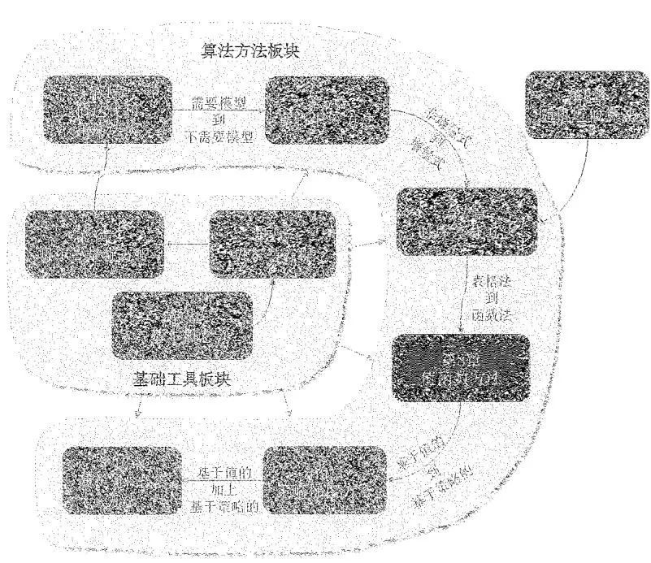
图 8.1 本章在全书中的位置。

本章将继续介绍时序差分方法，不过我们将使用不同的方法来表示状态值/动作值。到目前为止，本书中所有的状态值/动作值都是通过表格来表示的。虽然表格形式易于理解，但是在处理大型状态空间或动作空间时效率不高。本章将用函数来表示状态值/动作值，这种方法已经成为目前强化学习的主流方法。由于人工神经网络是很好的函数近似器，因此这也是人工神经网络进入强化学习的原因。本章将用函数来表示值，下一章将用函数来表示策略。

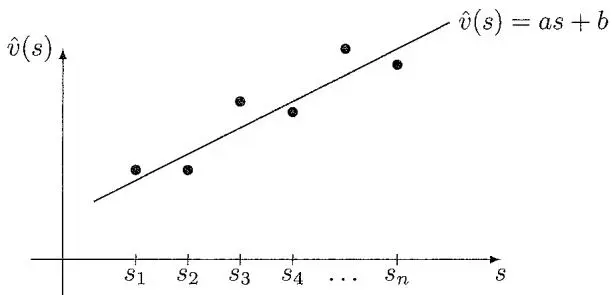
图 8.2 用函数来描述状态值的示意图。横轴和纵轴分别对应 s 和 $\hat{v}(s)$ 。

## 8.1 价值表示：从表格到函数

下面通过一个例子来说明表格和函数方法的区别。
假设有 $n$ 个状态 $\{s_i\}_{i=1}^n$ 。对于一个给定的策略 $\pi$ ，其状态值为 $\{v_\pi(s_i)\}_{i=1}^n$ 。设 $\{\hat{v}(s_i)\}_{i=1}^n$ 为状态值的估计值。
如果使用表格法，则估计值可以通过如下表格表示。这个表格可以以数组或者向量的形式存储在内存中。如果要检索或更新一个状态值，我们可以直接读取或重写表格中的相应元素。

<table><tr><td>状态</td><td> $s_1$ </td><td> $s_2$ </td><td> $\cdots$ </td><td> $s_n$ </td></tr><tr><td>估计的状态值</td><td> $\hat{v}(s_1)$ </td><td> $\hat{v}(s_2)$ </td><td> $\cdots$ </td><td> $\hat{v}(s_n)$ </td></tr></table>

如果使用函数法，注意到 $\{(s_i, \hat{v}(s_i))\}_{i=1}^n$ 是一组点（图8.2），这些点可以通过一条曲线来拟合或近似。最简单的曲线是一条直线，可以描述为

$$
\hat{v} (s, w) = a s + b = \underbrace{[ s , 1 ]} _{\phi^{\mathrm{T}} (s)} \underbrace{\left[ \begin{array}{l} a \\ b \end{array} \right]} _{w} = \phi^{\mathrm{T}} (s) w.\tag{8.1}
$$

其中 $\hat{v}(s,w)$ 是用来近似 $v_{\pi}(s)$ 的函数，它由状态 $s$ 和参数向量 $w\in \mathbb{R}^2$ 共同决定。 $\hat{v} (s,w)$

有时被写成 $\hat{v}_w(s)$ 。另外， $\phi(s) \in \mathbb{R}^2$ 被称为 $s$ 的特征向量（feature vector）。

相比表格法，函数法的不同在于如何检索和更新值。

如何检索一个状态值：当用表格描述值时，如果想检索一个状态的值，我们可以直接读取表格中相应的元素。然而，当用函数描述值时，如果想检索一个状态的值，我们要将状态 $s$ 输入到函数中，然后计算函数的值（图8.3）。例如，针对(8.1)中的例子，我们需要首先计算特征向量 $\phi(s)$ ，然后计算 $\phi^{\mathrm{T}}(s)w$ 从而得到值。如果函数是用一个人工神经网络表示的，那么需要完成一次从输入到输出的前向传播，从而得到值。

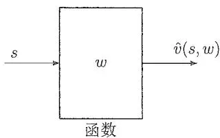
图8.3 使用函数检索 $s$ 对应的值的过程。

得益于上述检索方式，函数法在存储方面更为高效。例如，表格法需要存储 $n$ 个值，而函数法只需要存储一个低维参数向量 $w$ ：如果 $w$ 是2维的，那么只需要存储两个值，因此存储效率显著提高。然而，这种好处是有代价的，其代价就是函数可能无法准确描述所有状态值。如图8.2所示，真实的值并非严格落在一条直线上，所以一条直线无法准确拟合所有的值，这就是为什么这种方法也被称为“函数近似”。

从数学本质上来说，函数法是用一个低维向量（即函数参数向量）来描述一个高维向量（即所有状态的值）。此时，一定会有一些信息被丢失。因此，函数法是通过牺牲准确性来提高存储效率的。

如何更新一个值：当用表格描述值时，如果想要更新一个值，我们可以直接重写表格中对应的元素。然而，当用函数描述值时，更新一个值的方式会完全不同：我们必须更新函数的参数 $w$ 从而间接地改变值，而不能像表格法那样直接修改某个状态的值。至于如何更新 $w$ ，本书将在后面详细讨论。

得益于上述更新方式，函数法在泛化能力方面比表格法更强。具体来说，当使用表格法时，如果某一个状态被访问过，那么我们可以根据后续轨迹的回报来更新它的值。如果一个状态从来没有被访问过，它的值当然无法更新。然而，当使用函数法时，我们需要通过更新w来更新一个状态的值。w的改变当然也会影响其他一些状态的值，即使那些状态从来没有在经验数据中被访问过。因此，一个状态的经验样本可以泛化到改变其他一些状态的值。

上述关于泛化性的分析在图8.4中直观地展示了出来。图中有三个状态 $\{s_1, s_2, s_3\}$ 。假设我们有一个针对 $s_3$ 的经验样本，并想要更新 $\hat{v}(s_3)$ 。当使用表格法时，我们只能更新 $\hat{v}(s_3)$ ，而不改变 $\hat{v}(s_1)$ 或 $\hat{v}(s_2)$ ，参见图8.4(a)。当使用函数法时，我们需要更新 $w$ 从而更新 $\hat{v}(s_3)$ ，而 $w$ 的更新还会改变 $\hat{v}(s_1)$ 和 $\hat{v}(s_2)$ ，参见图8.4(b)。因此， $s_3$ 的经验样本可以帮助我们估计其邻近状态的值。

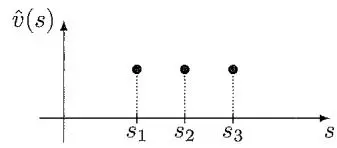

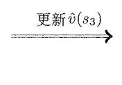

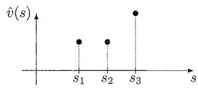
(a) 表格法：当更新 $\hat{v}(s_{3})$ 时，其他值保持不变。

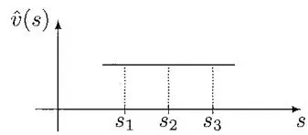

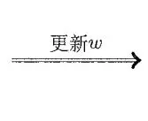

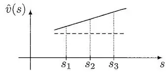
(b) 函数法：为了更新 $\hat{v}(s_3)$ ，需要修改 $w$ ，此时其他值也会被改变。
图 8.4 函数法和表格法如何更新值。

另外，我们也可以使用比直线更高阶的曲线来拟合，例如下面的二阶曲线：

$$
\hat{v} (s, w) = a s^{2} + b s + c = \underbrace{[ s^{2} , s , 1 ]} _{\phi^{\mathrm{T}} (s)} \underbrace{\left[ \begin{array}{l} a \\ b \\ c \end{array} \right]} _{w} = \phi^{\mathrm{T}} (s) w.\tag{8.2}
$$

随着曲线阶数的增加，其拟合精度会更高，但参数向量的维度也会增加，需要更多的存储和计算资源。

值得注意的是，式(8.1)或(8.2)中的 $\hat{v}(s,w)$ 是关于w的线性函数（尽管它对s可能是非线性的）。因此，这种方法被称为线性函数近似（linear function approximation），这也是最简单的值函数方法。要实现线性函数近似，我们需要选择合适的特征向量 $\phi(s)$ 。例如，我们必须人为事先确定应该使用一阶直线还是二阶曲线来拟合。选择合适的特征向量并非易事，这需要我们对给定任务有较丰富的先验知识：我们对任务了解得越多，就可以选择越合适的特征向量。例如，如果我们知道图8.2中的点大致位于一条直线上，那么用直线拟合就是很好的选择，不过这样的先验知识在实际中常常难以得到。如果没有任何先验知识，一种流行的方法是使用人工神经网络来作为非线性函数的近

似器。

最后，如果使用线性函数来做拟合，那么如何找到最优参数向量呢？当我们知道 $\{v_{\pi}(s_i)\}_{i = 1}^n$ 时，这就是一个简单的最小二乘问题，可以通过优化如下目标函数来获得最优参数：

$$
\begin{array}{r l} J_{1} = \sum_{i = 1} ^{n} \left(\hat{v} (s_{i}, w) - v_{\pi} (s_{i})\right) ^{2} & = \sum_{i = 1} ^{n} \left(\phi^{\mathrm{T}} (s_{i}) w - v_{\pi} (s_{i})\right) ^{2} \\ & = \left\| \left[ \begin{array}{c} \phi^{\mathrm{T}} (s_{1}) \\ \vdots \\ \phi^{\mathrm{T}} (s_{n}) \end{array} \right] w - \left[ \begin{array}{c} v_{\pi} (s_{1}) \\ \vdots \\ v_{\pi} (s_{n}) \end{array} \right] \right\| ^{2} \doteq \| \Phi w - v_{\pi} \| ^{2}, \end{array}
$$

其中

$$
\Phi \doteq \left[ \begin{array}{c} \phi^{\mathrm{T}} (s_{1}) \\ \vdots \\ \phi^{\mathrm{T}} (s_{n}) \end{array} \right] \in \mathbb{R} ^{n \times 2}, \qquad v_{\pi} \doteq \left[ \begin{array}{c} v_{\pi} (s_{1}) \\ \vdots \\ v_{\pi} (s_{n}) \end{array} \right] \in \mathbb{R} ^{n}.
$$

不难验证，这个最小二乘问题的最优解是

$$
w^{*} = \left(\Phi^{\mathrm{T}} \Phi\right) ^{- 1} \Phi v_{\pi}.
$$

有关最小二乘问题的更多信息可以参见[47, 第3.3节]和[48, 第5.14节]。

综上所述，本节介绍的曲线拟合的例子直观地展示了值函数方法的基本思想。值函数方法的具体细节将从下节正式开始介绍。

## 8.2 基于值函数的时序差分算法：状态值估计

下面介绍如何将值函数与时序差分（temporal difference，TD）方法相结合，实现对一个给定策略的状态值的估计。

本节包含许多小节和内容。在正式开始介绍之前，有必要先简要梳理一下这些内容。

◇ 值函数法实际上将状态值估计问题描述成了一个优化问题。这个优化问题的目标函数将在第8.2.1节介绍，用于优化此目标函数的TD算法将在第8.2.2节介绍。

◇ 值函数法需要选择合适的特征向量，该问题将在第8.2.3节介绍。

◇ 第8.2.4节将给出示例，以展示基于值函数的TD算法的效果，以及不同特征向量的影响。

第8.2.5节将讨论值函数法的理论性质，这个小节包含大量数学推导，读者可以根据自己的兴趣选读。

### 8.2.1 目标函数

令 $v_{\pi}(s)$ 和 $\hat{v}(s,w)$ 分别代表状态 $s\in S$ 的真实状态值和估计状态值。我们的任务是找到一个最优的 $w$ ，从而使得 $\hat{v}(s,w)$ 能够最好地近似每一个 $s$ 的 $v_{\pi}(s)$ 。具体来说，目标函数是

$$
J (w) = \mathbb{E} [ (v_{\pi} (S) - \hat{v} (S, w)) ^{2} ],\tag{8.3}
$$

其中 $S \in S$ 是随机变量。由于 $S$ 是一个随机变量，那么它的概率分布是什么呢？这是本书第一次将状态描述成随机变量并且需要刻画其概率分布，这也是使用值函数时要解决的重要问题。

有下面几种方法来定义 $S$ 的概率分布。 <!-- validate-skip -->

◇ 第一种方法是使用均匀分布（uniform distribution），即每个状态的概率设为1/n，此时所有状态视为同等重要。在这种情况下，式(8.3)中的目标函数变为

$$
J (w) = \frac{1}{n} \sum_{s \in \mathcal{S}} \left(v_{\pi} (s) - \hat{v} (s, w)\right) ^{2}.\tag{8.4}
$$

这是所有状态的估计误差的平均值。这种方法的问题是没有考虑在给定策略下马尔可夫过程的真实动态。例如，某些状态可能很少被访问，此时一视同仁地对待所有状态可能是不合理的。

第二种方法是使用平稳分布（stationary distribution），这也是本章介绍的重点。平稳分布描述了马尔可夫决策过程的长期行为。更具体地说，当智能体执行一个给定策略足够长的时间后，智能体位于任意一个状态的概率都可以由这个平稳分布来描述。

具体来说，设 $\{d_{\pi}(s)\}_{s\in S}$ 为在策略 $\pi$ 下的平稳分布，即经过相当长的时间后，智能体在状态 $s$ 的概率是 $d_{\pi}(s)$ ，根据定义有 $\sum_{s\in S}d_{\pi}(s) = 1$ 。此时，式(8.3)中的目标函数可以重写为

$$
J (w) = \sum_{s \in \mathcal{S}} d_{\pi} (s) (v_{\pi} (s) - \hat{v} (s, w)) ^{2}.\tag{8.5}
$$

这是所有状态的估计误差的加权平均值，那些有更高概率被访问到的状态被赋予了更大的权重。

求解 $d_{\pi}(s)$ 的具体值并非易事，因为它需要知道状态转移概率矩阵 $P_{\pi}$ ，感兴趣的读者可参见方框8.1。幸运的是，我们不需要计算 $d_{\pi}(s)$ 的具体值就可以最小化上面这个目标函数，具体细节将在下一小节讨论。

最后，目标函数(8.4)和(8.5)是针对离散和有限个状态的情况。当状态空间是连续的

时，我们需要用积分替换求和。



分析平稳分布的核心工具是矩阵 $P_{\pi} \in \mathbb{R}^{n \times n}$ ，即在给定策略 $\pi$ 下的状态转移概率矩阵。具体来说，如果有 $n$ 个状态 $s_1, \ldots, s_n$ ，那么 $[P_{\pi}]_{ij}$ 是智能体在策略 $\pi$ 下从 $s_i$ 用一步转移到 $s_j$ 的概率。 $P_{\pi}$ 的定义已经在第2.6节给出。

对 $P_{\pi}^{k}$ 的解读 $(k = 1,2,3,\ldots)$

我们有必要首先解读 $P_{\pi}^{k}$ 中元素的含义。用

$$
p_{i j} ^{(k)} = \operatorname * {P r} (S_{t_{k}} = j | S_{t_{0}} = i)
$$

表示智能体用 $k$ 步从 $s_i$ 转移到 $s_j$ 的概率。其中 $t_0$ 和 $t_k$ 分别代表初始时刻和 $k$ 时刻。那么根据 $P_{\pi}$ 的定义可得

$$
[ P_{\pi} ] _{i j} = p_{i j} ^{(1)},
$$

即 $[P_{\pi}]_{ij}$ 是智能体用一步从 $s_i$ 转移到 $s_j$ 的概率。

对于 $P_{\pi}^{2}$ ，有

$$
[ P_{\pi} ^{2} ] _{i j} = [ P_{\pi} P_{\pi} ] _{i j} = \sum_{q = 1} ^{n} [ P_{\pi} ] _{i q} [ P_{\pi} ] _{q j}.
$$

因为 $[P_{\pi}]_{iq}[P_{\pi}]_{qj}$ 等于从 $s_i$ 到 $s_q$ 再从 $s_q$ 到 $s_j$ 的联合转移概率，所以 $[P_{\pi}^2]_{ij}$ 是用两步从 $s_i$ 转移到 $s_j$ 的概率，即

$$
[ P_{\pi} ^{2} ] _{i j} = p_{i j} ^{(2)}.
$$

类似地，可得

$$
[ P_{\pi} ^{k} ] _{i j} = p_{i j} ^{(k)},
$$

即 $[P_{\pi}^{k}]_{ij}$ 是使用恰好 $k$ 步从 $s_i$ 转移到 $s_j$ 的概率。

平稳分布的定义

设 $d_0 \in \mathbb{R}^n$ 是一个向量，代表初始时刻状态的概率分布。例如，如果智能体初始时刻总是从状态 $s$ 出发，那么 $d_0(s) = 1$ 而 $d_0$ 的其他元素都为0。设 $d_k \in \mathbb{R}^n$ 是从 $d_0$ 开始经过恰好 $k$ 步后得到的概率分布向量。那么

$$
d_{k} (s_{i}) = \sum_{j = 1} ^{n} d_{0} (s_{j}) [ P_{\pi} ^{k} ] _{j i}, \quad i = 1, 2, \dots\tag{8.6}
$$

上式的含义是智能体在 $k$ 时刻转移到 $s_i$ 的概率等于从 $\{s_j\}_{j=1}^n$ 使用 $k$ 步转移到 $s_i$ 的概率之和。式(8.6)的矩阵-向量形式是

$$
d_{k} ^{\mathrm{T}} = d_{0} ^{\mathrm{T}} P_{\pi} ^{k}.\tag{8.7}
$$

考虑马尔可夫过程的长期行为。在某些条件下（稍后会讨论），下式成立：

$$
\lim_{k \rightarrow \infty} P_{\pi} ^{k} = \mathbf{1} _{n} d_{\pi} ^{\mathrm{T}},\tag{8.8}
$$

其中 $\mathbf{1}_n = [1,\dots ,1]^{\mathrm{T}}\in \mathbb{R}^n$ ，因此 $\mathbf{1}_nd_{\pi}^{\mathrm{T}}$ 是一个所有行都等于 $d_{\pi}^{\mathrm{T}}$ 的常数矩阵。将(8.8)代入(8.7)可得

$$
\lim_{k \to \infty} d_{k} ^{\mathrm{T}} = d_{0} ^{\mathrm{T}} \lim_{k \to \infty} P_{\pi} ^{k} = d_{0} ^{\mathrm{T}} \mathbf{1} _{n} d_{\pi} ^{\mathrm{T}} = d_{\pi} ^{\mathrm{T}},\tag{8.9}
$$

其中最后一个等号成立是因为 $d_0^{\mathrm{T}}\mathbf{1}_n = 1$ 。

式(8.9)意味着状态分布 $d_{k}$ 会最终收敛到一个常值 $d_{\pi}$ ，该收敛值称为极限分布（limit distribution）。极限分布依赖于系统模型和策略 $\pi$ ，但是与初始分布 $d_{0}$ 无关。也就是说，无论从哪个状态开始，智能体在足够长的时间后的概率分布总是可以由极限分布来描述。

$d_{\pi}$ 的值可以通过以下方法计算。对等式 $d_k^{\mathrm{T}} = d_{k - 1}^{\mathrm{T}}P_{\pi}$ 两边取极限可得

$$
d_{\pi} ^{\mathrm{T}} = d_{\pi} ^{\mathrm{T}} P_{\pi}.\tag{8.10}
$$

上式表明 $d_{\pi}$ 是矩阵 $P_{\pi}$ 的一个左特征向量，其对应的特征值是1。方程(8.10)的解被称为平稳分布，它满足 $\sum_{s \in S} d_{\pi}(s) = 1$ 且 $d_{\pi}(s) > 0$ 对所有 $s \in S$ 成立。至于为什么 $d_{\pi}(s) > 0$ 而不是 $d_{\pi}(s) \geqslant 0$ ，将在稍后解释。

◇ 平稳分布的唯一性条件

方程(8.10)的解 $d_{\pi}$ 通常被称为平稳分布，而(8.9)的 $d_{\pi}$ 被称为极限分布。这两者的区别和联系是什么呢？首先，(8.9)可以推出来(8.10)，但反之可能不成立。其次，不可约（irreducible）的马尔可夫过程具有唯一稳态分布，常规（regular）的马尔可夫过程具有唯一极限分布。下面给出了一些基础的定义，更多的细节可参见[49, 第IV章]。

如果存在一个有限自然数 k 使得 $\left[P_{\pi}\right]_{ij}^{k}>0$ ，则称从状态 $s_{i}$ 出发可达（accessible）状态 $s_{j}$ ，即智能体从 $s_{i}$ 出发有概率能在有限次转移后到达 $s_{j}$ 。

如果两个状态 $s_i$ 和 $s_j$ 相互可达，则这两个状态称为互通（communicate）的。如果所有状态之间都互通，则这个马尔可夫过程被称为不可约（irreducible）的。在直观上，智能体从任意一个状态出发总是有概率在有限步内到达任意其他状态。在数学上，对于任意 $s_i$ 和 $s_j$ ，存在 $k \geqslant 1$ 使得 $[P_\pi^k]_{ij} > 0$ （不同的 $i, j$ 可能对应不同的 $k$ 值）。

如果存在 $k \geqslant 1$ 使得对所有的 $i, j$ 都有 $[P_{\pi}^{k}]_{ij} > 0$ （即不同的 $i, j$ 对应相同的 $k$ 值），则该马尔可夫过程被称为常规（regular）的，即任意状态的概率都能在最多 $k$ 步内从其他任何状态到达。一个等价的定义是存在 $k \geqslant 1$ 使得 $P_{\pi}^{k} > 0$ （这里“>”是逐元素比较的）。常规马尔可夫过程也是不可约的，但反之则不成立。不过，如果一个马尔可夫过程是不可约的，并且存在 $i$ 使得 $[P_{\pi}]_{ii} > 0$ ，那么它也是常规的。此外，如果 $P_{\pi}^{k} > 0$ ，那么对于任何 $k' \geqslant k$ ，都有 $P_{\pi}^{k'} > 0$ ，这是由于 $P_{\pi} \geqslant 0$ 。此时由式(8.9)可知， $d_{\pi}(s) > 0$ （而不是 $d_{\pi}(s) \geqslant 0$ ）对于每个 $s$ 都成立。



## 可能有唯一平稳分布的策略

策略一旦给定，马尔可夫决策过程就变成了马尔可夫过程，其长期行为由给定的策略和系统模型共同决定。此时一个重要的问题是：什么类型的策略能产生常规马尔可夫过程？答案是探索性的策略，例如 $\epsilon$ -Greedy 策略。这是因为探索性策略在任意状态下都有概率采取任意动作，因此当系统模型允许时，所有状态之间就可以互通。这当然只是一个直观的解读，具体的还需要根据上面的定义来分析。

## 示例

图8.5给出了一个例子来解释平稳分布。这个例子中的策略是 $\epsilon$ -Greedy的，其中 $\epsilon = 0.5$ 。状态为 $s_1, s_2, s_3, s_4$ ，分别对应网格中的左上角、右上角、左下角、右下角的单元格。

我们展示了两种计算平稳分布的方法。第一种方法是通过求解(8.10)得到 $d_{\pi}$ 的理论值。第二种方法是迭代数值求解 $d_{\pi}$ ：从任意初始状态出发，按照给定的策略生成一个足够长的回合，之后可以通过计算访问每个状态的次数与回合总长度的比例来估计 $d_{\pi}$ 。回合越长，估计结果越准确。

下面分别来看一下理论结果和数值结果。

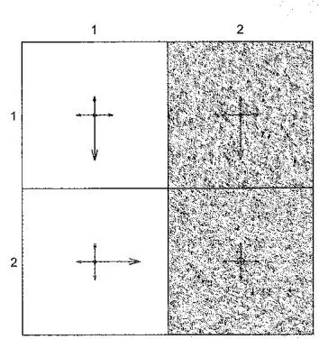

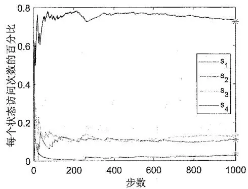
图8.5 $\epsilon$ -Greedy策略对应的平稳分布。其中 $\epsilon = 0.5$ 。右图中的星号表示 $d_{\pi}$ 中元素的理论值。

\- $d_{\pi}$ 的理论值：由该策略得到的马尔可夫过程是不可约的也是常规的，具体原因如下。首先，由于所有状态都是相通的，所以得到的马尔可夫过程是不可约的。其次，由于每个状态都可以转移到自身，因此马尔可夫过程也是常规的。从图8.5可以看出

$$
P_{\pi} ^{\mathrm{T}} = \left[ \begin{array}{c c c c} 0. 3 & 0. 1 & 0. 1 & 0 \\ 0. 1 & 0. 3 & 0 & 0. 1 \\ 0. 6 & 0 & 0. 3 & 0. 1 \\ 0 & 0. 6 & 0. 6 & 0. 8 \end{array} \right]
$$

通过计算可得 $P_{\pi}^{\mathrm{T}}$ 的特征值为 $\{-0.0449, 0.3, 0.4449, 1\}$ 。 $P_{\pi}^{\mathrm{T}}$ 对应于特征值1的右特征向量为[0.0463, 0.1455, 0.1785, 0.9720]。将这个向量缩放从而使所有元素的总和等于1后，可得 $d_{\pi}$ 的理论值为

$$
d_{\pi} = \left[ \begin{array}{l} 0. 0345 \\ 0. 1084 \\ 0. 1330 \\ 0. 7241 \end{array} \right].
$$

其中 $d_{\pi}$ 的第 $i$ 个元素对应于智能体访问到 $s_i$ 的概率。

\- $d_{\pi}$ 的估计值：下面通过在仿真中执行策略足够多次来得到 $d_{\pi}$ 的估计值。具体来说，选择 $s_1$ 作为起始状态并按照策略运行1000步。图8.5展示了在此过程中每个状态被访问次数的比例。可以看出，这些比例在几百步后逐渐收敛到 $d_{\pi}$ 的理论值。

### 8.2.2 优化算法

为了最小化(8.3)中的目标函数 $J(w)$ ，我们可以使用梯度下降算法：

$$
w_{k + 1} = w_{k} - \alpha_{k} \nabla_{w} J (w_{k}),
$$

其中的梯度是

$$
\begin{array}{r l} & {\nabla_{w} J (w_{k}) = \nabla_{w} \mathbb{E} [ (v_{\pi} (S) - \hat{v} (S, w_{k})) ^{2} ]} \\ & {\qquad = \mathbb{E} [ \nabla_{w} (v_{\pi} (S) - \hat{v} (S, w_{k})) ^{2} ]} \\ & {\qquad = 2 \mathbb{E} [ (v_{\pi} (S) - \hat{v} (S, w_{k})) (- \nabla_{w} \hat{v} (S, w_{k})) ]} \\ & {\qquad = - 2 \mathbb{E} [ (v_{\pi} (S) - \hat{v} (S, w_{k})) \nabla_{w} \hat{v} (S, w_{k}) ].} \end{array}
$$

将上面的梯度表达式代入梯度下降算法可得

$$
w_{k + 1} = w_{k} + 2 \alpha_{k} \mathbb{E} [ (v_{\pi} (S) - \hat{v} (S, w_{k})) \nabla_{w} \hat{v} (S, w_{k}) ],\tag{8.11}
$$

其中 $\alpha_{k}$ 前面的系数2可以在不失一般性的情况下合并到 $\alpha_{k}$ 中。

式(8.11)中的算法是无法直接使用的，因为它需要真实期望值，而真实期望值在实际中难以得到。此时，我们可以用随机梯度代替真实梯度，这是随机梯度下降算法的思想。那么(8.11)将变为

$$
w_{t + 1} = w_{t} + \alpha_{t} \big (v_{\pi} (s_{t}) - \hat{v} (s_{t}, w_{t}) \big) \nabla_{w} \hat{v} (s_{t}, w_{t}),\tag{8.12}
$$

其中 $s_t$ 是 $t$ 时刻得到的 $S$ 的一个样本。

式(8.12)中的算法仍然是无法直接使用的，因为它需要真实的状态价值 $v_{\pi}$ ，这是未知的也正是我们需要估计的。此时，我们可以用一个近似值替换 $v_{\pi}(s_t)$ ，具体来说有下面两种方法。

◇ 蒙特卡罗方法：如果我们有一个从 $s_{t}$ 开始的回合数据，设 $g_{t}$ 为从 $s_{t}$ 开始的折扣回报，那么 $g_{t}$ 可以用作 $v_{\pi}(s_{t})$ 的近似值。此时，式(8.12)中的算法变为

$$
w_{t + 1} = w_{t} + \alpha_{t} \big (g_{t} - \hat{v} (s_{t}, w_{t}) \big) \nabla_{w} \hat{v} (s_{t}, w_{t}).
$$

这是基于值函数的蒙特卡罗算法。

◇ 时序差分方法：根据时序差分的思想，我们可以用TD误差 $r_{t+1} + \gamma \hat{v}(s_{t+1}, w_t) - \hat{v}(s_t, w_t)$ 来代替真实误差 $v_\pi(s_t) - \hat{v}(s_t, w_t)$ 。此时，式(8.12)中的算法变为

$$
w_{t + 1} = w_{t} + \alpha_{t} \left[ r_{t + 1} + \gamma \hat{v} (s_{t + 1}, w_{t}) - \hat{v} (s_{t}, w_{t}) \right] \nabla_{w} \hat{v} (s_{t}, w_{t}).\tag{8.13}
$$

这就是基于值函数的TD算法。详细流程见算法8.1。


<pre class="pseudocode">
初始化：参数可微的值函数 $\hat{v}(s,w)$ 。初始参数 $w_0$ 。
目标：估计一个给定策略 $\pi$ 的状态值。
对于由 $\pi$ 生成的每个回合 $\{(s_t,r_{t + 1},s_{t + 1})\}_{t}$
  对于每个样本 $(s_t,r_{t + 1},s_{t + 1})$
    对于一般值函数： $w_{t + 1} = w_t + \alpha_t[r_{t + 1} + \gamma \hat{v} (s_{t + 1},w_t) - \hat{v} (s_t,w_t)]\nabla_w\hat{v} (s_t,w_t)$
    对于线性值函数： $w_{t + 1} = w_t + \alpha_t[r_{t + 1} + \gamma \phi^{\mathrm{T}}(s_{t + 1})w_t - \phi^{\mathrm{T}}(s_t)w_t]\phi (s_t)$
</pre>


理解(8.13)中的TD算法对于理解本章中的其他算法至关重要。值得注意的是，(8.13)是用于估计状态值的，我们将在第8.3.1节和第8.3.2节中推广到动作值估计。

### 8.2.3 选择值函数

为了应用(8.13)中的TD算法，我们需要选择合适的值函数 $\hat{v}(s,w)$ 。目前最常见的是使用人工神经网络：神经网络的输入是状态 $s$ ，输出是 $\hat{v}(s,w)$ ，网络参数是 $w$ 。下面重点介绍历史上早期使用较广泛的线性函数，其优势是具有较强的理论可解释性，其劣势是具有较弱的近似能力，并且实际中往往难以选取合适的特征向量（feature vector）。不过作为最简单的情况，它对于我们理解基于值函数的TD方法非常重要。

具体来说，一个线性函数具有如下形式：

$$
\hat{v} (s, w) = \phi^{\mathrm{T}} (s) w,
$$

其中 $\phi(s) \in \mathbb{R}^m$ 是状态 $s$ 的特征向量。 $\phi(s)$ 和 $w$ 的维度等于 $m$ ，而 $m$ 通常远小于状态的个数。例如，如果函数对应的是一阶直线或者二阶曲线（参见(8.1)和(8.2))，那么对应的 $m$ 等于 2 或者 3。值得注意的是，这里的“线性函数”指的是函数对 $w$ 呈线性，而并非对 $s$ 呈线性。例如(8.2)中的函数不是 $w$ 的线性函数，而是 $s$ 的二次非线性函数。

线性函数的梯度非常简单：

$$
\nabla_{w} \hat{v} (s, w) = \phi (s).
$$

将上式代入(8.13)可得

$$
w_{t + 1} = w_{t} + \alpha_{t} \big [ r_{t + 1} + \gamma \phi^{\mathrm{T}} (s_{t + 1}) w_{t} - \phi^{\mathrm{T}} (s_{t}) w_{t} \big ] \phi (s_{t}).\tag{8.14}
$$

这是基于线性值函数的TD算法，我们将其简称为TD-Linear。

线性情况比非线性情况具有更强的理论可解释性。然而，它的近似能力较弱，而且选择合适的特征向量也并非易事。相比之下，人工神经网络作为通用非线性函数近似器，能够近似更加复杂的函数，而且由于不需要选择特征向量，使用起来也更为方便。

尽管如此，学习线性情况仍然是有意义的。第一，基于表格的TD算法可以被视为一种特殊的基于线性值函数的TD算法。这个结论非常重要，一方面，它统一了表格和值函数两种方法；另一方面，也说明了线性值函数方法的强大。关于这个结论的更多细节可参见方框8.2。第二，理解线性情况可以帮助读者更好地掌握值函数方法的思想。第三，对于简单的网格世界任务，线性情况已经足够了（参见第8.2.4节给出的例子）。



下面展示[第7章](ch07.md)式(7.1)给出的基于表格的TD算法是(8.14)中给出的TD-Linear算法的一个特殊情况。

对任意状态 $s \in S$ ，构造如下特殊的特征向量：

$$
\phi (s) = e_{s} \in \mathbb{R} ^{n}.
$$

这里 $e_{s}$ 是一个向量，其中与 $s$ 对应的元素为1，其他元素为0。此时，线性函数的表达式是

$$
\hat{v} (s, w) = e_{s} ^{\mathrm{T}} w = w (s),
$$

其中 $w(s)$ 是参数向量 $w$ 中与 $s$ 对应的元素。将上式代入(8.14)中的TD-Linear算法可得

$$
w_{t + 1} = w_{t} + \alpha_{t} \big (r_{t + 1} + \gamma w_{t} (s_{t + 1}) - w_{t} (s_{t}) \big) e_{s_{t}}.
$$

由于 $e_{s_t}$ 中只有对应 $s_t$ 的元素等于1而其他元素都等于0，因此上式只是更新了 $\pmb{w}$ 中对应于 $s_t$ 的那个元素，而其他元素不变。为了更清楚地看到这一点，对上式两边同时乘以 $e_{s_t}^{\mathrm{T}}$ 可得

$$
w_{t + 1} (s_{t}) = w_{t} (s_{t}) + \alpha_{t} \big (r_{t + 1} + \gamma w_{t} (s_{t + 1}) - w_{t} (s_{t}) \big).
$$

这正是式(7.1)中给出的基于表格的TD算法。

总而言之，通过选择特征向量为 $\phi(s) = e_s$ ，基于线性值函数的TD-Linear算法就可以变成基于表格的TD算法。



### 8.2.4 示例

下面通过一些例子来展示如何使用(8.14)中的TD-Linear算法来估计一个策略的状态值。同时，我们也将展示如何选择特征向量。

图8.6给出了一个网格世界的例子。图8.6(a)展示的是一个给定的策略，它在任意状态下采取任意动作的概率都是0.2。我们的任务是估计此策略的状态值。首先，通过求解贝尔曼方程的方式可得真实状态值，参见图8.6(b)。这些状态值以3D曲面的形式在图8.6(c)中给出。

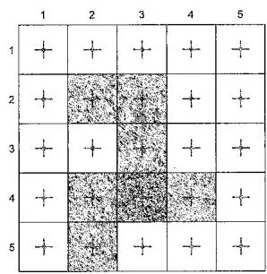
(a)

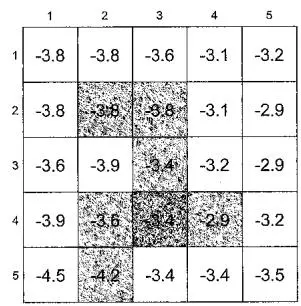
(b)

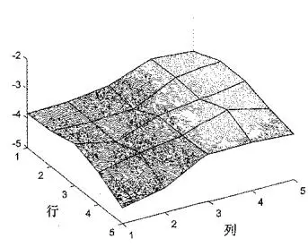
(c)
图8.6 (a)一个给定的策略。(b)表格形式的真实状态值。(c)3D曲面形式的真实状态值。

该例子中一共有25个状态，因此有25个状态值。下面展示如何用具有少于25个参数的线性函数来近似状态值。仿真设置如下。由给定策略生成500个回合，每个回合有500步，并从一个按均匀分布随机选择的状态-动作开始。此外，在每次仿真中，参数向量w被随机初始化，其中每个元素都从均值为0且标准差为1的正态分布中采样得到。设定 $r_{forbidden}=r_{boundary}=-1,r_{target}=1,\gamma=0.9$ 。

为了应用 TD-Linear 算法，首先需要选择特征向量 $\phi(s)$ 。有多种方法来选择特征向量。

基于多项式的特征向量。在网格世界的例子中，一个状态 $s$ 对应一个二维的位置。令 $x$ 和 $y$ 分别代表状态 $s$ 的列索引和行索引。为了避免数值问题，对 $x$ 和 $y$ 进行归一化，使它们的值在 $[-1, +1]$ 区间内。为方便起见，归一化后的值也用 $x$ 和 $y$ 表示。那么，最简单的特征向量是

$$
\phi (s) = \left[ \begin{array}{l} x \\ y \end{array} \right] \in \mathbb{R} ^{2}.
$$

此时对应的线性函数是

$$
\hat{v} (s, w) = \phi^{\mathrm{T}} (s) w = [ x, y ] \left[ \begin{array}{l} w_{1} \\ w_{2} \end{array} \right] = w_{1} x + w_{2} y.
$$

如果 w 固定而 x, y 是自变量，那么 $\hat{v}(s, w) = w_{1}x + w_{2}y$ 代表一个通过原点的二维平面。由于状态值近似对应的平面可能不经过原点，因此需要引入一个偏置从而更好地近似状态值。因此，如下的三维特征向量更为合理：

$$
\phi (s) = \left[ \begin{array}{l} 1 \\ x \\ y \end{array} \right] \in \mathbb{R} ^{3}.\tag{8.15}
$$

此时值函数是

$$
\hat{v} (s, w) = \phi^{\mathrm{T}} (s) w = [ 1, x, y ] \left[ \begin{array}{l} w_{1} \\ w_{2} \\ w_{3} \end{array} \right] = w_{1} + w_{2} x + w_{3} y.
$$

如果 $w$ 固定而 $x, y$ 是自变量，那么 $\hat{v}(s, w)$ 对应于一个可以不经过原点的平面。另外， $\phi(s)$ 也可以定义为 $\phi(s) = [x, y, 1]^{\mathrm{T}}$ ，其元素的顺序没有关系。

基于(8.15)中的特征向量，如果我们使用TD-Linear算法，最后得到的值函数如图8.7(a)所示。尽管估计误差会随着更多回合而逐渐收敛，但是由于2D平面的近似能力有限，因此误差不能收敛到0。

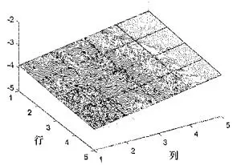

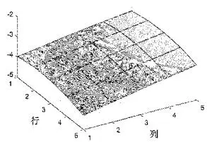

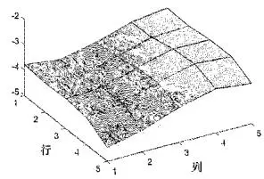

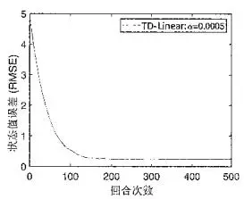
(a) $\phi (s)\in \mathbb{R}^3$

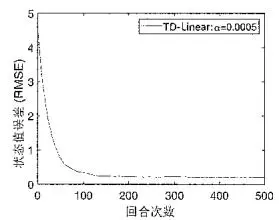
(b) $\phi(s) \in \mathbb{R}^6$

(c) $\phi (s)\in \mathbb{R}^{10}$
图8.7 基于(8.15)、(8.16)、(8.17)中的多项式特征向量，利用TD-Linear算法得到的结果。

为了增强近似能力，可以增加特征向量的维度，例如使用如下六维特征向量：

$$
\phi (s) = [ 1, x, y, x^{2}, y^{2}, x y ] ^{\mathrm{T}} \in \mathbb{R} ^{6}.\tag{8.16}
$$

此时，线性值函数的表达式是 $\hat{v}(s, w) = \phi^{\mathrm{T}}(s)w = w_{1} + w_{2}x + w_{3}y + w_{4}x^{2} + w_{5}y^{2} + w_{6}xy$ ，这对应了一个三维曲面。当然，我们还可以进一步增加特征向量的维度：

$$
\phi (s) = [ 1, x, y, x^{2}, y^{2}, x y, x^{3}, y^{3}, x^{2} y, x y^{2} ] ^{\mathrm{T}} \in \mathbb{R} ^{10}.\tag{8.17}
$$

当使用(8.16)和(8.17)中的特征向量时，TD-Linear的估计结果如图8.7(b)和(c)所示。可以看出，特征向量维数越高，状态值的近似就越精确。然而，在这三种情况下估计误差都不能收敛到0，这是因为这些线性函数的近似能力仍然有限。

☐ 除了基于多项式的特征向量，还有许多其他类型的特征向量，如傅里叶基（Fourier basis）和平铺编码（tile coding）[3, [第9章](ch09.md)]。具体来说，首先将每个状态的x和y归一化到[0,1]区间，基于傅里叶基的特征向量是

$$
\phi (s) = \left[ \begin{array}{c} \vdots \\ \cos \big (\pi (c_{1} x + c_{2} y) \big) \\ \vdots \end{array} \right] \in \mathbb{R} ^{(q + 1) ^{2}}.\tag{8.18}
$$

这里 $\pi$ 表示圆周率而不是策略。上式中的 $c_{1}, c_{2}$ 可以在 $\{0, 1, \ldots, q\}$ 中取值，其中 $q$ 是用户指定的整数。因此， $(c_{1}, c_{2})$ 一共有 $(q + 1)^{2}$ 种可能的取值，所以 $\phi(s)$ 的维度是 $(q + 1)^{2}$ 。例如，如果 $q = 1$ ，那么特征向量是

$$
\phi (s) = \left[ \begin{array}{c} \cos (\pi (0 x + 0 y)) \\ \cos (\pi (0 x + 1 y)) \\ \cos (\pi (1 x + 0 y)) \\ \cos (\pi (1 x + 1 y)) \end{array} \right] = \left[ \begin{array}{c} 1 \\ \cos (\pi y) \\ \cos (\pi x) \\ \cos (\pi (x + y)) \end{array} \right] \in \mathbb{R} ^{4}.
$$

如果选取 q = 1, 2, 3，那么使用 TD-Linear 算法获得的结果如图8.8所示。在这三种情况中，特征向量的维度分别为4, 9, 16。可以看出，特征向量的维度越高，状态值的近似越精确。

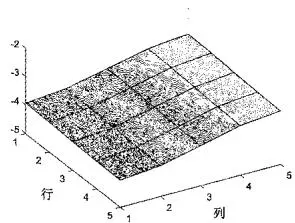

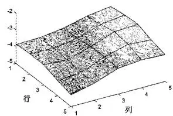

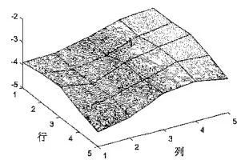

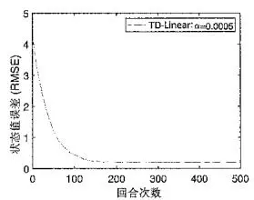
(a) $q = 1$ ，此时 $\phi (s)\in \mathbb{R}^4$

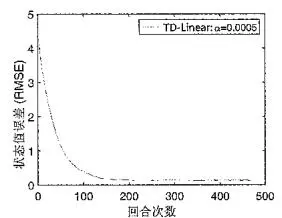
(b) $q = 2$ ，此时 $\phi (s)\in \mathbb{R}^9$

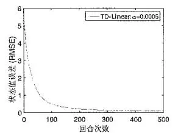
(c) $q = 3$ ，此时 $\phi (s)\in \mathbb{R}^{16}$
图8.8 基于(8.18)中的傅里叶基函数特征向量使用TD-Linear算法得到的结果。

### 8.2.5 理论分析

前面几个小节介绍了基于值函数的TD算法。我们介绍的思路始于(8.3)中的目标函数。为了优化这个目标函数，我们引入了(8.12)中的随机梯度算法。后来，该算法中未知的真实状态值被一个近似值替代，从而产生了(8.13)中的TD算法。

这个介绍思路非常直观易懂，不过它在数学上并不严谨。例如，(8.13)中的算法实际上并不是在优化(8.3)中的目标函数。不过对于大部分读者来说，了解这个思路脉络已经足够了。

下面我们对(8.13)中的TD算法进行严格的理论分析，以揭示该算法为何能有效工作以及究竟解决了什么数学问题。由于非线性值函数难以分析，因此这部分只考虑线性值函数的情况。这部分内容涉及大量的数学内容，建议读者根据自己的兴趣选读，直接跳过本小节不会影响后续学习。

## 收敛性分析

为了研究算法(8.13)的收敛性质，我们首先考虑如下算法：

$$
w_{t + 1} = w_{t} + \alpha_{t} \mathbb{E} \Big [ \big (r_{t + 1} + \gamma \phi^{\mathrm{T}} (s_{t + 1}) w_{t} - \phi^{\mathrm{T}} (s_{t}) w_{t} \big) \phi (s_{t}) \Big ],\tag{8.19}
$$

其中的期望是针对三个随机变量 $s_t, s_{t+1}, r_{t+1}$ 。算法(8.19)是确定性的，因为所有随机变量在计算期望后都消失了。

为什么我们要考虑(8.19)中这个确定性算法呢？首先，该确定性算法的收敛性更容易分析（尽管其分析也并非一蹴而就）。更重要的是，该确定性算法的收敛性能够推导出算法(8.13)的收敛性，这是因为(8.13)可以被视为(8.19)的随机梯度下降版本。因此，我们只需要分析该确定性算法的收敛性。

尽管算法(8.19)的表达式乍一看很复杂，但实际上可以大大简化。假设 $s_t$ 服从平稳分布 $d_\pi$ （平稳分布在方框8.1中已经有详细介绍）。定义

$$
\bar{\Phi} = \left[ \begin{array}{c} \vdots \\ \phi^{\mathrm{T}} (s) \\ \vdots \end{array} \right] \in \mathbb{R} ^{n \times m}, \quad D = \left[ \begin{array}{c c c} \ddots & & \\ & d_{\pi} (s) & \\ & & \ddots \end{array} \right] \in \mathbb{R} ^{n \times n},\tag{8.20}
$$

其中矩阵 $\Phi$ 的每一行对应一个状态的特征向量，对角阵 $D$ 的对角线元素是平稳分布向量中的元素。基于这两个矩阵，我们可以把(8.19)大大简化。


引理8.1。式(8.19)中的期望可以重写为

$$
\mathbb{E} \Big [ \big (r_{t + 1} + \gamma \phi^{\mathrm{T}} (s_{t + 1}) w_{t} - \phi^{\mathrm{T}} (s_{t}) w_{t} \big) \phi (s_{t}) \Big ] = b - A w_{t},
$$

其中

$$
\begin{array}{l} {A \doteq \Phi^{\mathrm{T}} D (I - \gamma P_{\pi}) \Phi \in \mathbb{R} ^{m \times m},} \\ {b \doteq \Phi^{\mathrm{T}} D r_{\pi} \in \mathbb{R} ^{m}.} \end{array}\tag{8.21}
$$

这里 $P_{\pi}, r_{\pi}$ 是贝尔曼方程 $v_{\pi} = r_{\pi} + \gamma P_{\pi}v_{\pi}$ 中的两个量，而I是具有合适维度的单位矩阵。


该引理的证明在方框8.3中给出。

根据引理8.1中的表达式，(8.19)中的算法可以重写为

$$
w_{t + 1} = w_{t} + \alpha_{t} (b - A w_{t}).\tag{8.22}
$$

这是一个确定性迭代算法，其收敛性分析如下所示。

第一，我们先回答一个问题：假设 $w_{t}$ 会收敛到一个常值 $w^{*}$ ，那么 $w^{*}$ 是什么？如果已经收敛，那么(8.22)中的 $w_{t}$ 、 $w_{t+1}$ 就变为 $w^{*}$ ，所以有 $w^{*} = w^{*} + \alpha_{\infty}(b - Aw^{*})$ ，进而可得 $b - Aw^{*} = 0$ ，因此

$$
w^{*} = A^{- 1} b.
$$

关于这个收敛值，下面给出几点说明。

◇ A 是否可逆？答案是可逆的。事实上，A 不仅可逆，还是（非对称）正定的，即对于任意具有合适维度的非零向量 x 都有 $x^{T}Ax > 0$ 。证明可见方框8.4。

◇ $w^{*} = A^{-1}b$ 究竟是什么？它实际上是最小化投影贝尔曼误差（projected Bellman error）的最优解。详细内容将稍后介绍。

◇ 我们已经在方框8.2介绍过：如果选择特殊的特征向量，基于值函数的TD-Linear算法就退化成为基于表格的TD算法。下面我们把这个特殊的特征向量代入 $w^{*}$ ，看能够得到什么有意思的结论。具体来说，选择特征向量为 $\phi(s)=[0,\ldots,1,\ldots,0]^{\mathrm{T}}$ （其中与s相对应的元素为1，其他都为0），将其代入(8.21)可得

$$
w^{*} = A^{- 1} b = v_{\pi}.\tag{8.23}
$$

上式表明，该TD-Linear算法学习的参数就是真实的状态值。因为基于表格的TD算法就是在估计状态值，所以上式再次印证了基于表格的TD算法是TD-Linear算法的一个特例。下面给出(8.23)的证明。首先，不难看出此时 $\Phi = I$ 。因此， $A = \Phi^{\mathrm{T}}D(I - \gamma P_{\pi})\Phi = D(I - \gamma P_{\pi})$ ， $b = \Phi^{\mathrm{T}}Dr_{\pi} = Dr_{\pi}$ ，进而有 $w^{*} = A^{-1}b = (I - \gamma P_{\pi})^{-1}D^{-1}Dr_{\pi} = (I - \gamma P_{\pi})^{-1}r_{\pi} = v_{\pi}$ 。

第二，下面证明算法(8.22)中的 $w_{t}$ 会随着 $t\to\infty$ 收敛到 $w^{*}=A^{-1}b$ 。由于(8.22)是一个确定性迭代算法，因此可以通过多种方式证明。我们提供如下两种证明。

假设 $s_t$ 服从平稳分布 $d_{\pi}$ 。通过使用总期望定律（Law of total expectation）可以得到
$\mathbb{E}\Big[r_{t + 1}\phi (s_t) + \phi (s_t)\big(\gamma \phi^{\mathrm{T}}(s_{t + 1}) - \phi^{\mathrm{T}}(s_t)\big)w_t\Big] = \sum_{s\in \mathcal{S}}d_{\pi}(s)\mathbb{E}\Big[r_{t + 1}\phi (s_t) + \phi (s_t)\big(\gamma \phi^{\mathrm{T}}(s_{t + 1}) - \phi^{\mathrm{T}}(s_t)\big)w_t|s_t = s\Big]\\ = \sum_{s\in \mathcal{S}}d_{\pi}(s)\mathbb{E}\Big[r_{t + 1}\phi (s_t)|s_t = s\Big] + \sum_{s\in \mathcal{S}}d_{\pi}(s)\mathbb{E}\Big[\phi (s_t)\big(\gamma \phi^{\mathrm{T}}(s_{t + 1}) - \phi^{\mathrm{T}}(s_t)\big)w_t|s_t = s\Big].$

◇ 证明1：定义收敛误差为 $\delta_t \doteq w_t - w^*$ ，我们只需要证明 $\delta_t$ 能收敛到0。具体来说，将 $w_t = \delta_t + w^*$ 代入(8.22)可得

$$
\delta_{t + 1} = \delta_{t} - \alpha_{t} A \delta_{t} = (I - \alpha_{t} A) \delta_{t}.
$$

因此可以得到

$$
\delta_{t + 1} = (I - \alpha_{t} A) \dots (I - \alpha_{0} A) \delta_{0}.
$$

考虑一个简单情况：对所有 $t$ 有 $\alpha_{t} = \alpha$ 。对上面等式两边求范数可得

$$
\| \delta_{t + 1} \| _{2} \leqslant \| I - \alpha A \| _{2} ^{t + 1} \| \delta_{0} \| _{2}.
$$

当 $\alpha > 0$ 足够小时，可得 $\| I - \alpha A \|_2 < 1$ ，因此随着 $t \to \infty$ 可知 $\delta_t \to 0$ 。这里之所以 $\| I - \alpha A \|_2 < 1$ 成立是因为 $A$ 是正定的，即对于任何 $x$ 有 $x^{\mathrm{T}}(I - \alpha A)x < 1$ 。

◇ 证明2：定义 $g(w) \doteq b - Aw$ 。由于 $w^{*}$ 是 $g(w) = 0$ 的根，因此这个问题可以被描述成一个求解方程的问题，而式(8.22)实际上是[第6章](ch06.md)介绍的罗宾斯-门罗（RM）算法。虽然原始的RM算法是为随机过程设计的，但它也可以应用于确定性情况。RM算法的收敛性可以揭示 $w_{t+1} = w_t + \alpha_t(b - Aw_t)$ 的收敛性，即当 $\sum_t \alpha_t = \infty$ 并且 $\sum_t \alpha_t^2 < \infty$ 时， $w_t$ 收敛于 $w^{*}$ 。 <!-- validate-skip -->

证明1和证明2给出了算法(8.22)收敛的两种条件。证明1说明了，当 $\alpha_{t}$ 是一个足够小的常数时，算法收敛。证明2说明了，当 $\alpha_{t}$ 满足 $\sum_{t} \alpha_{t} = \infty$ 和 $\sum_{t} \alpha_{t}^{2} < \infty$ 时，算法收敛。这两个条件在[第6章](ch06.md)介绍随机近似算法时也经常见到。

至此，我们证明了(8.22)的收敛性。由于(8.13)可以被视为(8.19)的随机梯度下降版本，因此其收敛性也可以得到。



第一，考虑(8.24)中的第一项。由于

$$
\mathbb{E} \left[ r_{t + 1} \phi (s_{t}) | s_{t} = s \right] = \phi (s) \mathbb{E} \left[ r_{t + 1} | s_{t} = s \right] = \phi (s) r_{\pi} (s),
$$

其中 $r_{\pi}(s) = \sum_{a}\pi (a|s)\sum_{r}rp(r|s,a)$ ，因此(8.24）中的第一项可以重写为

$$
\sum_{s \in \mathcal{S}} d_{\pi} (s) \mathbb{E} \left[ r_{t + 1} \phi \left(s_{t}\right) \mid s_{t} = s \right] = \sum_{s \in \mathcal{S}} d_{\pi} (s) \phi (s) r_{\pi} (s) = \Phi^{\mathrm{T}} D r_{\pi},\tag{8.25}
$$

其中 $r_{\pi} = [\dots ,r_{\pi}(s),\dots ]^{\mathrm{T}}\in \mathbb{R}^{n}$ 。

第二，考虑(8.24)中的第二项。由于

$$
\begin{array}{r l} & {\mathbb{E} \Big [ \phi (s_{t}) \big (\gamma \phi^{\mathrm{T}} (s_{t + 1}) - \phi^{\mathrm{T}} (s_{t}) \big) w_{t} \big | s_{t} = s \Big ]} \\ & {= - \mathbb{E} \Big [ \phi (s_{t}) \phi^{\mathrm{T}} (s_{t}) w_{t} \big | s_{t} = s \Big ] + \mathbb{E} \Big [ \gamma \phi (s_{t}) \phi^{\mathrm{T}} (s_{t + 1}) w_{t} \big | s_{t} = s \Big ]} \\ & {= - \phi (s) \phi^{\mathrm{T}} (s) w_{t} + \gamma \phi (s) \mathbb{E} \Big [ \phi^{\mathrm{T}} (s_{t + 1}) \big | s_{t} = s \Big ] w_{t}} \\ & {= - \phi (s) \phi^{\mathrm{T}} (s) w_{t} + \gamma \phi (s) \sum_{s^{\prime} \in S} p (s^{\prime} | s) \phi^{\mathrm{T}} (s^{\prime}) w_{t},} \end{array}
$$

因此(8.24)中的第二项变为

$$
\begin{array}{r l} & {\sum_{s \in \mathcal{S}} d_{\pi} (s) \mathbb{E} \Big [ \phi (s_{t}) \big (\gamma \phi^{\mathrm{T}} (s_{t + 1}) - \phi^{\mathrm{T}} (s_{t}) \big) w_{t} \big | s_{t} = s \Big ]} \\ & {= \sum_{s \in \mathcal{S}} d_{\pi} (s) \Big [ - \phi (s) \phi^{\mathrm{T}} (s) w_{t} + \gamma \phi (s) \sum_{s^{\prime} \in \mathcal{S}} p (s^{\prime} | s) \phi^{\mathrm{T}} (s^{\prime}) w_{t} \Big ]} \\ & {= \sum_{s \in \mathcal{S}} d_{\pi} (s) \phi (s) \Big [ - \phi (s) + \gamma \sum_{s^{\prime} \in \mathcal{S}} p (s^{\prime} | s) \phi (s^{\prime}) \Big ] ^{\mathrm{T}} w_{t}} \\ & {= \Phi^{\mathrm{T}} D (- \Phi + \gamma P_{\pi} \Phi) w_{t}} \\ & {= - \Phi^{\mathrm{T}} D (I - \gamma P_{\pi}) \Phi w_{t}.} \end{array}\tag{8.26}
$$

将(8.25)与(8.26)结合可得

$$
\begin{array}{r l} \mathbb{E} \left[ \left(r_{t + 1} + \gamma \phi^{\mathrm{T}} (s_{t + 1}) w_{t} - \phi^{\mathrm{T}} (s_{t}) w_{t}\right) \phi (s_{t}) \right] & = \Phi^{\mathrm{T}} D r_{\pi} - \Phi^{\mathrm{T}} D (I - \gamma P_{\pi}) \Phi w_{t} \\ & \doteq b - A w_{t}, \end{array} \tag{8.}\tag{8.27}
$$

其中 $b \doteq \Phi^{\mathrm{T}} Dr_{\pi}$ 且 $A \doteq \Phi^{\mathrm{T}} D (I - \gamma P_{\pi}) \Phi$ 。



{{< callout title="方框8.4：证明矩阵 $A = \Phi^{\mathrm{T}}D(I - \gamma P_{\pi})\Phi$ 可逆且正定" >}}

正定矩阵的定义是：如果 $x^{\mathrm{T}}Ax > 0$ 对于任意维数合适的非零向量 $x$ 都成立，那么矩阵 $A$ 是正定的。正定或负定分别表示为 $A\succ 0$ 、 $A\prec 0$ 。这里“>”和“<”应与“>”和“<”区分开来，后者表示元素间的比较。注意， $A$ 可能不是对称的。尽管正定矩阵通常指的是对称矩阵，但非对称矩阵也可以是正定的。一个常见的非对称正定矩阵就是旋转角度小于90度的旋转矩阵，感兴趣的读者可以自己思考一下原因。

下面证明 $A \succ 0$ 。证明的基本思路是先证明如下矩阵正定：

$$
D (I - \gamma P_{\pi}) \doteq M \succ 0.\tag{8.28}
$$

因为 $A = \Phi^{\mathrm{T}}M\Phi \succ 0$ ，其中 $\Phi$ 是一个列满秩的高矩阵（假设特征向量是线性独立的），所以 $M\succ 0$ 可以推出 $A\succ 0$ 。

为了证明 $M \succ 0$ ，首先注意到

$$
M = \frac{M + M^{\mathrm{T}}}{2} + \frac{M - M^{\mathrm{T}}}{2}.
$$

由于 $M - M^{\mathrm{T}}$ 是斜对称的（skew symmetric），因此对于任何 $x$ 有 $x^{\mathrm{T}}(M - M^{\mathrm{T}})x = 0$ 。所以我们知道 $M\succ 0$ 当且仅当 $M + M^{\mathrm{T}}\succ 0$ 。对 $M + M^{\mathrm{T}}\succ 0$ 的证明将基于如下结论：严格对角占优矩阵是正定的[4]。下面证明 $M$ 是严格对角占优的。

首先，我们要证明

$$
(M + M^{\mathrm{T}}) \mathbf{1} _{n} > 0,\tag{8.29}
$$

其中 $\mathbb{1}_n = [1,\dots ,1]^{\mathrm{T}}\in \mathbb{R}^n$ 。式(8.29)的证明如下所述。一方面，由于 $P_{\pi}\mathbf{1}_{n} = \mathbf{1}_{n}$ ，我们有 $M\mathbb{1}_n = D(I - \gamma P_\pi)\mathbb{1}_n = D(\mathbb{1}_n - \gamma \mathbb{1}_n) = (1 - \gamma)d_\pi$ 。另一方面， $M^{\mathrm{T}}\mathbb{1}_n = (I-$ $\gamma P_{\pi}^{\mathrm{T}})D\mathbb{1}_n = (I - \gamma P_\pi^{\mathrm{T}})d_\pi = (1 - \gamma)d_\pi$ ，其中最后一个等式成立是因为 $P_{\pi}^{\mathrm{T}}d_{\pi} = d_{\pi}$ 。联合这两方面可得

$$
(M + M^{\mathrm{T}}) \mathbb{1} _{n} = 2 (1 - \gamma) d_{\pi}.
$$

由于 $d_{\pi}$ 的所有元素都是正的（见方框8.1），可知 $(M + M^{\mathrm{T}})\mathbb{1}_n > 0$ 。其次，(8.29)的元素展开形式是

$$
\sum_{j = 1} ^{n} [ M + M^{\mathrm{T}} ] _{i j} > 0, \quad i = 1, \dots , n.
$$

上式可以进一步写成

$$
[ M + M^{\mathrm{T}} ] _{i i} + \sum_{j \neq i} [ M + M^{\mathrm{T}} ] _{i j} > 0.
$$

根据 $M = D(I - \gamma P_{\pi})$ 可知， $M$ 的对角线元素是正的，而 $M$ 的非对角线元素是非正的。因此，上面的不等式可以重写为

$$
\left| \left[ M + M^{\mathrm{T}} \right] _{i i} \right| > \sum_{j \neq i} \left| \left[ M + M^{\mathrm{T}} \right] _{i j} \right|.
$$

这表明了 $M + M^{\mathrm{T}}$ 中第 $i$ 个对角线元素大于同行中所有非对角线的绝对值之和。因此， $M + M^{\mathrm{T}}$ 是严格对角占优的，证明完毕。



## TD-Linear算法优化的是投影贝尔曼误差

上一节我们证明了 TD-Linear 算法收敛于 $w^{*} = A^{-1}b$ 。下面我们将证明 TD-Linear 算法实际上是在最小化投影贝尔曼误差，而 $w^{*}$ 就是最优解。为此，我们先梳理三个目标函数。

◇ 第一个目标函数是

$$
J_{E} (w) = \mathbb{E} [ (v_{\pi} (S) - \hat{v} (S, w)) ^{2} ].
$$

本章最开始就是使用这个目标函数来介绍值函数方法的思路的。该目标函数也可以等价地写成一个矩阵-向量形式：

$$
J_{E} (w) = \| \hat{v} (w) - v_{\pi} \| _{D} ^{2},
$$

其中 $v_{\pi}$ 是真实状态值向量，而 $\hat{v}(w)$ 是估计的值向量，这两个向量的每一个元素都对应一个状态。这里 $\| \cdot \|_D^2$ 是加权范数： $\| x\|_D^2 = x^{\mathrm{T}}Dx = \| D^{1/2}x\|_2^2$ ，其中 $D$ 已经在(8.20)中给出。

该目标函数是我们能想到的最简单的目标函数之一。然而，这个目标函数涉及未知的真实状态值，所以直接优化它是无法得到可行的算法的。因此，我们必须考虑其他目标函数。

第二个目标函数是贝尔曼误差（Bellman error）。具体来说，由于 $v_{\pi}$ 满足贝尔曼方程 $v_{\pi} = r_{\pi} + \gamma P_{\pi}v_{\pi}$ ，因此估计值 $\hat{v}(w)$ 也应尽可能满足此方程。贝尔曼误差的定义为

$$
J_{B E} (w) = \| \hat{v} (w) - (r_{\pi} + \gamma P_{\pi} \hat{v} (w)) \| _{D} ^{2} \doteq \| \hat{v} (w) - T_{\pi} (\hat{v} (w)) \| _{D} ^{2}.\tag{8.30}
$$

上式中 $T_{\pi}(\cdot)$ 是贝尔曼算子：对任意 $x \in \mathbb{R}^n$ 有

$$
T_{\pi} (x) \doteq r_{\pi} + \gamma P_{\pi} x.
$$

最小化贝尔曼误差是一个标准的最小二乘问题，具体细节这里不再赘述。

该目标函数可能无法被最小化到0，这是因为函数的近似能力有限，不一定能准确刻画所有状态值，从而无法严格满足一个贝尔曼方程。

第三个目标函数是投影贝尔曼误差（projected Bellman error）[50-54]，其定义为

$$
J_{\mathrm{PBE}} (w) = \left\| \hat{v} (w) - M T_{\pi} (\hat{v} (w)) \right\| _{D} ^{2},
$$

其中 $M \in \mathbb{R}^{n \times n}$ 是一个正交投影矩阵，它在几何上可将任意向量投影到函数能够近似的值空间上。矩阵 $M$ 的表达式将在(8.31)给出。

实际上，在(8.13)中的TD算法旨在最小化投影贝尔曼误差 $J_{PBE}$ ，而不是 $J_{E}$ 或 $J_{BE}$ 。而且 $J_{PBE}$ 一定可以被最小化到0。严格的数学证明见方框8.5，直观原因如下所述。在线性情况下， $\hat{v}(w)=\Phi w$ ，其中 $\Phi$ 已经在(8.20)中给出。 $\Phi$ 的列空间（range space）是该线性函数所有可能取值的集合。此时，

$$
M = \Phi (\Phi^{\mathrm{T}} D \Phi) ^{- 1} \Phi^{\mathrm{T}} D \in \mathbb{R} ^{n \times n}\tag{8.31}
$$

是一个可以将任意向量投影到 $\Phi$ 的列空间的投影矩阵。由于 $\hat{v}(w)$ 在 $\Phi$ 的列空间中，因此我们总能找到一个 $w$ 使得 $J_{\mathrm{PBE}}(w)$ 最小化至0。可以证明，最小化 $J_{\mathrm{PBE}}(w)$ 的解就是 $w^{*} = A^{-1}b$ ，即

$$
w^{*} = A^{- 1} b = \arg \min_{w} J_{\mathrm{PBE}} (w).
$$

具体证明见方框8.5。

{{< callout title="方框8.5：证明 $J_{\mathrm{PBE}}(w)$ 的最优解是 $w^{*} = A^{-1}b$" >}}

由于 $J_{\mathrm{PBE}}(w) = 0$ 等价于 $\hat{v}(w) - MT_{\pi}(\hat{v}(w)) = 0$ ，因此我们只需要求解

$$
\hat{v} (w) = M T_{\pi} (\hat{v} (w)).
$$

在线性情况下，将 $\hat{v}(w) = \Phi w$ 和 $M$ 在(8.31)中的表达式代入上式可得

$$
\Phi w = \Phi (\Phi^{\mathrm{T}} D \Phi) ^{- 1} \Phi^{\mathrm{T}} D (r_{\pi} + \gamma P_{\pi} \Phi w).\tag{8.32}
$$

假设 $\Phi$ 列满秩，对于任意向量 x, y，我们有 $\Phi x = \Phi y \Leftrightarrow x = y$ 。因此由 (8.32) 可得

$$
\begin{array}{l} w = (\Phi^{\mathrm{T}} D \Phi) ^{- 1} \Phi^{\mathrm{T}} D (r_{\pi} + \gamma P_{\pi} \Phi w) \\ \iff \Phi^{\mathrm{T}} D (r_{\pi} + \gamma P_{\pi} \Phi w) = (\Phi^{\mathrm{T}} D \Phi) w \\ \iff \Phi^{\mathrm{T}} D r_{\pi} + \gamma \Phi^{\mathrm{T}} D P_{\pi} \Phi w = (\Phi^{\mathrm{T}} D \Phi) w \\ \iff \Phi^{\mathrm{T}} D r_{\pi} = \Phi^{\mathrm{T}} D (I - \gamma P_{\pi}) \Phi w \\ \iff w = (\Phi^{\mathrm{T}} D (I - \gamma P_{\pi}) \Phi) ^{- 1} \Phi^{\mathrm{T}} D r_{\pi} = A^{- 1} b, \end{array}
$$

其中 $A, b$ 在(8.21)中给出。因此， $w^{*} = A^{-1}b$ 是最小化 $J_{\mathrm{PBE}}(w)$ 的最优解。



由于TD-Linear算法旨在最小化 $J_{\mathrm{PBE}}$ 而并非 $J_{\mathrm{E}}$ ，我们自然会问：算法最终得到的最优估计值与真正的状态值 $v_{\pi}$ 是否很接近？在线性情况下，最小化 $J_{\mathrm{PBE}}$ 的最优估计值是 $\hat{v}(w^{*}) = \Phi w^{*}$ ，其与真正的状态值 $v_{\pi}$ 的误差满足如下不等式：

$$
\| \Phi w^{*} - v_{\pi} \| _{D} \leqslant \frac{1}{1 - \gamma} \min_{w} \| \hat{v} (w) - v_{\pi} \| _{D} = \frac{1}{1 - \gamma} \min_{w} \sqrt{J_{\mathrm{E}} (w)}.\tag{8.33}
$$

该不等式的证明可参见方框8.6。不等式(8.33)表明 $\hat{v}(w^{*})$ 与 $v_{\pi}$ 之间的误差小于 $J_{\mathrm{E}}(w)$ 的最小值，因此在一定程度上说明了优化 $J_{\mathrm{PBE}}$ 得到的最优估计值与真实状态值是接近的。不过它给出的上界并不紧致，尤其是当 $\gamma$ 接近于1时，因此其价值主要体现在理论上。



首先，

$$
\begin{array}{r l} & {\| \Phi w^{*} - v_{\pi} \| _{D} = \| \Phi w^{*} - M v_{\pi} + M v_{\pi} - v_{\pi} \| _{D}} \\ & {\qquad \leqslant \| \Phi w^{*} - M v_{\pi} \| _{D} + \| M v_{\pi} - v_{\pi} \| _{D}} \\ & {\qquad = \| M T_{\pi} (\Phi w^{*}) - M T_{\pi} (v_{\pi}) \| _{D} + \| M v_{\pi} - v_{\pi} \| _{D},} \end{array}\tag{8.34}
$$

其中最后一个等号成立是因为 $\Phi w^{*} = MT_{\pi}(\Phi w^{*})$ 且 $v_{\pi} = T_{\pi}(v_{\pi})$ 。将

$$
\begin{array}{r l} M T_{\pi} (\Phi w^{*}) - M T_{\pi} (v_{\pi}) & = M (r_{\pi} + \gamma P_{\pi} \Phi w^{*}) - M (r_{\pi} + \gamma P_{\pi} v_{\pi}) \\ & = \gamma M P_{\pi} (\Phi w^{*} - v_{\pi}) \end{array}
$$

代入(8.34)可得

$$
\begin{array}{r l} & {{\| \Phi w^{*} - v_{\pi} \| _{D} \leqslant \| \gamma M P_{\pi} (\Phi w^{*} - v_{\pi}) \| _{D} + \| M v_{\pi} - v_{\pi} \| _{D}}} \\ & {{\quad \leqslant \gamma \| M \| _{D} \| P_{\pi} (\Phi w^{*} - v_{\pi}) \| _{D} + \| M v_{\pi} - v_{\pi} \| _{D}}} \\ & {{\quad = \gamma \| P_{\pi} (\Phi w^{*} - v_{\pi}) \| _{D} + \| M v_{\pi} - v_{\pi} \| _{D} \qquad (\mathrm{因为} \| M \| _{D} = 1)}} \\ & {{\quad \leqslant \gamma \| \Phi w^{*} - v_{\pi} \| _{D} + \| M v_{\pi} - v_{\pi} \| _{D}. \qquad (\mathrm{因为对于所有} x \mathrm{有} \| P_{\pi} x \| _{D} \leqslant \| x \| _{D})}} \end{array}
$$

至于为什么 $\| M\| _D = 1$ 以及 $\| P_{\pi}x\| _D\leqslant \| x\| _D$ 成立，这些证明会在方框最后给出。由上述不等式可以推出

$$
\begin{array}{r} \left\| \Phi w^{*} - v_{\pi} \right\| _{D} \leqslant \frac{1}{1 - \gamma} \| M v_{\pi} - v_{\pi} \| _{D} \\ = \frac{1}{1 - \gamma} \min_{w} \left\| \hat{v} (w) - v_{\pi} \right\| _{D}, \end{array}
$$

其中最后一个等号成立是因为 $Mv_{\pi}$ 是 $v_{\pi}$ 正交投影到所有可能的 $\hat{v}(w)$ 组成的集合。

最后，上面的证明中用到了一些小的结论，下面统一证明。

◇ 第一，证明加权范数的基本性质。根据定义， $\|x\|_D = \sqrt{x^{\mathrm{T}}Dx} = \|D^{1/2}x\|_2$ ，其对应的矩阵范数是 $\|A\|_D = \max_{x \neq 0} \|Ax\|_D / \|x\|_D = \|D^{1/2}AD^{-1/2}\|_2$ 。对于维度合适的矩阵 $A, B$ ，我们有 $\|ABx\|_D \leqslant \|A\|_D \|B\|_D \|x\|_D$ ，该式成立是因为 $\|ABx\|_D = \|D^{1/2}ABx\|_2 = \|D^{1/2}AD^{-1/2}D^{1/2}BD^{-1/2}D^{1/2}x\|_2 \leqslant \|D^{1/2}AD^{-1/2}\|_2 \|D^{1/2}BD^{-1/2}\|_2 \|D^{1/2}x\|_2 = \|A\|_D \|B\|_D \|x\|_D$ 。

第二，证明 $\| M\| _D = 1$ 。该式成立是因为 $\| M\| _D = \| \Phi (\Phi^{\mathrm{T}}D\Phi)^{-1}\Phi^{\mathrm{T}}D\| _D =$ $\| D^{1 / 2}\Phi (\Phi^{\mathrm{T}}D\Phi)^{-1}\Phi^{\mathrm{T}}DD^{-1 / 2}\| _2 = 1$ ，其中最后的等号成立是因为 $L_{2}$ 范数中的矩阵是一个正交投影矩阵，而任意正交投影矩阵的 $L_{2}$ 范数都等于1。

◇ 第三，证明 $\|P_{\pi}x\|_{D}\leqslant\|x\|_{D}$ 对任意 $x\in R^{n}$ 成立。首先，

$$
\begin{array}{r l r} & & {\| P_{\pi} x \| _{D} ^{2} = x^{\mathrm{T}} P_{\pi} ^{\mathrm{T}} D P_{\pi} x = \sum_{i, j} x_{i} [ P_{\pi} ^{\mathrm{T}} D P_{\pi} ] _{i j} x_{j}} \\ & & {= \sum_{i, j} x_{i} \left(\sum_{k} [ P_{\pi} ^{\mathrm{T}} ] _{i k} [ D ] _{k k} [ P_{\pi} ] _{k j}\right) x_{j}.} \end{array}
$$

重新组织上式最右侧的项可得

$$
\| P_{\pi} x \| _{D} ^{2} = \sum_{k} [ D ] _{k k} \left(\sum_{i} [ P_{\pi} ] _{k i} x_{i}\right) ^{2}
$$

$$
\begin{array}{r l} & {\leqslant  \sum_{k} [ D ] _{k k} \Big ( \sum_{i} [ P_{\pi} ] _{k i} x_{i} ^{2} \Big) \qquad (\text{由于Jensen不等式[55,56]})} \\ & {=  \sum_{i} \Big ( \sum_{k} [ D ] _{k k} [ P_{\pi} ] _{k i} \Big) x_{i} ^{2}} \\ & {=  \sum_{i} [ D ] _{i i} x_{i} ^{2} \qquad (\text{由于} d_{\pi} ^{\mathrm{T}} P_{\pi} = d_{\pi} ^{\mathrm{T}})} \\ & {= \| x \| _{D} ^{2}.} \end{array}
$$



## 最小二乘时序差分算法

下面介绍一种称为最小二乘 TD（least-squares TD, LSTD）的算法 [57]。与 TD-Linear 算法一样，LSTD 也旨在最小化投影贝尔曼误差，不过它相较 TD-Linear 算法有一些优势，详情如下所述。

前面已经介绍过：能最小化投影贝尔曼误差的最优参数是 $w^{*} = A^{-1}b$ ，其中 $A = \Phi^{T}D(I - \gamma P_{\pi})\Phi, b = \Phi^{T}Dr_{\pi}$ 。从(8.27)可以看出，A 和 b 也可以写成

$$
\begin{array}{l} A = \mathbb{E} \Big [ \phi (s_{t}) \big (\phi (s_{t}) - \gamma \phi (s_{t + 1}) \big) ^{\mathrm{T}} \Big ], \\ b = \mathbb{E} \Big [ r_{t + 1} \phi (s_{t}) \Big ]. \end{array}
$$

上式中的期望是针对随机变量 $s_t$ 、 $s_{t + 1}$ 、 $r_{t + 1}$ 而言的。

LSTD 的思路非常简单：既然我们已经知道最优解的表达式为 $w^{*} = A^{-1}b$ ，那么可以使用随机样本直接估计 A 和 b，假设得到的估计值为 $\hat{A}$ 和 $\hat{b}$ ，之后可以直接得到最优参数的估计 $w^{*} \approx \hat{A}^{-1}\hat{b}$ 。这个思路的核心是充分利用我们对最优解的理论知识。一般来说，对问题理解得越深入，能设计的算法就越好。

具体来说，假设 $(s_0, r_1, s_1, \ldots, s_t, r_{t+1}, s_{t+1}, \ldots)$ 是根据给定策略 $\pi$ 获得的轨迹。令 $\hat{A}_t, \hat{b}_t$ 分别为 $t$ 时刻 $A, b$ 的估计值，它们可以通过计算样本的平均值得到：

$$
\begin{array}{l} \hat{A} _{t} = \sum_{k = 0} ^{t - 1} \phi (s_{k}) (\phi (s_{k}) - \gamma \phi (s_{k + 1})) ^{\mathrm{T}}, \\ \hat{b} _{t} = \sum_{k = 0} ^{t - 1} r_{k + 1} \phi (s_{k}). \end{array}\tag{8.35}
$$

因此，在 $t$ 时刻最优参数的估计值为

$$
w_{t} = \hat{A} _{t} ^{- 1} \hat{b} _{t}.
$$

有的读者可能会问：式(8.35)右侧只有求和，是否需要除以 $t$ 才能得到平均值？实际上，如果 $\hat{A}_t$ 和 $\hat{b}_t$ 都除以 $t$ ，由于 $w_{t}$ 会对 $\hat{A}_t$ 求逆，因此最后得到的结果和不除以 $t$ 是一样的。此外，矩阵 $\hat{A}_t$ 可能是不可逆的，特别是在 $t$ 较小样本比较少的时候。为此，可以向 $\hat{A}_t$ 添加一个小的常数矩阵 $\sigma I$ 再来求逆（这里 $\sigma$ 是一个小的正数）。

LSTD的优势在于它使用经验样本更高效，并且比TD-Linear收敛得更快。这是因为该算法是基于最优解表达式的知识专门设计的。LSTD的缺点如下：第一，它只能估计状态值，相比之下，前面介绍的基于值的TD算法可以推广到估计动作值（如下一节所示）；第二，LSTD只适用于线性函数，而无法适用于非线性函数，这是因为该算法是基于线性情况下最优解 $w^{*}$ 的表达式专门设计的；第三，LSTD计算量较高，因为需要在每个更新步骤中计算一个 $m \times m$ 的矩阵，并且需要计算 $\hat{A}_{t}$ 的逆，其计算复杂度为 $O(m^{3})$ 。解决这个问题的常见方法是直接更新 $\hat{A}_{t}$ 的逆，而不是更新 $\hat{A}_{t}$ 。具体来说， $\hat{A}_{t+1}$ 可以通过如下迭代计算得到：

$$
\begin{array}{r l} & {\hat{A} _{t + 1} = \sum_{k = 0} ^{t} \phi (s_{k}) \big (\phi (s_{k}) - \gamma \phi (s_{k + 1}) \big) ^{\mathrm{T}}} \\ & {\quad = \sum_{k = 0} ^{t - 1} \phi (s_{k}) \big (\phi (s_{k}) - \gamma \phi (s_{k + 1}) \big) ^{\mathrm{T}} + \phi (s_{t}) \big (\phi (s_{t}) - \gamma \phi (s_{t + 1}) \big) ^{\mathrm{T}}} \\ & {\quad = \hat{A} _{t} + \phi (s_{t}) \big (\phi (s_{t}) - \gamma \phi (s_{t + 1}) \big) ^{\mathrm{T}}.} \end{array}
$$

上式将 $\hat{A}_{t + 1}$ 拆分成了两个矩阵的和。因此，根据矩阵和的逆的性质[58]，可以计算得到

$$
\begin{array}{r} \hat{A} _{t + 1} ^{- 1} = \left(\hat{A} _{t} + \phi (s_{t}) (\phi (s_{t}) - \gamma \phi (s_{t + 1})) ^{\mathrm{T}}\right) ^{- 1} \\ = \hat{A} _{t} ^{- 1} + \frac{\hat{A} _{t} ^{- 1} \phi (s_{t}) (\phi (s_{t}) - \gamma \phi (s_{t + 1})) ^{\mathrm{T}} \hat{A} _{t} ^{- 1}}{1 + (\phi (s_{t}) - \gamma \phi (s_{t + 1})) ^{\mathrm{T}} \hat{A} _{t} ^{- 1} \phi (s_{t})}. \end{array}
$$

这样我们可以直接存储和更新 $\hat{A}_t^{-1}$ ，以避免计算矩阵的逆。这种递归算法不需要步长，不过它需要设置 $\hat{A}_0^{-1}$ 的初始值，一般该初始值可选为 $\hat{A}_0^{-1} = \sigma I$ ，其中 $\sigma$ 是一个较小的正数。关于迭代最小二乘法，感兴趣的读者可以参见[59]。

## 8.3 基于值函数的时序差分：动作值估计

上一节介绍了状态值估计，本节将推广到动作值估计，具体将介绍基于值函数的Sarsa和基于值函数的Q-learning。读者将看到本节的介绍非常简洁，这是因为许多内容可以直接由上一节的内容推广而来，因此读者应该首先对上一节的内容有比较好的理解。

### 8.3.1 基于值函数的Sarsa

如果将算法(8.13)中的状态值替换为动作值，那么可以立即得到基于值函数的Sarsa算法。

具体来说，设 $\hat{q}(s,a,w)$ 为动作值函数，用于近似 $q_{\pi}(s,a)$ 。将(8.13)中的 $\hat{v}(s,w)$ 替换为 $\hat{q}(s,a,w)$ 可得

$$
w_{t + 1} = w_{t} + \alpha_{t} \Big [ r_{t + 1} + \gamma \hat{q} (s_{t + 1}, a_{t + 1}, w_{t}) - \hat{q} (s_{t}, a_{t}, w_{t}) \Big ] \nabla_{w} \hat{q} (s_{t}, a_{t}, w_{t}).\tag{8.36}
$$

对(8.36)的分析可以非常丰富，不过因为与(8.13)非常类似，这里不再赘述。当使用线性函数时，我们有

$$
\hat{q} (s, a, w) = \phi^{\mathrm{T}} (s, a) w,
$$

其中 $\phi (s,a)$ 是一个特征向量，此时 $\nabla_w\hat{q} (s,a,w) = \phi (s,a)$ 。

算法(8.36)只用来估计状态值，即做策略评价。我们可以将其与策略改进步骤相结合，从而学习最优策略。详细步骤在算法8.2中给出。这里需要注意的是，准确估计某一给定策略的动作值需要执行(8.36)足够多的次数。不过算法8.2在仅执行一次(8.36)后就立即切换到策略改进步骤，这是广义策略迭代（generalized policy iteration）的思想，与表格式Sarsa算法是类似的。此外，算法8.2旨在寻找从预设状态出发到达目标状态的最优策略，因此它并不需要为每个状态找到最优策略。当然，也可以稍微修改该算法以得到所有状态的最优策略。


<pre class="pseudocode">
初始化: 初始参数 $w_0$ 。初始策略 $\pi_0$ 。对所有 $t$，设置 $\alpha_t = \alpha &gt; 0$ 。$\epsilon \in (0,1)$。
目标: 学习最优策略从而使智能体能从给定状态 $s_0$ 出发到达目标状态。
对于每个回合
    在 $s_0$，根据 $\pi_0(s_0)$，得到 $a_0$
    在时刻 $t$，如果 $s_t$ 不是目标状态
    收集经验样本 ($s_t, a_t, r_{t+1}, s_{t+1}, a_{t+1}$)：在 $s_t$，执行 $a_t$，通过与环境交互生成 $r_{t+1}, s_{t+1}$，再根据 $\pi_t(s_{t+1})$ 生成 $a_{t+1}$
    更新值:
    $w_{t+1} = w_t + \alpha_t \left[ r_{t+1} + \gamma \hat{q}(s_{t+1}, a_{t+1}, w_t) - \hat{q}(s_t, a_t, w_t) \right] \nabla_w \hat{q}(s_t, a_t, w_t)$
    更新策略:
    $\pi_{t+1}(a|s_t) = 1 - \frac{\epsilon(|\mathcal{A}(s_t)|-1)}{|\mathcal{A}(s_t)|}$，如果 $a = \arg\max_{a \in \mathcal{A}(s_t)} \hat{q}(s_t, a, w_{t+1})$ $\pi_{t+1}(a|s_t) = \frac{\epsilon}{|\mathcal{A}(s_t)|}$，如果 $a \neq \arg\max_{a \in \mathcal{A}(s_t)} \hat{q}(s_t, a, w_{t+1})$ $s_t \leftarrow s_{t+1}, a_t \leftarrow a_{t+1}$
</pre>


图8.9展示了一个例子，其中的任务是找到从左上角状态出发到目标状态的最优策略。如图所示，随着策略的不断改进，每个回合的奖励回报逐渐增加，而且每个回合的长度也逐渐缩短。在这个例子中，选取的线性特征向量是阶数为5的傅里叶基函数，其表达式可参见(8.18)。

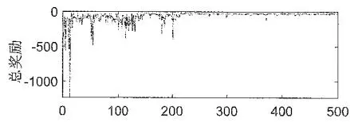

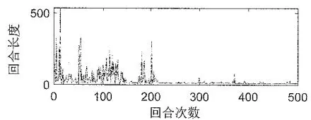

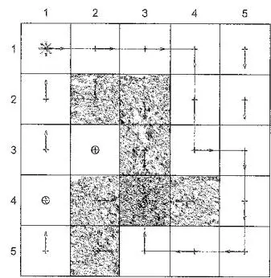
图8.9 基于值函数的Sarsa算法。参数设置为 $\gamma = 0.9, \epsilon = 0.1, r_{\mathrm{boundary}} = r_{\mathrm{forbidden}} = -10, r_{\mathrm{target}} = 1, \alpha = 0.001$ 。

### 8.3.2 基于值函数的Q-learning

基于表格的Q-learning也可以推广到基于函数的Q-learning算法：

$$
w_{t + 1} = w_{t} + \alpha_{t} \Big [ r_{t + 1} + \gamma \max_{a \in \mathcal{A} (s_{t + 1})} \hat{q} (s_{t + 1}, a, w_{t}) - \hat{q} (s_{t}, a_{t}, w_{t}) \Big ] \nabla_{w} \hat{q} (s_{t}, a_{t}, w_{t}).\tag{8.37}
$$

该算法与(8.36)中的Sarsa算法非常类似，区别仅在于(8.36)中的 $\hat{q}(s_{t + 1},a_{t + 1},w_t)$ 被换成了 $\max_{a\in \mathcal{A}(s_{t + 1})}\hat{q} (s_{t + 1},a,w_t)$ 。

与表格情形类似，(8.37)也是Off-policy的，因此可以按照On-policy的模式或者Off-policy的模式来实现。算法8.3给出了一个On-policy的版本。Off-policy的版本将在下一节介绍深度Q-learning时展示。

图8.10给出了一个例子，其中的任务是找到从左上角状态到目标状态的最优策略。如图所示，基于线性函数的Q-learning能够成功学习到最优策略。该例子使用了5阶的傅里叶基函数。

一些读者可能注意到了，在算法8.2和算法8.3中，尽管值以函数形式表示，但是策略 $\pi (a|s)$ 仍然以表格形式表示。因此，需要假设状态和动作的数量是有限的。在[第9章](ch09.md)中，我们将看到策略也可以被表示为函数，以便处理连续的状态和动作空间。


<pre class="pseudocode">
初始化: 初始参数 $w_0$ 。初始策略 $\pi_0$ 。对于所有t，设置 $\alpha_t = \alpha &gt; 0$ 。$\epsilon \in (0,1)$ 。

目标: 学习最优策略从而使智能体能从给定状态 $s_0$ 出发到达目标状态。

对每一个回合

在t时刻，如果 $s_t$ 不是目标状态

收集经验样本 $(s_t, a_t, r_{t+1}, s_{t+1})$ ：在 $s_t$，根据 $\pi_t(s_t)$ 产生 $a_t$，通过与环境互动生成 $r_{t+1}, s_{t+1}$

更新值:

$w_{t+1} = w_t + \alpha_t \left[ r_{t+1} + \gamma \max_{a \in A} \hat{q}(s_{t+1}, a, w_t) - \hat{q}(s_t, a_t, w_t) \right] \nabla_w \hat{q}(s_t, a_t, w_t)$

更新策略:

$\pi_{t+1}(a|s_t) = 1 - \frac{\epsilon(|A(s_t)| - 1)}{|A(s_t)|}$，如果 $a = \arg\max_{a \in A(s_t)} \hat{q}(s_t, a, w_{t+1})$ $\pi_{t+1}(a|s_t) = \frac{\epsilon}{|A(s_t)|}$，如果 $a \neq \arg\max_{a \in A(s_t)} \hat{q}(s_t, a, w_{t+1})$
</pre>


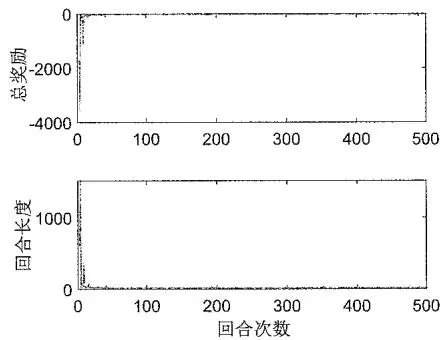

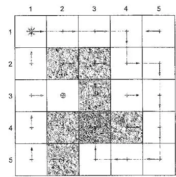
图8.10 基于线性函数的Q-learning。其中 $\gamma = 0.9, \epsilon = 0.1, r_{\mathrm{boundary}} = r_{\mathrm{forbidden}} = -10, r_{\mathrm{target}} = 1, \alpha = 0.001$ 。

## 8.4 深度Q-learning

我们可以将深度神经网络整合到Q-learning中，以获得一种称为深度Q-learning（deep Q-learning）或深度Q网络（deep Q-network, DQN）[22, 60, 61]的方法。深度Q-learning是最早和最成功的深度强化学习算法之一。对于简单的任务，神经网络并不需要很深。例如，对于网格世界这样的简单任务，具有2层甚至1层隐藏层的网络可能就足够了。深度Q-learning可以被视为(8.37)中算法的扩展，不过它的数学表达和实现细节有许多不同，详见下文。## 8.4.1 算法描述

从数学上讲，深度 Q-learning 旨在最小化如下目标函数：

$$
J = \mathbb{E} \left[ \left(R + \gamma \max_{a \in \mathcal{A} (S^{\prime})} \hat{q} (S^{\prime}, a, w) - \hat{q} (S, A, w)\right) ^{2} \right],\tag{8.38}
$$

其中 $(S,A,R,S')$ 是随机变量，分别表示状态、动作、即时奖励、下一个状态。

如何理解这个目标函数呢？实际上，它对应了贝尔曼最优误差：当 $\hat{q}(S, A, w)$ 等于最优动作值时， $R + \gamma \max_{a \in \mathcal{A}(S')} \hat{q}(S', a, w) - \hat{q}(S, A, w)$ 在期望意义上应等于0。这可以由下面的贝尔曼最优方程看出：

$$
q (s, a) = \mathbb{E} \left[ R_{t + 1} + \gamma \max_{a \in{\mathcal{A}} (S_{t + 1})} q (S_{t + 1}, a)   \Big |   S_{t} = s, A_{t} = a \right], \quad \text{对所有}   s, a.
$$

上式是贝尔曼最优方程（证明见方框7.5）。从该式可以看出，当 $\hat{q}(S, A, w)$ 等于最优动作值时， $R + \gamma \max_{a \in \mathcal{A}(S')} \hat{q}(S', a, w) - \hat{q}(S, A, w)$ 在期望意义上等于0。

如何最小化(8.38)中的目标函数呢？可以使用梯度下降算法。为此，我们需要计算 $J$ 关于 $w$ 的梯度。值得注意的是，参数 $w$ 不仅出现在 $\hat{q}(S, A, w)$ 中，也出现在 $y \doteq R + \gamma \max_{a \in \mathcal{A}(S')} \hat{q}(S', a, w)$ 中，其梯度的计算并非易事。因此，可以假设 $y$ 中 $w$ 的值在短时间内是固定不变的，这样就可以比较容易地计算梯度。具体来说，引入两个网络：一个是用于表示 $\hat{q}(s, a, w)$ 的主网络（main network），另一个是用于表示 $\hat{q}(s, a, w_{\mathrm{T}})$ 的目标网络（target network）。此时，目标函数变为

$$
J = \mathbb{E} \left[ \left(R + \gamma \max_{a \in \mathcal{A} (S^{\prime})} \hat{q} (S^{\prime}, a, w_{\mathrm{T}}) - \hat{q} (S, A, w)\right) ^{2} \right],
$$

当 $w_{T}$ 固定不变时，容易计算出J的梯度为

$$
\nabla_{w} J = - \mathbb{E} \left[ \left(R + \gamma \max_{a \in \mathcal{A} (S^{\prime})} \hat{q} (S^{\prime}, a, w_{\mathrm{T}}) - \hat{q} (S, A, w)\right) \nabla_{w} \hat{q} (S, A, w) \right],\tag{8.39}
$$

上式省略了一些不重要的常数系数。

为了使用(8.39)中的梯度来最小化目标函数，我们需要注意以下技巧。

第一个技巧是使用两个网络：一个主网络和一个目标网络。虽然前面已经提到了这一点，但下面会再介绍实施的一些细节。令 $w$ 和 $w_{\mathrm{T}}$ 分别表示主网络和目标网络的参数，它们的初始值相同。

每次迭代会从回放缓冲区（replay buffer）抽取一小批次的样本 $\{(s,a,r,s')\}$ （回放缓冲区稍后会介绍）。主网络的输入是 s 和 a，输出 $y=\hat{q}(s,a,w)$ 是估计的 q 值，输出的目标值是 $y_{T}\doteq r+\gamma\max_{a\in\mathcal{A}(s')} \hat{q}(s',a,w_{T})$ 。主网络更新是为了最小化样本 $\{(s,a,y_{T})\}$ 上的 TD 误差（也称为损失函数） $\sum(y-y_{T})^{2}$ 。

更新主网络参数并不是显式地使用(8.39)中的梯度。相反，它需要小批量的样本并基于现有的神经网络训练工具来更新参数，这是和不使用神经网络的一个显著区别。

虽然每次迭代中都会更新主网络，但是目标网络并非每次都更新，而是隔一定数量的迭代后更新为与主网络相同的参数。这样就可以满足计算(8.39)中的梯度时 $w_{T}$ 是固定不变的假设。

第二个技巧是经验回放（experience replay）[22, 60, 62]。在收集了一些经验样本后，我们不会按照它们被收集的顺序使用这些样本，而是将它们存储在一个称为回放缓冲区的集合中。例如，设 $(s, a, r, s')$ 为一个经验样本， $\mathcal{B} \doteq \{(s, a, r, s')\}$ 为回放缓冲区。每次更新主网络时，从回放缓冲区抽取小批量的经验样本，这个过程被称为经验回放。抽取经验样本时应该服从均匀分布。

为什么在深度 Q-learning 中需要经验回放？为什么经验回放应该服从均匀分布？答案在于(8.38)中的目标函数。具体来说，为了定义该目标函数，我们必须指定 S、A、R、 $S'$ 的概率分布。当 $(S, A)$ 给定时，R 和 $S'$ 的分布由系统模型确定。因此，我们只需要指定 $(S, A)$ 的分布。如果我们没有对采样过程的先验知识，那么最简单的方法是假设它是均匀分布的。然而，实际中对 $(S, A)$ 的采样很可能不是均匀分布的，因此为了满足均匀分布的假设，需要打破序列中样本之间的相关性。为此，可以使用经验回放技术，按照均匀分布从回放缓冲区随机抽取样本，这是经验回放的必要性和为什么服从均匀分布的理论原因。最后，经验回放的另一个好处是每个经验样本可能会被多次使用，可以提高数据利用率。

算法8.3给出了深度Q-learning的实施过程。该算法采用了Off-policy模式，即使用其他策略收集得到的经验数据来学习最优策略。当然，如果需要，也不难修改得到On-policy模式。

### 8.4.2 示例

图8.11中的例子展示了算法8.4，其任务是得到每一个状态-动作的最优动作值，进而得到最优策略。

行为策略如图8.11(a)所示，该行为策略是探索性的，它在所有状态下采取任意动作的概率都是相同的。由该行为策略生成的一个有1000步的回合如图8.11(b)所示。尽管该回合只有1000步，但由于行为策略有较强的探索能力，因此几乎所有的状态-动作在这个回合中都被访问到了。回放缓冲区包含1000个经验样本。每次训练的批量大小都是100，即每次从重放缓冲区中均匀抽取100个样本。


<pre class="pseudocode">
初始化：一个主网络和一个目标网络，它们具有相同的初始参数。

目标：得到一个目标网络，能从给定行为策略 $\pi_{b}$ 生成的经验样本中学习最优动作值，进而得到最优策略。

将 $\pi_b$ 生成的经验样本存储在回放缓冲区 $\mathcal{B} = \{(s, a, r, s')\}$

对于每次迭代

从 $\mathcal{B}$ 中均匀抽取一小批量样本

对于每个样本 $(s, a, r, s')$ ，计算目标值 $y_{\mathrm{T}} = r + \gamma \max_{a \in \mathcal{A}(s')} \hat{q}(s', a, w_{\mathrm{T}})$ ，

其中 $w_{\mathrm{T}}$ 是目标网络的参数

使用小批量样本更新主网络，以最小化 $(y_{\mathrm{T}} - \hat{q}(s,a,w))^2$

每 $C$ 次迭代更新 $w_{\mathrm{T}}$ 为 $w_{\mathrm{T}} = w$
</pre>


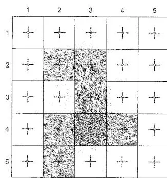
(a) 行为策略

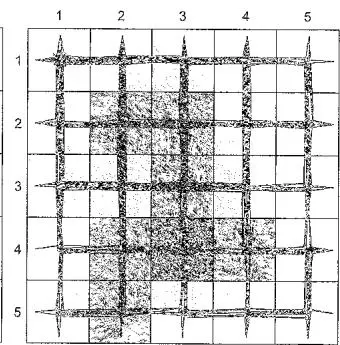
(b) 一个有1000步的回合

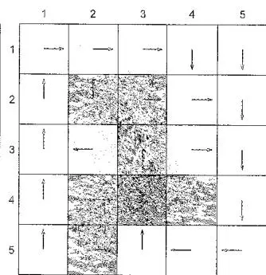
(c) 最终学习到的策略

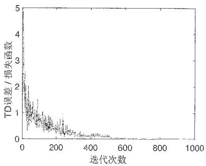
(d) 损失函数逐渐收敛到 0

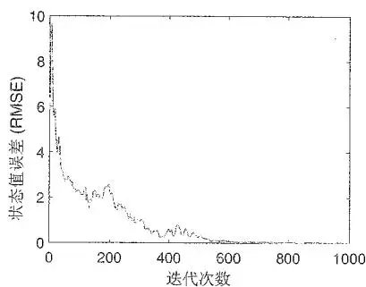
(e) 最优值的估计误差逐渐收敛到 0
图8.11 利用深度Q-learning学习最优策略。其中 $\gamma = 0.9, r_{\mathrm{boundary}} = r_{\mathrm{forbidden}} = -10, r_{\mathrm{target}} = 1$ 。

主网络和目标网络具有相同的结构：仅包含一层隐藏层的全连接网络，隐藏层有100个神经元（层数和神经元数量可以调整）。该网络有三个输入和一个输出。前两个输入是状态对应的归一化后的行和列的索引，第三个输入是归一化后的动作索引。这里“归一化”指的是将所有值都转换到[0,1]区间。该网络的输出是估计的最优值。有的读者可能会问：为什么网络的输入是状态对应的行和列，而不是状态的索引？这是因为我们知道状态对应于网格中的二维位置。在设计神经网络时使用的关于状态的先验信息越多，学习的效果越好。当然，网络也可以有其他设计方式。例如，它可以有2个输入和5个输出，其中2个输入是归一化的行和列，输出是输入状态对应的5个动作值的估计[22]。

基于上述网络，学习的过程如图8.11(d)～(e)所示。其中损失函数对应每个小批量的平均TD误差的平方，可以看到损失函数逐渐收敛到0，这意味着网络可以很好地拟合训练样本。另外，值估计误差也收敛到0，这意味着最后的值估计足够准确，进而得到的贪婪策略是最优的。

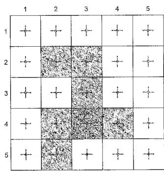
(a) 行为策略

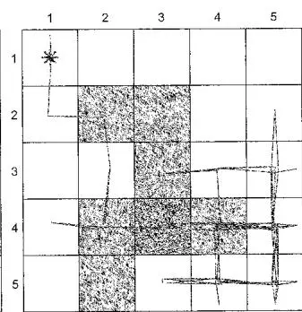
(b) 一个有100步的回合

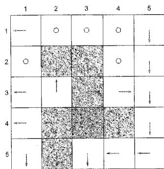
(c) 最终学习到的策略

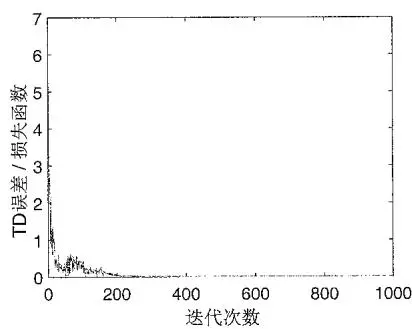
(d) 损失函数逐渐收敛到 0

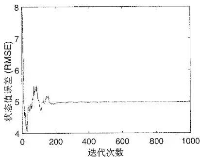
(e) 最优值的估计误差无法收敛到 0
图8.12 利用深度Q-learning学习最优策略：经验数据不足的例子。其中 $\gamma = 0.9, r_{\mathrm{boundary}} = r_{\mathrm{forbidden}} = -10, r_{\mathrm{target}} = 1$ 。

这个例子展示了深度Q-learning的高效性：从一个仅有1000步的回合就足以学习到最优策略。相比之下，基于表格的Q-learning需要100000步的回合才能收敛（参见图7.4）。其高效的原因是值函数法相比表格法具有更强的泛化能力，此外，经验样本也可以被反复使用，具有较高的数据使用效率。

最后，我们考虑一个有趣的例子。图8.12展示了一个仅有100步的回合。基于深度Q-learning，网络可以很好地训练（即损失函数收敛到0），但是值估计误差不能收敛到0（参见图8.12(e)）。虽然网络可以正确地拟合给定的经验样本，但是由于经验样本太少，因此无法准确估计最优值。

## 8.5 总结

本章仍然是在介绍TD算法，只不过从表格法转向了函数法。理解值函数法的关键是要将其描述为一个优化问题。其中最简单的目标函数是真实值和估计值之间的误差。此外还有其他目标函数，例如贝尔曼误差和投影贝尔曼误差。在算法方面，我们首先介绍了用于估计状态值的算法，进而推广到Sarsa和Q-learning。

值函数法重要的一个原因是它能将人工神经网络与强化学习结合起来。例如，深度Q-learning是早期最成功的深度强化学习算法之一。尽管神经网络已被广泛用作非线性函数近似器，但本章仍然对历史上早期研究比较多的线性函数情况进行了全面介绍。这一方面是因为充分理解线性情况对于更好地理解非线性情况至关重要，另一方面是因为基于表格的TD算法可以被视为一种特殊的基于线性值函数的TD算法。感兴趣的读者可以参考[63]以深入学习基于值函数的TD算法。关于深度Q-learning的更多理论讨论可以参见[61]。

此外，本章还介绍了一个重要概念：平稳分布。这个概念在定义目标函数时扮演了重要的角色。在下一章，我们将看到这个概念在使用策略函数时也会起到关键作用。关于这个概念的更多内容可以参见[49, 第IV章]。最后，本章的一些数学内容重度依赖于矩阵分析，一些结果未经解释即使用，相关基础知识可以参见[4, 48]。

## 8.6 问答

◇ 提问：表格法与值函数法的区别是什么？

回答：两者最直接的区别在于值的检索方式和更新方式。

检索方式：在表格法中，如果我们想要检索一个值，可以直接读取表格中的相应元素。然而在值函数法中，我们需要将状态输入到函数中并计算一次函数值。

更新方式：在表格法中，如果我们想要更新一个值，可以直接重写表格中的相应元素。然而在值函数法中，我们需要通过更新函数参数的方式来改变那个值。

◇ 提问：值函数法相比表格法有什么优势？

回答：由于值的检索方式不同，因此值函数法的存储效率更高。例如，表格法需要存储所有状态/动作对应的值，而值函数法只需要存储一个参数向量，而且其维度通常远小于状态/动作的个数。

由于值的更新方式不同，值函数法的泛化能力更强。具体来说，在表格法中，更新一个值不会改变其他值。然而，在值函数法中，针对一个状态/动作更新函数参数会影响其他值，因此一个状态/动作的经验样本可以泛化到其他状态值/动作值的估计。

◇ 提问：我们能将表格法和值函数法统一吗？

回答：可以。表格法可以被视为值函数法的一个特殊情况，通过选择线性函数和特殊的特征向量，值函数法可以退化成表格法。相关细节可参见方框8.2。

◇ 提问：什么是平稳分布？为什么它很重要？

回答：平稳分布描述了马尔可夫决策过程的长期行为。具体来说，当智能体执行一个给定的策略足够长的时间后，智能体访问任一状态的概率可以由这个平稳分布来描述。更多信息参见方框8.1。

这个概念之所以重要是因为我们在定义目标函数时需要描述状态的分布。平稳分布不仅对于值函数法重要，它在[第9章](ch09.md)介绍的基于策略函数的方法中也很重要。

值得指出的是，虽然该概念非常基础和重要，但是它通常不会出现在算法表达式中，因此大部分读者只需要知道这个概念的存在就足够了。

◇ 提问：线性值函数法有哪些优点和缺点？

回答：线性函数是值函数法最简单的情况，我们可以透彻分析其理论性质，因此学习线性情况可以帮助读者更好地掌握值函数法的思想。更为重要的是，之前介绍的表格法是一个特殊的线性情况，因此线性情况也是十分重要的。然而，线性函数的近似能力有限，另外在复杂任务中选择合适的特征向量也并非易事。相比之下，人工神经网络可以作为非线性函数的通用近似器，使用更为友好。

◇ 提问：为什么深度 Q-learning 需要经验回放？

回答：原因在于方程(8.38)中的目标函数。具体来说，为了有效地定义目标函数，我们必须指定 $S$ 、 $A$ 、 $R$ 、 $S'$ 的概率分布，其中一旦给定 $(S,A)$ ， $R$ 和 $S'$ 的分布就由系统模型决定，因此我们只需要指定状态-动作 $(S,A)$ 的分布，其最简单的方式是假设它是均匀分布的。然而，实际中的状态-动作样本可能不是均匀分布的。为了满足均匀分布的假设，有必要打破序列中样本之间的相关性。为此，可以使用经验回放技术，通过从回放缓冲区均匀抽取样本来近似满足这一假设。此外，经验回放的一个好处是每个样本可能被多次使用，从而增加数据效率。

◇ 提问：基于表格的 Q-learning 能使用经验回放吗？

回答：尽管基于表格的 Q-learning 不必须使用经验回放，但它也可以使用经验回放而不会带来什么问题。这是因为 Q-learning 是 Off-policy 算法，对样本是如何获取的没有特别要求。

◇ 提问：为什么深度 Q-learning 需要两个网络？

回答: 本质原因是简化式(8.38)的梯度计算。具体来说, 参数 w 不仅出现在 $\hat{q}(S, A, w)$ 中, 还出现在 $R + \gamma \max_{a \in \mathcal{A}(S')} \hat{q}(S', a, w)$ 中。因此, 计算关于 w 的梯度并非易事。如果在短时间内固定 $R + \gamma \max_{a \in \mathcal{A}(S')} \hat{q}(S', a, w)$ 中的 w, 则梯度计算可以大大简化（参见式(8.39))。这种梯度计算方法需要两个网络: 主网络的参数在每次迭代中都会更新, 而目标网络的参数在一段时间内是固定的, 每隔一段时间更新一次。

◇ 提问：如果基于人工神经网络来实现函数近似，应该如何更新其参数？

回答：此时我们不应该直接使用诸如式(8.37)的算法来更新神经网络的参数，该算法更多的是给予原理上的支撑。在具体编程时，应通过指定损失函数并利用成熟的神经网络训练工具来实现参数的更新。
