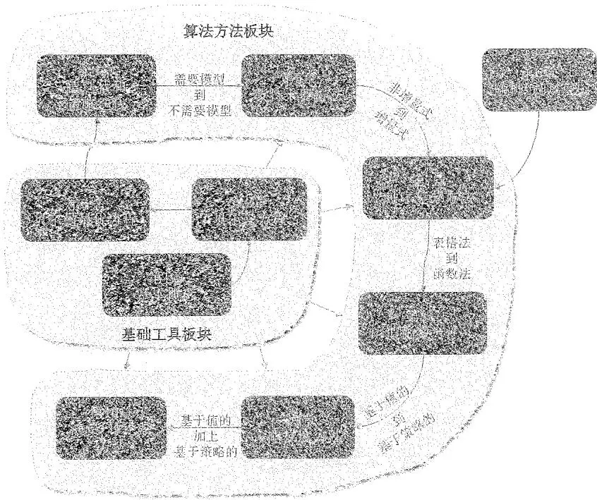

# 前言

## 内容简介

本书从强化学习最基本的概念开始介绍，将介绍基础的分析工具，包括贝尔曼方程和贝尔曼最优方程，然后推广到基于模型的和无模型的强化学习算法，最后推广到基于值函数和策略函数的强化学习方法。本书强调从数学的角度引入概念、分析问题、分析算法。本书不要求读者具备任何关于强化学习的知识背景，仅要求读者具备一定的概率论和线性代数的知识。如果读者已经具备强化学习的学习基础，本书可以帮助读者更深入地理解一些问题并提供新的视角。

本书面向对强化学习感兴趣的本科生、研究生、研究人员和企业或研究所的从业者。

本教材的英文版已于2022年8月发布在GitHub上，供国内外读者免费下载阅读，其纸质版分别于2024年底和2025年初由清华大学出版社和施普林格自然出版社在国内外发行。自上线以来，本教材得到了许多关注，我也收到了不少反馈。其中有一些有意思的故事，借着这次机会，我想和大家分享一下。

这个自序可能有点长，我想和大家分享的东西不少，大家可以把它当作学习之余的休闲。

## 为什么要做这个教程？

曾经有小伙伴在我的线上课程视频下留言，原文是：“您是怎么学得这么透彻的呢，学习路线是什么样子的呢？”我回复的原文是“这个问题有点意思：如果一开始就能顺利而透彻地学习，我又怎么会呕心沥血去做这样一个教程呢？强化学习有多难学透，局中人才了解。”

我为什么要花大量时间来做这个教程呢？虽然国内外已经有很多关于强化学习的书籍和课程，但是我自己学习强化学习的过程是十分痛苦的。现有的教程大部分比较偏向直观，也有一些是比较偏向控制理论的。直观的解释往往难以令人透彻理解，而偏向控制理论的教程则需要专业背景。所以，我觉得现有教程中存在一个鸿沟。我想做一个新的教程，既能通过数学解释让读者“透彻理解”，又能通过创新体系架构和直观例子让读者“快速理解”。

我做这个教程的另一个原因在于自己的学习习惯。多年的研究经历让我有了一个习惯：打破砂锅问到底。对于一个算法，许多人可能知道怎么用就行了，但是我必须知道为什么，否则心里没有安全感，所以会一直往下挖，等所有的来龙去脉都搞清楚了，我才会安心。因此，我在学习过程中积累了大量的笔记资料，后来就想把这些资料整理后分享出来。

做这个教程的更深原因可能来源于早些年种在我内心中的一颗种子。虽然我是一名科研人员，但是一直觉得教学也能产生很大的影响力。为什么这么说呢？因为我自己就被深深地影响过！虽然我在本科期间上过线性代数的课程，但是在读博士时又自学了一遍，当时用的是MIT的Gilbert Strang教授的线性代数教材，我相信很多人都读过这本书。他在2023年退休了，当时网上还有一些讨论和感慨。他的书给我留下了很深的印象，感觉自己能够沉醉其中，并且在读的时候不禁感叹“太优美了”，有时候自己还能够会心一笑，我现在还清晰地记得当时读那本书会心一笑的场景。这个可能是种在我心里的一颗种子，希望有机会我也能写一本能帮助很多人的教材。如果你在读我的教程时也能够会心一笑，这将是我至高无上的荣幸。

## 究竟花了多少时间？

如果当初知道要花这么多时间，我可能就不会去做这个教程了。但是好在人生没有那么多“如果”，否则也不会有那么多惊喜了。

我究竟花了多少时间来做这个教程呢？这个很难统计，不过我简单算了一下。这本教材约300页，所有内容都由我亲自开发，包括数学推导、例子设计、仿真绘图、语言组织等。如果平均一天工作八小时，那么能不能写出来一页呢？我想了想，答案是不能。本质原因是现在没有一本类似的教材可以供我参考，我需要从零开始去开发。例如，我需要首先从大量文献中把分散的内容挖掘出来，之后用合适的方式将这些内容有机地组织在一起，再配上严格的数学推导和直观的例子说明，最后一遍又一遍地不断优化结构和文字。这些事情耗费的时间是难以想象的。所以，大家现在看到的10小时的课程视频，是我花了几百倍的时间浓缩而成的作品。如果你觉得好，那一定是有原因的。我经常去参观一些博物馆，当看到一些好物件，例如瓷器或手工艺品时，我经常会感叹“好东西啊好东西”。很多东西一看就知道当初那个工匠在这上面花了很多时间和心血，我自己也一直比较推崇工匠精神。

开发这个教程的过程中的酸甜苦辣，一般人是体会不了的。因为我还有很多其他事情要处理，中间有好几次想过放弃。不过随着投入的时间越来越多，后来想放弃也越来越困难，好在最后还是咬牙坚持下来了。值得庆幸的是，我经过多年的科研训练，学习能力还处于巅峰的状态，科技写作的经验也相对丰富，这些对我最终完成这个教程起到了重要的作用。有不少同学留言问我能不能做其他课程或者知识点的教学视频，虽然我很感谢大家的信任，但是我的统一回复都是：实在“肝”不动了。

## 这么做值得吗？

对于一个大学老师来说，花费如此巨大的精力和时间值得吗？当很多同学和老师和我说我的教程给了他们很大帮助时，我觉得是值得的！

截至 2025 年 3 月，教材在 GitHub 已经收获 7000+ 星，课程视频在 B 站等平台播放总和超过 130 万次，它也是中国大学 MOOC 上的第一个强化学习课程。此外，有很多热心读者在网上发布了他们学习我的课程的笔记，单单这些笔记就已经得到了很多关注。还有一些读者把我的教程里面所有的例子都自己动手编程复现了出来，也有读者录制了视频来重新解读我的课程，我都很受触动。这些笔记和代码等资料的链接我都已经放到了 GitHub 的主页上。

我自己也收到了很多国内外邮件来信，其中一些给我留下了深刻的印象。例如，有一个在美国加州留学的中国学生给我写邮件，很坦诚地说他一般只看西方的教材和课程视频，因为他觉得西方的质量更高，但是他说我的课程是一个“反例”，给他带来了很大的帮助。这个同学给我留下了很深的印象，因为我觉得只要我们中国人愿意用心去做一件事情，那就一定能做好！此外，我也收到了一些国内外大学老师的来信，希望把我的教材或者课件用在他们的教学上，我一般都会非常开心地支持。

## 该怎么学习强化学习？

在大家都推崇“快速入门”和“无痛学习”的情况下，为什么我会反其道而行之，竟然要介绍数学原理呢？

我们要回答的第一个问题是：真的有必要学习数学吗？其实一门课究竟该怎么教或学，不完全取决于我们的主观想法，而是应该基于这门课的客观特点。强化学习具有两个特点：一个是数学性，另一个是系统性。很多读者觉得强化学习比其他人工智能领域更难入门，这与其数学性和系统性有很大关系。

数学性：强化学习从其诞生之初就有很强的数学性。虽然近些年在与深度学习结合之后，强化学习的工程性和实验性越来越强，但是理解强化学习的基础原理始终是入门的关键一步，这对于将来正确使用已有算法或者研发新型算法都十分必要。我们必须要面对的事实是：如果想透彻地理解强化学习，其数学原理是不可回避的。如果不讲背后的数学，而只是通过文字直观解释，那么很多时候看似懂了，但是经常会有云里雾里、似懂非懂的感觉。相反，如果我们从数学的角度去学习，便能够更加透彻地理解很多算法的本质，而且学习效率可能更高，花费的时间可能更短。我相信许多读者都有过这样的体验：一个数学公式胜过千言万语的文字描述。

此外，数学其实并不总是令人生畏的。只要通过富有逻辑的方式呈现，掌握好数学知识的深度和广度，完全可以写出一本既适合入门又能揭示强化学习本质的书籍。在我的教程里面，我也不是一味地堆砌公式，因为那没有意义，关键是怎样从读者的角度去帮助读者更好地理解。我把很多数学内容放到了灰色的方框里面，明确告诉读者这些是选学内容，大家可以根据自己的情况选择性阅读。在教程视频里面，我对许多数学证明也尽量点到为止，让感兴趣的读者去书中自学。不过，有许多读者会很细致地阅读书中的数学推导并且给我反馈，这出乎我的意料也让我很欣慰，起码我写的一些很细节的东西还是帮助到了大家。

系统性：强化学习的系统性很强，许多概念一环扣一环。要想深入地理解强化学习，就要从最基础的概念出发，一点一滴地学习。这也是我建议大家放弃“速成”想法的一个重要原因。如果大家上来就学习Q-learning或者Actor-Critic的方法，连基本的概念都没有搞清楚，那么往往会一知半解。这个教程的一个新颖之处就是对现有方法的梳理：大家可以看书里的第一张图，这张图明确指出了不同方法之间的逻辑关系，也明确指出了应该先学什么、后学什么。

在了解了这两个特点之后，我们对该如何学习也就很清楚了。大家可以回想一下自己之前是怎么学习高等数学的。我们从不奢望能够在短时间内“速成”高等数学，因为我们知道必须脚踏实地一步一步来。我们必须先学会什么是极限，才能知道什么是导数，之后才能学习怎么求积分。如果还没有学习导数就想求积分，即使把积分的公式记下来了，也不意味着能够很好地理解和应用。

基础打得不牢，将来“楼”盖得越高，越会感觉乏力。一步一步地吃透强化学习中的数学原理看似是一个笨办法，实则是真正高效的捷径。

## 这个教程适合你吗？

大家可以快速判断一下本教程是否适合自己。

第一，本教程介绍的是“深度”强化学习吗？我想大部分读者都会对这个问题感兴趣，不过许多小伙伴可能还不清楚什么是深度强化学习。深度强化学习有两种含义。第一种含义是在强化学习中引入全连接神经网络，作为值函数或者策略函数的逼近器，这在本教程中已经涵盖。我觉得这个不是深度强化学习，但是大家一般也都称之为深度强化学习，即使这个网络并不深。第二种含义是把深度学习和强化学习相结合。一个简单的例子是输入是图像、输出是动作，或者最近流行的视觉-语言-动作模型，这时就需要将用于处理图像或语言的深度学习方法与强化学习相结合。

大家可以自己判断一下你要学习的是哪一种。如果你对强化学习还不熟悉，你要学习的是第一种，而不是第二种，因为第二种是一种结合体，需要你对强化学习原理已经有一些了解。如果你要学习的是第一种，那么本教程就是合适的。

第二，本教程不要求读者有任何强化学习的背景知识，因为它会从最基本的概念开始介绍。只要你有决心系统而深入地学习，相信本教程一定能让你高效入门且“知其然并知其所以然”。如果读者已经有了一定的强化学习的背景，相信本教程也能给你带来新的视角和理解。

第三，本教程会涉及高等数学、线性代数、概率论中的一些基础知识，读者最好学过这些课程。如果没有学过，可以参考本教程附录中给出的基础知识。我在介绍的时候也会循序渐进、逐步深入、配以例子，所以大家不用太担心这门教程过于数学化。

第四，本教程更适合那些希望深入了解强化学习的同学，特别是未来需要进行学术研究或创新的同学。如果你未来要以此为生，强化学习就是你的“饭碗”，那么这个碗饭你要端得很牢才可以。相反，如果你只是想浅浅地了解一些名词和概念，那么你可能会发现本教程的深度超出了你的预期。

第五，本教程侧重于原理而不是编程。如果你对编程感兴趣，那么可以参考许多其他优秀的资料。如果你想了解强化学习的原理，那么这个教程就是合适的。

## “四宫格”集齐

到目前为止，整套教程的“四宫格”已经集齐：中文版的教材；中文版的视频；英文版的教材；英文版的视频。详细信息请参见 https://github.com/MathFoundationRL/BookMathematical-Foundation-of-Reinforcement-Learning，这是本教程在 GitHub 上的主页，大家也可以自行在网上搜索。

最初的教材是英文的，这一方面是因为我的所有学习笔记都是英文的，另一方面是因为我想写一本能够让国内外读者都能阅读的教材。那为什么我又要把英文教材翻译成中文呢？主要还是应读者的呼吁，对于一个不熟悉的领域，直接用母语阅读确实会更方便。不过翻译成中文要花费太多的时间，好在随着大语言模型的出现，现在的翻译工作也变得相对容易了。不过目前大语言模型翻译的文稿还有很多问题，还是需要我花费大量时间一遍遍地优化修改。

最初的课程视频是中文的，后来我把中文视频转成了英文。国内的读者可能不会太关注英文视频，因为大家可以看中文视频，不过我觉得这是很有意义的一件事情，因为我们中国人做的课程在国际上还是很少的。那怎么去做英文课程视频呢？重新录视频真的是太花时间了，因为要非常流畅清晰而且中间不能出错，想一遍录制下来其实是很难的，大家看到的我的视频一般是录制了很多遍后才得到的。因此，这次转成英文视频的时候，我们利用了一些最近兴起的AI工具，例如声音克隆等。不过现在AI工具的输出还有大量的错误和问题，也需要我做仔细的修改和校对。

## 致谢

我要感谢清华大学出版社的郭赛编辑对我中英文教材的大力支持。在教材翻译的过程中，我实验室的吕嘉玲、徐璐峰、季文康等同学做了许多琐碎但是重要的工作，在此表示感谢。最后，要感谢关注这本书、帮助我改进这本书的天南海北的小伙伴，你们的认真学习是对我时间和精力付出的最好回报。希望这个教程能够扎扎实实地帮助到大家，让更多的读者进入生机勃勃的强化学习领域。

赵世钰

2025年3月

于中国杭州

本书旨在成为一本数学但是友好的教材，能帮助读者“从零开始”实现对强化学习原理的“透彻理解”。本书的特点如下所述。

◇ 第一，从数学的角度讲故事，让读者不仅了解算法的流程，更能理解为什么一个算法最初设计成这个样子、为什么它能有效地工作等基本问题。

第二，数学的深度被控制在恰当的水平，数学内容也以精心设计的方式呈现，从而确保本书的易读性。读者可以根据自己的兴趣选择性地阅读灰色方框中的数学材料。

◇ 第三，提供了大量例子，能够帮助读者更好地理解概念和算法。特别是本书广泛使用了网格世界的例子，这个例子非常直观，对理解概念和算法非常有帮助。

第四，在介绍算法时尽可能将其核心思想与一些不太重要但是可能让算法看起来很复杂的东西分离开来。通过这种方式，读者可以更好地把握算法的核心思想。

第五，本书采用了新的内容组织架构，脉络清晰，易于建立宏观理解，内容层层递进，每一章都依赖于前一章且为后续章节奠定基础。

本书适合对强化学习感兴趣的高年级本科生、研究生、科研人员和工程技术人员阅读。由于本书会从最基本的概念开始介绍，因此不要求读者有任何强化学习的背景。当然，如果读者已经有一些强化学习的背景，我相信本书可以帮助大家更深入地理解一些问题或者提供不同的视角。此外，本书要求读者具备一些概率论和线性代数的知识，这些知识在本书附录中已经给出。

自2019年以来，我一直在教授研究生的强化学习课程，我要感谢课程中的学生对我的教学提出的反馈建议。自2022年8月把这本书的草稿在线发布在GitHub，到目前为止我收到了许多读者的宝贵反馈，在此对这些读者表示衷心感谢。此外，我还要感谢我的团队成员吕嘉玲在编辑书稿和课程视频方面所做的大量琐碎但是重要的工作；感谢助教李佳楠和米轶泽在我的教学中的勤恳工作；感谢我的博士生郑灿伦在设计书中图片方面的帮助，以及我的家人的大力支持。

最后，我要感谢清华大学出版社的郭赛编辑和施普林格自然出版社的常兰兰博士，他们对于书稿的顺利出版给予了大力支持。

我真诚地希望这本书能够帮助读者顺利进入强化学习这一激动人心的领域。

赵世钰

图 1 本书的内容结构图。

在开始强化学习的旅程之前，有必要先了解一下本书的内容结构（图1）。本书包含10章，可以分为两部分：第一部是关于基础工具，第二部分是关于算法方法。这10章之间密切相关、互为依托，前面的章节是后面章节的基础。

接下来，请随我快速浏览这10章的内容。我将介绍每一章的两个方面：一是每章的内容，二是每章与前后章的关系。这个概述的目的是让读者快速了解整个强化学习原理的脉络。如果其间读者遇到了很多陌生的概念，完全没有关系。只要读者在阅读完下面的概述之后能制定出适合自己的学习计划，那么这个概述的目的就达到了。当然，读者也可以在学完全书后再来看这个概述，到时候你一定能对强化学习的脉络和

内容有更好的理解。

[第1章](ch01.md)介绍了强化学习中最基础的概念，包括状态、动作、奖励、回报、策略等。这些概念在后续章节会有广泛应用。这一章首先通过网格世界的例子来介绍这些概念。在这个网格世界中，一个智能体的任务是制定出合适的策略，从某一个位置出发，到达指定位置。这个例子非常直观，有助于帮助初学者快速理解。之后，这些概念在基于马尔可夫决策过程（Markov decision processes, MDPs）的框架下以更加正式的方式介绍出来。

◇ [第2章](ch02.md)介绍了两个关键点：一个关键概念，一个关键工具。只要明白了这两个关键点，这一章的脉络就会非常清晰。

一个关键概念指的是状态值（state value）。其定义为当智能体从某个状态出发时所能获得的回报的期望值。因为状态值越大说明对应的策略就越好，所以状态值可以用来评估一个策略的好坏，这是我们需要学习状态值的本质原因。

一个关键工具指的是贝尔曼方程（Bellman equation）。用一句话来概述，贝尔曼方程描述了所有状态值之间的关系。通过求解贝尔曼方程，我们就可以得到状态值，这是我们需要学习贝尔曼方程的本质原因。求解状态值的过程称为策略评价，这是强化学习中的一个重要概念。最后，在介绍状态值的基础上，本章进一步介绍动作值的概念。

◇ [第3章](ch03.md)也介绍了两个关键点：一个关键概念，一个关键工具。只要明白了这两个关键点，这一章的脉络也会非常清晰。

一个关键概念指的是最优策略（optimal policy）。最优策略的定义是该策略相比其他任意策略在所有状态上都具有更高的状态值。

一个关键工具指的是贝尔曼最优方程（Bellman optimality equation）。顾名思义，贝尔曼最优方程是一种特殊的贝尔曼方程，之所以称其为“最优”，是因为这个方程对应了最优策略。本章涉及一个非常基础的问题：强化学习的终极目标是什么？我在线下授课时会告诉学生：当你听到这个问题的时候，一定要非常清晰地回答出强化学习的终极目标是寻找最优策略。贝尔曼最优方程之所以重要是因为它可以用来刻画最优策略。虽然初学者可能需要花一些时间去理解这个方程，但是一旦理解，你就会发现它是一个十分优雅和强大的工具，能够帮助我们深入理解许多基本问题和算法。

前3章构成了本书的第一个板块：基础工具。这个板块为后续章节奠定了必要的基础。本书从[第4章](ch04.md)开始将介绍能够得到最优策略的各式各样的算法。

[第4章](ch04.md)介绍了三种算法：值迭代（value iteration）、策略迭代（policy iteration）、截断策略迭代（truncated policy iteration）。这三种算法关系密切、相辅相成。第一，值迭代算法实际上就是[第3章](ch03.md)给出的用于求解贝尔曼最优方程的算法。第二，策略迭代算法是值迭代算法的推广，它也是[第5章](ch05.md)将介绍的蒙特卡罗方法的直接基础。第三，截断策略迭代算法是更加一般化的算法：值迭代和策略迭代是它的两个特殊情况。

这三种算法具有类似的结构，即每次迭代都有两个步骤：一个步骤用来更新值，另一个步骤用来更新策略。这种在更新值和更新策略之间不断切换的思想被称为广义策略迭代（generalized policy iteration, GPI），该思想广泛存在于各式各样的强化学习算法中。

本章介绍的算法实际上可以归类为动态规划（dynamic programming）算法。这些算法需要预先知道系统模型。本书后续章节中介绍的算法都不再需要模型。理解好本章介绍的“有模型”算法对于理解后面介绍的“无模型”算法至关重要。

◇ [第5章](ch05.md)给出了本书第一个无模型（model-free）的强化学习算法。之后所有章节介绍的算法都不再依赖于模型。

由于这是本书第一次介绍无模型算法，因此这里有一个知识鸿沟需要填补：怎么样在没有模型的情况下学习最优策略？其基本思路非常简单：可以使用大量数据来估计状态值进而改进策略。如果没有模型，我们必须要有数据；如果没有数据，必须要有模型。如果两者都没有，那什么也做不了。“数据”在强化学习中指的是智能体与环境交互产生的经验样本（experience sample）。

具体来说，本章介绍三种基于蒙特卡罗的算法，这些算法能够从经验样本中学习最优策略。第一个也是最简单的算法称为MC Basic。该算法就是把[第4章](ch04.md)介绍的策略迭代算法中”需要模型”的模块替换成”不需要模型”的模块。理解MC Basic算法对于理解蒙特卡罗方法的基本思想非常重要。通过扩展这一算法，我们可以得到更复杂但更高效的算法。此外，探索（exploration）与利用（exploitation）之间的平衡是强化学习非常基础的问题，本章也将对该问题进行讨论。

到目前为止，读者可能已经注意到强化学习的“系统性”非常强，不同章节之间的关系非常密切。例如，如果我们想学习[第5章](ch05.md)中无模型的蒙特卡罗算法，那么必须先理解[第4章](ch04.md)中的策略迭代算法。如果想理解策略迭代算法，则必须首先学习值迭代算法。如果要学习值迭代算法，那么要先理解[第3章](ch03.md)的贝尔曼最优方程。要理解贝尔曼最优方程，则要先学习[第2章](ch02.md)中的贝尔曼方程。因此，如果读者是从零开始入门，我强烈建议从前往后逐章学习，否则后面章节的内容可能会一知半解、似懂非懂。

◇ [第7章](ch07.md)将介绍时序差分方法，然而在从[第5章](ch05.md)跳到[第7章](ch07.md)时存在一个知识鸿沟：[第7章](ch07.md)中的算法是增量式的（incremental），而[第5章](ch05.md)中的算法则是非增量式的（non-incremental）。如果不很好地填补这个鸿沟，那么读者很容易感到迷惑。因此，我们在[第6章](ch06.md)通过介绍随机近似（stochastic approximation）理论来填补这一知识鸿沟。

随机近似指的是用随机迭代算法求解方程或者优化问题的过程。经典的随机梯度下降算法和Robbins-Monro算法都是特殊的随机近似算法。尽管这一章没有介绍任何强化学习算法，但是它却十分重要，因为它为[第7章](ch07.md)奠定了必要的基础。

◇ [第7章](ch07.md)介绍了时序差分（temporal-difference，TD）算法。有了[第6章](ch06.md)的准备，相信读者在看到这一章的时序差分算法时就不会感到意外了。实际上，时序差分算法可以被视为求解贝尔曼方程或贝尔曼最优方程的随机近似算法。

时序差分方法也是无模型的。由于其增量形式，它相比蒙特卡罗方法具有一定优势，例如它可以在线学习：每次接收到经验样本时，它可以立即用于更新值和策略。本章将介绍一些具体的时序差分算法，包括Sarsa和Q-learning等。此外，同策略（on-policy）和异策略（off-policy）的概念也将在本章介绍。

[第8章](ch08.md)介绍了值函数（value function）方法。事实上，这一章仍然在介绍时序差分方法，只不过它采用了不同的方式来表示状态值和动作值。在本章之前，状态值和动作值都是通过表格表示的。虽然表格方法易于理解，但是难以高效处理大型状态或动作空间。为此，可以用函数来表示值。理解这种方法的关键是理解其三个步骤：第一步是选择合适的目标函数，第二步是推导目标函数的梯度，第三步是用基于梯度的方法来优化目标函数。值函数方法很重要，因为现在它已经成为表示值的标准方法，而且这也是将人工神经网络作为函数逼近器引入强化学习的切入点。著名的深度Q-learning算法也将在本章介绍。

◇ [第9章](ch09.md)介绍了策略梯度（policy gradient）方法，这是许多现代强化学习算法的基础。在本章之前，策略都是通过表格表示的，而本章采用函数来表示策略（注意[第8章](ch08.md)是用函数来表示值的）。

策略梯度方法的基本思想非常简单：第一，选择一个合适的目标函数；第二，求解目标函数对策略参数的梯度；第三，应用基于梯度的算法来优化目标函数。策略梯度方法有众多优势，例如它可以更加高效地处理大型状态和动作空间，也具有更强的泛化能力。

◇ [第10章](ch10.md)介绍了演员-评论家（actor-critic）方法。从一个角度来说，演员-评论家方法是[第9章](ch09.md)中策略梯度方法和[第8章](ch08.md)中值函数方法的结合体。从另一个角度来说，演员-评论家方法仍然是[第9章](ch09.md)中的策略梯度方法，只不过其中估计值的时候使用了[第8章](ch08.md)中值函数的方法。因此，在学习[第10章](ch10.md)之前，需要先理解[第8章](ch08.md)和[第9章](ch09.md)的内容。

至此，我们概述了本书的所有内容，这是一个“名词大全”和“脉络大全”。虽然大家目前还不清楚里面的很多概念，但是没有关系，只要大家了解了本书的脉络，并且能据此制定一个适合自己的学习计划，那这个概述的目的就达到了。

（完整目录请见封面后的自动生成目录。）
