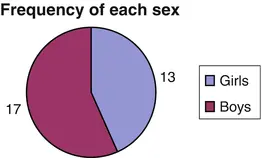
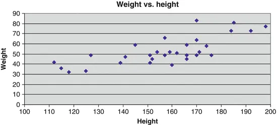
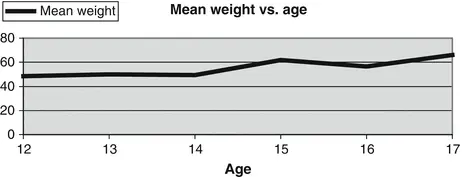
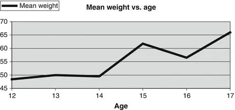
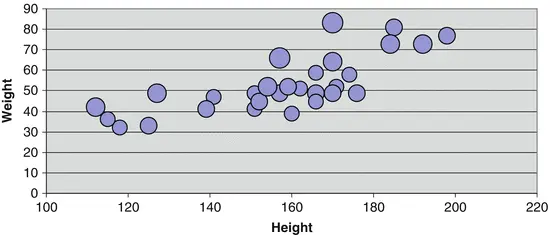

# 2. Presentation of Data

Birger Stjernholm Madsen1 (1)Novozymes A/S, Bagsvaerd, Denmark In this chapter we show how to present the results of a questionnaire survey
      , using graphs and tables.
      Graphs (charts, plots, etc.) are suited to get a feel of patterns, structures, trends and relationships in data and thus are an invaluable supplement to a statistical analysis. They are also useful tools to find unlikely (e.g., extremely large or extremely small) data values or combinations of data values (such as a very high person who does not weigh much), which may be errors in the data.It is easy to create graphs with a spreadsheet, such as Microsoft Excel or Open Office Calc. Here, only the main types of graphs are covered. There are many other types of graphs than those shown here. See the “Help” menu in your spreadsheet to see the possibilities!
      Tables are another way of presenting data, which is also discussed briefly here.
## 2.1
            Bar Charts

        Bar charts are familiar to most people. They conveniently summarize information from a table in a clear and illustrative manner.Let us consider an example from the “Fitness Club
        ” survey. As one focus of the young customers is weight loss, a table of average height and weight by sex is interesting. It may, in tabular form look as shown in Table 2.1.Table 2.1Average height and weight

|SexAverage|
|Height (cm)Weight (kg)|
|Girls148.848.2|
|Boys163.956.4|

      A corresponding bar chart is shown in Fig. 2.1.Fig. 2.1Average height and weight
      We see, at a glance, that the boys are both
         slightly taller and slightly heavier than the girls.It is also well known that this type of chart can be constructed to “cheat” with the axes. If we consider for a moment only the (average) height, it could in graphical form look like the one shown in Fig. 2.2.Fig. 2.2Average height

        This chart contains the same information on the height of girls and boys, as the graph above. However, most people will get a wrong impression of the situation by considering this chart. The boys seem to be much taller than the girls, because the lower part of the bars is cut off!It is therefore important to be aware of the axes when studying bar charts, as well as when constructing them.

## 2.2
            Histograms

A histogram (*) is a special bar chart
        . It shows the frequency (*) of the data values: you can visualize the distribution of data values, for example, where “the center” is located (i.e., where there are many data values), how large the “spread” is, etc.If you order and group the data values [see data in the (Chap. 9)] of height, you get Table 2.2.Table 2.2Interval counts

|In the interval from (but not including)Up to and includingNumber of kidsInterval center|
|100120 3110|
|120140 3130|
|14016010150|
|16018010170|
|180200 4190|

      This means: in the interval from (just over) 100 to 120 cm there are in total three kids. The intervals must of course be constructed so that they do not overlap. Therefore, only one endpoint belongs to the interval. The center of the first interval is 110 cm.Counting of the frequencies can be done manually. Or you can let Microsoft Excel do it: Use the add-in menu “Data Analysis,” which has a menu item “Histogram.” This option is not available in Open Office Calc.When the frequency data from the table are plotted in a bar chart
        , it looks as shown in Fig. 2.3.Fig. 2.3Histogram
      The general considerations you should
         have in connection with determining the number of bars and the width of the bars are:
- The graph should fit onto the paper (or screen).
- The graph should be able to accommodate all observations. Be aware of the minimum value and the maximum value.
- The graph does not “violate” the data material. If, for example, there are two obvious “bulges” in the distribution, do not make so few bars that this important information disappears!
- The intervals must be defined clearly. There must be no doubt as to which interval an observation should belong. You must be sure to which interval the endpoints belong.
- You should be able to compare the graph with other graphs, e.g., from previous surveys.

      The first decision is: How many bars should you use?
- The histogram should normally have 3–13 bars.
- The more the observations, the more the bars.

      As a rough guide, you can use Table 2.3.Table 2.3Number of bars

|No. of valuesNo. of bars|
|10 3|
|100 7|
|1,00010|
|10,00013|

      In the “Fitness Club
        ” example, the number of values is 30. The number of bars should be between 3 and 7, so 5 is probably a fairly good choice.

                Technical Note

- To determine the number of bars, we can use the following formula:
-
                  

- Here n is the number of values
               and log is the logarithmic function (use calculator or spreadsheet for this calculation). You can use logarithms of base 10 or natural logarithms; the result of the formula will be the same.
- In the “Fitness Club” example, n = 30. Here we use logarithms of base 10:
-
                  

            The next question is: How wide should the bars be?
          Having determined the number of bars, we can easily find out how wide each bar must be:1.
                    Interval length = (Maximum value − minimum value)/(number of bars).
                   2.
                Round off the result to an appropriate number, if necessary.
      For the height data, maximum value = 198 cm and minimum value = 112 cm. This gives (198 − 112)/5 = 17. This might be rounded to 20. The previously proposed classification seems to provide a reasonably good description of data.From time to time you see histograms, where the bars are not equally wide. You should absolutely avoid this, because it is difficult for the reader to interpret. It is, for example, not immediately clear how to scale the Y-axis. Should you take into account the visual impression? Then the bar height should be smaller, if a bar is wider. This means, however, that the readings
         on the Y-axis cannot be readily interpreted.
            You should only use histograms with equally wide bars!

## 2.3
            Pie Charts

        Pie charts are often used to show how large a part of the “pie” each group represents. This may be used with frequency data (equivalent to a histogram), but often the pie chart is used in connection with economic quantities, such as expenses or income.A frequency table of the number of girls and boys in our sample looks like the tabular form shown in Table 2.4.Table 2.4Frequency of each sex

|SexNumber|
|Girls13|
|Boys17|

      This information can be illustrated graphically as either a bar chart (Fig. 2.4) or a pie chart (Fig. 2.5).Fig 2.4Bar chart
Fig 2.5Pie chart

        The same information is given in the two graphs! If there are only a few groups like in this example, many feel that the pie chart is the most illustrative chart. The pie chart also has the advantage that you cannot “cheat” in the same manner as in the bar chart
        , where you can cut part of the axes. In case of more than six to seven groups, bar charts are probably most appropriate.
## 2.4
            Scatter Plots

Scatter plots are well suited to show relationships between two variables.
      In the “Fitness Club
        ” example, we assume that there is a relationship between height and weight: the taller a kid is, the heavier it is. A scatter plot is illustrated in Fig. 2.6.Fig 2.6
                    Scatter plot

      Weight is the Y variable or the dependent variable. Height is the X-variable or the independent variable. We imagine that weight depends on the height, i.e., there is a “cause” and an “effect.”In other cases, it is more arbitrary, as to which variable we choose as X and Y. We simply imagine that there must be a relationship (or correlation), without necessarily a “cause” and an “effect.”Chapter 7 gives tools to investigate whether there is indeed a statistical correlation between the two variables, height and weight.On the other hand, one cannot by statistical methods or by studying graphs determine whether there is a “cause” and an “effect.” Yet one can regularly
         in newspapers see examples of conclusions, where studying a plot leads to a conclusion, that X is the “cause” and Y is the “effect.”
## 2.5
            Line Charts

        Line Charts are often used to illustrate a trend, where the X-variable is, e.g., time, age or seniority.In the “Fitness Club” example, we would like to show how the average weight of the kids increases with age. We have the data as shown in Table 2.5.Table 2.5Weight vs. age

|AgeAverage weight|
|1248.40|
|1350.00|
|1449.50|
|1561.75|
|1656.50|
|1766.00|

      We can illustrate this with a line chart as shown in Fig. 2.7.Fig. 2.7Weight vs. age
      This chart suggests that there might be some increase in weight with increasing age. As for bar charts, it is important to be aware of the axes. The same information can also be visualized as in Fig. 2.8.Fig. 2.8Weight vs. age

        The visual appearance is now quite different! It now seems as if there is a dramatic increase in weight with increasing age.
## 2.6
            Bubble Plots

The bubble plot is a variant of the scatter plot
        . Instead of points, bubbles are plotted. The size of each bubble (either area or diameter) represents the value of a third variable.
      It is probably most “fair” to let the area of the bubble be proportional to the value of the third variable, because the area is closely linked to the immediate visual impression.However, if the third variable does not vary much (e.g., at most by a factor of 2 between the minimum and maximum value), it is probably best to let the diameter of the bubble be proportional to this variable. Otherwise, it will be simply too hard to see the difference in size of the bubbles.In the “Fitness Club
        ” example we let the diameter of the bubble show the age of the kids. Large bubbles are the oldest kids and small bubbles
         are the youngest kids (Fig. 2.9).Fig 2.9
                    Bubble plot

      In this plot, one can clearly see that the three kids at the left in the diagram, who are small in terms of both height and weight, are among the youngest, because the bubbles are relatively small.
## 2.7
            Tables

Charts are an important way to present the results of an investigation. Other methods are tables, which we discuss here, and various statistical “key figures,” which are the subject of the next chapter.
### 2.7.1 The Ingredients of a Table

Consider a typical table, such as Table 2.6.Table 2.6No. of kids by sex and age

|No. of kids by sex and age|
|SexAge|
|12–1314–1516–17Total|
|Girls 5 6213|
|Boys 6 8317|
|Total1114530|

                Source: Sample survey, Fitness Club
                 Other notes and comments
        The table ingredients are:
-
                Table title: “No. of kids by sex and age.”
-
                Column title: It is a grouping of the variable “Age,” supplemented with a “Total” column.
-
                Row title: It is a grouping of “Sex,” supplemented with a “Total” row.
-
                Cells: This is the “core” of the table, for example, frequencies,
                      percentages

                    or an average of a variable. In Table 2.6 the cells contain a frequency.
-
                Footnotes: At the bottom of the table we find some information on the data sources, possibly supplemented by additional notes and comments.

        So there are two dimensions of the table: rows and columns. Each dimension will often show a grouping of data. Or, one dimension can consist of several different variables, as in Table 2.7.Table 2.7Average, 3 variables

|SexAverage|
|Height (cm)Weight (kg)Age (years)|
|Girls148.848.213.8|
|Boys163.956.414.2|

        Here, the column dimension consists of the average for three variables: height, weight and age.On other occasions, the column dimension could be several calculations of the same variable, as shown in Table 2.8.Table 2.8Several statistics

|SexWeight|
|MinAverageMax|
|Girls3248.281|
|Boys3656.983|

        Here, the column dimension consists
           of minimum, average and maximum values of weight.
### 2.7.2
              Percentages

The first table shown above gives the sample frequencies of kids in each combination of sex and age. Often, you will prefer to display the sample percentages. The sample frequencies are less interesting themselves.
          The sample percentages are directly comparable to the population percentages, which may be known from a register
          . Thus, you can immediately assess whether the sample is representative
          ; more about this in Chap. 5.The percentage breakdown in the sample is shown in Table 2.9.Table 2.9Percentages

|No. of kids by sex and age, percent|
|SexAge|
|12–1314–1516–17Total|
|Girls16.7 %20.0 %6.7 %43.3 %|
|Boys20.0 %26.7 %10.0 %56.7 %|
|Total36.7 %46.7 %16.7 %100.0 %|

        Our sample is not very large. The use of percentages in a small sample is of questionable value. For instance, 10 % in the combination of boys aged 16–17 years covers only three kids… Use percentages with caution, when the sample is small!
        Often percentages are given as row percent or column percent. This means that the percentages add up to 100 % along rows, respectively, columns. This is shown as Row percent (Table 2.10) and Column percent (Table 2.11).Table 2.10Row percent

|No. of kids by sex and age, row percent|
|SexAge|
|12–1314–1516–17Total|
|Girls38.5 %46.2 %15.4 %100 %|
|Boys35.3 %47.1 %17.6 %100 %|

          Table 2.11Column percent

|No. of kids by sex and age, column percent|
|SexAge|
|12–1314–1516–17|
|Girls45.5 %42.9 %40.0 %|
|Boys54.5 %57.1 %60.0 %|
|Total100.0 %100.0 %100.0 %|

        The reason for the use of row percent or column percent is often a particular interest in the distribution of one dimension, while the other dimension is only seen as a grouping.It may also be that one perceives one dimension as a “cause” and the other as an “effect.”In the “Fitness Club
          ” example the kids were asked whether they do cardiovascular workouts (row dimension). They have also been asked how they assess their physical fitness; here we use three categories: bad, medium and good. This is obviously a subjective assessment. The alternative is to measure their fitness rating through a physical test, which would be expensive.In Table 2.12 we use row percent
          , because we expect that cardiovascular workouts may affect the physical fitness, not vice versa.Table 2.12Row percent

|Cardiovascular workout and physical fitness, row percent|
|Cardiovascular workouts?Physical fitnessNumber|
| BadMediumGoodTotal|
|No40 %40 %20 %100 %15|
|Yes20 %40 %40 %100 %15|

        It is common, like here, to supplement
           with the column at the right, showing the number of individuals in each group.In this table, one might suggest a trend that cardiovascular workouts do have an impact on the physical fitness. In Chap. 5 we return to this example.

Description of Data© Springer-Verlag Berlin Heidelberg 2016Birger Stjernholm MadsenStatistics for Non-Statisticians10.1007/978-3-662-49349-6_3