# 3. Description of Data

Birger Stjernholm Madsen1 (1)Novozymes A/S, Bagsvaerd, Denmark In Chap. 2, we discussed two different types of data: quantitative data and qualitative data.

-
            Quantitative data: These data are used for calculations and for defining the axes in graphs.
-
            Qualitative data: These data correspond to groupings of the sample, in tables or graphs.

        In this chapter, we mainly discuss quantitative data. We present some important sample statistics (*); these are “key numbers” used to describe quantitative data from a sample, for example average and variance
      .At the end of the chapter, we discuss in more detail various types of data and the statistics relevant for each type.An important tool to describe quantitative data is the histogram, which gives an immediate visual impression of what is characteristic for data.
      A histogram should be based on a sample of adequate size. In Fig. 3.1 we can see that a histogram
       based on a small sample is very “rough”. As the sample size grows, one can gradually visualize the distribution of the data values.Fig. 3.1
              Histogram
               for various sample sizes
    However, it is often desirable to summarize the distribution by some “key numbers,” i.e., the numbers that describe various characteristics of the distribution. These key numbers are the main topic of this chapter.
## 3.1 Systematic and Random Variation

        Statistics is about describing the variation in data. It is important to distinguish between two different sources of variation (Fig. 3.2).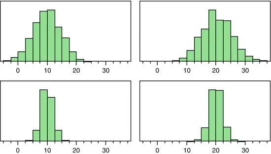Fig. 3.2Center and spread

-
                  Systematic variation: The center of data

-
              Random variation: The spread of data

          Figure 3.2 illustrates the two different sources of variation. The figure contains four histograms
         with measurements of daily average temperatures (°C) at four different locations
        .The top two distributions are characterized by having a large spread, i.e., highly variable climate. The two lower distributions have a small spread, i.e., a significantly more stable climate.
      On the other hand, the two distributions to the left have a center of approx. 10°, and the two distributions to the right have a center of approx. 20°. This means that the two distributions to the left represent a cold climate, whereas the two distributions to the right represent a warm climate.
      In statistical terminology, we often use the term location (*) rather than center. Also, we often use the term
          dispersion (*)
         rather than spread.
      In this chapter, we present the most important sample statistics used to characterize the distribution of data:
-
                  Measures of location (center)

-
                  Measures of dispersion (spread)

## 3.2 Measures of Location

### 3.2.1
              Average

#### 3.2.1.1 Description

The average (*) is a measure of the center in the distribution of data values.The average is calculated as the sum of all the data values divided by their number.As a symbol of the average, we often use the term , which is read as “x-bar”.

            Note: Often people use the word
              mean (*)
             rather than average.Strictly speaking, one should use the word average of a sample, and use the word mean of a
                  population.

                Many use the two terms interchangeably.
            The average is highly influenced by “extreme values” (i.e., very large or very small values). If for example, there are many very large data values, the average becomes “excessively” large.In a sample of income data, a single dollar billionaire can “destroy” the whole picture, “counting” of course just as much as several hundred “ordinary” people…In case of many extreme data values, an alternative is to use the
              median (*)
             rather than the average. See later.
#### 3.2.1.2 Example

Data are the numbers 3, 5, 6, 4. The number of data values is obviously 4.The sum of all data values is 3 + 5 + 6 + 4 = 18.The average is: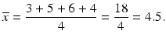

#### 3.2.1.3 Spreadsheets

Most spreadsheets have many built-in statistical functions, including the average. This applies for example, to Microsoft Excel and Open Office Calc. Open Office is free!To calculate the average, use the statistical function AVERAGE. See an example later.
#### 3.2.1.4 Calculation Formula

With n data values x
            1 up to x

                  n

            , the average can be calculated
             using this general formula:
          Here 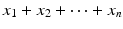 is the sum of all data values.This formula (and others) can be written shorter by using the “sum” symbol Σ, which corresponds to the “sum” button in a spreadsheet. We write Σx

                  i
                 as a shorter way of writing the sum of all data values .Then the formula for calculating the average can be written in a compact form:

### 3.2.2
              Median

#### 3.2.2.1 Description

            The median (*) is the data value “in the middle”, i.e., a number that divides the ordered data values into two parts with an equal number of values.
          The median can be found by first sorting the data values in ascending order.
- In case of an odd number of data values, the median is the middle value.

- In case of an even number of data values, there is no single data value dividing data values into two equally large parts; we then define the median as the average of the two middle values.

          The median is not as sensitive to extreme values as the average! Often, you will therefore complement the average with the median.
#### 3.2.2.2 Example: Even Number of Data Values

Data are the numbers 3, 5, 6, 4.First we sort the data in ascending
             order: 3, 4, 5, 6.As there is an even number of data values
            , we take the average of the two middle values (in the sorted data), which are respectively 4 and 5.Therefore, the median is:
          In this example, the median and the average are the same. However, they need not be. In particular, they will be different in “skewed” distributions, see later.Here we have used the symbol M for the median, as is common in many textbooks.
#### 3.2.2.3 Example: Odd Number of Data Values

We consider the example “
              Fitness Club”;
             data values are the age of the boys. Data values (17 in total) are shown here, sorted in ascending order (see data in Chap. 9) (Table 3.1).Table 3.1Median

|No.12345678
                            9
                          1011121314151617|
|Value1212131313141414
                            14
                          1414151515161717|

          As there are 17 data values, the middle value is no. 9, i.e., the data value 14 as highlighted in bold. Out of the 17 data values, there are 8 data values on both sides of data value no. 9. Therefore, the median is 14.
#### 3.2.2.4 Spreadsheets

The statistical function is called MEDIAN;
             see an example later.
### 3.2.3
              Mode

#### 3.2.3.1 Description

            The mode (*) is simply the most frequent data value!
          All that is required is a frequency count for each data value! No calculations are needed!If you have a complete list of all data values and their frequency, you can immediately find the mode. In this situation it is easier to find the mode than calculating
             the average or the median
            . This is the only advantage of the mode compared with the average and the median!In contrast, the mode has one very big disadvantage: If you have many different data values (perhaps with multiple digits), there will often be only one occurrence of each value. Should there by chance be 2 (or maybe even 3) occurrences of one single value, it may be just a statistical coincidence. The mode in this case is not a meaningful concept. Therefore, the mode is not used very often in practice!
#### 3.2.3.2 Example

We use the example again “Fitness Club
            ,” age of the boys.Here are the various ages and their frequency (Table 3.2).Table 3.2Mode

|Age1213
                            14
                          151617|
|Frequency24
                            5
                          312|

          We observe that the highest frequency is that of the age 14 years, which is thus the mode.In a sample of 17 randomly selected people of all ages (kids as well as adults), data values from 0 to perhaps over 90 could occur. In this case, the mode will not be an informative number. If by chance there are two persons having the same age, we would merely consider this an uninteresting coincidence!
#### 3.2.3.3 Spreadsheets

The function is called MODE. See
             an example later.
### 3.2.4 Choosing a Measure of Location

If the distribution is symmetrical, i.e., there are an equal number of large and small data values (see Fig. 3.3), you will usually use the average, but the median provides virtually the same result.Fig. 3.3Symmetrical distribution
        In a skewed (i.e., nonsymmetrical) distribution, the average and the median
           are not identical:

- For a right-skewed distribution, i.e., a distribution with “too many” large data values, the average is larger than the median.

- For a left-skewed distribution, i.e., a distribution with “too many” small data values, the average is smaller than the median.

            See Fig. 3.4. Note: Other types of distribution exist
          , e.g. distributions with two “tops” (i.e. two modes).Fig 3.4
                  Mean
                   vs. median

#### 3.2.4.1 Example: What Is the Average Salary?

Many economic and administrative data follow a right-skewed distribution, i.e., there are “too many” large data values. An example might be the salary for a group of employees.Figure 3.5 shows such a distribution. Also shown are the values of the mode
            , median and average salary.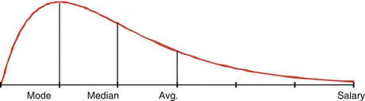Fig. 3.5Right-skewed distribution
          We see that in a right-skewed distribution, the mode is smaller than the median, and the median is smaller than the average!
          Now we can also see why most people find it so depressing to study a salary statistic! Most people have indeed a salary around the mode, but at the same time compare themselves to the average!Whether the actual data will follow a distribution like the one shown in the figure depends on how homogeneous the sample is.
            The more the sample is divided into homogeneous groups, the less skewed the distribution will be.If you have divided the data in many homogeneous groups, the average and the median
             (shown in most salary statistics) will be close to
             each other.
## 3.3 Measures of Dispersion

In this chapter, we have reviewed the main measures of location, i.e., the center of a distribution. Now we look at various measures of dispersion, i.e., the spread of a distribution.
### 3.3.1
              Range

#### 3.3.1.1 Description

The range (*) is simply the width of the interval of the data values.
          The range is used if you need a measure of dispersion that is easy to calculate and understand!The range is calculated as the difference between the largest and smallest data values, x

                  max
                 and x

                  min
                , respectively: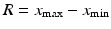
          The range (denoted by the letter R) gives a numerical expression of the spread of data and of course has the advantage of being easy to calculate. The main advantage of range, however, is that it is easy to understand!
            The range depends largely on the number of data values. If there are many data values, the range gets larger, because there are more small or large (“extreme”) values.
                The range is therefore used mainly for small samples.
              A typical application is statistical quality control in the construction of control charts, where the number of data values in a sample
             is often in the order of magnitude 5. The exact purpose of the control chart is to quickly detect any changes in a production process by separating systematic and random variation

                ! See an introduction to simple control charts in Chap. 4.
#### 3.3.1.2 Example

Data are the numbers 3, 5, 6, 4.First we sort the data values in ascending order: 3, 4, 5, 6.The smallest data value is x
            min = 3, and the largest data value is x
            max = 6.The range then becomes: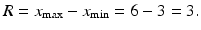

#### 3.3.1.3 Spreadsheets

The range does not exist as a function of its own in spreadsheets. However, there are functions for the maximum value (MAX) and the minimum value (MIN). See
             an example later.
### 3.3.2 Variance and Standard Deviation

#### 3.3.2.1 Description

The most common measure of dispersion (spread) is the standard deviation (*), which can be interpreted as “the average distance” between the data values and the average. The
             larger the standard deviation, the larger is the spread of the distribution.However, the standard deviation is not calculated as an ordinary average distance. Before explaining exactly how the standard deviation is calculated, we have to explain another concept:
            The variance (*) is the average of the squared distances between the data values and the average.The variance is not measured in the same units as the original data values, but in square units (e.g., square meters, if the data values are meters). Often, the term V is used for the variance.
            The standard deviation (*) is the square root of the variance.
          The standard deviation is measured in the same units as the data values, e.g., meters. Often, the term s is used for the standard deviation (Fig. 3.6).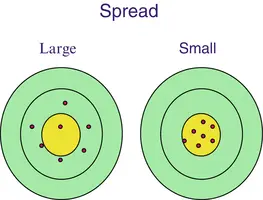Fig. 3.6Small and large spread

#### 3.3.2.2 Example

Data are the numbers 3, 5, 6, 4.The average of these figures was previously calculated to be 4.5.The variance of these figures is:
          The standard deviation
             is:

            Note: In the above formula
            , we divide by , not by n. This is for technical reasons and in practice an unimportant detail
            , unless the sample is very small.If 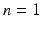 (i.e., only one data value), the variance and the standard deviation cannot be calculated! This is consistent with the fact that in this situation we cannot talk about the spread of the distribution!
            Many spreadsheets and calculators have built-in functions to calculate the variance and the standard deviation. Often, there are two versions of these functions, where division by n respectively division by  is used. This has been very confusing to many people.
          Often, it is stated that the formulae with divisor n are used when calculating the variance or standard deviation of a population
             (as opposed to a sample
            ). Most statisticians, however, always use the formulae with divisor 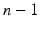!
#### 3.3.2.3 Spreadsheets

For calculation of the variance we use the function VAR. To calculate the standard deviation, we use the function STDEV. See an example later.
#### 3.3.2.4 Calculation Formulae

The variance is calculated using this general formula:
          The standard deviation is the
             square root of the variance, i.e.,
          There is an alternative calculation formula for the standard deviation, see the text frame. It is particularly useful in cases where the calculations
             must be done
             on a calculator without statistical functions.

            Technical note: alternative calculation formula for the standard deviation.
          This formula for the standard deviation is useful when the calculations must be done on a calculator without statistical functions:You need both the sum of all data values and the sum of the squares.The principle is illustrated in Table 3.3.Table 3.3Sum and sum of squares

|Data value no.
                            x

                            x
                            2
                          |
|139|
|2525|
|3636|
|4416|
|Sum
                            18

                            86
                          |

          We calculate the standard

                 deviation as follows: 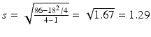.
### 3.3.3 Interquartile Range

#### 3.3.3.1 Description

Another important measure of dispersion is the Interquartile Range (IQR), explained below.When the median is calculated, you can further divide the two parts of the data values into two parts each.Thus the entire set of data values is divided into four parts, with (roughly) the same number of data values. The new points of division are called the
              quartiles (*)
            .The difference between the quartiles is called the interquartile range, often denoted by the abbreviation IQR. The interpretation of IQR is that it is the length of the interval with the “middle 50 %” of the data values and it is often used when you use the median as a measure of location.In order to find the quartiles
            , we sort the
             data values in ascending order, as when calculating the median.The lower quartile (or first quartile) Q1 is a number that divides the ordered data values into two parts so that one-fourth of the data values are smaller than the lower quartile, and three-fourths of the data values are larger.Often, the median is considered to be the middle or second quartile and is sometimes denoted by Q2.The upper quartile (or third quartile) Q3 is a figure that divides the ordered data values into two parts so that three-fourths of the data values are smaller than the upper quartile and one-fourth of the data values are larger.The interquartile range (*) IQR is then the difference between the upper and lower quartiles:
          A few books, however, use half of the difference as the definition of the IQR.
#### 3.3.3.2 Example

We consider again the example
                  Fitness Club,

                age of the boys. Data values (17 in total) are shown in Table 3.4 in sorted order.Table 3.4
                        Quartiles

|No.123
                            4

                            5
                          678
                            9
                          101112
                            13

                            14
                          151617|
|Value121213
                            13

                            13
                          141414
                            14
                          141415
                            15

                            15
                          161717|

          We have previously found the median
             to be the data value no. 9, i.e., the median is 14. This data value divides the data values in two equally large parts. Each of these two parts is now subdivided again:The first half consists of data
             values no. 1–8. As there is an even number of data values, data values no. 4–5 form the point of division. Both data values are 13, i.e., the lower quartile Q1 equals 13.The other half consists of data values no. 10–17. As there is an even number of data values, data values no. 13–14 form the point of division. Both data
             values are 15, i.e., the upper quartile Q3 equals 15.Then the interquartile range is .
#### 3.3.3.3 Spreadsheets

The quartiles
             are calculated using the function QUARTILE. See an example later.Then the IQR is calculated
             by subtracting the quartiles from each other.
### 3.3.4 Choosing a Measure of Dispersion

The choice of a measure of dispersion will often reflect the measure of location that we have chosen.
-
                If the distribution is symmetrical, we often use the average as a measure of location. It is natural in this case to supplement with the standard deviation as a measure of dispersion.

                     The standard deviation is, after all, based on the average.
-
                If the distribution is skewed, you will often use the
                      median

                     as a measure of location. In this case it is natural to supplement with the IQR as a measure of dispersion. This is also natural, because the median might be perceived as the “middle quartile”.

### 3.3.5 Relative Spread (Dispersion)

#### 3.3.5.1 Description

When comparing samples from several time periods (e.g., several years), the average will often increase with time; this is valid for many financial and administrative data during periods of growth, but also for many human and biological populations.Often, the spread increases with an increasing average. Therefore, the spread is not interesting in itself. Instead, the relative spread is more interesting, i.e., the

            standard deviation
             divided by the average.As a measure of the relative spread (dispersion), we use the
              coefficient of variation (*)
            , often denoted CV, defined as the standard deviation as a percentage of average:
            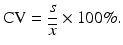
          Sometimes, this is also known as the relative standard deviation and denoted RSD.
            Note: If the data values for instance are temperatures measured in °C, you cannot use the coefficient of variation! The average temperature (used as the denominator) may be 0 °C or even negative! If the CV has to be meaningful, there must therefore be a lower limit of 0, i.e., negative values must not occur!
#### 3.3.5.2 Example

Data are the numbers 3, 5, 6, 4.We have previously found the average as  and the standard deviation as .This gives us the coefficient of variation: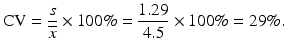

#### 3.3.5.3 Spreadsheets

The coefficient of variation does not exist
             as an independent function, but can be calculated manually using the standard deviation and the average.
## 3.4 Example: Statistical Functions in Spreadsheets

        In most spreadsheets such as Microsoft Excel and Open Office Calc, there is a wide
              range

             of statistical functions. The most important functions are listed in Chap. 9.Data values are once again the age of the boys from the
              Fitness Club

            survey, a total of 17 data values, which are entered in the first row of a spreadsheet in cells A1 up to Q1.
            The data area should be specified when using all these statistical functions.
          Figure 3.7 shows how all the above statistics are calculated using the statistical functions. Here the columns A to C in the spreadsheet are only shown, but the data values are located in the whole area A1:Q1.Fig. 3.7Statistical functions in spreadsheets
      The average is calculated by using the AVERAGE function, the standard deviation
         by using the STDEV function.The coefficient of variation
         does not exist as a function, but it is calculated by dividing the standard deviation by the average, the result being displayed as a percentage (click on the % key in the spreadsheet).The median
         is calculated by the function MEDIAN and the mode by using the function MODE
        .
        Quartiles
         are calculated using the function QUARTILE. This function has an additional parameter to indicate which quartile we are calculating.The value of this parameter is 3, when calculating the upper (third) quartile. It is 1 when calculating the lower (first) quartile. The median can be calculated as the second quartile by using the value 2, but of course the median also has its own function.The IQR
         is calculated by subtracting the upper and lower quartiles.The range does not exist as a function. On the other hand there are functions for the maximum (MAX) and minimum (MIN) data values. The range
         can then be calculated by subtraction.The main measures for location and dispersion
         can also be calculated in Microsoft Excel using the Add-in menu Data Analysis, which has a menu item Descriptive statistics. The menu is not available in Open Office Calc; here you need the statistical functions.As an example we use the data for age, height and weight of all 30 kids from the Fitness Club
         survey. The result of applying the menu Data analysis is shown in Fig. 3.8.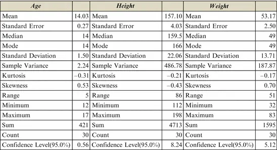Fig. 3.8Output from Data Analysis menu
      The concepts “Standard Error
        ,” “Kurtosis
        ”, “Skewness
        ” and “Confidence Level” are explained in Chap. 4.In this chapter, we have discussed the most important measures of location (center) and dispersion (spread).The choice of measures depends on the distribution of the data values: Is it symmetrical or skewed?In the next chapter, we primarily deal with symmetrical distributions. First, we give a more detailed discussion of various types of data, as well as the measures (of location and dispersion) to use for different types of data.
## 3.5 Data Type and Descriptive Statistics

If you work a lot with questionnaire data, you may want to read this section; otherwise, it can be skipped.
### 3.5.1 Data Types

The main types of data are:
          Quantitative data are data such as weight, height, temperature, amounts of dollars, etc. These data are used for calculations and for defining the axes in a graph. They are subdivided into two types:
-
                Ratio data: Here ratios are well defined; there is a natural zero, negative values do not occur. This applies to most physical measurements, e.g., length; a table might be twice as long as another.
-
                Interval data: Here differences are well defined, and negative numbers may occur. An example is temperature measured in °C; an increase in temperature of 5° makes sense.

          Qualitative data are data such as sex, education, occupation, etc. These data correspond to groupings of the sample (or the population), in tables or graphs. They are subdivided into three types:
-
                Ordinal data: A number of categories with a natural ordering. This applies to many questionnaire data on, e.g., attitudes (on a scale of 1–5,…), grades in schools, etc.
-
                Nominal data: A number of named categories. For instance, various types of fruit: apples, pears and bananas, etc.
-
                Alternative (binary) data: Two categories (i.e., two alternatives). These data can optionally be viewed as ordinal or nominal data. Examples are: agree or disagree, good or bad, defective or non-defective, etc. We deal more with alternative data in Chap. 5

          Integer data (counting data, i.e., the data values are 0, 1, 2, 3, etc.) is yet another type of data. They are really in-between quantitative (ratio) data and qualitative (ordinal) data.If the counts result in very large numbers (such as strokes of lightning during a powerful thunderstorm), it nevertheless makes sense to consider integer data as quantitative (ratio) data.
### 3.5.2 Descriptive Statistics and Type of Data

Throughout this chapter, we have assumed that our data are quantitative. Then it makes sense to calculate all statistics, except that the coefficient of variation requires ratio
                data

          .
        For integer data we can calculate all the statistics, as for quantitative ratio data. However, the actual value of the average might not be a real data value! For instance, it is not possible that there can be 2.3 persons in a household…Hence, the average should be used only as a rough measure of location. With caution, we can also use the standard deviation
           and coefficient of variation
           as measures of spread.For ordinal data, the situation is a bit more complicated! At least, the mode
          , the median
          , and the quartiles are well defined; here we are by definition using the fact that data can be ordered.For typical questionnaire data on a scale, e.g., from 1 to 5, many people will also calculate the average
          . This is in fact not meaningful; however, as for integer data, the average may be informative, if used with caution.Similarly, for this type of data we can calculate the range
           and IQR
          . If these statistics are to be meaningful, the difference between two numbers must be meaningful. This condition is usually not fulfilled. However, both statistics can be used as rough measures of spread, if used with caution.For nominal data, there is only one statistic that makes sense: This is the mode as a measure of
            location.
           The most frequent data value is well defined. The concept of a spread does not make sense.Table 3.5 shows the statistics that can be used in connection with different data types.Table 3.5Descriptive statistics vs. data type

|Sample statisticNominal dataOrdinal dataInteger dataInterval dataRatio data|
|ModeYesYesYesYesYes|
|MedianNoYesYesYesYes|
|AverageNo(No)(Yes)YesYes|
|QuartilesNoYesYesYesYes|
|Interquartile rangeNo(No)YesYesYes|
|RangeNo(No)YesYesYes|
|Standard deviationNoNo(Yes)YesYes|
|Coefficient of variationNoNo(Yes)NoYes|

The Normal Distribution© Springer-Verlag Berlin Heidelberg 2016Birger Stjernholm MadsenStatistics for Non-Statisticians10.1007/978-3-662-49349-6_4