# 4. The Normal Distribution

Birger Stjernholm Madsen1 (1)Novozymes A/S, Bagsvaerd, Denmark In Chap. 3, we explained how to calculate descriptive statistics such as the average and standard deviation
       of a sample. Now we will see what these measures can be used for.Imagine that you buy a bag with 500 g of coffee. You are curious and empty the contents onto a weight to check whether the bag actually contains
       500 g. If you have a very precise weight, you will hardly expect that the content weighs exactly 500 g and you are probably not surprised if it is a little more or less.If you are repeating the experiment with many bags, you might expect that the weight of a bag will be very close to 500 g on
        average.
       You may also expect that there will not be too much spread. For instance, you do not expect to get less than 450 or more than 550 g, not even once. The weight of a bag can perhaps vary around 490–510 g, but it will rarely be more than 510 g or less than 490 g.
      This variation can be described by a statistical distribution.The most important statistical distribution is the normal distribution (*). Several statistical techniques require that data “follow” (i.e., can be described by) a normal distribution. If data do not follow a normal distribution, it becomes more difficult to analyze the data.This chapter examines some important properties of the normal distribution. We also see how the fact that data follow a normal distribution can actually be verified. Finally, we see how to estimate the
            statistical uncertainty

           (*) of a sample average.
## 4.1 Characteristics of the Normal Distribution

The normal distribution curve is a symmetrical
        , “bell-shaped” curve similar to a histogram
        —in this case showing the weight of a very large number of coffee bags. It has been proven in practice that the normal distribution often gives a good description of many types of measurement data, such as weight, height, etc. But the normal distribution is very important also for economic and administrative data.
        A normal distribution is completely described by its
              mean

             (average) and standard deviation.The normal distribution in the example above describes the weight of all the coffee bags manufactured by the factory. Since we do not know the mean and standard deviation
        , they are often written in Greek letters:

-
              Mean:  (read “mju”) representing the “center”
-
              Standard deviation: 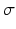 (read “sigma”) representing the “spread”

          In Fig. 4.1, we see two normal distributions with small spread ( = 1, above) and two normal distributions with large spread ( = 2, below). The two distributions in each group have different means,  = 10 and  = 24.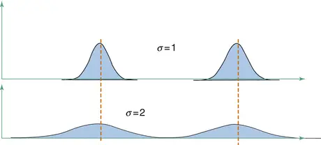Fig. 4.1Mean and spread
      Figure 4.2 shows the interpretation of the standard deviation in a normal distribution. Here is shown a normal distribution representing the histogram
         of a population
         or a very large sample
        .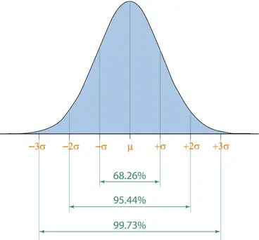Fig. 4.2Probabilities in the normal distribution
      We observe that:

- 68 % of the data values are in an interval around mean
               ± 1 standard deviation
- 95 % of the data values are in an interval around mean ± 2 standard deviations
- 99.7 % of the data values are in an interval around mean ± 3 standard deviations

        These percentages are unique to the normal distribution!In a way, the normal distribution is
         “thinking” as if 0 corresponds to the mean and 1 unit corresponds to the standard deviation.If X follows a normal distribution with mean
         μ and standard deviation σ, then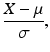follows a normal distribution with mean 0 and standard deviation 1.
            There exists in a way, only one normal distribution!
          The normal distribution with mean 0 and
              standard deviation

             1 is therefore called the standardized normal distribution. All other normal distributions can be transformed to the standard normal distribution. See an example in the section “Calculations in the normal distribution”.
## 4.2
        Density Function
         and Distribution Function

In practice, it is therefore areas under normal distribution curve, which are interesting because they can be interpreted as probabilities. Therefore, we are usually interested in the curve showing areas under the normal distribution curve. The relationship between these two graphs is shown below.The bell-shaped curve (Fig. 4.3) is called the density function (*), while the curve showing areas (probabilities) is called the distribution function (*).Fig. 4.3Density and distribution function

        The distribution function is often written using the letter F. We can interpret the distribution function by noticing that F(x) is the probability of observing data values up to and including x.
        In real-world problems, we almost always need the distribution function. You only need the density function for constructing illustrations

             in a book.
## 4.3
            Fractiles

Let us assume that the weight of the coffee
        in a bag of coffee follows a normal distribution with mean
         500 g and standard deviation 5 g. We want to answer questions such as the following:1.How many coffee bags are weighing at most 495 g?
                We use the
                      distribution function:

                     Find the value 495 on the x-axis and move vertically up to F(495), i.e., find the corresponding value on the y-axis. This is precisely the probability of data values up to 495 g. On the graph (Fig. 4.4) below, we see that it is roughly 0.16, equivalent to 16 %.Fig. 4.4Distribution function
               2.Which weight value separates the lightest 80 % of the coffee bags from the rest? We now use the distribution function the opposite way: Find the value 0.80 (equivalent to 80 %) on the y-axis (i.e., a probability of 80 %) and move horizontally to the distribution curve, then find the corresponding value of the x-axis. On the graph below, we can see that it is roughly 504 g (Fig. 4.5).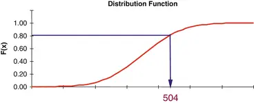Fig. 4.5
                            Fractiles

        We therefore need to use the normal distribution function in “both ways”.
      When we are using the distribution function in the “reverse” way, for example from 0.80 = 80 % on the y-axis to a value on the x-axis, we are talking about finding a fractile (*) (also called a quantile or a percentile) in the distribution. The figure above shows the 80 % fractile in a normal distribution.We have actually seen in Chap. 3 the most important fractiles: The quartiles are the 25 % and 75 % fractiles, and the median
         is the 50 % fractile.The fractiles
         corresponding
         to 10 %, 20 %, 30 %, etc., are called the deciles.

## 4.4 Calculations in the Normal Distribution

We will now show how to do simple calculations in the normal distribution by using a table of the normal distribution.The most important fractiles
         in the normal distribution are found in the table at the end of the book. More detailed tables on the normal distribution can be found in many books.ExampleLet us assume that the weight, X, of (the coffee in) a bag of coffee follows a normal distribution with a
                mean

               μ = 500 g and standard deviation σ = 5 g.As mentioned earlier:follows a normal distribution with mean 0 and standard deviation 1.We say that we standardize X in this calculation. The standardized normal distribution function
           is tabulated in Chap. 9.Now we can answer questions such as1.What is the probability that a random coffee bag weighs at most 510 g? We standardize the 510 g and obtain: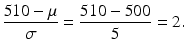
                By looking in a table of the standardized normal distribution, we find that the probability of a data value ≤ 2 is 0.977 = 97.7 %. This is then the probability
                   that a random coffee bag weighs, at most, 510 g. 2.What is the 95 % fractile
                   in the distribution?In a table of the standardized normal distribution (at the end of the book), you find the 95 % fractile to be 1.65. This represents a fractile in the distribution of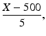where X is the weight of a randomly selected coffee bag.By solving the equationwe obtain = 500 + 5 × 1.65 = 508.25.This means that the 95 % fractile in the distribution of a randomly chosen coffee bag is 508.25.In other words, the probability that a random coffee bag weighs less than 508.25 g is exactly 95 %.

## 4.5 The Normal Distribution and Spreadsheets

If you do not use spreadsheets, you can skip this section.There are in Microsoft Excel and OpenOffice
         Calc two important functions for the normal distribution.
- NORMDIST: Provides the distribution function
               or density function
               for a normal distribution.
- NORMINV: Gives fractiles
               in a normal distribution.

### 4.5.1 NORMDIST (X; Mean
          ; Stdev; Cumulative)

It is only if you have to make figures with the “bell-shaped” curve, that you need the density function
          . Therefore, you should almost always use Cumulative = 1 (Table 4.1).Table 4.1NORMDIST function

|
                          X
                        The number of which the value of the distribution function (or density function) is desired|
|MeanThe mean of a normal distribution|
|StdevThe standard deviation of a normal distribution|
|CumulativeCumulative = 0 calculates the density function|
| Cumulative = 1 calculates the distribution function|

        The distribution function
           for the standardized normal distribution (with mean 0 and standard deviation 1) can also be obtained by using the function NORMSDIST. This function only has one parameter: X.
### 4.5.2 NORMINV (Probability; Mean; Stdev)

The NORMINV function (Table 4.2.) is used to find a fractile in the normal distribution with a given mean and standard deviation. NORMINV thus has 3 parameters.Table 4.2NORMINV function

|ProbabilityThe probability for which a fractile in the normal distribution is wanted|
|MeanThe mean of a normal distribution|
|StdevThe standard deviation of a normal distribution|

        For the standardized normal distribution (with mean 0 and standard deviation 1), you can use the function NORMSINV. This function only has one parameter: probability.
### 4.5.3 Example

Let us assume that the weight, X, of (the coffee in) a bag of coffee follows a normal distribution with a mean μ = 500 g and standard deviation σ = 5 g.1.What is the probability that a random
                   coffee bag weighs at most 490 g?We use NORMDIST(490; 500; 5; 1) and get the result 0.023 = 2.3 %. 2.What is the probability that a random coffee bag weighs at most 510 g?Similarly, we find the probability that a random coffee bag weighs at most 510 g: We use NORMDIST(510; 500; 5; 1) and get the result 0.977 = 97.7 %. 3.What is the 5 % fractile
                   in the distribution?Remember that 5 % equals 0.05.In the spreadsheet, we do not use percentages when writing probabilities.We therefore use NORMINV(0.05; 500; 5) and get the result 491.8.This means that the probability that the weight of a random bag of coffee is ≤ 491.8 g is precisely 0.05, which is equivalent to 5 %.In other words, there is a 95 % chance that a random coffee bag weighs more than 491.8 g. 4.What is the 80 % fractile
                   in the distribution?Similarly, we find the 80 % fractile as NORMINV(0.80; 500; 5) and get the result 504.2.This means that the probability that the
                   weight of a random bag of coffee is ≤504.2 g is precisely 0.80, which is equivalent to 80 %.In other words, there is a 20 % chance that a random coffee bag weighs more than 504.2 g.The spreadsheet shows how to make the calculations in a spreadsheet (Fig. 4.6).Fig. 4.6Example in spreadsheet

## 4.6 Testing for the Normal Distribution

We have studied some key characteristics of the normal distribution, its density function
         and distribution function
        , and calculations in the normal distribution. In other words, the assumption has been that the data actually are following a normal distribution. There are several ways to check this. This is the topic of this section.
### 4.6.1 Simple Methods

              1.
                      The

                        histogram

                    It is always a good idea to study the histogram.This must show a symmetrical, “bell-shaped” appearance.Depending on the number of data values
                  , the histogram can be more or less irregular; we discuss this later in this chapter. 2.
                      The average = the median
                    If data can be described by a normal distribution, the average and
                        median

                       must be nearly identical, because the normal distribution is symmetrical.This is very simple to check. 3.
                      Interquartile range larger than the standard deviation
                    In the normal distribution, the interquartile range (i.e., the difference between the upper and lower quartile
                  ) is somewhat larger than the standard deviation; actually, it is around 1.35 × the standard deviation, i.e.,

                  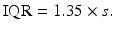
                This can be explained by the standardized normal distribution with mean
                   0 and standard deviation 1:Here, the upper quartile is 0.674 (see table in Chap. 9, 75 % fractile
                  ). Because the normal distribution is symmetrical, the lower quartile is −0.674. The interquartile range, i.e., the distance between the quartiles, is therefore 2 × 0.674 = approx. 1.35.By comparison, the standard deviation
                   is precisely 1 in the standardized normal distribution. 4.
                      Number of data values in symmetric intervals around the mean
                    We have seen that around 68 % of the data values in a normal distribution are in an interval around mean ± standard deviation.
                If the data can be described by a normal distribution, the corresponding proportion for the data values therefore must be relatively close to 68 %.If we have many data values (at least a couple of hundred), one can calculate the proportion of data values between the mean ± 2 standard deviations. This proportion should be relatively close to 95 %.
            ExampleA histogram of the height of all 30 kids from the Fitness Club survey
             is shown below (see also Chap. 2). This histogram seems roughly symmetrical
            . When the sample is small, we must accept some deviation from the ideal appearance (Fig. 4.7).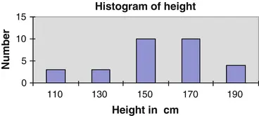Fig. 4.7Histogram of height
          In Chap. 3, we found a number of statistics for the height of the 30 kids. The most important statistics are shown in Table 4.3 with one decimal:Table 4.3Summary statistics of height

|Height|
|
                            Mean

                          157.1|
|
                            Median

                          159.5|
|Standard deviation22.1|
|
                        Q1146.5|
|
                        Q3170.0|
|Interquartile range

                      23.5|

          We see that the average and the median are roughly equal.The interquartile range is slightly larger than the standard deviation, though not by a factor of 1.35.The interval mean ± standard deviation corresponds to the interval from 135.0 to 179.2.In this interval, you can count 21 of the 30 data values, equivalent to 70 %, i.e., very close to 68 %.Overall, we conclude that it appears reasonable that data can be described by a normal distribution.Another issue is whether we should in fact use two normal distributions, one for each sex! We return to this issue in Chap. 8.
### 4.6.2
          Skewness
           and Kurtosis

The two statistics skewness and kurtosis can be used to check whether data follow a normal distribution. They are, however, complicated to calculate and therefore require the use of a spreadsheet or other statistical software.
#### 4.6.2.1 Description

These two statistics can be easily calculated in most spreadsheets or other statistical software. They provide an easy opportunity to check whether the data can be
             described by a normal distribution.
            Skewness (*) is a measure of how skewed the distribution is compared to a symmetrical distribution:
- If data can be described by a symmetrical distribution, the skewness must be close to 0.
- Positive skewness indicates a right-skewed distribution.
- Negative skewness indicates
                   a left-skewed distribution.

          As a very rough guide as to how large deviations from 0 can be accepted for the skewness for different sample sizes n, you can use the expression:where n is the sample size.This gives Table 4.4.Table 4.4Maximum deviation for skewness

|
                            n
                          Maximum deviation for skewness|
|251.00|
|1000.50|
|4000.25|
|16000.12|

            The smaller sample, the greater deviations from 0 you have to accept. When the sample size is multiplied by 4, the maximum acceptable deviation from 0 is divided by 2.
                So, you check whether the skewness is within the maximum acceptable deviation from 0. If not, we do not have a symmetrical distribution.

            If the distribution is symmetrical,

                 you can supplement with evaluating another statistic:
            Kurtosis (*) indicates how big “tails” the
             distribution has:
-
                      A normal distribution has kurtosis 0.

- A positive kurtosis indicates larger “tails” than in the normal distribution.
- A negative kurtosis indicates smaller “tails” than in the normal distribution.

          A distribution with positive kurtosis is often more “steep” in the top than the normal distribution.Conversely, a distribution with negative
             kurtosis is often more “flat” in the top than the normal distribution.However, these properties are not always true. For example, the
                  t-distribution

                 (*) has a positive kurtosis. Nevertheless, the t-distribution is more “flat” in the top than the normal distribution. See examples of the t-distribution later in this chapter.
                We may accept larger deviations from 0 for the kurtosis than for the skewness.
              For small sample sizes, Table 4.5 shows the minimum and maximum kurtosis that can be accepted if the distribution can be described by a normal distribution.Table 4.5Min. and max. kurtosis

|
                            N
                          Minimum KurtosisMaximum Kurtosis|
|25−1.22.3|
|100−0.71.1|
|400−0.40.5|

          If kurtosis for a given sample size is outside the range shown, data cannot be described by a normal distribution.Assume, for example, that a sample of size
             n = 100 has kurtosis >1.1. This is a sign of a distribution with larger “tails” than the normal distribution.
                Notice that for small sample sizes, the acceptable interval of kurtosis is not symmetrical.

            For large samples sizes (about 1000 or more), we can accept twice as large deviations from 0 for kurtosis as for the skewness, i.e., the
                  maximum

                 deviation from 0 for the kurtosis is
            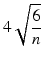

#### 4.6.2.2 Calculation

For calculation formula on these statistics, we refer to the Help in your spreadsheet (or other statistical software) or to textbooks, for example, Montgomery: Introduction to Statistical Quality Control (2005).
            Note: There is an alternative formula for
             calculating kurtosis, where a normal distribution has the value 3.In spreadsheets such as Microsoft Excel and Open Office Calc, and in most statistical software, the kurtosis of a normal distribution is 0.
#### 4.6.2.3 Spreadsheets

Both the skewness and kurtosis exist as functions in spreadsheets:

-
                  Skewness can be obtained using the function SKEW.
-
                  Kurtosis can be obtained using the function KURT.

#### 4.6.2.4 Example

In Chap. 3, we found using spreadsheet functions a number of statistics for the height of the 30 kids from the
              Fitness Club survey

                , including skewness and kurtosis, which are reproduced here (Table 4.6).Table 4.6Height statistics

|Height|
|Skewness−0.43|
|Kurtosis−0.21|

          The skewness is close to 0. For a relatively small sample like this, we can accept values up to nearly ±1.Therefore, data can be described by a symmetrical distribution.Kurtosis is very close to 0. This confirms
             that data can be described by a normal distribution.There exist various statistical tests for the normal distribution, which are available in statistical software packages. These tests also confirm that the distribution of the height of the 30 kids can be described by a normal distribution. We will not cover such tests in this
             book
            ; see the Help menu in your statistical software package.
### 4.6.3 Normal Plot

Finally, there exists a simple graphical tool to check if your data follow a normal distribution. This is called a normal plot (probability plot or quantile plot). It is a built-in feature of many statistical software packages, e.g., SAS, JMP, SPSS, Minitab, etc., see a list in Chap. 9.If you have a statistical software package, you can produce a plot like the one shown in Fig. 4.8. It is also quite easy to do in a spreadsheet.Fig. 4.8Normal plot

          If data follow a normal distribution, the points should be randomly scattered around the straight line. This seems to be the case here. This confirms that data can be described by a normal distribution (Fig. 4.8).If you do not have a statistical software package, you can construct the plot in a spreadsheet. The method is outlined in the text box.
              Technical note: Construction of the normal plot in spreadsheets.
            First, you sort the data values in ascending order. Here, we have used the height of the 30 kids from the
            Fitness Club survey
          ; below we show only the two smallest data values, which are 112, respectively, 115 (Fig. 4.9):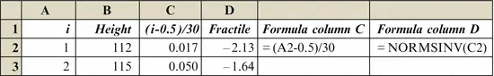Fig. 4.9Calculations for normal plot
        You make a column with consecutive numbers: this is column A. Data values are found in column B. Column C is used to calculate the expression (i − 0.5)/n, where i is the number of the data value (in column A) and n is the total number of values (here 30). Apart from 0.5 in the numerator (a technical correction), i/n is exactly the proportion of data values up to and including data value no. i. For the first data value, we get the result (1 − 0.5)/30 = 0.017.A scatter plot
           with column C as Y and
           column B as X can be compared with the distribution function
           of a normal distribution.However, it is difficult to check if the points follow a normal distribution curve. Therefore, the Y values in column C are transformed. For each value, we find the corresponding fractile in the standard normal distribution using the spreadsheet function NORMSINV, giving −2.13 for the first data value. This value is written in column D.This corresponds to “twisting” the y-axis so that the curve becomes a straight line. A plot of column D as y and column B as x is shown above. Here, we have added a

          regression line (see Chap. 7).
## 4.7
            Random Numbers

In evaluating how well a data set is consistent with the normal distribution, it can be a good benchmark to do the same calculations and charts for a similar number of random numbers from a normal distribution.In Microsoft Excel, you can construct random numbers from a normal distribution using the add-in menu Data Analysis, which has a sub-item Random number generation. A similar option does not exist in Open Office Calc.In this way, it is simple to construct random numbers from a normal distribution. In comparison with the histogram
         of the height of the 30 kids from the
              Fitness Club survey

             (see Chap. 2), we show a histogram based on 30 random data from a normal distribution (in this case with mean 0 and standard deviation 1, i.e., a standardized normal distribution).
        We know that these numbers come from a normal distribution. Nevertheless, we can see that there are some irregularities in the histogram, which are due to the limited sample size (Fig. 4.10).Fig. 4.10
                Histogram
                , 30 data values
      In fact, it is quite easy to create many columns with random data from a normal distribution. In this way, the author calculated the recommended limits for kurtosis in the table above; however, other statistical software has been used, which is more suitable for
         very large amounts of data.
            Doing statistical calculations with random numbers is called

              simulation

            .
          You can also use simulation to study
         how the
              histogram

             gradually changes appearance when the sample size increases. See the charts (Fig. 4.11).Fig. 4.11
                Histogram
                , increasing sample size

      It is evident that in a sample
         size of 30, you have to accept some irregularities in the histogram. When the sample size increases to, for example, 1000, the histogram looks very similar to a normal distribution curve.In these histograms, we have used the same number of bars for direct comparison.In practice, you will use more
         bars for large samples sizes, see Chap. 2.
## 4.8
            Confidence Intervals

After studying the main characteristics of the normal distribution and how to control for the normal distribution, we now look at one of the main applications of the normal distribution: How to find the
              statistical uncertainty

             (*) associated with the average of a sample.Assume the height of the kids follows a normal distribution with mean μ and standard deviation σ.In practice, we do not know μ and σ, but we can calculate an estimate
         of μ and σ:
- As an estimate of μ, we use the average from a sample.

- As an estimate of σ, we use the standard deviation from a sample.

      We do not anticipate that the average

             calculated from a sample
         corresponds completely to the unknown mean
         of the population
        .But maybe we can find an interval that with a high probability (e.g., 95 %) contains the unknown mean.Such an interval is known as a 95 % confidence interval (*) for the mean in the population. We will now show how to find such an interval (Fig. 4.12).Fig. 4.12
                    Sample estimates

### 4.8.1 Confidence Interval for the Mean

#### 4.8.1.1 Description

The technique in this section requires that data can be described by a normal distribution. The purpose is to calculate an estimate of the mean and find a confidence interval for it.Furthermore, we assume that
-
                  We know the standard deviation in advance or
-
                      The sample is sufficiently large

          Knowing the standard
             deviation in advance is not the usual situation.However, if the sample is large enough, we can use the sample standard deviation, as if it is known.With a sample size of more than 30, we are on the safe side. If the sample size is just over 10, we will not make very big mistakes using the technique in this section.
#### 4.8.1.2 Calculation

As an estimate of the mean μ in the population

                , we use the average  of the sample.The statistical uncertainty of a sample average is smaller the larger the sample size. More specifically, we have the following rule:The standard deviation for an average is obtained by dividing the original standard deviation σ with the square root of the number of data values n.
          This is called the
                  standard error

                 (*) of the mean and sometimes abbreviated SE.
                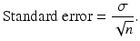
              We have seen that slightly more than 95 % of all the data values in a normal distribution are in an interval around mean ± 2 standard deviations
            . If we want exactly 95 % of all data values in the interval, we must multiply the standard deviation by 1.96 instead of 2.A 95 % confidence interval (*) for the mean is therefore
                
              The number after ± can be interpreted as the
                  statistical uncertainty

                 (*) of the average.The precise reason why the 95 % confidence interval is calculated in this way, is fairly technical. See, for example, G. E. P. Box, W. G. Hunter, and J. S. Hunter (Wiley 2005, 2nd ed.): Statistics for experimenters.
          Unfortunately, the term

            statistical uncertainty
             is not given a name in most books on statistics! It is referred to as “The half-length of a confidence interval for the mean” or just “The number after ±”.In fact, 1.96 is just the 97.5 % fractile of the standardized normal distribution, with 2.5 % of the data values larger than 1.96. This means that 95 % of the data values are between the −1.96 and 1.96, Fig. 4.13. In Chap. 9 (Table 9.​10), a table
             of the main fractiles of the standardized normal distribution can be found.Fig. 4.13Normal distribution

#### 4.8.1.3 Example Height of Kids in
              Fitness Club Survey

We want to calculate a 95 % confidence interval for the mean height of all the kids in the population
            .We do not know the mean μ, but we have data from a sample of n = 30 kids to estimate it.In the sample, we have an average
             height of  and a standard deviation s = 22.06 cm. As the sample size is 30, we can consider the standard deviation known, i.e., we can put σ = 22.06 cm.We calculate a 95 % confidence interval for the mean using the formula:
          The 95 % confidence interval for the mean height can be written as 157.10 ± 7.90 cm. The endpoints of the interval can be calculated as 149.2 and 165.0 cm. This interval will with 95 % probability include the unknown mean of the population.Sometimes we want an interval that with a probability of 99 % contains the unknown mean. Then, we shall instead multiply the standard error

                 with 2.576. The endpoints of the interval are then calculated as 146.7 cm and 167.5 cm. So, the confidence interval is wider, if we want a 99 % probability.Actually, the number 2.576 is just the 99.5 % fractile in the standardized normal distribution, i.e., exactly 99 % of all data values are between −2.576 and 2.576. Thus, 0.5 % of the data values are larger than 2.576.
                Technical note: The

                  statistical uncertainty

                on an average in a finite population.
              Usually, we take samples from a population
             with a finite number of individuals, and the sample is relatively small compared to the population, at most 10 % of the population. In this case, the above formulas for standard error
             and confidence interval are valid.If the sample is larger than 10 % of the
            population, we must modify the formulas.The correct formula for standard error is then:
                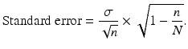
              Here, N = number of individuals in the population. The fraction n/N is called the
                  sampling fraction

                 (*).Similarly, the formula for the confidence
             interval is modified: A 95 % confidence interval for the mean is
                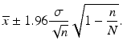
              When the sample is small, n/N is close to 0, and thus the square root of 1 − n/N is very close to 1. This means that the simpler formula is valid.
#### 4.8.1.4 Spreadsheets

This section can be skipped if you do not use spreadsheets.
- First, calculate the average
                   of the sample with the function AVERAGE.
- Then, calculate the statistical uncertainty using the function CONFIDENCE.

          For the function CONFIDENCE, we need to specify the parameters (Table 4.7). This allows you to calculate the end points of the confidence interval
            . This is shown below (Table 4.8):Table 4.7CONFIDENCE function

|Alpha“Rest probability” (e.g., 0.05 = 5 %, if you need a 95 % confidence interval)|
|StdevStandard deviation (considered to be known)|
|SizeSample size, n|

            Table 4.8Example, CONFIDENCE function

| ABC|
|33Average157.10=AVERAGE(B2:B31)|
|34Standard deviation22.06=STDEV(B2:B31)|
|35
                            Statistical uncertainty

                          7.90=CONFIDENCE(0.05;B34;30)|

          We imagine that data are located in the area B2: B31. The average is calculated using AVERAGE. The standard deviation is calculated using the STDEV.Then, calculate the statistical uncertainty using function CONFIDENCE.For this function, we must specify the “rest probability” 0.05 (equivalent to 5 %), the standard deviation (calculated using the STDEV), and the sample size (30).The 95 % confidence
             interval for the mean height then can be written as 157.10 ± 7.90. The endpoints of the confidence interval thus become 149.2 and 165.0.
### 4.8.2 Confidence Interval for the Mean in Case of a Small Sample

If your sample size is typically larger than 20, you can skip this section.
#### 4.8.2.1 Description

Let us assume that the weight of coffee in a bag
             of coffee follows a normal distribution with mean μ and standard deviation σ.We know neither the mean nor the standard deviation in this normal distribution.
- We estimate
                   both the mean and the standard deviation from a sample.
- The purpose is to estimate the mean μ and find a confidence interval for it.
- We do not know the standard deviation σ, but estimate it by the sample standard deviation s.

            If the sample is relatively small, less than 30
             (or maybe even less than 10), the standard deviation from the sample cannot be considered to be known. We therefore need a revised calculation.
#### 4.8.2.2 Calculation

By analogy with the last section, we construct a 95 % confidence interval for the mean:
          Because the sample is not big enough for us to consider the standard deviation to be known, it appears that the multiplier t of the standard error
             becomes
             (maybe even much) larger than 1.96.The constant 1.96 previously used was the 97.5 % fractile of a normal distribution.Instead of fractiles in the normal distribution, we must now apply fractiles in the
                  t-distribution

                 (*), also known as “Students t-distribution”. This is not
             a single distribution, but a whole family of distributions. If there are n data values (at least 2), we say that the t-distribution has n − 1 degrees of freedom (*).
            Note: “
              Degrees of freedom”
             is often abbreviated DF (or df).If we want a 95 % confidence interval for the mean μ, we must use the 97.5 % fractile in the t-distribution with n − 1 degrees of freedom.If we want a 99 % confidence interval for the mean μ, we must use the 99.5 % fractile in the t-distribution with n − 1 degrees of freedom.The confidence interval, which we calculate in this situation, is wider than when the standard deviation σ is known. If the sample size is small, the confidence interval is much wider.The most important fractiles in the t-distribution
             can be found in a table in Chap. 9 (Table 9.​12).In the table, we see that the 97.5 and 99.5 % fractiles in the t-distribution are larger than the corresponding fractiles in normal distribution; this is particular noticeable, when the number of degrees of freedom is less than 10.When the number of degrees of freedom is at least 30, there is practically no difference between the t-distribution and the normal distribution. Therefore, the table only shows fractiles for up to 30 degrees of freedom.The following figure shows the probability
             density function
             of the t-distribution with 1, 2, and 5 degrees of freedom as well as the normal distribution. Observe that even a t-distribution with 5 degrees of freedom at first glance does not seem very different from the normal distribution; however, there is still a big difference in the “tails” of the distribution.
            Note: The t-distribution has “heavier tails” than
             the normal distribution, i.e., it has positive kurtosis
             (Fig. 4.14).Fig. 4.14Normal distribution and t-distribution

#### 4.8.2.3 Example

Let us assume that the weight of the coffee in bags of coffee follows a normal distribution. We do not know the mean μ, but we take a sample of n = 4 coffee bags to estimate it.Suppose that in the sample we have an average 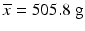 and a standard deviation of s = 5.30 g.We calculate a 95 % confidence interval for the mean from the formula
          We need a confidence interval, which with probability 95 % contains the unknown value of the mean μ, so we must use the 97.5 % fractile of the
              t-distribution
            .Since the sample consists of n = 4 coffee bags, the number of degrees of freedom
             is df = n − 1 = 3. In the table of the t-distribution
             in Chap. 9, we find the 97.5 % fractile for a t-distribution with 3 degrees of freedom as 3.182. Notice that this fractile is substantially larger than 1.96.The formula now gives us the
                  statistical uncertainty

                 of the average as 8.4. The endpoints of the interval can now be calculated as 497.4 and 514.2 g.
#### 4.8.2.4 Spreadsheets

This section can be skipped if you do not use spreadsheets.If the sample is small, you need the following
             to calculate the confidence interval for the mean:

- The average of the sample calculated using the AVERAGE.
- The standard deviation calculated using the STDEV.
- The sample size n. We need the square root of n obtained using the function SQRT.
- A fractile in the
                    t-distribution
                   with n − 1 degrees of freedom, for example, the 97.5 % fractile in case of a 95 % confidence interval: Calculated using the function TINV.

              In the example with coffee bags, there are four data values, i.e., the number of degrees of freedom
             is 3. If we want a confidence interval that with probability 95 % contains the unknown value of the mean μ, we use the 97.5 % fractile. This fractile can be calculated
             in spreadsheets, use the function TINV.
            Note: The way the probability must be specified in the spreadsheet function is somewhat special:
-
                  First parameter of TINV: Find the “rest probability” and multiply by 2.
-
                  Second parameter of TINV: Number
                   of degrees of freedom.

          An example: For the 97.5 % = 0.975 fractile, the “rest probability” is 2.5 % = 0.025. We multiply by 2 and obtain 5 % = 0.05. With 3 degrees of freedom we get the fractile TINV(0.05; 3) = 3.182.All the information needed is found in the output below, including the calculation formula using spreadsheet functions. The 95 % confidence interval for mean is found as 505.8 ± 8.4 or the interval from 497.4 to 514.2 (Fig. 4.15).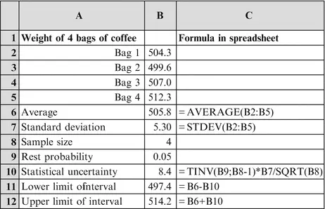Fig. 4.15Example: Statistical functions
          If you have Microsoft Excel, another
             option is to use the add-in menu Data Analysis, which has a menu item Descriptive statistics. Remember to tick the Confidence level for the mean box.Below is the (partial) output from the Microsoft Excel menu Descriptive statistics (Table 4.9).Table 4.9Example: Data Analysis menu

|Weight of four coffee bags|
|Mean505.8|
|
                            Standard error

                          2.65|
|Standard deviation5.30|
|Confidence level (95.0 %)8.4|

### 4.8.3 Confidence Interval for the Standard Deviation

This section can be skipped without loss of continuity.
#### 4.8.3.1 Description

Let us assume that the weight of coffee in bags of coffee follows a normal distribution with mean μ and standard deviation σ. We know neither the mean nor the standard deviation in this normal distribution.The purpose of this section is
             to estimate the standard deviation σ and find a confidence interval for it.
#### 4.8.3.2 Calculation

The confidence interval for the standard
             deviation σ is found by specifying the lower and upper endpoint of the interval directly.We need fractiles of the
              Chi-squared distribution (*)
            . We also here need to specify the number of
              degrees of freedom,
             which is again n − 1.A 95 % confidence interval for the standard deviation σ is:
          The denominator under the square root is:
-
                  97.5 % fractile (lower limit)
-
                  2.5 % fractile (upper limit) in a Chi-squared distribution
                   with n − 1 degrees of freedom

          The letter χ is the Greek letter “Chi”.For a 99 % confidence interval, we use the 99.5 % fractile (lower limit) and the 0.5 % fractile (upper limit) in a Chi-squared distribution
             with n − 1 degrees of freedom.
#### 4.8.3.3 Example

Let us assume that the weight of the
             coffee in bags of coffee follows a normal distribution. We do not know the standard deviation σ, but we take a sample of n = 4 coffee bags to estimate it.We need a confidence interval, which with
             probability 95 % contains the unknown value of the standard deviation σ.In the sample, we have a standard deviation of s = 5.30 g.We calculate a 95 % confidence interval for the standard deviation from the formula above.Since the sample consists of n = 4 coffee bags, the number of degrees of freedom
             is df = n − 1 = 3.In the table of the Chi-squared-distribution in Chap. 9, we find the 97.5 % fractile for a Chi-squared distribution
             with 3 degrees of freedom as 9.35 and the 2.5 % fractile as 0.22.Thus, we get from the formula above the following 95 % confidence interval for the standard deviation:
- Lower limit is 3.0.
- Upper limit is 19.8.

          This means, that with 95 % probability, the standard deviation is between 3.0 and 19.8.This interval might seem rather wide
            . This is of course due to the small sample size. If we need a narrower interval, we must increase the sample size.

#### 4.8.3.4 Spreadsheets

You need the following for a 95 % confidence

                interval for the standard deviation:
- The variance
                   (calculated using the function VAR).
- The sample size n.
- The number of degrees of freedom: df= n − 1.
- The 2.5 % fractile and the 97.5 % fractile in the Chi-squared distribution with n − 1 degrees of freedom.

          The fractiles can be calculated in Microsoft Excel/Open Office Calc using the function CHIINV.Note that you should specify the “rest” probability rather than the probability itself.ExampleFor the 97.5 % = 0.975 fractile, the “rest” probability is 2.5 % = 0.025. With 3 degrees of freedom

                  , you
               get the fractile CHIINV(0.025;3) = 9.35 (Fig. 4.16).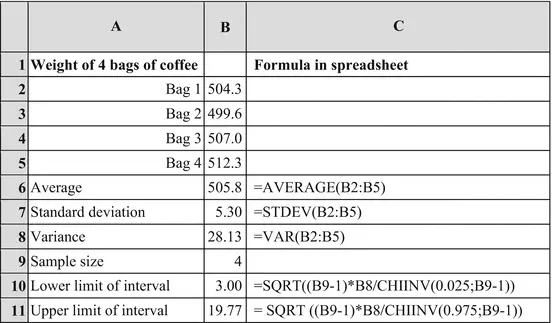Fig. 4.16Example using statistical functions

## 4.9 More About the Normal Distribution

Often, you hear people say that “you need at least a certain sample size in order that data should follow a normal distribution”. This is nonsense!
            Data from a sample of a population will follow the same distribution, no matter the size of the sample!
          However, one can show the following
        :
            When data do not follow a normal distribution:
          The calculation of the confidence interval
         for the mean as shown in this chapter can still be used.
            The sample average will follow a normal distribution, if the sample size is large.

        This is just one of the reasons why the normal distribution is so important: The normal distribution can be used as an approximation to describe the sample average, regardless of the distribution of data in the population.The literature refers to this as “The central limit theorem”.The requirement to the sample size is not huge: A sample size of 5 will often be enough. However, if the distribution of data in the population is extremely skewed, a larger sample size (e.g., 20) may be necessary.Furthermore:
        Even if data follow a normal distribution, we need a certain sample size in order to use fractiles from the normal distribution when constructing a confidence
         interval for the mean.We have seen that for small sample sizes we must use fractiles from the
          t-distribution
        . This is the case, when the sample size is up to approx. 20.In short:
        If the sample size is larger than 20, you are assured that:1.The sample average will follow a normal distribution. 2.You can use fractiles from the normal distribution to construct confidence intervals
                 for the mean.

        Many statistical methods (e.g., the methods described in Chaps. 7 and 8) require that data follow a normal distribution. This is another reason why the normal distribution is so important.
        If data do not follow a normal distribution, one solution (which often can be used for right-skewed distributions) is to transform the data values (e.g., taking the logarithm of data values), so that they can be described by a normal distribution, and then doing the calculations on the transformed data. In case of transforming with the logarithm, we say that the original data follow a lognormal distribution, see the next section.
      Another approach is to use nonparametric statistical techniques (also referred to as distribution free techniques). These techniques are described in more advanced books on statistics, and they are implemented in many statistical software packages.In this chapter, we have primarily dealt with quantitative data, i.e., data values are numbers that can be used for calculations.We have seen how to describe quantitative
         data using the normal distribution, and how we check for the normal distribution. Also, we have seen how we can find the statistical uncertainty
         associated with a sample average.In the next chapter, we deal with the statistical methods for qualitative data corresponding to groups in the population. First, we present a few specialized topics, which can safely be skipped in a first reading of this book.
## 4.10
            Lognormal Distribution

### 4.10.1 Introduction

In some cases, data cannot be well described by a normal distribution. Often, the distribution of data is “skewed to the right”. In this case, it is advantageous to transform data.The most commonly used transformation in this case is to take the logarithm of the data values. The logarithms of the data values in such cases often are approximately normally distributed. This applies to many data in engineering/science as well as economics/administration.Usually, we use the natural logarithm, denoted by ln (spreadsheet function LN). If you need to “transform back”, this is done by means of the exponential function exp (spreadsheet function EXP).If the logarithm of the data can be
           described by a normal distribution, we say that the original data values follow a lognormal distribution (*).
        Many statistical software packages allow fitting a variety of statistical distributions to data, besides the normal distribution. If a lognormal distribution is one of the options, this is more convenient than taking logarithms of the data: You then work on the original scale, rather than on data on a (logarithmic) transformed scale. For instance, you can directly get various fractiles in the fitted lognormal distribution.When working with data and their (natural)

              logarithms, one important feature is:
          The standard deviation of the logarithms of the data values gives a good approximation to the CV (coefficient of variation) of the original data!
        In this context, the coefficient of variation is not calculated in percent!
          Note: The approximation is valid, as long as the CV (coefficient of variation)
           of the original data is not larger than about 0.6 (corresponding to 60 %).
### 4.10.2 Example

Below is a histogram of weight of the children in the
                Fitness Club

              survey. There seems to be a tendency, that the distribution is “skewed to the right”, i.e. there are “too many” large values. However, with only 30 data values, we must be careful when interpreting the histogram.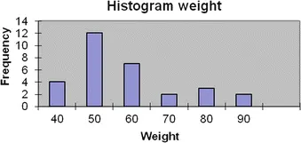
        In Chap. 3 was also shown
           some descriptive statistics for these data. Some of them are reproduced here.

|Weight|
|Average53.17|
|Median49.00|
|Skewness0.70|

        It is seen that the median is smaller than the average. However, the median is (just!) in the 95 % confidence interval of the mean, so it is not in itself critical.Furthermore, the skewness is 0.70. This value is not in itself so large, that we reject a normal distribution. According to the formula in Sect. 4.6.2, a skewness of more than 0.89 would indicate a distribution with positive skewness.However, there exist different “statistical test for a normal distribution”, available in statistical software packages. They conclude that a normal distribution
           is not a very good description of the data on weight of children in the
            Fitness Club survey
          .Therefore, a logarithmic transformation of data is tried, i.e. all data values are transformed with the spreadsheet function LN. In the transformed data, one gets the following descriptive statistics:

|Weight|
|Average3.94|
|Median3.89|
|Skewness0.18|

        It is observed, that the average and the median are now almost identical. Additionally, the skewness is very close to 0.A histogram of the transformed data is shown here. This histogram
           is more symmetric than the histogram of the original data!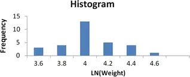
        Some additional calculations are shown in the spreadsheet. Original data values are in the area E2: E31, the table shows only the last two values. The logarithms
           of the data values are in the area F2: F31.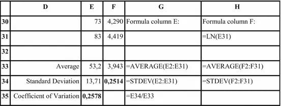
        We also see that the coefficient of variation of the initial data (cell E35) is very close to the standard deviation of the logarithm of the data values (cell F34).
          Note: If you transform the average of the log data “back” to the original scale, you get 51.55, which is not the same as the average of the original data! Actually, this number is called the
                geometric average

              of the original data, and is yet another measure of the centre (location)! The geometric average can also be expressed directly mathematically in terms of the original data,

               and in fact it also exists as a spreadsheet function. However, the geometric
          average is not used very much in practice.
## 4.11 Control Charts: Everything in Control?

### 4.11.1 Introduction

In many companies and organisations, information is collected continuously on issues, which have a high degree of attention. It is a temptation to react on this information, in case of a change (increase/decrease or trend), even if the change is only minor. This may lead to inappropriate actions, based on a vague or even dubious foundation, which is obviously unwanted.One solution is implementing “control charts” on these data in order to distinguish everyday normal variation (“random variation”) from unexpected variation/changes (“systematic variation”).A control chart (*) is a graph of data plotted in time sequence. An important part of the control chart is the construction of
            control limits (*)
          , which describe the inherent
          variability of the process when it is in statistical control, i.e. only subject to random variation.Traditionally, control charts are used as a quality control tool to monitor physical/chemical parameters in a production process. In this context, control charts are a fundamental part of, what is traditionally called Statistical Process Control, SPC (*)

              .However, control charts can also be applied to purely administrative processes. A few examples:1.A survey organisation monitors the non-response rates of monthly sample surveys. 2.A service company monitors the number of customer complaints pr. month. 3.A production company monitors the monthly number of accidents.
        In my opinion, control charts could be introduced in a variety of contexts, where they are not even considered today!This topic is huge. It is recommended
           to consult a textbook in the topic for details, e.g. Douglas Montgomery: Introduction to Statistical Quality Control (Wiley).
### 4.11.2 Statistical Control

A process is said to be in
            statistical control (*)
           if it is subject to random variation only.A process is in statistical control (*), if:
- All observations are within the control limits, i.e. no extreme data values (“outliers”).
- The variation seems random, i.e. nounusual patterns are present.

        Unusual patterns could be e.g.
- A shift (increase or decrease) in the process level (mean)
- A trend (upwards or downwards) in the process level (mean)
- A change in the process
                 spread (i.e. standard deviation or range)

        Whether these conditions are satisfied can be judged visually, as well as using specific (objective) rules, see later.
### 4.11.3 Construction of a Simple Control Chart

Let’s have a look at the simplest possible control chart! It is simple to implement and easy to interpret. We assume that each data point represents just one measurement. The standard deviation (s) of all data values is then used to construct the control limits. This means, that short-term as well as long-term variation is included in the standard deviation!Take a look at Fig. 4.2. It appears
           that 99.7 % of the data values are within an interval around mean ± 3 standard deviations. It is thus very seldom to have data values outside this interval. If we have a data value outside this interval, we assume that it did not happen by chance.We therefore construct the control limits (*) as follows: average ± 3 · s.Also, we construct the
                centre line

               (*), which is just the average of all data values.
          Note: Control charts are very sensitive to the assumption of normal distribution! It is thus extremely important to check, if data follows a normal distribution.If data cannot be described by a normal distribution, a transformation of data may be the solution. For instance, if data are right-skewed, taking logarithm of the data values may give data that follow a normal distribution.See earlier in this chapter for more information
           on checks for the normal distribution and transformation using logarithms.
### 4.11.4 Unusual Patterns

Control limits from the control charts mentioned above only act on one particular point, investigating if it is an extreme data value (“outlier”). It is often desirable to detect shifts or trends faster. This is the reason for introducing the
            Supplementary Runs Rules (*)
          , which work through the introduction of “memory”.In this section, we discuss how to evaluate whether any unusual patterns are present, which could not be due to random variation only.International Standard ISO-8258 gives
          seven supplementary Runs Rules (sometimes called the “Western Electric” rules
          ), i.e. eight rules in total. Here, we only mention the first three rules:
              1.One point outside the control limits detects a shift in the mean, an increase in the standard deviation, or a single aberration in the process (“outlier”). 2.Nine points in a row in a single (upper or lower) side of the centre line detects a shift in the process mean. 3.Six points in a row steadily increasing or decreasing detects a trend or drift in the process mean.
            If any of these three rules are flagged in the control chart, systematic variation is assumed to be present. The process can not be assumed to be in statistical control.Other sets of supplementary runs rules exist! Commonly used are also the “Westgard Rules”.Several types of control charts as well as supplementary runs rules are implemented in standard statistical software packages for industrial applications, e.g. JMP
           or Minitab (see list of selected statistical software packages in the appendices).
### 4.11.5 Practical Use of Control Charts

          You should gather data format least 20-25 runs. Then plot the data in a control chart. If all values are within control limits and there are no unusual patterns or trends, we conclude:
- The process is in statistical control
- The control limits can be used to evaluate future data.

        In the future, when a plotted value falls outside of either control limit or a series of values reflect unusual patterns (e.g. rules 2 and 3 above), the state of statistical control can no longer be accepted.When this occurs, an error investigation
           is initiated to locate the cause. The process may be stopped or adjusted. Once the cause is determined and eliminated, the process is ready to continue.A system should be in place to take action when no cause has been identified by investigation.
### 4.11.6 Example

Data for weights of coffee bags sampled over a period 20 days are shown below. (Ideally, more data values are preferable, however). A spreadsheet with these
           data can also be found on the website accompanying the book.

|12345678910|
|497.7501.2496.0501.3500.5501.8495.9502.0496.8499.2|
|11121314151617181920|
|495.9496.1496.8496.3498.3503.8496.9495.9501.0497.0|

        Using the tools presented earlier in this chapter, one can test, whether data can be described by a normal distribution. This will be omitted here.The average and standard deviation are obtained from the usual spreadsheet functions, and the control limits are calculated using the formula above. We obtain the results shown.

|498.52Average|
|2.57Standard Deviation|
|490.8LCL (Lower Control Limit)|
|506.2UCL (Upper Control Limit)|

        The control chart is now easy to construct using a spreadsheet.
        In the control chart, the control limits are shown together with the centre line (i.e. average) and the data values. It is easily observed, that all data values are within the control limits.It can be verified, that neither of the supplementary runs rules mentioned above are violated.
              Based on these data, we conclude, that the process seems to be in statistical control.

          Note: Each data value could in a real

              application actually be the average weight of e.g. 5 coffee bags.
## 4.12
            Process Capability

This section is about quality control and can safely be skipped, if you don’t work within this area. Within the area of quality control, the tools in this section are, however, widely used.The topic is huge. It is recommended to consult a textbook in the topic for details, e.g. Douglas Montgomery: Introduction to Statistical Quality Control (Wiley).
### 4.12.1 Introduction

The tools in this section describe tools used to assess a process’s ability to fulfil requirements.Before the tools in this section can be used, it is important to assure, that the process is in statistical control! This is done using control charts, see the previous section.The requirements can be specified by the producer, the customers or authorities. Requirements are often stated as specification limits.

            Specification limits
             (*) are the limiting values of a quality characteristic, that can be accepted. Frequently, two specification limits are stated:
-
                USL = Upper Specification Limit
-
                LSL  = Lower Specification Limit

### 4.12.2 Example

In the coffee bag example, a 3 % deviation
           from the target value of 500 g can be tolerated. Therefore
          , there are the following two specification limits:
-
                    LSL = 485 g.

-
                    USL = 515 g.

### 4.12.3 Process Capability Indices

Take a look at Fig. 4.2. Recall, the following properties of the normal distribution:

- 95 % of the data values are in an interval around mean ± 2 standard deviations.
- 99.7 % of the data values are in an interval around mean ± 3 standard deviations.

            There exist a number of different “process capability indices”. In this book, only two of them are presented. Focus here is on avoiding production outside the specification limits, frequently called “off spec” production
          .Other indices exist, which demonstrate the process capability to produce “on target”, i.e. with a mean close to a preferred value.First, we consider an ideal situation
          , where the process is centred directly between the specification limits. We use the distance between the specification limits (sometimes called the tolerance) divided by the range 6σ, which (assuming a normal distribution of data)

               contains app. 99.7 % of all data values. This ratio is called the process capability index (*), denoted by Cp:
          The process capability index Cp is defined as

              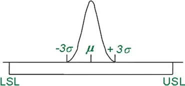
            Obviously the range USL-LSL should be larger than 6σ, i.e. Cp > 1 is necessary for the process to fulfil the requirements, as stated in the specifications. How much larger than 1, Cp should be, depends on the type of product and the intended use of the product!Now, we take a look at the normal situation of a non-centred process. In this case, we use the distance from the mean to the critical specification limit. This distance is in this case divided by 3σ (rather than 6σ), as we are only focusing on one direction. This ratio is called the minimum process capability index (*), denoted by Cpk:
          The minimum process capability index Cpk is defined as

              

          Note 1: It will always be true, that Cp ≥ Cpk. Cp can
          be viewed as an idealized measure, valid in an idealized situation. On the contrary, Cpk can be viewed as the realistic measure. Obviously Cpk > 1 is necessary for the process to fulfil the requirements.
          Note 2: As we don’t know population standard deviation σ, we replace it by the sample standard deviation s. The sample used for estimating σ should be
           representative of the process in “real life”. It should not be an “idealized” sample with a low standard deviation.In the table below, we summarize the interpretation of various values of Cpk.

|Value of Cpk
                    Interpretation|
|
                          Cpk < 1
                        Not space enough for natural variation.|
|
                          Cpk = 1
                        Just about space enough for natural variation.|
|
                          1 < Cpk < 2
                        Space enough for natural variation as well as some change in process mean!|
|
                          Cpk ≥ 2
                        Ideal situation! At least 6 standard deviations on both sides of the mean.|

        As mentioned previously, a universal requirement of a minimum Cpk cannot be established. In some cases, a minimum Cpk of 1.50 would be considered adequate, in others not. It depends on the criticality of violating the specification limits.In the situation, with Cpk ≥ 2, the process is said to have
                Six Sigma Quality

              , as we use the Greek letter σ (“Sigma”) for the standard deviation! In this case, there is lots of space for both the natural (random) variation and change in the process mean (systematic variation
          ).
### 4.12.4 Process Capability Indices: Important!

When using the process capability indices, it is important to realize, that process capability indices have statistical uncertainty too!For example if Cpk = 1.50, the process is often considered capable of fulfilling the required specifications. In many companies, Cpk = 1.50 based on a sample size of n = 20 will be considered satisfactory.In this case, it can be shown that a 95 % confidence interval for Cpk goes from 1.00 to 2.00.This means, that in reality we do not know
          , if the process is just about capable (Cpk = 1.00) or definitely capable (Cpk = 2.00) of fulfilling the required specifications!On the website of the book, you will find a spreadsheet calculating the confidence interval of Cpk for given values of n and estimated Cpk.Secondly, it is important to realize that the process capability indices depend heavily on the normal distribution!
        Not only do we assume normal distribution of data as a basis for the calculations. We also calculate the frequency of extreme values, i.e. the “tails” of the normal distribution, even though this is exactly where we have very limited amounts of data!It is thus extremely important to check, if data follows a normal distribution. Always make statistical and graphical tests for the normal distribution and evaluate, if there is reason to concern for the distribution in the tails! See earlier in this chapter.
### 4.12.5 Example, continued

Data for weights of coffee bags sampled over a period 20 days; see the previous section on control charts. Ideally, more data values are preferable, due to the statistical uncertainty of the estimated value of Cpk, as explained above.Average and standard deviation can be
           obtained using spreadsheet functions. Cp and Cpk are calculated using the formulas above. We obtain the results shown.

|498.52Average|
|2.57Standard Deviation|
|485LSL|
|515USL|
|1.95
                          Cp
                        |
|1.75
                          Cpk
                        |

        It is observed, that Cpk = 1.75.Using the spreadsheet on the website of the book, the 95 % confidence interval for Cpk is found to be from 1.17 to 2.33. It is thus safe to assume
          , that Cpk is at least 1.17.With more data, this confidence interval
           would be narrower.

Analysis of Qualitative Data© Springer-Verlag Berlin Heidelberg 2016Birger Stjernholm MadsenStatistics for Non-Statisticians10.1007/978-3-662-49349-6_5