# 5. Analysis of Qualitative Data

Birger Stjernholm Madsen1 (1)Novozymes A/S, Bagsvaerd, Denmark In this chapter we look at qualitative data, i.e., data values correspond to groups in the population
      . One particularly important type of qualitative data is alternative (binary) data with only two groups (“alternatives”).Some examples of alternative data:
-
            Sample surveys: For example, questionnaire surveys: the answers “Yes”/“No” to a question.
-
            Statistical quality control: For instance, classification of items in the categories “Good”/“Defective.”
-
            Games: For example, “Heads”/“Tails” in tossing a coin.

    Alternative data are described by a statistical distribution called the binomial distribution (*). It is used very often when analyzing data from surveys, but also in many other contexts, such as social sciences, economics, administration, science and technology.
## 5.1 The Binomial Distribution

            The situation, in which the binomial distribution is used, can be characterized as follows:

-
              Each observation (“trial”) can be classified into two categories. Often, we call them “success” and “failure” regardless of whether one of the categories can be said to be “better” than the other.
-
              The probability that an observation is classified as “success” is constant. For example, in statistical quality control there must not be a trend that defective items become more frequent.
-
              The observations are independent. This means, for example, that two respondents do not affect each other’s answers in a questionnaire survey.

          Using probability theory (see Chap. 9), one can calculate the probability of getting exactly x successes out of n observations, given that the constant probability of success is p.The probabilities of the binomial distribution are tabulated in many books (for small values of n). They can also be calculated in most spreadsheets using a statistical function, see later.Also, one can show the following:
            In a binomial distribution with the number of observations = n and probability of success = p:

            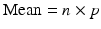
            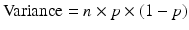
            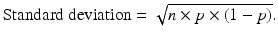

### 5.1.1 Example

Let us consider a dice where the probability of getting six eyes is 1/6 (approx. 16.7 %). We throw the dice 48 times in total. We think of six eyes
           as “success” and everything else as a “failure.”In other words, the number of throws with six eyes follows a binomial distribution with
-
                n = 48 = number of throws
-
                p = 1/6 = 16.7 % = probability of six eyes in each throw.

        In this distribution, we have: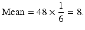
        That is, on average we will have 8 out of 48 throws with six eyes, which probably is not surprising.Furthermore: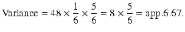The standard deviation
           is the square root of the variance
          , i.e.:
        Figure 5.1 shows the probabilities of this binomial distribution
          .Fig. 5.1Binomial distribution
        It can be seen that it is very unlikely to get more than (about) 20 throws out of 48 with six eyes.As expected, the distribution is
           concentrated around 8 (the mean
          ).
## 5.2 The Binomial Distribution
         and the Normal Distribution

Figure 5.2 illustrates that the binomial distribution shows some similarity with the normal distribution.Fig. 5.2Two binomial distributions
      The figure shows two binomial distributions. Both distributions have p = 0.5, equivalent to tossing a coin. One distribution is with n = 20 tosses and the other is with n = 50 tosses.
            The chart shows that the similarity with a normal distribution is improving, the larger n is.
          Sometimes we have a binomial distribution, where p is not 0.5 (as in the example with throwing a dice).
        If p is close to 0 or 1, n must be very large before the binomial distribution becomes similar to a normal distribution.
            As a rule of thumb, we have the following:

            The normal distribution can be used as an approximation to the binomial distribution, if
            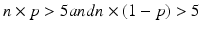
          Note that n × p is precisely the mean of the number of “successes” (e.g., throws with six eyes).Similarly, n×(1 − p) is the mean
         of the number of “failures” (e.g., throws with less than six eyes).Instead of the binomial distribution, we can use a normal distribution with the same mean and
              standard deviation.

            See an example later in this chapter.
            Technical note: Sampling with or without replacement?
          Often, we take samples
         from a specific population
         with a (finite) number of individuals. Ideally, sampling (*) should be carried out with replacement in order to use the binomial distribution to describe the distribution of the number of individuals with

             a certain characteristic (e.g., people with a specific hobby).
        Replacement means that each individual is “put back” before selecting the next individual of the sample. This way you can, in theory, select an individual twice (or maybe several times) in the sample, which means constant probability of getting individuals with that characteristic.Usually, the sample is relatively small compared to the population, for example, less than 10 % of the population. If we use sampling with replacement in this situation, the probability of selecting an individual twice (or several times) will be very small. Therefore, it corresponds roughly to sampling without replacement, i.e., each individual can only be selected once.In practice, the vast majority of samples are selected without replacement. Also, the vast majority of samples are small compared to the population, typically less than 10 % of the population. In this situation it is therefore possible to use the binomial distribution, although in principle it can only be used in conjunction with sampling with replacement.If the sample is larger than 10 % of the population and sampling is without replacement, one must use the hypergeometric distribution, which is considerably more complicated than the binomial distribution. If the sample is small compared to the population
        , the hypergeometric distribution is very similar to the binomial distribution. We refer to more advanced books on statistics.
## 5.3 The Binomial Distribution
         in Spreadsheets

This section can be skipped if you do not use spreadsheets.In Microsoft Excel and Open Office Calc, the following function determines probabilities of the binomial distribution:
-
              BINOMDIST (Value; Sample size; Probability; Cumulative).

      The function can calculate probabilities (e.g., probability of exactly two successes) and cumulative probabilities (such as the probability of maximum two successes, i.e., 0, 1 or 2 successes) (Table 5.1).Table 5.1BINOMDIST function

|NumberNumber of successes (e.g., throws with six eyes)|
|Sample sizeNumber of observations (or trials) (e.g., throws of a dice)|
|ProbabilityProbability of success in each observation (e.g., 1/6)|
|CumulativeCumulative = 0 calculates the probability of an exact number of successesCumulative = 1 calculates a cumulative probability.|

### 5.3.1 Example

As an example, we throw a dice four times and count the number of throws with six eyes.In other words, the number of throws with six eyes follows a binomial distribution with:
-
                n = 4 throws
-
                p = 1/6 = 16.7 % = probability of six eyes in each throw

        We wish to find:
- The probability of maximum two throws with six eyes
- The probability of exactly two throws with six eyes

        We enter the information in a spreadsheet as shown below (Fig. 5.3).Fig. 5.3BINOMDIST function example
        We find that the probability
           of max. 2 (i.e., 0, 1 or 2) throws with six eyes is approx. 98 %, i.e., it is very unlikely to have 3 or 4 throws (out of 4) with six eyes, which is hardly surprising. The probability of getting exactly 2 (out of 4) throws with six eyes is almost 12 %.
## 5.4 Statistical Uncertainty in Sample Surveys

We have now studied the main characteristics of the binomial distribution
        . In this and the next section, we study the most important applications in sample
         surveys.Let us imagine that we want to find an estimate
         of the relative frequency (*) of a particular activity among the kids in the
              Fitness Club

             survey. For instance, we want to find out which proportion of the kids is doing strength training. We can get this information through a sample survey. There will be some statistical uncertainty (*) connected with our estimate, and we also want to estimate this statistical uncertainty.The population
         consists of kids in the Fitness Club. The relative frequency in the population corresponds to the probability p that a randomly selected kid does strength training.The number of kids in the sample, who do strength training, can be described by a binomial distribution with
-
              n = sample size
-
              p = relative frequency in the population

      Assume that in a sample of n kids, there are x kids who do strength training.

            The estimate of the relative frequency p in the population is the relative frequency in the sample x/n.

        Note: Here the term relative frequency is
         interpreted as a proportion and used in much the same way as the term incidence (e.g., of a disease), which is often expressed as a percentage. In opposition to this is the (absolute)
          frequency (*)
        , which is expressed as a number (of occurrences, individuals, etc.).
            Two types of probability.
          You can use the term probability in (at least) two different ways:
- As an expression of a relative frequency (proportion) that can be found from a sample survey or an experiment
              . This is exactly the case here. We have a proportion (of kids doing strength training) in the population. We expect that this proportion is corresponding to the probability that a randomly chosen kid does strength training. This is the reason why we use the binomial distribution in this situation.
- As an expression of an expectation. We may say that the probability that a certain football match will end with a home win is 40 %. This is not necessarily based on knowledge about previous results of matches between the two teams; maybe there are no previous matches! Rather, we are using knowledge about the latest series of results of both teams and their position in the table, injured players, etc.

### 5.4.1 Example

Let us assume that out of n = 30 kids in the sample, x = 12 do strength training. We can estimate the relative frequency p in the population
           by the relative frequency
           in the sample:
        That is, we estimate that 40 % of the kids
           in the population do strength training.
          If the sample is large enough, we can approximate the
                binomial distribution

              with the normal distribution.
              The estimate
              x/n
              of the relative frequency p can also be approximated by a normal distribution.
            We can show that an estimate of standard deviation in this normal distribution is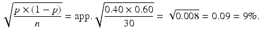
        The standard deviation of our estimate x/n of the relative frequency p is thus 0.09 = 9 %.We can now construct a 95 %
            confidence interval of p,
           which with probability 95 % contains the relative frequency in the population.This is done in the same way as when constructing a 95 % confidence interval for the mean
           of a normal distribution (see Chap. 4):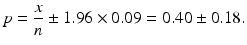
        This means that with 95 % probability the relative frequency p of kids doing strength training in the population is somewhere between 22 % and 58 %.It seems, perhaps, that we really do not know much about the proportion of kids doing strength training! The reason is, of course, that the sample is not very large.
          If we increase the sample size, the statistical uncertainty will become smaller, more about this below.
          The term after ± is the statistical uncertainty (*) u of the
           estimate of the relative frequency in the population.
              The general formula for the statistical uncertainty of a relative frequency is:
              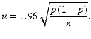
            When this formula is used in calculations, the relative frequency
           in the sample x/n is substituted for p.
          The above formula can only be used if the sample is substantially smaller than the population, for example, less than 10 % of the population.For example, if the population
           consists of 100 kids, we cannot use the formula with a sample size of n = 30. See textbox later for the situation where the sample is larger than 10 % of the population.In other words:
          As long as the sample is substantially smaller than the population, the statistical uncertainty is independent of the population size.For example, a random sample of 1000 persons in China is statistically just as good (or bad!) as a sample of 1000 persons in, for example, Sweden, although the population sizes are dramatically different. This comes as a surprise to many people!The above formula also has the interesting consequence that the largest statistical uncertainty is obtained, when p = 0.5 = 50 %. See Fig. 5.4, where we have plotted the statistical uncertainty vs. p for a sample size of n = 100.Fig. 5.4Statistical uncertainty vs. p
        It is clear from the figure that as long
           as p is not too close to 0 or 1 (for example, if p is somewhere in the interval from 0.2 = 20 % to 0.8 = 80 %), the statistical uncertainty is roughly the same as when p = 0.5.In other words:
              The statistical uncertainty is roughly constant as long as the relative frequency is not too close to the extremes.
            The relative statistical uncertainty is u/p; this number gets larger, the smaller p is, see Fig. 5.5 which is still based on a sample size of n = 100.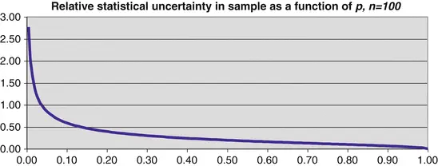Fig. 5.5Relative statistical uncertainty

              When the relative

                frequency

              approaches 0, the relative statistical uncertainty can get infinitely large.
            This can be translated to the opinion polls: The largest political parties, which come close to 50 %, have the largest statistical uncertainty. In contrast, the smallest political parties have the largest relative statistical uncertainty.It appears from the formula that the statistical uncertainty u is inversely proportional to the square root of the sample size n. For example, if the sample gets four times larger, the statistical uncertainty is halved. Conversely, if the sample gets four times smaller, the statistical uncertainty is doubled.This is illustrated in Fig. 5.6, which shows the statistical uncertainty vs. n, where p = 0.5. In other words, this is the maximum statistical uncertainty for a given sample size.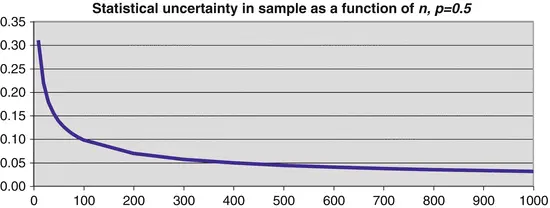Fig. 5.6Statistical uncertainty vs. n
        See also the table in Sect. 9.​4.​5 showing the statistical uncertainty for different values of n and p.
              Technical note: Statistical uncertainty of the relative frequency for a large sample.
            If the sample is larger than 10 % of the population and sampling is carried out without replacement, the formula for the statistical uncertainty of a relative frequency
           should be modified. The correct formula for the statistical uncertainty in this case is as follows:
        Here N = number of individuals in the population

              . The fraction n/N is called the
            sampling fraction (*)
          .When the sample is small, n/N is close to 0, and thus the square root of 1 − n/N is very close to 1. If the sample is larger than 10 % of the population, 1 − n/N is noticeably smaller than 1. Therefore, the statistical uncertainty can never be larger than:
        In other words, you can see this number as an upper limit for the statistical uncertainty. If the sample is very large compared to the population, the actual
          statistical uncertainty will be considerably smaller.
## 5.5 Is the Sample Representative?

Here, we illustrate an important application of the above calculations.We conducted a survey of kids in the
              Fitness Club

            . In the sample, there are 17 boys and 13 girls. We are interested in knowing whether the sample is representative with respect to sex or whether there are systematic errors or bias (*) related to the sampling (*). See more in Chaps. 1 and 6.An example of systematic errors or bias
        : Suppose that the sample is selected by visiting the Fitness Club a given day and asking the first 30 kids, we meet, to participate in the survey. Assume that the boys are more frequent users of the Fitness Club than the girls. Then we would have a biased composition of the sample, i.e., it is not a representative sample with respect to sex.The population
         consists of all kids in the Fitness Club. The club might know from its registers that there are 65 % boys and 35 % girls among the kids, who are customers.If you do not have knowledge about the relative frequencies in the population, you cannot use this approach to judge whether the sample is representative.Now we will ask ourselves the question
        : Is the sample representative with respect to sex?This question can be answered by using data from the sample
        to calculate a confidence interval for the proportion of boys in the population. If this confidence interval contains the known proportion of boys (in the population), the sample is representative with respect to sex.With (Table 5.2) the formula for the statistical uncertainty
         of p is:Table 5.2Data for example

|
                    x = number of boys in the sample17|
|
                    n = sample size30|
|
                    p = x/n = proportion of boys in the sample0.567|

        
      The statistical uncertainty is then u = 0.177 and the confidence interval for p has the endpoints 0.567 − 0.177 = 0.389 and 0.567 + 0.177 = 0.744, i.e., the confidence interval goes from 38.9 % to 74.4 %. As we can see, the confidence interval is very wide. The reason is, of course, that the sample is not very large!
        The confidence interval contains the known value of the proportion of boys in the population, which is 65 %. Therefore, we consider the sample to be representative with respect to sex.We have so far in this chapter studied the binomial distribution
        , including confidence intervals. In the rest of the chapter
        , we look at statistical tests which are used for surveys as well as for experiments.
## 5.6
            Statistical Tests

        Sometimes, you have a
              hypothesis

        , you want to confirm or reject. A simple example is examining whether a dice or coin is “genuine.” That is, the probability of, for example, six eyes when throwing a dice is 1/6 or the probability of heads is 0.5 when tossing a coin.You then set up a hypothesis, for instance, in this case the assumption that the probability of heads is p = 0.5 when tossing a coin. Generally, this is a hypothesis that a parameter in the population (e.g., a probability) equals a certain value. In statistical literature, the hypothesis
         is often called the
          null hypothesis (*)
        .
            Statistical test of a hypothesis:
          The objective is to decide whether the hypothesis is supported by data from a sample (or an experiment).
-
                  The hypothesis can be either true or false.

-
              We consider the hypothesis true, unless data indicate that it is false.

            The practical approach is as follows:
            1.Assume that the hypothesis is true. 2.Calculate the probability of outcomes at least as “rare” as the observed outcome. 3.If this probability is small (typically less than 5 %), reject the hypothesis. Otherwise, accept it.

### 5.6.1 Example

This approach is best illustrated with an example.Let us assume that we toss a coin n = 20 times and observe the outcome heads x = 5 times.We are now asking the question
          : Is the coin genuine? The general approach is as follows:1.
                  We assume that the coin is genuine, i.e., p = 0.5.We assume that the coin is genuine, i.e., we can use a binomial distribution
                   with n = 20, p = 0.5. Thus, we would expect around 10 times heads out of 20 tosses with the coin.Figure 5.7 shows the probabilities of this binomial distribution.Fig. 5.7
                          Binomial distribution
                           for example
                 2.
                      We calculate the probability of getting an outcome that is at least as rare as the observed outcome.
                    We have observed five times heads in 20 tosses, i.e., somewhat less than expected. An outcome at least as rare will be at most five times heads in 20 tosses.Usually you will add the probability of getting at least 15 (i.e., 20 − 5) times heads, which is just as rare to the “other extreme”; it is “just as bad” for the hypothesis. This is called a
                    two-sided test (*)
                  .We can easily calculate the probability of at most five times heads in 20 coin tosses by using a spreadsheet. This is precisely the sum of the probabilities in the bars from 0 to 5 in the chart above.The function BINOMDIST (5; 20; 0.5, 1) gives us the result 0.0207, i.e., 2.07 %. (This can also be looked up in a table of binomial probabilities.)

                      Similarly, the probability of at least 15 times heads in 20 coin tosses is the same, i.e., 0.0207.
                  The total probability of an outcome at least as rare as the observed outcome is therefore: 2 × 0.0207 = 0.0414 = 4.14 %.This probability is called the
                    p-value (*)
                   in statistical “jargon.” 3.
                      If this probability is small (typically less than 5 %), reject the hypothesis. Otherwise, accept it.
                    The probability of an outcome at least as rare as the observed outcome is 4.14 % < 5 %.The conclusion is, therefore, that we reject the
                        hypothesis

                       that p = 0.5! This means that there is statistical evidence that the coin is false!
        The philosophy behind the approach outlined above is as follows: If the probability of a more “rare” outcome is small, there are two options:
-
                    The hypothesis is true, but we have observed a rare event.

-
                    The hypothesis is actually false.

        Of course it is conceivable that the first option is correct. If so, we have observed a rare event! However, statisticians do not believe in miracles. Therefore, we prefer to believe the second option.
### 5.6.2 Approximation with the Normal Distribution

If you have to perform the calculations
           using only a calculator and a table of the normal distribution, you need to use the approximation of the binomial distribution
           with a normal distribution:In the example above, we should use a normal distribution with mean n × p = 10 and variance n × p(1 − p) = 5. The standard deviation is √5 = 2.236.In this normal distribution, we must calculate the probability of data values up to (and including) 5.Since the normal distribution covers the whole axis (not only integer values), we should actually find the probability of data values up to 5.5 rather than 5. We therefore add 0.5 to the value of x.
        We must therefore find the value NORMDIST (5.5; 10; 2.236; 1). We use 1 for the last parameter, because we need the distribution function
           (not the density function
          ). The result is 2.2 %. Again, you multiply by 2 and get 4.4 %, i.e., still below 5 %.That it is indeed permissible to use the normal distribution can be demonstrated as follows:With n = 20 and p = 0.5, we obtain n × p = 10 > 5 and n×(1 − p) = 10 > 5.
### 5.6.3
              Significance Level

              How small should the probability be, before we reject the

                hypothesis?

            This limit is called the significance level (*). Usually, we choose the significance level 0.05, i.e., 5 %.If the hypothesis is indeed true
          , there is a small probability (5 %) that we commit an error, i.e., reject a true hypothesis. This kind of error is called a type I error (*).
              If not explicitly stated, the significance level is 5 %.

          If the consequences of committing the error of rejecting a true hypothesis are very serious, we could choose the significance level 1 %.
        The price we pay for choosing a 1 % significance level is that it becomes more difficult to detect differences that actually exist, for example, to detect a false coin.In the above example with tossing a coin, the
            p-value
           is just below 5 %, but well over 1 %. If we use a significance level of 1 %, the hypothesis p = 0.5 is accepted. We need more convincing data to reject the hypothesis p = 0.5, if we use the significance level 1 %.
          Note: The significance level has to be decided before doing the statistical test. The example with tossing a coin shows why: Depending on the choice of significance level, you can either accept or reject the hypothesis.
### 5.6.4 Statistical Test or Confidence Interval

Let us in the example above construct a confidence interval for the probability of heads, p. We have observed a relative frequency of heads x/n = 5/20 = 0.25 = 25 %. This estimate for p is inserted in the formula for the statistical uncertainty
           u:
        The result is u = 0.19. The confidence interval is thus p = 0.25 ± 0.19, i.e., the confidence interval goes from 0.06 to 0.44. That is, a 95 % confidence interval for p does not contain 0.5. So based on our data we are (at least) 95 % certain that p is not 0.5, as it
          should be for a genuine coin.
              We thus get the same conclusion when using a confidence interval as when using a statistical test.

              To perform a statistical test at 5 %

                significance level

              for the

                hypothesis

              p = 0.5 corresponds to constructing a 95 % confidence interval for p and check whether the confidence interval contains the value 0.5.
            What are the advantages and disadvantages of the two approaches?
-
                A confidence interval gives a yes/no conclusion. On the other hand, a confidence interval also gives us a set of values of p, which can be considered likely.

-
                A statistical test gives both a yes/no conclusion (accept/reject) and a more graduated answer with the
                      p-value.

                    In the example with tossing a coin, the probability of a rarer event
                 is below 5 %, but only slightly below. That is, the hypothesis is only just rejected, which is not a very convincing conclusion. We would have felt more convinced, if the p-value was less than 1 %.

        In this section, we have dealt with a statistical test of a hypothesis in one distribution (the binomial distribution
          ). The next

               section describes situations where two or more distributions are to be compared.
## 5.7
            Frequency Tables

### 5.7.1 Introduction to Chi-Squared Test

Let us take a look at some data from the
                Fitness Club

               sample survey. We are still interested in the proportion of kids doing strength training, but now we want to group data according to sex. This is given in Table 5.3.Table 5.3Observed frequencies

|Observed frequency of kids|
| Does strength trainingNo strength trainingTotal|
|Boys10717|
|Girls21113|
|Total121830|

        We call this a frequency table. This is a 2 × 2 table (read “2 by 2 Table”), i.e., two rows (Boys/Girls) and two columns (Does strength training/No strength training).It looks as if (perhaps not very surprising) strength training is a boy’s thing. We can illustrate this by calculating the proportion (in percent) of kids who does strength training for each sex. This is given in Table 5.4.Table 5.4Row percentages

|Percent|
| Does strength training (%)No strength training (%)Number|
|Boys594117|
|Girls158513|
|Total406030|

        We see that 59 % of the boys do strength training. By contrast, only 15 % of the girls do strength training. In total in the sample, 40 % of the kids do strength training.This is a “subjective” evaluation based on comparing the two proportions; it is not an objective statistical test
           of whether the proportions differ.In the example above, it is probably quite obvious that there actually is a difference between the proportion of boys and girls doing strength training; we hardly need a statistical test. But in other cases there might be only minor differences in the proportions

              ; then the conclusion is less obvious, and there is a need for an objective criterion like a statistical test, so we are not left in doubt.Here we present a statistical test that can be used in situations where you have to compare two relative frequencies (proportions).

          The
                hypothesis

               is that there is the same proportion of boys and girls doing strength training. This means that there is independence between rows and columns, i.e., doing strength training is independent of sex.We use a statistical test of the hypothesis. We use the general approach:1.
                  We assume that the hypothesis is true. 2.
                  We calculate the probability of getting an outcome that is at least as rare as the observed outcome.
        First, let us consider how the frequencies would be if the hypothesis was correct. Then the proportion of kids doing strength training would be the same for boys and girls, i.e., equal to 40 %.This does not necessarily lead to integers as shown in Table 5.5.Table 5.5Expected frequencies

|Expected frequency of kidsTotal|
| Does strength trainingNo strength training|
|Boys
                          6.80
                        10.20
                          17
                        |
|Girls5.207.8013|
|Total
                          12.00
                        18.00
                          30
                        |

        For example, we calculate the expected 6.80 boys doing strength training as 40 % of 17 boys: 17 × 0.40 = 6.80.The 40 % can be written 12/30 = 0.40 = 40 %. This means that we can write the calculation of the “upper-left corner” of the table as: 

          Note which frequencies are used in this formula. They are highlighted in bold in the table above.Similarly, the other frequencies are calculated. We call these frequencies the expected frequencies. The original frequencies are called the observed frequencies.
        The hypothesis
           must be considered
           false if the observed frequencies are far from the expected frequencies. Before showing
           the calculation of the probability, it should be emphasized that a necessary condition is that all expected frequencies should be at least 5. This is the case here.
              We need a measure of the magnitude of the difference between the observed and expected frequencies.

          A measure of the difference between the observed and expected frequencies can be calculated using the following formula:Here:
-
                O = observed frequency

-
                E = expected frequency

          Σ is the “sum symbol,” i.e., we must add all 4 numbers of this type, as there are 4 observed frequencies and 4 expected frequencies.The result is called 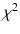. χ is the Greek letter Chi (pronounced “Ki”), which corresponds to the letters “ch”. χ2 is read “chi-squared.”
        The calculation of χ2 is as follows:

          If all the observed frequencies are the same as the expected frequencies, we will have χ2 = 0.Small values of χ2 are “good” for our hypothesis
          —this is evidence that the observed and expected frequencies are close. Large values of χ2 are “bad” for the
           hypothesis—this is evidence that the observed and expected frequencies
           are far apart.Now we need to find the probability of getting a value of χ2 that is larger (i.e., “worse” for the hypothesis) than the value calculated above. One can show that we have to use a so-called
            chi-squared distribution (*)
           (or χ2-distribution). In this case, we say that we use a chi-squared distribution with one degree of freedom (*) (more on this later).We can get a rough estimate of the probability by looking at the table of chi-squared distribution (with one degree of freedom) in Chap. 9. Here it is found that
-
                    The 97.5 % fractile is 5.02.

-
                    The 99 % fractile is 6.63.

        This means that the probability of getting a value greater than 5.79 is somewhere between 1 % and 2.5 %.We can show (see Sect. 5.7.4) that the probability is actually 0.016 or 1.6 %.3.
                      If this probability is small (typically less than 5 %), reject the hypothesis. Otherwise, accept it.

        We have seen that the probability of getting a value of χ2 above 5.79 is between 1 % and 2.5 %. As this is below 5 %, we reject the hypothesis, that the proportion doing strength training is independent of sex. This was what we had expected.In the figure, we see the

          density function
           of chi-squared distribution with one degree of freedom. It can be seen that the value 5.79 is pretty “extreme” in the distribution (Fig. 5.8).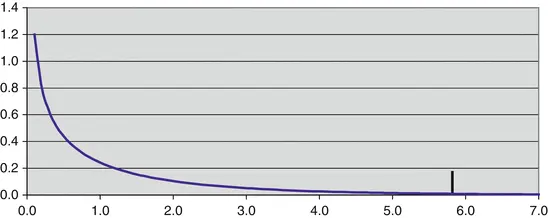Fig. 5.8Chi-square fractile in example

### 5.7.2 Confidence Interval

               for Difference Between Two Proportions

This section can be omitted without loss of continuity.We have seen above that there is statistical evidence that the proportions of girls and boys doing strength training are indeed different.It seems natural to ask the question: How large is the difference between the two proportions?
        The estimated proportions of boys and girls doing strength training are p
          1 = 59 % = 0.59 and p
          2 = 15 % = 0.15, so we estimate the difference between the two proportions to be p
          1 − p
          2 = 0.59 − 0.15 = 0.44.
              The

                statistical uncertainty

              of the estimated difference between the two proportions can be found as
              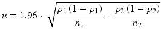
            Here p
          1 and p
          2 is the proportion among boys respectively girls doing strength training, and n
          1 and n
          2 is the total frequency of boys respectively girls in the sample.From the tables earlier in the chapter, we obtain n
          1 = 17 and n
          2 = 13.Using the formula above, we obtain the statistical uncertainty for the difference between the two proportions as u = 0.30.The difference between the two
           proportions is 0.44. Thus, a 95 % confidence interval for the difference is 0.44 ± 0.30.The confidence interval goes from 0.09 = 14 % to 0.79 = 74 %. The confidence interval does not contain 0, in accordance with the fact that the hypothesis
          , that the two proportions are identical, is rejected.It may seem that we do not know much about the size of this difference (except that it is not 0). If we need a narrower confidence interval
          , we must increase the sample size.
### 5.7.3 Several Rows and/or Columns

The statistical test
           we have described above can be used generally for the comparison of several distributions of a grouping of several categories. There can therefore be more than two rows and/or columns in the table.As an example, let us return to Table 2.​12, which was shown in Chap. 2. The
                Fitness Club

               kids were asked whether they do cardiovascular workouts or not. Moreover, they were asked how they perceive their physical fitness. Here is shown the frequency of kids in all combinations of the two questions (Table 5.6).Table 5.6Observed frequencies in example

|Cardiovascular workouts?Physical fitness|
|BadMediumGoodTotal|
|No663
                          15
                        |
|Yes366
                          15
                        |
|Total
                          9

                          12

                          9

                          30
                        |

        We will examine whether physical fitness is independent of cardiovascular workouts. The hypothesis
           is that there are the same relative frequencies (proportions) among the rows, i.e., cardiovascular workouts do not affect physical fitness.You can use the same procedure as above, i.e., first we calculate the expected frequencies. They are shown in Table 5.7. For example, the expected frequency of kids doing cardiovascular workouts, who have a bad physical fitness, is calculated as:Table 5.7Expected frequencies in example

|Cardiovascular workouts?Physical fitness|
|BadMediumGoodTotal|
|No4.56.04.5
                          15
                        |
|Yes4.56.04.5
                          15
                        |
|Total
                          9.0

                          12.0

                          9.0

                          30
                        |

          
        We observe that several expected frequencies are smaller than 5, but none are smaller than 4.5. Strictly speaking, it is not allowed to use the method described
           above; however, it will hardly be a very big mistake.We can now calculate χ2 using the formula:
        This gives the result 2.00.
              How many

                degrees of freedom

              should be used for the chi-square distribution?
            It turns out that the general formula is:
        In this example, there are two rows (No/Yes) and three columns (Bad/Medium/Good). Therefore, the number of degrees of freedom is DF = (2 − 1) × (3 − 1) = 1 × 2 = 2.In the table in Chap. 9, we find that the 95 % fractile of the chi-squared distribution
           with two degrees of freedom is 5.99. We have calculated a value χ2 = 2.00.This is far smaller than the 95 % fractile, i.e., the probability of getting a larger value is (probably a lot) larger than 5 %.Therefore, we accept the
                hypothesis

               that physical fitness is independent of doing cardiovascular workouts. This does not necessarily mean that the hypothesis is true. We just do not have statistical evidence to reject it.
        We can also calculate the probability directly using the CHITEST function in a spreadsheet (see the next section) and get approx. 37 %, much larger than 5 %.In the figure is shown the density function
           for a chi-squared distribution
           with two degrees of freedom
          . It is evident that the value 2.00 by no means is “extreme” in the distribution (Fig. 5.9).Fig. 5.9Chi-square fractile in example
        From the table of frequencies
          , one might suggest a trend that kids not doing cardiovascular workouts have a worse physical fitness compared to kids doing cardiovascular workouts. However, there is no statistical evidence in the data to support this assumption!
          Note: The hypothesis that there is independence between the row and column variables is accepted.In the case, when the hypothesis is rejected, this is itself not a guarantee that there is a causal relationship between the two variables! And if there is a causal relationship, the
                statistical test

               cannot tell which variable is cause and which variable is effect.
          It might also be that there exists an “indirect relationship” between the two variables, i.e., both variables are related to a third variable. We return to this issue in Chap. 7 in relation to quantitative variables.In this chapter we have seen some techniques, which are useful in the statistical analysis of sample surveys and experiments. In the next chapter, we look at some issues within planning of sample surveys and experiments. First, we show how the calculations above can most easily be done by calculator or spreadsheet.
### 5.7.4 Calculations in Spreadsheets

If you do not use spreadsheets, you can skip this section.We use the table of observed frequencies of
                Fitness Club

               kids doing strength training grouped according to sex (Fig. 5.10).Fig. 5.10
                  Chi-squared test
                   in spreadsheet
        First an explanation regarding the expected frequencies: For instance, cell B9 is calculated as 17 × 12/30.The formula in cell B9 can thus be programmed like this: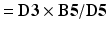
        However, it is an advantage, if you program
           cell B9 like this: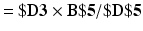
        The dollar signs are “absolute references”; see more in the help of your spreadsheet. If you copy cell B9 over the area B9:C10 (i.e., all the expected frequencies), the references will be kept properly. They will always refer to the correct cells.When you have calculated the expected frequencies, the rest is easy. See cell B13, how to use the spreadsheet function CHITEST.For the function CHITEST, you specify the cells with the observed frequencies (cell B3:C4) and the cells with the expected frequencies (cell B9:C10).
          The result is the p-value, i.e., the probability of getting an outcome that is at least as rare as the observed outcome. It is approximately 0.016 or 1.6 %. Previously, we found that the p-value is between 1 % and 2.5 %.We do not get the value of χ2, but we really do not need it for anything! If we want it after all, it can be calculated as shown in cell A14. We do an “inverse calculation” from the p-value using the function CHIINV. For the function CHIINV, you specify the p-value and the number of
                degrees of freedom

              , in this case 1. We get the same result 5.79, as was obtained previously.
### 5.7.5 Calculations by Calculator

If you do not use a calculator, you can skip this section. You need a mathematical calculator with logarithms.We use the table of observed frequencies of
                Fitness Club

               kids doing strength training grouped according to sex (Table 5.8).Table 5.8Data for calculations using calculator

|Observed frequency of kids|
| Does strength trainingNo strength trainingTotal|
|Boys10717|
|Girls21113|
|Total121830|

        There is another formula for calculating χ2, which is much easier to use on a calculator. It will give practically the same result as the above formula
          . The larger the sample, the better the agreement will be.In the table, we calculate a contribution from each number, including the subtotals and the total.Every contribution is of the form x × ln(x), where x is one of the numbers of the table and ln is the natural logarithm function, which is available on most mathematical calculators.The contribution corresponding to the observed frequencies in the 2 × 2 table and the total is added, the remaining contributions (corresponding to subtotals of each row and each column) are subtracted. Finally, we multiply by 2.In the example, the calculations look like this: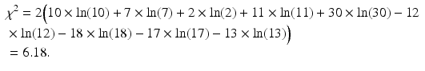
        We get a value of χ2, which is pretty close to the one obtained previously. The conclusion remains the same.The advantage of this formula is that we do not need to calculate the expected frequencies. This can be pretty cumbersome if there are many rows and columns.With this approach, we cannot control the necessary condition that all expected frequencies are at least 5. One easy solution is to calculate the minimum expected frequency using the minimum row total and the minimum column total, which should be >5.Here the row totals are 17 and 13; the smallest value is 13 from row 2. The column totals are 12 and 18; the smallest value is 12 from column 1. Thus, in row 2
          , column 1, we get the minimum expected frequency. This was previously calculated to be 5.20 > 5.

Error Sources and Planning© Springer-Verlag Berlin Heidelberg 2016Birger Stjernholm MadsenStatistics for Non-Statisticians10.1007/978-3-662-49349-6_6