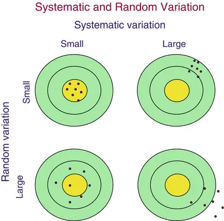
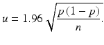
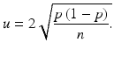
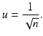
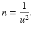
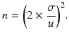

# 6. Error Sources and Planning

Birger Stjernholm Madsen1 (1)Novozymes A/S, Bagsvaerd, Denmark
## 6.1 Two Kinds of Errors

We saw in Chap. 3 that there are two types of variation in data:
          systematic variation
         and random variation

            .There are therefore two sources of errors in sample surveys as well as in planned experiments
        :
-
              Systematic errors, usually called
                Bias (*)
              : The difference between the true value and the mean
              .
-
              Random errors (*): The dispersion
               (spread) around the mean.

      This is illustrated in Fig. 6.1.Fig. 6.1Systematic and random variation

        Increasing the size of the sample (or experiment) can reduce the random errors. This can be used in the planning stages to determine an appropriate size of the sample (or experiment). We discuss this in the first part of the chapter.After that follows some topics exclusively related to sample surveys. First we discuss various sources of systematic errors in sample surveys, in continuation of the discussion in Chap. 1. We also give an overview of the principles of sampling (*) or sample selection.
## 6.2
        Random Error
         and Sample Size

The random errors (*) are

             coming from general causes of variability, which give rise to a natural variability. The natural variability is reflected in dispersion (spread) around the mean

            .

            This dispersion is always present to some extent. The individuals in a sample survey (or an experiment) will never be completely identical.The following considerations are based on a fundamental condition:
- The experiment
               or the sample must be organized through randomization (*). This means that an experiment should be conducted in random order, or that sampling should be done by a random selection mechanism (more on this later in the chapter).
- Randomization is necessary in order to be able to estimate the statistical uncertainty
              !

      When planning a sample survey or an experiment we often face the question: How large a sample size should we choose?The first question one must consider is what to record on each individual in the sample or experiment.Roughly speaking, there are two situations:1.We record a qualitative variable, often an alternative variable, e.g., “yes/no”. 2.We record a quantitative variable, i.e., a number for each individual.

### 6.2.1 A Qualitative Variable

Qualitative variables are usually

               associated with sample surveys, but may also arise in connection

               with planned experiments.We saw in Chap. 5 that the statistical uncertainty of a relative frequency is given by
        Here n is the sample size and p the relative frequency of one answer category (e.g., the answer “Yes” to a question). In this formula, we use the relative frequency x/n from the sample as estimate of p.The formula requires that the sample size n is large enough for the conditions n × p > 5 and n(1 − p) > 5 to be fulfilled. On the other hand, the sample size should be at most 10 % of the
                population

              (if sampling is without replacement), see Chap. 5.
          In practical calculations one can safely replace 1.96 with 2. There is no important difference in the result, and it makes the calculations much simpler. Therefore, we use the simpler formulaAs shown in Chap. 5 the formula gives the maximum value for p = 0.5 = 50 %.If we put p = 0.5, the formula can be reduced to the following expression for the maximum statistical uncertainty
           of a relative frequency:
        This formula is remarkably simple!! Yet, I have found it in no other books on statistics!A few examples:
- The maximum statistical

                    uncertainty for n = 100 is u = 1/√l00 = 1/10 = 0.1 = 10 %.
- The maximum statistical

                     uncertainty for n = 10,000 is u = 1/√10,000 = 1/100 = 0.01 = 1 %.

        The formula can be used to estimate the sample size to achieve a given maximum statistical uncertainty. If the maximum statistical uncertainty must be u, we get:
        This is the minimum sample size, we can use. This formula is extremely useful!
          Note: The formula above assumes that the sample size is less than 10 % of the population
          . If the sample size found from the formula is larger than 10 % of the population, the statistical uncertainty
           becomes smaller. Thus, we are on the safe side, if we use the formula above to determine the sample size.
          Technical note: If the sample is large compared to the population.In this case, the statistical uncertainty can be considerably less than the value determined from the above formula. See end of Chap. 5, where the correct formula for the statistical uncertainty is indicated.The required sample size then becomes much smaller. The easiest way is to program the formula from the Chap. 5 in a spreadsheet and try different sample sizes, until you get the desired maximum statistical uncertainty. As a starting value, you can use n = 1/u
          2.
#### 6.2.1.1 Example

An example of a situation from

                 a sample survey: In Chap. 5, we found that among

                 the n = 30 kids in the
                  Fitness Club

                 survey, we find that x = 12 do strength training. The relative frequency in the sample is thus x/n = 12/30 = 0.4 = 40 %. We also found that the statistical uncertainty is 0.18 or 18 %.If we find this statistical uncertainty too large, we can use the formula for n. If we want to have a maximum statistical uncertainty of 0.1 = 10 %, we find the minimum sample size n = 1/u

                  2
                 = 1/0.12 = 100.The above formula can obviously be used in subgroups of the population. The formula then finds the value of n for each subgroup separately.For example, we want to be sure of getting a fairly accurate estimate for both boys and girls separately. We then apply the formula for each sex separately. We specify the maximum statistical uncertainty acceptable for the relative frequency of boys doing strength training. This gives us the necessary number of boys to be included in the sample. The same calculation can be performed with the girls.
### 6.2.2 A Quantitative Variable

Quantitative data occur often in sample surveys as well as planned experiments
          .We saw in Chap. 4 that the statistical uncertainty of an average, if the standard deviation
           is known, is approximatelywhere σ is the standard deviation and n is the sample size.Strictly speaking, we should replace

               2 by 1.96. This does not mean much in practice, however.If we know the standard deviation σ and

               want a maximum
                statistical uncertainty

               u of the average, we find the necessary sample size as:
        We cannot determine the sample size without knowledge about the dispersion of what we measure!
          Note: We often use the term sample size even when planning an experiment!
#### 6.2.2.1 Example

We show an example from a planned experiment, but it might as well be a sample survey.We want to perform an experiment with baking of breads with a special wheat variety. We want to assess the impact on bread volume of the addition of a special additive, aimed at increasing the volume.We know from previous experiments that we can expect a standard deviation of app. σ = 10 ml of the bread volumes. We want a maximum statistical uncertainty on both averages (bread baked with and without additive) of u = 5 ml.If we use the formula for n, we get n = (2 × 10/5)2 = 42 = 16. If we are to be on the safe side, we should choose n = 16 breads in each group (with/without additive).In total, in the experiment we should bake 2 × 16 = 32 breads.Strictly speaking, we do not need to specify both the standard deviation σ and the statistical uncertainty u. It is enough that we specify the desired ratio between σ and u.Maybe we do not have precise knowledge of the standard deviation
            .However, we may want a maximum statistical uncertainty
            , which is half of the standard deviation obtained. This means

                that we require

                 that σ/u is at least 2.We now use the formula with σ/u = 2. This results again in the required sample size n = 16 for each group.
#### 6.2.2.2 Notes

                1.
                    If the value of n determined from the formula is small (e.g., smaller than 10), we must be careful. In practice, the necessary size of the experiment
                     may be larger. We have used the factor 2 to construct a confidence interval
                     for the mean
                    . Strictly speaking, we should use the 97.5 % fractile of a t-distribution with n − 1 degrees of freedom
                     (see Chap. 4). If n is smaller than 10, the 97.5 % fractile is larger than 2, see table of the t-distribution at the end of the book. 2.
                    In most sample surveys, we often have only one group. Thus, we get directly the necessary sample size from the entire population
                     using the formula for n. 3.In most experiments, we are often interested in comparing two or more groups (“treatments”). Therefore, you might prefer to determine the necessary sample size to obtain a given statistical uncertainty of the difference between two means. See more in Chap. 8.
              So far, we have been dealing with the necessary size of a sample (or an experiment). This depends on how large a random error, we can accept.The rest of this chapter focuses on sample surveys. We look in more detail at bias (systematic errors). Also, we discuss how to do the sampling (sample selection), so that bias
             is avoided as much as possible.
## 6.3
        Bias
         (Systematic Errors)

In Chap. 1, we discussed some errors associated with sample surveys, in particular questionnaires.
        Bias (*) or systematic error comes from specific causes, which often can be identified. By removing these specific causes, the bias can in principle

             be avoided. The main causes of bias in sample surveys (questionnaires) are:1.Errors caused by the interviewing process and wording of the questions. 2.Errors caused by nonresponse

                    . 3.Errors in the sampling (sample selection). 4.Errors in the definition of the sample.
      In Chap. 1 we discussed 1 and 2. Now, we discuss 3 and 4.
### 6.3.1 Errors in the Sampling (Sample Selection)

The sampling (*) or sample selection
           should preferably be done using randomization
           (*). We discuss this in the next section.The danger of not using randomization, but instead using some kind of “convenience sample” is that there may be a bias, because we get too few of one type of people and too many of another type.Typical examples are Internet polls and telephone polls during television programs.
- Who are using a certain website at any given day and bother to vote?
- Who are viewing a television program and bother to make a phone call to express an opinion?

        This need not be a sample representative

               of the population
          !
#### 6.3.1.1 Example

The
                  Fitness Club

                 survey could be organized by letting interviewers visit the club and “haphazardly” selecting some of the kids, who are present.The disadvantage of organizing

                 the survey in this way is that we do not know what type of kids, we select. We will probably get many kids, who are frequent users of the club! Maybe we are interested the other kids also… Perhaps we want to find out, why some of the kids are less frequent users of the club!
### 6.3.2 Errors in the Definition of the Sample

The ideal situation is that you have a database
           (a register) of the whole population. This makes it easy to provide a sampling frame, from which you select the individuals included in the sample. The sampling frame can be a separate copy of the database, as it looks when the sample is selected.The individuals that are selected from the sampling frame are called sampling units
           (*). A sampling unit may be the same as an individual in the population. It may also be a group of individuals from the population.The population will often consist of persons. The sampling frame may consist of households. A number of households are selected from the sampling frame. From each household one or more persons are selected. In this context we call a person the analysis unit.An incomplete sampling frame is a frequent source of bias in sampling surveys. This means that the sampling frame does not correspond exactly to the population. This can happen because:
- Some individuals from the population cannot be part of the sample. For instance, people living in institutions cannot be part of the sample, if the sampling frame consists of private households only.
- The sampling frame is not up-to-date. There is often a time lag from the time of selection to the time of the interview. During this period the
                      population

                     may change! For example, a person from the sampling frame may die before

                     the interview.
- The sampling frame is incomplete or incorrect for other reasons. A list of households could for example be based on an incomplete or incorrect list of roads and road numbers.

#### 6.3.2.1 Example

Once every month
                  Fitness Club

                 prints a list of all the kids, who are using the club. The sample survey is organized by taking a number of kids from this list.Problems may arise in this
             context:
- A kid from the list has stopped in the club at the time of interview.
- A new kid has started in the club after the list has been printed.

### 6.3.3 What Is a Representative Sample?

The term representative sample is used in many ways, without being defined. Use of this term should preferable be avoided. If we need a definition, it might be something like this:
          A sample can be called representative, if there are only random errors, i.e., no bias
          .Under this definition, representative sample surveys do not exist! A representative sample can therefore be seen as an ideal! There will always be bias
          , but we can do much to reduce it!
              Important note:

-
                    Only the random

                      error

                    s will become smaller, when the sample size increases!

-
                    The bias will not become smaller when the sample increases!

            If, for example, the sampling unit
           is a household, and we select the first available person from each household, we will often get too many women and too few men, because women on the average have shorter working hours than men. This will not

               change by increasing the sample size! We will still have too many women and too few men, regardless of sample size…
## 6.4 Sampling (Sample Selection)

In this section we describe the main principles of sampling (*) or sample selection. As mentioned earlier, sampling should be based on randomization
         (*); otherwise it may cause systematic errors. Therefore, the most important methods of sampling are based on randomization.We also give a short description of some other methods, which are not based on randomization.
### 6.4.1
              Simple Random Sampling

This is the basic method. Simple random sampling (*) is in fact a gigantic lottery!The formulas for the determination of the statistical uncertainty
           from the start of this chapter assume simple random sampling. If the sample has been selected by some other mechanism, the formulas are not correct!We refer to specialized books on survey sampling, if you need to calculate the statistical uncertainty associated with other methods of

               sampling.Nowadays, simple random sampling is done using random numbers

               in statistical software or a spreadsheet.In a spreadsheet, you can use the function RAND. This function is used without any parameters:=RAND()This provides a random number between 0 and 1.The general approach for selecting n sampling units
           from a sampling frame can be summarized as follows:1.Use the function RAND for each sampling unit in the sampling frame. 2.Sort all sampling units according to the value of the random numbers. 3.Select the first n sampling units, where n is the required sample size.

### 6.4.2
              Stratified Sampling

Stratified sampling (*) is a method of dividing the population
           into homogeneous groups, called strata (singular: stratum). Within each group simple random sampling
           is used!The main reason to do
                stratification

               is that we can reduce the statistical uncertainty
           significantly. Conversely, we can reduce the sample size significantly without increasing the statistical uncertainty! This happens, if the strata are homogeneous, i.e., the spread within strata is small, while on the other hand, the spread between strata is large.Let us as a hypothetical (?) example imagine that men and women are 100 % divided with respect to the opinion on a particular issue. For instance, all men will answer “Yes” to a certain question, while all women will answer “No”. In this situation the sample need not be very large in order to cover the population! In fact, a sample size of 2 is enough (one man and one woman)… There
           is no further information in a larger sample!This example is of course entirely hypothetical! However, if the situation has a certain similarity with the hypothetical example, there will still be a huge gain by stratification. This is true if e.g., most men will answer “Yes” to the question and most women will answer “No”.
          If we have data from an earlier sample survey, we can use these data to plan a new sample survey. Often, there is one particular variable, which is the most important variable. Then we can carry out some statistical analyses to determine the factors that have the largest influence on this variable. These factors are then used for stratification. The statistical techniques used for this purpose are extensions of the methods discussed in Chap. 5, 7 and 8.Other reasons for stratification may be:1.
                  Administrative reasons. This might be stratification according to geographical criteria. In this situation, the statistical uncertainty will rarely be reduced much compared to simple random sampling; it may even be larger. 2.
                  Groups (strata) are particularly interesting. We want to ensure that all strata are adequately represented in the sample. This is particularly important, if there are small groups in the population, for which we require separate results. 3.
                  Sampling is conducted according to different principles in different groups of the population. For example, some people live in institutions rather than ordinary households. The practical problems involved in sampling are very different.

#### 6.4.2.1 Example

In the
                  Fitness Club

                 sample survey

                , stratifying by age will probably be a good idea. There is in virtually every aspect very big differences between a 12-year-old and a 17-year-old… We could have two strata: kids 12–14 years old and kids 15–17 years old. It might also make sense to stratify by sex. It depends on the main purpose of the survey. You can also stratify

                after both age and sex, for example, using four strata in total.
                How many individuals should be selected from each stratum?
              Normally, we will select a number of individuals in each stratum, corresponding to its size in the population
            .If one group is twice as large as another, we normally select twice as many individuals in this group compared to the other.In some cases we will over-sample some groups and under-sample others. For example, some groups are of particular interest. In these cases, we must calculate a weighted average, when calculating an average from the sample. That is, we multiply each group average with its weight from the population. If one group in the population is twice as large as another, this average should count
             twice as much as the other average.
### 6.4.3
              Cluster Sampling

Cluster sampling (*) is based on a sampling frame, consisting of sampling units
          , which in turn contain several analysis units.The classic example is a household, which consists of several people. We select a number of households by simple random sampling
          . We can then select one person, all persons or for instance half of the persons from the household. In this context the sampling unit (a household) is often called a cluster.Cluster sampling is used mainly

               for administrative and cost reasons. You may have access to a sampling frame consisting of households, but not a sampling frame of persons.
          The
                statistical uncertainty

               associated with cluster sampling will usually be larger than when simple random sampling is used. This happens when the individuals in a cluster are similar.Assume that we are interested in the television viewing of adult persons. In most households consisting of two adults, they will watch a television program together. If you ask them, which television programs they saw the day before, you will get the same response from both adults in the household! There is, in other words, no additional information asking both adults as
          compared to asking only one of them!Of course, this is a simplified description. For example one of them may be shopping, while the other watches television at home. As long as the population
           consists of only adults, this description is, however, reasonably correct.
          In some cases cluster sampling has smaller
                statistical uncertainty

               than when simple random sampling is used. This happens if there are large differences between the individuals in a cluster.Assume that we still restrict the population to adults, and we are interested in their consumption of sanitary towels. This situation is just the reverse: Households with two adults will most often be one person of each sex; therefore, there will be a very large difference
           in their consumption of sanitary towels!
#### 6.4.3.1 Example

The sampling of school children in a specific school may be carried out in two stages:
- First, we select a number of classes by simple random sampling
                   from a sampling frame of all classes.
- Then we select a number of children from each selected class by simple random selection.

          We use cluster sampling, because it

                 only requires lists of children in the classes, which have been selected!
                How to select

                  sampling units

                and analysis units?
              We select a number of sampling units by simple random sampling. This step has (at least) two options:
- Sampling units are selected with the same probability.

- Sampling units are selected
                  with a probability proportional to size: The larger a sampling unit (e.g., household or school class), the larger the probability of selection.

          From each sampling unit, one or more analysis units are selected. This step has several options:
- To select one analysis unit.
- To select all the analysis units.
- To select a number of analysis units proportional to size of the sampling unit. The larger a sampling unit
                  , the more analysis units must be selected.

          The topic is very large. We refer to specialized books
             on the topic.
### 6.4.4 Systematic Sampling

If you do not have a sampling frame in the form of a database

              , you can use systematic sampling, which despite the name is based on randomization
          !Systematic sampling can be seen as a practically feasible approach in situations where simple random sampling
           is not feasible! The method is best illustrated by an example.
#### 6.4.4.1 Example

In the
                  Fitness Club

                 survey, we have a list of all kids in the club. There are 300 in total; we select 30 kids for the sample. We must therefore select every tenth kid from the list.The only randomization in this
             sampling approach is the selection of the first kid!
- We choose a random number
                   between 1 and 10, for example 7. We choose kid no. 7 from the list.
- Then we select every tenth kid from the list. This means, that we will select no. 7, 17, 27, etc.

          The method can be used to select customers entering a shop, who should participate in a questionnaire survey. If every tenth customer is to be selected

                , we can use exactly the same approach.The statistical uncertainty
             may be larger or smaller, than when simple random sampling is used. It is very difficult to tell a priori, what will be the case.
### 6.4.5 Quota Sampling

We now briefly discuss some methods of sampling, which are not based on a randomization mechanism. This should be avoided if possible, because we are not able to assess the size of the random error
          !Having said that, there are situations where randomization is not feasible. Quota sampling is typically used in situations where the interviewer is in e.g., a shopping mall. Simple random sampling of customers is not feasible. It is not possible to prepare a sampling frame.Instead, the interviewer will have a number quota to be “filled”. Often we use a number of age groups for each sex: e.g., men aged 15–29, 30–44, etc. The interviewer needs a number of persons in each group.The interviewer has opportunity to “spot” potential candidates for each group, as they appear. In this way it seems that we cover the population

               in a reasonable “representative” manner. However, we do not have any opportunity to demonstrate, that this is true…The sample may be “representative”

               in terms of sex and age. But there may be a number of other criteria, where the sample is biased (“unbalanced”), and we do not know anything about it! At the same time we have no idea about the size of the statistical uncertainty
          !
### 6.4.6 Purposive Sampling

This technique is used as an easy way to get a quick sample, which is similar to the population. We may have detailed knowledge about the population, so that we can sample a few “typical” sampling units
          . This is done quite purposively, without any kind of randomization
          .If we are lucky (and clever!) we can

              thereby obtain a sample, which is very similar to the population.The sampling unit will often be an administrative unit consisting of several analysis units.The drawbacks of this method are the same as for quota sampling.
#### 6.4.6.1 Example

Early exit polls after elections can be produced by selection a few “typical” municipalities, which “reflect” the nation quite precisely. In each municipality we select a few polling stations, using our knowledge about the municipality to “cover” the municipality “representatively”. In each polling station we ask a number of voters, how they voted. The selection of these voters could be done by e.g., systematic sampling.
### 6.4.7 Convenience Sampling

The sample is selected “haphazardly”. It may be volunteers, “friends and relatives,” etc.
              Such sample surveys have no statistical value!
            See discussion on Internet polls and telephone polls
          , etc. earlier in this chapter.However, this type of samples need not totally be condemned: They can be useful to test (parts of) a questionnaire in order to assess whether the wording of one or more questions needs to be changed. This is often called a pilot survey. We are only interested in a qualitative (not a statistical) evaluation of the questionnaire!In Chap. 5, we discussed how to analyze qualitative data from a sample survey or an experiment.In this chapter we have discussed various aspects in connection with planning a sample survey or an experiment. In the next two chapters, we describe

              , how we can analyze quantitative data from a sample survey or an experiment.

Assessment of Relationship© Springer-Verlag Berlin Heidelberg 2016Birger Stjernholm MadsenStatistics for Non-Statisticians10.1007/978-3-662-49349-6_7