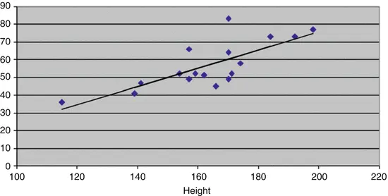
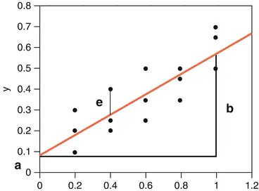
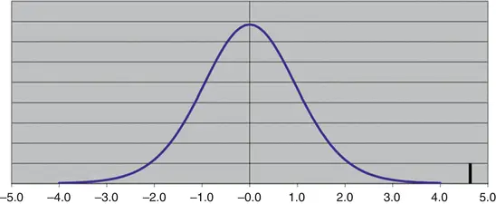

# 7. Assessment of Relationship

Birger Stjernholm Madsen1 (1)Novozymes A/S, Bagsvaerd, Denmark In many different disciplines you need to assess, whether there is a relationship between two variables. This can be in administration, social sciences, economics, industry, and science.The purpose could be one of the following:
- To get a basic understanding of a subject area
- To find reasons or explanations of phenomena
- To try to predict future developments

    We study some techniques to assess a relationship and assess whether an apparent relationship is real or just a statistical coincidence.The technique is called
        regression analysis (*)
      . We will only consider the basic technique,
        linear regression,
       which assumes that there is a linear relationship between two variables, i.e. a plot of Y against X shows a number of points scattered around a straight line.One of the variables is the Y-variable or dependent variable. The other variable is the X-variable or the independent variable.The subject is treated fairly briefly. We refer to the literature list, if you want to study the issue thoroughly.The calculations are quite complicated. You can use an advanced calculator with built-in regression analysis, but you are better off with a spreadsheet or statistical software.There are also more advanced types of regression analysis, for instance nonlinear regression or
            multiple regression

          (multiple X-variables). You can read more in many of the books from the literature list or study the Help of your spreadsheet or other statistical software.This chapter discusses the fundamental concepts of linear regression, with a practical example. We do not show the calculation formulas for the different statistics. These formulas are only important, if you do not have a spreadsheet (or other software) or an advanced calculator to do the calculations!Here, we use statistical functions of Microsoft Excel, Open Office Calc, and several other spreadsheets. Microsoft Excel also has additional options in the add-in menu “Data Analysis”, under the item “Regression”.
      It is important to use these techniques critically. Ask questions such as:
- Is there a relationship?
- Is it a linear relationship?
- Is there causality?

      Note: Statistics can tell, whether there is a statistical relationship between two variables, whether it is linear or possibly more complicated (nonlinear). But statistics cannot tell, whether one phenomenon is the cause of another, i.e. whether there is a causal relationship. Here professional knowledge is needed.
      Many variables in the social and natural sciences increase with time. In this situation, a plot of any variable against any other variable will show a reasonably clear relationship.However, this is a statistical relationship, not a causal relationship. The real relationship, which is hidden in this way, is an increase with time for both variables. This is a fairly common error in connection with interpretation of statistical results.Assume that the number of storks and the number of children in a given area increase in a certain period of time; you cannot conclude that the storks are coming with the children! This is a kind of false conclusion, we often find in newspaper articles.The underlying (third) variable need not be time, but often it is.
## 7.1 Example

Let us consider the height and weight of the 17 boys in the
          Fitness Club survey
        .We ask the following question: Is there a (possibly linear) relationship between height (X) and weight (Y)?We assume that the weight is dependent on the height. Therefore, we put height as X and weight as Y.One purpose could be to identify boys, who weigh too much compared to their height; these boys might be interested in an intensive weight loss program!The first step is always to plot data.The following is a plot of weight vs. height. In addition, we can see the straight line that makes the best fit to data. This line is established by the
          method of least squares (*)
        . See the literature list for books with a detailed review of the method. The line is called the
          regression line (*)
        . See the Help of your spreadsheet how to do this (Fig. 7.1).Fig. 7.1Weight vs. height
      A statistical model can describe these data. It describes the weight Y of a randomly chosen boy, knowing his height X, through the equation
      If we ignore the term e, this is precisely the equation for a straight line. Here
-
              X = Height of a boy
-
              Y = Weight of a boy
-
              a = Intercept (on Y-axis) of the regression line
-
              b = Slope of the regression line
-
              e = Random variation
               of Y (for a given value of X), often called residual

      This is illustrated in Fig. 7.2.Fig. 7.2Regression line
      Sometimes, data need to be transformed in order to obtain a linear relationship. If the points tend to be grouped around a (nonlinear) curve, a seemingly nonlinear relationship can become linear by transforming Y and/or X, e.g. with the logarithm function. In the graph with weight plotted against height, there is no immediate sign of a nonlinear relationship.To describe the degree of (linear) relationship between X and Y we use the correlation coefficient (*)

            , often simply called the correlation and labeled with the letter r (Table 7.1).Table 7.1Correlation coefficient, r, is a number between −1 and 1. The interpretation is as follows:

|
                    r = −1A perfect linear relationship, where the line is tilted downwards|
|
                    r = 1A perfect linear relationship, where the line is tilted upwards|
|
                    r = 0No (linear) relationship between X and Y
                  |

      This is illustrated in Fig. 7.3.Fig. 7.3Correlation
      Practical situations are usually not that clear-cut! The graph with weight plotted against height is equivalent to a situation where r > 0. By visual inspection, most people will probably find that r may be closer to 1 than to 0. We will determine r below.Sometimes we use r

              2
            , i.e., the squared value of r, which is a number between 0 and 1, as a measure of the degree of (linear) relationship between X and Y. It is often written R
        2 (i.e., with capital “R”) or R-SQUARE. It is also called the coefficient of determination. You can say that R
        2 expresses how large a part of the variation in Y, which is “explained” by X.This can be used to compare different models. It can sometimes be difficult to see from a graph, whether we should transform, e.g. the Y-variable or not (typically with the logarithm). If it is difficult to see from the graph, we can choose the model that gives the highest value of R-SQUARE.Please note that a relatively high value of R-SQUARE is not a guarantee that a linear relationship is an adequate description of data. Always study the plot also!
## 7.2
        Linear Regression
         with Spreadsheets

Data for the boys are shown below, but only the first few rows. Data continue until row 18 in the spreadsheet (Fig. 7.4).Fig. 7.4Spreadsheet example
      To perform linear regression, we use the following spreadsheet functions:
- INTERCEPT
- SLOPE
- CORREL
- RSQ
- FORECAST

        Note: There is another worksheet function called PEARSON to calculate the correlation coefficient
        . This is just another name for the same function as CORREL; the reason is that the correlation coefficient is often called the Pearson correlation coefficient.Input parameters to the first four functions are the data cells for the Y and X variables. See column F for the formulas; the result of applying the formulas is given in column E.Column C shows the forecasts of weight
        , as predicted by the model. They correspond to points on the regression line
        , i.e., we move vertically from a point (up or down), until we hit the regression line.The predicted values are calculated using the function FORECAST.Input parameters for this function are the following: First the value of X, for which you want a prediction (forecast) of the Y-value. Then the relevant range of data cells for Y and X. Here is, for example, how the content of the cell C2 is programmed.FORECAST(A2;$B$2:$B$18;$A$2:$A$18).
        Note: We have used “absolute references” (dollar signs) to display the range of data cells of Y and X (see Chap. 5, section on frequency tables). This means that you can copy the contents of cell C2 down over the whole area C2:C18, only the reference to the actual value of X will change! See also the Help of your spreadsheet.We see that the intercept (on Y-axis) is negative. We can calculate a 95 % confidence interval
         of this statistic; this confidence interval ranges from −66.7 to 12.1. (This could, for example, be calculated in Microsoft Excel using the add-in menu “Data Analysis”, menu-item “Regression”.) This means that 0 is in the confidence interval, which makes sense. This corresponds to the fact that a boy of 0 cm weighs 0 kg!The slope (SLOPE) is about 0.5, representing an increase of 0.5 kg in body weight for each additional cm in height.The correlation coefficient

             is about 0.76 (positive, and as expected closer to 1 than 0).The value of R-SQUARE is 0.58; this is the same as the squared value of the correlation coefficient.A plot of weight against height is shown in the beginning of this chapter, with the regression line
        .Column D contains the residuals, i.e., the vertical distances between each point and the regression line. They can be calculated as the difference between the columns B (weight) and C (forecast), i.e., they are calculated as Weight-Forecast.
        Residuals are very useful for model control. You can examine, if the residuals follow a normal distribution using some of the methods from Chap. 4. This is skipped here.Moreover, we can plot the residuals against the X-variable or other variables. In Figs. 7.5 and 7.6 we show diagrams with the residuals plotted against height, and the predicted value of weight (the “forecast”).Fig. 7.5Residual vs height
        Fig. 7.6Residual vs. forecast
      Looking at these graphs, there is no obvious “pattern”. That is exactly what we hope for: The residuals should show only random variation!The residuals can also be used to identify extreme observations, for instance boys weighing too much. This could be done by calculating the standard deviation of the residuals; the average of the residuals will always be 0. The standard deviation of the residuals can easily be found to be 8.68; this is the standard deviation for random variation
        .The 95 % fractile of the normal distribution is 1.645. This can be seen from the table of the normal distribution in Appendices (Chap. 9). Thus, if the residuals roughly follow a normal distribution, values larger than 1.645 times the standard deviation for random variation = 14.3 should occur with 5 % probability.This could also be used to identify future boys weighing too much. A future boy customer giving information about his height and weight could be offered an intensive weight loss program, if his weight exceeds the expected weight by more than 14.3 kg. His expected weight can be calculated using the intercept and slope found above as −27.31 + 0.515×Height.Similar calculations can of course be done using data for the girls in the survey. It is not a priori certain that the intercept and slope for the girls will
         be similar to those for the boys.
## 7.3 Is There a Relationship?

We accept from the above that the relationship between height (as X) and weight (as Y) can be described by a linear relationship. Now we ask the next question: Is the regression line
         different from a simple average, i.e., could the regression line in fact just as well be horizontal? If so, there is no (linear) relationship between the two variables.
        We therefore formulate the following
              hypothesis

            :
-
              The line is horizontal, i.e., b = 0.
- This is the same as: The correlation coefficient
               between the two variables is 0.

      We use the general approach from Chap. 5 for testing a hypothesis:1.
                We assume that this
                      hypothesis

                     is true. 2.
                Calculate the p-value (*), i.e., the probability of getting a more “rare” result. It may in this case be shown that one should calculate
              Here, n = number of observations = 17 in the example and r = correlation coefficient = 0.7645
                . Inserting these values in the formula, we get t = 4.59.This statistic can be described by a t-distribution with n − 2 degrees of freedom
                . We subtract 2 from the sample size instead of 1, due to the fact that we must calculate two parameters, intercept and slope.Here n = 17, i.e., there are 15 degrees of freedom.If r = 0, we get t = 0. If r > 0, we get t > 0. If r < 0, we get t < 0. If r is far from 0, t will also be far from 0.The hypothesis r = 0 is rejected for both negative and positive values of r, which are far from 0. In other words: We reject the hypothesis
                 in “both ends” of the t-distribution.
              We can now lookup in the table of the t-distribution with 15 degrees of freedom [see Appendices (Chap. 9)] and find that the 99.5 % fractile is 2.947. Thus, the probability of getting a larger value than 4.59 is (probably a lot) less than 0.5 %. The probability of getting values below −4.59 is also less than 0.5 %. In total, the probability of values of t “more extreme” than ±4.59 is less than 1 %.The figure shows the density function
                 for a t-distribution with 15 degrees of freedom. It is evident that the value in 4.59 is rather “extreme” in this distribution (Fig. 7.7).Fig. 7.7Fractile in t-distribution
               3.
                    If this probability is small, reject the

                      hypothesis

                    , otherwise accept it.
                  Here we have found a probability of more “extreme” values of t less than 1 %, i.e. the hypothesis b = 0 is rejected. We conclude that there is statistical evidence of a (linear) relationship between height and weight.Using the Excel add-in menu “Data Analysis”, menu-item “Regression”, you can create a 95 % confidence interval
                 for the slope. This goes from 0.28 to 0.75. Once again, we conclude that the slope is not 0, i.e. the line cannot be horizontal.

### 7.3.1 Note

The
            t-test
           above is exactly the same as the t-test for b = 0, which is presented in many other books on statistics, and calculated in the Excel menu “Data Analysis” under “Regression” or in other statistical software.The advantage of the above formula for t-test is that it is much easier to calculate. It requires no special statistical software. It requires only calculating the correlation coefficient
          .The correlation coefficient is easy to calculate in almost all spreadsheets, including Open Office Calc. There are also many advanced calculators, which can calculate the correlation coefficient.If you have Excel (add-in menu “Data Analysis”, menu-item “Regression”) or more advanced statistical software, you do not need to calculate the t-statistic manually.
## 7.4 Multiple Linear Regression

This section can safely be omitted without loss of continuity.We give a brief example of multiple linear regression with two or more X-variables. This can be performed using statistical software or the Microsoft Excel add-in “Data Analysis”, item “Regression”.We have seen that the height of the boys has a significant influence on their weight. Suppose we want to investigate the possible relationship of both height and age of kids with their weight. This is exactly, what multiple linear regression does.In this example, we use all 30 kids, data values for age and height (as X) and weight (as Y). You might want to do this statistical analysis on boys and girls separately first, to ensure that the results are similar; this is actually found to be the case.If you use the Microsoft Excel add-in “Data Analysis” item “Regression” with this input, you will get the following output. Output from other statistical software packages will look similar (Fig. 7.8).Fig. 7.8
                    Multiple regression

      The p-values of age and height are highlighted. It will be seen that both age and height have a statistical significant relationship with weight (though the p-value of age is just below 0.05).Our interpretation is that age has an influence on weight in addition to the influence of height.Again, residuals from this model could be used for model control, as well as for identifying extreme observations, e.g., kids weighing too much.This topic is a huge topic, and we refer to more advanced books on statistics for more details.
## 7.5 Final Remarks

In this chapter, we have considered the X-variable as a “random” variable like the Y-variable. Therefore, it makes sense to talk about a relationship (i.e., the correlation coefficient) between the two variables.
        Sometimes, X is a variable considered “given”, such as time. We do not imagine time to vary in a random way. In this situation, there is no sense in talking about “correlation” between X and Y.However, all the calculations above can be performed in exactly the same way. The
          t-test
         is now interpreted merely as a test that the line is horizontal, i.e., b = 0. It is just the interpretation of the t-test that is different!In this chapter we have discussed how to assess the relationship between two variables. In the next chapter, we discuss another important issue: Comparing two groups.

Comparing Two Groups© Springer-Verlag Berlin Heidelberg 2016Birger Stjernholm MadsenStatistics for Non-Statisticians10.1007/978-3-662-49349-6_8