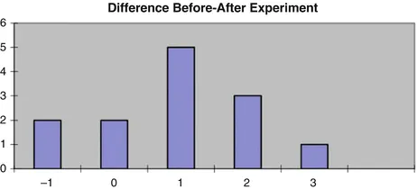
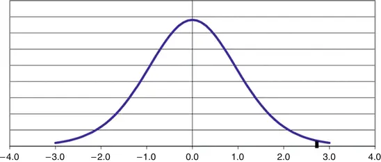
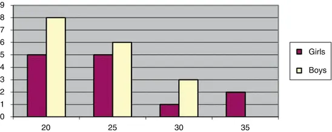
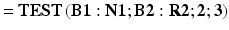

# 8. Comparing Two Groups

Birger Stjernholm Madsen1 (1)Novozymes A/S, Bagsvaerd, Denmark In this chapter, we review the most important statistical tools for comparing two (or more) groups of data. We may for example want to evaluate the effect of physical exercise on the weight of kids. This could be evaluated in two different ways:

-
            In a planned experiment: We select a group of subjects (i.e., kids) and measure their weight. Then they must exercise daily for a period, after which we measure their weight again. We compare the weight before and after the experiment
            .
-
            In a sample survey: We consider two groups of kids: one group of kids who do not exercise regularly and another group of kids who do. We compare the weight of the kids in the two groups.

        These two approaches, which are introduced in this chapter, illustrate the two main techniques of comparing two sets of data.The techniques are reviewed using specific examples. Finally, we mention some extensions of these statistical techniques.
## 8.1
        Matched Pairs
        : The Paired t-Test

### 8.1.1 Example

The girls in the
                Fitness Club

              survey are selected for an experiment, where they must exercise at least 1 h daily over a period of 4 weeks. Otherwise, they do not change their lifestyle.The purpose of this experiment is to investigate the potential for intensive weight loss programs among the girl customers.In this context, we need more precise numbers than can be obtained from asking the kids about their weight. Therefore, their weight before and after the experiment is measured; see data in Table 8.1.Table 8.1Data from experiment

|BeforeAfterDifference|
|42420|
|58571|
|58562|
|4041−1|
|49481|
|80773|
|50491|
|4849−1|
|49472|
|34331|
|33321|
|43430|
|44422|

        At first glance, the difference in weight before and after the experiment seems small. The table does, however, provide the difference in weight for each kid before and after the experiment. It is seen that in most cases (9 out of 13) there is a small weight loss, but there are also some girls who weigh the same or even slightly more as before the experiment. This is illustrated in Fig. 8.1 showing the histogram of differences.Fig. 8.1Histogram of differences
        It is evident from the graph that the “center” of the distribution is to the right of 0. Also, the distribution seems reasonably symmetric and could probably be normal.
### 8.1.2 Description

We have a number of pairs of data values. The two data values in a pair belong to two different groups. We are interested in whether there is a difference between the two groups.The most common application of this technique is in statistical analysis of data from planned experiments. The situation could be the following: we have n individuals, each of whom has been subjected to two “treatments”. We want to examine whether there is a difference between the two treatments and possibly find the average difference.This situation is referred to as matched pairs.
### 8.1.3 Calculation

The hypothesis
           is that the mean of the differences is 0, i.e., there is no difference between the two groups.We use the general approach:1.
                  We assume that the hypothesis is true. 2.
                  Calculate the p value, i.e., the probability of getting a more “rare” result.
        The mean difference

               is estimated by the average of the differences, which is calculated to be:
        We also calculate the standard deviation of the differences to be s = 1.19.It is natural to relate the average difference to s/√n, the estimate of the standard error
           (see Chap. 4).We therefore calculate:
        This is called the paired t-test.In the example we get t = 2.803.This statistic follows a
            t-distribution
          . The number of
            degrees of freedom is n − 1
          because we have n differences (see Chap. 4, Section “Confidence interval
           for the mean in case of a small sample”). Once we have calculated the differences, the original data are unimportant, i.e., it is the number of differences that count.
        In this example, there are 13 differences, i.e., the number of degrees of freedom is 12.If all differences are 0, we get t = 0. Values of t close to 0 are “good” for our hypothesis.Values of t far from 0 are “bad” for the hypothesis. If t is far from 0, we therefore reject the hypothesis. This corresponds to an average difference far from 0.

- The 99 % fractile of a
                  t-distribution
                 with 12 degrees of freedom
                 is 2.681.
- The 99.5 % fractile in a t-distribution with 12 degrees of freedom is 3.055.

            The probability of getting a larger
          value of t is thus between 0.5 % and 1 %.Normally, we add the probability
           of getting a value of t, which is at least as “far out” to the opposite side. This is just as “bad” for the hypothesis
          !The probability of a rarer result is thus between 1 % and 2 %.The graph in Fig. 8.2 shows a t-distribution with 12 degrees of freedom. It is evident that the value 2.803 is quite “far out” in the distribution.Fig. 8.2Fractile in t-distribution
          3.
                  If this probability is small, we reject the hypothesis.
        As the probability is less than 2 %, we reject the hypothesis. This means that there is statistical evidence that the mean
           difference in weight before and after the experiment is not 0. In this example, the mean difference is positive, i.e., there is a weight loss.Now we have demonstrated that there is indeed a difference in weight. The question that follows is: How large is the mean difference?
        This question can be answered by calculating a 95 % confidence interval
           for the mean difference; see Chap. 4 about this. The confidence interval is calculated as follows:
        For t we use the 97.5 % fractile in a t-distribution with n − 1 degrees of freedom. This gives us a 95 % confidence interval, i.e., with probability 95 % the interval contains the true value of the mean difference.In the table with the t-distribution at the end of the book we find the 97.5 % fractile in a t-distribution with 12 degrees of freedom as 2.179.If we insert this in the formula

              , we get the confidence interval 0.923 ± 0.718, i.e., with probability 95 % the mean difference is somewhere between 0.205 and 1.641.
### 8.1.4 Spreadsheets

With a spreadsheet, we can directly calculate the p value, i.e., the probability of a value of t rarer than the above calculated value 2.803, using the TTEST function:
        Calculates the p value of a t-test (Table 8.2).Table 8.2TTEST function

|Data1Data cells for group 1|
|Data2Data cells for group 2|
|TailsTails = 1 means reject the hypothesis on only one side of the
                        t-distribution

                    Tails = 2 means reject the hypothesis on both sides of the t-distribution, i.e., for both small and large values of t; this is the normal situation|
|TypeType = 1 means matched pairs (this section)Type = 2 means comparing the means of two groups; group standard deviations are required to be identicalType = 3 means comparing the means of two groups in general (next section)|

        The data could be in cells A2:A14 (“Before” data), and B2:B14 (“After” data). We now use the function as follows:
        We use:
- Tails = 2, since we reject the hypothesis
                 in both sides of the distribution.
- Type = 1, since we perform a t-test for matched pairs.

        The result is 0.016 = 1.6 %. The probability of a rarer value of t is thus app. 1.6 %. By comparison, we found out in the above test that the p value is between 1 % and 2 %.When using the TTEST function, we do not need to calculate the differences! We get the p value directly and can compare this

               with 0.05.
## 8.2 Comparing Two Groups Means

### 8.2.1 Example

We want to examine whether there is a difference between the physical fitness of boys and girls in the
            Fitness Club survey
          . The purpose is to investigate whether potential boy customers and potential girl customers should be addressed in the same way when recruiting new customers for intensive weight loss programs.Several different parameters are relevant in this context: One could for example compare their weight. However, this would not be appropriate, as a difference may be due to differences in height and/or age.Therefore, we calculate their body mass index (BMI), i.e.,
        This is an internationally accepted measure. For instance, a person who is 2.00 m tall and weighs 100 kg has a BMI of 100/22 = 100/4 = 25.
- A BMI below 20 is considered to be under normal.
- A BMI of 20–25 is considered normal.
- A BMI of 25–30 is considered overweight.
- A BMI over 30 is considered heavily overweight.

        The values here are shown to one decimal place for all kids. We used the questionnaire data on height and weight (Table 8.3); see the table with complete data at the end of the book.Table 8.3BMI data

|Girls18.028.121.415.217.823.715.821.530.421.123.033.519.5|
|Boys26.819.217.819.623.616.319.822.119.421.619.921.227.220.617.021.928.7|

        Figure 8.3 is a combined histogram of BMI for boys and girls.Fig. 8.3Histogram of BMI data
        At first glance, there seems to be no major differences in the distribution of BMI for girls and boys. We want to confirm this using a statistical test
          .First, we calculate the average and standard deviation in each group, i.e., for girls and boys separately (Table 8.4).Table 8.4Data from two groups

|GirlsBoysCalculationNotation|
|22.2221.34Mean
                          
                        |
|5.533.52Standard deviation
                          S

                            i

                        |
|1317Number of values
                          n

                            i

                        |
|1216

                            Degrees of freedom

                      n

                            i
                           − 1|

        We might e.g. name girls “Group 1” (i = 1) and boys “Group 2” (i = 2).The average difference (i.e., the difference between the averages) is 22.22 − 21.34 = 0.88.
### 8.2.2 Description

This technique can be used for statistical analysis
           of data from sample surveys and planned experiments.
          We have two groups of data values. We are interested in whether there is a difference between the mean of the two groups (and if there is, we want to estimate the mean difference).The two groups may be two different groups of individuals in a population that we want to compare using a sample survey. Or they might be two groups of individuals, which have been subject to two different treatments in a planned experiment.
### 8.2.3 Calculation

The hypothesis
           is that the mean difference is 0, i.e., that the two means are identical.1.
                      We assume that the hypothesis is true.
                     2.
                  We calculate the p value, i.e., the probability of getting a more “rare” result. Note: Calculation of the p value is easy in a spreadsheet; see the next section. We now calculate the following:
          
        This statistic contains the average, standard deviation and number of data values for each group.This is called a
            t-test
           for two samples with unequal variances. This t-test allows the variances in the two groups to be unequal, in contrast to a t-test for two samples with equal variances (see later).In the example we get t = 0.50. This value of t is to be compared to a fractile in a
            t-distribution
          . So what is the number of degrees of freedom

              ?

- The number of degrees of freedom can never be smaller than the number of degrees of freedom in the smallest group.

- The number of degrees of freedom can never be larger than the sum of the number of degrees of freedom in each group. (This will be the case when both the standard deviation and number of data values are identical in both groups.)

              Technical note: Degrees of freedom in

                t-test

              for two samples with unequal variances.
            There is a fairly complicated formula to determine the precise number of degrees of freedom
          :
        In the example, we get f = 19.2, which is rounded to 19.In the example, we have minimum 12 degrees of freedom and maximum 28 degrees of freedom. This is in agreement with the value f = 19, found using the formula in the box above.If the two averages are identical, we get t = 0! Values of t close to 0 are “good” for the hypothesis
          .Values of t far from 0 are “bad” for the hypothesis. If t is far from 0, we will therefore reject the hypothesis.From the table at the end of the book we get:The 90 % fractile of a
            t-distribution

               with 19 degrees of freedom is 1.328.We have calculated the value of t to be 0.50, which is smaller than 1.328. The probability of getting a larger value of t is therefore (probably much) more than 10 %. Normally, we add the probability of getting a value of t, which is at least as “far out” to the opposite side. This is just as “bad” for the hypothesis! The probability of a rarer result is thus more than 20 %.3.
                      If this probability is small, we reject the hypothesis.

        Since the observed probability is larger than 20 %, we accept the hypothesis. We can also calculate a 95 % confidence interval
           for the mean difference using the following formula:
        For t we use the 97.5 % fractile in a t-distribution. This gives us a 95 % confidence interval, i.e. with probability 95 % the interval contains the value of the mean difference.The number of degrees of freedom is determined as shown in the text box; in the example, we get 19 degrees of freedom. In the table with the t-distribution at the end of the book we find the 97.5 % fractile in a
            t-distribution
           with 19 degrees of freedom
           to be 2.093.If we insert this in the formula, we get the confidence interval
           0.88 ± 3.68. With probability 95 % the mean difference is somewhere between −2.79 and 4.56. This interval contains 0, in agreement with the fact that the hypothesis
           is accepted.
          Note: If both the groups are large, e.g., more than ten data values, we can without too much error use fractiles in the normal distribution instead of the t-distribution, i.e. the 97.5 % fractile is app. 2.In the example above, the t-fractile is 2.09 instead of 1.96, which is not a very large difference.
### 8.2.4 Spreadsheets

With a spreadsheet, we can directly calculate the p value, i.e., the probability of a value of t rarer than the above calculated value 0.50 using the TTEST function;

               see the description earlier in this chapter.The data could be in cells B1:N1 (girls), and B2:R2 (boys).We now use the function as follows:We use:
- Tails = 2, since we reject the hypothesis in both sides of the distribution.
- Type = 3, since we perform a
                  t-test
                 for comparing the mean of two groups.

        The result is 0.62 = 62 %. The probability of a rarer value of t is thus app. 62 %. By comparison, we found out in the above test that the p value was more than 20 %.When using the TTEST function, we do not need to do any calculations! We get the p value directly and can compare this with 0.05.
### 8.2.5 Size of an Experiment

Let us assume that the variances in both the groups are identical and equal to σ, and the sample sizes are identical and equal to n (larger than 10). Then the statistical uncertainty
           of the difference between the two group means isThis number is just “the number after ±” in the formula for the confidence interval
           for the difference between two means; see above.This can be used to determine
           the necessary sample size in order to obtain a given
                statistical uncertainty

               u of the difference between two means. The necessary sample size is
        Here, n is the necessary sample size in each group, i.e., the total sample size is 2 × n. In general, if we have more than two groups, n is multiplied with the number of groups.This formula can be used in the same way, as the formula given in Chap. 6. It will most often be used in connection with planning of experiments. Experiments usually involve comparing two or more groups; in most sample surveys, on the contrary, there
           is usually just one group.
## 8.3 Other Statistical Tests for Two Groups

### 8.3.1 Test for the Same Variance in the Two Groups

Sometimes you will be interested in whether the variance (or standard deviation) is the same in both groups. This can be examined by an F-test, which we will not cover in detail here.There is a function FTEST for this purpose in most spreadsheets.The F-test uses an F-distribution. This distribution is relatively complicated because it requires two numbers of degrees of freedom
           (one for each group). For the FTEST function, however, you only need to specify the areas with data for both the groups.In the example, we have BMI data from girls in cells B1:N1 and from the boys in cells B2:R2. We want to test the hypothesis
           that the variance (or standard deviation) is the same for girls and boys. We could then use the FTEST function as
        The result is the p value for the hypothesis that the two variances are equal. This p value is found to be 0.093 or 9.3 %. Therefore, we accept the hypothesis that the two variances are equal.
### 8.3.2 Comparing Two Group Means: Two Samples with Equal Variances

There is a third kind of
            t-test
          : a t-test for
           comparing the mean of two groups, assuming that there is the same variance (or standard deviation) in both the groups. This might be examined first by an F-test.You can do this t-test in a spreadsheet, by selecting Type = 2 in the TTEST function.The situation where this
            t-test
           should be considered is the following:
- The two variances (or standard deviations) are virtually identical. Test this with the F-test.
- One sample is substantially smaller than the other, with less than ten data values.

        In this situation you get more degrees of freedom
           for this t-test, than when using the t-test from the last section. This is an advantage, because it will be easier to detect differences that actually exist!In general, however, there is not much need for this
            t-test
          !In the example with the BMI data, we have accepted the hypothesis
           that the two variances are equal. Thus
          , we could use this t-test (i.e., Type = 2) in this case. Then we get a p value of 0.60, i.e., practically the same as before.
## 8.4 Analysis of Variance, ANOVA

### 8.4.1 Introduction

We have in this chapter studied the two main techniques to compare the two groups. There is a technique, which can be seen as an extension of the t-test: Analysis of variance (*), often abbreviated ANOVA.
          Analysis of variance is, despite the name, used to compare means!A simple ANOVA example could be comparing several group means (i.e. two or more groups). This is available in Microsoft Excel using the add-in menu “Data Analysis”, menu-item “ANOVA: Single factor”. Unfortunately, ANOVA is not available in Open Office or other spreadsheets.
              Single factor ANOVA is useful when analyzing data from sample surveys as well as planned experiments!
            Some experiments involve two or several factors, which define the groups. This is an ANOVA with two or more factors and is available in most statistical software packages. See the list of selected statistical software packages at the end of the book.In Microsoft Excel, you can do ANOVA with two factors, but only in the simple case, where there is the same number of data values (or maybe just 1) in all of the groups defined by the 2 factors. This condition will usually not be fulfilled when analyzing
           data from sample surveys; however, it will often be fulfilled when analyzing data from planned experiments.
              ANOVA with two or more factors is often used for analyzing data from planned experiments!
            In this book, we cannot go into detail with the topic ANOVA. I refer to more advanced textbooks on statistics, e.g. Douglas Montgomery: Design and Analysis of Experiments (Wiley).Just to get an idea of a single factor ANOVA, we present an example.
### 8.4.2 Example

We have previously used a t-test to compare the mean BMI for girls and boys. Actually, we could choose between two
                t-tests

              : A t-test requiring identical variances, and a more general t-test allowing unequal variances.
              The ANOVA model requires identical variances!
            Now, we analyze these data using a single factor ANOVA, though we could also use a t-test.When we have two groups, we can (as shown above) use an F-test to test, if the variances are indeed identical. In the general case with more than two groups, other tests are available. The most commonly used test is called
                Bartlett’s test

              . This test is not available in Excel, but a template can be found on the website accompanying the book.In the Microsoft Excel add-in “Data Analysis”, we use the menu-item “ANOVA: Single factor”, all we need to specify is the range of the input data.When this is done, we obtain the following output.

|Anova: Single Factor|
|Summary|
|
                          Groups

                          Count

                          Sum

                          Average

                          Variance
                          |
|Girls1313288.8922.222  |
|Boys1717362.7621.339  |
|ANOVA|
|
                          Source of variation

                          SS

                          df

                          MS

                          F

                          P-value

                          F crit
                        |
|Between groups5.7515.7470.2840.604.20|
|Within groups565.882820.210   |
|Total571.6329    |

        The output consists of a summary table and an ANOVA table, where the variation between groups is compared to the variation within groups. Details can be found in more advanced textbooks on statistics.
          The main result is the
                P-value

              , which is found to be 0.60. This is actually exactly the same P-value as obtained when using the t-test requiring
           identical variances. However, ANOVA can be used with more than 2 groups!The conclusion in the example is once again, that the hypothesis of equal mean BMI for girls and boys is accepted.
## 8.5 Final Remarks

You have now sufficient knowledge about statistics to go out and use it in practice! At this point, you have also sufficient background to read more advanced books on statistics, if needed, see some selected references in the appendices; there you will also find many useful online resources on statistics as well as an overview of statistical software. I wish you good luck in your further
         work with statistics!

Appendices© Springer-Verlag Berlin Heidelberg 2016Birger Stjernholm MadsenStatistics for Non-Statisticians10.1007/978-3-662-49349-6_9