# 9. Appendices

Birger Stjernholm Madsen1 (1)Novozymes A/S, Bagsvaerd, Denmark
## 9.1 Probability Theory

The reader, who is mainly interested in applying statistical methods, can safely skip this appendix.Probability theory gives the mathematically oriented reader a better understanding of fundamental statistical concepts, such as statistical distributions (e.g., the binomial distribution
         and the normal distribution), i.e., the concepts explained in Chaps. 4 and 5. In particular, one purpose of this appendix is to obtain a better understanding of the binomial distribution.Only the fundamental concepts of probability theory, which are relevant for explaining the statistical concepts in this book, are explained here. Other books must be consulted for a more thorough introduction to probability theory.Probability theory was historically founded in medieval times when analyzing problems in games, e.g., throwing dice. And even today, most introductions to probability theory use examples from games. This also has the advantage that these examples are (relatively) simple compared to other (maybe more practically relevant) examples.In this appendix, the basic terms of probability are explained intuitively by examples using only a minimum of mathematical notation.For a more complete explanation of probability theory, see other books, e.g., Sincich TL, Levine DM, Stephan D, Sincich T and Berenson M (2002) Practical statistics by example—using Microsoft excel and Minitab. 2nd ed. Prentice Hall, NJ.
### 9.1.1
          Sample Space
          , Events
          , and Probability

When recording an observation (for example in a survey) or a measurement (for example in an experiment) there are a number of
            outcomes (*)
          .
          The set of all possible outcomes is called the sample space(*).
        A subset of the sample space is called an event (*).The probability (*) of an event (or an outcome) is a number between 0 and 1, which indicates the likelihood that the event will occur.
          If all outcomes in a finite sample space have the same probability (are equally likely), we have the following:

          Probability of event = (# of outcomes of the event)/(# of outcomes of the sample space).Other words for probability are risk, in case of an undesirable outcome
          , and chance, in case of a desirable outcome.In this appendix, we consider only finite sample spaces.
        An event may consist of just one outcome or an event may even be empty, i.e., contain no outcomes. On the other hand, an event may cover the whole sample space.
#### 9.1.1.1 Example 1

When throwing a dice, the possible outcomes are 1, 2, 3, 4, 5, or 6 eyes. The sample space consists of all these six outcomes.Examples of events are:1.The dice shows an even number of eyes, i.e., 2, 4, or 6. 2.The dice shows an odd number of eyes, i.e., 1, 3, or 5. 3.The dice shows at most 3 eyes. 4.The dice shows exactly 3 eyes.
          As the last example shows, an event

                can consist of just one outcome.The events in example 1 and 2 are complementary events. This means that
- The two events are mutually exclusive, i.e., the two events have no outcome in common.
- The two events together contain all outcomes of the sample space.

            The sum of the probabilities of two complementary events is 1.If we can calculate the probability of an event, the probability of the complementary event can thus be calculated by subtraction from 1. Sometimes it is easier to calculate the probability of the complementary event!
#### 9.1.1.2 Example 2

Throwing one dice twice: 36 outcomes; all of them are considered equally likely. Below the total number of eyes is indicated for all outcomes (Fig. 9.1).Fig. 9.1Example
          In this example, we study the event: “The total number of eyes is more than 3.” What is the probability of this event
            ?The complementary event is “The total number of eyes is at most 3.” It is easily seen that the number of outcomes
             in this event is 3 (shaded area, see upper left corner of the figure), i.e., the probability of the event is 3/36 = 1/12.Hence, the probability of the
             original event is 1 − 1/12 = 11/12.In this case, calculation of the probability
             of the complementary event was easier.
#### 9.1.1.3 Example 3

Throwing one dice twice: 36 outcomes; all of them are considered equally likely (Fig. 9.2):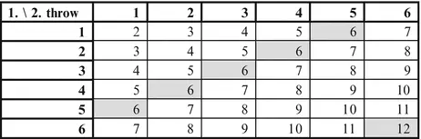Fig. 9.2Example
          In this example, we study the event: “The total number of eyes is a multiple of 6.”It is seen that the total number of outcomes in this event is 6 (shaded area). The probability of the event
             “The total number of eyes is a multiple of 6” is thus 6/36 = 1/6.The event is equivalent to occurrence of either the event “The total number of eyes is 6” (5 outcomes) or the event “The total number of eyes is 12” (1 outcome). Their probabilities are seen to be 5/36 and 1/36, respectively. Mathematically, this event is the union of two mutually exclusive events.
          Another way to find the probability of the event is to add the probabilities of the two separate events; this again gives 5/36 + 1/36 = 6/36 = 1/6.This illustrates the “rule of addition”:
                The probability of the occurrence of either one or the other of two mutually exclusive events is the sum of the probabilities of the individual events.

#### 9.1.1.4 Example 4

Throwing one dice twice: 36 outcomes; all of them are considered equally likely (Fig. 9.3):Fig. 9.3Example 4
          In this example, we study the event: “The total number of eyes is 12.”This event contains just 1 outcome
             (lower right corner, shaded). The probability of this event is 1/36.It can be seen that the event is equivalent
             to the occurrence of both the event “6 eyes in throw 1” and the event “6 eyes in throw 2.” Both of these events have a probability of 6/36 = 1/6, as they consist of 6 outcomes (row 6, respectively, column 6, shown in bold). Mathematically, this event is the intersection of the two separate events.It is seen that the probability of the event

                 also can be found as the product of the probabilities of the two separate events, i.e., as 1/6 × 1/6 = 1/36.If the probability of the intersection of two events is exactly the product of the probabilities of the individual events, the two events are said to be independent (*).This means that the probability of obtaining six eyes in the second throw does not depend on whether or not we obtained six eyes in the first throw.
          This is also expressed by stating that the conditional probability of obtaining six eyes in the second throw, given that we obtained six eyes in the first throw is 1/6, i.e., the same as the unconditional probability.No matter what the result of the first throw is, the probability of six eyes in the second throw will still be 1/6.
#### 9.1.1.5 Example 5

Throwing one dice twice: 36 outcomes; all of them are considered equally likely (Fig. 9.4):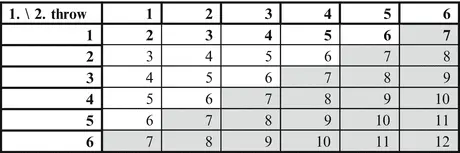Fig. 9.4Example 5
          In this example, we study the events:
            Event A: “Number of eyes in first throw is 1.”
            Event B: “Total number of eyes is at least 7.”It is seen that event A consists of six outcomes
             (first row, shown in bold), hence the probability of A is P(A) = 6/36 = 1/6 (the letter P is used as abbreviation for “Probability”).It is seen that event B consists of 21 outcomes (shaded area, diagonal plus lower right half), hence the probability of B is P(B) = 21/36 = 7/12.The intersection A∩B of event A and B consists

                 of just one outcome, the upper right corner. This event has the probability P(A∩B) = 1/36.Asandwe see that

            Thus, A and B are not independent by the definition in example 4.Another way to see that A and B are not independent is to calculate the conditional as well as unconditional probabilities:Two events A and B are
             independent, if the conditional
              probability of event B
             occurring given that event A occurred is equal to the unconditional probability of B occurring.In other words, knowledge of occurrence of A has no influence on the probability of B.
          The conditional probability of event B given that A occurred is denoted by P(B|A). In the first row, there are six outcomes (event A). Out of these, one outcome is included in B. Hence, we see that P(B|A) = 1/6.The probability of B was found to be 7/12.Aswe once again see that A and B are not independent.Actually, in the table above, we can easily see how the probability of getting at least seven eyes in total depends on the number of eyes obtained in the first throw.The larger the number of eyes in the first throw

                , the larger the probability of getting at least seven eyes in total.If the number of eyes in the first throw is 6, the probability of at least 7 eyes in total is actually 100 %.If two events are not independent, they are said to be dependent.
                Dependent events occur frequently in real life!
              For instance, the probability (or risk) of a person developing lung cancer is dependent on whether or not that person is a smoker: For a nonsmoker, the risk might be 1 %; for a smoker, the risk might
             be as high as 10 %.
### 9.1.2 Random Variables; the Binomial Distribution

A random variable (*) is a mathematical function on the sample space.
          The mathematical function will often be the identity! For instance, in example 1, the sample space consists of the outcomes
           1, 2, 3, 4, 5, or 6 (eyes on a dice). The random variable is simply the number itself, i.e., the number of eyes shown; no mathematical operation is done! This number will vary randomly, hence the term random variable.In example 2, the total number of eyes in two throws with a dice is a random variable: The sample space consists of 36 pairs of numbers of eyes in each throw. For each of the possible outcomes, the total number of eyes can be calculated by adding the number of eyes in each throw.The result is a mathematical function of the sample space. As the sample space in the example is finite (36 outcomes), the random variable is a discrete random variable.
          A discrete random variable need not have a finite sample space. One example
           is the number of flashes of lightning in a thunderstorm. There is no upper limit to this random variable; however, the sample space is still discrete, as only integer values are possible (0, 1, 2, 3, 4, etc.).In contrast to a discrete random variable, a continuous random variable may take any fractional value; this will be the case with many measurement data, where data values can be any real number (or any non-negative number). Such data are often described by the normal distribution.
          In this appendix, we will only cover discrete random variables. The binomial distribution is the most important distribution used to describe discrete random variables.The binomial distribution (*) is used when the following conditions are satisfied:
-
                Each observation (or “trial”) can be classified into two categories. Often, we call them “success” and “failure” regardless of whether one of the categories can be said to be “better” than the other.
-
                The probability that an observation is classified as “success” is constant. For example, in statistical quality control there must not be a trend that defective items become more frequent.
-
                The observations are independent. This means, for example, that two respondents do not affect each others answers in a questionnaire survey.

        Notation:
-
                n is the sample size, i.e., number of observations (trials)
-
                p is (the constant) probability of “success” in each trial
- (1 − p) is probability
                 of “failure” in each trial
-
                X is a random variable indicating the number of successes out of n trials
-
                x is the actual number of successes in a specific sample of n trials

          P(X = x) is the probability of obtaining exactly x successes out of n observations or trials. In Chap. 5, we showed graphs of this probability. We also showed how to calculate this probability using a spreadsheet.Here, we will derive the mathematical expression of this probability.Step 1The probability of x successes in the first x trials is p

                  x
                 (where p is the probability of success in each trial), as the probabilities should be multiplied. This follows by the fact that the trials are independent.The probability of obtaining n − x failures in the remaining n − x trials can be calculated in the same way and is found to be (1 − p)

                  n−x

            .
          The expression p

                  x
                (1 − p)

                  n−x
                 is thus the probability of a certain combination of x successes (each having probability p) and n − x failures (each having
             probability 1 − p).
          Step 2However, there are several different combinations of x successes and n − x failures. And all of them will have the same probability p

                  x
                (1 − p)

                  n−x

            .
          As these
                  events

                 are mutually exclusive (they cannot occur at the same time), we can use the rule of addition.

            Thus, the probability of x successes in n trials will be p

                  x
                (1 − p)
                  n−x
                 multiplied by the number of different combinations of x successes and n − x failures.
          Step 3We need an expression for the number of different combinations of x successes and n –x failures.
            The number of combinations of n individuals, when we take a sample of x is often written (
                    x

                    n
                  ), reading “n over x.”This is also called the binomial coefficient. It is tabulated in many textbooks for small values of n. It can also be found in a spreadsheet using the function COMBIN.A mathematical formula for the binomial coefficient can be found (see technical note at end of this appendix):
                
              For instance, with n = 4 and x = 2: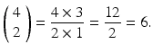And entering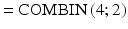in a spreadsheet cell gives
             the result 6.
                This gives us the desired formula for the probability of x successes in n trials:

                

### 9.1.3 Random Variables: Mean
           and Variance

Let X be a discrete random variable.
        The mean (or expectation) of X is defined as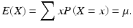
        The variance of X is defined as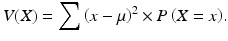
        The
                standard deviation

               of X is defined as the square root of the variance, i.e.,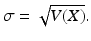
        In the expressions for the mean and variance
          , summation is over all possible values x of the random variable X.
              For continuous random variables, the concepts mean and variance can also be defined.
            However, summation should be replaced by integration, which is defined in the mathematical discipline calculus. We will not go further into this; see
           advanced textbooks on probability theory.
#### 9.1.3.1 Example 6

Let the random variable X be the number of successes out of n trials, which follows a binomial distribution
            . In this case, summation in the expressions for E(X) and V(X) is over all values from 0 to n.We have derived the probabilities P(X = x) above. It can be shown mathematically that inserting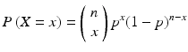in the above expressions for E(X) and V(X) gives the result.
                

                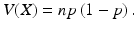
              These are exactly the expressions for the mean and variance of a binomial distribution

                 shown in Chap. 5.
### 9.1.4 Technical Note: The Binomial Coefficient

We want to determine the number of combinations (or groups) of n individuals when taking a sample of x.First, determine the number of permutations (ordered groups) of n individuals, when taking a sample of x. In this way, (A, B) and (B, A) are considered two different groups.For instance, with n = 4 persons labeled A, B, C, D, we select ordered groups of x = 2 persons. In order to find out how many ordered groups exist, we first select person no. 1. This can be done in n = 4 ways. Then we select person no. 2. With three persons left, this can be done in n − 1 = 3 ways.In total, we can select 4 × 3 = 12 ordered groups.
          Generally, the number of permutations of n objects, when taking a sample of x objects, is equal to n(n − 1)…(n − x + 1).
          In this expression, the total number of factors is x.This number can be found in spreadsheets using the function PERMUT. For instance, entering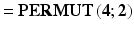in a spreadsheet cell gives the result 12.From the number of permutations, we can find the number of combinations.In the example, we have counted (A, B) and (B, A) as two different groups; we determined the number of permutations to be 12. In order to find the number of combinations of four objects, when taking a sample of 2, we divide 12 by 2, obtaining 6.In the general case, we divide the number of permutations n(n − 1) ⋯ (n − x + 1) by the number of permutations of x individuals, which is x(x − 1) ⋯ 2 × 1.Thus, we obtain the number of combinations of n individuals, when taking a sample of x:With n! (read “n factorial”) meaning all the numbers 1,2, etc., up to n multiplied together (note, that 0! = 1), the binomial coefficient can also be written as

## 9.2 Summary of Statistical Methods

Important points to clarify when doing a statistical analysis:1.Quantitative or qualitative data? 2.One group or two groups? 3.
                Confidence interval
                 or statistical test
                ?

### 9.2.1 Quantitative Data

#### 9.2.1.1 Descriptive Statistics

See Chap. 3 (Table 9.1).Table 9.1Descriptive statistics

| Symmetric distributionSkewed distribution|
|
                        Location
                         (center)Average
                            Median

                          |
|
                            
                          Q2 = Data value “in the middle”|
|
                        Dispersion
                         (spread)
                            Standard deviation

                          Interquartile range|
|
                            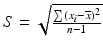

                            IQR = Q3 − Q1|
| Q3 = Upper quartile

                      |
| Q1 = Lower quartile|

#### 9.2.1.2 The Normal Distribution

See Chap. 4.Probabilities (Table 9.2).Table 9.2Normal distribution

|IntervalProbability|
|Mean ± 1 standard deviation

                      68 % of data values|
|Mean ± 2 standard deviations95 % of data values|
|Mean ± 3 standard deviations99.7 % of data values|

          Testing for the Normal Distribution1.Simple methods
- The histogram
- The average = the median

- Interquartile range
                           larger than the standard deviation

- Number of data values
                           in symmetric intervals around the mean

                   2.
                    Skewness
                     and kurtosis

- Calculate in spreadsheet
- Reasonably close to 0? Compare with min. and max. limits in Chap. 4.

                   3.Normal plot

#### 9.2.1.3 Confidence Intervals: One Group

See Chap. 4 (Table 9.3).Table 9.3
                    Confidence intervals
                    : one group

|95 % confidence interval for the mean: Large sample or standard deviation known.
                            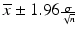
                          |
|95 % confidence interval for the mean
                        :Small sample and standard deviation unknown. Use 97.5 % fractile
                         from t-distribution, Degrees of Freedom
                         = n − 1.
                            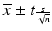
                          |
|95 % confidence interval for the standard deviation: Use fractiles from Chi-squared distribution
                        , Degrees of Freedom = n − 1.
                            
                          |

#### 9.2.1.4 Confidence Intervals: Two Groups

See Chap. 8 (Table 9.4).Table 9.4
                    Confidence intervals
                    : two groups

|
                        Matched pairs
                         (paired t-test
                        ):95 % confidence interval for mean
                         difference.Use 97.5 % fractile from
                          t-distribution
                        , Degrees of Freedom = n − 1.
                            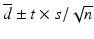
                          |
|Comparing two group means:95 % confidence interval for difference between two group means. Use 97.5 % fractile from t-distribution.Degrees of Freedom: Formula available.
                            
                          |

#### 9.2.1.5 Sample Size

See Chap. 6.If we know the
                  standard deviation

                 σ and want a maximum
                  statistical uncertainty

                 u of the average, we find the minimum necessary sample size n as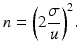
          If there are two (or more) groups
            , this is the necessary sample size in each group.

#### 9.2.1.6
            Statistical Tests
            : Two Variables or Two Groups

See Chap. 7 and 8 (Table 9.5).Table 9.5Statistical tests: two variables or two groups

|Two variables:Test, that correlation = 0 (or slope = 0). Correlation coefficient
                         (r) calculated with spreadsheet. Compare with 97.5 % fractile from
                          t-distribution
                        , Degrees of Freedom
                         = n − 2.
                            
                          |
|Matched pairs (paired t-test):Test, that mean difference = 0.Compare with 97.5 % fractile from t-distribution, Degrees of Freedom = n − 1.
                            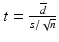
                          |
|Comparing two group means:Test, that two means are equal.Compare with 97.5 % fractile from t-distribution, Degrees of Freedom: Formula available.
                            
                          |

### 9.2.2 Qualitative Data

#### 9.2.2.1
            Confidence Intervals
            : One Group

See Chap. 5 (Table 9.6).Table 9.6
                    Confidence intervals
                    : one group

|
                        Confidence interval for proportion (p) of binomial distribution
                        : x is number of observations (out of n) of interest, p = x/n.

                            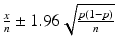
                          |

#### 9.2.2.2
            Confidence Intervals
            : Two Groups

See Chap. 5 (Table 9.7).Table 9.7
                    Confidence intervals
                    : two groups

|
                        Confidence interval for difference between proportions (p
                        1 and p
                        2) from two binomial distributions
                        :
                            
                          |

#### 9.2.2.3 Sample Size

See Chap. 6.If the maximum
                  statistical uncertainty

                 of a proportion is u, we find the minimum necessary sample size n as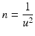
          The above formula can obviously be used in subgroups of the population
            . The formula then finds the value of n for each subgroup separately.
#### 9.2.2.4
            Statistical Tests
            : Two Groups or Two Variables

See Chap. 5 (Table 9.8).Table 9.8Statistical tests: two groups or two variables

|
                        Test, that proportions (p

                              1
                             and p

                              2

                        ) from two binomial distributions are equal: O Observed frequency, E Expected frequency. Compare to fractiles from Chi-squared distribution
                        , Degrees of Freedom
                         = 1.
                            
                          |
|

                              Frequency table

                            :

                        Test of independence between rows and columns. O Observed frequency, E Expected frequency. Compare to fractiles from Chi-squared distribution, Degrees of Freedom = (#Rows − 1) × (#Columns − 1).
                            
                          |

## 9.3 Statistical Functions in Spreadsheets

This is an overview of the most important statistical (and a few mathematical) spreadsheet functions. They are available in Microsoft Excel, Open Office Calc and other spreadsheets. In newer versions of Microsoft Excel, many functions have been given new names and some new functions added, but the old functions are maintained for compatibility.
        Note: The names of these functions are translated to local language when using spreadsheets in other languages than English!We refer to the “Help” menu of your spreadsheet for more details (Table 9.9).Table 9.9Statistical functions

|FunctionShort description|
|
                        AVERAGE

                      Gives the average of the data values.|
|BINOMDISTGives a probability of the binomial distribution
                    .|
|CHIDISTGives the distribution function
                     of a Chi-squared distribution
                    .|
|CHIINVGives fractiles
                     in a Chi-squared distribution.|
|CHITESTGives the p-value of a test of independence in a frequency table
                    .|
|CONFIDENCEGives a confidence interval
                     of the mean
                    , when the standard deviation is known.|
|CORRELGives the correlation coefficient
                     between two variables.|
|CRITBINOMGives the critical value of a binomial distribution.|
|FORECASTPredicts a y value based on an x value and a linear regression
                     model of the data values.|
|FTESTGives the p-value of an F-test for comparing two variances.|
|INTERCEPTGives the intercept on the y-axis in linear regression.|
|KURTGives the kurtosis
                    .|
|LOGGives the logarithm to base 10 of a number.|
|MAXGives the largest data value.|
|MEDIANGives the median
                    .|
|MINGives the smallest data value.|
|MODEGives the mode
                    , i.e., the data value with the largest frequency.|
|NORMDISTGives the distribution function of a normal distribution.|
|NORMINVGives fractiles in a normal distribution.|
|NORMSDISTGives the distribution function of a standardized normal distribution.|
|NORMSINVGives fractiles in a standardized normal distribution.|
|PERCENTILEGives any fractile in a set of data values.|
|QUARTILEGives quartiles
                     in a set of data values.|
|RSQGives the square of the correlations coefficient.|
|SKEWGives the skewness
                    .|
|SLOPEGives the slope in linear regression.|
|SQRTGives the square root of a number.|
|STANDARDIZEStandardization: Subtraction of the mean followed by division by the standard deviation.|
|STDEVGives the standard deviation
                    .|
|TDISTGives the distribution function of a t-distribution
                    .|
|TINVGives fractiles in a t-distribution.|
|TTESTGives the p-value in a t-test for comparing two means. Includes paired t-test
                    .|
|VARGives the variance
                    .|
|ZTESTGives the p-value in a test for comparing the mean with a known value, when the standard deviation is known.|

## 9.4 Statistical Tables

### 9.4.1 Fractiles in the Normal Distribution

Fractiles in the (standard) normal distribution are calculated in Microsoft Excel/ OpenOffice Calc using the function NORMSINV.Example: For the 97.5 % = 0.975 fractile, we obtain NORMSINV(0.975) = 1.960
           (Table 9.10).Table 9.10
                  Fractiles
                   in the normal distribution

|50 %60 %70 %75 %80 %90 %95 %97.5 %99 %99.5 %99.9 %99.95 %|
|0.00000.25330.52440.67450.84161.28161.64491.96002.32632.57583.09023.2905|

### 9.4.2 Probabilities in the Normal Distribution

Probabilities in the (standard) normal distribution
           are calculated in Microsoft Excel/ OpenOffice Calc using the function NORMSDIST.Example: NORMSDIST(2) = 0.9772. Thus, the probability of values ≤ 2 is 97.72 % (Table 9.11).Table 9.11Probabilities in the normal distribution

|−3−2.5−2−1.5−1−0.500.511.522.53|
|0.00130.00620.02280.06680.15870.30850.50000.69150.84130.93320.97720.99380.9987|

### 9.4.3 Table of the t-Distribution

          Note: The number of degrees of freedom
           in a sample is n − 1, where n is the sample size.If the number of degrees of freedom is more than 30, you can with very good approximation use fractiles
           of the normal distribution instead.Fractiles in the t-distribution are calculated in Microsoft Excel or OpenOffice Calc using the function TINV. Notice the peculiar way to specify the probability: Find the “rest” probability and multiply by 2.Example: For the 97.5 % = 0.975 fractile, the “rest” probability is 2.5 % = 0.025. When multiplied by 2, we get 5 % = 0.05. With, for example, 9 degrees of freedom
           we obtain the fractile as TINV(0.05;9) = 2.262 (Table 9.12).Table 9.12
                  Fractiles
                   in the t-distribution

|
                          Degrees of freedom

                        90 %95 %97.5 %99 %99.5 %|
|13.0786.31412.70631.82163.656|
|21.8862.9204.3036.9659.925|
|31.6382.3533.1824.5415.841|
|41.5332.1322.7763.7474.604|
|51.4762.0152.5713.3654.032|
|61.4401.9432.4473.1433.707|
|71.4151.8952.3652.9983.499|
|81.3971.8602.3062.8963.355|
|91.3831.8332.2622.8213.250|
|101.3721.8122.2282.7643.169|
|111.3631.7962.2012.7183.106|
|121.3561.7822.1792.6813.055|
|131.3501.7712.1602.6503.012|
|141.3451.7612.1452.6242.977|
|151.3411.7532.1312.6022.947|
|161.3371.7462.1202.5832.921|
|171.3331.7402.1102.5672.898|
|181.3301.7342.1012.5522.878|
|191.3281.7292.0932.5392.861|
|201.3251.7252.0862.5282.845|
|211.3231.7212.0802.5182.831|
|221.3211.7172.0742.5082.819|
|231.3191.7142.0692.5002.807|
|241.3181.7112.0642.4922.797|
|251.3161.7082.0602.4852.787|
|261.3151.7062.0562.4792.779|
|271.3141.7032.0522.4732.771|
|281.3131.7012.0482.4672.763|
|291.3111.6992.0452.4622.756|
|301.3101.6972.0422.4572.750|

### 9.4.4 Table of the Chi-Squared Distribution

Fractiles in the Chi-squared distribution are calculated in Microsoft Excel or Open- Office Calc using the function CHIINV.Notice that you should specify the “rest” probability rather than the probability itself.Example: For the 97.5 % = 0.975 fractile, the “rest” probability is 2.5 % = 0.025. With, for example, 9 degrees of freedom we obtain the fractile
           as CHIINV (0.025;9) = 19.02 (Table 9.13).Table 9.13
                  Fractiles
                   in the chi-squared distribution

|
                          Degrees of freedom

                        0.5 %1.0 %2.5 %5.0 %95.0 %97.5 %99.0 %99.5 %|
|10.000.000.000.003.845.026.637.88|
|20.010.020.050.105.997.389.2110.60|
|30.070.110.220.357.819.3511.3412.84|
|40.210.300.480.719.4911.1413.2814.86|
|50.410.550.831.1511.0712.8315.0916.75|
|60.680.871.241.6412.5914.4516.8118.55|
|70.991.241.692.1714.0716.0118.4820.28|
|81.341.652.182.7315.5117.5320.0921.95|
|91.732.092.703.3316.9219.0221.6723.59|
|102.162.563.253.9418.3120.4823.2125.19|
|112.603.053.824.5719.6821.9224.7326.76|
|123.073.574.405.2321.0323.3426.2228.30|
|133.574.115.015.8922.3624.7427.6929.82|
|144.074.665.636.5723.6826.1229.1431.32|
|154.605.236.267.2625.0027.4930.5832.80|
|165.145.816.917.9626.3028.8532.0034.27|
|175.706.417.568.6727.5930.1933.4135.72|
|186.267.018.239.3928.8731.5334.8137.16|
|196.847.638.9110.1230.1432.8536.1938.58|
|207.438.269.5910.8531.4134.1737.5740.00|
|218.038.9010.2811.5932.6735.4838.9341.40|
|228.649.5410.9812.3433.9236.7840.2942.80|
|239.2610.2011.6913.0935.1738.0841.6444.18|
|249.8910.8612.4013.8536.4239.3642.9845.56|
|2510.5211.5213.1214.6137.6540.6544.3146.93|
|2611.1612.2013.8415.3838.8941.9245.6448.29|
|2711.8112.8814.5716.1540.1143.1946.9649.65|
|2812.4613.5615.3116.9341.3444.4648.2850.99|
|2913.1214.2616.0517.7142.5645.7249.5952.34|
|3013.7914.9516.7918.4943.7746.9850.8953.67|
|3114.4615.6617.5419.2844.9948.2352.1955.00|
|3215.1316.3618.2920.0746.1949.4853.4956.33|
|3315.8217.0719.0520.8747.4050.7354.7857.65|
|3416.5017.7919.8121.6648.6051.9756.0658.96|
|3517.1918.5120.5722.4749.8053.2057.3460.27|
|3617.8919.2321.3423.2751.0054.4458.6261.58|

### 9.4.5
          Statistical Uncertainty
           in Sample
           Surveys

This table can be used for questionnaire data with two answer categories, e.g., “Yes/ No.”The table shows the statistical uncertainty of the result of a sample survey.The number in the table is “the number
           after ± .” It is used to construct a 95 % confidence interval
          .
          Simple random sampling
           is assumed.By stratified sampling
          , the statistical uncertainty will often be smaller.By cluster sampling
          , the statistical uncertainty will often be larger. Example (Table 9.14):Table 9.14
                  Statistical uncertainty
                   in sample
                   surveys

|Sample sizeResult in percent|
|
                          1 %

                          3 %

                          5 %

                          10 %

                          15 %

                          20 %

                          25 %

                          30 %

                          35 %

                          40 %

                          45 %

                          50 %
                        |
|
                          99 %

                          97 %

                          95 %

                          90 %

                          85 %

                          80 %

                          75 %

                          70 %

                          65 %

                          60 %

                          55 %

                          50 %
                        |
|502.8 %4.7 %6.0 %8.3 %9.9 %11.1 %12.0 %12.7 %13.2 %13.6 %13.8 %13.9 %|
|1002.0 %3.3 %4.3 %5.9 %7.0 %7.8 %8.5 %9.0 %9.3 %9.6 %9.8 %9.8 %|
|1501.6 %2.7 %3.5 %4.8 %5.7 %6.4 %6.9 %7.3 %7.6 %7.8 %8.0 %8.0 %|
|2001.4 %2.4 %3.0 %4.2 %4.9 %5.5 %6.0 %6.4 %6.6 %6.8 %6.9 %6.9 %|
|3001.1 %1.9 %2.5 %3.4 %4.0 %4.5 %4.9 %5.2 %5.4 %5.5 %5.6 %5.7 %|
|4001.0 %1.7 %2.1 %2.9 %3.5 %3.9 %4.2 %4.5 %4.7 %4.8 %4.9 %4.9 %|
|5000.9 %1.5 %1.9 %2.6 %3.1 %3.5 %3.8 %4.0 %4.2 %4.3 %4.4 %4.4 %|
|6000.8 %1.4 %1.7 %2.4 %2.9 %3.2 %3.5 %3.7 %3.8 %3.9 %4.0 %4.0 %|
|7000.7 %1.3 %1.6 %2.2 %2.6 %3.0 %3.2 %3.4 %3.5 %3.6 %3.7 %3.7 %|
|8000.7 %1.2 %1.5 %2.1 %2.5 %2.8 %3.0 %3.2 %3.3 %3.4 %3.4 %3.5 %|
|9000.7 %1.1 %1.4 %2.0 %2.3 %2.6 %2.8 %3.0 %3.1 %3.2 %3.3 %3.3 %|
|10000.6 %1.1 %1.4 %1.9 %2.2 %2.5 %2.7 %2.8 %3.0 %3.0 %3.1 %3.1 %|
|12500.6 %0.9 %1.2 %1.7 %2.0 %2.2 %2.4 %2.5 %2.6 %2.7 %2.8 %2.8 %|
|15000.5 %0.9 %1.1 %1.5 %1.8 %2.0 %2.2 %2.3 %2.4 %2.5 %2.5 %2.5 %|
|17500.5 %0.8 %1.0 %1.4 %1.7 %1.9 %2.0 %2.1 %2.2 %2.3 %2.3 %2.3 %|
|20000.4 %0.7 %1.0 %1.3 %1.6 %1.8 %1.9 %2.0 %2.1 %2.1 %2.2 %2.2 %|
|30000.4 %0.6 %0.8 %1.1 %1.3 %1.4 %1.5 %1.6 %1.7 %1.8 %1.8 %1.8 %|
|40000.3 %0.5 %0.7 %0.9 %1.1 %1.2 %1.3 %1.4 %1.5 %1.5 %1.5 %1.5 %|
|50000.3 %0.5 %0.6 %0.8 %1.0 %1.1 %1.2 %1.3 %1.3 %1.4 %1.4 %1.4 %|
|60000.3 %0.4 %0.6 %0.8 %0.9 %1.0 %1.1 %1.2 %1.2 %1.2 %1.3 %1.3 %|
|70000.2 %0.4 %0.5 %0.7 %0.8 %0.9 %1.0 %1.1 %1.1 %1.1 %1.2 %1.2 %|
|80000.2 %0.4 %0.5 %0.7 %0.8 %0.9 %0.9 %1.0 %1.0 %1.1 %1.1 %1.1 %|
|90000.2 %0.4 %0.5 %0.6 %0.7 %0.8 %0.9 %0.9 %1.0 %1.0 %1.0 %1.0 %|
|100000.2 %0.3 %0.4 %0.6 %0.7 %0.8 %0.8 %0.9 %0.9 %1.0 %1.0 %1.0 %|

        A result (e.g., percentage answering “Yes” to a question) in a sample survey is 25 %; the sample size is 500. The statistical uncertainty of the result is found in the table to be ±3.8 %.This means that if interviewing the whole population
          , the result would with 95 % probability be in the interval 25 % ± 3.8 %, i.e., an interval from 21.2 % to 28.8 %.
          Note: You get the same statistical uncertainty, if the result in the
           sample survey is 75 %.
## 9.5
        Fitness Club
        : Data from the Sample Survey

Data from the example used throughout the book. Data are sorted by sex and age (Table 9.15).Table 9.15
                Fitness Club
                 data

|30 randomly chosen kids from fitness club|
|No.SexAge (years)Height (cm)Weight (kg)|
|6F1214559|
|20F1215149|
|26F1211832|
|7F1316659|
|10F1316039|
|2F1415141|
|12F1416649|
|15F1418581|
|18F1417649|
|25F1412533|
|30F1515245|
|24F1612749|
|28F1711242|
|1M1215766|
|21M1211536|
|3M1317458|
|4M1317152|
|8M1314147|
|9M1316645|
|14M1416251|
|17M1415749|
|19M1413941|
|22M1415952|
|23M1417049|
|5M1519877|
|11M1519273|
|27M1515452|
|13M1617064|
|16M1718473|
|29M1717083|

## 9.6 Where to Go from Here

### 9.6.1 Literature

The following books can be recommended:
- Larry Gonick and Woolcott Smith (1993). The Cartoon Guide to Statistics. HarperCollins.Statistics as a cartoon!
- Per Vejrup Hansen (2013). Excel for Statistics—How to organize data. Samfundslitteratur.This booklet is a handbook on using Excel as statistical software, not on statistical theory as such.
- Ed Swires-Hennesey (2014). Presenting Data—How to Communicate Your Message Effectively.Wiley.The book presents in plain language a number of fundamental principles for presenting numbers—in tables, charts, text and on Internet.
- T.L. Sincich, DM Levine, D. Stephan, T. Sincich and M. Berenson (2002, 2nd ed.).
                Practical Statistics by Example—using Microsoft Excel and Minitab. Prentice Hall.Plenty of examples in virtually all disciplines.Both for users of Microsoft and Excel and the widely used statistics software Minitab.
- A. Agresti and B. Finlay (2009, 4th ed.). Statistical Methods for the Social Sciences. Prentice Hall.Detailed book on statistics for the social sciences.
- Vic Barnett (2002, 3rd ed.). Sample Survey Principles & Methods. Wiley.An excellent book on sample surveys.
- R. M. Groves (2004). Survey Errors and Survey Costs. Wiley.Thorough book on the practical aspects of sample surveys. Not mathematically advanced.
- W. G. Cochran: Sampling techniques (1978, 3rd ed.). Wiley.Still the bible on survey sampling!
- D. R. Cox. (1992). Planning of experiments. Wiley.Elementary, yet thorough book on planned experiments. Focus is on applications, not on the theory. Not mathematically advanced.
- W. G. Cochran and G. M. Cox (1992, 2nd ed.). Experimental designs. Wiley.Planning of experiments for practitioners. Tables with specific experimental designs.
- Jim Morrison (2009). Statistics for Engineers: An Introduction. Wiley.Elementary book on statistics, with main focus on industrial applications.
- G. E. P. Box, W. G. Hunter and J. S. Hunter. (2005, 2nd ed.). Statistics for experimenters. Wiley.Excellent book on statistics with an emphasis on planning of experiments and analyzing the results, but it is useful for most people working with statistics. A legendary book!
- Douglas Montgomery (7th ed. 2012). Introduction to Statistical Quality Control. Wiley.Basic statistics with a thorough introduction to statistical quality control.
- Douglas Montgomery (8th ed. 2012). Design and Analysis of Experiments. Wiley.Design and statistical analysis of experiments, analysis of variance, regression analysis etc.Somewhat higher level of mathematics than the other books in this list.

### 9.6.2 Useful Links

Table 9.16.Table 9.16Useful links

|
                          Statistics about society
                        |
|EurostatEuropean statistics
                          http://​epp.​eurostat.​ec.​europa.​eu/​
                        |
|OECD statistics
                          http://​www.​oecd.​org/​statsportal/​
                        |
|UN Statistics DivisionUN/ECE Stat. Division
                          http://​unstats.​un.​org/​unsd

                          http://​www.​unece.​org/​stats
                        |
|Surfing with Ed
                          https://​surfingwithed.​wordpress.​com/​
                        Information on the usability of National Statistical Office’s web sites.|
|
                          Statistical organizations
                        |
|International Statistical InstituteMany useful links, e.g.: Glossary of Statistical Terms
                          http://​www.​isi-web.​org/​

                          http://​www.​isi-web.​org/​glossary.​htm
                        |
|European Network for Business and Industrial Statistics
                          http://​www.​enbis.​org
                        |
|American Statistical Association
                          http://​www.​amstat.​org
                        |
|American Society for Quality
                          http://​www.​asq.​org
                        |
|
                          Other useful links
                        |
|Statistical software providersstata.com/links/statistical-software-providers/Comprehensive list of statistical software providers!|
|Electronic Statistics Textbook
                          www.​statsoft.​com/​Products/​Store/​Book-Statistics-Methods-and-Applications
                        Electronic textbook in statistics. Includes Statistics Glossary.|
|Wikibook: Statistics.
                          https://​en.​wikibooks.​org/​wiki/​Statistics
                        |
|Consortium for the advancement of undergraduate statistics education
                          http://​www.​causeweb.​org
                        Many links, articles, data etc.|
|Statpages
                          http://​statpages.​org
                        Overview of statistical software, books, demos, links etc.|
|Statistics Online Computational Resource
                          http://​www.​socr.​ucla.​edu/​
                        Online aids for probability and statistics.|

### 9.6.3 Overview of Statistical Software

Table 9.17.Table 9.17Statistical software

|
                          Open Office
                        Free Office suite! With the spreadsheet Calc.
                          http://​www.​openoffice.​org
                        |
|
                          SAS
                        Several modules, very comprehensive system.
                          http://​www.​sas.​com
                        |
|
                          JMP
                        General statistical software.Particularly for industrial applications.
                          http://​www.​jmp.​com
                        |
|
                          SPSS
                        Several modules, very comprehensive system.Particularly for questionnaires etc.
                          http://​www.​ibm.​com/​spss
                        |
|
                          Minitab
                        General statistical software.Particularly for industrial applications.
                          http://​www.​minitab.​com
                        |
|
                          Stata
                        Particularly for questionnaires etc.
                          http://​www.​stata.​com
                        Comprehensive list of statistical software providers!|
|
                          Statistica
                        Several modules, very comprehensive system.
                          http://​www.​statsoft.​com
                        Online textbook in statistics!|
|
                          Genstat
                        General statistical software.
                          http://​www.​vsni.​co.​uk
                        |
|
                          Systat
                        General statistical software.
                          http://​www.​systat.​com
                        Relatively cheap program.|
|
                          Statistical Solutions:
                        nQuery Advisor + nTerim SOLAS
                          http://​www.​statsols.​com/​
                        Calculation of the necessary sample size.Handling and estimating missing data values.|
|
                      R Free statistical software
                          http://​www.​r-project.​org
                        |

## 9.7 Glossary

|TermExplanation|
|
                        Alternative hypothesis

                      The opposite hypothesis of the null hypothesis. Is true, when the null hypothesis is false.|
|Analysis of variance
                        ANOVA

                      A technique that partitions the total variation in components caused from one or more groupings of data. It can, for instance, be used to test, if several group means are identical.|
|
                        Average

                      The average is calculated as the sum of all data values divided by their number and it is calculated for the data values of a sample or an experiment.The average of the population is called the mean.|
|
                        Bias

                      Systematic errorThe difference between the true value and the mean due to specific (known or unknown) causes, e.g., nonresponse in a sample survey.|
|
                        Binomial distribution

                      A statistical distribution used to describe the probability that x individuals in a sample of size n have a certain characteristic.The probability that one single individual has the characteristic is constant.The observations from several individuals are independent.|
|Centre lineLine on a control chart representing the (historical) mean of the process.|
|
                        Chi-squared distribution

                      A statistical distribution that takes on positive values only. The number of degrees of freedom
                     must be specified and it is used, for example:– Test for independence in frequency tables.– Confidence interval
                     for a variance.|
|
                        Cluster sampling

                      The population is divided in clusters, each consisting of several sampling units.A number of clusters are selected at random.Large clusters may be selected with larger probability than small clusters. Within each cluster, one or more (or all) sampling units are selected.|
|
                        Coefficient of correlation

                      CorrelationThe degree of (linear) relationship between two variables. A number between −1 and 1. A value of −1 and 1, respectively, corresponds to a linear relationship (with negative and positive slope, respectively). 0 corresponds to no (linear) relationship.|
|
                        Coefficient of variation

                      CVThe standard deviation expressed as a percentage of the average.Also called the relative standard deviation (RSD).|
|Confidence intervalAn interval, which with a given probability, e.g., 95 % or 99 %, contains the (true) population value of a parameter, e.g., a mean.|
|Control chartA graph of data plotted in time sequence in order to distinguish random variation from systematic variation.|
|Control limitsLine on a control chart showing the inherent variability of the process when it is only subject to random variation.|
|Critical valueFractile (typically 95 % or 97.5 %) of a distribution (e.g., Chi-squared distribution or t-distribution) used to compare with a sample statistic in a statistical test
                     to determine whether to accept or reject the null hypothesis
                    .|
|Degrees of freedomDFParameter of a t-distribution or a Chi-squared distribution. Examples:– In a sample: number of data values minus one.– In a frequency table: (No. of rows −1) × (No. of columns −1).|
|
                        Density function

                      Can be considered an idealized histogram
                     of a (possibly fictitious) population.The area under the density curve is 1 corresponding to 100 % (all data values).|
|
                        Dispersion

                      The spread of the data values of a distribution or a population.|
|
                        Distribution function

                      The area under the density curve for data values up to a given value x.Corresponds to the probability (in a given distribution) of data values ≤x.|
|Design of ExperimentsDOEThe statistical discipline describing, how experiments can be designed and subsequently analyzed.|
|
                        Estimate

                      Estimate of a population parameter, e.g., an average, calculated in a sample.|
|
                        Experiment

                      A systematic investigation to determine which factors influence a product or a process. The various factor combinations are tested on a number of individuals (units), and a result (response) is measured.|
|
                        Event

                      A subset of the sample space.|
|
                        Fractile

                      QuantileIn a distribution, the p-fractile is a value which separates the fraction p of the smallest data values from the largest.|
|
                        Frequency

                      Number of occurrences of a given value in a distribution.Used for qualitative data or grouped data values of quantitative data.|
|Histogram
                    Bar chart
                     showing the frequency of grouped data values of a quantitative variable.|
|
                        Independent events

                      If the probability of the intersection of two events is exactly the product of the probabilities of the individual events, the two events are said to be independent.|
|Inter-Quartile
                        Range

                      The difference between the upper and the lower quartile. (In some books defined as half of the difference).|
|
                        Kurtosis

                      A parameter, indicating how “big tails” a distribution has compared to the normal distribution.Positive values indicate a distribution with “large tails.”Negative values indicate a distribution with “small tails.”Values around 0 indicate a distribution with tails like the normal distribution.|
|
                        Location

                      The center of the data values of a distribution or population.|
|Lognormal distributionIf the logarithm of the data can be described by a normal distribution, we say that the original data values follow a lognormal distribution.|
|Lower Control LimitLCLIn simple control charts average-3·standard deviation.|
|Lower Specification LimitLSLThe lower limiting value of a quality characteristic that can be accepted.|
|
                        Mean

                      ExpectationThe average of a population. Usually unknown.An estimate is obtained by calculating the average in a sample.|
|
                        Median

                      A number that divides the data values into two parts with an equal number of data values. The data value “in the middle” or 50 % fractile (or the 2. quartile).|
|
                        Method of least squares

                      A technique used to find the best model for data, e.g., a straight line. The idea is to choose the model that minimizes the sum of the squared residuals (i.e., the distances between the data values and the data values predicted by the model).|
|Minimum Process Capability IndexCpkThe distance from the mean to the critical specification limit in a process divided by 3σ, where σ is the standard deviation of the process.|
|
                        Mode

                      Data value with the largest frequency.|
|
                        Nonresponse

                      The fact that some respondents do not participate in a sample survey. Can be caused by problems with the data collection
                    .|
|
                        Normal distribution

                      A symmetric distribution for description of quantitative (continuous) data.|
|
                        Null hypothesis

                      A statistical hypothesis (assumption) about a population parameter, e.g., a mean. The hypothesis can be true or false.The null hypothesis is considered true, unless sample data indicate that it is false (i.e., that the alternative hypothesis is considered true).|
|
                        One-sided test

                      A test of a hypothesis, where you only reject for either small or large values (but not both) of a sample statistic due to specific subject matter knowledge.|
|
                        Outcome

                      Result of an observation or measurement.|
|
                        Population

                      The total set of individuals to be considered.|
|
                        Probability of event

                      A number between 0 and 1 indicating the likelihood that the event will occur.|
|Process Capability IndexCpThe distance between the specification limits divided by the range 6σ, where σ is the standard deviation of the process.|
|
                        P-value

                      The probability of more extreme values (than observed) of a sample statistic, either extreme values in both sides (two-sided test) or only in one side of the distribution (one-sided test).|
|
                        Quartile

                      Lower (1.) quartile: The 25 % fractile in a distribution. Upper (3.) quartile: The 75 % fractile in a distribution.|
|
                        Random error

                      Differences between the average of a sample and the mean of the population due to the general variation (“natural variability”) between individuals in the population and due to sampling variability.|
|Random variableA mathematical function on the sample space.|
|
                        Randomization

                      Sorting of the individuals in random order and it is used for– (Simple) random selection of sampling units in a sample.– Conduction of an experiment with combinations of several factors.|
|
                        Range

                      The difference between the largest and smallest data value.|
|
                        Regression analysis

                      A statistical technique used to assess the (e.g., linear) relationship between a (dependent) Y-variable and one or more (independent) X-variable(s).|
|
                        Regression line

                      A statistical model, where the mean of Y depends linearly on X.The graph is a straight line determined by the method of least squares.|
|Relative frequencyA frequency expressed as a proportion or percentage of the total frequency.|
|
                        Sample

                      A number of individuals in a population, which are selected (at random) to give information about the population.|
|
                        Sample space

                      The set of all possible outcomes.|
|Sample statisticA function of the data values in a sample, e.g., an average.|
|
                        Sampling

                      The process to select (draw) a sample.|
|
                        Sampling fraction

                      Number of individuals in the sample divided by number of individuals in the population.|
|
                        Sampling unit

                      An individual in the population, which can be selected for a sample.|
|
                        Significance level

                      The probability to commit a type I error.Often the significance level is chosen to be 5 % or (in some cases) 1 %.|
|
                        Simple random sampling

                      Selection of a sample in such a way that all individuals in the population are selected randomly and have the same probability of being selected.|
|
                        Skewness

                      A measure of the departure from symmetry of a distribution.– Positive value indicates a “right skewed” distribution (too many data values to the right).– Negative value indicates a “left skewed” distribution.– A value around 0 indicates a symmetric distribution.|
|Specification limitsThe limiting values of a quality characteristic that can be accepted. Usually, both an upper specification limit and a lower specification limit exist.|
|
                        Standard deviation

                      Square root of the variance. The most used measure of spread (dispersion).|
|
                        Standard error

                      The standard deviation of a mean. The standard deviation divided by √n.|
|Statistical Process ControlSPCThe statistical discipline describing, how to monitor, whether a process is in statistical control and able to fulfill requirements.|
|Statistical controlA process is in statistical control if it is subject to random variation only.|
|
                        Statistical uncertainty

                      The statistical uncertainty (e.g., of an average) is half the length of a (typically 95 %) confidence interval (e.g., for the mean). This is the number after ±.|
|
                        Stratified sampling

                      The population is divided in homogeneous groups (strata). Simple random sampling is used within each group. The sampling fraction can be different from group to group.|
|Supplementary runs rulesRules used in control charts to evaluate whether any unusual patterns are present in a process, e.g. a shift in mean or a trend (drift) in the process.|
|
                        Survey

                      A total investigation of the population or a (representative) sample
                    .|
|

                      t-distribution

                      Students t- distributionA symmetric distribution with larger tails than the normal distribution. The number of degrees of freedom needs to be specified. Applications, for example:– Confidence interval for a mean.– Test that two means are identical.|
|Type I errorTo reject the null hypothesis, when it is true.|
|Type II errorTo accept the null hypothesis, when it is false.|
|Two-sided testA test of a hypothesis, where you reject for both small and large values of a sample statistic; this is the common situation.|
|Upper Control LimitUCLIn simple control charts average+3·standard deviation.|
|Upper Specification LimitUSLThe upper limiting values of a quality characteristic that can be accepted.|
|
                        Variance

                      Expresses the average of the squared distances between the data values and their average and it is calculated as:
                        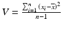
                      |

Statistics for Non-StatisticiansIndexAAlternative hypothesisAnalysis of variance (ANOVA)ANOVASeeAnalysis of variance (ANOVA)AverageBBar chartBartlett’s testBiasBinomial distributionBubble plotCCentre lineChi-squared distributionChi-squared testCluster samplingCoefficient of correlationCoefficient of variationConfidence intervalControl chartsControl limitsDData collectionDegrees of freedomDensity functionDispersionDistribution functionEEstimateEventExperimentFFitness ClubFractileFrequencyFrequency tableGGeometric averageHHistogramHypothesisIIndependent eventsInter-quartile Range (IQR)IQRSeeInter-quartile Range (IQR)KKurtosisLLine chartsLinear regressionLocationLognormal distributionMMatched pairsMeanMedianMethod of least squaresModeMultiple regressionNNon-responseNormal distributionNull hypothesisOOff spec productionOne-sided testOutcomePPercentagesPie chartPopulationProbability of eventProcess capabilityProcess capability indexP-valueQQuartileRRandom errorRandom numbersRandom variationRandomizationRangeRegistersRegression analysisRegression lineRepresentative sampleSSampleSample spaceSamplingSampling fractionSampling unitScatter plotSignificance levelSimple random samplingSimulationSix Sigma QualitySkewnessSources of errorsSpecification limitsStandard deviationStandard errorStatistical controlStatistical Process Control (SPC)Statistical testStatistical uncertaintyStratified samplingSupplementary runs rulesSurveySystematic errorsSeeBiasSystematic variationTTables
                t
                -distribution

                t
                -test
              Two-sided testVVarianceWWestern Electric rules