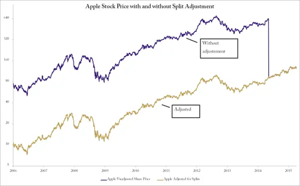
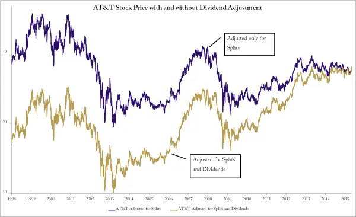

# 股票是最难的资产类别

许多投资者被股票吸引，是因为它看起来是最容易的资产类别（asset class）。我们大致都知道公司是什么以及它们的股票意味着什么。相比于商品价格、债券收益率或外币，股票更容易让人产生关联感。

大多数人交易他们了解的公司。你去星巴克喝早咖啡，了解他们的业务模式。你喜欢你新款漂亮的iPhone，于是买入苹果股票。这当然是一种错觉。你对星巴克咖啡或苹果iPhone的体验，并不能真正帮助预测未来的股价。只是在事后看起来如此而已。

这是一种很容易让人上当的错觉。当你看到上市公司的名称，并将自己的经验与它们联系起来时，很容易受到影响。如果你喜欢它们的产品，你会觉得股价应该上涨。如果你认为它们过时了、不再流行或产品有缺陷，你会觉得价格应该很快下跌。大多数情况下，这些想法对交易该股票并没有什么帮助。

回顾一段较大的价格波动时，很容易觉得这一切发生得如此理所当然。也许你会看微软股价在90年代的戏剧性上涨，然后说它们不仅会统治整个软件行业，还会统治整个股市，这是多么显而易见。毕竟，他们是出色的操作系统DOS和全新的附加图形界面Windows的创造者。即使你出于某种原因没有在90年代的夜晚不断通过config.sys和autoexec.bat来优化扩展内存使用，你也会注意到当时确实没有像样的竞争者。事后看来，这再清楚不过了。然而，在当时这一点也远非清晰。当然，在当年普遍盛行的疯狂氛围中，每个人都像没有明天一样把钱扔给任何科技股。但买入微软的人，通常也是买入Worldcom、Global Crossing、AOL以及许多其他以壮观方式破产的公司的人。只是当为时已晚时，一切看起来才那么明显。

很多时候，拥有优秀产品和看似伟大战略的公司，在股市中表现却很差。同样常见的是相反的情况，听起来疯狂的概念却一飞冲天。再说一次，等到股价已经涨到足以登上头条新闻，现在每个人都觉得这一切的发生是如此显而易见。有句老话说，每个人都是周一早上的四分卫（Monday morning quarterback）。作为一个欧洲人，我其实不太清楚四分卫是做什么的，但这听起来不像是一件应该在周一早上做的事情。

当然，确实有非常擅长对公司和行业进行基本面分析（fundamental analysis）的人。他们是预测长期走势的专家，通常会进行极其详细的分析。这是一项非常困难的工作，远比喜欢或不喜欢某个产品要深入得多。这些分析师通常只专注于一个行业甚至几只股票。他们跟踪每一个细节，分析损益表和资产负债表的每一行。对于金融市场来说，这是一种完全有效的方法，当然前提是付出了足够的努力，但这本身就是一份全职专业工作，并不是本书要讨论的内容。

一个非常类似的错觉是，你相信自己交易自己工作的公司的股票具有优势。大多数人似乎觉得，他们对公司的内部了解有助于理解市场并获得交易优势。除非你是高层管理团队或董事会成员，否则情况并非如此。即使你是高层管理人员或非执行董事，除了在重大公告前等特殊情况下，你也很难说有任何优势。一般来说，利用这些特殊情况交易是违法的。

事实上，买入你工作公司的股票是非理性的。首先，与市场上任何其他随机股票相比，你在交易它时没有任何优势可言。如果这样能行得通，那么任何上市公司的员工通过交易赚的钱都会比工资多。这只是一种错觉。但更糟糕的是，你是在将自己已有的风险集中在一家公司上。是的，你已经对你工作的公司有了风险暴露。如果公司表现不佳，你可能被解雇。如果公司表现好，你可能获得加薪和晋升。通过购买股票，你只是在增加对同一实体的风险，而没有任何理性的理由这样做。

## 同群压力（Peer Pressure）

股票世界给你的印象是你有无限的可能性。有成千上万只股票可以交易。它们代表了在任何可以想象到的行业领域经营业务的公司。你有工业集团、电信运营商、制药公司、金矿开采企业、互联网公司、石油勘探公司，应有尽有。这些业务领域如此截然不同，以至于人们会自然地认为股价会相互独立地变动。

问题在于，它们并不会这样。是的，你有成千上万只股票可以选择，但当关键时刻到来时，它们都会像驯鹿一样行动。什么？羊的比喻已经被用烂了。我是斯堪的纳维亚人，在驯鹿这件事上请相信我。

在正常的市场条件下，股票看起来可以相当独立。当处于牛市时，大多数股票都会上涨，但好股票涨得更多。在牛市中，大多数股票与整体股票指数的相关性相当高，即使你持有大量的股票投资组合，你也会高度依赖整体市场。当指数上涨时，你的大多数股票也会上涨。反之亦然。

在熊市中，股票之间这种相当高的相关性会突然以极限速度趋近于1。当市场突然暴跌时，无处可藏。一切都在同一时间遭受打击。然后，当整体市场反弹并进行急剧的熊市反弹时，所有股票又会在同一天上涨。这摧毁了分散化（diversification）背后的核心理念。你现在持有的本质上只是不同数量的beta（贝塔）。

这是股票策略中最棘手的部分。如果你同时交易所有资产类别，你可以相当容易地设计一个分散化机制。毕竟，玉米、石油、日元和股票之间很少有共同之处，通常彼此相当独立地变动。但如果你只交易股票，你就没有这样的奢侈条件。

股票缺乏分散性是一个需要特别注意的关键因素。对于股票策略，你总会持有大量的beta头寸。你持有的股票越多，你的策略就越接近指数。这很重要，但不一定是个问题，只要你非常清楚这一点，并据此设计你的策略。有意识地承担beta风险不一定是一件坏事。但你必须意识到这一点，并确保在市场转坏时你没有持有beta。

## 幸存者（Survivors）

标普500指数是一个动量指数。纳斯达克100、道琼斯工业指数、罗素指数以及大多数其他股票指数也是如此。如果你仔细想想，你就会意识到股票指数本质上是非常长期的动量策略。

当然，"动量"这个词并不是标普官方指数方法论的一部分。但市值（market capitalization）是。

要纳入标普500指数，一只股票必须具有很高的流动性，在纽交所或纳斯达克上市，并且市值必须超过53亿美元。市值只是公司的理论价值。你通过将已发行股份数乘以当前股价得到它。其含义应该显而易见。一只股票之所以能成为指数的一部分，是因为它在过去有强劲的价格表现。当一只股票离开指数时，通常是因为它价格表现不佳，跌破了市值要求。这使得标普500指数以及大多数其他指数在某种程度上成为了动量策略。

当你查看这样一个指数的长期图表时，你看到的是一个动量策略。表现强劲的股票被纳入，表现不佳的股票被剔除。一家公司可以在一段时间内表现不佳，但如果它持续下跌，就会被排除出指数。此后它继续下跌，指数本身却不受影响。因此，你在指数中看到的与动量选股策略非常相似。

这一切都意味着指数让股票市场看起来比实际更好。

它也制造了一种能够获得所谓的十倍股（ten-bagger）的幻觉。这个词指的是你买入后价格上涨十倍的股票。也就是1000%。如果你查看标普指数中的一只股票，并回溯足够长的时间，你可能会后悔十年前没有买入。问题当然在于，这只股票当时并不在指数中。它现在在指数中，仅仅是因为它经历了惊人的十年。十年前你可能根本没听说过这只股票。即使听说过，它也可能只是众多高风险小盘股中的一只。

在开发和模拟交易策略时，将这一点考虑在内是绝对至关重要的。

假设你正在开发一个交易模型，在特定条件下买入股票。也许是在突破某个区间时买入，也许是在超卖时买入，这里具体是什么并不重要。如果你将这个策略编程到模拟平台中，并在过去二十年的当前标普500成分股上进行测试，结果看起来肯定会很棒。毕竟，该策略从一个我们知道有过大幅上涨的股票篮子中买入股票。

你需要做的是使用一个现实的股票池。一个好的方法是在一个指数的所有股票上进行测试，例如标普500，但要考虑历史指数成分股。你需要让你的模拟平台知道任意给定日期的历史指数构成。这样，在回溯到过去的每一天，模拟只会考虑当天实际属于该指数的股票。这是一种消除或至少大幅减少幸存者偏差（survivorship bias）的方法。

这种方法的一个关键部分是，你必须同时包括已退市的股票。许多十年前交易的股票现在已经不再上市。也许它们破产了，也许它们被其他公司合并了。原因并不重要，重要的是你的模拟必须使用尽可能现实的参数。

大多数退市股票的表现都很糟糕。如果你不在模拟中包含它们，你会得到过于乐观的结果。当你开始实际交易时，你会以惨痛的方式发现，现实可能与模拟大相径庭。

## 分而治之（Divide and Conquer）

有各种类型的公司行为（corporate actions）可能影响公司的股票。其中大多数相当直接且易于调整。实际上所有数据源通常都会自动调整这些情况。例如，拆股（split）会自动进行向后调整，从而不会产生人为的缺口。这一切都很好。然而，真正的问题在于现金股息（cash dividends）。

大多数面向公众的时间序列数据源都忽略股息。很可能你见过的大部分股票图表，甚至可能所有的图表，都完全忽略了股息。即使是为专业金融人士提供的昂贵市场数据平台中的默认图表，也不考虑股息。

通常所有图表都会针对拆股和类似公司行为进行调整。如果不调整，你很容易就能看出来。只需看看2014年苹果公司拆股的例子就非常明显。那年六月，苹果进行了7:1的拆股。这意味着价格突然变成前一天的正分之一，即14.286%，但作为回报，你投资组合中的股票数量突然变成原来的七倍。股价在2014年6月6日收盘于645.87美元。接下来的周一，该股开盘于92.72。这代表了数字上的剧烈变化，但实际上只是一个非事件。

拆股实际上对任何事情都没有影响，但它们可以作为一个巧妙的小营销手段。这是公司的一种声明，表明股价上涨太多，以至于人们买不起了。这当然不完全正确，因为股价本身并不能衡量一家公司是贵还是便宜。如果你比较两家完全相同的公司，拥有相同的已发行股份数以及相同的基本面和前景，那么股价本身至少会有一些相关性。

虽然拆股是一个非事件，没有分析价值，但它确实影响了股票的时间序列。在苹果的例子中，如果你不做任何调整，你会得到一个图表，价格在大约650附近运行，然后突然暴跌，一天之内下跌了85%。这看起来像是股东遭受了重大损失，而事实显然并非如此。

调整的方法是对整个历史序列进行重新计算。在7:1拆股的情况下，该股票在拆股前的所有历史价格都必须乘以0.142857。如图3-3所示，未经调整的序列毫无意义。2014年夏天并没有发生85%的损失，时间序列中也不应该出现这个缺口。别担心；几乎所有市场数据提供商，甚至免费的互联网来源，都会自动完成这项工作。

关于股息，逻辑非常相似。为了正确了解股价的实际财务发展情况，你需要调整所有历史序列。虽然拆股的调整因子通常至少是0.5，但股息的调整要小得多。在调整股息时的标准做法是，假设收到的现金立即再投资于同一只股票。这种方法使我们能够轻松计算调整因子，并调整所有历史价格序列。

图3-3 苹果股价：拆分调整前后对比

再次强调，不要太担心实际细节。理解调整的一般逻辑和好处是有用的，但尝试自己做这项工作是不现实的。如果你计划运行模拟或进行其他长期股票时间序列分析，建议购买总回报数据（total return data）。这个术语指的是已经针对所有因素进行调整的数据，从拆股到股息再到任何其他可能随时间影响投资者的因素。

图3-4显示了自1998年以来的AT&T。一条线显示的是仅针对拆股和其他公司行为调整的时间序列，就像大多数市场数据系统默认显示的那样。另一条线显示的是包括股息调整在内的真实发展情况。第一个序列，大多数人会称之为正常价格图表，会告诉你如果一个投资者在1998年买入并持有到2015年，他亏损了7%。问题在于，这与事实相去甚远。这是一只高收益股票，支付大量股息。假设股息再投资，1998年买入的实际结果是到2015年你的资金翻了一番。

你可能会问，为什么我们假设股息被再投资了。好吧，无论你怎么处理，你都必须对这笔现金的去向做出某种假设，而这个假设最终都难免不准确。假设再投资是标准方法，它在逻辑上是合理的，并且可以得出有用的调整数字。

你可以假设现金什么都不做，但这也不太可能。那意味着你收到股息后把钱放在床垫下。也许我们可以假设现金进入所谓的无风险存款，或者投资于指数。无论如何，正如你所看到的，我们必须对现金的处理做出某种假设。再投资意味着我们最初的现金购买与股价保持同步，就像一开始就没有股息一样。因此，它展示了公司价值发展更有效的时间序列。

图3-4 AT&T：股息调整前后对比

这里展示的例子是比较极端的，是特意选择来说明问题的。细心的读者可能会想，在正常的日常股票交易和投资决策中，这真的那么重要吗。对于某些类型的策略和方法，可能确实没那么重要。只要你的时间跨度足够短，当然，前提是你没有恰好在拆股或除息日期间交易。

但这对于本书所关注的长期动量方法确实很重要。忽视这些调整会带来两个问题：第一个是关于模拟的，第二个是关于选股的。

在开发交易方法时，通常会构建一个数学模型并对该方法进行逼真的模拟。如果不这样做，你就是在盲目飞行。你可能有一个非常合理的市场理论，但如果你没有测试过它的历史有效性，你并不知道实际上线时会是什么样子。

如果你的模拟是在未经调整的价格数据上进行的，或者更可能是在仅针对拆股而非股息调整的价格数据上进行的，那么随时间推移的回报将与现实相去甚远。每次支付股息时，看起来就像是遭受了损失，而事实显然并非如此。也许你有一个很好的方法，但你可能因为模拟显示的结果比实际差而放弃它。

更大的问题在于股票排名和选择。如果你对过去一年表现最好的股票进行排名，任何支付股息的股票都会被推后。一家公司可能正处于上升势头，利润不断增长，业务迅速扩张，但由于它支付股息，它不会出现在你的排名筛选结果中。

不考虑股息，你可能会选择到劣质的股票。如果你认真对待投资组合的选择，而且你还在继续读这本书，我只能推断你是认真的，那么你真的应该考虑获取一个总回报数据源。

## 指数的选择（Choice of Index）

就本书而言，股票市场将以标普500指数为代表。它是一个广泛的美国大公司股票指数，可以很好地作为美国市场健康状况的通用基准。

选择指数比看起来更重要。这个指数就是你的基准。这并不意味着你必须跟踪该指数，但它是一个衡量你表现的标尺。如果你没有跑赢指数，你就做得不够好。指数的选择也帮助你界定你的范围。仅在美国就有数千只股票可供选择。拥有很多股票选择可以是件好事，但也是有限度的。然而，将自己限制在一个或可能几个指数的成分股中通常会有所帮助。它为你提供了一个明确的工作范围，在模拟你的策略时尤其有用。如果你没有一个明确定义的范围，就很难对十年前你会考虑哪些股票做出现实的假设。看到某只股票在过去十年中刚刚实现了百分之千的回报，就假设你在它开始上涨之前就听说过它，这是一个经典的谬误。

我没有选择道琼斯工业平均指数作为首选指数，这是有充分理由的。实际上，有几个理由不选择这个指数。道琼斯指数是一个相当愚蠢的指数，恕我直言，而且几乎没有理由使用它。它主要是财经电视节目主持人会提到的指数，因为他们觉得公众更熟悉这个名字。

道琼斯指数只有30只股票。这本身就是该指数的一个严重局限。30只最大的股票并不能代表美国交易所的数千只股票。这是一个极其狭窄的指数。

更大的问题在于道琼斯指数的计算方式。它是一个价格加权指数（price weighted index）。这意味着你只需将30只成分股的所有股价加起来，然后除以30。准确地说，你还需要除以指数除数，但这只是一个为了得到一致数字的技术细节。

如果你停下来思考一下，应该就能明白这种方法有多么荒谬。股价较高的股票对指数的影响更大。这源于一种非常古老的思维方式，即股价本身具有某种分析意义——股价100的公司比股价10的公司更重要。

请记住，我们不是在谈论市值。股价与公司的价值没有任何关系。一家股价10的公司可能有100,000,000股流通股，而一家股价100的公司可能只有10,000股流通股。股价本身绝对没有任何意义。

道琼斯指数及其方法论是一种遗留产品。有很多更好的替代方案可供使用。在专业领域，MSCI系列指数非常流行。该系列的核心价值在于，你可以在全球范围内获得一致的方法论，涵盖你可能想要的一切。有数百个MSCI指数，按地域、风格和行业分类。对于资产管理人来说，这是首选的指数系列，但其缺点在于购买指数成分股信息相当昂贵。对于零售交易者来说，购买高级指数系列的价值也值得怀疑。对大多数人来说，更有意义的是寻找那些成分股信息免费提供的广泛指数。对于美国市场，标普指数是一个不错的选择。

这些指数中最著名的当然是标普500指数，由美国交易所中最大的500只股票组成。同样值得关注的可能还有标普400中盘股指数和标普600小盘股指数。这三个指数一起也构成了标普1500指数。

你最终使用哪个指数，不如你选择它的理由重要。不要随意选择指数。弄清楚你在寻找什么，然后选择一个匹配的指数。

在本书中，大部分时间将使用标普500指数。不过，这里介绍的理念适用于任何足够广泛的指数。当然，对于更狭窄的指数，你的结果可能会有所不同。

## 市值（Market Capitalization）

市值（Market Capitalization）：指一家公司值多少钱的理论指标。计算方法为已发行股份总数乘以当前股价。

要理解市值到底是什么，只需看看它是如何计算的。首先查看总流通股数（total shares outstanding），即公司发行的所有股票总数，无论是否自由流通。然后将股份数与当前股价相乘。得到的数字是整个公司的理论价值。之所以说是理论价值，是因为如果你想收购整个公司，价格会大不相同，就像你在任何并购或公司收购要约中看到的那样。

按市值对股票进行分组通常是有意义的。大多数市场指数对市值有严格的规定，并专注于一个范围。标普500指数是一个大盘股指数，根据其标准，任何公司都需要至少53亿美元的最低市值。这并不意味着任何大于此市值的公司都会被纳入，只是说一家公司首先需要满足这个最低市值才有资格被考虑。

不太知名的标普400指数是对应的中盘股指数。要成为该指数的候选者，公司市值需要在7.5亿美元到33亿美元之间。小盘股指数标普600涵盖市值在4亿美元到18亿美元之间的股票。

所有这些指数都是基于市值加权的。公司的价值越高，其在指数中的权重就越大。这是否合理在很大程度上取决于你的观点。如果指数的目的是衡量整体市场健康状况和长期发展，那么这可能非常有意义。如果你的目标是按照这些原则进行投资，那么这可能就不那么有意义了。

一般来说，大盘股往往比小盘股的波动性更低。它们的潜力也往往小于小盘股。这当然并不意味着交易大盘股是个坏主意。这只是你应该意识到的差异。

这样来看。苹果最初是一家小盘股公司，和其他所有公司一样。好吧，严格来说是纳米盘公司，或者你喜欢用什么词来形容两个留着胡子的嬉皮士在车库里经营的公司。它经历了从小盘股到中盘股再到大盘股的所有周期。我甚至不想计算自1976年以来它的价值翻了多少倍。现在该公司市值约5000亿美元。这是半个万亿美元。比世界第二大公司多出约1000亿美元。它再次翻倍的可能性有多大？

这绝不是不可能的。只是当你以半个万亿美元的规模交易时，股价翻倍要比以50万美元的规模交易时困难得多。

规模较小的公司风险往往更高，但潜在回报也更高。

## 行业板块（Sectors）

按行业对股票进行分类只是跟踪公司实际业务的一种方式。即使你不进行任何基本面分析，也最好了解行业板块。通常有些行业表现非常好，而另一些则表现不佳。当然，如果你愿意，也可以通过量化方法识别这一点。了解市场驱动力很重要。如果你根本不关注行业，你可能会在不知不觉中建立起对某个单一行业或主题的过大风险敞口。承担风险是必要的，但应该有意识地为之。

在撰写本文时的2015年初，能源板块已经遭受重创超过半年。在此期间跑赢标普500指数的一个简单方法就是不要买入任何能源股。

有几种对股票进行分类的方案，术语可能略有不同。但最终它们都相当相似，你选择哪种方案无关紧要。我倾向于使用GICS分类方案（Global Industry Classification Standard，全球行业分类标准），因为它是一个连贯的全球标准，并且在大多数市场数据平台中都很容易获得。它还有四级深度的优势，有时很有价值。

在顶层，GICS方案有十个行业板块，我将在本书中用它们来描述股票。这些行业是：非必需消费品、必需消费品、能源、金融、工业、信息技术、材料、电信服务、公用事业和医疗保健。如果你想深入挖掘，每个行业又被分为行业组、行业和子行业。对我们大多数人来说，行业级别已经足够。
