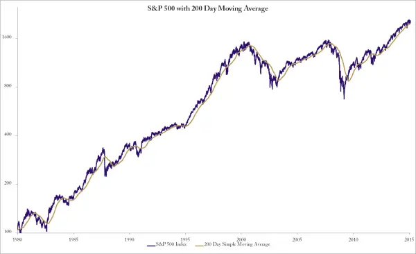

# 市场环境过滤器

在[第4章](ch04.md)中，我展示了一些简单的趋势跟踪（trend following）风格交易模型，以及它们为何在股票上表现不佳。有一种非常简单的方法可以显著改进这些模型。这是一个非常简单的概念，让我非常困惑的是为什么还有这么多人没有实施它。

非常简单：不要在熊市中买入股票。

对于股票交易策略而言，最重要的指标是指数。有时股票似乎是独立的，靠自身力量运动，但这部分是一种幻觉。几乎所有股票每天都受到整体市场状态的影响。即使是受到积极消息流和买盘支持的动量股也会受到影响。在牛市中，大多数股票上涨。动量股可能比其他股票上涨更多，但大多数股票朝着同一个方向运动。

在横盘市场环境中，一些股票上涨，一些下跌。如果你查看覆盖数月的图表，指数可能看起来是横盘的，但在指数上涨的日子里，大多数股票表现稍好。动量股在横盘市场中往往表现得很好，只要波动性不是过大。

在熊市中，你持有哪些股票似乎突然就不重要了。当整体市场指数下跌时，几乎所有股票都跟随下跌。只是程度不同而已。如果你试图寻找2008年最强的股票，你会发现几乎不可能找到当时在上涨的股票。

当市场转跌时，突然之间所有股票都下跌了。之前看起来那么独立的股票现在变成了被狗追赶的绵羊。在熊市中，相关性（correlation）迅速趋近于1，你选择了哪些股票似乎不再重要。它们都在下跌。

如果你打算持有一个动量股票组合，或者任何其他股票组合，你始终需要了解当前的市场环境（market regime）。

测量这个的方法有很多种。归根结底，选择哪种方法并不那么重要。判断市场是牛市、横盘还是熊市并不难。实际上，关键是要判断我们是否处于熊市。横盘市场通常是交易动量策略的良好环境。

没有必要花太多时间思考你的具体方法。这是业余交易者的常见错误——忘记了目标，只关注工具箱。思考你想要实现什么，然后找到一个简单直接的方法。

在这种情况下，我们希望得到一个长期整体市场方向的指标。该如何做呢？你可以检查价格是否高于长期移动平均线（moving average）。你可以测量过去一年的百分比变动。也许使用双移动平均线或布林带（Bollinger band）。这些方法不会有太大区别。关键点是你需要一个长期市场环境指标。

由于实际上使用什么指标并不重要，只要它能捕捉市场的长期趋势，我将使用一个非常简单的方法。这里没有必要把事情复杂化。

如果标普500指数（S&P 500）低于其200日移动平均线，我将宣布市场为熊市。这是一个非常长期的过滤器。使用如此简单的方法，我们立即有了一种可靠的方法来识别市场是否处于下跌趋势。实际上，只需添加这一条规则，几乎所有股票组合策略都能显著改善。如果指数处于熊市，就不要买入股票。

图6.15 标普500指数与200日移动平均线

在图6.15中，你会看到自1980年以来标普500指数与200日移动平均线。这张图告诉我们，大多数时候指数都高于这条长期平均线。这并不太令人惊讶。大多数时候，买入股票是个好主意。

看同一张图，你可能还会注意到指数多次跌破移动平均线，然后迅速反弹。有理由质疑是否应该做与我建议相反的事情。为什么不在指数跌破移动平均线时买入呢？

那是一种完全不同的交易方法。一个更困难、当然也更冒险的方法。如果你在1987年崩盘后立即买入，你会赚到非常好的钱，而且速度相当快。但如果你在2000年指数跌破后买入，你会发现三年后你的钱只剩下一半。

不，我建议的是风险小得多的方法。这里的移动平均线将用作市场环境的指标。它回答一个简单的问题：市场是上涨的吗？当价格高于移动平均线时，我们将做出肯定的回答。

请注意，这里讨论的方法中，指数及其移动平均线对交易没有直接影响。它不会告诉你买入或卖出。我们不会仅仅因为指数跌破移动平均线就卖出。但是——这里是重点——当指数低于其长期移动平均线时，我们不允许建立任何新的头寸。

不要在熊市中买入股票。
