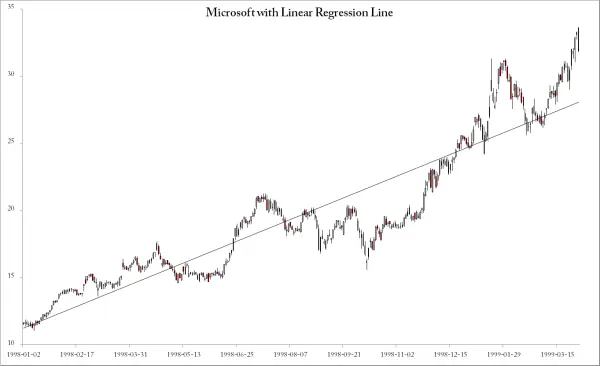
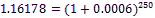
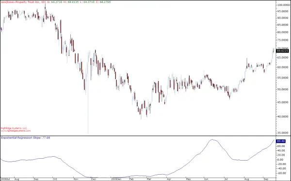
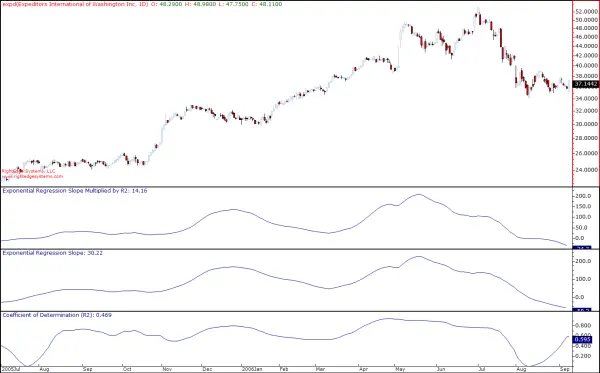
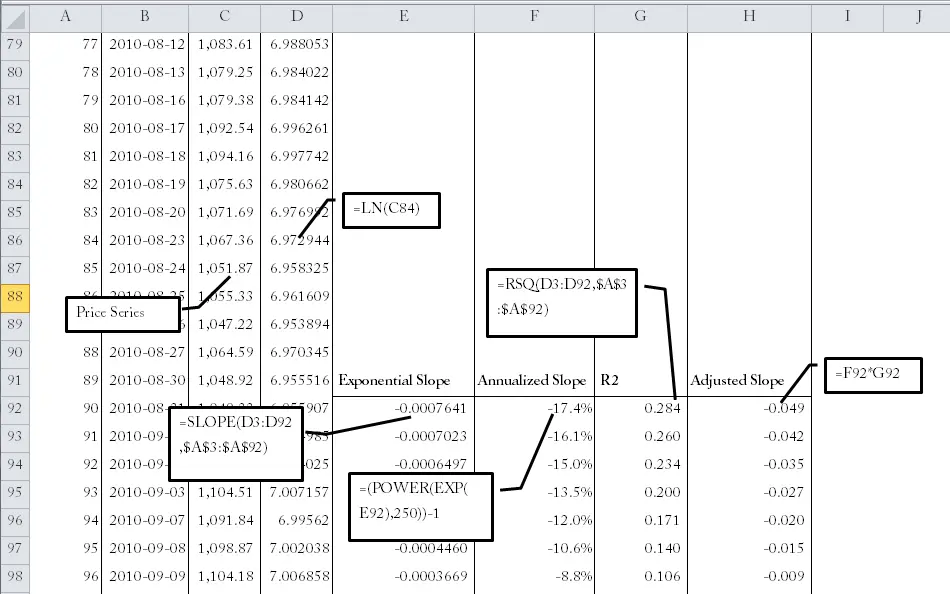
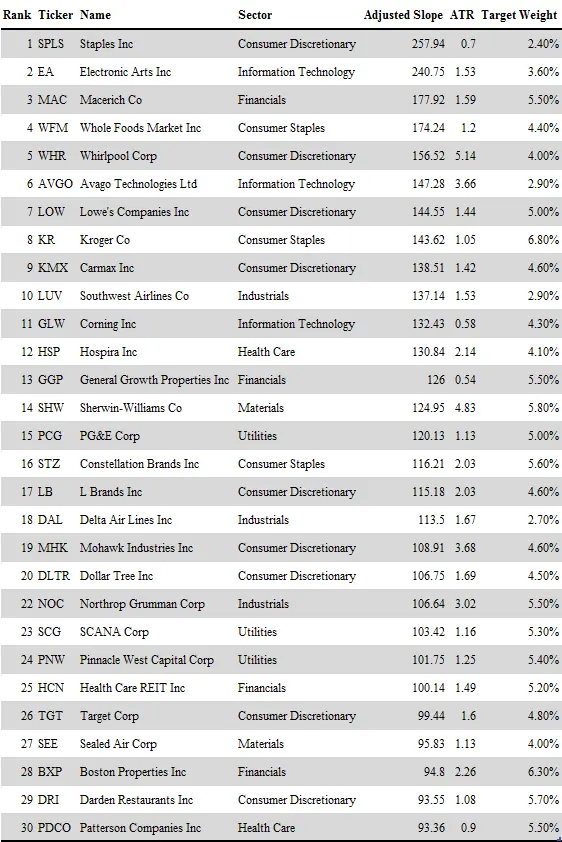
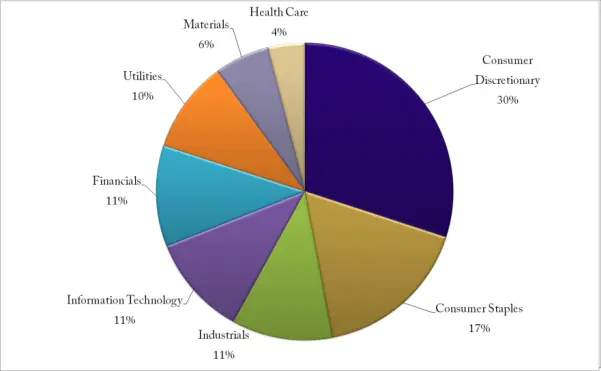

# 股票排名

当你处理大量可交易标的时，找到一种好的排名方法就变得非常重要。如果你在看标普500指数的成分股，你不能随便随机挑选股票。嗯，第[第4章](ch04.md)表明也许你可以，但那是后话了。买入你熟悉或在报纸上读到的股票就更糟糕了。甚至不要想翻阅500张图表来找出你喜欢的形态。那会让你受制于你的视觉感知，无论你多么努力保持一致性，你很可能会在不同的日子做出不同的判断。你的心情、注意力和其他因素都会起作用，你得不到一致的结果。

你首先需要弄清楚你想要捕捉什么。虽然本书的核心范围是关于动量（momentum），但这些原理也可以用于其他风格。如果你喜欢这本书及其呈现的理念，那将是一个很好的研究领域。

动量本质上就是买入涨幅最大的股票。所以我们只需要根据涨幅来排名，对吗？嗯，尽管我赞成简单的方法，但这可能有点过于简单了。理解为什么这一点非常重要。

拿一个在各种互联网网站上非常常见的排名方法来举例。一种流行的方法似乎是根据价格与移动平均线之间的百分比差异来排名。对于长期排名，这可以是当前价格与200日移动平均线之间的百分比差异。这种方法有两个主要问题。

首先，它完全没有考虑股票的正常波动性（volatility）。这将导致选出高波动性的股票，对这些股票来说，远离移动平均线再回落是家常便饭。其次，更重要的是，这种方法不关心我们是如何达到远离移动平均线的。如果有一个重大事件在一天内将价格推得很远，比如潜在的收购，那就会把这只股票推到排名的顶端。

波动性非常重要。这个游戏不是看谁一年内的绝对收益最高。而是看谁的单位波动性收益最高。永远不要忘记波动性是我们用来购买表现的货币。我们想要实现的是，尽可能少地支付波动性，尽可能多地获得表现。单纯看收益而不考虑风险，严格来说属于赌博的范畴，这不是我们在这里做的事情。

这引出了一个显而易见的结论：我们需要找到那些以良好而有序的方式上涨的股票。我们想要的不只是随时间有显著涨幅的股票，还要让这些涨幅尽可能平稳。因此，我们的排名方法需要两个基石。我们需要同时考虑动量和波动性。

首先，让我们找到一种衡量动量本身的好方法。这其实并不难，更多是偏好问题。尽量避免那种查看常见技术分析工具的过于普遍的反应。我发现许多业余交易者容易陷入一种思维方式，这种思维方式基于过去几十年出版的大量技术分析书籍。许多这些工具是在不同的时代为不同的目的而创造的。尝试从头开始，为你自己的目的设计分析工具，而不使用常见的技术分析术语。即使你最终使用了类似的东西，这至少是一个好的练习。它会让你对方法有更深的理解，而不是使用现成的技术分析指标。

我喜欢我的分析工具基于像样的数学和逻辑，具有直观的意义，并且在需要时最好易于可视化。你选择的方法可能与我不同，这完全没问题。重要的是找到适合你目的的方法。如果你自己设计了分析工具，一定要做一些适当的模拟工作，以确保它确实增加了价值。

## 使用指数回归进行股票排名

我通常的股票排名方法可能对某些人来说看起来过于复杂。一旦你理解了所涉及的基本统计计算，它其实并不复杂。如果你觉得这一节很复杂，我的首要建议是花时间理解背后的逻辑。对于那些以前接触统计分析有限的人来说，公式和术语可能看起来比实际复杂得多。相信我，这并不可怕。

如果你仍然觉得这些概念太复杂，可以随意用你自己选择的方法替代它们。看看逻辑和我们想要实现的目标，找到一些更简单的方法来完成工作。我会尽力解释我使用的方法以及为什么我最终选择了它们。

为了衡量动量，我使用指数回归（exponential regression）。这引出了两个显而易见的问题：什么是回归，为什么是指数回归。在看指数部分之前，你需要理解线性回归（linear regression）的概念。我不会深入公式和细节，这个讨论将保持在概要的水平。请见谅其他同行宽客（quant）们，他们可能会觉得这个解释过于简化了。

线性回归是一种在数值序列上拟合直线的方法。它是一种找到最佳拟合直线的方法，在这里是拟合到价格的时间序列。图7.16展示了一个例子，其中一条线性回归线被拟合到价格序列上。注意这不是趋势线。趋势线是非常主观的，可以用多种不同方式绘制。我们讨论的是基于价格点计算出的线性回归线。

图7.16展示了90年代末微软的线性回归线。线性回归公式会给出两个值，以绘制这样一条回归线。首先你可以计算截距（intercept），即从哪里开始画线。然后你有斜率（slope），它告诉你每条连续数据点线应该向上或向下移动多少。结果线是价格数据的最佳线性拟合，或者说是误差最小的拟合。

斜率是我们真正感兴趣的，因为它告诉我们股票价格的方向。

对于日线数据，斜率会告诉我们每天线应该上涨或下跌多少美元美分。毕竟，顾名思义这是一条直线。因此，在日价格序列上计算线性回归斜率，就等于计算同一时间段内每天的平均涨幅或跌幅。

因此，线性回归斜率是股票速度或动量的度量。但问题在于斜率是以美元和美分表示的。如果一只10美元的股票每天上涨2美元，这比一只100美元的股票每天上涨相同的2美元要显著得多。

这就是使用指数回归的原因。线性回归斜率以货币单位表示，而指数斜率以百分比表示。指数回归斜率会告诉你线向上或向下移动的百分比。或者如果你愿意，可以说是每天的平均百分比变动。

显然这个斜率数字通常会有很多小数位，难以关联。大多数股票的斜率不超过一个百分点，甚至不到半个百分点。毕竟，如果一只股票的斜率是每天1%，那意味着它一年内会涨超过200%。相反，你会得到0.000435这样的斜率，以及其他难以理解和关联的数字。简单的解决办法是将其年化。

如果你对斜率进行年化，你会得到一个数字，告诉你如果股票继续以完全相同的角度运动，理论上全年会获得多少。

并不是说你可以做任何假设说这一定会发生，因为很可能不会。理由只是为了让数字更容易理解。如果你看到指数回归斜率是0.0006，这很难理解，但如果告诉你这相当于年化16%，那就更容易理解了。

图7.16 线性回归线——微软

概念比数学更重要，但让我们简要看看这个16%的数字是怎么来的。首先我们计算了股票的指数回归斜率。这可以使用大多数标准图表软件或Excel等电子表格应用程序来完成。

这个假设情况下的指数斜率最终为0.0006。这意味着平均每天股票上涨0.06%。假设一年有250个交易日，年化就非常简单了。

简单的金融数学告诉我们，0.06%的涨幅复利250天，一年后大约为16%。现在这个数字有了更直观的意义。

用百分比思考比用美元美分思考有用得多。毕竟，知道股票XYZ上周赚了30美元并没有太大用处。没有背景信息这什么都说明不了。但如果同一只股票上周上涨了30%，那就有意义了。

如上所述，使用年化指数回归斜率的一个好处是它直观易懂。我们可以看到当前斜率相当于每年百分之几。需要记住的重要一点是，我们并不真正期望这个收益会实现。它可能小得多，也可能大得多。它的作用是将近期表现放在一个我们可以关联的视角中。

在本书中，我们寻找的是中期动量排名。回归计算都使用过去90个交易日的数据。这构成了一个合理的时间段，无需进行优化。

当下方面板中的线高于零时，股票在上涨，否则在下跌。数字越高，动量越强。

如果我们现在计算所有候选股票的指数回归斜率，对数字进行年化，并根据结果值进行排序，我们就有了一个相当不错的排名方法。不是完美的方法，但已经相当不错了。

图7.17 Essex Property Trust，年化指数回归斜率

图7.17展示了Essex Property Trust，下方图表为年化指数回归斜率。注意图中的零刻度线。

斜率最高的股票将排在列表顶部。某只股票上涨越强劲，它在列表中的位置就越高。这是一个纯粹的动量排名。

我们的排名方法仍然有一个小问题。仅使用年化指数回归进行排名意味着我们不关心拟合度。例如，如果一只股票几个月来一直横盘，然后突然一天上涨50%，接着又继续横盘，这会严重干扰我们的排名。你说不可能？完全可能。对于宣布即将被收购的股票来说，这是一种正常行为。价格迅速跳升到非常接近收购价格，然后失去所有波动性，在交易完成前横盘整理。这不是我们想要买入的情况。你还可以想象更多可能发生的奇怪情景。

我们不想选择一只刚刚大幅跳升的股票。我们希望获得尽可能平稳上涨的股票。最好是我们买入后它们也能继续平稳上涨。我们在寻找真正的动量股，而不是刚刚出现疯狂缺口的股票。

细心的读者已经注意到几段前暗示的解决方案。关键词是"拟合度"。既然我们用到了回归数学，就有一个很好的方法来衡量价格数据对回归线的拟合程度。它被称为决定系数（coefficient of determination），通常用R²表示。

决定系数（coefficient of determination, R²）：衡量价格序列对回归线拟合程度的指标，取值范围为0到1。值为1表示数据完美拟合直线，值越接近0则拟合程度越差。

R²告诉你价格序列对回归线的拟合程度。如果你有一堆随机散落的价位，你仍然可以计算出一条回归线。结果当然是无意义的，因为这些点之间没有联系，没有实际的斜率可以预测。在这种情况下，R²将接近于零。

另一方面，如果实际数据几乎已经是一条完美的直线，我们会得到相反的结果。如果我们基于以近乎完美直线上升的价格数据计算回归斜率，可以预期R²读数接近1。

零是R²的最小值，1是最大值。值为1意味着数据完美拟合直线，R²越低，回归线的拟合度越差。再次提醒，理解逻辑比知道所有公式重要得多。

现在来个小测验。鉴于我们现在有两个数值，如何能做出更好的排名？我们有股票的年化斜率，还有一个介于0和1之间的数字告诉我们这条线对现实拟合得如何。

是的，没错。让我们把这两个数相乘看看结果。如果回归线的拟合度低，我们就把数字拉低。如果拟合度高，它就不会被压低太多。这意味着我们衡量纯粹的动量（回归斜率），然后根据波动性对其进行惩罚。波动性越高，惩罚越重。

你会发现，大多数时候排名列表看起来相当相似。区别在于拟合度最极端（无论好坏）的股票会在排名中发生较大变动。最大的影响是，在巨大波动性下取得大幅涨幅的股票会被远远推下排名，远到足够排除在现实候选之外。这正是我们使用R²拟合度方法想要达到的效果。

图7.18展示了中间面板的年化指数回归斜率。那是纯粹的动量，即年化回归斜率。下面板是拟合度，即决定系数。最后，你看到两者相乘的结果。

注意当波动性增加时R²如何迅速下降。当价格以相当平稳的趋势运动时，像图7.18中间部分那样，R²将保持相当高。在这种情况下，动量排名不会受到太大惩罚。另一方面，当价格改变方向或变得不稳定时，R²会下降，从而把调整后的排名一起拉低。

这样，我们的动量排名将是动量（以回归斜率的形式）和质量度量（以R²的形式）的组合。将指数回归斜率乘以决定系数（R²），你就有了一个相当好的股票排名基础。

图7.18 回归斜率与拟合度——Expeditors International

虽然Excel远非进行所有这些排名计算的实用环境，但在电子表格应用程序中手动做一次可能仍然有用。用Excel来自动化这些表格并不实用，但它可以帮助更好地理解逻辑。

图7.19演示了如何在Excel中计算调整后的斜率。这就是我们用来对该动量策略中所有股票排名的数字。它所做的只是从价格中创建一个对数序列，并在其上应用标准回归公式。仅此而已。

第一列显示自时间序列开始以来的天数。第二列是日期，第三列是价格。到目前为止还没有实际计算。

在D列中，计算价格的自然对数。这是我们指数回归计算的基础。E列是标准的Excel Slope()公式，用于计算对数序列的回归斜率。

为了在F列得到年化收益率，我们需要通过应用Exp()函数将斜率转换回来。这给出了斜率每天的百分比变化。现在将其乘以250个交易日进行年化，就得到了百分比。

使用RSQ()函数计算R²，乘以斜率，瞧。

所有这些的结果是你选择的股票池中所有股票的列表，按调整后的斜率排名。在这里，股票池是标普500指数成分股。在表7.6中，你会看到截至撰写本文时标普500指数中排名前30的股票。实际顶级股票当然一直在变化，所以当你阅读时这个列表已经过时了。

图7.19 Excel中的回归逻辑

表7.6 顶级股票排名

关键的列是最后三列。调整后的斜率就是年化指数回归斜率乘以R²。下一列是ATR（平均真实波幅，Average True Range）读数，这里基于20日周期。最后是如果该股票被纳入投资组合后的目标权重计算。这是一个非常简单但仍然非常重要的计算，将在[第7章](ch07.md)（头寸规模）中详细讨论。

那么如何从中构建投资组合呢？这非常简单。

从列表顶部开始买入，直到资金用尽。这就是你建立初始投资组合的方法。以当前列表为例，我们能在资金用尽前买入前23只股票。头寸规模的计算是为了实现近似的风险平价（risk parity），即给每个头寸分配相同的风险。由于每只股票的波动性不同，这意味着给它们分配不同数量的现金。更多内容请参见[第7章](ch07.md)。

一些人可能会指出，仅仅挑选排名靠前的股票听起来很冒险。如果我们选了25只生物科技股怎么办？嗯，如果你真的担心这个，你可能想添加一个行业上限。但你应该知道，无论是在模拟中还是在我自己管理此类真实资金投资组合的经验中，从未出现过如此极端的投资组合。图7.20显示了截至2015年2月该方法的行业配置。它肯定不是一个指数投资组合，但也并没有什么异常。事实上，它非常合理。没有能源股，因为该行业已经遭受了半年以上的严重打击。没有电信股，因为该行业已经沉寂了比任何人都记得更长的时间。它在非必需消费品和必需消费品上超配，这两个行业在当时表现非常出色。

图7.20 行业配置——示例初始投资组合

总而言之，这是一个熟练的基本面分析师可能构建出来的投资组合。这是一个我完全放心、不会让我失眠的投资组合。

## 附加过滤器

上述排名方法本身运作良好。不过，我更倾向于添加两个额外条件来筛选考虑的股票。它们非常简单且合乎逻辑。

首先，一只股票必须交易在其100日移动平均线之上，才能被视为买入候选。如果不是，那就不是真正的动量情形。在正常市场中，排名靠前的股票通常都远高于其100日移动平均线。这条规则只是确保你不会因为缺乏上涨的股票而买入横盘或下跌的股票。否则，这种情况可能在熊市中发生，尤其是在市场刚刚从牛市转为熊市的时候。因此，任何交易在100日移动平均线以下的股票都被排除。

其次，跳空缺口让我不安。如果在过去90天内有任何超过15%的变动，该股票也被排除。如果包含这些情况，你可能会选到并非真正动量情形的股票。短期冲击可能导致股票大幅波动，有时甚至足以将波动性调整后的动量排名推得很高。我们需要的是长期发展，而不是突然的缺口。

所以排名方法如下：

-   年化90日指数回归乘以决定系数（R²）。

-   只考虑价格在100日移动平均线之上的股票。

-   排除在过去90天内有任何超过15%变动的股票。
