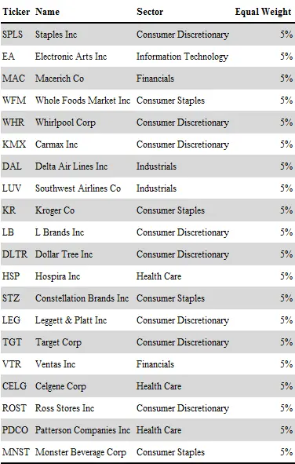
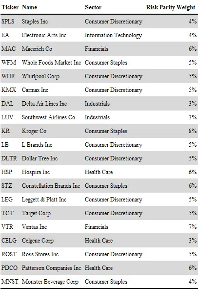
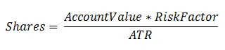
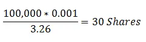
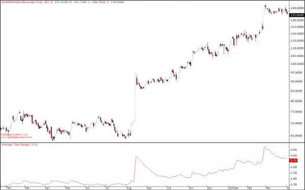
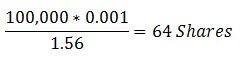

# 头寸规模

你已决定要买哪只股票。这是朝着正确方向迈出的一步。但现在你面临着一个非常重要但经常被忽视的决定。你的头寸规模（position sizing）以及它随时间的变化，可以造成天壤之别。

谈到头寸规模，你需要记住我们不是在分配资金。我们在分配风险。这是理解头寸规模的关键。所使用的现金数额不是一个关键因素。在处理股票这类现金工具时，这可能是限制因素，因为你要全额支付这些工具，而且杠杆成本很高。但就头寸规模而言，它并不是一个指导因素。

理解为什么用现金配置来思考是个坏主意非常重要。这是非常常见的错误，不仅绝大多数散户交易者和投资者会犯，大量基金和资产管理人也会犯。使用这些方法很有吸引力，因为它是如此简单。

经典方法是目标持有20只股票，每只买入5%。持有大约20只股票似乎是实现合理分散化的好数字，表面上这个主意似乎是个好计划。问题在于这给你的风险引入了一个随机变量，并使你的投资组合偏向波动性最大的股票。

如果你所有的股票波动性大致相同，那么这种等权重方法应该工作得很好。但在现实中不太可能是这种情况。有些股票每天涨跌0.5%，而另一些股票日平均波动超过2%。如果你将这样的股票组合在同一个投资组合中并分配相等的现金，你就让波动性大的股票主导了全局。投资组合的整体利润或收益将高度依赖于少数几只波动性大的股票，而波动性较小的股票的表现则不那么重要。

让我们做一个真实的动量股票组合，看看使用现金分配方法和风险分配方法时，构成会有何不同。下面的股票是截至撰写本文时标普500指数中的一些顶级动量表现者。等这本书出版时，当然已经非常过时了。在第一个版本中，我们使用老式的等额现金分配方法。我们每只股票花同样的钱，完全无视波动性。

表8.7 简单等权重投资组合

这看起来是一个均衡的投资组合，由知名公司组成，分散于多个行业。某些行业缺失有充分的理由。例如，自2014年中原油价格开始暴跌以来，能源行业一直表现糟糕。同样没有公用事业或电信股，这些行业已经失宠一段时间，材料行业也是如此。

注意这里的行业构成并非刻意设计。在这方面没有做出任何主观决定。投资组合只是通过在某个特定日子挑选顶级动量股构建的。

所选股票在当时构成了一个不错的动量组合。它们是基于有效的动量标准挑选的。但权重可以改进。其中一些股票比其他股票波动性大得多。如果我们给每只股票分配等额现金，我们将得到一个由这些波动性更大的股票主导的投资组合。在任何正常交易日，投资组合将主要受这些股票影响，而不是其他股票。通过分配等额名义权重，我们创建了一个非常不平衡的投资组合。

解决方案其实非常简单。这种方法通常被称为风险平价（risk parity）配置。通过审视每只股票的波动性，我们可以据此调整每只头寸的规模。其理念是买入较小规模的波动性股票，使每只股票对投资组合利润的潜在影响相等。

表8.8展示了考虑波动性后的权重。注意所有计算均基于撰写本文时的市场数据。因此当你阅读时数字已经过时了。

表8.8 风险平价规模投资组合

如你所见，基于风险平价的规模有相当多的变化。最小的股票只有3.1%的权重，而最大的为7.6%。这反映了西南航空（Southwest Airlines）比克罗格（Kroger）的波动性大得多。我们不想仅仅因为LUV倾向于波动更大就买入更多的风险。购买等额美元数量的这两只股票毫无意义，除非你真的想在航空公司上承担更大的风险。

对于股票动量等投资策略的头寸规模，具体的细节并不重要。不是说你买3.4%还是3.6%的Celgene。重要的是概念，以及大致正确的实施。如果你理解了为什么给所有股票分配等额现金是个坏主意的逻辑，那你就在解决头寸规模方面已经走了很长的路。一只股票中的一美元与另一只股票中的一美元风险不同，每只股票的正常波动性需要被考虑在内。

表8.8中使用的方法非常简单，任何人都可以实施。业内专业人士有更复杂的方法，但边际价值并不高。对于那些已经拥有昂贵工具的人来说，使用复杂方法很容易并且没有坏处。但风险平价规模的大部分好处可以通过这里的简单公式获得。

这个公式中的ATR代表平均真实波幅（Average True Range）。它是一个常用指标，衡量某个工具在平均每天倾向于波动多少，上涨或下跌。真实波幅（True Range）就是当日最高最低价之差或与前一日收盘价之差的最大值。因此ATR只是这些数值在若干天内的平均值。使用多少天取决于偏好和目的，并不特别重要。我在表8.8的计算中使用了20天。ATR可以很容易地计算，甚至在大多数金融软件中自动找到。

风险因子（Risk factor）是一个任意数字，设定了该股票的目标每日影响。如果你将这个数字设为0.001，那么你的目标是该股票对投资组合的每日影响为0.1%，即10个基点。当然，前提是ATR大致保持在近期的水平。

你设置的风险因子越低，股票的头寸规模就会越小。在构建股票投资组合的背景下，这意味着风险因子越低，你将获得的股票数量越多。这是因为我们会持续买入直到资金用尽，而风险因子越低，每只股票使用的现金就越少。

因此，降低风险因子会增加分散化。只需记住，在股票世界里，分散化只能帮你到一定程度。持有10只股票而不是5只有明显的分散化优势，但持有40只股票而不是30只是否有任何价值则值得怀疑。

让我们看一个如何使用这种方法计算头寸规模的例子——Monster Beverages。图8.21显示了该公司的价格图表，底部是20日ATR。如果我们要买入这只股票，可以使用最新的ATR读数进行头寸规模计算。最近读数为3.26，意味着这只股票在过去20天内的平均日波动区间为3.26美元。在普通日子里，这就是这只股票倾向于波动的幅度。一个合理的风险因子可能是10个基点，即0.1%。记住这是任意的，数字越高意味着股票数量越少但规模越大。

让我们进一步假设整个交易账户价值10万美元。那么我们应该买入多少股Monster呢？

这个公式中的分子是我们的目标每日影响。100,000乘以0.001等于100。这是这里的一个重要数字。我们通过这个公式想要实现的是，投资组合中的每只股票每天平均波动100美元，上涨或下跌。100美元是我们投资组合的10个基点，这就是我们希望每只股票每天对投资组合产生的影响。

图8.21 Monster Beverage，20日ATR

由于这只特定股票倾向于每天波动3.26美元的区间，我们需要将头寸的目标波动除以该股票的平均日波动。100除以3.26得到30.67。让我们向下取整，买入30股。

当前股价为118.93，因此买入30股将花费3,567.90美元。这意味着该头寸的投资组合权重为3,567.90除以100,000，即3.57%。

永远记住，在分配头寸规模时，我们是在分配风险而不是现金。我们审视股票的波动性，并据此设定规模。让现金配置顺其自然。

## 头寸再平衡

这是一个非常重要的话题。如果你来自机构世界，会觉得这显而易见，甚至不需要单独一节来说明。毕竟，这是大多数从业者像钟表一样定期做的事情。当然你需要再平衡（rebalancing），否则你会变得失衡。

但如果你没有在机构资产管理领域工作过，这可能是新鲜事，可能对你的长期结果产生重大影响。再平衡是关于如何随时间调整头寸规模。不，我不是说在成功时加倍或者在亏损时加倍下注。那些行为严格来说是赌博。再平衡是为了调整你的头寸规模，使其回到最初设定的水平。

还记得我在上一节中解释过，当你设定头寸规模时，你分配的是风险而不是现金吗？嗯，风险随时间变化。它不是一个非常静态的因素。

要真正理解再平衡，你必须首先全面理解基于波动性的头寸规模。虽然这个概念有不同的变体，我们将使用之前介绍的基于ATR的公式，因为它工作良好且非常容易实现，无需昂贵的风险工具。

但有一个明显的问题。太多人忽视了这一点。细心的读者应该已经在图8.21中发现了问题。你看到了吗？

明显的问题是波动性不是静止的。对于Monster Beverages来说，2014年大部分时间ATR在1.5美元左右波动，然后在8月突然大幅跳升至3.8美元。然后它回落到大约2美元，再慢慢上升到略高于3美元。

如果我们在2014年7月买入这只股票，我们会计算出与2015年初买入截然不同的规模。使用2014年7月的数据，相同的初始投资组合规模，我们会得到以下计算。

是的，如果我们在7月买入，我们会买入超过两倍的股票数量。初始理论风险大致相同。随着股价的波动，我们的头寸风险会发生相当剧烈的变化。如果我们将这些股票持有到2015年初，现在的风险水平将超过我们目标的两倍。我们将经历超过20个基点的平均每日影响，而我们原来的目标是10个基点。

此外，这个方程中还有一个非静态变量，即总投资组合价值。这不仅受到该头寸随时间表现的影响，还受到其他头寸表现的影响。再加上你可能为他人管理资金或自己增加或减少投资组合所带来的潜在资金流入和流出。

即使你的头寸没有任何变动，风险仍然可以改变。例如，如果投资组合中的其他头寸取得了巨大成功，获得了大幅收益，那么你的静态头寸的风险配置会突然变得比应有的低得多。投资组合价值因其他股票的表现而上涨，现在你所有的头寸规模计算都偏了。

当然，如果其他头寸遭受重大损失，情况也是如此。如你所见，头寸规模必须从动态的角度来看待。它不是一种"一劳永逸"的解决方案。

这一切意味着你的头寸规模需要定期审查和再平衡。你需要改变头寸规模以使其保持不变。为了让近似风险配置保持不变，你需要不断改变你持有的股票数量。

回到图8.21中的Monster图表，如果我们在7月买入股票，我们绝对需要在8月调整规模。在这种情况下，我们需要卖出相当多的股票。也许此时有人会问"让利润奔跑"的问题。毕竟，这是一个常见的说法，意味着你永远不应该卖出盈利的头寸。嗯，这些口头禅首先就没什么用。现实生活没有简单到可以用几句俏皮话概括。

在这里，我们让头寸继续持有，但允许风险配置毫无控制地失控，这既不合理也不负责任。专业人士进行再平衡是有原因的。

建议定期对所有头寸规模进行再平衡。对于股票动量投资组合等较长期投资策略，每两周或每月一次就足够好了。通常没有必要每天做，因为这会大大增加交易量和交易成本。

为了减少交易量，你可以设置一个过滤器，规定目标风险和当前风险之间需要有多大差异才能触发再平衡操作。这可以防止你在每个再平衡日进行过多的小额交易。

当股票出现异常波动时，你可能也想立即触发再平衡。以Monster Beverage为例，这种事件就是2014年8月中旬价格的戏剧性跳升，如图8.21所示。
