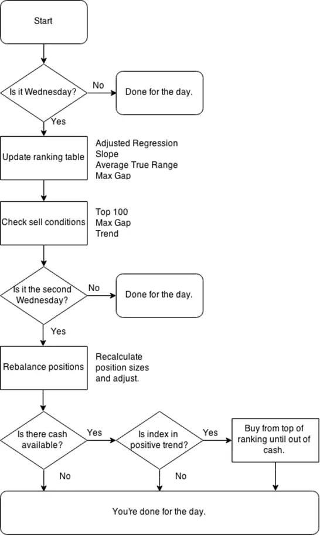

# 完整的动量交易策略

现在我们已经讨论了构建真实策略所需的各个模块，接下来可以制定一套坚实的规则了。拥有严格的交易规则具有巨大优势。你总是有一个明确的行动方案。你的决策永远不会基于随机性或当天的情绪。在市场动荡时，你有一个已知在过去行之有效的现成计划。

当你有一套坚实的规则时，就能更加放松。如果你知道自己的具体规则已经过测试和验证，并且在过去表现良好，那么对自己的交易方法就会更有信心。你不必每天盯着股票，也不必在压力下做决策。

使用前文介绍的各个模块，让我们创建一个完整的策略，包含精确的交易规则。一旦你有了确定的规则，既可以将其视为清单，在指定时间手动执行，也可以更进一步，将整个过程自动化。

有了这些规则，你当然也可以构建适当的模拟并进行回测。这将进一步增强你的信心，同时让你对表现有合理的预期。了解自己在好市场和坏市场中分别能期待什么样的收益特征，这很重要。

在我将在本章描述的策略中，我会使用一些具体的参数。我会使用特定的天数来计算波动率和动量，以及其他因素。但不要过分关注我选择的数字。一个坚实的交易策略对这些数字并不十分敏感。我在这里使用的数字是合理的，但其他数字也同样合理。概念才是关键。不要忽视这一点。如果这个策略只有使用这些精确参数才有效，那它就是无用的。我提供这些设置作为起点，但鼓励你尝试不同的数值。

## 具体交易规则

是的，我用了上面的标题来帮助那些直接跳到这里寻找交易规则的人。下面我将列出这些规则。

\* 仅在周三进行交易。

我们这里讨论的是一种跑赢股市的长期方法。这种策略的一部分就是避免行动过快。为了减少工作量和交易频率，我们每周只检查一次交易信号。即使某只股票一天内暴跌20%，只要不是我们预定交易的日子，我们就不做任何操作。注意，这并不意味着我们使用周度数据。所有计算仍然基于日度数据。我们只是不在非周三的日子交易。为什么偏偏是周三？因为周三是所有交易日中有20%概率是最佳交易日的那一天。是的，这完全是任意的。选一天就好，哪一天并不重要。

\* 基于波动率调整后的动量对所有股票进行排名。

对标普500指数中的所有股票基于动量进行排名。我们将使用过去90天计算得到的年化指数回归斜率（annualized exponential regression slope），然后乘以同期的决定系数（coefficient of determination, R²）。这样就得到了一个波动率调整后的动量度量。

记住，如果一只股票的价格低于其100日移动平均线，或者近期存在超过15%的跳空缺口，它就不合格。

\* 基于10个基点计算头寸规模。

使用基于ATR的简单公式计算头寸规模，目标每日波动为10个基点。计算股数的公式为：*账户价值 × 0.001 / ATR*~20~。

\* 检查指数过滤器。

只有当标普500指数高于其200日移动平均线时，才允许开立新头寸。如果指数低于该均线，不允许买入。

\* 构建初始投资组合。

从排名列表的顶部开始。如果第一只股票没有被其价格低于100日移动平均线或存在超过15%的跳空缺口所 disqualify，就买入它，然后继续下一个。从顶部开始买入，直到现金用尽。

\* 每周三进行投资组合再平衡。

每周检查一次是否有股票需要卖出。如果某只股票基于排名不再处于标普500股票的前20%，我们就卖出它。如果其价格低于100日移动平均线，我们就卖出。如果存在超过15%的跳空缺口，我们就卖出。如果它离开了指数，我们就卖出。

如果我们有可用现金，就寻找要买入的股票。如果有任何股票被卖出，自然就会释放出现金。买入替代股票遵循同样的逻辑。只有当指数处于正向趋势时才买入。从排名列表的顶部开始买入，要求排在前20%、具有正向趋势且没有大的跳空缺口。只要指数处于正向趋势，我们就不断从列表顶部买入新股票，直到现金再次用尽。

\* 每两周（第二个周三）进行头寸再平衡。

每月两次重置头寸规模。如前所述，长期策略需要纳入头寸规模再平衡，以避免最终风险完全随机化。逐一检查投资组合中的每个头寸，比较当前头寸规模与目标规模。目标规模的计算使用与初始建仓完全相同的公式，当然要使用更新后的投资组合规模和ATR。

如果差异很小，就没有必要为了再平衡而再平衡。这个流程的目的是确保头寸风险不会失控。如果存在任何显著偏差，就将头寸规模重置为目标规模。

好了，大致就是这些。嗯，让我们再回顾一下。

好的，你只需要每周检查一次市场。我完全随机地选定了周三，所以请不要给我发邮件询问是否有某种月相周期使周三是最佳交易日。选择你喜欢的任何一天都可以。

所以我们只在周三查看市场。每周我们首先检查是否需要卖出任何头寸。如果一个头寸不再合格，就卖出。然后，如果我们有可用现金，并且指数处于正向趋势，就买入股票。从排名列表的顶部开始买入，直到现金用尽。

每两周（第二个周三），我们还有一个额外任务。比较头寸目标规模与实际规模，并根据需要进行再平衡。

这是一个简单的清单，不是吗？当然，我们让它变得更简单。直接打印图10-22中的流程图即可。

图10-22 交易规则流程图
