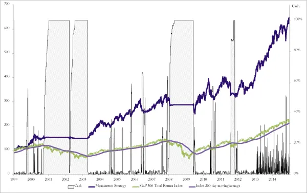
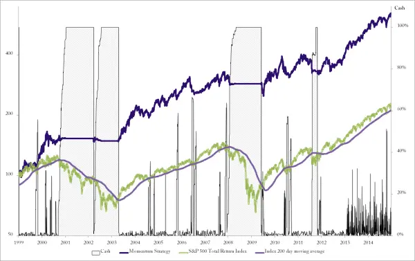
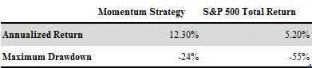
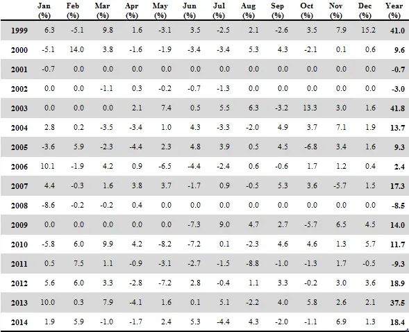

# 动量策略表现

现在我们有了一个完整的股票动量策略。到目前为止，我们已经研究了策略的各个组成部分，但还没有看到实际结果。在查看这种策略的历史表现之前，停下来想一想，什么是现实的预期。

这不是一个可以期待每年稳定10%收益的策略。很少有策略能做到这一点。这不是一个可以期待每年都为正收益的策略。而且，这当然也不是一个应该预期与股市保持无关的策略。毕竟我们买入的是股票。基于买入股票的策略长期来看往往非常相似。有的好些，有的差些，但它们会是相关的。

我们可以期望的，是在牛市中表现出强劲的收益，在熊市中比指数亏损更少。如果做到了这一点，长期来看我们将获得非常有吸引力的回报。

第一个问题自然是，我们是否跑赢了市场。如果我们赚了钱但没有跑赢指数，那么所有这些努力就没有意义。快速浏览一下图12-26应该能让你放心。

由于这是长期图表，百分比变动很大，标准价格图可能有些误导，容易给人以夸大的表现印象。因此，同一表现图的对数版本可以在图12-27中找到。

图12-26 策略长期表现

图12-27 策略长期表现（对数刻度）

我们确实跑赢了。甚至跑赢了不少。正如你从视觉上看到的，有两种不同类型的超额收益。有在牛市中表现强劲超额收益的时期。但在相对表现方面，更重要的影响来自于在市场下跌时根本不持有股票。

那么最终我们表现得如何呢？

表12-10 动量策略结果

如表12-10所示，该动量策略在这16年期间实现了超过12%的年化收益率。你觉得每年12%不够好？再想想。整个股市在这段期间仅实现了每年5%的收益。如果你投资了共同基金，收益会更低。

把收益放在正确的背景下来看。沃伦·巴菲特（Warren Buffett）在过去40年中以惊人的22%年化收益率取得了传奇地位。在这么长的时期内追求如此高的数字是不现实的。世界上能做到这一点的人极少，而且他们中的大多数现在已经是亿万富翁了。

如果你能长期实现低两位数的复利，你就已经超越了几乎所有人。整体股市长期平均每年仅提供5-6%的回报。

但最重要的是，我们以不到指数一半的回撤实现了12%的收益。回撤（drawdown）指的是在此期间观察到的最大亏损。标普500全收益指数的最大亏损为55%。超过一半的资本一度消失。而我们的动量策略最大亏损仅为24%。

另一种看待这些数字的方式是，指数亏损了相当于11年的收益，而动量策略仅亏损了2年。想象一下，如果你在最糟糕的时间点入场，需要多长时间才能收复亏损。

表12-11显示了动量策略的月度表现。仅通过月度收益表很难对策略有直观感受，因此在下一章中，我们将深入探讨所有细节，看看该策略每年的具体表现。

表12-11 核心股票动量策略表现

