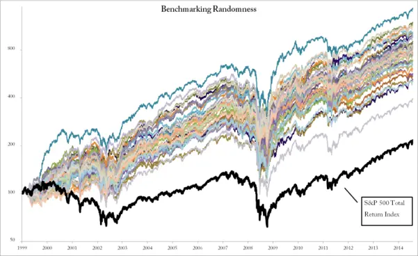
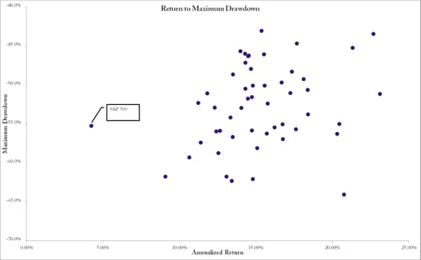

# 华尔街的随机暴击

如果你只想跑赢指数，你根本不需要这本书前面读到的任何内容。想学习如何打败世界上几乎所有的共同基金经理吗？是的，我即将分享这个秘密。

让我们首先将跑赢指数这件事放在背景中来看。有数千只共同基金（Mutual Fund）——确实有数千只。世界各地的银行都有自己的一系列共同基金，覆盖你所能找到的几乎任何指数。共同基金的理念是——或者至少曾经是——允许净资产有限的个人投资者参与广泛的股票市场。对于一个普通背景的个人来说，买入标普500指数中的全部500只股票很困难，但通过共同基金，他可以购买一只跟踪该指数并试图跑赢它的基金。

共同基金不能随心所欲地操作。它们有严格的跟踪误差（Tracking Error）预算，不允许大幅偏离指数构成。一年跑赢100个基点（Basis Points）——也就是一个百分点——被认为是极为强劲的表现。需要记住的是，共同基金是相对投资工具。它们的本职工作不是赚钱本身，而是试图跑赢基准。这是通过以非常相似的方式进行投资，并利用微小的跟踪误差预算来弥补共同基金所增加的额外成本层来实现的。

共同基金的任务不是展示绝对收益。如果其基准指数（Benchmark Index）以-10%结束一年，共同基金并不应该为正收益。如果该基金以-9.5%结束这一年，那么在其任务背景下，这就是一个成功的结果。一切关乎相对表现。

我们之前看到的是，几乎所有的共同基金在它们本该专注的唯一任务上都严重失败。

在任何一个3年周期中，通常有75-85%的共同基金表现不佳。如果你观察更长的周期，几乎没有任何基金能够哪怕与指数持平。那么，为什么共同基金经理无法跑赢标普500指数？根据Gordon Gekko的说法，因为他们都是羊，而羊会被宰杀。更可能的原因是他们被跟踪误差系统束缚住了手脚。他们需要保持配置与指数非常接近。对他们来说，一年落后几个百分点就是灾难。再加上他们需要支付巨额成本——管理费、托管费、交易费等。

如果你真的想要指数，当然有一个解决方案：买入ETF（交易所交易基金，Exchange Traded Fund）。如果你想获得与标普500指数完全相同的表现，减去少量费用，就买入SPY追踪器。它投资于与指数完全相同的股票，以完全相同的权重。当你买入追踪器时，计算机会自动按比例增加所有股票的持仓。你提前知道你将得到什么。你买入指数，你将获得指数。

但你真的想要指数吗？

## 标普500交易系统

标普500指数，连同所有其他市场指数，不过是一个交易系统（Trading System）。它有买入和卖出的规则。有每只股票买入多少的规则，甚至有关于再平衡的规则。标普500是一个持有期极长的超长期交易系统。股票在强劲表现将其市值推过某个门槛并满足某些其他标准后被买入。仓位规模基于市值，市值越高权重越大。

将标普500视为一个交易系统可能看起来很奇怪，但它确实如此。这也意味着我们应该能够像分析任何其他交易系统一样分析它。

如果你这样思考，指数看起来就不再那么有吸引力了。这是一个糟糕的交易系统。长期来看，你可以预期年化收益率为5-6%，同时要经历大量巨额亏损。有时甚至亏损一半的资金，需要数年才能恢复。

因此，即使你可以买入SPY指数追踪器并获得几乎与指数完全相同的表现，跑赢所有共同基金，它仍然不是一个非常有吸引力的投资。我们需要跑赢指数。

跑赢指数一定非常困难。毕竟，所有这些专业的共同基金经理年复一年地失败。他们是经验丰富的市场专业人士，拿着数百万美元的奖金。如果他们无法跑赢市场，这真的能做到吗？

哦，当然可以。

跑赢市场非常简单。超级简单。一个随机数生成器就能跑赢指数。

我是认真的。随机选股就能跑赢指数。而且是大胜。

让我们看看一些简单的模拟能告诉我们什么关于跑赢指数的事情。我们将构建随机投资组合，观察会发生什么。

在下面的模拟中，我们让计算机从标普500成分股中随机选股。在每个月初，我们清空整个投资组合并买入50只随机股票。仓位规模通过一个基础的风险平价模型来确定——也就是说，我们使用与前文所述相同的ATR模型，为每只股票分配大致相等的风险。我们不知道哪只股票会表现好、哪只会不好，所以没有必要为它们分配不同的风险。当然，更没有必要仅仅因为某家公司恰好更大就分配更高的风险。

由于这是一个随机方法，单次模拟运行当然没有太大意义。毕竟，如果你扔一次骰子，可能得到任何点数。我将这个简单的模拟模型运行了几百次，最终的结果相当一致。没有一次迭代未能跑赢指数。

图15-101 随机性基准测试

图15-101展示了50次模拟运行的代表性子集与总收益指数的对比。粗黑线是标普500总收益指数。为什么只展示50次运行的子集？嗯，即使50条线在图表中也有点混乱。如果有500条线，看起来就像是毕加索在药物作用下的某个时期的作品。

如果你仔细观察这张图，你会发现短期内什么都有可能发生。有些月份指数表现更好，有些月份随机策略表现更好。甚至在开始时有一段时期指数领先。但从长期来看，指数毫无胜算。

我不是在认真建议你每个月随机选股。但我认真主张，如果你这样做，你跑赢指数的概率很高。

需要记住的是，这种随机方法与本书大部分内容所解释的动量方法之间真正的区别。首先，我们努力确保我们选中的是图15-101中那些靠上曲线的股票。我们希望提高收益接近那些更优迭代的概率。其次，我们希望避免或至少减少回撤（Drawdown）。从概念上讲，这很简单。在实践中，并不总是那么简单。

真正的问题是，面对这种对华尔街的随机暴击，你真的还想买入指数产品吗？

图15-102 随机策略的胜利——收益与回撤
