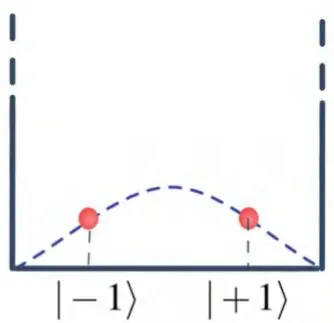
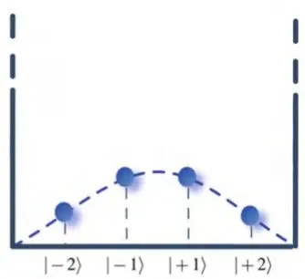
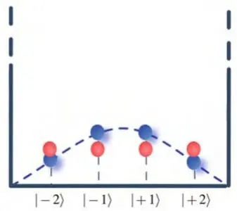
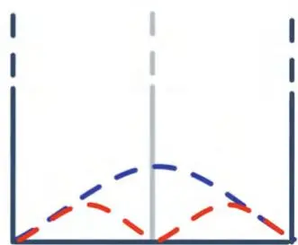
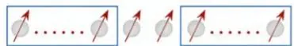
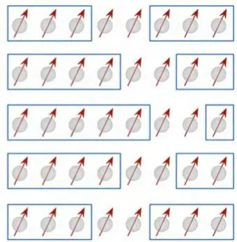

# 数值重整化群方法

Simone Montangero

本章中，我们将从数值角度介绍重整化群（renormalization group, RG）方法。尽管解析重整化群方法是研究不同现象的常规强大工具[23,136,137]，本文主要关注其在数值求解多体量子问题中的应用。为奠定基础，我们首先介绍多体量子问题的平均场处理，并将其应用于研究横向场中的量子伊辛模型。随后引入数值重整化群方法，最后回顾密度矩阵重整化群（density matrix renormalization group, DMRG）方法的原始形式，以强调其与标准重整化群的联系。

## 4.1 平均场理论

多体量子系统顾名思义由多个量子自由度组成。为简化起见，以下假设每个量子自由度都是局域的，且位于格点之上。典型例子是自旋链，但在许多不同场景中，例如光学晶格中的原子[96]，也可以从连续自由度出发推导出相同构造。系统波函数 $| \psi \rangle$ 位于 N 体希尔伯特空间 $\mathcal{H}_{N}$ 中，该空间由所有局部希尔伯特空间的张量积构成：$\mathcal{H}_{N} = \mathcal{H}_{1} \otimes \mathcal{H}_{1} \otimes . . . \mathcal{H}_{1}$。根据定义，波函数给出每个可能系统构型 $\vert \alpha_{1} \alpha_{2} \ldots . \alpha_{N} \rangle$ 的概率幅，其中指标 $\alpha_{i}$ 标记第 i 个格点的可能单体构型，$\{\alpha_{i} \}_{1}^{d}$ （例如，若系统由自旋1/2系统组成，则 $| \alpha_{1} \rangle = | \uparrow \rangle$，$| \alpha_{2} \rangle = | \uparrow \rangle$）。因此，一般态由 N 阶张量描述

$$
\left| \psi \right. = \sum_{\vec{\alpha}} \psi_{\alpha_{1} \alpha_{2} \dots \alpha_{N}} | \alpha_{1} \alpha_{2} \dots \alpha_{N} \rangle ,\tag{4.1}
$$

其中 $\vec{\alpha} = \alpha_{1} \alpha_{2} \ldots \alpha_{N}$，而 $\mathcal{P}_{\alpha_{1} \alpha_{2} . . . \alpha_{N}} = | \psi_{\alpha_{1} \alpha_{2} . . . \alpha_{N}} | ^{2}$ 给出系统处于构型 $\alpha_{1} \alpha_{2} \ldots \alpha_{N}$ 的概率。以下局部希尔伯特空间维度 d 也可以是局部希尔伯特空间截断的结果，例如在研究晶格中的玻色子时。尽管为简单起见我们假设整个晶格上局部希尔伯特空间维度 d 是均匀的，但它也可以是依赖于格点的。注意 N 阶张量 $\psi_{\alpha_{1} \alpha_{2} \dots \alpha_{N}}$ 的维度随系统大小呈指数增长。

平均场方法是一种非常强大的洞察多体量子系统物理性质的方法，它基于一个强近似[15]。在平均场近似中，我们假设量子关联可以被忽略，即多体波函数被约束为 N 个独立的单体波函数的乘积：

$$
\begin{array} {r l} & {| \psi^{\mathrm{MF}} \rangle = | \psi^{1} \rangle \otimes | \psi^{2} \rangle \otimes \dots \otimes | \psi^{N} \rangle =} \\ & {\qquad = \displaystyle \sum_{\alpha_{1} = 1}^{d} \psi_{\alpha_{1}}^{1} | \alpha_{1} \rangle \otimes \displaystyle \sum_{\alpha_{2} = 1}^{d} \psi_{\alpha_{2}}^{2} | \alpha_{2} \rangle \otimes \dots \otimes \displaystyle \sum_{\alpha_{N} = 1}^{d} \psi_{\alpha_{N}}^{N} | \alpha_{N} \rangle .} \end{array}\tag{4.2}
$$

---

(4.3)

因此，研究对象已从指数级复杂度简化为关于格点数目N的线性问题。另一个附加假设（尽管并非严格必要）可进一步简化：施加平移不变性——所有$| \psi^{j} \rangle$都相等——将原问题转化为与系统尺寸N无关的问题。事实上，原始问题中的自由参数个数为$d^{\bar{N}}$，平均场情形下为Nd，而平移不变情形下仅为d。因此，在平均场近似下，即便对极复杂的问题也能存在高效算法甚至解析解也就不足为奇了。然而，这种强有力方法的缺点在于，式(4.3)的引入通常缺乏正当性且不可控。确实，平均场近似总是需要独立的验证——要么通过与实验结果的比较，要么通过其他手段。尽管如此，只要量子关联不起主要作用，平均场方法就能非常有效，并且正如我们将在后续章节中看到的，它可以提供对系统物理的深刻洞察，并作为进一步精细化分析的指导和起点。

### 4.1.1 横向场量子伊辛模型

我们以一个典范模型——横向场量子伊辛模型——为例来阐述平均场方法。量子伊辛模型是最简单的非平凡多体量子系统之一，并且在我们理解物质关联态方面一直并将继续发挥基础性作用[97, 137]。正如我们将在本书最后部分详细展示的那样，该模型对我们理解平衡态与非平衡态的临界现象至关重要，并且是任何旨在成为有竞争力的数值方法的首个测试平台。该模型存在一种解析解——通过Jordan-Wigner变换映射到自由费米子——这可以对任何为数值研究关联多体量子系统而开发的软件进行精确基准测试[97, 138–140]。该模型的哈密顿量为

$$
\mathcal{H}^{\mathrm{I}} = \sum_{i = 1}^{N - 1} H_{i , i + 1} = - \sum_{i = 1}^{N - 1} \sigma_{i}^{x} \sigma_{i + 1}^{x} + \lambda \sum_{i = 1}^{N} \sigma_{i}^{z} ;\tag{4.4}
$$

其中σ为泡利矩阵，表示在强度为λ的外场作用下由N个相互作用的自旋$1/2$组成的线性链。对该模型的平均场分析始于式(4.3)的定义，其中

$$
\left| {\psi^{\mathrm{MF}}} \right. = \otimes_{i = 1}^{N} \left| \psi^{1} \right. = \otimes_{i = 1}^{N} \sum_{\alpha_{i} = 1}^{d} A_{\alpha_{i}} \left| \alpha_{i} \right. ;\tag{4.5}
$$

对于自旋$1/2$，显然有$\alpha_{i} = \uparrow , \downarrow = 1 , 2$且$d = 2$。在式(4.5)的假设下，系统能量的计算可轻易完成：

$$
E^{\mathrm{MF}} = \langle \psi^{\mathrm{MF}} | \mathcal{H}^{\boldsymbol{I}} | \psi^{\mathrm{MF}} \rangle = - \sum_{i = 1}^{N - 1} \left( \langle \psi^{1} | \sigma_{i}^{x} | \psi^{1} \rangle \right)^{2} + \lambda \sum_{i = 1}^{N} \langle \psi^{1} | \sigma_{i}^{z} | \psi^{1} \rangle .\tag{4.6}
$$

上述量是广延量，因此在热力学极限下发散，而能量密度$e = E / N$是强度量，其在$N$趋近于无穷时的极限可被计算并由下式给出：

$$
e = - \left( {\left. {\psi^{1}} \middle | {\sigma_{i}^{x}} \middle | {\psi^{1}} \right.} \right)^{2} + \lambda{\left. {\psi^{1}} \middle | {\sigma_{i}^{z}} \middle | {\psi^{1}} \right.} \equiv - r_{x}^{2} + \lambda r_{z} ,\tag{4.7}
$$

其中 $r_{x}$ 和 $r_{z}$ 是布洛赫球（Bloch sphere）中两能级系统的参数化。上述能量密度表达式是变量 $r_{x}, r_{z}$ 的函数，通过最小化该函数，可在平均场近似下计算出伊辛模型在热力学极限下的基态能量密度。这一最小化过程可解析完成（尽管更复杂的模型可能需要数值最小化，可用你偏好的方法实现 [122]）：波函数归一化施加了额外约束 $r_{x}^{2} + r_{y}^{2} = 1$，从而得到关于外磁场 λ 的表达式

$$
\left\{\begin{array} {l l} {e = - 1 - \lambda^{2} / 4 \qquad} & {\lambda \in [ - 2 : 2 ]} \\ {e = - | \lambda | \qquad} & {\lambda \notin [ - 2 : 2 ] .} \end{array} \right.\tag{4.8}
$$

上述表达式并非精确解；然而，它捕捉到了系统的物理本质，体现在它指出了两个特殊点 $\lambda = -2, 2$，在这些点上能量密度的二阶导数变得不连续：正如我们将在[第10章](ch10.md)中看到的，这标志着量子相变（quantum phase transition）的存在。量子相变确实存在；但平均场分析无法计算精确的相变点，也无法正确描述相变点处出现的关联。事实上，从构造上看，任意两个作用于不同自旋的观测量 $\hat{O}_{i}$ 和 $\hat{O}_{j}$ 之间的关联函数 $C_{i,j}$ 的计算结果将严格为零：

$$
C_{i , j} \equiv \langle \hat{O}_{i} - \langle \hat{O}_{i} \rangle \rangle \langle \hat{O}_{j} - \langle \hat{O}_{j} \rangle \rangle = \langle \hat{O}_{i} \hat{O}_{j} \rangle - \langle \hat{O}_{i} \rangle \langle \hat{O}_{j} \rangle \Rightarrow\tag{4.9}
$$

$$
C_{i , j}^{\mathrm{MF}} = \left. \psi^{1} \right| \hat{O}_{i} \left| \psi^{1} \right. \left. \psi^{1} \right| \hat{O}_{j} \left| \psi^{1} \right. - \left. \psi^{1} \right| \hat{O}_{i} \left| \psi^{1} \right. \left. \psi^{1} \right| \hat{O}_{j} \left| \psi^{1} \right. = 0 .\tag{4.10}
$$

总之，平均场分析是理解系统物理本质的基础：每当量子关联起主导作用时，平均场结果就会失效，无法正确描述系统，这时就需要更先进、更复杂的工具，我们将在后续章节中介绍。

### 4.1.2 团簇平均场（Cluster Mean Field）

对平均场假设的一种初步修正是团簇平均场。事实上，当有物理依据表明系统基态以短程关联为特征时，可以对式(4.5)的平

均场假设进行推广以包含这些关联，从而大幅提高结果的精度。一种简单的方法是对包含M个格点的团簇写出平均场假设，即

$$
\left| \psi_{\alpha_{1} \alpha_{2} \dots \alpha_{N}}^{\mathrm{MF}} \right. = \prod_{i = 1}^{N / M} \left| \psi_{i}^{M} \right. = \prod_{i = 1}^{N / M} \sum_{\beta_{i} = 1}^{d^{M}} A_{\beta_{i}} \left| \beta_{i} \right. ;\tag{4.11}
$$

其中索引 $\beta_{i}$ 遍历每个团簇的所有可能状态。与上一节类似，基于这个假设，可以找到所研究系统基态的团簇平均场描述。这种分析也有助于检验平均场分析结果的可靠性：通过增大团簇尺寸并比较结果，可以估计误差，在某些情况下还可以将结果外推到精确情况（M → N）。显然，式(4.11)中状态数的指数依赖使得这种方法效率低下，因为增大团簇尺寸的代价是指数级的。不过，一个简单的例子可能有助于理解团簇平均场明显优于平均场描述的场景。考虑哈密顿量

$$
H_{X Y}^{D} = \sum_{\left. i , j \right.} h_{i , j} \left( \sigma_{i}^{x} \sigma_{j}^{x} + \sigma_{i}^{y} \sigma_{j}^{y} \right) ,\tag{4.12}
$$

其中 $\langle i , j \rangle$ 定义了图（例如二维正方晶格）的一个不交覆盖。我们完全可以精确求解这个问题，独立地对每两个格点哈密顿量进行对角化：结果是，相互作用的一对格点会形成一个贝尔态（最大纠缠态）。对该问题的平均场处理将得到上一节所述的描述，完全忽略系统基态中存在的关联。相反，用 $M = 2$ 进行的团簇平均场展开则会得到精确解。超越这个简单场景，现在应该清楚，团簇平均场描述恰好包含了 M 体纠缠，而忽略了团簇大小 M 之外的纠缠。总之，当 M 约化密度矩阵为纯态时，M-团簇平均场给出精确结果。反之，它仅提供一个近似描述，其精度随 M 增加而非递减，而计算代价随 M 呈指数增长。我们将在后面几节中看到，如何明确这种约化密度矩阵的纯度（即非零布居数的数量）与纠缠之间的内在联系，并利用它来构建超越平均场的强大近似方法。

## 4.2 实空间重正化群

实空间重正化群方法是一种基于非常强大的物理直觉[23]的近似方法：其假设系统的基态由系统（无相互作用）二分的低能态构成。基于这个假设，确实可以引入一种算法，用于描述大尺寸 N 的多体量子系统的基态性质，直到对应重正化流不动点的热力学极限[141]。

该算法步骤如下：

0. 考虑一个由 N 个格点组成的系统，可以通过精确数值方法研究。构建哈密顿量 $\mathcal{H}_{N} : \mathbb{C}^{d^{N}} \to \mathbb{C}^{d^{N}}$。
1. 对角化 $\mathcal{H}_{N}$，找到其本征值和本征矢 $\begin{array} {r} {\mathcal{H}_{N} = \sum_{i = 1}^{d^{N}} E_{i} | E_{i} \rangle} \end{array}$ $\langle E_{i} |$，其中本征值 $E_{i}$ 按递增顺序排列。考虑投影到最低的 m 个本征态的投影算子 $\begin{array} {r} {P = \sum_{i = 1}^{m} | E_{i} \rangle \langle E_{i} |} \end{array}$，它将希尔伯特空间投影到由前 m 个低能本征态张成的子空间上。计算投影后的哈密顿量 $\mathcal{\tilde{H}}_{N} = P^{\dagger} \mathcal{H}_{N} P$ 以及投影空间中任何其他所需算子的表示，即 $\tilde{O} = P^{\dagger} O P$。
2. 使用每个二分块的投影哈密顿量 $\tilde{\mathcal{H}}_{N}$ 以及它们之间的相互作用，构建大小为 2N 的系统的哈密顿量 $\mathcal{H}_{2 N} = \tilde{\mathcal{H}}_{N} \otimes \mathbb{1} +$ $\mathbb{1} \otimes \tilde{\mathcal{H}}_{N} + \tilde{H}_{\mathrm{i} n t}$。相互作用哈密顿量可得为 $\tilde{H}_{\mathrm{i} n t} = \tilde{A}_{N} \otimes \tilde{B}_{N}$，其中 $\tilde{A} \ ( \tilde{B} )$ 是作用在每个系统二分块上的投影算子 ${\tilde{A}} =$ $P^{\dag} A P \ ( \tilde{B} = P^{\dag} B P )$。
3. 重复步骤 1–2，直到达到所需的系统尺寸或收敛到重正化群不动点。注意，在算法的每一步，描述系统的尺寸加倍 $( N \to 2 N )$，而哈密顿量表示的维度保持为常数 m。

在过去的四十年里，这个优雅而强大的想法引发了大量的理论和数值工作，极大地增强了我们对多体量子系统的理解[136, 137, 142]。然而，其基本假设并不总是成立，实际上，有一些重要的物理系统类别恰恰违反了它。下面，我们将回顾其中一个例子，以详细展示该算法，并突出说明发展另一种克服了该问题的强大算法的直觉，即下一节将介绍的密度矩阵重正化群方法[27]。

我们考虑的问题是量子力学中最简单的问题之一，即在由式(3.24)给出的无限深方势阱中的自由粒子：在有限区间$[a : b]$内$V ( x ) = 0$，而区间外$V ( x )$为无穷大（为简化记号，设$h = 1$）。在此例中，标度量并非粒子数目，而是用于离散空间的格点数目。因此，第一步我们设$N = 2$（两个离散位置，以任意单位记为1, 1），并写出相应的哈密顿量

$$
\begin{array} {r} {\mathcal{H}_{2} = \left( \begin{array} {l l} {2} & {- 1} \\ {- 1} & {2} \end{array} \right) .} \end{array}\tag{4.13}
$$

上述哈密顿量可轻易对角化，得到本征值$E_{1 , 2} = 1 , 3$，基态为$\vert E_{1} \rangle^{N = 2} = ( \vert - 1 \rangle + \vert 1 \rangle ) / \sqrt{2}$。如图4.1a所示，这一简单结果与前述最小离散化假设下无限深方势阱的已知解一致[143]。按照上述算法的第一步，我们现在投影掉系统的高能级。然而，由于仅有能级，对于这第一步，我们保留所有能级，设$m = 2$，从而$P = \mathbb{1}$。接着进入算法第二步，构建$N = 4$系统的哈密顿量，即

$$
\mathcal{H}_{4} = \left( \begin{array} {c c c c} {{2}} & {{- 1}} & {{0}} & {{0}} \\ {{- 1}} & {{2}} & {{- 1}} & {{0}} \\ {{0}} & {{- 1}} & {{2}} & {{- 1}} \\ {{0}} & {{0}} & {{- 1}} & {{2}} \end{array} \right) .\tag{4.14}
$$

a)

b)

c)

d)

图4.1 无限方势阱（黑色线）及其解（蓝色虚线）的示意图。(a) 由两个态（红色圆点）构成的最小表示中粒子在势阱内的概率离散振幅；(b) 由四个态（蓝色圆点）构成的双倍尺寸势阱。(c) $\scriptstyle \vert E_{1} \rangle^{N = 4}$（蓝色圆点）与 $| E_{1} \rangle^{N = 2} \otimes | E_{1} \rangle^{N = 2}$（红色圆点）的比较。(d) 大N极限下的解 $| E_{1} \rangle^{2 N}$（蓝色虚线）和 $| E_{1} \rangle^{N} \otimes | E_{1} \rangle^{N}$（红色虚线）

由于先前保留了所有态 $( m = 2 )$，该哈密顿量仍然是精确的。哈密顿量(4.14)的基态是 $| E_{1} \rangle^{N = 4} = ( b | {-} 2 \rangle + a | {-} 1 \rangle +$ $a | 1 \rangle + b | 2 \rangle )$ )，其中 $a \sim 0.3717 , b \sim 0.6015$（图4.1b示意），第一激发态是 $| E_{2} \rangle^{N = 4} = ( - a | - 2 \rangle + - b | - 1 \rangle + b | 1 \rangle + a | 2 \rangle )$。我们再次保留 $m = 2$ 个态，利用投影子 $P = | E_{1} \rangle \langle E_{1} | + | E_{2} \rangle \langle E_{2} |$，构造仅包含 $m = 2$ 个态时描述 $N = 4$ 系统低能物理的有效哈密顿量。我们还在新的截断基中更新所有相关算子，并重复该过程，从而得到双倍尺寸系统的基态，并最终达到热力学极限。尽管每步仅保留两个态 $( m = 2 )$ 是一种极端近似，但该过程是正确的，它将给出系统性质的近似描述。增加保留态数量 m 可改善近似程度。然而，对于这个具体例子，RG 赖以成立的前提被违反，因此其表现非常糟糕。实际上，$N = 4$ 情况下的基态几乎完全由两个大小为 $N = 2$ 的基态的张量积组成，如图4.1c所示，且可通过计算两个态的重叠来验证：$ E_{1}^{\check{N = 4}} | E_{1}^{\check{N = 2}} \otimes E_{1}^{\check{N = 2}} \sim 0.97$。然而，该重叠随 N 迅速减小：在大 N 极限下，大小为 2N 的系统的基态与两个大小为 N 的基态的张量积截然不同（见图4.1d）：尤其是后者在节点处恰好是前者的最大值所在。更糟的是，大小为 N 的系统的所有本征值的可能组合在中间都有一个节点，因此要得到 $| E_{1} \rangle^{2 N}$，需要大量高能本征态 $| E_{i} \rangle^{N}$ 的组合，这否定了 RG 的基本假设。然而，这个反例的价值在于指出了硬边界条件可能带来严重问题，并最终促成了下一节介绍的 DMRG 的发展[27]。

## 4.3 密度矩阵重正化群

DMRG 是对原始 RG 算法的一种有力改进，其截断规则得到了改进，从而能够以系统规模增长放缓为代价，对最终状态实现更高精度的描述。实际上，在 DMRG 算法中，系统规模随迭代次数线性增长，而非指数增长。用于描述热力学极限下具有最近邻相互作用的系统的原始算法（无限 DMRG）由以下步骤组成：

1. 考虑能以合理资源精确对角化的最大系统规模 N，并将 N 个格点重新分组为中间的两个单格点，以及两个每组有 M 个格点的组，如图4.2a所示（这种分组的原因将在后面清晰）。系统的哈密顿量可写为 $\mathcal{H}_{N} =$ $\mathcal{H}_{L + 1} + \mathcal{H}_{i n t} + \mathcal{H}_{R + 1}$，其中 $\mathcal{H}_{L + 1}$ 和 $\mathcal{H}_{R + 1}$ 在文献中分别称为左扩展块和右扩展块，$\mathcal{H}_{i n t}$ 是它们之间的相互作用。

a)
c)

b)

图4.2 (a) 无限DMRG算法第一步示意图：左（右）块与两个自由位点构成系统哈密顿量。(b) 一个包含2M+2个位点的系统用维度为md的有效哈密顿量表示。(c) 有限DMRG算法半扫描的图形化表示：每次迭代中，一个块包含的位点数增加一个，另一个块减少一个。

系统希尔伯特空间的维度为 $(dm)^{2}$，其中 d 是单位点物理维度，$m = d^{M}$ 是M个成组位点的维度。对 $\mathcal{H}_{N}$ 进行对角化，返回用基矢表示的基本状态

$$
\left| E_{1}^{N} \right. = \sum \psi_{\beta_{1} \beta_{2}} | \beta_{1} \rangle | \beta_{2} \rangle
$$

其中 $| \beta_{i} \rangle$ 张成左、右半位点的基矢，$\beta_{i} = 1 , \ldots , d^{M + 1}$。2. 计算基态的密度矩阵

$$
\rho_{1}^{N} = \big | E_{1}^{N} \big \rangle \big \langle E_{1}^{N} \big | = \sum_{\beta_{1} , \beta_{2}} \sum_{\beta_{1}^{\prime} , \beta_{2}^{\prime}} \psi_{\beta_{1} , \beta_{2}} \psi_{\beta_{1}^{\prime} , \beta_{2}^{\prime}}^{*} | \beta_{1} \rangle | \beta_{2} \rangle \langle \beta_{1}^{\prime} | \langle \beta_{2}^{\prime} | ,\tag{4.15}
$$

以及系统一半的约化密度矩阵

$$
\rho_{L} = \mathrm{Tr}_{R} \rho_{1}^{N} = \left( \sum_{\beta_{2}} \psi_{\beta_{1} , \beta_{2}} \psi_{\beta_{1}^{\prime} , \beta_{2}}^{*} \right) | \beta_{1} \rangle \langle \beta_{1}^{\prime} | .\tag{4.16}
$$

3. 对角化 $\begin{array} {r} {\rho_{L} ~ = ~ \sum_{i = 1}^{m d} w_{i} | w_{i} \rangle \langle w_{i} |} \end{array}$ 并按降序排列本征值 $w_{i}$（由于 $\rho_{L}$ 是密度矩阵，这些本征值是非负实数，且满足 $\sum w_{i} = 1$）。如果我们假设系统是左右对称的，那么也有 $\rho_{L} = \rho_{R}$。定义投影子 $\begin{array} {r} {P = \sum_{i = 1}^{m} | w_{i} \rangle \langle w_{i} |} \end{array}$，它仅由 $\rho_{L}$ 的前 m 个本征矢组成。

4. 投影子 P 定义了将希尔伯特空间从 md 个态截断为 m 个态，可用来计算系统的有效哈密顿量以及约化空间中的所有必要算子，即 $\tilde{\mathcal{H}}_{L + 1} ~ = ~ P^{\dagger} \mathcal{H}_{L + 1} \bar{P}$。考虑到 $\begin{array} {r} {\mathcal{H}_{i n t} = \sum_{k} c_{k} A_{L}^{k} \otimes B_{R}^{k}} \end{array}$（其中 $A_{L}^{k}$ 和 $B_{R}^{k}$ 分别作用于左、右扩大块），投影空间中的相互作用项可以通过分别对左右两边应用投影子 P 来计算。这样，我们得到一个大小为 m（而非 md）的有效矩阵，用来描述 N 个格点的哈密顿量。

5. 从第 1 步开始重复该算法，但将左右块的哈密顿量替换为前一步计算得到的有效哈密顿量。最终效果是，我们可以用大小为 $( m d )^{2}$ 的哈密顿量描述一个 $N + 2$ 个格点的系统，如图 4.2b 所示。每执行一步，描述的系统大小增加两个格点，同时计算资源保持不变。

上述算法构成了 DMRG 方法的核心，它与重整化群方法的主要区别在于截断规则：事实上，选择保留约化密度矩阵中占据数更高的态，被证明等同于在可用资源下获得系统的最佳近似描述（从可观测量和关联的角度来看）。事实上，DMRG 的截断规则优化了截断波函数与精确系统波函数之间的重叠 [144, 145]。例如，对大小为 N 的系统，计算作用于格点 i（属于左扩大块，且通常任意仅作用于左块的可观测量的计算）的局域可观测量的精确波函数为

$$
\langle \hat{O}_{i} \rangle = \langle \psi | \hat{O}_{i} | \psi \rangle = \operatorname{Tr} \{\rho_{L} \} \hat{O}_{i} = \sum_{i = 1}^{m d} w_{i} \langle w_{i} | \hat{O}_{i} | w_{i} \rangle .\tag{4.17}
$$

截断步骤后的期望值为 $\begin{array} {r} {\langle \hat{O}_{i} \rangle_{\mathrm{AP}} = \sum_{i = 1}^{m} w_{i} \langle w_{i} | \hat{O}_{i} | w_{i} \rangle} \end{array}$，因此差值满足 $| \langle \hat{O}_{i} \rangle - \langle \hat{O}_{i} \rangle_{\mathrm{AP}} | \leq \epsilon \cdot C$，其中 $C$ 是依赖于观测量的常数，而 $\textstyle \epsilon = ( 1 - \sum_{i = 1}^{m} w_{i} )$ 是随 $m$ 非增的函数。显然，在该基下，给定约化密度矩阵布居数（populations）的降序排列，任何其他截断选择都会导致更大的误差。特别地，当对某个 $i > K$ 时矩阵布居数恰好为零（即 $K$ 是密度矩阵的施密特秩），则在计算期望值时，若 $m \geq K$，截断不会引入误差。这种情况的一个特殊场景再次出现在精确系统波函数为平均场时，即 $K = 1$，因此 $m = 1$ 就足以精确描述系统性质。不过至此应当清楚，DMRG 可以超越这一点，只要 $m \geq K$，它也能精确描述平均场以外的系统。可以证明，要求优化描述系统中存在的纠缠（以冯·诺依曼熵 $\begin{array} {r} {S = \sum_{i} w_{i} \log w_{i} )} \end{array}$ 量化）恰好得到 DMRG 截断规则 [144]。

以上考虑等价于说明，在给定可用资源（$m$ 个态）的条件下，无穷 DMRG 算法得到的是系统一半约化密度矩阵的最佳可能近似。然而，这种优化只涉及系统在两个相等子系统上的二分：如果我们能优化系统所有可能二分的约化密度矩阵，则可能获得全局多体态的更好近似。这一精炼过程由有限 DMRG 算法提供，其目标是精炼一个由 $N$ 个格点组成的系统的表示。算法定义如下：

1. 使用无穷 DMRG 算法构建由 $N = 2 M + 2$ 个格点组成的系统的表示。每一步存储哈密顿量（及算子）的截断表示 $\tilde{\mathcal{H}}_{j}$，其中 $j = 1 , \dots , M$。

2. 开始新一轮 DMRG 迭代，在构建新系统哈密顿量时注意保持系统大小固定为 $N$。即 $\mathcal{H}_{L} = \mathcal{H}_{M + 2} + \mathcal{H}_{\mathrm{int}} + \mathcal{H}_{M}$。注意左右增广块现在不同，代表不同数量的格点。获得哈密顿量的截断表示 $\tilde{\mathcal{H}}_{M + 2}$。

3. 继续迭代，增加左块的大小并减小右块的大小，保持 $N$ 不变。当到达边界时，反转过程，并左右块角色互换地继续迭代，如图 4.2c 所示。每一步迭代中，系统能量应下降，而波函数表示的精度应提高。当自由格点第二次处于中间位置时，就完成了一次 DMRG 扫描（sweep）：额外的扫描将带来更高的精度和改进的收敛性。

所描述的算法可以直接推广到更一般的场景，例如具有空间依赖参数的哈密顿量，或超出最近邻相互作用的情况（将物理格点重新组合成更大尺寸的逻辑格点，尽管这一过程效率低下，因此始终限于短程相互作用）。最后，注意无穷 DMRG 算法的第 1 步可以修改为从四个格点 $( M = 1 )$ 开始，并在不进行截断的情况下增加系统大小，直至 $d^{M} \leq m$。在 [146] 中可以找到 DMRG 算法的一个逐步清晰且富有启发性的示例。

## 4.4 习题

1. 给定一维晶格上具有最近邻相互作用的一般形式哈密顿量

$$
H = \sum_{i , \alpha} h_{i}^{\alpha} + \sum_{i , \alpha} \lambda_{\alpha} h_{i}^{\alpha} h_{i + 1}^{\alpha}
$$

其中 $i = 1 , \dots N$ 遍历晶格格点，$\alpha$ 遍历不同算子；考虑平均场平移不变假设（mean field translational invariant ansatz）

$$
| \psi_{M F} \rangle = | \phi \rangle | \phi \rangle | \phi \rangle \ldots | \phi \rangle
$$

---

1. 计算基态能量每格点的平均场通用近似，并将其应用于不同 $\lambda$ 值下的横向场量子伊辛哈密顿量方程 (4.4)。

2. 使用 $| \psi_{M F} \rangle$ 和交错平均场 ansatz 计算反铁磁海森堡模型的基态能量平均场近似：
$$
H = \sum_{i} \sigma_{i}^{x} \sigma_{i + 1}^{x} + \sigma_{i}^{y} \sigma_{i + 1}^{y} + \sigma_{i}^{z} \sigma_{i + 1}^{z}
$$
其中 $| \psi_{M F D} \rangle = | \phi_{1} \rangle | \phi_{2} \rangle \dots | \phi_{1} \rangle | \phi_{2} \rangle$。

3. 给定方程 (4.4) 中一维晶格上具有最近邻相互作用的横向场量子伊辛哈密顿量：
(a) 通过实空间 RG 计算基态能量作为横向场 $\lambda$ 的函数。
(b) 通过无限 DMRG 算法计算基态能量作为 $\lambda$ 的函数。
(c) 比较两者得到的基态能量密度，并与平均场解进行比较。
