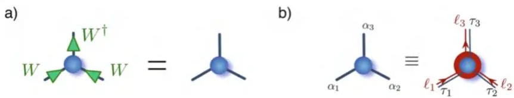
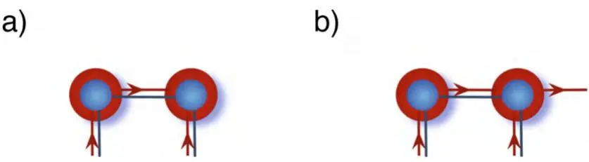
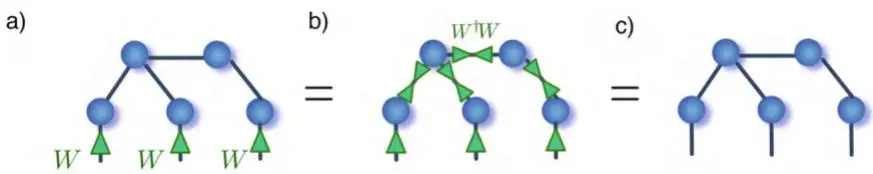
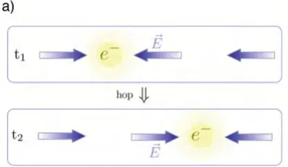
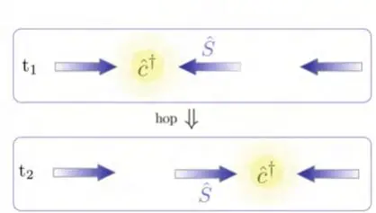
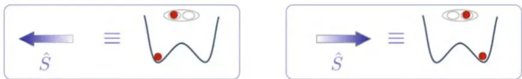
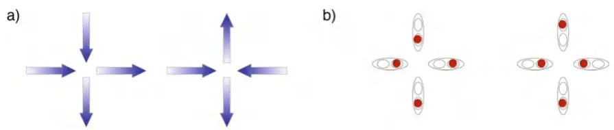

# 对称张量网络

Simone Montangero

众所周知，对称性在物理学中扮演着基础性角色：其数学描述已被广泛应用于物理学的许多分支，用以理解所关注系统的主要性质、简化其描述，并提升描述这些系统的数值代码的计算性能。在量子力学中，任何物理学家都熟悉的最直接利用对称性的场景，是描述一个在给定变换 g 下不变的哈密顿量的系统。基础量子力学表明，该哈密顿量是简并的（即存在不同的本征态具有相同的能量，这些本征态在该变换作用下表现不同），并且生成该变换的哈密顿量与算子 g 可对易，且能同时被对角化 [135]。也就是说，系统的本征态可以根据一组多重指标进行标记，这些指标唯一地标识每个系统的本征态：典型例子是具有球对称性（例如氢原子）的任何系统的本征态，其本征态可通过三个指标 n、l、m 标记；第一个指标标识能级，另外两个分别标识系统的角动量及其在量子化轴上的投影，从而对应相应的球谐函数 [135]。最后，诺特定理指出，一个在给定连续变换下不变的系统具有一个守恒的连续量 [263, 264]。

在多体物理学中，对称性与系统空间延展所引入的额外自由度相结合。实际上，对称性可能表现为全局对称性（将整个系统视为单一整体，例如反射对称性、平移不变性等）、全局点状对称性（一种全局对称性，表现为在局部可观测量组合作用下的不变性，如全局磁化强度、总电荷或自旋绕自身轴的旋转）以及规范对称性（独立的局部对称性，如高斯定律）。接下来，我们将展示如何利用对称性来提升张量网络算法的性能，并处理特定的对称扇区。

在本章中，我们首先回顾群论（group theory）的最重要元素——对称性的数学描述以及对称张量网络（symmetric tensor network）构建的理论基础。然后，我们向读者介绍对称全局点状和规范不变的张量网络。本章旨在作为该主题的入门介绍，尽可能隐藏技术细节：对对称张量网络的技术细节及实现感兴趣的读者，请参阅本章主要依据的参考文献 [32,59,79]。

## 6.1 群论基础

本章引言中提到的论断，可以从群的数学定义出发引出：群 $\mathcal{G}$ 是一个元素集合 $g_{i}$，配以乘法运算（集合中任意两个元素之间的组合规则），满足以下条件：(1) 对乘法封闭，(2) 满足结合律，(3) 集合中存在单位元，(4) 群中每个元素都在集合中存在逆元。若乘法交换，则称该群为阿贝尔群（Abelian group），否则为非阿贝尔群（non-Abelian group）。群可以简单到只含单位元（只由一个元素——单位元——组成），也可以包含无穷多个元素。群中元素的个数称为群的阶（order）。从上述非常抽象的定义出发，可以建立群乘法表（group-multiplication table），列出群元素所有可能乘法的结果。乘法表唯一刻画了群：拥有相同乘法表的两个群称为同构的（isomorphic），即群中的元素之间存在唯一的一一对应。稍后我们需要用到的一个更一般的群间性质是同态（homomorphism）：两个群称为同态的（homomorphic），如果它们之间存在一对多的对应关系，即对于第一个群的每个元素 $A_{i}^{1}$，可以关联第二个群中的一个元素集合 $\{A_{i^{\prime}}^{2} \}_{i^{\prime} = 1 , . . . m_{i}}$，使得若 $A_{i}^{1} A_{j}^{1} = A_{k}^{1}$，则对应集合 $\{A_{i}^{2} \} , \{A_{j}^{2} \}$ 中任意元素的乘积都属于 $\{A_{k}^{2} \}$。

群论与之前介绍的对称性相关联，因为定义系统上的某些操作（平移、旋转等）后，可以将它们组合（乘）起来。如果这些操作构成一个群，就可以建立相应的乘法表。然而，如果不与物理学家对对称性操作的标准描述联系起来，上述抽象构造在量子力学中将难以使用。群表示理论（theory of group representation）提供了桥梁：一个群的表示是与原群同态的具体数学实体（此处为方阵）构成的任意群。如果每个矩阵都不同，则两个群同构，该表示称为忠实表示（faithful or true representation）。这些矩阵的维数称为表示的维数（dimensionality）。最后，通过相似变换 S 可由一个表示构造出等价表示，即 $A^{\prime} = S^{- 1} A S$。事实上，在相似变换作用下群的乘法表保持不变，所有通过相似变换相关联的表示称为等价的（equivalent）。

给定任意一个表示，总可以通过加倍矩阵维数，并将其元素定义为以原始矩阵为子块的块对角矩阵，即 $A^{2} = A^{1} \oplus A^{1}$，来构造另一个表示：这是一个有效的表示（保乘法表），但是可约的（reducible）。相似变换可能会掩盖块的形状，因此，要检验一个表示是否可约，应寻找是否存在一个相似变换，能将群中所有元素化为相同的块状结构。若做不到这一点，该表示就称为不可约表示（irreducibile representation, irrep），因为它无法约化为更低维的表示。

总之，可以将一个矩阵与群中的任意元素 $g$ 相关联，使得根据标准矩阵乘法，能复现群乘法表。此外，可以证明，任意由（非零行列式）矩阵构成的群表示都等价于一个由酉矩阵 $U(g)$ 构成的表示 [265]。也就是说，一个对称性由群 $\mathcal{G}$ 的一个与哈密顿量对易的酉表示 $U(g)$ 来标识：$[U(g), H] = 0 \ \forall g \in \mathcal{G}$ [265]。因此，通过同时对角化哈密顿量和 $U(g)$，可以找到哈密顿量的一组本征基，使得每个能量本征态也能通过群酉表示的本征值（通常称为量子数）来标记。为简单起见，我们接下来重点关注的阿贝尔群具有一维酉（复）不可约表示。具体而言，由于群是阿贝尔的（即元素相互对易，因此可以同时对角化），这些不可约表示的对角形式是相位因子 $W^{[\ell]}(g) = e^{i \overline{\varphi}_{\ell}(g)}$，其中相位 $\varphi$ 依赖于量子数和群元素 $g$，且 $U(g) |\psi_\ell\rangle = W^{[\ell]}(g) |\psi_\ell\rangle$。

## 6.2 全局点对称性

在本节中，我们介绍一种最常见的情景，其中存在全局对称性，并且可以利用该对称性来构建对称不变张量网络：一个具有恒定粒子数的系统，例如原子（无论是玻色子还是费米子）在格点上跳跃和相互作用。为了将讨论简化为可以利用此构造的最简单非平凡情景之一，我们考虑一维哈密顿量：

$$
H = -t \sum_i (c_i^\dagger c_{i+1} + c_{i+1}^\dagger c_i) \tag{6.1}
$$

其中 $c_j^\dagger (c_j)$ 是格点 $j$ 上的产生（湮灭）算符，t 是隧穿矩阵元，m 是粒子的质量，求和遍及格点。方程 (6.1) 的哈密顿量显然守恒格点上的总粒子数。事实上，可以很容易地验证它与总粒子数算符 $\hat{\mathcal{N}} = \sum_i n_i$ 对易，其中 $n_i = c_i^\dagger c_i$，即 $[H, \hat{N}] = 0$。然而，方程 (6.1) 的哈密顿量还有另一个重要性质：它在变换

$$
c_i \to e^{i\varphi} c_i, \quad \varphi \in [0, 2\pi], \tag{6.2}
$$

下保持不变。

确实，每个项中都存在产生算符和湮灭算符（满足 $c_{i}^{\dagger} e^{- i \varphi} c_{i}^{\dagger}$），因此两个相位相互抵消，哈密顿量保持不变。注意，这种不变性成立是因为变换使用的是与格点位置无关的常数 $\varphi$。相反，如果允许 $\varphi_{i}$ 随格点变化，则哈密顿量不再具有不变性：正如我们将在下一节看到的，可以通过添加额外的算符来构造一个不变的哈密顿量。

至此，应该已清晰看出它与上一节回顾的群论之间的联系：方程(6.1)的哈密顿量在方程(6.2)定义的变换作用下保持不变，该变换是阿贝尔群（两个不同的相位旋转是可交换的）的酉表示。特别地，方程(6.2)定义了一个 $U(1)$ 对称性，即复平面旋转下的不变性，其群参数为旋转角 $\phi$，不可约表示的标记为 $\ell \in \mathbb{Z}$，相位 $\varphi_{\ell} = \phi \ell$。

然而，在继续之前，还需要仔细确定一个额外的步骤：正如我们之前所见，该变换必须同时对所有的格点应用，且具有相同的相位。这源于我们从[第6.1节](ch06.md)描述的单体系统过渡到了多体系统：多体希尔伯特空间是单体希尔伯特空间的张量积，因此不可约表示呈现形式 $U(g) = \otimes_{i} W_{j}(g)$，其中 $W_{j}(g)$ 是群元素 $g$ 在格点 $j$ 处的局域表示，且不显式依赖于 $j$。我们将这种特定类型的对称性称为全局点对称性（global pointlike symmetry）。特别地，阿贝尔全局点对称性作用于多体波函数 $\begin{array}{r} {| \Psi \rangle = \sum_{\vec{\alpha}} \psi_{\alpha_{1} \alpha_{2} \dots \alpha_{N}} | \alpha_{1} \alpha_{2} \dots \alpha_{N} \rangle} \end{array}$ 上，如下所示：

$$
U ( g ) | \Psi \rangle = \bigotimes_{j} W_{\alpha_{j}} ( g ) | \Psi \rangle = \sum_{\vec{\alpha}} \psi_{\alpha_{1} \alpha_{2} . . . \alpha_{N}} \prod_{j} e^{i \varphi_{\ell_{j}}} | \alpha_{j} , \ell_{j} \rangle ,\tag{6.3}
$$

其中我们显式引入了量子数 $\ell_{j}$，它根据每个局域基态 $| \alpha_{j} \rangle$ 在 $W(g)$ 下的变换方式来标记它们。现在应能理解，正如可以根据量子数 $\ell$ 标记每个单体态一样，也可以根据全局量子数（或荷扇区）来标记和表征每个多体基态 $\langle \alpha_{1} \alpha_{2} \ldots \alpha_{N} \rangle$。事实上，从方程(6.3)可以直接推出：

$$
\prod_{j} e^{i \varphi \ell_{j}} | \alpha_{j} , \ell_{j} \rangle = e^{i \sum_{j} \varphi_{\ell_{j}}} \prod_{j} | \alpha_{j} , \ell_{j} \rangle .\tag{6.4}
$$

也就是说，每一个多体基态在全局点对称性作用下的变换方式与单体基态相同，但相位是所有局域相位之和 $\varphi_{\ell_{1} , \dots , \ell_{N}} = \sum_{j} \varphi_{\ell_{j}}$。特别地，对于 $U ( 1 )$ 全局点对称性，有 $\begin{array} {r} {\varphi_{\ell_{1} , \dots , \ell_{N}} = \phi \stackrel{\cdot} {\sum_{j}} \bar{\ell}_{j} \equiv \phi N ,} \end{array}$，此时多体量子数表征了态的全局电荷扇区（global charge sector），即系统中粒子的总数。

[第5章](ch05.md)引入的张量网络拟设可以利用上述对称性质进行改进。如果哈密顿量守恒粒子总数，即在 $U ( 1 )$ 全局点对称性下不变，则存在一个同时对角化 $\hat{H}$ 和 ${\hat{N}}$ 的本征基。这意味着我们可以根据粒子数对系统的本征态进行标记，并寻找例如固定粒子数（电荷扇区）$N$ 的基态，或具有明确粒子数的初始态的时间演化。根据定义，这些态由属于单个电荷扇区的态的叠加构成，即

$$
| \Psi^{N} \rangle = \sum_{\vec{\alpha} \in \mathcal{U}_{N}} \psi_{\alpha_{1} \alpha_{2} \dots \alpha_{N}} | \alpha_{1} \alpha_{2} \dots \alpha_{N} \rangle ; \quad \mathcal{U}_{N} \equiv \{\{\alpha_{i} , \ell_{i} \}_{i} \sum \ell_{i} = N \} ,\tag{6.5}
$$

其中在集合 $\mathcal{U}_{N}$ 的定义中，我们再次显式引入了量子数 $\ell_{i}$。我们的目标是写出一个张量网络拟设来描述上式中定义的态。这些态，以及一般情况下任何在对称性作用下不变的态，根据式 (6.3) 都满足关系

$$
U ( \phi ) \big | \Psi^{N} \big > = e^{i \phi N} \big | \Psi^{N} \big > .\tag{6.6}
$$

我们寻找一个张量网络拟设，使其在构造上满足式 (6.5) 的条件。文献 [266] 提出了一种可能的解决方案：用对称不变张量（symmetric invariant tensors）构成张量网络，即网络中每个张量在每个指标上对于对称性变换都是不变的。为了引入这样的对象，我们根据基态所属的电荷扇区 $\ell_{j}$ 对其进行标记。此外，我们用简并指标 $\tau_{j}$ 来区分属于同一电荷扇区的不同态，即用一对指标 $\alpha_{j} \ \prec \ \{\ell_{j} , \tau_{j} \}$ 替换原态指标 $\alpha_{j}$。给定一个一般张量 $S_{\alpha_{1} , \dots , \alpha_{n}} \equiv T_{\{\ell_{1} , \tau_{1} \} , \dots , \{\ell_{n} , \tau_{n} \}}$，不变性条件为，如图6.1所示：

$$
S_{\{\ell_{1} , \tau_{1} \} , \ldots , \{\ell_{n} , \tau_{n} \}} \stackrel{!} {=} \bigotimes_{j} W_{\ell_{j} , \tau_{j}}^{\circ_{j}} S_{\{\ell_{1} , \tau_{1} \} , \ldots , \{\ell_{n} , \tau_{n} \}} = e^{i \phi \sum_{j} ( - 1 )^{\circ_{j}} \ell_{j}} S_{\{\ell_{1} , \tau_{1} \} , \ldots , \{\ell_{n} , \tau_{n} \}}\tag{6.7}
$$

其中 $\diamond = 1 , - 1$ 指定了链路上的表示是否需要取逆，使得 $W W^{- 1} = \mathbb{1}$ 。由于方程 (6.7) 的条件必须对每个 $\phi$ 都满足，这意味着张量 $S$ 的元素仅在 $e^{i \phi \sum_{j} ( - 1 )^{\diamond_{j}} \ell_{j}} = 1$ 时非零，即当 $\begin{array} {r} {\sum_{j} ( - 1 )^{\diamond_{j}} \ell_{j} = 0} \end{array}$ 时。这对应于每个指标上的不可约表示之和必须等于相同的不可约表示。换句话说，对于阿贝尔对称性，进入和离开的荷之和必须为零：通过张量时，总荷是守恒的。上述条件可以重新表述为张量 $S$ 的一种具体形式，将电荷守恒条件决定的结构部分和包含非零元素的简并张量分离开，这些非零元素可用于执行变分算法。总之，在存在阿贝尔对称性的情况下，对称张量可以写成

图6.1 (a) 方程(6.7)的对称张量条件：在群生成元 $W^{\diamond}$ 作用于每个指标后，张量保持不变。(b) 满足该条件的对称张量类可以通过将指标 $\alpha$ 分裂为结构指标（不含变分参数）和简并指标 $\tau$（包含变分参数）来表示。荷指标上的箭头提醒了张量在其下不变的表示（直接 $W$ 或逆 $W^{\dagger} $）。简并指标也可以像[第5章](ch05.md)所述，通过QR分解赋予定向。

$$
S_{\{\ell_{1} , \tau_{1} \} , \ldots , \{\ell_{n} , \tau_{n} \}} \equiv T_{\tau_{1} , \ldots , \tau_{2}} \delta_{\sum_{j} ( - 1 )^{\diamond_{j}} \ell_{j} , 0} ,\tag{6.8}
$$

其中结构张量 $\delta_{\sum_{j} ( - 1 )} \circ_{j}_{\ell_{j} , 0}$ 是一个克罗内克 delta，并施加了对称性条件：因此张量可以写成块对角形式，并且作用于其上的每个操作都可以逐块进行，从而提高了所有算法的性能 [32, 267–269]。

一个简单的例子可能有助于阐明上述理论构建。我们考虑一个由两个格点组成的张量网络，每个格点配备了一个希尔伯特空间，其局部基 $\alpha_{j} = 0 , 1$ 标记了每个格点上的粒子数目。我们可以为这两个格点构建一个MPS，由两个 $d m$ 张量 $S_{\alpha_{j} , \beta}$ 组成，如图6.2a所示。如果我们利用电荷守恒，首先将全局指标分裂为荷指标和简并指标：$\alpha_{j} \prec \{\ell_{j} , \tau_{j} \}$ 和 $\beta \prec \{m , \upsilon \}$，其中 $\ell_{i} = 0 , 1$。对称性条件蕴含着

$$
S_{\alpha_{1} , \beta} = T_{\tau_{1} , \upsilon} \delta_{\ell_{1} , m} , \quad S_{\alpha_{1} , \beta} = T_{\tau_{2} , \upsilon} \delta_{\ell_{2} , - m} ,\tag{6.9}
$$

---

对于系统中零粒子扇区（即 $\tau_{i} = \upsilon = 0$）的具体情况，这导致整个多体态只包含一个变分参数！虽然这乍看起来可能令人困惑，但我们应记住，系统已被约束在全局电荷为零的扇区。由于这等价于零粒子态集合（仅由态 00 组成），对称 ansatz 产生单一变分参数也就不足为奇了：即该态的概率幅（相位是全局的，可以移除）。然而，最好能具有改变整体对称扇区的可能性，例如研究单粒子态集合。选择不同的对称扇区可以快速通过对对称张量网络 ansatz 进行微调来实现，即添加一个可作为电荷选择器的连接，如图 6.2b 所示。注意，此结构等价于包含 N 个粒子的 MPS 的前两个张量，即：每当我们切割一个对称张量网络时，得到的自由指标会携带该划分中所有可能电荷扇区（粒子数）的标签。在我们的例子中，由于每个格点最多可有一个粒子：在两个格点的情况下，唯一可能的态是总粒子数最多为两个的态：因为对于系统子集，粒子数守恒不成立，我们确实需要保留所有可能性。总之，按照之前的做法，可得 $S_{\alpha_{1} , \beta}$ 保持不变，而第二个格点的新三阶张量变为

图 6.2 (a) 两个格点的对称 MPS，包含结构张量（有向红色连接）和简并连接（黑色线条） (b) 带有对称电荷选择器（开放有向红色连接）的对称 MPS

$$
S_{\alpha_{2} , \beta_{1} , \beta_{2}} = T_{\tau_{2} , \upsilon_{1} , \upsilon_{2}} \delta_{\ell_{2} + m_{1} + m_{2} , 0} .\tag{6.10}
$$

现在可以很容易看出，结构张量要求仅当 $m_{2} = 0 , 1 , 2$ 时非零元素才出现，此时 $\ell_{2} = m_{1} = 0$、$\ell_{2} = 1 , m_{1} = 0$、$\ell_{2} = 0 , m_{1} = 1$，以及 $\ell_{2} = m_{1} = 1$。也就是说，原本的 $4\times4$ 张量 $S$ 被替换为一个具有三个块（每个电荷扇区一个）的分块对角张量：两个非简并块和一个简并度为二的电荷一扇区块。可以继续这个练习，通过添加更多格点来探索这种构造的全部能力。

最后，读者应该清楚如何构造一个具备电荷对称性选择的整体对称张量网络拟设：添加一条额外的开放电荷选择器连接，然后将其用于在所需的整体系统电荷扇区上进行投影。我们通过证明这种构造确实满足方程 (6.6) 的条件来结束对对称张量网络的介绍。图 6.3 展示了这一证明过程：全局点状算子作用于物理指标，单位算子 $\mathbb{1} = W W^{-1}$ 插入网络的每个内部指标和电荷选择器指标。在方程 (6.7) 的对称群作用下每个张量的不变性证明了这一论点。当存在电荷选择器时，会出现一个全局相位，它是电荷选择器连接所选的扇区电荷。

图 6.3 对称张量网络：(a) 变换 $\bigotimes_{j} W_{\alpha_{j}} ( g )$ 应用于 TN 的每个物理指标。(b) 在网络的每个内部指标中插入单位算子 $W^{\dagger} W = \mathbb{1}$。(c) 由于每个张量满足方程 (6.7) 的对称张量条件，整个张量网络在群作用下保持不变

我们结束本节，强调为阿贝尔全局对称性引入的构造可以轻松推广到非阿贝尔对称性，以及具有多个全局对称性的系统的不同对称性组合，例如总自旋和总粒子数的守恒。然而，尽管这种推广在某种程度上是直接的，但它很快会变得高度技术性，因此我们建议感兴趣的读者查阅更专业的文献，在读完本介绍后应能顺利理解这些内容 [266, 270, 271]。

## 6.3 规范对称性的量子链接表述

在上一节中，我们看到了如何引入一种张量网络拟设，该拟设通过构造尊重全局对称性。然而，还有另一类非常相关的对称性值得利用，即规范对称性（gauge symmetries）。在本节中，我们定义规范对称性，并展示类似于全局对称性，可以构造一个规范不变张量网络拟设。为此，我们简要介绍晶格规范理论的量子链接表述（quantum link formulation），因为它可以很容易地编码到张量网络语言中。关于晶格规范理论的威尔逊表述与量子链接表述的比较讨论超出了本书的范围，感兴趣的读者可以在更技术性的文献中找到 [272, 273]。然而，由于张量网络方法需要有限的局部希尔伯特空间，我们将其视为截断局部希尔伯特空间维度的方法之一，这是任何处理晶格规范理论的张量网络方法都必须进行的操作。请注意，在连接自由度的表示 (representation) 大的极限下，量子链接模型收敛于标准的威尔逊表述 [91]。最后，我们以对规范不变张量网络的潜在应用以及其他可能解决这一极具挑战性问题的方法的简要概述结束本节。我们再次将介绍聚焦于一维阿贝尔对称性和一个简单哈密顿量，以在此入门阶段避免不必要的技术细节，并尽可能清晰地展示核心概念。扩展到更高维度、更复杂的理论以及非阿贝尔对称性都是可能的，并且尽管技术上更具挑战性，但它们基于此处介绍的思想。这些概念的更详细的形式化介绍将在第 11 章中给出。

晶格规范理论的核心在于将式 (6.2) 的全局不变性提升为局域不变性，即

$$
c_{i} \to e^{i \varphi_{i}} c_{i} , \quad \varphi_{i} \in [ 0 : 2 \pi ] ,\tag{6.11}
$$

其中相位因子 $\varphi$ 依赖于晶格指标 i，显然有 $c_{i}^{\dagger} e^{- i \varphi_{i}} c_{i}^{\dagger}$。注意，现在要求哈密顿量在局域群 $U_{i} ( g )$ 的每个酉表示（unitary representation）作用下保持不变，而不仅仅是在所有 N 个表示（每个晶格点一个）的乘积下保持不变。从这个意义上说，我们要求系统服从一个比上一节所介绍约束强得多的限制：不仅总粒子数要守恒，而且每个晶格点上的动力学也受到高度约束。正如我们将看到的，这等价于在 QED 中施加高斯定律（及其在其他理论中的推广）。因此，利用这种广泛的对称性可以在数值效率方面带来巨大提升。

将式 (6.11) 定义的变换应用于式 (6.1) 的跃迁哈密顿量，得到

$$
H = - t \sum_{i} ( e^{i \varphi_{i , i + 1}} c_{i}^{\dagger} c_{i + 1} + e^{i \varphi_{i + 1 , i}} c_{i + 1}^{\dagger} c_{i} ) ,\tag{6.12}
$$

其中 $e^{i \varphi_{i , i + 1}} = e^{i ( \varphi_{i + 1} - \varphi_{i + 1} )}$。正如所料，除非 $\varphi_{i} ~ = ~ \varphi \forall i$，即上一节研究的全局点状对称情况，否则哈密顿量显然不是不变的。因此，构建一个简单不变哈密顿量的一种方法是添加一个对象，使其变换方式能够抵消式 (6.12) 中的相位。这一推理思路引出了新算子的引入——平行输运算子（parallel transporters），它们在基本相互作用理论中负责物质场耦合 [274,275]。其思想是定义一个支撑在两个晶格点之间的链路上的算子，它在群的作用下变换，对于 $U ( 1 )$ 规范对称性，其变换为

$$
U_{i} ( g ) \mathcal{U}_{i , i + 1} U_{i + 1} ( g )^{\dagger} = \mathcal{U}_{i , i + 1} e^{- i \varphi_{i , i + 1}} ;\tag{6.13}
$$

并用它们来抵消式 (6.12) 中出现的多余相位。回顾一下，在 $U ( 1 )$ 对称系统中，相位 $\varphi$ 与晶格点上的电荷相关，我们可以寻找它们的共轭变量 $E_{i , i + 1} = - i \partial / \partial \varphi_{i , i + 1}$，它满足对易关系

$$
\begin{array} {r} {[ E_{i , i + 1} , \mathcal{U}_{i , i + 1} ] = \mathcal{U}_{i , i + 1} ; \quad [ E_{i , i + 1} , \mathcal{U}_{i , i + 1}^{\dagger} ] = - \mathcal{U}_{i , i + 1}^{\dagger} ,} \end{array}\tag{6.14}
$$

否则为零。可以证明，对于 QED 这样的理论，电荷和场 $E_{i , i + 1}$ 确实分别对应电荷和电场；而对于更复杂的理论（如 QCD），电荷与链路上存在的夸克数相关，而场则代表规范场 [78, 275, 276]。

在晶格规范理论的量子链接表述（quantum link formulation）中，链路算子和场算子由自旋算子 $S_{i , i + 1}$ 给出，使得

$$
\mathcal{U}_{i , i + 1} \equiv S_{i , i + 1}^{+} ; \quad \mathcal{U}_{i , i + 1}^{\dag} \equiv S_{i , i + 1}^{-} ; \quad E_{i , i + 1} \equiv S_{i , i + 1}^{z} .\tag{6.15}
$$

可以容易地证明，该选择确实满足式 (6.14) 中的对易关系。显然，链路算子 $\mathcal{U}^{\dagger}$ 是升降算子（raising and lowering operators），对应一个规范场量子，其值由 $S^{z}$ 的期望值给出。现在，可以在量子链接表述中写出规范不变的哈密顿量，即

$$
H_{t} = - t \sum_{i , i + 1} ( c_{i}^{\dag} S_{i , i + 1}^{+} c_{i + 1} + c_{i + 1}^{\dag} S_{i , i + 1}^{-} c_{i} ) ;\tag{6.16}
$$

其中物质场的隧穿动力学伴随着两个格点之间链接上的自旋翻转。这确实让人联想到电动力学（无论是经典还是量子）中的情形，如图 6.4 所示，如果一个电子发生跃迁，电场必须相应改变，以免违反高斯定律。在这个离散的一维版本中，熟悉的经典高斯定律 $\rho = \nabla \vec{E}$ 可以表示为

$$
c_{i}^{\dagger} c_{i} = S_{i + 1 , i}^{z} - S_{i , i - 1}^{z} \Rightarrow n_{i} = \Delta S_{i}^{z}\tag{6.17}
$$

也就是说，格点上的电荷数应等于进入和离开该格点的电场之差。式 (6.17) 的条件可以通过引入一个局域算子 $G_{i} = c_{i}^{\dagger} c_{i} - \Delta S_{i}^{z}$ 来重写，并强制其每个格点上的期望值恒为零，即强制物理态必须满足广义的高斯定律

a)

b)

图 6.4 (a) 一个电子在 $t_{1}$ 时刻从一个格点跃迁到 $t_{2}$ 时刻的下一个格点，两个格点之间的电场应相应改变。 (b) 在量子链接描述中对应的过程，当物质从一个格点跃迁到另一个格点时，链接上的自旋在哈密顿量 (6.16) 的作用下，特别是在 $\hat{S}^{+}$ 或 $\hat{S}^{-}$ 的作用下改变其状态（对于自旋 1/2 而言，它翻转符号）。

$$
G_{i} | \psi \rangle = 0 .\tag{6.18}
$$

所有不满足式 (6.18) 的状态都是非物理状态，构成了应被忽略的规范可变（gauge-variant）空间。最后，注意到算子 $G_{i}$ 是群对称性的生成元。因此，我们可以逆转这里介绍的构造过程，根据理论应满足的所需对称性，从定义对称群 $G_{i}$ 的生成元开始：从式 (6.18) 出发，就可以写出相应的阿贝尔或非阿贝尔规范理论 [78]。

## 6.4 晶格规范不变张量网络

在介绍张量网络的规范不变版本之前，我们需要迈出额外的形式化步骤，用其他算子重写量子链接表述，因为这对后续的理论构建至关重要。这个必要的步骤是将定义在链接上的自旋算子 $S_{i}$ 重新表述为居住于相邻格点上的粒子（通常称为 rishons）的算子。其核心思想是将自旋自由度映射到一个双阱系统上，粒子在其中隧穿。再举一个例子——如图 6.5 所示——有助于建立直观概念：一个自旋 $1/2$ 粒子有两种可能的状态（上、下），它们在形式等价于在第二量子化形式中一个粒子在双阱势中隧穿的可能状态。确实，我们有

$$
\hat{S}_{i + 1 , i}^{+} = \hat{r}_{i , L}^{\dagger} \hat{r}_{i + 1 , R} ; \quad \hat{S}_{i + 1 , i}^{z} = \frac{1} {2} ( \hat{n}_{i + 1 , R}^{r} - \hat{n}_{i , L}^{r} ) ;\tag{6.19}
$$

其中 $\hat{r}_{i , \diamond}^{\dagger} ( \hat{r}_{i , \diamond} )$ 是第 i 个和第 i+1 个格点之间双阱势中左或右 $( \diamond = L , R )$ 阱的 rishon 产生（湮灭）算子，$\hat{n}_{i , \circ}^{r} = \hat{r}_{i , \circ}^{\dagger} \hat{r}_{i , \circ}$ 为对应的数算子。rishon 场是完全任意的，即它们既可以是玻色子也可以是费米子，因为它们总是成对出现，确保规范场是玻色算子。严格来说，引入以 rishon 表示的平行输运子双线性表示，也可以在不引入自旋表示的情况下进行表述。最后，引入 rishon 会带来额外的规范对称性：

图6.5：规范自由度的 rishon 表示：自旋二分之一形式上等价于在一个双阱势中跳动的粒子（一个 rishon）。自旋量子化轴可定义为垂直于双阱势对称轴：自旋指向左（右）表示占据左（右）阱。上图是双阱势的俯视图，用于在图6.6中通过 rishon 状态图形化描绘不同的自旋冰状态。向更高自旋表示（每个链接更多 rishon）的推广可以通过增加双阱中的 rishon 数量来实现。

$$
\hat{N}_{i , i + 1}^{r} | \psi \rangle = ( \hat{n}_{i , L}^{r} + \hat{n}_{i + 1 , R}^{r} ) | \psi \rangle = N_{i , i + 1}^{r} | \psi \rangle ,\tag{6.20}
$$

也就是说，每个链路上的 rishon 总数 $N_{i , i + 1}^{r}$ 是守恒的：在图6.5的例子中，每个链路确实只有一个 rishon。这种额外的规范对称性将在后续的张量网络表述中发挥重要作用。

引入规范场的 rishon 表示后，我们现在可以开始构建规范不变的张量网络拟设（tensor network ansatz）。我们的目标是将方程(6.18)的规范约束精确嵌入到张量结构中：为了达成这一目标，我们利用这样一个事实，即用 rishon 表示的自旋算子 $S_{i + 1 , i}$ 可以分解为若干个只在不相交的 dressed 格点上具有支集的交换算子。在下文中，我们将针对一个简单情况显式构造这样的拟设，然后给出一般性结果。我们考虑的例子是量子自旋冰模型（quantum spin ice model）的一个简化版本，这是一个研究受挫磁性的典范模型[102, 277–279]：它是经典自旋冰的量子对应物，定义在一个二维晶格上，每个链路上存在一个自旋。假设自旋只有两种可能构型 $\{+ , - \}$（指向链路的两个方向），自旋冰模型寻找给定哈密顿量（其具体表达式在此无关紧要）在约束条件下的最低能量构型，该约束要求指向每个格点的自旋数目等于指离每个格点的自旋数目。图6.6a描绘了满足该条件的两个示例态及其 rishon 表示（图6.6b）：现在应该清楚，这引入了一个可以写成方程(6.18)形式的规范约束：即围绕每个格点轮廓线的磁通量应为零。量子自旋冰是这类模型的量子版本，其中经典变量替换为量子变量，即由标准泡利矩阵表示的自旋1/2。在这里，量子自旋是物理上相关的量（它们不是物理规范场的表示），然而，它们恰好扮演了规范场的角色，我们之前所说的一切都可以直接应用。此外，注意到与方程(6.16)不同，在该模型（以及相关的模型，例如量子二聚体模型）中没有物质场：哈密顿量仅是自旋变量的函数，因此规范不变的张量网络构造比同时涉及规范场和物质耦合的理论更简单。然而，尽管详细计算有所简化，但处理一般情况所需的所有必要步骤都已包含在内。出于同样的原因，我们考虑一维版本的量子自旋冰，尽管它在物理上并不令人兴奋且可能没有太大意义，但对我们而言却是一个完美的例子。

图6.6 (a) 自旋冰( $S = 1 / 2$ )系统的两种可能构型：指向和指离每个格点的自旋数目相等。(b) 量子自旋冰中相同两个态的 rishon 表示，采用与图6.5相同的图形符号

一维自旋冰模型的高斯定律可以写为

$$
G_{i} | \psi \rangle = ( \sigma_{i , i - 1}^{z} + \sigma_{i + 1 , i}^{z} ) | \psi \rangle = 0 ;\tag{6.21}
$$

实际上，在连接第i个格点的两个链路上的两个自旋可能的四种自旋构型中，只有两种构型 和 满足条件(6.21)。等价地，利用方程(6.19)，可以将量子自旋冰高斯定律用 rishon 表示写为

$$
G_{i} | \psi \rangle = ( n_{i , R}^{r} - n_{i , L}^{r} ) | \psi \rangle = 0 ,\tag{6.22}
$$

假设每条链上的里子总数目 $N_{i , i + 1}^{r}$ 不仅是常数，而且在每条链上都相等（在我们的例子中，确实有 $N_{i , i + 1}^{r} ~ \stackrel{} {=} ~ 1 )$。最后，在格点上所有四种可能态 $\left| n_{i , R}^{r} , n_{i , L}^{r} \right. \in \{| 0 , 0 \rangle , | 1 , 0 \rangle , | 0 , 1 \rangle , | 1 , 1 \rangle \}$ 中，只有两个态 ${\mathcal H}_{G}^{1} \equiv \{| 0 , 0 \rangle , | 1 , 1 \rangle \}$ 是规范不变的。因此，我们可以相应地定义第 $i$ 个格点的规范不变局域基，从而将局域希尔伯特空间维度 $d$ 从四减少到二。

然而，在构建两个或更多格点的复合希尔伯特空间时，必须考虑每条链上里子总数目 $N_{i , i + 1}^{r} =$ 1 的约束。事实上，组合两个局域希尔伯特空间 $\mathcal{H}^{2} = \mathcal{H}_{G}^{1} \otimes \mathcal{H}_{G}^{1}$ 时，会出现四种可能态，但只有两个满足方程(6.20)的条件，即规范不变空间（针对里子的局域数目，而非方程(6.18)定义的原始规范不变空间）为 $\mathcal{H}_{G}^{2} = \{| 00 \rangle \otimes | 11 \rangle , | 11 \rangle \otimes | 00 \rangle \}$。两个格点规范不变空间的构建可以通过对 $\mathcal{H}^{2}$ 应用相应的投影算符来实现，该投影算符可以写为

$$
\begin{array} {r} {\hat{P}_{N_{i , i + 1}^{r}} = \delta_{n_{i , L}^{r} + n_{i + 1 , R}^{r} , N_{i , i + 1}^{r}} .} \end{array}\tag{6.23}
$$

现在应该清楚如何构建 $L$ 个格点规范不变空间的量子链表示（quantum link representation）了：从计算基中局域希尔伯特空间的标准张量积出发，通过应用投影算符选择满足方程(6.17)的规范不变态来强制执行高斯定律。这个投影算符是局域的，因为其作用在具有相同索引的左右里子希尔伯特空间上，而算符 $c_{i , R}^{r} , c_{i , L}^{r}$ 就支持于此。注意，这只有在我们将自旋自由度按照方程(6.20)中的约束拆分为两个独立自由度时才有可能。最后，应用投影算符 $P_{N_{i , i + 1}^{r}}$ 强制执行方程(6.20)的条件。接下来，我们将展示此理论构建在一般情况下是有效的，并且可以直接编码到张量网络语言中。

方程(6.17)中的规范约束可以通过仅保留由两个里子 $\left| i_{R} \right. , \left| i_{L} \right.$ 组成的局域基（以及，如果存在的话，物质自由度 $| i_{c} \rangle$ 的基）的张量积生成的所有态中的规范不变态来施加，即规范不变基可以写为

$$
| g \rangle_{i} = \sum_{i_{R} , i_{c} , i_{L}} K_{i_{R} , i_{c} , i_{L}}^{g} | i_{R} \rangle | i_{c} \rangle | i_{L} \rangle ,\tag{6.24}
$$

其中线性算子 $K_{i}$ 是一个等距同构（isometry），满足 $K_{i} K_{i}^{\dagger} = \mathbb{1}$，且 $K_{i}^{\dagger} K_{i} = P_{G_{i}}$，这里 $P_{G_{i}}$ 是第 $i$ 个格点规范不变子空间上的投影算符。因此有 $K_{i} P_{G_{i}} ~ = ~ K_{i}$，这个性质我们将用于方便地写出张量网络拟设。类似地，我们可以通过在每条链上应用方程(6.23)给出的投影算符来强制执行方程(6.20)的约束。当然，要得到量子链表示中的规范不变多体态，我们需要将这些算符应用于每个格点和每条链，从而得到算符

$$
K = \bigotimes_{i} K_{i} ; ~ P = \bigotimes_{i} P_{G_{i}} ; ~ P_{N^{r}} = \bigotimes_{i} P_{N_{i , i + 1}^{r}} .\tag{6.25}
$$

我们可以先应用 $P_{N^{r}}$，再应用 $K$ 于一个通用的多体波函数，从而强制执行链约束和规范约束，得到

$$
K P_{N^{r}} | \psi \rangle = K P P_{N^{r}} | \psi \rangle = K P_{N^{r}} P | \psi \rangle = K P_{N^{r}} K^{\dagger} K | \psi \rangle = P_{N^{r}}^{G} | \psi^{G} \rangle\tag{6.26}
$$

---

可以证明 $[ P , P_{N^{r}} ] = 0$、$P_{N^{r}}^{G} = K P_{N^{r}} K^{\dagger}$，且 $| \psi^{G} \rangle$ 是一个一般的规范不变多体态（即用局域规范不变基 $| g \rangle_{i}$ 表示）。我们现在可以引入张量网络变分形式：一个基为 $| g \rangle_{i}$ 的 MPS 态用于描述式 (6.26) 中的 $| \psi^{G} \rangle$，以及一个用于投影子 $P_{N^{r}}^{G}$ 的 MPO（不含变分参数），如图6.7所示。此外，可以证明该 MPO 具有非常紧凑且对角的形式 [59]。最后，从引入的规范不变变分形式出发，我们可以直接应用[第5章](ch05.md)中介绍的技巧来研究格点规范理论的平衡态和非平衡态性质。

图6.7 规范不变张量网络：MPS（蓝色张量）包含变分参数，而非变分的 MPO $P_{N^{r}}^{G}$（红色张量）将态约束在规范不变子空间中

前述方法最近已被应用于研究一维和二维阿贝尔及非阿贝尔格点规范理论，探讨了诸如基态性质、弦断裂、施温格机制以及介子散射等平衡与非平衡现象 [55, 59, 79, 280, 281]。注意，此处给出的构造可以轻松推广到更高维系统 [181]。

在本导论章节结尾，我们提一下还存在其他与张量网络兼容的格点规范理论表述。实际上，对于特定的群选择，也已经引入了离散规范理论的其他表述——参见，例如，文献 [55–58,58–77,114]。在一些特殊情况下，例如一维 QED（施温格模型）的研究，通过积分掉规范自由度，可以将格点规范理论精确映射为一个长程相互作用的自旋系统。这个等效的自旋模型可以再次利用张量网络方法进行研究，并在连续极限下提供定量结果 [56, 58, 62–64, 66, 75]。有趣的是，已有研究 [62] 表明——至少对于施温格模型而言——即使在连续极限下，规范场的自旋表示布居数也随电荷区间的平方呈指数衰减，这支持了以下可能性：即仅使用量子链表示中的小自旋表示，就能正确描述格点规范理论低能物理的主要特征。

本章所介绍概念的更技术性、更深入的阐述可参见[第11章](ch11.md)。

## 6.5 习题

1. 验证 $[ H , {\hat{N}} ] = 0$，并找出其他与 ${\hat{N}}$ 对易或不对易的算子。验证 [G,H]=0。

2. 显式写出式 (6.10) 中的张量，并将构造扩展到第三个格点。将此构造数值推广到 L 个格点。

3. 利用式 (6.26) 的关系，数值计算一维自旋1子空间中规范不变希尔伯特空间的维数随格点数的变化关系。

4. 计算二维量子自旋冰模型中的算子 K 和 $P_{N^{r}}$。
