# 矩阵乘积态

Timo Felser 和 Simone Montangero

在[第5章](ch05.md)介绍了张量网络的核心数学概念之后，本章旨在介绍张量网络计算的概念和实践实现，特别是作为对常用算法及相关主题的探究。具体来说，我们将介绍一些利用张量网络研究多体问题的最成功算法。我们首先使用张量表示重新表述平均场方法。然后，我们引入MPS以及上一章介绍的DMRG在这种新形式下的重新表述。这种观点的转变伴随着新一类变分张量网络态和算法的爆发，以适应不同需求并更有效地描述多种物理现象。接下来，我们将介绍一些模拟一维多体量子系统基态性质和时间演化的算法；并回顾MPS到最直接层次结构——树张量网络（TTN）的推广，该网络将在随后的[第8章](ch08.md)中深入描述以便动手实现，同时介绍其优化算法。

## 7.1 通过张量网络寻找基态

在本节中，在用张量网络重新表述平均场方法之后，我们将介绍最常见和最成功的张量网络态变分形式——矩阵乘积态。然后，我们介绍一些在此类态上进行变分优化以搜索多体哈密顿量基态性质的算法。最后，我们将介绍此类方法到一般无环张量网络的推广，并以对更一般和复杂的有环张量网络的概述结束本节，这些网络是现代张量网络方法研究的焦点。

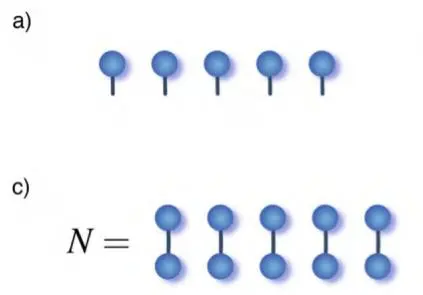

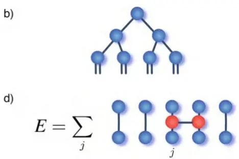
图7.1 (a) 平均场变分形式的张量网络表示，(b) 实空间重整化群（即树张量网络）的张量网络表示。(c) 平均场近似下态的内积计算，(d) 能量期望值E的计算

### 7.1.1 平均场

借助前面几节介绍的张量网络表示，我们现在可以将[第4章](ch04.md)介绍的强大平均场方法重新解释为一种张量网络算法。事实上，[第4.3节](ch04.md)引入的（单体）平均场近似可以用由N个单阶张量的乘积构成的张量网络来表示，如图7.1所示。任务则是找到这些张量的元素，使得在平均场变分形式下计算的能量期望值最小化。注意，我们可以轻松地放宽平移不变条件，即方程Eq. (4.5) 中所有张量$\psi^{1}$相等的条件，以适应例如边界效应和/或非平移不变哈密顿量。因此，在假设所研究的系统由最近邻哈密顿量（例如，Eq. (4.4) 定义的横场伊辛模型的情况）描述的假设下，能量期望值由N个1项的和给出，如图7.1d所示。

<!-- glossary: Matrix Product States = 矩阵乘积态
Mean Field = 平均场
Tree Tensor Network = 树张量网络
ground state = 基态
variational optimization = 变分优化
translationally invariant = 平移不变
nearest-neighbor Hamiltonian = 最近邻哈密顿量 -->

注意哈密顿量的每一项本身都可以表示为一个张量网络，如图7.1d（红色张量）所示：实际上，对于伊辛模型和许多其他哈密顿量，每个张量的显式形式可以通过解析方式找到。最简单的例子是横向场为零的情况，图中每个红色张量正好是对应的泡利矩阵，辅助指标 $k$ 的维度为1。或者，任何二点算子 $H_{\alpha_{i} , \alpha_{j}}^{\alpha_{i}^{\prime} \alpha_{j}^{\prime}}$ 都可以通过奇异值分解分解为两个较小的张量，如方程(5.12)所示，其中指标被融合为 $\alpha_{i} , \alpha_{i}^{\prime} \succ \mathbf{i}$ 和 $\alpha_{j} , \boldsymbol{\alpha}_{j}^{\prime} \succ \mathbf{j}$ 。正如我们稍后将看到的，这是定义在两个位点上的矩阵乘积算子（Matrix Product Operator, MPO）的最简单例子之一，可用于高效描述和操作作用于多体量子系统的算子。对张量的每次收缩进行计算，除了存在哈密顿量项的情况外，结果简单就是每个局域波函数 $\left| \psi_{j}^{1} \right.$ 的范数。在后面几节中，我们将看到这种简化方法如何引入到更复杂的张量网络中，同时需注意对张量进行适当的规范。

最后，在考虑归一化条件成立的前提下，对张量元进行最小化。执行此过程的一种正式方法，是使用拉格朗日乘子[125]引入约束条件，即构造拉格朗日量

$$
{\mathcal{L}} ( \psi_{1}^{1} , \dots \psi_{N}^{1} , \psi_{1}^{1 *} , \dots \psi_{N}^{1 *} ) = \langle \psi | {\mathcal{H}} | \psi \rangle - \lambda ( \langle \psi | \psi \rangle - 1 ) \equiv E \mathrm{-} \lambda ( N \mathrm{-} 1 ) .\tag{7.1}
$$

我们可以通过对不同变量 $\boldsymbol{\psi}_{j}^{1}$ 和 $\psi_{j}^{1 *}$ 进行迭代来寻找拉格朗日量的极小值。每个变量由微分条件确定（为简化符号，以下假设最近邻相互作用哈密顿量和归一化单位点波函数 $\left| \psi^{1} \right.$ ，并省略上标1）：

$$
\frac{\partial \mathcal{L}} {\partial \psi_{j}^{*}} = H_{\alpha_{j - 1} , \alpha_{j}}^{\alpha_{j - 1}^{\prime} \alpha_{j}^{\prime}} \psi_{\alpha_{j - 1}}^{*} \psi_{\alpha_{j - 1}^{\prime}} \psi_{\alpha_{j}^{\prime}} + H_{\alpha_{j} , \alpha_{j + 1}}^{\alpha_{j}^{\prime} \alpha_{j + 1}^{\prime}} \psi_{\alpha_{j + 1}}^{*} \psi_{\alpha_{j + 1}^{\prime}} \psi_{\alpha_{j}^{\prime}} - \lambda \psi_{\alpha_{j}^{\prime}} = 0\tag{7.2}
$$

最后，在计算出有效哈密顿量 $\tilde{H}_{\alpha_{j}}^{\alpha_{j}^{\prime}} = H_{\alpha_{j - 1} , \alpha_{j}}^{\alpha_{j - 1}^{\prime} \alpha_{j}^{\prime}} \psi_{\alpha_{j - 1}}^{*} \psi_{\alpha_{j - 1}^{\prime}} +$ $H_{\alpha_{j} , \alpha_{j + 1}}^{\alpha_{j}^{\prime} \alpha_{j + 1}^{\prime}} \psi_{\alpha_{j + 1}}^{*} \psi_{\alpha_{j + 1}^{\prime}}$ 后，上述条件可以表示为

$$
\tilde{H}_{\alpha_{j}}^{\alpha_{j}^{\prime}} \psi_{\alpha_{j}^{\prime}} = \lambda \psi_{\alpha_{j}^{\prime}} ,\tag{7.3}
$$

即有效哈密顿量 $\tilde{H}$ 的本征值问题。利用第二章介绍的数值方法求解该问题，即可得到张量 $\psi_{j}$ 的新元素：通过检查可知，有效哈密顿量的基态同时也给出了整体哈密顿量的最小能量。此外，由于哈密顿量的厄米性（Hermitian property），伴随张量 $\boldsymbol{\psi}_{j}^{*}$ 自动满足方程 $\begin{array} {r} {\frac{\partial \mathcal{L}} {\partial \psi_{i}^{1}} = 0} \end{array}$。因此，无需对张量网络的伴随部分进行迭代。

总之，在张量网络框架下求解平均场问题对应于以下算法：

1. 定义一个由 N 个独立张量组成的张量网络，每个张量用一个向量表示，其维数等于问题的局域维数 $d$。用随机元素和/或系统基态的猜测值填充张量。如有必要，施加归一化。

2. 遍历每个张量 $\psi_{j}$，计算有效哈密顿量 $\tilde{H}$ 并求解相应的本征值问题。更新张量 $\psi_{j}$。

3. 在整个张量网络上扫描，直至收敛或达到所需精度。

我们强调，尽管上述算法得到的是所关注系统的平均场描述（因而在构造上受限），但它在张量网络算法的发展中起着关键作用，因为它提供了一种寻找哈密顿量基态的操作性方法。事实上，它包含了大量张量网络算法所使用的大部分概念。

### 7.1.2 图形张量表示法

从前几节的方程可以看出，张量网络操作所需的表达式很快就会因过多指标而变得杂乱，这些指标既难以处理又容易出错。这正是在 5.1 节引入图形张量表示法（graphical tensor notation）的原因。然而，显式公式仍然难以阅读，并可能掩盖其物理和操作内容。此外，标准表示法并未明确传达某些重要信息，例如关于规范（gauging）的信息。因此，下面我们引入一种压缩表示法，试图缓解这些问题，尽管这可能要以偏离数学和其他使用张量领域的标准表示法为代价。

我们的第一个假设是张量网络是有向的，即必须选择一个参考方向。我们在下文选择了相对于页面的下-上方向。第二个假设是不允许表示指标图上的任何连线与这个方向正交。这是始终可以做到的，因为单个张量的边可以自由移动。此外，如果有两个张量通过一条与 ${\mathcal{D}}$ 正交的边收缩，那么总是可以在它们之间引入一个虚张量，从而在不移动原始张量的情况下有效地引入两条具有不同方向的连线，见图 7.2a。因此，图中每个张量的每条连线都定义了一个方向（从张量出发），该方向在参考方向上具有非零投影（平行或反平行）：我们在张量表示法中将前者表示为上标，后者表示为下标。通常，我们采用这样的约定：该方向对应于用下标标记的右矢（ket）态，而定义在对偶空间中的态（左矢（bra））则用上标标记。因此，上标仅与下标收缩，反之亦然。此外，采用刘维尔表示（Liouville representation）等价于降低上标，逆变换类似（见图 7.2b）：

$$
L ( \rho_{i}^{j} ) = L ( \rho_{i}^{j} | i \rangle \langle j | ) \equiv \rho_{i , j} | i , j \rangle \rangle = \rho_{i , j} | i \rangle | j \rangle = \rho_{i , j} .\tag{7.4}
$$

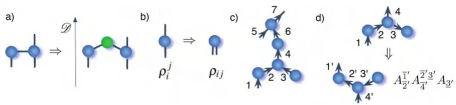
图7.2 张量网络表示法：(a) 虚张量（绿色）在链接中引入方向。显式引入了一个包含系统左右二分奇异值的辅助张量（绿色二阶张量）。(b) 密度矩阵的刘维尔表示。(c) 相对于参考方向的定向和标记张量网络。(d) 作用于定向张量网络的伴随操作及其对应的张量记号。请注意，下标小于上标隐含着张量元素需取复共轭。

此后，我们对张量网络的链接进行编号，从波函数（相对于）的底部到顶部以及从左到右，并且只显式写出索引编号，见图7.2c。根据我们的图形表示法，对张量执行伴随操作，相当于交换上标和下标并对张量元素取复共轭。请注意，所有属于伴随空间中表示波函数的张量网络的张量，其上标将小于下标，因此我们可以唯一地识别伴随张量。

总之，第7.1.1节中的表达式可以重写为

$$
\frac{\partial \mathcal{L}} {\partial \psi^{j^{\prime}}} = H_{j - 1^{\prime} , j^{\prime}}^{j - 1 , j} \psi^{j - 1^{\prime}} \psi_{j - 1} \psi_{j} + H_{j^{\prime} , j + 1^{\prime}}^{j , j + 1} \psi^{j + 1^{\prime}} \psi_{j + 1} \psi_{j} - \lambda \psi_{j}\tag{7.5}
$$

尽管这仍然是一个复杂的公式，但它比原始公式更紧凑。还要注意，哈密顿量以及任何作用于物理指标的算子，都可以通过上下标数量相同这一事实来识别。

重要的是，引入的记号可能会引起一些混淆，因为 $\psi_{j}$ 通常是向量 $\psi$ 的第 j 个元素。此后，当我们想要指定张量的单个元素且可能引起混淆时，我们将写作

$$
[ \psi ]_{j} .\tag{7.6}
$$

或者，我们始终可以回到更完整的记号，重新引入指标的希腊名称 $\psi_{\alpha_{j}}$。最后，有必要引入一个有向张量网络图，例如，用于描绘规范或对称张量网络。每当我们指定链接的内部方向时，我们会根据箭头指向在下划线或上划线之间选择，即要么是 $\overline{{j}}$ 或 $\underline{{j}}$ 。因此，定向张量的伴随操作等于交换上下标，见图7.2d。

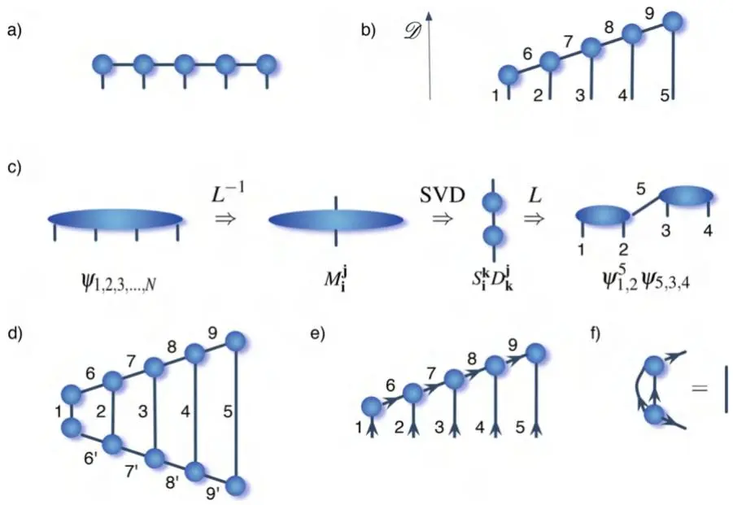
图7.3 (a) $N = 5$ 的矩阵乘积态（MPS）假设及其 (b) 排序。(c) 将多体波函数重铸为 MPS 形式的第一次迭代。(d) MPS 态范数的计算。(e) 相对于最右边张量的规范 MPS 态。(f) 等距条件：两个张量在方程 (7.9) 中的缩并等于一个单位阵

从现在开始，我们将使用这里引入的记号，从下一节引入的 MPS 假设开始。

### 7.1.3 矩阵乘积态

矩阵乘积态（Matrix Product State, MPS）是迄今为止最成功的张量网络之一。目前，它被常规用于研究一维量子系统的平衡和非平衡性质。MPS 由 Ostlund 和 Rommer [47] 提出，并被认为与 DMRG 描述完全等价 [25]。MPS 定义为

$$
\left| \psi^{\mathrm{MPS}} \right. = A_{1}^{N + 1} A_{N + 1 , 2}^{N + 2} \cdot \cdot \cdot A_{N + j - 1 , j}^{N + J} \cdot \cdot \cdot A_{N - 1 , 2 N - 2}^{2 N - 1} A_{N , 2 N - 1} \left| 1 , 2 \cdot \cdot \cdot N \right.\tag{7.7}
$$

如图7.3b所示，其中小于等于N的所有指标称为物理指标，其余指标为辅助指标。该态是平均场假设的明确推广，因为每个不同的局域波函数$\left| \psi^{1} \right.$之间存在额外的连接。与第4.1.2节引入的簇平均场类似，这些额外连接允许表示不同格点之间的关联。但与簇平均场假设不同的是，该结构具有平移不变性，并且允许根据新引入指标的辅助维度在平均场表示与多体态精确表示之间插值。事实上，暂时忽略效率和内存约束问题，从精确多体波函数$\psi_{1 , 2 , 3 , . . . , N}$出发，其MPS表示可通过一系列连续奇异值分解构建如下：

1. 将所有指标分为两组，在中间分割张量：$1 , \ldots N / 2 \succ \mathbf{i}$ 和 $N / 2 + 1 , \ldots N \ \succ \ \mathbf{j}$，并对矩阵$M_{\mathbf{i}}^{\mathbf{j}} =$ $L^{- 1} ( \psi_{\mathbf{i , j}} )$进行奇异值分解。得到的矩阵$M_{\mathbf{i}}^{\mathbf{j}} = S_{\mathbf{i}}^{\mathbf{k}} D_{\mathbf{k}}^{\mathbf{j}}$（我们通过将矩阵V与另一个矩阵缩并来吸收奇异值）是维度为$\mathbf{\bar{\boldsymbol{d}}}^{N / 2}$的方阵。

2. 对每个矩阵分别重复上述操作，每次迭代将剩余的物理指标分为两个，并根据图7.3c的示意分组辅助指标。

3. 迭代直到每个矩阵只包含一个物理指标和两个辅助指标。得到的矩阵构成了MPS假设，并按照构造定义了$A_{N + j - 1 , j}^{N + J}$矩阵。

从上述第1点可以看出，所述算法允许我们将多体波函数映射为MPS，但其规模随系统中组分数量N呈指数增长。然而，假设在此过程中得到的奇异值除第一个外全部精确为零，即辅助指标维度为1。那么我们会发现，原始波函数可以精确表示为辅助维度为1的MPS：这是一个精确的平均场态。相反，如果该态无法表示为平均场态（即包含关联），则辅助维度必须大于1。

与其他所有张量网络算法一样，MPS方法源于一个假设：所研究的系统可以用大于1（即超越平均场）但不随N指数增长的辅助维度来描述，因此可以高效计算系统性质。因此，$\mathbf{k} = 1 , \hdots m$，其中m扮演RG方法中的截断维度角色（见[第4章](ch04.md)），所有结果需在m上检验收敛性。在1/m上的外推可以将结果几乎扩展到精确情况，尽管产生的误差需要谨慎对待。

MPS假设中基态搜索的变分算法逐步遵循前一节介绍的算法，但需额外注意态的量规（gauging）问题。我们首先引入这一概念，然后介绍完整算法。其主要思想源于MPS假设具有一些冗余自由度，可用于简化计算，提高效率和精度。这一可能性的最早例子出现在计算MPS态的范数时：

$$
\begin{array} {r l} & {N = \langle \psi^{\mathrm{MPS}} \vert \psi^{\mathrm{MPS}} \rangle} \\ & {= A_{1}^{N + 1} \dots A_{N + j - 1 , j}^{N + J} \dots A_{N , 2 N - 1} A_{N + 1^{\prime}}^{1} \dots A_{N + J^{\prime}}^{N + j - 1^{\prime} , j} \dots A^{N , 2 N - 1^{\prime}}} \end{array}\tag{7.8}
$$

如图7.3d所示。这种收缩可以高效地完成：实际上，从一个端点（例如最左边的张量）开始，上下张量以 $O(d m^{2})$ 的运算量收缩。然后，所得张量依次与另外两个张量收缩，每次运算量为 $O(d m^{3})$。此时张量结构在物理有效长度上缩短了一个格点，因此对右侧待收缩的张量重复相同过程，整个范数可通过 $O(N d m^{3})$ 的运算量计算。尽管计算成本随 N 线性增长，但避免这些运算仍然非常可取，因为在最小化算法的每一步中都会出现类似的计算。解决方案来自如图7.3f所示的规范变换：实际上，如果我们对 MPS 进行规范变换，使得每个张量满足等距条件（isometric condition）

$$
A_{N + j - 1 , j}^{N + J} A_{N + j - 1^{\prime} , j}^{N + J^{\prime}} = \mathbb{1} ,\tag{7.9}
$$

则式(7.8)中的收缩在解析上等价于最右边张量与其自身的收缩。这就是通常所说的右规范 MPS，如图7.3e所示。类似地，当图中辅助维度上的箭头方向反转时（相应地满足式(7.9)中的条件），存在左规范。从非规范的 MPS 出发，通过之前引入的张量操作即可制备规范的 MPS：利用奇异值分解或 QR 分解，任何张量都可以转化为一个酉张量与一个一般张量的乘积。酉张量重新定义了原始张量，而后者可收缩到链中的下一个张量。在整个链中重复此过程，可以在除最后一个张量外的所有张量上强制满足等距条件。特别地，

$$
A_{N + j - 1 , j}^{N + J} A_{k}^{l} S_{k}^{j} V_{j}^{j} D_{j}^{l} \tilde{A}_{N + J - 1 , j}^{l} K_{l}^{N + J}\tag{7.10}
$$

现在，张量 $\tilde{A}$ 满足等距条件，而张量 K 应在其等距化之前并入 $A_{N + j , j}^{N + J + 1}$。类似的过程也可以通过 QR 分解 [25, 32] 实现。此外，通过略微调整 MPS 张量结构，即对每个辅助链接增加一个二阶张量（如图 7.2a 所示），可以始终显式存储奇异值：这种规范便于轻松控制系统中的纠缠，并实现变分算法的并行化 [25]。

最后，寻找哈密顿量基态平均场描述的算法可以直接推广到 MPS 张量结构。该算法由以下步骤定义：

a)
b)
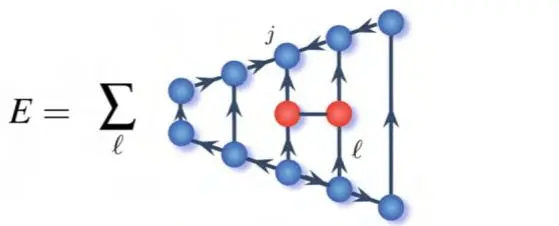

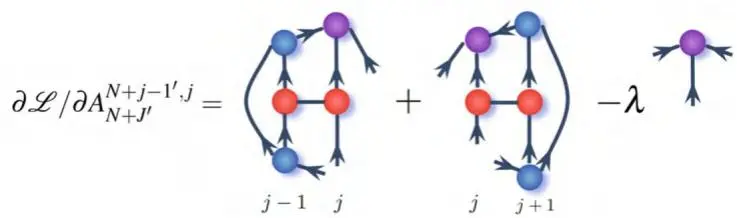
图 7.4 (a) 以位置 j 处的张量为基准进行规范的 MPS 态的能量期望值。(b) 对于以第 j 个张量规范的 MPS，关于 $A_{N + J^{\prime}}^{N + j - 1^{\prime} , j}$ 计算方程 (7.1) 中拉格朗日量的导数。条件 $\partial \mathcal{L} / \partial A_{N + J^{\prime}}^{N + j - 1^{\prime} , j} = 0$ 导致一个关于张量 $A_{N + j - 1 , j}^{N + J}$（紫色高亮）的本征值问题

1. 根据首选策略，在给定的辅助键维数 m 下初始化 MPS 拟设，这些策略包括：(a) 随机填充元素，(b) 通过解析公式（例如微扰理论或更简单的系统参数）获得猜测值，(c) 增长 MPS（执行无限 DMRG）直至达到系统尺寸 N。

2. 定义方程 (7.1) 中的拉格朗日量，并通过依次迭代网络中的每一个张量来寻找其相对于所有张量的极值，每一步都保持 MPS 以被优化的张量为基准进行规范。对于每个张量，施加条件 $\partial \mathcal{L} / \partial A_{N + J^{\prime}}^{N + \dot{j} - 1^{\prime} , j} = 0$，计算相应的有效哈密顿量，并求解 $A_{N + j - 1 , j}^{N + J}$ 的本征值问题。此处，规范的重要性变得显而易见，如图 7.4 所示，计算被大大简化，它将一个广义本征值问题缩减为标准本征值问题，而求解后者的数值方法更快且更稳定 [25, 32]。

该算法中所有操作的计算成本的上限是本征值问题的求解，其解可通过 Lanczos 算法计算。因此，算法复杂度取决于矩阵对向量作用的计算，即图 7.4b 中所示的张量缩并，该复杂度为 $O ( m^{3} )$。

上述算法逐个优化每个张量，因此通常被称为单张量更新。这不是唯一的选择，因为可以先缩并两个张量来求解本征值问题，然后最终通过 SVD 再次分离解。这第二种选择是双张量更新策略，它与 DMRG 方法非常相似，并且在考虑对称性及相应的不同荷扇区时扮演着重要角色：即便它不是唯一的选择，它也提供了一种直接策略来优化开放的荷扇区，参见第 6.2 节 [32]。

最后，我们提到上述算法可以推广到研究系统的激发态。实际上，方程 (7.1) 中的拉格朗日量可以推广，以包含使状态取极值的条件，并使其与一个或多个给定态 $| \phi_{k} \rangle$ 正交：

$$
\mathcal{L}_{e x} = \mathcal{L} - \sum_{k} \mu_{k} ( \langle \phi_{k} | \psi \rangle ) .\tag{7.11}
$$

定义将$| \phi_{0} \rangle$作为通过极值化拉格朗日量$\mathcal{L}$得到的基态，从而可以找到系统的第一激发态（或者在基态简并的情况下，找到与$| \phi_{0} \rangle$正交的另一个基态）。重复此过程并逐渐增加所包含的状态数，原则上可以计算出整个谱。然而，由于收敛难度增大以及计算资源需求高，这种方法仅限于计算前几个低能级。

MPS 拟设并非唯一可用于扩展平均场态的张量网络选择。下文简要回顾了其他已提出的可能性，并根据拓扑结构将其分为无环网络和有环网络两类，因为不同的拓扑结构引入了根本性区别：前者可以使用与本节所介绍算法等效的方法，而后者由于更高的计算成本和额外的技术难点，需要特别关注和更仔细的处理。

### 7.1.4 矩阵乘积算子（Matrix Product Operator）

MPS 拟设的一个直接推广是矩阵乘积算子（MPO）拟设 [283]：它将上述为态引入的概念和方法应用于算子，从而构成张量网络。实际上，为了表示一个算符，物理指标的数量需要加倍，一半用于算子作用的空间，另一半用于对偶空间。除此之外，前几节的分析可以直接推广。特别地，很容易证明，只要将局域维度平方，MPO 就等价于 MPS：它们通过 Liouville 变换和两个指标的融合联系起来，如下所示

$$
B_{1}^{3 N - 1 , N + 1} \cdot \cdot \cdot \lambda_{N + J , N + J + 1} B_{J}^{N + J + 1 , 3 N + J - 2 , N + J + 2} \cdot \cdot \cdot B_{N}^{3 N - 2 , 4 N - 2}\tag{7.12}
$$

$$
B_{1 , 3 N - 1}^{N + 1} \cdot . . \lambda_{N + J , N + J + 1} B_{J , 3 N + J - 2}^{N + J + 1 , N + J + 2} \cdot . . . B_{N , 4 N - 2}^{3 N - 2}\tag{7.13}
$$

如图 7.5a 和 b 所示，其中 B 张量用红色表示，包含奇异值的 λ 张量用绿色表示。最后，原始算子可以用波函数表示

$$
| \psi_{M P O} \rangle = B_{\bf 1}^{N + 1} \dots \lambda_{N + J , N + J + 1} B_{\bf J}^{N + J + 1 , N + J + 2} \dots B_{\bf N}^{3 N - 2} | {\bf 1} , {\bf 2} \dots{\bf N} \rangle ,\tag{7.14}
$$

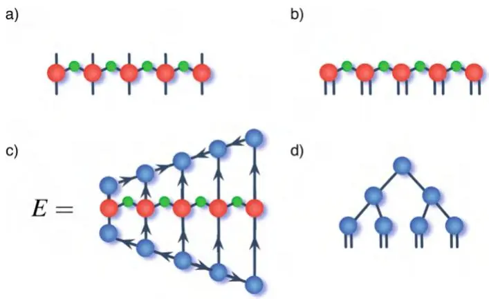
图 7.5 (a) 矩阵乘积算子的图形表示，其中式 (7.12) 的张量 B ( λ) 用红色（绿色）表示。(b) MPO 的式 (7.13) 给出的 Liouville 表示的图形表示。(c) 通过 MPO 和 MPS 张量网络计算能量期望值。(d) 树张量网络（Tree Tensor Network）的图形表示

其中 J, $3 N + J - 2 \succeq \mathbf{J}$。

MPO 假设的一个非常有用的应用是它能够以紧凑的形式表示哈密顿量。事实上，有了哈密顿量的 MPO 表达式，就可以通过一个编码和操作都非常简单的张量网络来计算能量期望值，如图7.5c所示。第7.1.3节中介绍的最小化过程可以很容易地从该张量网络开始应用。这种方法对于处理长程相互作用哈密顿量尤其重要，因为对于这类哈密顿量，上一节中介绍的算法会变得非常复杂且高度纠缠，实际上使其无法应用于大多数有趣的情况。

下面，我们简要介绍如何将哈密顿量重新转化为紧凑的 MPO 形式，同时将长程哈密顿量完全映射为 MPO 形式的相关文献推荐给感兴趣的读者 [40, 284]。我们考虑最近邻哈密顿量，$\begin{array} {r} {\hat{H} \stackrel{\smile} {=} \check{\sum}_{i = 1}^{N - 1} \hat{h}_{j} \otimes \hat{k}_{j + 1}} \end{array}$，其中 $\hat{h} , \hat{k}$ 是作用于局部希尔伯特空间的算子，该空间的维度为 d。在此假设下，容易验证方程 (7.12) 中给出的 MPO 表达式对应于矩阵的乘积，而这些矩阵的元素本身也是矩阵。为了说明其工作原理，先看一个简单的例子，其中 $N = 2$。在这种情况下，哈密顿量变为 $\hat{H} = \hat{h} \otimes \hat{k} \stackrel{} {=} h_{1}^{4} k_{2}^{5} \stackrel{} {=} H_{1 , 2}^{4 , 5}$，我们希望将其写成方程 (7.12) 的 MPO 形式，即对于两个格点，$B_{1}^{4 , 3} B_{2}^{3 , 5}$。将这两个关系式等同起来，可以简单识别出等式成立的条件：索引 3，即两个 MPO 矩阵之间的辅助索引，不应起作用，因为它只能取一个值，并且 $B_{1}^{4} = h_{1}^{4}$ 和 $B_{2}^{5} = k_{2}^{5}$。为了将关系推广到 $N > 2$，我们定义两个算子值向量的乘积

$$
[ B_{1}^{4} ]^{3} = \left( \mathbb{1} , \hat{h} , 0 \right) \qquad [ B_{3}^{5} ]_{3} = \left( \begin{array} {l} {0} \\ {\hat{k}} \\ {\mathbb{1}} \end{array} \right) ;\tag{7.15}
$$

其元素是矩阵，并且它们的标量积是 $H_{1 , 2}^{4 , 5}$。现在可以很容易地验证，最近邻哈密顿量 $\begin{array} {r} {\hat{H} = \sum_{i = 1}^{N - 1} \hat{h}_{i} \otimes \hat{k}_{i + 1}} \end{array}$ 的一般 MPO 表达式由 $N - 2$ 个形如

$$
[ B_{J}^{3 N + J - 2} ]_{N + J + 1}^{N + J + 2} = \left( \begin{array} {l l l} {\mathbb{1}} & {h i} & {0} \\ {0} & {0} & {k_{i + i}} \\ {0} & {0} & {\mathbb{1}} \end{array} \right) ,\tag{7.16}
$$

的矩阵的乘积构成。

并且在首尾位置是式(7.15)中的矢量。因此，单算符最近邻哈密顿量可以用辅助维度（式(7.15)中矢量的维度）为 $m = 3$ 的MPO表示。对于形如 $\begin{array} {r} {\sum_{i = 1}^{N - 1} \sum_{k = 1}^{p} \dot{h}_{i}^{k} \otimes \hat{k}_{i + 1}^{k} \left( \mathrm{e . g .} \right.} \end{array}$ 的哈密顿量（例如海森堡模型），其推广是直接的，MPO键维度增加为 $m = p + 2$ 。最后，由于任何双体算符都可以通过奇异值分解重写为至多 $d^{2}$ 项之和，因此r-范围相互作用的哈密顿量所需的最大MPO维度为 $m = d^{2} r + 2$ [284]。

MPO的第二个非常有用的应用是它们可以用来有效描述有限温度下的多体量子系统，以及更一般地，开放多体量子系统的密度矩阵。虽然利用这种方法可以研究非平衡动力学（正如我们将在下一节中展示的那样[40]），也可以通过变分算法[285, 286]直接搜索李乌维量演化的稳态。具体来说，将系统的密度矩阵写成MPS形式，将李乌维量 $\mathcal{L}$ 写成其超算符MPO形式，就可以通过调整上一节中概述的算法，寻找 $\mathcal{L}$ 或 $\mathcal{L}^{\dagger} \mathcal{L}$ 的最低本征矢来找到系统的稳态。虽然后一种选择（最小化 $\mathcal{L}^{\dagger} \mathcal{L}$）保证了算符是厄米且半正定的，但前一种方法提供了更好的数值性能，代价是需要更仔细地微调收敛性[285, 286]。

最后，如前所述，MPO可以编码通用算符，这些算符可以被利用来开发不同的任务和更专门的算法。我们将在[第6.4节](ch06.md)中详细回顾其中一个应用，在那里我们给出了阿贝尔规范对称性的规范不变子空间投影仪的一个显式MPO形式。

### 7.1.5 其他张量网络几何结构

在前面的章节中，我们展示了如何优化张量网络，特别是MPS，以表示给定多体哈密顿量的平衡和非平衡性质。然而，MPS并不是唯一可以用来作为描述多体量子系统这类性质的变分拟设的张量网络。下面我们简要介绍两组不同的张量网络几何结构：无环网络和有环网络。

## 7.1.5.1 无环张量网络

实际上，任何无环图都可以用来定义相应的张量网络：本节中为MPS提出的变分算法几乎可以直接应用。然而，一般的图最终会导致计算成本至少与网络中存在的最高秩张量成比例（参见第5.2.2节）。因此，在辅助维度恒定的情况下，需要找到一个方便的平衡：更高秩的张量编码更多信息，而更低秩的张量则带来更有利的计算成本。在这一范围的一端是如图7.5d所示的二叉树，通常称为树张量网络（Tree Tensor Networks），其中每个张量的秩为三，这是拥有非平凡结构所需的最小秩[42, 44, 190, 191]。该网络从一个顶部的秩二张量开始构建，然后为每个自由连接增加一个秩三张量来创建额外的层。这种构造导致每层的张量数量和物理指标数量都翻倍。最终，经过 $\log_{2} N$ 层之后，张量网络可以方便地容纳对N个物理位置的描述。该网络定义为

$$
\left| \psi^{T T N} \right. = \prod_{k = 1}^{\log_{2} ( N / 2 )} \prod_{j = 1}^{N / 2^{k}} \Lambda_{2 j - 1 + f_{1} , 2 j + f_{1}}^{j + f_{2}} ,\tag{7.17}
$$

其中 $\begin{array} {r} {f_{1} = \sum_{l = 1}^{k - 1} N / 2^{l - 1}} \end{array}$ 和 $\begin{array} {r} {f_{2} = \sum_{l = 1}^{k} N / 2^{l - 1}} \end{array}$。由于其层次结构以及每对张量之间最多通过长度为 $2 \log N$ 的链接路径相连，该结构是描述临界系统（详见第IV部分）的优秀候选方案，至少在一维系统中如此 [44, 192]。将其推广到高维系统或一般无环图是直接的 [42, 191, 193]。

注意，在平移不变张量（每一层级的所有张量都相等）且每个张量被约束为等距（isometry）的假设下，即 $\Lambda_{2 j - 1 + f_{1} , 2 j + f_{1}}^{j + f_{2}} \Lambda_{( j + f_{2} )^{\prime}}^{2 \bar{j} - 1 + f_{1} , 2 j + f_{1}} = 1$，该张量结构等价于[第4章](ch04.md)描述的实空间重整化群。然而，可以证明，如果放宽等距约束，在固定键维数（bond dimension）下，所得基态能量的精度随 $N$ 保持不变 [32, 44]。

最后，任何无环张量网络都可以通过一系列奇异值分解（SVD）表示为秩三张量网络，SVD 将一个秩 $n$ 张量分解为两个秩 $n-1$ 张量。需要付出的代价是，连接两个新张量的辅助维数（auxiliary dimension）按每个张量剩余维数乘积的最大值缩放。然而，可以截断每次 SVD 的最小奇异值，从而引入额外的压缩。

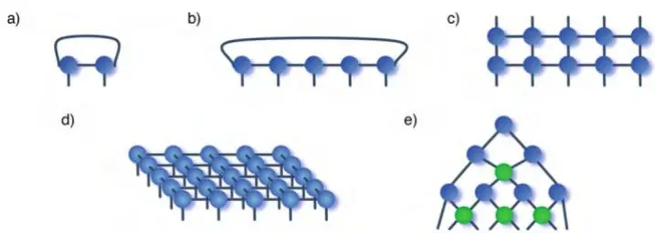
图7.6 (a) 无限 MPS (b) 具有周期边界条件的 MPS (c) 局部纯化张量网络 (d) 投影纠缠对态 (e) 由幺正算符（绿色张量）和等距（蓝色张量）构成的多尺度纠缠重整化假设

为提醒读者，这些无环张量网络将以树张量网络（TTN）的形式在[第8章](ch08.md)中详细介绍，并提供一维和高维系统的实际示例及实现建议。

## 7.1.5.2 环状张量网络 (Looped Tensor Networks)

尽管无环张量网络通常更易于实现且计算效率更高，但在某些场景下，选择带有环的张量网络更为自然或更方便。由于拓扑结构不同，这类结构在实现优化算法时会遇到额外困难，要么因缩放性较差，要么更容易出现数值不稳定性。因此，对于大多数此类网络（若想超越原理验证性数值实验），实现时需要额外小心和更高的专业水平。对此类工具的详细呈现超出了本书的范围。以下，我们简要回顾一些最常用且成功的环状张量网络（也在图7.6中示意），并请有兴趣接受这一挑战的读者查阅相关文献。

环形张量网络最自然出现的场景之一是无限矩阵乘积态（iMPS）。假设系统具有平移不变性，则可以从式(7.7)中所有张量的条目都相等（即 AAAAA 结构）的假设出发，直接在热力学极限下工作。此时问题可转化为图7.6a所示张量结构的最小化问题，并采用标准的最小化技术或虚时演化方法求解[25,30]。由于该假设的简洁性，算法实现高效便捷且能获得精确结果。但此方法的缺陷在于无法应用于有限系统，因此难以与实验结果对比；也无法处理平移对称性破缺的情况（如存在缺陷、无序、束缚势或边界条件）。此外，由于仅在热力学极限下定义，无法应用有限尺寸标度（finite-size scaling，见[第10章](ch10.md)），这限制了表征临界系统特性的强有力方法的使用。iMPS假设还可通过混合假设自然扩展改进——假设张量仅在大于1的周期内相等（即 ABABAB 或 ABCABCABC 结构），这与4.1.2节介绍的团簇平均场思想类似。

引入环形张量网络的第二个场景是描述具有周期性边界条件的一维系统。此时自然引入如下形式假设：
$$
\left| \psi_{\mathrm{PBC}}^{\mathrm{MPS}} \right. = A_{2 N , 1}^{N + 1} A_{N + 1 , 2}^{N + 2} \ldots A_{N + j - 1 , j}^{N + J} \ldots A_{N - 1 , 2 N - 2}^{2 N - 1} A_{N , 2 N - 1}^{2 N} \left| 1 , 2 \ldots N \right. ,\tag{7.18}
$$

如图7.6b所示。这里同样可以直接应用前几节提出的思想到该ansatz上。然而，新增的连接带来算法标度增长的劣势，并阻碍了规范固定，因而实际使用中除非别无选择且采用了更复杂的策略[287]，否则不鼓励使用。另一种方法是将晶格位点从1,2,3,...,N重新排序为1,N,2,N-1,...。这样，可以将具有周期性边界条件的系统映射为开边界系统。最后，可以使用标准方法，要么将两个相邻物理位点映射到一个逻辑位点，代价是将局域维度从$d$增加到$d^{2}$；要么更优地，将最终得到的次近邻哈密顿量写为方便的MPO形式。

为解决一维开多体量子系统的问题并应对密度矩阵正定性的挑战，引入了另一种环形张量网络：局域纯化张量网络（Locally Purified Tensor Network, LPTN），它源于对密度矩阵正定性的要求，将其写为$\rho = X X^{\dagger}$[288]。将算子$X写为MPO`即得到如图7.6c所示的张量网络结构。在此结构上，可以应用之前介绍的策略，并推广到下一节介绍的时间相关DMRG的完整Liuouville算子[241]。此外，由于LPTN几乎是一维结构，它虽属环形张量网络，却与大多数其他环形张量网络不同，能够受益于规范固定。

最后，还针对不同场景引入了其他值得关注的张量网络类别，例如用于模拟二维MBQS的投影纠缠对态（Projected Entangled Pair States, PEPS）（图7.6d）[289,290]、用于研究层次化标度不变系统的多尺度纠缠重整化ansatz（Multiscale Entanglement Renormalization Ansatz, MERA）（图7.6e）[291-293]、分支MERA[294]、加权图态[295]、纠缠plaquette态[296]、弦键态[297]以及超不变张量网络（hyperinvariant tensor network）[298]。详尽讨论所有这些可能性超出了本书范围，我们建议感兴趣的读者参考相关文献。

## 7.2 基于张量网络的时间演化

在前几节中，我们了解了如何找到平衡态的最佳张量网络近似。本节将展示如何通过张量网络求解含时薛定谔方程来研究多体量子系统的非平衡性质。第一步通常是利用Suzuki-Trotter分解将多体时间演化算子进行分解，将指数级庞大的算子近似表示为少体算子的乘积[262,299]。下面我们重点讨论由时间无关哈密顿量产生的动力学过程。然而，下面的阐述可以直接推广到时间相关哈密顿量的情况[300,301]。

与大多数数值求解时间相关问题的方法类似，起点是对时间轴进行离散化，从而将时间演化算子重新表示为式(3.34)中那样的一小步传播子的乘积形式。因此，需要解决的核心任务是高效地将算子$\hat{U} = e^{- i \hat{H} \Delta t / \hbar}$多次应用于张量网络。这一挑战通常有两方面：一方面，状态的张量结构必须在每一步中保持不变，否则算法无法迭代；另一方面，每个张量索引的维度必须保持恒定（或增长至某一给定阈值），以维持算法的效率。我们将在后续看到，这在许多有趣场景下是可行的，其起点是将算子$\hat{U}$分解为两组具有不相交支撑的交换算子。例如，对于一维最近邻相互作用系统，哈密顿算子可以分成奇项和偶项：

$$
\mathcal{\hat{H}} = \sum_{i = 1}^{N - 1} \hat{H}_{i , i + 1} = \sum_{j = 1}^{N / 2} \hat{F}_{2 j - 1 , 2 j} + \sum_{j = 1}^{N / 2 - 1} \hat{G}_{2 j , 2 j + 1}\tag{7.19}
$$

满足

$$
[ F_{i} , F_{j} ] = [ G_{i} , G_{j} ] = 0 \qquad \mathrm{and} \qquad [ F_{i} , G_{j} ] \propto \delta_{i , j} .\tag{7.20}
$$

最后，利用 Baker-Campbell-Hausdorff 公式，时间演化算符可近似为

$$
\begin{array} {l} {\hat{U} = \exp \left( \frac{- i \sum_{i} \hat{F}_{i} \Delta t} {2 \hbar} \right) \exp \left( \frac{- i \sum_{i} \hat{G}_{i} \Delta t} {\hbar} \right) \exp \left( \frac{- i \sum_{i} \hat{F}_{i} \Delta t} {2 \hbar} \right)} \\ {\quad + O \Big ( \Delta t^{3} \Big ) \approx \displaystyle \prod \hat{W}_{i}} \end{array}\tag{7.21}
$$

总之，如果能够对表示状态 $| \psi \rangle$ 的张量网络施加一个二体门（two-body gate），同时保持其张量结构不变，并使得指标维数恒定，那么通过迭代就可以重现系统的时间演化。下面几节将描述实现该目标的多种可用策略。

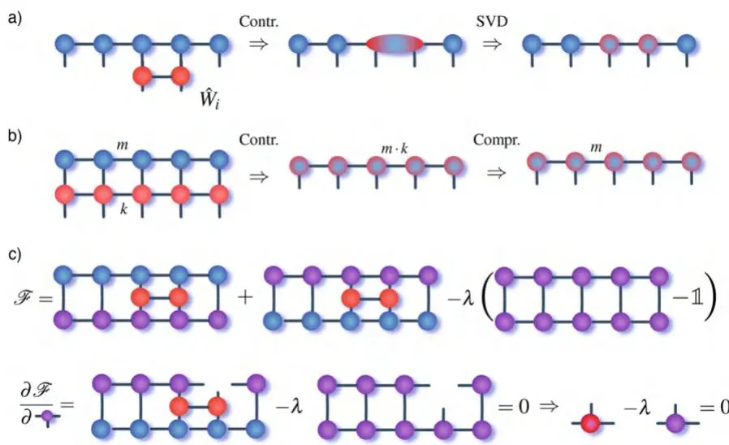
图7.7 通过张量网络进行时间演化：(a) 单个时间演化门 $\hat{W}_{i}$（红色张量）与 MPS（蓝色张量）的收缩及随后的 SVD 压缩。(b) 待演化的 MPS（蓝色张量）与时间演化算符 $\hat{U}$ 的 MPO 表示（红色张量）的收缩，随后通过多次 SVD 进行 MPS 压缩。此处明确标出了键维数以提升表述清晰度。(c) 方程(7.22)中品质因子的图形表示，及其对特定张量 $A_{N + j - 1 , j}^{N + j}$ 的导数（示例中 j=4）。条件 $\partial \mathcal{F} / \partial A_{N + j - 1 , j}^{N + j} = 0$ 给出了 $A_{N + j^{\prime}}^{N + j^{\prime} - 1 , j}$ 的更新规则

### 7.2.1 含时密度矩阵重整化群（Time-dependent Density Matrix Renormalization Group）

第一个揭示直接模拟多体量子系统实时时间演化可行性的算法是含时 DMRG（t-DMRG）或时间演化块消减（Time Evolving Block Decimation, TEBD）算法 [25,302,303]。它们提供了对 MPS 形式的状态进行时间传播所需的一系列操作：前者以 DMRG 语言描述，后者以等价的张量网络形式表述。为便于阐述，下文采用后一种表述。借助当今完备的理论描述和技术工具，这一步或许看起来有些直接；然而，它的发展曾是一个重大突破。如图7.7a所示，作用于位点 i 和 i+1 的单个门的收缩是一种局域操作，仅涉及三个张量：门本身以及包含物理指标 i 和 i+1 的两个 MPS 张量。因此，它可以高效地执行，即具有与 N 无关的标度，特别是 $O ( m^{2} )$ 。最后，收缩后的张量（包含两个物理指标）可以通过 SVD 再次分裂成两个三阶张量，SVD 是一个阶数为 $O ( m^{3} )$ 的算子。注意，收缩和 SVD 之后，连接这两个张量的辅助维数增加了。

需要对其进行截断以恢复 MPS 的初始结构，仅保留最高的 m 个奇异值。这些步骤可以迭代进行，依次收缩方程(7.21)展开中的后续门。最终，在收缩完所有门之后，就完成了一个 $\Delta t$ 的时间演化：连接所有必要的 $\Delta t$ 时间演化，即可得到演化结束时的状态，其形式为具有固定键维数 m 的 MPS。再一次地，辅助键维数 m 的固定值在算法的每一步都引入了近似，这需要加以控制。可以对最终误差给出界 [25,234,304]，该误差严重依赖于所模拟的时间演化。

最后，我们指出，当将时间演化算符写成 MPO 形式更为方便时（例如长程相互作用的情况），时间演化可以通过将 MPO 直接收缩到表示状态的 MPS 上来执行，如图7.7b所示，然后对整个 MPS 进行压缩 [305, 306]。

---

作为最后的评述，TEBD方案也可用于通过从一个初始随机态开始进行虚时演化$( t ~ ~ i t )$来寻找多体哈密顿量的基态。然而，尽管实现简单，但为了获得高性能的解，通常更倾向于使用DMRG算法，因其收敛速度更快。实际上，虚时演化的指数尾部会显著减慢其收敛速度。

### 7.2.2 保真度驱动演化

另一种实用的张量网络演化方式利用了演化态与另一个具有恒定键维数的张量网络之间保真度（fidelity）的计算：其思想是寻找固定维数下最能近似演化态的张量网络。它可用于复杂的张量网络，特别是含环的网络[307]。该算法同样基于Trotter分解，并遵循以下步骤来应用每个门：

1. 将门作用于待演化态$| \psi \rangle$，并计算演化态与另一个由相同张量网络描述的通用态$| \phi \rangle$的重叠$\operatorname{Re} ( \langle \phi | \hat{W}_{i} \psi \rangle )$。

2. 在附加新态必须归一化的约束条件下，最小化两个张量之间的距离：

$$
\operatorname*{min}_{\phi} ~ \mathcal{F} {=} \operatorname*{min}_{\phi} ~ \operatorname{Re} ( \Bigl \langle \phi \Bigl | \hat{W}_{i} \psi \Bigr \rangle ) - \lambda ( \langle \phi | \phi \rangle - 1 ) .\tag{7.22}
$$

同样，可以通过对态$| \phi \rangle$的MPS表示中的每个张量$A_{N + j - 1 , j}^{N + J}$进行迭代最小化来实现。梯度$\partial \mathcal{F} / \partial A_{N + j - 1 , j}^{N + j}$如图7.7c所示：其极值可通过收缩剩余的张量网络高效计算，从而得到张量更新的简单条件。如果MPS相对于第$j$个张量进行了规范变换，那么新张量正比于从项$\hat{W}_{i} \psi$和$| \phi \rangle$中去除张量$A_{N + j - 1 , j}^{N + J}$本身后收缩所得张量（见图7.7c）。

3. 令$| \phi \rangle = | \psi \rangle$，并针对每个张量迭代上一步直至收敛（对于小的$\Delta t$，实际上只需几次迭代）。得到的$| \phi \rangle$张量表示在固定边界维数下对时间演化态的张量网络近似。

上述算法可以很容易地适应于无穷小时间演化算子$\hat{U}$以MPO形式给出的情况。

### 7.2.3 含时变分原理

张量网络模拟时间演化的另一种优雅方法是含时变分原理（Time-dependent variational principle，TDVP）[308, 309]：其思想是将时间演化算子投影到给定键维数MPS空间的切流形上，从而通过构造保持张量网络结构。下文我们将给出该算法推导的要点，并建议读者参考原始文献以获取显式的数学推导[308]。TDVP算法利用MPS的规范变换，迭代地更新MPS中的每个张量，求解无穷小时间步长$\Delta t$下的含时薛定谔方程，其中时间演化的生成元被显式投影到MPS的切流形上：

$$
\frac{d \left| \psi^{\mathrm{MPS}} \right.} {d t} = - i \hat{P}_{\mathcal{T}} \hat{H} \left| \psi^{\mathrm{MPS}} \right. .\tag{7.23}
$$

可以证明投影算子$\hat{P}_{\mathcal{T}}$可以表示为图7.8a所示的形式。由此可得，第$i$个张量$A_{N + j - 1 , j}^{N + \bar{j}}$和奇异值向量$C_{N + J , N + J + 1}$——后者是在对张量$A_{N + j - 1 , j}^{N + j}$进行SVD以改变规范后得到的（见图7.8b）——随时间按以下方程演化：

$$
A_{\mathbf{k}} ( t + \Delta t / 2 ) = \exp ( - i \tilde{H}_{\mathbf{k}}^{\mathbf{j}} \Delta t / 2 ) A_{\mathbf{j}} ( t )\tag{7.24}
$$

$$
C_{\mathbf{k}} ( t + \Delta t / 2 ) = \exp ( + i \tilde{K}_{\mathbf{k}}^{\mathbf{j}} \Delta t / 2 ) C_{\mathbf{j}} ( t ) ,\tag{7.25}
$$

---

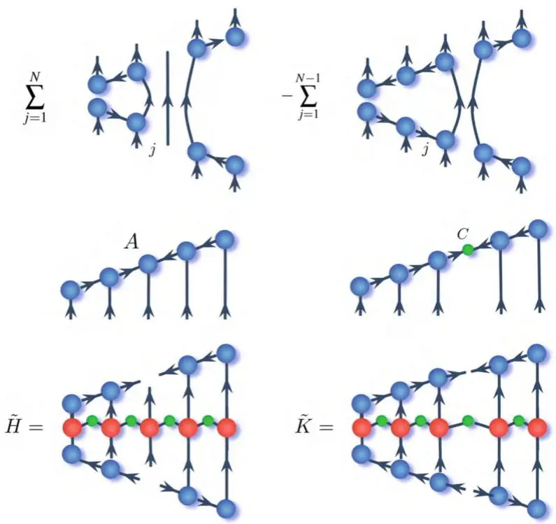
图7.8 (a) 切空间投影算子 ${\hat{P}}_{{\mathcal{T}}}$ 的图形化定义。(b) 方程(7.24)和(7.25)中张量 A（左）和 C（右）的定义。(c) 由系统哈密顿量的MPO形式（红色和绿色张量）出发，定义有效哈密顿量 H̃（左）和 $\tilde{K}$ 的图形化表示。

其中指标 k, j 是由张量 A (C) 的三个（两个）指标融合后得到的指标。有效哈密顿量 $\tilde{H}$ 和 $\tilde{K}$ 的图形化定义如图7.8c所示，它们从MPO表示下的系统哈密顿量出发。总之，单点TDVP算法可以如下实现：从左规范化的MPS开始，第一个张量 $A_{i}^{N + j}$ 根据方程(7.24)演化，接着对更新后的张量进行SVD分解，定义出需要根据方程(7.25)演化的C张量。然后将演化后的C张量与右侧的下一个张量收缩，并沿整个MPS迭代此过程。完成一次完整扫描（从左到右再返回）对应于将系统波函数 $|\psi^{\dot{\mathrm{MPS}}}\rangle$ 从时间 t 演化到 $t + \Delta t$，误差为 $O(\Delta t^{2})$ [308]。该方案也可以直接应用于一般的无环网络 [32]。

## 7.3 测量

最后，一旦选定张量网络的条目或针对感兴趣的状态（例如，多体哈密顿量的基态或某个最终时刻的时间演化状态）进行了优化，就可以高效地测量许多有趣的物理量。关于这些量的明确介绍和物理解释，我们请读者参考第四部分。下文，我们定义一些最有趣的物理量，并介绍如何在张量网络语言中实际计算它们。我们明确给出针对MPS态的计算，然而，这些过程可以简单地推广到大多数张量网络结构。

第一类可以直接计算的量是局域可观测量，即任何只支持在单个局域希尔伯特空间上的算符的期望值（定义于一个格点之上）。

$$
\langle \hat{M}_{j} \rangle = \left\langle \psi^{\mathrm{MPS}} \middle| \hat{M}_{j} \middle| \psi^{\mathrm{MPS}} \right\rangle .\tag{7.26}
$$

如图7.9a所示，局域可观测量可以像计算态的内积一样轻松计算。此外，如果MPS相对于第 j 个格点进行了规范化，则该计算简化为一个与系统大小无关的收缩（三个张量）。第二类高效测量是非局域观测量的评估，例如k点关联函数。

$$
\langle \hat{M}_{i_{1}} \hat{M}_{i_{2}} \dots \hat{M}_{i_{k}} \rangle = \left\langle \psi^{\mathrm{MPS}} \middle| \hat{M}_{i_{1}} \hat{M}_{i_{2}} \dots \hat{M}_{i_{k}} \middle| \psi^{\mathrm{MPS}} \right\rangle .\tag{7.27}
$$

---
a)
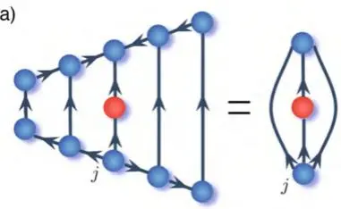
b)

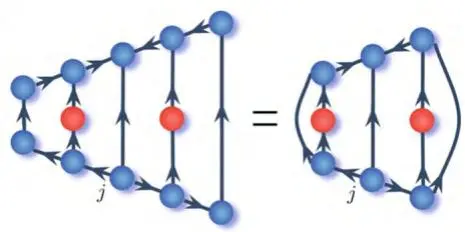

c)
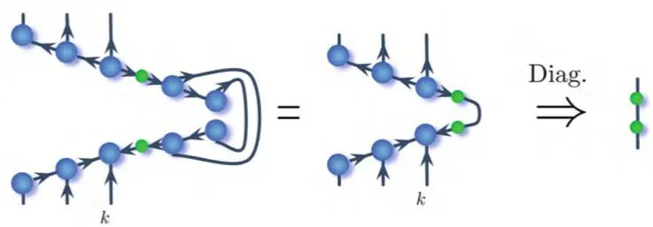
图7.9 (a) 在相对于第 j 个格点规范化的MPS上计算单点算符的期望值（支持域在格点 j 上）。(b) 在正确规范化的MPS态（见正文）上计算两点关联函数。(c) 从通过MPS态 $\rho = |\tilde{\psi}^{\mathrm{MPS}}\rangle\langle\dot{\psi}^{\mathrm{MPS}}|$ 表示的五格点系统的密度矩阵中，计算约化密度矩阵 $\rho_3 = \operatorname{Tr}_{\{j > 3\}} \rho$。绿色张量包含通过压缩第三和第四个A张量获得的奇异值 $\lambda_1$。约化密度矩阵的对角化可以通过酉算子 $U := A_1^6 A_{6,2}^7 A_{3,7}^8$ 实现，得到对角线形式为 $\lambda_i^2$ 的对角矩阵（最右侧示意图）。

（假设 $i_{1} < i_{2} < \cdots < i_{k}$，在经过恰当规范化的 MPS 中，即相对于站点 $i_{1} \leq j \leq i_{k}$ 而言）该尺度将随最低和最高索引 $i_{k} - i_{1}$ 之间的距离增长，如图7.9b所示。

最后，可以方便地访问任何系统二分对应的约化密度矩阵，其中两个子系统分别包含 $k$ 个和 $N - k$ 个相邻格点，

$$
\rho_{k} = \mathrm{Tr}_{j > k} \bigg | \psi^{\mathrm{MPS}} \bigg \rangle \bigg \langle \psi^{\mathrm{MPS}} \bigg | .\tag{7.28}
$$

迹运算在定义上等价于对索引 $j > k$ 进行收缩。如果 MPS 处于正确的规范下，这相当于移除已收缩的张量。图7.9c描绘了由五个格点组成的系统中计算 $\rho_{3}$ 的过程，为清晰起见并便于后续使用，我们显式标出了由 MPS 第 $j$ 个与第 $j+1$ 个张量压缩得到的奇异值 $\lambda_i$ 的对角矩阵（图中绿色的二阶张量）。虽然该操作对任意格点数目 $k$ 都是可行且高效的，但显式构造约化密度矩阵所需的内存会随 $k$ 指数增长。因此，$\rho_k$ 的显式计算仍局限于少数格点。不过，可以高效地计算约化密度矩阵的前 $m$ 个布居数，从而近似得到两个子系统二分之间的各种熵度量，例如所有的Rényi熵（Rényi entropy）和冯·诺依曼熵（von Neumann entropy）。实际上，通过直接应用剩余的 MPS 张量即可对角化约化密度矩阵，同样由于规范条件，此过程得到简化并导致对角化的 $\rho_k$（见图7.9c）。约化密度矩阵的布居数由下式给出：

$$
p_i = \lambda_i^2 .\tag{7.29}
$$

正如我们将在本书后续部分看到的，这一能力将在刻画许多系统的平衡态与非平衡态性质中发挥重要作用，涉及从量子相变的表征到量子计算效率的估计等多个方面。

## 7.4 习题

1. 利用前序练习中开发的代码，定义 MPS 对象及其基本操作：计算范数，以及评估局域算子和最近邻算子的期望值。

2. 运用上述工具，为横向场伊辛模型编写一个 t-DMRG 代码。从随机 MPS 开始执行虚时演化，并使用其他方法（见前一章习题）计算所得基态能量进行比较。

