# 增广树张量网络

Timo Felser

在本章中，我们将更详细地描述增广树张量网络（augmented Tree Tensor Network，aTTN）——一种针对高维量子系统的新型张量网络几何结构。aTTN最初是为了对即将到来的量子技术（如量子模拟器和量子计算机）进行基准测试而构想出来的，它彰显了张量网络方法对于开创量子技术的实验团队的影响[149]。近期实验在超导量子比特、超冷原子、 trapped ions 和里德伯原子晶格等不同平台上实现了具有前所未有的维度的量子多体态，这凸显了对一种稳健的数值工具进行验证和基准测试的需求[319–322]。

正如前一章（[第5章](ch05.md)）所述，三十年来，张量网络已发展为在经典计算机上模拟量子多体系统的方法。虽然矩阵乘积态（MPS）主导了一维系统，但寻找能够准确且可扩展地模拟高维系统的张量网络算法的探索仍在继续[170, 171]。现有的几何结构，如用于二维系统的投影纠缠对态（PEPS），以及适用于各种维度的树张量网络（TTN）和MERA，在有效表示高维量子态的纠缠特性方面存在局限。然而，增广树张量网络（aTTN）能够捕捉高维系统中复杂的纠缠特性，同时与PEPS和MERA等竞争者相比，保持有利的计算复杂度。通过融合MERA和TTN的优势，aTTN能够模拟临界和非临界系统，将边界扩展到前所未有的系统规模。

随后，我们将深入探讨aTTN的技术细节，提供对这种新型张量网络方法的深度探究。本章解释了aTTN如何解决在高维系统中忠实地再现TTN面积定律的挑战，同时保留其关键优势：（i）与MERA和PEPS相比，对键维度m的标度较低，以及（ii）能够精确收缩网络。本章还详细介绍了用于量子多体系统基态搜索的优化技术，并概述了有效计算可观测量的过程。最后，一项将aTTN与TTN在临界二维海森堡模型上进行综合比较的研究表明：（i）aTTN在描述两体关联方面具有更高精度，（ii）对纠缠消除器（disentangler）位置及其对数值结果影响的分析，以及（iii）aTTN更有利的CPU时间。

## 9.1 aTTN的技术描述

在本节中，我们将以更技术性的细节描述aTTN，提供对我们这种新型张量网络方法的全面概述。我们首先更详细地解释aTTN的结构，以及它如何在保持其主要优势的同时弥补TTN的缺点：（i）与MERA和PEPS相比，对键维度m的标度较低，以及（ii）能够精确收缩网络。此外，我们详细描述了用于量子多体系统基态搜索的aTTN优化技术，并额外说明了如何有效计算可观测量。最后，我们在一项针对临界二维海森堡模型的广泛研究中，将aTTN与TTN进行了更详细的比较，展示了aTTN在描述两体关联 $\langle \sigma_{i , j}^{\gamma} \sigma_{i^{\prime} , j^{\prime}}^{\gamma} \rangle$ 方面的更高精度，对纠缠消除器位置的设计及其对数值结果影响的分析，以及aTTN更有利的CPU时间。

由于以下内容基于已发表的论文并旨在提供更深入的理解，本章仅应在此背景下理解，并包含原始论文中的选定部分和材料，而未明确引用。

### 9.1.1 aTTN几何结构

增广树张量网络（augmented Tree Tensor Network，aTTN）在晶格 $\mathcal{L}$ 上表示波函数 $| \psi \rangle \in$ $\mathcal{H}$，其中希尔伯特空间为 $\mathcal{H}$ 。通常，晶格 $\mathcal{L}$ 可以是一个包含 $\begin{array} {r} {N = \prod_{i = 1}^{D} L_{i}} \end{array}$ 个格点的 D 维晶格，每个格点 $j \in \mathcal{L}$ 由有限维数 $d_{j}$ 的局域希尔伯特空间 $\mathcal{H}_{j}$ 描述，因此其完整的希尔伯特空间由 $\mathcal{H} = \otimes_{j} \mathcal{H}_{j}$ 张成。

aTTN 的几何结构基于 TTN 波函数，并在 TTN 底部的出射链路上附加一层纠缠消除器 $\mathcal{D} ( u )$ 。因此，晶格 $\mathcal{L}$ 上纯态 $| \psi \rangle \in \otimes_{i}^{N} {\mathcal{H}}_{i}$ 的 aTTN 表示为

$$
| \psi_{\mathrm{aTTN}} \rangle = \mathcal{D}^{\dagger} ( u ) | \psi_{\mathrm{TTN}} \rangle\tag{9.1}
$$

其中 $| \psi_{\mathrm{TTN}} \rangle$ 描述由内部 TTN 参数化的波函数。这里，附加层 $\mathcal{D} ( u )$ 包含 $N_{D}$ 个纠缠消除器 $\{u_{k} \}$，它们各自独立地作用于晶格 ${\mathcal{L}}$ 的不同格点。每个纠缠消除器 $u_{k}$ 在将其前两个指标和后两个指标分别融合时是酉的，因此满足等距条件

$$
\sum_{k_{3} , k_{4}} ( u_{k} )_{k_{3} , k_{4}}^{k_{1} , k_{2}} ( u_{k}^{\dagger} )_{k_{1}^{\prime} , k_{2}^{\prime}}^{k_{3} , k_{4}} = \delta_{k_{1} , k_{1}^{\prime}} \delta_{k_{2} , k_{2}^{\prime}} .\tag{9.2}
$$

因此，一个纠缠消除器 $u_{k}$ 对两个物理格点 $( i_{1}^{[ k ]} , i_{2}^{[ k ]} )$ 执行向所附 TTN 的酉变换。此局域变换旨在解耦——或消除——量子多体态中的相关自由度，这些自由度随后在 TTN 中消失。因此，完整层 $\mathcal{D} ( u )$ 通过应用其所有纠缠消除器 $u_{k}$ ，将晶格 $\mathcal{L}$ 的纯态 ψ 映射到同一希尔伯特空间 $\mathcal{H}$ 内的另一个纯态 $\psi_{\mathrm{aux}}$：

$$
\mathcal{D} ( u ) : \mathcal{H} \to \mathcal{H}\tag{9.3}
$$

$$
\mathcal{D} ( u ) | \psi \rangle = u_{1} u_{2} \dots u_{K} | \psi \rangle = | \psi_{\mathrm{aux}} \rangle\tag{9.4}
$$

注意，不同的纠缠消除器 $u_{k}$ 彼此对易，因为它们都作用于不同的空间 $\mathcal{H}_{k_{1}} \otimes \mathcal{H}_{k_{2}}$。这样一来，$\mathcal{D} ( u )$ 也可以被视为一个幺正映射，将给定的物理哈密顿量 $\mathcal{H} \in \mathcal{H}$ 映射到辅助哈密顿量 $\mathcal{H}_{\mathrm{aux}} = \mathcal{D} ( u ) \mathcal{H} \mathcal{D}^{\dagger} ( u )$，从而与 aTTN 内部的 TTN 相适配。这种对内部 TTN 的哈密顿量进行预处理的方式，可以使整个网络在更高维系统中引入面积律，同时将优化的复杂度保持在 $O \left( m^{4} \right)$。因此，aTTN 避免了 TTN 的弱点——即缺乏面积律——并仍然保留了其主要优势，即：(i) 与 MERA 和 PEPS 相比，对键维数 m 的复杂度要求相对较低；(ii) 能够精确收缩网络，而这在 PEPS 中通常无法保证（参见表9.1 进行比较）。我们还要指出，aTTN 并不局限于底层系统的特定维度，而是可以应用于一般的 D 维系统。

在图9.1 中，我们给出了一个二维 $8 \times 8$ 系统的 aTTN 示例，其纠缠消除层 $\mathcal{D} ( u )$ 由 6 个不同的纠缠消除器 $u_{k}$（绿色）组成。如图所示，并非每个物理格点 j 都与纠缠消除器相连，这一点——我们稍后解释——对于获得更好的数值复杂度至关重要。因此，对于一般的 aTTN，纠缠消除器 $u_{k}$ 的定位至关重要，以便 (i) 保持优化的最优数值复杂度，以及 (ii) 在张量网络中有效地编码面积律。

表9.1 正文中讨论的最主要的张量网络的比较：数值复杂度作为键维数 m 的函数、是否服从纠缠面积律、当前高性能模拟中使用的典型键维数以及期望值的计算（即精确可收缩性）
<table><tr><td rowspan=1 colspan=1>张量网络</td><td rowspan=1 colspan=1>复杂度</td><td rowspan=1 colspan=1>二维面积律</td><td rowspan=1 colspan=1>典型键维数</td><td rowspan=1 colspan=1>精确可收缩性</td></tr><tr><td rowspan=1 colspan=1>MPS/DMRG</td><td rowspan=1 colspan=1> $\overline{{O \left\{m^{3} \right\}}}$ </td><td rowspan=1 colspan=1>否（仅于一维）</td><td rowspan=1 colspan=1>&gt; 10.000</td><td rowspan=1 colspan=1>是 $( O \left\{m^{3} \right\} )$ </td></tr><tr><td rowspan=1 colspan=1>TTN</td><td rowspan=1 colspan=1> $O \left\{m^{4} \right\}$ </td><td rowspan=1 colspan=1>否（仅于一维）</td><td rowspan=1 colspan=1>≈ 1.000 - 2.000</td><td rowspan=1 colspan=1>是 $( O \left\{m^{4} \right\} )$ </td></tr><tr><td rowspan=1 colspan=1>PEPS</td><td rowspan=1 colspan=1> $O \left\{m^{10} \right\}$ </td><td rowspan=1 colspan=1>是</td><td rowspan=1 colspan=1>~10</td><td rowspan=1 colspan=1> $\mathrm{否} \ ( O \left\{m^{L} \right\} )$ </td></tr><tr><td rowspan=1 colspan=1>MERA</td><td rowspan=1 colspan=1>0 {m8} (一维)</td><td rowspan=1 colspan=1>是</td><td rowspan=1 colspan=1>~10</td><td rowspan=1 colspan=1> $\Upsilon{\mathrm{是}} ( O \left\{m^{8} \right\} )$ </td></tr><tr><td rowspan=1 colspan=1></td><td rowspan=1 colspan=1>0 $\left\{m^{16} \right\}$ (二维)</td><td rowspan=1 colspan=1></td><td rowspan=1 colspan=1></td><td rowspan=1 colspan=1></td></tr><tr><td rowspan=1 colspan=1>aTTN</td><td rowspan=1 colspan=1> $O \left\{m^{4} \right\}$ </td><td rowspan=1 colspan=1> ${\mathrm{是}}^{*}$ </td><td rowspan=1 colspan=1>≈500</td><td rowspan=1 colspan=1> $\mathrm{是} ( O \left\{m^{4} \right\} )$ </td></tr></table>

\*面积律的满足成为一个几何工程问题

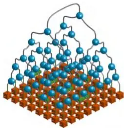
(a) 等轴投影视图

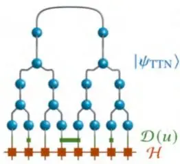
(b) 侧视图

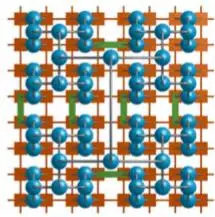
(c) 俯视图
图9.1 一个二维系统（$N = 8 \times 8$ 个格点）的 aTTN 在不同视角 (a)–(c) 下的示例。aTTN 包含一个内部 TTN $\psi_{\mathrm{TTN}}$（以蓝色张量和灰色连线表示），以及连接到该 TTN 输出连线上的一层纠缠消除器（disentangler）$\mathcal{D} ( u )$（绿色）。为便于说明，我们标出了一个作用在 aTTN 物理格点上的哈密顿量（橙色）。(c) 纠缠消除器层 $\mathcal{D} ( u )$ 以 $K_{\nu}$ 个纠缠消除器支撑内部 TTN 中最关键的连线，这些纠缠消除器连接由连线 ν 引入的二分区。为了编码面积律，$K_{\nu}$ 与边界长度 $\gamma_{\nu}$ 成比例缩放。（图转载自文献 [150]）

综上所述，一个 aTTN 态的总参数数量级为 $O ( N m^{3} + N_{D} d^{4} )$，其中 m 是内部 TTN 的键维数（bond dimension），$N_{D}$ 是纠缠消除器层 $\mathcal{D} ( u )$ 中纠缠消除器 $u_{k}$ 的数量。

### 9.1.2 aTTN 中的面积律

为了描述 aTTN 所捕捉的面积律，我们以二维方格点阵 $\mathcal{L}$ 为例，其格点数为 $N = L \times L$，并且有 $L = 2^{n}$ 。然而，其基本思想对于任意维数 $L_i$ 的 D 维点阵结构同样成立。此外，我们在此假设采用一个二叉树张量网络，其排列方式使得树内的张量在从一层到下一层时，交替地在 x 和 y 方向上对相邻格点进行粗粒化，如图 9.1 中的内部 TTN 所示（内部 TTN 以其蓝色张量和灰色连线表示）。这种树的顶层连线将整个系统 ℒ 二分为两个大小相等（$L \times L / 2$）的子系 $\mathcal{A}$ 和 $\mathcal{B}$。从 TTN 的顶层连线向下，每一层中的连线进一步将一个更小的 $l_{x} \times l_{y}$ 维子点阵进行分割。

现在，当我们考虑一个满足面积律的态 $\psi$ 时，二分区纠缠量级为被分割子系的边界 $\partial_{\nu}$，如方程 (8.4) 所述。在表 9.2 中，根据 ${\mathcal{L}}$ 的边界条件呈现了这个面积的大小。在此，我们引入了记号 $\gamma_{\nu [ k ]}$ 来表示由 TTN 第 k 层中的连线 ν 引入的分割所产生的子系 $\mathcal{A}^{\left[ \nu \right]}$ 的边界（子系大小为 $N / 2^{k}$）。如上述方程 (8.5) 所述，TTN 本身需要随 $\gamma_{\nu}$ 呈指数增长的键维数 $m_{\nu}$ 才能捕捉态 $\psi$ 的面积律纠缠。为了防止这种缩放，我们现在在 TTN 底部放置 $K_{\nu}$ 个纠缠消除器，以连接由连线 ν 引入的二分区 $\mathcal{A}^{\left[ \nu \right]}$ 和 $\mathcal{B}^{[ \nu ]}$。更准确地说，我们将纠缠消除器 $u_{k}$ 放置得使其一个物理格点 $i_{1}^{[ k ]}$ 或 $\bar{i}_{2}^{[ k ]}$ 属于子系 $\mathcal{A}^{\left[ \nu \right]}$，而另一个则对应于 $\mathcal{B}^{[ \nu ]}$。每个纠缠消除器最多可以评估一个属于两个局部希尔伯特空间的 ${\bar{d}}^{2}$ 维空间中的信息。因此，它可以将 TTN 的纠缠降低至 $d^{2}$ 量级。结果，所有 $K_{\nu}$ 个纠缠消除器共同作用，能够通过按以下量级消除纠缠信息来支撑 TTN 连线 ν：

$$
m_{\nu , \mathrm{aux}} \approx ( d^{2} )^{K_{\nu}}\tag{9.5}
$$

现在，当我们根据由连线 ν 引入的二分区边界 $\gamma_{l}$ 来缩放纠缠消除器的数量 $K_{\nu}$ 时，整个 aTTN 中沿由 ν 引入的网络截断面所捕捉到的信息量级为：

$$
m_{\nu , \mathrm{eff}} \approx m_{\mathrm{aux}} m_{\nu} = d^{2 K_{\nu} + \xi_{\nu}}\tag{9.6}
$$

表9.2 二维系统 $\mathcal{L}$ 中不同二分边界的大小（针对 $\mathcal{L}$ 的不同边界条件）
<table><tr><td rowspan=1 colspan=1></td><td rowspan=1 colspan=1> $\underline{{\gamma_{\nu [ 1 ]}}}$ </td><td rowspan=1 colspan=1></td><td rowspan=1 colspan=1> $\underline{{\gamma_{\nu [ 2 ]}}}$ </td><td rowspan=1 colspan=1></td><td rowspan=1 colspan=1> $\gamma_{\nu [ 3 ]}$ </td><td rowspan=1 colspan=1></td><td rowspan=1 colspan=1> $\underline{{\gamma_{\nu [ 4 ]}}}$ </td><td rowspan=1 colspan=1> $\dots$ </td></tr><tr><td rowspan=1 colspan=1>开放边界条件</td><td rowspan=1 colspan=1> $L$ </td><td rowspan=1 colspan=1></td><td rowspan=1 colspan=1> $L$ </td><td rowspan=1 colspan=1></td><td rowspan=1 colspan=1> ${\frac{5} {4}} L \ \mathrm{or} \ {\frac{3} {4}} L$ </td><td rowspan=1 colspan=1></td><td rowspan=1 colspan=1></td><td rowspan=1 colspan=1></td></tr><tr><td rowspan=1 colspan=1>柱面边界条件</td><td rowspan=1 colspan=1>L</td><td rowspan=1 colspan=1></td><td rowspan=1 colspan=1> $\frac{3} {2} L$ </td><td rowspan=1 colspan=1></td><td rowspan=1 colspan=1>2L 或 L</td><td rowspan=1 colspan=1></td><td rowspan=1 colspan=1></td><td rowspan=1 colspan=1></td></tr><tr><td rowspan=1 colspan=1>环面边界条件</td><td rowspan=1 colspan=1>2L</td><td rowspan=1 colspan=1>→</td><td rowspan=1 colspan=1>2L</td><td rowspan=1 colspan=1> $\underline{{\cdot 3 / 4}}$ </td><td rowspan=1 colspan=1> $\scriptstyle{\frac{3} {2}} L$ </td><td rowspan=1 colspan=1>2/3</td><td rowspan=1 colspan=1> $\scriptstyle{\frac{3} {2}} L$ </td><td rowspan=1 colspan=1> $\underline{{\cdot 3 / 4}}$ </td></tr></table>

因此，解纠缠器的合理放置会导致有效键维度的指数缩放，其中我们定义参数 $\xi_{n} u \equiv \log_{d} m_{\nu}$，反映了 TTN 键维度 $m_{\nu}$ 的贡献。为了根据式 (8.5) 对二维 aTTN 态编码面积律，由链接 ν 引入的不同二分之间的解纠缠器数量 $K_{\nu}$ 必须与边界 $\gamma_{\nu}$ 成正比，因此对于 $\nu = 1$，该比例正比于系统长度 $L$。

在实践中，我们知道对于树的较低分支，式 (9.6) 中的 $\xi_{\nu}$ 足够大，以至于能够精确捕捉面积律纠缠——甚至完整的态——特别是在局域维度 $d$ 合理小的情况下。因此，我们在 TTN 较小的plaquette内放弃了解纠缠器。遵循同样的思路，我们专注于用解纠缠器支持 TTN 中较高的链接，使得 $K_{\nu} \sim \gamma_{\nu}$，因为相比于所需的指数级大的键维度，$\xi_{\nu}$ 的贡献变得可忽略地小。等价地，当向更低层移动时，$\xi_{\nu}$ 的贡献权重越来越大，因此我们不需要严格强制执行 $K_{\nu} \sim \gamma_{\nu}$ 来在完整网络中捕捉面积律。

### 9.1.3 与其他张量网络的联系

在前几节中，我们详细描述了 aTTN 与成熟的 TTN 几何结构之间的联系。接下来，我们将阐述 aTTN 与 MERA 的相似性以及其与 PEPS 的联系。

MERA——aTTN 可被视为 MERA 的一个特定子类，其中我们为了更高的数值效率而牺牲了更高重整化能级的解纠缠器，从而也牺牲了尺度不变性。特别地，尺度不变性并非确保面积律的严格必要条件。的确，在 aTTN 中，我们将编码面积律的问题转化为 aTTN 底部解纠缠器的非平凡定位问题，我们可以通过后面讨论的几种方法来解决该问题。因此，aTTN 不一定具有 aTTN 预定义的、直接的尺度不变性结构，但通过巧妙的解纠缠器定位，它确实能够以 $O \left( m^{4} \right)$ 的主要复杂度（而非 MERA 情况下的 $O \left( m^{16} \right)$）来编码面积律。

PEPS——已有研究表明，MERA 可以直接映射为 PEPS [323]。遵循这一过程，并考虑到 aTTN 是 MERA 的一个子类，原则上我们可以将 aTTN 映射为一个具有通常各向异性键维度的 PEPS。实际上，得到的 PEPS 的键维度将高度依赖于解纠缠器（disentangler）的位置和内部 TTN 的键维度，这表明底部解纠缠器与内部 TTN 之间的相互作用是 aTTN 成功的关键。然而，我们在此指出，从计算的角度来看，在数值上执行此映射可能并无益处。

## 9.2 aTTN 的优化

对于 aTTN 的优化，我们假设完整的哈密顿量是相互作用的乘积 $\begin{array} {r} {\mathcal{H} = \sum_{p} \mathcal{H}_{p}} \end{array}$。因此，每个相互作用 $\mathcal{H}_{p}$ 都可以描述为张量积算子（Tensor Product Operator, TPO）。为简单起见，我们将自己限制在仅包含 (i) 局域项 $\mathcal{H}_{p} ~ = ~ h_{i_{p}}^{p}$（作用于格点 $i_{p}$）和 (ii) 物理格点 $i_{p}$ 与 $i_{p}^{\prime}$ 之间的两体相互作用 $\mathcal{H}_{p} ~ = ~ h_{i_{p}}^{p , 1} h_{i_{p}^{\prime}}^{p , 2}$ 的哈密顿量上。请注意，aTTN 方法的基本思想原则上可以应用于更复杂的哈密顿量 $\mathcal{H}$，但根据张量网络的表示，次要项的计算复杂度可能会增加。此外，当超越两格点相互作用时，数值实现也变得更加困难。

给定哈密顿量后，我们优化 aTTN 波函数 $\psi$ 的变分参数，通过最小化能量来寻找系统的基态：

$$
E = \langle \psi | {\mathcal{H}} | \psi \rangle ~ .\tag{9.7}
$$

aTTN 的这个优化过程包含三个不同的部分：(i) 解纠缠器 $u_{k}$ 的优化，(ii) 哈密顿量 $\mathcal{H} \stackrel{\mathcal{D} ( u )} {\longrightarrow}$ $\mathcal{H}_{\mathrm{aux}}$ 的映射，以及 (iii) 使用辅助哈密顿量 $\mathcal{H}_{\mathrm{aux}}$ 对内部 TTN 进行优化。

下面我们将更详细地描述优化的每个部分，然后给出一些关于优化实际应用的一般性评论。

### 9.2.1 解纠缠器层（u）

我们通过逐一优化构成 $\mathcal{D} ( u )$ 的所有解纠缠器来优化 aTTN 的层 $\mathcal{D} ( u )$。在图 9.2 中，我们展示了一个解纠缠器 $u_{k}$ 的优化过程。其基本思想源于一般的 MERA 优化 [147]，并针对 aTTN 的几何结构做了一些小的调整。因此，对于解纠缠器 $u_{k}$，需要最小化的能量 $E ~ = ~ \langle \Psi | H | \Psi \rangle$ 双线性地依赖于 $u_{k}$ 和 $u_{k}^{\dagger}$：

$$
E ( u_{k} ) = \underbrace{\mathrm{tr} \left\{\sum_{p} u_{k} M_{p} u_{k}^{\dagger} N_{p} \right\}}_{\equiv E_{k} ( u_{k} )} + c_{k} \ ,\tag{9.8}
$$

其中 $M_{p}$ 和 $N_{p}$ 是对应于 $u_{k}$ 与 $u_{k}^{\dagger}$ 的环境与哈密顿部分 $\mathcal{H}_{p}$ 进行不同收缩的两组矩阵。注意，$p$ 仅遍历作用于待优化解纠缠器的一个或两个格点上的哈密顿部分 $\mathcal{H}_{p}$。所有其他哈密顿部分 $\mathcal{H}_{p^{\prime}}$ 对总能量的贡献与解纠缠器 $u_{k}$ 无关，因此都被包含在能量 $E ( u_{k} )$ 的常数项 $c_{k}$ 中。因此，在优化 $u_{k}$ 时，我们只最小化式 (9.8) 的第一部分 $E_{k} ( u_{k} )$，并忽略 $c_{k}$ 中的常数贡献。对不同哈密顿部分 $p$ 的求和过程以张量网络表示的形式如图 9.2 所示。需要指出的是，在式 (9.8) 中，解纠缠器 $u_{k}$ 及其复共轭 $u_{k}^{\dagger}$ 通过融合各自的腿被重新构造成酉矩阵。

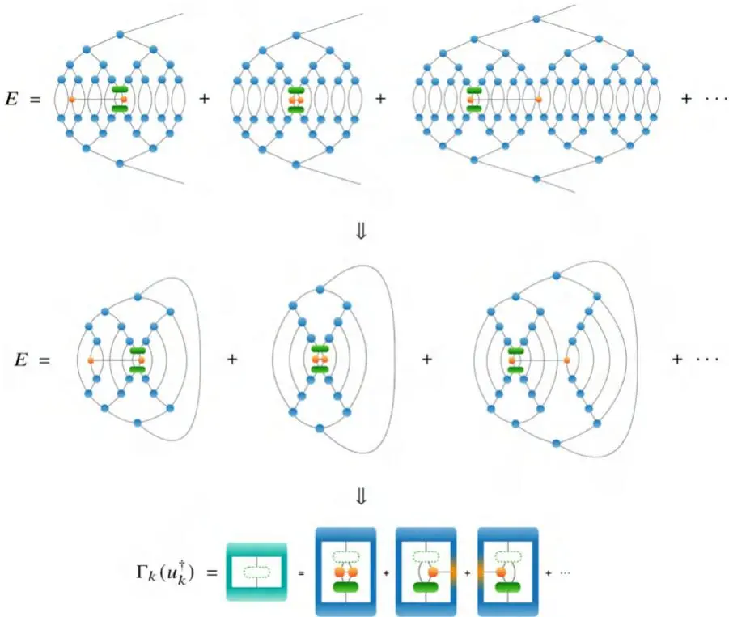
图 9.2  aTTN 中一个解纠缠器 $u_{k}$（绿色）的优化过程。[上] aTTN 的能量期望值 $E ( u_{k} )$。每个哈密顿部分 $\mathcal{H}_{p}$（橙色）与完整的 aTTN 收缩后累加得到 $E ( u_{k} )$。对于 $u_{k}$ 的优化，只需考虑连接到 $u_{k}$ 的部分 $\mathcal{H}_{p}$。[中] 当将内部 TTN 等距化至因果锥的锚节点时的 $E ( u_{k} )$ 收缩过程 [147]。因果锥外部的所有张量由于等距性约束而化为恒等算子而消失。[下] $u_{k}$ 的环境 $\Gamma_{k}$，包含所有相关贡献 $\mathcal{H}_{p}$。根据构造，有 $E = \mathrm{tr} \{ \{ u_{k} \Gamma_{k} \} \} + c_{k}$。通过分解 $\Gamma_{k} = U \sigma V^{\dagger}$，我们用 $u_{k} \equiv - V U^{\dagger}$ 优化解纠缠器 $u_{k}$。图片经许可转载自 [150]

为了将整个网络收缩为矩阵 $M_{p}$ 和 $N_{p}$，我们可以利用内部 TTN 的等距性。如针对 MERA 结构 [147] 所引入的，解纠缠器 $u_{k}$ 和相互作用部分 $\mathcal{H}_{p}$ 在收缩中的位置决定了张量的因果锥。我们在此将因果锥的锚定义为因果锥中仍包含的最高层张量（相对于 TTN 的层级结构）。因此，将内部 TTN 等距化至 $u_{k}$ 和 $\mathcal{H}_{p}$ 的因果锥锚节点后，因果锥外部的所有张量由于其等距性约束而化为恒等算子而消失。因此，整个网络的收缩可以简化为仅考虑因果锥内部的张量。

然而，在收缩得到环境矩阵 $M_{p}$ 和 $N_{p}$ 之后，并没有通用的算法能够同时求解式 (9.8) 中的双线性问题并满足式 (9.2) 中的等距性约束。因此，我们参考文献 [147] 的思路，通过将能量函数 $E_{k} ( u_{k} )$ 相对于解纠缠器 $u_{k}$ 线性化，来迭代地求解这个优化问题。在此过程中，$u_{k}$ 和 $u_{k}^{\dagger}$ 在一个迭代步骤中被暂时视为独立的张量。这使得我们可以在保持其复共轭 $\overset{\cdot} {u_{k}^{\dagger}}$ 不变的同时，相对于 $u_{k}$ 优化能量 $E_{k} ( u_{k} )$。对于这个线性化问题，能量泛函现在写作

$$
E_{k} ( u_{k} ) = \mathrm{tr} \left\{u_{k} \Gamma_{k} ( u_{k}^{\dagger} ) \right\} \mathrm{~ , ~}\tag{9.9}
$$

$$
\mathrm{with} \Gamma_{k} ( u_{k}^{\dagger} ) = \sum_{p} M_{p} u_{k}^{\dagger} N_{p}\tag{9.10}
$$

其中 $\Gamma_{k}$ 是通过收缩解纠缠器 $u_{k}$ 周围的完整环境得到的矩阵，如图 9.2 所示。因此，在每一步迭代中，我们针对 $u_{k}$ 优化 $E_{k} ( u_{k} )$，同时将 $u_{k}^{\dagger}$ 包含在环境 $\Gamma_{k}$ 中。因此，假设 $\Gamma_{k}$ 与 $u_{k}$ 无关，能量 $E_{k} ( u_{k} )$ 可通过令 $u_{k} = - V U^{\dagger}$ 达到最小化，其中 $U$ 和 $V$ 通过对 $\Gamma_{k} = U \sigma V^{\dagger}$ 进行奇异值分解得到。因此，通过构造，$u_{k}^{\prime}$ 满足式 (9.2) 的等距约束，因为 $U$ 和 $V$ 都是酉矩阵。该迭代步骤的最小化能量变为

$$
\tilde{E}_{k , m i n} = \mathrm{tr} \left\{u_{k} \Gamma_{k} \right\} = \mathrm{tr} \big \{- V U^{\dagger} U \sigma V^{\dagger} \big \} = - \sum_{i} \sigma_{i}\tag{9.11}
$$

注意，总能量为 $E ( u_{k} ) = E_{k , m i n} + c_{k}$，因为我们在最小化过程中忽略了常数 $c_{k}$。

结束一个迭代步骤后，整个程序将使用新的解纠缠器 $u_{k}^{\prime}$ 重复进行，直到 SVD 的奇异值 $\sigma_{i}$ 收敛，这等价于能量在最小化过程中收敛于 $E_{m i n}$。

总结解纠缠器 $u_{k}$ 的优化过程：

(i) 对于解纠缠器 $u_{k}$ 所涉及的所有哈密顿量部分 $\mathcal{H}_{p}$，收缩环境矩阵 $M_{p}$ 和 $N_{p}$

(ii) 在一步迭代中计算 $u_{k}$ 的环境 $\Gamma_{k}$

(iii) 通过 SVD 将 $\Gamma_{k}$ 分解为 $\Gamma_{k} = U \sigma V^{\dagger}$

(iv) 更新解纠缠器 $u_{k} u_{k}^{\prime} = - V U^{\dagger}$

(v) 从 (ii) 重新开始，直到所有 $\sigma_{i}$ 收敛。

一旦解纠缠器 $u_{k}$ 优化完成，我们就继续处理下一个解纠缠器，直到层 $\mathcal{D} ( u )$ 中的所有解纠缠器都优化完毕。由于解纠缠器在排列上不共享物理哈密顿量 $\mathcal{H}$ 的相互作用部分 $\mathcal{H}_{p}$，因此每个解纠缠器 $u_{k}$ 的优化完全独立于其他解纠缠器 $u_{k^{\prime}}$。因此，只需要对每个解纠缠器优化一次即可得到优化后的解纠缠器层 $\mathcal{D} ( u )$——此外，每个解纠缠器的所有优化过程都可以完全并行化。

一个解纠缠器的完整优化可以通过复杂度 $O ( m^{4} d^{2} + \bar{m}^{3} d^{4} \bar{+} d^{6} )$ 完成，其中上述总结的步骤 (i) 的收缩规模为 $O ( m^{4} d^{2} + m^{3} d^{4} )$，步骤 (ii) 为 $O ( d^{6} )$，步骤 (iii) 中的分解也为 $O ( d^{6} )$。注意，最昂贵的部分步骤 (i) 可以在对一个解纠缠器 $u_{k}$ 的完整优化过程中只执行一次，并且在迭代过程中不需要重新计算。

### 9.2.2 哈密顿量映射

在每次优化解纠缠器层 $\mathcal{D} ( u )$ 之后，需要利用新优化后的解纠缠器层 $\mathcal{D} ( u )$ 对物理哈密顿量进行映射，以供后续的 TTN 优化使用。对于 aTTN，我们考虑系统的哈密顿量 $\mathcal{H} \in \mathcal{H}$ 是相互作用项 $\begin{array} {r} {\mathcal{H} = \sum_{p} \mathcal{H}_{p}} \end{array}$ 的乘积。如上所述，aTTN 引入了一个解纠缠器层 $\mathcal{D} ( u )$，它将 $\mathcal{H}$ 映射到一个辅助哈密顿量 $\mathcal{H}_{\mathrm{aux}} \equiv$ $\mathcal{D} ( u ) \mathcal{H} \mathcal{D}^{\dag} ( u )$，作为 TTN 的预处理。能量期望值

$$
\langle \psi_{\mathrm{aTTN}} | \mathcal{H} | \psi_{\mathrm{aTTN}} \rangle = \langle \psi_{\mathrm{TTN}} | \underbrace{\mathcal{D} ( u ) \mathcal{H} \mathcal{D}^{\dagger} ( u )}_{\equiv \mathcal{H}_{\mathrm{aux}}} | \psi_{\mathrm{TTN}} \rangle\tag{9.12}
$$

等于内部TTN波函数下映射哈密顿量的期望值。完整哈密顿量的变换 $\mathcal{H} \stackrel{\mathcal{D} ( u )} {\longrightarrow} \mathcal{H}_{\mathrm{aux}}$ 通过将每个相互作用部分 $\mathcal{H}_{p}$ 分别与 $\mathcal{D} ( u )$ 缩并完成。

接下来，我们将针对一般算子 $\mathcal{T}$ 说明这种映射，将其描述为张量积算子（Tensor Product Operator，TPO）：

$$
( \mathcal{T} )_{\{i_{j}^{\prime} \}}^{\{i_{j} \}} = \sum_{\{\gamma_{\nu} \}} \prod_{j} ( \mathrm{t}^{[ j ]} )_{i_{j} , i_{j}^{\prime}}^{\{\gamma_{\nu^{\prime}} \}}\tag{9.13}
$$

参照文献[170]的定义。其中，第 $j$ 个张量 $\mathbf{t}^{[ j ]}$ 局域作用在位点 $i_{j}$ 上，并通过连接键 $\{\gamma_{\nu^{\prime}} \}$ 与TPO中的其他张量相连。因此，完整的TPO作用在物理位点 $\{i_{j} \}$ 上。在这个TPO形式体系中，我们可以描述例如局域可观测量 $\mathcal{T}_{i}$、哈密顿量 $\mathcal{H}$ 的一个相互作用部分 $\mathcal{H}_{p}$、弦可观测量 $\mathcal{T}_{\{i_{j} \}}$ 或者更一般的结构（如MPO）。

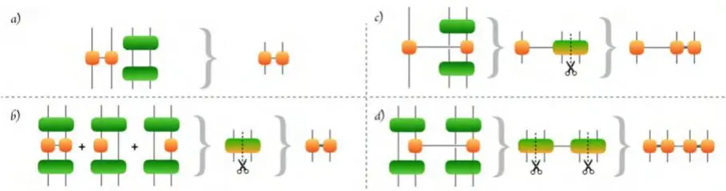
图9.3 (a) 不连接解纠缠器的算子的平凡映射。(b) 完全作用于解纠缠器 $u_{k}$ 所覆盖子空间的多个哈密顿量部分 $\mathcal{H}_{p}$ 的映射。将每个算子 $\mathcal{H}_{p}$ 单独缩并后，所得张量作用于同一空间，可以求和。对所得张量进行分解以完成映射。(c) 一个位点由解纠缠器 $u_{k}$ 覆盖、另一个位点无解纠缠器的算子的映射。将算子与 $u_{k}$ 和 $u_{k}^{\dagger}$ 缩并后，对缩并后的张量进行分解，得到映射后的TPO。(d) 两个位点分别由不同解纠缠器 $u_{k}$ 和 $u_{k}^{\prime}$ 覆盖的算子的映射。将两个张量缩并后，对缩并后的张量进行分解，得到映射后的TPO。图片经许可转载自[150]

因此，映射 $\mathcal{T} \xrightarrow{\mathcal{D} ( u )} \mathcal{T}_{a u x}$ 通过将TPO $\mathcal{T}$ 与层 $\mathcal{D} ( u )$ 中相应的解纠缠器缩并来完成。这种映射可以根据图9.3中描绘的四种不同情况来变换算子 $\mathcal{T}$。

(a) 平凡映射——令 $\mathcal{D} ( u )$ 中没有解纠缠器 $u_{k}$ 作用于算子 $\mathcal{T}$ 的任何一个物理位点 $\{i_{j} \}$（$\nexists u_{k} : i_{k} \in \{i_{j} \} \vee i_{k^{\prime}} \in \{i_{j} \}$）。因此，$\mathcal{T}$ 不受解纠缠器层 $\mathcal{D} ( u )$ 的影响，映射实际上退化为恒等变换，得到 $\mathcal{T}_{\mathrm{aux}} = \mathcal{T}$。

(b) 映射到双位点TPO——令解纠缠器 $u_{k}$ 作用于算子 $\mathcal{T}$ 所作用的所有位点 $\{i_{j} \}$（$\forall j : i_{j} \in \{k_{1} , k_{2} \}$）。在这种情况下，$\mathcal{T} \equiv \mathcal{T}_{i}$ 要么是仅作用在单个位点 $i_{1} \in \{k_{1} , k_{2} \}$ 上的局域算子，要么是作用在解纠缠器 $u_{k}$ 所覆盖的完全相同位点 $\{k_{1} , k_{2} \}$ 上的双位点算子 $\mathcal{T} \equiv \mathcal{T}_{k_{1} , k_{2}}$。

映射的第一步，我们将TPO与 $u_{k}$ 和 $u_{k}^{\dagger}$ 缩并得到：

$$
( \mathcal{T}_{\mathrm{contr}} )_{k_{1}^{\prime} , k_{2}^{\prime}}^{k_{1} , k_{2}} = \sum_{i_{1} , i_{2} , i_{1}^{\prime} , i_{2}^{\prime}} ( u_{k} )_{i_{1} , i_{2}}^{k_{1} , k_{2}} ( \mathcal{T} )_{\{i_{j}^{\prime} \}}^{\{i_{j} \}} ( u_{k}^{\dagger} )_{k_{1}^{\prime} , k_{2}^{\prime}}^{i_{1}^{\prime} , i_{2}^{\prime}} .\tag{9.14}
$$

接着，我们通过奇异值分解对所得张量 $\mathcal{T}_{\mathrm{contr}}$ 进行分解，得到两个张量——分别对应被解纠缠器 $u_{k}$ 作用的两个格点，从而构成映射后的张量积算子 $\mathcal{T}_{\mathrm{aux}}$ 。注意，若原始 TPO 是一个内部键维为 $\kappa$ 的两格点算子，此映射可能导致映射后算子 $\mathcal{T}_{\mathrm{aux}}$ 具有不同的键维 $\kappa^{\prime} \neq \kappa$。无论如何，这个新键维受限于 $\kappa^{\prime} \leq d^{2}$。

我们也要指出，在映射哈密顿量 $\mathcal{H}$ 的情况下，可以有多个相互作用部分 $\mathcal{H}_{p}$，它们都只作用在被解纠缠器 $u_{k}$ 作用的子空间 $\mathcal{H}_{k_{1}} \otimes \mathcal{H}_{k_{1}}$ 内。图 9.3 展示了这样一个例子，包含一个两格点相互作用和两个局部哈密顿量部分，它们都要与同一个解纠缠器 $u_{k}$ 缩并。这里值得指出的是，在按式 (9.14) 缩并后，所有相互作用部分 $(\mathcal{H}_{p})_{\mathrm{contr}}$ 可以相加，因为现在它们都作为同一个张量作用于相同的子空间。相加后的张量随后被分解，得到映射后用于辅助哈密顿量 $\mathcal{H}_{a u x}$ 的两格点 TPO。

(c) 使用一个解纠缠器的映射——假设只有一个解纠缠器 $u_{k}$，它至少作用在但不是全部格点 $\{i_{j} \}$ 上（即 $\exists i_{k} : i_{k} \in i_{j}$ 且 $\exists i_{m} \in i_{j} : i_{m} \notin \{i_{k} \})$。在这种情况下，映射过程与前一种情况类似。首先，我们将算子 $\mathcal{T}$ 在相连的链路上与解纠缠器 $u_{k}$ 及其共轭 $u_{k}^{\dagger}$ 缩并：

$$
(\mathcal{T}_{\mathrm{contr}})_{k_{1} , k_{2} , \{i_{m}^{\prime} \}}^{k_{1} , k_{2} , \{i_{m} \}} = \sum_{i_{1} , i_{2} , i_{1}^{\prime} , i_{2}^{\prime}} (u_{k})_{i_{1} , i_{2}}^{k_{1} , k_{2}} (\mathcal{T})_{\{i_{j}^{\prime} \}}^{\{i_{j} \}} (u_{k}^{\dag})_{k_{1}^{\prime} , k_{2}^{\prime}}^{i_{1}^{\prime} , i_{2}^{\prime}} .\tag{9.15}
$$

缩并后，我们对张量 $\mathcal{T}_{\mathrm{contr}}$ 进行分解，以保持 TPO 结构，其中每个张量对应一个物理格点。由此，我们得到映射后的 TPO，它包含相同数量的张量（当 $u_{k}$ 与 TPO 的两个张量缩并时），或者多出一个张量（$u_{k}$ 只作用于 $\mathcal{T}$ 的一个张量）。注意，这里 TPO 内部的键维 $\kappa^{\prime} \neq \kappa$ 可能增加，但仍受限于 $\kappa^{\prime} \leq d^{2}$（当 $H_{p}$ 是两格点 TPO 时），或者对于某些具有较大 TPO 大小的情况，受限于 $\kappa^{\prime} \leq \kappa d^{2}$。

(d) 使用两个或更多解纠缠器的映射——假设有 K 个解纠缠器 $\{u_{k} \}$ 作用于格点 $\{i_{j} \}$。在这个最一般的情况下，算子 $\mathcal{T}$ 的映射变得高度非平凡。这里，与解纠缠器层的缩并是通过将算子 $\mathcal{T}$ 与所有 K 个连接的解纠缠器缩并完成的：

$$
(\mathcal{T}_{\mathrm{contr}})_{\{i_{m} \}}^{\{i_{m} \}} = \sum u_{k_{1}} u_{k_{2}} \dots u_{k_{K}} \mathcal{T}_{\{i_{j}^{\prime} \}}^{\{i_{j} \}} u_{k_{1}}^{\dagger} \dots u_{k_{2}}^{\dagger} u_{k_{1}}^{\dagger} .\tag{9.16}
$$

为了简洁起见，我们省略了解缠结器的指标。此外，我们引入了指标集合 $\{i_{m} \}$，它包含所有 $K$ 个解缠结器 $\{u_{k} \}$ 的所有指标 $i_{k}$，以及原始算子 $\mathcal{T}$ 中所有未参与收缩的物理腿 $i_{j}$ 的指标。同样需要注意的是，解缠结器 $u_{k}$ 的施加顺序并不重要，因为所有 $u_{k}$ 作用在完整希尔伯特空间 $\mathcal{H}$ 的不同子空间上，因此彼此对易。这里，得到的算子 $\mathcal{T}_{\mathrm{contr}}$ 再次被分解回TPO结构，其张量作用在TTN的单个格点上。对于一个一般的TPO（其结构甚至可能包含环，例如PEPO [204–206]），这种分解是一项高度非平凡的任务。此外，对于无环TPO，这种映射可能再次导致TPO内部键维度的增加。

考虑到辅助哈密顿量 $\mathcal{H}_{\mathrm{aux}}$ 用于优化TTN，一个任意无环的相互作用 $\mathcal{H}_{p}$ 被映射为一般的MPO，在最坏情况下仍会将整体优化的复杂度提升到随系统大小呈指数增长的 $O ( m^{\bar{4}} d^{L} )$。但如果我们将所有哈密顿量部分 $\mathcal{H}_{p} ~ = ~ h_{p , 1} h_{p , 2}$ 限制为仅最近邻相互作用，则额外的代价被限制为最坏情况下的前因子 $d^{4}$。为了进一步消除这个前因子，我们可以在构造aTTN时施加约束，以防止某相互作用部分 $\mathcal{H}_{p}$ 被两个或更多解缠结器处理。因此，对于最近邻相互作用，我们严格禁止将两个解缠结器 $u_{k}$ 和 $u_{k}^{\prime}$ 附加到相邻格点上，如图9.1所示。这不仅降低了整个算法的二阶缩放复杂度，还简化了数值实现，并引入了更高的并行化潜力，因为现在所有解缠结器在优化过程中都可以完全独立地处理。

## 9.2.2.1 树张量网络（Tree Tensor Network, TTN）

TTN的优化遵循[第8章](ch08.md)的规定。TTN中每对连接张量通过子空间扩展技术（subspace-expansion technique）进行优化，该技术近似于双格点更新 [170]。与直接双格点优化的更高数值复杂度 $O \left( m^{6} \right)$（见第8.1.4.2节）相比，该技术保持了有利的 $O \left( m^{4} \right)$ 缩放。每个单个张量优化的局部优化通过Arnoldi算法（见第8.1.4.2节）进行，该算法通过迭代对角化相应的有效哈密顿量 $H_{eff}$ 来解决局部本征值问题，并在预定精度内返回 $H_{eff}$ 的最低本征值。

我们通过从TTN底部到顶部逐步执行这些局部优化（包括空间扩展技术）来优化全局TTN态。空间扩展尤其总是对局部目标张量及其父张量（作为空间扩展伙伴）一起进行。

<!-- glossary: 无新术语 -->

## 9.2.2.2 一般说明

在实践中，我们从随机初始化的TTN开始进行aTTN的完整优化。我们首先忽略解缠层 $\mathcal{D} ( u )$ ，用物理哈密顿量对TTN迭代几次。在这一部分，我们使用相对较大的空间扩展和较低的精度来求解每个张量的局部本征值问题。因此，我们的目标是高效地 (i) 调整TTN中随机初始化的对称性扇区，以便对基态进行定性描述，以及 $( i i )$ 利用这个定性的TTN波函数来高级初始化aTTN。因此，我们从一个由结果TTN和一组单位元 $\{u_{k} \} \equiv \{\mathbb{1} \}$ 组成的aTTN开始，这些单位元附加在我们希望解缠的格点上，形成初始解缠层 $\mathcal{D} ( u )$ 。随后，我们通过优化解缠器一次，映射到 $\mathcal{H}_{\mathrm{aux}}$ 并执行n步TTN优化来优化aTTN，其中我们通常选择 $n \in \{1 , 2 , 3 \}$。

此外，在本文获得的结果中，我们通过将优化过程中不同哈密顿量部分 $\mathcal{H}_{p}$ 的收缩并行化，改进了TTN优化。另外，我们想指出，在我们的实际应用中，优化解缠器和映射哈密顿量的计算时间与TTN优化相比可以忽略不计。最后我们指出，在aTTN方法中仍有通过并行化进行改进的空间，因为TTN优化可以进一步以类似于并行DMRG [318] 以及解缠器优化的方式进行并行化。

## 9.3 可观测量计算

### 9.3.1 局域可观测量

设 $O^{[ s ]}$ 是作用于aTTN态 $\psi$ 的格点s上的局域可观测量。为了计算期望值 $\langle \bar{O}^{[ s ]} \rangle_{\psi} = \langle \psi | O^{[ s ]} | \psi \rangle$ ，我们区分两种不同情况：

(i) 解缠器 $u_{k}$ 放置在格点s处——因此将其与格点 ${\widetilde{s}}$ 连接起来，或者 (ii) 没有解缠器附加到物理格点s上。

在后者的情况下，单体算符 $O^{[ s ]}$ 被简单地传递给TTN，并通过TTN中局域观测量的标准计算得出，因为 $O^{[ s ]}$ 不受解缠层 $\mathcal{D} ( u )$ 的影响，并且等距性质 $\mathcal{D} ( u ) \mathcal{D}^{\dagger} ( u ) = 1$ 成立。利用TTN中适当的等距，该计算可以通过仅收缩三个张量来完成[170]。

然而，在情况(i)中，局域算符被解缠层 $\mathcal{D} ( u )$ 映射为双体算符，因为它与 $u_{k}$ 和 $u_{k}^{\dagger}$ 收缩为

$$
( O_{a u x}^{[ s ]} )_{k_{1}^{\prime} , k_{2}^{\prime}}^{k_{1} , k_{2}} = \sum_{s , s^{\prime} , \tilde{s}} ( u_{k} )_{s , \tilde{s}}^{k_{1} , k_{2}} ( O^{[ s ]} )_{s^{\prime}}^{s} ( u_{k}^{\dagger} )_{k_{1}^{\prime} , k_{2}^{\prime}}^{s^{\prime} , \tilde{s}} .\tag{9.17}
$$

<!-- glossary: 无新术语 -->

因此，在这种情况下，$\langle O^{[ s ]} \rangle_{\psi}$ 的计算实际上变成了对 TTN 中关联函数 $\dot{\langle{( O_{a u x}^{[ s ]} )}_{k_{1}^{\prime} , k_{2}^{\prime}}^{k_{1} , k_{2}} \rangle}_{\psi}$ 期望值的计算。底层收缩的最坏情况复杂度为 $O ( m^{4} \kappa \log N ) + O ( m^{4} \kappa \log N - 1 ) + O ( m^{3} \kappa )$。

### 9.3.2 关联函数

令 $O^{[ s_{1} , s_{2} ]}$ 为作用在 aTTN 态 $\psi$ 的格点 s 和 $s^{\prime}$ 上的关联函数。为了计算期望值 $\langle{\cal O}^{[ s , s^{\prime} ]} \rangle_{\psi} = \langle \psi \vert{\cal O}^{[ s , s^{\prime} ]} \vert \psi \rangle$，我们针对映射 $\mathcal{D} ( u )$ 区分以下四种不同情况——其中一些与第 9.2.2 节描述的映射相似甚至相同：

(a) 平凡映射——假设在层 $\mathcal{D} ( u )$ 中没有解除纠缠算符 $u_{k}$ 连接到关联函数的物理格点 $s_{1}$ 或 $s_{2}$ 中的任何一个。因此，关联函数 $O^{[ s ]}$ 可以——如局部可观测量所述——直接传递到 TTN，并通过 TTN 中关联函数的标准计算进行计算，因为这里 $O^{[ s_{1} , s_{2} ]}$ 再次不受解除纠缠层 $\mathcal{D} ( u )$ 的影响，映射实际上变成了恒等映射。这种后续的 TTN 收缩可以在最坏情况复杂度 $O ( m^{4} \log N ) +$ $O ( m^{4} \log N - 1 ) + O ( m^{3} )$ 下完成。

(b) 映射到两格点 TPO——假设解除纠缠算符 $u_{k}$ 连接关联函数 $O^{[ s_{1} , s_{2} ]}$ 作用的两个格点 $s_{1}$ 和 $s_{2}$。在这种情况下，关联函数通过解除纠缠层 $\mathcal{D} ( u )$ 映射到另一个两格点算子，因为它与 $u_{k}$ 和 $u_{k}^{\dagger}$ 收缩为

$$
( O_{a u x}^{[ s_{1} , s_{2} ]} )_{k_{1}^{\prime} , k_{2}^{\prime}}^{k_{1} , k_{2}} = \sum_{s_{1} , s_{2} , s_{1}^{\prime} , s_{2}^{\prime}} ( u_{k} )_{s_{1} , s_{2}}^{k_{1} , k_{2}} ( O^{[ s_{1} , s_{2} ]} )_{s_{1}^{\prime} , s_{2}^{\prime}}^{s_{1} , s_{2}} ( u_{k}^{\dagger} )_{k_{1}^{\prime} , k_{2}^{\prime}}^{s_{1}^{\prime} , s_{2}^{\prime}} .\tag{9.18}
$$

因此，$\langle O^{[ s_{1} , s_{2} ]} \rangle_{\psi}$ 的计算变成了计算 TTN 中关联函数 $\langle O_{a u x}^{[ s_{1} , s_{2} ]} \rangle_{\psi}$ 的期望值。底层收缩的最坏情况复杂度为 $O ( m^{4} \kappa \log N ) +$ $O ( m^{4} \kappa$ log $N - 1 ) + O ( m^{3} \kappa )$，其中 $\kappa$ 描述了映射后 TPO 的内部键维数。

(c) 映射到三格点 TPO——假设只有一个解除纠缠算符 $u_{k}$ 作用于格点 $s_{1}$ 或 $s_{2}$ 中的一个，并将其与格点 $s_{3} \notin \{s_{1} , s_{2} \}$ 连接。这里，层 $\mathcal{D} ( u )$ 将关联函数映射到一个三格点算子，因为它收缩为

$$
( {\cal O}_{a u x}^{[ s_{1} , s_{2} ]} )_{k_{1}^{\prime} , k_{2}^{\prime} , s}^{k_{1} , k_{2} , s} = \sum_{s_{c} , \tilde{s} , s_{c}^{\prime}} ( u_{k} )_{s_{c} , \tilde{s}}^{k_{1} , k_{2}} ( {\cal O}^{[ s_{c} , s ]} )_{s_{c}^{\prime} , s^{\prime}}^{s_{c} , s} ( u_{k}^{\dagger} )_{k_{1}^{\prime} , k_{2}^{\prime}}^{s_{c}^{\prime} , \tilde{s}} .\tag{9.19}
$$

注意，这里我们不失一般性地将符号从 $O^{[ s_{1} , s_{2} ]}$ 改为 $O^{[ s_{c} , s ]}$，其中 $s_{c}$ 表示关联函数连接到解除纠缠算符 $u_{k}$ 的键，因此需要被缩并，而 $s$ 表示生成的三位点算符中剩余的键。完成映射后，计算等价于对 TTN 计算一个弦可观测量（string observable）的期望值 $\langle O_{a u x}^{[ s_{1} , s_{2} ]} \rangle_{\psi}$，其最坏情况下的复杂度为 $O ( m^{4} \kappa \log N ) + O ( m^{4} \kappa \log N - 1 ) + O ( m^{3} \kappa )$。

(d) 映射到四位点 $T P \bar{O} \mathrm{-}$。令解除纠缠算符 $\boldsymbol{u}_{k_{1}}$ 和 $\boldsymbol{u}_{k_{2}}$ 分别位于位点 $s_{1}$ 或 $s_{2}$，并与不在 $\{s_{1} , s_{2} \}$ 中的位点 $s_{3}$ 和不在 $\{s_{1} , s_{2} \}$ 中的位点 $s_{4}$ 相连。在这种最复杂的情况下，关联函数被映射为一个四位点算符，其缩并形式为：

$$
( O_{a u x}^{[ s_{1} , s_{2} ]} )_{k_{1}^{\prime} , k_{2}^{\prime} , k_{3}^{\prime} , k_{4}^{\prime}}^{k_{1} , k_{2} , k_{3} , k_{4}} = \sum_{s_{1} , s_{2} , k^{\prime} , k^{\prime \prime}} ( u_{k_{1}} )_{k^{\prime} , s_{1}}^{k_{1} , k_{2}} ( u_{k_{2}} )_{k^{\prime \prime} , s_{2}}^{k_{3} , k_{4}} ( O^{[ s_{1} , s_{2} ]} )_{s_{1}^{\prime} , s_{2}^{\prime}}^{s_{1} , s_{2}} ( u_{k_{2}}^{\dag} )_{k_{3}^{\prime} , k_{4}^{\prime}}^{k^{\prime \prime} , s_{2}^{\prime}} ( u_{k_{1}}^{\dag} )_{k_{1}^{\prime} , k_{2}^{\prime}}^{k^{\prime} , s_{1}^{\prime}} .
$$

完成此映射后，计算再次等价于对 TTN 计算一个弦可观测量的期望值，这种情况下最坏复杂度为 $O ( m^{4} \kappa^{2} \log N ) + O ( m^{4} \kappa^{2} \log N - 1 ) + O ( m^{3} \kappa )$。

## 9.4 数值研究

为了对标 aTTN 算法，我们分析反铁磁二维海森堡模型（antiferromagnetic two dimensional Heisenberg model）：

$$
\mathcal{H} = \sum_{i , j = 1}^{L} \sum_{\gamma \in \{x , y , z \}} \sigma_{i , j}^{\gamma} \sigma_{i + 1 , j}^{\gamma} + \sigma_{i , j}^{\gamma} \sigma_{i , j + 1}^{\gamma} ,
$$

其中$\sigma_{i , i}^{\gamma} \left( \gamma \in \left\{x , y , z \right\} \right)$是作用在位点$( i , j )$上的泡利矩阵。我们考虑一个$L \times L$的晶格，系统尺寸$L = \{8 , 16 , 32 \}$，并设置边界项$\sigma_{i , N + 1}^{x} = \sigma_{i , 1}^{x}$和$\sigma_{N + 1 , j}^{x} = \sigma_{1 , j}^{x}$作为周期性边界条件。该海森堡哈密顿量的基态具有幂律衰减的相关性，并且已被多种数值方法确立为一个具有挑战性的基准问题。

### 9.4.1 能量密度计算

在图9.4中，我们比较了TTN和aTTN在增加键维数m时获得的能量密度。显然，在相同键维数下，aTTN比TTN更精确。然而，由于数值复杂度中存在一个常数预因子$c$，aTTN的CPU时间$t \approx O \left( c m^{4} \right)$在相同键维数下更高。因此，我们计算了不同ansätze与通过量子蒙特卡洛[324]获得的最佳已知结果的相对误差。正如预期，当两种方法的键维数相同时，aTTN在能量密度上比TTN获得更高的精度，但完成完整优化所需的CPU时间更多。然而，在恒定CPU时间下，对于足够大的键维数m，aTTN最终在能量密度精度上仍然优于TTN。因此，对于这些二维模拟，它显然是更高效的张量网络。在图9.4 c和d中，我们将每次计算的CPU时间与精度进行比较，以此作为ansätze效率的衡量标准，即哪个张量网络在恒定CPU时间内提供更低的相对误差。我们看到，在低CPU时间（因此键维数低）下，扩大TTN的键维数更高效，而随着模拟时间（即键维数）的增加，aTTN最终成为更高效的ansätze。我们注意到，这个预因子c取决于aTTN的解纠缠器所处理的哈密顿量部分$\mathcal{H}_{p}$的数量。

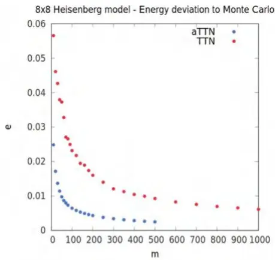

海森堡模型 - 与蒙特卡洛的能量偏差
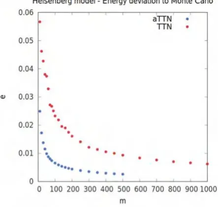

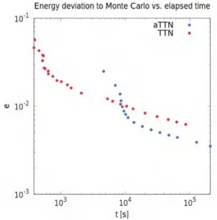

与蒙特卡洛的能量偏差 vs. 运行时间
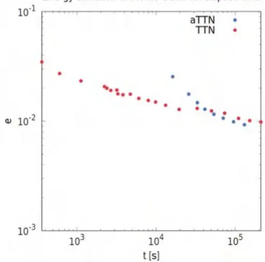
图9.4 二维海森堡基态能量的相对误差δE与通过量子蒙特卡洛[324]获得的最佳估计值的比较，作为(a) $L = 8$时的键维数m, (b) $L = 16$时的键维数m, (c) $L = 8$时的CPU时间t s, 和(d) $L = 16$时的CPU时间t s的函数。TTN结果用红色表示，aTTN用蓝色表示。经[150]许可转载此图

当我们用键维进行外推时，进一步确认了aTTN相较于TTN在两种系统尺寸下都更精确，对于$L = 8$和$L = 16$，能量密度偏差分别为$\epsilon_{8} = 2.22 \cdot 10^{- 5}$和$\epsilon_{16} = 7.11 \cdot 10^{- 4}$（相对于蒙特卡洛结果）。相比之下，TTN在$8 \times 8$情况下表现尚可，但当$L$增加到16时，精度上就存在问题。有趣的是，对于$L = 16$，aTTN得到的基态能量密度甚至比其它变分ansätze（如神经网络态[325] $(\epsilon_{10} \approx 7.5 \cdot 10^{- 4})$、纠缠对态（Entangled Pair States）[326] $(\epsilon_{10} = 2.5 \cdot 10^{- 3})$ 或PEPS [39] $(\epsilon_{10} = 1.5 \cdot 10^{- 3})$）在更小的有限系统尺寸$L = 10$下的结果还要精确。事实证明，对于这个模型，2D-DMRG [188]是一个非常有竞争力的变分方法，它在处理大小为$L = 10$（$\epsilon_{10} \approx 2 \cdot 10^{- 5}$）、具有开放或圆柱边界条件的有限系统时，性能优于其它方法，但在处理周期性边界条件和更大的系统尺寸$L \gtrsim 12$时则遇到困难。我们还需提及，PEPS以其直接能在热力学极限下描述无限系统的能力（如iPEPS [327, 328]）而非常高效。同时我们也指出，其它更复杂的神经网络态，如神经自回归量子态（Neural Autoregressive Quantum States）[329]，在$L = 10$时获得了$\epsilon_{10} \approx 3.5 \times 10^{- 5}$的可比结果。

此外，我们将分析扩展到了$N = 32 \times 32$的系统尺寸，据我们所知，目前还没有其它公开方法的结果可供比较。与文献[324]的有限尺寸标度分析一致，我们得到外推至$m \to \infty$的能量密度为$\epsilon_{32} ~ = ~ - 0.669 ( 1 )$。我们提到，存在将张量网络与变分蒙特卡洛（Variational Monte Carlo）相结合的技术，如PEPS++ [330, 331]所示，它在处理最大至$N = 32 \times 32$的系统大小时展现出了巨大潜力和强劲结果。然而，由于该情况下的基础PEPS几何结构，这种方法仍然受到其$O \left( m^{10} \right)$的不佳数值规模的影响，并且需要巨大的计算量才能获得这些结果。

### 9.4.2 关联

除了能量密度，我们还比较了TTN和aTTN两种方法所捕捉到的关联。具体而言，我们计算了两体关联 $\langle \sigma_{i , j}^{z} \sigma_{i^{\prime} , j^{\prime}}^{z} \rangle$。在图9.5中，我们展示了$8 \times 8$尺寸 (a) 和$16 \times 16$尺寸 (b) 下不同键维数的关联结果。显而易见的是，随着变分参数数量的增加，即随着键维数m的增加，这些ansätze计算出的关联变得更加精确。实际上，当在相同键维数下比较两种方法时，aTTN模拟得到的关联明显更准确，这证明了aTTN在描述两体关联方面具有更高的精度。有趣的是，在$L = 16$的情况下，对于较短距离$r ( i , j ) < 5$，通过TTN计算的一些关联在相同键维数下比aTTN的关联更精确，而TTN的关联在更长距离$r ( i , j ) > 5$下则明显下降得更快。在最远距离测量点$r ( 8 , 8 ) = 8 \sqrt{2}$处，我们观察到，键维数$m_{\mathrm{TTN}} ~ = ~ 120$的TTN关联最终达到了与较低键维数$m_{\mathrm{aTTN}} = 80$的aTTN关联相同的精度，而$m_{\mathrm{TTN}} = 80$时，TTN的关联明显低于键维数$m_{\mathrm{aTTN}} = 40$的aTTN关联。

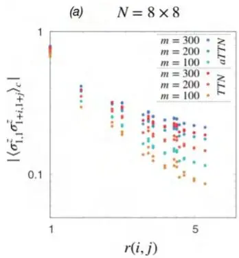

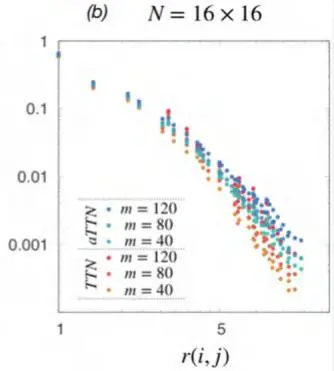
图9.5  TTN（不同键维数以红色调表示）和aTTN（不同键维数以蓝色调表示）表示中基态海森堡哈密顿量的连通关联函数，绘制为距离$r ( i , j ) \equiv [ i^{2} + j^{2} ]^{1 / 2}$的函数，其中$i \le j \in \{0 , L / 2 \} \times \{0 , L / 2 \}$。经[150]许可转载此图

我们指出，此处在aTTN模拟（以及TTN模拟）中利用了 $U(1)$ 对称性。然而，对于该模型，我们还可以通过将当前的 $SU(2)$ 对称性纳入模拟框架中来进一步大幅提升aTTN的性能 [170, 316, 332]。这尤其会 (i) 大幅改善连通关联（connected correlations），因为我们强制 $\langle \hat{\sigma}_{j}^{\alpha} \rangle = 0$ ，并且 $\langle \hat{\sigma}_{i}^{\alpha} \hat{\sigma}_{j}^{\alpha} \rangle$ c 等价且与 $\alpha ~ \in ~ \{x , y , z \}$ 无关，以及 (ii) 减少有效键维（effective bond dimension），从而减少计算时间，因为对于非阿贝尔对称性，我们仅在对称多重态空间（symmetry multiplet spaces）内工作。这两种优势预计将显著提高估计能量的精度。

### 9.4.3 解纠缠子的工程设计（Disentangler Engineering）

此外，我们基于海森堡模型对aTTN中解纠缠子的位置进行了分析。特别地，我们使用三种不同的几何构型进行模拟（见图9.6），研究aTTN几何构型对 $L = 8, 16$ 时整体精度的影响：

(a) 在该策略中，我们首先放置尽可能多的解纠缠子以加强最顶层的链接（其二分区在图9.6a中用红色虚线表示），然后放置尽可能多的解纠缠子以加强第二高层的链接（用蓝色表示），以此类推。遵循此策略，对于 $8 \times 8$ 系统，我们放置所有 $N_{D} = K_{1} = 8$ 个解纠缠子来支持最高TTN层，没有剩余空间来放置支持第二层的解纠缠子。

(b) 从策略(a)出发，现在我们牺牲部分用于加强最顶层链接的解纠缠子，以便为第二高层树层（其二分区在图9.6b中用蓝色虚线表示）放置一些解纠缠子。通过这种方式，我们能够增加所应用解纠缠子的密度。对于 $8 \times 8$ 系统，我们放置 $K_{1} ~ = ~ 6$ 个支持最高TTN层的解纠缠子，以及 $K_{2} = 4$ 个支持第二最高TTN层的解纠缠子，总计 $N_{D} = 10$ 个解纠缠子。

(c) 在最后一个策略中，我们改变了内部TTN的结构：现在，不是交替地在 $x$ 方向和 $y$ 方向上进行粗粒化，而是在从底部向顶部初始化树时，先完整地粗粒化 $y$ 方向，然后再粗粒化 $x$ 方向。因此，如图9.6c中的虚线所示，最顶层的链接在 $x$ 方向上对系统进行二分。通过这种方式，我们可以放置最大数量的解纠缠子来加强两个最顶层的链接，即 $N_{D} = 16$，其中 $K_{1} = K_{2} = 8$。因此，在 $L = 8$ 的情况下，最低的3层将对系统的每一列进行粗粒化，每个最低分支将 $y$ 方向上的8个位点组合在一起；而对于 $L = 16$，每个包含16个位点的列将在最低的4层中被连接起来。

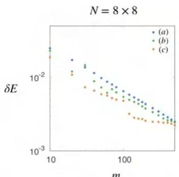

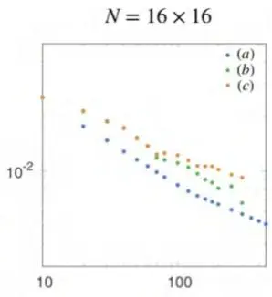

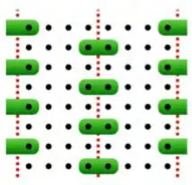
(a)

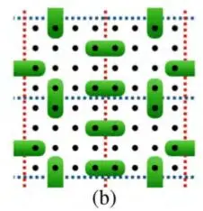

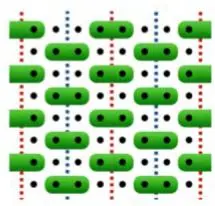
(c)
图9.6 (上) 不同几何构型aTTN（以 $L = 8$ 为底部示例）对二维海森堡基态能量的相对误差，与通过量子蒙特卡洛 [324] 获得的最佳可用估计值比较，作为 $L = 8$ 时键维 $m$ 的函数。(下) 绿色形状代表解纠缠子，虚线表示由树中最顶层（红色）和第二高层（蓝色）链接引入的二分。该图经许可转载自文献 [150]

在图9.6中，我们展示了不同几何结构相对于量子蒙特卡洛方法[324]的能量密度偏差。在8×8的分析中，我们看到所有几何结构在整个m范围内都给出了非常相似的结果。令人惊讶的是，重塑整个树结构，即几何结构(c)，在三种配置中提供了最好的结果，而先前分析中使用的初始策略(a)则表现最差。然而，当转向$L = 16$的情况时，几何结构(c)明显无法跟上其他两种结构，策略(a)反而领先。实际上，这可以追溯到2D-DMRG在$L \gtrsim 12$时的相同问题：保持L足够小（例如L=8），内部TTN的低层分支能够有效捕获必要信息，以忠实地表示基态。但是，当系统尺寸增大时，内部TTN很难有效地将16个“列”位点连接在一起。因此，与2D-DMRG类似，对于第二维$L_{y}$有限的aTTN模拟，策略(c)应提供最佳结果，并且对于具有周期性边界条件的非方形系统$(L_{x} > L_{y})$可能是一个不错的折中选择。另一方面，我们发现对于一般的$L \times L$系统，最高效的策略确实是策略(a)。然而，我们指出，找到最佳几何结构是一项高度非平凡的工程任务，取决于许多因素，例如系统尺寸、系统内的相互作用以及边界条件。针对特定问题优化张量网络结构可能是未来工作中一个有趣的研究课题。

## 9.5 习题

1. 利用前面练习中开发的代码，定义aTTN对象（扩展前面练习中开发的TTN代码），并实现其基本操作：计算范数，以及评估局域算子和最近邻算子的期望值。

2. 利用上述开发的工具，将高维TTN的基态搜索算法扩展到aTTN。

3. 利用上述开发的工具，从随机TTN出发，对二维横场伊辛模型和二维海森堡模型进行基态搜索。比较不同解纠缠子层和普通TTN的性能。
