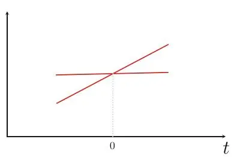
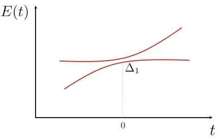
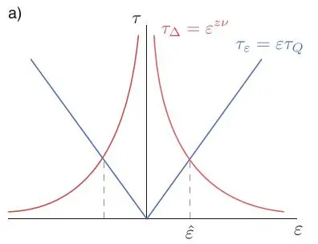
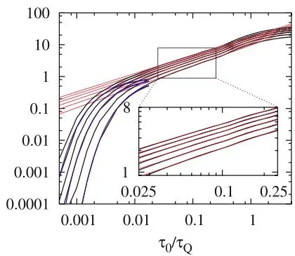
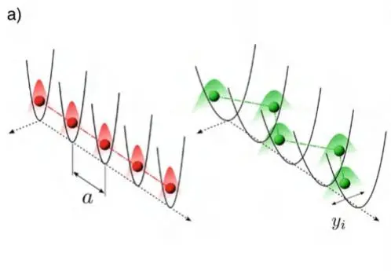
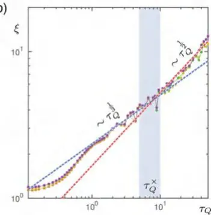
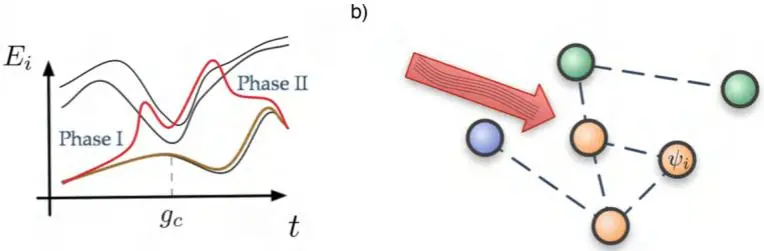
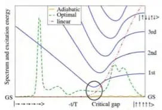
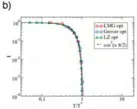
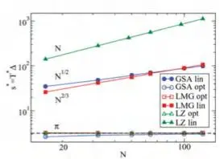

# 非平衡过程

Simone Montangero

非平衡过程无处不在；它们环绕着我们，生命之所以可能，正是因为原本平衡（死亡）状态中暂时的非平衡涨落。事实上，现实世界中的任何系统都与周围环境接触，并受不断变化的条件（温度、相互作用强度等）驱动，从而偏离其平衡态。此外，从信息处理到能量收集，任何有用的过程都基于这样一个事实：系统被驱离平衡态，进入另一个（可能是平衡的）状态。在量子层面上也是如此，正如我们将在本章中看到的，能够研究改变状态的系统，理解这种变化何时发生、如何高效驱动，以及预测这种转变的结果，具有极其重要的意义。如前所述，现在在很多一维多体量子系统场景中，利用前几章引入的张量网络方法，这已经成为可能。

特别是，典型场景是从某种平凡状态驱动到更复杂状态的系统。近期受到密集研究的许多不同场景，都可以看作是系统状态的变化——从简单、初始的给定状态变为更复杂但有意义的状态。这类过程的第一个例子是大多数实验装置的制备：通常系统处于某个平衡态，必须从中达到另一个更有趣的状态。该场景的一个相关实例是任何量子信息协议，尤其是量子计算：量子比特寄存器必须从平凡状态（例如 00000 ）驱动到编码问题解的状态。类似地，量子模拟无非是系统从初始状态演化到另一个不那么平凡的状态，例如从绝缘态到超导态。这个过程也是更广泛过程类别的一个实例，即跨越量子相变（绝热量子计算）。由于计算机科学中的大多数难题都可以重新表述为绝热计算形式[485]，并且绝热计算等价于基于线路的计算[486]，因此对它们的研究至关重要。最后，所有这些转变也可以在存在环境的情况下进行研究，并且特别地，已经证明可以工程化环境以实现有趣的状态[487–489]。

本章中，我们首先介绍绝热定理（adiabatic theorem），绝热计算正是基于该定理。然后，我们介绍Kibble-Zurek机制（Kibble-Zurek mechanism），这是一个强大的理论，可以在非常一般的假设下预测当绝热条件被轻微违反时引入的误差。我们介绍一些超越绝热方法的方法，并简要回顾关于非平衡开放量子系统的一些结果。最后，我们简要提及近期探索的其他方向，涉及高能物理、开放系统和复杂性等问题。

## 12.1 绝热量子计算

本节中，我们介绍绝热量子计算（adiabatic quantum computation）或量子退火（quantum annealing）。我们首先介绍绝热定理，这是支持绝热量子计算方法的理论论据。然后，我们介绍可以应用绝热定理的最简单场景——Landau-Zener穿越（Landau-Zener crossing），最后概述该方法在研究量子物质和经典难题中的可能应用。

### 12.1.1 绝热定理

绝热定理指出，如果含时哈密顿量 \( H(t) \) 变化得足够慢，并且系统被制备在初始哈密顿量的一个本征态 \( |\psi(0)\rangle = |E_i(0)\rangle \)（例如基态）中，那么系统在整个演化过程中将保持在相应的含时本征态中，即 \( |\psi(t)\rangle = |E_i(t)\rangle \)。绝热定理所依据的思想非常直观，与经典思想并无不同：如果系统处于其基态（例如，粒子在势能最小值处），缓慢改变条件（移动势能或使其变形）将不会激发它。

---
已有术语表（前面章节已引入，用指定译名，**不要再附英文**）：
- Gaussian elimination → 高斯消去
- Hermitian operator → 厄米算子
- Hilbert space → 希尔伯特空间
- Ising Hamiltonian → 伊辛哈密顿量
- Krylov subspace → Krylov 子空间
- LU decomposition → LU分解
- Lanczos diagonalization algorithm → Lanczos 对角化算法
- Lanczos method → Lanczos 方法
- Random Matrix Theory → 随机矩阵理论
- Tridiagonal Matrices → 三对角矩阵
- back substitution → 回代
- degeneracy → 简并
- eigenstate → 本征态
- eigenvalue → 本征值
- eigenvalue problem → 本征值问题
- eigenvector → 本征矢
- inverse power method → 反幂法
- linear operator → 线性算子
- power method → 幂法
- power methods → 幂方法
- sparse matrix → 稀疏矩阵
- tight binding models → 紧束缚模型
- tridiagonal matrix → 三对角矩阵
- upper triangular form → 上三角形式

遇到新术语（不在上表里），首次出现时附英文原文，如：绝热定理（adiabatic theorem）。
翻译完成后，在译文最末尾用以下格式列出本章新增的术语（每行一个）：

对上述定理的一个简单直观推导如下[490]：给定在每个时刻对角化哈密顿量的幺正变换 $U ( t )$，即 $U^{\dagger} ( t ) H ( t ) U ( t ) = D ( t )$，则含时薛定谔方程（式3.32）可以在对角基 $| \phi ( t ) \rangle = U^{\dagger} ( t ) | \psi ( t ) \rangle$ 下改写为

$$
i \hbar \frac{\partial | \phi ( t ) \rangle} {\partial t} = D ( t ) | \phi ( t ) \rangle - i \hbar U^{\dagger} ( t ) \frac{\partial U ( t )} {\partial t} | \phi ( t ) \rangle ;\tag{12.1}
$$

也就是说，我们所引入的含时基的净效果是右侧的第二项，它作为薛定谔方程的一个修正项出现。然而，如果哈密顿量缓慢变化，那么基变换 $U ( t )$ 也将只是缓慢含时的，因此其导数将很小。绝热近似正是忽略式（12.1）右侧第二项，这导致每个本征矢的概率幅的一组解耦微分方程。它们随时间保持常数，仅有一个变化的含时相位：如果系统从单个本征矢出发，其占据概率将始终为1，即如果系统从 $| E_{0} ( 0 ) \rangle$ 出发，它将始终处于 $| E_{0} ( t ) \rangle \forall t$。

尽管上述结果已经非常强大，但显然缺少一个重要信息：需要量化“缓慢”的含义，并可能计算绝热近似的微扰修正。可以进行这样的分析[491]，得到从初始基态出发后，系统离开基态的概率 $p ( t )$ 的界限为

$$
p ( t ) \leq 4 \sum_{k \neq 0} \operatorname*{max}_{s^{\prime} \in [ 0 , s ( t ) ]} | a_{k 0} ( s^{\prime} ) | ^{2} \delta^{2} + O \Bigl ( \delta^{3} \Bigr ) ,\tag{12.2}
$$

其中哈密顿量 $H ( s ( t ) )$ 根据参数函数 $s ( t )$ 随时间变化，使得 ${d s / d t} = \delta \cdot \upsilon ( s ( t ) )$，而 $\delta$ 设定了参数变化的尺度。从基态到第 $k$ 个（ $k \ > \ 0$ ）归一化瞬态本征态的跃迁振幅由下式给出

$$
a_{k 0} ( s ) = \hbar \frac{\langle \tilde{E}_{k} ( s ) | d H / d s | \tilde{E}_{0} ( s ) \rangle} {\Delta_{k} ( s )^{2}} ,\tag{12.3}
$$

其中 $\Delta_{k} ( s ) = E_{k} ( s ) - E_{0} ( s )$，并且我们设定了所有本征矢的自由相位，使得最终积累的贝里相位为零（Berry phase）[491]。总之，将哈密顿量变化参数化为

$$
H ( s ( t ) ) = s ( t ) H_{0} + ( 1 - s ( t ) ) H_{1}\tag{12.4}
$$

其中 $s ( 0 ) = 0$ 且 $s ( T_{f} ) = 1$，可以证明当

$$
a ( s ) v ( s ) \leq 1 ,\tag{12.5}
$$

时，该过程是绝热的（误差概率 $p ( t ) < \delta^{2} )$，其中 $a ( s )$ 可以有界为

$$
a ( s ) \leq 2 \hbar \frac{| | H ( T_{f} ) - H ( 0 ) | |} {\operatorname*{min}_{s} ( \Delta_{1} ( s ) )^{2}} ;\tag{12.6}
$$

这导致了绝热运行时间

$$
T_{\mathrm{a} d} \propto \frac{1} {\operatorname*{min}_{s} ( \Delta_{1} ( s ) )^{2}} .\tag{12.7}
$$

上述表达式仅是绝热过程时间尺度的上界：实际上，可以通过全局绝热优化来调整速度以适应瞬时能隙，从而实现加速[492, 493]。

### 12.1.2 应用

可以应用绝热定理的最简单场景是一个典型场景，即Landau-Zener穿越（Landau-Zener crossing）[494, 495]，即在具有含时对角项和恒定耦合的二能级量子系统中计算最终激发概率，其形式为

$$
H ( t ) = H_{0} + H_{1} ( t ) = {\binom{E_{1} \quad V} {V \ E_{0} ( t )}}\tag{12.8}
$$

其中 $E_{0} ( t ) = E_{1} + v t$，$t \in [ - T ; T ]$。图12.1示意了该系统的能级随时间的变化，从中容易证明最小能隙由 $\min_t \Delta_{1} ( t ) \approx 2 V$ 给出。因此，绝热条件可以表示为

$$
2 V^{2} / \hbar v \gg 1 .\tag{12.9}
$$

独立地，Landau-Zener公式预测穿越后的最终激发概率为

$$
p = \exp \left[ - \frac{2 \pi V^{2}} {\hbar v} \right] ,\tag{12.10}
$$

$E(t)$

图12.1 朗道-齐纳交叉中 $V = 0$（左）和 $V \neq 0$（右）的能级交叉，由方程(12.8)定义的哈密顿量描述

这与方程(12.9)表达的条件完全一致：如果绝热条件成立，指数函数的自变量很大，相应的激发概率 $p$ 很小，即发生了绝热交叉。

更一般地，方程(12.5)的绝热条件在绝热量子计算或模拟量子退火[496–498]中起着关键作用。其场景与上述类似：系统被制备在初始哈密顿量 $H_{0}$ 的基态，然后如方程(12.4)所示，竞争项 $H_{1}$ 被开启，同时初始项被关闭。其思想是：虽然 $H_{0}$ 是一个基态易于制备或计算的哈密顿量，但哈密顿量 $H_{1}$ 的基态编码了一个困难问题的解。如果过程是绝热的，由方程(12.4)定义的交叉将返回期望的解。特别地，可以证明这种计算架构等价于通用量子计算[486]，并且，例如，在非结构化数据库中搜索的Grover算法可以用这种语言重新表述[492]。此外，可以证明计算机科学中的大多数困难问题都可以重新表述为绝热量子计算[485]。一个例子将有助于阐明最后一点：划分问题（partitioning problem）是一个NP完全问题，由一组数 $n_{1} , \dots n_{N}$ 定义。问题在于是否可能将这组数二分为两个总和相等的子集。这样一个表述简单但极难解决问题的绝热量子计算版本源于哈密顿量 $\begin{array} {r} {H_{1} = ( \sum_{i} n_{i} \sigma_{i}^{z} )^{2}} \end{array}$ 的定义，其中 $n_{i}$ 构成要划分的数集， $\sigma_{i}^{z}$ 是标准的泡利矩阵。例如，定义 $\begin{array} {r} {H_{0} = \sum_{i} \sigma_{i}^{x}} \end{array}$ 并执行绝热协议，可以找到 $H_{1}$ 基态的能量 $E_{0}$ ：如果它为零（由于 $H_{1}$ 是一个正算子，这下限了所有可能的本征能量），则该特定划分问题的解存在，并且可以从基态读出。如果相反 $E_{0} > 0$ ，则不存在总和相等的划分，但失配已被最小化，从而解决了一个NP-hard问题。

然而，这种看似针对极困难问题的强大攻击策略存在一个缺陷：在热力学极限下，绝热条件无法满足，因为通常最小能隙要么以多项式速度、要么甚至以指数速度趋近于零。也就是说，在大问题规模的极限下，误差不可避免地会被引入，阻碍问题的干净求解。尽管如此，人们仍在付出巨大努力以最大化利用这一策略，并且在数值方法和开发能够在实验室执行此过程的量子退火器方面，活跃的研究正在蓬勃开展。

最后，这些思想的另一个潜在巨大应用领域是量子相变的穿越：两个竞争的哈密顿量现在由系统的物理机制给出，如方程(10.9)，参数 $g$ 随时间调谐，扮演函数参数化 $s ( t )$ 的角色。这些过程在量子科学和凝聚态物理（例如，在原子装载到光晶格中，在超导体或磁性材料等）的许多场景中自然出现。同样，在热力学极限下，由于方程(10.16)给出的临界能隙的标度行为，绝热条件无法满足。然而，在这种情况下，问题的结构，特别是通过量子相变的普适类对其进行分类，使得我们能够通过一个简单但极其强大的理论来预测因违反绝热线而引入的误差，我们将在下一节介绍这个理论。

## 12.2 Kibble-Zurek 机制

Kibble-Zurek 机制被提出来用于预测在有限时间内穿越量子相变时，基态之上的最终残余激发能量。事实上，当穿越 H(t) 的无能隙临界点时，对于任何有限时间，绝热定理（adiabatic theorem）都会被违反，最终的激发概率将非零，从而在有序相中产生有限密度的缺陷 [500–502]。Kibble-Zurek 机制根据与临界点的距离，基于动力学可以被划分为绝热或脉冲的假设，为最终的缺陷密度提供了一个标度论证。其设定遵循上一节介绍的方法，系统从初始哈密顿量的基态开始，根据式 (12.4) 随时间修改，并附加约束条件，即淬火以典型时间尺度 $\tau_{Q}$ 线性进行。总之，我们假设

$$
H ( t ) = \varepsilon ( t ) H_{0} + H_{1} , \varepsilon ( t ) = t / \tau_{Q} , t \in [ - \tau_{Q} / 2 : - \tau_{Q} / 2 ] ;\tag{12.11}
$$

使得 $\varepsilon ( t ) = g ( t ) - g_{c}$ 决定了与临界点 $g_{c}$ 的距离，且穿越发生在 $t = 0$ 时刻。正如我们在前一章所见，在临界点，关联长度如式 (10.12) 所示发散，并且在临界点附近，能隙随距离按 $\Delta \sim ( g - g_{c} )^{\nu z}$ 标度（见式 (10.16)）。系统的能隙引入了系统弛豫时间的一个自然时间尺度，即响应变化所需的时间。例如，与临界点距离的变化对应于关联长度的变化。这个典型时间尺度正是 $\tau_{\Delta} \sim 1 / \Delta = | g ( t ) - g_{c} | ^{- \nu z} = | \varepsilon ( t ) | ^{- \nu z}$。注意，在临界点和热力学极限下，$\tau_{\Delta}$ 发散，也就是说，系统适应新条件（增加其关联）变得越来越困难。这个重要的时间尺度需要与另一个过程时间尺度进行比较，即由淬火时间尺度决定的序参量变化率。$\varepsilon ( t )$ 的相对变化率的倒数是 $\tau_{\varepsilon} = | \varepsilon / \dot{\varepsilon} | = | \varepsilon \tau_{Q} |$。因此，根据这两个时间尺度之间的关系，将发生不同的动力学：

$\tau_{\Delta} \gg \tau_{\varepsilon}$ : 当系统参数改变时，系统可以轻松弛豫到新的基态。因此，它保持在系统的瞬时基态。
$\tau_{\Delta} ~ \ll ~ \tau_{\varepsilon}$ : 当系统参数改变时，系统无法弛豫到新的基态，也就是说，当 ε(t) 演化时，它保持冻结在其初始状态。

鉴于 $\tau_{\Delta}$ 的发散，第二个条件显然会在某个时刻出现：这再次等同于声明绝热条件被违反，因此会出现不同的有序区域（维度由关联长度给出），例如，形成不同的晶体或磁畴。Kibble-Zurek 机制基于以下假设：整个动力学可以近似描述为绝热的或冻结的。如果是这样，只需通过使这两个主要时间尺度相等，就可以识别出系统从一个状态切换到另一个状态的参数值 ε。该比较的图形表示如图12.2a所示，结果为

b)

---
图12.2 (a) 作为距离 ε 函数的弛豫时间 $\tau_{\Delta}$ 和淬火时间尺度 $\tau_{\varepsilon}$ 的比较。(b) 在穿越临界点后，冻结时间 $\hat{t}$ 处出现的关联长度 $\hat{\xi}$ 的示意图。

图12.2 (a) Kibble-Zurek 机制：通过使系统的两个典型时间尺度相等（$\tau_{\varepsilon} = |\varepsilon \tau_{Q}|$ 和 $\tau_{\Delta} = |\boldsymbol{\varepsilon}(t)|^{-\nu z}$），可以估计系统冻结处 $\hat{\varepsilon}$（绝热动力学结束点）到临界点的距离。(b) 横场量子伊辛模型中对 Kibble-Zurek 机制的验证：关联长度（与扭结数成反比）作为 $\tau_{Q}$ 倒数的函数（黑线，不同线条对应不同系统尺寸的结果），其标度关系与等式(12.13)的预测一致（红线）。蓝线遵循指数标度，表明等式(12.10)的 Landau-Zener 标度开始建立。图(b)转载自参考文献[499]。©2005，美国物理学会。保留所有权利。

$$
\hat{\varepsilon} \sim \tau_{Q}^{- \frac{1} {1 + \nu z}} .\tag{12.12}
$$

当从负 ε 值逼近临界点时，系统将处于基态直到 ε 时刻，而在该时刻之后直到 $\hat{\varepsilon}$ 时刻系统将冻结（即不再变化）。因此，在临界点附近，系统将达到与 ε 值处基态对应的最大关联长度，根据等式(10.12)给出：

$$
\hat{\xi} \sim \tau_{Q}^{\frac{\nu} {1 + \nu z}} .\tag{12.13}
$$

这一强大的表达式允许我们仅根据理论的临界指数，预测在有限时间内将系统驱动至临界点所能达到的关联长度。KZ 机制已在多种零温量子玩具模型中得到检验，包括有序系统和无序系统，以及穿越孤立或扩展临界区域的情况[499, 503–518]。图12.2b展示了通过 DMRG 模拟[499]在横场伊辛模型中对 Kibble-Zurek 机制的验证结果。

### 12.2.1 从量子到经典 Kibble-Zurek 机制的交叉

Kibble-Zurek 标度已在许多场景中得到验证。然而，在零温强关联多体量子系统中的实验验证仍然难以实现。事实上，要使测量结果与预测标度之间达到清晰的吻合，必须满足非常严格的实验约束条件[511,514,515,520–522]。例如，在一项使用囚禁离子的精彩实验中[510]，实验发现的标度关系是描述系统的经典理论所预测的标度，而非量子标度。受这些发现的启发，在文献[519]中，利用囚禁离子经历线性到锯齿形结构量子相变（如图12.3a所示）这一事实，在相当普遍的假设下，可将该系统建模为 $\phi^{4}$ 模型[523, 524]，

$$
H = \sum_{i} p_{i}^{2} + \varepsilon ( t ) y_{i}^{2} + y_{i}^{4} + ( y_{i + 1} - y_{i} )^{2} ;\tag{12.14}
$$

b)

图12.3 (a) 线性到锯齿形量子相变：距离为固定值 a 的 N 个离子在线性链（其中 $\begin{array}{r} {\langle \sum_{i} ( - 1 )^{i} y_{i} \rangle = 0} \end{array}$，左图）中被捕获，处于紧密约束状态；而当约束释放超过临界阈值时，则形成能量最小的锯齿形构型（$\langle \sum_{i} ( - 1 )^{i} y_{i} \rangle > 0$，右图）。该系统具有 $\mathbb{Z}_{2}$ 对称性，因此属于伊辛普适类（Ising universality class）。(b) 在 $\phi^{4}$ 模型中验证 Kibble-Zurek 机制：末态关联长度 $\xi$ 作为猝灭时间尺度 $\tau_{Q}$ 的函数（实心圆点，不同颜色代表不同系统尺寸）。对于 $\tau_{Q} < \tau_{Q}^{\times}$，标度是经典的 $\xi \propto \tau_{Q}^{1 / 3}$（蓝色虚线）；而对于 $\tau_{Q} > \tau_{Q}^{\times}$，则发现量子标度 $\xi \propto \tau_{Q}^{1 / 2}$（红色虚线）。图 (a) 转载自文献 [519]，经许可。©2013，WILEY-VCH Verlag GmbH & Co. KGaA，Weinheim。保留所有权利。图 (b) 转载自文献 [508]，经许可。©2016，American Physical Society。保留所有权利

其中求和遍历链中所有离子，$y_{i}, p_{i}$ 分别是横向位移（其期望值 $\langle \sum_{i} ( - 1 )^{i} y_{i} \rangle$ 是相变的序参量）及其共轭正则动量，满足 $[y_{i}, p_{j}] = i \hbar \delta_{i,j}$。参数 $\hbar = \hbar / \sqrt{E_{0} m a^{2}}$ 扮演有效普朗克常数的角色，其中 a 是晶格常数，m 是粒子质量，$E_{0}$ 是典型的成对相互作用能。于是，可以利用张量网络方法（TN methods）[508] 模拟其在跨越量子相变时的动力学。该研究提出了一个观点：经典标度的出现是因为系统在远离临界点的区域冻结，该区域中量子涨落仍然可以忽略。这个区域可以通过金茨堡判据（Ginzburg criteria）[525, 526] 来识别，并用于预测经典标度与量子标度交叉发生的位置，即

$$
\tau_{Q}^{\times} \sim \frac{\hbar} {\varphi} | \varepsilon | ^{- 1 - z \nu} ,\tag{12.15}
$$

其中 $\varphi$ 由临界点附近能隙的标度行为决定 $\Delta_{1} \simeq \varphi | \varepsilon | ^{z \nu}$。图12.3b [508] 报告了该关系的数值验证。总之，旨在验证量子Kibble-Zurek标度的实验应设计用于探索参数的限制区域，该区域不仅存在量子效应（即低温和低退相干），而且系统在由方程（12.15）定义的量子临界区域中冻结。

## 12.3 多体量子系统的最优控制

我们已经看到，穿越量子相变或执行绝热量子计算以产生最小量的误差是一项非平凡的任务，因为绝热策略受到能隙闭合的阻碍。然而，是否存在可以采取的不同策略？答案是肯定的，这些不同策略可以分为两大类，如图12.4a所示：（1）旨在加速过程并保持绝热的策略，以及（2）放弃绝热条件，不要求系统保持在瞬时基态，而只要求以最小能量达到最终状态的策略。

前一类快速绝热通道可以通过将变化参数 $s ( t )$ 的函数时间依赖性适应于瞬时能隙来实现，即用其实际的时间依赖值替换方程（12.6）中通过最小化获得的界限，从而加速整个演化 [492]。另一种强大的策略是向哈密顿量添加项，以精确抵消耦合瞬时基态与激发态的非绝热项 [527–535]。这类被称为绝热捷径的解决方案非常强大，已在不同情境中采用，多数是少体系统或存在简单描述的系统（参见 [531] 的综述）。然而，对于多体量子系统，所需的附加项很快就会变得相当复杂（例如k体相互作用或长程相互作用），可能需要不同或混合的策略才能将其引入实验室 [536]。第二类策略主要基于最优控制理论，我们将在下文重点讨论。

a)

图12.4 (a) 本征能量 $E_{i}$ 作为时间函数（黑色线）以及系统通过绝热通道穿越量子相变时的瞬时系统能量 E(t)，无论是通过慢速绝热通道，还是通过例如反绝热项（金色线）或最优通道（红色线）实现的快速绝热通道。(b) 典型的多体量子系统控制问题的示意图：外部控制场（右侧箭头）在有限时间内以有限能量作用于系统或其部分，作用于外部（例如粒子位置）或内部（例如原子能级），诱导系统转变到具有不同拓扑、粒子数和/或内部状态的不同状态，该状态也可能是系统不同状态的宏观叠加

量子最优控制理论解决可被重新表述为泛函最小化的问题：给定一个初始态矢量 $| \psi_{0} \rangle$ 和动力学规律——在我们的例子中是薛定谔方程或其推广到开放和非线性动力学的形式，我们将在后面看到——该规律依赖于一个（或多个）外部控制场，引入一个度量 $F$，该度量依赖于控制场。该度量可能包括不同项，通常量化要实现的感兴趣属性以及一些约束条件，如总场强、总演化时间等。然后，最优控制问题的解由最小化该度量的控制场给出，即求解一个带约束的泛函最小化。即使自由度数量有限，找到这个问题的解也是非平凡的，并引发了许多有趣的问题。量子系统的最优控制已在许多不同环境中实现，其可行性条件已广泛分析，涉及系统的可控性、有限资源（例如能量-时间关系）或由其他物理约束导致的问题 [493, 537–558]。

由于数值和分析描述上的额外复杂性，多体量子系统的最优控制理论与应用至今探索较少。如图12.4b所示，问题在此增加了新的维度：直至近期，多粒子系统中自然涌现的新特性（例如系统的关联或纠缠、系统哈密顿量和控制场的张量结构、连接的配位数与拓扑、以及随系统组分数量可扩展性）所扮演的角色，才开始被研究[493, 535, 540, 544, 546, 549, 557–573]。

一般来说，量子最优控制问题可以重新表述为一个泛函最小化问题：

$$
\operatorname*{min}_{\Gamma ( t )} \ F ( \Gamma ( t ) , \psi_{0} , T , \dots ) ;\tag{12.16}
$$

其中 $F$ 是度量（figure of merit），用于量化变换结果的质量；$\Gamma ( t ) \in \mathcal{G}$ 是控制场，$\mathcal{G}$ 是所有在 $t \in [ 0 , T ]$ 上定义的“物理上合理”函数的空间；系统哈密顿量可写为 $\hat{H} = \hat{H}_{D} + \Gamma ( t ) \hat{H}_{C}$，其中 $\hat{H}_{D}$ 是哈密顿量中不可修改的漂移部分（例如系统组分间的相互作用），$\hat{H}_{C}$ 是与控制场线性耦合的算子（例如磁场激光的强度）。泛函的最终值还取决于其他自由度，例如初始态 $\psi_{0}$ 或演化的总时长 $T$。此外，还可能存在其他约束，例如控制场的最大可用功率或其带宽。典型的度量包括最终态与某个目标态之间的保真度（fidelity）、某些可观测量（observables）的最终期望值，或其他性质，如系统中最终存在的纠缠关联[538, 539, 545]。此处及后续，我们以纯态（pure states）形式构建问题，但使用密度矩阵可以将其直接推广到混合态（mixed states）和（幺正）变换（unitary transformations）[537–539, 545]。

已有多种算法成功应用于最小化方程(12.16)中的泛函，这些算法主要显式计算泛函相对于 $\Gamma ( t )$ 的梯度，并在所有可能控制场的空间中进行梯度下降，例如 Krotov 算法或 GRAPE 算法：它们优雅的数学公式和成功应用可在文献中找到[538, 539, 545]。这里，我们专注于另一种方法，即“dressed chopped random basis (dCRAB)”，原因在于其数学形式简单，并且已被用于处理多体动力学中的最优控制问题，例如量子相变（quantum phase transition）的最优穿越，我们将在后文中看到[543, 561, 574]。

dCRAB 最优控制算法基于这样一个想法（受张量网络方法启发）：可能预先减小搜索最优控制场 $\Gamma ( t )$ 的空间 $\mathcal{G}$，从而极大简化搜索。应注意，这种近似隐含在所有已知数值算法中：通常，时间被离散化，控制场变为具有紫外截断（ultraviolet cutoff）$\Delta t$ 的分段常数函数。然而，这种选择被视为一个需要控制的近似，通常条件为 $\Delta t \to 0$。相反，我们假设可以将空间 $\mathcal{G}$ 截断（truncate）为一个小的维度空间 ${\mathcal{G}}^{*} \subset{\mathcal{G}}$，并在此空间内进行最小化以找到最优最小值。

这个方案的第一步是进行空间截断：除非有额外的物理信息已知，否则应以最通用的方式进行；在这种情况下，应利用这些信息引入一个基于经验的初始猜测（educated guess），尽管如此，这通常并非根本性的。因此，我们执行将控制场展开为一个截断的、随机化基函数集 $\{h_{i} ( t ) \}_{1}^{N_{C}}$ 的操作：

$$
\Gamma ( t ) = \sum_{i = 1}^{N_{C}} c_{i} h_{i} ( t ) ,\tag{12.17}
$$

式(12.16)定义的极小化问题被重新表述为一个多变量极小化问题，可采用标准方法求解，从共轭梯度下降、遗传算法到通常使用的无梯度极小化方法[122]。对于基函数 $h_{i} ( t )$ 的典型选择是傅里叶基，其频率在带宽区间 $\Delta \Omega$ 内随机选取。

这里的关键参数是式(12.17)展开中所需的基函数数量 $N_{C}$，用以获得满意结果。早期工作研究了解决最优控制问题所需的控制函数独立参数的最小数量，并建立了解决最优控制问题所需数量 $N_{C}$ 的启发式规则，该数量与希尔伯特空间尺寸呈比例[575]。最近，已有证明表明，达到误差 $\epsilon \ > \ 0$ 所需的系数数量是能够在多项式时间内达到的状态空间 $W^{+}$ 的维度 $D_{W^{+}}$ 的多项式函数，该空间与希尔伯特空间尺寸有关[552]。该维度的上界是整个希尔伯特空间维度，在少量子比特场景中，两者通常一致。然而，在多体场景中，它们可能相差巨大[301]。特别地，任何允许高效数值表示的多体动力学都存在于一个多项式空间中，从而相对于指数级巨大的希尔伯特空间大幅降低了 $D_{W}^{+}$，进而导致最优控制问题的高效求解。事实上，可以证明，要达到最终误差 $\epsilon \ > \ 0$，需要在 $D_{\cal G}^{*} ~ \equiv ~ {\cal N}_{\cal C}$ 中搜索的函数空间的维度可以由 $D_{W}^{+}$ 的多项式函数界定[552]。启发式地发现，通常可以达到线性下界[574,575]。特别地，利用dCRAB公式中引入的简单重启和改变用于执行优化的随机基函数的方法，对于功率无约束问题，能够以概率一逃离局部陷阱[574]：最终结果是，可以通过在搜索空间中沿不同随机方向进行一系列一维 $N_{C} = 1$ 极小化来求解此极小化问题。这种方法还有一个额外优势，即一维极小化可以用高效的简单算法实现，无需借助诸如进化算法、梯度算法或高阶算法等复杂方法。最后，已有证明表明，以有限精度实现最优变换所需的最短时间受控制场带宽 $\Delta \Omega$ 约束，即

$$
T \geq \frac{D_{W}} {\Delta \Omega} ,\tag{12.18}
$$

其中 $D_{W}$ 是可达状态集合的维度 [552]。

a)

b)

c)

图12：5 (a) LMG模型中量子相变的绝热穿过（黄线）、快速穿过（红点划线）和最优穿过（绿虚线）。蓝实线报告了系统的瞬态本征能量，并突出了临界能隙。(b) 最终不保真度作为重新标度总时间 $T^{*} = \pi / \Delta_{1}$（该变换用于识别不同最优穿过过程中的量子速度极限，包括LMG模型、Grover绝热算法和Landau-Zener过程）的函数。(c) 线性和最优退火所需总时间随系统大小N的标度。对于Landau-Zener过程，我们假设有效系统大小为 $\bar{N_{}} = \Delta_{1}^{- 1}$。图经许可摘编自 [493]。©2011, 美国物理学会。保留所有权利

我们以一些最优控制问题在量子退火中的应用结果来结束本节。如图12.4所示，穿越量子相变也可以通过放松绝热条件来实现，只需施加最终状态最小化最终哈密顿量能量的条件。这样一来，我们可以不再受绝热条件的约束，旨在加速该过程。在 [493] 中进行了这一分析，其中表明确实可以加速量子相变穿越：作为第一个测试案例，研究了Lipkin-Meshkov-Glick (LMG) 模型，这是一个可积的多体模型（具有无限程相互作用的伊辛链），非常适合此类研究 [576]。如图12.5a所示，其中报告了当横向场以线性方式（绝热或非绝热）或最优方式变化时，LMG模型谱随时间的变化：可以清楚地看到，虽然快速且幼稚的穿过会结束于一个高能态，但绝热和最优穿过都能很好地近似基态。在其他系统和协议上也可以获得类似的结果，例如绝热Grover算法，或光学晶格中冷原子从超流到莫特绝缘体量子相变的穿越 [493, 540]。因此，很自然地要探究穿越量子相变所需的时间可以被压缩到何种程度，以及是否存在一个基本极限：在图12.5b中，我们给出了对于LMG模型、绝热Grover算法以及作为比较的简单Landau-Zener穿越，最终误差作为过程总时间的函数。可以清楚地看到，在所有场景中都存在一个最小时间 $T^{*}$，低于该时间则无法找到最优变换，误差标度为 $I = 1 - | \langle \psi ( T ) \rangle \psi_{G} | ^{2} = \cos^{2} ( T / T^{*} )$，其中 $T^{*} = \pi / \Delta_{1}$，$\Delta_{1}$ 是系统的最小能隙。这里的 $T^{*}$ 是过程的量子速度极限，即变换发生所需的最小时间，这是海森堡不确定原理的一个推论 [547, 548, 551, 554, 555, 557, 558, 572, 577–583]。这一结果与两能级系统的解析解完全一致，并支持了以下猜想：即使在更复杂的场景中，我们也能实现自然界允许的最快变换，这可以解释为初始态与最终态之间的一个最优两能级跃迁。最后，在图12.5c中，我们报告了加速因子随系统大小的标度：最优穿越在系统大小上以平方根因子（类似于Grover算法的增益）加速了过程，并且还有一个约一到两个数量级的前置因子。总之，最优退火可以带来一种优势，尽管这种优势仍然受限于系统的最小能隙，但比绝热穿过的方式更为有利。

最后，我们报告了量子相变的最优穿越已在光学晶格中经历超流到莫特绝缘体相变的一维冷原子系统中得到了实验验证 [540]。

## 12.4 其他应用

在本节中，我们回顾一些可以利用或仅能利用张量网络技术处理的非平衡物理场景：我们将它们纳入此处，是因为它们在近些年引起了广泛的兴趣，或者我们认为它们在未来会得到进一步的研究。

如[第6章](ch06.md)所示，张量网络方法在高能物理背景下对格点规范理论的应用并不仅限于平衡态性质。事实上，它们已被用于研究动力学现象，例如弦断裂（string breaking）的实时演化的模拟、施温格机制（Schwinger mechanism）以及散射过程。弦断裂是一个重要现象，发生在规范理论中连接两个电荷的规范场弦（例如，两个电荷之间的电场、两个夸克之间的胶子场等）在能量上代价过高时，此时更有利的方式是断裂弦，并从真空中产生粒子-反粒子对。在量子电动力学（QED）中，从真空中产生这样的对被称为施温格机制[584]。由于蒙特卡洛方法中存在符号问题（sign problem），过去几十年对这些现象的研究主要通过观察间接特征（如弦张力或威尔逊环）来进行[334]。近来才提出了一种弦断裂实时演化的半经典模拟[585]，随后利用张量网络对U(1)和SU(2)格点规范理论进行了全量子模拟[57, 68]。此外，[57]中还给出了束缚粒子-反粒子对之间的散射过程的实时演化，并补充了对散射过程中纠缠形成的分析。

前一章介绍的技术应用的另一个广阔领域是以不同形式研究非平衡多体量子系统：非平衡量子相变（out-of-equilibrium quantum phase transition）领域正吸引着越来越多的兴趣，即表征一个系统在存在诱导其平衡的浴（bath）时所呈现的不同相的特征。在存在竞争项的情况下，动力学的固定点可能会因幺正和/或非幺正项的不同权重而展现出不同的性质[586, 587]。一方面，这种效应可用于所谓的储层工程（reservoir engineering），即开发特定的浴，使系统进入具有有趣特性的状态，例如，存在可用于量子信息协议的纠缠，或制备某些期望的状态。由于该状态是耗散动力学的固定点，它本质上对扰动具有鲁棒性，这已在实验中得到观察[487–489]。另一方面，可以研究这类现象的物理机制，例如在存在泵浦和耗散的耦合腔系统这一典型系统中，它已被证明表现出光的量子相变[588–590]，或者在最近利用俘获离子串模拟横向场伊辛模型的实验验证中[591]。

在更偏向统计力学方面，张量网络方法也被用于研究与多体量子系统热化相关的基本问题，即研究一个封闭的多体系统是否以及在何种条件下充当其子系统的热库，以及热化如何发生和是否发生[592, 593]。更一般地，可以研究淬火（quenches）效应、多体局域化（many-body localization）和量子混沌（quantum chaos）的起始[516, 518, 593–601]。

张量网络在开放量子系统中的可能应用远不止研究系统的稳态性质：例如，已经证明可以将系统-环境量子模型映射为有效的自旋链[602, 603]，或者将其应用于研究耦合到光纤的原子，例如研究手性量子光学（chiral quantum optics）以及具有时间延迟和量子反馈的光子电路[604–606]。

最后，利用经典复杂性的概念对多体量子系统的状态进行分类的兴趣日益增长，这也在元胞自动机（cellular automata）的背景下进行，特别是康威生命游戏（Conway's game of life）的量子对应物[607–610]。

## 12.5 习题

1. 使用t-DMRG模拟横场伊辛模型量子临界点在不同系统尺寸和总演化时间下的绝热通道。计算最终能量和最终关联长度，并与精确的最终基态值进行比较。

2. 在前一练习中计算的残余激发能量中，识别Landau-Zener（朗道-齐纳）和Kibble-Zurek（基布尔-祖雷克）区域。提取系统的临界指数，并讨论理论值与计算值之间可能存在的差异。

---
