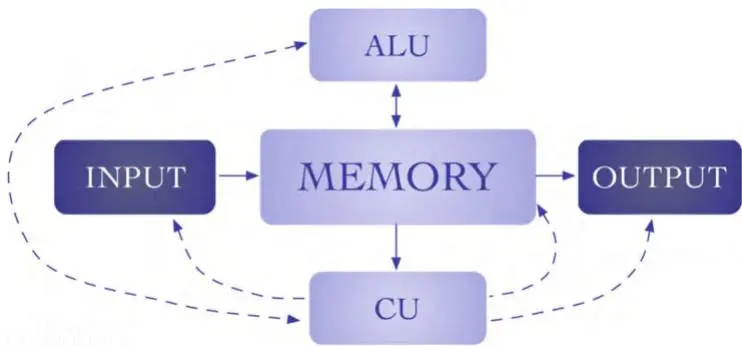

# 物理学家眼中的硬件速览

计算物理学在两个方面处于物理学的前沿：（1）从欧洲核子研究中心（CERN）的最大规模实验尝试到冷原子领域的单台桌面实验，专用软件和硬件的支持都是基础性的。在这两种情况下，如果没有软件控制所实现的自动化，这些实验大多不可能完成，而数据的后处理和分析通常需要数TB的存储容量和数千行代码；（2）用于模拟物理过程的软件复杂性已经变得极高，以至于数值实验现在在复杂性（需数年搭建、数千行代码）、资源（超级计算机、数月的计算时间）方面与真实实验不相上下，更不用说对现实的描述能力。因此，有必要了解应对这些迷人挑战所需的工具，以便在必要时能够修改实验装置的每一个微小细节，包括运行它所使用的软件和硬件。下面，我们介绍一些计算机体系结构的基本概念，任何计划进行数值实验（即使是小规模）的物理学家都应该了解这些概念，它们也可以作为更高级阅读的起点。

## A.1 体系结构

现代计算机基于冯·诺依曼体系结构（von Neumann architecture）建造，其示意图如图A.1所示，由以下各司其职的组件构成：

**存储器**，用于存储数据和程序指令。

**中央处理器**（CPU），分为**控制单元**（从存储器中获取指令/数据、解码指令并协调要执行的操作）和**算术逻辑单元**（ALU，专门负责数据处理）。

图A.1 冯·诺依曼计算机体系结构：控制单元（CU）、算术逻辑单元（ALU）、存储器、输入输出设备及其相互关系（粗线表示数据/指令流，虚线表示控制信号流）

**输入输出**（I/O）设备，即与外部存储器和用户的接口。

这种体系结构的主要创新——如今看来或许有些理所当然——在于它允许构建通用计算机，而先前的体系结构是为执行特定任务而构建的，即程序是硬连线的，而非存储的。相反，冯·诺依曼体系结构允许将计算机程序（它要执行的指令集）写入其存储器中，使其成为一种高度通用的机器，这一事实自其诞生以来基本保持不变即可证明。事实上，在过去的几十年里，所有计算机组件都经过了广泛的修订和改进，但除了DEC在六十年代末制造的PDP-11中首次引入的一项创新外，无需重新思考这种基本计算机体系结构。这项创新就是**系统总线**（system bus），这是一种专用硬件，用于在组件之间沿着一条由它们共享的唯一路径传输数据：总线的唯一性简化了对其他组件同时请求的可能冲突的存储器访问的仲裁。

## A.2 数据与格式

众所周知，现代计算机中的数据使用二进制编码以比特（bit）形式存储。这意味着存在一组物理实体（系统的存储器），每个实体只有两种可能的不同状态（称为0和1）。如今看似自然的选择并非唯一可能：替换这一定义会产生非常有趣的后果：量子比特由两个量子态0和1定义，当今所有的量子技术都源于此[8]。回到经典比特，例如，数字42可以写成

\(101010\)

这应解读为 \(1 \times 2^{5} + 0 \times 2^{4} + 1 \times 2^{3} + 0 \times 2^{2} + 1 \times 2^{1} + 0 \times 2^{0}\)。在专业术语中，8比特组成一个字节（byte），2个字节组成一个“字”（word），4个字节组成一个“长字”（long word），8个字节组成一个“长整数”（long integer）。定义了正数之后，基本运算可以像通常那样构建。这里我们简要展示两个字节的加法：

$$
\begin{array} {r l} {2} & {{} 0000001} \\ {+ 3} & {{} 0000011} \\ {= 5} & {{} 00000101 ,} \end{array}\tag{A.2}
$$

其中每一位的求和以模二方式进行，产生的进位（如果有）则传递给左侧的一位。

负数概念的引入则不那么直接，不过可以自然地通过其定义来引入：n 的相反数是这样一个数，它与 n 相加的结果为零。寻找一种无需新电路即可执行加法的表示方式是有趣的——另一方面，我们需要引入某种机制来改变整数的符号。因此，我们要寻找这样一个数，根据上述定义，它与 n 相加（使用二进制加法器，因此模 $2^{8}$，为简便起见我们仍假设为 8 比特）的结果为零。这通过整数的二进制补码（2's complement）表示来实现，该表示保持正数在区间 $[0, 2^{7})$ 的通常表示，并将 $n \in [-2^{7}, 0)$ 的相反数定义为 $(2^{8} - n)$ mod $2^{8}$。以模 $2^{8}$ 方式相加，我们有 $n + 2^{8} - n = 0$。一个简单的例子有助于形象地理解这一通用解：当 $n = 1$ 时，$-n = 2^{8} - 1 = 11111111$（二进制）：

$$
{\begin{array} {r l r l} {1} & {} & & {000000001} \\ {+ - 1} & {} & & {111111111} \\ {= ~ 0} & {} & & {000000000 .} \end{array}}\tag{A.3}
$$

另一个有趣的例子：

$$
\begin{array} {r l r} {21} & {{}} & {00010101} \\ {+ - 1} & {{}} & {111111111} \\ {= 20} & {{}} & {00010100 .} \end{array}\tag{A.4}
$$

一般而言，求 n 的相反数的二进制补码表示（即计算 $(2^{8} - n)$ mod 8）可以这样实现：$( (2^{8} - 1) - n ) + 1$。这样做很方便，因为第一个加法项中的减法（使用 8 位二进制表示）不需要借位，其结果只需将减数的每一位取反即可得到（0 变 1，1 变 0）。例如，$(2^{8} - 3)$ 变为 $(111111111 - 00000011 = 11111100$。将 n 的每一位取反的操作通常记为 $\bar{n}$，它本身是一种有用的操作，如同许多其他基本的位操作（OR、AND、XOR 等）一样。因此，n 的相反数可以几乎零成本地实现为 $\bar{n} + 1$，即不需要特定的电路来实现。

总之，用一个字节可以存储从 0 到 255 的自然数，以及从 -128 到 127 的整数：

$$
\begin{array} {r l r} {t i m e a l ~ I n t e g e r} & {} & \\ {0} & {0} & {\mathrm{otgounous}} \\ {1} & {1} & {\mathrm{Otanounolon}} \\ {2} & {2} & {\mathrm{Otomous}} \\ & {\vdots} & \\ {127} & {11111} & {} \\ {128} & {- 128} & {\mathrm{10 t o m o x}} \\ & {\vdots} & \\ {253} & {\vdots} & \\ {254} & {- 3} & {\mathrm{11 t i l t 10}} \\ {254} & {- 2} & {\mathrm{1 t i l t 10}} \\ {255} & {- 1} & {\mathrm{1 t i l t 11}} \end{array}\tag{A.5}
$$

要理解哪个是哪个，需要事先知道所采用的表示方式，这类似于将十进制输入转换为二进制时所发生的情况。

一种编程语言具有少数预定义类型，其中之一是 INTEGER（整型）：当定义一个特定类型的变量时，内存中会预留一个位置来存储其值。变量的类型定义了所预留的内存大小，以及可以安全存储的最大和最小数值。如果在计算过程中超出这些限制，就可能发生不可预测的错误：这就是“溢出”错误。在 FORTRAN 中（此后，我们将专注于这种用于科学计算的编程语言。尽管下面的例子是特指 FORTRAN 的，但相应的对象在任何编程语言中都可以找到），有以下几种整数类型：

| 类型 | 长度 | 范围 | 最大值 |
|---|---|---|---|
| INTEGER 2 | 2字节 | $[-2^{15} : 2^{15} - 1]$ | $\approx 10^{4}$ |
| INTEGER 4 | 4字节 | $[-2^{31} : 2^{31} - 1]$ | $\approx 10^{9}$ |
|  | 8字节 | $[-2^{63} : 2^{63} - 1]$ | $\approx 10^{19}$ |

现在我们来看一下实数是如何根据 IEEE 标准 754 [626] 存储在离散的二进制存储器中的。我们从这样一个事实出发：一个实数可以写成 $(-1)^{S} \times M \times 10^{E}$，其中 M 是尾数（mantissa），S 决定数字的符号，E 是指数，表示数字的数量级。然后，我们可以在一个二进制寄存器中以有限的精度存储一个实数，具体如下。为清晰起见，这里我们以单精度（4字节长，或 FORTRAN 中的 REAL\*4）为例说明：

$$
\begin{array} {l c c} {{\mathrm{位置}}} & {{31 \ 30 \ldots 23}} & {{22 \ldots 0}} \\ {{\mathrm{内容} \ \begin{array} {l} {{\cal S}} \\ {{\cal L} \mathrm{长度} \ 1 \mathrm{位} \ 1 \mathrm{字节} \} \ 3 \mathrm{字节} - 1 \mathrm{位}} \end{array}} & {{{\cal E}}} \\ {{\mathrm{长度} \ 1 \mathrm{位} \ 1 \mathrm{字节} \}} & {{3 \mathrm{字节} - 1 \mathrm{位}}} \end{array}
$$

相应的数字定义为 $( - 1 )^{S} \ \times 2^{E_{8} E_{7} \dots E_{0} - 127} \times$ $1 . M_{22} M_{21} \ldots M_{0}$，其中 $E_{8} E_{7} \dots E_{0}$ 是指数 E 的二进制编码，而 $1 . M_{22} M_{21} \ldots M_{0} = 1 + M_{22} / 2 + M_{21} / 2^{2} + M_{20} / 2^{4} + \ldots$ 对尾数进行编码。这就是所谓的浮点数（floating point numbers），因为所存储数字的数量级会随着指数 E 的变化而改变。注意指数定义中的偏移量（bias），它允许对正指数和负指数进行编码。总之，上述编码可以安全地存储范围从 $2^{- 127}$ 到大约 $2^{128}$ 的数字，即从大约 $10^{- 39}$ 到大约 $10^{38}$ 之间的数字。

这是否意味着我们拥有大约八十个有效数字的精度？仔细审视这个问题会得出否定的答案。实际上，尽管我们可以存储跨越八十个数量级的数字，但其精度要低得多，因为关键是在进行运算时能安全处理的数字的最大范围，而这与尾数的幅度有关。例如，如果我们要将两个浮点数相加，我们首先需要将它们写成具有相同指数的形式，然后对尾数进行二进制加法。因此，我们能够有意义相加的两个最远距离的数字是 1111 . . . 1110 和 0000 . . . 0001，也就是 16772215 和 1，这对应着八位有效数字的精度。同样地，这个精度是在进行数值模拟时必须考虑的关键因素，因为对所需精度的错误估计可能会导致失控的计算结果。

要提高精度，唯一的办法是扩展用于存储每个数字的存储空间，即使用双精度（FORTRAN 中的 REAL\*8），它为每个数字保留 8 个字节，分配如下：1 位用于符号，11 位用于指数，52 位用于尾数。简单的计算表明，可以存储的数字范围在 $10^{- 308}$ 到 $10^{308}$ 之间，精度为十六位有效数字。某些编程语言允许定义更高精度的实数（四精度甚至更高）；然而，使用时应当谨慎。因为提高精度通常也意味着降低模拟的计算性能。鉴于只有极少数物理过程能够用如此惊人的精度进行研究或实现（如今原子钟的精度大约在十六位有效数字左右，并且还在努力进一步提升 [627]），使用高于双精度精度的需求应该经过仔细评估并有充分理由。

## A.3 内存与数据处理

如前所述，计算机将数据和指令存储在内存中，由 CPU 负责数据处理。为了描述 CPU 内部的主要组件，下面我们以古老的 i8086 CPU 为例——它于 70 年代末推出，并在 90 年代初之前广泛用于全球大多数台式计算机——这为引入这些概念提供了一个完美的平台。显然，现代 CPU 与下文描述的内容存在差异。然而，主要概念仍然适用，希望能为读者提供基础知识，以便开始探索现代 CPU 的组件并理解各厂商提供的具体说明。

CPU的核心是控制单元（CU）——在i8086中称为执行单元（EU）——它实现了一个有限状态机（一种具有有限状态和状态间可能转换的自动机），用于控制计算过程。

CU反复执行两个步骤：首先从指令队列中取出指令，然后将执行该指令所需的一系列微指令（μinstructions）分发给其他相关单元，例如算术逻辑单元（ALU）用于算术运算。同时，指令队列由连续内存单元的内容填充。实际上，大多数情况下，下一条要执行的指令隐式地就是内存中的下一条指令，但跳转指令是个显著例外，它明确指定了从何处取出下一条指令。当执行跳转时，指令队列被清空，并重新从新位置开始填充。

在冯·诺依曼的原始架构中，指令直接从RAM中取出：引入指令队列是因为执行一个操作可能比从内存中检索下一条指令要快得多。因此，同时加载更多连续指令，以避免控制单元空闲。这是设计权衡的第一个例子：增加电路复杂度和成本以换取性能提升。同样的思想也体现在接下来要讨论的虚拟内存和内存缓存的引入上。

在冯·诺依曼架构中，计算期间存储数据和指令的内存，其检索信息所需时间不依赖于信息所在位置：因此得名“随机存取存储器（Random Access Memory, RAM）”，这个名称有时会让人困惑。1

用于永久存储数据以及计算机运行所需全部软件的存储设备是硬盘。然而，从硬盘检索信息通常比访问RAM慢得多。此外，可用RAM的容量通常远小于硬盘，因此数据和指令需要在两者之间来回交换。事实上，人们早就认识到，与主程序分离并专用于特定任务的指令集（如单个子程序或函数中包含的指令）以及向量等数据结构的使用，会在内存中存储的数据使用中引入时间和空间上的相关性 [628]：计算机科学中的**局部性原理**指出，程序在大部分时间倾向于停留在连续的内存块中。因此，拥有一种高效处理连续内存块的方式会带来巨大收益。

所需信息在内存中通过地址进行标识，地址给出了特定字节在内存中的位置。地址的位宽定义了地址空间：例如，32位时，地址空间为 $2^{32}$ 字节。为了简化内存管理并引入模拟比物理RAM更大的内存的可能性，根据虚拟内存的概念，每个程序被赋予比实际RAM更大的地址空间，通常是4GB对1GB。虚拟内存被分成每个64KB的段，这样任何地址都可以看作由基址（标识段，高16位）和偏移量（低16位，标识段内的一个字节）组成。

在执行期间，根据局部性原理，任何时候RAM中实际只存在少数几个虚拟段：负责内存管理的操作系统持有一张虚拟段基址到当前RAM中物理段基址的映射表。编译器利用这张映射表，在专用寄存器（CU中的快速内存槽）中存储正在使用的段的实际基址，这样实际地址就可以根据寄存器的内容和指令中包含的偏移量计算出来。这是利用ALU的算术能力完成的，即无需专用硬件来进行地址计算。这种结构的优势在于，每当需要移动连续内存块时，可以只指定一次段地址，从而为每条指令节省一半的地址长度。

---

在i8086架构中，有五个专用的十六位寄存器用于存储段地址和指令指针（段寄存器），外加八个十六位主寄存器：其中四个用于存放段内的偏移量，另外四个用于本地存储数据并执行操作，也能以单字节级别运行。通过将用于指定地址的位数加倍，可以访问容量为 $2^{32} = 4 GB$ 的内存。直到不久前，这还被认为对于任何合理应用来说都绰绰有余。

为了进一步利用局部性原理（principle of locality），还引入了高速缓存（cache memory）：它们是一系列中间存储块，响应速度比RAM更快，并且物理上靠近处理器，因此它们与CPU之间的通信也远快于CPU与RAM之间的通信。我们采用以下策略：每当需要从RAM中读取指令或数据时，会将与指定地址相邻的一个较大内存块复制到高速缓存中。根据局部性原理，在大多数情况下这会加速计算，因为很可能下一步需要的信息已经存在于缓存中。在现代计算机中，高速缓存可能分为多达三级（称为L1、L2和L3缓存），越靠近CPU的缓存容量越小但速度越快。

优化编译器会尽可能利用高速缓存。因此，编写代码时应利用缓存优势，或者至少不与缓存相悖。通常，在处理大型矩阵时，了解它们在内存中的存储方式（按行还是按列）并据此编写操作代码，是实现高性能的关键。

如今，浮点运算由协处理器（coprocessor）执行，即一个专用的硬件单元（第一代是i8087）。最初，其性能仍然相当缓慢，因为执行一次操作需要一百个时钟周期（处理器的时间单位，如今通常为$GHz$量级，当时则慢一千倍），而执行一个复杂的三角函数则需要数百个周期。如今，不仅时钟速度更快，芯片结构也得到了改进，执行标准浮点运算只需一个时钟周期。

## A.4 多处理器（Multiprocessors）

当人们力求将模拟（量子）系统的能力发挥到极致时，一种可能的策略是在现有资源下获得最佳性能——这是本书的主要主题；另一种可能的策略则是增加可用资源。因此，人们可以——并且最终应该——考虑并行运行代码，将工作分配给多个独立的处理单元。几十年来，并行运行代码的可能性仅限于大型超级计算机。然而，如今有多种不同的选项，我们将在下面简要介绍，并附上相关文献指南，以供感兴趣的读者参考。

不同并行策略的主要区别在于RAM与CPU之间的接口。实际上，一个通用的并行网络由集群的不同节点（node）组成，每个节点都包含一些共享于多个处理单元之间的本地内存。在现代架构中，每个节点可能由多个CPU组成，每个CPU又包含多个独立的核（core），每个核都充当一个独立的处理单元。每个核可以独立于其他核处理信息，执行各自的线程。如今，在标准集群中，每个节点拥有八到三十二个核。核与本地RAM之间的通信速度可以认为是即时的，而节点之间的通信则会在计算时间中引入一些开销，我们将在后面看到。然而，虽然可以添加几乎无限数量的节点（top500超级计算机通常拥有一万多个节点[629]），并且其数量通常仅受实际考虑因素（安装和维护成本）限制，但在CPU内部扩展核心数量则是一项极具挑战性的工程难题。

不同的并行架构需要使用适当的软件工具来处理，我们在此列出这些工具，以供完整参考，并附上一些进一步阅读的资料。

OpenMP API（应用程序编程接口）定义了一组指令，用于在多核机器上执行多线程、共享内存的并行计算。几乎所有主流编程语言都有其不同实现 [630]。此外，现代编译器通常与标准数学库（如 Intel MKL（数学核心库）实现中的 LAPACK 库）结合，通过特定选项实现自动化的多线程优化 [130, 631]。使用 OpenMP（至少在其最直接的应用中）能以有限的时间投入获得可观的回报，尽管它始终受到每个节点中核心数量的限制。

MPI（消息传递接口）是一种库规范，用于在不同节点之间（包括异构网络）执行并行计算，已在大多数标准编程语言中实现 [632]。然而，与使用 OpenMP 需要学习的知识相比，使用 MPI 需要更高的投入来掌握其基础内容。但 MPI 允许用户几乎按数量级扩展计算资源。不幸的是，这并不能保证计算时间获得同样幅度的加速。实际上，加速比强烈依赖于具体的计算任务：阿姆达尔定律指出，任何程序都有一部分本质上是顺序的（无法并行化），例如数据加载；还有一部分是可以并行化的 [633]。因此，在单个处理器上的总计算时间为 $T = T_{s} + T_{p}$（其中 $T_{s}$ 和 $T_{p}$ 分别代表顺序部分和并行部分消耗的时间），而在 M 个处理器上运行代码，至少需要总时间 $T_{M} = T_{s} + T_{p} / M$。因此，在处理器数量趋于无穷的极限条件下，我们有 $T_{M} \ \to \ T_{s}$。然而，如果需要决定在多少个处理器上并行运行代码，需要关注的有意义的量是每个处理器的渐近增益，即

$$
\operatorname*{lim}_{M \to \infty} {\frac{T} {T_{M}}} = {\frac{T_{s} + T_{p}} {T_{s}}} = 1 + {\frac{T_{p}} {T_{s}}} .
$$

因此，在处理器数量趋于无穷的极限下，为了对每个额外添加的处理器都能获得高增益，我们应该尽可能地减小 $T_{s}$，因为在 $T_{s}$ 趋近于零的极限下，每个处理器的增益会发散。那么，在满足条件 $T_{s} \ll T_{p}$ 的情况下，我们预期能获得多大的增益？主要来看，损失来源于并行算法期间节点间的通信，并且有两个不同的来源：

1. 延迟时间（latency times），即在节点之间建立连接所需的时间，其总和与传输次数成正比。
2. 传输时间（transfer times），即在节点之间传输数据所需的时间，受限于物理因素，如传输速度、带宽和节点间的物理距离，其总和与要传输的比特数成正比。

因此，我们可以对一些典型的线性代数运算进行分类——这些运算构成了大多数模拟量子系统算法的核心——并研究通信时间与计算时间之间的比率。

<table><tr><td rowspan=1 colspan=1>运算  发送比特数  运算次数  比率</td></tr><tr><td rowspan=1 colspan=1>a·a        0(1)        0(1)     0(1)</td></tr><tr><td rowspan=1 colspan=1> $a \cdot{\vec{v}}$        O(n)        O(n)     0(1)</td></tr><tr><td rowspan=1 colspan=1> $\vec{v} \cdot \vec{v}$        O(n)        O(n)     0(1)</td></tr><tr><td rowspan=1 colspan=1>0.ū       $O ( n^{2} )$          $O \big ( n^{2} \big )$      0(1)</td></tr><tr><td rowspan=1 colspan=1>0.0       $O \dot{(} n^{2} \dot{)}$          $O \big ( n^{3} \big )$     O(n)</td></tr></table>

其中 $a$、$\vec{v}$、$O$ 分别是标量、向量和矩阵，$n$ 是其大小。当比率约为1时，由于传输次数与要执行的运算次数成比例，计算加速比将受到网络的限制。相反，当比率随问题规模增长时，对于大 $n$，即大的矩阵规模和“三级”（level 3）进程（由三个嵌套循环组成），我们可以预期从并行化中获得显著的加速效果。

最后，不同的算法可以根据它们对并行化的表现分为三类，因为即使在理想的完美场景下，增益通常也小于 $T_{p} / T_{s}$。在这方面，我们会遇到：

1. 100%算法（100% algorithms），由独立的计算组成，例如由于统计采样或参数空间探索而产生的计算。这里的问题通常可以直接进行并行化处理，并且可以获得与处理器数量 $M$ 成线性关系的加速比。

2. 半高效算法（Semi-efficient algorithms），其中可以实现的增益仍然与 $M$ 成线性关系。然而，在大部分时间里，数量可观的处理单元处于空闲状态，浪费了资源。

3. 高成本算法（Costly algorithms），可以获得一定的增益，但需要添加额外的开销来进行并行计算。

为了结束本节，值得一提的是，还可以探索其他的并行化架构，这些架构根据可用的资源和待解决的问题，可能会带来显著的加速效果。Beowulf 集群将标准机器并行连接起来，设置起来相当简单[634]。这可以成为一种解决方案，以最大限度地利用过时或异构硬件，是一种进入并行计算世界的廉价方案，并且对教学目的极为有用。另一个在过去几年中吸引越来越多关注的选项是使用 OpenCL，这是一种编程语言，用于编写在不同架构上运行的并行代码，并且也可以与图形处理单元（GPUs）集成。GPU 是功能非常强大的专用硬件，最初是为了满足软件游戏行业对强大图形处理的需求而开发的。它们可以有效地用于加速科学计算的某些部分[635, 636]。

## A.5 习题

1. 整数和实数具有有限的精度。探究 FORTRAN 中 INTEGER 和 REAL 的极限：
   (a) 在 INTEGER\*2 和 INTEGER\*4 精度下计算 2000000 与 1 的和。
   (b) 在单精度和双精度下计算 $\pi \cdot 10^{32}$ 与 $\sqrt{2} \cdot 10^{21}$ 的和。

2. 考虑一个由 $N$ 个（可区分的）子系统（自旋、原子、粒子等）组成的量子系统，每个子系统由其波函数 $\psi_{i} \in \mathbb{C}^{D}$ 描述，其中 $\mathbb{C}^{D}$ 是一个D维的希尔伯特空间（Hilbert space）。

(a) 编写一个 Fortran 代码来描述 N 个无相互作用系统，以及一般的 N 体波函数 $\Psi \in \mathbb{C}^{D^{N}}$。评价其效率。

(b) 编写一个代码来计算一般 N 体波函数的密度矩阵 $\rho = | \Psi \rangle \langle \Psi |$。

(c) 从时间和内存需求方面，表征上述针对不同 N 引入的函数。你能达到的最大 N 是多少？

