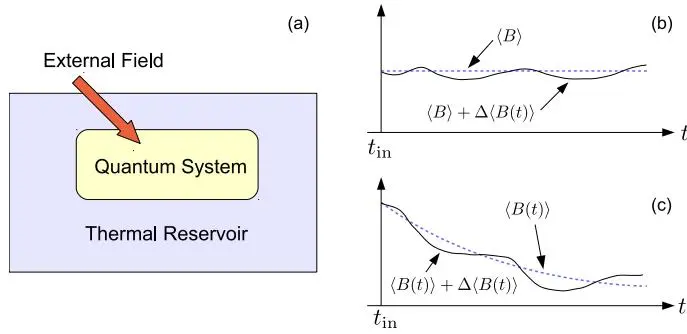
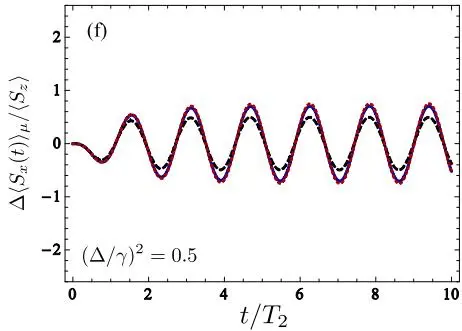

# Linear response theory for open systems: Quantum master equation approach
## 开放系统的线性响应理论：量子主方程方法

**Masashi Ban, Sachiko Kitajima, Toshihico Arimitsu, Fumiaki Shibata**

お茶の水女子大学 · 筑波大学

*Physical Review A* **95**, 022126 (2017)

## 摘要

利用时间局域（time-local）和时间非局域（time-nonlocal）量子主方程，构建了开放量子系统的线性响应理论。其中，一个相关量子系统同时与热库和外部经典场相互作用。通过从量子主方程中提取关于外场的线性项，得到了刻画弛豫过程在弱外场下如何偏离其内禀过程的线性响应函数。该函数由**四个部分**组成：其一表示忽略初始时刻系统-热库关联和不同时刻热库态之间关联时量子系统的线性响应；其余三项分别为上述两种效应带来的修正。该线性响应函数与通常线性响应理论中的 Kubo 公式进行了比较。为研究开放量子系统线性响应的性质，考察了一个两能级系统随机退相干的精确可解模型。此外，推导线性响应函数的方法被应用于计算开放量子系统的两时间关联函数。结果表明，**除非约化时间演化是 Markov 的，否则量子回归定理对开放系统不成立**。

---

## 1 引言

Kubo 于 1957 年建立的线性响应理论 [1–3] 长期以来不仅被用于分析实验结果，也被用于研究物理和化学各领域的理论模型。线性响应函数的一般表达式常被称为 **Kubo 公式**，它极为有用，因为它直接提供可测量量（如磁化率和电导率）。为计算 Kubo 公式，通常采用热 Green 函数和双时 Green 函数的方法——前者由 Matsubara [4] 开创，后者由 Zubarev [5] 完善。此外，Kubo 公式在不可逆过程的非平衡统计力学中具有更基础的意义：线性响应理论从涨落-耗散定理的统一视角建立并推广了 Einstein 关系 [6]、Nyquist 定理 [7] 和 Onsager 倒易关系 [8, 9]。

在通常的线性响应理论 [1–3] 中，整个系统被假定在初始时刻 $t_{\mathrm{in}} \to -\infty$ 处于平衡态，因此初始时刻的密度矩阵与系统哈密顿量对易。随后弱外场被绝热施加到量子系统上，密度矩阵按 Liouville–von Neumann 方程演化。通常的线性响应理论描述的是离平衡不远的不可逆过程。

**与之相对，本文发展的是针对初始时刻制备在任意态上的开放量子系统的线性响应理论**。在此情形下，即使不施加外场，非平衡态的平均值 $\langle B(t) \rangle$ 也是时间依赖的。利用本文发展的推广线性响应理论，可以系统地计算外场引起的偏离 $\Delta \langle B(t) \rangle$。为此，我们使用通过投影算子方法导出的两类量子主方程：时间非局域方程（时间卷积方程）[10–12] 和时间局域方程（时间无卷积方程）[10, 13–16]。

图 1：(a) 系统示意图——外场施加于受热库影响的相关量子系统。(b) 施加外场前处于稳态的系统的平均值时间演化。(c) 系统处于非稳态时的时间演化。

近年来许多作者用各种方法研究了开放量子系统的线性响应理论 [17–27]。然而在大多数工作中，都假设整个系统在施加外场前处于稳态，因此无外场时可观测量保持其平衡值（图 1(b)）。此外，先前工作中外场通常被唯象地引入量子主方程，因此外场对阻尼算子的影响无法被考虑——尽管在 Markov 极限下这种影响可以忽略。

**本文的独特性在于**：
1. **初始态任意**：不假设系统初始处于稳态（图 1(c)）
2. **初始关联**：考虑量子系统与热库之间的初始关联
3. **先消去热库再施加外场 vs 外场存在下消去热库**：两种顺序给出不同的线性响应函数，后者多出热库关联修正项
4. 利用推导线性响应函数的方法，讨论了**量子回归定理的违反**——该方法允许考虑系统-热库初始关联

---

## 2 带外场的量子主方程

考虑开放量子系统的约化时间演化，相关量子系统不仅与热库相互作用，也受经典外场影响。总哈密顿量为

$$
H(t) = H_S(t) + H_R + H_{SR},
$$

其中 $H_S(t) = H_S + H_{\mathrm{ext}}(t)$，$H_{\mathrm{ext}}(t) = -F(t) A$（$F(t)$ 为含时经典场，$A$ 为与场耦合的系统可观测量）。使用 Liouvillian 超算子记号 $L(t) = -(i/\hbar) H^{\times}(t)$ 等，Liouville–von Neumann 方程为

$$
\frac{\partial}{\partial t} W(t) = L(t) W(t).
$$

应用投影算子方法 $P \bullet = \rho_R \operatorname{Tr}_R \bullet$ 消去热库变量，可导出两类量子主方程：

**时间非局域方程（TC）**：
$$
\frac{\partial}{\partial t} \hat{W}_S(t) = \langle \hat{L}_{SR}(t) \rangle_R \hat{W}_S(t) + \int_{t_{\mathrm{in}}}^{t} ds \, \hat{\Phi}(t, s) \hat{W}_S(s) + \hat{J}(t).
$$

**时间局域方程（TCL）**：
$$
\frac{\partial}{\partial t} \hat{W}_S(t) = \hat{K}(t) \hat{W}_S(t) + \hat{I}(t).
$$


虽然外场不直接与热库耦合，但通过系统-热库相互作用，外场会显著影响量子主方程的阻尼算子（damping operator）。这一效应与约化时间演化的**非 Markov 性**密切相关。为研究线性响应，需要从主方程中提取关于外场 $F(t)$ 的一阶项。


---

## 3 Born 近似下的线性响应

当量子系统与热库的耦合强度足够弱时，可应用 Born 近似（二阶近似）。

### 3.1 时间局域主方程的一阶解

在 Born 近似下，时间局域量子主方程为

$$
\frac{\partial}{\partial t} W_S(t) = [L_S + L_{\mathrm{ext}}(t)] W_S(t) + K^{(2)}(t) W_S(t) + I^{(1)}(t) + I^{(2)}(t),
$$

其中 $K^{(2)}(t)$ 是二阶阻尼超算子，$I^{(1)}(t)$ 和 $I^{(2)}(t)$ 是来自系统-热库初始关联的非齐次项。若初始无关联（$W = W_S \otimes W_R$，且投影算子中取 $\rho_R = W_R$），则非齐次项为零。

将 $K^{(2)}(t)$ 展开至外场一阶：$K^{(2)}(t) = \Pi_0(t) + \Pi_1(t)$，其中 $\Pi_0(t)$ 是无外场时的阻尼算子，$\Pi_1(t)$ 是一阶修正。关键在于 $\Pi_1(t)$ 具有紧凑形式：

$$
\Pi_1(t) = \frac{i}{\hbar} \int_{t_{\mathrm{in}}}^{t} d\tau F(\tau) \int_{t_{\mathrm{in}}}^{\tau} dt_1 e^{L_S(t-t_{\mathrm{in}})} \langle L_{SR}(t) [A^{\times}(\tau)]^{\times_{L_{SR}}} L_{SR}(t_1) \rangle_R e^{-L_S(t-t_{\mathrm{in}})}.
$$

这里引入了核心记号 $X^{\times_{L_{SR}}}$，表示 $X$ 与右侧所有 $L_{SR}$ 算子的对易子。

最终得到约化密度矩阵的零阶和一阶部分：$W_S(t) = W_{S,0}(t) + W_{S,1}(t)$。

### 3.2 线性响应函数的四部分结构

可观测量的变化为 $\Delta \langle B(t) \rangle = \int_{t_{\mathrm{in}}}^{t} d\tau \, \phi_{BA}(t, \tau) F(\tau)$，其中线性响应函数由**四个部分**组成：

$$
\phi_{BA}(t, \tau) = \phi_{BA}^{(0)}(t, \tau) + \phi_{BA}^{(c)}(t, \tau) + \phi_{BA}^{(i,0)}(t, \tau) + \phi_{BA}^{(i,c)}(t, \tau).
$$

| 部分 | 物理含义 |
|------|---------|
| $\phi_{BA}^{(0)}$ | 忽略热库关联和初始关联时的基本响应 |
| $\phi_{BA}^{(c)}$ | 热库态在 $\tau$ 时刻前后的**关联修正**（非 Markov 性的直接体现） |
| $\phi_{BA}^{(i,0)}$ | 系统-热库**初始关联**的贡献（忽略热库关联） |
| $\phi_{BA}^{(i,c)}$ | 初始关联和热库关联的**合成效应修正** |


若先消去热库变量再施加外场，只能得到 $\phi_{BA}^{(0)} + \phi_{BA}^{(i,0)}$，而 $\phi_{BA}^{(c)}$ 和 $\phi_{BA}^{(i,c)}$ 会丢失。只有在**外场存在下消去热库变量**，才能得到完整的四部分结构。热库关联修正 $\phi_{BA}^{(c)}$ 包含 $\langle L_{SR}(t_j) [A^{\times}(\tau)]^{\times_{L_{SR}}} L_{SR}(t_k) \rangle_R$（$t_j > \tau > t_k$）——若热库关联时间足够短，此项可忽略。这一存在性与非 Markov 性和量子回归定理的违反密切相关。


### 3.3 与 Kubo 公式的比较

标准 Kubo 公式给出 $\phi_{BA}(t, \tau) = \frac{i}{\hbar} \langle [B(t), A(\tau)] \rangle_{SR}$（其中 $\langle \cdots \rangle_{SR} = \operatorname{Tr}_{SR}[\cdots W]$）。将初始态分解为 $W = W_S \rho_R + \delta W$，Kubo 公式也可自然地分为四项——与主方程方法得到的四部分一一对应：

- 第一项 = $\phi_{BA}^{(0)}$（忽略关联的响应）
- 第二项 = $\phi_{BA}^{(c)}$（热库关联修正）
- 第三项 = $\phi_{BA}^{(i,0)}$（初始关联，忽略热库关联）
- 第四项 = $\phi_{BA}^{(i,c)}$（合成效应）

在 Born 近似下，$V(t, t_{\mathrm{in}}) = \langle e^{L(t-t_{\mathrm{in}})} \rangle_R$，两种进路完全自洽。尽管直接计算 Kubo 公式对开放系统极为困难，本文通过主方程提供了一种**系统性的计算方法**。

### 3.4 示例：随机退相干两能级系统

取热库为满足稳态 Gauss-Markov 过程的经典涨落场 [3, 40]，总哈密顿量为 $H(t) = \frac{1}{2}\hbar\omega\sigma_z + \frac{1}{2}\hbar\Omega(t)\sigma_z$，其中 $\langle \Omega(t) \Omega(s) \rangle_R = \Delta^2 e^{-\gamma|t-s|}$。取 $A = B = \frac{1}{2}(\sigma_z \cos\theta + \sigma_x \sin\theta)$，精确线性响应函数为

$$
\phi_{BA}(t, \tau) = -\frac{1}{2} \langle \sigma_z \rangle G(t, \tau) \sin\omega(t-\tau) \sin^2\theta + \text{初始值依赖项},
$$

其中 $G(t, \tau) = \exp\{-(\Delta/\gamma)^2 [\gamma(t-\tau) - 1 + e^{-\gamma(t-\tau)}]\}$ 是特征函数。在快调制极限（narrowing limit）$(\Delta/\gamma)^2 \ll 1$ 下，$G(t, \tau) \approx e^{-(t-\tau)/T_2}$（$T_2 = \gamma/\Delta^2$ 为退相干时间），热库关联修正 $\phi_{BA}^{(c)} \approx 0$，Born 近似趋近精确解。

图 2：两能级系统在涨落环境中的归一化线性响应 $\Delta \langle S_x(t) \rangle_\mu / \langle S_z \rangle$。(a)–(c) 短脉冲；(d)–(f) 单色场。蓝实线 = 精确解，红虚线 = Born 近似，黑虚线 = 忽略热库关联。参数：$t_p/T_2 = 1.5$，$\omega T_2 = \omega_0 T_2 = 4.0$。(a)(d) 慢调制；(c)(f) 快调制。

### 3.5 基于时间非局域主方程的线性响应函数

时间非局域主方程给出的线性响应函数同样具有四部分结构 $\bar{\phi}_{BA} = \bar{\phi}_{BA}^{(0)} + \bar{\phi}_{BA}^{(c)} + \bar{\phi}_{BA}^{(i,0)} + \bar{\phi}_{BA}^{(i,c)}$，各部分的物理含义与时间局域情形相同。

---

## 4 超越 Born 近似的线性响应

利用时间局域主方程的时间序累积量展开和时间非局域主方程的偏累积量展开，将线性响应理论推广到 Born 近似之外（任意阶系统-热库耦合）。核心工具是引入记号 $\hat{\mathcal{R}}$：将累积量中一对相邻 $L_{SR}(t_j) L_{SR}(t_k)$ 替换为 $L_{SR}(t_j) [\Delta u(t_j, t_k)]^{\times_{L_{SR}}} L_{SR}(t_k)$ 并对所有相邻对求和。最终阻尼算子的一阶修正为

$$
\Pi_1(t) = \sum_{n=2}^{\infty} \int \cdots \int dt_1 \cdots dt_{n-1} e^{L_S(t-t_{\mathrm{in}})} \hat{\mathcal{R}}\big[\langle L_{SR}(t) L_{SR}(t_1) \cdots L_{SR}(t_{n-1}) \rangle_R^{\mathrm{o.c.}}\big] e^{-L_S(t-t_{\mathrm{in}})}.
$$

附录中给出了四阶累积量的显式修正。（时间非局域情形因偏累积量中 Liouvillian 算子的自然排序而更简单。）

---

## 5 关联函数与量子回归定理

将推导线性响应函数的方法应用于两时间关联函数，只需做替换 $(i/\hbar) F(\tau) A^{\times} \to g(\tau) A$（将"外场"替换为"虚构场"作为生成函数）。在 Born 近似的时间局域主方程下，两时间关联函数为

$$
\langle B(t) A(\tau) \rangle = C_{BA}^{(0)}(t, \tau) + C_{BA}^{(c)}(t, \tau),
$$

其中 $C_{BA}^{(0)}$ 由单时间演化超算子 $V(t, t_{\mathrm{in}})$ 和非齐次项 $I_0(t)$ 给出，而修正项 $C_{BA}^{(c)}$ 包含双重时间积分 $\int_{\tau}^{t} dt_1 \int_{t_{\mathrm{in}}}^{\tau} dt_2$——这两重积分的时间区间没有重叠。


单时间平均值 $\langle B(t) \rangle$ 仅由 $V(t, t_{\mathrm{in}})$ 和 $I_0(t)$ 完全决定。但两时间关联函数 $\langle B(t) A(\tau) \rangle$ 除了 $C_{BA}^{(0)}$（可用同样两个算符写出）外，还多出 $C_{BA}^{(c)}$——这意味着**量子回归定理对非 Markov 开放系统不成立**。

$C_{BA}^{(c)}$ 包含热库关联函数 $\langle L_{SR}(t_1) [A(\tau), L_{SR}(t_2)] \rangle_R$（$t_1 > \tau > t_2$）——当且仅当热库关联时间足够短（Markov 极限）时此项消失，量子回归定理恢复。这是对 [35] 中结论的推广：本文方法还允许计入系统-热库初始关联。


---

## 6 总结

本文利用时间局域和时间非局域量子主方程，在最一般设定下构建了开放量子系统的线性响应理论：
- **不假设初始稳态**：可描述从任意初态出发的不可逆演化中外场的影响
- **完整的四部分响应函数**：基本响应 + 热库关联修正 + 初始关联贡献 + 合成效应
- **消去顺序的物理重要性**：先消去热库再施加外场会丢失热库关联修正——这直接关联到非 Markov 性
- **精确可解模型验证**：随机退相干两能级系统的 Born 近似在 narrowing limit 下与精确解一致
- **量子回归定理的违反**：非 Markov 开放系统的两时间关联函数不能仅由单时间传播子确定

---

## 参考文献

学术论文的参考文献条目按国际惯例保留原文。关键文献附加中文短评。

1. R. Kubo, J. Phys. Soc. Jpn. **12**, 570 (1957). — **Kubo 公式原始论文**
2. R. Kubo, Rep. Prog. Phys. **29**, 255 (1966). — **涨落-耗散定理综述**
3. R. Kubo, M. Toda, and N. Hashitsume, *Statistical Physics II* (Springer, 1985).
4. T. Matsubara, Prog. Theor. Phys. **14**, 351 (1955).
5. D. N. Zubarev, Usp. Fiz. Nauk. **71**, 71 (1960).
6. A. Einstein, Ann. Phys. **322**, 549 (1905).
7. H. Nyquist, Phys. Rev. **32**, 110 (1928).
8. L. Onsager, Phys. Rev. **37**, 405 (1931).
9. L. Onsager, Phys. Rev. **38**, 2265 (1931).
10. H. P. Breuer and F. Petruccione, *The Theory of Open Quantum Systems* (Oxford, 2006). — **开放量子系统标准教材**
11. S. Nakajima, Prog. Theor. Phys. **20**, 948 (1958). — **Nakajima-Zwanzig 投影算子方法**
12. R. Zwanzig, J. Chem. Phys. **33**, 1338 (1960).
13. F. Shibata, Y. Takahashi, and N. Hashitsume, J. Stat. Phys. **17**, 171 (1977). — **时间局域主方程（TCL）的奠基性工作**
14. S. Chaturvedi and F. Shibata, Z. Phys. B **35**, 297 (1979).
15. F. Shibata and T. Arimitsu, J. Phys. Soc. Jpn. **49**, 891 (1980). — **投影算子方法的累积量展开公式**
16. C. Uchiyama and F. Shibata, Phys. Rev. E **60**, 2636 (1999).
17. C. Uchiyama et al., Phys. Rev. E **80**, 021128 (2009).
18. M. Saeki et al., Phys. Rev. E **81**, 031131 (2010).
19. C. Uchiyama and M. Aihara, Phys. Rev. A **82**, 044104 (2010).
20. C. Uchiyama, Phys. Rev. A **85**, 052104 (2012).
21. J. E. Avron, M. Fraas, G. M. Graf, and O. Kenneth, New J. Phys. **13**, 053042 (2011).
22. J. E. Avron, M. Fraas, and G. M. Graf, J. Stat. Phys. **148**, 800 (2012).
23. H. Z. Shen et al., Phys. Rev. E **92**, 052122 (2015).
24. L. C. Venuti and P. Zanardi, Phys. Rev. A **93**, 032101 (2016). — **使用 Lindblad 方程唯象引入外场的线性响应**
25. H. Z. Shen, D. X. Li, and X. X. Yi, Phys. Rev. E **95**, 012156 (2017).
26. M. Ban, Phys. Lett. A **379**, 284 (2015).
27. M. Ban, Quantum Stud.: Math. Found. **2**, 51 (2015).
28. S. Swain, J. Phys. A **14**, 2577 (1981).
29. G. W. Ford and R. F. O'Connell, Phys. Rev. Lett. **77**, 798 (1996). — **"量子回归定理不存在"——影响深远的否定性结论**
30-37. [两时间关联函数与量子回归定理的后续文献]
38-39. [随机退相干模型的技术细节]
40. N. G. van Kampen, *Stochastic Processes in Physics and Chemistry* (Elsevier, 1983).
41. R. Kubo, J. Phys. Soc. Jpn. **9**, 935 (1954). — **随机共振吸收理论**
42. P. W. Anderson, J. Phys. Soc. Jpn. **9**, 316 (1954).
43-44. [随机 Liouville 方程]

---

## 阅读笔记

### 一句话概括

这是一篇将 Kubo 线性响应理论推广到**开放量子系统**的方法论论文。核心贡献是：使用投影算子导出的量子主方程（TCL 和 TC 两种），在"外场存在下消去热库变量"的正确顺序下，得到了由四个物理意义清晰的部分组成的线性响应函数，并系统性地建立了线性响应与非 Markov 性和量子回归定理违反之间的联系。

### 核心论证链

1. **问题设定**：标准 Kubo 公式假设整个系统（系统+热库）初始处于平衡态 → 不能处理从"任意初态"出发的开放系统演化
2. **技术路线**：投影算子方法 → TCL/TC 主方程 → 将外场视为微扰，在主方程中提取 $O(F)$ 项
3. **四部分结构的根源**：将系统-热库复合体的初始态分解为 $W = W_S \otimes \rho_R + \delta W$ + 将含时演化算子展开至一阶 → 自然出现关联修正项
4. **与 Kubo 公式的对应**：Kubo 公式 $\langle [B(t), A(\tau)] \rangle_{SR}$ 经相同分解后恰好产生相同的四项——两种进路完全自洽
5. **量子回归定理**：单时间演化只需 $V(t)$，两时间关联还需要热库记忆 → Markov 极限下 $C_{BA}^{(c)} \to 0$，回归定理恢复

### 关键物理：为什么消去顺序重要？

$$
\text{途径 A（先消去再施加场）：} \quad \operatorname{Tr}_R[\cdots] \xrightarrow{\text{得主方程}} \xrightarrow{\text{加外场}} \text{丢两项}
$$
$$
\text{途径 B（外场存在下消去）：} \quad \text{含外场的 Liouville 方程} \xrightarrow{\text{投影算子}} \text{四项齐全}
$$

物理原因：外场通过系统-热库相互作用**间接影响**了阻尼算子 $K(t)$。途径 A 在消去热库时外场尚未"进入"关联函数 $\langle L_{SR}(t) L_{SR}(s) \rangle_R$ 中 → 外场对耗散的修正被忽略。途径 B 中外场全程参与 → 捕获了 $\langle L_{SR}(t_j) [A^{\times}(\tau)]^{\times_{L_{SR}}} L_{SR}(t_k) \rangle_R$ 这类"外场插入在热库涨落中间"的效应。

### 与其他论文的联系

- **dissipation-driven-rabi-qpt**（本图书馆）— De Filippis 等（2023）处理的 Rabi 模型耗散相变中，系统处于非平衡稳态（NESS）。Ban 等的框架恰好为"从任意初态出发的线性响应"提供了系统性的计算工具——原则上可用于分析 Rabi 模型在 NESS 附近对外场微扰的响应
- **Henheik2021-justifying-kubo**（本图书馆）— Henheik & Teufel 关注的是**封闭**有能隙系统的 Kubo 公式严格论证，Ban 等关注的是**开放**系统的实用计算框架。两者互补：前者从数学上论证"Kubo 公式何时对"，后者从物理上推广"Kubo 公式如何算"
- **DeNittis2016-linear-response**（本图书馆，进行中）— De Nittis & Lein 提供了非交换几何/算子代数框架下的线性响应严格处理，与本文的主方程实用进路形成对照

### 批判性思考

1. **Born 近似的隐含限制**：$\phi_{BA}^{(c)}$ 和 $\phi_{BA}^{(i,c)}$ 的表达式涉及系统-热库关联函数的二重/三重积分——对非微扰耦合（如强关联量子杂质系统），累积量展开的收敛性无保证
2. **"初始态任意"的代价**：非齐次项 $I_0(t)$ 和 $I_1(t)$ 需要知道 $\delta W = W - W_S \rho_R$（系统-热库初始关联的具体形式），而实验中通常不直接可测 → 实际应用中常需额外假设（如 $\delta W \approx 0$）
3. **Markov 近似下的退化**：在 Markov 极限下 $\phi_{BA} \to \phi_{BA}^{(0)} + \phi_{BA}^{(i,0)}$，热库关联信息全部丢失——这是否意味着 Markov 开放系统的线性响应"总是可被等效无热库理论描述"？

### 局限性

- 仅适用于弱系统-热库耦合（Born 近似为主，虽有超越 Born 的形式推广但无具体实例）
- 模型验证仅用了经典 Gauss-Markov 涨落场（非量子热库），量子热库（如玻色子热库）的显式计算缺失
- 未讨论多时间关联函数（$n > 2$）的推广
- 非齐次项在实际计算中通常需额外假设（如 $\rho_R$ 的选取），影响实用性

### 关键公式速查

| 公式 | 含义 |
|------|------|
| $\phi_{BA} = \phi_{BA}^{(0)} + \phi_{BA}^{(c)} + \phi_{BA}^{(i,0)} + \phi_{BA}^{(i,c)}$ | 四部分线性响应函数 |
| $\Pi_1(t) = \frac{i}{\hbar} \int d\tau F(\tau) \int dt_1 e^{L_S\cdots} \langle L_{SR} [A^{\times}]^{\times_{L_{SR}}} L_{SR} \rangle_R e^{-L_S\cdots}$ | 外场对阻尼算子的一阶修正 |
| $C_{BA}^{(c)} = \int_{\tau}^{t} dt_1 \int_{t_{\mathrm{in}}}^{\tau} dt_2 \cdots$ | 两时间关联函数中非 Markov 修正（量子回归定理违反的来源） |
| $G(t,\tau) = \exp\{-(\Delta/\gamma)^2 [\gamma(t-\tau) - 1 + e^{-\gamma(t-\tau)}]\}$ | 经典 Gauss-Markov 涨落的特征函数 |

### 延伸阅读

- **Shibata & Arimitsu (1980) [15]** — 投影算子方法的累积量展开公式，是本文技术细节的基础
- **Breuer & Petruccione (2006) [10]** — 开放量子系统标准教材，第 9 章涵盖线性响应
- **Henheik & Teufel (2021)** — 本图书馆已有笔记，封闭有能隙系统的 Kubo 公式严格论证
- **dissipation-driven-rabi-qpt** — 本图书馆已有笔记，开放系统耗散相变中非平衡稳态的具体实例

### 术语对照

| 中文 | 英文 | 含义 |
|------|------|------|
| 线性响应函数 | linear response function | $\phi_{BA}(t, \tau)$：系统对外场 $F(\tau)$ 的响应核 |
| 时间局域/非局域主方程 | time-local (TCL) / time-nonlocal (TC) master equation | 两种投影算子方法导出的等价形式 |
| 投影算子方法 | projection operator method | Nakajima-Zwanzig 技术：$P\bullet = \rho_R \operatorname{Tr}_R \bullet$ |
| 时间序累积量 | time-ordered cumulant | TCL 方程中阻尼算子的展开基础 |
| 偏累积量 | partial cumulant | TC 方程中记忆核的展开基础 |
| 量子回归定理 | quantum regression theorem | 断言两时间关联函数可用单时间传播子计算（仅 Markov 情形成立） |
| narrowing limit | narrowing limit | $(\Delta/\gamma)^2 \ll 1$：快调制极限，此时 Markov 近似有效 |
