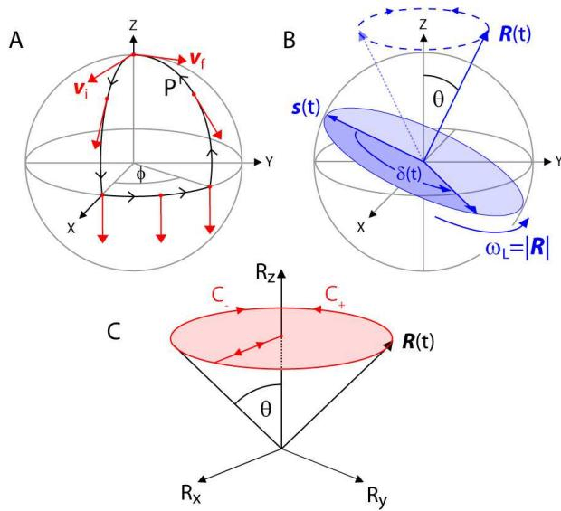
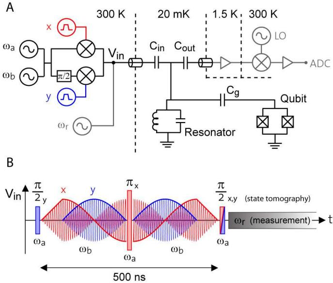
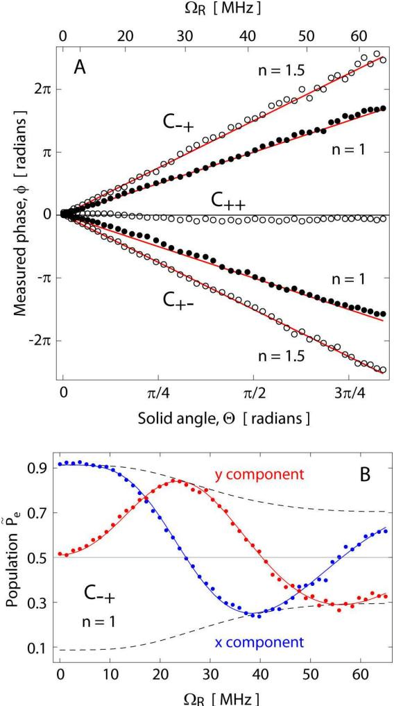
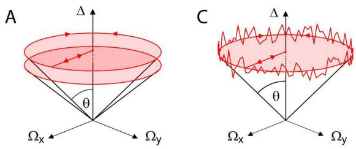
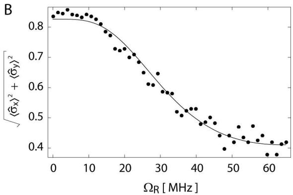

# Observation of Berry's Phase in a Solid State Qubit
## 在固态量子比特中观测到 Berry 相位

**P. J. Leek, J. M. Fink, A. Blais, R. Bianchetti, M. Göppl, J. M. Gambetta, D. I. Schuster, L. Frunzio, R. J. Schoelkopf, A. Wallraff**

ETH Zürich · Université de Sherbrooke · University of Waterloo · Yale University

*Science* **318**, 1889 (2007)

## 摘要

在量子信息科学中，波函数的相位（phase）在编码信息时扮演重要角色。该领域的大多数实验依赖动力学效应（dynamic effects）来操控信息；另一种途径是利用几何相位（geometric phase），它被认为具有潜在的容错性。本文在一个超导量子比特中演示了对几何相位——即 Berry 相（Berry's phase）——的可控积累，通过微波辐射几何地操控量子比特，并在干涉实验中观测到积累的相位。实验结果与 Berry 的理论预言高度吻合，并同时观测到一种与几何路径相关的退相位（dephasing）贡献。

---

## 背景与动机

当量子力学系统随时间做循环演化（cyclic evolution）并回到初始物理状态时，其波函数在熟悉的动力学相位之外，还会获得一个几何相位因子 [1, 2]。若系统的循环变化是**绝热**（adiabatic）的，这一额外因子即为 Berry 相 [3]，它与动力学相位不同，**不依赖于能量和时间**。

在量子信息科学 [4] 中，一个核心目标是用对量子系统的相干控制来处理信息，进入经典系统无法企及的计算区域。基于几何相位的量子逻辑门已在核磁共振（NMR）[5] 和离子阱（ion trap）量子信息架构 [6] 中得到演示。超导电路 [7, 8] 由于其潜在的可扩展性，是量子信息处理 [9–14] 极有前景的固态平台。在超导电路中观测几何相位的方案 [15–19]，自这些系统首次演示相干量子效应 [20] 后不久就已提出。

几何相位与经典的**平行移动（parallel transport）**概念紧密相关：将球面上的切向量 v 从北极沿闭合路径 P 平行移动一周（始终指向南方），其末态 $v_f$ 相对初态 $v_i$ 转过角度 $\varphi$，恰好等于路径 P 在原点处所张的**立体角（solid angle）**。该角度只取决于路径的几何，与遍历速度无关；因此任何不改变立体角的路径偏离都不影响 $\varphi$。这种鲁棒性被解读为应用于量子信息时的潜在容错性 [5]。

---

## 哈密顿量与 Bloch 球图景

量子几何相位与上述经典图景的类比，在二能级系统（量子比特）处于随时间变化的偏置场（bias field）中时尤为清晰（例如自旋 1/2 粒子处于变化的磁场中）。系统的一般哈密顿量为

$$
H = \hbar \, \pmb{R} \cdot \pmb{\sigma} / 2,
$$

其中 $\pmb{\sigma} = (\sigma_x, \sigma_y, \sigma_z)$ 为泡利算符，$\pmb{R}$ 是以角频率为单位的偏置场向量。量子比特动力学最好在 Bloch 球（Bloch sphere）图景中可视化：量子比特态 $\pmb{s}$ 持续绕向量 $\pmb{R}$ 进动，以速率 $R = |\pmb{R}|$ 积累动力学相位 $\delta(t)$（见下图 B）。当 $\pmb{R}$ 的方向被绝热改变（即变化速率远小于 $R$）时，量子比特额外获得 Berry 相，同时保持在关于量子化轴 $\pmb{R}$ 的同一本征态叠加中。当 $\pmb{R}$ 走完闭合圆周路径 $C$ 时，本征态获得的几何相位为 $\pm\Theta_C/2$ [3]，其中 $\Theta_C$ 是 $C$ 在原点所张锥面的立体角；± 号分别对应量子比特基态或激发态。对于下图中所示圆周路径，立体角为

$$
\Theta_C = 2\pi(1 - \cos\theta),
$$

只取决于锥角 $\theta$。

图 1：(A) 向量 $v_i$ 沿闭合路径 P 在球面上平行移动一周后，回到初始位置时转过一个几何角 $\varphi$ 变为 $v_f$。(B) 偏置场 $\pmb{R}$ 与 z 轴成角 $\theta$ 时量子比特 Bloch 向量 $\pmb{s}$ 的动力学。(C) 同一情形下哈密顿量的参数空间。

---

## 实验平台：circuit QED 中的 Cooper pair box

实验在单个超导电子电路实现的二能级系统中进行。量子比特是一个 Cooper pair box（库珀对盒）[21, 22]，在电荷简并点偏置时能级间隔约 $\hbar\omega_a \approx h \times 3.7\,\text{GHz}$，此处它对电荷噪声有最佳防护 [23]。量子比特嵌入一个一维微波传输线谐振腔（resonator）中，谐振频率 $\omega_r/2\pi \approx 5.4\,\text{GHz}$（见下图 A）。这一架构即**电路量子电动力学（circuit QED）**[24, 25]，它使量子比特有效隔离于电磁环境，从而具有较长的能量弛豫时间 $T_1 \approx 10\,\mu\text{s}$ 和自旋回波相位相干时间 $T_2^{\text{echo}} \approx 2\,\mu\text{s}$，并支持高对比度的色散读出（dispersive readout）[26]。

对该超导量子比特偏置场 $\pmb{R}$ 的快速精确控制，通过对经谐振腔输入端耦合到量子比特的微波辐射进行相位与幅度调制实现。存在该辐射时量子比特的哈密顿量为

$$
H = \frac{\hbar}{2}\omega_{\mathrm{a}}\sigma_z + \hbar\Omega_R \cos(\omega_b t + \varphi_R)\sigma_x,
$$

其中 $\hbar\Omega_R$ 是量子比特与频率 $\omega_b$、相位 $\varphi_R$ 的微波场之间的偶极相互作用强度，$\Omega_R/2\pi$ 即共振驱动产生的 Rabi 频率（Rabi frequency）。利用幺正变换 $H' = UHU^{-1} - i\hbar U\dot{U}^{-1}$（$U = e^{i\omega_b t\sigma_z/2}$）转换到以 $\omega_b$ 旋转的参考系，忽略以 $2\omega_b$ 振荡的项（**旋转波近似，rotating wave approximation**）后，变换后的哈密顿量为

$$
H' \approx \frac{\hbar}{2}(\Delta\sigma_z + \Omega_x\sigma_x + \Omega_y\sigma_y),
$$

其中 $\Omega_x = \Omega_R\cos\varphi_R$，$\Omega_y = \Omega_R\sin\varphi_R$，$\Delta = \omega_a - \omega_b$ 是量子比特跃迁频率与外加微波频率之间的失谐（detuning）。这等价于上图 B、C 描绘的一般情形，$\pmb{R} = (\Omega_x, \Omega_y, \Delta)$。实验中固定 $\Delta$，控制偏置场以描出不同半径 $\Omega_R$ 的圆周路径。

图 2：(A) 实验装置简化电路图。中心 20 mK 处是谐振腔/量子比特系统，谐振腔用并联 LC 电路表示，量子比特（分裂式 Cooper pair box）经电容 $C_g$ 与谐振腔耦合。谐振腔通过电容 $C_{\text{in}}$、$C_{\text{out}}$ 与输入/输出传输线耦合。三路脉冲调制微波信号加到谐振腔输入端：用于操控量子比特的两路（量子比特跃迁频率 $\omega_a/2\pi$ 和失谐信号 $\omega_b/2\pi$）经混频器调制为 (B) 的模式；用于测量量子比特态的谐振腔频率信号 $\omega_r/2\pi$ 在脉冲序列之后才开启。(B) $n=0.5$ 情形的脉冲序列示意。共振脉冲（阴影矩形）长 12 ns。两路正交偏置微波场（x：红，y：蓝）以正弦表示，幅度调制如实线所示。各段首尾的线性斜坡对应于在 $\Omega_R=0$ 轴和 $\Omega_R=\text{const.}$ 圆（图 1C）之间绝热移动。

---

## Ramsey 干涉 + 自旋回波提取纯几何相位

在 Ramsey 条纹干涉实验中测量 Berry 相：首先制备量子比特基态与激发态的等权叠加态，它获得相对几何相位

$$
\gamma_C = 2\pi(1 - \cos\theta),
$$

等于图 1C 锥面所围的总立体角，其中 $\cos\theta = \Delta/(\Omega_R^2 + \Delta^2)^{1/2}$。偏置场绝热地沿闭合路径 $C_\pm$ 演化时，量子比特态同时获得动力学相位 $\delta(t)$ 和几何相位 $\gamma_C$，总积累相位 $\phi = \delta(t) \pm \gamma_C$（± 表示路径方向），通过完整的量子比特态层析（tomography）[4] 提取。为**只**观测几何贡献，使用自旋回波（spin echo）[27] 脉冲序列消去动力学相位。

完整序列（见上图 B）以共振 $\pi/2$ 脉冲制备初始 $\sigma_z$ 叠加态开始；然后遍历路径 $C_-$，量子比特获得相位 $\phi_- = \delta(t) - \gamma_C$。施加绕正交轴的共振自旋回波 $\pi$ 脉冲，反转量子比特态、从而反转相位 $\phi_-$。再次沿相反方向 $C_+$ 遍历控制场路径，叠加相位 $\phi_+ = \delta(t) + \gamma_C$。整段序列（记为 $C_{-+}$）最终获得**纯几何相位**

$$
\phi = \phi_+ - \phi_- = 2\gamma_C.
$$

注意：与几何相位不同，动力学相位对路径方向不敏感，因此被完全消去。序列末尾用态层析提取相位：z 分量 $\langle\sigma_z\rangle$ 由激发态布居 $p_e = (\langle\sigma_z\rangle + 1)/2$ 测得；x、y 分量由施加绕 x 或 y 轴的共振 $\pi/2$ 脉冲后测量得到；最终相位 $\phi = \tan^{-1}(\langle\sigma_y\rangle / \langle\sigma_x\rangle)$。

---

## 主要结果

### Berry 相的精确积累

下图 A 给出多次实验中测得相位 $\phi$ 对路径立体角的依赖，均在 $\Delta/2\pi \approx 50\,\text{MHz}$、总脉冲序列时间 $T = 500\,\text{ns}$ 下完成。变化三个参数：路径半径 $\Omega_R$（上横轴）、自旋回波每半段遍历的圆环数 $n$、遍历方向（$C_{-+}$ 与 $C_{+-}$）。测得相位在所有情形下均随 $\Omega_R$ 线性变化，与预期斜率 $2n$ 的均方根偏差仅 0.14 rad，与 Berry 相预言高度吻合——证明能够精确控制几何积累的相位量。反向遍历会使相位反号；而在自旋回波脉冲两侧沿同向遍历（$C_{++}$）的控制实验测得零相位。

图 3：(A) 测得相位 $\phi$ 对单锥路径立体角 $\Theta$（下轴）的依赖，上轴为外加微波场幅度（以共振驱动 Rabi 频率 $\Omega_R$ 为单位）。实心圆为每半段遍历 $n=1$ 圆周的实验，填充圆为 $n=1.5$。$C_{\pm\pm}$ 下标对应自旋回波 $\pi$ 脉冲前后的路径方向。红实线斜率为 $n=\pm 1,\,\pm 1.5$。$C_{++}$ 实验在 $n=1.5$ 下完成。(B) $n=1$ 时 $C_{-+}$ 实验的态层析数据：画出了层析脉冲后提取 $\langle\sigma_x\rangle$（蓝，$p_e = (\langle\sigma_x\rangle + 1)/2$）与 $\langle\sigma_y\rangle$（红）的量子比特激发态布居。曲线为对 Berry 相的拟合，含几何退相位包络函数（虚线，见正文与图 4）。总脉冲序列时间 $T = 500\,\text{ns}$，失谐 $\Delta/2\pi \approx 50\,\text{MHz}$，为累积统计每序列重复 $2\times10^5$ 次。

### 绝热条件

为观测纯 Berry 相，偏置场方向的转动速率须远小于旋转系中量子比特的 Larmor 速率 $R$，以保证绝热动力学。对恒定锥角 $\theta$，这要求

$$
A = \dot{\varphi}_R \sin\theta / 2R \ll 1.
$$

非绝热改变哈密顿量时，量子比特态无法精确跟随有效场 $\pmb{R}$，几何相位偏离 Berry 相 [28]。本实验 $A \le 0.04$，相位偏差不可分辨；并实验验证了在该绝热极限下，观测相位与总序列时间 $T$ 无关。

### 几何退相位（geometric dephasing）

下图 B 给出提取 Berry 相所用的 x、y 分量测量。有趣的是，干涉条纹的对比度依赖于 $\Omega_R$；由于数据在固定总序列时间下采集，这并非传统的 $T_2$ 退相位（它作为时间的函数独立可测），而可由**几何退相位**——一种与路径几何相关的效应 [29]——解释。

图 4：(A) $\Delta$ 的低频涨落使路径所围立体角在各次测量间变化，产生几何退相位，对锥角和偏置场幅度有特征依赖。(B) 图 3B 数据中 Bloch 向量赤道分量幅值 $(\langle\sigma_x\rangle^2 + \langle\sigma_y\rangle^2)^{1/2}$ 随驱动幅度 $\Omega_R$ 的变化，拟合为几何退相位因子 $e^{-\sigma_\gamma^2/2}$，$\sigma_\gamma^2$ 为几何相位方差。(C) $\Delta$ 存在高频（$f \gg T^{-1}$）噪声时的锥形参数空间路径，对总立体角无影响。

实验中退相位由耦合到量子比特的电荷噪声 [30] 引起的量子比特跃迁频率 $\omega_a$（从而 $\Delta$）的低频涨落主导。自旋回波有效消去由低频噪声引起的动力学退相位；但几何相位对慢涨落敏感，因为它们使路径在原点所张立体角在测量间变化（图 4A）。涨落慢于自旋回波序列时间尺度时，几何相位的方差本身具有纯几何依赖 [29]：

$$
\sigma_\gamma^2 = \sigma_\omega^2 (2n\pi\sin^2\theta / R)^2,
$$

其中 $\sigma_\omega^2$ 是 $\omega_a$ 涨落的方差。图 4B 显示相干性随几何的依赖，与预期 $e^{-\sigma_\gamma^2/2}$ 拟合良好，也与图 3B 的原始数据一致。

---

## 结论与意义

本文观测到在低频涨落下进行几何操作时出现的、重要的退相位几何贡献。与之对比，$\omega_a$ 的**高频**噪声对 Berry 相影响很小（在维持绝热的前提下），因为其对立体角的作用被平均掉（图 4C）。几何相位对高频噪声的这种特征鲁棒性，有望用于量子计算逻辑门的实现；不过低频噪声引起的几何退相位效应也必须加以考虑。

---

## 阅读笔记

### 一句话概括

用 circuit QED 架构里的 Cooper pair box，通过「Ramsey 准备 + 绝热圆周遍历 + 自旋回波消动力学相位」的脉冲序列，在固态量子比特里**第一次**干净地测出了 Berry 相，并意外发现了一种由低频噪声经立体角调制产生的「几何退相位」。

### 实验设计的精妙之处

1. **用自旋回波把动力学相位消掉**：Berry 相 $\gamma_C$ 本身远小于动力学相位 $\delta(t)$，直接测会被淹没。作者让路径在回波 $\pi$ 脉冲前后反向走（$C_{-+}$），几何相反号、相加（$+2\gamma_C$），动力学相同号、相消——这是整个实验能「只看到几何」的核心技巧。
2. **把抽象参数空间变成可调控的微波**：哈密顿量里的 $\pmb{R}=(\Omega_x, \Omega_y, \Delta)$ 三维偏置场，对应两路正交相位的微波 + 失谐，$\pmb{R}$ 在参数空间画的圆周 = 物理上对微波相位/幅度的绝热调制。用电路工程实现几何操作，是这篇工作的工程贡献。
3. **立体角 $\Theta_C = 2\pi(1-\cos\theta)$ 是关键不变量**：Berry 相只依赖路径围出的立体角，与遍历速度无关。作者扫 $\Omega_R$、改圈数 $n$、换方向，测得相位全部落在斜率 $2n$ 的直线上，从多组自洽的证据锁死「这就是几何相位」。

### 容易被忽略的副产物：几何退相位

退相位通常被归结为 $T_2$（时间）。但本文发现：固定 $T$、只改变 $\Omega_R$，干涉对比度仍在变——这说明退相位还依赖**路径几何**。机理是：电荷噪声使 $\Delta$ 慢漂移 → 锥角 $\theta$ 漂移 → 立体角在各次测量间不同 → Berry 相的方差 $\sigma_\gamma^2$ 几何化。

$$
\sigma_\gamma^2 = \sigma_\omega^2 (2n\pi\sin^2\theta / R)^2
$$

这点对后来的几何量子门很关键：**几何门对高频噪声鲁棒，但对低频 $1/f$ 噪声反而有额外的、几何性的退相位通道**。换言之，「几何 = 容错」并非免费午餐。

### 与后续工作的关联

- 这是综述笔记中「超导量子电路的崛起（2007–2009）」一节的奠基性论文，是**固态系统中 Berry 相的首次观测**，直接打开了超导几何量子门（holonomic gate）这一方向。
- 其「几何退相位」概念在 2015 年 Berger 等、2016 年 Gasparinetti 等工作中被进一步精测和发展，成为评估几何量子门保真度的核心指标。
- 实验平台（Cooper pair box + 谐振腔、$T_1\approx 10\,\mu\text{s}$、色散读出）正是 circuit QED 黄金期的标准配置，可对照阅读 Wallraff 2004、Blais 2004。

### 术语对照

| 中文 | 英文 | 含义 |
|------|------|------|
| 几何相位 / Berry 相 | geometric phase / Berry's phase | 绝热循环演化获得的、不依赖时间能量的相位 |
| 动力学相位 | dynamic phase | 由能量积分决定的传统相位 $\delta(t)$ |
| 绝热 | adiabatic | 哈密顿量变化速率远小于系统内禀频率 |
| 立体角 | solid angle | 闭合路径在参数空间原点所张的角度 $\Theta_C$ |
| 自旋回波 | spin echo | 用 $\pi$ 脉冲反转、消去动力学相位的脉冲序列 |
| 退相位 | dephasing | 相干性损失，传统为 $T_2$ 时间过程 |
| 几何退相位 | geometric dephasing | 由路径几何（经噪声调制立体角）引起的退相位 |
| Cooper pair box | 库珀对盒 | 基于约瑟夫森结的超导电荷量子比特 |
| circuit QED | 电路量子电动力学 | 超导量子比特与微波谐振腔耦合的架构 |
| 色散读出 | dispersive readout | 量子比特经谐振腔频率位移非破坏性地读出 |
