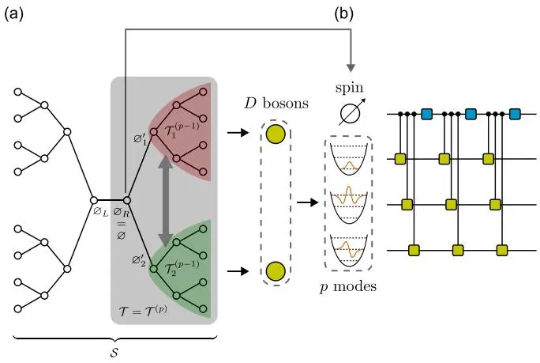
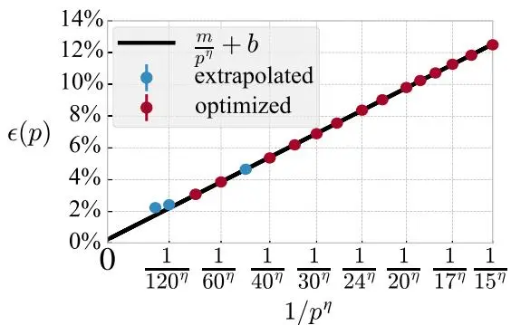
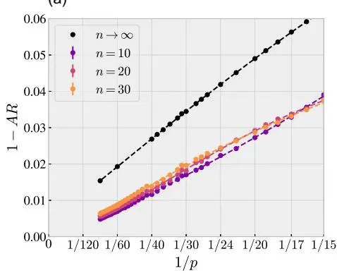
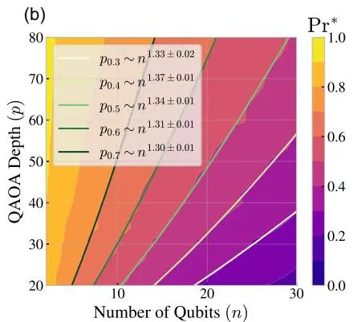
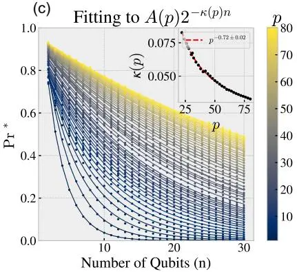

## 量子近似优化算法的自旋-玻色映射

Sami Boulebnane,1,\* Abid Khan , 1,\* Minzhao Liu ,1,† Jeffrey Larson , Dylan Herman, Ruslan Shaydulin ,1,‡ and Marco PistoiaGlobal Technology Applied Research, JPMorganChase, New York, New York 10001, USAMathematics and Computer Science Division, Argonne National Laboratory, Lemont, Illinois 60439, USA

(2025年11月24日收稿；2026年4月14日接收；2026年6月16日发表)

量子近似优化算法(QAOA)的性能随电路深度$p$单调提升，然而对高深度区域的研究一直受到现有精确评估技术中随$p$指数增长的计算成本的阻碍。在本快报中，我们证明，在无穷大尺寸极限下，用于Sherrington-Kirkpatrick (SK) 模型的深度$p$ QAOA态收敛于一个自旋与$p$个玻色子模耦合的态。我们利用矩阵积态模拟自旋-玻色系统，并给出数值证据表明，在平均情况下，QAOA以电路深度$\mathcal{O} ( n / \epsilon^{1.13} )$获得SK模型最优能量的$(1-\epsilon)$近似。我们方法的计算成本适中，使我们能够优化QAOA参数，并观察到在无穷大尺寸极限下，QAOA在$p=160$时达到$\varepsilon \lesssim 2.2 \%$，远远超出先前精确方法可及的$p \leq 20$范围。我们的映射提供了一条多体路径，用于在先前无法进行精确评估的区域内研究和优化高深度QAOA。

优化问题在科学和工业中无处不在，并且通常计算上难以求解。因此，利用量子计算机加速优化问题求解的兴趣日益增长。一个有前途的通用优化算法是量子近似优化算法(QAOA)，有证据表明，对于某些问题，相比于专门的经典算法，QAOA可实现多项式或指数加速[1-4]。

证明量子优势的一种方式是证明量子算法的扩展性优于任何经典算法，就像用于无结构搜索的Grover算法[5]那样。更常见的是，经典下界难以企及，量子优势的论证依赖于缺乏高效经典算法，例如在因子分解[6]以及使用解码量子干涉测量法(DQI)求解最优多项式交集[7]中的量子优势情况。重要的是，即使在对量子算法性能缺乏解析界的情况下，也已开发出专门的数值方案，以获得超出蛮力经典模拟的大规模量子算法的性能保证，使我们能够与现有经典算法进行基准测试，并寻找量子加速的实例。这种论证方式同时用于DQI和QAOA，是我们探索量子优势的关键工具[8]。

在无穷大尺寸极限下评估QAOA性能的形式体系允许与经典算法进行比较[9]。由于QAOA的性能随算法深度$p$单调提升，常见方法是评估尽可能大的$p$（例如，$p \leq 20$ [9]）下的性能，并与经典算法比较。此类方案的核心挑战在于，评估QAOA性能的计算成本随深度$p$呈指数增长。我们通过识别QAOA态在无穷大尺寸极限下与自旋-玻色系统态之间的等价性，并利用矩阵积态以适中成本模拟后者，克服了这一挑战。我们的技术评估QAOA性能；模拟QAOA电路和采样仍需量子计算机。

QAOA的目标是优化一个关于$n$比特串$z = ( z_{1} , \ldots , z_{n} ) \in \{+1, -1\}^n$的经典目标函数$C(z)$。将该目标函数提升为算符$C$，使得

$$
C |z\rangle = C(z) |z\rangle,\tag{1}
$$

其中$z$是一个计算基态，QAOA随后通过一个由整数参数$p \geq 1$刻画的量子电路，生成如下形式的量子态，以寻找低成本比特串：

$$
| \gamma , \beta , C \rangle = U ( B , \beta_{p} ) U ( C , \gamma_{p} ) \cdots U ( B , \beta_{1} ) U ( C , \gamma_{1} ) | s \rangle .\tag{2}
$$

这里，$s$代表计算基态上的均匀叠加，算符$\bar{U ( C , \gamma )} = e^{- i \gamma C}$在计算基上是对角的，而$U ( B , \beta ) = e^{- i \beta B}$，其中$B = \textstyle \sum_{j} X_{j}$是单量子比特泡利X算符之和。角度$\pmb{\gamma} = ( \gamma_{1} , . . . , \gamma_{p} )$和$\pmb{\beta} = ( \beta_{1} , . . . , \beta_{p} )$是定义QAOA态的经典参数。当在计算基上测量态$| \gamma , \beta , C \rangle$时，会产生一个比特串，其代价函数值的期望代价为$\langle \gamma , \beta , C | C | \gamma , \beta , C \rangle$。

在本文中，我们研究了应用于Sherrington-Kirkpatrick模型的QAOA。该模型是一个经典自旋系统，具有$n$个自旋之间的全连接耦合，其能量由下式给出：

$$
C^{\mathrm{SK}} ( z ) = \frac{1} {\sqrt{n}} \sum_{j < k} J_{jk} z_{j} z_{k} ,\tag{3}
$$

其中$J_{jk} \sim \mathcal{N} ( 0 , 1 )$。SK模型通过代价算符$\begin{array} {r} {C^{\mathrm{SK}} = ( 1 / \sqrt{n} ) \sum_{j < k} J_{jk} Z_{j} Z_{k}} \end{array}$编码到量子比特上，其中$Z_{j}$是量子比特$j$上的泡利Z算符。SK模型最初是为了研究无序磁体而提出的[10]，但后来已成为理解复杂能量景观行为的典范模型。SK模型及其推广已被用于理解随机组合优化问题[11,12]、神经网络[13-15]以及其他系统[16]。

在无穷大尺寸极限下，典型实例的最低能量达到所谓的Parisi值[17-19]：

$$
P_{*} = - \operatorname*{lim}_{n \to \infty} \operatorname*{min}_{z} \frac{C^{\mathrm{SK}} ( z )} {n} = 0.763166 . . . .\tag{4}
$$

在最坏情况下，精确找到SK模型的基态是一个非确定性多项式时间困难（NP困难）的优化问题[20]，而在实践中，通用启发式算法需要超多项式时间[21-23]。存在一些基于Hessian上升法[24]和消息传递法[25]、使用时间与$1 / \epsilon$呈指数关系的算法，可以证明找到$( 1 - \epsilon )$近似解。缺乏可证明的精确求解器，加上其经验上的平均情况困难性，推动了针对SK模型的量子算法研究。

已有推测认为，QAOA能够以深度$p$（大约与$1 / \epsilon$成线性关系）高效地找到SK模型的$( 1 - \epsilon )$近似解[9,26]。具体来说，文献[26,27]精确计算了实例平均的无穷大尺寸QAOA能量密度：

$$
\nu_{p} ( \gamma , \beta ) = \operatorname*{lim}_{n \to \infty} \mathbb{E}_{J} \langle \gamma , \beta , C^{\mathrm{SK}} | C^{\mathrm{SK}} / n | \gamma , \beta , C^{\mathrm{SK}} \rangle ,\tag{5}
$$

其中期望是对 SK 耦合 J 的随机选择取平均，分别计算到 $p = 11$ 和 $p = 20$。由于复杂度随 p 呈指数增长，文献 [26,27] 未能研究更高深度。利用本文引入的自旋-玻色子映射（图1），我们计算了更大 p 下的 $\nu_{p}$，展示了 QAOA 能量向 $P_{*}$ 的收敛性。

图1：QAOA 态之间的等价关系。(a) 用于计算 SK QAOA 能量密度的双边树 S。我们特别考虑 $p = 3$ 和 $D = 2$。每个节点是一个量子比特，每条边表示 ZZ 相互作用。树的半部分是 $\mathcal{T}$。该树上的 QAOA 态在以 $\mathcal{D}_{j}^{\prime}$ 为根的子树的交换下是对称的。(b) 在 $D \to \infty$ 极限下构造 $\tau$ 上 QAOA 态所需的演化。根量子比特 ∅ 映射为一个自旋，每个子树映射为一个玻色子或真空。玻色子模式初始化为真空态。蓝色门是 X 旋转，黄色门是自旋控制的玻色子模式位移。

为了建立自旋-玻色子等价性，我们首先考虑树图上的 QAOA 态。下面，对于边集为 E 的 D-正则图 $G = \left( V , E \right)$，我们将成本哈密顿量记为 $C^{G} = ( 1 / \sqrt{D} ) \textstyle \sum_{( u , v ) \in E} Z_{u} Z_{v}$，将混合哈密顿量记为 $\begin{array} {r} {B^{G} = \sum_{v \in V} X_{v}} \end{array}$。我们选择这个问题，基于文献 [9] 的以下结果：

定理 1（文献 [9] 的定理 1）— 对于所有 p 和所有参数 $\gamma , \beta$，SK 模型上无限大无序平均 QAOA 能量密度，等于图1(a) 中 D 叉双边树 S 上 QAOA 态的 ZZ 期望值在 D → ∞ 极限下的结果：

$$
\nu_{p} ( \pmb{\gamma} , \pmb{\beta} ) = \operatorname*{lim}_{D \infty} \langle \gamma , \pmb{\beta} , C^{S} | Z_{L} Z_{R} | \gamma , \pmb{\beta} , C^{S} \rangle .\tag{6}
$$

在文献 [9] 中，树图源于如下观察：随机正则图以高概率局部呈树状。因此，足够大的随机正则图上的 QAOA 能量等价于树图上的 QAOA 能量。这一局域性论证已被推广，表明在广泛稀疏约束满足问题和自旋玻璃上，QAOA 能量具有等价性 [27]，这为将自旋-玻色子映射推广到其他问题提供了途径。

我们的主要结果是，在 D → ∞ 极限下，单边树 $\tau$（双边树 S 的一半）上的 QAOA 态（在范数下）收敛到一个自旋-玻色子态，并且自旋的两时间自关联函数与无序平均 QAOA 能量密度一致。我们现在给出一个直观描述，详细证明见补充材料 [28]（第 VI 节）。

深度为 p 的树 ${\mathcal{T}} = {\mathcal{T}}^{( p )}$ 由一个根顶点 ∅ 和 D 份深度为 $( p - 1 )$ 的子树 $\scriptstyle{\mathcal{T}}^{( p - 1 )}$ 组成，这些子树的根为 $\mathbb{O}_{i}^{\prime}$，其中 $i \in [ D ]$。对于 QAOA 态 $| \gamma , \beta , C^{T} \rangle$，这 D 个子树的排列不改变该态。这种置换对称性自然地提供了将 $D$ 个子树视为 D 个玻色子的识别方式。

此外，对于第 t 层 QAOA，

$$
U ( B^{T} , \beta_{t} ) U ( C^{T} , \gamma_{t} ) = e^{- i \beta_{t} B^{T}} e^{- i \gamma_{t} C^{T}}\tag{7}
$$

因此，每个子树 $\scriptstyle{\mathcal{T}}^{( p - 1 )}$ 的根 $\mathbb{O}_{i}^{\prime}$ 通过 $e^{{- i \gamma_{t} Z_{\emptyset} Z_{\emptyset^{\prime}}} / {\sqrt{D}}}$ 与整棵树的根 $\varnothing$ 相互作用。

在每个 QAOA 层 t，我们仅在根量子比特上插入计算基下的单位分解，$\begin{array} {r} {I_{\otimes} = \sum_{z_{\otimes}^{[ t ]} = \pm 1} | z_{\otimes}^{[ t ]} \rangle \langle z_{\otimes}^{[ t ]} |} \end{array}$，从而将动力学重写为根自旋历史 $\boldsymbol{z}_{\emptyset} = ( z_{\emptyset}^{[ 1 ]} , . . . , z_{\emptyset}^{[ p ]} )$ 的和。对于固定的历史 $z_{\infty}$，第 t 层的根与子树 i 的根 $\mathbb{O}_{i}^{\prime}$ 之间的耦合简化为

$$
e^{- i \gamma_{t} z_{\mathcal{O}}^{[ t ]} Z_{\mathcal{O}_{i}^{\prime}} / \sqrt{D}} = 1 - \frac{i \gamma_{t} z_{\mathcal{O}}^{[ t ]}} {\sqrt{D}} Z_{\mathcal{O}_{i}^{\prime}} + \mathcal{O} ( D^{- 1} ) .
$$

因此，每一层贡献要么为单位算符，要么为在 $\mathbb{O}_{i}^{\prime}$ 上的单个 Z 插入，振幅为 $\mathcal{O} ( D^{- 1 / 2} )$。跨越 p 层后，结果得到一个无插入且振幅为 $\mathcal{O} ( 1 )$ 的项，以及 p 个在某个 $t \in [ p ]$ 处有单个 Z 插入且振幅为 $\mathcal{O} ( D^{- 1 / 2} )$ 的项；具有两个或更多插入的项在 $D \to \infty$ 时消失（对于固定的 $p$）。

将无 Z 插入的子树态记为 $| \Psi^{( p - 1 )} \rangle$，将在第 t 层有单个 Z 插入的子树态记为 $| \Psi_{t}^{( p - 1 )} \rangle$。在上述大 D 展开中，子树态的形式为

将 $\left| \Psi^{( p - 1 )} \right.$ 视为真空态，$| \Psi_{t}^{( p - 1 )} \rangle$ 视为玻色子模式 t 中的单激发，则每个子树得到一个 p 模式单粒子流形。子树之间的置换对称性进一步将其提升为自旋耦合到 p 个玻色子模式的描述。特别地，随着 $D \to \infty$，该态收敛到一个具有有限粒子数的明确定义的极限。

定理 2（非正式表述；证明见文献[28]）——当 $D \to \infty$ 时，态 $| \gamma , \beta , C^{T} \rangle$ 强收敛到 $\mathbb{C}^{2} \otimes \mathbf{L}_{2} ( \mathbf{R} )^{\otimes p}$ 中的一个极限；

$$
| \gamma , \beta , C^{T} \rangle{\underset{D \to \infty} {\longrightarrow}} | \Phi^{( p )} \rangle\tag{10}
$$

$$
\big | \Phi^{( p )} \big \rangle : = \sum_{\tiny \begin{array} {c} {z_{\mathcal{O}} \in \{1 , - 1 \}} \\ {n \in{\bf N}^{p}} \end{array}} c ( z_{\mathcal{O}} , \pmb{n} ) | z_{\mathcal{O}} \rangle \otimes | \pmb{n} \rangle ,\tag{11}
$$

通过适当选择 $c .$，求和遍历所有自然数元组 $\pmb{n} = ( n_{1} , . . . , n_{p} )$，这些元组定义了相应的数态 $| \pmb{n} \rangle = | n_{1} , . . . , n_{p} \rangle$。

为了说明粒子数是有限的，我们注意到每个子树状态为非真空（即处于状态 $| \Psi_{t}^{( p = 1 )} \rangle$）的概率是 $\mathcal{O} ( D^{- 1} )$，如公式(9)所示。拥有 D 个子树意味着对于固定的 $p .$ 总粒子数为 $\mathcal{O} ( 1 )$ ð Þ因此，我们可以将福克空间维数截断为有限数 $d .$

这一结果确立了相应玻色子态的存在性，但并未描述如何获得它。我们现在给出获得该态的过程，证明推迟到补充材料[28]（第一节）中给出。我们首先将自旋初始化到该态，并将玻色子模式初始化为真空态。然后，对于QAOA的每一层，由自旋控制的单模位移作用于所有玻色子模式，随后是对自旋态施加旋转 $\exp ( - i \beta_{t} X )$。对所有 $p$ 层重复此过程。自旋-玻色子态的演化如图1(b)所示。

演化这个自旋-玻色子系统，通过态矢量模拟将产生 $\mathcal{O} ( d^{p} )$ 的代价。幸运的是，我们发现 $d \lesssim 10$ 就足以精确演化自旋-玻色子系统，因为误差在 d 中呈指数消失，并且对 $p$ 的依赖性适中（见补充材料[28]，第五节）。此外，我们发现该系统在整体上的纠缠相对较低，可以利用矩阵乘积态来利用这一点。这些截断的成功可能具有独立的意义，因为它揭示了无限大极限下QAOA行为的基本方面。

利用我们的自旋-玻色子映射，我们通过将点 $( p , \nu_{p} )$ ð Þ拟合到以下方程，数值研究了相对误差 $\epsilon ( p )$ 如何趋近于零

$$
\epsilon ( p ) = 1 - \frac{\nu_{p}} {P_{*}} = \frac{m} {p^{\eta}} + b .\tag{12}
$$

我们拟合了图2中从 $p = 15$ 到 $p = 80$ 的数据，得到 $\eta = 0.88 \pm 0.03 , m = 1.34 \pm 0.10 , b = 0.002 \pm 0.003$，拟合优度为 $1 - R^{2} = 6.83 \times 10^{- 5}$。误差线是99.7%的置信区间（最多偏离均值三个标准差），通过自助法得到。

尽管我们不能排除无限接近 Parisi 值存在阻碍的可能性，但我们根据经验观察到 QAOA 收敛到 Parisi 值。因此，未来工作的一个有趣方向是证明 QAOA 能够以深度 $p o l y ( 1 / \epsilon )$ 实现任意小的 ϵ。在补充材料[28]（第三节）中，我们还按照文献[83]的做法，将函数拟合为 $\epsilon ( p ) =$ $m / ( p^{\eta} + c )$。

ð þ Þ由于文献[26]建立的关于无序的浓度性质，无限大极限能量是典型大规模实例 QAOA 性能的良好预测指标。

图2：来自 Parisi 值的归一化 QAOA 能量偏差 $\epsilon ( p )$。QAOA 参数已优化至 $p = 80$。对于 $p \in \{120 , 160 \}$ 的参数是从 $p = 80$ 外推得到，但未经过优化。x 轴重新标度为 $1 / p^{\eta}$，其中 $\eta \approx 0.88$ 是为最大化公式(12)中描述的线性回归的 $R^{2}$ 值而选择的。

因此，使用无限大极限优化角度的 QAOA 应该在随机有限规模实例上表现良好。我们通过生成规模从 $N = 2$ 到 $N = 30$ 的随机 SK 模型实例（每个规模 2000 个实例）来验证这一点，结果如图3所示。

对于给定深度 $p$ 的特定实例，其性能通过近似比来衡量，定义为

$$
\mathrm{AR} : = \frac{E ( \gamma , \beta ) - E_{\operatorname*{min}}} {E_{\operatorname*{max}} - E_{\operatorname*{min}}} ,\tag{13}
$$

其中 $E ( \gamma , \beta )$ 是由 QAOA 对该实例生成的按比特串平均的能量，$E_{\mathrm{min}} ~ \left( E_{\mathrm{max}} \right)$ 是该实例的最小（最大）能量值。我们使用近似比而非原始能量，因为有限尺寸 SK 实例的典型最优能量与无限尺寸最优能量（Parisi 值）不同。因此，不同尺寸之间的原始 QAOA 能量可能难以比较。

QAOA 随 $p$ 变化的近似比（针对选定的实例尺寸）如图3(a)所示。即使实例规模适中，在使用无限尺寸最优参数且无需实例特定优化的情况下，随着 $p$ 的增加，实例间的平均近似比也会提升。我们绘制了 $n \to \infty$ 极限下的预测近似比，即 $1 - \nu_{p} ( \gamma , \pmb{\beta} ) / \Pi^{*}$，以供参考。这表明使用在无限尺寸极限下优化的角度是一种实用的 QAOA 近似优化运行方式。

接下来，我们评估 QAOA 作为精确求解器的性能。在图3(b)中，我们展示了 QAOA 深度 $p$ 需要如何增长才能获得获取最优比特串的恒定概率 $\mathrm{P r^{*}}$。我们的结果表明，当深度 $p \propto n^{\varsigma}$ 且 $\varsigma \approx 1.3$ 时，QAOA 能够实现恒定的成功概率 $\mathrm{P r^{*}}$。我们注意到，对于不同的 $\mathrm{P r^{*}}$，得到的 $\varsigma$ 值存在微小变化；我们将其归因于数据集的有限规模以及有限尺寸效应。作为参考，取 $\mathrm{P r^{*}} = 0.5$ 时，预测用 QAOA 精确求解 SK 模型所需的电路深度约为 $0.88 \cdot n^{1.3}$。

我们还可以通过考察固定 $p$ 下成功概率随 $n$ 的衰减来估算 $p$ 的缩放比例。如图3(c)所示。对于小 $p$，结果表明成功概率随 $n$ 呈指数衰减。对于每个 $p$，我们将成功概率拟合为 $A ( p ) 2^{- \kappa ( p ) n}$。我们观察到指数满足 $\kappa ( p ) \propto p^{- 0.72}$。这表明深度 $p \propto n^{1 / 0.72} \approx n^{1.39}$ 足以实现恒定的 $\mathrm{P r^{*}}$，这与图3(b)一致。

(a)

讨论——我们的结果建立了 QAOA 极限行为与自旋-玻色子系统动力学之间的等价性。这一关联为将非平衡量子多体物理学技术应用于量子优化算法的研究打开了大门。所建立的等价性揭示了空间（$p$ 个玻色子模式）与时间（$p$ 个 QAOA 层）之间令人惊讶的对偶性，这值得进一步研究。我们相信，除了 Sherrington-Kirkpatrick 模型之外，许多优化问题都可以从类似的映射中受益，从而允许在比精确评估所能达到的更大深度上研究 QAOA。我们的映射很可能可以直接推广到更高阶的自旋玻璃，参考文献[27]给出了与本文考虑的 Sherrington-Kirkpatrick 模型类似的精确解析公式。另一个方向可能是将我们的映射和态构造过程扩展到度数大但有限的图。虽然由于交换对称性，在这种情况下存在 QAOA 态的玻色子解释，但高效地顺序构造该态可能更具挑战性。

图3：使用无限尺寸极限参数在有限尺寸实例上运行的 QAOA。(a) 无论 $n$ 如何，随着 QAOA 深度 $p$ 的增长，平均近似比趋近于 1。(b) 实现恒定成功概率 $\mathrm{P r^{*}}$ 所需的 QAOA 深度 $p$。(c) 在固定 $p$ 下，成功概率随系统规模 $n$ 呈指数衰减。我们在插图中拟合了指数 $\kappa ( p )$ 与 $p$ 的关系。

QAOA在实际中展现的性能优于SK模型经典算法的先前结果。首先，我们尚未发现任何经典算法能在$poly(n, 1/\epsilon)$时间内实现$(1 - \epsilon)$近似。文献[24,25]的方法或许可以通过扩展ð Þ来证明对$1/\epsilon$的多项式依赖。在补充材料[28]（第VIII节）中，我们尝试改进复杂度。文献[25]报告的运行时间为$C(\epsilon) n^{2}$。我们展示了并行化能将其改进$n$倍，且$C(\epsilon) = \mathcal{O} [ e^{\mathcal{O} ( 1/\epsilon^{4} )} / \epsilon^{16} ]$，仍未能实现ð Þ ¼ ½ 多项式依赖。我们注意到有一个普遍观点，认为该复杂度可以改进到$\mathcal{O} ( n / \epsilon^{2} )$，但缺乏ð Þ详细的实证研究来证明其复杂度优于已知的理论界。其次，我们尚未发现任何经典算法能在$poly(n)$时间内精确求解SK模型。通过扩展文献[24,25]的方法来解决这一问题似乎更具挑战性。需要指出的是，我们关于QAOA作为精确求解器的结果是通过模拟小规模实例的完整QAOA量子态得到的；还需要进一步研究来验证这一行为在更大$n$时是否依然成立。

虽然已知SK模型在最坏情况下是NP难的[20]，但其平均情况下的困难程度尚未被充分理解。某些类别的算法已被排除作为在平均情况下求解SK模型基态的方法。例如，没有稳定的算法能够在低温下近似采样SK吉布斯测度[84]。计算SK模型的配分函数是Sharp-P难的[11]。此外，SK模型对耦合中的微小扰动表现出混沌性[85]，这表明低次多项式（LDP）算法不应能成功求解它。然而，QAOA对SK模型的精确高效求解并不被这些结果排除。例如，$p = poly(n)$的QAOA不是LDP算法。我们希望我们的结果暗示了SK模型在平均情况下容易求解，这为自旋玻璃的行为提供了宝贵见解，因此在量子计算领域之外也具有趣味性。

致谢—作者感谢Leo Zhou、Kunal Marwaha和James Sud对本文草稿的有益评论，感谢Shouvanik Chakrabarti、Helmut Katzgraber、Sergey Knysh和Hidetoshi Nishimori对SK模型的有益讨论。作者感谢Katherine Klymko对数值实验的宝贵反馈以及对在Perlmutter超级计算机上执行计算的支持。作者感谢Shree Hari Sureshbabu、Zichang He、Atithi Acharya和Brajesh Gupt关于QAOA参数优化以及QAOA与自旋-玻色系统经典模拟的有益讨论。作者感谢摩根大通全球技术应用研究中心的同事们提供的支持和有益讨论。本工作基于美国能源部科学办公室国家量子信息科学研究中心的资助。本研究使用了阿贡领导力计算设施的资源，该设施是美国能源部（DOE）科学办公室位于阿贡国家实验室的用户设施，并基于美国DOE科学办公室-高级科学计算研究计划的资助，合同编号DE-AC02-06CH11357。本研究使用了国家能源研究科学计算中心（NERSC）的资源，该中心是美国能源部科学办公室的用户设施，获得NERSC奖项编号DDR-ERCAP0034098。

S. B.和R. S.构思了该项目。S. B.构思并发展了证明模拟QAOA能量与自旋-玻色系统等价的理論分析。S. B.实现了张量网络模拟的原型。A. K.改进了张量网络模拟，将其扩展到超级计算机上，并进行了数值实验。M. L.帮助改进了张量网络模拟。J. L.开发并集成了数值优化器。D. H.分析了文献[25]的经典消息传递算法。S. B.、A. K.、M. L.、J. L.、D. H.、R. S.和M. P.共同参与了技术讨论和论文撰写。

### 作者声明无利益冲突。

本文由摩根大通全球技术应用研究中心提供，仅供信息参考。本文并非摩根大通或其关联机构研究部门的产品。摩根大通及其任何关联机构均不对本文作任何明示或暗示的陈述或保证，且均不对与本文相关的任何责任负责，包括但不限于对本文所载信息的完整性、准确性或可靠性，以及其可能产生的法律、合规、税务或会计影响。本文档无意作为投资研究或投资建议，也不构成对任何证券、金融工具、金融产品或服务的购买或出售的建议、要约或招揽，也不得以任何方式用于评估参与任何交易的利弊。美国政府保留，并且通过接受发表本文，出版商承认美国政府保留，一项非排他性、已付费、不可撤销的、全球性的许可，以发表或复制本作品的已发表形式，或允许他人为美国政府目的这样做。

数据可用性——针对无限大极限下SK模型深度p的QAOA的所有优化角度可在QOKit [87]中找到。本工作中提出的完整数据见参考文献[86]。详细推导及其他数值结果见补充材料[28]。

[1] S. Boulebnane 和 A. Montanaro, PRX Quantum , 030348 (2024).

[2] R. Shaydulin 等人, Sci. Adv. , eadm6761 (2024).[3] E. Farhi, S. Gutmann, D. Ranard 和 B. Villalonga, arXiv: 2503.12789.

[4] A. Montanaro 和 L. Zhou, arXiv:2411.04979.

[5] L. K. Grover, 收录于《第二十八届年度ACM计算理论研讨会论文集——STOC '96》STOC '96 (ACM Press, New York, NY, 1996), 第212–219页.

[6] P. W. Shor, 收录于《第35届计算机科学基础年度研讨会论文集》FOCS 1994 (IEEE, Piscataway, NJ, 1994), 第124–134页.

[7] S. P. Jordan, N. Shutty, M. Wootters, A. Zalcman, A. Schmidhuber, R. King, S. V. Isakov, T. Khattar 和 R. Babbush, Nature (London) , 831 (2025).[8] H.-Y. Huang, S. Choi, J. R. McClean 和 J. Preskill, arXiv: 2508.05720.

[9] J. Basso, E. Farhi, K. Marwaha, B. Villalonga 等人, 收录于《第17届量子计算、通信与密码学理论会议 (TQC 2022)》, Leibniz国际信息学会议论文集 (LIPIcs) 第232卷 (Schloss Dagstuhl—Leibniz-Zentrum für Informatik, Dagstuhl, Germany, 2022), 第7:1–7:21页.

[10] D. Sherrington 和 S. Kirkpatrick, Phys. Rev. Lett. , 1792–1796 (1975).

[11] D. Gamarnik 和 E. C. Kızılda ´g, Ann. Appl. Probab. , 1474 (2021).

[12] M. M´ezard, G. Parisi 和 R. Zecchina, Science , 812 (2002).

[13] D. J. Amit, H. Gutfreund 和 H. Sompolinsky, Phys. Rev. A , 1007 (1985).

[14] A. Engel, 《学习的统计力学》（Statistical Mechanics of Learning）(Cambridge University Press, Cambridge, England, 2001).

[15] H. Nishimori, 《自旋玻璃与信息处理的统计物理学：导论》（Statistical Physics of Spin Glasses and Information Processing: An Introduction）, 国际物理专著系列第111卷 (Clarendon Press, Oxford, 2001).

[16] C. Villani, 《最优输运》（Optimal Transport）(Springer, Berlin Heidelberg, 2009).[18] A. Crisanti 和 T. Rizzo, Phys. Rev. E , 046137 (2002).[19] K. Binder 和 A. P. Young, Rev. Mod. Phys. , 801 (1986).

[21] M. Aramon, G. Rosenberg, E. Valiante, T. Miyazawa, H. Tamura 和 H. G. Katzgraber, Front. Phys. , 48 (2019).

[22] T. Leleu, F. Khoyratee, T. Levi, R. Hamerly, T. Kohno 和 K. Aihara, Commun. Phys. , 266 (2021).[23] K. Sankar, A. Scherer, S. Kako, S. Reifenstein, N. Ghadermarzy, W. B. Krayenhoff, Y. Inui, E. Ng, T. Onodera, P. Ronagh 和 Y. Yamamoto, npj Quantum Inf. , 64 (2024).

[24] D. Jekel, J. S. Sandhu 和 J. Shi, 收录于《2025年ACM-SIAM离散算法年度研讨会论文集 (SODA)》(SIAM, Philadelphia, PA, 2025), 第5307–5387页.

[26] E. Farhi, J. Goldstone, S. Gutmann 和 L. Zhou, Quantum , 759 (2022).

[27] J. Basso, D. Gamarnik, S. Mei 和 L. Zhou, 收录于《2022年IEEE第63届计算机科学基础年度研讨会 (FOCS)》(IEEE, Piscataway, NJ, 2022), 第335–343页.

[28] 详见 <http://link.aps.org/supplemental/10.1103/2w94-rymn> 的补充材料，其中包含自旋玻色子映射的详细证明、QAOA能量计算过程、Fock空间截断分析、替代拟合函数以及经典消息传递算法的分析，并引用了文献[29–82]。

[29] T. Ayral, T. Louvet, Y. Zhou, C. Lambert et al., PRX Quantum , 040304 (2023).

[30] J. Larson and M. Menickelly, Math. Program. Comput. , 1 (2024).

[31] J. Larson, M. Menickelly, J. P. O’Neal, and S. M. Wild, Interpolation-Based Composite Derivative-Free Optimization (2025), <https://github.com/POptUS/IBCDFO>.

[32] S. M. Wild, in Advances and Trends in Optimization with Engineering Applications, edited by T. Terlaky, M. F. Anjos, and S. Ahmed (SIAM, 2017), pp. 529–540.

[33] B. Villalonga, Performance of the QAOA on MaxCut over Large-Girth Regular Graphs (2022), <https://github.com/benjaminvillalonga/large-girth-maxcut-qaoa>.

[34] E. Farhi, J. Goldstone, and S. Gutmann, <https://arxiv.org/abs/1411.4028>.

[35] M. P. Harrigan, K. J. Sung, M. Neeley, K. J. Satzinger et al., Nat. Phys. , 332 (2021).

[36] S. Boulebnane, J. Sud, R. Shaydulin, and M. Pistoia, arXiv:2503.09563.

[37] F. Verstraete and J. I. Cirac, Phys. Rev. B , 094423 (2006).

[38] T. Hao, Z. He, R. Shaydulin, J. Larson, and M. Pistoia, Phys. Rev. Res. , 033179 (2025).

[39] Z. He, R. Shaydulin, D. Herman, C. Li et al., Parameter setting heuristics make the quantum approximate optimization algorithm suitable for the early fault-tolerant era, in ICCAD ’24: Proceedings of the 43rd IEEE/ACM International Conference on Computer-Aided Design (ACM, New York, NY, 2024), Vol. 63, pp. 1–7.

[40] M. Fishman, S. R. White, and E. M. Stoudenmire, SciPost Phys. Codebases 4 (2022).

[41] Argonne leadership computing facility.

[42] National energy research scientific computing.

[43] T. Hogg and D. Portnov, Inf. Sci. (NY) , 181 (2000).

[44] T. Hogg, Phys. Rev. A , 052311 (2000).

[45] S. Omanakuttan, Z. He, Z. Zhang, T. Hao, A. Babakhani, S. Boulebnane, S. Chakrabarti, D. Herman, J. Sullivan, M. A. Perlin, R. Shaydulin, and M. Pistoia, arXiv:2504.01897.

[46] R. Shaydulin and M. Pistoia, in 2023 IEEE International Conference on Quantum Computing and Engineering (IEEE, Piscataway, NJ, 2023), pp. 1074–1077.

[47] E. Pelofske, A. Bärtschi, and S. Eidenbenz, in Lecture Notes in Computer Science (Springer Nature, Switzerland, 2023), pp. 240–258.

[48] E. Pelofske, A. Bärtschi, L. Cincio, J. Golden, and S. Eidenbenz, npj Quantum Inf. , 109 (2024).

[49] B. Tasseff, T. Albash, Z. Morrell, M. Vuffray, A. Y. Lokhov, S. Misra, and C. Coffrin, J. Heuristics , 325 (2024).

[50] Z. He, R. Shaydulin, S. Chakrabarti, D. Herman, C. Li, Y. Sun, and M. Pistoia, npj Quantum Inf. , 121 (2023).

[51] Z. He, D. Amaro, R. Shaydulin, and M. Pistoia, Commun. Phys. , 217 (2025).

[52] Z. Zhang, J. Shen, N. Kumar, and M. Pistoia, arXiv:2504 .00987.

[53] G. Parisi, Proc. Natl. Acad. Sci. U.S.A. , 7948 (2006).

[54] A. Anshu and T. Metger, Quantum , 999 (2023).

[55] A. Apte, S. H. Sureshbabu, R. Shaydulin, S. Boulebnane, Z. He, D. Herman, J. Sud, and M. Pistoia, arXiv:2504.01694.

[56] R. Shaydulin, I. Safro, and J. Larson, in Proceedings of the IEEE High Performance Extreme Computing Conference (IEEE, Piscataway, NJ, 2019).

[57] A. E. Alaoui, A. Montanari, and M. Sellke, arXiv:2001 .00904.

[58] A. Auffinger and W.-K. Chen, Commun. Math. Phys. , 1429 (2014).

[59] JPMorgan Chase, QOKit, <https://github.com/jpmorganchase/QOKit> (2023), accessed: 2025-05-12.

[60] A. Jagannath and I. Tobasco, Proc. Am. Math. Soc. , 3135 (2016).

[61] A. Auffinger and W.-K. Chen, arXiv:1303.3573.

[62] Y. Jin, Z. He, T. Hao, D. Amaro, S. Tannu, R. Shaydulin, and M. Pistoia, arXiv:2504.21172.

[63] A. Auffinger, W.-K. Chen, and Q. Zeng, arXiv:1703.06872.

[64] P. C. Lotshaw, G. Siopsis, J. Ostrowski, R. Herrman, R. Alam, S. Powers, and T. S. Humble, Phys. Rev. A , 042411 (2023).

[65] V. Akshay, H. Philathong, E. Campos, D. Rabinovich, I. Zacharov, X.-M. Zhang, and J. D. Biamonte, Phys. Rev. A , 042438 (2022).

[66] J. A. Montanez-Barrera and K. Michielsen, npj Quantum Inf. , 131 (2025).

[67] L. Zhou, $g_{s} , t$ is the autocorrelation function (private correspondence).

[68] D. Panchenko, The Sherrington-Kirkpatrick Model (Springer Science & Business Media, New York, 2013).

[69] A. Auffinger and W.-K. Chen, arXiv:1606.05335.

[70] W.-K. Chen, M. Handschy, and G. Lerman, *Probab. Theory Relat. Fields* , 53 (2017).[71] D. Gamarnik, *Proc. Natl. Acad. Sci. U.S.A.* , e2108492118 (2021).

[72] A. E. Alaoui and A. Montanari, arXiv:2009.11481.

[73] M. Talagrand, *Ann. Math.* , 221 (2006).[74] O. Y. Feng, R. Venkataramanan, C. Rush, and R. J. Samworth, *Found. Trends Mach. Learn.* , 335 (2022).[75] A. E. Alaoui, A. Montanari, and M. Sellke, arXiv:2111.06813.

[76] H. E. Cheairi and D. Gamarnik, arXiv:2412.18014.

[77] Y. Nesterov et al., *Lectures on Convex Optimization* (Springer, New York, 2018), Vol. 137.

[78] M. Ivkov and T. Schramm, arXiv:2311.09017.

[79] L. Zhou, S.-T. Wang, S. Choi, H. Pichler, and M. D. Lukin, *Phys. Rev. X* , 021067 (2020).

### 参考文献

[81] S. Aaronson and A. Arkhipov, in Proceedings of the Forty-Third Annual ACM Symposium on Theory of Computing, STOC ’11 (Association for Computing Machinery, New York, 2011), pp. 333–342.

[82] A. Bouland, B. Fefferman, C. Nirkhe, and U. Vazirani, Nat. Phys. , 159 (2019).

[83] L. Zhou, The QAOA at high girth for MaxCut and the Sherrington-Kirkpatrick model, Talk at the TQC 2022 Conference (2022).

[84] A. E. Alaoui, A. Montanari, and M. Sellke, arXiv:2203.05093.

[85] S. Chatterjee, arXiv:0907.3381.

[86] S. Boulebnane, A. Khan, M. Liu, J. Larson, D. Herman, R. Shaydulin, and M. Pistoia, Data for “A spin-boson mapping of the quantum approximate optimization algorithm”, 10.5281/zenodo.15103145 (2025).

[87] D. Lykov, R. Shaydulin, Y. Sun, Y. Alexeev, and M. Pistoia, in Proceedings of the SC ‘23 Workshops of the International Conference on High Performance Computing, Network, Storage, and Analysis, SC-W 2023 (ACM, New York, 2023). <https://github.com/jpmorganchase/QOKit>.

---

## 阅读笔记

### 一句话概括
本文针对Sherrington–Kirkpatrick (SK) 模型上无穷大尺寸极限的QAOA，提出**自旋-玻色子映射**方法：将深度$p$的QAOA态等价为一个自旋与$p$个玻色子模耦合的量子态，并利用**矩阵积态（MPS）** 高效模拟该自旋-玻色系统（Fock截断维数$d\lesssim10$）。核心结论：在$p=160$时达到相对误差$\varepsilon\lesssim2.2\%$（远超此前精确方法$p\leq20$的极限），经验上收敛到Parisi值，且有限尺寸验证表明精确求解需$p\propto n^{1.3}$——这给出了QAOA相比经典消息传递算法$\mathcal{O}[e^{\mathcal{O}(1/\epsilon^4)}/\epsilon^{16}]$复杂度的多项式优势。

---

### 核心论证链

1. **问题定位：为何需要新方法**——SK模型是平均情况困难的NP-hard自旋玻璃问题，QAOA性能随深度$p$单调提升，但现有精确评估技术（文献[26,27]）因计算成本随$p$指数增长，仅能处理$p\leq20$。**因此必须寻找计算成本可控的方法来评估高深度QAOA性能，从而与经典算法做有意义的基准对比**。

2. **树图等价性：将无穷大随机图映射为树**——基于文献[9]的定理1：SK模型上无穷大无序平均QAOA能量密度等于$D$叉双边树$S$上QAOA态的ZZ期望值在$D\to\infty$极限下的结果。**这一步将全连接随机图的全局计算问题简化为具有递归结构的树图上的局域计算，是后续映射成立的前提**。

3. **置换对称性识别玻色子自由度**——树$\mathcal{T}$由根节点和$D$个置换对称的子树构成。由于这$D$个子树的排列不改变QAOA态，该对称性自然地提供了将$D$个子树视为$D$个相同玻色子的识别方式。**这是从"多个独立子系统"到"玻色子多体系统"的概念跃迁，为福克空间描述铺平道路**。

4. **大$D$展开与单粒子流形构造（核心映射）**——在每个QAOA层$t$，根与子树的耦合$e^{-i\gamma_t Z_\emptyset Z_{\mathcal{O}_i'}/\sqrt{D}}$在$D\to\infty$下泰勒展开为：单位算符（$\mathcal{O}(1)$振幅）加每层一个$Z$插入（$\mathcal{O}(D^{-1/2})$振幅），两个及以上插入的项消失。因此每个子树态分解为真空态$|\Psi^{(p-1)}\rangle$与$p$个单激发态$|\Psi_t^{(p-1)}\rangle$。**这一展开直接确定了映射后的玻色子自由度数恰好等于QAOA层数$p$——空间模数与时间层数的对偶性由此诞生**。

5. **极限态收敛与Fock空间截断**——$D\to\infty$时QAOA态强收敛到自旋-玻色子态$|\Phi^{(p)}\rangle\in\mathbb{C}^2\otimes L_2(\mathbb{R})^{\otimes p}$。关键物理：每个子树非真空概率仅$\mathcal{O}(D^{-1})$，总粒子数$\mathcal{O}(1)$，因此Fock空间可截断至很小维数$d\lesssim10$，且误差在$d$中指数衰减。**这保证了自旋-玻色子系统的模拟复杂度不随$p$指数爆炸，而是由低纠缠结构主导**。

6. **MPS数值模拟与幂律拟合**——利用自旋-玻色系统整体纠缠较低的特点，用MPS高效演化至$p=160$。将数据点$(p,\nu_p)$拟合到$\epsilon(p)=m/p^\eta+b$，得到$\eta=0.88\pm0.03$，$b=0.002\pm0.003$（$1-R^2=6.83\times10^{-5}$）。**结论：QAOA能量经验上收敛到Parisi值，且$\epsilon\sim1/p^{0.88}$意味着要达到$(1-\epsilon)$近似，所需深度为$p\propto 1/\epsilon^{1.13}$**。

7. **有限尺寸验证与经典算法对比**——在$n=2$到$30$的随机SK实例上验证：即使使用无限大极限优化的参数（无需实例调参），近似比随$p$持续提升；精确求解成功概率的指数衰减$\kappa(p)\propto p^{-0.72}$暗示所需深度$p\propto n^{1.3}$。与经典消息传递算法[25]的$\mathcal{O}[e^{\mathcal{O}(1/\epsilon^4)}/\epsilon^{16}]$复杂度对比，**QAOA的$\mathrm{poly}(1/\epsilon)$依赖展现出显著优势，尽管该优势基于经验拟合而非严格证明**。

---

### 实验参数详解

| 参数 | 数值 | 含义 |
|------|------|------|
| 最大QAOA深度$p$ | 160 | 此前精确方法仅达$p\leq20$ |
| Fock空间截断维数$d$ | $\lesssim10$ | 每个玻色子模的最大占据数，误差随$d$指数衰减 |
| 幂律指数$\eta$ | $0.88\pm0.03$ | $\epsilon(p)=m/p^\eta+b$，拟合区间$p=15$到$80$ |
| 幂律系数$m$ | $1.34\pm0.10$ | 同上拟合，99.7%置信区间（自助法） |
| 常数偏移$b$ | $0.002\pm0.003$ | 拟合残差，与零在$3\sigma$内一致 |
| 拟合优度$1-R^2$ | $6.83\times10^{-5}$ | 线性回归几乎完美 |
| 有限尺寸验证范围 | $n=2$至$30$ | 每个规模2000个随机SK实例 |
| 精确求解标度指数$\varsigma$ | $\approx1.3$ | 恒定成功概率下$p\propto n^\varsigma$ |
| 成功概率衰减指数$\kappa(p)$ | $\propto p^{-0.72}$ | 固定$p$下成功概率$\propto2^{-\kappa(p)n}$，见插图拟合 |
| 此前精确可达最大深度 | $p=20$ | 文献[27]的极限，计算成本随$p$指数增长 |
| Parisi值$P_*$ | $0.763166$ | SK模型热力学极限下的基态能量密度 |

---

### 批判性思考

1. **大$D$展开的算子收敛性未严格证明**——论文将$e^{-i\gamma_t Z_\emptyset Z_{\mathcal{O}_i'}/\sqrt{D}}$做泰勒展开至$O(D^{-1})$并声称高阶项在$D\to\infty$时消失。但$e^{-i\theta A/\sqrt{D}}$的展开并非普通数值泰勒级数（因$Z_\emptyset Z_{\mathcal{O}_i'}$算符范数为1），且在QAOA态的关联函数中，$D$个子树的大量弱贡献可能相干叠加而非简单消失，需要更严格的算子范数收敛分析。

2. **Fock截断$d\lesssim10$缺乏系统误差传播分析**——论文声称截断误差在$d$中指数衰减且对$p$依赖适中，但未给出不同$p$下截断误差的具体数值，也未与$p\leq20$区域的精确结果进行逐点交叉验证。当$p$从20增至160时，$d$是否需随之增长？缺少定量界。

3. **$b=0.002\pm0.003$不等于收敛性证明**——拟合常数$b$在$3\sigma$内不显著，可解读为支持收敛到Parisi值。但拟合区间仅覆盖$p=15$至$80$，且$p>80$的点使用外推参数而非真实优化值。不能排除$\epsilon(p)$在更大$p$下偏离幂律行为或收敛到一个微小但非零常数的可能性。

4. **经典算法比较的证据强度不对称**——论文给出经典消息传递算法[25]的复杂度$\mathcal{O}[e^{\mathcal{O}(1/\epsilon^4)}/\epsilon^{16}]$系独立重新分析所得，且作者自述"普遍观点认为可改进到$\mathcal{O}(n/\epsilon^2)$，但缺乏详细实证研究"。QAOA的$\mathcal{O}(n/\epsilon^{1.13})$基于经验拟合，而经典算法的指数复杂度基于理论分析——两者证据类型不同，直接比较需谨慎。

5. **有限尺寸外推的风险**——精确求解标度律$p\propto n^{1.3}$源自$n\leq30$的数值外推。小规模系统中，有限尺寸效应、能隙结构和纠缠特性可能与热力学极限下定性不同。成功概率随$n$呈指数衰减本身暗示了有限尺寸效应不可忽略，该标度律在$n\sim100$以上是否成立完全未知。

6. **自旋-玻色映射的适用范围窄**——映射依赖三个条件：SK模型的全连接性、$D\to\infty$极限（即无穷大连通度）、置换对称性。对于更实际的有限度数图（如MaxCut on $3$-regular graphs），$D$固定，大$D$展开不成立，映射不直接适用。论文承认"度数有限时顺序构造该态可能更具挑战性"，这意味着该方法目前仅限于SK模型一类高度对称问题。

7. **缺少与张量网络精确方法的直接对比**——论文使用MPS模拟自旋-玻色系统，但未对$p\leq20$区域提供与文献[27]精确结果的保真度对比。这种验证对于建立新方法在更高$p$下的可信度至关重要。

---

### 局限性

- **无限尺寸极限与有限系统的鸿沟**：核心结果$\nu_p$在$n\to\infty$极限下推导，而有限尺寸SK实例的基态能量密度与Parisi值存在$O(1/\sqrt{n})$量级的统计涨落，使用无限大角度在有限系统上的实际性能缺乏理论保证。
- **$D\to\infty$极限仅对应全连接图**：映射本质依赖于$D$叉树的$D\to\infty$极限，对应SK模型的全连接性质。对于有限度数图，$D$固定，大$D$展开崩溃，映射不可用。
- **经验拟合缺乏解析推导**：$\epsilon(p)\sim m/p^\eta$是纯经验性幂律拟合，作者未给出任何解析论证$\eta\approx0.88$的起源。无法排除其他函数形式（如$\epsilon\sim e^{-\alpha p}$）或存在非零渐近值的可能。
- **$p>80$的数据点参数未优化**：图2中$p=120,160$使用的参数从$p=80$外推而非实际优化，意味着这些点不代表该深度下QAOA的最优性能，实际$\epsilon(p)$可能更低。
- **Fock截断与MPS精度缺乏系统验证**：未提供$d$取不同值时$\nu_p$的收敛曲线，也未与$p\leq20$精确结果进行保真度交叉验证。MPS的键维数（bond dimension）选择及其对结果的影响也未报告。
- **精确求解标度律受限于小规模数据**：$p\propto n^{1.3}$基于$n\leq30$的数值外推，该标度律在更大$n$下可能因能隙闭合、纠缠熵增长等效应发生质变。
- **未考虑量子噪声和退相干**：论文完全在无噪声QAOA框架下分析，实际量子硬件上的门错误、退相干和测量误差在高深度（$p=160$）下极为严重，可能使理论预测的精度在物理实现中完全不可达到。
- **经典复杂度比较的基准不确定性**：与文献[25]的对比中，论文重新分析了经典算法复杂度但未提供复现基准。缺少在相同问题规模和近似比要求下，经典算法与QAOA的实际运行时间对比数据。
- **缺少对映射本身计算复杂度的分析**：论文虽展示了$p=160$的计算可行性，但未系统分析MPS模拟自旋-玻色系统的计算复杂度如何随$p$标度（键维数增长、时间成本等），难以评估该方法可扩展到的最大$p$。

---

### 关键公式速查

- $$C^{\mathrm{SK}}(z)=\frac{1}{\sqrt{n}}\sum_{j<k}J_{jk}z_jz_k$$ — SK模型目标函数，其中$J_{jk}\sim\mathcal{N}(0,1)$，式(3)
- $$P_*=-\lim_{n\to\infty}\min_z\frac{C^{\mathrm{SK}}(z)}{n}=0.763166\ldots$$ — SK模型热力学极限基态能量密度（Parisi值），式(4)
- $$\nu_p(\boldsymbol{\gamma},\boldsymbol{\beta})=\lim_{n\to\infty}\mathbb{E}_J\langle\boldsymbol{\gamma},\boldsymbol{\beta},C^{\mathrm{SK}}|C^{\mathrm{SK}}/n|\boldsymbol{\gamma},\boldsymbol{\beta},C^{\mathrm{SK}}\rangle$$ — 无穷大无序平均QAOA能量密度，式(5)
- $$\nu_p(\boldsymbol{\gamma},\boldsymbol{\beta})=\lim_{D\to\infty}\langle\boldsymbol{\gamma},\boldsymbol{\beta},C^S|Z_LZ_R|\boldsymbol{\gamma},\boldsymbol{\beta},C^S\rangle$$ — 能量密度与双边树$S$上ZZ期望值的等价关系（定理1），式(6)
- $$|\Phi^{(p)}\rangle=\sum_{\substack{z_\emptyset\in\{1,-1\}\\ \boldsymbol{n}\in\mathbb{N}^p}}c(z_\emptyset,\boldsymbol{n})|z_\emptyset\rangle\otimes|\boldsymbol{n}\rangle$$ — $D\to\infty$极限下的自旋-玻色子态，$\boldsymbol{n}=(n_1,\ldots,n_p)$为数态标签，式(11)
- $$\epsilon(p)=1-\frac{\nu_p}{P_*}=\frac{m}{p^\eta}+b$$ — 相对误差与深度的幂律拟合，$m=1.34,\eta=0.88,b\approx0$，式(12)
- $$\mathrm{AR}:=\frac{E(\boldsymbol{\gamma},\boldsymbol{\beta})-E_{\min}}{E_{\max}-E_{\min}}$$ — 有限尺寸实例的近似比定义，$E_{\min}/E_{\max}$为实例最小/最大能量，式(13)
- $$|\boldsymbol{\gamma},\boldsymbol{\beta},C\rangle=U(B,\beta_p)U(C,\gamma_p)\cdots U(B,\beta_1)U(C,\gamma_1)|s\rangle$$ — 深度$p$的QAOA态，$U(C,\gamma)=e^{-i\gamma C},U(B,\beta)=e^{-i\beta B}$，式(2)

---

### 术语对照

| 中文 | 英文 | 含义 |
|------|------|------|
| 量子近似优化算法 | Quantum Approximate Optimization Algorithm (QAOA) | 变分量子算法，通过$p$层交替算符演化制备近似最优解态 |
| Sherrington–Kirkpatrick模型 | Sherrington–Kirkpatrick (SK) model | 全连接自旋玻璃模型，具有高斯随机耦合$J_{jk}$ |
| Parisi值 | Parisi value $P_*$ | SK模型热力学极限下的精确基态能量密度$0.763166$ |
| 自旋-玻色子映射 | Spin-boson mapping | 将$D\to\infty$极限下树图QAOA态映射为自旋-玻色耦合系统的核心技术 |
| 矩阵积态 | Matrix Product State (MPS) | 用于模拟低纠缠量子态的张量网络表示，本文用于演化自旋-玻色系统 |
| Fock空间截断 | Fock space truncation | 将每个玻色子模的最大占据数截断到有限$d$的近似 |
| 大$D$展开 | Large-$D$ expansion | 在$D\gg1$下将根-子树耦合算子展开到$O(D^{-1})$的微扰技术 |
| 双边树 | Bilateral tree $S$ | $D$叉树结构，其ZZ期望值在$D\to\infty$时等价于SK的QAOA能量 |
| 近似比 | Approximation Ratio (AR) | 归一化性能指标，$1$对应找到基态 |
| 消息传递算法 | Message-passing algorithm | 经典自旋玻璃近似求解方法，用于复杂度对比的基准 |
| 置换对称性 | Permutation symmetry | 树根下$D$个子树的排列不变性，是玻色子识别的关键 |
| 福克空间 | Fock space | 多粒子量子态的张量积空间，本文中每个玻色子模式用数态 $\lvert n\rangle$ 描述 |

---

### 延伸阅读

- **E. Farhi, J. Goldstone, S. Gutmann & L. Zhou, Quantum 6, 759 (2022)** — 首次将SK模型的QAOA能量密度精确计算到$p=11$，建立了无序平均的解析公式体系，是本文的直接前期工作。
- **J. Basso, D. Gamarnik, S. Mei & L. Zhou, FOCS 2022** — 将QAOA的局部树状论证推广到更广泛的稀疏约束满足问题和自旋玻璃，证明能量等价性的一般条件，为自旋-玻色映射的推广提供了理论基础。
- **S. Boulebnane & A. Montanaro, PRX Quantum 5, 030348 (2024)** — 提供了QAOA在组合优化问题上可实现多项式/指数加速的严格证明框架，与本文的经验性标度律形成互补。
- **L. Zhou, S.-T. Wang, S. Choi, H. Pichler & M. D. Lukin, Phys. Rev. X 10, 021067 (2020)** — 展示了QAOA参数优化中的景观结构，可作为理解本文中参数优化策略的辅助背景。

### 延伸阅读

- **[量子主成分分析](/papers/lloyd2014-quantum-pca/)** — Lloyd 等（2014）提出量子主成分分析（qPCA）算法，利用多份未知量子态副本通过密度矩阵指数化实现特征值与特征向量的量子形式提取，时间复杂度 O(log
