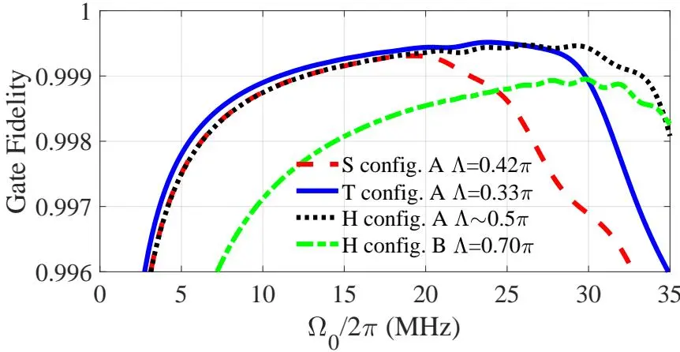
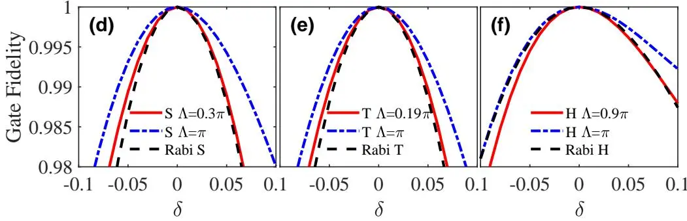

# Path-optimized nonadiabatic geometric quantum computation on superconducting qubits
## 超导量子比特上的路径优化非绝热几何量子计算

**Cheng-Yun Ding, Li-Na Ji, Tao Chen, Zheng-Yuan Xue**

华南师范大学 · 广东省量子工程与量子材料重点实验室 · 南方科技大学

*Quantum Sci. Technol.* **7**, 015016 (2022) | [理论方案，含主方程 + 误差模拟]

## 摘要

基于非绝热几何相位的量子计算因快速操控和内在噪声抵抗受到广泛关注，但受限于特定的演化路径，门时间通常长于传统动力学门，导致鲁棒性减弱。本文的核心发现是：**同一个几何门可以从多种不同的演化路径获得，而不同路径的鲁棒性差异显著**。基于此发现，提出了路径优化的几何量子计算方案。数值模拟表明，路径优化后的单量子比特 S（$\pi/2$）、T（$\pi/4$）和 Hadamard 门的保真度分别达 99.93%、99.95% 和 99.95%，双量子比特控制相位（CZ）门达 99.87%。

---

## 核心方案

### 关键洞察：同一门 ≠ 唯一路径

此前所有几何门方案（包括 Xu 2020、Zhao 2021）都假设每个几何门对应唯一"正确"的演化路径。Ding 2022 的关键突破是认识到：**到达同一最终几何变换的路径有很多条，不同路径对噪声的响应不同**。

用 dressed-state 基 $|\varphi_\pm(t)\rangle$ 参数化演化（极角 $\chi(t)$，方位角 $\xi(t)$），经循环演化 $\tau$ 后的变换为：

$$U(\tau) = \cos\gamma + i\sin\gamma [\sigma_z \cos\chi_0 + \sin\chi_0 (\sigma_x \cos\xi_0 + \sigma_y \sin\xi_0)] = e^{i\gamma \vec{n}\cdot\vec{\sigma}} \tag{7}$$

其中 $\gamma = \gamma_d + \gamma_g$ 是总相位。动力学相位 $\gamma_d$ 为：

$$\gamma_d = \frac{1}{2} \int_0^\tau [\dot{\xi}(t) \sin^2\chi(t) + \Delta(t)] / \cos\chi(t)\ dt \tag{8}$$

通过选择合适的 $\chi(t)$ 和 $\xi(t)$，可以使 $\gamma_d = 0$（纯几何）且 $\gamma_g$ 取目标值——**但 $\chi(t)$ 和 $\xi(t)$ 的选择不唯一**。

### 路径优化方法

定义参数 $\eta \in [0, 0.5]$ 表征路径形状，计算每种路径下门对各类噪声（频率失谐、脉冲振幅误差、退相干）的保真度，选择最优 $\eta$。

图 3：S、T、H 门的门保真度随路径参数 $\eta$ 的变化。不同门的最优 $\eta$ 值不同。

### 与 Xu 2020 的区别

| | Xu 2020 | Ding 2022 |
|---|---|---|
| 优化目标 | 脉冲形状（OCT） | **演化路径形状** |
| 优化参数 | $\eta$（OCT 权重） | **$\eta$（路径参数）** |
| 设计哲学 | 反演设计 + 后加优化 | **直接在路径空间中搜索最优解** |
| 门保真度（单比特） | 99.8-99.9% | **99.93-99.95%** |


路径优化 = 在**所有可能路径**的连续空间中选择鲁棒性最佳的，而非从单个路径出发后加优化。这是一个更根本的设计理念转变。


### 双量子比特几何门

基于参数可调耦合的两个 transmon（$T_1$ 和 $T_2$）的小失谐 $\Delta'$，利用 $|11\rangle \leftrightarrow |02\rangle$ 子空间实现几何 CZ 门。路径优化后的保真度达 99.87%。

图 1：(a) transmon 能级（含弱非谐性 $\alpha$），(b) 2D 电容耦合 transmon 晶格，(c) 双 transmon 的参数可调耦合方案。

---

## 阅读笔记

### 一句话概括

发现同一几何门可由多种路径实现且鲁棒性显著不同，提出在路径空间中搜索最优解的方法，使保真度达到 99.93-99.95%。

### 核心论证链

1. 给定几何门在 Bloch 球上对应**多条**可能的演化路径 → 不被已有方案承认
2. 不同路径对噪声（频率失谐、振幅误差、退相干）的鲁棒性**显著不同**
3. 参数化路径（$\eta$），计算每种路径下的门保真度 → 选最优
4. S 门 $\eta_{\text{opt}}=0.22$，T 门 $\eta_{\text{opt}}=0.18$，H 门 $\eta_{\text{opt}}=0$ → **不同门的最优路径不同**
5. 扩展到双量子比特 CZ 门 → 99.87%

### 批判性思考

1. **路径优化的 "分辨率" 有限**：仅用一个标量参数 $\eta$ 参数化路径，可能错过更复杂路径形状中的全局最优解
2. **与 OCT 的互补关系**：路径优化 + OCT = 更好的结果，但文中没有做两者的结合（Deng 2026 部分弥补了这一点）
3. **实验验证缺失**：与 Xu 2020 一样，纯数值模拟，实验参数设定偏乐观

### 关键公式速查

| 公式 | 含义 | 备注 |
|------|------|------|
| $U(\tau) = e^{i\gamma \vec{n}\cdot\vec{\sigma}}$ | 任意单比特旋转的几何实现 | Eq. (7) |
| $\gamma_d = \frac{1}{2}\int [\dot{\xi}\sin^2\chi + \Delta]/\cos\chi\ dt$ | 动力学相位（需消除） | Eq. (8) |
| $\gamma_g = \gamma - \gamma_d$ | 纯几何相位 | — |

### 延伸阅读

- **[Xu et al. 2020, Front. Phys.](/papers/xu2020-nonadiabatic-optimal-control/)** — 同组：反演设计 + OCT
- **[Liang & Xue 2024, PRApplied](/papers/liang2024-ondemand-geometric-gates/)** — 同组：按需轨迹
- **[Zhao et al. 2021, Sci. China](/papers/zhao2021-xmon-geometric-gates/)** — 实验实现（固定路径）

### 术语对照

| 中文 | 英文 | 含义 |
|------|------|------|
| dressed-state | dressed state | 在驱动场存在时的哈密顿量本征态 |
| 路径优化 | path optimization | 在路径空间中搜索最优鲁棒性的演化路径 |
