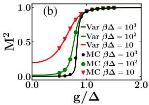
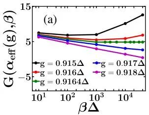
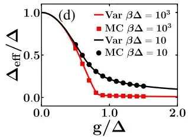
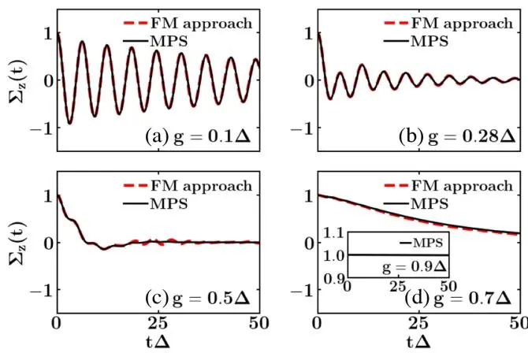
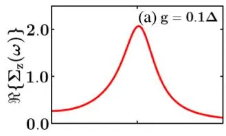
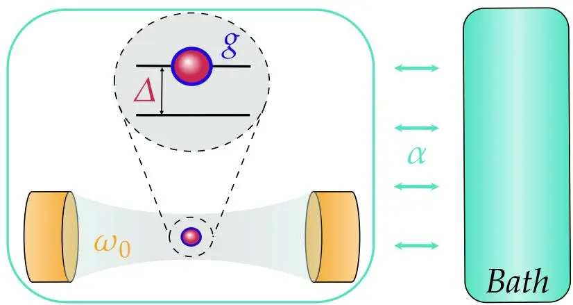
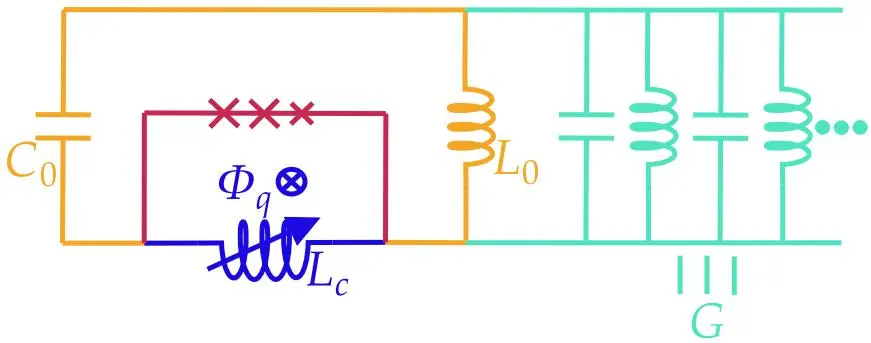
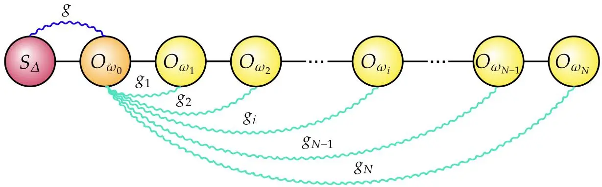

# Signatures of Dissipation Driven Quantum Phase Transition in Rabi Model
## 耗散驱动的 Rabi 模型中的量子相变信号

**G. De Filippis, A. de Candia, G. Di Bello, C. A. Perroni, L. M. Cangemi, A. Nocera, M. Sassetti, R. Fazio, V. Cataudella**

SPIN-CNR · Università di Napoli Federico II · INFN Napoli · Bar-Ilan University · UBC · Università di Genova · ICTP · NEST-CNR

*Phys. Rev. Lett.* **130**, 210404 (2023)

## 摘要

我们用 worldline Monte Carlo（WLMC）、矩阵乘积态（MPS）以及 à la Feynman 变分法，研究耗散量子 Rabi 模型——一个两能级系统与浸没在粘性流体中的线性谐振子耦合——的平衡性质与弛豫特征。我们证明：在 Ohmic 区，随两能级系统与谐振子间耦合强度变化，会发生 **Berezinskii-Kosterlitz-Thouless（BKT）量子相变**。这是一个**非微扰**结果——即便耗散强度极低，相变仍发生。借助最先进的理论方法，我们揭示了系统向热平衡弛豫的特征，在时域和频域中均指出量子相变的信号，并把序参量与典型的线性响应测量（如磁化率）联系起来。我们证明在低到中等耗散下，量子相变发生在深强耦合区，并提出用磁通量子比特 + 阻尼 LC 振荡器实现该模型。

---

## 背景与动机

1936 年 Rabi 提出描述最简单一类光-物质相互作用的模型——两能级量子系统（量子比特）与经典单色辐射场（一维谐振子）的偶极耦合 [1]。其量子版本（量子 Rabi 模型）[2–4] 把辐射场量子化为单模场。腔内原子与电磁场的相互作用既深化了对光-物质相互作用的理解，也在量子技术（激光、量子计算架构 [5,6]、超快门 [7]、量子纠错码 [8]、远程纠缠 [9]、冷原子与离子阱 [10]）中扮演关键角色。

近年来，超导磁通量子比特与 LC 振荡器通过约瑟夫森结电感耦合，已能实验实现强、超强乃至**深强耦合** [20]——此时耦合强度与原子频率、腔频率相当，量子比特-谐振子系统的能量本征态高度纠缠。但当系统与环境（导致退相干与耗散）的相互作用被显式纳入时，其完整物理性质仍不清楚。本文要回答的核心问题是：


耗散量子 Rabi 模型是否存在量子相变（QPT）？它在线性响应测量中留下什么信号？


文献中已在 Dicke 模型 [23–26] 和电阻分路约瑟夫森结 [27–31] 中讨论过 QPT。Dicke 模型在 $N\to\infty$ 极限下从准可积过渡到量子混沌；约瑟夫森结的 QPT 则长期存在争议 [27]。更简单的**自旋-玻色子模型**（两能级系统耦合 Ohmic 环境）中 QPT 已确立 [32]：增大自旋-环境耦合即触发相变。最近证明 Rabi 哈密顿量（仅含单模腔场 + 两能级原子）也展现 QPT [33,34]——它出现在腔频率 $\omega_0$（以量子比特能隙 $\Delta$ 为单位）趋于零的**经典极限**：此即平均场二阶耗散相变 [35]，并已被实验观测 [36]。

**本文的新发现**：在**全量子极限**（$\omega_0/\Delta\neq 0$），耗散 Rabi 模型展现出一种完全不同的 QPT——增大量子比特-谐振子耦合时发生 **BKT 量子相变**。这是一个非微扰结果：只要腔-浴耦合不为零（哪怕极弱），QPT 都会发生。

---

## 模型

哈密顿量写成两部分之和：

$$
H = H_{Q\text{-}O} + H_I, \tag{1}
$$

其中

- $H_{Q\text{-}O} = -(\Delta/2)\sigma_x + \omega_0 a^\dagger a + g\sigma_z(a + a^\dagger)$ 描述量子比特-谐振子系统，$\Delta$ 为隧穿矩阵元，$a\,(a^\dagger)$ 为频率 $\omega_0$ 玻色场的湮灭（产生）算符，$g$ 为耦合强度；
- $H_I = \sum_{i=1}^{N}\left[\frac{p_i^2}{2M_i} + \frac{k_i}{2}(x - x_i)^2\right]$ 描述环境自由度及其与谐振子的耦合。浴由频率 $\omega_i^2 = k_i/M_i$、坐标 $x_i$、动量 $p_i$ 的谐振子集合表示；$x = \sqrt{1/(2m\omega_0)}\,(a+a^\dagger)$ 是质量为 $m$ 的谐振子位置算符。取 $\hbar = k_B = 1$。

$\sigma_x, \sigma_z$ 为本征值 $\pm 1$ 的 Pauli 矩阵。耗散环境建模为严格 Ohmic 浴，谱密度

$$
J(\omega) = \sum_{i=1}^{N}\frac{k_i\omega_i}{2m\omega_0}\delta(\omega-\omega_i) = \alpha_{\mathrm{cav}}\,\omega\,\Theta(\omega_c - \omega),
$$

无量纲参数 $\alpha_{\mathrm{cav}}$ 量度耦合强度，$\omega_c$ 为截断频率。

### 关键映射：结构化有效浴

通过对角化「腔 + 环境」哈密顿量，模型可映射 [12,14] 为：单一带隙 $\Delta$ 的两能级系统，通过 $\sigma_z$ 与**结构化玻色浴**耦合。有效谱密度

$$
J_{\mathrm{eff}}(\omega) = \frac{2 g^{2} \omega_{0}^{2} \alpha_{\mathrm{cav}}\,\omega}{[\omega^{2} - \omega_{0}^{2} - h(\omega)]^{2} + (\pi \alpha_{\mathrm{cav}} \omega_{0} \omega)^{2}}\,\Theta(\omega_c - \omega), \tag{2}
$$

其中 $h(\omega) = \alpha_{\mathrm{cav}}\omega_0\omega\log\!\left[\frac{\omega_c+\omega}{\omega_c-\omega}\right]$。

{{< callout type="note" title="$J_{\mathrm{eff}}$ 的两个关键特征" >}}
1. **Lorentzian 峰**：在谐振子频率 $\omega_0$ 处有宽度 $\pi\alpha_{\mathrm{cav}}\omega_0$ 的 Lorentzian 峰。
2. **低频 Ohmic 行为**：当 $\omega\ll\omega_0$ 时，$J_{\mathrm{eff}}(\omega)\simeq (\alpha_{\mathrm{eff}}/2)\,\omega$，其中 $\alpha_{\mathrm{eff}} = 4g^2\alpha_{\mathrm{cav}}/\omega_0^2$。

正是这个**低频 Ohmic 尾巴**驱动了 BKT 相变——它对应于映射后一维自旋链上 $1/\tau^2$ 的长程相互作用。


本文参数固定为 $\alpha_{\mathrm{cav}} = 0.2$、$\omega_0 = 0.75\Delta$、$\omega_c = 10\Delta$。

---

## 平衡态中的 QPT 证据

用两种方法研究平衡性质：有限温 à la Feynman 变分法 [37–39] 与基于路径积分的 WLMC [37–39]。消去结构化浴自由度后得到有效欧氏作用量 [32,39,57,58]：

$$
S = \frac{1}{2}\int_0^\beta d\tau\int_0^\beta d\tau'\,\sigma_z(\tau)\,K_{\mathrm{eff}}(\tau-\tau')\,\sigma_z(\tau'), \tag{3}
$$

其中 $\beta = 1/T$，核 $K_{\mathrm{eff}}$ 由 $J_{\mathrm{eff}}$ 与浴传播子表示：

$$
K_{\mathrm{eff}}(\tau) = \int_0^\infty d\omega\, J_{\mathrm{eff}}(\omega)\,\frac{\cosh[\omega(\beta/2-\tau)]}{\sinh(\beta\omega/2)}.
$$

问题等价于一维经典自旋链——自旋分布在长度为 $\beta$ 的链上，铁磁性地以强度 $K_{\mathrm{eff}}(\tau-\tau')$ 相互作用（$\tau,\tau'$ 标记链上自旋）。泛函积分用 Poisson 测度、基于 Swendsen-Wang 的团簇算法 [57,59,60] 求解。


固定 $\omega_0$、取 $\beta\to\infty$ 时，$K_{\mathrm{eff}}(\tau) \to \alpha_{\mathrm{eff}}/(2\tau^2)$。这个 $1/\tau^2$ 的长程相互作用正是 **BKT 量子相变**的根源。


图 1：在不同温度下 $\langle H_Q\rangle/\Delta$（a）和 $M^2$（b）随 $g/\Delta$ 的变化：WLMC 方法与变分法的比较（图中 MC 与 Var）。

图 1 画出 $\langle H_Q\rangle/\Delta$（$H_Q = -(\Delta/2)\sigma_x$ 为两能级系统哈密顿量）与量子比特平方磁化强度 $M^2 = (1/\beta)\int_0^\beta d\tau\,\langle\sigma_z(\tau)\sigma_z(0)\rangle$，作为 $g/\Delta$ 的函数，温度从 $T = 10^{-1}\Delta$ 到 $T = 10^{-3}\Delta$。两种方法高度吻合。随 $g/\Delta$ 增大，$\langle H_Q\rangle$ 增大（有效隧穿逐步减小），且**始终非零**、几乎不随温度变化。$M^2$ 则从 0 升到约 1，温度越低变得越陡——预示着 BKT 量子相变（在 BKT 转变中，$M^2$ 应在临界点 $g_c$、$T=0$ 处出现跃变 [61,62]）。

### 临界耦合的精确估计：Minnhagen 方法

为精确确定 $g_c$（以及临界 $\alpha_c$），作者借鉴 Minnhagen 等在 XY 模型中提出的方法 [63–65]：在此情境下，**手征性**与**晶格尺寸**分别由平方磁化强度与逆温度 $\beta$ 扮演。定义标度序参量 $\Psi(\alpha_{\mathrm{eff}},\beta) = \alpha_{\mathrm{eff}} M^2$，BKT 理论预言大 $\beta$ 时渐近地

$$
\Psi(\alpha_c,\beta)/\Psi_c = 1 + \tfrac{1}{2}(\ln\beta - \ln\beta_0),
$$

$\beta_0$ 为唯一拟合参数，普适跳变 $\Psi_c = \Psi(\alpha_c,\beta\to\infty)$ 预期等于 1。在该框架下，函数

$$
G(\alpha_{\mathrm{eff}},\beta) = [1/\Psi(\alpha_{\mathrm{eff}},\beta) - 1] - 2\ln\beta
$$

应在 $\alpha_{\mathrm{eff}} = \alpha_c$ 处**渐近地与 $\beta$ 无关**——这唯一确定了 $\alpha_c$。

图 2 (a)：WLMC 技术得到的函数 $G$ 随 $\beta\Delta$ 的变化，取 $g\simeq g_c$。曲线汇聚处即临界点。

对纯 Ohmic 浴 $J(\omega) = (\alpha/2)\omega\Theta(\omega_c-\omega)$，$\alpha_c \approx 1.05$（$\omega_c = 10\Delta$）[37]。图 2(b) 比较了完整 $J_{\mathrm{eff}}$ 与「只保留低频贡献」（即令 $\alpha_c = 4g_c^2\alpha_{\mathrm{cav}}/\omega_0^2 = 1.05$）得到的 $g_c/\Delta$ 对 $\omega_0/\Delta$ 的依赖——两者吻合，证明 **QPT 由谱密度的低频渐近行为驱动**（即映射自旋系统按 $1/\tau^2$ 衰减的长程作用）。


- **BKT 相变**（$\omega_0$ 有限、$\beta\to\infty$）：$g_c \propto \omega_0$；
- **平均场相变**（$\omega_0\to 0$、$\beta\to\infty$、$\omega_0\beta\to 0$）：核 $K_{\mathrm{eff}}$ 与 $\tau$ 无关，由 $\lambda = g^2/(\omega_0\Delta)$ 控制，$\lambda_c = 1/4$，即 $g_c \propto \sqrt{\omega_0}$。


值得一提：相变判据 $\alpha_c = 4g_c^2\alpha_{\mathrm{cav}}/\omega_0^2 = 1.05$ 表明，对 $\alpha_{\mathrm{cav}}\lesssim 0.25$ 的低到中等耗散，QPT 发生在**深强耦合区**——这正是当今实验可达到的区间。

### 正确的序参量：是 $M^2$，不是 $\langle H_Q\rangle$

简单的基于极化子幺正变换的变分法 [12] 会在 $\langle H_Q\rangle$ 中给出一个不真实的跃变，常被误认为 QPT 信号。作者强调这种跃变是该类近似方法的赝象——WLMC 与 à la Feynman 变分法中都不存在。正确的序参量是 $\Delta_{\mathrm{eff}}$（从而 $M^2$），而非 $\langle H_Q\rangle$。

图 2 (d)：量子比特有效能隙 $\Delta_{\mathrm{eff}}/\Delta$ 随 $g/\Delta$ 的变化（两种温度）。它在 $g_c$ 处趋于零，精确指示 QPT 的发生。

---

## 弛豫函数与磁化率中的 QPT 信号

设系统在 $t=-\infty$ 处于热平衡。对从 $t=-\infty$ 绝热施加、于 $t=0$ 切断的微扰，可在 Mori 形式与线性响应理论 [66] 中计算响应。沿 z 轴施加小幅磁场 $h$ 时，关键物理量是量子比特弛豫函数

$$
\Sigma_z(t) = \frac{\langle\bar\sigma_z(t)\rangle}{\langle\bar\sigma_z(0)\rangle},
$$

在 Mori 形式 [39,56] 中可证 $\Sigma_z(t) = \{[\bar\sigma_z(0),\sigma_z(t)] / [\sigma_z(0),\sigma_z(0)]\}$。其 Laplace 变换 $\Sigma_z(z)$ 与磁化率

$$
\chi(z) = -i\int_0^\infty e^{izt}\langle[\sigma_z(t),\sigma_z(0)]\rangle\,dt
$$

（$z = \omega + i\epsilon$，$\epsilon > 0$）严格相关：

$$
\Sigma_z(z) = i\,\frac{\chi(z) - \chi(z=0)}{M^2\,\beta\,z}.
$$

这是固体中光学电导率与电流-电流关联函数关系的类比 [67]。利用相互作用系统哈密顿量的本征基与对易关系 $[\sigma_z, H] = -i\Delta\sigma_y$，可推出两条关键性质：

$$
M^{2}\beta = -\frac{2}{\pi}\int_0^\infty \frac{\Im[\chi(\omega)]}{\omega}\,d\omega, \tag{4}
$$

$$
\Sigma_z(z) = \frac{i}{z} + \frac{(\sigma_y,\sigma_y)}{(\sigma_z,\sigma_z)}\Delta^2\,\Sigma_y(z). \tag{5}
$$


1. **式 (4)**：磁化率的低频行为直接联系到 QPT 的序参量。$M^2\beta$ 在 $\beta\to\infty$ 时，对 $g<g_c$ 趋于依赖 $g$ 的有限常数；对 $g\ge g_c$ **发散**。
2. **式 (5)**：连接 z、y 两轴的弛豫函数，据此可定义**有效能隙** $\Delta_{\mathrm{eff}}^2 = [(\sigma_y,\sigma_y)/(\sigma_z,\sigma_z)]\Delta^2$，在 $g=0$ 时恢复裸量子比特能隙 $\Delta$。


$\Sigma_y(z)$ 可精确写成相互作用系统本征态贡献的加权和：

$$
\Sigma_y(z) = \sum_n P_n\,\frac{i}{z + iM_n(z)}, \qquad \sum_n P_n = 1, \tag{6}
$$

每个本征态有自己的频率依赖弛豫时间。作者把记忆函数形式的短时近似与 à la Feynman 变分法结合——用变分确定的 $H_M$ 的本征态替代精确本征态——求得 $\Sigma_y(z)$，再用式 (5) 得到 $\Sigma_z(t)$。这与 MPS 模拟（ITensor 库 [54]，用矩阵乘积算子表示时间演化算符 $U(t+dt,t) = \exp(-iH\,dt)$ [52]）比较，初始态为 z 方向小幅磁场下 $H$ 的基态。

### 时域中的相变信号

图 3：不同 $g/\Delta$ 下 $\Sigma_z(t)$ 随时间的演化：Feynman-Mori（FM）方法（$\beta\Delta = 5000$）与 MPS 方法（$T=0$）的比较。图 (d) 插图为 $g\simeq g_c$ 时的 MPS 模拟，此时系统完全不弛豫。

图 3 展示弛豫动力学的三个区域：

| 耦合区 | 弛豫形态 | 物理图像 |
|--------|----------|----------|
| 弱耦合 $g/\Delta\ll 1$ | Rabi 振荡（振幅与频率随 $g$ 增大而减小） | 量子比特与谐振子相干交换能量 |
| 中等耦合 | 指数弛豫（自旋-玻色子模型中 Toulouse 点的类比） | 耗散主导，相干性被环境洗掉 |
| $g\ge g_c$ | **完全不弛豫**，$\Sigma_z(t)=1$ 与 $t$ 无关 | 对称性自发破缺，序参量冻结 |

### 频域中的相变信号

图 4：Feynman-Mori 方法（$\beta\Delta = 5000$）下不同 $g/\Delta$ 对应的 $\Sigma_z(\omega)$。

频域给出更锐利的相变判据：

- **弱耦合**：$\Re[\Sigma_z(\omega)]$ 仅在裸量子比特能隙 $\Delta$ 处有一峰。
- **$g = 0.28\Delta$**：有效能隙恰等于谐振子频率，谱出现**避交叉**，产生所谓真空 Rabi 分裂 [68]。
- **增大 $g/\Delta$**：谱权向低频转移；当 $\Sigma_z(t)$ 呈指数行为时，$\Re[\Sigma_z(\omega)]$ 在零频处出现一峰，其宽度随 $g$ 趋近 $g_c$ 越来越窄。
- **$g = g_c$**：$\Re[\Sigma_z(\omega)]$ 在零频处呈现**δ 函数**——这正是 QPT 发生的标志。

---

## 实验实现方案

从磁通量子比特与 LC 振荡器经约瑟夫森结的电感耦合出发 [20]，在 LC 电路中引入耗散元件。依 Devoret [69,70]，将其替换为谐振子连续谱（Caldeira-Legget 模型 [71]）。用文献 [20] 测得的参数，电阻 $R \simeq (0.24/\alpha_{\mathrm{cav}})$ kΩ，即 $\alpha_{\mathrm{cav}}\simeq 0.2$ 对应 $R\simeq 1.2$ kΩ。对中等耗散，$R$ 为 kΩ 量级，QPT 发生在 $g_c/\omega_0\simeq 1$——**深强耦合区**，当今实验可达到 [20]。

补充材料图 6：耗散 Rabi 模型示意——带隙 $\Delta$ 的两能级系统与腔单模相互作用，腔再耦合到 Ohmic 浴。

补充材料图 7：电路图。超导磁通量子比特（红 + 蓝）与超导 LC 振荡器（蓝 + 黄）通过共享可调电感（蓝）耦合。哈密顿量 (1) 中的耗散元件由无穷多纯电抗元件表示（绿）。

---

## 结论

作者证明开放量子 Rabi 模型在改变量子比特-谐振子耦合强度时展现 QPT，即便耗散强度极低。他们用典型的线性响应测量，在平衡态与非平衡态下都刻画了 QPT 的信号——把序参量 $M^2$ 与磁化率、弛豫函数直接挂钩。

---

## 补充材料要点

补充材料 [39] 给出了模型、各方法的细节，并系统比较了 Rabi 模型中发生的**两种相变**。

### 方法概览

| 方法 | 用途 | 关键点 |
|------|------|--------|
| **WLMC**（worldline Monte Carlo）| 平衡性质 | 路径积分 + Swendsen-Wang 团簇算法，数值精确，等价于求和全部 Feynman 图 |
| **à la Feynman 变分法** | 平衡性质 + 弛豫 | 用 $M$ 个虚构玻色模替代连续结构化浴；$M=3$ 即可与 WLMC 吻合到 $\beta = 10000$；Feynman-Jensen 不等式给出自由能上界 |
| **Mori 形式** | 弛豫 | 把 Heisenberg 方程重写为广义 Langevin 方程；短时近似 + 变分本征态 |
| **MPS**（矩阵乘积态）| 非平衡动力学 | 星型几何描述长程相互作用；$W^I$（一阶 MPO）用于量子比特弛豫，2TDVP 用于腔弛豫 |

补充材料图 2：哈密顿量的 MPS 链。第一格为量子比特，第二格为 Hilbert 维数 $N_o$ 的谐振子，第三到第 $(N+2)$ 格为 Ohmic 浴的玻色模。

### BKT 相变对谐振子的后果

由谐振子位置的 Matsubara Green 函数 $D(\tau) = -\langle T_\tau x(\tau)x(0)\rangle$，作者证明 $X^2 = (1/2m\omega_0)(1/\beta)\int_0^\beta d\tau\,\langle A(\tau)A(0)\rangle$（$A = a+a^\dagger$）与 $M^2$ 之间的精确关系：**两者在 BKT 相变处都出现跃变**，而在平均场相变中则随 $\lambda - \lambda_c$ 线性增长。

### 两种相变的根本区别

| 特征 | BKT 相变 | 平均场（超辐射）相变 |
|------|----------|---------------------|
| 发生条件 | $\omega_0$ 有限、$\beta\to\infty$ | $\omega_0\to 0$、$\beta\to\infty$、$\omega_0\beta\to 0$（绝热极限） |
| 控制参数 | $g_c \propto \omega_0$ | $\lambda = g^2/(\omega_0\Delta)$，$\lambda_c = 1/4$，$g_c\propto\sqrt{\omega_0}$ |
| 序参量行为 | $M^2$、$X^2$ 在 $g_c$ 处**跃变** | $M^2 = \langle\sigma_z\rangle^2 \propto \lambda - \lambda_c$，**无跃变** |
| 平均声子数 $\langle a^\dagger a\rangle$ | 在 $g_c$ 处有限 | 在 $\lambda_c$ 处发散 |
| 是否依赖环境 | **由腔-浴耦合诱导** | 与环境耦合强度无关 |

补充材料最后证明：在绝热极限下 $K_{\mathrm{eff}}(\tau-\tau') \to 2g^2/(\beta\omega_0)$，与 $\alpha_{\mathrm{cav}}$ 无关——即平均场相变不受环境影响，这与 BKT 相变（由环境耦合诱导）形成鲜明对照。

---

## 参考文献


学术论文的参考文献条目按国际惯例保留原文（作者、刊名、卷期、年份），便于检索原文。以下为主要引用文献。


1. I. I. Rabi, *Phys. Rev.* **49**, 324 (1936). — **Rabi 模型的起源。**
2. E. Jaynes and F. Cummings, *Proc. IEEE* **51**, 89 (1963). — Jaynes-Cummings 模型。
3. D. Zueco, G. M. Reuther, S. Kohler, P. Hänggi, *Phys. Rev. A* **80**, 033846 (2009).
4. D. Braak, *Phys. Rev. Lett.* **107**, 100401 (2011). — **量子 Rabi 模型的精确可解性。**
5. J. M. Raimond, M. Brune, S. Haroche, *Rev. Mod. Phys.* **73**, 565 (2001).
6. H. Mabuchi, A. C. Doherty, *Science* **298**, 1372 (2002).
7. G. Romero et al., *Phys. Rev. Lett.* **108**, 120501 (2012).
8. T. H. Kyaw et al., *Phys. Rev. B* **91**, 064503 (2015).
9. S. Felicetti et al., *Phys. Rev. Lett.* **113**, 093602 (2014).
10. D. Leibfried, R. Blatt, C. Monroe, D. Wineland, *Rev. Mod. Phys.* **75**, 281 (2003).
11. D. Z. Rossatto et al., *Phys. Rev. A* **96**, 013849 (2017).
12. D. Zueco, J. García-Ripoll, *Phys. Rev. A* **99**, 013807 (2019). — **本文映射所用的极化子变换。**
13. L. Magazzù, M. Grifoni, *J. Stat. Mech.* (2019) 104002.
14. M. C. Goorden, M. Thorwart, M. Grifoni, *Phys. Rev. Lett.* **93**, 267005 (2004).
15. J. Larson, T. Mavrogordatos, *The Jaynes-Cummings Model and Its Descendants* (IOP, 2021).
16. I. Chiorescu et al., *Nature* **431**, 159 (2004).
17. A. Wallraff et al., *Nature* **431**, 162 (2004). — **circuit QED 实验奠基。**
18. T. Niemczyk et al., *Nat. Phys.* **6**, 772 (2010).
19. P. Forn-Díaz et al., *Phys. Rev. Lett.* **105**, 237001 (2010).
20. F. Yoshihara, T. Fuse, S. Ashhab, K. Kakuyanagi, S. Saito, K. Semba, *Nat. Phys.* **13**, 44 (2017). — **本文实验参数与深强耦合实现来源。**
21. G. Wendin, *Rep. Prog. Phys.* **80**, 106001 (2017).
23. C. Emary, T. Brandes, *Phys. Rev. E* **67**, 066203 (2003). — Dicke 模型 QPT。
27. A. Murani et al., *Phys. Rev. X* **10**, 021003 (2020). — 约瑟夫森结 QPT 争议。
32. U. Weiss, *Quantum Dissipative Systems* (World Scientific, 1999). — **自旋-玻色子模型权威教材。**
33. M.-J. Hwang, R. Puebla, M. B. Plenio, *Phys. Rev. Lett.* **115**, 180404 (2015). — **Rabi 模型平均场 QPT。**
34. S. Ashhab, *Phys. Rev. A* **87**, 013826 (2013).
35. M.-J. Hwang, P. Rabl, M. B. Plenio, *Phys. Rev. A* **97**, 013825 (2018). — **开放 Rabi 模型平均场相变。**
36. M.-L. Cai et al., *Nat. Commun.* **12**, 1126 (2021). — **实验观测。**
37. G. De Filippis et al., *Phys. Rev. B* **101**, 180408(R) (2020). — **作者前作，BKT 相变的最初论证。**
38. G. De Filippis et al., *Phys. Rev. B* **104**, L060410 (2021). — **弛豫函数的加权求和表达式。**
56. H. Mori, *Prog. Theor. Phys.* **34**, 399 (1965). — **Mori 形式奠基。**
57. A. Winter, H. Rieger, M. Vojta, R. Bulla, *Phys. Rev. Lett.* **102**, 030601 (2009). — **亚欧姆自旋-玻色子的 WLMC 方法。**
61. J. M. Kosterlitz, D. J. Thouless, *J. Phys. C* **6**, 1181 (1973). — **BKT 相变奠基（诺贝尔物理学奖）。**
62. J. M. Kosterlitz, *Phys. Rev. Lett.* **37**, 1577 (1976).
63–65. P. Minnhagen 等（1985–1988）— XY 模型中确定 BKT 临界点的方法。
66. R. Kubo, *J. Phys. Soc. Jpn.* **12**, 570 (1957). — 线性响应理论。
68. A. Fragner et al., *Science* **322**, 1357 (2008). — 真空 Rabi 分裂的 circuit QED 实验。
69. M. H. Devoret et al., Les Houches, Session LXIII (Elsevier, 1995). — 耗散电路的浴映射。
71. Caldeira-Legget 模型：见注 [22] 的正文展开。

---

## 阅读笔记

### 一句话概括

把「量子比特 + 谐振子 + Ohmic 环境」的耗散 Rabi 模型精确对角化掉腔-浴部分后，映射成结构化自旋-玻色子模型；再用 WLMC + à la Feynman 变分 + MPS 三种方法证明：在**全量子极限**（$\omega_0/\Delta\neq 0$）下，增大比特-腔耦合会触发 **BKT 量子相变**——这是单一腔模系统中**由耗散诱导的非微扰相变**，且在深强耦合区即可发生。作者进一步把序参量 $M^2$ 与磁化率、弛豫函数严格挂钩，给出时域和频域的实验可测信号。

### 核心论证链

1. **精确映射**：腔 + Ohmic 浴 → 对角化 → 结构化有效浴 $J_{\mathrm{eff}}(\omega)$，低频段呈 Ohmic 行为 $J_{\mathrm{eff}}\simeq (\alpha_{\mathrm{eff}}/2)\omega$，$\alpha_{\mathrm{eff}} = 4g^2\alpha_{\mathrm{cav}}/\omega_0^2$。这一步**无任何近似**。
2. **路径积分 → 一维经典自旋链**：消去结构化浴得欧氏作用量 (3)，等价于长度 $\beta$、铁磁耦合 $K_{\mathrm{eff}}\sim 1/\tau^2$ 的一维自旋链。$1/\tau^2$ 长程作用 = BKT 相变的特征。
3. **Minnhagen 方法定 $\alpha_c$**：构造 $G(\alpha_{\mathrm{eff}},\beta)$，找其渐近 $\beta$ 无关点，得 $\alpha_c \approx 1.05$，与纯 Ohmic 自旋-玻色子一致——**证明相变完全由低频谱密度驱动**。
4. **弛豫 ↔ 磁化率 ↔ 序参量**：式 (4) 把 $M^2\beta$ 写成 $\Im\chi(\omega)/\omega$ 的积分；式 (5) 连接 $\Sigma_z$ 与 $\Sigma_y$，定义有效能隙 $\Delta_{\mathrm{eff}}$。$g\to g_c$ 时 $\Delta_{\mathrm{eff}}\to 0$、$M^2\beta\to\infty$。
5. **实验信号**：时域上 $\Sigma_z(t)$ 从 Rabi 振荡 → 指数弛豫 → 冻结（$g\ge g_c$）；频域上 $\Re\Sigma_z(\omega)$ 在零频处的峰宽 → 0，最终变成 δ 函数。

### 三种方法的分工与互补

这是本文最精彩的方法论设计。三种方法各有盲区，组合起来才能封闭论证：

| 方法 | 强项 | 弱项 | 在本文的角色 |
|------|------|------|--------------|
| **WLMC** | 数值精确，无变分偏差 | 只能算平衡态；有限温 | 给 $M^2(g)$ 的「真值」，校准变分法 |
| **à la Feynman 变分** | 可算平衡 + 弛豫；物理图像清晰 | $M=3$ 个虚构模的截断 | 主体计算，覆盖时域 + 频域 |
| **MPS** | 非平衡动力学的无偏模拟 | 长程相互作用需要特殊处理 | 验证 $\Sigma_z(t)$ 的 FM 结果，提供 $T=0$ 基准 |

特别值得注意的是作者**明确否定了简单极化子变分法 [12] 给出的 $\langle H_Q\rangle$ 跃变**——这种跃变在该近似中存在，但在 WLMC 和 à la Feynman 变分中都不存在，是赝象。这种「**用多种方法交叉证伪错误信号**」的态度，是数值凝聚态研究的典范。

### 为什么是 BKT 而非平均场？

Rabi 模型其实有**两种** QPT，本文把它们严格区分：

- **平均场（超辐射）相变** [33–35]：发生在 $\omega_0\to 0$ 的绝热极限，序参量 $M^2 = \langle\sigma_z\rangle^2$ 在 $\lambda_c = 1/4$ 处从零连续增长（$\propto\lambda - \lambda_c$），**无跃变**；平均声子数发散；**与耗散无关**。
- **BKT 相变** [本文]：发生在 $\omega_0$ 有限、$\beta\to\infty$ 时，序参量 $M^2$ 在 $g_c$ 处**跃变**；平均声子数有限；**完全由腔-浴耦合诱导**。

两者的判据差别（$g_c\propto\omega_0$ vs $g_c\propto\sqrt{\omega_0}$）、序参量行为差别（跃变 vs 连续）、对环境的依赖差别，构成一组完整的「相图」。

### 关键物理：$1/\tau^2$ 长程作用从哪里来？

BKT 相变的微观起源是 $K_{\mathrm{eff}}(\tau)\to \alpha_{\mathrm{eff}}/(2\tau^2)$。这个 $1/\tau^2$ 衰减并非凭空而来——它直接源自 $J_{\mathrm{eff}}(\omega)$ 的低频 Ohmic 行为：

- Ohmic 谱密度 $J(\omega)\propto\omega$ 经 Fourier 变换给出 $1/\tau^2$ 核；
- $1/\tau^2$ 长程铁磁作用在一维自旋链上 = BKT 普适类（同 XY 模型、二维 Coulomb 气体）。

这解释了为什么作者反复强调「**QPT 由谱密度的低频渐近行为驱动**」：只要 $J_{\mathrm{eff}}$ 在低频是 Ohmic 的（不管高频细节如何），BKT 相变就必然发生——这是「**非微扰**」一词的精确含义：相变阈值 $\alpha_c\approx 1.05$ 与微扰参数 $\alpha_{\mathrm{cav}}$ 无关，对任意非零 $\alpha_{\mathrm{cav}}$ 都存在。

### 实验参数详解

| 参数 | 数值 | 含义 |
|------|------|------|
| $\alpha_{\mathrm{cav}}$ | $0.2$ | 腔-浴耦合强度（中等耗散） |
| $\omega_0/\Delta$ | $0.75$ | 腔频率与比特能隙之比 |
| $\omega_c/\Delta$ | $10$ | 浴截断频率（远大于 $\omega_0, \Delta$） |
| $\alpha_{\mathrm{eff}} = 4g^2\alpha_{\mathrm{cav}}/\omega_0^2$ | $\to\alpha_c\approx 1.05$ | 有效自旋-浴耦合，相变判据 |
| $g_c/\omega_0$ | $\simeq 1$ | 临界点在**深强耦合区** |
| $R$ | $\simeq 1.2$ kΩ（$\alpha_{\mathrm{cav}}=0.2$） | 等效耗散电阻 |
| $\beta\Delta$ | 高达 $5000$（FM）/ $10^4$（WLMC） | 模拟的逆温度 |
| MPS：$N+1$ | $600$ 模 | 浴模数 |
| MPS：$D_{\max}$ | $50$ | 最大键维数 |
| MPS：$dt$ | $5\times 10^{-4}/\Delta$ | 时间步长 |

**为什么选 $\omega_0 = 0.75\Delta$？** 这个比值既保证 $\omega_0$ 有限（避免落入平均场相变区），又让 $g_c = \omega_0\sqrt{\alpha_c/(4\alpha_{\mathrm{cav}})} \approx 0.9\Delta$ 落在深强耦合区——这是当今 flux qubit + LC 振荡器实验 [20] 已能达到的耦合强度。

### 时域三区域的物理图像

$\Sigma_z(t)$ 随 $g/\Delta$ 演化的三个区域，对应自旋-玻色子模型中熟知的三个体制：

1. **Rabi 振荡区**（$g/\Delta\ll 1$）：量子比特与谐振子相干交换能量，环境只是微扰。振幅与频率随 $g$ 增大而减小——因为有效能隙 $\Delta_{\mathrm{eff}}$ 在缩小。
2. **指数弛豫区**（中等 $g$）：环境耗散主导，相干性被洗掉。这是自旋-玻色子模型 **Toulouse 点**的类比——在该点弛豫变成单纯指数衰减。
3. **冻结区**（$g\ge g_c$）：$\Sigma_z(t) = 1$，系统完全不弛豫。这意味着 $\langle\sigma_z\rangle\neq 0$——对称性自发破缺，序参量冻结。

### 频域 δ 函数的深意

$g = g_c$ 时 $\Re[\Sigma_z(\omega)]$ 在零频处的 δ 函数，物理意义是**无限长的弛豫时间**——系统陷入一个新的对称性破缺相，无法返回平衡态。这与序参量 $M^2$ 的跃变、$\Delta_{\mathrm{eff}}\to 0$ 是同一物理的三个表征。对实验而言，**追踪零频峰宽随 $g$ 的变化**是最直接的相变信号——这正是线性响应测量的语言。

### 批判性思考

**1. 「耗散诱导相变」的普适性边界。** 本文的核心结论——BKT 相变由 $J_{\mathrm{eff}}$ 的低频 Ohmic 尾巴驱动——暗示：只要环境是 Ohmic 的，相变就不可避免。但实际电路 QED 系统中，环境往往不是严格 Ohmic（可能是亚欧姆或超欧姆），而且存在高频截断。如果低频谱密度偏离 Ohmic（例如变成 $J(\omega)\propto\omega^s$，$s\neq 1$），$K_{\mathrm{eff}}$ 的渐近形式改变，相变类型可能完全不同（$s<1$ 的亚欧姆情况 [57] 甚至可能在有限 $\alpha$ 发生相变）。本文固定 $\alpha_{\mathrm{cav}}=0.2$ 的 Ohmic 假设，是结论成立的必要条件——这一点在推广到真实实验时需要谨慎。

**2. $g_c\simeq\omega_0$ 的可达性。** 作者宣称相变发生在「实验可达到的深强耦合区」。但深强耦合（$g/\omega_0\sim 1$）本身就意味着 RWA 完全失效、量子比特与谐振子高度纠缠、退相干通道增多。文献 [20]（Yoshihara 2017）虽然在 flux qubit-LC 系统中实现了深强耦合，但其相干时间远短于观测 BKT 弛豫所需——$\Sigma_z(t)$ 的冻结行为需要在 $t\to\infty$ 极限下识别，而实际系统在到达 $g_c$ 之前可能已被其他退相干机制主导。这是「理论可达」与「实验可达」之间的现实鸿沟。

**3. 序参量 $M^2$ vs $\langle H_Q\rangle$ 的方法论意义。** 作者花大力气论证「正确的序参量是 $M^2$ 而非 $\langle H_Q\rangle$」，因为简单极化子变分法 [12] 在 $\langle H_Q\rangle$ 中给出虚假跃变。这个细节有重要的方法论意义：**不同变分 ansatz 可能给出定性不同的相变信号**，而只有无偏方法（WLMC、MPS）才能裁决。对读者而言，这意味着引用本文的「QPT 存在」结论时，必须意识到它是建立在 WLMC + 变分 + MPS **三方交叉验证**之上的，而非单一近似方法。

**4. 与 Winter 等 [57] 的关系。** 本文的 WLMC 方法、欧氏作用量形式、$1/\tau^2$ 长程作用图像，都直接继承自 Winter、Rieger、Vojta、Bulla（2009）对**亚欧姆自旋-玻色子模型**的研究 [57]。事实上本文模型经过映射后就是「结构化的」自旋-玻色子模型，结构化体现在 $J_{\mathrm{eff}}$ 高频段的 Lorentzian 峰。理解本文离不开 [57]——它提供了 BKT 相变（$s=1$ Ohmic）的原始数值证据，本文则是把这一图像移植到 Rabi 模型并加上弛豫分析。**这也是本文与本图书馆另一篇笔记 Winter 等（2009）的直接关联。**

### 局限性

- **固定参数扫描。** 全部数值结果在 $\alpha_{\mathrm{cav}}=0.2$、$\omega_0 = 0.75\Delta$ 下取得；虽然图 2(b) 扫了 $\omega_0/\Delta$、图 2(c) 扫了 $\alpha_q$，但没有系统验证 BKT 标度（如 $\xi\sim\exp(c/\sqrt{|T-T_c|})$）在二维参数空间上的普适性。
- **MPS 的有限尺寸效应。** $N+1 = 600$ 模、$D_{\max} = 50$ 的 MPS 模拟，在 $g\to g_c$ 时（关联长度发散）可能未完全收敛。作者用 $W^I$ 与 TDVP 两种积分器交叉验证，但没有给出键维数外推。
- **未讨论非平衡相变。** 本文的相变信号是在「从平衡态绝热施加微扰」的框架下讨论的；真正的非平衡相变（如淬火穿过 $g_c$）的 Kibble-Zurek 标度未涉及。
- **实验方案的理想化。** 电路实现假设了理想 Ohmic 环境（纯电阻），实际 Josephson 结电路中的 $1/f$ 噪声、磁通噪声、准粒子激发等都未纳入。

### 关键公式速查

| 公式 | 含义 | 出处 |
|------|------|------|
| $H = H_{Q\text{-}O} + H_I$ | 耗散 Rabi 哈密顿量 | 式 (1) |
| $J_{\mathrm{eff}}(\omega)\simeq (\alpha_{\mathrm{eff}}/2)\omega$，$\alpha_{\mathrm{eff}} = 4g^2\alpha_{\mathrm{cav}}/\omega_0^2$ | 低频 Ohmic 行为，定义有效耦合 | 式 (2) |
| $S = \frac{1}{2}\int\!\!\int\sigma_z K_{\mathrm{eff}}\sigma_z$ | 有效欧氏作用量（一维自旋链） | 式 (3) |
| $K_{\mathrm{eff}}(\tau)\to\alpha_{\mathrm{eff}}/(2\tau^2)$ | 渐近长程作用，BKT 之源 | 式 (3) 后 |
| $\alpha_c = 4g_c^2\alpha_{\mathrm{cav}}/\omega_0^2 \approx 1.05$ | 相变判据 | 图 2 |
| $M^2\beta = -(2/\pi)\int \Im\chi(\omega)/\omega\,d\omega$ | 序参量 ↔ 磁化率 | 式 (4) |
| $\Sigma_z(z) = i/z + [(\sigma_y,\sigma_y)/(\sigma_z,\sigma_z)]\Delta^2\Sigma_y(z)$ | z、y 弛豫函数关系 | 式 (5) |
| $\Delta_{\mathrm{eff}}^2 = [(\sigma_y,\sigma_y)/(\sigma_z,\sigma_z)]\Delta^2$ | 有效能隙，$g\to g_c$ 时 → 0 | 式 (5) 后 |

### 延伸阅读

- **Winter, Rieger, Vojta, Bulla (2009) [57]** — 亚欧姆自旋-玻色子模型的 WLMC 方法与 BKT 相变，本文的方法论与物理图像直接来源。本图书馆有对应笔记。
- **De Filippis 等 (2020) [37]** — 作者前作，首次论证耗散 Rabi 模型的 BKT 相变。
- **Hwang, Puebla, Plenio (2015) [33]** — Rabi 模型平均场 QPT 的理论奠基，本文对照的另一种相变。
- **Yoshihara 等 (2017) [20]** — flux qubit + LC 振荡器深强耦合的实验实现，本文实验参数来源。
- **Weiss, *Quantum Dissipative Systems* (1999) [32]** — 自旋-玻色子模型权威教材，理解本文映射与 BKT 物理的必备背景。
- **Kosterlitz & Thouless (1973) [61]** — BKT 相变的奠基论文（2016 诺贝尔物理学奖）。

### 术语对照

| 中文 | 英文 | 含义 |
|------|------|------|
| 量子相变 | quantum phase transition (QPT) | $T=0$ 下由参数调谐驱动的相变 |
| BKT 相变 | Berezinskii-Kosterlitz-Thouless transition | 由拓扑缺陷（涡旋）解耦驱动的相变，序参量跃变 |
| 耗散 Rabi 模型 | dissipative quantum Rabi model | 两能级系统 + 谐振子 + Ohmic 环境 |
| 深强耦合 | deep strong coupling | 耦合强度 $g$ 与 $\omega_0$、$\Delta$ 同量级 |
| 谱密度 | spectral density $J(\omega)$ | 描述环境频率分布的函数 |
| Ohmic 环境 | Ohmic bath | $J(\omega)\propto\omega$ 的耗散环境 |
| 有效谱密度 | effective spectral density $J_{\mathrm{eff}}$ | 消去腔-浴后量子比特感受到的结构化浴 |
| 平方磁化强度 | squared magnetization $M^2$ | 本文的序参量，$\langle\sigma_z(\tau)\sigma_z(0)\rangle$ 的时间积分 |
| 弛豫函数 | relaxation function $\Sigma_z(t)$ | 系统受扰后回归平衡的时间演化 |
| 磁化率 | magnetic susceptibility $\chi(\omega)$ | 线性响应函数，实验可测 |
| 有效能隙 | effective gap $\Delta_{\mathrm{eff}}$ | 重整化后的量子比特能隙，$g_c$ 处消失 |
| 平均场相变 | mean field transition | 绝热极限下的连续相变，与耗散无关 |
| 超辐射相变 | superradiant phase transition | Rabi/Dicke 模型中 $\langle a^\dagger a\rangle$ 发散的相变 |
| 真空 Rabi 分裂 | vacuum Rabi splitting | $\Delta_{\mathrm{eff}} = \omega_0$ 时谱的避交叉 |
| Toulouse 点 | Toulouse point | 自旋-玻色子模型中弛豫变为纯指数的特殊点 |
| worldline Monte Carlo | WLMC | 基于路径积分 + 团簇算法的精确数值方法 |
| 矩阵乘积态 | matrix product state (MPS) | 一维量子系统的张量网络方法 |
| Mori 形式 | Mori formalism | 把运动方程改写为广义 Langevin 方程的算子方法 |
| à la Feynman 变分法 | variational approach à la Feynman | 用虚构玻色模替代连续浴的变分方法 |
| Minnhagen 方法 | Minnhagen's method | XY 模型中确定 BKT 临界点的有限尺寸标度法 |
| Caldeira-Legget 模型 | Caldeira-Legget model | 用谐振子浴描述耗散的标准模型 |
