## 驱动里德伯阵列中各向异性Dicke-Ising模型的量子相变

董宝云，$^{1}$ 梁莹，$^{1}$ Stefano Chesi，2,3,∗ 和张雪峰1,4,†

$^{1}$重庆大学物理学院及强耦合物理重庆市重点实验室，重庆 401331，中国

$^{2}$北京计算科学研究中心，北京 100193，中国

$^{3}$北京师范大学物理系，北京 100875，中国

$^{4}$重庆大学量子材料与器件中心，重庆 401331，中国

我们研究了一种广义Dicke-Ising模型的性质，该模型通过里德伯原子阵列实现，原子受到微波电场驱动并与光学腔耦合。由于该平台允许对各向异性参数进行精确调控，模型展现出由旋转波项、反旋转波项和Ising相互作用相互竞争所导致的丰富的相变与临界现象景观。我们开发了一种基于随机级数展开的改进量子蒙特卡洛算法，该算法能够显式追踪量子腔的Fock态。在超辐射相中，该算法使我们能够通过数据坍塌确定光子数的标度律。我们还展示了有限尺寸模拟中宇称对称性的消失，并表明里德伯阻塞会导致腔占据数的显著抑制。值得注意的是，由反旋转波项引起的更强量子涨落会略微有利于超辐射固相而非Solid-1/2态。最后，我们确认了超辐射相变以及从Solid-1/2到超辐射固相的转变均为二级相变。相比之下，对于任何归一化各向异性参数值，从Solid-1/2或超辐射固相到超辐射相的转变均表现为一级相变。

### I. 引言

量子拉比模型和Dicke模型是理解原子与量子化光之间相互作用的基本框架。特别是，正如多项理论与数值分析所讨论的，它们在预测少体和多体系统中的多种超辐射相变方面发挥了重要作用。超辐射相变是从正常相到超辐射相的转变，其标志是宏观数量的光子。该相变由量子涨落引起，导致了$\mathbb{Z}_2$对称性的自发破缺。

在物质与光弱耦合的情形下，旋转波近似是有效的。然而，当耦合强度接近原子跃迁频率时，即系统进入强耦合区域，反旋转波项的效应变得与旋转波项相当，从而使得旋转波近似不再适用。反旋转波项的存在还导致Jaynes-Cummings模型的连续U(1)对称性降低为离散的$\mathbb{Z}_2$对称性。虽然在传统的Dicke模型中旋转波项和反旋转波项具有相等的强度，但对广义Dicke模型（也称为各向异性Dicke模型）的研究最近引起了广泛兴趣。该各向异性Dicke模型的定义特征在于旋转波与反旋转波相互作用的耦合强度存在差异。反旋转波耦合强度与总耦合强度（反旋转波+旋转波）之比可定义为归一化各向异性参数。各向异性Dicke模型不仅展现出从正常相到超辐射相的相变，还在有限温度下展现出从遍历相到非遍历相的转变。

在基于超冷原子的各类实验中，已报道观察到超辐射相变[15, 16, 29]。此外，各向异性Dicke模型可通过超导量子电路架构实现[30]。与光学腔相互作用的里德伯阵列代表了研究超辐射相变的另一条有前景的途径，其中还包含了与里德伯-里德伯相互作用相关的额外物理机制[31–36]。描述强光-物质相互作用与物质-物质相互作用之间相互影响的对应模型被称为Dicke-Ising哈密顿量[37–41]。在反铁磁情形下，这两种相互作用（可破坏平移对称性或Z2对称性）之间的竞争导致了丰富的相图。原子-光相互作用有利于超辐射相的形成，而Ising相互作用倾向于形成里德伯晶体，例如诱导正常相与Solid-1/2（反铁磁）相之间的相变。最重要的是，对该模型的几项研究一致报道了一种超辐射固态相，其中固态有序与超辐射共存[42–45]。研究还表明，在对Dicke-Ising哈密顿量进行旋转波近似后，与量子化光相互作用的几何阻挫三角形里德伯阵列产生了一种新颖的超辐射时钟相[46]。此外，腔耦合里德伯阵列中的非平衡现象也颇具奇特之处[47, 48]。

在本文中，我们详细研究了各向异性Dicke-Ising模型的性质。我们研究的动机源于最近一项基于腔里德伯阵列平台的提案，该提案表明，当腔里德伯阵列被微波电场驱动时，各向异性参数可以被精确控制[49]。在这样一种各向异性Dicke-Ising模型的实现中，相变和临界行为预计会特别丰富，由旋转波项、反旋转波项和Ising项之间的相互作用决定。同时，也可以阐明U(1)对称性破缺为Z2对称性对超辐射固态相和相变的影响。

为了研究这个系统，我们首先应用平均场近似，其中光-物质哈密顿量被简化为一个与归一化各向异性参数无关的横场Ising模型。之后，我们通过开发一种特定的簇随机级数展开算法（一种量子蒙特卡洛技术）来定量探索各向异性Dicke-Ising模型[50–52]。具体地，由于传统的定向环更新方法在存在反旋转波项的通用自旋-玻色子系统中失效，先前的方法是在积分掉玻色子场后，对Dicke-Ising模型应用虫洞算法[45]。在这里，我们转而重新设计了定向环更新过程，以显式包含量子腔的希尔伯特空间，并将转移矩阵优化到任意大的维度。因此，我们可以通过在随机级数展开模拟中使用数据坍塌来提取各向异性Dicke模型的光子标度律。我们还观察到，在任何大但有限的系统尺寸下，超辐射相中的宇称都消失。在各向异性Dicke-Ising模型的超辐射相中，我们发现里德伯阻塞导致腔粒子数显著减少。此外，通过展示较大的归一化各向异性参数会移动超辐射固态相与Solid-1/2态之间的相边界，我们提供了证据表明，与旋转波相互作用相比，反旋转波项引发了更强的量子涨落。除了证实从正常相到超辐射相以及从Solid-1/2相到超辐射固态相的相变都是二级相变之外，我们还发现，对于归一化各向异性参数的任意值，从Solid-1/2相或超辐射固态相到超辐射相的相变都是一级相变。

本文组织结构如下：在第II节中，我们讨论模型哈密顿量及其平均场近似。在第III节中，我们介绍我们改进的随机级数展开方法。第IV节研究腔光子和宇称在超辐射相变点附近在各向异性Dicke模型中的行为。第V节专门分析各向异性Dicke-Ising模型的丰富相图。在第VI节中，我们给出结论与展望。

### II. 模型与平均场分析

我们考虑Rb 原子被光镊捕获，并与超高精细度光学腔及经典驱动场相互作用。光镊排列形成二维正方晶格，系统由微波电场驱动，整体实验装置如图 1(a) 所示。由于驱动的存在，Rydberg 激发分裂为一系列 Floquet 态，如图 1(b) 示意所示，其能量间隔由微波调制频率决定。研究表明，在这种设置下，可以实现如下有效哈密顿量 [49]，其中玻色子场与具有排斥相互作用的硬核玻色子系综耦合：

$$
\begin{array} {l} {{\displaystyle{H = V \sum_{\langle j , k \rangle} n_{j} n_{k} - \mu a^{\dag} a - ( \mu + \Delta ) \sum_{j = 1}^{N} n_{j}}}} \\ {{\mathrm{}}} \\ {{\displaystyle{\quad + ( 1 - \alpha ) \frac{g} {\sqrt{N}} \sum_{j = 1}^{N} ( \sigma_{j}^{+} a + a^{\dag} \sigma_{j}^{-} )}}} \\ {{\mathrm{}}} \\ {{\displaystyle{\quad + \alpha \frac{g} {\sqrt{N}} \sum_{j = 1}^{N} ( \sigma_{j}^{+} a^{\dag} + a \sigma_{j}^{-} ) .}}} \end{array}\tag{1}
$$

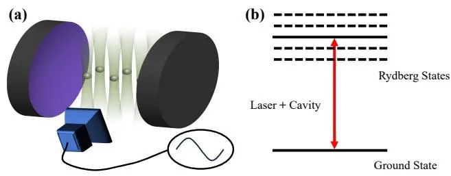

图1：(a) 所提议装置的示意图，包含一个二维里德伯原子阵列，与超高精细度光学腔耦合，并由微波电场驱动。(b) 驱动的里德伯原子的能级方案示意图。

这里，第一项是最近邻类伊辛排斥相互作用，耦合强度为 $\bar{V}$，其中 $\begin{array} {r} {n_{j} = \frac{1} {2} ( \sigma_{j}^{z} + 1 )} \end{array}$ 是里德伯占据算符。我们使用符号 $\sigma_{j}^{\gamma}$，其中 $\gamma ~ \in ~ \{x , y , z \}$，来表示与不同格点 $j ~ = ~ 1 , 2 \dots N$ 相关的泡利矩阵。于是，算符 $\sigma_{j}^{\pm} = \sigma_{j}^{x} \pm i \sigma_{j}^{y}$ 可以描述原子基态和里德伯态之间的跃迁。在整篇文章中，我们将考虑一个具有 $N = {L}^{2}$ 个格点和周期性边界条件的正方格子。方程 (1) 的第二项和第三项分别表示腔光子和里德伯态的化学势，由 $\mu$ 和 $\mu + \Delta$ 给出。光场由玻色子湮灭（产生）算符 $a ~ ( a^{\dagger} )$ 描述，而 $\Delta$ 是腔与里德伯原子之间的失谐，在腔-里德伯平台上很容易调节。方程 (1) 的最后两项源于光-物质相互作用。集体耦合 $g$ 正比于经典驱动的强度和与腔模的裸耦合强度，而 α 控制各向异性程度。这个 NAP α 决定了旋转波项（湮灭一个腔光子并激发一个原子，反之亦然）和反旋转波项（同时激发或湮灭腔和一个原子）之间的相对强度。实验上，周期性的微波驱动可以在 $\alpha \in [ 0 , 1 ]$ 范围内实现连续可调的 NAP。

现在，我们将玻色子算符视为经典光场，进行平均场近似。具体来说，我们考虑形如 $\mathinner{| {\Psi} \rangle} \simeq \mathinner{| {\Phi} \rangle} \otimes \mathinner{| {\lambda} \rangle}$ 的状态，其中 |Φ⟩ 是一个一般的原子态，$| \lambda \rangle = \exp{( - \textstyle{\frac{1} {2}} | \lambda | ^{2} )} \mathrm{e}^{\lambda a^{\dagger}} | 0 \rangle$ 是玻色子光子场的相干态，且有 $| \lambda | ^{2} \propto N.$ 这种近似忽略了光场和原子态之间的关联，在 SRP 中，当腔内被大量光子占据时，预期是精确的。另一方面，原子系统内部的多体关联仍然被考虑在内。事实上，正如我们将看到的，|Φ⟩ 是一个相互作用哈密顿量的基态。遵循这种部分平均场近似，我们计算

$H_{\mathrm{M}} = \langle \lambda | H | \lambda \rangle$，得到：

$$
\begin{array} {l} {{\displaystyle{\cal H}_{\mathrm{M}} = V \sum_{\langle j , k \rangle} n_{j} n_{k} - \mu \vert \lambda \vert^{2} - ( \mu + \Delta ) \sum_{j = 1}^{N} n_{j}}} \\ {{\displaystyle ~ + \frac{g} {\sqrt{N}} \sum_{j = 1}^{N} \left[ \lambda_{R} \sigma_{j}^{x} + ( 1 - 2 \alpha ) \lambda_{I} \sigma_{j}^{y} \right] ,}} \end{array}\tag{2}
$$

其中 $\lambda_{R} = \operatorname{Re} [ \lambda ]$ 和 $\lambda_{I} = \operatorname{Im} [ \lambda ]$

为了使方程 (2) 形式更清晰，我们在 $x - y$ 平面上施加一个旋转，$\begin{array} {r} {U = \exp \left( i \frac{\theta} {2} \sum_{j = 1}^{N} \sigma_{j}^{z} \right)} \end{array}$，其中 $\begin{array} {r} {\theta = \arcsin \left( \frac{\lambda_{R}} {\sqrt{\lambda_{R}^{2} + ( 1 - 2 \alpha )^{2} \lambda_{I}^{2}}} \right)} \end{array}$。变换后的哈密顿量 $H_{\mathrm{MR}} = U^{\dagger} H_{\mathrm{M}} U$ 如下：

$$
H_{\mathrm{MR}} = V \sum_{\langle j , k \rangle} n_{j} n_{k} - ( \mu + \Delta ) \sum_{j = 1}^{N} n_{j} + h \sum_{j = 1}^{N} \sigma_{j}^{x} - \mu \lvert \lambda \rvert^{2} .\tag{3}
$$

可见，$U$ 不改变哈密顿量的对角部分，但原子-腔相互作用沿 $x$ 方向引入了一个横向场，其中 h 由下式给出：

$$
h = \frac{g} {\sqrt{N}} \sqrt{\lambda_{R}^{2} + ( 1 - 2 \alpha )^{2} \lambda_{I}^{2}} .\tag{4}
$$

由于腔场仅通过 $\begin{array} {r} {\dot{h ,}} \end{array}$ 进入哈密顿量的原子部分，因此用 $( h , \lambda_{I} )$ 而非 $( \lambda_{R} , \lambda_{I} )$ 来参数化相干态是有用的。腔内的平均光子数 $n_{\mathrm{ph}} = | \lambda | ^{2}$ 变为：

$$
n_{\mathrm{ph}} = \frac{N h^{2}} {g^{2}} + 4 \alpha ( 1 - \alpha ) \lambda_{I}^{2} ,\tag{5}
$$

利用 $\alpha ( 1 - \alpha ) \geq 0$ 和 $\mu < 0$ ，我们可以立即得出结论：对于任意给定的 h，选择 $\lambda_{I} = 0$ 能使总能量最小化。因此，$H_{M}$ 的基态可以通过等价地考虑以下哈密顿量来找到：

$$
\begin{array} {l} {{\displaystyle H_{\mathrm{IM}} = V \sum_{\langle j , k \rangle} n_{j} n_{k} - ( \mu + \Delta ) \sum_{j = 1}^{N} n_{j}}} \\ {{\displaystyle \qquad + g \sqrt \frac{n_{\mathrm{ph}}} {N} \sum_{j = 1}^{N} \sigma_{j}^{x} - \mu n_{\mathrm{ph}}} ,} \end{array}\tag{6}
$$

其显著特点在于依赖于光子数 $n_{\mathrm{ph}}$ ，而不依赖于 $\mathrm{NAP} \ \alpha$。

上述论证表明，在平均场理论内，该腔-里德伯阵列的基态与 α 无关。因此，如果光场可以经典处理，则可通过先前对各向同性迪克-伊辛哈密顿量的研究来表征该系统的特性。特别地，我们的结论与不存在 V 的各向异性迪克和拉比模型的分析结果一致 [17, 30]。在存在里德伯-里德伯相互作用的情况下，原子多体问题转化为对同时具有纵向和横向场的伊辛模型的研究，参见方程 (6)。通过进一步忽略原子关联，我们可以基于以下试探态获得一个近似描述 [43]：

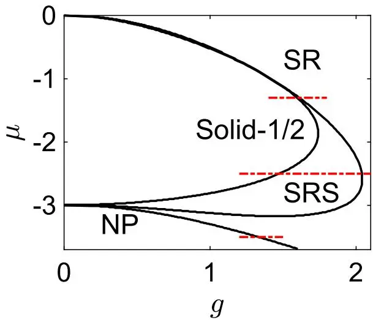

图2：AIDM 的量子相图，由方程 (7) 的变分态得到。所有相边界均独立于 $\mathrm{NAP} \ \alpha$。底部、中部和顶部（红色虚线）剖面线分别在图6、图$^{7 ( \mathrm{c} , \mathrm{d} )}$ 和图7(a,b)中分析。其他参数为 $\Delta = 3$ 和 $V = 1$

$$
\begin{array} {r} {| \Psi ( \lambda , \theta_{A} , \theta_{B} ) \rangle = \bigotimes_{i \in A} \left( \cos \frac{\theta_{A}} {2} | \uparrow_{i} \rangle + \sin \frac{\theta_{A}} {2} | \downarrow_{i} \rangle \right)} \\ {\bigotimes_{j \in B} \left( \cos \frac{\theta_{B}} {2} | \uparrow_{j} \rangle + \sin \frac{\theta_{B}} {2} | \downarrow_{j} \rangle \right) \otimes | \lambda \rangle ,} \end{array}\tag{7}
$$

其中，方形晶格被划分为两个子晶格 A 和 B，以捕捉反铁磁相互作用的影响。通过变分参数 λ 和 $\theta_{A , B}$ 极小化能量得到的相图的一个例子如图 2 所示。超辐射相（SR 和 SRS）的特征是 $\lambda \neq 0$ ，而打破平移对称性的相（Solid-1/2 和 SRS）则具有 $\theta_{A} \neq \theta_{B}$。

在平均场理论之外，原子之间可以通过腔产生二阶的全对全自旋交换相互作用。此外，由 $\operatorname{NAP} \alpha$ 控制的 CRW 项增强了量子涨落。鉴于这些效应可能产生显著影响——特别是在平均场理论可能失效的有限尺寸系统中——我们开发了一种基于 SSE 方法的量子蒙特卡洛算法，从而能够精确研究该模型的基态。

### III. 量子蒙特卡洛方法

在介绍更新非对角算符的新公式之前，我们首先回顾 SSE 算法在光子-原子耦合系统中的实现。该算法的核心思想是将配分函数展开为级数，然后使用马尔可夫链蒙特卡洛采样对量子系统进行数值研究。在没有符号问题的情况下，有向环 SSE 算法的计算复杂度与系统尺寸和逆温度成正比。在高维系统中，由于玻色子场与原子存在非局域耦合，SSE 算法比基态方法（如基于矩阵乘积态的方法，其需要高键维数）具有更高的计算效率。然而，非线性 CRW 项违反了局域粒子数守恒，使得无法实现传统的有向环算法。

因此，先前 SSE 算法的实现基于在对玻色子场进行积分后，通过路径积分（在相干态表示中）进行虫洞更新。这种方法避免了光子采样的需要，提高了算法效率。相反，类似于自旋 XYZ 模型的 SSE 方法 [53]，我们在此开发了一种有向环算法，该算法也能更新不守恒总密度的 CRW 算符。正如我们将要讨论的，对玻色子场的直接采样可以提供额外的、物理相关的信息，这些信息关乎模型产生的各种相的性质。

与传统的 SSE 方法一样，我们首先将配分函数展开为级数：

$$
Z = \sum_{| \Psi \rangle} \sum_{k = 0}^{\infty} {\frac{( - \beta )^{k}} {k !}} \langle \Psi | \prod_{p = 1}^{k} H_{a_{p} , b_{p}} | \Psi \rangle ,\tag{8}
$$

其中 $\begin{array} {r} {\beta = \frac{1} {k_{B} T}} \end{array}$ 是逆温度。我们使用福克基来评估配分函数，而不是依赖腔模态的相干态表示。因此，选取的基态集合（等价于位形）为 $\left| \Psi \right. = \left( \bigotimes_{j = 1}^{N} \left| \sigma_{j} \right. \right) \otimes \left| m \right.$ ，其中 $| \sigma_{j} \rangle = | \uparrow_{j} \rangle , | \downarrow_{j} \rangle$ 是 $\boldsymbol{\sigma}_{j}^{z}$ 的本征态。我们将哈密顿量式 (1) 分解为局域算符 $H_{a_{p} , b_{p}} ,$ ，这些算符作用于位形而不产生叠加态。这里，p 表示虚时位置，a 表示算符类型（对角和非对角算符，分别标记为 $d_{\gamma} , r w_{\gamma}^{\pm} , c w_{\gamma}^{\pm} )$ ，$b \in \{1 , 2 , . . . , N \}$ 表示算符在实空间中的作用位置。注意，可以根据团簇的几何结构选择不同的分解类型。这里，我们选择一条直线上三个最近邻的里德堡位点加上光子位点作为一个整体团簇，因此位点 j 上的对角算符显式写为：

$$
\begin{array} {c} {{H_{d_{\gamma} , j} = C_{1} V \left( n_{j} n_{k} + n_{j} n_{l} \right) - C_{2} \mu a^{\dagger} a}} \\ {{- C_{3} ( \mu + \Delta ) ( n_{j} + n_{k} + n_{l} )}} \end{array}\tag{9}
$$

其中 $k$ 和 $l$ 标记方向 $\gamma$ 上的两个最近邻位置。对于正方形格子，$\gamma = 1$ 和 $\gamma = 2$ 分别对应水平方向和垂直方向。$C_{1} , C_{2} , C_{3}$ 是为避免重复计数的修正因子，其取值并非唯一。此处，我们简单选取 $C_{1} ~ = ~ 1 / 2$、$C_{2} ~ = ~ 1 / ( 2 N )$ 和 $C_{3} ~ = ~ 1 / 6$，其中 $N$ 是正方形格子中的原子数。另一方面，相应的非对角算符为：

$$
\begin{array} {l} {{H_{r w_{\gamma}^{+} , j} = ( 1 - \alpha ) C_{4} \frac{g} {\sqrt{N}} \sigma_{j}^{+} a ,}} \\ {{H_{r w_{\gamma}^{-} , j} = ( 1 - \alpha ) C_{4} \frac{g} {\sqrt{N}} a^{\dagger} \sigma_{j}^{-} ,}} \\ {{H_{c w_{\gamma}^{+} , j} = \alpha C_{4} \frac{g} {\sqrt{N}} a^{\dagger} \sigma_{j}^{+} ,}} \\ {{H_{c w_{\gamma}^{-} , j} = \alpha C_{4} \frac{g} {\sqrt{N}} \sigma_{j}^{-} a .}} \end{array}\tag{10}
$$

注意这些算符实际上并不依赖于 $\gamma = 1 , 2$ 的取值，这一点由重复计数因子 $C_{4} = 1 / 2$ 来补偿。从式(10)我们也可以看到，算符 $H_{c w_{\gamma}^{\pm} , j}$ 不守恒激发粒子数，这导致常规的有向环更新在此系统中失效。因此，虽然对角更新和物理量的测量遵循文献[50]中已有的SSE算法，但必须为这些特殊算符开发一种新型的有向环更新。

作为示例，我们在图3中展示了与 $H_{c w_{\gamma}^{+} , j}$ 相关联的顶点更新规则，假设虫头从左下腿进入该顶点，并且增加一个腔模状态。与常规SSE方法不同，这里虫头退出处的腿上的状态既可以升高也可以降低一个单位。图3(b)(d)和图3(e)(f)分别展示了 $H_{r w_{\gamma}^{+} , j}$ 更新为 $H_{r w_{\gamma}^{+} , j}$ 和 $H_{d_{\gamma} , j}$ 的情形。图3(c)更新了腔模状态，但算符保持不变。在其他情况下，例如当虫头到达 $H_{r w_{\gamma}^{-} , j}$ 或从所有顶点的原子侧进入时，更新过程遵循类似的方案。

从以上讨论，并包括顶点保持不变（一种特殊的反弹）的情况，我们看到对于某些给定顶点，最多有六种不同的更新类型。为了满足细致平衡，这些算符更新方案的接受概率必须被确定。因此，我们将文献[51]引入的优化传输矩阵扩展到任意大维度；详见附录A。同时，与我们先前的算法[43]类似，在我们的SSE算法中没有与光子场相关的截断误差。

我们已将该SSE算法与零温精确对角化（ED）进行了基准测试。逆温度设置为 $\beta = 20 \bar{0}$，远小于其他能量尺度。通过SSE计算了每个位置的能量和激发粒子数（由 $\begin{array} {r} {N_{e} = \langle a^{\dagger} a + \sum_{j = 1}^{N} n_{j} \rangle} \end{array}$ 给出），并与 $N = 16 ~ \mathrm{个位置}$ 的正方形格子上的ED结果进行了比较。如图4所示，两组结果高度一致，从而验证了SSE方法。我们期望，稳健的大规模SSE模拟的发展将使我们能够对基于Rydberg阵列平台的未来腔QED实验进行基准测试。此外，该算法也适用于电路QED系统。在本文的其余部分，我们将重点研究正方形格子中该模型的SRPT（与 $Z_{2}$ 对称性的自发破缺相关）及其他有趣性质。

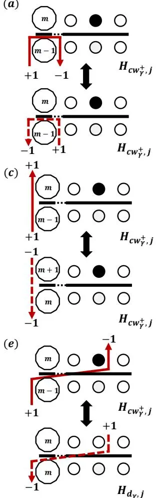

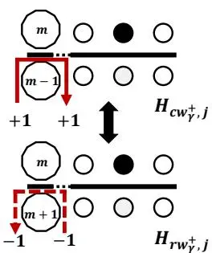

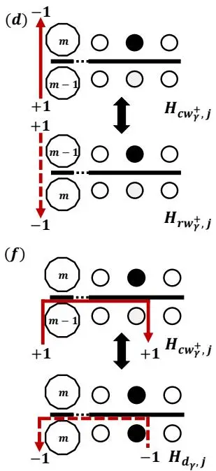

图3：虫头（红色实线箭头）从左下方腿（腔模态）进入 $H_{c w_{\gamma}^{+} , j}$ 型顶点的可能路径。大多边形中的数字表示腔的Fock态，黑（白）圆点表示处于里德伯（基）态的原子，箭头头部和尾部的数字(±1)分别对应腔模态（增加、减少）一个光子或原子（上翻、下翻）。虫头反弹：(a) 顶点不变；(b) 腔模态增加两个光子并更新为 $H_{r w_{\gamma}^{+} , j}$ 。直行伴随腔模态变化：(c) 算符不变；(d) 更新为 $H_{c w_{\gamma}^{+} , j}$ 。(e) 穿过和 (f) 折返并更新为 $H_{d_{\gamma} , j}$ 。对应的逆过程由红色虚线箭头表示。

### IV. 无里德伯相互作用的数值结果

里德伯原子间的伊辛相互作用属于范德瓦尔斯类型，因此它随距离的六次方衰减，当原子间距足够大时可以忽略。在此极限下，方程(1)退化为ADM。光子数 $n_{\mathrm{ph}} ~ = ~ \langle a^{\dagger} a \rangle$ 可作为ADM量子相变的序参量：在超辐射相中，光子和原子激发形成极化激元，导致腔模具有有限占据数 $n_{\mathrm{ph}}$ 。从对称性角度来看，我们注意到ADM在变换 $( a , a^{\dagger} ) \rightarrow ( - a , - a^{\dagger} )$ 、 $( \sigma_{j}^{-} , \sigma_{j}^{+} ) \rightarrow ( - \sigma_{j}^{-} , - \sigma_{j}^{+} )$ 和 $\sigma_{j}^{z} \rightarrow \sigma_{j}^{z}$ 下保持不变，这通常称为 $Z_{2}$ 对称性。对应的守恒量称为宇称，定义为 $\begin{array} {r} {P = ( - 1 )^{a^{\dagger} a} \prod_{i = 1}^{N} \sigma_{i}^{z}} \end{array}$ 。由于对易关系 $[ P , H ] = 0$ ，算符 $P$ 和系统哈密顿量拥有一组完整的共同本征态。每个本征态可通过其偶宇称或奇宇称标记，分别对应 $P$ 的本征值+1或-1。正常相的基态具有偶宇称 $P = + 1$ ，而超辐射相的基态在热力学极限下变得简并，我们可以构造混合不同宇称的叠加态，从而给出 $\langle P \rangle = 0$ 。因此，宇称为区分正常相和超辐射相提供了明确判据[11]。此外，当 $\alpha = 0$ 时， $Z_{2}$ 不变性提升为U(1)对称性。更具体地说，系统在变换 $( a , a^{\dag} ) \rightarrow ( a e^{- i \theta} , a^{\dag} e^{i \theta} )$ 、 $( \sigma_{i}^{-} , \sigma_{j}^{+} ) \rightarrow ( \sigma_{i}^{-} e^{- i \theta} , \sigma_{j}^{+} e^{i \theta} )$ 和 $\sigma_{i}^{z} \rightarrow \sigma_{i}^{z}$ 下保持不变。因此，总激子数 $N_{e}$ 是与U(1)对称性相关的守恒量。

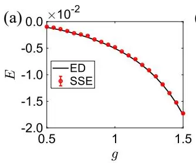

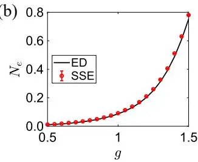

图4：采用SSE和ED方法对(a)每个格点能量和(b)激发粒子数的比较。系统参数选取为 $\mu = - 3.4$ 、 $\Delta = 3$ 、 $\alpha = 0.5$ 和 $V = 1$ 。同时，在ED中光子数截断至 $n_{\mathrm{p}} = 8$ 。

由于希尔伯特空间随系统尺寸指数增长，对于小至 $N \approx 30$ 的系统，ED 的计算成本已变得过高。因此，为提取 SR 相变的临界行为，我们采用 SSE 模拟。在量子临界点附近，关联长度发散为 $\xi \sim | t | ^{- \nu}$ ，其中约化耦合强度定义为 $\begin{array} {r} {t {} = \frac{\dot{g} - g_{c}} {g_{c}}} \end{array}$ ，而光子数是一个奇异但不发散的序参量，满足依赖关系 $n_{\mathrm{ph}} \sim | t | ^{- \eta}$ 。在获得不同系统尺寸下所需的物理量后，我们通过考虑 $y_{N} = n_{\mathrm{ph}} N^{- \frac{\eta} {\nu}}$ 对 $x_{N} = t N^{\frac{1} {\nu}}$ 的依赖关系进行数值数据的有限尺度标度分析，该关系遵循一个明确的标度律。由于关联长度的临界指数是普适的（其他分析及数值结果已证实[54-56]），我们设定 $\nu = 3 / 2$ ，并通过 Houdayer 和 Hartmann 提出的方法（即最小化由参考文献[57]中方程(A1)定义的损失函数 S）确定 $g_{c}$ 和 η。如图5(a)和图5(b)所示（分别对应 $\alpha = 0$ 和 0.5），我们通常能得到极好的数据坍塌。

表 I 报告了不同 α 值下临界耦合 $g_{c}$ 和临界指数 η 的估算值及其对应误差。我们发现，尽管在临界点附近有限尺寸光子行为存在明显差异，但临界指数在热力学极限下收敛于几乎相同的值，与 $\eta = 1 / 2$ 相容。因此，我们得出结论：在临界区域，光子数遵循共同的标度律。表 I 还显示，临界耦合 $g_{c}$ 在误差范围内与 α 无关，且等于解析解 $g_{c} = \sqrt{\mu ( \mu + \Delta )} \approx 1.323 [ 11 ]$ 。这些结果有力地支持了以下解析结论：SR 相变的临界点和标度行为与 NAP 无关[58]。

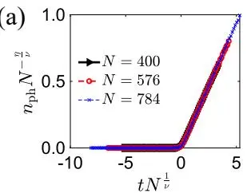

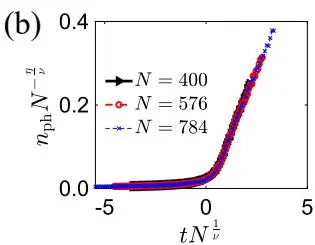

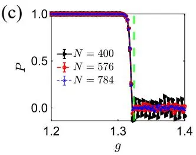

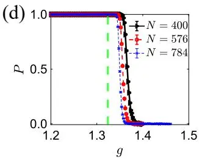

图5：不同物理量在相变点附近对耦合强度 g 的依赖关系。(a,b) 为 $n_{\mathrm{ph}}$ 的有限尺度标度分析，(c,d) 呈现宇称作为 g 的函数。此处，绿色垂直虚线表示通过有限尺度标度获得的临界点，参见表 I。参数为 $\mu = - 3.5$ 和 $\Delta = 3$ ，系统尺寸分别为 $N = 400$（黑色三角形）、576（红色圆形）和 784（蓝色叉号），对应 $(\mathrm{a}, \mathrm{c}) \alpha = 0$ 和 $(\mathrm{b}, \mathrm{d}) \alpha = 0.5$ 。

表 I. 不同 $\alpha$ 值下 SRPT 临界点 $g_{c}$ 和光子临界指数 η，参数为 $\mu = - 3.5$ 和 $\Delta = 3$
| α | 0 | 0.1 | 0.5 | 0.9 | 1.0 |
|---|---|---|---|---|---|
| $\eta$ | 0.507 | 0.521 | 0.522 | 0.494 | $\overline{{0.464}}$ |
| 误差 (η) | ±0.091 | ±0.061 |  | $\pm 0.051 \pm 0.044 \pm 0.088$ |  |
| $g_{c}$  误差 | 1.322 | 1.323 | 1.323  $( g_{c} ) \pm 0.001 \pm 0.003 \pm 0.003 \pm 0.002 \pm 0.003$ | 1.323 | 1.322 |

另一方面，RW项与CRW项之间的相互作用导致了强烈依赖于α的有限尺寸效应。这一点在基态宇称的行为中表现得最为明显，图5中(c)和(d)展示了不同代表性情形下的结果。在图5(c)中，α = 0时，所有系统尺寸的宇称几乎同时在临界点处消失。在α = 1时也能观察到类似行为。在这两种情况下，量子相变破坏了U(1)对称性，并且在SR相中N_e获得有限值。正如附录B中展示的ED结果所证实，特别是图8(a)，增加g会导致基态N_e值逐步增长，每个整数对应特定的宇称。这一行为也被我们在低温（但非零温）下进行的SSE模拟所捕捉。当N值较小时，基态与第一激发态之间的能隙足够大，使得有限尺寸基态的贡献占主导。因此，图5(c)中的数值数据显示，在N = 400的SR相中存在强烈的振荡。当系统尺寸更大时，低能态近似简并，这些振荡最终消失。然而，由于腔内空间的限制，在实际实验中预计能观察到此类振荡。

有趣的是，在NAP的中间值发现了不同的宇称行为。我们在图5(d)中考虑了α = 0.5的情况，此时没有观察到振荡，且使基态宇称消失所需的耦合强度明显大于临界值g_c。然而，我们可以清晰地发现，随着系统尺寸增大，宇称的有限尺寸转变点正趋近于g_c。在解析处理中[11]，两能级原子系综可被视为长度为J = N/2的赝自旋。随后，通过Holstein-Primakoff变换，哈密顿量可转化为一个有效的双模玻色子哈密顿量，该哈密顿量在热力学极限下可精确求解。但在有限系统中，由Holstein-Primakoff变换导致的非线性项∼O(1/N)不能忽略。考虑到宇称对N_e的变化非常敏感，如图5所示，它受到比光子密度更严重的有限尺寸效应影响。因此，不同NAP下宇称的不同行为展示了超越平均场水平的独特特征，当加入Ising相互作用时，这些特征将被强烈增强。

### V. 包含里德伯相互作用的数值结果

基于里德伯原子的实验平台主要受高激发里德伯态的大电偶极矩所诱导的强且可控的相互作用所支配。通过将其表示为里德伯态的占据数，该相互作用被描述为一种有效的Ising相互作用。由于相应的排斥相互作用属于范德瓦尔斯类型，我们在此仅考虑最近邻相互作用。与ADM不同，作为一个强关联系统，哈密顿量方程1无法精确求解，因此数值模拟成为必要。为了探测正方晶格上的自发平移对称性破缺，我们可以利用静态结构因子S(q)/N = ⟨|∑_{i=1}^{N} n_j e^{i q·r_j}|^2⟩/N^2作为序参量。波矢q设置为(π, π)，这对于反铁磁相互作用V > 0是合适的。事实上，S(π, π)/N相当于交错磁化强度，在Solid-1/2相和SRS相中都趋于有限值。相应的Binder累积量定义为S_b = 3/2 (1 - 1/3 ⟨S^2(q)⟩/⟨S(q)⟩^2)。根据图2中的平均场相图，我们接下来分析NAP α 对NP、SR、SRS和solid-1/2相之间量子相变的影响。

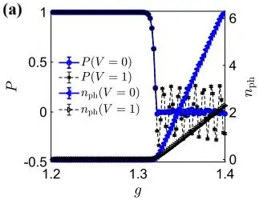

(b)
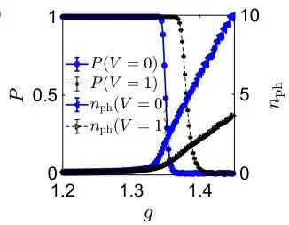
(c)
图6：Rydberg-Rydberg相互作用对SR相变过程中宇称和光子数的影响，分别对应(a) $\alpha = 0$ 和(b) $\alpha = 0.5$。其他参数为 $\mu =$ $- 3.3$，$\Delta = 3$，$N = 784$

首先，我们研究在方格上存在Ising项时从NP相到SR相的转变。图6中的大规模SSE结果表明，在热力学极限下，Ising相互作用并不改变这一相变的边界。然而，Rydberg相互作用的存在可以显著改变可观测量的行为。在SR相中，可以清晰观察到在不同NAP下$n_{\mathrm{ph}}$的显著降低，这表明由于强烈的Rydberg排斥相互作用，极化激元的激发变得更加困难。另一方面，宇称显得更加敏感。在图6(a)中的$U(1)$对称点$\alpha = 0$处，Rydberg相互作用强烈增强了振荡，这意味着偶宇称与奇宇称能级之间的相应间隙能量被扩大。当在$\alpha = 0.5$处开启CRW项时，图6(b)显示，Rydberg相互作用将$P$的消失推向了更大的g，这表明随着V的增加，有限尺寸修正的前置因子被增强。

RW、CRW和Ising项的相互作用产生了包含固体相的丰富相图。我们通过图7中的SSE模拟对它们进行了探索，发现从Solid-1/2相到SR相的相变（发生在$\mu$值较小时）表现出显著的鲁棒性。图7(a)表明，临界点（蓝色实心点）同样独立于$\alpha \in [0, 1]$。从Solid-1/2到SR相的相变在恢复平移对称性的同时打破了$Z_{2}$对称性，在任意$\alpha$值下均保持为一阶相变。这一点在图7(b)中得以证实，其中$\alpha = 0.5$。在临界点处，序参量$S(q)$的不连续消失伴随着$n_{\mathrm{ph}}$的跳跃，后者在SR相中获得有限值。

在我们先前的工作[43, 44, 46]中，最引人注目的现象是作为SR相和solid-1/2相之间中间相的SRS相。不同的是，当包含CRW相互作用时，SRS相自发地同时破坏了平移对称性和$Z_{2}$对称性。从Solid-1/2到SRS，最终到SR相的量子相图作为α的函数显示在图7(c)的插图中。对于所有$\alpha$值，前一个转变是二阶的，而后一个是一阶的。精确的相变点通过在不同系统尺寸下得到的宇称$P$和Binder累积量$S_b$的塌缩来确定。例如，图7(d)显示了在$\alpha = 0.5$处的这些量。与固体序消失时solid-1/2相和SR相之间的相变相同，SRS相和SR相也经历一阶相变，同时，SRS相和SR相之间的相边界也不受α影响。然而，Solid-1/2相和SRS相之间的临界耦合随α呈微小的线性移动，如图7(c)所示。预期的Solid-1/2相的熔化源于插入一个额外准粒子导致的能隙闭合。然而，RW和CRW相互作用的效果分别是将光子与一个空穴| ↓⟩或一个粒子| ↑⟩耦合。考虑到粒子-空穴或自旋向上-向下对称性被人为破坏，RW项和CRW项之间的相互作用可以强烈改变SRS相和Solid-1/2相之间的临界线。

(b)
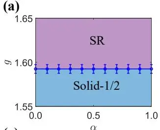

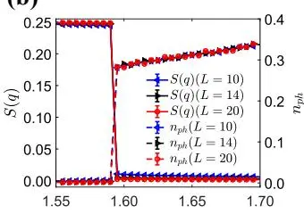
(d)

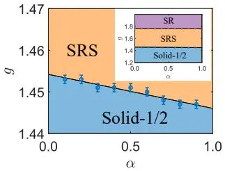

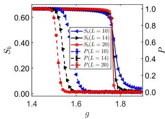

图7：(a) 在 $\mu = -1.4$ 时 Solid-1/2 相与 SR 相之间的一级相变线。(b) 不同系统尺寸下，$\alpha = 0.5$ 时 $S(q)$ 和 $n_{\mathrm{ph}}$ 关于 g 的函数关系。(c) 在 $\mu = -2.5$ 时 Solid-1/2 相与 SRS 相之间的二级相变线，插图中显示了与 SRS 相相关的临界线。(d) 不同系统尺寸和 $\alpha = 0.5$ 下，Binder 累积量 $S_{b}$ 和宇称 $P$ 作为 g 的函数图。所有数据均在 $\Delta = 3$ 和 $V = 1$ 条件下获得。

### VI. 结论与展望

总之，我们使用专门为此模型设计的团簇 SSE 算法，对 ADIM 进行了数值研究。我们的主要发现如下：首先，我们验证了 ADM 的 SR 临界点处光子数的标度律，并观察到在进入 SR 相时有限尺寸系统中宇称的消失。其次，对于完整的 ADIM，我们证明了 Rydberg-Rydberg 相互作用抑制了 SR 相的序参量，并且 CRW 项的量子涨落移动了 SRS 相与 Solid-1/2 相之间的二级相边界。最后，我们确认了在正方晶格中，对于任意 NAP 值，从 Solid-1/2 相或 SRS 相到 SR 相的转变均为一级的。

我们的工作为几个未来的研究方向铺平了道路。不同晶格几何中，各向异性耦合与几何阻挫之间的相互作用是发现量子物质新相的一个有前景的途径。此外，我们改进的 SSE 算法可广泛应用于更广泛的光物质系统，其中 CRW 项起着关键作用。根据最近一项利用 Rydberg 原子阵列实现 ADIM 的提议 [49]，我们预期在腔-Rydberg 平台上对我们的预测进行直接检验。同时，相应的现象也可能在电路 QED 平台上进行验证。

### 致谢

X.-F. Z. 感谢国家自然科学基金（项目号：12274046、11874094、12147102、12347101）、重庆市自然科学基金（项目号：CSTB2022NSCQ-JQX0018）、中央高校基本科研业务费（项目号：2021CDJZYJH-003）以及小米基金会/小米青年学者计划的资助。S.C. 感谢量子科学与技术创新计划（项目号：2021ZD0301602）和国家科学协会基金（项目号：U2230402）的支持。

### 附录 A：重新设计的环更新

为了提高算法效率，必须最小化顶点未被更新的接受概率（这里，回弹过程也可以更新顶点）。因此，我们讨论可能转移的顶点数 $m > 4$ 的一般情况，并定义 $P ( s s^{\prime} ) =$ $a_{s , s^{\prime}} / W_{s}$ ，其中 $P$ 是顶点 s 转移到顶点 $s^{\prime}$ 的概率，$W_{s}$ 表示顶点 s 的权重，且 $W_{1} \ge W_{2} \ge \dots \ge W_{m}$，$\delta = - W_{1} + \bar{W}_{2} + W_{3} + W_{4}$ 。那么，细致平衡条件重新表示为 $a_{s , s^{\prime}} = a_{s^{\prime} , s}$ 和 $\textstyle \sum_{s^{\prime}} a_{s , s^{\prime}} = W_{s}$。按照文献 [51]，对于条件 $W_{1} \ge W_{2} + W_{3} + . . . + W_{m}$，一个最优解非常简单：

$$
\begin{array} {l} {{a_{1 , 1} = W_{1} - \displaystyle \sum_{k = 2}^{m} W_{k}}} \\ {{\vphantom{a_{1 , 2} = W_{2}}}} \\ {{\cdots}} \\ {{a_{1 , m} = W_{m}}} \end{array}\tag{A1}
$$

然后如果 $\begin{array} {r} {W_{1} \ < \ \sum_{i > 1}^{m} W_{i}} \end{array}$ 但 $\delta > 0$，一个可能的对角项 $a_{i , i}$ 为零的最优解是

$$
\begin{array} {r l} & {a_{1 , 2} = \left( W_{1} + W_{2} - W_{3} - W_{4} \right) / 2} \\ & {a_{1 , 3} = \left( W_{1} - W_{2} + W_{3} - W_{4} \right) / 2} \\ & {a_{2 , 3} = \left( - W_{1} + W_{2} + W_{3} + W_{4} \right) / 2} \\ & {a_{1 , 4} = W_{4} - W_{5} / 2} \\ & {a_{1 , 5} = W_{5} - W_{6} / 2} \\ & {\cdots} \\ & {a_{1 , m - 1} = \left( W_{m - 1} - W_{m} \right) / 2} \\ & {a_{1 , m} = W_{m} / 2} \\ & {a_{1 , 5} = W_{5} / 2} \\ & {a_{5 , 6} = W_{6} / 2} \\ & {a_{m - 1 , m} = W_{m} / 2} \end{array}\tag{A2}
$$

在参考文献[51]的基础上，我们进一步证明，当 $\delta < 0$ 时，同样可以获得一个具有零对角项的最优解。由于 $W_{1} < W_{2} + W_{3} + \ldots + W_{m}$，总存在一个数 $k$ 满足 $\begin{array} {r} {\sum_{l = k + 1}^{m} W_{l} < - \delta < \sum_{l = k}^{m} \dot{W_{l}}} \end{array}$。于是，对于 $l > k$，我们选取 $a_{1 , l} = a_{l , 1} = W_{l}$，并将其他元素设为零。在引入 $\begin{array} {r} {\delta^{\prime} = - \delta - \sum_{l = k + 1}^{m}} \end{array} W$ 和 $a_{1 , k}^{\prime} = a_{1 , k} - \delta^{\prime}$ 之后，我们得到一组条件数更少（$k \leq m$）的新细致平衡方程

$$
\begin{array} {r l} & {\displaystyle \sum_{k = 1}^{k - 1} a_{1 , j} + a_{1 , k}^{\dag} = W_{1} + \delta = W_{1}^{\prime}} \\ & {\displaystyle \sum_{k = 1}^{k} a_{2 , i} = W_{2}} \\ & {\displaystyle \sum_{k = 1}^{k} a_{2 , i} = W_{2}} \\ & {\displaystyle \sum_{k = 1}^{k} a_{3 , j} = W_{3}} \\ & {\displaystyle \sum_{k = 1}^{k} a_{4 , i} = W_{k - 1 , i}} \\ & {\displaystyle \sum_{k = 1}^{k} a_{k - 1 , i} = W_{k - 1}} \\ & {\displaystyle a_{1 , k}^{\prime} + \sum_{k = 2}^{k} a_{k , i} = W_{k} - \delta^{\prime} = W_{k}^{\prime} > 0} \end{array}\tag{A3}
$$

由于 $W_{1}^{\prime} - W_{2} - W_{3} - W_{4} = 0$，第二部分方程(A2)的通解也适用于求解方程(A3)。我们强调最终转移概率 $P ( s s^{\prime} ) = \overline{{{a}}}_{s , s^{\prime}} / W_{s} ,$ 以及 $a_{1 , k} = a_{1 , k}^{\prime} + \delta$ 。除了提到的 $\boldsymbol{a}_{s , s^{\prime}}$ 及其共轭项外，所有其他项均为零。因此，一个完整的有向环路涉及：随机选择一个顶点的腿，记录对该腿的操作（对玻色子加或减一个粒子，对原子翻转上下），然后根据上述解进行更新。此过程持续进行，直到虫头以与起始操作相反的操作返回初始腿。

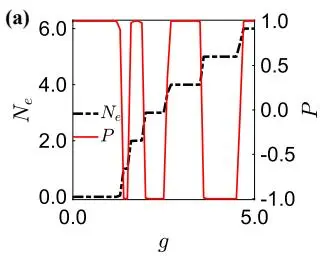

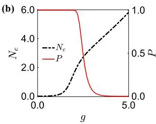

图8：ADM结果通过ED获得：在1D链 $N = L = 6 , \Delta = 3 , \mu = - 3.5$ 且光子截断数 $n_{\mathrm{p}} = 10$ 条件下，从NP到SRP的基态激发粒子数（黑色虚线）和宇称（红色实线），其中(a) $\alpha = 0$ 和(b) $\alpha = 0.5$ 。

### 附录B：精确对角化结果

在QRM或少体ADM中，CRW与RW之间的相互作用引出了一系列引人入胜的现象，这在比较采用RWA之前和之后的情况时尤为明显。我们还通过小系统尺寸的零温ED研究了基态性质。在图8中，我们比较了固定所有其他参数时 $\alpha = 0 , 0.5$ 情况下的 $P$ 和 $N_{e}$。对于 $\alpha = 0$，每个 $N_{e}$ 平台对应一个特定的宇称，导致基态中的宇称振荡，见图8(a)。然而，对于 $\alpha = 0.5$，$N_{e}$ 随 $g$ 平滑增加。在SR区域，由于偶宇称和奇宇称之间的基态简并，发生了宇称破缺，如图8(b)所示。最后，我们注意到随着系统尺寸增大，原子-场耦合强度增强了 $\sqrt{N}$ 倍，这使得图8(a)中的行为趋近于图8(b)所示的情况。

[1] A. F. Kockum, A. Miranowicz, S. De Liberato, S. Savasta, and F. Nori, NATURE REVIEWS PHYSICS 1, 19 (2019).

[2] I. I. Rabi, Phys. Rev. 49, 324 (1936).

[3] I. I. Rabi, Phys. Rev. 51, 652 (1937).

[4] H. Zhong, Q. Xie, M. T. Batchelor, and C. Lee, Journal of Physics A: Mathematical and Theoretical 46, 415302 (2013).

[5] Q. Xie, H. Zhong, M. T. Batchelor, and C. Lee, Journal of Physics A: Mathematical and Theoretical 50, 113001 (2017).

[6] R. H. Dicke, Phys. Rev. 93, 99 (1954).

[7] E. Nahmad-Achar, O. Castanos, R. L˜ opez-Pe´ na, and J. G.˜ Hirsch, Physica Scripta 87, 038114 (2013).

[8] P. Das, S. Wuster, and A. Sharma, PHYSICAL REVIEW A 109 (2024), 10.1103/PhysRevA.109.013715.

[9] L. J. Zou, D. Marcos, S. Diehl, S. Putz, J. Schmiedmayer, J. Majer, and P. Rabl, Phys. Rev. Lett. 113, 023603 (2014).

[10] P. Kongkhambut, H. Keßler, J. Skulte, L. Mathey, J. G. Cosme, and A. Hemmerich, Phys. Rev. Lett. 127, 253601 (2021).

[11] C. Emary and T. Brandes, Phys. Rev. E 67, 066203 (2003)

[12] Q.-T. Xie, S. Cui, J.-P. Cao, L. Amico, and H. Fan, Phys. Rev. X 4, 021046 (2014).

[13] M.-J. Hwang and M. B. Plenio, Phys. Rev. Lett. 117, 123602 (2016).

[14] M.-J. Hwang, R. Puebla, and M. B. Plenio, Phys. Rev. Lett. 115, 180404 (2015).

[15] K. Baumann, R. Mottl, F. Brennecke, and T. Esslinger, Phys. Rev. Lett. 107, 140402 (2011).

[16] K. Baumann, C. Guerlin, F. Brennecke, and T. Esslinger, NA-TURE 464, 1301 (2010).

[17] M. Liu, S. Chesi, Z.-J. Ying, X. Chen, H.-G. Luo, and H.-Q. Lin, Phys. Rev. Lett. 119, 220601 (2017).

[18] P. Das, D. S. Bhakuni, L. F. Santos, and A. Sharma, Phys. Rev. A 108, 063716 (2023).

[19] E. Jaynes and F. Cummings, Proceedings of the IEEE 51, 89 (1963).

[20] Y. Yi-Xiang, J. Ye, and W.-M. Liu, SCIENTIFIC REPORTS 3 (2013), 10.1038/srep03476.

[21] P. Meystre, “The jaynes–cummings model,” in Quantum Optics: Taming the Quantum (Springer International Publishing, Cham, 2021) pp. 75–95.

[22] P. Das, D. S. Bhakuni, L. F. Santos, and A. Sharma, Phys. Rev. A 108, 063716 (2023).

[23] M. Kloc, P. Stransk´ y, and P. Cejnar,´ Annals of Physics 382, 85 (2017).

[24] I. Aedo and L. Lamata, Phys. Rev. A 97, 042317 (2018).

[25] D. S. Shapiro, W. V. Pogosov, and Y. E. Lozovik, Phys. Rev. A 102, 023703 (2020).

[26] W. Buijsman, V. Gritsev, and R. Sprik, Phys. Rev. Lett. 118, 080601 (2017).

[27] J. Hu and S. Wan, Communications in Theoretical Physics 73, 125703 (2021).

[28] P. Das, D. S. Bhakuni, and A. Sharma, Phys. Rev. A 107, 043706 (2023).

[29] A. Keesling, A. Omran, H. Levine, H. Bernien, H. Pichler, S. Choi, R. Samajdar, S. Schwartz, P. Silvi, S. Sachdev, P. Zoller, M. Endres, M. Greiner, V. Vuletic, and M. D. Lukin, NATURE 568, 207+ (2019).

[30] P. Nataf and C. Ciuti, NATURE COMMUNICATIONS 1 (2010), 10.1038/ncomms1069.

[31] C. Guerlin, E. Brion, T. Esslinger, and K. Mølmer, Phys. Rev. A 82, 053832 (2010).

[32] F. Mivehvar, F. Piazza, T. Donner, and H. Ritsch, Advances in Physics 70, 1 (2021), <https://doi.org/10.1080/00018732.2021.1969727>.

[33] Z. Yan, J. Ho, Y.-H. Lu, S. J. Masson, A. Asenjo-Garcia, and D. M. Stamper-Kurn, Phys. Rev. Lett. 131, 253603 (2023).

[34] Y. Liu, Z. Wang, P. Yang, Q. Wang, Q. Fan, S. Guan, G. Li, P. Zhang, and T. Zhang, Phys. Rev. Lett. 130, 173601 (2023).

[35] X. Zhang, Z. Yu, H. Zhang, D. Xiang, and H. Zhang, Phys. Rev. Res. 6, L042026 (2024).

[36] M. L. Peters, G. Wang, D. C. Spierings, N. Drucker, B. Hu, M.-W. Chen, Y.-T. Chen, and V. Vuletic,´ Phys. Rev. Lett. 135, 093402 (2025).

[37] J. Rohn, M. Hormann, C. Genes, and K. P. Schmidt,¨ Phys. Rev. Res. 2, 023131 (2020).

[38] E. Cortese, L. Garziano, and S. De Liberato, Phys. Rev. A 96, 053861 (2017).

[39] J. Gelhausen, M. Buchhold, A. Rosch, and P. Strack, SciPost Phys. 1, 004 (2016).

[40] P. Nevado and D. Porras, Phys. Rev. A 92, 013624 (2015).

[41] T. O. Puel and T. Macr\`ı, Phys. Rev. Lett. 133, 106901 (2024).

[42] Y. Zhang, L. Yu, J.-Q. Liang, G. Chen, S. Jia, and F. Nori, Scientific reports 4, 4083 (2014).

[43] X.-F. Zhang, Q. Sun, Y.-C. Wen, W.-M. Liu, S. Eggert, and A.-C. Ji, Phys. Rev. Lett. 110, 090402 (2013).

[44] G.-Q. An, Y.-H. Zhou, T. Wang, and X.-F. Zhang, Phys. Rev. B 106, 134506 (2022).

[45] A. Langheld, M. Hormann, and K. P. Schmidt,¨ Phys. Rev. B 112, L161123 (2025).

[46] Y. Liang, B.-Y. Dong, Z.-J. Xiong, and X.-F. Zhang, “Frustrated rydberg atom arrays meet cavity-qed: Emergence of the superradiant clock phase,” (2025), arXiv:2504.05126 [condmat.quant-gas].

[47] A. N. Mikheev, H. Hosseinabadi, and J. Marino, Phys. Rev. Lett. 135, 210402 (2025).

[48] Z. Bacciconi, H. B. Xavier, M. Marinelli, D. S. Bhakuni, and M. Dalmonte, Phys. Rev. Lett. 134, 213604 (2025).

[49] B. Dong, Y. Zhou, W. Wang, and T. Wang, Chinese Physics B (2025).

[50] A. W. Sandvik, Phys. Rev. B 59, R14157 (1999).

[51] O. F. Syljuasen and A. W. Sandvik,˚ Physical Review E 66 (2002), 10.1103/physreve.66.046701.

[52] D.-X. Liu, Z. Xiong, Y. Xu, and X.-F. Zhang, Phys. Rev. B 109, L140404 (2024).

[53] J. Carrasquilla, Z. Hao, and R. G. Melko, Nature Communications 6, 7421 (2015).

[54] T. Liu, Y.-Y. Zhang, Q.-H. Chen, and K.-L. Wang, Phys. Rev. A 80, 023810 (2009).

[55] N. Lambert, C. Emary, and T. Brandes, Phys. Rev. Lett. 92, 073602 (2004).

[56] J. Vidal and S. Dusuel, Europhysics Letters 74, 817 (2006).

[57] J. Houdayer and A. K. Hartmann, Phys. Rev. B 70, 014418 (2004).

[58] F. T. Hioe, Phys. Rev. A 8, 1440 (1973).

---

## 阅读笔记

### 一句话概括

本文针对腔耦合驱动里德伯原子阵列中实现的各向异性Dicke-Ising模型（ADIM），开发了一种显式追踪光子Fock态的有向环随机级数展开（SSE）量子蒙特卡洛算法，解决了反旋转波（CRW）项不守恒粒子数导致传统环更新失效的难题。核心结论包括：（1）超辐射相变（SRPT）的临界耦合$g_c \approx 1.323$和光子标度指数$\eta\approx 1/2$与归一化各向异性参数（NAP）$\alpha$无关，验证了平均场理论关于临界点普适性的预测；（2）里德伯阻塞效应使超辐射相的光子占据数$n_{\mathrm{ph}}$较无相互作用时显著减小，且宇称有限尺寸行为强烈依赖于$\alpha$；（3）CRW项引发的更强量子涨落导致Solid-1/2与超辐射固相（SRS）之间的二级相边界的临界耦合随$\alpha$线性漂移；（4）从Solid-1/2或SRS到超辐射相（SR）的转变对任意$\alpha \in [0,1]$均为一级相变。

### 核心论证链

1. **诊断平均场理论的失效区间**：对哈密顿量做部分平均场近似（光子场取相干态，原子态保留多体关联），得到有效横场Ising模型$H_{\mathrm{IM}}$不含$\alpha$。这意味着平均场下基态性质与各向异性无关。**如何验证这一结论的适用范围？** ——必须用超越平均场的数值方法检验，否则可能遗漏CRW项诱导的量子涨落效应。

2. **设计能处理CRW项的新SSE算法**：传统有向环更新依赖粒子数守恒，但CRW算符（$a^\dagger\sigma_j^+$和$a\sigma_j^-$）改变总激发数。为此重写哈密顿量的分解（式9-10），将光子Fock态留在模拟空间中而非积分掉，通过附录A中优化传输矩阵构造任意维度$m>4$顶点的转移概率（式A1-A3），使虫头可沿非零的转移矩阵元素穿过CRW顶点或反弹。**这一构造保障了无截断误差地处理光场。**

3. **用精确对角化验证SSE**：在$N=16$正方格子上对比SSE（$\beta=200$）与零温ED的能量和激发粒子数（图4），两条曲线在全部$g$范围内高度重合。**这证实了SSE算法（含团簇分解和环更新）的正确性。**

4. **ADM基准测试：临界指数与$\alpha$无关**：在$V=0$（ADM）时对$N=400,576,784$进行光子数$n_{\mathrm{ph}}$的数据坍塌（图5(a,b)），固定$\nu=3/2$，提取$g_c$和$\eta$列于表I。**所有$\alpha$值的$g_c\in[1.322,1.323]$，$\eta\in[0.464,0.522]$（$1\sigma$误差内与$1/2$相容），确认真临界行为不依赖$\alpha$。**

5. **揭示宇称的有限尺寸奇异行为**：在$\alpha=0$（U(1)对称性）时宇称在临界点$g_c$处随$g$增加呈锯齿振荡（图5(c)）；在$\alpha=0.5$时宇称在$g>g_c$区域缓慢趋零、无振荡（图5(d)）。**这种差异不能由平均场解释**，源于有限尺寸下CRW项重整化了偶/奇宇称能级间距。

6. **引入Ising相互作用：序参量分类**：用静态结构因子$S(\pi,\pi)/N$（探测反铁磁序，含Solid-1/2和SRS相）和$n_{\mathrm{ph}}$（探测超辐射序，含SR和SRS相）标记四个相。**里德伯排斥增大极化激元激发的能量代价**，在$\alpha=0$和$0.5$时均观察到$n_{\mathrm{ph}}$在SR相的显著抑制（图6）。

7. **定位SRS-Solid-1/2边界的$\alpha$漂移**：RW项耦合$\sigma_j^+ a$（激发原子∝粒子）和$\sigma_j^- a^\dagger$（退激原子∝空穴）分别对应过程中增加一个空穴或粒子，而CRW项$a^\dagger\sigma_j^+$和$a\sigma_j^-$的作用刚好相反。**当$\alpha$偏离0或1时，粒子-空穴对称性破坏，两种过程的竞争导致实现在Solid-1/2中插入一个额外准粒子所需的能量发生漂移**，体现为二级相边界$g_c(\alpha)$的线性移动（图7(c)）。

8. **确认一级相变的普适性**：通过不同系统尺寸下$S(q)$、$n_{\mathrm{ph}}$的不连续跳变（图7(b)）及宇称$P$和Binder累积量$S_b$的陡峭转变（图7(d)），证明Solid-1/2→SR和SRS→SR的转变对任意$\alpha$均是一级相变。**这说明$\mathbb{Z}_2$对称性的恢复伴随着平移有序的同时消失，无中间连续过渡。**

### 实验参数详解

| 参数 | 数值/范围 | 物理含义 |
|------|-----------|---------|
| $N = L^2$ | $L=20,24,28$（$N=400,576,784$） | 正方晶格原子总数，周期性边界条件 |
| $\mu$ | -3.5（ADM基态特征），-3.3（ADIM中Normal/SR图），-2.5（SRS相研究），-1.4（一级相变线） | 腔光子化学势（负值，控制光子基态占据） |
| $\Delta$ | 3（全文固定） | 腔与里德伯原子之间的失谐 |
| $V$ | 0（ADM），1（ADIM主结果） | 最近邻里德伯排斥强度（范德瓦尔斯型） |
| $\alpha$ | 0, 0.1, 0.5, 0.9, 1.0 | 归一化各向异性参数，$\alpha=0$为纯RW，$\alpha=1$为纯CRW |
| $g_c$ | $\approx 1.323$（误差$\pm 0.003$） | 超辐射相变的临界集体耦合强度 |
| $\eta$ | $\approx 0.5$（误差$\pm 0.09$以内） | 光子数临界指数，通过$n_{\mathrm{ph}}\sim \lvert g-g_c\rvert^\eta$提取 |
| $\nu$ | 3/2（固定，取自文献） | 关联长度临界指数 |
| $\beta$ | 200 | SSE逆温度，等效$T\approx 0.005$（远小于任何能隙） |
| 光子截断 | 无（SSE中Fock空间无限），$n_p=8$（ED校验），$n_p=10$（附录B 1D链） | 腔模Fock上限 |
| 团簇大小 | 直线上3个里德伯位点$j,k,l$ + 1个光子位点 | SSE局域分解中的算符空间范围 |
| 重复计数因子 | $C_1=1/2, C_2=1/(2N), C_3=1/6, C_4=1/2$ | 防止算符分解中项被重复计数 |

### 批判性思考

1. **SSE环更新在CRW顶点处反弹概率对算法效率的影响未被评估**：附录A虽然在理论上给出了任意$m>4$维度的优化传输矩阵，但未提供实际CRW顶点的权重分布$W_i$。若典型CRW顶点中最大权重$W_1$远大于其余权重之和，则式(A1)中$a_{1,1}=W_1-\sum_{k=2}^mW_k\approx W_1$，意味着虫头几乎总是从原腿反弹回去而不产生有效更新。当$\alpha\approx 0.5$时CRW和RW权重相当，可能达到最优采样，但$\alpha\approx 0$或$\alpha\approx 1$时单个方向占主导，采样效率可能退化。论文未提供不同$\alpha$下环更新中有效转移次数（非反弹次数）的比例数据。

2. **一级相变的判断局限在单一方向的序参量扫描**：论文通过固态序$S(q)$和超辐射序$n_{\mathrm{ph}}$在临界点的不连续跳变判断一级相变（图7(b)），但一级相变的严格判据包括：能量密度的一阶导数不连续、序参量分布的滞后回线、及随系统尺寸形成双峰结构。论文在$N=400$到$784$的尺寸范围内仅做$g$增大的单向扫描，未展示$g$减小扫描以呈现滞后，也没有给出$S(q)$或能量分布的直方图。弱一级相变（关联长度很大但仍有限）与二级相变在$N\sim 800$的尺度上可能难以区分。

3. **平均场极限$\lambda_I=0$的论证未考虑偏离基态的可能性**：平均场分析中通过式(5)的$n_{\mathrm{ph}}$表达式及$\mu<0$的条件使能量在$\lambda_I=0$最小化，得到了与$\alpha$无关的$H_{\mathrm{IM}}$（式6）。但这一变量替换仅在校准态是相干态时成立，SSE模拟中光场是Fock态叠加，$\lambda_I$不再有明确定义。论文虽然通过SSE结果验证了临界指数和$g_c$对$\alpha$的无关性，但未直接证明SSE的基态波函数在热力学极限下确实满足$\langle a\rangle$为实数（对应$\lambda_I=0$），而是通过对$H_{\mathrm{IM}}$特征的分析间接外推，缺少中间桥接计算。

4. **有限尺寸标度分析中$\nu$的固定值选取未经自洽验证**：论文直接采用$\nu=3/2$，来自文献[54-56]中Dicke模型关联长度指数的分析结果。但在SSE的数据坍塌（图5）中，$g_c$和$\eta$由最小化Houdayer-Hartmann损失函数$S$（文献[57]式A1）确定，而$\nu$作为固定参数输入。论文未给出如果同时拟合$\nu$、$\eta$、$g_c$三参数的坍塌质量，也未讨论$\nu$的不确定性如何传递到$\eta$的误差估计（表I中$\eta$的误差仅来源于$g_c$的误差传播）。

5. **实验平台参数与模拟参数之间的映射缺失**：引言[49]提出了腔里德伯阵列实现该模型的具体方案，但论文在数值部分给出的是无量纲参数（$\mu$等量纲减到以$V$为单位），未建立与实验可调变量（如驱动幅度、失谐频率、腔品质因子）之间的映射关系。例如，$g=1.323$对应实验中的什么驱动功率？$V=1$对应多大的晶格常数下的里德伯布洛赫态排斥？缺乏这种映射使得直接验证预言需要在微调实验平台上进行试探性扫描，而非定量复现。

### 局限性

- **逆温度$\beta=200$对$N=784$时能隙$\sim1/N$的可能不足**：SSE模拟等效温度$T\approx 0.005$。对于$N=784$（$28\times28$）的二维系统，超辐射相中偶-奇宇称简并的能隙随$1/N$收缩，在热力学极限下为0，但$N=784$时能隙可能$\sim 0.001-0.003$，量级接近$T$。这意味着SSE可能采集到第一激发态的混合贡献，使宇称$P$和$n_{\mathrm{ph}}$的测量受到非零温效应污染。论文未给出临界点附近两最低本征值的能隙估计来确认基态纯度。

- **最近邻Ising截断忽略了长程范德瓦尔斯尾部**：哈密顿量(1)写为$V\sum_{\langle j,k\rangle}n_jn_k$，但实际里德伯相互作用的势能随距离为$1/r^6$衰减。第二近邻$r=\sqrt{2}a$的相互作用强度仍有$V/8$，第三近邻$r=2a$为$V/64$。在量子相变点附近关联长度$\xi\sim|g-g_c|^{-\nu}$发散，长程相互作用的微弱尾巴可能通过重整化群流向改变临界性质，尤其在Solid-1/2的反铁磁有序相中，次近邻相互作用会引入阻挫效应。

- **系统尺寸范围有限（$L=20,24,28$，仅2倍比）对一级相变判据的统计强度不足**：二级相变可通过Binder累积量的交叉点随$L$外推精确定位临界点，而一级相变的Binder累积量$S_b$在临界点附近随$L$增大趋向不同极限值的特征在$L$范围仅覆盖20-28时无法与弱一级相变（关联长度$\xi\sim 100a$）区分。论文缺乏$\langle S(q)\rangle$的直方图分析和滞后扫描验证。

- **SSE团簇分解对空间对称性的有限尺寸修正**：式(9)将每个格点$j$的水平（$\gamma=1$）和垂直（$\gamma=2$）方向最近邻$(k,l)$归入同一个团簇并赋予重复计数因子。对于周期边界正方格子，水平和垂直方向具有严格对称性，但团簇分解中每个格点的最近邻对可能在不同方向被不同次数覆盖，导致对角算符的权重在有限$L$下存在微小方向差异。论文未提供不同方向的格点能量平均值是否一致的检验数据。

- **腔光子算符的全对全耦合未分析环更新的计算复杂度缩放**：算符$a^\dagger\sigma_j^-$中的$a^\dagger$作用于整个腔模，而$\sigma_j^-$仅作用于格点$j$。在SSE环更新中，当虫头穿过一个涉及光子的CRW顶点时，会改变光子Fock态$|m\rangle$的占据数。由于所有原子共享同一个腔模，光子的每次更新都全局可见。这可能导致环更新路径需在虚时链上跨越$O(N)$个顶点才能返回起始点，使每次环更新的计算成本随$N$线性增长。论文未给出不同$N$下单次蒙特卡洛步的平均CPU时间或环更新访问的顶点数分布。

### 关键公式速查

- $$H = V\sum_{\langle j,k\rangle} n_j n_k - \mu a^\dagger a - (\mu+\Delta)\sum_{j=1}^N n_j + (1-\alpha)\frac{g}{\sqrt{N}}\sum_{j}(\sigma_j^+ a + a^\dagger\sigma_j^-) + \alpha\frac{g}{\sqrt{N}}\sum_{j}(\sigma_j^+ a^\dagger + a\sigma_j^-)$$ — 完整各向异性Dicke-Ising哈密顿量，式(1)

- $$H_{\mathrm{IM}} = V\sum_{\langle j,k\rangle} n_j n_k - (\mu+\Delta)\sum_{j=1}^N n_j + g\sqrt{\frac{n_{\mathrm{ph}}}{N}}\sum_{j}\sigma_j^x - \mu n_{\mathrm{ph}}$$ — 优化$\lambda_I=0$后与$\alpha$无关的有效Ising哈密顿量，平均场近似结果，式(6)

- $$Z = \sum_{|\Psi\rangle}\sum_{k=0}^\infty \frac{(-\beta)^k}{k!}\langle\Psi|\prod_{p=1}^k H_{a_p,b_p}|\Psi\rangle$$ — SSE配分函数的级数展开，式(8)

- $$P = (-1)^{a^\dagger a}\prod_{i=1}^N\sigma_i^z$$ — 宇称算符，$\mathbb{Z}_2$对称性的守恒量，本征值$\pm1$对应偶/奇宇称，式(5)前一句

- $$y_N = n_{\mathrm{ph}} N^{-\eta/\nu},\quad x_N = (g-g_c) N^{1/\nu}$$ — 有限尺寸标度的坍塌变量，用于同时提取$g_c$、$\eta$，引自Houdayer-Hartmann方法

- $$a_{1,1} = W_1 - \sum_{k=2}^m W_k$$ — CRW顶点环更新中主转移矩阵元（对应反弹），附录A式(A1)，当$W_1$主导时虫头几乎总是反弹

### 术语对照

| 中文 | 英文 | 含义 |
|------|------|------|
| 各向异性Dicke-Ising模型 | Anisotropic Dicke-Ising Model (ADIM) | 含RW、CRW及Ising排斥项的腔QED模型，式(1) |
| 归一化各向异性参数 | Normalized Anisotropy Parameter (NAP) | $\alpha$，CRW耦合占总光-物质耦合的比例，$\alpha\in[0,1]$ |
| 反旋转波项 | Counter-rotating wave (CRW) term | 形式$\sigma_j^+ a^\dagger$和$\sigma_j^- a$，同时创造或同时湮灭光子和原子激发 |
| 随机级数展开 | Stochastic Series Expansion (SSE) | 基于算符级数展开的量子蒙特卡洛方法 |
| 超辐射固相 | Superradiant Solid (SRS) | 同时具有超辐射序和反铁磁序的相 |
| 宇称 | Parity $P$ | $\mathbb{Z}_2$对称性守恒量，正常相$P=+1$，超辐射相$P=0$ |
| 有限尺寸标度 | Finite-size scaling (FSS) | 通过不同系统尺寸数据坍塌提取临界指数的方法 |
| 里德伯阻塞 | Rydberg blockade | 里德伯态强排斥导致相邻原子不能同时激发 |
| 静态结构因子 | Static structure factor $S(\pi,\pi)$ | 反铁磁序参量，在Solid-1/2和SRS相中为有限值 |
| Binder累积量 | Binder cumulant $S_b$ | 序参量分布的四阶矩组合，无偏确定相变点和级次 |

### 延伸阅读

- 参考[45] A. Langheld, M. Hörmann, and K. P. Schmidt, (2025)：本文未显式追踪光子Fock态，而是积分掉玻色子场后对Dicke-Ising模型应用虫洞算法。两种路径（直接采光子 vs. 积分掉光子）在计算效率上的对比值得关注。
- 参考[49] B. Dong et al., Chin. Phys. B (2025)：提出了本文模型在腔里德伯阵列中的具体实验实现方案，包括微波驱动的Floquet工程如何实现连续可调$\alpha$。
- 参考[33] Z. Yan et al., PRL 131, 253603 (2023)：实验上展示了光学腔耦合里德伯阵列中超辐射相变，提供与本文数值预言的对比基准。

### 延伸阅读

- **[耗散驱动的 Rabi 模型中的量子相变信号](/papers/dissipation-driven-rabi-qpt/)** — De Filippis 等（2023）证明耗散量子 Rabi 模型在深强耦合区发生 BKT 量子相变，并把序参量与线性响应测量（磁化率、弛豫函数）直接联系起来—
