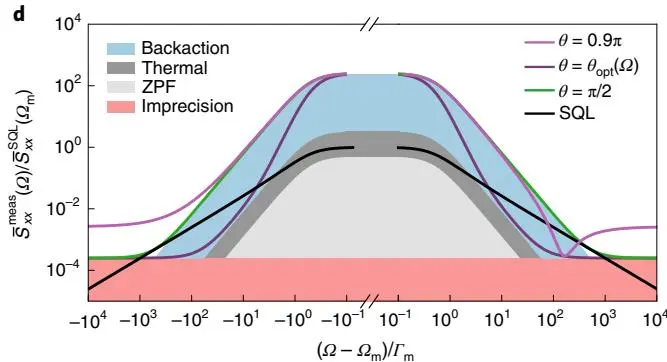
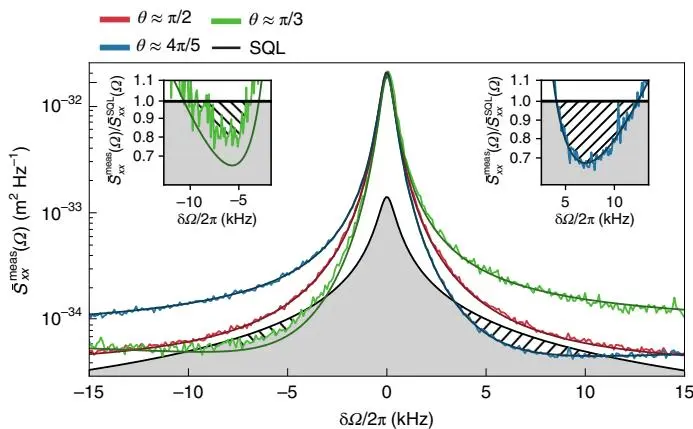
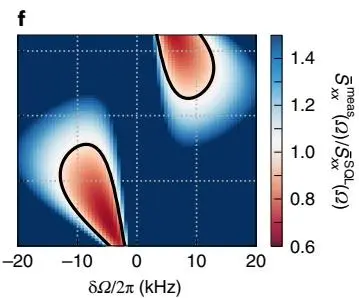
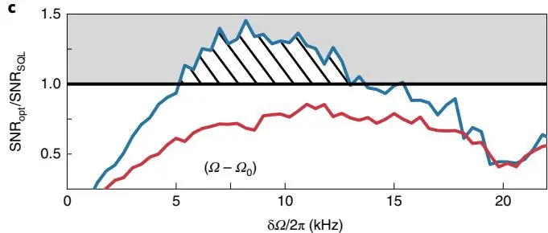

# Continuous force and displacement measurement below the standard quantum limit
## 低于标准量子极限的连续力与位移测量

**D. Mason, J. Chen, M. Rossi, Y. Tsaturyan, A. Schliesser**

Niels Bohr Institute, University of Copenhagen

*Nature Physics* **15**, 745–749 (2019)

## 摘要

量子力学规定，物理测量的精度必须始终满足某些噪声约束。对干涉位移测量，这些限制施加了**标准量子极限（SQL）**，最优地平衡测量精度与其不受欢迎的反作用 [1]。要超越此极限，必须设计更复杂的测量技术——要么「规避」测量反作用 [2]，要么在探测器处巧妙消除不受欢迎的噪声 [3,4]。SQL 确立半个世纪以来，从 LIGO [5] 到超冷原子 [6]、纳米机械器件 [7,8] 的系统都把位移测量推向此极限，多种亚 SQL 技术在原理验证实验中被测试 [9–13]。**然而迄今，没有实验系统成功演示了含全部相关噪声源（热、反作用、不精确）的干涉位移测量灵敏度低于 SQL。** 本文利用超高相干性光机械系统中的强量子关联，演示共振外力与位移灵敏度达到**低于 SQL 1.5 dB**。这达成了机械量子传感中的杰出目标，进一步增强用这类器件做最先进力传感应用的前景。

---

## 背景与动机

### SQL 的推导

SQL 可通过分析理想干涉位移测量中量子噪声源的简单论证得出 [1,14–16]。测量的前提是把物体位置（如谐振束缚的镜）耦合到相干光场的相位。该相位的不确定度随相干场强度反比缩放（光学场的海森堡不确定关系）。此**不精确噪声（散粒噪声）**构成有效位移噪声 $\hat{x}_{\mathrm{imp}}$，谱密度 [15,17]

$$
\bar{S}_{xx}^{\mathrm{imp}} = \frac{x_{\mathrm{zpf}}^2}{4\Gamma_{\mathrm{meas}}}, \tag{1}
$$

$\Gamma_{\mathrm{meas}}$ 为表征相互作用强度的测量率 [17]，$x_{\mathrm{zpf}} = \sqrt{\hbar/2m\Omega_m}$ 为振子零点涨落的 rms 幅度。

除不精确噪声外，还有辐射压力涨落（$\hat{F}_{\mathrm{qba}}$）形式的反作用，正比于测量强度：

$$
\bar{S}_{FF}^{\mathrm{qba}} = \hbar^2 x_{\mathrm{zpf}}^{-2}\Gamma_{\mathrm{meas}}. \tag{2}
$$

通过机械灵敏度 $\chi_m(\Omega) = m^{-1}(\Omega_m^2 - \Omega^2 - i\Gamma_m\Omega)^{-1}$（$\Gamma_m$ 为机械能耗散率），产生位移涨落，测量过程添加的总位移噪声

$$
\bar{S}_{xx}^{\mathrm{add}}(\Omega) = \bar{S}_{xx}^{\mathrm{imp}} + |\chi_m(\Omega)|^2 \bar{S}_{FF}^{\mathrm{qba}}(\Omega). \tag{3}
$$


这两项随测量强度的反向缩放，正是位移测量中不精确与反作用的基本权衡。对测量强度求最小，得最小添加噪声出现在 $\Gamma_{\mathrm{meas}}^{\mathrm{opt}}(\Omega) = x_{\mathrm{zpf}}^2(2\hbar|\chi_m(\Omega)|)^{-1}$ 处（此时两项相等），最小添加噪声即 **SQL**：

$$
\bar{S}_{xx}^{\mathrm{SQL}}(\Omega) \equiv \min \bar{S}_{xx}^{\mathrm{add}}(\Omega) = \hbar|\chi_m(\Omega)|. \tag{4}
$$


添加的不精确与反作用噪声叠加在振子本征运动 $\bar{S}_{xx}^{\mathrm{int}}$（零点运动 + 热运动）上：

$$
\bar{S}_{xx}^{\mathrm{meas}}(\Omega) = \bar{S}_{xx}^{\mathrm{int}}(\Omega) + \bar{S}_{xx}^{\mathrm{add}}(\Omega). \tag{5}
$$

图 1d 说明各贡献。**不可忽略的热运动阻止在机械共振上做 SQL 测量**——光机械系统中逼近 SQL 的进展多依赖先用低温 [7,9] 降低热运动。或者，若量子反作用噪声主导热噪声（图 1d），则存在共振外频率仍可达 SQL。最近最接近 SQL 的绝对逼近正是这样实现的 [8]。这类宽带、共振外位移测量对许多实际传感应用（含引力波探测）相关。

图 1：超越 SQL 的测量。(a) 实验装置示意。(b) 关注机械模的测得位移图样。(c) 归一化到散粒噪声的位移谱，展示 ponderomotive 挤压。蓝为标准相位测量（$\theta=\pi/2$），红为散粒噪声测量，紫为旋转正交测量（$\theta\approx0.16\pi$），可见强关联。(d) 干涉位移测量的卡通示意。阴影表不同噪声贡献，实线为不同测量条件下的总谱：标准相位测量（绿）、固定非标准正交测量（浅紫）、频率依赖（variational）正交测量（深紫）。黑线为 SQL。

### SQL 不是基本量子极限

SQL 作为上述公式呈现的下限，并非基本量子极限。有多种修改测量前提以实现低于 SQL 灵敏度的途径 [18,19]：

- **量子非破坏（QND）/ 反作用规避（BAE）测量** [2]：测量与系统哈密顿量对易的可观测量。耦合自由质量速度 [20] 或单一机械正交 [21,22] 的器件满足此条件，后者已在多个光机械系统中演示 [10–12]，但过量不精确噪声阻止低于 SQL。多模系统中复合正交的 BAE 也在光机械 [23] 与混合自旋-机械 [24] 系统中探索。
- **修改机械灵敏度** [25]（如「光弹簧」）：超越裸谐振器 SQL（但在移位频率处建立新 SQL）。
- **利用量子关联**：本文所用方法。

### 本文方法：利用量子关联（ponderomotive 挤压）

SQL 的推导假设反作用与不精确噪声**不相关**（$\bar{S}_{xF}(\Omega) = 0$）。无此假设，式 (3) 变为

$$
\bar{S}_{xx}^{\mathrm{add}}(\Omega) = \bar{S}_{xx}^{\mathrm{imp}} + |\chi_m(\Omega)|^2 \bar{S}_{FF}^{\mathrm{qba}}(\Omega) + 2\mathrm{Re}[\chi_m(\Omega)^*\bar{S}_{xF}(\Omega)]. \tag{6}
$$

**通过利用测量谱中的关联**，可让量子不精确与反作用噪声相消干涉。可通过修改输入光的关联 [3,26] 或利用输出光中的光机械诱导关联 [4] 实现。这些关联在反作用主导的运动（来自光场幅度涨落）被印在同一光场相位涨落上时存在——即 ponderomotive 挤压 [27–29]。要看到这些关联，只需测量光场的某混合正交（含幅度与相位涨落），而非仅相位测量。测量非光学相位的正交会牺牲部分机械信号（增大不精确），但对某些正交，噪声降低在某频带内胜过信号损失（图 1d）。


相比标准相位测量（正交角 $\theta = \pi/2$），检测角 $\theta = 0.9\pi$ 在某特定频率附近导致反作用与不精确的相消干涉。完整的「variational」测量设想以频率依赖方式滤波信号，测量频率依赖的光学正交（$\theta_{\mathrm{opt}}(\Omega)$），使干涉在共振上下宽频带内发生。该位移灵敏度通过 $\chi_m$ 直接转化为力灵敏度。

**关键要求**：高效光学检测 + 强反作用。任何光损耗都用不相关真空噪声替代，破坏所需干涉。


近期工作 [9] 对 variational 位移测量做了广泛理论与实验研究，但过量不精确噪声把灵敏度限在 SQL 以上 0.9 dB。BAE 与 variational 技术的原理虽已演示，但实验迄今未达到这些技术的初衷——干涉力与位移测量超越 SQL 仍是开放挑战 [30]。**本文正是用允许强、高效量子测量的光机械系统应对此挑战。**

---

## 器件：超高相干性光机械膜

机械系统基于 3.6 mm × 3.6 mm × 20 nm $\mathrm{Si_3N_4}$ 膜，图案化为蜂巢晶格孔形成声子晶体（PnC），约 1 MHz 处有声学带隙。膜中心缺陷支撑若干局域面外振动模，频率在带隙内。**PnC 屏蔽这些模的辐射损耗，同时提供「软夹紧」显著降低机械损耗** [31]。

| 参数 | 数值 |
|------|------|
| 膜尺寸 | 3.6 mm × 3.6 mm × 20 nm |
| $\Omega_m/2\pi$ | 1.135 MHz |
| $Q = \Omega_m/\Gamma_m$ | $\mathbf{1.03\times10^9}$ @ 10 K |
| $g_0/2\pi$（真空耦合）| 120.7 Hz |
| 腔线宽 $\kappa/2\pi$ | 16.2 MHz |
| 温度 | 10 K |
| $\eta_{\mathrm{det}}$（检测效率）| 77% |
| 透射过耦合 | 95% 光子出射到探测器 |

膜运动色散耦合到 Fabry-Pérot 腔模（线宽 $\kappa/2\pi = 16.2$ MHz），真空耦合率 $g_0/2\pi = 120.7$ Hz。近共振驱动腔模，填充平均占据 $\bar{n}_{\mathrm{cav}}$ 的相干场，场增强线性化耦合 $g = g_0\sqrt{\bar{n}_{\mathrm{cav}}}$。腔在透射中高度过耦合，95% 腔内光子出射到探测器。通过平衡零差检测器监测输出光束的光学正交涨落，可测任意正交角 $\theta$。优化输出光学与零差检测，达总检测效率 $\eta_{\mathrm{det}} = 77\%$。

除共振探针光束，还用辅助激光（寻址独立腔模）做边带冷却 + 带外膜模的反馈冷却（稳定用 [8]）。该辅助光束也对关注模施加少量量子反作用。通过重定义探针所见的热浴计二者：$\Gamma_m/(2\pi) \approx 32$ Hz，$\bar{n}_{\mathrm{th}} \approx 8$。

---

## 主要结果

### Ponderomotive 挤压：关联的证据

要利用探针场中的宽带关联，量子反作用必须是驱动谐振器的主导力噪声源（而非热浴 $\bar{n}_{\mathrm{th}}$）。定量上对应达到「量子合作性」$C_q = \Gamma_{\mathrm{qba}}/\gamma \geq 1$（$\gamma$ 为振子热退相干率，$\Gamma_{\mathrm{qba}} = 4g^2/\kappa$ 为量子反作用退相干率）。此外检测效率需接近 1。

简单的 ponderomotive 挤压实验（图 1c）证明两者都满足。用 $C_q = 20.7$ 探测运动，检测 $\theta = 0.16\pi$ 的零差正交。强关联产生观测到的非对称 Fano 共振。

### 位移灵敏度低于 SQL

图 2 显示 $C_q = 20.7$ 下三条位移谱：一条「标准」（$\theta\approx\pi/2$），两条共振上下位移灵敏度优化的零差角。

图 2：低于 SQL 的位移测量。不同零差接收器正交角下校准的位移谱。红为常规（$\theta\approx\pi/2$）测量，蓝/绿为共振上下灵敏度增强的正交。实黑线为有效振子的 SQL。插图：共振上下影线区放大，噪声低于 SQL。

关联使两区域都能达亚 SQL 灵敏度，最佳灵敏度在 $\Omega - \Omega_m^{\mathrm{eff}} = 2\pi\times5.9$ kHz。**此处含热与零点涨落在内的总噪声比 SQL 低 1.5 dB**。实线为标准光机械输入输出理论 [15] 的预测，三个参数（$g, \theta$ 与探针激光-腔失谐 $\Delta$）拟合数据——用以计系统变 $\theta$ 时腔内功率与激光失谐的小漂移。

### 宽带亚 SQL 区

图 3 显示不同正交角（$\theta\in[0.1\pi, 0.9\pi]$）、$C_q = \{5.3, 10.2, 20.7\}$ 下的归一化到 SQL 的谱。

图 3：开启亚 SQL 灵敏度的宽带区。(a,c,e) $C_q = \{5.3, 10.2, 20.7\}$ 下机械共振频率附近随测量正交 $\theta$ 变化的校准位移谱。谱除以 SQL，红区表亚 SQL 灵敏度。黑等高线为 $\bar{S}_{xx}^{\mathrm{meas}} = \bar{S}_{xx}^{\mathrm{SQL}}$。(b,d,f) 独立理论模型预测。$C_q$ 增大时亚 SQL 性能带宽改善。

**亚 SQL 性能带宽随 $C_q$ 增大而改善**。理论谱基于纯独立参数，数据与模型在整个参数空间广泛一致。注意共振低频侧测量性能一般退化，归因于额外腔噪声（可能来自腔镜衬底的热运动）。

### 力传感：信噪比超越 SQL

敏感位移测量是敏感力测量的基础。通过调制辅助激光幅度，对机械谐振器施加相干经典辐射压力力，用零差检测测响应。图 4 显示原始电压单位与校准力谱后的信号与噪声测量。

图 4：超越 SQL 的量子增强力传感。(a) $\theta\approx\pi/2$（红）与 $\theta\approx4\pi/5$（蓝）的原始光电流谱（深线）与驱动响应（浅线）。$\delta\Omega/2\pi = 8.2$ kHz 处响应高亮。(b) 同噪声谱与驱动响应，校准为力噪声单位。(c) SNR，相对 $\bar{S}_{xx}^{\mathrm{add}} = \bar{S}_{xx}^{\mathrm{SQL}}$ 测量的 SNR 归一化。

$\theta\approx\pi/2$ 与 $\theta\approx4\pi/5$ 之间，$\Omega_0 - \Omega_{\mathrm{eff}} = 2\pi\times8.2$ kHz 信号降 1.9 dB（运动转换降低），而噪声降 5.2 dB——信号转换与噪声关联的 $\theta$ 依赖竞争。校准音可计降低的信号转换（图 4b 两配置信号相等），但仍保持降低的噪声。SNR（图 4c，归一化到 SQL 测量的 SNR）显示 variational 测量在 8 kHz 带宽内超过 SQL 允许值。**亚 SQL 技术下，$\Omega_0$ 处力灵敏度达 $(11.2\,\mathrm{aN}/\sqrt{\text{Hz}})^2$**——在优化力传感的低质量版本中可显著改善。

---

## 结论与展望

结果表明，即便是宏观物体的位置，现在也能以达量子力学对常规测量所加极限的灵敏度探测。通过更好利用测量的量子资源（本文为强关联），可超越这些极限。该系统可能的强量子相互作用也允许探索类似量子增强测量技术，包括外差检测 [33]、单正交测量 [17]。测量基量子反馈的极限（本系统近期演示 [8]）也可通过 variational 技术改善 [34]。增强的力灵敏度可直接用于最先进的力传感应用 [35]，开启精密测量的新区域。

---

## 参考文献


学术论文的参考文献条目按国际惯例保留原文。以下为本文引用的主要文献。


1. Braginsky, *J. Exp. Teor. Phys.* **26**, 831 (1968). — **宏观振子弱扰动检测的经典与量子限制，SQL 的奠基。**
2. Braginsky, Vorontsov, Thorne, *Science* **209**, 547 (1980). — **量子非破坏测量。**
3. Unruh, in *Quantum Optics, Experimental Gravitation, and Measurement Theory* (1982). — 输入光关联的 variational 测量。
4. Vyatchanin, Zubova, *Phys. Lett. A* **201**, 269 (1995). — **力的量子 variational 测量（输出光关联）。**
5. LIGO Scientific Collaboration, *Nat. Phys.* (2011). — **引力波观测台运行在量子散粒噪声极限以上。**
6. Schreppler et al., *Science* **344**, 1486 (2014). — 光学测力近 SQL。
7. LaHaye, Buu, Camarota, Schwab, *Science* **304**, 74 (2004). — **纳米机械谐振器逼近量子极限（注：与 LaHaye 2009 不同作者组）。**
8. Rossi, Mason, Chen, Tsaturyan, Schliesser, *Nature* **563**, 53 (2018). — **机械运动的测量基量子控制（本系统前作）。**
9. Kampel et al., *Phys. Rev. X* **7**, 021008 (2017). — **用量子关联改善宽带位移检测（variational 测量的近期实验，限 SQL 以上 0.9 dB）。**
10. Suh et al., *Science* **344**, 1262 (2014). — 机械检测并规避微波场量子涨落（BAE）。
11. Wollman et al., *Science* **349**, 952 (2015). — 机械谐振器的量子运动压缩。
12. Lecocq et al., *Phys. Rev. X* **5**, 041037 (2015). — 宏观物体非经典态的量子非破坏测量。
14. Clerk, Devoret, Girvin, Marquardt, Schoelkopf, *Rev. Mod. Phys.* **82**, 1155 (2010). — **量子噪声、测量、放大权威综述。**
15. Aspelmeyer, Kippenberg, Marquardt, *Rev. Mod. Phys.* **86**, 1391 (2014). — **腔光机械综述。**
26. Caves, *Phys. Rev. D* **23**, 1693 (1981). — **干涉仪中的量子力学噪声（挤压光输入的奠基）。**
29. Purdy et al., *Phys. Rev. X* **3**, 031012 (2013). — 强光机械光挤压。
30. Giovannetti, Lloyd, Maccone, *Science* **306**, 1330 (2004). — **量子增强测量：超越标准量子极限（综述）。**
31. Tsaturyan, Barg, Polzik, Schliesser, *Nat. Nanotechnol.* **12**, 776 (2017). — **通过软夹紧与耗散稀释的超相干纳米机械谐振器（本文器件的器件论文）。**

---

## 阅读笔记

### 一句话概括

用一片 $Q = 10^9$ 的「软夹紧」声子晶体 $\mathrm{Si_3N_4}$ 膜（1.135 MHz）+ Fabry-Pérot 腔（$g_0/2\pi = 120.7$ Hz，检测效率 77%），在量子合作性 $C_q = 20.7$（反作用主导）下，通过零差检测测量非标准光学正交（ponderomotive 挤压方向 $\theta \approx 0.9\pi$），让量子反作用与不精确噪声相消干涉——首次实现含热+反作用+不精确全部噪声的干涉位移/力测量灵敏度**低于 SQL 1.5 dB**。这是机械量子传感半个世纪以来的开放目标。

### 核心论证链

1. **SQL 假设反作用与不精确不相关**：标准推导式 (3) 默认 $\bar{S}_{xF} = 0$。若有关联，式 (6) 多出交叉项 $2\mathrm{Re}[\chi_m^*\bar{S}_{xF}]$，可为负 → 降低总噪声。
2. **关联来自 ponderomotive 挤压**：辐射压力涨落（幅度）驱动振子 → 振子运动调制光场相位 → 同一光场的幅度与相位涨落现在相关。测混合正交（非纯相位）即可看到。
3. **器件要三高**：高 $Q$（$10^9$，软夹紧 [31]）→ 热噪声小；高 $g_0\sqrt{n}$（$C_q = 20.7$）→ 反作用主导热；高检测效率（77%）→ 关联不被真空噪声稀释。
4. **零差角调谐**：$\theta = \pi/2$ 标准相位测量无关联收益；$\theta \approx 0.9\pi$ 在共振附近特定频率让反作用-不精确相消干涉 → 亚 SQL（图 2）。
5. **$C_q$ 越大，亚 SQL 带宽越宽**：反作用越强，可利用关联的频率范围越大（图 3）。

### 关键物理：ponderomotive 挤压与 variational 测量的区别

两者都利用光机械关联，但实现方式不同：

| | ponderomotive 挤压 | variational 测量（本文）|
|---|---|---|
| 关联来源 | 输出光（振子运动调制相位）| 输出光（同上）|
| 操作 | 测单一非标准正交 $\theta$ | 测频率依赖正交 $\theta(\Omega)$ |
| 效果 | 在某频率挤压光场正交 | 在宽带内亚 SQL |
| 本文实现 | 图 1c（证明关联存在）| 图 2-3（亚 SQL 灵敏度）|

**本文实际做了「固定 $\theta$ 的 variational 测量」**——非完整 variational（需频率依赖 $\theta$），但在共振上下各选一个 $\theta$ 覆盖两个亚 SQL 区。完整 variational 需滤波腔（频率依赖正交旋转），是后续工作。

### SQL 不是「真正的」量子极限

这是本文最重要的概念点。SQL 式 (4) 是**常规干涉测量**（测光学相位、反作用与不独立不相关）的下限，不是量子力学的基本极限。量子力学允许：

- **QND/BAE**：测与哈密顿量对易的量（如单一机械正交 $X_1$），反作用全去正交 $X_2$，被测正交无反作用 [2]。
- **关联利用（本文）**：让反作用与不精确相消干涉。
- ** squeezed 输入** [26]：用压缩态光注入，降低相位噪声（LIGO 已用 [5]）。

这些都能低于 SQL，代价是技术复杂度。本文是**首次在机械系统中、含全部噪声、连续波下**实现亚 SQL——之前要么缺反作用主导（热噪声太大），要么缺检测效率（关联被稀释）。

### 三个「高」的协同

本文能成的关键是三个「高」同时满足，缺一不可：

| 要求 | 本文达成的手段 | 缺失的后果 |
|------|---------------|-----------|
| **高 $Q$**（低热噪声）| 软夹紧声子晶体 [31]：$Q = 10^9$ @ 10 K | 热噪声掩盖反作用 → 看不到关联 |
| **高量子合作性 $C_q \geq 1$**（反作用主导）| 高 $g_0$ + 大 $\bar{n}_{\mathrm{cav}}$：$C_q = 20.7$ | 反作用弱 → 关联弱 → 亚 SQL 区窄 |
| **高检测效率 $\eta \approx 1$** | 95% 过耦合 + 优化零差：$\eta_{\mathrm{det}} = 77\%$ | 损耗注入真空噪声 → 破坏关联相消 |

之前的工作 [9]（variational 测量，SQL 以上 0.9 dB）就卡在检测效率——关联存在但被稀释。本文的 77% 是关键突破（过耦合腔 + 低损光学）。

### 批判性思考

**1. 1.5 dB 是「刚破」SQL，不是「远低于」。** 1.5 dB ≈ 1.41 倍噪声功率降低，是技术性突破（首次低于），但离理论极限（理想 variational 可任意低）远。主要瓶颈是检测效率 77%（理想 100%）+ 共振低频侧的额外腔噪声（镜衬底热运动）。作者诚实指出这两点。1.5 dB 的「首次」意义重大，但作为力传感应用，这个增益相对其他改进（如降质量提 $g_0$）是边际的。

**2. 亚 SQL 区是窄带、共振外的。** 本文亚 SQL 灵敏度只在共振附近几 kHz（图 2 插图、图 3 红区），不是宽带。对引力波探测（需宽频 10-1000 Hz 亚 SQL），这种窄带性不直接适用——需要完整 variational（频率依赖 $\theta$，即滤波腔）。LIGO 的 squeezed 光注入 [5] 是另一条路线（输入端挤压），在宽频带有效。本文方法更适合窄带力传感（如单自旋 MRFM [35]）。

**3. $Q = 10^9$ @ 10 K 是「软夹紧」的功劳，但带代价。** 软夹紧 [31] 通过声子晶体带隙抑制辐射损耗 + 降低夹紧点应力集中，达 $Q = 10^9$。但代价是器件大（3.6 mm 膜）+ 模式非局域化（整个膜参与振动）→ $g_0$ 小（120.7 Hz）。要用大 $\bar{n}_{\mathrm{cav}}$ 补偿 $g_0$ 才达 $C_q = 20.7$。这与 Wilson 2015（本图书馆笔记）的纳米梁（小质量、大 $g_0 = 20$ kHz）是相反取舍。两种路线各有优劣：本文高 $Q$ 低 $g_0$，Wilson 低 $Q$ 高 $g_0$。

**4. 力灵敏度 $(11.2\,\mathrm{aN}/\sqrt{\text{Hz}})^2$ 的实际意义。** 11.2 aN/√Hz 是 impressive 的数字（阿牛顿），但作者指出「低质量版本可显著改善」。本器件质量大（整片膜），力灵敏度受限。真正做单自旋 MRFM [35] 或表面力测量需要 pg 以下质量 + 高 $g_0$——这与本文的高 $Q$ 大膜路线冲突。所以本文的力传感是「原理验证」，不是「实用传感」。

**5. 10 K 运行的微妙。** 本文在 10 K 运行（非 mK），$n_{\mathrm{th}} \approx 8$（经边带冷却）。这看似不低，但因 $Q = 10^9$，$\Gamma_m$ 极小，热退相干率 $\gamma = \Gamma_m n_{\mathrm{th}}$ 仍小到被 $\Gamma_{\mathrm{qba}}$ 主导（$C_q = 20.7$）。这展示了「高 $Q$ 比 $n_{\mathrm{th}}$ 更重要」——$Q$ 决定 $\Gamma_m$，$\Gamma_m$ 决定热退相干率。但 $n_{\mathrm{th}} = 8$ 意味着零点运动只占 1/9 的总运动——要在共振上做 SQL 测量仍需进一步冷却（这就是为何本文亚 SQL 只在共振外）。

### 局限性

- **窄带亚 SQL**：仅共振附近几 kHz，非宽带。
- **1.5 dB 增益边际**：检测效率 77% + 额外腔噪声限制。
- **大质量低 $g_0$**：力灵敏度受限，实用传感需小质量版。
- **非完整 variational**：固定 $\theta$，非频率依赖。
- **共振低频侧退化**：镜衬底热运动。
- **10 K 运行**：$n_{\mathrm{th}} \approx 8$，共振上仍非 SQL。

### 关键公式速查

| 公式 | 含义 | 出处 |
|------|------|------|
| $\bar{S}_{xx}^{\mathrm{imp}} = x_{\mathrm{zpf}}^2/(4\Gamma_{\mathrm{meas}})$ | 不精确噪声（散粒）| 式 (1) |
| $\bar{S}_{FF}^{\mathrm{qba}} = \hbar^2 x_{\mathrm{zpf}}^{-2}\Gamma_{\mathrm{meas}}$ | 量子反作用力噪声 | 式 (2) |
| $\bar{S}_{xx}^{\mathrm{add}} = \bar{S}_{xx}^{\mathrm{imp}} + |\chi_m|^2 \bar{S}_{FF}^{\mathrm{qba}}$（无关联）| 测量添加噪声（标准）| 式 (3) |
| $\bar{S}_{xx}^{\mathrm{SQL}} = \hbar|\chi_m(\Omega)|$ | 标准量子极限 | 式 (4) |
| $\bar{S}_{xx}^{\mathrm{add}} = \bar{S}_{xx}^{\mathrm{imp}} + |\chi_m|^2 \bar{S}_{FF}^{\mathrm{qba}} + 2\mathrm{Re}[\chi_m^*\bar{S}_{xF}]$（含关联）| 测量添加噪声（variational）| 式 (6) |
| $C_q = \Gamma_{\mathrm{qba}}/\gamma = 4g^2/(\kappa\gamma)$ | 量子合作性（反作用/热退相干）| 正文 |

### 延伸阅读

- **Braginsky (1968) [1]** — SQL 的奠基论文，理解为何有此极限。
- **Caves (1981) [26]** — 干涉仪中的量子噪声， squeezed 光输入超越 SQL 的奠基（LIGO 路线）。
- **Clerk et al. (2010) [14]** — *Rev. Mod. Phys.* 量子噪声、测量、放大综述，SQL、反作用、不精确的权威。
- **Aspelmeyer, Kippenberg, Marquardt (2014) [15]** — *Rev. Mod. Phys.* 腔光机械综述。
- **Tsaturyan et al. (2017) [31]** — 软夹紧超相干纳米机械谐振器，本文器件的器件论文。
- **Rossi et al. (2018) [8]** — 机械运动的测量基量子控制，本系统前作。
- **Kampel et al. (2017) [9]** — variational 测量的近期实验（SQL 以上 0.9 dB），本文的直接对照——展示检测效率的重要性。
- **Giovannetti et al. (2004) [30]** — *Science* 量子增强测量综述，超越 SQL 各技术的总览。
- **本图书馆相关笔记**：
  - **Wilson et al. (2015)** — measurement-control-thermal-decoherence，反馈冷却 + 海森堡极限接近，本文亚 SQL 测量的对照（不同路线）。
  - **Teufel et al. (2011)** — sideband-cooling-ground-state，边带冷却 + 海森堡极限，本文机械振子的量子控制前作。

### 术语对照

| 中文 | 英文 | 含义 |
|------|------|------|
| 标准量子极限 | standard quantum limit (SQL) | 常规干涉测量的最优精度（不精确=反作用）|
| 量子非破坏测量 | quantum non-demolition (QND) | 测与哈密顿量对易的量，反作用不去被测正交 |
| 反作用规避 | back-action evasion (BAE) | QND 的实现，测单一正交规避反作用 [2] |
| variational 测量 | variational measurement | 测频率依赖正交，宽带亚 SQL [4] |
| 不精确噪声 | imprecision noise $\bar{S}_{xx}^{\mathrm{imp}}$ | 散粒噪声导致的位移不确定 |
| 量子反作用 | quantum back-action $\bar{S}_{FF}^{\mathrm{qba}}$ | 辐射压力涨落导致的扰动力 |
| 测量率 | measurement rate $\Gamma_{\mathrm{meas}}$ | 测量强度的特征速率 |
| 量子合作性 | quantum cooperativity $C_q$ | $\Gamma_{\mathrm{qba}}/\gamma$，反作用/热退相干 |
| 真空耦合率 | vacuum coupling rate $g_0$ | 单光子-单声子耦合 |
| 线性化耦合 | linearized coupling $g = g_0\sqrt{\bar{n}}$ | 场增强的光机械耦合 |
| 机械灵敏度 | mechanical susceptibility $\chi_m(\Omega)$ | 振子对力的频率响应 |
| 零点涨落 | zero-point fluctuations $x_{\mathrm{zpf}}$ | 量子基态的位移涨落 |
| ponderomotive 挤压 | ponderomotive squeezing | 辐射压力关联导致的光场正交压缩 [27–29] |
| 混合正交 | mixed quadrature | 含幅度+相位的光场正交（$\theta\neq\pi/2$）|
| 正交角 | quadrature angle $\theta$ | 测量的光学正交方向 |
| Fano 共振 | Fano resonance | 关联导致的非对称线型 |
| 相消干涉 | destructive interference | 反作用与不精确噪声相消 |
| 软夹紧 | soft clamping | 声子晶体降低夹紧点损耗 [31] |
| 声子晶体 | phononic crystal (PnC) | 周期孔结构形成声学带隙 |
| 耗散稀释 | dissipation dilution | 高应力膜等效 $Q$ 的提升机制 |
| 边带冷却 | sideband cooling | 红失谐驱动冷却机械模 |
| 检测效率 | detection efficiency $\eta_{\mathrm{det}}$ | 收集到探测器的光子比例 |
| 过耦合 | over-coupled | 腔主要通过有意耦合损耗（$\kappa_{\mathrm{ex}} > \kappa_0$）|
| 力灵敏度 | force sensitivity | 每√Hz 可分辨的最小力（aN/√Hz）|
| 输入输出理论 | input-output theory | 腔-传输线-振子耦合的标准理论 |
