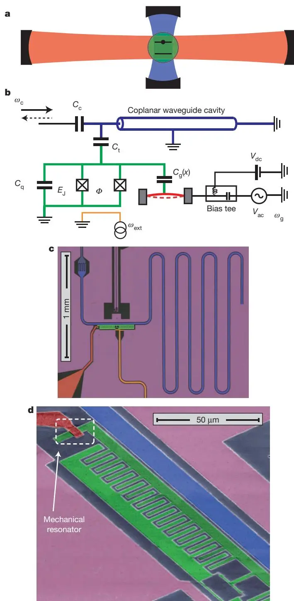
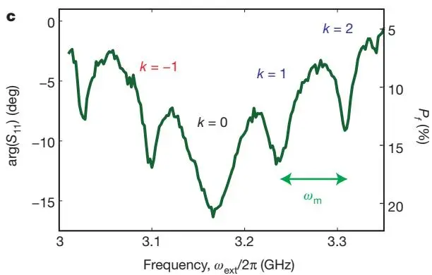
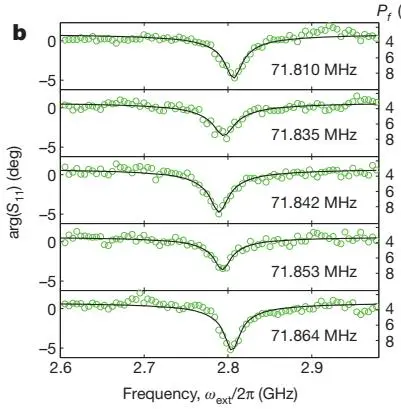
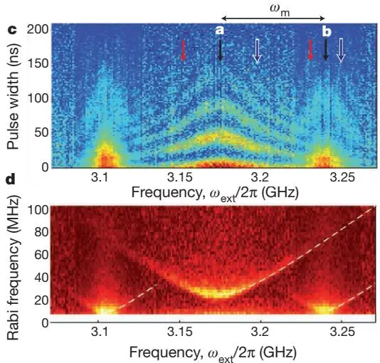

# Hybrid Circuit Cavity Quantum Electrodynamics with a Micromechanical Resonator
## 混合电路腔量子电动力学与微机械谐振器

**J.-M. Pirkkalainen, S. U. Cho, J. Li, G. S. Paraoanu, P. J. Hakonen, M. A. Sillanpää**

O.V. Lounasmaa Laboratory, Aalto University

*Nature* **494**, 211–216 (2013)

## 摘要

具有本质上不同自由度的混合量子系统，在许多物理现象中扮演关键角色。熟知的例子包括腔量子电动力学 [1]、囚禁离子 [2]、固体中的电子与声子。这些系统中，强耦合使各组分失去个体性、形成缀饰态——一种集体动力学形式。混合系统既有基本重要性，也有实际应用，特别是在新兴的量子信息控制领域。一个有前景的方向是把长寿命原子态 [2,3] 与超导腔和量子比特 [4,5] 中可访问的电自由度结合。**本文把电路腔量子电动力学 [6,7] 与声子整合。** 我们的超导 transmon 量子比特 [8]（由隧穿结和电容组成）除了耦合到微波腔，还与微机械谐振器中的声子模相互作用，因而像一个耦合到两个不同腔的原子。我们测量了**声子 Stark 频移**，以及量子比特谱线**劈裂为运动边带**（缀饰电机械态间的跃迁）。在时域，我们观测到**量子比特激发到声子的相干转换——边带 Rabi 振荡**。这是一个具有量子接口潜力的模型系统，可实现量子信息在长寿命声子态中的存储、与光子的耦合，或研究近经典极限的强耦合量子系统。

---

## 背景与动机

基于约瑟夫森结的超导量子比特 [5] 为较大系统中的量子力学提供了无与伦比的试验场，同时也是量子信息处理的有前景实现。近期 phase [9] 与 transmon [10–12] 量子比特已演示基本量子算法。后者在电路腔量子电动力学（QED）框架下运作——量子比特耦合到片上 [6] 或三维微波腔 [13]。**电路腔 QED 可视为量子信息最可行的平台**，它实现了量子比特耦合与量子态非破坏测量。

接下来的挑战包括：构建把量子比特态存储/取回于长寿命量子存储器的接口、空间分离超导量子比特间的量子通信 [14]。混合量子系统对此有前景，因为原则上能组合各组分的特定优势。宏观量子比特与自旋系综的合体因后者长寿命而诱人 [15,16]，但单原子自由度层面耦合小是缺点。


微机械谐振器的量子区最近才刚达到 [17,18]。它们被提议作为约瑟夫森结量子比特的可行接口介质 [19–21]，有实现上述目标的潜力。机械声子寿命长（$Q_m/\omega_m$ 可达秒级），可做量子存储；又能通过辐射压力耦合到任意频率的光，可做微波-光转换。


此前同类实验：LaHaye 等 [22]（charge qubit + 60 MHz 梁，色散读出，无时间分辨）；O'Connell 等 [23]（6.2 GHz 压电振子，共振耦合，但因高频和特殊材料能量衰减时间短）。**本文用膜型微机械谐振器嵌入完整电路腔 QED 器件**，从而可访问电路腔 QED 的全部技术。

---

## 器件：量子比特耦合两个腔

### 概念

器件概念上类似一个光学腔 QED 系统——二能级原子耦合到两个不同频率的腔（图 1a）。超导 transmon 量子比特 [8]（电容 $C_q$、充电能 $E_C \approx e^2/2C_q$、约瑟夫森能 $E_J$）作为人工二能级系统，通过位置依赖电容 $C_g(x)$ 耦合到高度失谐的**声子腔**（悬浮铝膜，弯曲模 $\omega_m/2\pi \approx 72$ MHz，图 1d），同时通过电容耦合到近共振的**光子腔**（片上共面波导微波谐振器，频率 $\omega_c$）。

图 1：混合腔 QED 装置。(a) 一个原子（绿）耦合到两个腔的腔 QED 系统示意。光子微波谐振器（蓝），声子机械谐振器（红）。(b) 类似电机械三部分系统的电路。(c) 芯片光学照片：四分之一波微波腔、transmon 量子比特、机械谐振器及其外部控制、磁通控制线（橙）、地平面（品红）。(d) 扫描电镜显示悬浮于量子比特岛上方的 5 μm 长、4 μm 宽桥型机械谐振器（虚线框）。

### 哈密顿量

两谐振器电路腔 QED 系统的哈密顿量

$$
\begin{array}{l}
\hat{H} = \hat{H}_q + \hbar\omega_c(\hat{a}^\dagger\hat{a} + 1/2) + \hbar\omega_m(\hat{b}^\dagger\hat{b} + 1/2) \\
\quad + \hbar g_c(n_0 - \hat{n})(\hat{a}^\dagger + \hat{a}) + \hbar g_m(n_0 - \hat{n})(\hat{b}^\dagger + \hat{b}),
\end{array} \tag{1}
$$

其中 $\hat{H}_q$ 为量子比特哈密顿量，$\hat{a}, \hat{b}$ 为微波腔与机械谐振器的湮灭算符，$\hat{n}$ 为 transmon 岛上 Cooper 对数算符。量子比特-机械谐振器的电机械耦合能

$$
\hbar g_m = x_{zp} V_{dc}(dC_g/dx)(2e/C_q),
$$

其中 $x_{zp} \approx 4$ fm 为机械零点运动，$V_{dc}$ 为施加于机械谐振器的恒压，$n_0 = C_g V_{dc}/2e$ 为无量纲门电荷。量子比特-腔通过电容 $C_t$ 耦合（能量 $\hbar g_c$），允许用腔频的态依赖位移 [24]（cavity pull）做量子比特态的色散测量。

### 用 $|e\rangle, |f\rangle$ 而非 $|g\rangle, |e\rangle$

使用 transmon 的三个最低能态：基态 $|g\rangle$、第一/第二激发态 $|e\rangle, |f\rangle$。把 $|e\rangle, |f\rangle$ 作为二能级系统——这与通常涉及基态的量子比特概念略不同，但**有利，因为声子耦合在量子比特更高能级上增长**。同理，transmon 工作在相对小的 $E_J/E_C$ 比。

| 参数 | 数值 |
|------|------|
| $\omega_c/2\pi$ | 4.84 GHz |
| $g_c/2\pi$（量子比特-腔）| ~100 MHz |
| $\gamma_E/2\pi$（外线宽）| ~15 MHz |
| $\omega_m/2\pi$ | 71.842 MHz |
| $g_m/2\pi$（量子比特-机械，$V_{dc}=5$ V）| 4.5 MHz |
| $E_{J1}/2\pi, E_{J2}/2\pi$ | 4.63, 6.43 GHz |
| $E_C/2\pi$ | 318 MHz |
| $C_q$ | 61 fF |
| 温度 | 25 mK |
| $Q_m$ | 5,500 |
| $x_{zp}$ | 4 fm |

---

## 主要结果

### 声子 Stark 频移

耦合系统的量子本征态是**缀饰态**——量子比特态与机械谐振子 Fock 态 $|N_m\rangle$ 的组合。量子比特跃迁频率依赖量子数（ac Stark 频移）。作为声子诱导效应，此前通过机械谐振器间接测量过 [22]。$|e\rangle-|f\rangle$ 跃迁频率 $\omega_{e-f}$ 的声子（机械）Stark 频移在超出线性区时可算出：

$$
\frac{\Delta\omega_{e-f}}{2\pi} = -\frac{\varepsilon_{e-f}}{2}\cos(2\pi n_0)[J_0(2\pi n_x) - 1], \tag{2}
$$

其中 Bessel 函数 $J_0$ 的宗量为运动门电荷幅 $n_x = (\hbar g_m/4E_C)\sqrt{N_m}$，transmon 的电荷色散 $\varepsilon_{e-f} \approx E_C\frac{2^{4m+5}}{m!}\sqrt{2/\pi}(E_J/2E_C)^{m/2+3/4}\exp(-\sqrt{8E_J/E_C})$（此处 $m=3$）。频移先随声子数线性增长：

$$
\Delta\omega_{e-f} \approx \frac{\varepsilon_{e-f}}{2}\pi^2\cos(2\pi n_0)\left(\frac{\hbar g_m}{4E_C}\right)^2 N_m.
$$

用双音谱学研究 $|e\rangle-|f\rangle$ 跃迁。本系统中平衡时已有 $P_e \approx 25\%$ 布居于 $|e\rangle$、$P_f \approx 5\%$ 于 $|f\rangle$，故无需初始激发。激发微波（频率 $\omega_{\mathrm{ext}}$）加到 transmon 磁通线圈，$|f\rangle$ 布居增强由探测音相位 $\arg(S_{11})$ 区分。机械驱动共振时（$\omega_g/2\pi = \omega_m/2\pi = 71.842$ MHz，rms 振幅 140 fm ≈ 30 倍 $x_{zp}$，声子数 $N_m \approx 10^3$），可归因于机械 Stark 频移的 $\Delta\omega_{e-f}/2\pi = 218$ MHz（图 2b）。

图 2(c)：四个驱动幅度下，量子比特跃迁位移作为驱动频率的函数。圆点为从数据提取的 dip 中心，实线为 $Q_m = 5500$ 机械谐振器的模型响应。共振驱动下运动门电荷 $n_x$ 改变，Stark 位移在 $\omega_m$ 附近呈现特征响应。

图 2(d)：共振机械驱动下 $n_0 = 0$ 处的声子 Stark 频移高度非线性区。实线为完整数值 Floquet 建模，虚线为式 (2)。Bessel 型振荡频移与理论吻合——这是光-物质**超强耦合** [28,29] 的体现：由耦合导致的频移远超线性区，甚至超过裸机械频率。


图 2(d) 的 Bessel 振荡是耦合远超线性区的体现。理论上 $n_x \approx 1$ 时（图 2d），本征态涉及约 20 个声子 Fock 态 + 3 个最低量子比特态（幅值 0.1-0.4）——高度缀饰。这是光（微波）与物质（机械）超强耦合 [28,29] 的实验体现：耦合导致的频移超过裸机械频率。但因声子数很高（$\sim 10^3$），可用经典描述。


### 边带跃迁：量子比特-声子转换

由于量子比特与机械谐振器频率范围悬殊（GHz vs 72 MHz），不能用磁通调谐让它们共振。但**高度失谐区仍允许完全量子控制**，类比囚禁离子 [2,26,27]。相关现象是边带跃迁与量子比特跃迁频率的 Stark 频移。

可用边带跃迁在量子比特与机械谐振器间**转移量子** [26,27]。具体地，跃迁发生在耦合本征态之间（量子比特态与机械谐振子态的组合）。在 $n_x \approx 0.4$ 处，量子比特频率对 $n_0$ 不敏感，可同时消除门电荷涨落退相干与单电子涨落（详见 SM）。

### 时域：边带 Rabi 振荡

在图 3c 设定下做时间分辨测量：用变化的脉冲宽度激发微波，监测 $|f\rangle$ 布居。脉冲期间系统以 Rabi 频率 $\Omega_k$（边带 $k$）在一对缀饰态间相干演化。

图 4：电机械 Rabi 振荡。(a) 裸量子比特频率（$k=0$）附近测得的量子比特第三能级 $|f\rangle$ 布居振荡。(b) 第一蓝边带（$k=1$）附近，量子比特态与声子间的时间分辨演化，共振 Rabi 频率 $\Omega_1/2\pi \approx 9.4$ MHz。在约 50-70 ns 的第一个极小值处，量子比特（以适度保真度）从 $|e\rangle$ 翻转到 $|f\rangle$，同时机械谐振器吸收一个量子。(c) 量子比特布居振荡作为量子比特激发频率与 Rabi 脉冲宽度的函数。(d) (c) 的傅里叶变换，显示每个边带的 Rabi 频率随激发失谐增长。

图 4(a) 是裸量子比特跃迁（$k=0$）的 Rabi 振荡；图 4(b) 是第一蓝边带（$k=1$）——**这表明量子比特态可以翻转，同时从机械谐振器添加或移除一个量子**。量子比特用弱连续测量读出脉冲后的 $P_f$。改变激发微波失谐可绘制能量交换图谱（图 4c），转频域（图 4d）显示 Rabi 频率随失谐离开特定边带而增大。相干时间约 70 ns，推测由外源高频噪声（导致准粒子耗散与量子比特热布居）限制。

---

## 讨论与展望

运动边带操作使囚禁离子领域 [2,26,27] 发展的全套技术可用于工程化机械谐振器的非经典态，或多个缓慢运动的纯机械物体的长程纠缠。同时，超导量子比特连接两个不同谐振器是**量子接口的原型**：微波谐振器允许控制量子比特，机械谐振器构成微波光与机械运动间量子信息转换的构件。

**长寿命声子可用作量子存储。** 虽本文存储时间受机械谐振器热相干时间 [17] 限制（$\tau_T = Q_m/(N_m^T\omega_m) \approx 1$ ms），但近期 $Q_m \approx 10^{10}$、$\tau_T$ 达秒级 [30] 的结果令人鼓舞。这种微机械器件还可通过辐射压力耦合（天然适合膜镜）把声子转成飞行光子，实现量子通信。通过更窄真空间隙增大电机械耦合，可把光与真物质的相互作用一路推到**单声子超强区**。

---

## 方法学要点

### 器件制备

三层电子束光刻。第一层图案化除机械谐振器外的一切：铝通过阴影蒸发沉积（20、40 nm 厚，中间氧化形成约瑟夫森隧穿结）。分离桥与 transmon 岛的牺牲层用聚甲基丙烯酸甲酯（PMMA，高电子剂量下作负胶）定义。第三层定义机械谐振器。最后各向同性 $\mathrm{O}_2$ 等离子体刻蚀去除 PMMA、悬浮桥。扫描电镜观察到桥与量子比特岛间约 40-100 nm 起伏的真空间隙。

### 量子比特/机械哈密顿量（本征基）

在量子比特本征基（标准 Pauli 矩阵 $\sigma_x, \sigma_y, \sigma_z$），量子比特/机械谐振器哈密顿量形如

$$
H \approx -\frac{\omega_{e-f}}{2}\sigma_z + \omega_m(b^\dagger b + 1/2) + g_{m,z}(b^\dagger+b)\sigma_z + g_{m,x}(b^\dagger+b)\sigma_x.
$$

耦合一般含对角 $g_{m,z}$ 与横向 $g_{m,x}$ 分量。charge qubit 极限 $g_{m,z}\approx g_m \gg g_{m,x}$；transmon 极限 $g_{m,z}\ll g_{m,x}\approx g_m$。本实验 $g_{m,z}\approx g_{m,x}\approx g_m$。失谐情形下对角耦合 $g_{m,z}$ 更重要。但**在 transmon 极限，若用更窄真空间隙和/或更高直流电压把 $g_m/2\pi \gtrsim 25$ MHz，可在微秒内实现声子-光子态的量子极限转移**。

---

## 参考文献


学术论文的参考文献条目按国际惯例保留原文。以下为本文引用的主要文献。


1. Raimond, Brune, Haroche, *Rev. Mod. Phys.* **73**, 565 (2001). — **CQED 综述。**
2. Leibfried, Blatt, Monroe, Wineland, *Rev. Mod. Phys.* **75**, 281 (2003). — **囚禁离子量子动力学综述，本文边带技术的灵感来源。**
4. Nakamura, Pashkin, Tsai, *Nature* **398**, 786 (1999). — **CPB 相干控制。**
5. Clarke, Wilhelm, *Nature* **453**, 1031 (2008). — 超导量子比特综述。
6. Wallraff et al., *Nature* **431**, 162 (2004). — **circuit QED 强耦合。**
7. Chiorescu et al., *Nature* **431**, 159 (2004).
8. Koch et al., *Phys. Rev. A* **76**, 042319 (2007). — **transmon 设计（电荷绝缘量子比特）。**
17. Teufel et al., *Nature* **475**, 359 (2011). — **边带冷却到基态（本图书馆有对应笔记）。**
18. Chan et al., *Nature* **478**, 89 (2011). — 激光冷却纳米机械振子到基态。
19. Armour, Blencowe, Schwab, *Phys. Rev. Lett.* **88**, 148301 (2002). — **NEMS-CPB 纠缠退相干理论。**
22. LaHaye et al., *Nature* **459**, 960 (2009). — **纳米机械测量超导量子比特（本图书馆有对应笔记）。**
23. O'Connell et al., *Nature* **464**, 697 (2010). — **机械振子量子基态与单声子控制。**
24. Blais et al., *Phys. Rev. A* **69**, 062320 (2004). — **circuit QED 架构（cavity pull）。**
26. Monroe, Meekhof, King, Wineland, *Science* **272**, 1131 (1996). — **囚禁离子薛定谔猫态（边带技术）。**
27. Roos et al., *Phys. Rev. Lett.* **83**, 4713 (1999).
28. Niemczyk et al., *Nature Phys.* **6**, 772 (2010). — **超强耦合 circuit QED。**
30. Goryachev et al., *Appl. Phys. Lett.* **100**, 243504 (2012). — **石英 BAW 中极低损耗声子（毫开尔文）。**

---

## 阅读笔记

### 一句话概括

把一个 transmon 量子比特同时耦合到一个 4.84 GHz 微波腔和一个 72 MHz 微机械铝膜——量子比特像个「原子」同时连两个「腔」；用门电压开启电机械耦合 $g_m/2\pi = 4.5$ MHz，观测到声子 Stark 频移（甚至 Bessel 型超强耦合振荡）和边带 Rabi 振荡（量子比特 ↔ 声子的相干交换，$\Omega_1/2\pi \approx 9.4$ MHz）。这是**机械振子作为量子接口**的原型演示。

### 核心论证链

1. **器件架构**：transmon 同时耦合微波腔（$g_c/2\pi\sim 100$ MHz，色散读出）+ 机械膜（$g_m/2\pi = 4.5$ MHz，量子接口）。完整电路腔 QED 套件可用——这是相比 LaHaye 2009 [22]（无时间分辨）的关键进步。
2. **用 $|e\rangle, |f\rangle$ 而非 $|g\rangle, |e\rangle$**：声子耦合在更高 transmon 能级上更强。这是 transmon 设计的灵活运用。
3. **声子 Stark 频移**：机械驱动激发大量声子（$N_m\sim 10^3$），声子调制门电荷 → transmon 跃迁频率位移（图 2）。线性区 $\Delta\omega\propto N_m$，高幅区呈 Bessel 振荡（超强耦合特征）。
4. **边带 Rabi 振荡**：脉冲驱动量子比特到边带频率 $\omega_{e-f} + k\omega_m$，观测 $|f\rangle$ 布居随脉冲宽度的振荡——证明量子比特态与声子数的相干交换（图 4）。
5. **量子接口潜力**：蓝边带（$k=+1$）吸收声子、红边带（$k=-1$）发射声子，可在 $\mu$s 时间尺度把量子比特态转入/转出机械振子。

### 关键物理：边带跃迁为什么能转移量子？

量子比特（$\omega_{e-f}/2\pi \approx 2.8$ GHz）与机械（$\omega_m/2\pi = 72$ MHz）频率悬殊，无法直接共振。但用囚禁离子 [2,26,27] 的边带技术：驱动量子比特在 $\omega_{e-f} \pm k\omega_m$ 处，可诱发同时改变量子比特态和声子数的跃迁：

| 跃迁 | 频率 | 物理过程 |
|------|------|----------|
| 载波 $k=0$ | $\omega_{e-f}$ | 纯量子比特翻转，声子数不变 |
| 蓝边带 $k=+1$ | $\omega_{e-f}+\omega_m$ | $|e,N_m\rangle \to |f,N_m+1\rangle$：翻转 + **产生**声子（量子比特能量→声子）|
| 红边带 $k=-1$ | $\omega_{e-f}-\omega_m$ | $|e,N_m\rangle \to |f,N_m-1\rangle$：翻转 + **湮灭**声子（声子→量子比特能量）|

图 4(b) 的蓝边带 Rabi 振荡 $\Omega_1/2\pi \approx 9.4$ MHz 证明：50-70 ns 内量子比特从 $|e\rangle$ 翻到 $|f\rangle$ 同时机械吸收一个量子——这就是「量子比特激发转成声子」的相干过程。

### 超强耦合的体现：Bessel 振荡 Stark 频移

图 2(d) 的 Bessel 振荡式 (2) 是本文最反直觉的结果。在线性区，Stark 频移 $\Delta\omega\propto N_m$（小振幅）。但本文化学 $n_x \sim 1$ 时，transmon 跃迁频率对门电荷的依赖变成非线性——Bessel 函数 $J_0(2\pi n_x)$ 振荡。这相当于「**声子数太大，以至耦合强度 $g_m\sqrt{N_m}$ 与量子比特频率可比**」——本征态高度缀饰（涉及 ~20 个 Fock 态）。这是超强耦合 [28,29] 的标志：耦合频移超过裸机械频率。但因 $N_m\sim 10^3$ 极大，机械部分仍可经典描述——这是「经典振幅、量子跃迁」的有趣混合。

### 批判性思考

**1. 高声子数区，不是真正的「量子接口」。** 本文所有观测（$N_m \sim 10^3$）都在机械振子的**经典区**——所谓「声子 Stark 频移」其实是大量经典声子对量子比特的频率牵引，并非单声子层面的效应。边带 Rabi 振荡虽展示相干交换，但交换的是大量声子中的「一个」，振子始终处于高度激发态。真正的「单声子量子接口」要求 $N_m \sim 1$，本文远未达到。作者坦承「机械谐振器可经典理解」，但这削弱了「量子接口」的成色——更准确的定位是「**量子接口的经典验证**」，而非「量子接口的实现」。

**2. 相干时间 ~70 ns 太短。** 边带 Rabi 振荡衰减时间约 70 ns，远短于机械热相干时间 $\tau_T \approx 1$ ms。作者归因于「外源高频噪声（准粒子耗散 + 量子比特热布居）」。这意味着量子比特（而非机械）是瓶颈——transmon 在 $E_J/E_C$ 较小的 charge 区工作，对电荷噪声敏感（这是为增强 $g_m$ 付出的代价）。要真正做量子存储，需要 $T_2 \gg$ 转移时间，而本文 $T_2 \sim \Omega_1^{-1}$，只能勉强做一次 Rabi 翻转——存储-取回循环根本不可能。

**3. 用 $|e\rangle, |f\rangle$ 的代价。** 用第一、二激发态而非基、第一激发态，好处是 $g_m$ 更大，但坏处是 $|e\rangle, |f\rangle$ 都不是基态——平衡时 $P_e \approx 25\%, P_f \approx 5\%$ 的热布居就是明证。这意味着「量子比特」本身不在纯基态，相干操作要从热混合态出发，保真度天然受限。这是为增强耦合做的工程取舍，但牺牲了量子比特的「干净度」。

**4. $Q_m = 5500$ 偏低。** 机械品质因子 $Q_m = 5500$（$\omega_m/2\pi = 72$ MHz → $\Gamma_m \sim 13$ kHz）远低于 Teufel 2011 [17] 的 $Q_m = 3.3\times10^5$。这意味着机械振子本身衰减快（$\sim 70$ μs），即使量子比特相干性解决，机械存储时间也短。作者引用 [30]（石英 BAW，$Q_m\sim 10^{10}$）作为「机械存储潜力」的论据，但那是完全不同的材料/几何——本文的铝膜桥型振子达不到那个 $Q$。

**5. 与 LaHaye 2009 [22] 的关系。** LaHaye 用 CPB + 60 MHz 梁、色散读出、无时间分辨；本文用 transmon + 72 MHz 膜、边带 Rabi、有时间分辨。这是同一思路（量子比特 + 机械振子）的技术进步：transmon 替代 CPB（相干性更好）、完整 circuit QED 套件（色散读出 + 时间分辨）。但两者都未达单声子区——LaHaye 测的是经典频移，本文测的是大量声子中的单声子交换。真正的单声子接口要等更大 $g_m$（作者估计 $g_m/2\pi \gtrsim 25$ MHz，需更窄间隙）。

### 局限性

- **经典区**：$N_m \sim 10^3$，非单声子量子接口。
- **相干时间短**：~70 ns，受 transmon 电荷噪声限制。
- **量子比特非纯基态**：$P_e, P_f$ 热布居，保真度受限。
- **机械 $Q_m$ 低**：5500，存储时间 ~70 μs。
- **耦合偏弱**：$g_m/2\pi = 4.5$ MHz，离单声子超强区（$g_m/2\pi\gtrsim 25$ MHz）远。

### 关键公式速查

| 公式 | 含义 | 出处 |
|------|------|------|
| $\hat{H} = \hat{H}_q + \hbar\omega_c\hat{a}^\dagger\hat{a} + \hbar\omega_m\hat{b}^\dagger\hat{b} + \hbar g_c(n_0-\hat{n})(\hat{a}^\dagger+\hat{a}) + \hbar g_m(n_0-\hat{n})(\hat{b}^\dagger+\hat{b})$ | 双腔耦合哈密顿量 | 式 (1) |
| $\hbar g_m = x_{zp}V_{dc}(dC_g/dx)(2e/C_q)$ | 电机械耦合能 | 正文 |
| $\Delta\omega_{e-f}/2\pi = -\frac{\varepsilon_{e-f}}{2}\cos(2\pi n_0)[J_0(2\pi n_x) - 1]$ | 声子 Stark 频移（非线性，Bessel）| 式 (2) |
| $n_x = (\hbar g_m/4E_C)\sqrt{N_m}$ | 运动门电荷幅 | 正文 |
| $\Omega_k(\omega_{\mathrm{ext}}) = \sqrt{\Omega_k^2 + (\omega_{e-f} - \omega_{\mathrm{ext}} - k\omega_m)^2}$ | 边带 Rabi 频率（含失谐）| 图 4d |

### 延伸阅读

- **Leibfried et al. (2003) [2]** — 囚禁离子综述，本文边带跃迁/红蓝边带的灵感来源。
- **Koch et al. (2007) [8]** — transmon 设计，理解本文「电荷区 transmon」的取舍。
- **LaHaye et al. (2009) [22]** — **本图书馆有对应笔记** nanomechanical-superconducting-qubit，本文的前作（CPB + 梁，无时间分辨）。
- **Teufel et al. (2011) [17]** — **本图书馆有对应笔记** sideband-cooling-ground-state，边带冷却到基态，本文机械振子的基态制备对照。
- **O'Connell et al. (2010) [23]** — 高频压电振子 + 单声子控制，另一条路线。
- **Niemczyk et al. (2010) [28]** — 超强耦合 circuit QED，理解本文 Bessel 振荡的物理背景。
- **Goryachev et al. (2012) [30]** — 石英 BAW 极高 $Q_m$，本文「机械存储潜力」的论据。

### 术语对照

| 中文 | 英文 | 含义 |
|------|------|------|
| 混合量子系统 | hybrid quantum system | 不同自由度（量子比特+机械+腔）组合 |
| 量子接口 | quantum interface | 不同量子系统间转换量子态的器件 |
| 量子存储 | quantum memory | 长时间存储量子态的介质（声子候选）|
| transmon | transmon | 电荷绝缘的超导量子比特（$E_J/E_C\gg 1$）|
| 电荷色散 | charge dispersion $\varepsilon$ | transmon 频率对门电荷的敏感度 |
| 声子 Stark 频移 | phonon Stark shift | 声子数改变量子比特跃迁频率 |
| 缀饰态 | dressed state | 耦合系统的本征态（组分态组合）|
| 运动边带 | motional sideband | $\omega_{e-f}\pm k\omega_m$ 处的跃迁 |
| 蓝边带 | blue sideband $k=+1$ | 翻转 + 产生声子 |
| 红边带 | red sideband $k=-1$ | 翻转 + 湮灭声子（冷却）|
| 边带 Rabi 振荡 | sideband Rabi oscillation | 边带跃迁的相干布居振荡 |
| 超强耦合 | ultrastrong coupling | 耦合强度与系统频率可比 |
| Bessel 振荡 | Bessel oscillation | 强驱动下频率随幅度的振荡依赖 |
| Floquet 建模 | Floquet modelling | 周期驱动系统的数值方法 |
| cavity pull | 腔频牵引 | 量子比特态改变腔频（色散读出）|
| 门电荷 | gate charge $n_0$ | transmon 岛上的 Cooper 对偏置 |
| 运动门电荷 | motional gate charge $n_x$ | 机械运动等效的门电荷调制 |
| 零点运动 | zero-point motion $x_{zp}$ | 机械基态位移涨落（~fm）|
| Fock 态 | Fock state $|N_m\rangle$ | 确定声子数态 |
| 真空间隙 | vacuum gap | 桥与量子比特岛间的距离（40-100 nm）|
